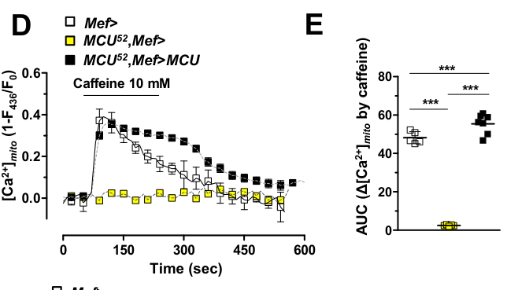

## Question

# Gene Research for Functional Annotation

## ⚠️ CRITICAL: Gene/Protein Identification Context

**BEFORE YOU BEGIN RESEARCH:** You MUST verify you are researching the CORRECT gene/protein. Gene symbols can be ambiguous, especially for less well-characterized genes from non-model organisms.

### Target Gene/Protein Identity (from UniProt):
- **UniProt Accession:** Q8IQ70
- **Protein Description:** RecName: Full=Calcium uniporter protein, mitochondrial {ECO:0000305}; AltName: Full=Mitochondrial calcium uniporter {ECO:0000303|PubMed:27568554, ECO:0000312|FlyBase:FBgn0042185}; Flags: Precursor;
- **Gene Information:** Name=MCU {ECO:0000303|PubMed:27568554, ECO:0000312|FlyBase:FBgn0042185}; ORFNames=CG18769 {ECO:0000312|FlyBase:FBgn0042185};
- **Organism (full):** Drosophila melanogaster (Fruit fly).
- **Protein Family:** Belongs to the MCU (TC 1.A.77) family. .
- **Key Domains:** MCU_C. (IPR006769); MCU_fam. (IPR039055); MCU (PF04678)

### MANDATORY VERIFICATION STEPS:

1. **Check if the gene symbol "MCU" matches the protein description above**
2. **Verify the organism is correct:** Drosophila melanogaster (Fruit fly).
3. **Check if protein family/domains align with what you find in literature**
4. **If you find literature for a DIFFERENT gene with the same or similar symbol, STOP**

### If Gene Symbol is Ambiguous or You Cannot Find Relevant Literature:

**DO NOT PROCEED WITH RESEARCH ON A DIFFERENT GENE.** Instead:
- State clearly: "The gene symbol 'MCU' is ambiguous or literature is limited for this specific protein"
- Explain what you found (e.g., "Found extensive literature on a different gene with the same symbol in a different organism")
- Describe the protein based ONLY on the UniProt information provided above
- Suggest that the protein function can be inferred from domain/family information

### Research Target:

Please provide a comprehensive research report on the gene **MCU** (gene ID: MCU, UniProt: Q8IQ70) in DROME.

The research report should be a detailed narrative explaining the function, biological processes, and localization of the gene product. Citations should be given for all claims.

You should prioritize authoritative reviews and primary scientific literature when conducting research. You can supplement
this with annotations you find in gene/protein databases, but these can be outdated or inaccurate.

We are specifically interested in the primary function of the gene - for enzymes, what reaction is catalyzed, and what is the substrate specificity? For transporters, what is the substrate? For structural proteins or adapters, what is the broader structural role? For signaling molecules, what is the role in the pathway.

We are interested in where in or outside the cell the gene product carries out its function.

We are also interested in the signaling or biochemical pathways in which the gene functions. We are less interested in broad pleiotropic effects, except where these elucidate the precise role.

Include evidence where possible. We are interested in both experimental evidence as well as inference from structure, evolution, or bioinformatic analysis. Precise studies should be prioritized over high-throughput, where available.

## Output

Question: You are an expert researcher providing comprehensive, well-cited information.

Provide detailed information focusing on:
1. Key concepts and definitions with current understanding
2. Recent developments and latest research (prioritize 2023-2024 sources)
3. Current applications and real-world implementations
4. Expert opinions and analysis from authoritative sources
5. Relevant statistics and data from recent studies

Format as a comprehensive research report with proper citations. Include URLs and publication dates where available.
Always prioritize recent, authoritative sources and provide specific citations for all major claims.

# Gene Research for Functional Annotation

## ⚠️ CRITICAL: Gene/Protein Identification Context

**BEFORE YOU BEGIN RESEARCH:** You MUST verify you are researching the CORRECT gene/protein. Gene symbols can be ambiguous, especially for less well-characterized genes from non-model organisms.

### Target Gene/Protein Identity (from UniProt):
- **UniProt Accession:** Q8IQ70
- **Protein Description:** RecName: Full=Calcium uniporter protein, mitochondrial {ECO:0000305}; AltName: Full=Mitochondrial calcium uniporter {ECO:0000303|PubMed:27568554, ECO:0000312|FlyBase:FBgn0042185}; Flags: Precursor;
- **Gene Information:** Name=MCU {ECO:0000303|PubMed:27568554, ECO:0000312|FlyBase:FBgn0042185}; ORFNames=CG18769 {ECO:0000312|FlyBase:FBgn0042185};
- **Organism (full):** Drosophila melanogaster (Fruit fly).
- **Protein Family:** Belongs to the MCU (TC 1.A.77) family. .
- **Key Domains:** MCU_C. (IPR006769); MCU_fam. (IPR039055); MCU (PF04678)

### MANDATORY VERIFICATION STEPS:

1. **Check if the gene symbol "MCU" matches the protein description above**
2. **Verify the organism is correct:** Drosophila melanogaster (Fruit fly).
3. **Check if protein family/domains align with what you find in literature**
4. **If you find literature for a DIFFERENT gene with the same or similar symbol, STOP**

### If Gene Symbol is Ambiguous or You Cannot Find Relevant Literature:

**DO NOT PROCEED WITH RESEARCH ON A DIFFERENT GENE.** Instead:
- State clearly: "The gene symbol 'MCU' is ambiguous or literature is limited for this specific protein"
- Explain what you found (e.g., "Found extensive literature on a different gene with the same symbol in a different organism")
- Describe the protein based ONLY on the UniProt information provided above
- Suggest that the protein function can be inferred from domain/family information

### Research Target:

Please provide a comprehensive research report on the gene **MCU** (gene ID: MCU, UniProt: Q8IQ70) in DROME.

The research report should be a detailed narrative explaining the function, biological processes, and localization of the gene product. Citations should be given for all claims.

You should prioritize authoritative reviews and primary scientific literature when conducting research. You can supplement
this with annotations you find in gene/protein databases, but these can be outdated or inaccurate.

We are specifically interested in the primary function of the gene - for enzymes, what reaction is catalyzed, and what is the substrate specificity? For transporters, what is the substrate? For structural proteins or adapters, what is the broader structural role? For signaling molecules, what is the role in the pathway.

We are interested in where in or outside the cell the gene product carries out its function.

We are also interested in the signaling or biochemical pathways in which the gene functions. We are less interested in broad pleiotropic effects, except where these elucidate the precise role.

Include evidence where possible. We are interested in both experimental evidence as well as inference from structure, evolution, or bioinformatic analysis. Precise studies should be prioritized over high-throughput, where available.

# Functional annotation report: *Drosophila melanogaster* MCU (CG18769; UniProt Q8IQ70)

## Identity and principal function

**Identity verified.** The target is the *D. melanogaster* gene **MCU**, also called **CG18769**, which encodes the mitochondrial calcium uniporter’s pore-forming protein—not MICU1, EMRE, or an unrelated gene sharing the acronym. Fly studies explicitly identify CG18769 as MCU, show that its loss eliminates rapid mitochondrial Ca²⁺ uptake, and restore that uptake by expressing fly MCU; human MCU can also rescue the fly mutant. This functional conservation agrees with the supplied UniProt MCU-family annotation (MCU_C, IPR006769; MCU_fam, IPR039055; PF04678). (choi2017mitochondrialcalciumuniporter pages 2-4, choi2017mitochondrialcalciumuniporter pages 4-5, tufi2018acomprehensivegenetic pages 1-4)

**Molecular activity.** MCU is a **Ca²⁺-transporting channel subunit, not an enzyme**: its relevant substrate is Ca²⁺, moving from the mitochondrial intermembrane-space side of the **inner mitochondrial membrane** into the matrix as part of the uniporter complex. The fly protein has a predicted N-terminal mitochondrial-targeting sequence, two coiled-coil regions, two transmembrane segments, and a conserved **DIME** pore motif. Mutating this motif prevents a fly MCU transgene from rescuing Ca²⁺ uptake, directly establishing its importance for transport. Mitochondrial localization and matrix uptake are experimentally supported; assignment specifically to the inner membrane is additionally supported by conserved channel architecture and the established uniporter location. The retrieved fly experiments do **not** establish a quantitative Ca²⁺-versus-other-divalent-ion selectivity series, so specificity should not be overstated beyond demonstrated Ca²⁺ transport. (choi2017mitochondrialcalciumuniporter pages 4-5, choi2017mitochondrialcalciumuniporter pages 2-4)

The strongest loss-and-rescue test used the **MCU⁵²** allele, which deletes 1,476 bp including the first exon and eliminates detectable MCU transcript and protein. In larval muscle, caffeine stimulated cytosolic Ca²⁺ comparably in controls and mutants, but the mitochondrial-matrix Ca²⁺ response disappeared in mutants and returned upon expression of wild-type fly MCU. A separate **MCU¹** null allele abolished rapid uptake by isolated, energized adult-fly mitochondria despite preserved membrane potential; transgenic MCU restored uptake. Thus MCU acts at mitochondrial Ca²⁺ entry, rather than being required for the upstream cytosolic Ca²⁺ rise. The original caffeine-response and DIME-mutant comparison is illustrated in Choi *et al.* Figure 2. (choi2017mitochondrialcalciumuniporter pages 2-4, tufi2018acomprehensivegenetic pages 1-4, choi2017mitochondrialcalciumuniporter pages 4-5, choi2017mitochondrialcalciumuniporter media dc52a10b)

## Location, complex partners, and pathway

MCU operates **inside mitochondria at the inner-membrane barrier**, with the transported Ca²⁺ accumulating in the matrix. It can receive Ca²⁺ supplied by nearby endoplasmic-reticulum (ER) release sites. In flies, **EMRE** is an indispensable uniporter partner: its depletion or knockout prevents rapid uptake, and increasing MCU expression does not overcome EMRE depletion. **MICU1** regulates uniporter activity, while **MICU3** has a distinct, relatively neuron-associated role; flies lack the mammalian paralogues MICU2 and MCUb. Co-expression of MCU and EMRE damages fly retinal tissue, and co-expression of MICU1 suppresses that phenotype, consistent with functional regulation of channel activity. These genetic results do not determine whether MICU1 physically blocks the pore: electrophysiological work in other systems has challenged a simple pore-occlusion model in favor of Ca²⁺-dependent potentiation. (choi2017mitochondrialcalciumuniporter pages 4-5, tufi2018acomprehensivegenetic pages 1-4, tufi2018acomprehensivegenetic pages 4-7, tufi2018acomprehensivegenetic pages 7-9, garg2021themechanismof pages 1-2)

A directly demonstrated pathway is **ER Ca²⁺ release → mitochondrial Ca²⁺ uptake through MCU → matrix Ca²⁺-dependent outcomes**. Under experimentally imposed oxidative stress, MCU-null larval muscle fails to mount its normal mitochondrial Ca²⁺ response to tert-butyl hydroperoxide; MCU expression restores it without a corresponding mutant-specific loss of the cytosolic response. MCU knockdown decreases the H₂O₂-induced mitochondrial response in fly S2 cells by **63%**. Reducing the ER Ca²⁺-release channel **IP3R** decreases the stress-induced response by **41.2%** in larval muscle and **64%** in S2 cells. MCU loss also limits oxidative-stress-associated mitochondrial depolarization and apoptotic markers. These experiments support IP3R-dependent ER-to-mitochondrial Ca²⁺ transfer contributing to injury; they do not imply that every MCU-dependent Ca²⁺ signal is harmful. Choi *et al.*, *Journal of Biological Chemistry*, **2017**, https://doi.org/10.1074/jbc.M116.765578. (choi2017mitochondrialcalciumuniporter pages 5-6, choi2017mitochondrialcalciumuniporter pages 4-5, choi2017mitochondrialcalciumuniporter pages 6-8)

## Physiological evidence and recent developments

The need for **rapid** MCU-dependent uptake differs from the consequences of its long-term absence. MCU⁵² flies remained viable without significant differences in measured body weight, food intake, circulating sugars, or starvation-induced autophagy. Nevertheless, MCU¹ flies had an approximately **34% shorter median lifespan**, lower ATP in young adults, and reduced Complex-I- and Complex-II-linked respiratory capacity; EMRE-null flies had an approximately **23% shorter median lifespan**. These are different alleles and assays, not contradictory measurements of a single endpoint. MICU1-null larvae, in contrast, died during development, and removing either MCU or EMRE did **not** rescue them. This argues against attributing every MICU1 phenotype solely to excessive flux through the canonical MCU–EMRE channel. The accessible experimental text is Tufi *et al.*’s **2018 preprint**, https://doi.org/10.1101/458174; its **2019 Cell Reports** version is https://doi.org/10.1016/j.celrep.2019.04.016. (choi2017mitochondrialcalciumuniporter pages 2-4, tufi2018acomprehensivegenetic pages 1-4, tufi2018acomprehensivegenetic pages 4-7, stevens2024mitochondrialcalciumuniporter pages 18-19)

**Complex-I stress reveals a protective role.** In a fly flight-muscle model with reduced Complex I function, MCU loss or dominant-negative MCU worsened development and flight, whereas full-length MCU expression improved function; an MCU N-terminal-domain construct also improved survival and flight. Balderas and colleagues propose **Complex I-induced protein turnover**: Complex I ordinarily promotes MCU degradation through an interaction involving MCU’s N terminus, while Complex I impairment stabilizes functional channels. Key turnover experiments were performed in mammalian systems, whereas fly genetic interactions establish the physiological relevance of MCU under this particular stress. Balderas *et al.*, *Nature Communications*, **2022**, https://doi.org/10.1038/s41467-022-30236-4. (balderas2022mitochondrialcalciumuniporter pages 2-3, balderas2022mitochondrialcalciumuniporter pages 10-11, balderas2022mitochondrialcalciumuniporter pages 9-10, balderas2022mitochondrialcalciumuniporter pages 8-9)

**Recent disease-model work points in the opposite direction when matrix Ca²⁺ is excessive.** A **2024 Cell Reports** fly study reports that *partial loss of mcu* mitigates pathology across several neurodegeneration models: https://doi.org/10.1016/j.celrep.2024.113681. Its full text was not retrievable here; the more detailed accessible account is the author’s **2025 dissertation**, which reports elevated neuronal mitochondrial Ca²⁺ in fly Pink1-null, mutant huntingtin, amyloid-β₄₂, and Tau models, and improvements with reduced MCU-mediated influx that vary by model. In particular, partial MCU loss could match or exceed complete loss for disease-associated outcomes. These findings are **preclinical fly genetics**, not evidence that MCU inhibition treats human neurodegeneration; constitutive genetic manipulations also leave efficacy after disease onset untested. (twyning2025investigatingtherole pages 147-153, twyning2025investigatingtherole pages 195-199, twyning2025investigatingtherolea pages 193-195)

**Newer work identifies a beneficial stem-cell signaling circuit.** In aged fly intestinal stem cells, mitochondrial Ca²⁺ falls as cytosolic Ca²⁺ rises. ISC-specific MCU overexpression restores matrix Ca²⁺, autophagic-flux readouts, and aspects of clone maintenance and intestinal homeostasis; MCU knockdown reduces matrix Ca²⁺ in young cells. Genetic experiments implicate **IP3R and ER–mitochondrial contacts** in a feedback circuit promoting autophagy. In these experiments, increased mitochondrial Ca²⁺ was not accompanied by increased measured mitochondrial H₂O₂, emphasizing that outcome depends on cell state and signaling context. The reported comparisons include young **3-day** and aged **30-day** flies. Zhang *et al.*, *Nature Communications*, **May 2025**, https://doi.org/10.1038/s41467-025-60196-4. (zhang2025restoringcalciumcrosstalk pages 1-2, zhang2025restoringcalciumcrosstalk pages 2-4, zhang2025restoringcalciumcrosstalk pages 4-6)

**Interpretation and application.** Q8IQ70 is most confidently annotated as the **pore-forming inner-mitochondrial-membrane Ca²⁺ importer** that converts local cytosolic/ER Ca²⁺ signals into changes in matrix Ca²⁺. Its experimentally supported biological contexts include calcium-dependent mitochondrial respiration, ER–mitochondrial stress signaling, and context-dependent autophagy or cell injury. Fly knockout, rescue, pore-motif mutation, and partner-gene experiments make this a functional annotation supported by direct evidence rather than domain prediction alone. MCU manipulation is currently an **experimental tool and proposed therapeutic strategy**, not an established clinical implementation: decreased influx can protect in calcium-overload models, whereas retaining or increasing influx can support Complex-I-impaired muscle or aged intestinal stem cells. Results from mammalian MICU1 structural studies or cardiovascular reviews should not be mistaken for direct evidence about fly MCU. (choi2017mitochondrialcalciumuniporter pages 4-5, tufi2018acomprehensivegenetic pages 1-4, choi2017mitochondrialcalciumuniporter pages 5-6, balderas2022mitochondrialcalciumuniporter pages 10-11, zhang2025restoringcalciumcrosstalk pages 4-6, tomar2023micu1regulatesmitochondrial pages 1-3)

References

1. (choi2017mitochondrialcalciumuniporter pages 2-4): Sekyu Choi, Xianglan Quan, Sunhoe Bang, Heesuk Yoo, Jiyoung Kim, Jiwon Park, Kyu-Sang Park, and Jongkyeong Chung. Mitochondrial calcium uniporter in drosophila transfers calcium between the endoplasmic reticulum and mitochondria in oxidative stress-induced cell death. Journal of Biological Chemistry, 292:14473-14485, Sep 2017. URL: https://doi.org/10.1074/jbc.m116.765578, doi:10.1074/jbc.m116.765578. This article has 62 citations and is from a domain leading peer-reviewed journal.

2. (choi2017mitochondrialcalciumuniporter pages 4-5): Sekyu Choi, Xianglan Quan, Sunhoe Bang, Heesuk Yoo, Jiyoung Kim, Jiwon Park, Kyu-Sang Park, and Jongkyeong Chung. Mitochondrial calcium uniporter in drosophila transfers calcium between the endoplasmic reticulum and mitochondria in oxidative stress-induced cell death. Journal of Biological Chemistry, 292:14473-14485, Sep 2017. URL: https://doi.org/10.1074/jbc.m116.765578, doi:10.1074/jbc.m116.765578. This article has 62 citations and is from a domain leading peer-reviewed journal.

3. (tufi2018acomprehensivegenetic pages 1-4): Roberta Tufi, Thomas P. Gleeson, Sophia von Stockum, Victoria L. Hewitt, Juliette J. Lee, Ana Terriente-Felix, Alvaro Sanchez-Martinez, Elena Ziviani, and Alexander J. Whitworth. A comprehensive genetic characterisation of the mitochondrial ca2+ uniporter in drosophila. bioRxiv, Oct 2018. URL: https://doi.org/10.1101/458174, doi:10.1101/458174. This article has 3 citations.

4. (choi2017mitochondrialcalciumuniporter media dc52a10b): Sekyu Choi, Xianglan Quan, Sunhoe Bang, Heesuk Yoo, Jiyoung Kim, Jiwon Park, Kyu-Sang Park, and Jongkyeong Chung. Mitochondrial calcium uniporter in drosophila transfers calcium between the endoplasmic reticulum and mitochondria in oxidative stress-induced cell death. Journal of Biological Chemistry, 292:14473-14485, Sep 2017. URL: https://doi.org/10.1074/jbc.m116.765578, doi:10.1074/jbc.m116.765578. This article has 62 citations and is from a domain leading peer-reviewed journal.

5. (tufi2018acomprehensivegenetic pages 4-7): Roberta Tufi, Thomas P. Gleeson, Sophia von Stockum, Victoria L. Hewitt, Juliette J. Lee, Ana Terriente-Felix, Alvaro Sanchez-Martinez, Elena Ziviani, and Alexander J. Whitworth. A comprehensive genetic characterisation of the mitochondrial ca2+ uniporter in drosophila. bioRxiv, Oct 2018. URL: https://doi.org/10.1101/458174, doi:10.1101/458174. This article has 3 citations.

6. (tufi2018acomprehensivegenetic pages 7-9): Roberta Tufi, Thomas P. Gleeson, Sophia von Stockum, Victoria L. Hewitt, Juliette J. Lee, Ana Terriente-Felix, Alvaro Sanchez-Martinez, Elena Ziviani, and Alexander J. Whitworth. A comprehensive genetic characterisation of the mitochondrial ca2+ uniporter in drosophila. bioRxiv, Oct 2018. URL: https://doi.org/10.1101/458174, doi:10.1101/458174. This article has 3 citations.

7. (garg2021themechanismof pages 1-2): Vivek Garg, Junji Suzuki, Ishan Paranjpe, Tiffany Unsulangi, Liron Boyman, Lorin S Milescu, W Jonathan Lederer, and Yuriy Kirichok. The mechanism of micu-dependent gating of the mitochondrial ca2+uniporter. eLife, Aug 2021. URL: https://doi.org/10.7554/elife.69312, doi:10.7554/elife.69312. This article has 93 citations and is from a domain leading peer-reviewed journal.

8. (choi2017mitochondrialcalciumuniporter pages 5-6): Sekyu Choi, Xianglan Quan, Sunhoe Bang, Heesuk Yoo, Jiyoung Kim, Jiwon Park, Kyu-Sang Park, and Jongkyeong Chung. Mitochondrial calcium uniporter in drosophila transfers calcium between the endoplasmic reticulum and mitochondria in oxidative stress-induced cell death. Journal of Biological Chemistry, 292:14473-14485, Sep 2017. URL: https://doi.org/10.1074/jbc.m116.765578, doi:10.1074/jbc.m116.765578. This article has 62 citations and is from a domain leading peer-reviewed journal.

9. (choi2017mitochondrialcalciumuniporter pages 6-8): Sekyu Choi, Xianglan Quan, Sunhoe Bang, Heesuk Yoo, Jiyoung Kim, Jiwon Park, Kyu-Sang Park, and Jongkyeong Chung. Mitochondrial calcium uniporter in drosophila transfers calcium between the endoplasmic reticulum and mitochondria in oxidative stress-induced cell death. Journal of Biological Chemistry, 292:14473-14485, Sep 2017. URL: https://doi.org/10.1074/jbc.m116.765578, doi:10.1074/jbc.m116.765578. This article has 62 citations and is from a domain leading peer-reviewed journal.

10. (stevens2024mitochondrialcalciumuniporter pages 18-19): Tyler L. Stevens, Henry M. Cohen, Joanne F. Garbincius, and John W. Elrod. Mitochondrial calcium uniporter channel gatekeeping in cardiovascular disease. Nature cardiovascular research, 3 5:500-514, May 2024. URL: https://doi.org/10.1038/s44161-024-00463-7, doi:10.1038/s44161-024-00463-7. This article has 13 citations and is from a peer-reviewed journal.

11. (balderas2022mitochondrialcalciumuniporter pages 2-3): Enrique Balderas, David R. Eberhardt, Sandra Lee, John M. Pleinis, Salah Sommakia, Anthony M. Balynas, Xue Yin, Mitchell C. Parker, Colin T. Maguire, Scott Cho, Marta W. Szulik, Anna Bakhtina, Ryan D. Bia, Marisa W. Friederich, Timothy M. Locke, Johan L. K. Van Hove, Stavros G. Drakos, Yasemin Sancak, Martin Tristani-Firouzi, Sarah Franklin, Aylin R. Rodan, and Dipayan Chaudhuri. Mitochondrial calcium uniporter stabilization preserves energetic homeostasis during complex i impairment. Nature Communications, May 2022. URL: https://doi.org/10.1038/s41467-022-30236-4, doi:10.1038/s41467-022-30236-4. This article has 64 citations and is from a highest quality peer-reviewed journal.

12. (balderas2022mitochondrialcalciumuniporter pages 10-11): Enrique Balderas, David R. Eberhardt, Sandra Lee, John M. Pleinis, Salah Sommakia, Anthony M. Balynas, Xue Yin, Mitchell C. Parker, Colin T. Maguire, Scott Cho, Marta W. Szulik, Anna Bakhtina, Ryan D. Bia, Marisa W. Friederich, Timothy M. Locke, Johan L. K. Van Hove, Stavros G. Drakos, Yasemin Sancak, Martin Tristani-Firouzi, Sarah Franklin, Aylin R. Rodan, and Dipayan Chaudhuri. Mitochondrial calcium uniporter stabilization preserves energetic homeostasis during complex i impairment. Nature Communications, May 2022. URL: https://doi.org/10.1038/s41467-022-30236-4, doi:10.1038/s41467-022-30236-4. This article has 64 citations and is from a highest quality peer-reviewed journal.

13. (balderas2022mitochondrialcalciumuniporter pages 9-10): Enrique Balderas, David R. Eberhardt, Sandra Lee, John M. Pleinis, Salah Sommakia, Anthony M. Balynas, Xue Yin, Mitchell C. Parker, Colin T. Maguire, Scott Cho, Marta W. Szulik, Anna Bakhtina, Ryan D. Bia, Marisa W. Friederich, Timothy M. Locke, Johan L. K. Van Hove, Stavros G. Drakos, Yasemin Sancak, Martin Tristani-Firouzi, Sarah Franklin, Aylin R. Rodan, and Dipayan Chaudhuri. Mitochondrial calcium uniporter stabilization preserves energetic homeostasis during complex i impairment. Nature Communications, May 2022. URL: https://doi.org/10.1038/s41467-022-30236-4, doi:10.1038/s41467-022-30236-4. This article has 64 citations and is from a highest quality peer-reviewed journal.

14. (balderas2022mitochondrialcalciumuniporter pages 8-9): Enrique Balderas, David R. Eberhardt, Sandra Lee, John M. Pleinis, Salah Sommakia, Anthony M. Balynas, Xue Yin, Mitchell C. Parker, Colin T. Maguire, Scott Cho, Marta W. Szulik, Anna Bakhtina, Ryan D. Bia, Marisa W. Friederich, Timothy M. Locke, Johan L. K. Van Hove, Stavros G. Drakos, Yasemin Sancak, Martin Tristani-Firouzi, Sarah Franklin, Aylin R. Rodan, and Dipayan Chaudhuri. Mitochondrial calcium uniporter stabilization preserves energetic homeostasis during complex i impairment. Nature Communications, May 2022. URL: https://doi.org/10.1038/s41467-022-30236-4, doi:10.1038/s41467-022-30236-4. This article has 64 citations and is from a highest quality peer-reviewed journal.

15. (twyning2025investigatingtherole pages 147-153): M Twyning. Investigating the role of mitochondrial ca2+ in in vivo models of neurodegenerative diseases. Unknown journal, 2025.

16. (twyning2025investigatingtherole pages 195-199): M Twyning. Investigating the role of mitochondrial ca2+ in in vivo models of neurodegenerative diseases. Unknown journal, 2025.

17. (twyning2025investigatingtherolea pages 193-195): M Twyning. Investigating the role of mitochondrial ca2+ in in vivo models of neurodegenerative diseases. Unknown journal, 2025.

18. (zhang2025restoringcalciumcrosstalk pages 1-2): Yao Zhang, Peng Ma, Saifei Wang, Shuxin Chen, and Hansong Deng. Restoring calcium crosstalk between er and mitochondria promotes intestinal stem cell rejuvenation through autophagy in aged drosophila. Nature Communications, May 2025. URL: https://doi.org/10.1038/s41467-025-60196-4, doi:10.1038/s41467-025-60196-4. This article has 28 citations and is from a highest quality peer-reviewed journal.

19. (zhang2025restoringcalciumcrosstalk pages 2-4): Yao Zhang, Peng Ma, Saifei Wang, Shuxin Chen, and Hansong Deng. Restoring calcium crosstalk between er and mitochondria promotes intestinal stem cell rejuvenation through autophagy in aged drosophila. Nature Communications, May 2025. URL: https://doi.org/10.1038/s41467-025-60196-4, doi:10.1038/s41467-025-60196-4. This article has 28 citations and is from a highest quality peer-reviewed journal.

20. (zhang2025restoringcalciumcrosstalk pages 4-6): Yao Zhang, Peng Ma, Saifei Wang, Shuxin Chen, and Hansong Deng. Restoring calcium crosstalk between er and mitochondria promotes intestinal stem cell rejuvenation through autophagy in aged drosophila. Nature Communications, May 2025. URL: https://doi.org/10.1038/s41467-025-60196-4, doi:10.1038/s41467-025-60196-4. This article has 28 citations and is from a highest quality peer-reviewed journal.

21. (tomar2023micu1regulatesmitochondrial pages 1-3): Dhanendra Tomar, Manfred Thomas, Joanne F. Garbincius, Devin W. Kolmetzky, Oniel Salik, Pooja Jadiya, Suresh K. Joseph, April C. Carpenter, György Hajnóczky, and John W. Elrod. Micu1 regulates mitochondrial cristae structure and function independently of the mitochondrial ca2+ uniporter channel. Science Signaling, Apr 2023. URL: https://doi.org/10.1126/scisignal.abi8948, doi:10.1126/scisignal.abi8948. This article has 63 citations and is from a domain leading peer-reviewed journal.

## Artifacts

## Citations

1. choi2017mitochondrialcalciumuniporter pages 2-4
2. choi2017mitochondrialcalciumuniporter pages 4-5
3. tufi2018acomprehensivegenetic pages 1-4
4. tufi2018acomprehensivegenetic pages 4-7
5. tufi2018acomprehensivegenetic pages 7-9
6. garg2021themechanismof pages 1-2
7. choi2017mitochondrialcalciumuniporter pages 5-6
8. choi2017mitochondrialcalciumuniporter pages 6-8
9. stevens2024mitochondrialcalciumuniporter pages 18-19
10. balderas2022mitochondrialcalciumuniporter pages 2-3
11. balderas2022mitochondrialcalciumuniporter pages 10-11
12. balderas2022mitochondrialcalciumuniporter pages 9-10
13. balderas2022mitochondrialcalciumuniporter pages 8-9
14. twyning2025investigatingtherole pages 147-153
15. twyning2025investigatingtherole pages 195-199
16. twyning2025investigatingtherolea pages 193-195
17. zhang2025restoringcalciumcrosstalk pages 1-2
18. zhang2025restoringcalciumcrosstalk pages 2-4
19. zhang2025restoringcalciumcrosstalk pages 4-6
20. https://doi.org/10.1074/jbc.M116.765578.
21. https://doi.org/10.1101/458174;
22. https://doi.org/10.1016/j.celrep.2019.04.016.
23. https://doi.org/10.1038/s41467-022-30236-4.
24. https://doi.org/10.1016/j.celrep.2024.113681.
25. https://doi.org/10.1038/s41467-025-60196-4.
26. https://doi.org/10.1074/jbc.m116.765578,
27. https://doi.org/10.1101/458174,
28. https://doi.org/10.7554/elife.69312,
29. https://doi.org/10.1038/s44161-024-00463-7,
30. https://doi.org/10.1038/s41467-022-30236-4,
31. https://doi.org/10.1038/s41467-025-60196-4,
32. https://doi.org/10.1126/scisignal.abi8948,