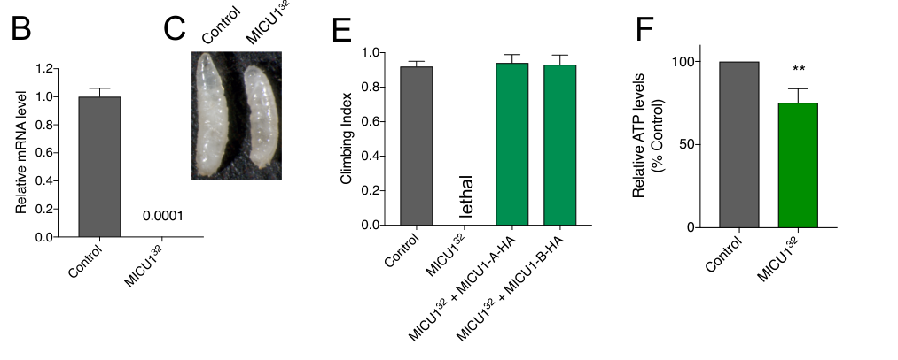

## Question

# Gene Research for Functional Annotation

## ⚠️ CRITICAL: Gene/Protein Identification Context

**BEFORE YOU BEGIN RESEARCH:** You MUST verify you are researching the CORRECT gene/protein. Gene symbols can be ambiguous, especially for less well-characterized genes from non-model organisms.

### Target Gene/Protein Identity (from UniProt):
- **UniProt Accession:** A2VEI2
- **Protein Description:** RecName: Full=Calcium uptake protein 1 homolog, mitochondrial {ECO:0000305}; AltName: Full=Mitochondrial calcium uptake 1 {ECO:0000303|PubMed:27568554, ECO:0000303|PubMed:28198506, ECO:0000312|FlyBase:FBgn0031893}; Flags: Precursor;
- **Gene Information:** Name=MICU1 {ECO:0000303|PubMed:27568554, ECO:0000303|PubMed:28198506, ECO:0000312|FlyBase:FBgn0031893}; ORFNames=CG4495 {ECO:0000312|FlyBase:FBgn0031893};
- **Organism (full):** Drosophila melanogaster (Fruit fly).
- **Protein Family:** Belongs to the MICU1 family. MICU1 subfamily.
- **Key Domains:** EF-hand-dom_pair. (IPR011992); EF_Hand_1_Ca_BS. (IPR018247); EF_hand_dom. (IPR002048); MICU1/2/3. (IPR039800); EF-hand_5 (PF13202)

### MANDATORY VERIFICATION STEPS:

1. **Check if the gene symbol "MICU1" matches the protein description above**
2. **Verify the organism is correct:** Drosophila melanogaster (Fruit fly).
3. **Check if protein family/domains align with what you find in literature**
4. **If you find literature for a DIFFERENT gene with the same or similar symbol, STOP**

### If Gene Symbol is Ambiguous or You Cannot Find Relevant Literature:

**DO NOT PROCEED WITH RESEARCH ON A DIFFERENT GENE.** Instead:
- State clearly: "The gene symbol 'MICU1' is ambiguous or literature is limited for this specific protein"
- Explain what you found (e.g., "Found extensive literature on a different gene with the same symbol in a different organism")
- Describe the protein based ONLY on the UniProt information provided above
- Suggest that the protein function can be inferred from domain/family information

### Research Target:

Please provide a comprehensive research report on the gene **MICU1** (gene ID: MICU1, UniProt: A2VEI2) in DROME.

The research report should be a detailed narrative explaining the function, biological processes, and localization of the gene product. Citations should be given for all claims.

You should prioritize authoritative reviews and primary scientific literature when conducting research. You can supplement
this with annotations you find in gene/protein databases, but these can be outdated or inaccurate.

We are specifically interested in the primary function of the gene - for enzymes, what reaction is catalyzed, and what is the substrate specificity? For transporters, what is the substrate? For structural proteins or adapters, what is the broader structural role? For signaling molecules, what is the role in the pathway.

We are interested in where in or outside the cell the gene product carries out its function.

We are also interested in the signaling or biochemical pathways in which the gene functions. We are less interested in broad pleiotropic effects, except where these elucidate the precise role.

Include evidence where possible. We are interested in both experimental evidence as well as inference from structure, evolution, or bioinformatic analysis. Precise studies should be prioritized over high-throughput, where available.

## Output

Question: You are an expert researcher providing comprehensive, well-cited information.

Provide detailed information focusing on:
1. Key concepts and definitions with current understanding
2. Recent developments and latest research (prioritize 2023-2024 sources)
3. Current applications and real-world implementations
4. Expert opinions and analysis from authoritative sources
5. Relevant statistics and data from recent studies

Format as a comprehensive research report with proper citations. Include URLs and publication dates where available.
Always prioritize recent, authoritative sources and provide specific citations for all major claims.

# Gene Research for Functional Annotation

## ⚠️ CRITICAL: Gene/Protein Identification Context

**BEFORE YOU BEGIN RESEARCH:** You MUST verify you are researching the CORRECT gene/protein. Gene symbols can be ambiguous, especially for less well-characterized genes from non-model organisms.

### Target Gene/Protein Identity (from UniProt):
- **UniProt Accession:** A2VEI2
- **Protein Description:** RecName: Full=Calcium uptake protein 1 homolog, mitochondrial {ECO:0000305}; AltName: Full=Mitochondrial calcium uptake 1 {ECO:0000303|PubMed:27568554, ECO:0000303|PubMed:28198506, ECO:0000312|FlyBase:FBgn0031893}; Flags: Precursor;
- **Gene Information:** Name=MICU1 {ECO:0000303|PubMed:27568554, ECO:0000303|PubMed:28198506, ECO:0000312|FlyBase:FBgn0031893}; ORFNames=CG4495 {ECO:0000312|FlyBase:FBgn0031893};
- **Organism (full):** Drosophila melanogaster (Fruit fly).
- **Protein Family:** Belongs to the MICU1 family. MICU1 subfamily.
- **Key Domains:** EF-hand-dom_pair. (IPR011992); EF_Hand_1_Ca_BS. (IPR018247); EF_hand_dom. (IPR002048); MICU1/2/3. (IPR039800); EF-hand_5 (PF13202)

### MANDATORY VERIFICATION STEPS:

1. **Check if the gene symbol "MICU1" matches the protein description above**
2. **Verify the organism is correct:** Drosophila melanogaster (Fruit fly).
3. **Check if protein family/domains align with what you find in literature**
4. **If you find literature for a DIFFERENT gene with the same or similar symbol, STOP**

### If Gene Symbol is Ambiguous or You Cannot Find Relevant Literature:

**DO NOT PROCEED WITH RESEARCH ON A DIFFERENT GENE.** Instead:
- State clearly: "The gene symbol 'MICU1' is ambiguous or literature is limited for this specific protein"
- Explain what you found (e.g., "Found extensive literature on a different gene with the same symbol in a different organism")
- Describe the protein based ONLY on the UniProt information provided above
- Suggest that the protein function can be inferred from domain/family information

### Research Target:

Please provide a comprehensive research report on the gene **MICU1** (gene ID: MICU1, UniProt: A2VEI2) in DROME.

The research report should be a detailed narrative explaining the function, biological processes, and localization of the gene product. Citations should be given for all claims.

You should prioritize authoritative reviews and primary scientific literature when conducting research. You can supplement
this with annotations you find in gene/protein databases, but these can be outdated or inaccurate.

We are specifically interested in the primary function of the gene - for enzymes, what reaction is catalyzed, and what is the substrate specificity? For transporters, what is the substrate? For structural proteins or adapters, what is the broader structural role? For signaling molecules, what is the role in the pathway.

We are interested in where in or outside the cell the gene product carries out its function.

We are also interested in the signaling or biochemical pathways in which the gene functions. We are less interested in broad pleiotropic effects, except where these elucidate the precise role.

Include evidence where possible. We are interested in both experimental evidence as well as inference from structure, evolution, or bioinformatic analysis. Precise studies should be prioritized over high-throughput, where available.

# Functional annotation of *Drosophila melanogaster* MICU1

## Identity and principal function

**Identity verified.** The target is the fruit-fly gene *MICU1*, **CG4495**, corresponding to the supplied UniProt accession **A2VEI2**—not the human gene of the same name and not the pore-forming fly gene *Mcu* (CG18769). The supplied UniProt record identifies it as a mitochondrial calcium-uptake protein of the MICU1 family with EF-hand domains; the fly genetic study independently identifies CG4495 as *MICU1* and distinguishes it from *Mcu*, *Emre*, and *Micu3*. Flies have MICU1 and MICU3 but lack a recognized MICU2 ortholog. [UniProt A2VEI2](https://www.uniprot.org/uniprotkb/A2VEI2/entry); Tufi et al., *Cell Reports*, 2019, [DOI: 10.1016/j.celrep.2019.04.033](https://doi.org/10.1016/j.celrep.2019.04.033). (tufi2018acomprehensivegenetic pages 9-12, tufi2018acomprehensivegenetic pages 1-4, garg2021themechanismof pages 28-29)

**Functional assignment:** Fly MICU1 is principally an **EF-hand calcium-sensing regulatory subunit**, rather than an enzyme or the ion-conducting pore, of the mitochondrial calcium uniporter. The relevant signaling ion is **Ca²⁺**: MCU and EMRE provide rapid Ca²⁺ entry across the inner mitochondrial membrane into the matrix, while MICU1 adjusts the response to calcium outside that membrane. Fly experiments support a *gatekeeping* role—restraining detrimental MCU–EMRE activity in an overexpression assay—but do not establish a kinetic calcium-activation threshold or direct ion selectivity for purified fly MICU1. Tufi et al., 2019; Goyani et al., *Biochemical Society Transactions*, October 2024, [DOI: 10.1042/BST20240319](https://doi.org/10.1042/BST20240319). (tufi2018acomprehensivegenetic pages 4-7, tufi2018acomprehensivegenetic pages 7-9, goyani2024calciumsignalingin pages 2-4)

## Cellular site and biochemical pathway

The most defensible localization is **mitochondrial, at the intermembrane-space-facing side of the inner membrane**, near the uniporter. This specifies where MICU1 is expected to *sense* Ca²⁺; **the matrix is the destination of Ca²⁺ conducted by MCU, not the established location of the MICU1 regulatory domain**. Mammalian localization and mechanistic studies additionally place MICU1 at inner-boundary-membrane/cristae-organizing domains. These are well-supported family-level localization models, **not a direct submitochondrial localization measurement for fly A2VEI2** in the fly studies examined. Tomar et al., *Science Signaling*, April 25, 2023, [DOI: 10.1126/scisignal.abi8948](https://doi.org/10.1126/scisignal.abi8948); Goyani et al., 2024. (tomar2023micu1regulatesmitochondrial pages 1-3, goyani2024calciumsignalingin pages 2-4, tomar2023micu1regulatesmitochondrial pages 3-4)

Within the pathway, Ca²⁺ released into the cytosol—for example from the endoplasmic reticulum—can reach the mitochondrial intermembrane space and subsequently enter the matrix through the MCU–EMRE channel. *Drosophila Mcu* experiments link this channel to ER-to-mitochondrion calcium transfer and oxidative-stress-induced cell death, but **those particular experiments manipulated MCU, not CG4495**, and should not be presented as direct MICU1 results. Choi et al., *Journal of Biological Chemistry*, September 2017, [DOI: 10.1074/jbc.M116.765578](https://doi.org/10.1074/jbc.M116.765578). (choi2017mitochondrialcalciumuniporter pages 2-4, tufi2018acomprehensivegenetic pages 1-4)

The biochemical details of “gatekeeping” remain contested across experimental systems. Structural and biochemical models describe low-Ca²⁺ restraint and Ca²⁺-dependent activation through MICU EF hands. Direct mitoplast patch-clamp experiments in **mouse cells**, however, found that MICUs increased the channel’s open probability at elevated calcium without physically plugging the pore at low calcium. Consequently, the fly eye-rescue phenotype supports **functional restraint of excessive uniporter activity**, not proof that fly MICU1 directly occludes its pore. Garg et al., *eLife*, August 31, 2021, [DOI: 10.7554/eLife.69312](https://doi.org/10.7554/eLife.69312); Goyani et al., 2024. (tufi2018acomprehensivegenetic pages 7-9, garg2021themechanismof pages 1-2, goyani2024calciumsignalingin pages 2-4)

## Direct evidence in the target organism

The decisive gene-specific study is Tufi et al.’s peer-reviewed **2019 *Cell Reports*** analysis, for which an accessible, differently titled 2018 preprint provides detailed experimental text: [2019 article](https://doi.org/10.1016/j.celrep.2019.04.033); [October 2018 preprint](https://doi.org/10.1101/458174). Mobilization of a P element at *Micu1* produced the **Micu1³²** allele, an approximately **11-kb deletion** removing about half the gene and extending upstream; homozygous larvae had no detectable *Micu1* transcript. Most homozygotes died as larvae, with only a few reaching third instar. Importantly, ubiquitous expression of either tagged **MICU1-A or MICU1-B** restored adult viability and climbing, strongly assigning the developmental defect to loss of MICU1 despite the deletion’s upstream extent. (tufi2018acomprehensivegenetic pages 4-7, garg2021themechanismof pages 28-29, tufi2018acomprehensivegenetic media f852e019)

These mutant larvae had **reduced total ATP**, less interconnected and more diffuse mitochondria in epidermal cells, and impaired axonal mitochondrial transport. Those observations establish a requirement for MICU1 in mitochondrial homeostasis and organismal development; they do not alone establish which defect is the immediate cause of death. In a separate fly-eye interaction assay, co-expression of MCU and EMRE severely disrupted retinal morphology, whereas adding MICU1-A or MICU1-B suppressed the defect; MICU3 isoforms did not. The eye phenotype is a **genetic toxicity readout**, not a direct recording of MICU1-regulated Ca²⁺ current. Tufi et al., 2019. (tufi2018acomprehensivegenetic pages 4-7, tufi2018acomprehensivegenetic pages 7-9, tufi2018acomprehensivegenetic media f852e019)

The most important mechanistic qualification is genetic: **removing *Mcu* or *Emre* did not rescue *Micu1³²* lethality or noticeably delay death**, although loss of either channel component abolishes rapid uniporter-dependent Ca²⁺ uptake in isolated fly mitochondria. Thus an explanation based *solely* on unrestrained rapid MCU–EMRE influx is insufficient. This result supports an additional essential MICU1 function but does **not** identify its molecular mechanism or rule out every other route of mitochondrial Ca²⁺ movement. Tufi et al., 2019. (tufi2018acomprehensivegenetic pages 4-7, tufi2018acomprehensivegenetic pages 7-9, tufi2018acomprehensivegenetic pages 1-4)

For quantitative perspective, the same fly study found approximately **34%** and **23%** lower median lifespans for *Mcu* and *Emre* mutants, respectively, whereas complete *Micu1* loss was generally **larval-lethal**, so an adult median lifespan for the MICU1 null is not comparable. The approximately **7%** decrease reported for *Micu3* mutants likewise describes a *different gene*. These contrasts emphasize that the MICU1 phenotype is not simply the phenotype of disabling the Ca²⁺-conducting channel. Tufi et al., 2019. (tufi2018acomprehensivegenetic pages 1-4, tufi2018acomprehensivegenetic pages 4-7)

The evidence hierarchy matters for interpreting this annotation:

| Evidence level | Experiment or observation | Justified conclusion | Key limitation |
|---|---|---|---|
| **Direct fly genetics; peer-reviewed (2019)** | In *D. melanogaster*, P-element mobilization generated the *MICU1*^32 allele: an approximately 11-kb deletion removing about half of *MICU1* (CG4495), with no detectable transcript. Homozygotes were predominantly larval-lethal; ubiquitous MICU1-A or MICU1-B restored adult viability and climbing. | CG4495 is the fly *MICU1* gene, and its product is essential for development and mitochondrial homeostasis; both tested isoforms are functional in vivo. | The deletion extends upstream, although rescue strongly links the phenotype to *MICU1*; no direct fly EF-hand-binding or submitochondrial-localization assay was reported. |
| **Direct fly genetic interaction; peer-reviewed (2019)** | Eye-specific MCU plus EMRE expression caused severe retinal disruption; adding MICU1-A or MICU1-B suppressed it, whereas MICU3-A or MICU3-C did not. | Fly MICU1 is the principal negative gatekeeper of excessive MCU–EMRE-dependent Ca²⁺ entry in this overexpression model and is not functionally equivalent to MICU3. | Eye morphology is an indirect toxicity readout, not a direct measurement of MICU1-dependent Ca²⁺ current or substrate selectivity. |
| **Direct fly epistasis; peer-reviewed (2019)** | Combining *MICU1*^32 with null *Mcu* or *Emre* did not rescue lethality or appreciably delay the lethal phase. | The lethal consequences of MICU1 loss cannot be explained solely by rapid MCU–EMRE-mediated matrix Ca²⁺ uptake and imply an additional uniporter-independent role. | Failure of genetic rescue does not identify the alternative pathway or establish that all mitochondrial Ca²⁺ entry is absent. |
| **Direct mammalian mechanism; peer-reviewed (2023)** | In human cells and mouse fibroblasts, MICU1 associated with MICOS and interacted with MIC60 and CHCHD2; MICU1 loss disrupted MICOS assembly, cristae organization, membrane dynamics, and cell-death signaling independently of MCU. | Provides a plausible conserved explanation for the MCU-independent lethality and mitochondrial-shape defects observed in flies. | These mechanistic experiments did not test Drosophila A2VEI2/CG4495 directly; conservation in flies remains an inference. |
| **Fly genetics plus human-cell biochemistry; preprint (2025)** | Partial *Micu1* reduction by heterozygosity or RNAi improved lifespan, climbing, swelling, Ca²⁺ buffering, and ultrastructural defects in *Tmbim5*-deficient flies. In human cells, MICU1 and TMBIM5 occurred in a shared complex and showed reciprocal effects on mitochondrial organization. | Suggests functional interplay between MICU1 and the inner-membrane Ca²⁺/H⁺ exchanger TMBIM5, potentially extending MICU1 function beyond the canonical uniporter. | Provisional bioRxiv evidence; the physical association was demonstrated in human cells, not flies, and the rescue mechanism remains unresolved. |
| **Cross-species synthesis; peer-reviewed review (2024)** | Current literature places MICU proteins on the intermembrane-space-facing side of the inner mitochondrial membrane, where EF hands sense Ca²⁺ and regulate MCU; MICU1 may also occupy inner-boundary-membrane/MICOS-associated domains. | Best-supported localization model for fly MICU1 is mitochondrial, with the mature EF-hand protein exposed to the intermembrane space near the inner membrane. | Precise fly localization is inferred from family conservation and mammalian studies rather than demonstrated directly for A2VEI2/CG4495. |

*Table: Evidence is ordered from direct, peer-reviewed Drosophila genetics to cross-species mechanistic inference and provisional preprint findings. The table separates conclusions established for CG4495 from mammalian localization and MICOS models.*

## Recent mechanistic developments and applications

A plausible molecular explanation for the fly epistasis emerged from **2023 mammalian work**: Tomar and colleagues found MICU1 associated with the mitochondrial contact-site and cristae-organizing system (**MICOS**), interacting with **MIC60 and CHCHD2** independently of MCU. MICU1 loss disturbed MICOS organization and cristae architecture in their cell and mouse-derived experimental systems. This provides a credible hypothesis for why fly MICU1 is essential even when rapid MCU-dependent uptake is removed, **but the MICU1–MICOS interaction has not thereby been demonstrated for CG4495 in flies**. Tomar et al., April 25, 2023, [DOI: 10.1126/scisignal.abi8948](https://doi.org/10.1126/scisignal.abi8948). (tomar2023micu1regulatesmitochondrial pages 1-3, tomar2023micu1regulatesmitochondrial pages 3-4)

A **2025 bioRxiv preprint**, extending beyond the requested 2023–2024 emphasis, offers a newer **fly-specific application** of MICU1 genetics. In *Tmbim5*-deficient flies, reducing *Micu1* by heterozygosity or RNA interference improved survival and climbing and ameliorated mitochondrial swelling, ultrastructure, and calcium-retention defects; loss of *Mcu*, *Emre*, or *Micu3* instead worsened survival. Its isolated-mitochondria calcium-buffering assay applied successive **5 µM CaCl₂ pulses**; that dose is an assay condition, **not** a MICU1 binding constant or a measured calcium threshold. The study detected MICU1–TMBIM5 association in **human cells**, not by direct physical-interaction measurement in flies, and proposed more than one possible explanation for the fly genetic rescue. Accordingly, the TMBIM5 pathway is promising but provisional, not an established direct transport reaction of fly MICU1. Zhang et al., bioRxiv, March 2025, [DOI: 10.1101/2025.03.28.645939](https://doi.org/10.1101/2025.03.28.645939). (zhang2025interactionofthe pages 13-15, zhang2025interactionofthe pages 7-10)

**Assessment for functional annotation.** Assign A2VEI2/CG4495 the primary function **“mitochondrial intermembrane-space Ca²⁺-sensing regulator of uniporter activity and mitochondrial homeostasis.”** Mark MCU–EMRE genetic regulation and developmental requirement as **direct fly evidence**; the precise inner-membrane microdomain, EF-hand binding parameters, MICOS partnership, and biochemical basis of the MCU-independent essential function as **cross-species inference or unresolved in flies**. The available sources do not justify annotating MICU1 itself as a Ca²⁺ pore, a Ca²⁺/H⁺ exchanger, or an enzyme. (tufi2018acomprehensivegenetic pages 4-7, tufi2018acomprehensivegenetic pages 7-9, tomar2023micu1regulatesmitochondrial pages 1-3, goyani2024calciumsignalingin pages 2-4, tomar2023micu1regulatesmitochondrial pages 3-4)

References

1. (tufi2018acomprehensivegenetic pages 9-12): Roberta Tufi, Thomas P. Gleeson, Sophia von Stockum, Victoria L. Hewitt, Juliette J. Lee, Ana Terriente-Felix, Alvaro Sanchez-Martinez, Elena Ziviani, and Alexander J. Whitworth. A comprehensive genetic characterisation of the mitochondrial ca2+ uniporter in drosophila. bioRxiv, Oct 2018. URL: https://doi.org/10.1101/458174, doi:10.1101/458174. This article has 3 citations.

2. (tufi2018acomprehensivegenetic pages 1-4): Roberta Tufi, Thomas P. Gleeson, Sophia von Stockum, Victoria L. Hewitt, Juliette J. Lee, Ana Terriente-Felix, Alvaro Sanchez-Martinez, Elena Ziviani, and Alexander J. Whitworth. A comprehensive genetic characterisation of the mitochondrial ca2+ uniporter in drosophila. bioRxiv, Oct 2018. URL: https://doi.org/10.1101/458174, doi:10.1101/458174. This article has 3 citations.

3. (garg2021themechanismof pages 28-29): Vivek Garg, Junji Suzuki, Ishan Paranjpe, Tiffany Unsulangi, Liron Boyman, Lorin S Milescu, W Jonathan Lederer, and Yuriy Kirichok. The mechanism of micu-dependent gating of the mitochondrial ca2+uniporter. eLife, Aug 2021. URL: https://doi.org/10.7554/elife.69312, doi:10.7554/elife.69312. This article has 93 citations and is from a domain leading peer-reviewed journal.

4. (tufi2018acomprehensivegenetic pages 4-7): Roberta Tufi, Thomas P. Gleeson, Sophia von Stockum, Victoria L. Hewitt, Juliette J. Lee, Ana Terriente-Felix, Alvaro Sanchez-Martinez, Elena Ziviani, and Alexander J. Whitworth. A comprehensive genetic characterisation of the mitochondrial ca2+ uniporter in drosophila. bioRxiv, Oct 2018. URL: https://doi.org/10.1101/458174, doi:10.1101/458174. This article has 3 citations.

5. (tufi2018acomprehensivegenetic pages 7-9): Roberta Tufi, Thomas P. Gleeson, Sophia von Stockum, Victoria L. Hewitt, Juliette J. Lee, Ana Terriente-Felix, Alvaro Sanchez-Martinez, Elena Ziviani, and Alexander J. Whitworth. A comprehensive genetic characterisation of the mitochondrial ca2+ uniporter in drosophila. bioRxiv, Oct 2018. URL: https://doi.org/10.1101/458174, doi:10.1101/458174. This article has 3 citations.

6. (goyani2024calciumsignalingin pages 2-4): Shanikumar Goyani, Shatakshi Shukla, Pooja Jadiya, and Dhanendra Tomar. Calcium signaling in mitochondrial intermembrane space. Biochemical Society transactions, 52:2215-2229, Oct 2024. URL: https://doi.org/10.1042/bst20240319, doi:10.1042/bst20240319. This article has 13 citations and is from a peer-reviewed journal.

7. (tomar2023micu1regulatesmitochondrial pages 1-3): Dhanendra Tomar, Manfred Thomas, Joanne F. Garbincius, Devin W. Kolmetzky, Oniel Salik, Pooja Jadiya, Suresh K. Joseph, April C. Carpenter, György Hajnóczky, and John W. Elrod. Micu1 regulates mitochondrial cristae structure and function independently of the mitochondrial ca2+ uniporter channel. Science Signaling, Apr 2023. URL: https://doi.org/10.1126/scisignal.abi8948, doi:10.1126/scisignal.abi8948. This article has 63 citations and is from a domain leading peer-reviewed journal.

8. (tomar2023micu1regulatesmitochondrial pages 3-4): Dhanendra Tomar, Manfred Thomas, Joanne F. Garbincius, Devin W. Kolmetzky, Oniel Salik, Pooja Jadiya, Suresh K. Joseph, April C. Carpenter, György Hajnóczky, and John W. Elrod. Micu1 regulates mitochondrial cristae structure and function independently of the mitochondrial ca2+ uniporter channel. Science Signaling, Apr 2023. URL: https://doi.org/10.1126/scisignal.abi8948, doi:10.1126/scisignal.abi8948. This article has 63 citations and is from a domain leading peer-reviewed journal.

9. (choi2017mitochondrialcalciumuniporter pages 2-4): Sekyu Choi, Xianglan Quan, Sunhoe Bang, Heesuk Yoo, Jiyoung Kim, Jiwon Park, Kyu-Sang Park, and Jongkyeong Chung. Mitochondrial calcium uniporter in drosophila transfers calcium between the endoplasmic reticulum and mitochondria in oxidative stress-induced cell death. Journal of Biological Chemistry, 292:14473-14485, Sep 2017. URL: https://doi.org/10.1074/jbc.m116.765578, doi:10.1074/jbc.m116.765578. This article has 62 citations and is from a domain leading peer-reviewed journal.

10. (garg2021themechanismof pages 1-2): Vivek Garg, Junji Suzuki, Ishan Paranjpe, Tiffany Unsulangi, Liron Boyman, Lorin S Milescu, W Jonathan Lederer, and Yuriy Kirichok. The mechanism of micu-dependent gating of the mitochondrial ca2+uniporter. eLife, Aug 2021. URL: https://doi.org/10.7554/elife.69312, doi:10.7554/elife.69312. This article has 93 citations and is from a domain leading peer-reviewed journal.

11. (tufi2018acomprehensivegenetic media f852e019): Roberta Tufi, Thomas P. Gleeson, Sophia von Stockum, Victoria L. Hewitt, Juliette J. Lee, Ana Terriente-Felix, Alvaro Sanchez-Martinez, Elena Ziviani, and Alexander J. Whitworth. A comprehensive genetic characterisation of the mitochondrial ca2+ uniporter in drosophila. bioRxiv, Oct 2018. URL: https://doi.org/10.1101/458174, doi:10.1101/458174. This article has 3 citations.

12. (zhang2025interactionofthe pages 13-15): Li Zhang, Benjamin Gottschalk, Felicia Dietsche, Sara Bitar, Diones Bueno, Liliana Rojas-Charry, Anshu Kumari, Vivek Garg, Wolfgang F. Graier, and Axel Methner. Interaction of the mitochondrial calcium/proton exchanger tmbim5 with micu1. bioRxiv, Mar 2025. URL: https://doi.org/10.1101/2025.03.28.645939, doi:10.1101/2025.03.28.645939. This article has 4 citations.

13. (zhang2025interactionofthe pages 7-10): Li Zhang, Benjamin Gottschalk, Felicia Dietsche, Sara Bitar, Diones Bueno, Liliana Rojas-Charry, Anshu Kumari, Vivek Garg, Wolfgang F. Graier, and Axel Methner. Interaction of the mitochondrial calcium/proton exchanger tmbim5 with micu1. bioRxiv, Mar 2025. URL: https://doi.org/10.1101/2025.03.28.645939, doi:10.1101/2025.03.28.645939. This article has 4 citations.

## Artifacts

- [Edison artifact artifact-00](MICU1-deep-research-falcon_artifacts/artifact-00.md)

## Citations

1. tufi2018acomprehensivegenetic pages 9-12
2. tufi2018acomprehensivegenetic pages 1-4
3. garg2021themechanismof pages 28-29
4. tufi2018acomprehensivegenetic pages 4-7
5. tufi2018acomprehensivegenetic pages 7-9
6. goyani2024calciumsignalingin pages 2-4
7. choi2017mitochondrialcalciumuniporter pages 2-4
8. garg2021themechanismof pages 1-2
9. zhang2025interactionofthe pages 13-15
10. zhang2025interactionofthe pages 7-10
11. UniProt A2VEI2
12. DOI: 10.1016/j.celrep.2019.04.033
13. DOI: 10.1042/BST20240319
14. DOI: 10.1126/scisignal.abi8948
15. DOI: 10.1074/jbc.M116.765578
16. DOI: 10.7554/eLife.69312
17. 2019 article
18. October 2018 preprint
19. DOI: 10.1101/2025.03.28.645939
20. https://www.uniprot.org/uniprotkb/A2VEI2/entry
21. https://doi.org/10.1016/j.celrep.2019.04.033
22. https://doi.org/10.1042/BST20240319
23. https://doi.org/10.1126/scisignal.abi8948
24. https://doi.org/10.1074/jbc.M116.765578
25. https://doi.org/10.7554/eLife.69312
26. https://doi.org/10.1101/458174
27. https://doi.org/10.1101/2025.03.28.645939
28. https://doi.org/10.1101/458174,
29. https://doi.org/10.7554/elife.69312,
30. https://doi.org/10.1042/bst20240319,
31. https://doi.org/10.1126/scisignal.abi8948,
32. https://doi.org/10.1074/jbc.m116.765578,
33. https://doi.org/10.1101/2025.03.28.645939,