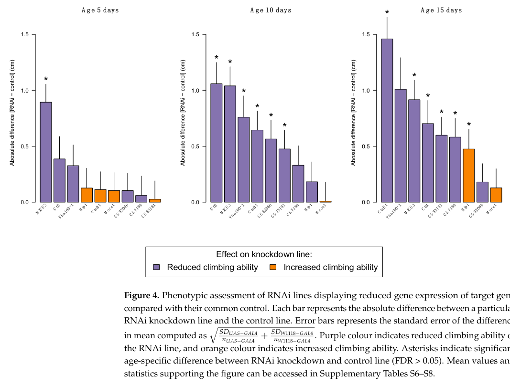

## Question

# Gene Research for Functional Annotation

## ⚠️ CRITICAL: Gene/Protein Identification Context

**BEFORE YOU BEGIN RESEARCH:** You MUST verify you are researching the CORRECT gene/protein. Gene symbols can be ambiguous, especially for less well-characterized genes from non-model organisms.

### Target Gene/Protein Identity (from UniProt):
- **UniProt Accession:** A0A0B4KHF1
- **Protein Description:** SubName: Full=Mitochondrial calcium uptake 3, isoform D {ECO:0000313|EMBL:AGB96121.1};
- **Gene Information:** Name=MICU3 {ECO:0000313|EMBL:AGB96121.1, ECO:0000313|FlyBase:FBgn0038735}; Synonyms=Dmel\CG4662 {ECO:0000313|EMBL:AGB96121.1}, micu3 {ECO:0000313|EMBL:AGB96121.1}; ORFNames=CG4662 {ECO:0000313|EMBL:AGB96121.1, ECO:0000313|FlyBase:FBgn0038735}, Dmel_CG4662 {ECO:0000313|EMBL:AGB96121.1};
- **Organism (full):** Drosophila melanogaster (Fruit fly).
- **Protein Family:** Not specified in UniProt
- **Key Domains:** EF-hand-dom_pair. (IPR011992); EF_Hand_1_Ca_BS. (IPR018247); EF_hand_dom. (IPR002048); MICU1/2/3. (IPR039800); EF-hand_7 (PF13499)

### MANDATORY VERIFICATION STEPS:

1. **Check if the gene symbol "MICU3" matches the protein description above**
2. **Verify the organism is correct:** Drosophila melanogaster (Fruit fly).
3. **Check if protein family/domains align with what you find in literature**
4. **If you find literature for a DIFFERENT gene with the same or similar symbol, STOP**

### If Gene Symbol is Ambiguous or You Cannot Find Relevant Literature:

**DO NOT PROCEED WITH RESEARCH ON A DIFFERENT GENE.** Instead:
- State clearly: "The gene symbol 'MICU3' is ambiguous or literature is limited for this specific protein"
- Explain what you found (e.g., "Found extensive literature on a different gene with the same symbol in a different organism")
- Describe the protein based ONLY on the UniProt information provided above
- Suggest that the protein function can be inferred from domain/family information

### Research Target:

Please provide a comprehensive research report on the gene **MICU3** (gene ID: MICU3, UniProt: A0A0B4KHF1) in DROME.

The research report should be a detailed narrative explaining the function, biological processes, and localization of the gene product. Citations should be given for all claims.

You should prioritize authoritative reviews and primary scientific literature when conducting research. You can supplement
this with annotations you find in gene/protein databases, but these can be outdated or inaccurate.

We are specifically interested in the primary function of the gene - for enzymes, what reaction is catalyzed, and what is the substrate specificity? For transporters, what is the substrate? For structural proteins or adapters, what is the broader structural role? For signaling molecules, what is the role in the pathway.

We are interested in where in or outside the cell the gene product carries out its function.

We are also interested in the signaling or biochemical pathways in which the gene functions. We are less interested in broad pleiotropic effects, except where these elucidate the precise role.

Include evidence where possible. We are interested in both experimental evidence as well as inference from structure, evolution, or bioinformatic analysis. Precise studies should be prioritized over high-throughput, where available.

## Output

Question: You are an expert researcher providing comprehensive, well-cited information.

Provide detailed information focusing on:
1. Key concepts and definitions with current understanding
2. Recent developments and latest research (prioritize 2023-2024 sources)
3. Current applications and real-world implementations
4. Expert opinions and analysis from authoritative sources
5. Relevant statistics and data from recent studies

Format as a comprehensive research report with proper citations. Include URLs and publication dates where available.
Always prioritize recent, authoritative sources and provide specific citations for all major claims.

# Gene Research for Functional Annotation

## ⚠️ CRITICAL: Gene/Protein Identification Context

**BEFORE YOU BEGIN RESEARCH:** You MUST verify you are researching the CORRECT gene/protein. Gene symbols can be ambiguous, especially for less well-characterized genes from non-model organisms.

### Target Gene/Protein Identity (from UniProt):
- **UniProt Accession:** A0A0B4KHF1
- **Protein Description:** SubName: Full=Mitochondrial calcium uptake 3, isoform D {ECO:0000313|EMBL:AGB96121.1};
- **Gene Information:** Name=MICU3 {ECO:0000313|EMBL:AGB96121.1, ECO:0000313|FlyBase:FBgn0038735}; Synonyms=Dmel\CG4662 {ECO:0000313|EMBL:AGB96121.1}, micu3 {ECO:0000313|EMBL:AGB96121.1}; ORFNames=CG4662 {ECO:0000313|EMBL:AGB96121.1, ECO:0000313|FlyBase:FBgn0038735}, Dmel_CG4662 {ECO:0000313|EMBL:AGB96121.1};
- **Organism (full):** Drosophila melanogaster (Fruit fly).
- **Protein Family:** Not specified in UniProt
- **Key Domains:** EF-hand-dom_pair. (IPR011992); EF_Hand_1_Ca_BS. (IPR018247); EF_hand_dom. (IPR002048); MICU1/2/3. (IPR039800); EF-hand_7 (PF13499)

### MANDATORY VERIFICATION STEPS:

1. **Check if the gene symbol "MICU3" matches the protein description above**
2. **Verify the organism is correct:** Drosophila melanogaster (Fruit fly).
3. **Check if protein family/domains align with what you find in literature**
4. **If you find literature for a DIFFERENT gene with the same or similar symbol, STOP**

### If Gene Symbol is Ambiguous or You Cannot Find Relevant Literature:

**DO NOT PROCEED WITH RESEARCH ON A DIFFERENT GENE.** Instead:
- State clearly: "The gene symbol 'MICU3' is ambiguous or literature is limited for this specific protein"
- Explain what you found (e.g., "Found extensive literature on a different gene with the same symbol in a different organism")
- Describe the protein based ONLY on the UniProt information provided above
- Suggest that the protein function can be inferred from domain/family information

### Research Target:

Please provide a comprehensive research report on the gene **MICU3** (gene ID: MICU3, UniProt: A0A0B4KHF1) in DROME.

The research report should be a detailed narrative explaining the function, biological processes, and localization of the gene product. Citations should be given for all claims.

You should prioritize authoritative reviews and primary scientific literature when conducting research. You can supplement
this with annotations you find in gene/protein databases, but these can be outdated or inaccurate.

We are specifically interested in the primary function of the gene - for enzymes, what reaction is catalyzed, and what is the substrate specificity? For transporters, what is the substrate? For structural proteins or adapters, what is the broader structural role? For signaling molecules, what is the role in the pathway.

We are interested in where in or outside the cell the gene product carries out its function.

We are also interested in the signaling or biochemical pathways in which the gene functions. We are less interested in broad pleiotropic effects, except where these elucidate the precise role.

Include evidence where possible. We are interested in both experimental evidence as well as inference from structure, evolution, or bioinformatic analysis. Precise studies should be prioritized over high-throughput, where available.

# Functional annotation of *Drosophila melanogaster* MICU3

## Identity and principal function

**The target is fly MICU3, not human MICU3 or the pore-forming mitochondrial calcium uniporter (MCU).** The supplied UniProt record [A0A0B4KHF1](https://www.uniprot.org/uniprotkb/A0A0B4KHF1/entry) identifies *D. melanogaster* MICU3 isoform D and lists EF-hand and MICU-family domains. Independent fly research identifies **CG4662 as MICU3**, distinct from MCU/CG18769 and MICU1/CG4495; flies have MICU1 and MICU3 but lack a recognized MICU2 ortholog. These findings make the MICU-family assignment appropriate, although the experiments discussed below generally concern the *gene* or isoforms A and C, **not isoform D specifically**. (tufi2018acomprehensivegenetic pages 9-12, tufi2018acomprehensivegenetic pages 4-7, tufi2018acomprehensivegenetic pages 1-4)

**Best-supported molecular annotation:** MICU3 is an EF-hand-containing *regulator* of mitochondrial Ca²⁺ uptake, rather than the Ca²⁺-conducting pore or an enzyme catalyzing a chemical reaction. Its relevant ion is **Ca²⁺**: the inner-membrane MCU–EMRE channel conducts Ca²⁺ toward the mitochondrial matrix, while MICU-family proteins regulate channel responses to Ca²⁺. Fly genetics indicate that MICU3 has a role distinct from MICU1, the principal gatekeeper. Evidence from mammalian MICU3 supports a more specific model in which MICU3 increases the uniporter’s responsiveness to Ca²⁺ signals; that precise effect has **not been directly quantified for fly CG4662**. (gleeson2020geneticcharacterisationof pages 1-9, tufi2018acomprehensivegenetic pages 4-7, tufi2018acomprehensivegenetic pages 7-9, patron2018micu3isa pages 3-5, walters2023mitochondrialcalciumcycling pages 3-5)

## Location and biochemical pathway

The **mitochondrion** is the strongly supported functional context. In the established uniporter architecture, MCU forms the Ca²⁺-conducting pore in the *inner mitochondrial membrane*, whereas MICU-family Ca²⁺ sensors operate on its *intermembrane-space side*. MICU3 has EF-hand motifs consistent with Ca²⁺ sensing. Accordingly, association of fly MICU3 with the mitochondrial uniporter on the intermembrane-space side is the most defensible **family-based localization inference**, not a directly mapped sub-mitochondrial location for A0A0B4KHF1. No fly-specific MICU3 localization or membrane-topology experiment was identified in the cited primary work. (patron2018micu3isa pages 1-2, goyani2024calciumsignalingin pages 2-4, tufi2018acomprehensivegenetic pages 4-7)

The proposed pathway is **cellular Ca²⁺ signaling → MICU-dependent control of MCU–EMRE-mediated mitochondrial Ca²⁺ entry → adjustment of mitochondrial energy production during activity**. Mammalian biochemical experiments show a disulfide-linked MICU1–MICU3 complex and EF-hand-dependent enhancement of mitochondrial Ca²⁺ uptake; disrupting the MICU3 interaction or depleting MICU1 impairs that enhancement. In cultured mammalian neurons, MICU3 enables axonal mitochondria to respond to smaller Ca²⁺ signals, accelerating local ATP synthesis and sustaining presynaptic function when oxidative metabolism is needed. These experiments provide a mechanistic explanation *plausible* for fly phenotypes, but do not demonstrate the same physical interaction, Ca²⁺-activation threshold, or presynaptic mechanism in *Drosophila*. (patron2018micu3isa pages 3-5, patron2018micu3isa pages 1-2, ashrafi2020moleculartuningof pages 1-3)

## Direct experimental evidence in the fly

The principal fly genetic study generated **MICU3^27**, a one-base-deletion allele causing a frameshift, early truncation, and substantial loss of transcript. Homozygous animals survived, unlike MICU1-null flies, but exhibited impaired climbing at young and older ages and a modest reduction in median lifespan. Fly-head mitochondrial respiration did **not** differ significantly from controls in that study. The authors described fly MICU3 expression as predominantly neuronal based on existing expression information; their mutant and behavioral experiments do not themselves establish localization to a particular neuronal compartment. [Tufi *et al.*, bioRxiv preprint, October 2018](https://doi.org/10.1101/458174); a [peer-reviewed *Cell Reports* article was published in April 2019](https://doi.org/10.1016/j.celrep.2019.04.033). The detailed claims here are supported by the accessible preprint text. (tufi2018acomprehensivegenetic pages 4-7, tufi2018acomprehensivegenetic pages 7-9)

**MICU3 is not interchangeable with MICU1.** Ubiquitous expression of fly MICU3-A or MICU3-C failed to rescue MICU1-mutant lethality. In a separate genetic interaction assay, excess MCU plus EMRE severely disrupted the eye; adding MICU1 suppressed this phenotype, but adding either MICU3 isoform did not. Co-expressing MCU with MICU3 alone produced only mild roughening. These are useful *indirect genetic readouts*, consistent with MICU3 modulating rather than providing the dominant low-Ca²⁺ gatekeeping function; they are **not direct measurements of Ca²⁺ flux through MICU3-containing fly channels**. (tufi2018acomprehensivegenetic pages 4-7, tufi2018acomprehensivegenetic pages 7-9)

Additional fly experiments reported in a [Cambridge doctoral dissertation, available May 2020](https://doi.org/10.17863/cam.52681), strengthen the gene–phenotype connection: either transgenic MICU3-A or MICU3-C completely rescued the mutant climbing defect. The dissertation reported lower ATP in young mutant heads (**p < 0.01**) despite no significant change in measured Complex I- or II-linked oxygen consumption at 3 or 20 days. It reported median survival of **55 versus 59 days** for mutants and controls, respectively; this is a small difference, and the dissertation’s percentage characterization should not be conflated with the **7%** reported in the earlier preprint. Homozygous mutants were also reported sterile, but the attempted fertility rescue did not remain statistically significant after multiple-testing correction. These results support an energetic contribution without establishing its precise Ca²⁺-flux mechanism. (gleeson2020geneticcharacterisationof pages 128-133, tufi2018acomprehensivegenetic pages 4-7)

**Recent fly evidence—2023.** Baisgaard *et al.* used ubiquitous RNAi against MICU3 in a screen of conserved Parkinson’s-disease candidate genes. MICU3-knockdown flies climbed **33% less than controls at five days**, and MICU3 was the only tested line with a consistently altered escape response at **all three tested ages: 5, 10, and 15 days**. The study used RNA sequencing to check target-expression reduction, but reported no biological replicates for that sequencing comparison. Importantly, this was a locomotor assay, **not** a demonstration that fly MICU3 causes Parkinson’s disease, neuronal degeneration, or a measured change in mitochondrial Ca²⁺ uptake. [Baisgaard *et al.*, *Insects*, February 2023](https://doi.org/10.3390/insects14020168). (baisgaard2023functionallyvalidatingevolutionary pages 5-7, baisgaard2023functionallyvalidatingevolutionary pages 8-9, baisgaard2023functionallyvalidatingevolutionary media de94fbc3)

The following table separates direct fly findings from mechanistic evidence obtained in other species.

| Observation | Species, assay, and outcome | Inference strength and limits | Citation IDs |
|---|---|---|---|
| Gene identity | *Drosophila melanogaster* CG4662 was identified as the conserved fly **MICU3**, distinct from MCU/CG18769 and MICU1/CG4495; flies lack MICU2. | **Strong identity evidence.** Consistent with UniProt A0A0B4KHF1, but the cited experiments did not specifically test protein isoform D. | (tufi2018acomprehensivegenetic pages 9-12, tufi2018acomprehensivegenetic pages 4-7) |
| MICU3 loss-of-function phenotype | Fly CRISPR allele **MICU3^27** is a one-base deletion causing a frameshift, early truncation, and transcript destabilization. Homozygotes were viable but had a significant climbing defect and a modest median-lifespan reduction. | **Strong, direct fly evidence** that MICU3 supports locomotor or neuronal function; it does not by itself establish the underlying Ca²⁺-transport mechanism. | (tufi2018acomprehensivegenetic pages 4-7) |
| Distinction from MICU1 | In fly genetic tests, MICU3-A or MICU3-C did not rescue MICU1-null lethality. Unlike MICU1, neither isoform suppressed the severe eye phenotype caused by MCU–EMRE overexpression. | **Strong fly epistasis evidence** that MICU3 is not interchangeable with MICU1 and is not the principal uniporter gatekeeper in vivo. The eye assay is an indirect readout of excessive mitochondrial Ca²⁺ entry. | (tufi2018acomprehensivegenetic pages 4-7, tufi2018acomprehensivegenetic pages 7-9) |
| Rescue, ATP, respiration, and fertility | A 2020 Cambridge doctoral thesis reported complete rescue of the MICU3^27 climbing defect by ubiquitous MICU3-A or MICU3-C. Mutants were sterile and had reduced ATP in young heads, while Complex I/II-linked oxygen consumption was unchanged; median lifespan was 55 versus 59 days. | **Direct fly evidence, but thesis-level.** Rescue strongly supports allele specificity. Sterility rescue was incomplete or not significant after correction, and reduced ATP does not prove altered mitochondrial Ca²⁺ uptake. | (gleeson2020geneticcharacterisationof pages 128-133) |
| Recent RNAi replication | In 2023, ubiquitous fly MICU3 RNAi caused a **33% reduction in climbing at day 5** and significantly altered escape behavior at all tested ages (5, 10, and 15 days). | **Recent, direct fly evidence** corroborating locomotor involvement. Limits include a single behavioral axis, ubiquitous knockdown, and no direct mitochondrial Ca²⁺ or neuronal-structure measurement. | (baisgaard2023functionallyvalidatingevolutionary pages 5-7, baisgaard2023functionallyvalidatingevolutionary pages 8-9, baisgaard2023functionallyvalidatingevolutionary media de94fbc3) |
| MICU1 binding and uptake enhancement | In mammalian cells and cortical neurons, MICU3 formed a disulfide-linked heterodimer with MICU1; disrupting the conserved cysteine or silencing MICU1 eliminated or impaired MICU3 activity. MICU3 enhanced MCU-dependent mitochondrial Ca²⁺ uptake, and EF-hand mutations reduced this effect. | **Strong mechanistic evidence, but mammalian.** It supports a conserved Ca²⁺-sensing enhancer model; it is not direct evidence for fly CG4662, fly isoform D, or the exact fly MICU1–MICU3 complex. | (patron2018micu3isa pages 3-5, patron2018micu3isa pages 1-2) |
| Axonal Ca²⁺ sensitivity and ATP coupling | In cultured mammalian neurons, MICU3 ablation raised the effective Ca²⁺ threshold of axonal mitochondria, prevented activity-driven acceleration of local ATP synthesis, and impaired presynaptic function under oxidative conditions. | **Strong neuronal mechanism in mammals.** It provides a plausible explanation for fly climbing and head-ATP phenotypes, but cross-species extrapolation must remain explicit. | (ashrafi2020moleculartuningof pages 1-3) |
| Localization and unresolved annotation | MICU-family proteins are generally mitochondrial intermembrane-space regulators associated with the inner-membrane MCU complex; MICU3 has EF-hand domains and a mitochondrial targeting signal. | **Family-based and mammalian evidence only.** No cited study directly measured CG4662/MICU3 sub-mitochondrial localization or MICU3-dependent Ca²⁺ uptake in fly tissue, and none directly tested UniProt isoform D (A0A0B4KHF1). | (patron2018micu3isa pages 1-2, goyani2024calciumsignalingin pages 2-4) |

*Table: Evidence hierarchy for functional annotation of Drosophila MICU3/CG4662, separating direct fly experiments from mammalian mechanistic inference. It highlights the absence of direct localization, calcium-uptake, or isoform-D experiments for A0A0B4KHF1.*

## Current interpretation and limitations

Recent authoritative syntheses describe MICU3-containing MICU complexes as a means of tuning mitochondrial Ca²⁺ uptake to neuronal signals, while recognizing that MICU composition and effects vary by tissue and experimental context. The [2023 neuronal Ca²⁺-cycling review](https://doi.org/10.3389/fcell.2023.1094356) discusses MICU3–MICU1 complexes and greater sensitivity to cytosolic Ca²⁺ than MICU2-containing complexes; the [2024 intermembrane-space review](https://doi.org/10.1042/bst20240319) places MICU regulators in mitochondrial Ca²⁺ signaling and relates mammalian MICU3 to synaptic ATP supply. These reviews inform the *mechanistic inference* for fly MICU3; neither substitutes for a direct experiment on fly isoform D. (walters2023mitochondrialcalciumcycling pages 3-5, goyani2024calciumsignalingin pages 2-4)

**Annotation conclusion:** *D. melanogaster* **CG4662/MICU3** most likely serves as a mitochondrial EF-hand Ca²⁺-responsive **uniporter regulatory subunit** that helps match Ca²⁺ signaling to cellular energetic needs, with experimentally established importance for normal fly locomotion. Its exact binding partners, Ca²⁺-response curve, intermembrane-space topology, and the individual activity or localization of **UniProt isoform D (A0A0B4KHF1)** remain unverified by the fly experiments cited here. The 2023 RNAi result corroborates the locomotor role; stronger biochemical claims remain extrapolations from mammalian MICU3 rather than established properties of this particular fly protein. (tufi2018acomprehensivegenetic pages 4-7, tufi2018acomprehensivegenetic pages 7-9, baisgaard2023functionallyvalidatingevolutionary pages 5-7, baisgaard2023functionallyvalidatingevolutionary pages 8-9, patron2018micu3isa pages 3-5, ashrafi2020moleculartuningof pages 1-3)

References

1. (tufi2018acomprehensivegenetic pages 9-12): Roberta Tufi, Thomas P. Gleeson, Sophia von Stockum, Victoria L. Hewitt, Juliette J. Lee, Ana Terriente-Felix, Alvaro Sanchez-Martinez, Elena Ziviani, and Alexander J. Whitworth. A comprehensive genetic characterisation of the mitochondrial ca2+ uniporter in drosophila. bioRxiv, Oct 2018. URL: https://doi.org/10.1101/458174, doi:10.1101/458174. This article has 3 citations.

2. (tufi2018acomprehensivegenetic pages 4-7): Roberta Tufi, Thomas P. Gleeson, Sophia von Stockum, Victoria L. Hewitt, Juliette J. Lee, Ana Terriente-Felix, Alvaro Sanchez-Martinez, Elena Ziviani, and Alexander J. Whitworth. A comprehensive genetic characterisation of the mitochondrial ca2+ uniporter in drosophila. bioRxiv, Oct 2018. URL: https://doi.org/10.1101/458174, doi:10.1101/458174. This article has 3 citations.

3. (tufi2018acomprehensivegenetic pages 1-4): Roberta Tufi, Thomas P. Gleeson, Sophia von Stockum, Victoria L. Hewitt, Juliette J. Lee, Ana Terriente-Felix, Alvaro Sanchez-Martinez, Elena Ziviani, and Alexander J. Whitworth. A comprehensive genetic characterisation of the mitochondrial ca2+ uniporter in drosophila. bioRxiv, Oct 2018. URL: https://doi.org/10.1101/458174, doi:10.1101/458174. This article has 3 citations.

4. (gleeson2020geneticcharacterisationof pages 1-9): Thomas Patrick Gleeson. Genetic characterisation of the drosophila mitochondrial calcium uniporter in physiological and neurodegenerative contexts. Dissertation, May 2020. URL: https://doi.org/10.17863/cam.52681, doi:10.17863/cam.52681. This article has 0 citations.

5. (tufi2018acomprehensivegenetic pages 7-9): Roberta Tufi, Thomas P. Gleeson, Sophia von Stockum, Victoria L. Hewitt, Juliette J. Lee, Ana Terriente-Felix, Alvaro Sanchez-Martinez, Elena Ziviani, and Alexander J. Whitworth. A comprehensive genetic characterisation of the mitochondrial ca2+ uniporter in drosophila. bioRxiv, Oct 2018. URL: https://doi.org/10.1101/458174, doi:10.1101/458174. This article has 3 citations.

6. (patron2018micu3isa pages 3-5): Maria Patron, Veronica Granatiero, Javier Espino, Rosario Rizzuto, and Diego De Stefani. Micu3 is a tissue-specific enhancer of mitochondrial calcium uptake. ArXiv, 1:11-21, May 2018. URL: https://doi.org/10.1038/s41418-018-0113-8, doi:10.1038/s41418-018-0113-8. This article has 198 citations.

7. (walters2023mitochondrialcalciumcycling pages 3-5): Grant C. Walters and Yuriy M. Usachev. Mitochondrial calcium cycling in neuronal function and neurodegeneration. Frontiers in Cell and Developmental Biology, Jan 2023. URL: https://doi.org/10.3389/fcell.2023.1094356, doi:10.3389/fcell.2023.1094356. This article has 139 citations.

8. (patron2018micu3isa pages 1-2): Maria Patron, Veronica Granatiero, Javier Espino, Rosario Rizzuto, and Diego De Stefani. Micu3 is a tissue-specific enhancer of mitochondrial calcium uptake. ArXiv, 1:11-21, May 2018. URL: https://doi.org/10.1038/s41418-018-0113-8, doi:10.1038/s41418-018-0113-8. This article has 198 citations.

9. (goyani2024calciumsignalingin pages 2-4): Shanikumar Goyani, Shatakshi Shukla, Pooja Jadiya, and Dhanendra Tomar. Calcium signaling in mitochondrial intermembrane space. Biochemical Society transactions, 52:2215-2229, Oct 2024. URL: https://doi.org/10.1042/bst20240319, doi:10.1042/bst20240319. This article has 13 citations and is from a peer-reviewed journal.

10. (ashrafi2020moleculartuningof pages 1-3): Ghazaleh Ashrafi, Jaime de Juan-Sanz, Ryan J. Farrell, and Timothy A. Ryan. Molecular tuning of the axonal mitochondrial ca2+ uniporter ensures metabolic flexibility of neurotransmission. Neuron, 105:678-687.e5, Feb 2020. URL: https://doi.org/10.1016/j.neuron.2019.11.020, doi:10.1016/j.neuron.2019.11.020. This article has 279 citations and is from a highest quality peer-reviewed journal.

11. (gleeson2020geneticcharacterisationof pages 128-133): Thomas Patrick Gleeson. Genetic characterisation of the drosophila mitochondrial calcium uniporter in physiological and neurodegenerative contexts. Dissertation, May 2020. URL: https://doi.org/10.17863/cam.52681, doi:10.17863/cam.52681. This article has 0 citations.

12. (baisgaard2023functionallyvalidatingevolutionary pages 5-7): Amalie Elton Baisgaard, Kristina Magaard Koldby, Torsten Nygård Kristensen, Mette Nyegaard, and Palle Duun Rohde. Functionally validating evolutionary conserved risk genes for parkinson’s disease in drosophila melanogaster. Insects, 14:168, Feb 2023. URL: https://doi.org/10.3390/insects14020168, doi:10.3390/insects14020168. This article has 1 citations.

13. (baisgaard2023functionallyvalidatingevolutionary pages 8-9): Amalie Elton Baisgaard, Kristina Magaard Koldby, Torsten Nygård Kristensen, Mette Nyegaard, and Palle Duun Rohde. Functionally validating evolutionary conserved risk genes for parkinson’s disease in drosophila melanogaster. Insects, 14:168, Feb 2023. URL: https://doi.org/10.3390/insects14020168, doi:10.3390/insects14020168. This article has 1 citations.

14. (baisgaard2023functionallyvalidatingevolutionary media de94fbc3): Amalie Elton Baisgaard, Kristina Magaard Koldby, Torsten Nygård Kristensen, Mette Nyegaard, and Palle Duun Rohde. Functionally validating evolutionary conserved risk genes for parkinson’s disease in drosophila melanogaster. Insects, 14:168, Feb 2023. URL: https://doi.org/10.3390/insects14020168, doi:10.3390/insects14020168. This article has 1 citations.

## Artifacts

- [Edison artifact artifact-00](MICU3-deep-research-falcon_artifacts/artifact-00.md)

## Citations

1. tufi2018acomprehensivegenetic pages 4-7
2. gleeson2020geneticcharacterisationof pages 128-133
3. ashrafi2020moleculartuningof pages 1-3
4. tufi2018acomprehensivegenetic pages 9-12
5. tufi2018acomprehensivegenetic pages 1-4
6. gleeson2020geneticcharacterisationof pages 1-9
7. tufi2018acomprehensivegenetic pages 7-9
8. walters2023mitochondrialcalciumcycling pages 3-5
9. goyani2024calciumsignalingin pages 2-4
10. baisgaard2023functionallyvalidatingevolutionary pages 5-7
11. baisgaard2023functionallyvalidatingevolutionary pages 8-9
12. A0A0B4KHF1
13. Tufi *et al.*, bioRxiv preprint, October 2018
14. peer-reviewed *Cell Reports* article was published in April 2019
15. Cambridge doctoral dissertation, available May 2020
16. Baisgaard *et al.*, *Insects*, February 2023
17. 2023 neuronal Ca²⁺-cycling review
18. 2024 intermembrane-space review
19. https://www.uniprot.org/uniprotkb/A0A0B4KHF1/entry
20. https://doi.org/10.1101/458174
21. https://doi.org/10.1016/j.celrep.2019.04.033
22. https://doi.org/10.17863/cam.52681
23. https://doi.org/10.3390/insects14020168
24. https://doi.org/10.3389/fcell.2023.1094356
25. https://doi.org/10.1042/bst20240319
26. https://doi.org/10.1101/458174,
27. https://doi.org/10.17863/cam.52681,
28. https://doi.org/10.1038/s41418-018-0113-8,
29. https://doi.org/10.3389/fcell.2023.1094356,
30. https://doi.org/10.1042/bst20240319,
31. https://doi.org/10.1016/j.neuron.2019.11.020,
32. https://doi.org/10.3390/insects14020168,