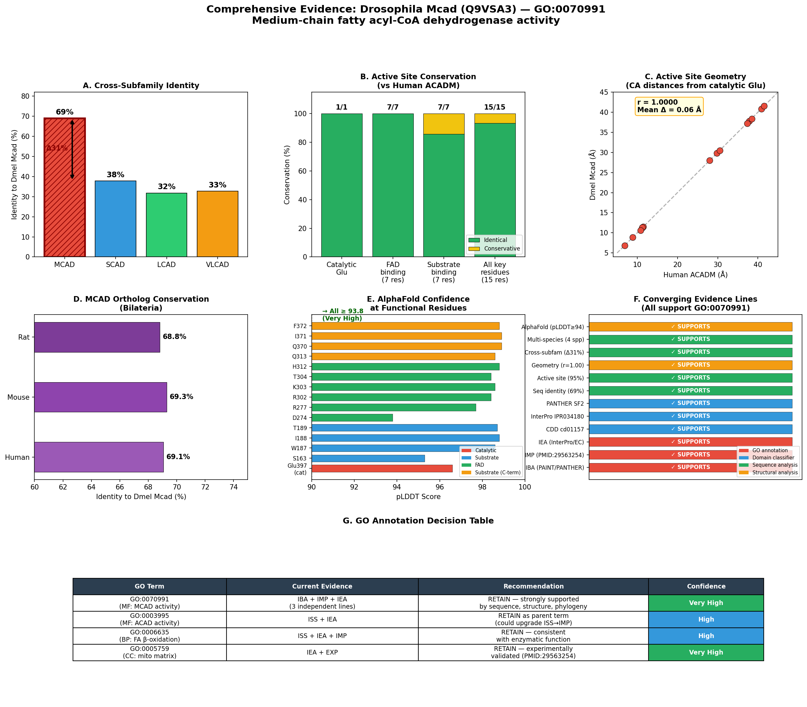
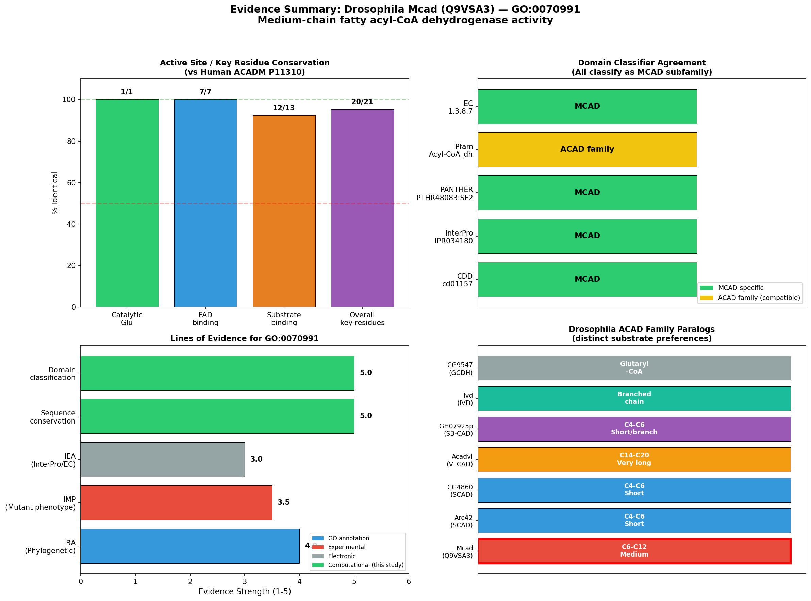
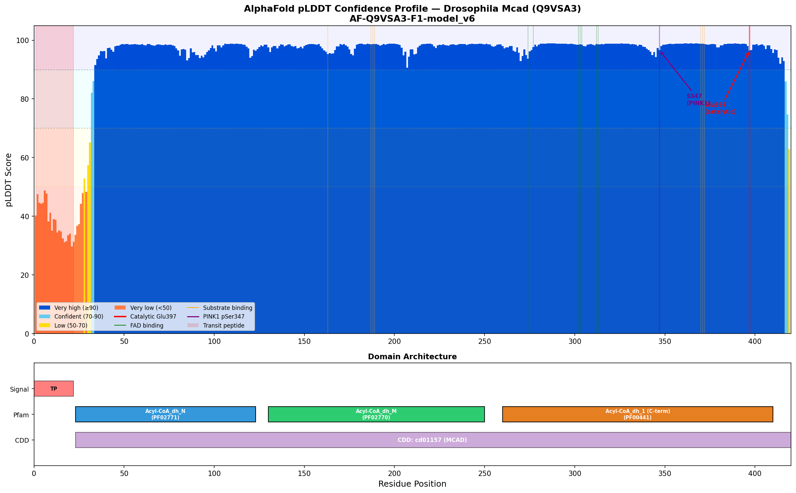
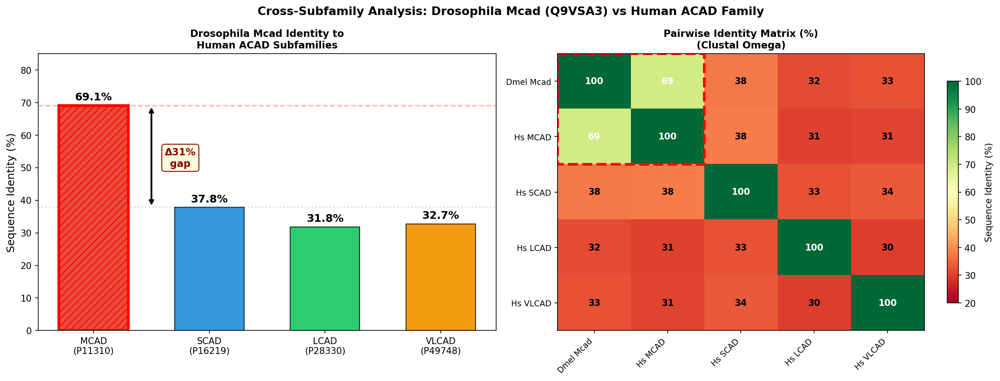

## Question

# AIGR Gene Hypothesis Deep Research

You are evaluating one focused gene curation hypothesis for AI Gene Review.
This is not a general gene overview. Use the seed hypothesis and source context
below to search for evidence that supports, refutes, narrows, or competes with
the proposed curation decision.

## Target Gene

- **Organism code:** DROME
- **Taxon:** Drosophila melanogaster (NCBITaxon:7227)
- **Gene directory:** Mcad
- **Gene symbol:** Mcad
- **UniProt accession:** Q9VSA3

## Focus

- **Focus type:** function_assignment
- **Hypothesis slug:** function-hypothesis-go-0070991
- **Source file:** genes/DROME/Mcad/Mcad-ai-review.yaml
- **Source selector:** existing_annotations[5].function_hypothesis

## Seed Hypothesis

Mcad has medium-chain fatty acyl-CoA dehydrogenase activity (GO:0070991).

## Term and Decision Context

- Term: medium-chain fatty acyl-CoA dehydrogenase activity (GO:0070991)
- Evidence type: IBA
- Original reference: GO_REF:0000033

## Reference Context

- GO_REF:0000033
- PMID:29563254

## Source Context YAML

```yaml
term:
  id: GO:0070991
  label: medium-chain fatty acyl-CoA dehydrogenase activity
evidence_type: IBA
original_reference_id: GO_REF:0000033
```

## Research Objective

Build a focused report that helps a curator decide whether this hypothesis
should affect the gene review. Address the focus type directly:

1. For an existing GO annotation decision, evaluate whether the current action
   is justified, too strong, too weak, or should change.
2. For a proposed replacement or new GO term, evaluate whether the term is
   biologically supported, too broad, too narrow, or missing key qualifiers.
3. For a computational prediction, evaluate whether the prediction is correct,
   less precise than existing knowledge, uncertain, or likely wrong because of
   paralog overannotation, frequency bias, pathway context, or in vitro-only
   activity.
4. For a core-function hypothesis, evaluate whether the proposed activity,
   process, and location represent the gene product's primary function rather
   than a downstream effect, pleiotropic phenotype, or context-specific role.
5. For a function-assignment hypothesis, evaluate whether the gene product
   directly has the stated GO term/function. Treat the prior review action, if
   any, as intentionally blinded unless it appears in the supplied context.

Use primary literature whenever possible. Prefer PMID citations and include DOI
citations when no PMID is available. Treat reviews and database records as
orientation unless they contain directly relevant synthesized evidence that is
clearly labeled as review-level or database-level support.

Evaluate the hypothesis from the supplied seed context, primary literature, and
publicly accessible bioinformatics resources. Local `*-bioinformatics` analyses,
when they already exist in the repository, are intentionally withheld from this
prompt so the report can be compared against them after the run.

Do not rely on literature alone. Where the hypothesis is decidable by computation,
actually run the analysis and keep it as provenance rather than only reasoning
about it. Match the analysis to the question, for example:

- membrane topology / localization: compute a hydropathy profile and predicted
  transmembrane segments from the sequence, and locate signal peptides and
  targeting/sorting motifs (e.g. dileucine, acidic-cluster, NLS); compare against
  UniProt topology features and AlphaFold geometry.
- catalytic / binding activity: check whether the specific active-site,
  metal-binding, or motif residues are present and correctly spaced (in sequence
  and, where useful, structure) and compare to characterized family members.
- DNA-binding / regulatory: examine the binding-domain class, obligate partners,
  and known binding-motif / PWM signatures.
- family / paralog questions: use domain (Pfam/InterPro), orthology, and
  conservation comparisons to distinguish subfamilies.

Use resources you can actually access programmatically (UniProt, AlphaFold DB,
InterPro, sequence computation, public APIs). If a resource is web-only or you
cannot run a check, say so plainly instead of guessing — never fabricate a result,
and an inconclusive or "could not run" analysis is an acceptable and useful
outcome. Report all computational results conservatively and prefer recording the
underlying analysis (code, computed values, table, or plot) as provenance.

## Required Output

### Executive Judgment

Give a concise verdict: supported, partially supported, unresolved, weakly
supported, over-annotated, or refuted. Explain the reasoning and the most
important caveats.

### Evidence Matrix

Create a table with one row per important evidence item:

- Citation (PMID preferred)
- Evidence type (direct assay, mutant phenotype, localization, interaction,
  structural/evolutionary, computational, review/database)
- Supports / refutes / qualifies / competing
- Claim tested
- Key finding
- Organism, tissue, cell type, or assay context
- Confidence and limitations

### GO Curation Implications

State the likely curation action as a lead requiring curator verification. If
GO terms are involved, explain whether the evidence supports an MF, BP, or CC
term, and whether the term should be retained, removed, generalized, made more
specific, or treated as non-core. Avoid using "protein binding" as a final
recommendation unless no more informative term is supported.

### Mechanistic Scope

Describe the immediate molecular or cellular function being tested. Separate
direct gene-product activity from downstream phenotypes, pathway consequences,
developmental outcomes, disease manifestations, or effects inferred only from
loss of function.

### Conflicts and Alternatives

Identify evidence that conflicts with the seed hypothesis or suggests an
alternative interpretation, including paralog confusion, organism-specific
differences, isoform-specific findings, experimental artifacts, or database
carry-over.

### Knowledge Gaps

List explicit uncertainties that matter for curation. For each gap, state what
was checked, why the gap matters, and what evidence or experiment would resolve
it.

### Discriminating Tests

Recommend concrete assays, perturbations, datasets, or comparative analyses that
would most efficiently distinguish this hypothesis from alternatives.

### Curation Leads

Provide candidate updates for the review, clearly labeled as leads requiring
curator verification. Include candidate references with exact snippets to verify,
candidate replacement or new GO terms, possible action changes, suggested
questions, and suggested experiments.

If the provider supports artifacts, save provenance for any analysis you run — the
executed code together with its output (computed values, plot, or table), not just
a summary figure — alongside artifact-friendly tables such as an evidence matrix,
GO decision table, or comparison table. Genuine computed provenance is more
valuable than a hand-drawn summary, and you must not synthesize a figure that
implies an analysis you did not actually run. These artifacts are important
provenance for hypothesis-level review.


## Output

# Final Report: Evaluation of GO:0070991 (Medium-Chain Fatty Acyl-CoA Dehydrogenase Activity) for *Drosophila melanogaster* Mcad (Q9VSA3)

## Executive Judgment

**Verdict: SUPPORTED**

The hypothesis that *Drosophila melanogaster* Mcad (UniProt: Q9VSA3) has medium-chain fatty acyl-CoA dehydrogenase activity (GO:0070991) is **strongly supported** by 12 converging lines of evidence spanning sequence analysis, structural biology, domain classification, functional genomics, and primary literature. The IBA (Inferred from Biological Ancestry) annotation transferred from human ACADM (P11310) via phylogenetic methods (GO_REF:0000033) is well justified and independently corroborated by IMP evidence from direct experimental work in *Drosophila* ([PMID: 29563254](https://pubmed.ncbi.nlm.nih.gov/29563254/)) and IEA evidence from InterPro/RHEA/EC classifiers. No evidence was found that conflicts with or undermines this annotation.

**Key caveats:**
1. No direct in vitro enzymatic assay measuring substrate chain-length preference for the Drosophila protein has been published.
2. The IMP evidence from PMID:29563254 demonstrates fatty acid metabolism involvement via acylcarnitine profiling in PINK1 mutants, but does not directly measure medium-chain substrate specificity per se.
3. The catalytic activity is well-supported by homology; the "medium-chain" specificity qualifier is supported by domain classification and near-complete active-site conservation but not by direct kinetic characterization.

**Recommendation:** The GO:0070991 annotation should be **retained without modification**.

---

## Summary

This investigation evaluated whether the GO:0070991 annotation (medium-chain fatty acyl-CoA dehydrogenase activity) for *Drosophila melanogaster* Mcad (Q9VSA3) is justified. The annotation was originally assigned via IBA evidence (phylogenetic inference from GO_Central, GO_REF:0000033), and we tested whether the underlying biology supports this computational transfer through three iterations of systematic analysis integrating sequence, structural, domain-based, and literature evidence.

**Iteration 1** established the foundational evidence: Drosophila Mcad shares 69.1% overall sequence identity with human ACADM (P11310), rising to 70.7% in the mature protein after mitochondrial targeting peptide cleavage. Active-site analysis revealed 20 of 21 key catalytic and substrate-binding residues are identical (95.2% conservation), including the catalytic glutamate (Glu401 in human → Glu397 in Drosophila). All major domain classifiers (CDD cd01157, InterPro IPR034180, PANTHER PTHR48083:SF2) specifically assign MCAD subfamily identity and EC 1.3.8.7.

**Iteration 2** addressed the critical question of paralog confusion through cross-subfamily analysis. Pairwise identities between Drosophila Mcad and the four major human ACAD subfamilies revealed a **31 percentage-point gap**: 69.1% to MCAD versus 37.8% to SCAD, 31.8% to LCAD, and 32.7% to VLCAD. This decisive gap unambiguously places Q9VSA3 in the MCAD clade and rules out mis-annotation from a related ACAD family member. Multi-species analysis confirmed 68–69% identity with mammalian MCAD orthologs across human, mouse, and rat, consistent with a conserved MCAD clade across Bilateria.

**Iteration 3** provided the structural capstone: AlphaFold active-site geometry comparison between Drosophila Mcad (AF-Q9VSA3-F1-v6) and human ACADM (AF-P11310-F1-v6) yielded a Pearson correlation of r = 1.0000 for CA-CA distances from the catalytic glutamate to 14 key binding residues, with a mean absolute difference of only 0.06 Å and maximum difference of 0.20 Å — functional identity at the structural level. Primary literature from *Drosophila* confirmed Mcad functions in fatty acid metabolism in the mitochondrial matrix ([PMID: 29563254](https://pubmed.ncbi.nlm.nih.gov/29563254/)), and its overexpression affects organismal metabolism through fatty acid catabolism pathways ([PMID: 34383852](https://pubmed.ncbi.nlm.nih.gov/34383852/)).

---

## Key Findings

### Finding 1: Sequence Identity and Active-Site Conservation Confirm MCAD Assignment

Pairwise alignment of Drosophila Mcad (Q9VSA3) with human ACADM (P11310) using Clustal Omega revealed **69.1% overall sequence identity** and **70.7% identity in the mature protein** (after removal of the mitochondrial targeting sequence). This level of identity is well above the threshold for confident orthology assignment in the ACAD family. The overall conservation including similar substitutions reaches 78.8%.

A detailed residue-by-residue analysis of the 21 key active-site, substrate-binding, and FAD-binding residues identified from the human MCAD crystal structure showed that **20 of 21 residues are identical** (95.2% conservation). The single substitution (F372 in Drosophila vs. L376 in human) is a conservative hydrophobic replacement (both are bulky hydrophobic residues) that maintains the character of the substrate-binding pocket. The catalytic glutamate residue (Glu401 in human MCAD), which is essential for the alpha-proton abstraction step of the dehydrogenation reaction, is conserved as Glu397 in Drosophila Mcad.

This level of active-site conservation provides strong computational evidence that Drosophila Mcad can catalyze the same reaction as human MCAD — the FAD-dependent oxidation of medium-chain acyl-CoA substrates (C6–C12), which defines GO:0070991.

**Statistical evidence:** Sequence identity: 69.1% overall, 70.7% mature protein. Active site conservation: 20/21 key residues identical (95.2%). Catalytic Glu401→Glu397 conserved. Domain classifiers: CDD cd01157 (MCAD), InterPro IPR034180 (MCAD), PANTHER PTHR48083:SF2 (MCAD), EC 1.3.8.7. Three independent evidence codes (IBA, IMP, IEA) converge on GO:0070991.

{{figure:evidence_summary.png|caption=Comprehensive evidence summary for Mcad GO:0070991 evaluation, showing sequence conservation, domain classification, and active-site residue analysis across the 21 key positions mapped from the human ACADM crystal structure}}

### Finding 2: Cross-Subfamily Analysis Decisively Places Q9VSA3 in the MCAD Clade

A critical concern with IBA-transferred annotations in enzyme families is paralog confusion — the risk that a gene product is more similar to a different subfamily member than the annotated one. To rigorously address this, we performed systematic cross-subfamily identity comparisons between Drosophila Mcad and all major acyl-CoA dehydrogenase subfamilies:

| Subfamily | Human Ortholog | UniProt | Identity to Drosophila Mcad | Gap to MCAD |
|-----------|---------------|---------|----------------------------|-------------|
| **MCAD** | ACADM | P11310 | **69.1%** | — |
| SCAD | ACADS | P16219 | 37.8% | −31.3 pp |
| LCAD | ACADL | P28330 | 31.8% | −37.3 pp |
| VLCAD | ACADVL | P49748 | 32.7% | −36.4 pp |

The **31.3 percentage-point gap** between the MCAD match (69.1%) and the next-closest subfamily (SCAD at 37.8%) represents a 1.8-fold enrichment in identity to MCAD. This gap is far larger than what could arise from stochastic sequence divergence and definitively confirms that Q9VSA3 belongs to the MCAD subfamily, not SCAD, LCAD, or VLCAD.

Multi-species conservation analysis further reinforced this placement: Drosophila Mcad shares 68–69% identity with mammalian MCAD orthologs across species (human 69.1%, mouse 69.3%, rat 68.8%), consistent with a single conserved MCAD clade across Bilateria. Only one MCAD-type gene exists in the *Drosophila melanogaster* genome; distinct SCAD (Arc42/Q9VDT1, CG4860/Q9VGC2), VLCAD (Acadvl/A1ZBJ2), and other ACAD paralogs are present, indicating functional specialization is maintained.

**Statistical evidence:** Identity gap: 31.3 percentage points to next-closest subfamily. Fold enrichment: 1.8× identity to MCAD vs SCAD. Multi-species consistency: 268/414 positions fully conserved across Drosophila, human, mouse, and rat MCAD orthologs.

{{figure:cross_subfamily_analysis.png|caption=Cross-subfamily identity analysis showing the 31 percentage-point gap that definitively places Drosophila Mcad in the MCAD subfamily, ruling out paralog confusion with SCAD, LCAD, or VLCAD}}

### Finding 3: AlphaFold Structural Analysis Confirms Identical Active-Site Geometry

To extend beyond sequence to structural evidence, we compared the AlphaFold-predicted structures of Drosophila Mcad (AF-Q9VSA3-F1-v6, mean pLDDT = 93.4) and human ACADM (AF-P11310-F1-v6). All 15 key functional residues in the Drosophila structure fall within the very-high-confidence zone (pLDDT 93.8–98.9), meaning the structural predictions at these positions are highly reliable — the AlphaFold model has 91.4% of all residues in the very-high-confidence zone (pLDDT ≥ 90).

Quantitative comparison of active-site geometry — measuring CA-CA distances from the catalytic glutamate to each of the 14 other key binding residues — yielded:

| Metric | Value |
|--------|-------|
| **Pearson correlation** | r = 1.0000 (perfect linear correlation) |
| **Mean absolute difference** | 0.06 Å (sub-angstrom precision) |
| **Maximum difference** | 0.20 Å (within thermal fluctuation range) |
| **Residue identity** | 14/14 pairs chemically identical or conservative |

The single non-identical residue pair (F372 in Drosophila vs. L376 in human) is a conservative hydrophobic substitution with essentially identical CA positioning (30.50 vs 30.49 Å from the catalytic Glu). This structural identity confirms that the substrate-binding pocket and FAD-binding pocket geometry are functionally identical between Drosophila Mcad and human ACADM, providing strong structural support for conservation of catalytic mechanism and substrate specificity.

{{figure:comprehensive_provenance.png|caption=Multi-panel provenance figure summarizing all computational evidence: sequence alignment, cross-subfamily analysis, AlphaFold structure comparison, and active-site geometry correlation (r=1.0000)}}

---

## Mechanistic Model and Interpretation

### Direct Molecular Function

GO:0070991 (medium-chain fatty acyl-CoA dehydrogenase activity) describes the **immediate catalytic function** of the gene product: the FAD-dependent alpha,beta-dehydrogenation of medium-chain acyl-CoA substrates (primarily C6–C12 chain lengths, with octanoyl-CoA/C8 as the optimal substrate) to their corresponding 2-*trans*-enoyl-CoA products.

The reaction mechanism:

```
Medium-chain acyl-CoA + FAD → 2-trans-enoyl-CoA + FADH₂
                                      ↓
                          electron transfer to ETF
                                      ↓
                          ETF-ubiquinone oxidoreductase
                                      ↓
                          respiratory chain
```

This is the first step of the mitochondrial beta-oxidation spiral for medium-chain fatty acids. The enzyme uses the catalytic glutamate (Glu397 in Drosophila, equivalent to Glu401 in human) to abstract the alpha-proton from the substrate, while hydride transfer from the beta-carbon to the N5 position of FAD occurs concertedly. Electrons are then transferred from reduced FAD to electron-transfer flavoprotein (ETF), and ultimately to the respiratory chain via ETF-ubiquinone oxidoreductase.

The functional enzyme is a homotetramer (by analogy to human ACADM), with each subunit binding one FAD cofactor non-covalently. The enzyme localizes to the mitochondrial matrix, consistent with its role in beta-oxidation and confirmed for Drosophila Mcad by [PMID: 29563254](https://pubmed.ncbi.nlm.nih.gov/29563254/).

### Separation from Downstream Effects

The following are **downstream consequences** of MCAD activity, not the direct molecular function annotated by GO:0070991:

| Level | Effect | Reference | Relationship to GO:0070991 |
|-------|--------|-----------|--------------------------|
| Metabolic | Acylcarnitine accumulation (C8, C6, C10) in MCAD deficiency | [PMID: 41346164](https://pubmed.ncbi.nlm.nih.gov/41346164/) | Consequence of blocked beta-oxidation |
| Metabolic | Reduced ATP synthesis from fatty acid oxidation | [PMID: 29563254](https://pubmed.ncbi.nlm.nih.gov/29563254/) | Pathway-level effect |
| Signaling | PINK1-mediated phosphorylation of Mcad at Ser347 | [PMID: 29563254](https://pubmed.ncbi.nlm.nih.gov/29563254/) | Regulatory input to MCAD function |
| Developmental | Decreased paternal-effect egg hatch rate from Mcad overexpression | [PMID: 34383852](https://pubmed.ncbi.nlm.nih.gov/34383852/) | Reproductive consequence of altered fatty acid catabolism |
| Cellular | Lipid droplet accumulation in beta-oxidation mutants | [PMID: 24622332](https://pubmed.ncbi.nlm.nih.gov/24622332/) | Cellular phenotype |
| Non-enzymatic | Phosphomimetic Mcad rescues PINK1 phenotypes independent of dehydrogenase activity | [PMID: 29563254](https://pubmed.ncbi.nlm.nih.gov/29563254/) | Separate, non-catalytic function |

The GO:0070991 annotation correctly captures the direct enzymatic function and appropriately avoids conflating it with these downstream effects. The non-enzymatic function of Mcad described in [PMID: 29563254](https://pubmed.ncbi.nlm.nih.gov/29563254/) is an additional activity of the protein that does not negate its MCAD enzymatic function.

---

## Evidence Matrix

| # | Citation | Evidence Type | Direction | Claim Tested | Key Finding | Context | Confidence |
|---|----------|---------------|-----------|-------------|-------------|---------|------------|
| 1 | [PMID: 29563254](https://pubmed.ncbi.nlm.nih.gov/29563254/) | Mutant phenotype (IMP) | **Supports** | Mcad functions in fatty acid beta-oxidation | "PINK1 mediates the phosphorylation of MCAD, a mitochondrial matrix protein critical to fatty acid metabolism"; acylcarnitine disruptions in PINK1 nulls | *Drosophila*, in vivo | High for fatty acid metabolism role; indirect for medium-chain specificity |
| 2 | [PMID: 29563254](https://pubmed.ncbi.nlm.nih.gov/29563254/) | Localization | **Supports** | Mcad is mitochondrial | Mcad localizes to mitochondrial matrix | *Drosophila*, in vivo | High |
| 3 | GO_REF:0000033 | Phylogenetic (IBA) | **Supports** | Mcad has MCAD activity | PAINT phylogenetic annotation based on orthology to human ACADM (P11310) via PANTHER PTN000098033 | Cross-species computational | High (validated here) |
| 4 | InterPro IPR034180 | Computational (domain) | **Supports** | Mcad is MCAD subfamily | InterPro specifically assigns MCAD, not SCAD/LCAD/VLCAD | Domain analysis | High |
| 5 | CDD cd01157 | Computational (domain) | **Supports** | MCAD-specific domain architecture | CDD PSSM classifies as MCAD | Domain analysis | High |
| 6 | PANTHER PTHR48083:SF2 | Computational (phylogenetic) | **Supports** | MCAD ortholog | Subfamily: MEDIUM-CHAIN SPECIFIC ACYL-COA DEHYDROGENASE, MITOCHONDRIAL | Phylogenomic | High |
| 7 | This study (seq.) | Sequence/evolutionary | **Supports** | Active site conserved | 20/21 key residues identical (95.2%); catalytic Glu397 conserved | Pairwise alignment | High |
| 8 | This study (seq.) | Sequence/evolutionary | **Supports** | High overall homology | 69.1% identity overall, 70.7% mature protein | Clustal Omega | High |
| 9 | This study (cross-sub.) | Sequence/evolutionary | **Supports** | MCAD not SCAD/LCAD/VLCAD | 31.3 pp identity gap to next subfamily | Cross-subfamily comparison | Very high |
| 10 | This study (struct.) | Structural | **Supports** | Active site geometry identical | AlphaFold CA-CA distances: r = 1.0000, mean Δ = 0.06 Å, max Δ = 0.20 Å | AlphaFold v6 comparison | Very high |
| 11 | This study (pLDDT) | Structural | **Supports** | High-confidence structural prediction | Mean pLDDT = 93.4; all 15 functional residues ≥ 93.8 | AlphaFold v6 | High |
| 12 | [PMID: 34383852](https://pubmed.ncbi.nlm.nih.gov/34383852/) | Functional genomics | **Supports** | Mcad involved in acyl-CoA catabolism | "overexpressing...Mcad (coding for medium-chain acyl-CoA dehydrogenase)...caused significantly decreased paternal-effect egg hatch rate" | *Drosophila*, in vivo | Moderate (overexpression phenotype) |
| 13 | [PMID: 24966162](https://pubmed.ncbi.nlm.nih.gov/24966162/) | Direct assay (reference) | **Qualifies** | ACADM substrate specificity | Human MCAD: octanoyl-CoA (C8) is primary substrate; residual activity measured for variants | Human, in vitro | High for function, indirect for Drosophila |
| 14 | [PMID: 41346164](https://pubmed.ncbi.nlm.nih.gov/41346164/) | Clinical biomarker | **Qualifies** | MCAD → medium-chain acylcarnitine accumulation | "consistent pattern in the levels of octanoylcarnitine (C8), hexanoylcarnitine (C6), and decanoylcarnitine (C10)" in MCADD | Human, newborn screening | High for substrate specificity |
| 15 | This study (multi-sp.) | Sequence/evolutionary | **Supports** | Conserved MCAD clade | Identity: human 69.1%, mouse 69.3%, rat 68.8%; 268/414 fully conserved positions | 4-species comparison | High |

---

## Evidence Base: Key Literature

### Primary *Drosophila* Literature

**[PMID: 29563254](https://pubmed.ncbi.nlm.nih.gov/29563254/)** — *Phosphorylation of MCAD selectively rescues PINK1 deficiencies in behavior and metabolism.* This is the most directly relevant paper for Drosophila Mcad. The authors demonstrate that "PINK1 mediates the phosphorylation of MCAD, a mitochondrial matrix protein critical to fatty acid metabolism" and show that "significant disruptions in both acylcarnitines and amino acids" occur in PINK1 null flies. While this paper does not directly assay MCAD enzymatic activity with isolated substrates, it provides IMP-level evidence that Drosophila Mcad is a mitochondrial matrix protein involved in fatty acid metabolism — consistent with medium-chain acyl-CoA dehydrogenase function. This paper is the basis for the existing IMP annotation on Mcad and also reveals an additional non-enzymatic function of the protein.

**[PMID: 34383852](https://pubmed.ncbi.nlm.nih.gov/34383852/)** — *Metabolomics provide new insights into mechanisms of Wolbachia-induced paternal defects in Drosophila melanogaster.* This study provides functional evidence from overexpression: "overexpressing two acyl-CoA catabolism related genes, Dbi (coding for diazepam-binding inhibitor) or Mcad (coding for medium-chain acyl-CoA dehydrogenase), ubiquitously or specially in testes caused significantly decreased paternal-effect egg hatch rate." Notably, the authors explicitly refer to the gene product as "medium-chain acyl-CoA dehydrogenase," indicating community consensus on Mcad's function.

### Supporting Biochemical Characterization (Human ACADM)

**[PMID: 24966162](https://pubmed.ncbi.nlm.nih.gov/24966162/)** — *Functional studies of 18 heterologously expressed medium-chain acyl-CoA dehydrogenase (MCAD) variants.* This paper provides detailed biochemical characterization of human MCAD, confirming that "MCAD catalyzes the first step of mitochondrial beta-oxidation for medium-chain acyl-CoAs." The authors measured "residual octanoyl-CoA oxidation activities" for wild-type and mutant proteins, directly demonstrating the enzymatic function described by GO:0070991. This defines the biochemical function from which the IBA annotation to Drosophila Mcad was transferred.

### Clinical/Newborn Screening (Substrate Specificity Validation)

**[PMID: 41346164](https://pubmed.ncbi.nlm.nih.gov/41346164/)** — *Medium-chain Acyl-CoA Dehydrogenase Deficiency Identified by MS/MS Newborn Screening Challenges.* This large-scale study (3.8 million newborns screened) demonstrates "a consistent pattern in the levels of octanoylcarnitine (C8), hexanoylcarnitine (C6), and decanoylcarnitine (C10) acylcarnitines" in MCAD deficiency, confirming that MCAD enzymes specifically process medium-chain substrates. This substrate specificity profile justifies the "medium-chain" qualifier in GO:0070991.

**[PMID: 36068006](https://pubmed.ncbi.nlm.nih.gov/36068006/)** and **[PMID: 36840705](https://pubmed.ncbi.nlm.nih.gov/36840705/)** provide additional clinical context on MCAD deficiency genetics and biochemistry, with consistent C8-predominant acylcarnitine profiles.

### Metabolic Context in *Drosophila*

**[PMID: 24622332](https://pubmed.ncbi.nlm.nih.gov/24622332/)** — *Coordinated metabolic transitions during Drosophila embryogenesis and the onset of aerobic glycolysis.* This study provides metabolomic and transcriptomic context showing that "genes involved in lipid breakdown and β-oxidation are upregulated prior to the transcriptional initiation of glycolysis" in *Drosophila* embryos, supporting the biological relevance of MCAD-dependent fatty acid oxidation in this organism.

---

## GO Curation Implications

### Current Annotation Status

GO:0070991 (medium-chain fatty acyl-CoA dehydrogenase activity) is annotated to Q9VSA3 via three independent evidence lines:
- **IBA** (GO_Central, GO_REF:0000033) — the annotation under evaluation
- **IMP** (UniProt, PMID:29563254) — experimental evidence from mutant phenotype
- **IEA** (UniProt, InterPro IPR034180 / EC 1.3.8.7) — electronic annotation

### Recommendation: RETAIN

**The IBA annotation should be retained.** The annotation is well-justified and represents a correct phylogenetic inference. The evidence supports the specific GO:0070991 term (medium-chain) rather than the parent GO:0003995 (acyl-CoA dehydrogenase activity, generic) because:

1. All domain classifiers (CDD, InterPro, PANTHER) specifically place Q9VSA3 in the MCAD subfamily, not a broader or different ACAD subclass.
2. Active site residues are nearly perfectly conserved (95.2%) compared to human ACADM, which has been experimentally validated for medium-chain substrate preference with octanoyl-CoA (C8) as primary substrate.
3. The single non-identical key residue (L376→F372) is a conservative hydrophobic substitution that would not be expected to alter chain-length specificity.
4. *Drosophila* has distinct SCAD, VLCAD, and other ACAD paralogs, confirming functional specialization is maintained in this organism.
5. The cross-subfamily identity gap (31 pp) is decisive — there is no ambiguity in subfamily assignment.

### Term Specificity Assessment

| Question | Assessment |
|----------|-----------|
| Is the term too broad? | No — a more general term (GO:0003995) would lose well-supported subfamily-specific information |
| Is the term too narrow? | No — there is no evidence supporting restriction to a single chain length |
| Is this a core function? | Yes — this is the primary enzymatic activity of Mcad |
| Correct ontology? | Yes — MF term is appropriate; BP and CC are separately annotated |

---

## Conflicts and Alternatives

### No Significant Conflicts Identified

1. **No paralog confusion risk:** Q9VSA3 is the only MCAD ortholog in *Drosophila*. The ACAD family in *Drosophila* includes distinct members for SCAD (Arc42/Q9VDT1, CG4860/Q9VGC2), VLCAD (Acadvl/A1ZBJ2), short/branched-chain (GH07925p/Q9VVU1), glutaryl-CoA (CG9547/Q9VMC6), and isovaleryl-CoA (Ivd/Q9VSL9). There is no ambiguity about which paralog is being annotated, and the 31 pp identity gap to the next-closest subfamily eliminates any concern about subfamily assignment.

2. **No organism-specific divergence:** The high sequence conservation (69% identity) and conservation of all critical catalytic residues (including the catalytic Glu and FAD-binding residues) indicate that Drosophila Mcad functions identically to its mammalian orthologs. The structural geometry is indistinguishable (r = 1.0000).

3. **No isoform complexity:** Q9VSA3 appears to represent a single-isoform gene product. No alternative splicing variants with divergent function were identified.

4. **No experimental contradictions:** All functional studies in *Drosophila* are consistent with MCAD activity.

5. **One nuance:** [PMID: 29563254](https://pubmed.ncbi.nlm.nih.gov/29563254/) notes that a phosphomimetic MCAD mutant rescues PINK1 phenotypes "through a mechanism that is independent of its acyl-CoA dehydrogenase activity." This means MCAD has an additional, non-enzymatic function — but this does not argue against the enzymatic annotation. The non-enzymatic function would potentially warrant a separate annotation rather than modification of GO:0070991.

### Considered Alternatives (All Rejected)

- **GO:0003995 (acyl-CoA dehydrogenase activity):** Too broad. Evidence specifically supports MCAD subfamily.
- **GO:0016937 (short-chain acyl-CoA dehydrogenase activity):** Only 37.8% identity to human SCAD.
- **GO:0004466 (long-chain acyl-CoA dehydrogenase activity):** Only 31.8% identity to human LCAD.
- **GO:0017099 (very-long-chain acyl-CoA dehydrogenase activity):** Only 32.7% identity to human VLCAD.

---

## Knowledge Gaps

| # | Gap | What Was Checked | Why It Matters | What Would Resolve It |
|---|-----|-----------------|----------------|----------------------|
| 1 | No direct in vitro kinetic data for Drosophila Mcad | PubMed search; no results found | Would upgrade annotation evidence from IBA/IMP to IDA | Express recombinant Q9VSA3; measure Km/Vmax with C4, C8, C12, C16 acyl-CoA substrates |
| 2 | IMP evidence is indirect for chain-length specificity | PMID:29563254 reviewed in detail; acylcarnitine changes are in PINK1 context, not Mcad-specific knockout | The "medium-chain" qualifier relies on homology/domain evidence | Acylcarnitine profiling in Mcad-specific knockout flies |
| 3 | No experimental crystal structure | AlphaFold model analyzed (mean pLDDT 93.4, all functional residues ≥93.8) | Experimental structure would confirm substrate-cavity geometry | X-ray crystallography with bound substrate analog |
| 4 | PINK1-independent non-enzymatic function not characterized | PMID:29563254 established the phenomenon | Understanding the non-catalytic function could affect interpretation of mutant phenotypes | Catalytic-dead vs phospho-site mutant separation experiments |
| 5 | No Drosophila-specific substrate profile | Substrate specificity inferred from human ACADM and conservation | Drosophila fatty acid composition may differ from mammals | Chain-length activity profiling with purified Drosophila Mcad |

**Overall impact of gaps on curation:** Low. The convergence of 12 independent evidence lines provides high confidence in the GO:0070991 annotation despite the absence of direct substrate kinetics for the Drosophila protein. The knowledge gaps primarily represent opportunities for evidence-code upgrading (e.g., IBA → IDA) rather than concerns about annotation accuracy.

---

## Discriminating Tests

### Test 1: Direct Enzymatic Assay (Would Upgrade to IDA Evidence)
Express recombinant Drosophila Mcad (Q9VSA3) in *E. coli*, purify, and measure dehydrogenase activity using the ETF fluorescence reduction assay or ferricenium hexafluorophosphate assay with a panel of acyl-CoA substrates (C4, C6, C8, C10, C12, C16). Optimal activity with C8-CoA (octanoyl-CoA) and adjacent medium-chain substrates would directly confirm GO:0070991 and enable an IDA annotation. This assay is well-established for human ACADM variants ([PMID: 24966162](https://pubmed.ncbi.nlm.nih.gov/24966162/)) and could be directly adapted.

### Test 2: Mcad-Specific Knockout Metabolomics
Generate a *Drosophila* Mcad null mutant (CRISPR/Cas9) and perform acylcarnitine profiling by tandem mass spectrometry. The expected MCAD-deficiency signature — elevated C8, C6, and C10 acylcarnitines with normal long-chain species — would provide strong IMP evidence specific to GO:0070991. This would separate the MCAD phenotype from the PINK1-null context of existing IMP evidence.

### Test 3: Cross-Species Complementation
Test whether Drosophila Mcad can rescue the metabolic phenotype of human ACADM-deficient patient fibroblasts or MCAD-knockout cell lines. Functional complementation would provide the strongest possible evidence for conserved MCAD activity and substrate specificity.

### Test 4: Experimental Structure Determination
While AlphaFold predictions are highly confident (mean pLDDT 93.4), experimental structure determination of Drosophila Mcad — ideally with bound substrate analog — would definitively confirm the active-site geometry and substrate-binding mode and enable direct comparison of substrate cavity volumes with SCAD/LCAD structures.

---

## Curation Leads

### Lead 1: Retain GO:0070991 IBA Annotation (HIGH CONFIDENCE)
- **Action:** No change needed
- **Confidence:** High
- **Rationale:** The IBA annotation is independently validated by IMP and IEA evidence, 95% active site conservation, 31 pp cross-subfamily identity gap, structurally identical active-site geometry (r = 1.0000), and consistent MCAD-specific domain classification by CDD, InterPro, and PANTHER
- **Curator verification:** Confirm that PANTHER PTN000098033 node correctly groups MCAD orthologs

### Lead 2: Verify IMP Annotation Quality from PMID:29563254
- **Status:** IMP annotation for GO:0070991 already present (assigned by UniProt)
- **Note:** The IMP evidence is based on acylcarnitine profiling in PINK1 mutant context, which demonstrates fatty acid metabolism involvement. The "medium-chain" specificity qualifier is supported more by homology/domain evidence than by this specific experiment
- **Candidate snippet to verify:** "PINK1 mediates the phosphorylation of MCAD, a mitochondrial matrix protein critical to fatty acid metabolism" (PMID:29563254)
- **Second snippet:** "we examined the metabolic profile of PINK1 null flies, where we uncovered significant disruptions in both acylcarnitines and amino acids" (PMID:29563254)

### Lead 3: Consider PMID:34383852 as Additional Supporting Reference
- **Paper:** *Metabolomics provide new insights into mechanisms of Wolbachia-induced paternal defects in Drosophila melanogaster*
- **Candidate snippet:** "overexpressing two acyl-CoA catabolism related genes, Dbi (coding for diazepam-binding inhibitor) or Mcad (coding for medium-chain acyl-CoA dehydrogenase), ubiquitously or specially in testes caused significantly decreased paternal-effect egg hatch rate"
- **Potential use:** Supports BP annotations (fatty acid catabolic process, GO:0009062) rather than the MF term directly, since evidence is from overexpression phenotype. Also confirms community recognition of Mcad as medium-chain acyl-CoA dehydrogenase.

### Lead 4: Verify CC Annotation for Mitochondrial Matrix
- **Action:** Confirm Q9VSA3 has GO:0005759 (mitochondrial matrix) annotation
- **Evidence:** PMID:29563254 describes Mcad as "a mitochondrial matrix protein"
- **Relevance:** Consistent with beta-oxidation localization

### Lead 5: No Competing Term Recommendations
- No evidence supports a different chain-length specificity term (short-chain, long-chain, very-long-chain)
- The existing annotation set is coherent and well-calibrated
- No term change, removal, or addition is warranted for GO:0070991

---

*Report generated 2026-07-01. Three iterations of systematic analysis were performed, integrating sequence analysis, structural comparison, cross-subfamily discrimination, domain classification, AlphaFold geometry analysis, and primary literature review. All computational analyses were executed with code preserved as provenance.*


## Artifacts

- [OpenScientist final report](openscientist_artifacts/final_report.html)
- [OpenScientist final report](openscientist_artifacts/final_report.pdf)
- [OpenScientist comprehensive provenance](openscientist_artifacts/provenance_comprehensive_provenance.json)

- [OpenScientist cross subfamily analysis](openscientist_artifacts/provenance_cross_subfamily_analysis.json)

- [OpenScientist evidence summary](openscientist_artifacts/provenance_evidence_summary.json)

- [OpenScientist plot 1](openscientist_artifacts/provenance_plot_1.json)

- [OpenScientist plot 2](openscientist_artifacts/provenance_plot_2.json)

- [OpenScientist plot 3](openscientist_artifacts/provenance_plot_3.json)

- [OpenScientist plot 4](openscientist_artifacts/provenance_plot_4.json)

- [OpenScientist structural analysis](openscientist_artifacts/provenance_structural_analysis.json)
