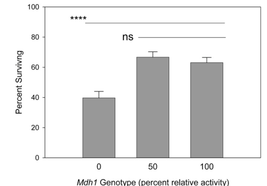

## Question

# Gene Research for Functional Annotation

## ⚠️ CRITICAL: Gene/Protein Identification Context

**BEFORE YOU BEGIN RESEARCH:** You MUST verify you are researching the CORRECT gene/protein. Gene symbols can be ambiguous, especially for less well-characterized genes from non-model organisms.

### Target Gene/Protein Identity (from UniProt):
- **UniProt Accession:** Q9VKX2
- **Protein Description:** RecName: Full=Malate dehydrogenase {ECO:0000256|PROSITE-ProRule:PRU10004, ECO:0000256|RuleBase:RU003405}; EC=1.1.1.37 {ECO:0000256|PROSITE-ProRule:PRU10004, ECO:0000256|RuleBase:RU003405};
- **Gene Information:** Name=Mdh1 {ECO:0000313|EMBL:AAF52935.2, ECO:0000313|FlyBase:FBgn0262782}; Synonyms=cMdh {ECO:0000313|EMBL:AAF52935.2}, CT17038 {ECO:0000313|EMBL:AAF52935.2}, Dmel\CG5362 {ECO:0000313|EMBL:AAF52935.2}, MDH {ECO:0000313|EMBL:AAF52935.2}, Mdh {ECO:0000313|EMBL:AAF52935.2}, MDH-1 {ECO:0000313|EMBL:AAF52935.2}, Mdh-1 {ECO:0000313|EMBL:AAF52935.2}, MDH1 {ECO:0000313|EMBL:AAF52935.2}, Mdh2 {ECO:0000313|EMBL:AAF52935.2}, MdhD {ECO:0000313|EMBL:AAF52935.2}, Q9VKX2 {ECO:0000313|EMBL:AAF52935.2}, sMdh {ECO:0000313|EMBL:AAF52935.2}; ORFNames=CG5362 {ECO:0000313|EMBL:AAF52935.2, ECO:0000313|FlyBase:FBgn0262782}, Dmel_CG5362 {ECO:0000313|EMBL:AAF52935.2};
- **Organism (full):** Drosophila melanogaster (Fruit fly).
- **Protein Family:** Belongs to the LDH/MDH superfamily. MDH type 2 family.
- **Key Domains:** L-lactate/malate_DH. (IPR001557); Lactate/malate_DH_C. (IPR022383); Lactate/malate_DH_N. (IPR001236); Lactate_DH/Glyco_Ohase_4_C. (IPR015955); Malate_DH_AS. (IPR001252)

### MANDATORY VERIFICATION STEPS:

1. **Check if the gene symbol "Mdh1" matches the protein description above**
2. **Verify the organism is correct:** Drosophila melanogaster (Fruit fly).
3. **Check if protein family/domains align with what you find in literature**
4. **If you find literature for a DIFFERENT gene with the same or similar symbol, STOP**

### If Gene Symbol is Ambiguous or You Cannot Find Relevant Literature:

**DO NOT PROCEED WITH RESEARCH ON A DIFFERENT GENE.** Instead:
- State clearly: "The gene symbol 'Mdh1' is ambiguous or literature is limited for this specific protein"
- Explain what you found (e.g., "Found extensive literature on a different gene with the same symbol in a different organism")
- Describe the protein based ONLY on the UniProt information provided above
- Suggest that the protein function can be inferred from domain/family information

### Research Target:

Please provide a comprehensive research report on the gene **Mdh1** (gene ID: Mdh1, UniProt: Q9VKX2) in DROME.

The research report should be a detailed narrative explaining the function, biological processes, and localization of the gene product. Citations should be given for all claims.

You should prioritize authoritative reviews and primary scientific literature when conducting research. You can supplement
this with annotations you find in gene/protein databases, but these can be outdated or inaccurate.

We are specifically interested in the primary function of the gene - for enzymes, what reaction is catalyzed, and what is the substrate specificity? For transporters, what is the substrate? For structural proteins or adapters, what is the broader structural role? For signaling molecules, what is the role in the pathway.

We are interested in where in or outside the cell the gene product carries out its function.

We are also interested in the signaling or biochemical pathways in which the gene functions. We are less interested in broad pleiotropic effects, except where these elucidate the precise role.

Include evidence where possible. We are interested in both experimental evidence as well as inference from structure, evolution, or bioinformatic analysis. Precise studies should be prioritized over high-throughput, where available.

## Output

Question: You are an expert researcher providing comprehensive, well-cited information.

Provide detailed information focusing on:
1. Key concepts and definitions with current understanding
2. Recent developments and latest research (prioritize 2023-2024 sources)
3. Current applications and real-world implementations
4. Expert opinions and analysis from authoritative sources
5. Relevant statistics and data from recent studies

Format as a comprehensive research report with proper citations. Include URLs and publication dates where available.
Always prioritize recent, authoritative sources and provide specific citations for all major claims.

# Gene Research for Functional Annotation

## ⚠️ CRITICAL: Gene/Protein Identification Context

**BEFORE YOU BEGIN RESEARCH:** You MUST verify you are researching the CORRECT gene/protein. Gene symbols can be ambiguous, especially for less well-characterized genes from non-model organisms.

### Target Gene/Protein Identity (from UniProt):
- **UniProt Accession:** Q9VKX2
- **Protein Description:** RecName: Full=Malate dehydrogenase {ECO:0000256|PROSITE-ProRule:PRU10004, ECO:0000256|RuleBase:RU003405}; EC=1.1.1.37 {ECO:0000256|PROSITE-ProRule:PRU10004, ECO:0000256|RuleBase:RU003405};
- **Gene Information:** Name=Mdh1 {ECO:0000313|EMBL:AAF52935.2, ECO:0000313|FlyBase:FBgn0262782}; Synonyms=cMdh {ECO:0000313|EMBL:AAF52935.2}, CT17038 {ECO:0000313|EMBL:AAF52935.2}, Dmel\CG5362 {ECO:0000313|EMBL:AAF52935.2}, MDH {ECO:0000313|EMBL:AAF52935.2}, Mdh {ECO:0000313|EMBL:AAF52935.2}, MDH-1 {ECO:0000313|EMBL:AAF52935.2}, Mdh-1 {ECO:0000313|EMBL:AAF52935.2}, MDH1 {ECO:0000313|EMBL:AAF52935.2}, Mdh2 {ECO:0000313|EMBL:AAF52935.2}, MdhD {ECO:0000313|EMBL:AAF52935.2}, Q9VKX2 {ECO:0000313|EMBL:AAF52935.2}, sMdh {ECO:0000313|EMBL:AAF52935.2}; ORFNames=CG5362 {ECO:0000313|EMBL:AAF52935.2, ECO:0000313|FlyBase:FBgn0262782}, Dmel_CG5362 {ECO:0000313|EMBL:AAF52935.2};
- **Organism (full):** Drosophila melanogaster (Fruit fly).
- **Protein Family:** Belongs to the LDH/MDH superfamily. MDH type 2 family.
- **Key Domains:** L-lactate/malate_DH. (IPR001557); Lactate/malate_DH_C. (IPR022383); Lactate/malate_DH_N. (IPR001236); Lactate_DH/Glyco_Ohase_4_C. (IPR015955); Malate_DH_AS. (IPR001252)

### MANDATORY VERIFICATION STEPS:

1. **Check if the gene symbol "Mdh1" matches the protein description above**
2. **Verify the organism is correct:** Drosophila melanogaster (Fruit fly).
3. **Check if protein family/domains align with what you find in literature**
4. **If you find literature for a DIFFERENT gene with the same or similar symbol, STOP**

### If Gene Symbol is Ambiguous or You Cannot Find Relevant Literature:

**DO NOT PROCEED WITH RESEARCH ON A DIFFERENT GENE.** Instead:
- State clearly: "The gene symbol 'Mdh1' is ambiguous or literature is limited for this specific protein"
- Explain what you found (e.g., "Found extensive literature on a different gene with the same symbol in a different organism")
- Describe the protein based ONLY on the UniProt information provided above
- Suggest that the protein function can be inferred from domain/family information

### Research Target:

Please provide a comprehensive research report on the gene **Mdh1** (gene ID: Mdh1, UniProt: Q9VKX2) in DROME.

The research report should be a detailed narrative explaining the function, biological processes, and localization of the gene product. Citations should be given for all claims.

You should prioritize authoritative reviews and primary scientific literature when conducting research. You can supplement
this with annotations you find in gene/protein databases, but these can be outdated or inaccurate.

We are specifically interested in the primary function of the gene - for enzymes, what reaction is catalyzed, and what is the substrate specificity? For transporters, what is the substrate? For structural proteins or adapters, what is the broader structural role? For signaling molecules, what is the role in the pathway.

We are interested in where in or outside the cell the gene product carries out its function.

We are also interested in the signaling or biochemical pathways in which the gene functions. We are less interested in broad pleiotropic effects, except where these elucidate the precise role.

Include evidence where possible. We are interested in both experimental evidence as well as inference from structure, evolution, or bioinformatic analysis. Precise studies should be prioritized over high-throughput, where available.

# Functional annotation of *Drosophila melanogaster* Mdh1 (CG5362; UniProt Q9VKX2)

## Identity and principal function

**The target is the fly’s cytosolic malate dehydrogenase**, not its mitochondrial malate dehydrogenase, Mdh2. A fly-specific genetic study explicitly identifies *Mdh1* as **CG5362**; older fractionation and genetic-mapping experiments distinguish its cytoplasmic enzyme from a separately encoded mitochondrial-matrix isoenzyme. The Q9VKX2 accession and LDH/MDH-family, malate/lactate-dehydrogenase domain assignments are supplied in the specified UniProt record and are consistent with that experimentally established enzyme identity. The symbol *Mdh1* should not be used here to import findings about similarly named proteins in other organisms. (eanes2009directevidencethat pages 1-2, obrien1973comparativeanalysisof pages 1-4, obrien1973comparativeanalysisof pages 11-14)

The primary catalytic annotation is **NAD-dependent, reversible oxidation of L-malate to oxaloacetate**:

**L-malate + NAD⁺ ⇌ oxaloacetate + NADH + H⁺.**

This assignment has biochemical support in both directions: fly MDH activity was assayed with malate and NAD⁺, measuring NAD⁺ reduction, and with oxaloacetate and NADH, measuring NADH oxidation. The experiments establish the malate/oxaloacetate substrate pair and NAD⁺/NADH cofactor pair; they do **not** establish a cellular net-flux direction or a complete comparative substrate-specificity profile for purified Q9VKX2. Malate dehydrogenase should not be confused with **malic enzyme**, which catalyzes a different, pyruvate-producing reaction. (eanes2009directevidencethat pages 3-4, obrien1973comparativeanalysisof pages 1-4, eanes2009directevidencethat pages 6-8)

| Annotation claim | Evidence tier | Key evidence and interpretation | Source |
|---|---|---|---|
| **Identity and family** | **Direct identity; family annotation** | *D. melanogaster* **Mdh1 = CG5362**; Q9VKX2 is annotated as an LDH/MDH-superfamily, MDH type-2-family protein with N- and C-terminal lactate/malate-dehydrogenase domains. This is the **cytosolic** fly enzyme, not mammalian/yeast proteins with similar symbols and not fly mitochondrial Mdh2. | [UniProt Q9VKX2](https://www.uniprot.org/uniprotkb/Q9VKX2/entry) (user-supplied record); Eanes *et al.*, *Genetics*, 2009, [doi:10.1534/genetics.108.089383](https://doi.org/10.1534/genetics.108.089383) (eanes2009directevidencethat pages 1-2) |
| **Primary reaction and specificity** | **Direct biochemical evidence; reaction equation partly biochemical inference** | NAD-dependent MDH catalysis is **L-malate + NAD⁺ ⇌ oxaloacetate + NADH + H⁺**. A fly Mdh1 assay used 40 mM malate plus 4 mM NAD⁺ and measured NAD⁺ reduction; the complementary assay measured NADH oxidation with oxaloacetate. These reciprocal assays establish malate/oxaloacetate and NAD⁺/NADH as the physiological substrate/product pairs. No fly-specific kinetic constants or convincing alternative-substrate profile were identified. | O’Brien, *Biochemical Genetics*, 1973, [doi:10.1007/BF00485765](https://doi.org/10.1007/BF00485765); Eanes *et al.*, 2009 (eanes2009directevidencethat pages 3-4, obrien1973comparativeanalysisof pages 1-4) |
| **Subcellular localization and mitochondrial distinction** | **Direct fractionation, genetics, and electrophoresis** | Cytoplasmic MDH remained in the post-mitochondrial supernatant, whereas a separately controlled MDH was recovered from the soluble mitochondrial matrix. In crude wild-type homogenate, only about **15%** of total MDH activity was attributed to cytosolic Mdh1; most of the remainder reflected mitochondrial MDH leakage during homogenization. Therefore Q9VKX2 should **not** be annotated as the mitochondrial TCA-cycle MDH. | O’Brien, 1973; Eanes *et al.*, 2009 (eanes2009directevidencethat pages 1-2, obrien1973comparativeanalysisof pages 11-14, obrien1973comparativeanalysisof pages 1-4) |
| **Genetic perturbation and ethanol survival** | **Direct causal in-vivo evidence** | P-element excision alleles generated approximately **0%, 50%, and 100%** normal cytosolic MDH activity. Mdh1 genotype significantly affected survival under 15% ethanol (**F₂,₁₀₅ = 14.69, P < 0.0001**): complete loss reduced tolerance relative to 50% and 100% activity, while separate backgrounds repeatedly associated a partial (~50%) reduction with increased tolerance. Null homozygotes were nevertheless viable and fecund. | Eanes *et al.*, 2009 (eanes2009directevidencethat pages 3-4, eanes2009directevidencethat pages 4-5, eanes2009directevidencethat pages 6-8, eanes2009directevidencethat media 96b09749) |
| **Malate–aspartate shuttle** | **Conserved-function inference; not directly demonstrated for fly Mdh1** | Cytosolic MDH is a canonical malate–aspartate-shuttle component that can regenerate cytosolic NAD⁺ by reducing oxaloacetate to malate. However, the fly study explicitly stated that operation of this shuttle in *Drosophila* was then unknown; abundance of candidate transaminases and the Aralar1 carrier establishes plausibility, not direct Mdh1-dependent flux. | Eanes *et al.*, 2009; recent conserved-pathway review published online Dec. 2024 (eanes2009directevidencethat pages 6-8, ahmed2024theroleof pages 5-7) |
| **Pyruvate–malate / pyruvate–citrate cycling during ethanol metabolism** | **Mechanistic hypothesis** | The non-monotonic ethanol phenotype led the authors to propose that lowering Mdh1 activity may favor citrate export and lipid/triglyceride synthesis during disposal of ethanol-derived acetyl-CoA. Mdh1 may bridge PEPCK- and malic-enzyme-associated flux, but no isotope tracing or direct metabolite-flux measurement proved this model. | Eanes *et al.*, 2009 (eanes2009directevidencethat pages 1-2, eanes2009directevidencethat pages 6-8) |
| **Population variation** | **Direct but limited population-genetic evidence** | Among **14 Mdh1 sequences**, no amino-acid polymorphism was detected. Two silent SNPs (positions 552 and 663) were strongly linked (**average R = 0.813**), but the common TT haplotype showed no significant latitudinal cline—more consistent with purifying constraint than established climate adaptation. | Sezgin *et al.*, *Genetics*, 2004, [doi:10.1534/genetics.104.027649](https://doi.org/10.1534/genetics.104.027649) (sezgin2004singlelocuslatitudinalclines pages 3-5) |
| **Recent evidence status (2023–2024)** | **Evidence-gap finding** | Targeted searches identified **no direct 2023–2024 mechanistic experiment on fly CG5362/Q9VKX2**. Recent MDH1 or shuttle publications found in other organisms cannot be transferred as gene-specific fly evidence. Likewise, the 2015 fly lifespan result concerns **mitochondrial Mdh2**, not Mdh1, and must not be used to annotate Q9VKX2. | Search synthesis; Mdh2 distinction documented in Talbert *et al.*, 2015 (talbert2015geneticperturbationof pages 3-4, ahmed2024theroleof pages 5-7) |

*Table: Evidence-tier summary separating direct fly CG5362/Q9VKX2 observations from pathway-level inference. It also prevents conflation of cytosolic Mdh1 with mitochondrial Mdh2 or similarly named proteins in other organisms.*

## Where the reaction occurs

The established location is the **cytosolic, soluble compartment**. In biochemical fractionation, electrophoretically detectable cytoplasmic MDH remained in the post-mitochondrial supernatant; a distinct MDH activity was recovered from disrupted mitochondrial matrix preparations. Independent genetic behavior of the two activities corroborated their distinction. In wild-type whole-fly homogenates, approximately **15% of measured crude MDH activity** was attributed to cytosolic Mdh1, with most of the remainder attributed to mitochondrial MDH released during homogenization. That percentage describes the assay preparation, **not** the fraction of metabolic flux carried by Mdh1 in living flies. Accordingly, a claim that Q9VKX2 itself performs the mitochondrial matrix step of the tricarboxylic-acid cycle would conflate Mdh1 with Mdh2. (obrien1973comparativeanalysisof pages 1-4, eanes2009directevidencethat pages 1-2, obrien1973comparativeanalysisof pages 11-14)

## Biochemical pathways: established reaction versus proposed physiological roles

By interconverting cytosolic oxaloacetate and malate while interconverting NADH and NAD⁺, Mdh1 is positioned to couple carbon-metabolite exchange to **cytosolic redox balance**. In the canonical **malate–aspartate shuttle**, the cytosolic reaction runs toward malate, consuming glycolysis-derived NADH and regenerating NAD⁺; transport and complementary mitochondrial reactions can then transfer reducing equivalents between compartments. A review published online in **December 2024** describes MDH1/MDH2, transaminases and mitochondrial carriers as components of this conserved shuttle, but its cancer-focused evidence must not be mistaken for an experiment on fly CG5362. Crucially, the fly investigators explicitly said that operation of the malate–aspartate shuttle in *Drosophila* was **unknown** in their study: the presence of candidate transaminases and an aspartate–glutamate carrier made the model plausible, not proven. Thus, **shuttle participation is a well-grounded functional inference, whereas Mdh1-dependent shuttle flux in flies remains unverified by the cited perturbation experiments**. (eanes2009directevidencethat pages 6-8, ahmed2024theroleof pages 5-7)

A second proposed context is **pyruvate–malate and pyruvate–citrate cycling during ethanol metabolism**. Eanes and colleagues argued that changing cytosolic MDH activity could shift how malate and citrate exchange supports disposal of ethanol-derived acetyl-CoA and downstream lipid synthesis. This is their mechanistic interpretation of an unusual, non-monotonic genetic phenotype—not a demonstration that Mdh1 directly oxidizes ethanol, transports citrate, or controls a measured in-vivo citrate-shuttle flux. Their discussion also identifies cytosolic malic enzyme and PEPCK as possible connected steps, rather than assigning their reactions to Mdh1. (eanes2009directevidencethat pages 1-2, eanes2009directevidencethat pages 6-8)

## Direct functional evidence and quantitative findings

In a primary *D. melanogaster* study published in **February 2009**, P-element excision at **CG5362** produced a cytosolic-MDH-loss allele and a precise-excision allele restoring activity. The investigators compared genotypes with approximately **0%, 50%, and 100%** normal cytosolic MDH activity. Under their adult assay—**15% ethanol plus 2% sucrose**, with survival assessed after approximately **48 hours**—Mdh1 genotype had a significant effect (**F₂,₁₀₅ = 14.69; P < 0.0001**). The null homozygote had poorer tolerance than genotypes retaining half or full activity. In additional genetic-background comparisons, approximately **50% activity** was associated with *increased* ethanol tolerance relative to full activity, although not every comparison was significant. The authors reported no significant tested interlocus interactions with *Adh* or *Gpdh*. The experiment establishes a role for Mdh1 activity in this ethanol-survival phenotype; it does not identify which proposed cycle accounts for the effect. The study’s Figure 1B displays the 0%, 50%, and 100% activity comparison. (eanes2009directevidencethat pages 1-2, eanes2009directevidencethat pages 3-4, eanes2009directevidencethat pages 4-5, eanes2009directevidencethat media 96b09749)

Earlier work published in **October 1973** independently supports the biochemical and compartmental assignment: electrophoretic Mdh-1 allozyme variation tracked a cytoplasmic enzyme, and dosage mapping placed its structural locus within chromosome 2L region **28D–29F**, while mitochondrial MDH activity did not follow that locus’s dosage. In population sampling reported in **October 2004**, researchers found **no amino-acid polymorphism among 14 Mdh1 sequences**; two surveyed synonymous SNPs showed linkage disequilibrium (**average R = 0.813**), but their common haplotype showed **no significant latitudinal cline**. These results do not establish natural climate adaptation at Mdh1, despite the experimentally observed ethanol phenotype. (obrien1973comparativeanalysisof pages 11-14, sezgin2004singlelocuslatitudinalclines pages 3-5, eanes2009directevidencethat pages 6-8)

## Recent research and practical use

**Recent-literature limitation:** targeted searches did not identify a **2023–2024 primary mechanistic study directly testing fly CG5362/Q9VKX2**. Recent articles on mammalian MDH1 or the conserved shuttle inform pathway hypotheses but cannot establish fly-specific substrate preferences, compartmental flux, or regulation. Likewise, a fly lifespan experiment published in **2015** perturbed **mitochondrial Mdh2**, not the cytosolic target, and its lifespan results should not be assigned to Q9VKX2. The best-supported real-world research application of *Mdh1* here is as a genetically manipulable **fly model of metabolic redox coupling and ethanol tolerance**, using activity assays, allele series and survival measurements; no gene-specific clinical application is established by these sources. (eanes2009directevidencethat pages 6-8, ahmed2024theroleof pages 5-7, talbert2015geneticperturbationof pages 3-4, eanes2009directevidencethat pages 3-4)

**Bottom line:** annotate Q9VKX2 as a **cytosolic, NAD-dependent L-malate/oxaloacetate oxidoreductase (EC 1.1.1.37)**. Its catalytic identity, compartment and effect on ethanol tolerance have direct fly evidence. Malate–aspartate shuttling and pyruvate–citrate-cycle regulation are credible **pathway-level hypotheses**, not directly measured Mdh1-specific fluxes in the cited fly experiments. (eanes2009directevidencethat pages 1-2, eanes2009directevidencethat pages 6-8, eanes2009directevidencethat pages 3-4, obrien1973comparativeanalysisof pages 1-4)

### Principal sources and dates

- O’Brien SJ. “Comparative analysis of malate dehydrogenases of *Drosophila melanogaster*.” *Biochemical Genetics* **10**, 191–205 (**October 1973**). https://doi.org/10.1007/BF00485765 (obrien1973comparativeanalysisof pages 1-4)
- Sezgin E *et al.* “Single-locus latitudinal clines and their relationship to temperate adaptation in metabolic genes and derived alleles in *Drosophila melanogaster*.” *Genetics* **168**, 923–931 (**October 2004**). https://doi.org/10.1534/genetics.104.027649 (sezgin2004singlelocuslatitudinalclines pages 3-5)
- Eanes WF *et al.* “Direct evidence that genetic variation in glycerol-3-phosphate and malate dehydrogenase genes (*Gpdh* and *Mdh1*) affects adult ethanol tolerance in *Drosophila melanogaster*.” *Genetics* **181**, 607–614 (**February 2009**). https://doi.org/10.1534/genetics.108.089383 (eanes2009directevidencethat pages 1-2, eanes2009directevidencethat pages 3-4)
- Ahmed A *et al.* “The Role of Mitochondrial Solute Carriers SLC25 in Cancer Metabolic Reprogramming.” *International Journal of Molecular Sciences* **26**, 92 (**published online December 2024**; volume dated 2025). https://doi.org/10.3390/ijms26010092 — conserved-pathway context, **not direct fly Mdh1 evidence**. (ahmed2024theroleof pages 5-7)

References

1. (eanes2009directevidencethat pages 1-2): W. Eanes, T. Merritt, J. Flowers, S. Kumagai, and Chen-Tseh Zhu. Direct evidence that genetic variation in glycerol-3-phosphate and malate dehydrogenase genes (gpdh and mdh1) affects adult ethanol tolerance in drosophila melanogaster. Genetics, 181:607-614, Feb 2009. URL: https://doi.org/10.1534/genetics.108.089383, doi:10.1534/genetics.108.089383. This article has 27 citations and is from a domain leading peer-reviewed journal.

2. (obrien1973comparativeanalysisof pages 1-4): Stephen J. O'Brien. Comparative analysis of malate dehydrogenases of drosophila melanogaster. Biochemical Genetics, 10:191-205, Oct 1973. URL: https://doi.org/10.1007/bf00485765, doi:10.1007/bf00485765. This article has 35 citations and is from a peer-reviewed journal.

3. (obrien1973comparativeanalysisof pages 11-14): Stephen J. O'Brien. Comparative analysis of malate dehydrogenases of drosophila melanogaster. Biochemical Genetics, 10:191-205, Oct 1973. URL: https://doi.org/10.1007/bf00485765, doi:10.1007/bf00485765. This article has 35 citations and is from a peer-reviewed journal.

4. (eanes2009directevidencethat pages 3-4): W. Eanes, T. Merritt, J. Flowers, S. Kumagai, and Chen-Tseh Zhu. Direct evidence that genetic variation in glycerol-3-phosphate and malate dehydrogenase genes (gpdh and mdh1) affects adult ethanol tolerance in drosophila melanogaster. Genetics, 181:607-614, Feb 2009. URL: https://doi.org/10.1534/genetics.108.089383, doi:10.1534/genetics.108.089383. This article has 27 citations and is from a domain leading peer-reviewed journal.

5. (eanes2009directevidencethat pages 6-8): W. Eanes, T. Merritt, J. Flowers, S. Kumagai, and Chen-Tseh Zhu. Direct evidence that genetic variation in glycerol-3-phosphate and malate dehydrogenase genes (gpdh and mdh1) affects adult ethanol tolerance in drosophila melanogaster. Genetics, 181:607-614, Feb 2009. URL: https://doi.org/10.1534/genetics.108.089383, doi:10.1534/genetics.108.089383. This article has 27 citations and is from a domain leading peer-reviewed journal.

6. (eanes2009directevidencethat pages 4-5): W. Eanes, T. Merritt, J. Flowers, S. Kumagai, and Chen-Tseh Zhu. Direct evidence that genetic variation in glycerol-3-phosphate and malate dehydrogenase genes (gpdh and mdh1) affects adult ethanol tolerance in drosophila melanogaster. Genetics, 181:607-614, Feb 2009. URL: https://doi.org/10.1534/genetics.108.089383, doi:10.1534/genetics.108.089383. This article has 27 citations and is from a domain leading peer-reviewed journal.

7. (eanes2009directevidencethat media 96b09749): W. Eanes, T. Merritt, J. Flowers, S. Kumagai, and Chen-Tseh Zhu. Direct evidence that genetic variation in glycerol-3-phosphate and malate dehydrogenase genes (gpdh and mdh1) affects adult ethanol tolerance in drosophila melanogaster. Genetics, 181:607-614, Feb 2009. URL: https://doi.org/10.1534/genetics.108.089383, doi:10.1534/genetics.108.089383. This article has 27 citations and is from a domain leading peer-reviewed journal.

8. (ahmed2024theroleof pages 5-7): Amer Ahmed, Giorgia Natalia Iaconisi, Daria Di Molfetta, Vincenzo Coppola, Antonello Caponio, Ansu Singh, Aasia Bibi, Loredana Capobianco, Luigi Palmieri, Vincenza Dolce, and Giuseppe Fiermonte. The role of mitochondrial solute carriers slc25 in cancer metabolic reprogramming: current insights and future perspectives. International Journal of Molecular Sciences, 26:92, Dec 2024. URL: https://doi.org/10.3390/ijms26010092, doi:10.3390/ijms26010092. This article has 27 citations.

9. (sezgin2004singlelocuslatitudinalclines pages 3-5): Efe Sezgin, David D Duvernell, Luciano M Matzkin, Yihao Duan, Chen-Tseh Zhu, Brian C Verrelli, and Walter F Eanes. Single-locus latitudinal clines and their relationship to temperate adaptation in metabolic genes and derived alleles in drosophila melanogaster. Genetics, 168:923-931, Oct 2004. URL: https://doi.org/10.1534/genetics.104.027649, doi:10.1534/genetics.104.027649. This article has 167 citations and is from a domain leading peer-reviewed journal.

10. (talbert2015geneticperturbationof pages 3-4): Matthew E. Talbert, Brittany Barnett, Robert Hoff, Maria Amella, Kate Kuczynski, Erik Lavington, Spencer Koury, Evgeny Brud, and Walter F. Eanes. Genetic perturbation of key central metabolic genes extends lifespan in <i>drosophila</i> and affects response to dietary restriction. Proceedings of the Royal Society B: Biological Sciences, 282:20151646, Sep 2015. URL: https://doi.org/10.1098/rspb.2015.1646, doi:10.1098/rspb.2015.1646. This article has 16 citations.

## Artifacts

- [Edison artifact artifact-00](Mdh1-deep-research-falcon_artifacts/artifact-00.md)

## Citations

1. eanes2009directevidencethat pages 1-2
2. sezgin2004singlelocuslatitudinalclines pages 3-5
3. obrien1973comparativeanalysisof pages 1-4
4. ahmed2024theroleof pages 5-7
5. obrien1973comparativeanalysisof pages 11-14
6. eanes2009directevidencethat pages 3-4
7. eanes2009directevidencethat pages 6-8
8. eanes2009directevidencethat pages 4-5
9. talbert2015geneticperturbationof pages 3-4
10. UniProt Q9VKX2
11. doi:10.1534/genetics.108.089383
12. doi:10.1007/BF00485765
13. doi:10.1534/genetics.104.027649
14. https://www.uniprot.org/uniprotkb/Q9VKX2/entry
15. https://doi.org/10.1534/genetics.108.089383
16. https://doi.org/10.1007/BF00485765
17. https://doi.org/10.1534/genetics.104.027649
18. https://doi.org/10.3390/ijms26010092
19. https://doi.org/10.1534/genetics.108.089383,
20. https://doi.org/10.1007/bf00485765,
21. https://doi.org/10.3390/ijms26010092,
22. https://doi.org/10.1534/genetics.104.027649,
23. https://doi.org/10.1098/rspb.2015.1646,