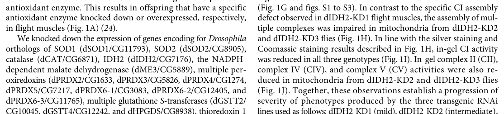

## Question

# Gene Research for Functional Annotation

## ⚠️ CRITICAL: Gene/Protein Identification Context

**BEFORE YOU BEGIN RESEARCH:** You MUST verify you are researching the CORRECT gene/protein. Gene symbols can be ambiguous, especially for less well-characterized genes from non-model organisms.

### Target Gene/Protein Identity (from UniProt):
- **UniProt Accession:** E1JIZ4
- **Protein Description:** RecName: Full=Malic enzyme {ECO:0000256|RuleBase:RU003426};
- **Gene Information:** Name=Men-b {ECO:0000313|EMBL:ACZ95044.1, ECO:0000313|FlyBase:FBgn0029155}; Synonyms=anon-EST:Posey79 {ECO:0000313|EMBL:ACZ95044.1}, dME-3 {ECO:0000313|EMBL:ACZ95044.1}, dME3 {ECO:0000313|EMBL:ACZ95044.1}, Dmel\CG5889 {ECO:0000313|EMBL:ACZ95044.1}, MDH {ECO:0000313|EMBL:ACZ95044.1}, Mdh {ECO:0000313|EMBL:ACZ95044.1}, Men-B {ECO:0000313|EMBL:ACZ95044.1}; ORFNames=CG5889 {ECO:0000313|EMBL:ACZ95044.1, ECO:0000313|FlyBase:FBgn0029155}, Dmel_CG5889 {ECO:0000313|EMBL:ACZ95044.1};
- **Organism (full):** Drosophila melanogaster (Fruit fly).
- **Protein Family:** Belongs to the malic enzymes family.
- **Key Domains:** Aminoacid_DH-like_N_sf. (IPR046346); Malic_enzyme_CS. (IPR015884); Malic_N_dom. (IPR012301); Malic_N_dom_sf. (IPR037062); Malic_NAD-bd. (IPR012302)

### MANDATORY VERIFICATION STEPS:

1. **Check if the gene symbol "Men-b" matches the protein description above**
2. **Verify the organism is correct:** Drosophila melanogaster (Fruit fly).
3. **Check if protein family/domains align with what you find in literature**
4. **If you find literature for a DIFFERENT gene with the same or similar symbol, STOP**

### If Gene Symbol is Ambiguous or You Cannot Find Relevant Literature:

**DO NOT PROCEED WITH RESEARCH ON A DIFFERENT GENE.** Instead:
- State clearly: "The gene symbol 'Men-b' is ambiguous or literature is limited for this specific protein"
- Explain what you found (e.g., "Found extensive literature on a different gene with the same symbol in a different organism")
- Describe the protein based ONLY on the UniProt information provided above
- Suggest that the protein function can be inferred from domain/family information

### Research Target:

Please provide a comprehensive research report on the gene **Men-b** (gene ID: Men-b, UniProt: E1JIZ4) in DROME.

The research report should be a detailed narrative explaining the function, biological processes, and localization of the gene product. Citations should be given for all claims.

You should prioritize authoritative reviews and primary scientific literature when conducting research. You can supplement
this with annotations you find in gene/protein databases, but these can be outdated or inaccurate.

We are specifically interested in the primary function of the gene - for enzymes, what reaction is catalyzed, and what is the substrate specificity? For transporters, what is the substrate? For structural proteins or adapters, what is the broader structural role? For signaling molecules, what is the role in the pathway.

We are interested in where in or outside the cell the gene product carries out its function.

We are also interested in the signaling or biochemical pathways in which the gene functions. We are less interested in broad pleiotropic effects, except where these elucidate the precise role.

Include evidence where possible. We are interested in both experimental evidence as well as inference from structure, evolution, or bioinformatic analysis. Precise studies should be prioritized over high-throughput, where available.

## Output

Question: You are an expert researcher providing comprehensive, well-cited information.

Provide detailed information focusing on:
1. Key concepts and definitions with current understanding
2. Recent developments and latest research (prioritize 2023-2024 sources)
3. Current applications and real-world implementations
4. Expert opinions and analysis from authoritative sources
5. Relevant statistics and data from recent studies

Format as a comprehensive research report with proper citations. Include URLs and publication dates where available.
Always prioritize recent, authoritative sources and provide specific citations for all major claims.

# Gene Research for Functional Annotation

## ⚠️ CRITICAL: Gene/Protein Identification Context

**BEFORE YOU BEGIN RESEARCH:** You MUST verify you are researching the CORRECT gene/protein. Gene symbols can be ambiguous, especially for less well-characterized genes from non-model organisms.

### Target Gene/Protein Identity (from UniProt):
- **UniProt Accession:** E1JIZ4
- **Protein Description:** RecName: Full=Malic enzyme {ECO:0000256|RuleBase:RU003426};
- **Gene Information:** Name=Men-b {ECO:0000313|EMBL:ACZ95044.1, ECO:0000313|FlyBase:FBgn0029155}; Synonyms=anon-EST:Posey79 {ECO:0000313|EMBL:ACZ95044.1}, dME-3 {ECO:0000313|EMBL:ACZ95044.1}, dME3 {ECO:0000313|EMBL:ACZ95044.1}, Dmel\CG5889 {ECO:0000313|EMBL:ACZ95044.1}, MDH {ECO:0000313|EMBL:ACZ95044.1}, Mdh {ECO:0000313|EMBL:ACZ95044.1}, Men-B {ECO:0000313|EMBL:ACZ95044.1}; ORFNames=CG5889 {ECO:0000313|EMBL:ACZ95044.1, ECO:0000313|FlyBase:FBgn0029155}, Dmel_CG5889 {ECO:0000313|EMBL:ACZ95044.1};
- **Organism (full):** Drosophila melanogaster (Fruit fly).
- **Protein Family:** Belongs to the malic enzymes family.
- **Key Domains:** Aminoacid_DH-like_N_sf. (IPR046346); Malic_enzyme_CS. (IPR015884); Malic_N_dom. (IPR012301); Malic_N_dom_sf. (IPR037062); Malic_NAD-bd. (IPR012302)

### MANDATORY VERIFICATION STEPS:

1. **Check if the gene symbol "Men-b" matches the protein description above**
2. **Verify the organism is correct:** Drosophila melanogaster (Fruit fly).
3. **Check if protein family/domains align with what you find in literature**
4. **If you find literature for a DIFFERENT gene with the same or similar symbol, STOP**

### If Gene Symbol is Ambiguous or You Cannot Find Relevant Literature:

**DO NOT PROCEED WITH RESEARCH ON A DIFFERENT GENE.** Instead:
- State clearly: "The gene symbol 'Men-b' is ambiguous or literature is limited for this specific protein"
- Explain what you found (e.g., "Found extensive literature on a different gene with the same symbol in a different organism")
- Describe the protein based ONLY on the UniProt information provided above
- Suggest that the protein function can be inferred from domain/family information

### Research Target:

Please provide a comprehensive research report on the gene **Men-b** (gene ID: Men-b, UniProt: E1JIZ4) in DROME.

The research report should be a detailed narrative explaining the function, biological processes, and localization of the gene product. Citations should be given for all claims.

You should prioritize authoritative reviews and primary scientific literature when conducting research. You can supplement
this with annotations you find in gene/protein databases, but these can be outdated or inaccurate.

We are specifically interested in the primary function of the gene - for enzymes, what reaction is catalyzed, and what is the substrate specificity? For transporters, what is the substrate? For structural proteins or adapters, what is the broader structural role? For signaling molecules, what is the role in the pathway.

We are interested in where in or outside the cell the gene product carries out its function.

We are also interested in the signaling or biochemical pathways in which the gene functions. We are less interested in broad pleiotropic effects, except where these elucidate the precise role.

Include evidence where possible. We are interested in both experimental evidence as well as inference from structure, evolution, or bioinformatic analysis. Precise studies should be prioritized over high-throughput, where available.

# Functional annotation report: *Drosophila melanogaster* Men-b

## Identity and evidence standard

**Men-b is CG5889, the fly protein annotated as malic enzyme under UniProt accession [E1JIZ4](https://www.uniprot.org/uniprotkb/E1JIZ4/entry).** The accession, organism, aliases and malic-enzyme domains in the question identify this specific protein. Independently, Murari and colleagues explicitly identify **CG5889 (Men-b)** as the *Drosophila* ortholog of mitochondrial malic enzyme 3 (dME3). It should not be conflated with the separately named fly malic enzyme **Men**, or with studies of other organisms’ similarly named genes. The supplied Malic_N_dom, Malic_NAD-bd and Malic_enzyme_CS annotations are consistent with this enzyme-family assignment, but domains alone cannot establish measured substrate preferences. (murari2022idh2mediatedregulationof pages 10-12, moon2024identificationofhigh pages 7-9)

## Primary biochemical function and location

The best-supported **functional assignment** is an NADP⁺-dependent malic enzyme catalyzing oxidative decarboxylation:

**L-malate + NADP⁺ → pyruvate + CO₂ + NADPH** (with proton and charge conventions omitted).

This identifies malate as the expected carbon substrate and NADP⁺ as the expected electron-accepting cofactor; the products connect malate/pyruvate metabolism to NADPH production. Murari *et al.* state that malic enzymes perform this reaction, that ME3 uses NADP⁺, and that CG5889/Men-b is the fly ME3 ortholog. They distinguish ME3 from ME2, which can use either NADP⁺ or NAD⁺. **For CG5889 specifically, these are orthology-based assignments:** the retrieved study does not report purified Men-b turnover, a substrate panel, kinetic constants or a direct NADP⁺-versus-NAD⁺ comparison. Other substrate specificities should therefore not be presumed. (murari2022idh2mediatedregulationof pages 10-12)

**Localization:** The proposed site of action is **inside mitochondria, most plausibly in the matrix**, where malate oxidation could supply mitochondrial NADPH. This follows the reported mitochondrial localization of the ME3 isoform and its proposed relationship to matrix-facing respiratory-complex assembly; it is **not a Men-b-specific localization measurement**. Importantly, the direct mitochondrial-localization experiment in Murari *et al.* tested **dIDH2/CG7176**, not Men-b. Matrix targeting and any possible additional compartments remain to be established experimentally for E1JIZ4. (murari2022idh2mediatedregulationof pages 10-12, murari2022idh2mediatedregulationof pages 2-3)

## Pathway role and direct experimental evidence

Men-b is most appropriately placed in **mitochondrial malate-to-pyruvate metabolism and NADPH redox metabolism**, with a demonstrated genetic connection to **respiratory complex I biogenesis**. In the peer-reviewed study by Murari *et al.*, muscle-directed dME3/CG5889 RNA interference impaired complex I assembly in adult fly flight muscles, assayed by silver staining of native gels of mitochondrial preparations. Figure 1B provides the relevant control and dME3-RNAi lanes. The authors examined dME3-RNAi flies **two days after adult eclosion because of early lethality**; this timing is not a quantified survival estimate. A Men-b-specific assembly effect size, statistical test or enzyme-activity result is not reported in the cited passage. (murari2022idh2mediatedregulationof pages 2-3, murari2022idh2mediatedregulationof pages 3-5, murari2022idh2mediatedregulationof media cab851de)

The mechanistic interpretation is that a mitochondrial NADPH-producing enzyme helps maintain conditions needed for complex I assembly. **The assembly phenotype is direct evidence; NADPH deficiency as its specific causal mechanism is not directly established for Men-b.** Detailed NADP⁺/NADPH, reactive-oxygen-species, ferroptosis and complex-I-intermediate analyses in this paper chiefly concern **dIDH2 knockdown** and should not be presented as measurements of Men-b knockdown. No Men-b-specific rescue or direct malic-enzyme activity test was identified in the retrieved evidence. Murari *et al.*, “IDH2-mediated regulation of the biogenesis of the oxidative phosphorylation system,” *Science Advances*, **11 May 2022**, [doi:10.1126/sciadv.abl8716](https://doi.org/10.1126/sciadv.abl8716). (murari2022idh2mediatedregulationof pages 10-12, murari2022idh2mediatedregulationof pages 2-3, murari2022idh2mediatedregulationof pages 3-5)

## Developments reported in 2024

- **Tissue-specific metabolic modeling.** Moon *et al.* modeled **32** fly tissue-specific metabolic networks and assigned Men-b to mitochondrial NADPH metabolism. Their flux-variability analysis predicted greater ranges for its associated reaction in **fat body, glia, germline and nervous-system tissues**. These are *modeled permissible flux ranges*, not measured Men-b catalytic rates or evidence that Men-b is most active in those tissues. The broader study combined modeling with experimental metabolic analyses, but the Men-b-specific tissue comparison is a prediction. “Identification of high sugar diet-induced dysregulated metabolic pathways in muscle using tissue-specific metabolic models in Drosophila,” bioRxiv preprint, **posted 28 April 2024**, [doi:10.1101/2024.04.24.591006](https://doi.org/10.1101/2024.04.24.591006). (moon2024identificationofhigh pages 5-7, moon2024identificationofhigh pages 7-9)
- **Dietary-stress transcriptomics.** Mahanta *et al.* reported **upregulated Men-b transcripts** among pyruvate-metabolism genes in larval immune cells exposed to a high-sugar diet. Their separate isotope-tracing experiments address broader pyruvate metabolism, **not flux through Men-b itself**; the retrieved text supplies no Men-b-specific expression fold change or causal Men-b perturbation. “Dietary stress induced macrophage metabolic reprogramming, a determinant of animal growth,” bioRxiv preprint, **posted 21 April 2024**, [doi:10.1101/2024.04.18.590077](https://doi.org/10.1101/2024.04.18.590077). (mahanta2024dietarystressinduced pages 14-17)

Both 2024 sources above are **preprints in the retrieved versions** and add physiological context rather than independently establishing the enzyme’s reaction or subcellular location. (moon2024identificationofhigh pages 5-7, mahanta2024dietarystressinduced pages 14-17)

The following evidence table separates observations from annotations and predictions.

| Claim | Evidence type and finding | Key limitation |
|---|---|---|
| **Identity:** *D. melanogaster* CG5889/Men-b (UniProt E1JIZ4) is the mitochondrial malic-enzyme-3 ortholog, dME3 | A peer-reviewed primary study explicitly identifies CG5889 (Men-b) as the fly ortholog of ME3 and groups it with mitochondrial, NADP-dependent malic enzymes; published May 11, 2022 (murari2022idh2mediatedregulationof pages 10-12, murari2022idh2mediatedregulationof pages 2-3) | Orthology is stated rather than demonstrated through a dedicated phylogenetic or complementation analysis; Men-b must not be confused with other fly malic-enzyme genes. |
| **Predicted primary reaction:** L-malate + NADP⁺ → pyruvate + CO₂ + NADPH | Family, domain, and ME3-orthology inference. Murari et al. state that malic enzymes oxidatively decarboxylate malate to pyruvate and that ME3 uses NADP⁺ (murari2022idh2mediatedregulationof pages 10-12) | No purified-CG5889 enzyme assay, kinetic constants, substrate panel, or direct NADP⁺-versus-NAD⁺ specificity experiment was located; substrate and cofactor specificity therefore remain inferred for this fly protein. |
| **Predicted localization:** mitochondrial matrix | ME3 is described as a mitochondrial isoform, so the Men-b NADPH-generating reaction is assigned to mitochondrial metabolism (murari2022idh2mediatedregulationof pages 10-12) | No Men-b-specific microscopy, tagged-protein localization, protease-protection assay, or mitochondrial-fractionation validation was reported. The paper's direct localization experiment concerned dIDH2, not Men-b (murari2022idh2mediatedregulationof pages 2-3). |
| **Direct functional phenotype:** Men-b/dME3 depletion impairs respiratory complex I assembly in flight muscle | Dmef2-Gal4-driven dME3 RNAi was tested in adult thoracic or flight muscle. Silver-stained native gels showed impaired complex-I assembly in Fig. 1B; the panel and legend identify the control and dME3-RNAi lanes (murari2022idh2mediatedregulationof pages 2-3, murari2022idh2mediatedregulationof media cab851de) | Evidence comes from RNAi without a Men-b rescue, null allele, enzyme-activity measurement, or reported Men-b-specific effect size and statistical test. It establishes an assembly phenotype but not the precise NADPH-dependent mechanism. |
| **Early viability concern:** dME3-RNAi samples were analyzed two days after adult eclosion | The Fig. 1 legend states that dME3-RNAi flies were analyzed at two days because of early lethality (murari2022idh2mediatedregulationof pages 2-3, murari2022idh2mediatedregulationof pages 3-5, murari2022idh2mediatedregulationof media 87d347b6) | This is not a quantified Men-b survival curve: onset, penetrance, median survival, sample size, and statistical significance were not reported for dME3-RNAi in the cited passage. |
| **Recent tissue-level prediction:** Men-b reaction capacity varies among tissues | A 2024 bioRxiv preprint used tissue-specific genome-scale metabolic models and predicted greater Men-b-associated mitochondrial NADPH flux ranges in fat body, glia, germline, and nervous system; posted April 28, 2024 (moon2024identificationofhigh pages 7-9) | This is a computational flux-variability result based on model assumptions and expression-derived constraints; no Men-b perturbation or direct tissue-resolved flux measurement validated it. |
| **Recent dietary-stress association:** Men-b transcript increases in high-sugar-exposed larval macrophages | A 2024 bioRxiv preprint reported Men-b among pyruvate-metabolism genes upregulated in immune-cell RNA sequencing under high-sugar conditions; posted April 21, 2024 (mahanta2024dietarystressinduced pages 14-17) | This is a directional transcript association. No Men-b-specific fold change was given in the retrieved text, and no causal Men-b knockdown, rescue, protein, enzyme-activity, or flux experiment was reported. The isotope-tracing results cannot be attributed specifically to Men-b. |

*Table: Evidence hierarchy for CG5889/Men-b (UniProt E1JIZ4), separating direct fly experiments from orthology-based annotation and recent computational or transcriptomic associations. The complex-I assembly defect is direct evidence, whereas reaction specificity and matrix localization remain inferred.*

**Bottom line.** CG5889/Men-b is credibly annotated as the fly mitochondrial, NADP⁺-dependent malic-enzyme-3 counterpart: its **predicted primary reaction** converts malate to pyruvate while producing NADPH. Its clearest **direct functional evidence** is impaired flight-muscle complex I assembly after Men-b/dME3 RNAi. Confirming the exact compartment, kinetic substrate/cofactor specificity and whether NADPH depletion mediates that assembly defect requires Men-b-specific biochemical, localization and rescue experiments. (murari2022idh2mediatedregulationof pages 10-12, murari2022idh2mediatedregulationof pages 2-3, murari2022idh2mediatedregulationof media cab851de)

References

1. (murari2022idh2mediatedregulationof pages 10-12): Anjaneyulu Murari, Naga S. V. Goparaju, Shauna-Kay Rhooms, Kaniz F. B. Hossain, Felix G. Liang, Christian J. Garcia, Cindy Osei, Tong Liu, Hong Li, Richard N. Kitsis, Rajesh Patel, and Edward Owusu-Ansah. Idh2-mediated regulation of the biogenesis of the oxidative phosphorylation system. Science Advances, May 2022. URL: https://doi.org/10.1126/sciadv.abl8716, doi:10.1126/sciadv.abl8716. This article has 28 citations and is from a highest quality peer-reviewed journal.

2. (moon2024identificationofhigh pages 7-9): Sun Jin Moon, Yanhui Hu, Monika Dzieciatkowska, Ah-Ram Kim, Po-Lin Chen, John M. Asara, Angelo D'Alessandro, and Norbert Perrimon. Identification of high sugar diet-induced dysregulated metabolic pathways in muscle using tissue-specific metabolic models in drosophila. bioRxiv, Apr 2024. URL: https://doi.org/10.1101/2024.04.24.591006, doi:10.1101/2024.04.24.591006. This article has 3 citations.

3. (murari2022idh2mediatedregulationof pages 2-3): Anjaneyulu Murari, Naga S. V. Goparaju, Shauna-Kay Rhooms, Kaniz F. B. Hossain, Felix G. Liang, Christian J. Garcia, Cindy Osei, Tong Liu, Hong Li, Richard N. Kitsis, Rajesh Patel, and Edward Owusu-Ansah. Idh2-mediated regulation of the biogenesis of the oxidative phosphorylation system. Science Advances, May 2022. URL: https://doi.org/10.1126/sciadv.abl8716, doi:10.1126/sciadv.abl8716. This article has 28 citations and is from a highest quality peer-reviewed journal.

4. (murari2022idh2mediatedregulationof pages 3-5): Anjaneyulu Murari, Naga S. V. Goparaju, Shauna-Kay Rhooms, Kaniz F. B. Hossain, Felix G. Liang, Christian J. Garcia, Cindy Osei, Tong Liu, Hong Li, Richard N. Kitsis, Rajesh Patel, and Edward Owusu-Ansah. Idh2-mediated regulation of the biogenesis of the oxidative phosphorylation system. Science Advances, May 2022. URL: https://doi.org/10.1126/sciadv.abl8716, doi:10.1126/sciadv.abl8716. This article has 28 citations and is from a highest quality peer-reviewed journal.

5. (murari2022idh2mediatedregulationof media cab851de): Anjaneyulu Murari, Naga S. V. Goparaju, Shauna-Kay Rhooms, Kaniz F. B. Hossain, Felix G. Liang, Christian J. Garcia, Cindy Osei, Tong Liu, Hong Li, Richard N. Kitsis, Rajesh Patel, and Edward Owusu-Ansah. Idh2-mediated regulation of the biogenesis of the oxidative phosphorylation system. Science Advances, May 2022. URL: https://doi.org/10.1126/sciadv.abl8716, doi:10.1126/sciadv.abl8716. This article has 28 citations and is from a highest quality peer-reviewed journal.

6. (moon2024identificationofhigh pages 5-7): Sun Jin Moon, Yanhui Hu, Monika Dzieciatkowska, Ah-Ram Kim, Po-Lin Chen, John M. Asara, Angelo D'Alessandro, and Norbert Perrimon. Identification of high sugar diet-induced dysregulated metabolic pathways in muscle using tissue-specific metabolic models in drosophila. bioRxiv, Apr 2024. URL: https://doi.org/10.1101/2024.04.24.591006, doi:10.1101/2024.04.24.591006. This article has 3 citations.

7. (mahanta2024dietarystressinduced pages 14-17): Anusree Mahanta, Sajad Ahmad Najar, Nivedita Hariharan, Manisha Goyal, Ramaswamy Subramanian, Angela Giangrande, Dasaradhi Palakodeti, and Tina Mukherjee. Dietary stress induced macrophage metabolic reprogramming, a determinant of animal growth. bioRxiv, Apr 2024. URL: https://doi.org/10.1101/2024.04.18.590077, doi:10.1101/2024.04.18.590077. This article has 1 citations.

8. (murari2022idh2mediatedregulationof media 87d347b6): Anjaneyulu Murari, Naga S. V. Goparaju, Shauna-Kay Rhooms, Kaniz F. B. Hossain, Felix G. Liang, Christian J. Garcia, Cindy Osei, Tong Liu, Hong Li, Richard N. Kitsis, Rajesh Patel, and Edward Owusu-Ansah. Idh2-mediated regulation of the biogenesis of the oxidative phosphorylation system. Science Advances, May 2022. URL: https://doi.org/10.1126/sciadv.abl8716, doi:10.1126/sciadv.abl8716. This article has 28 citations and is from a highest quality peer-reviewed journal.

## Artifacts

- [Edison artifact artifact-00](Men-b-deep-research-falcon_artifacts/artifact-00.md)

## Citations

1. mahanta2024dietarystressinduced pages 14-17
2. moon2024identificationofhigh pages 7-9
3. moon2024identificationofhigh pages 5-7
4. E1JIZ4
5. doi:10.1126/sciadv.abl8716
6. doi:10.1101/2024.04.24.591006
7. doi:10.1101/2024.04.18.590077
8. https://www.uniprot.org/uniprotkb/E1JIZ4/entry
9. https://doi.org/10.1126/sciadv.abl8716
10. https://doi.org/10.1101/2024.04.24.591006
11. https://doi.org/10.1101/2024.04.18.590077
12. https://doi.org/10.1126/sciadv.abl8716,
13. https://doi.org/10.1101/2024.04.24.591006,
14. https://doi.org/10.1101/2024.04.18.590077,