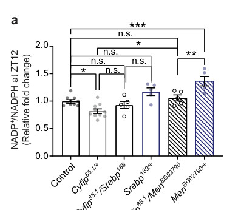

## Question

# Gene Research for Functional Annotation

## ⚠️ CRITICAL: Gene/Protein Identification Context

**BEFORE YOU BEGIN RESEARCH:** You MUST verify you are researching the CORRECT gene/protein. Gene symbols can be ambiguous, especially for less well-characterized genes from non-model organisms.

### Target Gene/Protein Identity (from UniProt):
- **UniProt Accession:** Q9VG31
- **Protein Description:** RecName: Full=Malic enzyme {ECO:0000256|RuleBase:RU003426};
- **Gene Information:** Name=Men {ECO:0000313|EMBL:AAF54859.1, ECO:0000313|FlyBase:FBgn0002719}; Synonyms=anon-WO0118547.278 {ECO:0000313|EMBL:AAF54859.1}, Dmel\CG10120 {ECO:0000313|EMBL:AAF54859.1}, MDH {ECO:0000313|EMBL:AAF54859.1}, Mdh-NADP {ECO:0000313|EMBL:AAF54859.1}, ME {ECO:0000313|EMBL:AAF54859.1}, Me {ECO:0000313|EMBL:AAF54859.1}, ME1 {ECO:0000313|EMBL:AAF54859.1}, mem {ECO:0000313|EMBL:AAF54859.1}, MEN {ECO:0000313|EMBL:AAF54859.1}, men {ECO:0000313|EMBL:AAF54859.1}; ORFNames=CG10120 {ECO:0000313|EMBL:AAF54859.1, ECO:0000313|FlyBase:FBgn0002719}, Dmel_CG10120 {ECO:0000313|EMBL:AAF54859.1};
- **Organism (full):** Drosophila melanogaster (Fruit fly).
- **Protein Family:** Belongs to the malic enzymes family.
- **Key Domains:** Aminoacid_DH-like_N_sf. (IPR046346); Malic_enzyme_CS. (IPR015884); Malic_N_dom. (IPR012301); Malic_N_dom_sf. (IPR037062); Malic_NAD-bd. (IPR012302)

### MANDATORY VERIFICATION STEPS:

1. **Check if the gene symbol "Men" matches the protein description above**
2. **Verify the organism is correct:** Drosophila melanogaster (Fruit fly).
3. **Check if protein family/domains align with what you find in literature**
4. **If you find literature for a DIFFERENT gene with the same or similar symbol, STOP**

### If Gene Symbol is Ambiguous or You Cannot Find Relevant Literature:

**DO NOT PROCEED WITH RESEARCH ON A DIFFERENT GENE.** Instead:
- State clearly: "The gene symbol 'Men' is ambiguous or literature is limited for this specific protein"
- Explain what you found (e.g., "Found extensive literature on a different gene with the same symbol in a different organism")
- Describe the protein based ONLY on the UniProt information provided above
- Suggest that the protein function can be inferred from domain/family information

### Research Target:

Please provide a comprehensive research report on the gene **Men** (gene ID: Men, UniProt: Q9VG31) in DROME.

The research report should be a detailed narrative explaining the function, biological processes, and localization of the gene product. Citations should be given for all claims.

You should prioritize authoritative reviews and primary scientific literature when conducting research. You can supplement
this with annotations you find in gene/protein databases, but these can be outdated or inaccurate.

We are specifically interested in the primary function of the gene - for enzymes, what reaction is catalyzed, and what is the substrate specificity? For transporters, what is the substrate? For structural proteins or adapters, what is the broader structural role? For signaling molecules, what is the role in the pathway.

We are interested in where in or outside the cell the gene product carries out its function.

We are also interested in the signaling or biochemical pathways in which the gene functions. We are less interested in broad pleiotropic effects, except where these elucidate the precise role.

Include evidence where possible. We are interested in both experimental evidence as well as inference from structure, evolution, or bioinformatic analysis. Precise studies should be prioritized over high-throughput, where available.

## Output

Question: You are an expert researcher providing comprehensive, well-cited information.

Provide detailed information focusing on:
1. Key concepts and definitions with current understanding
2. Recent developments and latest research (prioritize 2023-2024 sources)
3. Current applications and real-world implementations
4. Expert opinions and analysis from authoritative sources
5. Relevant statistics and data from recent studies

Format as a comprehensive research report with proper citations. Include URLs and publication dates where available.
Always prioritize recent, authoritative sources and provide specific citations for all major claims.

# Gene Research for Functional Annotation

## ⚠️ CRITICAL: Gene/Protein Identification Context

**BEFORE YOU BEGIN RESEARCH:** You MUST verify you are researching the CORRECT gene/protein. Gene symbols can be ambiguous, especially for less well-characterized genes from non-model organisms.

### Target Gene/Protein Identity (from UniProt):
- **UniProt Accession:** Q9VG31
- **Protein Description:** RecName: Full=Malic enzyme {ECO:0000256|RuleBase:RU003426};
- **Gene Information:** Name=Men {ECO:0000313|EMBL:AAF54859.1, ECO:0000313|FlyBase:FBgn0002719}; Synonyms=anon-WO0118547.278 {ECO:0000313|EMBL:AAF54859.1}, Dmel\CG10120 {ECO:0000313|EMBL:AAF54859.1}, MDH {ECO:0000313|EMBL:AAF54859.1}, Mdh-NADP {ECO:0000313|EMBL:AAF54859.1}, ME {ECO:0000313|EMBL:AAF54859.1}, Me {ECO:0000313|EMBL:AAF54859.1}, ME1 {ECO:0000313|EMBL:AAF54859.1}, mem {ECO:0000313|EMBL:AAF54859.1}, MEN {ECO:0000313|EMBL:AAF54859.1}, men {ECO:0000313|EMBL:AAF54859.1}; ORFNames=CG10120 {ECO:0000313|EMBL:AAF54859.1, ECO:0000313|FlyBase:FBgn0002719}, Dmel_CG10120 {ECO:0000313|EMBL:AAF54859.1};
- **Organism (full):** Drosophila melanogaster (Fruit fly).
- **Protein Family:** Belongs to the malic enzymes family.
- **Key Domains:** Aminoacid_DH-like_N_sf. (IPR046346); Malic_enzyme_CS. (IPR015884); Malic_N_dom. (IPR012301); Malic_N_dom_sf. (IPR037062); Malic_NAD-bd. (IPR012302)

### MANDATORY VERIFICATION STEPS:

1. **Check if the gene symbol "Men" matches the protein description above**
2. **Verify the organism is correct:** Drosophila melanogaster (Fruit fly).
3. **Check if protein family/domains align with what you find in literature**
4. **If you find literature for a DIFFERENT gene with the same or similar symbol, STOP**

### If Gene Symbol is Ambiguous or You Cannot Find Relevant Literature:

**DO NOT PROCEED WITH RESEARCH ON A DIFFERENT GENE.** Instead:
- State clearly: "The gene symbol 'Men' is ambiguous or literature is limited for this specific protein"
- Explain what you found (e.g., "Found extensive literature on a different gene with the same symbol in a different organism")
- Describe the protein based ONLY on the UniProt information provided above
- Suggest that the protein function can be inferred from domain/family information

### Research Target:

Please provide a comprehensive research report on the gene **Men** (gene ID: Men, UniProt: Q9VG31) in DROME.

The research report should be a detailed narrative explaining the function, biological processes, and localization of the gene product. Citations should be given for all claims.

You should prioritize authoritative reviews and primary scientific literature when conducting research. You can supplement
this with annotations you find in gene/protein databases, but these can be outdated or inaccurate.

We are specifically interested in the primary function of the gene - for enzymes, what reaction is catalyzed, and what is the substrate specificity? For transporters, what is the substrate? For structural proteins or adapters, what is the broader structural role? For signaling molecules, what is the role in the pathway.

We are interested in where in or outside the cell the gene product carries out its function.

We are also interested in the signaling or biochemical pathways in which the gene functions. We are less interested in broad pleiotropic effects, except where these elucidate the precise role.

Include evidence where possible. We are interested in both experimental evidence as well as inference from structure, evolution, or bioinformatic analysis. Precise studies should be prioritized over high-throughput, where available.

# Functional annotation of *Drosophila melanogaster* Men

## Identity and principal function

**Men (CG10120; UniProt Q9VG31) encodes the fruit-fly NADP-dependent malic enzyme**, EC 1.1.1.40. The supplied UniProt assignment to the malic-enzyme family, including its malic-enzyme catalytic and NAD-binding domains, agrees with experimental work on the fly *Men* locus: loss-of-function animals lack the assayed enzyme activity, and changing gene dosage changes both activity and immunoreactive protein. Historical synonyms such as **MDH** should not be read as evidence that this protein is conventional malate dehydrogenase; neither unrelated human MEN1 nor malic enzymes in other organisms are the subject of this report. The modern CG10120/accession mapping is supplied in the question; the older biochemical papers identify the fly locus as *Men*. (geer1979ontogenycelldistribution pages 1-4, geer1979ontogenycelldistribution pages 7-10)

The principal reaction is the **oxidative decarboxylation of L-malate**:

**L-malate + NADP⁺ → pyruvate + CO₂ + NADPH** (with proton balance dependent on reaction notation).

Thus Men connects malate/pyruvate metabolism to production of cellular reducing power; it does **not** simply oxidize malate to oxaloacetate. Geer and colleagues directly assayed fly enzyme with L-malate, NADP⁺ and Mn²⁺, measuring NADPH formation at 340 nm. These experiments establish use of those substrates and a compatible divalent-metal condition, but do not establish exhaustive discrimination against every alternative cofactor or substrate under physiological conditions. (geer1979ontogenycelldistribution pages 1-4, geer1979ontogenycelldistribution pages 4-7)

## Where it acts

**The best-supported subcellular assignment is the cytosol.** In adult-fly fractionation, **96.7%** of recovered NADP-malic-enzyme activity was in the soluble 105,000 × *g* supernatant, compared with **1.5%** in the mitochondrial fraction. Activity was absent from *Men*-null adults in every fraction, supporting the investigators’ conclusion that small particulate signals in wild type arose from the same predominantly soluble enzyme rather than a separately detectable mitochondrial NADP-malic-enzyme activity. This is biochemical fractionation evidence, not a high-resolution image of Men within individual cells. (geer1979ontogenycelldistribution pages 7-10)

Men activity is widely distributed rather than confined to one tissue. The original study measured it in larval fat body, gut and salivary gland and in adult thorax, gonads and gut; larval fat body had the highest activity among the tested tissues, **355.6 nmol NADP⁺ reduced/min/mg protein**. Later experiments measured Men-linked metabolism in cultured S2 cells and fly heads. Head measurements establish a role in brain-associated metabolism, **not** that Men protein has been localized to a particular sleep-regulating neuron. (geer1979ontogenycelldistribution pages 4-7, yang2010metabolicregulationof pages 2-5, mariano2023srebpmodulatesthe pages 7-8)

## Biochemical pathways and physiological evidence

**Cytosolic NADPH provision and lipid metabolism.** Men supplies NADPH to the cellular redox network alongside enzymes such as glucose-6-phosphate dehydrogenase, 6-phosphogluconate dehydrogenase and NADP-dependent isocitrate dehydrogenase. NADPH can support reductive biosynthesis and antioxidant systems; in growing larvae, the fat-body activity and dietary response support an especially important contribution to lipogenic metabolism. Men activity was high in early third-instar larvae, decreased during pupation and rose after adult emergence. Dietary sucrose increased both activity and immunoreactive enzyme, whereas dietary lipid decreased both, indicating a change in functional enzyme abundance rather than activity alone. These observations support a lipogenic role, although the nutritional experiments do not directly measure the fraction of fatty-acid synthesis supplied by Men. (geer1979ontogenycelldistribution pages 1-4, geer1979ontogenycelldistribution pages 7-10, geer1979ontogenycelldistribution pages 4-7, bradshaw2019cytoplasmicandmitochondrial pages 8-10)

The larval loss-of-function comparison is particularly informative: wild-type early third-instar larvae contained **1.16 ng NADPH/µg protein** and had an **NADPH/NADP⁺ ratio of 8.9**; *Men*-null larvae contained **0.68 ng/µg** and had a ratio of **1.3**. The authors estimated a contribution of approximately **33% of larval NADPH**. This is an estimate derived from **steady-state cofactor measurements**, not an isotope-tracing measurement establishing that one-third of NADPH production *flux* always passes through Men. It should not be transferred unqualified to other ages, diets or tissues. (geer1979ontogenycelldistribution pages 7-10)

**Redox-dependent apoptosis.** In fly S2 cells, Yang and colleagues found that *Men* knockdown largely removed the protection provided by malate against cycloheximide-induced apoptosis. Their experiments link cytoplasmic malate use and NADPH to inhibitory phosphorylation of the initiator caspase Dronc at **Ser130**: the nonphosphorylatable Dronc-S130A variant prevented malate-mediated rescue. This is a mechanistic downstream consequence of Men’s NADPH-producing activity in cultured cells, rather than a second catalytic function of Men itself. [Yang et al., *EMBO Journal*, September 2010](https://doi.org/10.1038/emboj.2010.191). (yang2010metabolicregulationof pages 2-5, yang2010metabolicregulationof pages 5-6)

**Reductive-stress disease modeling.** In a fly model expressing cardiomyopathy-associated human CryAB-R120G, Xie and colleagues found that lowering fly MEN, as well as other NADPH-producing enzymes, suppressed pathology. This complements the apoptosis result: more NADPH is not necessarily beneficial in every setting, because the relevant outcome depends on the cellular redox state. The result establishes utility of *Men* manipulation in a **Drosophila disease model**, not treatment efficacy against human cardiomyopathy. [Xie et al., *PLoS Genetics*, June 2013](https://doi.org/10.1371/journal.pgen.1003544). (xie2013thenadphmetabolic pages 1-2, xie2013thenadphmetabolic pages 7-9)

## Recent development: SREBP–Men control of nighttime sleep

The clearest gene-specific recent mechanistic advance located in this search is [Mariano et al., *Nature Communications*, February 2023](https://doi.org/10.1038/s41467-022-35577-8). In *Cyfip* heterozygous flies, elevated SREBP activity increased *Men* expression and malic-enzyme activity and disturbed the daily **NADP⁺/NADPH** balance around night onset. Genetic reduction of *Men* in this background moved the measured head redox ratio toward control values and ameliorated the nighttime-sleep deficit; genetic reduction of SREBP also improved the phenotype. Neuronal, but not tested glial, *Cyfip* knockdown reproduced reduced night sleep, supporting a neuronal contribution to the upstream phenotype. Together these experiments support a **CYFIP → SREBP → Men → NADP⁺/NADPH → sleep** model, while pooled-head biochemical measurements do not prove the redox change occurs exclusively within sleep-promoting neurons. (mariano2023srebpmodulatesthe pages 1-2, mariano2023srebpmodulatesthe pages 7-7, mariano2023srebpmodulatesthe media c9a8bad7, mariano2023srebpmodulatesthe media 97f7a05f)

The study provides useful scale for its findings: ZT12 NADP⁺/NADPH comparisons used **10 pooled-head samples** each for controls and *Cyfip* heterozygotes and **5** for each reported Men-reduction comparison group; night-sleep groups comprised **71 controls, 51 *Cyfip* heterozygotes, 60 *Cyfip/Men* genetic-combination flies and 35 *Men* heterozygotes**. Figure 5 shows the redox and sleep comparisons. SREBP inhibition with **betulin** was also tested **in flies**, but betulin is an upstream pathway intervention, not evidence of a selective Men inhibitor or an established human sleep treatment. No comparably direct **2024** primary mechanistic study of this particular fly gene was identified in the retrieved evidence; unrelated 2024 malic-enzyme or other-organism findings should not be substituted for it. (mariano2023srebpmodulatesthe pages 7-8, mariano2023srebpmodulatesthe media c9a8bad7, mariano2023srebpmodulatesthe media 97f7a05f, mariano2023srebpmodulatesthe pages 7-7, mariano2023srebpmodulatesthe pages 11-12)

The following evidence summary separates direct biochemical results from downstream model-organism applications and notes important limits on quantitative interpretation. (geer1979ontogenycelldistribution pages 7-10, yang2010metabolicregulationof pages 5-6, mariano2023srebpmodulatesthe pages 7-8)

| Function | Direct finding and quantitative detail | Study/date and URL | Interpretation and limitation |
|---|---|---|---|
| Catalytic identity and substrate/cofactor specificity | NADP-malic-enzyme activity was assayed as **L-malate oxidative decarboxylation** with 10 mM L-malate, 0.34 mM NADP⁺ and 5 mM MnCl₂; NADPH formation was followed at 340 nm. Men-null homozygotes lacked activity and immunoreactive enzyme. One gene dose yielded about 50% activity and 47% cross-reacting material (CRM) relative to two doses; three doses increased activity and CRM. (geer1979ontogenycelldistribution pages 1-4, geer1979ontogenycelldistribution pages 7-10, geer1979ontogenycelldistribution pages 4-7) | Geer, Krochko & Williamson, published October 1979. [DOI](https://doi.org/10.1007/BF00504309) | Direct biochemical and genetic evidence that fly **Men** encodes NADP-dependent malic enzyme rather than ordinary malate dehydrogenase. The physiological forward reaction is L-malate + NADP⁺ → pyruvate + CO₂ + NADPH; the assay establishes NADP⁺ and L-malate use under Mn²⁺ conditions but is not a modern exhaustive substrate-selectivity or kinetic analysis. |
| Subcellular localization | In adult fractionation, **96.7%** of recovered NADP-ME activity was in the 105,000 × g soluble supernatant; only 1.5% was assigned to the mitochondrial fraction. Men-null adults lacked activity in every fraction, indicating that minor particulate signals in wild type came from the same soluble enzyme. (geer1979ontogenycelldistribution pages 7-10) | Geer, Krochko & Williamson, October 1979. [DOI](https://doi.org/10.1007/BF00504309) | Strong direct evidence for a **predominantly cytosolic** location. Fractionation cannot resolve finer cytosolic microcompartments or cell-type-specific localization. |
| Cytosolic NADPH supply and lipogenic metabolism | Early third-instar wild-type larvae had 1.16 ng NADPH/µg protein and an NADPH/NADP⁺ ratio of **8.9**, versus 0.68 ng/µg and **1.3** in Men-null larvae. The authors estimated that Men accounts for approximately **33% of the larval NADPH pool**. Activity was highest in larval fat body; dietary carbohydrate increased enzyme activity/CRM, whereas dietary lipid decreased them. (geer1979ontogenycelldistribution pages 7-10, geer1979ontogenycelldistribution pages 4-7) | Geer, Krochko & Williamson, October 1979. [DOI](https://doi.org/10.1007/BF00504309) | Supports a major role in cytosolic reducing-power supply, especially for larval lipogenesis. The ~33% value is an estimate from steady-state cofactor abundance—not a direct metabolic-flux measurement—and is stage- and condition-specific. |
| Apoptotic threshold through NADPH-dependent Dronc regulation | In S2 cells, Men dsRNA largely abolished the protection afforded by 5 mM malate against 40 mM cycloheximide and prevented malate-mediated suppression of caspase activity. Results supported a Men–NADPH pathway maintaining inhibitory phosphorylation of Dronc at Ser130; Dronc-S130A prevented malate-mediated rescue. (yang2010metabolicregulationof pages 2-5, yang2010metabolicregulationof pages 5-6) | Yang et al., published September 2010. [DOI](https://doi.org/10.1038/emboj.2010.191) | Genetic/metabolic epistasis supports a cytosolic Men–NADPH–Dronc anti-apoptotic mechanism. Evidence derives from cultured fly cells and acute treatments, not purified Men kinetics or an intact-animal physiological phenotype. |
| NADPH network and reductive-stress cardiomyopathy model | In flies expressing human CryAB-R120G, mutation or RNAi reduction of MEN—like reduction of PGD or IDH—suppressed pathological phenotypes, placing Men among major NADPH-generating enzymes that modulate reductive stress. The study described Men as contributing about 30% of adult NADPH. (xie2013thenadphmetabolic pages 1-2, xie2013thenadphmetabolic pages 7-9) | Xie et al., published June 2013. [DOI](https://doi.org/10.1371/journal.pgen.1003544) | Demonstrates a real-world **model-organism application** for studying redox-sensitive cardiomyopathy and shows that excess reducing power can be harmful. It does not establish therapeutic efficacy, safety or target validity in humans; the adult NADPH percentage is not a direct flux determination. |
| Brain redox oscillation and nighttime sleep | In Cyfip85.1/+ flies, enhanced SREBP activity increased Men expression/activity and disturbed head NADP⁺/NADPH balance near night onset. Genetic reduction of Men in Cyfip85.1/MenBG02790 restored the ZT12 ratio toward control and ameliorated nighttime-sleep loss; sleep cohorts included 71 controls, 51 Cyfip85.1/+, 60 rescue-combination and 35 MenBG02790/+ flies. Head redox measurements used pooled samples, with n=10 controls, n=10 Cyfip85.1/+, and n=5 for each rescue/control genotype. (mariano2023srebpmodulatesthe pages 7-8, mariano2023srebpmodulatesthe media c9a8bad7, mariano2023srebpmodulatesthe media 97f7a05f) | Mariano et al., published February 2023. [DOI](https://doi.org/10.1038/s41467-022-35577-8) | Best recent causal evidence for a **CYFIP → SREBP → Men → NADP⁺/NADPH → sleep** axis. Whole-head/brain measurements do not prove Men localization or redox changes specifically within sleep-promoting neurons; locomotor-state effects remain a possible contributor. |
| Experimental pathway modulation | Neuronal SREBP overexpression reduced nighttime sleep, whereas genetic reduction of SREBP or Men improved the Cyfip phenotype. The SREBP inhibitor betulin was administered to flies at 1 mM for 48 hours and increased nighttime sleep without a genotype-specific food-intake effect. (mariano2023srebpmodulatesthe pages 7-7, mariano2023srebpmodulatesthe pages 6-7, mariano2023srebpmodulatesthe pages 11-12) | Mariano et al., February 2023. [DOI](https://doi.org/10.1038/s41467-022-35577-8) | Establishes pharmacological tractability of the upstream SREBP axis in a fly model, but betulin is not a Men-selective inhibitor and these results provide **no evidence of human clinical efficacy**. |

*Table: Direct biochemical, localization, genetic and physiological evidence for Drosophila melanogaster Men/CG10120, ranked by the functional question each study addresses. Quantitative values are reported with key interpretive limits to prevent steady-state NADPH estimates or fly-model rescue from being mistaken for flux measurements or human efficacy.*

## Assessment

The **high-confidence annotation** is a **predominantly cytosolic, L-malate-using, NADP⁺-reducing malic enzyme** whose immediate products are pyruvate, CO₂ and NADPH. Gene-null, dosage, enzymatic-assay and fractionation results directly support that assignment. Larval lipogenesis is a well-supported metabolic interpretation; the cell-death, cardiomyopathy-model and sleep findings illustrate how the same NADPH-producing reaction influences different redox-sensitive pathways in specific experimental contexts. Precise in-vivo Men flux, definitive cell-by-cell protein localization in sleep circuits, and efficacy or safety of therapeutic Men modulation in humans remain unestablished by the cited studies. (geer1979ontogenycelldistribution pages 1-4, geer1979ontogenycelldistribution pages 7-10, geer1979ontogenycelldistribution pages 4-7, yang2010metabolicregulationof pages 5-6, xie2013thenadphmetabolic pages 1-2, mariano2023srebpmodulatesthe pages 8-9)

References

1. (geer1979ontogenycelldistribution pages 1-4): B. W. Geer, D. Krochko, and J. H. Williamson. Ontogeny, cell distribution, and the physiological role of nadp-malic enzyme in drosophila melanogaster. Biochemical Genetics, 17:867-879, Oct 1979. URL: https://doi.org/10.1007/bf00504309, doi:10.1007/bf00504309. This article has 48 citations and is from a peer-reviewed journal.

2. (geer1979ontogenycelldistribution pages 7-10): B. W. Geer, D. Krochko, and J. H. Williamson. Ontogeny, cell distribution, and the physiological role of nadp-malic enzyme in drosophila melanogaster. Biochemical Genetics, 17:867-879, Oct 1979. URL: https://doi.org/10.1007/bf00504309, doi:10.1007/bf00504309. This article has 48 citations and is from a peer-reviewed journal.

3. (geer1979ontogenycelldistribution pages 4-7): B. W. Geer, D. Krochko, and J. H. Williamson. Ontogeny, cell distribution, and the physiological role of nadp-malic enzyme in drosophila melanogaster. Biochemical Genetics, 17:867-879, Oct 1979. URL: https://doi.org/10.1007/bf00504309, doi:10.1007/bf00504309. This article has 48 citations and is from a peer-reviewed journal.

4. (yang2010metabolicregulationof pages 2-5): Chih-Sheng Yang, Michael J Thomenius, Eugene C Gan, Wanli Tang, Christopher D Freel, Thomas J S Merritt, Leta K Nutt, and Sally Kornbluth. Metabolic regulation of drosophila apoptosis through inhibitory phosphorylation of dronc. The EMBO Journal, 29:3196-3207, Sep 2010. URL: https://doi.org/10.1038/emboj.2010.191, doi:10.1038/emboj.2010.191. This article has 40 citations.

5. (mariano2023srebpmodulatesthe pages 7-8): Vittoria Mariano, Alexandros K. Kanellopoulos, Giuseppe Aiello, Adrian C. Lo, Eric Legius, Tilmann Achsel, and Claudia Bagni. Srebp modulates the nadp+/nadph cycle to control night sleep in drosophila. Nature Communications, Feb 2023. URL: https://doi.org/10.1038/s41467-022-35577-8, doi:10.1038/s41467-022-35577-8. This article has 22 citations and is from a highest quality peer-reviewed journal.

6. (bradshaw2019cytoplasmicandmitochondrial pages 8-10): Patrick C. Bradshaw. Cytoplasmic and mitochondrial nadph-coupled redox systems in the regulation of aging. Nutrients, 11:504, Feb 2019. URL: https://doi.org/10.3390/nu11030504, doi:10.3390/nu11030504. This article has 221 citations.

7. (yang2010metabolicregulationof pages 5-6): Chih-Sheng Yang, Michael J Thomenius, Eugene C Gan, Wanli Tang, Christopher D Freel, Thomas J S Merritt, Leta K Nutt, and Sally Kornbluth. Metabolic regulation of drosophila apoptosis through inhibitory phosphorylation of dronc. The EMBO Journal, 29:3196-3207, Sep 2010. URL: https://doi.org/10.1038/emboj.2010.191, doi:10.1038/emboj.2010.191. This article has 40 citations.

8. (xie2013thenadphmetabolic pages 1-2): Heng B. Xie, Anthony Cammarato, Namakkal S. Rajasekaran, Huali Zhang, Jennifer A. Suggs, Ho-Chen Lin, Sanford I. Bernstein, Ivor J. Benjamin, and Kent G. Golic. The nadph metabolic network regulates human αb-crystallin cardiomyopathy and reductive stress in drosophila melanogaster. PLoS Genetics, 9:e1003544, Jun 2013. URL: https://doi.org/10.1371/journal.pgen.1003544, doi:10.1371/journal.pgen.1003544. This article has 35 citations and is from a domain leading peer-reviewed journal.

9. (xie2013thenadphmetabolic pages 7-9): Heng B. Xie, Anthony Cammarato, Namakkal S. Rajasekaran, Huali Zhang, Jennifer A. Suggs, Ho-Chen Lin, Sanford I. Bernstein, Ivor J. Benjamin, and Kent G. Golic. The nadph metabolic network regulates human αb-crystallin cardiomyopathy and reductive stress in drosophila melanogaster. PLoS Genetics, 9:e1003544, Jun 2013. URL: https://doi.org/10.1371/journal.pgen.1003544, doi:10.1371/journal.pgen.1003544. This article has 35 citations and is from a domain leading peer-reviewed journal.

10. (mariano2023srebpmodulatesthe pages 1-2): Vittoria Mariano, Alexandros K. Kanellopoulos, Giuseppe Aiello, Adrian C. Lo, Eric Legius, Tilmann Achsel, and Claudia Bagni. Srebp modulates the nadp+/nadph cycle to control night sleep in drosophila. Nature Communications, Feb 2023. URL: https://doi.org/10.1038/s41467-022-35577-8, doi:10.1038/s41467-022-35577-8. This article has 22 citations and is from a highest quality peer-reviewed journal.

11. (mariano2023srebpmodulatesthe pages 7-7): Vittoria Mariano, Alexandros K. Kanellopoulos, Giuseppe Aiello, Adrian C. Lo, Eric Legius, Tilmann Achsel, and Claudia Bagni. Srebp modulates the nadp+/nadph cycle to control night sleep in drosophila. Nature Communications, Feb 2023. URL: https://doi.org/10.1038/s41467-022-35577-8, doi:10.1038/s41467-022-35577-8. This article has 22 citations and is from a highest quality peer-reviewed journal.

12. (mariano2023srebpmodulatesthe media c9a8bad7): Vittoria Mariano, Alexandros K. Kanellopoulos, Giuseppe Aiello, Adrian C. Lo, Eric Legius, Tilmann Achsel, and Claudia Bagni. Srebp modulates the nadp+/nadph cycle to control night sleep in drosophila. Nature Communications, Feb 2023. URL: https://doi.org/10.1038/s41467-022-35577-8, doi:10.1038/s41467-022-35577-8. This article has 22 citations and is from a highest quality peer-reviewed journal.

13. (mariano2023srebpmodulatesthe media 97f7a05f): Vittoria Mariano, Alexandros K. Kanellopoulos, Giuseppe Aiello, Adrian C. Lo, Eric Legius, Tilmann Achsel, and Claudia Bagni. Srebp modulates the nadp+/nadph cycle to control night sleep in drosophila. Nature Communications, Feb 2023. URL: https://doi.org/10.1038/s41467-022-35577-8, doi:10.1038/s41467-022-35577-8. This article has 22 citations and is from a highest quality peer-reviewed journal.

14. (mariano2023srebpmodulatesthe pages 11-12): Vittoria Mariano, Alexandros K. Kanellopoulos, Giuseppe Aiello, Adrian C. Lo, Eric Legius, Tilmann Achsel, and Claudia Bagni. Srebp modulates the nadp+/nadph cycle to control night sleep in drosophila. Nature Communications, Feb 2023. URL: https://doi.org/10.1038/s41467-022-35577-8, doi:10.1038/s41467-022-35577-8. This article has 22 citations and is from a highest quality peer-reviewed journal.

15. (mariano2023srebpmodulatesthe pages 6-7): Vittoria Mariano, Alexandros K. Kanellopoulos, Giuseppe Aiello, Adrian C. Lo, Eric Legius, Tilmann Achsel, and Claudia Bagni. Srebp modulates the nadp+/nadph cycle to control night sleep in drosophila. Nature Communications, Feb 2023. URL: https://doi.org/10.1038/s41467-022-35577-8, doi:10.1038/s41467-022-35577-8. This article has 22 citations and is from a highest quality peer-reviewed journal.

16. (mariano2023srebpmodulatesthe pages 8-9): Vittoria Mariano, Alexandros K. Kanellopoulos, Giuseppe Aiello, Adrian C. Lo, Eric Legius, Tilmann Achsel, and Claudia Bagni. Srebp modulates the nadp+/nadph cycle to control night sleep in drosophila. Nature Communications, Feb 2023. URL: https://doi.org/10.1038/s41467-022-35577-8, doi:10.1038/s41467-022-35577-8. This article has 22 citations and is from a highest quality peer-reviewed journal.

## Artifacts

- [Edison artifact artifact-00](Men-deep-research-falcon_artifacts/artifact-00.md)

## Citations

1. geer1979ontogenycelldistribution pages 7-10
2. geer1979ontogenycelldistribution pages 1-4
3. geer1979ontogenycelldistribution pages 4-7
4. yang2010metabolicregulationof pages 2-5
5. mariano2023srebpmodulatesthe pages 7-8
6. bradshaw2019cytoplasmicandmitochondrial pages 8-10
7. yang2010metabolicregulationof pages 5-6
8. xie2013thenadphmetabolic pages 1-2
9. xie2013thenadphmetabolic pages 7-9
10. mariano2023srebpmodulatesthe pages 1-2
11. mariano2023srebpmodulatesthe pages 7-7
12. mariano2023srebpmodulatesthe pages 11-12
13. mariano2023srebpmodulatesthe pages 6-7
14. mariano2023srebpmodulatesthe pages 8-9
15. Yang et al., *EMBO Journal*, September 2010
16. Xie et al., *PLoS Genetics*, June 2013
17. Mariano et al., *Nature Communications*, February 2023
18. DOI
19. https://doi.org/10.1038/emboj.2010.191
20. https://doi.org/10.1371/journal.pgen.1003544
21. https://doi.org/10.1038/s41467-022-35577-8
22. https://doi.org/10.1007/BF00504309
23. https://doi.org/10.1007/bf00504309,
24. https://doi.org/10.1038/emboj.2010.191,
25. https://doi.org/10.1038/s41467-022-35577-8,
26. https://doi.org/10.3390/nu11030504,
27. https://doi.org/10.1371/journal.pgen.1003544,