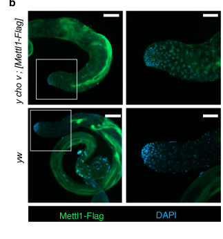

## Question

# Gene Research for Functional Annotation

## ⚠️ CRITICAL: Gene/Protein Identification Context

**BEFORE YOU BEGIN RESEARCH:** You MUST verify you are researching the CORRECT gene/protein. Gene symbols can be ambiguous, especially for less well-characterized genes from non-model organisms.

### Target Gene/Protein Identity (from UniProt):
- **UniProt Accession:** O77263
- **Protein Description:** RecName: Full=tRNA (guanine-N(7)-)-methyltransferase {ECO:0000255|HAMAP-Rule:MF_03055}; EC=2.1.1.33 {ECO:0000255|HAMAP-Rule:MF_03055, ECO:0000269|PubMed:39317727}; AltName: Full=tRNA (guanine(46)-N(7))-methyltransferase {ECO:0000255|HAMAP-Rule:MF_03055}; AltName: Full=tRNA methylguanosine methyltransferase 1 {ECO:0000312|FlyBase:FBgn0025629}; AltName: Full=tRNA(m7G46)-methyltransferase {ECO:0000255|HAMAP-Rule:MF_03055};
- **Gene Information:** Name=Mettl1 {ECO:0000303|PubMed:39317727, ECO:0000312|FlyBase:FBgn0025629}; ORFNames=CG4045 {ECO:0000312|FlyBase:FBgn0025629};
- **Organism (full):** Drosophila melanogaster (Fruit fly).
- **Protein Family:** Belongs to the class I-like SAM-binding methyltransferase
- **Key Domains:** SAM-dependent_MTases_sf. (IPR029063); Trm8_euk. (IPR025763); tRNA_(Gua-N-7)_MeTrfase_Trmb. (IPR003358); Methyltransf_4 (PF02390)

### MANDATORY VERIFICATION STEPS:

1. **Check if the gene symbol "Mettl1" matches the protein description above**
2. **Verify the organism is correct:** Drosophila melanogaster (Fruit fly).
3. **Check if protein family/domains align with what you find in literature**
4. **If you find literature for a DIFFERENT gene with the same or similar symbol, STOP**

### If Gene Symbol is Ambiguous or You Cannot Find Relevant Literature:

**DO NOT PROCEED WITH RESEARCH ON A DIFFERENT GENE.** Instead:
- State clearly: "The gene symbol 'Mettl1' is ambiguous or literature is limited for this specific protein"
- Explain what you found (e.g., "Found extensive literature on a different gene with the same symbol in a different organism")
- Describe the protein based ONLY on the UniProt information provided above
- Suggest that the protein function can be inferred from domain/family information

### Research Target:

Please provide a comprehensive research report on the gene **Mettl1** (gene ID: Mettl1, UniProt: O77263) in DROME.

The research report should be a detailed narrative explaining the function, biological processes, and localization of the gene product. Citations should be given for all claims.

You should prioritize authoritative reviews and primary scientific literature when conducting research. You can supplement
this with annotations you find in gene/protein databases, but these can be outdated or inaccurate.

We are specifically interested in the primary function of the gene - for enzymes, what reaction is catalyzed, and what is the substrate specificity? For transporters, what is the substrate? For structural proteins or adapters, what is the broader structural role? For signaling molecules, what is the role in the pathway.

We are interested in where in or outside the cell the gene product carries out its function.

We are also interested in the signaling or biochemical pathways in which the gene functions. We are less interested in broad pleiotropic effects, except where these elucidate the precise role.

Include evidence where possible. We are interested in both experimental evidence as well as inference from structure, evolution, or bioinformatic analysis. Precise studies should be prioritized over high-throughput, where available.

## Output

Question: You are an expert researcher providing comprehensive, well-cited information.

Provide detailed information focusing on:
1. Key concepts and definitions with current understanding
2. Recent developments and latest research (prioritize 2023-2024 sources)
3. Current applications and real-world implementations
4. Expert opinions and analysis from authoritative sources
5. Relevant statistics and data from recent studies

Format as a comprehensive research report with proper citations. Include URLs and publication dates where available.
Always prioritize recent, authoritative sources and provide specific citations for all major claims.

# Gene Research for Functional Annotation

## ⚠️ CRITICAL: Gene/Protein Identification Context

**BEFORE YOU BEGIN RESEARCH:** You MUST verify you are researching the CORRECT gene/protein. Gene symbols can be ambiguous, especially for less well-characterized genes from non-model organisms.

### Target Gene/Protein Identity (from UniProt):
- **UniProt Accession:** O77263
- **Protein Description:** RecName: Full=tRNA (guanine-N(7)-)-methyltransferase {ECO:0000255|HAMAP-Rule:MF_03055}; EC=2.1.1.33 {ECO:0000255|HAMAP-Rule:MF_03055, ECO:0000269|PubMed:39317727}; AltName: Full=tRNA (guanine(46)-N(7))-methyltransferase {ECO:0000255|HAMAP-Rule:MF_03055}; AltName: Full=tRNA methylguanosine methyltransferase 1 {ECO:0000312|FlyBase:FBgn0025629}; AltName: Full=tRNA(m7G46)-methyltransferase {ECO:0000255|HAMAP-Rule:MF_03055};
- **Gene Information:** Name=Mettl1 {ECO:0000303|PubMed:39317727, ECO:0000312|FlyBase:FBgn0025629}; ORFNames=CG4045 {ECO:0000312|FlyBase:FBgn0025629};
- **Organism (full):** Drosophila melanogaster (Fruit fly).
- **Protein Family:** Belongs to the class I-like SAM-binding methyltransferase
- **Key Domains:** SAM-dependent_MTases_sf. (IPR029063); Trm8_euk. (IPR025763); tRNA_(Gua-N-7)_MeTrfase_Trmb. (IPR003358); Methyltransf_4 (PF02390)

### MANDATORY VERIFICATION STEPS:

1. **Check if the gene symbol "Mettl1" matches the protein description above**
2. **Verify the organism is correct:** Drosophila melanogaster (Fruit fly).
3. **Check if protein family/domains align with what you find in literature**
4. **If you find literature for a DIFFERENT gene with the same or similar symbol, STOP**

### If Gene Symbol is Ambiguous or You Cannot Find Relevant Literature:

**DO NOT PROCEED WITH RESEARCH ON A DIFFERENT GENE.** Instead:
- State clearly: "The gene symbol 'Mettl1' is ambiguous or literature is limited for this specific protein"
- Explain what you found (e.g., "Found extensive literature on a different gene with the same symbol in a different organism")
- Describe the protein based ONLY on the UniProt information provided above
- Suggest that the protein function can be inferred from domain/family information

### Research Target:

Please provide a comprehensive research report on the gene **Mettl1** (gene ID: Mettl1, UniProt: O77263) in DROME.

The research report should be a detailed narrative explaining the function, biological processes, and localization of the gene product. Citations should be given for all claims.

You should prioritize authoritative reviews and primary scientific literature when conducting research. You can supplement
this with annotations you find in gene/protein databases, but these can be outdated or inaccurate.

We are specifically interested in the primary function of the gene - for enzymes, what reaction is catalyzed, and what is the substrate specificity? For transporters, what is the substrate? For structural proteins or adapters, what is the broader structural role? For signaling molecules, what is the role in the pathway.

We are interested in where in or outside the cell the gene product carries out its function.

We are also interested in the signaling or biochemical pathways in which the gene functions. We are less interested in broad pleiotropic effects, except where these elucidate the precise role.

Include evidence where possible. We are interested in both experimental evidence as well as inference from structure, evolution, or bioinformatic analysis. Precise studies should be prioritized over high-throughput, where available.

# Functional annotation of *Drosophila melanogaster* Mettl1

## Identity and principal function

The target is **fly Mettl1 (CG4045; UniProt accession O77263 as specified in the question)**, not the similarly named human protein. Kaneko and colleagues explicitly identify CG4045 as the *D. melanogaster* ortholog of mammalian METTL1 and demonstrate its enzymatic function in flies. Its conserved methyltransferase domain and experimentally established use of S-adenosyl-L-methionine (SAM) are consistent with the class-I-like SAM-binding methyltransferase and tRNA methyltransferase domain annotations supplied for O77263. The accession-to-gene correspondence comes from the supplied UniProt record; the paper independently establishes the CG4045-to-Mettl1 correspondence. (kanekoUnknownyearmettl1dependentm7 pages 2-3, kanekoUnknownyearmettl1dependentm7 pages 13-14)

**The primary reaction is methyl transfer to the N7 position of an internal tRNA guanosine, principally G46 in the variable loop:**

*tRNA-G46 + SAM → tRNA-m⁷G46 + S-adenosyl-L-homocysteine.*

Mettl1 is the catalytic subunit; its fly partner **Wuho (Wh)** is required for efficient modification. Recombinant Mettl1 bound Wh directly, and an in-vitro assay transferred a methyl group from radiolabeled SAM to tRNA in the presence of Wh. Substituting L157 and D160 in Mettl1 abolished the assayed activity. This is an **internal tRNA modification**, not synthesis of the m⁷G cap at the end of an mRNA. (kanekoUnknownyearmettl1dependentm7 pages 3-5, kanekoUnknownyearmettl1dependentm7 pages 5-6, kanekoUnknownyearmettl1dependentm7 pages 13-14)

## Substrate specificity and pathway

Fly Mettl1–Wh modifies **a subset, not all, of cellular tRNAs**. Synthetic tRNA-TrpCCA was a direct biochemical substrate. Recognition depends on a variable-loop **RAGGU** sequence (*R* denotes A or G): replacing the target guanosine—the fourth position of that motif—with cytosine prevented methylation in the tested RNA. In gonadal RNA, chemical m⁷G-specific cleavage followed by northern blotting detected modification of tRNA-TrpCCA in controls but not in Mettl1-null tissue or Wh-mutant testes. TRAC-seq identified **23 modified tRNA types in testes and 22 in ovaries**, with largely overlapping repertoires. Examples of modified species that lost abundance after Mettl1 deletion include tRNA-ProTGG, tRNA-ValCAC, and other Pro-, Val-, Lys-, Ala-, and Cys-decoding tRNAs; tRNA-TrpCCA remained comparatively stable despite being modified. These results define a substrate-selective **tRNA modification → tRNA availability → codon decoding** pathway rather than a general methylation of every RNA bearing a guanosine. (kanekoUnknownyearmettl1dependentm7 pages 5-6, kanekoUnknownyearmettl1dependentm7 pages 6-7, kanekoUnknownyearmettl1dependentm7 pages 7-8, kanekoUnknownyearmettl1dependentm7 pages 9-10)

The study directly measured both modification and steady-state abundance: in knockout testes, **15 m⁷G-modified tRNAs decreased significantly**, whereas **eight other modified tRNAs did not**; 22 non-m⁷G comparison tRNAs showed limited changes. Thus, m⁷G-dependent stabilization is tRNA-specific, and reduced steady-state abundance alone does not identify the degradation enzyme. Overexpressing the tRNA-binding translation elongation factor eEF1α1 partially rescued mutant male fertility, consistent with protection of vulnerable tRNAs, but the 2024 experiments did not establish a specific fly rapid-tRNA-decay nuclease. (kanekoUnknownyearmettl1dependentm7 pages 6-7, kanekoUnknownyearmettl1dependentm7 pages 7-8, kanekoUnknownyearmettl1dependentm7 pages 9-10)

The principal experimental results are summarized here; values refer to the *fly* study, not human METTL1 experiments. (kanekoUnknownyearmettl1dependentm7 pages 1-2, kanekoUnknownyearmettl1dependentm7 pages 5-6, kanekoUnknownyearmettl1dependentm7 pages 6-7, kanekoUnknownyearmettl1dependentm7 pages 7-8, kanekoUnknownyearmettl1dependentm7 pages 9-10)

| Subject | Primary experimental observation/statistic | Interpretation | Citation IDs |
|---|---|---|---|
| Enzymatic activity and partner | Recombinant Mettl1 transferred radiolabeled methyl groups from S-adenosyl-L-[methyl-¹⁴C]methionine to synthetic RNA only with Wh; the assay used 1 μg of each protein, 0.3 nmol RNA, and 2 μCi/mL labeled SAM for 3 h at 26 °C. | Drosophila Mettl1 is the catalytic SAM-dependent tRNA methyltransferase subunit, while Wh is its required partner. | (kanekoUnknownyearmettl1dependentm7 pages 13-14, kanekoUnknownyearmettl1dependentm7 pages 5-6) |
| Site and substrate specificity | Mettl1–Wh modified tRNA-TrpCCA carrying the variable-loop RAGGU motif; replacing the motif’s target fourth G with C prevented methylation. L157A/D160A substitutions abolished activity. | The complex recognizes the conserved RAGGU context and installs m⁷G at the corresponding G46 position; L157 and D160 are required for catalysis. | (kanekoUnknownyearmettl1dependentm7 pages 5-6) |
| Gonadal tRNA targets | TRAC-seq identified 23 modified tRNAs in testes and 22 in ovaries; Mettl1-dependent cleavage products were absent from knockout tissue. | Mettl1–Wh modifies a defined subset—not all—of the fly tRNA pool in vivo. | (kanekoUnknownyearmettl1dependentm7 pages 6-7) |
| tRNA stability | In testes, 15 m⁷G-modified tRNAs decreased significantly after Mettl1 loss, whereas 8 modified tRNAs were unaffected; 22 non-m⁷G control tRNAs showed limited changes. | m⁷G promotes steady-state abundance in a substrate-dependent manner; modification does not make every target equally stability-dependent. | (kanekoUnknownyearmettl1dependentm7 pages 6-7, kanekoUnknownyearmettl1dependentm7 pages 7-8) |
| Fertility | Knockout males produced approximately one-tenth and females approximately one-third as many progeny as controls; wild-type transgenes rescued fertility, whereas catalytic-dead Mettl1 did not rescue male sterility. | Catalytic Mettl1 activity is required for normal fertility, with the strongest effect in males. | (kanekoUnknownyearmettl1dependentm7 pages 1-2, kanekoUnknownyearmettl1dependentm7 pages 5-6) |
| Translational output | Ribosome profiling identified 1,078 transcripts with significantly reduced translation efficiency in knockout testes. | Loss of Mettl1 remodels the testis translatome, including reduced translation of genes involved in spermatid development, axoneme assembly, and sperm individualization. | (kanekoUnknownyearmettl1dependentm7 pages 9-10) |
| Tissue-specific ribosome pausing | CCA-codon ribosome occupancy increased by log₂ 2.1 and 2.4 in two knockout testes, versus approximately log₂ 0.6 in matched non-gonadal body samples. | Testes are substantially more sensitive than somatic tissues to translational disruption caused by Mettl1 loss. | (kanekoUnknownyearmettl1dependentm7 pages 9-10) |
| Cellular localization | A functional Mettl1–Flag transgene was detected in almost all testicular cell types; visual inspection of the published micrograph indicates predominantly cytoplasmic signal excluded from DAPI-positive nuclei. | Mettl1 is broadly expressed in the testis and likely acts mainly in germ-cell cytoplasm, but the cytoplasmic assignment is an image-based interpretation rather than a compartment-specific biochemical demonstration. | (kanekoUnknownyearmettl1dependentm7 media b8540ebc) |

*Table: Direct experimental evidence defining the enzymatic activity, substrates, localization, translational effects, and fertility requirement of Drosophila CG4045/Mettl1 (UniProt O77263).*

## Where Mettl1 functions

A fertility-rescuing, Flag-tagged Mettl1 construct yielded staining in **almost all testicular cells**, while protein and Mettl1-dependent tRNA modification were also detectable outside the gonads. Germ-cell-directed expression restored testicular tRNA modification, tRNA abundance, and fertility, supporting a critical **germ-cell-autonomous** requirement. Inspection of the published enlarged immunofluorescence panel suggests that detectable tagged Mettl1 is **predominantly cytoplasmic in the imaged testicular germ cells**, with relatively little signal overlapping DAPI-stained nuclei. This is an image-based localization observation, **not** proof that the protein is exclusively cytoplasmic, nor does it establish its compartment in every tissue or the precise site of every methylation event. (kanekoUnknownyearmettl1dependentm7 pages 2-3, kanekoUnknownyearmettl1dependentm7 media b8540ebc, kanekoUnknownyearmettl1dependentm7 pages 3-3, kanekoUnknownyearmettl1dependentm7 pages 9-10)

## Biological consequence: translation during spermatogenesis

Loss of Mettl1 removes mature sperm and disrupts spermatid elongation while leaving earlier recognizable germ-cell stages relatively preserved. Knockout males produced **approximately one-tenth** as many progeny as controls; knockout females produced **approximately one-third** as many. A wild-type Mettl1 transgene restored fertility, whereas the L157A/D160A catalytic-dead construct failed to rescue male fertility. The authors note that the mutant transgene produced somewhat less protein than its wild-type counterpart, limiting how completely that rescue comparison isolates catalysis from protein abundance. In examined knockout testes, **23 of 31** had reduced elongated-spermatid microtubule staining and **8 of 31** had no elongated spermatids. (kanekoUnknownyearmettl1dependentm7 pages 1-2, kanekoUnknownyearmettl1dependentm7 pages 3-3, kanekoUnknownyearmettl1dependentm7 pages 5-6)

Ribosome profiling supplies a mechanistic connection: the knockout increased pausing at codons decoded by depleted tRNAs, notably **CCA decoded by tRNA-ProTGG**, with evidence of trailing-ribosome collisions. Translation efficiency decreased for **1,078 transcripts** in mutant testes, including transcripts associated with spermatid development, axoneme assembly, and sperm individualization; reduced expression of the sperm protein Don Juan was also tested with a GFP reporter. CCA-codon occupancy changed much more in testes than in non-gonadal body samples—approximately **log₂ 2.1–2.4 versus log₂ 0.6**, respectively, across two knockout lines. The authors interpret this sensitivity in light of late spermatids’ dependence on translation of stored mRNAs, while acknowledging that the basis of the tissue difference remains unresolved. These are downstream effects of a tRNA-modifying enzyme, not evidence that Mettl1 itself forms sperm structures. (kanekoUnknownyearmettl1dependentm7 pages 8-9, kanekoUnknownyearmettl1dependentm7 pages 9-10, kanekoUnknownyearmettl1dependentm7 pages 11-12)

## Recent developments, interpretation, and applications

**The decisive fly-specific primary study was published in September 2024.** Its combined recombinant-enzyme, motif-mutagenesis, fly-genetic, chemical-cleavage, tRNA-sequencing, and ribosome-profiling evidence makes tRNA m⁷G46 methylation the strongest-supported functional annotation for CG4045. The authors specifically found no support for modification of *Drosophila* primary let-7 as the cause of sterility; potential mRNA-target mechanisms described for mammalian METTL1 should therefore **not** be assigned to this fly protein without fly-specific evidence. They also do not exclude every possible m⁷G-independent contribution of Mettl1 or Wh to the phenotype. (kanekoUnknownyearmettl1dependentm7 pages 5-6, kanekoUnknownyearmettl1dependentm7 pages 6-7, kanekoUnknownyearmettl1dependentm7 pages 8-9, kanekoUnknownyearmettl1dependentm7 pages 11-12)

A **November 2025 bioRxiv preprint**, which should be distinguished from the peer-reviewed 2024 findings, reports that partial loss of the fly exonuclease **Rat1** restores abundance of a vulnerable proline tRNA and suppresses *mettl1*-mutant male sterility. Its human-cell experiments implicate XRN2-dependent decay of hypomodified tRNAs. The fly genetic result strengthens the proposed rapid-tRNA-decay explanation, but the preprint status and differences between human-cell and fly experiments warrant caution. (miyoshi2025themammalianrapid pages 1-6, miyoshi2025themammalianrapid pages 29-33, miyoshi2025themammalianrapid pages 19-22)

At present, the demonstrated **real-world use** of fly Mettl1 is as an experimentally tractable model for selective tRNA modification, tissue-specific translation defects, and infertility mechanisms—not as an established clinical diagnostic or treatment. The most defensible concise annotation is: **“SAM-dependent, Wh-associated tRNA guanine-N7 methyltransferase that installs m⁷G46 on selected tRNAs, supporting their abundance and codon-efficient translation, particularly during fly spermatogenesis; detected broadly in testes, with predominantly cytoplasmic staining in the imaged germ cells.”** (kanekoUnknownyearmettl1dependentm7 pages 5-6, kanekoUnknownyearmettl1dependentm7 pages 6-7, kanekoUnknownyearmettl1dependentm7 pages 9-10, kanekoUnknownyearmettl1dependentm7 media b8540ebc)

### Principal sources

- Kaneko S *et al.* “Mettl1-dependent m7G tRNA modification is essential for maintaining spermatogenesis and fertility in *Drosophila melanogaster*.” *Nature Communications* **15**, 8147 (September 2024). https://doi.org/10.1038/s41467-024-52389-0. **Primary fly-specific evidence.** (kanekoUnknownyearmettl1dependentm7 pages 1-2, kanekoUnknownyearmettl1dependentm7 pages 2-3)
- Miyoshi K *et al.* “The mammalian rapid tRNA decay pathway is critical for N⁷-methylguanosine-hypomodified tRNA degradation under physiological conditions.” *bioRxiv* (November 2025). https://doi.org/10.1101/2025.11.05.686800. **Preprint; includes a fly Rat1 genetic experiment alongside human-cell work.** (miyoshi2025themammalianrapid pages 1-6, miyoshi2025themammalianrapid pages 29-33)

References

1. (kanekoUnknownyearmettl1dependentm7 pages 2-3): S Kaneko, K Miyoshi, K Tomuro, M Terauchi, and R Tanaka. Mettl1-dependent m 7 g trna modification is essential for maintaining spermatogenesis. Unknown journal, Unknown year.

2. (kanekoUnknownyearmettl1dependentm7 pages 13-14): S Kaneko, K Miyoshi, K Tomuro, M Terauchi, and R Tanaka. Mettl1-dependent m 7 g trna modification is essential for maintaining spermatogenesis. Unknown journal, Unknown year.

3. (kanekoUnknownyearmettl1dependentm7 pages 3-5): S Kaneko, K Miyoshi, K Tomuro, M Terauchi, and R Tanaka. Mettl1-dependent m 7 g trna modification is essential for maintaining spermatogenesis. Unknown journal, Unknown year.

4. (kanekoUnknownyearmettl1dependentm7 pages 5-6): S Kaneko, K Miyoshi, K Tomuro, M Terauchi, and R Tanaka. Mettl1-dependent m 7 g trna modification is essential for maintaining spermatogenesis. Unknown journal, Unknown year.

5. (kanekoUnknownyearmettl1dependentm7 pages 6-7): S Kaneko, K Miyoshi, K Tomuro, M Terauchi, and R Tanaka. Mettl1-dependent m 7 g trna modification is essential for maintaining spermatogenesis. Unknown journal, Unknown year.

6. (kanekoUnknownyearmettl1dependentm7 pages 7-8): S Kaneko, K Miyoshi, K Tomuro, M Terauchi, and R Tanaka. Mettl1-dependent m 7 g trna modification is essential for maintaining spermatogenesis. Unknown journal, Unknown year.

7. (kanekoUnknownyearmettl1dependentm7 pages 9-10): S Kaneko, K Miyoshi, K Tomuro, M Terauchi, and R Tanaka. Mettl1-dependent m 7 g trna modification is essential for maintaining spermatogenesis. Unknown journal, Unknown year.

8. (kanekoUnknownyearmettl1dependentm7 pages 1-2): S Kaneko, K Miyoshi, K Tomuro, M Terauchi, and R Tanaka. Mettl1-dependent m 7 g trna modification is essential for maintaining spermatogenesis. Unknown journal, Unknown year.

9. (kanekoUnknownyearmettl1dependentm7 media b8540ebc): S Kaneko, K Miyoshi, K Tomuro, M Terauchi, and R Tanaka. Mettl1-dependent m 7 g trna modification is essential for maintaining spermatogenesis. Unknown journal, Unknown year.

10. (kanekoUnknownyearmettl1dependentm7 pages 3-3): S Kaneko, K Miyoshi, K Tomuro, M Terauchi, and R Tanaka. Mettl1-dependent m 7 g trna modification is essential for maintaining spermatogenesis. Unknown journal, Unknown year.

11. (kanekoUnknownyearmettl1dependentm7 pages 8-9): S Kaneko, K Miyoshi, K Tomuro, M Terauchi, and R Tanaka. Mettl1-dependent m 7 g trna modification is essential for maintaining spermatogenesis. Unknown journal, Unknown year.

12. (kanekoUnknownyearmettl1dependentm7 pages 11-12): S Kaneko, K Miyoshi, K Tomuro, M Terauchi, and R Tanaka. Mettl1-dependent m 7 g trna modification is essential for maintaining spermatogenesis. Unknown journal, Unknown year.

13. (miyoshi2025themammalianrapid pages 1-6): Keita Miyoshi, Kiito Otsubo, Shunya Kaneko, Makoto Terauchi, Yuki Hatoyama, Hideki Noguchi, Masato T. Kanemaki, and Kuniaki Saito. The mammalian rapid trna decay pathway is critical for n⁷-methylguanosine-hypomodified trna degradation under physiological conditions. BioRxiv, Nov 2025. URL: https://doi.org/10.1101/2025.11.05.686800, doi:10.1101/2025.11.05.686800. This article has 1 citations.

14. (miyoshi2025themammalianrapid pages 29-33): Keita Miyoshi, Kiito Otsubo, Shunya Kaneko, Makoto Terauchi, Yuki Hatoyama, Hideki Noguchi, Masato T. Kanemaki, and Kuniaki Saito. The mammalian rapid trna decay pathway is critical for n⁷-methylguanosine-hypomodified trna degradation under physiological conditions. BioRxiv, Nov 2025. URL: https://doi.org/10.1101/2025.11.05.686800, doi:10.1101/2025.11.05.686800. This article has 1 citations.

15. (miyoshi2025themammalianrapid pages 19-22): Keita Miyoshi, Kiito Otsubo, Shunya Kaneko, Makoto Terauchi, Yuki Hatoyama, Hideki Noguchi, Masato T. Kanemaki, and Kuniaki Saito. The mammalian rapid trna decay pathway is critical for n⁷-methylguanosine-hypomodified trna degradation under physiological conditions. BioRxiv, Nov 2025. URL: https://doi.org/10.1101/2025.11.05.686800, doi:10.1101/2025.11.05.686800. This article has 1 citations.

## Artifacts

- [Edison artifact artifact-00](Mettl1-deep-research-falcon_artifacts/artifact-00.md)

## Citations

1. miyoshi2025themammalianrapid pages 1-6
2. miyoshi2025themammalianrapid pages 29-33
3. miyoshi2025themammalianrapid pages 19-22
4. methyl-¹⁴C
5. https://doi.org/10.1038/s41467-024-52389-0.
6. https://doi.org/10.1101/2025.11.05.686800.
7. https://doi.org/10.1101/2025.11.05.686800,