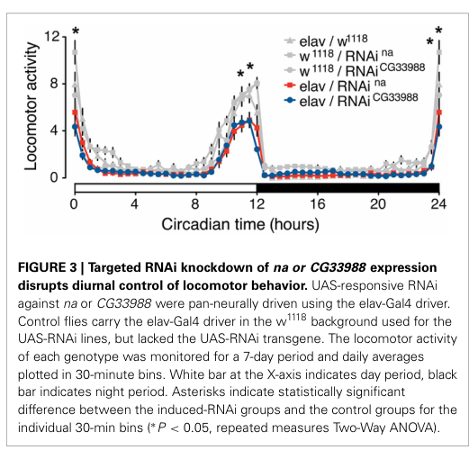

## Question

# Gene Research for Functional Annotation

## ⚠️ CRITICAL: Gene/Protein Identification Context

**BEFORE YOU BEGIN RESEARCH:** You MUST verify you are researching the CORRECT gene/protein. Gene symbols can be ambiguous, especially for less well-characterized genes from non-model organisms.

### Target Gene/Protein Identity (from UniProt):
- **UniProt Accession:** Q9I7V0
- **Protein Description:** SubName: Full=Mid1, isoform A {ECO:0000313|EMBL:AAG22200.3}; SubName: Full=Mid1, isoform B {ECO:0000313|EMBL:AGB93700.1};
- **Gene Information:** Name=Mid1 {ECO:0000313|EMBL:AAG22200.3, ECO:0000313|FlyBase:FBgn0053988}; Synonyms=CG13595 {ECO:0000313|EMBL:AAG22200.3}, CG13596 {ECO:0000313|EMBL:AAG22200.3}, cg13596 {ECO:0000313|EMBL:AAG22200.3}, CG18510 {ECO:0000313|EMBL:AAG22200.3}, Dmel\CG33988 {ECO:0000313|EMBL:AAG22200.3}, mid1 {ECO:0000313|EMBL:AAG22200.3}, Nlf-1 {ECO:0000313|EMBL:AAG22200.3}; ORFNames=CG33988 {ECO:0000313|EMBL:AAG22200.3, ECO:0000313|FlyBase:FBgn0053988}, Dmel_CG33988 {ECO:0000313|EMBL:AAG22200.3};
- **Organism (full):** Drosophila melanogaster (Fruit fly).
- **Protein Family:** Belongs to the NALF family.
- **Key Domains:** NALCN_aux_factor_1/2. (IPR055288)

### MANDATORY VERIFICATION STEPS:

1. **Check if the gene symbol "Mid1" matches the protein description above**
2. **Verify the organism is correct:** Drosophila melanogaster (Fruit fly).
3. **Check if protein family/domains align with what you find in literature**
4. **If you find literature for a DIFFERENT gene with the same or similar symbol, STOP**

### If Gene Symbol is Ambiguous or You Cannot Find Relevant Literature:

**DO NOT PROCEED WITH RESEARCH ON A DIFFERENT GENE.** Instead:
- State clearly: "The gene symbol 'Mid1' is ambiguous or literature is limited for this specific protein"
- Explain what you found (e.g., "Found extensive literature on a different gene with the same symbol in a different organism")
- Describe the protein based ONLY on the UniProt information provided above
- Suggest that the protein function can be inferred from domain/family information

### Research Target:

Please provide a comprehensive research report on the gene **Mid1** (gene ID: Mid1, UniProt: Q9I7V0) in DROME.

The research report should be a detailed narrative explaining the function, biological processes, and localization of the gene product. Citations should be given for all claims.

You should prioritize authoritative reviews and primary scientific literature when conducting research. You can supplement
this with annotations you find in gene/protein databases, but these can be outdated or inaccurate.

We are specifically interested in the primary function of the gene - for enzymes, what reaction is catalyzed, and what is the substrate specificity? For transporters, what is the substrate? For structural proteins or adapters, what is the broader structural role? For signaling molecules, what is the role in the pathway.

We are interested in where in or outside the cell the gene product carries out its function.

We are also interested in the signaling or biochemical pathways in which the gene functions. We are less interested in broad pleiotropic effects, except where these elucidate the precise role.

Include evidence where possible. We are interested in both experimental evidence as well as inference from structure, evolution, or bioinformatic analysis. Precise studies should be prioritized over high-throughput, where available.

## Output

Question: You are an expert researcher providing comprehensive, well-cited information.

Provide detailed information focusing on:
1. Key concepts and definitions with current understanding
2. Recent developments and latest research (prioritize 2023-2024 sources)
3. Current applications and real-world implementations
4. Expert opinions and analysis from authoritative sources
5. Relevant statistics and data from recent studies

Format as a comprehensive research report with proper citations. Include URLs and publication dates where available.
Always prioritize recent, authoritative sources and provide specific citations for all major claims.

# Gene Research for Functional Annotation

## ⚠️ CRITICAL: Gene/Protein Identification Context

**BEFORE YOU BEGIN RESEARCH:** You MUST verify you are researching the CORRECT gene/protein. Gene symbols can be ambiguous, especially for less well-characterized genes from non-model organisms.

### Target Gene/Protein Identity (from UniProt):
- **UniProt Accession:** Q9I7V0
- **Protein Description:** SubName: Full=Mid1, isoform A {ECO:0000313|EMBL:AAG22200.3}; SubName: Full=Mid1, isoform B {ECO:0000313|EMBL:AGB93700.1};
- **Gene Information:** Name=Mid1 {ECO:0000313|EMBL:AAG22200.3, ECO:0000313|FlyBase:FBgn0053988}; Synonyms=CG13595 {ECO:0000313|EMBL:AAG22200.3}, CG13596 {ECO:0000313|EMBL:AAG22200.3}, cg13596 {ECO:0000313|EMBL:AAG22200.3}, CG18510 {ECO:0000313|EMBL:AAG22200.3}, Dmel\CG33988 {ECO:0000313|EMBL:AAG22200.3}, mid1 {ECO:0000313|EMBL:AAG22200.3}, Nlf-1 {ECO:0000313|EMBL:AAG22200.3}; ORFNames=CG33988 {ECO:0000313|EMBL:AAG22200.3, ECO:0000313|FlyBase:FBgn0053988}, Dmel_CG33988 {ECO:0000313|EMBL:AAG22200.3};
- **Organism (full):** Drosophila melanogaster (Fruit fly).
- **Protein Family:** Belongs to the NALF family.
- **Key Domains:** NALCN_aux_factor_1/2. (IPR055288)

### MANDATORY VERIFICATION STEPS:

1. **Check if the gene symbol "Mid1" matches the protein description above**
2. **Verify the organism is correct:** Drosophila melanogaster (Fruit fly).
3. **Check if protein family/domains align with what you find in literature**
4. **If you find literature for a DIFFERENT gene with the same or similar symbol, STOP**

### If Gene Symbol is Ambiguous or You Cannot Find Relevant Literature:

**DO NOT PROCEED WITH RESEARCH ON A DIFFERENT GENE.** Instead:
- State clearly: "The gene symbol 'Mid1' is ambiguous or literature is limited for this specific protein"
- Explain what you found (e.g., "Found extensive literature on a different gene with the same symbol in a different organism")
- Describe the protein based ONLY on the UniProt information provided above
- Suggest that the protein function can be inferred from domain/family information

### Research Target:

Please provide a comprehensive research report on the gene **Mid1** (gene ID: Mid1, UniProt: Q9I7V0) in DROME.

The research report should be a detailed narrative explaining the function, biological processes, and localization of the gene product. Citations should be given for all claims.

You should prioritize authoritative reviews and primary scientific literature when conducting research. You can supplement
this with annotations you find in gene/protein databases, but these can be outdated or inaccurate.

We are specifically interested in the primary function of the gene - for enzymes, what reaction is catalyzed, and what is the substrate specificity? For transporters, what is the substrate? For structural proteins or adapters, what is the broader structural role? For signaling molecules, what is the role in the pathway.

We are interested in where in or outside the cell the gene product carries out its function.

We are also interested in the signaling or biochemical pathways in which the gene functions. We are less interested in broad pleiotropic effects, except where these elucidate the precise role.

Include evidence where possible. We are interested in both experimental evidence as well as inference from structure, evolution, or bioinformatic analysis. Precise studies should be prioritized over high-throughput, where available.

# Functional annotation report: *Drosophila melanogaster* Mid1

## Identity and assessment

**The gene symbol “Mid1” is ambiguous, and direct molecular literature is limited for this specific fly protein.** The target specified here is *D. melanogaster* Mid1, also called *CG33988* and, in the supplied UniProt record, *Nlf-1* (Q9I7V0; supplied FlyBase identifier FBgn0053988). The primary fly study explicitly identifies *CG33988* as *Drosophila* Mid1. It places the protein in a conserved Mid1/NLF/FAM155-related family on the basis of a cysteine-rich region, consistent with the supplied NALF-family/NALCN_aux_factor_1/2 annotation. The papers examined do **not** independently establish the Q9I7V0–FBgn0053988 accession cross-reference; those identifiers are retained from the question. Importantly, this is not yeast Mid1, whose experimentally studied partner is the fungal calcium channel Cch1, and yeast-specific properties must not be assigned directly to the fly protein. (ghezzi2014ancientassociationbetween pages 1-2, ghezzi2014ancientassociationbetween pages 3-4, senatore2025nalcncch1channelosomesubunitsa pages 1-2)

**Best-supported primary function:** fly Mid1 is a *candidate NALCN-channel auxiliary factor* associated with the function of Narrow abdomen (*na*), the fly NALCN pore-forming subunit. Its likely broader role is to support channel assembly, localization and/or activity, thereby contributing to neuronal background cation conductance. It is **not itself established to be an enzyme, ion-transporting pore, or transporter with an independently defined substrate**. Direct fly experiments support a functional association with *na*; the more specific trafficking and protein-interaction model is inferred from nematode and mammalian homologues, not demonstrated for Q9I7V0. (ghezzi2014ancientassociationbetween pages 6-7, xie2013nlf1deliversa pages 1-2, monteil2024newinsightsinto pages 15-17)

The evidence tiers underlying that distinction are summarized below.

| Evidence tier / system | Finding | Interpretation and limit |
|---|---|---|
| **Direct fly evidence — *D. melanogaster* (2014): coexpression** | Mid1/*CG33988* and *na* (NALCN) expression correlated across 29 tissues (*r* = 0.97) and 30 developmental stages (*r* = 0.95); both correlations had *p* < 10⁻⁹. (ghezzi2014ancientassociationbetween pages 4-6) | Strong co-regulation supports participation in a shared neuronal process, but it does not establish physical interaction, channel-complex membership, or causality. |
| **Direct fly evidence — *D. melanogaster* (2014): neuronal RNAi** | Pan-neuronal *elav*-Gal4 RNAi against *CG33988* or *na* produced similar abnormalities in seven-day diurnal-locomotion assays and significantly reduced social clustering; clustering used eight trials of 40 males per chamber. (ghezzi2014ancientassociationbetween pages 6-7) | Behavioral phenocopy supports a functional association with fly NALCN but does not prove direct binding or trafficking. *CG33988* RNAi did not demonstrably reduce target mRNA; translational repression was proposed, but protein depletion was not directly verified. (ghezzi2014ancientassociationbetween pages 2-3) |
| **Cross-species mechanistic evidence — *C. elegans* and mouse (2013)** | NLF-1 localized to neuronal ER, was required for axonal targeting of NCA-1/NCA-2, and its loss reduced a Gd³⁺-sensitive Na⁺ leak current and hyperpolarized premotor interneurons. Mouse NLF-1/FAM155A rescued worm defects, associated with mammalian NALCN, and supported cortical-neuron Na⁺ leak current. (xie2013nlf1deliversa pages 6-9) | This establishes a conserved ER-dependent NCA/NALCN biogenesis or delivery role for NLF-family proteins. Applying that mechanism to fly Mid1/Q9I7V0 is a homology-based inference, not a direct fly localization or electrophysiology result. |
| **Cross-species structural evidence — human channelosome (2022 structures; 2024 review)** | FAM155A contains an extracellular cysteine-rich domain with two lobes stabilized by six disulfide bonds; its C-lobe contacts NALCN pore loops and forms part of the membrane channelosome. Mammalian studies report both ER localization and cell-surface trafficking under different experimental conditions. (monteil2024newinsightsinto pages 15-17, monteil2024newinsightsinto pages 17-19) | This supports annotation of fly Mid1 as a NALF/FAM155-like NALCN auxiliary factor rather than an enzyme or ion-conducting pore. The topology, ER-versus-surface distribution, physical association with Na/NALCN, and localization of fly Mid1 remain experimentally unresolved. |

*Table: Evidence supporting functional annotation of Drosophila Mid1/CG33988 (user-supplied UniProt Q9I7V0), separated into direct fly findings and cross-species mechanistic inference. Key limitations preclude direct attribution of ER localization or NALCN binding to the fly protein.*

## Molecular function and biological process

The proposed pathway is **Mid1-family factor → functional *na*/NALCN channel at neuronal membranes → background Na⁺-permeable current → neuronal resting potential and excitability → rhythmic motor output**. NALCN, rather than Mid1, forms the ion-conducting pore. Work on reconstituted mammalian channelosomes indicates permeability to small monovalent cations, with Na⁺ and Li⁺ more permeant than K⁺, and inhibition of the current by extracellular divalent cations. These are properties of **mammalian NALCN measured with its accessory proteins**, not a measured transport specificity of fly Mid1. (monteil2024newinsightsinto pages 24-25, xie2013nlf1deliversa pages 1-2, monteil2024newinsightsinto pages 15-17)

The strongest direct fly evidence comes from Ghezzi *et al.* (published **7 March 2014**). Across RNA-sequencing datasets comprising **29 dissected tissues** and **30 developmental stages**, *CG33988* and *na* expression had Pearson correlations of **0.97** and **0.95**, respectively; both were reported at *p* < 10⁻⁹. The most prominent joint expression occurred in developing central nervous system tissue and adult heads. This supports participation in related neuronal processes, although shared expression is not evidence of direct binding. (ghezzi2014ancientassociationbetween pages 4-6, ghezzi2014ancientassociationbetween pages 3-4)

In the same study, pan-neuronal *elav*-Gal4-driven RNAi against either *CG33988* or *na* produced similar disturbances of daily locomotor activity in a **seven-day**, 12-hour-light/12-hour-dark assay, including reduced normal activity around light transitions. Both RNAi treatments also significantly reduced social clustering: the social-space assay comprised **eight trials with 40 male flies per chamber**. Knocking down the synaptic gene *brp* impaired movement without similarly suppressing clustering, arguing against a wholly nonspecific explanation based on reduced locomotion. The fly experiments therefore implicate Mid1 in *na*-associated neural output, including circadian locomotor behavior and group spacing, but do not measure fly Mid1-dependent channel current. (ghezzi2014ancientassociationbetween pages 4-6, ghezzi2014ancientassociationbetween pages 6-7, ghezzi2014ancientassociationbetween media 2f2dcc84)

A methodological limitation matters: the authors observed *na* mRNA depletion after its RNAi treatment, but **did not detect decreased *CG33988* mRNA** after *CG33988* RNAi. They proposed translational repression; protein depletion was not directly verified in the reported experiment. Accordingly, the behavioral phenocopy is informative but cannot by itself establish the molecular consequence of *CG33988* knockdown or a physical Mid1–Na complex. (ghezzi2014ancientassociationbetween pages 2-3, ghezzi2014ancientassociationbetween pages 7-8)

## Where the protein acts: measured versus inferred localization

**Fly-specific localization remains unresolved in the retrieved primary evidence.** Expression in neural tissues identifies a likely cellular setting, but does not place fly Mid1 in the endoplasmic reticulum (ER), at the plasma membrane, or within a specific neuronal compartment. An ER-associated role in channel maturation is a strong *homology-based hypothesis*, not a demonstrated subcellular annotation for Q9I7V0. (ghezzi2014ancientassociationbetween pages 3-4, ghezzi2014ancientassociationbetween pages 7-8)

The mechanistic precedent is substantial. In *Caenorhabditis elegans*, functional tagged NLF-1 colocalized with neuronal ER markers, rather than tested plasma-membrane or Golgi markers; disturbing its ER localization compromised rescue of mutant locomotion. Loss of worm NLF-1 reduced axonal localization of both NCA channel reporters, and acute restoration of NLF-1 restored their axonal distribution. Worm premotor interneurons lacking NLF-1 or NCA had reduced Na⁺-dependent leak current and a more negative resting membrane potential—approximately **−30 mV versus −20 mV** in wild type in the reported comparison. These are **worm measurements**, not values measured in flies. (xie2013nlf1deliversa pages 4-5, xie2013nlf1deliversa pages 6-9)

Mouse NLF-1/FAM155A could replace worm NLF-1 in genetic rescue experiments, and mammalian NLF-1 associated with NALCN in transfected-cell co-immunoprecipitation experiments. An interaction assay implicated the channel’s domain-II S5–pore-loop–S6 region. These observations support an evolutionarily conserved channel-support function, although whether NLF proteins promote folding, stabilize assembly, facilitate ER exit, or perform more than one of these tasks remains incompletely resolved. (xie2013nlf1deliversa pages 6-9, xie2013nlf1deliversa pages 9-10, monteil2024newinsightsinto pages 15-17)

The localization model has also become more nuanced: the **2024** *Physiological Reviews* synthesis notes early observations of ER-localized NLF-1/FAM155A, but reports that mammalian FAM155A can be detected at the **cell surface** in expression experiments. Human channelosome structures place its cysteine-rich region on the **extracellular side of membrane-embedded NALCN**. Thus, even mammalian FAM155A should not be described categorically as an exclusively ER-resident protein, and its distribution cannot simply be transferred to fly Mid1. (monteil2024newinsightsinto pages 15-17, monteil2024newinsightsinto pages 17-19)

## Structural and evolutionary basis of annotation

Comparative analysis identified conservation between insect Mid1, nematode NLF-1, vertebrate FAM155A/B and fungal Mid1 primarily in cysteine-rich regions termed the **Mid1 domain**; the remaining protein sequences are considerably less conserved. Insects retained all four cysteines highlighted as functionally important in yeast in that analysis. Conservation supports family membership and a channel-associated role, **not** an experimentally established disulfide pattern or a proved NALCN contact site in fly Mid1. (ghezzi2014ancientassociationbetween pages 3-4, ghezzi2014ancientassociationbetween pages 6-7)

Human NALCN-complex structures, as assessed in the **January 2024** review, add a more precise *cross-species* structural hypothesis: FAM155A forms an extracellular, two-lobed cysteine-rich domain stabilized by **six disulfide bonds**; its C-lobe makes extensive contacts with NALCN’s extracellular pore-loop regions. UNC79 and UNC80 assemble on the intracellular side, whereas NALCN supplies the transmembrane pore. These structures clarify why a Mid1-family protein could serve as a channel-associated structural or maturation factor, but they are **not structures of fly Q9I7V0**. (monteil2024newinsightsinto pages 15-17, monteil2024newinsightsinto pages 17-19)

## Recent developments and applications

No direct **2023–2024** fly Mid1 localization, binding, or electrophysiological study was identified in the literature retrieved for this report. The major recent advance relevant to its annotation is therefore *contextual*: Monteil *et al.*’s **January 2024** authoritative review reconciles NLF/FAM155 trafficking experiments with the resolved extracellular position of FAM155A in the mammalian channelosome. In a **May 2024** pharmacology study, investigators expressed mammalian NALCN together with UNC79, UNC80 and FAM155A in *Xenopus* oocytes to test channel-pore mutations and drug responses. Such reconstituted complexes are practical experimental systems for studying NALCN pharmacology; the study does not establish a drug application, binding target, or therapeutic use for fly Mid1 itself. (monteil2024newinsightsinto pages 15-17, monteil2024newinsightsinto pages 17-19, schott2024unplugginglateralfenestrationsa pages 2-5)

A subsequent **2025** peer-reviewed phylogenetic analysis expanded evidence that FAM155/Mid1-like factors have ancient eukaryotic origins. This strengthens the comparative basis for annotating the fly protein, while providing no new direct measurement of its subcellular position or its binding to fly Na. There is currently **no established real-world clinical implementation specifically involving fly Mid1** in the sources examined; its immediate application is as a genetically tractable candidate for investigating channel assembly, neuronal excitability and behavioral output. (senatore2025nalcncch1channelosomesubunitsa pages 1-2, ghezzi2014ancientassociationbetween pages 6-7)

## Conclusion and confidence

Annotate **Q9I7V0 / fly Mid1–CG33988** as a **NALF/Mid1-family, putative auxiliary factor of the fly Na/NALCN channel pathway**, with **direct support** for involvement in *na*-associated neuronal behavior and **comparative support** for channel maturation or localization. Mark **ER localization, surface residence, direct physical association with fly Na, and the precise trafficking step as unresolved for this fly protein**. Distinguishing these evidence levels is essential: neither the Ca²⁺-channel function of yeast Mid1 nor the ion-conducting properties of mammalian NALCN are intrinsic, experimentally demonstrated activities of fly Mid1. (ghezzi2014ancientassociationbetween pages 7-8, ghezzi2014ancientassociationbetween pages 6-7, monteil2024newinsightsinto pages 15-17, senatore2025nalcncch1channelosomesubunitsa pages 1-2)

### Principal sources and publication dates

- Ghezzi *et al.* **7 March 2014**. “Ancient association between cation leak channels and Mid1 proteins is conserved in fungi and animals.” *Frontiers in Molecular Neuroscience*. https://doi.org/10.3389/fnmol.2014.00015. **Primary fly identity, expression and behavioral evidence.** (ghezzi2014ancientassociationbetween pages 1-2, ghezzi2014ancientassociationbetween pages 6-7)
- Xie *et al.* **20 March 2013**. “NLF-1 Delivers a Sodium Leak Channel to Regulate Neuronal Excitability and Modulate Rhythmic Locomotion.” *Neuron* **77**, 1069–1082. https://doi.org/10.1016/j.neuron.2013.01.018. **Primary nematode and mouse mechanistic evidence.** (xie2013nlf1deliversa pages 1-2, xie2013nlf1deliversa pages 6-9)
- Monteil *et al.* **January 2024**. “New insights into the physiology and pathophysiology of the atypical sodium leak channel NALCN.” *Physiological Reviews* **104**, 399–472. https://doi.org/10.1152/physrev.00014.2022. **Recent authoritative synthesis of channelosome structure, localization and physiology.** (monteil2024newinsightsinto pages 15-17, monteil2024newinsightsinto pages 17-19)
- Schott *et al.* **May 2024**. “Unplugging lateral fenestrations of NALCN reveals a hidden drug binding site within the pore region.” *PNAS* **121**. https://doi.org/10.1073/pnas.2401591121. **Mammalian-channel reconstitution and pharmacology, not fly Mid1 experimentation.** (schott2024unplugginglateralfenestrationsa pages 2-5)
- Senatore *et al.* **2025**. “NALCN/Cch1 channelosome subunits originated in early eukaryotes.” *Journal of General Physiology* **157**. https://doi.org/10.1085/jgp.202413636. **Subsequent comparative evolutionary context.** (senatore2025nalcncch1channelosomesubunitsa pages 1-2)

References

1. (ghezzi2014ancientassociationbetween pages 1-2): Alfredo Ghezzi, Benjamin J. Liebeskind, Ammon Thompson, Nigel S. Atkinson, and Harold H. Zakon. Ancient association between cation leak channels and mid1 proteins is conserved in fungi and animals. Frontiers in Molecular Neuroscience, Mar 2014. URL: https://doi.org/10.3389/fnmol.2014.00015, doi:10.3389/fnmol.2014.00015. This article has 43 citations.

2. (ghezzi2014ancientassociationbetween pages 3-4): Alfredo Ghezzi, Benjamin J. Liebeskind, Ammon Thompson, Nigel S. Atkinson, and Harold H. Zakon. Ancient association between cation leak channels and mid1 proteins is conserved in fungi and animals. Frontiers in Molecular Neuroscience, Mar 2014. URL: https://doi.org/10.3389/fnmol.2014.00015, doi:10.3389/fnmol.2014.00015. This article has 43 citations.

3. (senatore2025nalcncch1channelosomesubunitsa pages 1-2): Adriano Senatore, Tatiana D. Mayorova, Luis A. Yañez-Guerra, Wassim Elkhatib, Brian Bejoy, Philippe Lory, and Arnaud Monteil. Nalcn/cch1 channelosome subunits originated in early eukaryotes. Journal of General Physiology, Sep 2025. URL: https://doi.org/10.1085/jgp.202413636, doi:10.1085/jgp.202413636. This article has 2 citations and is from a domain leading peer-reviewed journal.

4. (ghezzi2014ancientassociationbetween pages 6-7): Alfredo Ghezzi, Benjamin J. Liebeskind, Ammon Thompson, Nigel S. Atkinson, and Harold H. Zakon. Ancient association between cation leak channels and mid1 proteins is conserved in fungi and animals. Frontiers in Molecular Neuroscience, Mar 2014. URL: https://doi.org/10.3389/fnmol.2014.00015, doi:10.3389/fnmol.2014.00015. This article has 43 citations.

5. (xie2013nlf1deliversa pages 1-2): Lin Xie, Shangbang Gao, Salvador M. Alcaire, Kyota Aoyagi, Ying Wang, Jennifer K. Griffin, Igor Stagljar, Shinya Nagamatsu, and Mei Zhen. Nlf-1 delivers a sodium leak channel to regulate neuronal excitability and modulate rhythmic locomotion. Neuron, 77:1069-1082, Mar 2013. URL: https://doi.org/10.1016/j.neuron.2013.01.018, doi:10.1016/j.neuron.2013.01.018. This article has 101 citations and is from a highest quality peer-reviewed journal.

6. (monteil2024newinsightsinto pages 15-17): Arnaud Monteil, Nathalie C. Guérineau, Antonio Gil-Nagel, Paloma Parra-Diaz, Philippe Lory, and Adriano Senatore. New insights into the physiology and pathophysiology of the atypical sodium leak channel nalcn. Physiological Reviews, 104:399-472, Jan 2024. URL: https://doi.org/10.1152/physrev.00014.2022, doi:10.1152/physrev.00014.2022. This article has 47 citations and is from a highest quality peer-reviewed journal.

7. (ghezzi2014ancientassociationbetween pages 4-6): Alfredo Ghezzi, Benjamin J. Liebeskind, Ammon Thompson, Nigel S. Atkinson, and Harold H. Zakon. Ancient association between cation leak channels and mid1 proteins is conserved in fungi and animals. Frontiers in Molecular Neuroscience, Mar 2014. URL: https://doi.org/10.3389/fnmol.2014.00015, doi:10.3389/fnmol.2014.00015. This article has 43 citations.

8. (ghezzi2014ancientassociationbetween pages 2-3): Alfredo Ghezzi, Benjamin J. Liebeskind, Ammon Thompson, Nigel S. Atkinson, and Harold H. Zakon. Ancient association between cation leak channels and mid1 proteins is conserved in fungi and animals. Frontiers in Molecular Neuroscience, Mar 2014. URL: https://doi.org/10.3389/fnmol.2014.00015, doi:10.3389/fnmol.2014.00015. This article has 43 citations.

9. (xie2013nlf1deliversa pages 6-9): Lin Xie, Shangbang Gao, Salvador M. Alcaire, Kyota Aoyagi, Ying Wang, Jennifer K. Griffin, Igor Stagljar, Shinya Nagamatsu, and Mei Zhen. Nlf-1 delivers a sodium leak channel to regulate neuronal excitability and modulate rhythmic locomotion. Neuron, 77:1069-1082, Mar 2013. URL: https://doi.org/10.1016/j.neuron.2013.01.018, doi:10.1016/j.neuron.2013.01.018. This article has 101 citations and is from a highest quality peer-reviewed journal.

10. (monteil2024newinsightsinto pages 17-19): Arnaud Monteil, Nathalie C. Guérineau, Antonio Gil-Nagel, Paloma Parra-Diaz, Philippe Lory, and Adriano Senatore. New insights into the physiology and pathophysiology of the atypical sodium leak channel nalcn. Physiological Reviews, 104:399-472, Jan 2024. URL: https://doi.org/10.1152/physrev.00014.2022, doi:10.1152/physrev.00014.2022. This article has 47 citations and is from a highest quality peer-reviewed journal.

11. (monteil2024newinsightsinto pages 24-25): Arnaud Monteil, Nathalie C. Guérineau, Antonio Gil-Nagel, Paloma Parra-Diaz, Philippe Lory, and Adriano Senatore. New insights into the physiology and pathophysiology of the atypical sodium leak channel nalcn. Physiological Reviews, 104:399-472, Jan 2024. URL: https://doi.org/10.1152/physrev.00014.2022, doi:10.1152/physrev.00014.2022. This article has 47 citations and is from a highest quality peer-reviewed journal.

12. (ghezzi2014ancientassociationbetween media 2f2dcc84): Alfredo Ghezzi, Benjamin J. Liebeskind, Ammon Thompson, Nigel S. Atkinson, and Harold H. Zakon. Ancient association between cation leak channels and mid1 proteins is conserved in fungi and animals. Frontiers in Molecular Neuroscience, Mar 2014. URL: https://doi.org/10.3389/fnmol.2014.00015, doi:10.3389/fnmol.2014.00015. This article has 43 citations.

13. (ghezzi2014ancientassociationbetween pages 7-8): Alfredo Ghezzi, Benjamin J. Liebeskind, Ammon Thompson, Nigel S. Atkinson, and Harold H. Zakon. Ancient association between cation leak channels and mid1 proteins is conserved in fungi and animals. Frontiers in Molecular Neuroscience, Mar 2014. URL: https://doi.org/10.3389/fnmol.2014.00015, doi:10.3389/fnmol.2014.00015. This article has 43 citations.

14. (xie2013nlf1deliversa pages 4-5): Lin Xie, Shangbang Gao, Salvador M. Alcaire, Kyota Aoyagi, Ying Wang, Jennifer K. Griffin, Igor Stagljar, Shinya Nagamatsu, and Mei Zhen. Nlf-1 delivers a sodium leak channel to regulate neuronal excitability and modulate rhythmic locomotion. Neuron, 77:1069-1082, Mar 2013. URL: https://doi.org/10.1016/j.neuron.2013.01.018, doi:10.1016/j.neuron.2013.01.018. This article has 101 citations and is from a highest quality peer-reviewed journal.

15. (xie2013nlf1deliversa pages 9-10): Lin Xie, Shangbang Gao, Salvador M. Alcaire, Kyota Aoyagi, Ying Wang, Jennifer K. Griffin, Igor Stagljar, Shinya Nagamatsu, and Mei Zhen. Nlf-1 delivers a sodium leak channel to regulate neuronal excitability and modulate rhythmic locomotion. Neuron, 77:1069-1082, Mar 2013. URL: https://doi.org/10.1016/j.neuron.2013.01.018, doi:10.1016/j.neuron.2013.01.018. This article has 101 citations and is from a highest quality peer-reviewed journal.

16. (schott2024unplugginglateralfenestrationsa pages 2-5): Katharina Schott, Samuel George Usher, Oscar Serra, Vincenzo Carnevale, Stephan Alexander Pless, and Han Chow Chua. Unplugging lateral fenestrations of nalcn reveals a hidden drug binding site within the pore region. Proceedings of the National Academy of Sciences of the United States of America, May 2024. URL: https://doi.org/10.1073/pnas.2401591121, doi:10.1073/pnas.2401591121. This article has 5 citations and is from a highest quality peer-reviewed journal.

## Artifacts

- [Edison artifact artifact-00](Mid1-deep-research-falcon_artifacts/artifact-00.md)

## Citations

1. ghezzi2014ancientassociationbetween pages 4-6
2. ghezzi2014ancientassociationbetween pages 6-7
3. ghezzi2014ancientassociationbetween pages 2-3
4. schott2024unplugginglateralfenestrationsa pages 2-5
5. ghezzi2014ancientassociationbetween pages 1-2
6. ghezzi2014ancientassociationbetween pages 3-4
7. monteil2024newinsightsinto pages 15-17
8. monteil2024newinsightsinto pages 17-19
9. monteil2024newinsightsinto pages 24-25
10. ghezzi2014ancientassociationbetween pages 7-8
11. https://doi.org/10.3389/fnmol.2014.00015.
12. https://doi.org/10.1016/j.neuron.2013.01.018.
13. https://doi.org/10.1152/physrev.00014.2022.
14. https://doi.org/10.1073/pnas.2401591121.
15. https://doi.org/10.1085/jgp.202413636.
16. https://doi.org/10.3389/fnmol.2014.00015,
17. https://doi.org/10.1085/jgp.202413636,
18. https://doi.org/10.1016/j.neuron.2013.01.018,
19. https://doi.org/10.1152/physrev.00014.2022,
20. https://doi.org/10.1073/pnas.2401591121,