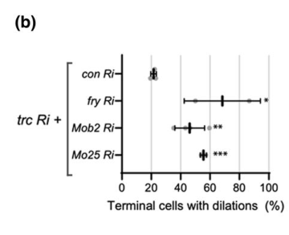

## Question

# Gene Research for Functional Annotation

## ⚠️ CRITICAL: Gene/Protein Identification Context

**BEFORE YOU BEGIN RESEARCH:** You MUST verify you are researching the CORRECT gene/protein. Gene symbols can be ambiguous, especially for less well-characterized genes from non-model organisms.

### Target Gene/Protein Identity (from UniProt):
- **UniProt Accession:** P91891
- **Protein Description:** RecName: Full=Protein Mo25; AltName: Full=dMo25;
- **Gene Information:** Name=Mo25; ORFNames=CG4083;
- **Organism (full):** Drosophila melanogaster (Fruit fly).
- **Protein Family:** Belongs to the Mo25 family. .
- **Key Domains:** ARM-like. (IPR011989); ARM-type_fold. (IPR016024); Mo25. (IPR013878); Mo25 (PF08569)

### MANDATORY VERIFICATION STEPS:

1. **Check if the gene symbol "Mo25" matches the protein description above**
2. **Verify the organism is correct:** Drosophila melanogaster (Fruit fly).
3. **Check if protein family/domains align with what you find in literature**
4. **If you find literature for a DIFFERENT gene with the same or similar symbol, STOP**

### If Gene Symbol is Ambiguous or You Cannot Find Relevant Literature:

**DO NOT PROCEED WITH RESEARCH ON A DIFFERENT GENE.** Instead:
- State clearly: "The gene symbol 'Mo25' is ambiguous or literature is limited for this specific protein"
- Explain what you found (e.g., "Found extensive literature on a different gene with the same symbol in a different organism")
- Describe the protein based ONLY on the UniProt information provided above
- Suggest that the protein function can be inferred from domain/family information

### Research Target:

Please provide a comprehensive research report on the gene **Mo25** (gene ID: Mo25, UniProt: P91891) in DROME.

The research report should be a detailed narrative explaining the function, biological processes, and localization of the gene product. Citations should be given for all claims.

You should prioritize authoritative reviews and primary scientific literature when conducting research. You can supplement
this with annotations you find in gene/protein databases, but these can be outdated or inaccurate.

We are specifically interested in the primary function of the gene - for enzymes, what reaction is catalyzed, and what is the substrate specificity? For transporters, what is the substrate? For structural proteins or adapters, what is the broader structural role? For signaling molecules, what is the role in the pathway.

We are interested in where in or outside the cell the gene product carries out its function.

We are also interested in the signaling or biochemical pathways in which the gene functions. We are less interested in broad pleiotropic effects, except where these elucidate the precise role.

Include evidence where possible. We are interested in both experimental evidence as well as inference from structure, evolution, or bioinformatic analysis. Precise studies should be prioritized over high-throughput, where available.

## Output

Question: You are an expert researcher providing comprehensive, well-cited information.

Provide detailed information focusing on:
1. Key concepts and definitions with current understanding
2. Recent developments and latest research (prioritize 2023-2024 sources)
3. Current applications and real-world implementations
4. Expert opinions and analysis from authoritative sources
5. Relevant statistics and data from recent studies

Format as a comprehensive research report with proper citations. Include URLs and publication dates where available.
Always prioritize recent, authoritative sources and provide specific citations for all major claims.

# Gene Research for Functional Annotation

## ⚠️ CRITICAL: Gene/Protein Identification Context

**BEFORE YOU BEGIN RESEARCH:** You MUST verify you are researching the CORRECT gene/protein. Gene symbols can be ambiguous, especially for less well-characterized genes from non-model organisms.

### Target Gene/Protein Identity (from UniProt):
- **UniProt Accession:** P91891
- **Protein Description:** RecName: Full=Protein Mo25; AltName: Full=dMo25;
- **Gene Information:** Name=Mo25; ORFNames=CG4083;
- **Organism (full):** Drosophila melanogaster (Fruit fly).
- **Protein Family:** Belongs to the Mo25 family. .
- **Key Domains:** ARM-like. (IPR011989); ARM-type_fold. (IPR016024); Mo25. (IPR013878); Mo25 (PF08569)

### MANDATORY VERIFICATION STEPS:

1. **Check if the gene symbol "Mo25" matches the protein description above**
2. **Verify the organism is correct:** Drosophila melanogaster (Fruit fly).
3. **Check if protein family/domains align with what you find in literature**
4. **If you find literature for a DIFFERENT gene with the same or similar symbol, STOP**

### If Gene Symbol is Ambiguous or You Cannot Find Relevant Literature:

**DO NOT PROCEED WITH RESEARCH ON A DIFFERENT GENE.** Instead:
- State clearly: "The gene symbol 'Mo25' is ambiguous or literature is limited for this specific protein"
- Explain what you found (e.g., "Found extensive literature on a different gene with the same symbol in a different organism")
- Describe the protein based ONLY on the UniProt information provided above
- Suggest that the protein function can be inferred from domain/family information

### Research Target:

Please provide a comprehensive research report on the gene **Mo25** (gene ID: Mo25, UniProt: P91891) in DROME.

The research report should be a detailed narrative explaining the function, biological processes, and localization of the gene product. Citations should be given for all claims.

You should prioritize authoritative reviews and primary scientific literature when conducting research. You can supplement
this with annotations you find in gene/protein databases, but these can be outdated or inaccurate.

We are specifically interested in the primary function of the gene - for enzymes, what reaction is catalyzed, and what is the substrate specificity? For transporters, what is the substrate? For structural proteins or adapters, what is the broader structural role? For signaling molecules, what is the role in the pathway.

We are interested in where in or outside the cell the gene product carries out its function.

We are also interested in the signaling or biochemical pathways in which the gene functions. We are less interested in broad pleiotropic effects, except where these elucidate the precise role.

Include evidence where possible. We are interested in both experimental evidence as well as inference from structure, evolution, or bioinformatic analysis. Precise studies should be prioritized over high-throughput, where available.

# Functional annotation of *Drosophila melanogaster* Mo25

## Identity and principal function

**The target is the fruit-fly gene *Mo25* (also called *Dmo25*; ORF CG4083), encoding UniProt P91891—not a mammalian MO25 gene or a Drosophila Mob-family gene.** The supplied UniProt record identifies an Mo25-family protein with Mo25 and ARM-like/ARM-type-fold domains. This family assignment agrees with the experimental literature’s identification of fly Mo25 as the homolog of yeast Hym1. *Mo25* is distinct from *Mob1/mats* and *Mob2*, which encode other kinase-associated regulators. See the identity record at https://www.uniprot.org/uniprotkb/P91891/entry. (he2005drosophilamobfamily pages 9-10, he2005drosophilamobfamily pages 3-3)

**Best-supported molecular annotation:** Mo25 is an intracellular **kinase-regulatory scaffold/cofactor**, not an enzyme or ion transporter. Fly Mo25 enhances the kinase activity of Fray *in vitro*. In living flies, it supports WNK–Fray-dependent epithelial ion transport and is genetically required upstream of GckIII in a pathway that controls tracheal tube shape. Thus there is no reaction catalyzed, transported substrate, or substrate specificity to assign to Mo25 itself; Fray, GckIII and their downstream proteins supply the catalytic activities. The precise fly Mo25-binding interfaces and whether its action is principally kinase recruitment, conformational activation, or both remain unresolved. (rodan2018wnkspakosr1signalinglessons pages 5-8, burguete2024theccm3gckiiisignaling pages 12-15, burguete2024theccm3gckiiisignaling pages 15-18)

The following matrix separates direct fly experiments from pathway interpretation and flags important limitations. Hudson *et al.*’s plotted comparison of Mo25 and *trc* knockdown is also available as figure evidence. (hudson2023ndrkinasetricornered media b67ebd26)

| System / location | Result (direct versus inferred) | Evidence and caveat |
|---|---|---|
| Malpighian-tubule principal cells | **Direct functional and biochemical evidence:** DmMo25 potentiated Fray kinase activity *in vitro*. Principal-cell Mo25 knockdown reduced transepithelial ion flux under hypotonic, maximally activating conditions but not isotonic conditions. Co-expression of Mo25 with chloride-insensitive DmWNK increased isotonic flux, supporting the DmWNK → Fray → Ncc69/NKCC pathway. | A 2018 review of Sun *et al.* reported that intracellular Cl⁻ fell from 27–30 mM to 15–16 mM during hypotonic exposure. Mouse Mo25α reportedly rescued fly Mo25 knockdown, supporting conserved function. Neither Mo25 subcellular localization nor direct Mo25–Fray binding was established. [Rodan 2018](https://doi.org/10.1152/ajprenal.00176.2018) and [Rodan 2019](https://doi.org/10.1097/MNH.0000000000000521) (rodan2018wnkspakosr1signalinglessons pages 5-8, rodan2019thedrosophilamalpighian pages 5-7) |
| Larval tracheal terminal cells, 2023 | **Direct genetic interaction; tentative physical association:** Mo25 RNAi plus *trc* RNAi produced a 55% tube-dilation rate, whereas Mo25 RNAi alone produced 0%, indicating synergy. Mo25 peptides were also detected in a Trc–GFP affinity-purification and mass-spectrometry dataset. | The pulldown is suggestive, not proof of direct Mo25–Trc binding. The Trc–GFP fusion had not been validated by rescue of a *trc* null, and RNAi can be incomplete or have off-target effects. [Hudson *et al.*, 2023](https://doi.org/10.1093/g3journal/jkad013) (hudson2023ndrkinasetricornered pages 4-5) |
| Larval tracheal terminal cells, 2024 preprint | **Direct loss-of-function and epistasis evidence:** Mo25-deficient mosaic cells had a 100%-penetrant tube defect (*n*=50). UAS-Mo25 rescued Mo25 loss but not *Ccm3* or *GckIII* loss; phosphomimetic hyperactive GckIII bypassed Mo25 loss (*n*=50), placing Mo25 upstream of GckIII activation. | CRISPR alleles, transgenic rescue, and epistasis support specificity, but the study was a **bioRxiv preprint and had not been peer reviewed**. Direct Mo25–GckIII or Mo25–Ccm3 binding and Mo25 subcellular localization were not demonstrated. [Burguete *et al.*, posted May 5, 2024](https://doi.org/10.1101/2024.05.03.592387) (burguete2024theccm3gckiiisignaling pages 12-15, burguete2024theccm3gckiiisignaling pages 9-12) |
| Wing epithelium: historical conflict | **Conflicting direct genetic evidence:** He *et al.* (2005) found no Trc-like multiple-wing-hair phenotype in strong *Dmo25* mutant clones and concluded that Dmo25 did not function with Trc in that assay. The 2024 preprint instead reported multiple-wing-hair defects in Mo25 mutant clones and after tissue-specific knockout. | The older mutant retained about 1% of wild-type transcript, although maternal contribution complicated interpretation. The newer positive result used independent alleles and tissue-specific disruption but remained unreviewed. [He *et al.*, 2005](https://doi.org/10.1091/mbc.e05-01-0018) and [Burguete *et al.*, 2024](https://doi.org/10.1101/2024.05.03.592387) (he2005drosophilamobfamily pages 10-11, burguete2024theccm3gckiiisignaling pages 12-15) |
| Embryonic neuroblasts and asymmetric division | **Direct genetic cooperation but no detected stable complex:** *fray* and *mo25* mutants reportedly had similar asymmetric-division phenotypes, and co-overexpression of both genes was required to produce gain-of-function phenotypes. Fray and Mo25 did **not** co-immunoprecipitate from embryonic extracts. | Yarikipati *et al.* summarized these results from the original 2008 study. They support functional cooperation but not stable physical binding; Mo25-mediated stabilization of Wnk–Fray signaling remains hypothetical. [Yarikipati *et al.*, 2023](https://doi.org/10.1371/journal.pgen.1010975) (yarikipati2023unanticipateddomainrequirements pages 12-14) |

*Table: Fly-specific evidence separates established Mo25 functions from pathway inference and highlights conflicting results and experimental limitations. No unsupported subcellular localization is assigned.*

## Biochemical pathways and biological processes

### WNK–Fray signaling in the renal epithelium

The clearest biochemical evidence for fly Mo25 concerns the **Malpighian-tubule principal cell**. In this system, chloride-sensitive WNK phosphorylates Fray, the fly SPAK/OSR1-related kinase; Fray phosphorylates the N terminus of Ncc69, a Na⁺–K⁺–2Cl⁻ cotransporter. This kinase–transporter cascade regulates transepithelial ion flux and fluid secretion. Mo25 potentiates Fray activity *in vitro*, and principal-cell Mo25 depletion reduces ion flux under hypotonic conditions, **but not under the isotonic baseline conditions tested**. Co-expressing Mo25 with chloride-insensitive WNK increases flux even in isotonic medium; expressing wild-type WNK, Mo25, or the chloride-insensitive WNK separately does not. These observations support Mo25 as a cofactor needed for strong pathway output rather than a cotransporter or the chloride sensor itself. The primary fly study is Sun *et al.*, **May 2018**, https://doi.org/10.1681/ASN.2017101091; the detailed findings here are supported by Rodan’s **October 2018** expert synthesis, https://doi.org/10.1152/ajprenal.00176.2018. (rodan2018wnkspakosr1signalinglessons pages 5-8)

For scale, hypotonic exposure lowered measured principal-cell intracellular chloride from approximately **27–30 mM to 15–16 mM within 30–60 minutes**; WNK activity rose over the same interval. Those values characterize the pathway’s experimental stimulus, **not chloride binding by Mo25**. The downstream transport output involves Ncc69-mediated uptake of Na⁺, K⁺ and Cl⁻ and epithelial ion/fluid movement; Mo25 has no demonstrated transported substrate. Expression of mouse Mo25α rescued fly Mo25 knockdown in this tubule model, supporting evolutionary conservation without proving that all mammalian MO25 interactions occur in flies. Rodan, **2018**, https://doi.org/10.1152/ajprenal.00176.2018; Rodan, **September 2019**, https://doi.org/10.1097/MNH.0000000000000521. (rodan2018wnkspakosr1signalinglessons pages 5-8, rodan2019thedrosophilamalpighian pages 5-7)

### Ccm3–GckIII–Tricornered signaling in epithelial morphogenesis

**Recent fly studies extend Mo25’s annotation beyond renal transport.** Hudson *et al.* (**January 2023**, *G3*, https://doi.org/10.1093/g3journal/jkad013) found that simultaneous *Mo25* and *tricornered* (*trc*) RNAi yielded **55%** dilated larval tracheal terminal cells, whereas Mo25 RNAi alone yielded **0%** dilations in their comparison. Mo25-derived peptides were detected in an embryonic Trc–GFP affinity-purification dataset, but copurification does **not** demonstrate direct Mo25–Trc binding; the authors also noted that the tagged Trc construct had not been validated by rescue. The RNAi result establishes a genetic interaction, not its molecular mechanism. (hudson2023ndrkinasetricornered pages 4-5)

Burguete, Song and Ghabrial’s **May 5, 2024 bioRxiv preprint**, https://doi.org/10.1101/2024.05.03.592387, provides stronger loss-of-function and rescue evidence. Mo25-deficient tracheal terminal-cell clones had a **100%-penetrant tube-dilation defect (*n* = 50)**. A fly Mo25 transgene rescued Mo25 loss, whereas it could not rescue *Ccm3* or *GckIII* loss; conversely, phosphomimetic hyperactive GckIII bypassed Mo25 loss. This places Mo25 functionally **upstream of full GckIII activation**, within a proposed Tao → GckIII → Trc kinase cassette supported by Ccm3. It is consistent with Mo25 facilitating an active GckIII conformation, but does not directly establish a fly Mo25–GckIII or Mo25–Ccm3 physical interaction. **These 2024 findings were posted as a preprint, not certified by peer review**, and should be weighted accordingly. (burguete2024theccm3gckiiisignaling pages 1-5, burguete2024theccm3gckiiisignaling pages 9-12, burguete2024theccm3gckiiisignaling pages 12-15)

A proposed downstream consequence is regulation of **Rab11-dependent recycling toward the tracheal apical compartment**: active Rab11 becomes abnormally concentrated near tube dilations after GckIII or Ccm3 disruption, and reducing Rab11 activity suppresses the GckIII mutant dilation phenotype. This connects the kinase cassette to control of apical-membrane delivery and lumen diameter, **but Rab11 redistribution was not demonstrated specifically in Mo25 mutant cells**, and neither direct Rab11 phosphorylation nor a Mo25-to-Rab11 molecular link was established. Burguete *et al.*, **2024**, https://doi.org/10.1101/2024.05.03.592387. (burguete2024theccm3gckiiisignaling pages 15-18)

### Asymmetric division, wing polarity and other proposed pathways

Fly *fray* and *mo25* mutants have been reported to share defects in **embryonic neuroblast asymmetric division**, with joint overexpression required to produce gain-of-function phenotypes. Importantly, Fray and Mo25 **did not co-immunoprecipitate from embryonic extracts**: genetic cooperation must not be described as proof of a stable embryonic complex. The underlying study is Yamamoto, Izumi and Matsuzaki, **February 2008**, https://doi.org/10.1016/j.bbrc.2007.11.128; these findings and the binding caveat are discussed by Yarikipati *et al.*, **October 11, 2023**, https://doi.org/10.1371/journal.pgen.1010975. The 2023 authors suggest, but do not establish, that Mo25 might stabilize WNK–Fray signaling *in vivo*. (yarikipati2023unanticipateddomainrequirements pages 12-14)

Evidence for a wing-hair role has **changed and remains discordant**. He *et al.* (**September 2005**, https://doi.org/10.1091/mbc.e05-01-0018) did not see Trc-like multiple hairs in their *Dmo25* mutant clones, although they found other wing and bristle abnormalities and suggested a possible Notch-related genetic effect. The **2024 preprint** instead reports multiple hairs in Mo25 mutant clones and following wing-specific knockout. The earlier Notch association was a genetic suggestion, not a demonstrated direct Mo25–Notch signaling mechanism; the discrepant wing results should not be collapsed into a settled conclusion. (he2005drosophilamobfamily pages 10-11, burguete2024theccm3gckiiisignaling pages 12-15)

Mammalian MO25 scaffolds an LKB1–STRAD kinase complex, and its binding-site architecture offers a plausible evolutionary model for fly Mo25’s ARM-like fold. Nevertheless, the mammalian complex and its cytoplasmic localization **do not establish** a fly Mo25–Lkb1–Stlk complex or an AMPK-pathway role for CG4083. The older fly study explicitly treated that connection as an open question. Boudeau *et al.*, **December 2004**, https://doi.org/10.1242/jcs.01571; He *et al.*, **2005**, https://doi.org/10.1091/mbc.e05-01-0018. (boudeau2004analysisofthe pages 7-9, he2005drosophilamobfamily pages 12-13)

## Where Mo25 acts—and what localization remains unknown

**Functional sites demonstrated by tissue-directed experiments** are intracellular signaling in Malpighian-tubule principal cells and in developing tracheal terminal cells; genetic evidence also implicates embryonic neuroblasts and, provisionally, wing epithelial cells. This evidence does **not** resolve whether endogenous fly Mo25 is predominantly cytosolic, apical, nuclear, or membrane-associated in any of those cells. In particular, the reported apical and nuclear fluorescence in tracheal cells was measured for **Ccm3–GFP, not Mo25**. Assigning Ccm3’s localization to Mo25—or assigning the location of the membrane cotransporter Ncc69 to Mo25—would be unwarranted. (rodan2018wnkspakosr1signalinglessons pages 5-8, burguete2024theccm3gckiiisignaling pages 9-12, burguete2024theccm3gckiiisignaling pages 12-15, yarikipati2023unanticipateddomainrequirements pages 12-14)

## Assessment and research use

For functional annotation, the most defensible concise description is: **“Mo25-family intracellular scaffold/cofactor that promotes Fray-dependent epithelial ion transport and supports GckIII-dependent tracheal tube morphogenesis; its specific fly binding partners and subcellular distribution require further confirmation.”** The fly Malpighian tubule is an implemented experimental model for measuring Mo25-dependent epithelial transport and for testing conservation with mammalian MO25; the tracheal genetic system tests pathway order and lumen integrity. These are research applications, **not** evidence that fly Mo25 is itself a human therapeutic target. Priority experiments would be endogenous Mo25 tagging/localization and interaction tests that distinguish direct binding to Fray or GckIII from membership in a larger complex. (rodan2018wnkspakosr1signalinglessons pages 5-8, rodan2019thedrosophilamalpighian pages 5-7, hudson2023ndrkinasetricornered pages 4-5, burguete2024theccm3gckiiisignaling pages 12-15, yarikipati2023unanticipateddomainrequirements pages 12-14)

**Source-access limitation:** the retrieved full text labeled as Sun *et al.* 2018 contained unrelated journal advertising material. Accordingly, specific renal findings above are attributed to the accessible, authored Rodan reviews rather than to an inspected copy of Sun *et al.*’s experimental figures. The 2008 asymmetric-division article was also not available in full text; its result is presented through the accessible 2023 primary paper’s discussion. (sun2018intracellularchlorideand pages 1-3, rodan2018wnkspakosr1signalinglessons pages 5-8, rodan2019thedrosophilamalpighian pages 5-7, yarikipati2023unanticipateddomainrequirements pages 12-14)

References

1. (he2005drosophilamobfamily pages 9-10): Ying He, Kazuo Emoto, Xiaolan Fang, Nan Ren, Xiaojing Tian, Yuh-Nung Jan, and Paul N. Adler. Drosophila mob family proteins interact with the related tricornered (trc) and warts (wts) kinases. Molecular biology of the cell, 16 9:4139-52, Sep 2005. URL: https://doi.org/10.1091/mbc.e05-01-0018, doi:10.1091/mbc.e05-01-0018. This article has 120 citations and is from a domain leading peer-reviewed journal.

2. (he2005drosophilamobfamily pages 3-3): Ying He, Kazuo Emoto, Xiaolan Fang, Nan Ren, Xiaojing Tian, Yuh-Nung Jan, and Paul N. Adler. Drosophila mob family proteins interact with the related tricornered (trc) and warts (wts) kinases. Molecular biology of the cell, 16 9:4139-52, Sep 2005. URL: https://doi.org/10.1091/mbc.e05-01-0018, doi:10.1091/mbc.e05-01-0018. This article has 120 citations and is from a domain leading peer-reviewed journal.

3. (rodan2018wnkspakosr1signalinglessons pages 5-8): Aylin R. Rodan. Wnk-spak/osr1 signaling: lessons learned from an insect renal epithelium. American journal of physiology. Renal physiology, 315 4:F903-F907, Oct 2018. URL: https://doi.org/10.1152/ajprenal.00176.2018, doi:10.1152/ajprenal.00176.2018. This article has 30 citations.

4. (burguete2024theccm3gckiiisignaling pages 12-15): Alondra S. Burguete, Yanjun Song, and Amin S. Ghabrial. The ccm3-gckiii signaling axis regulates rab11-dependent recycling to the apical compartment. bioRxiv, May 2024. URL: https://doi.org/10.1101/2024.05.03.592387, doi:10.1101/2024.05.03.592387. This article has 1 citations.

5. (burguete2024theccm3gckiiisignaling pages 15-18): Alondra S. Burguete, Yanjun Song, and Amin S. Ghabrial. The ccm3-gckiii signaling axis regulates rab11-dependent recycling to the apical compartment. bioRxiv, May 2024. URL: https://doi.org/10.1101/2024.05.03.592387, doi:10.1101/2024.05.03.592387. This article has 1 citations.

6. (hudson2023ndrkinasetricornered media b67ebd26): Joshua Hudson, Sayantanee Paul, Alexey Veraksa, Amin Ghabrial, Kieran F Harvey, and Carole Poon. Ndr kinase tricornered genetically interacts with ccm3 and metabolic enzymes in drosophila melanogaster tracheal development. G3: Genes|Genomes|Genetics, Jan 2023. URL: https://doi.org/10.1093/g3journal/jkad013, doi:10.1093/g3journal/jkad013. This article has 2 citations.

7. (rodan2019thedrosophilamalpighian pages 5-7): Aylin R. Rodan. The drosophila malpighian tubule as a model for mammalian tubule function. Current Opinion in Nephrology & Hypertension, 28:455-464, Sep 2019. URL: https://doi.org/10.1097/mnh.0000000000000521, doi:10.1097/mnh.0000000000000521. This article has 43 citations and is from a peer-reviewed journal.

8. (hudson2023ndrkinasetricornered pages 4-5): Joshua Hudson, Sayantanee Paul, Alexey Veraksa, Amin Ghabrial, Kieran F Harvey, and Carole Poon. Ndr kinase tricornered genetically interacts with ccm3 and metabolic enzymes in drosophila melanogaster tracheal development. G3: Genes|Genomes|Genetics, Jan 2023. URL: https://doi.org/10.1093/g3journal/jkad013, doi:10.1093/g3journal/jkad013. This article has 2 citations.

9. (burguete2024theccm3gckiiisignaling pages 9-12): Alondra S. Burguete, Yanjun Song, and Amin S. Ghabrial. The ccm3-gckiii signaling axis regulates rab11-dependent recycling to the apical compartment. bioRxiv, May 2024. URL: https://doi.org/10.1101/2024.05.03.592387, doi:10.1101/2024.05.03.592387. This article has 1 citations.

10. (he2005drosophilamobfamily pages 10-11): Ying He, Kazuo Emoto, Xiaolan Fang, Nan Ren, Xiaojing Tian, Yuh-Nung Jan, and Paul N. Adler. Drosophila mob family proteins interact with the related tricornered (trc) and warts (wts) kinases. Molecular biology of the cell, 16 9:4139-52, Sep 2005. URL: https://doi.org/10.1091/mbc.e05-01-0018, doi:10.1091/mbc.e05-01-0018. This article has 120 citations and is from a domain leading peer-reviewed journal.

11. (yarikipati2023unanticipateddomainrequirements pages 12-14): Prathibha Yarikipati, Sima Jonusaite, John M. Pleinis, Carihann Dominicci Cotto, David Sanchez-Hernandez, Daryl E. Morrison, Suhani Goyal, Jeffrey Schellinger, Clothilde Pénalva, Jennifer Curtiss, Aylin R. Rodan, and Andreas Jenny. Unanticipated domain requirements for drosophila wnk kinase in vivo. PLOS Genetics, 19:e1010975, Oct 2023. URL: https://doi.org/10.1371/journal.pgen.1010975, doi:10.1371/journal.pgen.1010975. This article has 10 citations and is from a domain leading peer-reviewed journal.

12. (burguete2024theccm3gckiiisignaling pages 1-5): Alondra S. Burguete, Yanjun Song, and Amin S. Ghabrial. The ccm3-gckiii signaling axis regulates rab11-dependent recycling to the apical compartment. bioRxiv, May 2024. URL: https://doi.org/10.1101/2024.05.03.592387, doi:10.1101/2024.05.03.592387. This article has 1 citations.

13. (boudeau2004analysisofthe pages 7-9): Jérôme Boudeau, John W. Scott, Nicoletta Resta, Maria Deak, Agnieszka Kieloch, David Komander, D. Grahame Hardie, Alan R. Prescott, Daan M. F. van Aalten, and Dario R. Alessi. Analysis of the lkb1-strad-mo25 complex. Journal of Cell Science, 117:6365-6375, Dec 2004. URL: https://doi.org/10.1242/jcs.01571, doi:10.1242/jcs.01571. This article has 224 citations and is from a domain leading peer-reviewed journal.

14. (he2005drosophilamobfamily pages 12-13): Ying He, Kazuo Emoto, Xiaolan Fang, Nan Ren, Xiaojing Tian, Yuh-Nung Jan, and Paul N. Adler. Drosophila mob family proteins interact with the related tricornered (trc) and warts (wts) kinases. Molecular biology of the cell, 16 9:4139-52, Sep 2005. URL: https://doi.org/10.1091/mbc.e05-01-0018, doi:10.1091/mbc.e05-01-0018. This article has 120 citations and is from a domain leading peer-reviewed journal.

15. (sun2018intracellularchlorideand pages 1-3): Qifei Sun, Yipin Wu, Sima Jonusaite, John M. Pleinis, John M. Humphreys, Haixia He, Jeffrey N. Schellinger, Radha Akella, Drew Stenesen, Helmut Krämer, Elizabeth J. Goldsmith, and Aylin R. Rodan. Intracellular chloride and scaffold protein mo25 cooperatively regulate transepithelial ion transport through wnk signaling in the malpighian tubule. Journal of the American Society of Nephrology : JASN, 29 5:1449-1461, May 2018. URL: https://doi.org/10.1681/asn.2017101091, doi:10.1681/asn.2017101091. This article has 52 citations.

## Artifacts

- [Edison artifact artifact-00](Mo25-deep-research-falcon_artifacts/artifact-00.md)

## Citations

1. hudson2023ndrkinasetricornered pages 4-5
2. yarikipati2023unanticipateddomainrequirements pages 12-14
3. he2005drosophilamobfamily pages 9-10
4. he2005drosophilamobfamily pages 3-3
5. rodan2019thedrosophilamalpighian pages 5-7
6. he2005drosophilamobfamily pages 10-11
7. boudeau2004analysisofthe pages 7-9
8. he2005drosophilamobfamily pages 12-13
9. sun2018intracellularchlorideand pages 1-3
10. Rodan 2018
11. Rodan 2019
12. Hudson *et al.*, 2023
13. Burguete *et al.*, posted May 5, 2024
14. He *et al.*, 2005
15. Burguete *et al.*, 2024
16. Yarikipati *et al.*, 2023
17. https://www.uniprot.org/uniprotkb/P91891/entry.
18. https://doi.org/10.1152/ajprenal.00176.2018
19. https://doi.org/10.1097/MNH.0000000000000521
20. https://doi.org/10.1093/g3journal/jkad013
21. https://doi.org/10.1101/2024.05.03.592387
22. https://doi.org/10.1091/mbc.e05-01-0018
23. https://doi.org/10.1371/journal.pgen.1010975
24. https://doi.org/10.1681/ASN.2017101091;
25. https://doi.org/10.1152/ajprenal.00176.2018.
26. https://doi.org/10.1152/ajprenal.00176.2018;
27. https://doi.org/10.1097/MNH.0000000000000521.
28. https://doi.org/10.1101/2024.05.03.592387,
29. https://doi.org/10.1101/2024.05.03.592387.
30. https://doi.org/10.1016/j.bbrc.2007.11.128;
31. https://doi.org/10.1371/journal.pgen.1010975.
32. https://doi.org/10.1242/jcs.01571;
33. https://doi.org/10.1091/mbc.e05-01-0018.
34. https://doi.org/10.1091/mbc.e05-01-0018,
35. https://doi.org/10.1152/ajprenal.00176.2018,
36. https://doi.org/10.1093/g3journal/jkad013,
37. https://doi.org/10.1097/mnh.0000000000000521,
38. https://doi.org/10.1371/journal.pgen.1010975,
39. https://doi.org/10.1242/jcs.01571,
40. https://doi.org/10.1681/asn.2017101091,