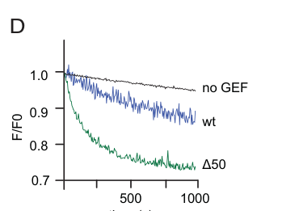

## Question

# Gene Research for Functional Annotation

## ⚠️ CRITICAL: Gene/Protein Identification Context

**BEFORE YOU BEGIN RESEARCH:** You MUST verify you are researching the CORRECT gene/protein. Gene symbols can be ambiguous, especially for less well-characterized genes from non-model organisms.

### Target Gene/Protein Identity (from UniProt):
- **UniProt Accession:** Q9VR38
- **Protein Description:** RecName: Full=Vacuolar fusion protein MON1 homolog {ECO:0000255|RuleBase:RU367048}; Short=Dmon1 {ECO:0000303|PubMed:23418349};
- **Gene Information:** Name=Mon1 {ECO:0000312|FlyBase:FBgn0031640}; ORFNames=CG11926 {ECO:0000312|FlyBase:FBgn0031640};
- **Organism (full):** Drosophila melanogaster (Fruit fly).
- **Protein Family:** Belongs to the MON1/SAND family.
- **Key Domains:** FUZ/MON1/HPS1_longin_1. (IPR043972); FUZ/MON1/HPS1_longin_2. (IPR043971); FUZ/MON1/HPS1_longin_3. (IPR043970); Mon1. (IPR004353); Fuz_longin_1 (PF19036)

### MANDATORY VERIFICATION STEPS:

1. **Check if the gene symbol "Mon1" matches the protein description above**
2. **Verify the organism is correct:** Drosophila melanogaster (Fruit fly).
3. **Check if protein family/domains align with what you find in literature**
4. **If you find literature for a DIFFERENT gene with the same or similar symbol, STOP**

### If Gene Symbol is Ambiguous or You Cannot Find Relevant Literature:

**DO NOT PROCEED WITH RESEARCH ON A DIFFERENT GENE.** Instead:
- State clearly: "The gene symbol 'Mon1' is ambiguous or literature is limited for this specific protein"
- Explain what you found (e.g., "Found extensive literature on a different gene with the same symbol in a different organism")
- Describe the protein based ONLY on the UniProt information provided above
- Suggest that the protein function can be inferred from domain/family information

### Research Target:

Please provide a comprehensive research report on the gene **Mon1** (gene ID: Mon1, UniProt: Q9VR38) in DROME.

The research report should be a detailed narrative explaining the function, biological processes, and localization of the gene product. Citations should be given for all claims.

You should prioritize authoritative reviews and primary scientific literature when conducting research. You can supplement
this with annotations you find in gene/protein databases, but these can be outdated or inaccurate.

We are specifically interested in the primary function of the gene - for enzymes, what reaction is catalyzed, and what is the substrate specificity? For transporters, what is the substrate? For structural proteins or adapters, what is the broader structural role? For signaling molecules, what is the role in the pathway.

We are interested in where in or outside the cell the gene product carries out its function.

We are also interested in the signaling or biochemical pathways in which the gene functions. We are less interested in broad pleiotropic effects, except where these elucidate the precise role.

Include evidence where possible. We are interested in both experimental evidence as well as inference from structure, evolution, or bioinformatic analysis. Precise studies should be prioritized over high-throughput, where available.

## Output

Question: You are an expert researcher providing comprehensive, well-cited information.

Provide detailed information focusing on:
1. Key concepts and definitions with current understanding
2. Recent developments and latest research (prioritize 2023-2024 sources)
3. Current applications and real-world implementations
4. Expert opinions and analysis from authoritative sources
5. Relevant statistics and data from recent studies

Format as a comprehensive research report with proper citations. Include URLs and publication dates where available.
Always prioritize recent, authoritative sources and provide specific citations for all major claims.

# Gene Research for Functional Annotation

## ⚠️ CRITICAL: Gene/Protein Identification Context

**BEFORE YOU BEGIN RESEARCH:** You MUST verify you are researching the CORRECT gene/protein. Gene symbols can be ambiguous, especially for less well-characterized genes from non-model organisms.

### Target Gene/Protein Identity (from UniProt):
- **UniProt Accession:** Q9VR38
- **Protein Description:** RecName: Full=Vacuolar fusion protein MON1 homolog {ECO:0000255|RuleBase:RU367048}; Short=Dmon1 {ECO:0000303|PubMed:23418349};
- **Gene Information:** Name=Mon1 {ECO:0000312|FlyBase:FBgn0031640}; ORFNames=CG11926 {ECO:0000312|FlyBase:FBgn0031640};
- **Organism (full):** Drosophila melanogaster (Fruit fly).
- **Protein Family:** Belongs to the MON1/SAND family.
- **Key Domains:** FUZ/MON1/HPS1_longin_1. (IPR043972); FUZ/MON1/HPS1_longin_2. (IPR043971); FUZ/MON1/HPS1_longin_3. (IPR043970); Mon1. (IPR004353); Fuz_longin_1 (PF19036)

### MANDATORY VERIFICATION STEPS:

1. **Check if the gene symbol "Mon1" matches the protein description above**
2. **Verify the organism is correct:** Drosophila melanogaster (Fruit fly).
3. **Check if protein family/domains align with what you find in literature**
4. **If you find literature for a DIFFERENT gene with the same or similar symbol, STOP**

### If Gene Symbol is Ambiguous or You Cannot Find Relevant Literature:

**DO NOT PROCEED WITH RESEARCH ON A DIFFERENT GENE.** Instead:
- State clearly: "The gene symbol 'Mon1' is ambiguous or literature is limited for this specific protein"
- Explain what you found (e.g., "Found extensive literature on a different gene with the same symbol in a different organism")
- Describe the protein based ONLY on the UniProt information provided above
- Suggest that the protein function can be inferred from domain/family information

### Research Target:

Please provide a comprehensive research report on the gene **Mon1** (gene ID: Mon1, UniProt: Q9VR38) in DROME.

The research report should be a detailed narrative explaining the function, biological processes, and localization of the gene product. Citations should be given for all claims.

You should prioritize authoritative reviews and primary scientific literature when conducting research. You can supplement
this with annotations you find in gene/protein databases, but these can be outdated or inaccurate.

We are specifically interested in the primary function of the gene - for enzymes, what reaction is catalyzed, and what is the substrate specificity? For transporters, what is the substrate? For structural proteins or adapters, what is the broader structural role? For signaling molecules, what is the role in the pathway.

We are interested in where in or outside the cell the gene product carries out its function.

We are also interested in the signaling or biochemical pathways in which the gene functions. We are less interested in broad pleiotropic effects, except where these elucidate the precise role.

Include evidence where possible. We are interested in both experimental evidence as well as inference from structure, evolution, or bioinformatic analysis. Precise studies should be prioritized over high-throughput, where available.

# Functional annotation of *Drosophila melanogaster* Mon1 (Q9VR38)

## Identity and principal function

**Identity verified.** The requested UniProt entry Q9VR38 identifies *D. melanogaster* Mon1, also called Dmon1 and encoded by **CG11926**. The primary fly study independently identifies CG11926 as the Mon1/SAND-family ortholog and describes a longin-containing protein; this is consistent with the MON1 and longin-domain annotations supplied for Q9VR38. This report does **not** treat the related subunit Bulli (**CG8270**) or a human MON1 paralog as the target gene. ([Yousefian et al., *Journal of Cell Science*, April 2013](https://doi.org/10.1242/jcs.114934)). (yousefian2013dmon1controlsrecruitment pages 2-3, dehnen2020atrimericmetazoan pages 3-5)

**Functional annotation:** Mon1 is the regulatory and catalytic-complex subunit of a **Rab7 guanine-nucleotide exchange factor (GEF)**. With Ccz1, it promotes release of GDP from Rab7 so that Rab7 can bind GTP; in flies, the Mon1–Ccz1 complex also associates with the accessory subunit Bulli. The immediate, experimentally tested substrate is **Rab7**, not Rab5: Rab5-GTP is an upstream regulator of membrane-associated Mon1–Ccz1 activity. Mon1 alone should not be annotated as an independently demonstrated Rab7 GEF, and the complex is not the membrane-fusing protein itself. ([Dehnen et al., *Journal of Cell Science*, June/July 2020](https://doi.org/10.1242/jcs.247080); [Borchers et al., *PNAS*, published July 18, 2023](https://doi.org/10.1073/pnas.2303750120)). (dehnen2020atrimericmetazoan pages 5-7, borchers2023regulatorysitesin pages 1-2, borchers2023regulatorysitesin pages 2-3)

The key experimental findings, with their tissue and assay contexts, are summarized here. (yousefian2013dmon1controlsrecruitment pages 2-3, hegedus2016theccz1mon1rab7module pages 3-4, dehnen2020atrimericmetazoan pages 5-7, borchers2023regulatorysitesin pages 2-3)

| Paper/year | Tested fly system | Direct mechanistic evidence | Interpretation / limitations |
|---|---|---|---|
| [Yousefian et al., 2013](https://doi.org/10.1242/jcs.114934) | **Mon1/CG11926** mutant wing-disc clones; rescue with Dmon1-HA | Rab5 associated with 43% of mutant versus 12% of wild-type Notch-positive endosomes; Rab7 association fell to 0%. Dmon1-HA restored normal endosome size and Rab7 membrane localization. (yousefian2013dmon1controlsrecruitment pages 3-4, yousefian2013dmon1controlsrecruitment pages 2-3) | Mon1 is required to recruit Rab7 to maturing endosomes. Tagged Mon1 appeared predominantly cytosolic at steady state, so its membrane residence may be transient; nucleotide exchange was not assayed directly. |
| [Hegedűs et al., 2016](https://doi.org/10.1091/mbc.e16-03-0205) | Starved larval fat body; **Mon1**-null cells, fluorescence microscopy, and EM | Atg8a–Rab7 overlap was 56% in controls but 11% in Mon1 mutants. Mutants accumulated autophagosomes, lacked autolysosomes, and were rescued by Mon1 or active Rab7. (hegedus2016theccz1mon1rab7module pages 4-5, hegedus2016theccz1mon1rab7module pages 3-4) | Mon1–Ccz1 recruits Rab7 to autophagosomes and enables autophagosome–lysosome fusion independently of Rab5. PI3P binding was shown by lipid overlay, not proven to be the sole in-vivo recruitment mechanism. |
| [Dehnen et al., 2020](https://doi.org/10.1242/jcs.247080) | Recombinant fly Mon1–Ccz1 with or without Bulli; Drosophila nephrocytes | Both dimer and trimer accelerated nucleotide release from MANT-GDP-loaded fly Rab7; on model membranes, Bulli increased activity by about 40%. Bulli colocalized strongly with Rab7-positive compartments (Pearson coefficient about 0.8) but poorly with Rab5 (0.28). (dehnen2020atrimericmetazoan pages 5-7) | Establishes Rab7 as the direct GEF substrate and Bulli as a stoichiometric accessory subunit. Mon1–Ccz1 supplies the core catalytic activity; Bulli principally supports membrane-associated function. |
| [Borchers et al., 2023](https://doi.org/10.1073/pnas.2303750120) | Purified fly Mon1–Ccz1–Bulli; Rab5-bearing liposomes; transgenic nephrocytes | Removing Mon1’s disordered N terminus increased Rab5-dependent Rab7 exchange on membranes without increasing solution activity. Mon1 W334A reduced Rab5-dependent membrane GEF activity while retaining solution activity. (borchers2023regulatorysitesin pages 2-3, borchers2023regulatorysitesin pages 6-7, borchers2023regulatorysitesin pages 7-8) | Supports N-terminal autoinhibition and a conserved Rab5-responsive site in Mon1: Rab5 activates the complex in a membrane context. Detailed in-vivo analysis of the corresponding Rab5-binding mutation relied partly on yeast. |

*Table: Direct experimental evidence defining the endosomal and autophagic functions of Drosophila melanogaster Mon1/CG11926 (Q9VR38). The table distinguishes demonstrated mechanisms from experimental limitations.*

## Molecular mechanism and substrate specificity

Purified **Drosophila** Mon1–Ccz1, both without and with Bulli, accelerated nucleotide exchange on MANT-GDP-loaded **Drosophila Rab7** when unlabeled GTP was supplied. Thus, the Rab7 assignment rests on a direct biochemical assay using fly proteins, as well as genetics. The Bulli-containing trimer showed approximately **40% greater activity than the dimer on model membranes** in the reported assay, but the dimer retained substantial activity: Bulli assists full membrane-associated function rather than supplying the essential exchange active site. These experiments establish Rab7 as a substrate; they do not constitute an exhaustive screen excluding every other Rab. ([Dehnen et al., 2020](https://doi.org/10.1242/jcs.247080)). (dehnen2020atrimericmetazoan pages 5-7)

The longin-domain architecture explains why Mon1 is a GEF-complex component rather than a conventional metabolic enzyme. Mon1 and Ccz1 each contribute longin domains: their first domains form the Rab-interacting catalytic core, while other surfaces contribute regulation and membrane engagement. Comparative structural work explains exchange through remodeling of the Rab switch/nucleotide-binding region; its most detailed atomic catalytic interpretation draws substantially on non-fly homologs and should be distinguished from the direct fly exchange assays. ([Borchers et al., 2023](https://doi.org/10.1073/pnas.2303750120); [Wilmes et al., *Science Advances*, August 27, 2025](https://doi.org/10.1126/sciadv.adx2893)). (borchers2023regulatorysitesin pages 1-2, wilmes2025mechanisticadaptationof pages 1-2)

A **2023 mechanistic advance** identified two Mon1 regulatory regions. Removing its predicted disordered N-terminal segment increased Rab5-dependent Rab7 exchange by purified fly Mon1–Ccz1–Bulli **on Rab5-bearing liposomes**, without a corresponding increase in solution; changing fly Mon1 **W334** impaired membrane-context stimulation while preserving solution exchange. The authors interpret these findings as N-terminal autoinhibition relieved by an upstream Rab5-responsive site. Their proposed details of how the N terminus folds back or gates Rab7 access remain a model, rather than a directly observed fly-cell structure. ([Borchers et al., 2023](https://doi.org/10.1073/pnas.2303750120), especially Figure 1). (borchers2023regulatorysitesin pages 2-3, borchers2023regulatorysitesin pages 6-7, borchers2023regulatorysitesin media adc5dc93, borchers2023regulatorysitesin pages 7-8)

## Where Mon1 acts: endosomes and autophagic membranes

**Maturing endosomes.** Mon1 acts at the Rab5-to-Rab7 transition that gives maturing endosomes their late-endosomal identity and enables subsequent delivery toward lysosomes. In fly wing-disc clones lacking Mon1, enlarged, Notch-containing endosomes lost detectable Rab7 association (**0%** in the reported comparison), while Rab5 was present on **43%** of mutant versus **12%** of control Notch-positive endosomes. Re-expression of Mon1 restored Rab7 association and normalized endosome size; electron microscopy identified enlarged multivesicular endosomes. Uptake and several other maturation features persisted, pointing to a particularly important defect in the Rab7-dependent stage rather than a wholesale block of endocytosis. ([Yousefian et al., 2013](https://doi.org/10.1242/jcs.114934)). (yousefian2013dmon1controlsrecruitment pages 2-3, yousefian2013dmon1controlsrecruitment pages 3-4, yousefian2013dmon1controlsrecruitment pages 6-7)

**Autophagosomes.** In starved larval fat cells, the Mon1–Ccz1–Rab7 module is required to recruit Rab7 to Atg8a-positive autophagic structures and permit **autophagosome–lysosome fusion**. Atg8a–Rab7 overlap was **56% (112/200 structures)** in controls, but **11% (22/200)** in Mon1 mutants; mutant cells accumulated autophagosomes and lacked normal autolysosomes by electron microscopy. Wild-type Mon1 rescued the autolysosome phenotype, while active, GTP-locked Rab7 localized to autophagic structures and bypassed part of the Mon1 requirement. Rab5-null fat cells, by contrast, could recruit Rab7 and form autolysosomes, demonstrating that Rab5 is **not required for this particular fusion step**; it has a distinguishable later role in lysosomal cargo degradation. ([Hegedűs et al., *Molecular Biology of the Cell*, October 2016](https://doi.org/10.1091/mbc.e16-03-0205)). (hegedus2016theccz1mon1rab7module pages 4-5, hegedus2016theccz1mon1rab7module pages 3-4, hegedus2016theccz1mon1rab7module pages 2-3)

**Localization is context-dependent.** Functional HA-tagged Mon1 appeared broadly **cytosolic and excluded from nuclei** in the 2013 wing-disc experiment, without obvious steady-state vesicle enrichment. This does not negate membrane action: Mon1-HA was subsequently observed on Atg8a-positive autophagic structures in fat cells, and complex partner Bulli localized strongly to Rab7-positive nephrocyte compartments (reported Pearson colocalization coefficient approximately **0.8**, versus **0.28** for Rab5). The evidence therefore supports a cytosolic pool that can act at intracellular organelle membranes; it does not support extracellular secretion or plasma-membrane residence as Mon1’s primary site of action. ([Yousefian et al., 2013](https://doi.org/10.1242/jcs.114934); [Hegedűs et al., 2016](https://doi.org/10.1091/mbc.e16-03-0205); [Dehnen et al., 2020](https://doi.org/10.1242/jcs.247080)). (yousefian2013dmon1controlsrecruitment pages 3-4, hegedus2016theccz1mon1rab7module pages 6-7, dehnen2020atrimericmetazoan pages 5-7)

## Membrane targeting, pathway boundaries, and current research

Membrane-targeting cues **differ by compartment and experiment**. Purified fly Mon1 bound phosphatidylinositol 3-phosphate (**PI3P**) and other phospholipids in an overlay assay; starvation-induced Atg8a-positive structures were frequently PI3P-positive (**179/200; 89.5%**). The Atg14-containing Vps34 pathway supports formation of these autophagic structures even without Rab5. PI3P binding therefore offers a plausible targeting contribution, but the overlay does **not** prove that PI3P alone recruits Mon1 in vivo. Indeed, in wing discs Rab7 remained associated with endosomes after Vps34 depletion or experimental masking of PI3P sites, arguing against an absolute PI3P requirement for endosomal Rab7 recruitment in that setting. ([Hegedűs et al., 2016](https://doi.org/10.1091/mbc.e16-03-0205); [Yousefian et al., 2013](https://doi.org/10.1242/jcs.114934)). (hegedus2016theccz1mon1rab7module pages 5-6, hegedus2016theccz1mon1rab7module pages 6-7, yousefian2013dmon1controlsrecruitment pages 6-7)

Bulli gives this conserved pathway an experimentally defined metazoan accessory component. Fly Bulli was recovered with Mon1 and Ccz1 from fly extracts; Bulli-deficient nephrocytes exhibited Rab5 accumulation, abnormal Rab7 distribution, enlarged endosomes and reduced endocytic performance. A **2025 fly-focused biochemical and structural study** further measured binding of purified fly Mon1–Ccz1–Bulli to anionic model bilayers (apparent **Kᵈ ≈ 1.5 μM**) and found that disrupting a basic patch in Bulli impaired normal nephrocyte endosomal organization. These findings strengthen the model that Bulli helps place the otherwise catalytically competent Mon1–Ccz1 complex at membranes; the reported affinity is for a **model lipid bilayer**, not a measured affinity for an endosome in a living fly. ([Dehnen et al., 2020](https://doi.org/10.1242/jcs.247080); [Wilmes et al., 2025](https://doi.org/10.1126/sciadv.adx2893)). (dehnen2020atrimericmetazoan pages 5-7, dehnen2020atrimericmetazoan pages 1-3, wilmes2025mechanisticadaptationof pages 3-5, wilmes2025mechanisticadaptationof pages 5-7)

The 2023 study used fly nephrocytes as an **in-vivo test system**: expression of N-terminally truncated Mon1 altered endogenous Rab5-positive structures, connecting controlled GEF activity to endosomal organization. A [2024 evolutionary analysis in *PNAS*](https://doi.org/10.1073/pnas.2403601121) placed MON1–CCZ1 and its Bulli/RMC1-associated machinery in a broader, ancient endomembrane-trafficking context, but evolutionary relatedness should not be mistaken for a demonstrated additional substrate or pathway for fly Mon1. The well-supported application of Mon1 genetics is thus as a mechanistic probe of endosome maturation, autophagic fusion and nephrocyte scavenger-cell biology—not an established clinical intervention. ([Borchers et al., 2023](https://doi.org/10.1073/pnas.2303750120); [More et al., *PNAS*, October 2024](https://doi.org/10.1073/pnas.2403601121); [Dehnen et al., 2020](https://doi.org/10.1242/jcs.247080)). (borchers2023regulatorysitesin pages 3-4, more2024evolutionaryoriginsof pages 5-6, more2024evolutionaryoriginsof pages 6-7, dehnen2020atrimericmetazoan pages 1-3)

**Interpretive limits.** Endosomal accumulation of Notch and other receptors is evidence of defective *trafficking*, not proof that Mon1 directly transduces Notch signaling: the 2013 authors did not observe the anticipated ectopic Notch or receptor-tyrosine-kinase signaling in the wing-disc context. That study also reported no obvious autophagy defect, whereas the more targeted 2016 analysis found a clear, rescued autophagosome-fusion defect in starved fat cells. The latter establishes a fly autophagy function; the difference cautions against generalizing the visibility of that phenotype across tissues and assays. Finally, the 2013 wing-disc data did not support a simple model in which fly Mon1–Ccz1 always switches off the Rab5/Rabex5 feedback loop. **The most defensible core annotation remains spatially regulated Rab7 nucleotide exchange by a Mon1-containing complex at maturing endosomal and autophagic membranes.** ([Yousefian et al., 2013](https://doi.org/10.1242/jcs.114934); [Hegedűs et al., 2016](https://doi.org/10.1091/mbc.e16-03-0205); [Borchers et al., 2023](https://doi.org/10.1073/pnas.2303750120)). (yousefian2013dmon1controlsrecruitment pages 1-2, yousefian2013dmon1controlsrecruitment pages 10-11, hegedus2016theccz1mon1rab7module pages 3-4, borchers2023regulatorysitesin pages 2-3)

References

1. (yousefian2013dmon1controlsrecruitment pages 2-3): Jahan Yousefian, Tobias Troost, Ferdi Grawe, Takeshi Sasamura, Mark Fortini, and Thomas Klein. Dmon1 controls recruitment of rab7 to maturing endosomes in drosophila. Journal of Cell Science, 126:1583-1594, Apr 2013. URL: https://doi.org/10.1242/jcs.114934, doi:10.1242/jcs.114934. This article has 58 citations and is from a domain leading peer-reviewed journal.

2. (dehnen2020atrimericmetazoan pages 3-5): Lena Dehnen, Maren Janz, Jitender Kumar Verma, Olympia Ekaterini Psathaki, Lars Langemeyer, Florian Fröhlich, Jürgen J. Heinisch, Heiko Meyer, Christian Ungermann, and Achim Paululat. A trimeric metazoan rab7 gef complex is crucial for endocytosis and scavenger function. Journal of Cell Science, Jul 2020. URL: https://doi.org/10.1242/jcs.247080, doi:10.1242/jcs.247080. This article has 31 citations and is from a domain leading peer-reviewed journal.

3. (dehnen2020atrimericmetazoan pages 5-7): Lena Dehnen, Maren Janz, Jitender Kumar Verma, Olympia Ekaterini Psathaki, Lars Langemeyer, Florian Fröhlich, Jürgen J. Heinisch, Heiko Meyer, Christian Ungermann, and Achim Paululat. A trimeric metazoan rab7 gef complex is crucial for endocytosis and scavenger function. Journal of Cell Science, Jul 2020. URL: https://doi.org/10.1242/jcs.247080, doi:10.1242/jcs.247080. This article has 31 citations and is from a domain leading peer-reviewed journal.

4. (borchers2023regulatorysitesin pages 1-2): Ann-Christin Borchers, Maren Janz, Jan-Hannes Schäfer, Arne Moeller, Daniel Kümmel, Achim Paululat, Christian Ungermann, and Lars Langemeyer. Regulatory sites in the mon1–ccz1 complex control rab5 to rab7 transition and endosome maturation. Proceedings of the National Academy of Sciences, Jul 2023. URL: https://doi.org/10.1073/pnas.2303750120, doi:10.1073/pnas.2303750120. This article has 47 citations and is from a highest quality peer-reviewed journal.

5. (borchers2023regulatorysitesin pages 2-3): Ann-Christin Borchers, Maren Janz, Jan-Hannes Schäfer, Arne Moeller, Daniel Kümmel, Achim Paululat, Christian Ungermann, and Lars Langemeyer. Regulatory sites in the mon1–ccz1 complex control rab5 to rab7 transition and endosome maturation. Proceedings of the National Academy of Sciences, Jul 2023. URL: https://doi.org/10.1073/pnas.2303750120, doi:10.1073/pnas.2303750120. This article has 47 citations and is from a highest quality peer-reviewed journal.

6. (hegedus2016theccz1mon1rab7module pages 3-4): Krisztina Hegedűs, Szabolcs Takáts, Attila Boda, András Jipa, Péter Nagy, Kata Varga, Attila L. Kovács, and Gábor Juhász. The ccz1-mon1-rab7 module and rab5 control distinct steps of autophagy. Molecular Biology of the Cell, 27:3132-3142, Oct 2016. URL: https://doi.org/10.1091/mbc.e16-03-0205, doi:10.1091/mbc.e16-03-0205. This article has 257 citations and is from a domain leading peer-reviewed journal.

7. (yousefian2013dmon1controlsrecruitment pages 3-4): Jahan Yousefian, Tobias Troost, Ferdi Grawe, Takeshi Sasamura, Mark Fortini, and Thomas Klein. Dmon1 controls recruitment of rab7 to maturing endosomes in drosophila. Journal of Cell Science, 126:1583-1594, Apr 2013. URL: https://doi.org/10.1242/jcs.114934, doi:10.1242/jcs.114934. This article has 58 citations and is from a domain leading peer-reviewed journal.

8. (hegedus2016theccz1mon1rab7module pages 4-5): Krisztina Hegedűs, Szabolcs Takáts, Attila Boda, András Jipa, Péter Nagy, Kata Varga, Attila L. Kovács, and Gábor Juhász. The ccz1-mon1-rab7 module and rab5 control distinct steps of autophagy. Molecular Biology of the Cell, 27:3132-3142, Oct 2016. URL: https://doi.org/10.1091/mbc.e16-03-0205, doi:10.1091/mbc.e16-03-0205. This article has 257 citations and is from a domain leading peer-reviewed journal.

9. (borchers2023regulatorysitesin pages 6-7): Ann-Christin Borchers, Maren Janz, Jan-Hannes Schäfer, Arne Moeller, Daniel Kümmel, Achim Paululat, Christian Ungermann, and Lars Langemeyer. Regulatory sites in the mon1–ccz1 complex control rab5 to rab7 transition and endosome maturation. Proceedings of the National Academy of Sciences, Jul 2023. URL: https://doi.org/10.1073/pnas.2303750120, doi:10.1073/pnas.2303750120. This article has 47 citations and is from a highest quality peer-reviewed journal.

10. (borchers2023regulatorysitesin pages 7-8): Ann-Christin Borchers, Maren Janz, Jan-Hannes Schäfer, Arne Moeller, Daniel Kümmel, Achim Paululat, Christian Ungermann, and Lars Langemeyer. Regulatory sites in the mon1–ccz1 complex control rab5 to rab7 transition and endosome maturation. Proceedings of the National Academy of Sciences, Jul 2023. URL: https://doi.org/10.1073/pnas.2303750120, doi:10.1073/pnas.2303750120. This article has 47 citations and is from a highest quality peer-reviewed journal.

11. (wilmes2025mechanisticadaptationof pages 1-2): Stephan Wilmes, Jesse Tönjes, Maik Drechsler, Anita Ruf, Jan-Hannes Schäfer, Anna Lürick, Dovile Januliene, Steven Apelt, Daniele Di Iorio, Seraphine V. Wegner, Martin Loose, Arne Moeller, Achim Paululat, and Daniel Kümmel. Mechanistic adaptation of the metazoan rabgefs mon1-ccz1 and fuzzy-inturned. Science Advances, Aug 2025. URL: https://doi.org/10.1126/sciadv.adx2893, doi:10.1126/sciadv.adx2893. This article has 4 citations and is from a highest quality peer-reviewed journal.

12. (borchers2023regulatorysitesin media adc5dc93): Ann-Christin Borchers, Maren Janz, Jan-Hannes Schäfer, Arne Moeller, Daniel Kümmel, Achim Paululat, Christian Ungermann, and Lars Langemeyer. Regulatory sites in the mon1–ccz1 complex control rab5 to rab7 transition and endosome maturation. Proceedings of the National Academy of Sciences, Jul 2023. URL: https://doi.org/10.1073/pnas.2303750120, doi:10.1073/pnas.2303750120. This article has 47 citations and is from a highest quality peer-reviewed journal.

13. (yousefian2013dmon1controlsrecruitment pages 6-7): Jahan Yousefian, Tobias Troost, Ferdi Grawe, Takeshi Sasamura, Mark Fortini, and Thomas Klein. Dmon1 controls recruitment of rab7 to maturing endosomes in drosophila. Journal of Cell Science, 126:1583-1594, Apr 2013. URL: https://doi.org/10.1242/jcs.114934, doi:10.1242/jcs.114934. This article has 58 citations and is from a domain leading peer-reviewed journal.

14. (hegedus2016theccz1mon1rab7module pages 2-3): Krisztina Hegedűs, Szabolcs Takáts, Attila Boda, András Jipa, Péter Nagy, Kata Varga, Attila L. Kovács, and Gábor Juhász. The ccz1-mon1-rab7 module and rab5 control distinct steps of autophagy. Molecular Biology of the Cell, 27:3132-3142, Oct 2016. URL: https://doi.org/10.1091/mbc.e16-03-0205, doi:10.1091/mbc.e16-03-0205. This article has 257 citations and is from a domain leading peer-reviewed journal.

15. (hegedus2016theccz1mon1rab7module pages 6-7): Krisztina Hegedűs, Szabolcs Takáts, Attila Boda, András Jipa, Péter Nagy, Kata Varga, Attila L. Kovács, and Gábor Juhász. The ccz1-mon1-rab7 module and rab5 control distinct steps of autophagy. Molecular Biology of the Cell, 27:3132-3142, Oct 2016. URL: https://doi.org/10.1091/mbc.e16-03-0205, doi:10.1091/mbc.e16-03-0205. This article has 257 citations and is from a domain leading peer-reviewed journal.

16. (hegedus2016theccz1mon1rab7module pages 5-6): Krisztina Hegedűs, Szabolcs Takáts, Attila Boda, András Jipa, Péter Nagy, Kata Varga, Attila L. Kovács, and Gábor Juhász. The ccz1-mon1-rab7 module and rab5 control distinct steps of autophagy. Molecular Biology of the Cell, 27:3132-3142, Oct 2016. URL: https://doi.org/10.1091/mbc.e16-03-0205, doi:10.1091/mbc.e16-03-0205. This article has 257 citations and is from a domain leading peer-reviewed journal.

17. (dehnen2020atrimericmetazoan pages 1-3): Lena Dehnen, Maren Janz, Jitender Kumar Verma, Olympia Ekaterini Psathaki, Lars Langemeyer, Florian Fröhlich, Jürgen J. Heinisch, Heiko Meyer, Christian Ungermann, and Achim Paululat. A trimeric metazoan rab7 gef complex is crucial for endocytosis and scavenger function. Journal of Cell Science, Jul 2020. URL: https://doi.org/10.1242/jcs.247080, doi:10.1242/jcs.247080. This article has 31 citations and is from a domain leading peer-reviewed journal.

18. (wilmes2025mechanisticadaptationof pages 3-5): Stephan Wilmes, Jesse Tönjes, Maik Drechsler, Anita Ruf, Jan-Hannes Schäfer, Anna Lürick, Dovile Januliene, Steven Apelt, Daniele Di Iorio, Seraphine V. Wegner, Martin Loose, Arne Moeller, Achim Paululat, and Daniel Kümmel. Mechanistic adaptation of the metazoan rabgefs mon1-ccz1 and fuzzy-inturned. Science Advances, Aug 2025. URL: https://doi.org/10.1126/sciadv.adx2893, doi:10.1126/sciadv.adx2893. This article has 4 citations and is from a highest quality peer-reviewed journal.

19. (wilmes2025mechanisticadaptationof pages 5-7): Stephan Wilmes, Jesse Tönjes, Maik Drechsler, Anita Ruf, Jan-Hannes Schäfer, Anna Lürick, Dovile Januliene, Steven Apelt, Daniele Di Iorio, Seraphine V. Wegner, Martin Loose, Arne Moeller, Achim Paululat, and Daniel Kümmel. Mechanistic adaptation of the metazoan rabgefs mon1-ccz1 and fuzzy-inturned. Science Advances, Aug 2025. URL: https://doi.org/10.1126/sciadv.adx2893, doi:10.1126/sciadv.adx2893. This article has 4 citations and is from a highest quality peer-reviewed journal.

20. (borchers2023regulatorysitesin pages 3-4): Ann-Christin Borchers, Maren Janz, Jan-Hannes Schäfer, Arne Moeller, Daniel Kümmel, Achim Paululat, Christian Ungermann, and Lars Langemeyer. Regulatory sites in the mon1–ccz1 complex control rab5 to rab7 transition and endosome maturation. Proceedings of the National Academy of Sciences, Jul 2023. URL: https://doi.org/10.1073/pnas.2303750120, doi:10.1073/pnas.2303750120. This article has 47 citations and is from a highest quality peer-reviewed journal.

21. (more2024evolutionaryoriginsof pages 5-6): Kiran J. More, Jonathan G. G. Kaufman, Joel B. Dacks, and Paul T. Manna. Evolutionary origins of the lysosome-related organelle sorting machinery reveal ancient homology in post-endosome trafficking pathways. Proceedings of the National Academy of Sciences of the United States of America, Oct 2024. URL: https://doi.org/10.1073/pnas.2403601121, doi:10.1073/pnas.2403601121. This article has 18 citations and is from a highest quality peer-reviewed journal.

22. (more2024evolutionaryoriginsof pages 6-7): Kiran J. More, Jonathan G. G. Kaufman, Joel B. Dacks, and Paul T. Manna. Evolutionary origins of the lysosome-related organelle sorting machinery reveal ancient homology in post-endosome trafficking pathways. Proceedings of the National Academy of Sciences of the United States of America, Oct 2024. URL: https://doi.org/10.1073/pnas.2403601121, doi:10.1073/pnas.2403601121. This article has 18 citations and is from a highest quality peer-reviewed journal.

23. (yousefian2013dmon1controlsrecruitment pages 1-2): Jahan Yousefian, Tobias Troost, Ferdi Grawe, Takeshi Sasamura, Mark Fortini, and Thomas Klein. Dmon1 controls recruitment of rab7 to maturing endosomes in drosophila. Journal of Cell Science, 126:1583-1594, Apr 2013. URL: https://doi.org/10.1242/jcs.114934, doi:10.1242/jcs.114934. This article has 58 citations and is from a domain leading peer-reviewed journal.

24. (yousefian2013dmon1controlsrecruitment pages 10-11): Jahan Yousefian, Tobias Troost, Ferdi Grawe, Takeshi Sasamura, Mark Fortini, and Thomas Klein. Dmon1 controls recruitment of rab7 to maturing endosomes in drosophila. Journal of Cell Science, 126:1583-1594, Apr 2013. URL: https://doi.org/10.1242/jcs.114934, doi:10.1242/jcs.114934. This article has 58 citations and is from a domain leading peer-reviewed journal.

## Artifacts

- [Edison artifact artifact-00](Mon1-deep-research-falcon_artifacts/artifact-00.md)

## Citations

1. dehnen2020atrimericmetazoan pages 5-7
2. dehnen2020atrimericmetazoan pages 3-5
3. borchers2023regulatorysitesin pages 1-2
4. borchers2023regulatorysitesin pages 2-3
5. borchers2023regulatorysitesin pages 6-7
6. borchers2023regulatorysitesin pages 7-8
7. wilmes2025mechanisticadaptationof pages 1-2
8. dehnen2020atrimericmetazoan pages 1-3
9. wilmes2025mechanisticadaptationof pages 3-5
10. wilmes2025mechanisticadaptationof pages 5-7
11. borchers2023regulatorysitesin pages 3-4
12. more2024evolutionaryoriginsof pages 5-6
13. more2024evolutionaryoriginsof pages 6-7
14. Yousefian et al., *Journal of Cell Science*, April 2013
15. Dehnen et al., *Journal of Cell Science*, June/July 2020
16. Borchers et al., *PNAS*, published July 18, 2023
17. Yousefian et al., 2013
18. Hegedűs et al., 2016
19. Dehnen et al., 2020
20. Borchers et al., 2023
21. Wilmes et al., *Science Advances*, August 27, 2025
22. Hegedűs et al., *Molecular Biology of the Cell*, October 2016
23. Wilmes et al., 2025
24. 2024 evolutionary analysis in *PNAS*
25. More et al., *PNAS*, October 2024
26. https://doi.org/10.1242/jcs.114934
27. https://doi.org/10.1242/jcs.247080
28. https://doi.org/10.1073/pnas.2303750120
29. https://doi.org/10.1091/mbc.e16-03-0205
30. https://doi.org/10.1126/sciadv.adx2893
31. https://doi.org/10.1073/pnas.2403601121
32. https://doi.org/10.1242/jcs.114934,
33. https://doi.org/10.1242/jcs.247080,
34. https://doi.org/10.1073/pnas.2303750120,
35. https://doi.org/10.1091/mbc.e16-03-0205,
36. https://doi.org/10.1126/sciadv.adx2893,
37. https://doi.org/10.1073/pnas.2403601121,