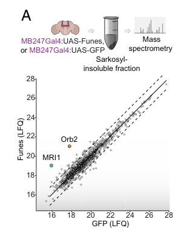

## Question

# Gene Research for Functional Annotation

## ⚠️ CRITICAL: Gene/Protein Identification Context

**BEFORE YOU BEGIN RESEARCH:** You MUST verify you are researching the CORRECT gene/protein. Gene symbols can be ambiguous, especially for less well-characterized genes from non-model organisms.

### Target Gene/Protein Identity (from UniProt):
- **UniProt Accession:** Q9V9X4
- **Protein Description:** RecName: Full=Methylthioribose-1-phosphate isomerase 1 {ECO:0000255|HAMAP-Rule:MF_03119, ECO:0000312|FlyBase:FBgn0039849}; Short=M1Pi {ECO:0000255|HAMAP-Rule:MF_03119}; Short=MTR-1-P isomerase {ECO:0000255|HAMAP-Rule:MF_03119}; EC=5.3.1.23 {ECO:0000255|HAMAP-Rule:MF_03119}; AltName: Full=S-methyl-5-thioribose-1-phosphate isomerase {ECO:0000255|HAMAP-Rule:MF_03119}; AltName: Full=Translation initiation factor eIF-2B subunit alpha/beta/delta-like protein {ECO:0000255|HAMAP-Rule:MF_03119};
- **Gene Information:** Name=Mri1 {ECO:0000312|FlyBase:FBgn0039849}; ORFNames=CG11334 {ECO:0000312|FlyBase:FBgn0039849};
- **Organism (full):** Drosophila melanogaster (Fruit fly).
- **Protein Family:** Belongs to the eIF-2B alpha/beta/delta subunits family.
- **Key Domains:** IF-2B-related. (IPR000649); IF-M1Pi. (IPR005251); IF_2B-like_C. (IPR042529); Initiation_fac_2B_a/b/d. (IPR011559); M1Pi_N. (IPR027363)

### MANDATORY VERIFICATION STEPS:

1. **Check if the gene symbol "Mri1" matches the protein description above**
2. **Verify the organism is correct:** Drosophila melanogaster (Fruit fly).
3. **Check if protein family/domains align with what you find in literature**
4. **If you find literature for a DIFFERENT gene with the same or similar symbol, STOP**

### If Gene Symbol is Ambiguous or You Cannot Find Relevant Literature:

**DO NOT PROCEED WITH RESEARCH ON A DIFFERENT GENE.** Instead:
- State clearly: "The gene symbol 'Mri1' is ambiguous or literature is limited for this specific protein"
- Explain what you found (e.g., "Found extensive literature on a different gene with the same symbol in a different organism")
- Describe the protein based ONLY on the UniProt information provided above
- Suggest that the protein function can be inferred from domain/family information

### Research Target:

Please provide a comprehensive research report on the gene **Mri1** (gene ID: Mri1, UniProt: Q9V9X4) in DROME.

The research report should be a detailed narrative explaining the function, biological processes, and localization of the gene product. Citations should be given for all claims.

You should prioritize authoritative reviews and primary scientific literature when conducting research. You can supplement
this with annotations you find in gene/protein databases, but these can be outdated or inaccurate.

We are specifically interested in the primary function of the gene - for enzymes, what reaction is catalyzed, and what is the substrate specificity? For transporters, what is the substrate? For structural proteins or adapters, what is the broader structural role? For signaling molecules, what is the role in the pathway.

We are interested in where in or outside the cell the gene product carries out its function.

We are also interested in the signaling or biochemical pathways in which the gene functions. We are less interested in broad pleiotropic effects, except where these elucidate the precise role.

Include evidence where possible. We are interested in both experimental evidence as well as inference from structure, evolution, or bioinformatic analysis. Precise studies should be prioritized over high-throughput, where available.

## Output

Question: You are an expert researcher providing comprehensive, well-cited information.

Provide detailed information focusing on:
1. Key concepts and definitions with current understanding
2. Recent developments and latest research (prioritize 2023-2024 sources)
3. Current applications and real-world implementations
4. Expert opinions and analysis from authoritative sources
5. Relevant statistics and data from recent studies

Format as a comprehensive research report with proper citations. Include URLs and publication dates where available.
Always prioritize recent, authoritative sources and provide specific citations for all major claims.

# Gene Research for Functional Annotation

## ⚠️ CRITICAL: Gene/Protein Identification Context

**BEFORE YOU BEGIN RESEARCH:** You MUST verify you are researching the CORRECT gene/protein. Gene symbols can be ambiguous, especially for less well-characterized genes from non-model organisms.

### Target Gene/Protein Identity (from UniProt):
- **UniProt Accession:** Q9V9X4
- **Protein Description:** RecName: Full=Methylthioribose-1-phosphate isomerase 1 {ECO:0000255|HAMAP-Rule:MF_03119, ECO:0000312|FlyBase:FBgn0039849}; Short=M1Pi {ECO:0000255|HAMAP-Rule:MF_03119}; Short=MTR-1-P isomerase {ECO:0000255|HAMAP-Rule:MF_03119}; EC=5.3.1.23 {ECO:0000255|HAMAP-Rule:MF_03119}; AltName: Full=S-methyl-5-thioribose-1-phosphate isomerase {ECO:0000255|HAMAP-Rule:MF_03119}; AltName: Full=Translation initiation factor eIF-2B subunit alpha/beta/delta-like protein {ECO:0000255|HAMAP-Rule:MF_03119};
- **Gene Information:** Name=Mri1 {ECO:0000312|FlyBase:FBgn0039849}; ORFNames=CG11334 {ECO:0000312|FlyBase:FBgn0039849};
- **Organism (full):** Drosophila melanogaster (Fruit fly).
- **Protein Family:** Belongs to the eIF-2B alpha/beta/delta subunits family.
- **Key Domains:** IF-2B-related. (IPR000649); IF-M1Pi. (IPR005251); IF_2B-like_C. (IPR042529); Initiation_fac_2B_a/b/d. (IPR011559); M1Pi_N. (IPR027363)

### MANDATORY VERIFICATION STEPS:

1. **Check if the gene symbol "Mri1" matches the protein description above**
2. **Verify the organism is correct:** Drosophila melanogaster (Fruit fly).
3. **Check if protein family/domains align with what you find in literature**
4. **If you find literature for a DIFFERENT gene with the same or similar symbol, STOP**

### If Gene Symbol is Ambiguous or You Cannot Find Relevant Literature:

**DO NOT PROCEED WITH RESEARCH ON A DIFFERENT GENE.** Instead:
- State clearly: "The gene symbol 'Mri1' is ambiguous or literature is limited for this specific protein"
- Explain what you found (e.g., "Found extensive literature on a different gene with the same symbol in a different organism")
- Describe the protein based ONLY on the UniProt information provided above
- Suggest that the protein function can be inferred from domain/family information

### Research Target:

Please provide a comprehensive research report on the gene **Mri1** (gene ID: Mri1, UniProt: Q9V9X4) in DROME.

The research report should be a detailed narrative explaining the function, biological processes, and localization of the gene product. Citations should be given for all claims.

You should prioritize authoritative reviews and primary scientific literature when conducting research. You can supplement
this with annotations you find in gene/protein databases, but these can be outdated or inaccurate.

We are specifically interested in the primary function of the gene - for enzymes, what reaction is catalyzed, and what is the substrate specificity? For transporters, what is the substrate? For structural proteins or adapters, what is the broader structural role? For signaling molecules, what is the role in the pathway.

We are interested in where in or outside the cell the gene product carries out its function.

We are also interested in the signaling or biochemical pathways in which the gene functions. We are less interested in broad pleiotropic effects, except where these elucidate the precise role.

Include evidence where possible. We are interested in both experimental evidence as well as inference from structure, evolution, or bioinformatic analysis. Precise studies should be prioritized over high-throughput, where available.

# Functional annotation report: *Drosophila melanogaster* Mri1

**Identity and scope.** The target specified in the supplied UniProt record is **Mri1/CG11334** (FlyBase **FBgn0039849**; UniProt **[Q9V9X4](https://www.uniprot.org/uniprotkb/Q9V9X4/entry)**) in *D. melanogaster*, annotated as methylthioribose-1-phosphate isomerase 1. A fly study independently uses the name Mri1 for methylthioribose-1-phosphate isomerase 1. The gene symbol is nevertheless shared with characterized proteins in yeast and humans: experiments on those proteins are **ortholog evidence, not direct validation of Q9V9X4**. The literature specific to the fly enzyme is limited. (patton2026ajdomainprotein pages 4-5, pirkov2008acompleteinventory pages 1-2)

## Proposed molecular function and substrate

**The best-supported functional annotation is an isomerase in methionine salvage, but its catalytic activity has not been demonstrated directly for fly Mri1.** The supplied UniProt annotation assigns EC **5.3.1.23** and predicts the interconversion of **5-methylthioribose 1-phosphate (MTR-1-P) ⇌ 5-methylthioribulose 1-phosphate (MTRu-1-P)**. This changes the sugar-phosphate from an aldose to a ketose; it is not a translation-initiation reaction. Bacterial MtnA pathway analyses establish the corresponding substrate-to-product step, while yeast studies identify Mri1p as the eukaryotic isomerase and link its gene to MTA-dependent methionine salvage. These results support the fly assignment by conservation, without supplying a measured rate, affinity, substrate panel, or catalytic mechanism for Q9V9X4. (sekowska2004bacterialvariationson pages 5-9, pirkov2008acompleteinventory pages 1-2, sekowska2004bacterialvariationson pages 1-2)

The **IF-2B-related and IF-M1Pi domains** listed in the supplied UniProt record fit this interpretation. Methylthioribose-phosphate isomerases belong to a family related to eIF2B regulatory subunits; comparative authors caution that resemblance to eIF2Bα has sometimes been overemphasized in annotations. Consequently, the alternative description “eIF-2B subunit alpha/beta/delta-like” describes **family similarity**, not evidence that fly Mri1 is an eIF2B complex subunit, a guanine-nucleotide exchange factor, or a demonstrated regulator of translation initiation. Its substrate specificity beyond the predicted MTR-1-P reaction remains undetermined in flies. (sekowska2004bacterialvariationson pages 5-9, sekowska2004bacterialvariationson pages 1-2)

## Pathway and cellular site

The proposed pathway position is **5-methylthioadenosine (MTA) → MTR-1-P → MTRu-1-P → downstream intermediates → methionine**. MTA arises, among other sources, during polyamine synthesis from S-adenosylmethionine. In the canonical eukaryotic route, MTA phosphorylase supplies MTR-1-P; the MRI1/MtnA-type isomerase makes MTRu-1-P; and an MTRu-1-P dehydratase consumes that product. Later reactions yield 4-methylthio-2-oxobutyrate, which is transaminated to methionine. Thus Mri1 is predicted to participate in **sulfur and methionine recycling**, rather than to act as a signaling receptor or transporter. This sequence is established for studied pathways, **not mapped experimentally end-to-end in flies**. (camille2012functionalidentificationof pages 1-3, pirkov2008acompleteinventory pages 1-2, sekowska2004bacterialvariationson pages 1-2)

**Cytosol is the plausible working compartment, not a verified localization for fly Mri1.** A study of the human pathway describes eukaryotic methionine salvage as cytosolic. Neither that observation nor the protein-family annotation establishes where Q9V9X4 resides in fly cells; the retrieved evidence included no Mri1-specific fly imaging or compartment-resolved localization experiment. Sarkosyl solubility in fly-head extracts, described below, is a biochemical fractionation result—not a subcellular-localization measurement. (camille2012functionalidentificationof pages 1-3, patton2026ajdomainprotein pages 4-5)

## Strength and limits of experimental evidence

In *Saccharomyces cerevisiae*, Pirkov and colleagues identified **MRI1/YPR118W** as the isomerase gene. A yeast *mri1Δ* mutant grew significantly less well when MTA was used to satisfy a methionine requirement; the reported comparison was **P < 0.001**. The result supports physiological pathway participation **in yeast** and is more informative for function than sequence resemblance alone, but cannot establish the same phenotype in *Drosophila*. (pirkov2008acompleteinventory pages 1-2)

The clearest retrieved **fly-specific observation** is from Patton and colleagues’ **2026** study of the J-domain protein Funes. In extracts of **3–7-day-old fly heads**, mass spectrometry found Mri1 among the proteins most increased in the **sarkosyl-insoluble fraction** following Funes overexpression. Across proteins passing the study’s **greater-than-twofold** solubility-change criterion, **36 increased and 20 decreased** in that fraction; Figure 3A identifies Mri1 and Orb2 among the increases. Those counts describe the proteomic screen, **not an Mri1-specific fold change or enzyme-activity measurement**. The authors could not validate proposed pairwise Funes–client interactions in their cell-based assay; moreover, Funes did **not** change recombinant Mri1 aggregation under the tested conditions by thioflavin-T binding or electron microscopy. These findings establish altered Mri1 partitioning in one experimental setting, not that Mri1 catalyzes methionine salvage, forms an amyloid in vivo, or mediates memory. (patton2026ajdomainprotein pages 4-5, patton2026ajdomainprotein pages 6-7, patton2026ajdomainprotein media 0daea3ca)

The evidence levels are summarized below; in particular, ortholog results should not be read as fly-specific biochemical measurements.

| Claim | Actual evidence | Certainty for *D. melanogaster* Q9V9X4 |
|---|---|---|
| Mri1 catalyzes MTR-1-P ⇌ MTRu-1-P (EC 5.3.1.23) | UniProt assigns this activity computationally from HAMAP/family information. The corresponding reaction is supported experimentally or genetically for bacterial MtnA and yeast Mri1p, but no purified-fly-enzyme assay was found (sekowska2004bacterialvariationson pages 5-9, pirkov2008acompleteinventory pages 1-2) | **Moderate; homology-based prediction** |
| Mri1 participates in methionine salvage | Yeast *mri1Δ* significantly impaired MTA-supported growth (*P* < 0.001), placing Mri1p after MTA phosphorylase and before MTRu-1-P dehydratase. This supports the conserved pathway assignment but is not fly-specific evidence (pirkov2008acompleteinventory pages 1-2) | **Moderate; inferred orthology** |
| The eIF2B-related fold indicates translation-initiation activity | MTR-1-P isomerases are evolutionarily related to eIF2B α/β/δ proteins, and resemblance to eIF2Bα may be overemphasized in annotations. Fold similarity alone does **not** establish that fly Mri1 is an eIF2B subunit or translation factor (sekowska2004bacterialvariationson pages 5-9, sekowska2004bacterialvariationson pages 1-2) | **Unsupported as a functional claim** |
| Mri1 acts in the cytosol | The mammalian/eukaryotic methionine-salvage pathway is described as cytosolic, making cytosolic localization plausible. No fly-specific imaging, fractionation, or compartment-targeting study was found (camille2012functionalidentificationof pages 1-3) | **Low to moderate; inferred, not demonstrated** |
| Fly Mri1 changes solubility after Funes overexpression | In 3–7-day-old fly heads, Mri1 was among the proteins most increased in the sarkosyl-insoluble fraction after Funes overexpression; the >2-fold screen found 36 increased and 20 decreased proteins. This establishes proteomic detection and altered partitioning—not catalytic function or direct interaction (patton2026ajdomainprotein pages 4-5, patton2026ajdomainprotein media 0daea3ca) | **High for the experimental condition; mechanistic meaning uncertain** |
| Funes directly promotes Mri1 aggregation | Under the recombinant assay conditions, Funes did not alter Mri1 aggregation by Thioflavin-T binding or electron microscopy (patton2026ajdomainprotein pages 6-7) | **Evidence against this specific effect under tested conditions** |
| Fly substrate kinetics, specificity, and physiological requirement are known | No fly-specific purified-enzyme kinetics, substrate panel, catalytic-mutant rescue, targeted metabolomics, or *Mri1* knockout phenotype establishing methionine-salvage activity was found. Existing functional support comes primarily from orthologs (pirkov2008acompleteinventory pages 1-2) | **Unknown / major evidence gap** |

*Table: Evidence supporting functional annotation of Drosophila CG11334/Mri1, clearly separating fly observations from orthology-based inference. No fly catalytic measurements or pathway-defining knockout evidence are represented as established facts.*

## Recent research, use, and outstanding questions

Targeted searches did **not identify a 2023–2024 primary study directly measuring the catalytic activity, physiological substrate specificity, or cellular location of fly Q9V9X4**. The later 2026 fly proteomics experiment is a research use of Mri1 as a measured protein, rather than a validated application of its enzymatic activity. Likewise, no fly-specific therapeutic or industrial application is established by the retrieved evidence. The most decisive tests for this annotation would be purified-Q9V9X4 conversion of MTR-1-P to MTRu-1-P with alternative-substrate controls; a fly *Mri1* loss-of-function and catalytic-rescue experiment measuring MTA-derived metabolite flux; and direct localization in defined tissues. These are **proposed validation experiments, not reported results**. (pirkov2008acompleteinventory pages 1-2, patton2026ajdomainprotein pages 4-5, patton2026ajdomainprotein pages 6-7, camille2012functionalidentificationof pages 1-3)

### Principal sources

- Sekowska A *et al.* **March 2004**. “Bacterial variations on the methionine salvage pathway.” *BMC Microbiology*. [https://doi.org/10.1186/1471-2180-4-9](https://doi.org/10.1186/1471-2180-4-9). Comparative MtnA reaction and eIF2B-family context. (sekowska2004bacterialvariationson pages 5-9)
- Pirkov I *et al.* **August 2008**. “A complete inventory of all enzymes in the eukaryotic methionine salvage pathway.” *FEBS Journal*. [https://doi.org/10.1111/j.1742-4658.2008.06552.x](https://doi.org/10.1111/j.1742-4658.2008.06552.x). Experimental pathway evidence for **yeast**, not fly, MRI1. (pirkov2008acompleteinventory pages 1-2)
- Mary C *et al.* **December 2012**. “Functional identification of APIP as human mtnB, a key enzyme in the methionine salvage pathway.” *PLOS ONE*. [https://doi.org/10.1371/journal.pone.0052877](https://doi.org/10.1371/journal.pone.0052877). Human/eukaryotic pathway ordering and cytosolic context; APIP is the **downstream dehydratase**, not Mri1. (camille2012functionalidentificationof pages 1-3)
- Patton K *et al.* **January 2026**. “A J-domain protein enhances memory by promoting physiological amyloid formation in *Drosophila*.” *PNAS*. [https://doi.org/10.1073/pnas.2516310123](https://doi.org/10.1073/pnas.2516310123). Fly Mri1 proteomic observation and negative recombinant aggregation test. (patton2026ajdomainprotein pages 4-5, patton2026ajdomainprotein pages 6-7, patton2026ajdomainprotein media 0daea3ca)

References

1. (patton2026ajdomainprotein pages 4-5): Kyle Patton, Yangyang Yi, Raj Burt, Kevin Kan-Shing Ng, Mayur Mukhi, Peerzada Shariq Shaheen Khaki, Ruben Hervas, and Kausik Si. A j-domain protein enhances memory by promoting physiological amyloid formation in <i>drosophila</i>. Proceedings of the National Academy of Sciences, Jan 2026. URL: https://doi.org/10.1073/pnas.2516310123, doi:10.1073/pnas.2516310123. This article has 2 citations and is from a highest quality peer-reviewed journal.

2. (pirkov2008acompleteinventory pages 1-2): Ivan Pirkov, Joakim Norbeck, Lena Gustafsson, and Eva Albers. A complete inventory of all enzymes in the eukaryotic methionine salvage pathway. The FEBS Journal, 275:4111-4120, Aug 2008. URL: https://doi.org/10.1111/j.1742-4658.2008.06552.x, doi:10.1111/j.1742-4658.2008.06552.x. This article has 121 citations.

3. (sekowska2004bacterialvariationson pages 5-9): Agnieszka Sekowska, Valérie Dénervaud, Hiroki Ashida, Karine Michoud, Dieter Haas, Akiho Yokota, and Antoine Danchin. Bacterial variations on the methionine salvage pathway. BMC Microbiology, Mar 2004. URL: https://doi.org/10.1186/1471-2180-4-9, doi:10.1186/1471-2180-4-9. This article has 204 citations and is from a peer-reviewed journal.

4. (sekowska2004bacterialvariationson pages 1-2): Agnieszka Sekowska, Valérie Dénervaud, Hiroki Ashida, Karine Michoud, Dieter Haas, Akiho Yokota, and Antoine Danchin. Bacterial variations on the methionine salvage pathway. BMC Microbiology, Mar 2004. URL: https://doi.org/10.1186/1471-2180-4-9, doi:10.1186/1471-2180-4-9. This article has 204 citations and is from a peer-reviewed journal.

5. (camille2012functionalidentificationof pages 1-3): Camille Mary, Paula Duek, Lisa Salleron, Petra Tienz, Dirk Bumann, Amos Bairoch, and Lydie Lane. Functional identification of apip as human mtnb, a key enzyme in the methionine salvage pathway. PLoS ONE, Dec 2012. URL: https://doi.org/10.1371/journal.pone.0052877, doi:10.1371/journal.pone.0052877. This article has 37 citations and is from a peer-reviewed journal.

6. (patton2026ajdomainprotein pages 6-7): Kyle Patton, Yangyang Yi, Raj Burt, Kevin Kan-Shing Ng, Mayur Mukhi, Peerzada Shariq Shaheen Khaki, Ruben Hervas, and Kausik Si. A j-domain protein enhances memory by promoting physiological amyloid formation in <i>drosophila</i>. Proceedings of the National Academy of Sciences, Jan 2026. URL: https://doi.org/10.1073/pnas.2516310123, doi:10.1073/pnas.2516310123. This article has 2 citations and is from a highest quality peer-reviewed journal.

7. (patton2026ajdomainprotein media 0daea3ca): Kyle Patton, Yangyang Yi, Raj Burt, Kevin Kan-Shing Ng, Mayur Mukhi, Peerzada Shariq Shaheen Khaki, Ruben Hervas, and Kausik Si. A j-domain protein enhances memory by promoting physiological amyloid formation in <i>drosophila</i>. Proceedings of the National Academy of Sciences, Jan 2026. URL: https://doi.org/10.1073/pnas.2516310123, doi:10.1073/pnas.2516310123. This article has 2 citations and is from a highest quality peer-reviewed journal.

## Artifacts

- [Edison artifact artifact-00](Mri1-deep-research-falcon_artifacts/artifact-00.md)

## Citations

1. pirkov2008acompleteinventory pages 1-2
2. camille2012functionalidentificationof pages 1-3
3. patton2026ajdomainprotein pages 6-7
4. sekowska2004bacterialvariationson pages 5-9
5. patton2026ajdomainprotein pages 4-5
6. sekowska2004bacterialvariationson pages 1-2
7. Q9V9X4
8. https://doi.org/10.1186/1471-2180-4-9
9. https://doi.org/10.1111/j.1742-4658.2008.06552.x
10. https://doi.org/10.1371/journal.pone.0052877
11. https://doi.org/10.1073/pnas.2516310123
12. https://www.uniprot.org/uniprotkb/Q9V9X4/entry
13. https://doi.org/10.1186/1471-2180-4-9](https://doi.org/10.1186/1471-2180-4-9
14. https://doi.org/10.1111/j.1742-4658.2008.06552.x](https://doi.org/10.1111/j.1742-4658.2008.06552.x
15. https://doi.org/10.1371/journal.pone.0052877](https://doi.org/10.1371/journal.pone.0052877
16. https://doi.org/10.1073/pnas.2516310123](https://doi.org/10.1073/pnas.2516310123
17. https://doi.org/10.1073/pnas.2516310123,
18. https://doi.org/10.1111/j.1742-4658.2008.06552.x,
19. https://doi.org/10.1186/1471-2180-4-9,
20. https://doi.org/10.1371/journal.pone.0052877,