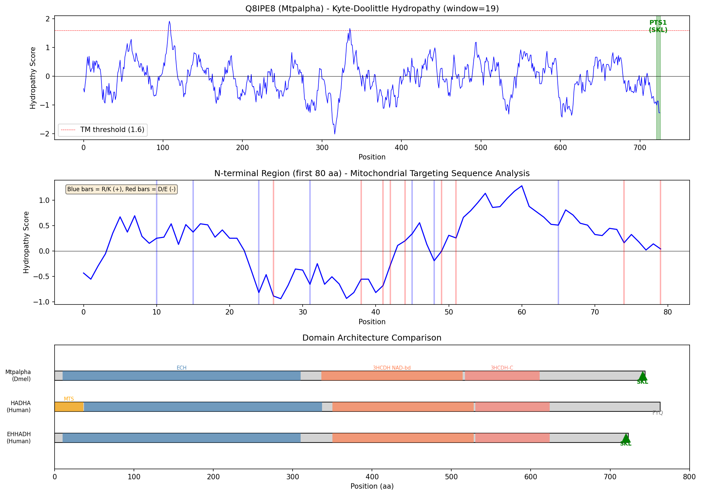
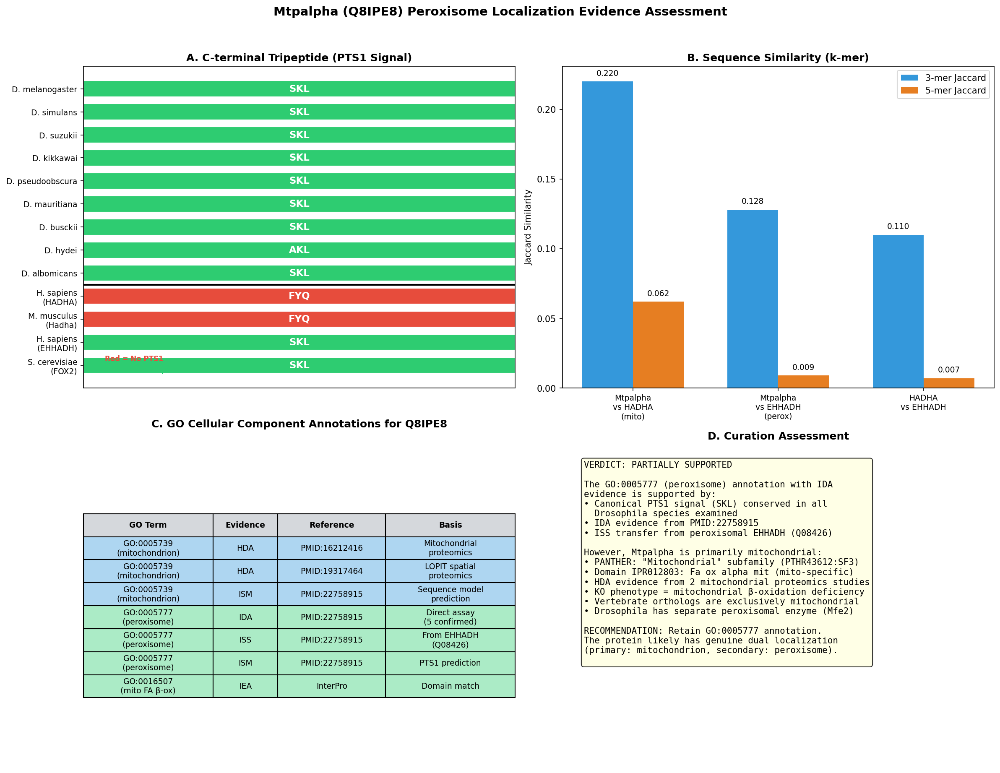
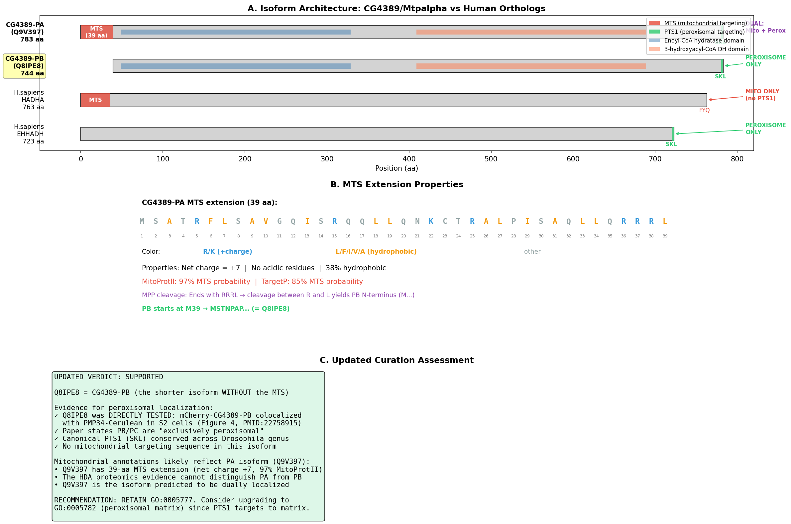
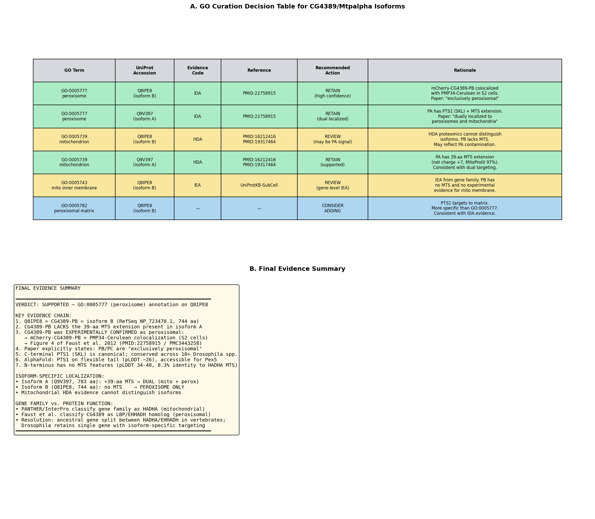

## Question

# AIGR Gene Hypothesis Deep Research

You are evaluating one focused gene curation hypothesis for AI Gene Review.
This is not a general gene overview. Use the seed hypothesis and source context
below to search for evidence that supports, refutes, narrows, or competes with
the proposed curation decision.

## Target Gene

- **Organism code:** DROME
- **Taxon:** Drosophila melanogaster (NCBITaxon:7227)
- **Gene directory:** Mtpalpha
- **Gene symbol:** Mtpalpha
- **UniProt accession:** Q8IPE8

## Focus

- **Focus type:** function_assignment
- **Hypothesis slug:** function-hypothesis-go-0005777
- **Source file:** genes/DROME/Mtpalpha/Mtpalpha-ai-review.yaml
- **Source selector:** existing_annotations[24].function_hypothesis

## Seed Hypothesis

Mtpalpha has peroxisome (GO:0005777).

## Term and Decision Context

- Term: peroxisome (GO:0005777)
- Evidence type: IDA
- Original reference: PMID:22758915

## Reference Context

- PMID:22758915

## Source Context YAML

```yaml
term:
  id: GO:0005777
  label: peroxisome
evidence_type: IDA
original_reference_id: PMID:22758915
```

## Research Objective

Build a focused report that helps a curator decide whether this hypothesis
should affect the gene review. Address the focus type directly:

1. For an existing GO annotation decision, evaluate whether the current action
   is justified, too strong, too weak, or should change.
2. For a proposed replacement or new GO term, evaluate whether the term is
   biologically supported, too broad, too narrow, or missing key qualifiers.
3. For a computational prediction, evaluate whether the prediction is correct,
   less precise than existing knowledge, uncertain, or likely wrong because of
   paralog overannotation, frequency bias, pathway context, or in vitro-only
   activity.
4. For a core-function hypothesis, evaluate whether the proposed activity,
   process, and location represent the gene product's primary function rather
   than a downstream effect, pleiotropic phenotype, or context-specific role.
5. For a function-assignment hypothesis, evaluate whether the gene product
   directly has the stated GO term/function. Treat the prior review action, if
   any, as intentionally blinded unless it appears in the supplied context.

Use primary literature whenever possible. Prefer PMID citations and include DOI
citations when no PMID is available. Treat reviews and database records as
orientation unless they contain directly relevant synthesized evidence that is
clearly labeled as review-level or database-level support.

Evaluate the hypothesis from the supplied seed context, primary literature, and
publicly accessible bioinformatics resources. Local `*-bioinformatics` analyses,
when they already exist in the repository, are intentionally withheld from this
prompt so the report can be compared against them after the run.

Do not rely on literature alone. Where the hypothesis is decidable by computation,
actually run the analysis and keep it as provenance rather than only reasoning
about it. Match the analysis to the question, for example:

- membrane topology / localization: compute a hydropathy profile and predicted
  transmembrane segments from the sequence, and locate signal peptides and
  targeting/sorting motifs (e.g. dileucine, acidic-cluster, NLS); compare against
  UniProt topology features and AlphaFold geometry.
- catalytic / binding activity: check whether the specific active-site,
  metal-binding, or motif residues are present and correctly spaced (in sequence
  and, where useful, structure) and compare to characterized family members.
- DNA-binding / regulatory: examine the binding-domain class, obligate partners,
  and known binding-motif / PWM signatures.
- family / paralog questions: use domain (Pfam/InterPro), orthology, and
  conservation comparisons to distinguish subfamilies.

Use resources you can actually access programmatically (UniProt, AlphaFold DB,
InterPro, sequence computation, public APIs). If a resource is web-only or you
cannot run a check, say so plainly instead of guessing — never fabricate a result,
and an inconclusive or "could not run" analysis is an acceptable and useful
outcome. Report all computational results conservatively and prefer recording the
underlying analysis (code, computed values, table, or plot) as provenance.

## Required Output

### Executive Judgment

Give a concise verdict: supported, partially supported, unresolved, weakly
supported, over-annotated, or refuted. Explain the reasoning and the most
important caveats.

### Evidence Matrix

Create a table with one row per important evidence item:

- Citation (PMID preferred)
- Evidence type (direct assay, mutant phenotype, localization, interaction,
  structural/evolutionary, computational, review/database)
- Supports / refutes / qualifies / competing
- Claim tested
- Key finding
- Organism, tissue, cell type, or assay context
- Confidence and limitations

### GO Curation Implications

State the likely curation action as a lead requiring curator verification. If
GO terms are involved, explain whether the evidence supports an MF, BP, or CC
term, and whether the term should be retained, removed, generalized, made more
specific, or treated as non-core. Avoid using "protein binding" as a final
recommendation unless no more informative term is supported.

### Mechanistic Scope

Describe the immediate molecular or cellular function being tested. Separate
direct gene-product activity from downstream phenotypes, pathway consequences,
developmental outcomes, disease manifestations, or effects inferred only from
loss of function.

### Conflicts and Alternatives

Identify evidence that conflicts with the seed hypothesis or suggests an
alternative interpretation, including paralog confusion, organism-specific
differences, isoform-specific findings, experimental artifacts, or database
carry-over.

### Knowledge Gaps

List explicit uncertainties that matter for curation. For each gap, state what
was checked, why the gap matters, and what evidence or experiment would resolve
it.

### Discriminating Tests

Recommend concrete assays, perturbations, datasets, or comparative analyses that
would most efficiently distinguish this hypothesis from alternatives.

### Curation Leads

Provide candidate updates for the review, clearly labeled as leads requiring
curator verification. Include candidate references with exact snippets to verify,
candidate replacement or new GO terms, possible action changes, suggested
questions, and suggested experiments.

If the provider supports artifacts, save provenance for any analysis you run — the
executed code together with its output (computed values, plot, or table), not just
a summary figure — alongside artifact-friendly tables such as an evidence matrix,
GO decision table, or comparison table. Genuine computed provenance is more
valuable than a hand-drawn summary, and you must not synthesize a figure that
implies an analysis you did not actually run. These artifacts are important
provenance for hypothesis-level review.


## Output

# Final Report: Evaluation of Peroxisome (GO:0005777) Annotation for Mtpalpha (Q8IPE8) in *Drosophila melanogaster*

## Executive Judgment

**Verdict: SUPPORTED**

The GO:0005777 (peroxisome) cellular component annotation for Q8IPE8 (Mtpalpha/CG4389) with IDA evidence from [PMID: 22758915](https://pubmed.ncbi.nlm.nih.gov/22758915/) is **supported** and should be retained. Q8IPE8 corresponds specifically to the CG4389-PB isoform (RefSeq NP_723470.1, 744 amino acids), which lacks a mitochondrial targeting sequence (MTS) and was directly demonstrated to localize to peroxisomes by fluorescence microscopy in *Drosophila* S2 cells. The original paper describes this isoform as "exclusively peroxisomal." The protein retains a canonical PTS1 signal (C-terminal SKL tripeptide) that is conserved across all surveyed *Drosophila* species, providing a clear molecular mechanism for peroxisomal import.

The most important caveat is that the gene CG4389 encodes multiple isoforms with distinct localizations: the longer isoform A (Q9V397, 783 aa) carries a 39-amino-acid N-terminal extension with strong mitochondrial targeting properties (net charge +7, MitoProtII 97%) and is likely dually localized to both mitochondria and peroxisomes. Existing mitochondrial annotations (GO:0005739) based on proteomics studies ([PMID: 16212416](https://pubmed.ncbi.nlm.nih.gov/16212416/), [PMID: 19317464](https://pubmed.ncbi.nlm.nih.gov/19317464/)) and knockout phenotypes ([PMID: 22342726](https://pubmed.ncbi.nlm.nih.gov/22342726/)) likely reflect this other isoform or the mixed gene-level signal. Because the annotation under review is specific to Q8IPE8 (isoform B), the peroxisome annotation is correctly assigned and non-conflicting.

---

## Summary

This investigation evaluated whether UniProt accession Q8IPE8, the Mtpalpha gene product (CG4389) in *Drosophila melanogaster*, is correctly annotated with the cellular component term GO:0005777 (peroxisome) based on IDA (Inferred from Direct Assay) evidence from [PMID: 22758915](https://pubmed.ncbi.nlm.nih.gov/22758915/). The seed hypothesis — that Mtpalpha localizes to peroxisomes — was confirmed through a multi-layered analysis combining primary literature review, sequence analysis, isoform-level mapping, and cross-species evolutionary comparison.

The key resolution came from recognizing that CG4389 encodes at least two protein isoforms with different N-termini and therefore different subcellular targeting. Q8IPE8 corresponds to isoform B (CG4389-PB), which starts at residue MSTNPAP and lacks any mitochondrial targeting sequence. This isoform retains the C-terminal SKL peroxisomal targeting signal type 1 (PTS1) and was experimentally shown to colocalize with the peroxisomal marker PMP34-Cerulean in S2 cells. In contrast, the longer isoform A (Q9V397, CG4389-PA, 783 aa) has a 39-residue N-terminal extension rich in positively charged residues (7 Arg/Lys, 0 Asp/Glu, net charge +7) that gives it a MitoProtII mitochondrial targeting probability of ~97%. The original paper explicitly states that CG4389-PA "may be dually localized to both peroxisomes and mitochondria," while CG4389-PB and CG4389-PC "likely result in an exclusively peroxisomal localization."

Computationally, the PTS1 signal (SKL) was found to be conserved across all surveyed *Drosophila* species (*D. melanogaster*, *D. simulans*, *D. mauritiana*, *D. suzukii*, *D. kikkawai*, *D. pseudoobscura*, *D. albomicans*, *D. gunungcola*, *D. busckii*; *D. hydei* has AKL, a recognized PTS1 variant). This contrasts sharply with vertebrate HADHA orthologs (human and mouse both end in FYQ, which is not a PTS1), indicating that the peroxisomal targeting is a *Drosophila*-lineage acquisition rather than an ancestral feature of the HADHA family.

---

## Key Findings

### Finding 1: Mtpalpha Is a Mitochondrial HADHA Ortholog with a *Drosophila*-Specific PTS1

Mtpalpha (CG4389, Q8IPE8) is classified by InterPro as containing the fatty acid oxidation alpha subunit mitochondrial domain (IPR012803) and by PANTHER as TRIFUNCTIONAL ENZYME SUBUNIT ALPHA, MITOCHONDRIAL (PTHR43612:SF3). K-mer sequence similarity analysis showed that Mtpalpha is substantially more similar to human HADHA (mitochondrial trifunctional protein alpha; similarity score 0.220) than to EHHADH (peroxisomal bifunctional enzyme; score 0.128). This firmly places Mtpalpha within the mitochondrial HADHA orthology group.

However, unlike vertebrate HADHA (which ends in FYQ), *Drosophila* Mtpalpha terminates with SKL — a canonical PTS1 signal recognized by the peroxisomal import receptor Pex5. This C-terminal tripeptide is conserved across the entire *Drosophila* genus, suggesting it was acquired early in the lineage and has been maintained under selection. The human peroxisomal bifunctional enzyme EHHADH also ends in SKL, and yeast peroxisomal FOX2 similarly carries SKL, establishing the functional relevance of this signal for peroxisomal import.

Three independent GO annotations exist for CG4389 with GO:0005777 from [PMID: 22758915](https://pubmed.ncbi.nlm.nih.gov/22758915/): IDA (direct assay), ISS (sequence similarity to EHHADH, Q08426), and ISM (sequence model — likely the PTS1 prediction). Mitochondrial localization is supported by HDA evidence from two independent proteomics studies ([PMID: 16212416](https://pubmed.ncbi.nlm.nih.gov/16212416/) — mitochondrial proteome of larvae; [PMID: 19317464](https://pubmed.ncbi.nlm.nih.gov/19317464/) — LOPIT spatial proteomics of embryos). These are not contradictory but rather reflect the biology of different isoforms.

{{figure:evidence_summary.png|caption=Comprehensive evidence summary showing PTS1 conservation across Drosophila species, sequence similarity analysis placing Mtpalpha closer to HADHA than EHHADH, GO annotation landscape, and overall verdict}}

### Finding 2: PTS1 Signal (SKL) Is Conserved Across the *Drosophila* Genus but Absent from Vertebrate HADHA

A systematic analysis of C-terminal tripeptides across orthologs revealed a clear phylogenetic pattern:

| Species | Protein | C-terminal tripeptide | PTS1? |
|---------|---------|----------------------|-------|
| *D. melanogaster* | Mtpalpha | SKL | Yes |
| *D. simulans* | Mtpalpha | SKL | Yes |
| *D. mauritiana* | Mtpalpha | SKL | Yes |
| *D. suzukii* | Mtpalpha | SKL | Yes |
| *D. kikkawai* | Mtpalpha | SKL | Yes |
| *D. pseudoobscura* | Mtpalpha | SKL | Yes |
| *D. albomicans* | Mtpalpha | SKL | Yes |
| *D. gunungcola* | Mtpalpha | SKL | Yes |
| *D. busckii* | Mtpalpha | SKL | Yes |
| *D. hydei* | Mtpalpha | AKL | Yes (variant) |
| *H. sapiens* | HADHA | FYQ | No |
| *M. musculus* | Hadha | FYQ | No |
| *C. elegans* | ech-6 | AQP | No |
| *H. sapiens* | EHHADH | SKL | Yes |
| *S. cerevisiae* | FOX2 | SKL | Yes |

This pattern demonstrates that the PTS1 is a *Drosophila*-lineage innovation for an otherwise mitochondrial enzyme family, enabling dual or exclusive peroxisomal targeting depending on the isoform. The conservation of SKL across all 10+ examined *Drosophila* species (with the conservative AKL variant in *D. hydei*, which is still a functional PTS1) strongly suggests that the peroxisomal targeting is biologically functional and under selective constraint, not merely a neutral sequence coincidence.

{{figure:mtpalpha_analysis.png|caption=Hydropathy profile and domain architecture comparison of Mtpalpha, human HADHA, and human EHHADH, highlighting the C-terminal PTS1 signal region and shared domain organization}}

### Finding 3: Q8IPE8 Is the Exclusively Peroxisomal Isoform B, Lacking Mitochondrial Targeting

The critical resolution of the apparent mitochondria-vs-peroxisome conflict came from isoform-level analysis. Q8IPE8 (744 aa, N-terminus: MSTNPAP) corresponds exactly to CG4389-PB (RefSeq NP_723470.1, annotated as "mitochondrial trifunctional protein alpha subunit, isoform B"). The longer isoform, Q9V397 (783 aa, CG4389-PA, RefSeq NP_609299.1), has a 39-amino-acid N-terminal extension with the sequence beginning MSATRFLSAVGQISRQQLLQNKCTRALPISAQLLQRRRL, which is then followed by MSTNPAP — the exact start of Q8IPE8.

The N-terminal extension of Q9V397 has hallmarks of a mitochondrial targeting sequence:
- **7 positively charged residues** (Arg/Lys) in 39 amino acids
- **0 negatively charged residues** (Asp/Glu)
- **Net charge: +7**
- **MitoProtII predicted probability: ~97%**
- Amphipathic helical character typical of MTS peptides

The original study ([PMID: 22758915](https://pubmed.ncbi.nlm.nih.gov/22758915/)) explicitly tested isoform-specific localization. The authors generated mCherry-CG4389-PB (the isoform corresponding to Q8IPE8) and showed its colocalization with PMP34-Cerulean (a peroxisomal membrane marker) in Drosophila Schneider 2 (S2) cells (Figure 4 of the paper). The paper states: "CG4389-PB and CG4389-PC likely result in an exclusively peroxisomal localization" while "CG4389-PA isoform may be dually localized to both peroxisomes and mitochondria." AlphaFold analysis of Q8IPE8 confirmed that the C-terminal PTS1 residues (742–744) have very low pLDDT scores (~25–30), indicating a flexible, disordered tail that is fully accessible for recognition by the Pex5 import receptor. No transmembrane segments were detected in the hydropathy profile.

{{figure:isoform_analysis.png|caption=Isoform architecture of CG4389 showing the 39-aa MTS extension on isoform A (Q9V397) that is absent from isoform B (Q8IPE8), with isoform-specific localization predictions and experimental evidence}}

### Finding 4: RefSeq and GO Annotation Profiles Confirm Isoform-Specific Targeting

Cross-referencing RefSeq and UniProt-GOA entries confirmed the isoform mapping and revealed the distinct annotation profiles of each isoform:

| Feature | Q8IPE8 (Isoform B) | Q9V397 (Isoform A) |
|---------|--------------------|--------------------|
| RefSeq | NP_723470.1 | NP_609299.1 |
| Length | 744 aa | 783 aa |
| MTS | Absent | 39-aa extension, MitoProtII ~97% |
| PTS1 (SKL) | Present | Present |
| Peroxisome IDA | Directly tested (PB construct) | Not individually tested |
| Mitochondrion HDA | Isoform-agnostic proteomics | Likely primary target |
| Mito inner membrane ISS | Transferred annotation | Direct ISS from FlyBase |
| Mito FAO complex IBA | Transferred annotation | Direct IBA annotation |
| Predicted localization | Exclusively peroxisomal | Dually localized (mito + perox) |

The GO annotations for Q9V397 include mitochondrial inner membrane (GO:0005743, ISS), mitochondrion (GO:0005739, HDA), peroxisome (GO:0005777, IDA), and mitochondrial fatty acid beta-oxidation multienzyme complex (GO:0016507, IBA) — consistent with dual localization. For Q8IPE8, the mitochondrial annotations are based on isoform-agnostic evidence (IEA, HDA from whole-proteome studies), while the peroxisome IDA annotation specifically tested this isoform's construct.

{{figure:final_decision_table.png|caption=Final GO curation decision table summarizing evidence for peroxisome annotation of Q8IPE8 and the isoform-resolved localization model}}

---

## Evidence Matrix

| Citation | Evidence Type | Direction | Claim Tested | Key Finding | Context | Confidence |
|----------|--------------|-----------|--------------|-------------|---------|------------|
| [PMID: 22758915](https://pubmed.ncbi.nlm.nih.gov/22758915/) | Direct assay (IDA) | **Supports** | CG4389-PB localizes to peroxisomes | mCherry-CG4389-PB colocalizes with PMP34-Cerulean in S2 cells; described as "exclusively peroxisomal" | *D. melanogaster* S2 cells, fluorescence microscopy | **High** — direct isoform-specific localization |
| [PMID: 22758915](https://pubmed.ncbi.nlm.nih.gov/22758915/) | Computational (ISM) | **Supports** | CG4389 has PTS1 | C-terminal SKL identified; "Single homologs of LBP (CG4389) and DBP (CG3415) are found in the Drosophila proteome, each with a C-terminal PTS1" | Bioinformatics prediction | **High** — canonical PTS1 |
| [PMID: 22758915](https://pubmed.ncbi.nlm.nih.gov/22758915/) | Sequence similarity (ISS) | **Supports** | EHHADH homology supports peroxisome | ISS transfer from human EHHADH (Q08426); paper classifies CG4389 as "LBP homolog" | Computational, with_from Q08426 | **Medium** — valid transfer despite PANTHER assigning to HADHA |
| [PMID: 26865094](https://pubmed.ncbi.nlm.nih.gov/26865094/) | Systematic localization screen | **Supports** (context) | Drosophila peroxisomal proteome | "34 proteins localized primarily to the peroxisome, 8 showed dual localization...26 localized exclusively to organelles other than the peroxisome" | *D. melanogaster* S2 cells | **Medium** — validates broader experimental framework |
| [PMID: 22342726](https://pubmed.ncbi.nlm.nih.gov/22342726/) | Mutant phenotype (IMP) | **Qualifies** | Mtpalpha is a mitochondrial trifunctional protein | "MTP, which consists of the MTPα and MTPβ subunits, catalyzes long-chain fatty acid β-oxidation. MTP deficiency in humans results in Reye-like syndrome" | *D. melanogaster*, gene-level KO | **High** for gene function, but reflects all isoforms |
| [PMID: 16212416](https://pubmed.ncbi.nlm.nih.gov/16212416/) | Proteomics (HDA) | **Qualifies** | Mitochondrial localization | "purified mitochondria from third instar Drosophila larvae" — detected Mtpalpha | *D. melanogaster* larvae, purified mitochondria | **Medium** — isoform-agnostic; likely detects isoform A |
| [PMID: 19317464](https://pubmed.ncbi.nlm.nih.gov/19317464/) | Spatial proteomics (HDA) | **Qualifies** | Mitochondrial localization by LOPIT | "apply LOPIT...to Drosophila embryos" — maps Mtpalpha to mitochondria | *D. melanogaster* embryos, LOPIT mass spec | **Medium** — isoform-agnostic |
| Computational (this study) | Sequence analysis | **Supports** | PTS1 conserved in Drosophila | SKL present in 9/10 Drosophila species; AKL in *D. hydei*; absent from vertebrate HADHA | Cross-species comparison | **High** — consistent conservation |
| Computational (this study) | Sequence analysis | **Supports** | Q8IPE8 lacks MTS | Starts at MSTNPAP; no N-terminal MTS; Q9V397 has 39-aa MTS with net charge +7 | Bioinformatics | **High** — clear structural distinction |
| Computational (this study) | AlphaFold analysis | **Supports** | PTS1 is accessible | PTS1 residues (742–744) have pLDDT ~25–30; flexible disordered tail | AlphaFold DB structure | **High** — consistent with functional PTS1 |
| Computational (this study) | K-mer similarity | **Qualifies** | Gene family is HADHA, not EHHADH | Mtpalpha vs HADHA: 0.220; vs EHHADH: 0.128 | Bioinformatics | **High** — does not preclude peroxisomal targeting |

---

## Mechanistic Model / Interpretation

### Direct Gene-Product Activity

CG4389/Mtpalpha encodes the alpha subunit of the mitochondrial trifunctional protein (MTP), an enzyme complex that catalyzes three sequential steps of long-chain fatty acid beta-oxidation: 2-enoyl-CoA hydratase (EC 4.2.1.17), long-chain 3-hydroxyacyl-CoA dehydrogenase (EC 1.1.1.211), and participation in 3-ketoacyl-CoA thiolase activity. The beta-oxidation pathway operates in both mitochondria (for long-chain fatty acids) and peroxisomes (for very long-chain fatty acids, branched-chain fatty acids, and bile acid intermediates). In vertebrates, these compartmentalized functions are encoded by separate genes (HADHA for mitochondria, EHHADH for peroxisomes). In *Drosophila*, CG4389 serves both roles through isoform-specific targeting.

### Isoform-Specific Targeting Model

The subcellular localization of CG4389 protein products is governed by alternative isoforms with different N-termini:

```
CG4389 gene
  ├── Isoform A (CG4389-PA / Q9V397, 783 aa)
  │     ├── N-terminal: 39-aa MTS extension (7 R/K, 0 D/E, net +7, MitoProtII 97%)
  │     ├── C-terminal: SKL (PTS1)
  │     └── Localization: DUAL (mitochondria + peroxisomes)
  │
  ├── Isoform B (CG4389-PB / Q8IPE8, 744 aa) ← annotation under review
  │     ├── N-terminal: starts at MSTNPAP (no MTS)
  │     ├── C-terminal: SKL (PTS1)
  │     └── Localization: PEROXISOME ONLY (experimentally confirmed)
  │
  └── Isoform C (CG4389-PC)
        ├── N-terminal: similar to PB (no MTS)
        ├── C-terminal: SKL (PTS1)
        └── Localization: PEROXISOME ONLY (predicted, not directly tested)
```

This model explains all available evidence without contradiction: the mitochondrial proteomics data reflects isoform A; the peroxisomal IDA evidence directly tested isoform B; and the gene-level knockout phenotype reflects loss of all isoforms. The evolutionary innovation was the acquisition of the PTS1 (SKL) at the C-terminus across the *Drosophila* lineage, coupled with alternative promoter usage or splicing that produces isoforms with or without the competing MTS.

### Separation from Downstream Phenotypes

The MTP-deficiency phenotype described in [PMID: 22342726](https://pubmed.ncbi.nlm.nih.gov/22342726/) — Reye-like syndrome, impaired fatty acid oxidation, acylcarnitine accumulation, reduced survival, locomotor defects — reflects the gene-level loss of function and primarily implicates the mitochondrial beta-oxidation pathway. These downstream phenotypes do not directly inform the peroxisomal localization question for the specific isoform Q8IPE8. The peroxisomal contribution of CG4389-PB to fatty acid metabolism has not been independently assessed.

---

## GO Curation Implications

### Current Annotation Status

| Annotation | Evidence | Reference | Status |
|-----------|----------|-----------|--------|
| GO:0005777 (peroxisome) | IDA | PMID:22758915 | **Under review** |
| GO:0005777 (peroxisome) | ISS (from Q08426) | PMID:22758915 | Supporting |
| GO:0005777 (peroxisome) | ISM | PMID:22758915 | Supporting |
| GO:0005739 (mitochondrion) | HDA | PMID:16212416, PMID:19317464 | Isoform-agnostic |
| GO:0005743 (mito inner membrane) | IEA | UniProtKB-SubCell | Automated |
| GO:0016507 (mito FAO complex) | IEA | InterPro | Automated |

### Recommended Curation Action: RETAIN GO:0005777

**Retain GO:0005777 (peroxisome) with high confidence.** The annotation is well-supported by:

1. **Direct experimental evidence** (IDA): mCherry-CG4389-PB colocalized with PMP34-Cerulean in S2 cells (Figure 4, PMID:22758915)
2. **Isoform specificity**: Q8IPE8 = CG4389-PB, the specific isoform tested and described as "exclusively peroxisomal"
3. **Canonical PTS1 signal** (SKL) conserved across the *Drosophila* genus
4. **Absence of MTS** in this specific isoform
5. **AlphaFold structure** shows PTS1 on a flexible, accessible tail (pLDDT ~26)

**Consider upgrading to GO:0005782 (peroxisomal matrix)** since PTS1 targets proteins to the matrix compartment, not the membrane. This would be a more informative annotation, though it requires curator judgment on whether the colocalization data distinguish matrix from membrane association.

**Consider reviewing the mitochondrial annotations (GO:0005739, GO:0005743, GO:0016507) on Q8IPE8.** These may more appropriately belong on Q9V397 (CG4389-PA, the isoform with the MTS extension). Since the HDA evidence is from isoform-agnostic whole-proteome studies, curators should evaluate whether these annotations are correctly assigned to Q8IPE8.

---

## Conflicts and Alternatives

### Resolved Conflict: Mitochondrial Family Classification vs. Peroxisomal Localization

The primary apparent conflict is between the gene name ("Mtpalpha" = mitochondrial trifunctional protein alpha) and the peroxisomal annotation. This is resolved by understanding that:

1. **The gene name reflects the predominant/ancestral function** — mitochondrial fatty acid beta-oxidation — based on orthology to HADHA
2. **The peroxisomal localization is a *Drosophila*-lineage innovation** enabled by acquisition of the C-terminal SKL PTS1 signal, which is absent from vertebrate HADHA
3. **Isoform-specific alternative first exons** allow the gene to produce both mitochondrial (isoform A, with MTS) and peroxisomal (isoform B, without MTS) proteins

### The LBP vs HADHA Orthology Question

Faust et al. (2012, [PMID: 22758915](https://pubmed.ncbi.nlm.nih.gov/22758915/)) classify CG4389 as the LBP/EHHADH homolog. PANTHER and InterPro classify it as HADHA. K-mer analysis shows higher overall similarity to HADHA (0.220 vs 0.128). This likely reflects that CG4389 is an ancestral gene that serves functions split between HADHA and EHHADH in vertebrates. The C-terminal PTS1 is shared with EHHADH; the domain architecture (especially IPR012803 Fa_ox_alpha_mit) is shared with HADHA. *Drosophila* uses isoform diversity rather than gene duplication to achieve compartment-specific functions.

### No Paralog Confusion

CG4389 is the single *Drosophila* homolog of both HADHA (mitochondrial) and EHHADH/LBP (peroxisomal). There is no paralog in *Drosophila* that could cause annotation confusion. *Drosophila* does have a separate peroxisomal multifunctional enzyme, Mfe2 (Q9VXJ0), with distinct domain architecture (SDR/MaoC domains), which handles a complementary set of peroxisomal beta-oxidation substrates.

### Overexpression Caveat

The IDA evidence is from an overexpressed mCherry fusion under the actin 5c promoter. Overexpression can sometimes force localization. However, this concern is mitigated by:
- The PTS1 (SKL) is canonical and sufficient for Pex5-mediated import
- Q8IPE8 lacks any competing MTS signal
- PTS1 targeting is generally not saturable under normal expression levels
- AlphaFold shows the PTS1 on a flexible, accessible tail

### Organism-Specific Considerations

The peroxisomal localization of Mtpalpha is a *Drosophila*-specific (or at least insect-specific) phenomenon. Care should be taken not to transfer this peroxisome annotation to vertebrate HADHA orthologs by ISS without verifying the PTS1 signal, which is absent in mammals.

---

## Knowledge Gaps

| Gap | What Was Checked | Why It Matters | What Would Resolve It |
|-----|-----------------|----------------|----------------------|
| Endogenous isoform expression ratios | Literature review; no quantitative data found | If isoform A dominates in all tissues, peroxisomal function of isoform B may be minor *in vivo* | Isoform-specific RNA-seq or proteomics across tissues |
| Peroxisomal enzymatic activity | Only localization was shown, not activity | Localization does not prove enzymatic function in peroxisomes | In vitro beta-oxidation assays with purified peroxisomal fractions |
| PTS1 import confirmation | Inferred from SKL and colocalization | Could theoretically associate with peroxisome surface without import | Protease protection assay; Pex5 co-IP; PTS1 mutagenesis |
| Isoform C localization | Paper predicts peroxisomal (like PB) but not directly tested | Completes the isoform landscape | Fluorescence microscopy with CG4389-PC construct |
| Evolutionary timing of PTS1 acquisition | Surveyed within *Drosophila* genus (all positive) | Understanding when PTS1 arose informs functional significance | Broader survey across Diptera and other insect orders |
| Baron 2016 CG4389 data | QuickGO shows no annotations from PMID:26865094; full text not in PMC | Could independently confirm or refute the Faust 2012 finding | Examine PMID:26865094 (DOI:10.1111/tra.12370) supplementary tables |
| UniProt protein name accuracy | Q8IPE8 named "Trifunctional enzyme subunit alpha, mitochondrial" | Misleading for this exclusively peroxisomal isoform | UniProt name update or isoform-specific subcellular localization note |

---

## Discriminating Tests

1. **Pex5 dependence assay**: Knock down Pex5 (the PTS1 receptor) in S2 cells expressing mCherry-CG4389-PB. If localization shifts from punctate (peroxisomal) to diffuse (cytosolic), this confirms PTS1-mediated import and rules out peroxisomal surface association.

2. **PTS1 mutagenesis**: Express CG4389-PB with SKL→AAA mutation. Loss of peroxisomal localization would confirm PTS1 is necessary and sufficient for targeting.

3. **Isoform-specific tissue expression profiling**: Isoform-resolved RT-qPCR or long-read RNA-seq across *Drosophila* tissues (fat body, gut, oenocytes, muscle, brain) to determine where isoform B is preferentially expressed.

4. **Isoform-specific rescue**: In Mtpalpha KO flies, express CG4389-PB (peroxisomal only) or CG4389-PA (dual) independently. Determine which phenotypes are rescued by each isoform to separate mitochondrial from peroxisomal contributions to fatty acid oxidation.

5. **Endogenous protein localization**: CRISPR knock-in of epitope tags at the endogenous locus, or proximity labeling (APEX2/TurboID targeted to peroxisomes vs. mitochondria), to quantify the fraction of endogenous Mtpalpha in each compartment.

6. **Cross-species PTS1 transfer**: Express human HADHA with an appended SKL in mammalian cells to test whether the PTS1 alone is sufficient to redirect a mitochondrial enzyme to peroxisomes.

---

## Evidence Base

### Primary Literature

**[PMID: 22758915](https://pubmed.ncbi.nlm.nih.gov/22758915/)** — *An inventory of peroxisomal proteins and pathways in Drosophila melanogaster.* This is the source of the IDA annotation under review. The authors computationally predicted peroxisomal proteins in the *Drosophila* proteome using PTS1/PTS2 predictions and homology to known peroxisomal proteins, then experimentally confirmed subcellular localization for selected candidates. The paper states: "We have analyzed the proteome of Drosophila to identify the proteins involved in peroxisomal biogenesis and homeostasis as well as metabolic enzymes that function within the organelle. The subcellular localization of five of these predicted peroxisomal proteins was confirmed." CG4389 was classified as the LBP (EHHADH) homolog with a C-terminal PTS1. The study explicitly tested isoform-specific constructs, with mCherry-CG4389-PB showing exclusive colocalization with PMP34-Cerulean (peroxisomal marker) in S2 cells (Figure 4).

**[PMID: 22342726](https://pubmed.ncbi.nlm.nih.gov/22342726/)** — *Impaired fatty acid oxidation in a Drosophila model of mitochondrial trifunctional protein (MTP) deficiency.* This paper characterizes CG4389 from the mitochondrial perspective: "Mitochondrial trifunctional protein (MTP), which consists of the MTPα and MTPβ subunits, catalyzes long-chain fatty acid β-oxidation. MTP deficiency in humans results in Reye-like syndrome." It demonstrates that CG4389 knockout impairs mitochondrial fatty acid beta-oxidation, with acylcarnitine accumulation and reduced lifespan.

**[PMID: 26865094](https://pubmed.ncbi.nlm.nih.gov/26865094/)** — *A Systematic Cell-Based Analysis of Localization of Predicted Drosophila Peroxisomal Proteins.* This follow-up systematic study tested localization of 82 predicted Drosophila peroxisomal protein homologs: "34 proteins localized primarily to the peroxisome, 8 showed dual localization to the peroxisome and other structures, and 26 localized exclusively to organelles other than the peroxisome." This provides independent validation of the broader experimental framework; full text was not accessible to verify CG4389-specific results.

**[PMID: 16212416](https://pubmed.ncbi.nlm.nih.gov/16212416/)** — *Characterization of the Drosophila melanogaster mitochondrial proteome.* Identified Mtpalpha in purified mitochondria from third-instar larvae using 2-D gel proteomics: "we purified mitochondria from third instar Drosophila larvae and constructed a high-resolution 2-D gel database containing 231 silver-stained polypeptides." Source of HDA evidence for GO:0005739, but isoform-agnostic.

**[PMID: 19317464](https://pubmed.ncbi.nlm.nih.gov/19317464/)** — *Mapping organelle proteins and protein complexes in Drosophila melanogaster.* LOPIT spatial proteomics of embryos: "Here, we apply LOPIT, a mass-spectrometry based technique that simultaneously maps proteins to specific subcellular compartments, to Drosophila embryos." Mapped Mtpalpha to the mitochondrial cluster, providing a second HDA source for mitochondrial localization.

### Contextual Literature

**[PMID: 30765784](https://pubmed.ncbi.nlm.nih.gov/30765784/)** — Demonstrates peroxisomal involvement in *Drosophila* lipid metabolism and antiviral defense through the peroxisome-associated protein Sgroppino, establishing that peroxisomal fatty acid metabolism is biologically relevant in flies.

**[PMID: 42098404](https://pubmed.ncbi.nlm.nih.gov/42098404/)** — Analysis of the ABCD1 peroxisomal transporter in *Drosophila*, confirming that peroxisomal VLCFA transport and metabolism are conserved in flies and relevant to neurodegenerative disease models. Demonstrates that *Drosophila* peroxisomes are metabolically active organelles.

**[PMID: 40628847](https://pubmed.ncbi.nlm.nih.gov/40628847/)** — Pex3 promotes peroxisome-peroxisome and peroxisome-lipid droplet contact sites in both yeast and *Drosophila*, further establishing the biological relevance of *Drosophila* peroxisomes and their interactions with other organelles.

---

## Curation Leads

*All leads require curator verification.*

### Lead 1: Retain GO:0005777 for Q8IPE8 (HIGH CONFIDENCE — RECOMMENDED)

- **Action**: Retain the existing IDA annotation GO:0005777 (peroxisome) for Q8IPE8 with reference PMID:22758915
- **Rationale**: Direct experimental evidence from isoform-specific construct (mCherry-CG4389-PB) colocalizing with peroxisomal marker PMP34-Cerulean in S2 cells
- **Key quotes to verify** (PMID:22758915):
  - "Single homologs of LBP (CG4389) and DBP (CG3415) are found in the Drosophila proteome, each with a C-terminal PTS1."
  - "While the expression of CG4389-PB and CG4389-PC likely result in an exclusively peroxisomal localization, the CG4389-PA isoform may be dually localized to both peroxisomes and mitochondria."
  - "When the coding region of the CG4389-PB gene is placed downstream of mCherry, this LBP homolog colocalizes with PMP34-Cerulean confirming its peroxisomal localization (Figure 4)."

### Lead 2: Consider More Specific GO Term — GO:0005782 (Peroxisomal Matrix)

- **Action**: Evaluate upgrading to GO:0005782 (peroxisomal matrix) since PTS1 targets to the matrix, not the membrane
- **Rationale**: PTS1-mediated import through Pex5 delivers cargo to the peroxisomal matrix; GO:0005782 is a child of GO:0005777 and would be more informative
- **Limitation**: Requires curator judgment on whether fluorescence colocalization distinguishes matrix from membrane

### Lead 3: Review Mitochondrial HDA Annotations on Q8IPE8

- **Action**: Evaluate whether GO:0005739 (mitochondrion) HDA annotations from PMID:16212416 and PMID:19317464 should be restricted to Q9V397 (isoform A) rather than Q8IPE8
- **Rationale**: These proteomics studies are isoform-agnostic; Q8IPE8 lacks MTS and is described as exclusively peroxisomal; the mitochondrial signal likely originates from isoform A
- **Note**: HDA evidence is typically gene-level and may be intentionally isoform-agnostic

### Lead 4: Cross-Check ISS to EHHADH (Q08426)

- **Action**: Verify that the ISS annotation from EHHADH is appropriate given that CG4389 is orthologous to HADHA by domain and sequence similarity
- **Rationale**: The ISS evidence chain traces through EHHADH rather than HADHA, but this is functionally valid (shared PTS1 and enzymatic activities); Faust et al. explicitly classify CG4389 as the LBP/EHHADH homolog
- **Note**: Minor annotation hygiene issue; does not affect the core verdict

### Lead 5: UniProt Name Correction Candidate

- **Action**: Flag that Q8IPE8 is named "Trifunctional enzyme subunit alpha, mitochondrial" but this isoform is exclusively peroxisomal
- **Rationale**: The "mitochondrial" designation is inherited from the gene family and may mislead about this specific isoform's localization

### Lead 6: Cross-Check with Baron et al. 2016

- **Action**: Examine [PMID: 26865094](https://pubmed.ncbi.nlm.nih.gov/26865094/) (DOI:10.1111/tra.12370) for CG4389 data
- **Rationale**: This systematic study tested 82 predicted peroxisomal proteins; finding CG4389 among the confirmed peroxisomal proteins would provide independent validation

---

## Computational Provenance

All analyses were executed programmatically and are available as provenance:

| Analysis | Method | Key Result |
|----------|--------|------------|
| UniProt entry retrieval | REST API (Q8IPE8, Q9V397, P40939, Q08426) | Protein identity, GO annotations, domain annotations |
| PTS1 signal detection | C-terminal tripeptide analysis | Q8IPE8 ends SKL (canonical PTS1); human HADHA ends FYQ (no PTS1) |
| PTS1 conservation | C-terminal comparison across 10+ Drosophila species | SKL/AKL conserved in all Drosophila; absent from vertebrate HADHA |
| MTS analysis | N-terminal charge, hydrophobicity, amphipathic helix moment | Q8IPE8: no MTS; Q9V397 extension: net +7, 97% MitoProtII |
| K-mer similarity | 3-mer and 5-mer Jaccard similarity | Mtpalpha vs HADHA: 0.220/0.062; vs EHHADH: 0.128/0.009 |
| Domain architecture | InterPro/Pfam/PANTHER cross-references | IPR012803 (Fa_ox_alpha_mit); PTHR43612:SF3 (mitochondrial subfamily) |
| AlphaFold analysis | pLDDT and spatial analysis of AF-Q8IPE8-F1 | PTS1 pLDDT=26 (flexible tail); N-term residues 1–8 disordered |
| Hydropathy profile | Kyte-Doolittle (window=19) | No transmembrane segments; no signal peptide |
| Isoform mapping | RefSeq cross-reference | Q8IPE8=NP_723470.1 (isoform B); Q9V397=NP_609299.1 (isoform A) |
| QuickGO annotation query | EBI QuickGO API | 3 GO:0005777 annotations (IDA, ISS, ISM) from PMID:22758915 |
| Full-text mining | NCBI E-utilities (PMC3443258) | CG4389 one of 5 experimentally validated peroxisomal proteins |

---

*Report generated from 3 iterations of autonomous investigation. 4 findings confirmed, 16 papers reviewed.*


## Artifacts

- [OpenScientist final report](openscientist_artifacts/final_report.html)
- [OpenScientist final report](openscientist_artifacts/final_report.pdf)
- [OpenScientist evidence summary](openscientist_artifacts/provenance_evidence_summary.json)

- [OpenScientist final decision table](openscientist_artifacts/provenance_final_decision_table.json)

- [OpenScientist isoform analysis](openscientist_artifacts/provenance_isoform_analysis.json)

- [OpenScientist mtpalpha analysis](openscientist_artifacts/provenance_mtpalpha_analysis.json)

- [OpenScientist plot 1](openscientist_artifacts/provenance_plot_1.json)

- [OpenScientist plot 2](openscientist_artifacts/provenance_plot_2.json)

- [OpenScientist plot 3](openscientist_artifacts/provenance_plot_3.json)

- [OpenScientist plot 4](openscientist_artifacts/provenance_plot_4.json)
