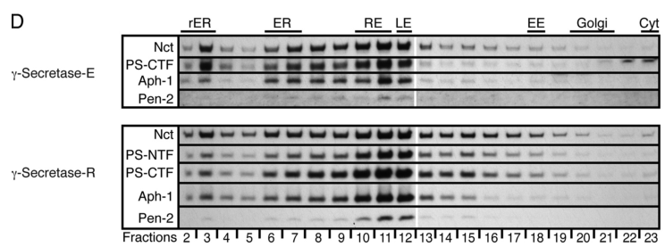

## Question

# Gene Research for Functional Annotation

## ⚠️ CRITICAL: Gene/Protein Identification Context

**BEFORE YOU BEGIN RESEARCH:** You MUST verify you are researching the CORRECT gene/protein. Gene symbols can be ambiguous, especially for less well-characterized genes from non-model organisms.

### Target Gene/Protein Identity (from UniProt):
- **UniProt Accession:** Q9VC27
- **Protein Description:** RecName: Full=Nicastrin {ECO:0000303|PubMed:10993067}; Flags: Precursor;
- **Gene Information:** Name=Nct {ECO:0000312|FlyBase:FBgn0039234}; Synonyms=NCSTN; ORFNames=CG7012 {ECO:0000312|FlyBase:FBgn0039234};
- **Organism (full):** Drosophila melanogaster (Fruit fly).
- **Protein Family:** Belongs to the nicastrin family. .
- **Key Domains:** Ncstrn_small. (IPR041084); Nicastrin. (IPR008710); Ncstrn_small (PF18266); Nicastrin (PF05450)

### MANDATORY VERIFICATION STEPS:

1. **Check if the gene symbol "Nct" matches the protein description above**
2. **Verify the organism is correct:** Drosophila melanogaster (Fruit fly).
3. **Check if protein family/domains align with what you find in literature**
4. **If you find literature for a DIFFERENT gene with the same or similar symbol, STOP**

### If Gene Symbol is Ambiguous or You Cannot Find Relevant Literature:

**DO NOT PROCEED WITH RESEARCH ON A DIFFERENT GENE.** Instead:
- State clearly: "The gene symbol 'Nct' is ambiguous or literature is limited for this specific protein"
- Explain what you found (e.g., "Found extensive literature on a different gene with the same symbol in a different organism")
- Describe the protein based ONLY on the UniProt information provided above
- Suggest that the protein function can be inferred from domain/family information

### Research Target:

Please provide a comprehensive research report on the gene **Nct** (gene ID: Nct, UniProt: Q9VC27) in DROME.

The research report should be a detailed narrative explaining the function, biological processes, and localization of the gene product. Citations should be given for all claims.

You should prioritize authoritative reviews and primary scientific literature when conducting research. You can supplement
this with annotations you find in gene/protein databases, but these can be outdated or inaccurate.

We are specifically interested in the primary function of the gene - for enzymes, what reaction is catalyzed, and what is the substrate specificity? For transporters, what is the substrate? For structural proteins or adapters, what is the broader structural role? For signaling molecules, what is the role in the pathway.

We are interested in where in or outside the cell the gene product carries out its function.

We are also interested in the signaling or biochemical pathways in which the gene functions. We are less interested in broad pleiotropic effects, except where these elucidate the precise role.

Include evidence where possible. We are interested in both experimental evidence as well as inference from structure, evolution, or bioinformatic analysis. Precise studies should be prioritized over high-throughput, where available.

## Output

Question: You are an expert researcher providing comprehensive, well-cited information.

Provide detailed information focusing on:
1. Key concepts and definitions with current understanding
2. Recent developments and latest research (prioritize 2023-2024 sources)
3. Current applications and real-world implementations
4. Expert opinions and analysis from authoritative sources
5. Relevant statistics and data from recent studies

Format as a comprehensive research report with proper citations. Include URLs and publication dates where available.
Always prioritize recent, authoritative sources and provide specific citations for all major claims.

# Gene Research for Functional Annotation

## ⚠️ CRITICAL: Gene/Protein Identification Context

**BEFORE YOU BEGIN RESEARCH:** You MUST verify you are researching the CORRECT gene/protein. Gene symbols can be ambiguous, especially for less well-characterized genes from non-model organisms.

### Target Gene/Protein Identity (from UniProt):
- **UniProt Accession:** Q9VC27
- **Protein Description:** RecName: Full=Nicastrin {ECO:0000303|PubMed:10993067}; Flags: Precursor;
- **Gene Information:** Name=Nct {ECO:0000312|FlyBase:FBgn0039234}; Synonyms=NCSTN; ORFNames=CG7012 {ECO:0000312|FlyBase:FBgn0039234};
- **Organism (full):** Drosophila melanogaster (Fruit fly).
- **Protein Family:** Belongs to the nicastrin family. .
- **Key Domains:** Ncstrn_small. (IPR041084); Nicastrin. (IPR008710); Ncstrn_small (PF18266); Nicastrin (PF05450)

### MANDATORY VERIFICATION STEPS:

1. **Check if the gene symbol "Nct" matches the protein description above**
2. **Verify the organism is correct:** Drosophila melanogaster (Fruit fly).
3. **Check if protein family/domains align with what you find in literature**
4. **If you find literature for a DIFFERENT gene with the same or similar symbol, STOP**

### If Gene Symbol is Ambiguous or You Cannot Find Relevant Literature:

**DO NOT PROCEED WITH RESEARCH ON A DIFFERENT GENE.** Instead:
- State clearly: "The gene symbol 'Nct' is ambiguous or literature is limited for this specific protein"
- Explain what you found (e.g., "Found extensive literature on a different gene with the same symbol in a different organism")
- Describe the protein based ONLY on the UniProt information provided above
- Suggest that the protein function can be inferred from domain/family information

### Research Target:

Please provide a comprehensive research report on the gene **Nct** (gene ID: Nct, UniProt: Q9VC27) in DROME.

The research report should be a detailed narrative explaining the function, biological processes, and localization of the gene product. Citations should be given for all claims.

You should prioritize authoritative reviews and primary scientific literature when conducting research. You can supplement
this with annotations you find in gene/protein databases, but these can be outdated or inaccurate.

We are specifically interested in the primary function of the gene - for enzymes, what reaction is catalyzed, and what is the substrate specificity? For transporters, what is the substrate? For structural proteins or adapters, what is the broader structural role? For signaling molecules, what is the role in the pathway.

We are interested in where in or outside the cell the gene product carries out its function.

We are also interested in the signaling or biochemical pathways in which the gene functions. We are less interested in broad pleiotropic effects, except where these elucidate the precise role.

Include evidence where possible. We are interested in both experimental evidence as well as inference from structure, evolution, or bioinformatic analysis. Precise studies should be prioritized over high-throughput, where available.

# Functional annotation of *Drosophila melanogaster* Nct

## Identity and principal function

**Nct (CG7012; FlyBase FBgn0039234; UniProt Q9VC27) encodes nicastrin**, not the Notch receptor. The identifiers, precursor designation, and Nicastrin/Ncstrn_small domain assignments are supplied by the specified UniProt record; independent fly experiments identify Nct as the nicastrin component of γ-secretase. Nct belongs to the conserved nicastrin family and is a single-pass membrane glycoprotein with a large lumenal or extracellular domain. It is **not the catalytic protease**: Presenilin supplies the essential intramembrane catalytic aspartates. Nct’s best-supported primary role is to help assemble, stabilize, and support the activity of the Presenilin–Nct–Aph-1–Pen-2 γ-secretase complex. The fly gene should not be conflated with human *NCSTN*, despite their shared protein family. (stempfle2010invivoreconstitution pages 1-2, stempfle2010invivoreconstitution pages 3-4, francis2002aph1andpen2 pages 9-10, periz2004functionalreconstitutionof pages 5-6)

## Molecular mechanism and substrates

γ-Secretase performs **regulated intramembrane proteolysis** of membrane-tethered protein fragments after their extracellular domains have been removed. Nct itself has no established independently catalyzed reaction or separate small-molecule substrate. In the canonical fly Notch pathway, Delta or Serrate engagement precedes extracellular S2 cleavage; γ-secretase then cleaves the membrane-retained Notch fragment at S3, releasing the Notch intracellular domain. That fragment enters the nucleus and acts with Suppressor of Hairless and Mastermind to regulate target-gene transcription. Thus, Nct acts in the *signal-receiving cell’s proteolytic machinery*, upstream of nuclear Notch signaling. A 2024 review emphasizes a relevant species distinction: unlike the mammalian receptor, fly Notch can function without obligatory S1 processing. (stempfle2010invivoreconstitution pages 1-2, pinot2024spatiotemporalregulationof pages 2-4)

The fly-specific evidence is unusually direct. In Dmel2 cells, **nct RNAi** suppressed cleavage-dependent reporters constructed from membrane-tethered Notch and human APP fragments, but not controls representing already-released intracellular products. Knockdown also reduced secreted Aβ40 and Aβ42 produced from the engineered APP fragment; the latter assays reported medians from **eight independent repetitions**. These experiments place the requirement for Nct at the Presenilin-dependent intramembrane-processing step, although knockdown alone cannot distinguish direct substrate binding from loss of assembled enzyme. Nct knockdown also diminished the processed Presenilin C-terminal fragment, consistent with a role in complex stability or maturation. The human APP constructs in these fly cells must not be mistaken for endogenous fly substrates. (francis2002aph1andpen2 pages 8-9, francis2002aph1andpen2 pages 9-10)

Complementation establishes that the experimentally studied protein is functional *fly Nct*: daughterless-GAL4-driven, epitope-tagged Nct **completely rescued** the lethal **nct^J1** mutant to morphologically normal adults; a different expression driver gave partial rescue. Coexpression of fly Nct, Presenilin, Aph-1, and Pen-2 increased subunit stability and Presenilin processing, and co-immunoprecipitation recovered assembled complexes. In intact flies, increasing all four subunits enhanced processing of **endogenous fly APPL**: its membrane-retained C-terminal fragments decreased, while the short intracellular product could be detected under suitable extraction conditions. A Notch-response reporter in wing discs increased strongly in **15%** and weakly in another **30%** of experimental discs (**n = 30**), versus no comparable changes in **40** control discs. These frequencies describe reporter responses, **not** enzyme turnover or substrate affinity. (stempfle2010invivoreconstitution pages 1-2, stempfle2010invivoreconstitution pages 4-6, stempfle2010invivoreconstitution pages 6-7, stempfle2010invivoreconstitution pages 3-4)

The assembled enzyme can behave differently toward different substrates. In the same fly reconstitution system, engineered Notch was efficiently processed, whereas reporter cleavage of **heterologous human APP** was reduced and that of human APLP2 increased slightly. Human APP nevertheless associated with the Nct-containing complex. This result suggests substrate-dependent regulation; it does **not** negate the observed increase in processing of *endogenous fly APPL*. Neither these experiments nor the conserved domain assignments establish a unique substrate-binding specificity for Nct itself. (stempfle2010invivoreconstitution pages 4-6, stempfle2010invivoreconstitution pages 9-10, stempfle2010invivoreconstitution pages 7-9)

The principal experiments and their limits are summarized below.

| Finding | Precise experimental observation | Interpretation / limit | Primary source |
|---|---|---|---|
| Functional rescue of fly **Nct** | Ubiquitous daughterless-GAL4-driven **Nct-2myc** completely rescued lethal amorphic **nct^J1** mutants to viable, morphologically normal adults; hsp70-GAL4 produced partial rescue. | Direct in-vivo evidence that the tagged *D. melanogaster* Nct protein is functional; supports identification of Nct as nicastrin, not the Notch receptor. | Stempfle et al., 2010; DOI: [10.1128/MCB.00030-10](https://doi.org/10.1128/MCB.00030-10) (stempfle2010invivoreconstitution pages 1-2) |
| Nct is required at the γ-secretase step | In Dmel2 cells, **nct RNAi** inhibited cleavage-dependent reporters driven by ectodomain-truncated Notch (**NECN-GV**) and APP (**C99-GV**), but not downstream controls **NINTRA-GV** or **C59-GV**. | Places Nct at the Presenilin-dependent intramembrane/S3 cleavage step rather than in transcriptional output or an upstream shedding reaction. RNAi can also destabilize the complex, so it does not prove direct substrate recognition. | Francis et al., 2002; DOI: [10.1016/S1534-5807(02)00189-2](https://doi.org/10.1016/S1534-5807(02)00189-2) (francis2002aph1andpen2 pages 8-9, francis2002aph1andpen2 pages 9-10) |
| Requirement for APP-product formation in fly cells | RNAi against **psn, nct, aph-1,** or **pen-2** reduced secreted Aβ40 and Aβ42 generated from C99-GV. Results were normalized to cell density and reported as medians of **eight independent repetitions** with standard deviations. | Confirms that Nct supports γ-secretase activity in the Drosophila cellular system; the substrate was an engineered APP construct, not endogenous fly APPL. | Francis et al., 2002; DOI: [10.1016/S1534-5807(02)00189-2](https://doi.org/10.1016/S1534-5807(02)00189-2) (francis2002aph1andpen2 pages 9-10, francis2002aph1andpen2 pages 8-9) |
| Four-subunit complex assembly | Coexpression of tagged fly **Presenilin, Nct, Aph-1, and Pen-2** increased subunit stability and Presenilin NTF/CTF formation. Co-immunoprecipitation and tandem affinity purification recovered the other subunits together. | Direct biochemical evidence that Nct resides in an assembled fly γ-secretase complex. Presenilin contains the catalytic aspartates; Nct is an accessory/structural subunit rather than the protease. | Stempfle et al., 2010; DOI: [10.1128/MCB.00030-10](https://doi.org/10.1128/MCB.00030-10) (stempfle2010invivoreconstitution pages 1-2, stempfle2010invivoreconstitution pages 3-4) |
| Endogenous fly APPL processing | Reconstitution of all four subunits in flies decreased endogenous **APPL C-terminal fragments** and, under CHAPSO extraction, increased the short APPL intracellular product; full-length APPL was unchanged. | Shows enhanced intramembrane processing of an endogenous *Drosophila* APP-family substrate, although rapid intracellular-domain degradation limited direct product quantification. | Stempfle et al., 2010; DOI: [10.1128/MCB.00030-10](https://doi.org/10.1128/MCB.00030-10) (stempfle2010invivoreconstitution pages 4-6) |
| Increased canonical Notch output in vivo | Four-subunit reconstitution in a patched-GAL4 wing-disc stripe caused a **strong NRE-EGFP increase in 15%** and a **weak increase in 30%** of experimental discs (**n=30**); no such changes occurred in controls (**n=40**). | Demonstrates that increased assembled γ-secretase can elevate Su(H)-dependent Notch signaling in vivo. Variable penetrance cautions against treating the percentages as catalytic efficiency. | Stempfle et al., 2010; DOI: [10.1128/MCB.00030-10](https://doi.org/10.1128/MCB.00030-10) (stempfle2010invivoreconstitution pages 6-7) |
| Endosomal localization | Fly-head sucrose-gradient fractionation showed closely matching distributions of endogenous and reconstituted γ-secretase subunits, with predominant enrichment in **Rab7-positive late-endosomal** and **Rab11-positive recycling-endosomal** fractions. | Supports late and recycling endosomes as major intracellular locations of Nct-containing complexes. Biochemical fraction overlap does not establish the exact membrane face or exclude plasma-membrane/Golgi activity. | Stempfle et al., 2010; DOI: [10.1128/MCB.00030-10](https://doi.org/10.1128/MCB.00030-10) (stempfle2010invivoreconstitution pages 4-6, stempfle2010invivoreconstitution media a2c8bffc) |
| Engineered human APP paradox | Despite efficient Notch-reporter cleavage, overexpressed four-subunit fly γ-secretase reduced cleavage-reporter output from engineered **human APP/ΔAPP** while modestly increasing APLP2 processing; APP still co-purified with Nct and Presenilin. | Indicates substrate-specific regulation or missing cofactors. This paradox concerns heterologous human APP reporters and must not be conflated with the observed enhancement of endogenous fly **APPL** processing. | Stempfle et al., 2010; DOI: [10.1128/MCB.00030-10](https://doi.org/10.1128/MCB.00030-10) (stempfle2010invivoreconstitution pages 9-10, stempfle2010invivoreconstitution pages 7-9) |
| Substrate-receptor claim remains unresolved | Nct has been proposed to recognize substrates, but fly experiments also support roles in complex maturation and stabilization and do not isolate a direct Nct–substrate recognition reaction. | The safest annotation is **non-catalytic γ-secretase assembly/stability and activity-supporting subunit**; direct substrate-receptor or steric-gate activity in fly Nct remains inferential. | Stempfle et al., 2010; DOI: [10.1128/MCB.00030-10](https://doi.org/10.1128/MCB.00030-10) (stempfle2010invivoreconstitution pages 1-2, stempfle2010invivoreconstitution pages 3-4) |
| Mammalian NCT-independent activity—comparative caveat | In NCT-null mouse cells, a **PS1–PEN2–APH1A** trimer retained inhibitor-sensitive Notch/APP cleavage at roughly **50% activity normalized to PS1-NTF**, but was highly unstable. | Mammalian evidence argues that nicastrin is not intrinsically catalytic or universally indispensable for substrate recognition. It is **not direct evidence about Drosophila Nct**, where loss-of-function strongly disrupts γ-secretase activity. | Zhao et al., 2010; DOI: [10.1523/JNEUROSCI.3826-09.2010](https://doi.org/10.1523/JNEUROSCI.3826-09.2010) (zhao2010γsecretasecomposedof pages 1-2, zhao2010γsecretasecomposedof pages 6-7, zhao2010γsecretasecomposedof pages 3-4) |

*Table: Direct fly evidence establishes Nct as a non-catalytic γ-secretase subunit required for complex stability, intramembrane proteolysis, and Notch signaling. The matrix separates endogenous fly findings from heterologous APP assays and mammalian comparative evidence.*

## Cellular localization

Nct is membrane-anchored, with its large domain facing the **secretory-pathway lumen or extracellular space**, rather than acting as a soluble nuclear signaling protein. In adult fly-head fractionation, endogenous γ-secretase subunits and reconstituted Nct-containing complexes had closely matching distributions, with predominant enrichment in fractions marked by **Rab7-positive late endosomes** and **Rab11-positive recycling endosomes**. The cropped fractionation panel provides visual support for this assignment. These data locate substantial intracellular pools of the complex but do not demonstrate that *every* cleavage occurs in those compartments or resolve the precise membrane face on which a particular substrate is processed. Plasma-membrane-associated Notch activation and trafficking through the secretory system remain relevant pathway contexts; the endosomal localization is the more directly demonstrated fly Nct-containing distribution here. (stempfle2010invivoreconstitution pages 4-6, stempfle2010invivoreconstitution media a2c8bffc, pinot2024spatiotemporalregulationof pages 2-4)

## Interpretation, recent research, and applications

**Substrate recognition is a qualified hypothesis, not a settled fly annotation.** Earlier work proposed that the nicastrin ectodomain recognizes membrane-retained substrates, but the fly assembly and loss-of-function findings are also explained by complex maturation and stabilization. Importantly, a **mouse-cell**, not fly, study found that an unstable PS1–Pen-2–Aph-1a complex could still cleave Notch and APP without nicastrin, with approximately **50% activity after normalization to processed PS1**. This establishes that nicastrin is not intrinsically the catalytic component and challenges any universal assertion that it is indispensable for substrate recognition; it does not overturn the strong requirement observed for Nct in ordinary fly cells and animals. (stempfle2010invivoreconstitution pages 1-2, zhao2010γsecretasecomposedof pages 1-2, zhao2010γsecretasecomposedof pages 6-7)

Recent **2024** fly-focused reviews continue to place nicastrin among the components mediating Notch S3 proteolysis and emphasize where receptor activation and trafficking occur during asymmetric cell division. They provide updated pathway context rather than a new direct biochemical measurement of Q9VC27. No retrieved **2023–2024** primary study established a new fly-Nct-specific catalytic reaction, precise substrate-binding determinant, or compartment-specific turnover rate; older targeted genetic and biochemical experiments remain the strongest basis for this annotation. In practice, Nct loss-of-function, rescue, and four-subunit reconstitution are research tools for testing Notch signaling, γ-secretase assembly, and differential processing of Notch- and APP-family substrates. Therapeutic interpretations from human γ-secretase or *NCSTN* studies are **orthologue comparisons**, not clinical applications of the fly gene. (stempfle2010invivoreconstitution pages 1-2, stempfle2010invivoreconstitution pages 6-7, stempfle2010invivoreconstitution pages 7-9, pinot2024spatiotemporalregulationof pages 2-4)

**Key sources and publication dates:** Francis *et al.*, *Developmental Cell*, **July 2002**, https://doi.org/10.1016/S1534-5807(02)00189-2; Stempfle *et al.*, *Molecular and Cellular Biology*, **July 2010**, https://doi.org/10.1128/MCB.00030-10; Zhao *et al.*, *Journal of Neuroscience*, **February 2010**—mammalian comparative experiment—https://doi.org/10.1523/JNEUROSCI.3826-09.2010; Pinot and Le Borgne, *Cells*, **June 2024**, https://doi.org/10.3390/cells13131133. (francis2002aph1andpen2 pages 8-9, stempfle2010invivoreconstitution pages 1-2, zhao2010γsecretasecomposedof pages 1-2, pinot2024spatiotemporalregulationof pages 2-4)

References

1. (stempfle2010invivoreconstitution pages 1-2): Denise Stempfle, Ritu Kanwar, Alexander Loewer, Mark E. Fortini, and Gunter Merdes. <i>in vivo</i> reconstitution of γ-secretase in <i>drosophila</i> results in substrate specificity. Molecular and Cellular Biology, 30:3165-3175, Jul 2010. URL: https://doi.org/10.1128/mcb.00030-10, doi:10.1128/mcb.00030-10. This article has 32 citations and is from a domain leading peer-reviewed journal.

2. (stempfle2010invivoreconstitution pages 3-4): Denise Stempfle, Ritu Kanwar, Alexander Loewer, Mark E. Fortini, and Gunter Merdes. <i>in vivo</i> reconstitution of γ-secretase in <i>drosophila</i> results in substrate specificity. Molecular and Cellular Biology, 30:3165-3175, Jul 2010. URL: https://doi.org/10.1128/mcb.00030-10, doi:10.1128/mcb.00030-10. This article has 32 citations and is from a domain leading peer-reviewed journal.

3. (francis2002aph1andpen2 pages 9-10): Ross Francis, Garth McGrath, Jianhuan Zhang, David A. Ruddy, Mary Sym, Javier Apfeld, Monique Nicoll, Mark Maxwell, Bing Hai, Michael C. Ellis, Annette L. Parks, Wei Xu, Jinhe Li, Mark Gurney, Richard L. Myers, Carol S. Himes, Ronald Hiebsch, Cara Ruble, Jeffrey S. Nye, and Daniel Curtis. Aph-1 and pen-2 are required for notch pathway signaling, γ-secretase cleavage of βapp, and presenilin protein accumulation. Developmental Cell, 3:85-97, Jul 2002. URL: https://doi.org/10.1016/s1534-5807(02)00189-2, doi:10.1016/s1534-5807(02)00189-2. This article has 1211 citations and is from a highest quality peer-reviewed journal.

4. (periz2004functionalreconstitutionof pages 5-6): Goran Periz and Mark E. Fortini. Functional reconstitution of γ‐secretase through coordinated expression of presenilin, nicastrin, aph‐1, and pen‐2. Journal of Neuroscience Research, 77:309-322, Aug 2004. URL: https://doi.org/10.1002/jnr.20203, doi:10.1002/jnr.20203. This article has 99 citations and is from a peer-reviewed journal.

5. (pinot2024spatiotemporalregulationof pages 2-4): Mathieu Pinot and Roland Le Borgne. Spatio-temporal regulation of notch activation in asymmetrically dividing sensory organ precursor cells in drosophila melanogaster epithelium. Cells, 13:1133, Jun 2024. URL: https://doi.org/10.3390/cells13131133, doi:10.3390/cells13131133. This article has 3 citations.

6. (francis2002aph1andpen2 pages 8-9): Ross Francis, Garth McGrath, Jianhuan Zhang, David A. Ruddy, Mary Sym, Javier Apfeld, Monique Nicoll, Mark Maxwell, Bing Hai, Michael C. Ellis, Annette L. Parks, Wei Xu, Jinhe Li, Mark Gurney, Richard L. Myers, Carol S. Himes, Ronald Hiebsch, Cara Ruble, Jeffrey S. Nye, and Daniel Curtis. Aph-1 and pen-2 are required for notch pathway signaling, γ-secretase cleavage of βapp, and presenilin protein accumulation. Developmental Cell, 3:85-97, Jul 2002. URL: https://doi.org/10.1016/s1534-5807(02)00189-2, doi:10.1016/s1534-5807(02)00189-2. This article has 1211 citations and is from a highest quality peer-reviewed journal.

7. (stempfle2010invivoreconstitution pages 4-6): Denise Stempfle, Ritu Kanwar, Alexander Loewer, Mark E. Fortini, and Gunter Merdes. <i>in vivo</i> reconstitution of γ-secretase in <i>drosophila</i> results in substrate specificity. Molecular and Cellular Biology, 30:3165-3175, Jul 2010. URL: https://doi.org/10.1128/mcb.00030-10, doi:10.1128/mcb.00030-10. This article has 32 citations and is from a domain leading peer-reviewed journal.

8. (stempfle2010invivoreconstitution pages 6-7): Denise Stempfle, Ritu Kanwar, Alexander Loewer, Mark E. Fortini, and Gunter Merdes. <i>in vivo</i> reconstitution of γ-secretase in <i>drosophila</i> results in substrate specificity. Molecular and Cellular Biology, 30:3165-3175, Jul 2010. URL: https://doi.org/10.1128/mcb.00030-10, doi:10.1128/mcb.00030-10. This article has 32 citations and is from a domain leading peer-reviewed journal.

9. (stempfle2010invivoreconstitution pages 9-10): Denise Stempfle, Ritu Kanwar, Alexander Loewer, Mark E. Fortini, and Gunter Merdes. <i>in vivo</i> reconstitution of γ-secretase in <i>drosophila</i> results in substrate specificity. Molecular and Cellular Biology, 30:3165-3175, Jul 2010. URL: https://doi.org/10.1128/mcb.00030-10, doi:10.1128/mcb.00030-10. This article has 32 citations and is from a domain leading peer-reviewed journal.

10. (stempfle2010invivoreconstitution pages 7-9): Denise Stempfle, Ritu Kanwar, Alexander Loewer, Mark E. Fortini, and Gunter Merdes. <i>in vivo</i> reconstitution of γ-secretase in <i>drosophila</i> results in substrate specificity. Molecular and Cellular Biology, 30:3165-3175, Jul 2010. URL: https://doi.org/10.1128/mcb.00030-10, doi:10.1128/mcb.00030-10. This article has 32 citations and is from a domain leading peer-reviewed journal.

11. (stempfle2010invivoreconstitution media a2c8bffc): Denise Stempfle, Ritu Kanwar, Alexander Loewer, Mark E. Fortini, and Gunter Merdes. <i>in vivo</i> reconstitution of γ-secretase in <i>drosophila</i> results in substrate specificity. Molecular and Cellular Biology, 30:3165-3175, Jul 2010. URL: https://doi.org/10.1128/mcb.00030-10, doi:10.1128/mcb.00030-10. This article has 32 citations and is from a domain leading peer-reviewed journal.

12. (zhao2010γsecretasecomposedof pages 1-2): Guojun Zhao, Zhenyi Liu, Ma. Xenia G. Ilagan, and Raphael Kopan. Γ-secretase composed of ps1/pen2/aph1a can cleave notch and amyloid precursor protein in the absence of nicastrin. The Journal of Neuroscience, 30:1648-1656, Feb 2010. URL: https://doi.org/10.1523/jneurosci.3826-09.2010, doi:10.1523/jneurosci.3826-09.2010. This article has 134 citations.

13. (zhao2010γsecretasecomposedof pages 6-7): Guojun Zhao, Zhenyi Liu, Ma. Xenia G. Ilagan, and Raphael Kopan. Γ-secretase composed of ps1/pen2/aph1a can cleave notch and amyloid precursor protein in the absence of nicastrin. The Journal of Neuroscience, 30:1648-1656, Feb 2010. URL: https://doi.org/10.1523/jneurosci.3826-09.2010, doi:10.1523/jneurosci.3826-09.2010. This article has 134 citations.

14. (zhao2010γsecretasecomposedof pages 3-4): Guojun Zhao, Zhenyi Liu, Ma. Xenia G. Ilagan, and Raphael Kopan. Γ-secretase composed of ps1/pen2/aph1a can cleave notch and amyloid precursor protein in the absence of nicastrin. The Journal of Neuroscience, 30:1648-1656, Feb 2010. URL: https://doi.org/10.1523/jneurosci.3826-09.2010, doi:10.1523/jneurosci.3826-09.2010. This article has 134 citations.

## Artifacts

- [Edison artifact artifact-00](Nct-deep-research-falcon_artifacts/artifact-00.md)

## Citations

1. stempfle2010invivoreconstitution pages 1-2
2. stempfle2010invivoreconstitution pages 4-6
3. stempfle2010invivoreconstitution pages 6-7
4. stempfle2010invivoreconstitution pages 3-4
5. periz2004functionalreconstitutionof pages 5-6
6. pinot2024spatiotemporalregulationof pages 2-4
7. stempfle2010invivoreconstitution pages 9-10
8. stempfle2010invivoreconstitution pages 7-9
9. 10.1128/MCB.00030-10
10. 10.1016/S1534-5807(02)00189-2
11. 10.1523/JNEUROSCI.3826-09.2010
12. https://doi.org/10.1128/MCB.00030-10
13. https://doi.org/10.1016/S1534-5807(02
14. https://doi.org/10.1523/JNEUROSCI.3826-09.2010
15. https://doi.org/10.1128/MCB.00030-10;
16. https://doi.org/10.1523/JNEUROSCI.3826-09.2010;
17. https://doi.org/10.3390/cells13131133.
18. https://doi.org/10.1128/mcb.00030-10,
19. https://doi.org/10.1016/s1534-5807(02
20. https://doi.org/10.1002/jnr.20203,
21. https://doi.org/10.3390/cells13131133,
22. https://doi.org/10.1523/jneurosci.3826-09.2010,