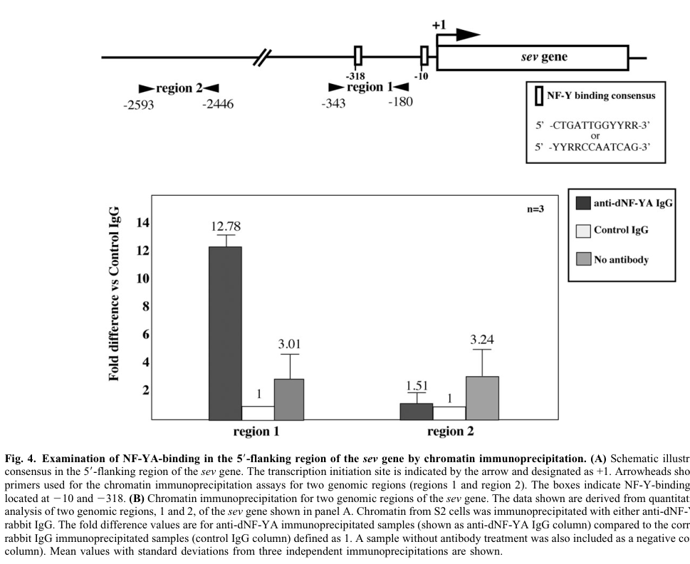

## Question

# Gene Research for Functional Annotation

## ⚠️ CRITICAL: Gene/Protein Identification Context

**BEFORE YOU BEGIN RESEARCH:** You MUST verify you are researching the CORRECT gene/protein. Gene symbols can be ambiguous, especially for less well-characterized genes from non-model organisms.

### Target Gene/Protein Identity (from UniProt):
- **UniProt Accession:** Q9VSY9
- **Protein Description:** RecName: Full=Nuclear transcription factor Y subunit {ECO:0000256|RuleBase:RU367155};
- **Gene Information:** Name=Nf-YA {ECO:0000313|EMBL:AAF50269.1, ECO:0000313|FlyBase:FBgn0035993}; Synonyms=Dmel\CG3891 {ECO:0000313|EMBL:AAF50269.1}, dNF-YA {ECO:0000313|EMBL:AAF50269.1}, NF-YA {ECO:0000313|EMBL:AAF50269.1}; ORFNames=CG3891 {ECO:0000313|EMBL:AAF50269.1, ECO:0000313|FlyBase:FBgn0035993}, Dmel_CG3891 {ECO:0000313|EMBL:AAF50269.1};
- **Organism (full):** Drosophila melanogaster (Fruit fly).
- **Protein Family:** Belongs to the NFYA/HAP2 subunit family.
- **Key Domains:** NFYA. (IPR001289); CBFB_NFYA (PF02045)

### MANDATORY VERIFICATION STEPS:

1. **Check if the gene symbol "Nf-YA" matches the protein description above**
2. **Verify the organism is correct:** Drosophila melanogaster (Fruit fly).
3. **Check if protein family/domains align with what you find in literature**
4. **If you find literature for a DIFFERENT gene with the same or similar symbol, STOP**

### If Gene Symbol is Ambiguous or You Cannot Find Relevant Literature:

**DO NOT PROCEED WITH RESEARCH ON A DIFFERENT GENE.** Instead:
- State clearly: "The gene symbol 'Nf-YA' is ambiguous or literature is limited for this specific protein"
- Explain what you found (e.g., "Found extensive literature on a different gene with the same symbol in a different organism")
- Describe the protein based ONLY on the UniProt information provided above
- Suggest that the protein function can be inferred from domain/family information

### Research Target:

Please provide a comprehensive research report on the gene **Nf-YA** (gene ID: Nf-YA, UniProt: Q9VSY9) in DROME.

The research report should be a detailed narrative explaining the function, biological processes, and localization of the gene product. Citations should be given for all claims.

You should prioritize authoritative reviews and primary scientific literature when conducting research. You can supplement
this with annotations you find in gene/protein databases, but these can be outdated or inaccurate.

We are specifically interested in the primary function of the gene - for enzymes, what reaction is catalyzed, and what is the substrate specificity? For transporters, what is the substrate? For structural proteins or adapters, what is the broader structural role? For signaling molecules, what is the role in the pathway.

We are interested in where in or outside the cell the gene product carries out its function.

We are also interested in the signaling or biochemical pathways in which the gene functions. We are less interested in broad pleiotropic effects, except where these elucidate the precise role.

Include evidence where possible. We are interested in both experimental evidence as well as inference from structure, evolution, or bioinformatic analysis. Precise studies should be prioritized over high-throughput, where available.

## Output

Question: You are an expert researcher providing comprehensive, well-cited information.

Provide detailed information focusing on:
1. Key concepts and definitions with current understanding
2. Recent developments and latest research (prioritize 2023-2024 sources)
3. Current applications and real-world implementations
4. Expert opinions and analysis from authoritative sources
5. Relevant statistics and data from recent studies

Format as a comprehensive research report with proper citations. Include URLs and publication dates where available.
Always prioritize recent, authoritative sources and provide specific citations for all major claims.

# Gene Research for Functional Annotation

## ⚠️ CRITICAL: Gene/Protein Identification Context

**BEFORE YOU BEGIN RESEARCH:** You MUST verify you are researching the CORRECT gene/protein. Gene symbols can be ambiguous, especially for less well-characterized genes from non-model organisms.

### Target Gene/Protein Identity (from UniProt):
- **UniProt Accession:** Q9VSY9
- **Protein Description:** RecName: Full=Nuclear transcription factor Y subunit {ECO:0000256|RuleBase:RU367155};
- **Gene Information:** Name=Nf-YA {ECO:0000313|EMBL:AAF50269.1, ECO:0000313|FlyBase:FBgn0035993}; Synonyms=Dmel\CG3891 {ECO:0000313|EMBL:AAF50269.1}, dNF-YA {ECO:0000313|EMBL:AAF50269.1}, NF-YA {ECO:0000313|EMBL:AAF50269.1}; ORFNames=CG3891 {ECO:0000313|EMBL:AAF50269.1, ECO:0000313|FlyBase:FBgn0035993}, Dmel_CG3891 {ECO:0000313|EMBL:AAF50269.1};
- **Organism (full):** Drosophila melanogaster (Fruit fly).
- **Protein Family:** Belongs to the NFYA/HAP2 subunit family.
- **Key Domains:** NFYA. (IPR001289); CBFB_NFYA (PF02045)

### MANDATORY VERIFICATION STEPS:

1. **Check if the gene symbol "Nf-YA" matches the protein description above**
2. **Verify the organism is correct:** Drosophila melanogaster (Fruit fly).
3. **Check if protein family/domains align with what you find in literature**
4. **If you find literature for a DIFFERENT gene with the same or similar symbol, STOP**

### If Gene Symbol is Ambiguous or You Cannot Find Relevant Literature:

**DO NOT PROCEED WITH RESEARCH ON A DIFFERENT GENE.** Instead:
- State clearly: "The gene symbol 'Nf-YA' is ambiguous or literature is limited for this specific protein"
- Explain what you found (e.g., "Found extensive literature on a different gene with the same symbol in a different organism")
- Describe the protein based ONLY on the UniProt information provided above
- Suggest that the protein function can be inferred from domain/family information

### Research Target:

Please provide a comprehensive research report on the gene **Nf-YA** (gene ID: Nf-YA, UniProt: Q9VSY9) in DROME.

The research report should be a detailed narrative explaining the function, biological processes, and localization of the gene product. Citations should be given for all claims.

You should prioritize authoritative reviews and primary scientific literature when conducting research. You can supplement
this with annotations you find in gene/protein databases, but these can be outdated or inaccurate.

We are specifically interested in the primary function of the gene - for enzymes, what reaction is catalyzed, and what is the substrate specificity? For transporters, what is the substrate? For structural proteins or adapters, what is the broader structural role? For signaling molecules, what is the role in the pathway.

We are interested in where in or outside the cell the gene product carries out its function.

We are also interested in the signaling or biochemical pathways in which the gene functions. We are less interested in broad pleiotropic effects, except where these elucidate the precise role.

Include evidence where possible. We are interested in both experimental evidence as well as inference from structure, evolution, or bioinformatic analysis. Precise studies should be prioritized over high-throughput, where available.

# Functional annotation report: *Drosophila melanogaster* Nf-YA

## Identity and principal function

**The target is the fruit-fly gene Nf-YA/CG3891, not a vertebrate NFYA gene.** The supplied UniProt accession **Q9VSY9** and FlyBase identifier **FBgn0035993** refer to this target; a primary *Drosophila* study independently identifies **CG3891** as **dNF-YA**, a 399-amino-acid protein with a DNA-binding domain 82% identical to the corresponding human NF-YA domain. Its reported NFYA/HAP2-family assignment and NFYA/CBFB_NFYA domain annotations are consistent with that identification. (yoshioka2007complexinterferencein pages 1-2, yoshioka2007complexinterferencein pages 2-3)

Nf-YA is the **DNA-recognition subunit of nuclear factor Y (NF-Y)**, a transcription-factor complex—not an enzyme, transporter, or signaling receptor. NF-YB and NF-YC first form a histone-fold heterodimer, which associates with NF-YA to form the CCAAT-motif-binding heterotrimer. In a direct biochemical test, recombinant fly proteins produced a specific shifted complex on a CCAAT-containing DNA probe **only when all three subunits were present**. Thus, the physiologically relevant DNA-binding unit is the assembled complex, not isolated Nf-YA. NF-YA recognizes CCAAT-containing regulatory DNA; its functional “substrate specificity” is **cis-regulatory sequence recognition**, not chemical catalysis. (yoshioka2007complexinterferencein pages 1-2, yoshioka2007complexinterferencein pages 2-3, moreira2024functionsofnuclear pages 3-4)

## Site of action and molecular mechanism

Nf-YA acts at **nuclear chromatin**, where promoter-bound NF-Y regulates transcription. Anti-dNF-YA chromatin immunoprecipitation in cultured fly S2 cells enriched a CCAAT-containing region of the *sevenless* (*sev*) promoter **12.8-fold relative to control IgG**, whereas an upstream region lacking the motif was not enriched. This directly supports promoter-associated nuclear activity, although it does **not** establish a precise distribution of endogenous Q9VSY9 protein within intact tissues. Immunostaining detected experimentally overexpressed, tagged dNF-YA in embryonic eye–antennal primordia and central nervous system; endogenous staining there was too weak for a reliable localization assessment. (yoshioka2011transcriptionfactornfy pages 3-4, yoshioka2007complexinterferencein pages 2-3, yoshioka2007complexinterferencein pages 3-7, yoshioka2011transcriptionfactornfy media 042baf3d)

Sequence alone does not identify every functional NF-Y site. As the recent review by Moreira and Pocock emphasizes, CCAAT motifs are widespread, while their occupancy depends on regulatory context, including the arrangement of motifs and interactions with other transcription factors. Claims that all CCAAT-bearing fly genes are Nf-YA targets would therefore exceed the evidence. (moreira2024functionsofnuclear pages 1-2, moreira2024functionsofnuclear pages 3-4)

## Best-established pathway: *sevenless* transcription and R7 differentiation

The most compelling gene-specific mechanism places Nf-YA **upstream of the Sevenless receptor–D-raf/MAPK pathway** during development of the R7 photoreceptor. Two candidate NF-Y motifs occur in the *sev* 5′ regulatory region. Mutating the **proximal** motif reduced *sev* promoter–enhancer reporter activity by **86%** in S2 cells, whereas mutation of the second motif had no significant effect in that assay. The proximal-site mutation also reduced reporter expression in larval eye discs. Because the ChIP DNA fragments encompassed both sites, ChIP establishes occupancy of their shared region rather than resolving which individual motif Nf-YA contacts in cells. (yoshioka2011transcriptionfactornfy pages 3-4, yoshioka2011transcriptionfactornfy pages 4-6, yoshioka2011transcriptionfactornfy media 90910042)

Perturbing the protein and measuring the endogenous gene supports the same regulatory direction: dNF-YA RNA interference reduced wild-type *sev* reporter activity by **27.4%** in S2 cells but did not further reduce a reporter with the proximal site mutated. In whole larvae, dNF-YA mRNA was **23%** of wild-type and *sev* mRNA was **30%** of wild-type after knockdown. These complementary binding, cis-element, reporter, and transcript experiments support **positive regulation of *sev* transcription** by Nf-YA-containing NF-Y. The whole-larva transcript measurement alone does not establish that every effect is cell-autonomous in R7 precursors. (yoshioka2011transcriptionfactornfy pages 4-6)

In developing eyes, dNF-YA knockdown produced rough eyes and loss of R7-specific enhancer-trap signals, while the tested R3/R4/R1/R6 markers remained detectable. Adding back **Sev** or expressing downstream **D-raf** rescued rough-eye morphology; D-raf also restored R7 signals. This genetic bypass is strong pathway-level evidence that insufficient *sev* expression and consequent impaired downstream MAPK signaling account for an important part of the phenotype, without excluding additional NF-Y targets. The investigators reported no apparent change in BrdU-assessed cell-cycle progression under their eye-specific knockdown conditions; **R7 fate specification, rather than an established direct cell-cycle defect**, is the precise interpretation of this experiment. (yoshioka2011transcriptionfactornfy pages 3-4, yoshioka2011transcriptionfactornfy pages 6-7)

The following evidence summary distinguishes direct mechanisms from genetic associations:

| Molecular/biological assertion | Exact *Drosophila melanogaster* experiment and quantitative result | Confidence / qualification |
|---|---|---|
| **CG3891 encodes dNF-YA, the NF-YA/HAP2-family DNA-recognition subunit of NF-Y.** | CG3891 was reported to encode a **399-aa** protein whose conserved DNA-binding domain is **82% identical** to the human NF-YA domain. In an EMSA with recombinant fly proteins and a CCAAT-containing probe, the specific shifted complex formed **only when dNF-YA, dNF-YB, and dNF-YC were all present**. (yoshioka2007complexinterferencein pages 2-3) | **High—direct sequence comparison and biochemical reconstitution.** This is a non-enzymatic transcription-factor subunit; it has no demonstrated catalytic reaction or substrate turnover. |
| **dNF-YA occupies a CCAAT-containing region of the *sevenless* (*sev*) promoter.** | Anti-dNF-YA ChIP–qPCR in Drosophila S2 cells produced **12.8-fold enrichment** over control IgG for the *sev* promoter region containing two CCAAT motifs; a distal motif-free region was not enriched. (yoshioka2011transcriptionfactornfy pages 3-4) | **High for chromatin association in S2 cells.** Fragment sizes of approximately 500–1,000 bp prevented assignment to either individual CCAAT site. |
| **The proximal NF-Y site is functionally important for *sev* promoter activity.** | Base substitution of proximal NF-Y consensus site 1 reduced *sev* promoter–enhancer luciferase activity by **86%** in S2 cells; mutation of site 2 had no significant effect, and the double mutation resembled site-1 mutation. The site-1 mutant reporter also showed reduced expression in fly eye discs. (yoshioka2011transcriptionfactornfy pages 4-6) | **High—cis-element mutagenesis in cultured cells plus an in-vivo reporter.** The result establishes site function but does not prove that NF-Y is the only factor affected by the substitutions. |
| **dNF-YA positively supports *sev* transcription.** | dNF-YA dsRNA reduced wild-type *sev* reporter activity by **27.4%** relative to LacZ dsRNA but did not reduce the site-1-mutant reporter. In larvae, dNF-YA RNA fell to **23%** and endogenous *sev* mRNA to **30%** of wild-type levels. (yoshioka2011transcriptionfactornfy pages 4-6) | **High for positive regulation.** Reporter and endogenous-transcript results agree, although organism-wide knockdown does not establish cell autonomy. |
| **dNF-YA promotes R7 photoreceptor differentiation through the Sev–Ras/MAPK pathway.** | Eye-specific dNF-YA RNAi caused rough eyes and loss of R7 enhancer-trap signals while leaving tested R3/R4/R1/R6 patterns intact. Co-expression of **Sev or downstream D-raf rescued the rough-eye phenotype**, and D-raf restored R7 signals. (yoshioka2011transcriptionfactornfy pages 3-4, yoshioka2011transcriptionfactornfy pages 6-7) | **High for pathway placement by phenotype and downstream rescue.** The strongest direct target identified is *sev*; rescue does not exclude additional NF-Y-regulated genes. |
| **dNF-YA dosage perturbs eye–antennal developmental networks involving *eyeless* and *Distal-less*.** | In a dNF-YA-overexpression background, the hypomorphic *ey*² allele increased lethality to **100% (0/102 viable)**, whereas *Dll*⁹ increased viability to **86% (64/74)**; the tested *Notch* allele produced **16% viability (12/76)** and was interpreted as no apparent interaction relative to the overexpression phenotype. (yoshioka2007complexinterferencein pages 7-8) | **Moderate—genetic interaction, not direct transcriptional regulation.** Neither *eyeless* nor *Distal-less* should be called a direct dNF-YA promoter target without binding and cis-regulatory evidence. |
| **The physiologically relevant site of action is nuclear chromatin, but native subcellular localization is incompletely demonstrated.** | dNF-YA-dependent ChIP enrichment at the *sev* promoter in cross-linked S2 chromatin demonstrates chromatin-associated nuclear function. Embryonic immunostaining detected overexpressed HA-dNF-YA in eye–antennal primordia and CNS, but endogenous signal was too low to define its distribution reliably. (yoshioka2011transcriptionfactornfy pages 3-4, yoshioka2007complexinterferencein pages 2-3) | **High for nuclear chromatin function; limited for native localization.** The evidence is not equivalent to live imaging or definitive high-resolution localization of endogenous Q9VSY9. |
| **Evidence about other NF-Y subunits cannot automatically be assigned to Nf-YA.** | The dNF-YA-specific conclusions above derive from CG3891 sequence/EMSA, RNAi, ChIP, promoter mutation, transcript measurement, and rescue experiments. (yoshioka2011transcriptionfactornfy pages 3-4, yoshioka2011transcriptionfactornfy pages 4-6, yoshioka2007complexinterferencein pages 2-3, yoshioka2011transcriptionfactornfy pages 6-7) | **Critical scope restriction.** Findings from a 2023 study centered on NF-YC do not independently demonstrate a role for Nf-YA unless Nf-YA itself was experimentally tested; no such claim is made here. |

*Table: Evidence-tiered summary of the direct molecular, promoter, pathway, developmental, and localization data for Drosophila CG3891/Nf-YA. It distinguishes demonstrated mechanisms from genetic associations and subunit-level inference.*

## Developmental scope and interpretation of other NF-Y findings

Nf-YA dosage is important beyond this single promoter: tissue-targeted overexpression or knockdown was lethal in several experimental settings, and eye–antennal overexpression caused major head and eye abnormalities. Reducing the dose of *eyeless* enhanced, whereas reducing *Distal-less* suppressed, an Nf-YA-overexpression phenotype. These are **genetic interactions**, not evidence that either gene is directly bound or transcriptionally regulated by Nf-YA. The original authors explicitly cautioned against assuming direct *eyeless* regulation from these phenotypes. (yoshioka2007complexinterferencein pages 2-3, yoshioka2007complexinterferencein pages 3-7, yoshioka2007complexinterferencein pages 7-8)

Nor should phenotypes of the **NF-YC** subunit automatically be transferred to **Nf-YA**. For example, studies discussed in the recent review connect fly NF-YC to repression of *Senseless* and R7 axon targeting; the subunit-specific experiments directly establish an NF-YC-associated role, whereas Nf-YA involvement in that particular step requires its own tests. Likewise, the 2023–2024 work on **C. elegans** NFYA-1 neuronal gene programs and mammalian NF-YA isoforms is valuable comparative context, **not experimental evidence for CG3891**. (moreira2024functionsofnuclear pages 4-5, moreira2024nuclearfactory pages 1-3, moreira2024functionsofnuclear pages 3-4)

## Research status and applications

The strongest accessible **fly Nf-YA-specific mechanistic evidence remains the trimer-reconstitution and developmental-genetics work and the *sev* promoter/R7 study**, rather than a new 2023–2024 direct-target study. A 2024-online expert review summarizes NF-Y complex architecture and unresolved target-site selectivity, but does not replace fly-specific target validation. The 2023 publication identified in searching focuses on NF-YC; its retrieved document text did not match that publication, so its Nf-YA-specific results cannot be independently reported here. Papers reporting possible additional fly NF-Y targets in JNK, p53, or lipid-storage regulation could not be adequately inspected for this report and are **not treated as validated direct CG3891 targets**. (yoshioka2007complexinterferencein pages 2-3, yoshioka2011transcriptionfactornfy pages 4-6, moreira2024functionsofnuclear pages 1-2)

The established real-world implementation is as a **research model of transcriptional control of retinal cell fate**: GAL4-directed Nf-YA perturbation, recombinant-subunit DNA-binding assays, S2-cell ChIP and promoter mutagenesis, and downstream *sev*/D-raf rescue together separate DNA recognition from pathway-level consequences. The cited work establishes an experimental model, **not a clinical intervention or demonstrated therapeutic application**. (yoshioka2007complexinterferencein pages 2-3, yoshioka2011transcriptionfactornfy pages 4-6, yoshioka2011transcriptionfactornfy pages 6-7)

### Principal sources and dates

- Yoshioka **et al.**, “Complex interference in the eye developmental pathway by *Drosophila* NF-YA,” *genesis* **45**, 21–31 (**January 2007**). https://doi.org/10.1002/dvg.20260. Primary identification, three-subunit binding, and fly genetics. (yoshioka2007complexinterferencein pages 1-2, yoshioka2007complexinterferencein pages 2-3)
- Yoshioka, Ly and Yamaguchi, “Transcription factor NF-Y is involved in differentiation of R7 photoreceptor cell in *Drosophila*,” *Biology Open* **1**, 19–29 (**online October 2011**; volume 1, issue 1). https://doi.org/10.1242/bio.2011013. Primary *sev* binding, promoter, transcript, and rescue experiments. (yoshioka2011transcriptionfactornfy pages 1-2, yoshioka2011transcriptionfactornfy pages 3-4, yoshioka2011transcriptionfactornfy pages 4-6, yoshioka2011transcriptionfactornfy pages 6-7)
- Moreira and Pocock, “Functions of nuclear factor Y in nervous system development, function and health,” *Neural Regeneration Research* **20**, 2887–2894 (**published online October 22, 2024; October 2025 issue**). https://doi.org/10.4103/NRR.NRR-D-24-00684. Cross-species review; organism-specific findings must be kept distinct. (moreira2024functionsofnuclear pages 1-2, moreira2024functionsofnuclear pages 3-4, moreira2024functionsofnuclear pages 4-5)

**Functional annotation:** *D. melanogaster* Nf-YA/Q9VSY9 is a nuclear, CCAAT-recognizing NF-Y transcription-factor subunit that assembles with NF-YB and NF-YC. Its best-demonstrated specific function is promoting *sevenless* transcription, thereby enabling Sev–D-raf/MAPK-dependent R7 photoreceptor differentiation. (yoshioka2007complexinterferencein pages 2-3, yoshioka2011transcriptionfactornfy pages 4-6, yoshioka2011transcriptionfactornfy pages 6-7)

References

1. (yoshioka2007complexinterferencein pages 1-2): Yasuhide Yoshioka, Osamu Suyari, Mikihiro Yamada, Katsuhito Ohno, Yuko Hayashi, and Masamitsu Yamaguchi. Complex interference in the eye developmental pathway by drosophila nf‐ya. genesis, 45:21-31, Jan 2007. URL: https://doi.org/10.1002/dvg.20260, doi:10.1002/dvg.20260. This article has 32 citations and is from a peer-reviewed journal.

2. (yoshioka2007complexinterferencein pages 2-3): Yasuhide Yoshioka, Osamu Suyari, Mikihiro Yamada, Katsuhito Ohno, Yuko Hayashi, and Masamitsu Yamaguchi. Complex interference in the eye developmental pathway by drosophila nf‐ya. genesis, 45:21-31, Jan 2007. URL: https://doi.org/10.1002/dvg.20260, doi:10.1002/dvg.20260. This article has 32 citations and is from a peer-reviewed journal.

3. (moreira2024functionsofnuclear pages 3-4): Pedro Moreira and Roger Pocock. Functions of nuclear factor y in nervous system development, function and health. Neural Regeneration Research, 20:2887-2894, Oct 2024. URL: https://doi.org/10.4103/nrr.nrr-d-24-00684, doi:10.4103/nrr.nrr-d-24-00684. This article has 4 citations and is from a peer-reviewed journal.

4. (yoshioka2011transcriptionfactornfy pages 3-4): Yasuhide Yoshioka, Luong Linh Ly, and Masamitsu Yamaguchi. Transcription factor nf-y is involved in differentiation of r7 photoreceptor cell in drosophila. Biology Open, 1:19-29, Oct 2011. URL: https://doi.org/10.1242/bio.2011013, doi:10.1242/bio.2011013. This article has 14 citations and is from a peer-reviewed journal.

5. (yoshioka2007complexinterferencein pages 3-7): Yasuhide Yoshioka, Osamu Suyari, Mikihiro Yamada, Katsuhito Ohno, Yuko Hayashi, and Masamitsu Yamaguchi. Complex interference in the eye developmental pathway by drosophila nf‐ya. genesis, 45:21-31, Jan 2007. URL: https://doi.org/10.1002/dvg.20260, doi:10.1002/dvg.20260. This article has 32 citations and is from a peer-reviewed journal.

6. (yoshioka2011transcriptionfactornfy media 042baf3d): Yasuhide Yoshioka, Luong Linh Ly, and Masamitsu Yamaguchi. Transcription factor nf-y is involved in differentiation of r7 photoreceptor cell in drosophila. Biology Open, 1:19-29, Oct 2011. URL: https://doi.org/10.1242/bio.2011013, doi:10.1242/bio.2011013. This article has 14 citations and is from a peer-reviewed journal.

7. (moreira2024functionsofnuclear pages 1-2): Pedro Moreira and Roger Pocock. Functions of nuclear factor y in nervous system development, function and health. Neural Regeneration Research, 20:2887-2894, Oct 2024. URL: https://doi.org/10.4103/nrr.nrr-d-24-00684, doi:10.4103/nrr.nrr-d-24-00684. This article has 4 citations and is from a peer-reviewed journal.

8. (yoshioka2011transcriptionfactornfy pages 4-6): Yasuhide Yoshioka, Luong Linh Ly, and Masamitsu Yamaguchi. Transcription factor nf-y is involved in differentiation of r7 photoreceptor cell in drosophila. Biology Open, 1:19-29, Oct 2011. URL: https://doi.org/10.1242/bio.2011013, doi:10.1242/bio.2011013. This article has 14 citations and is from a peer-reviewed journal.

9. (yoshioka2011transcriptionfactornfy media 90910042): Yasuhide Yoshioka, Luong Linh Ly, and Masamitsu Yamaguchi. Transcription factor nf-y is involved in differentiation of r7 photoreceptor cell in drosophila. Biology Open, 1:19-29, Oct 2011. URL: https://doi.org/10.1242/bio.2011013, doi:10.1242/bio.2011013. This article has 14 citations and is from a peer-reviewed journal.

10. (yoshioka2011transcriptionfactornfy pages 6-7): Yasuhide Yoshioka, Luong Linh Ly, and Masamitsu Yamaguchi. Transcription factor nf-y is involved in differentiation of r7 photoreceptor cell in drosophila. Biology Open, 1:19-29, Oct 2011. URL: https://doi.org/10.1242/bio.2011013, doi:10.1242/bio.2011013. This article has 14 citations and is from a peer-reviewed journal.

11. (yoshioka2007complexinterferencein pages 7-8): Yasuhide Yoshioka, Osamu Suyari, Mikihiro Yamada, Katsuhito Ohno, Yuko Hayashi, and Masamitsu Yamaguchi. Complex interference in the eye developmental pathway by drosophila nf‐ya. genesis, 45:21-31, Jan 2007. URL: https://doi.org/10.1002/dvg.20260, doi:10.1002/dvg.20260. This article has 32 citations and is from a peer-reviewed journal.

12. (moreira2024functionsofnuclear pages 4-5): Pedro Moreira and Roger Pocock. Functions of nuclear factor y in nervous system development, function and health. Neural Regeneration Research, 20:2887-2894, Oct 2024. URL: https://doi.org/10.4103/nrr.nrr-d-24-00684, doi:10.4103/nrr.nrr-d-24-00684. This article has 4 citations and is from a peer-reviewed journal.

13. (moreira2024nuclearfactory pages 1-3): Pedro Moreira and Roger Pocock. Nuclear factor y, a key player in neuronal gene regulation. Science Progress, Jul 2024. URL: https://doi.org/10.1177/00368504241264998, doi:10.1177/00368504241264998. This article has 1 citations.

14. (yoshioka2011transcriptionfactornfy pages 1-2): Yasuhide Yoshioka, Luong Linh Ly, and Masamitsu Yamaguchi. Transcription factor nf-y is involved in differentiation of r7 photoreceptor cell in drosophila. Biology Open, 1:19-29, Oct 2011. URL: https://doi.org/10.1242/bio.2011013, doi:10.1242/bio.2011013. This article has 14 citations and is from a peer-reviewed journal.

## Artifacts

- [Edison artifact artifact-00](Nf-YA-deep-research-falcon_artifacts/artifact-00.md)

## Citations

1. yoshioka2011transcriptionfactornfy pages 4-6
2. yoshioka2007complexinterferencein pages 2-3
3. yoshioka2011transcriptionfactornfy pages 3-4
4. yoshioka2007complexinterferencein pages 7-8
5. yoshioka2007complexinterferencein pages 1-2
6. moreira2024functionsofnuclear pages 3-4
7. yoshioka2007complexinterferencein pages 3-7
8. moreira2024functionsofnuclear pages 1-2
9. yoshioka2011transcriptionfactornfy pages 6-7
10. moreira2024functionsofnuclear pages 4-5
11. moreira2024nuclearfactory pages 1-3
12. yoshioka2011transcriptionfactornfy pages 1-2
13. https://doi.org/10.1002/dvg.20260.
14. https://doi.org/10.1242/bio.2011013.
15. https://doi.org/10.4103/NRR.NRR-D-24-00684.
16. https://doi.org/10.1002/dvg.20260,
17. https://doi.org/10.4103/nrr.nrr-d-24-00684,
18. https://doi.org/10.1242/bio.2011013,
19. https://doi.org/10.1177/00368504241264998,