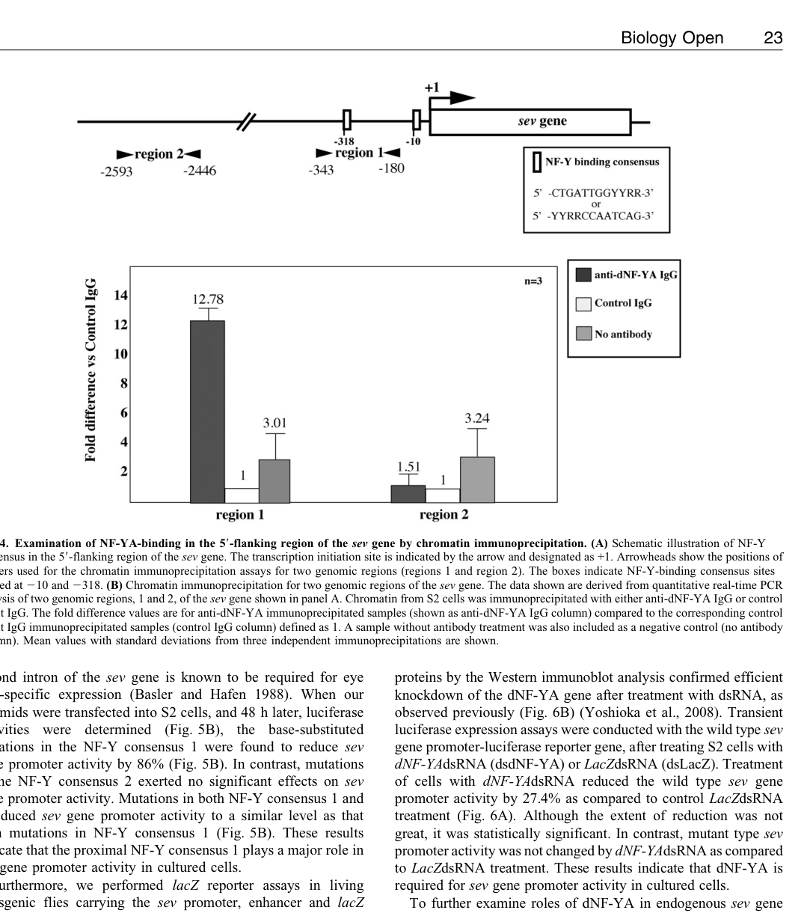

## Question

# Gene Research for Functional Annotation

## ⚠️ CRITICAL: Gene/Protein Identification Context

**BEFORE YOU BEGIN RESEARCH:** You MUST verify you are researching the CORRECT gene/protein. Gene symbols can be ambiguous, especially for less well-characterized genes from non-model organisms.

### Target Gene/Protein Identity (from UniProt):
- **UniProt Accession:** Q9W3V9
- **Protein Description:** RecName: Full=Nuclear transcription factor Y subunit gamma {ECO:0000256|ARBA:ARBA00040590}; AltName: Full=CAAT box DNA-binding protein subunit C {ECO:0000256|ARBA:ARBA00042333}; AltName: Full=Nuclear transcription factor Y subunit C {ECO:0000256|ARBA:ARBA00042663};
- **Gene Information:** Name=Nf-YC {ECO:0000313|EMBL:AAF46204.1, ECO:0000313|FlyBase:FBgn0029905}; Synonyms=Dmel\CG3075 {ECO:0000313|EMBL:AAF46204.1}, dNF-YC {ECO:0000313|EMBL:AAF46204.1}, NF-YC {ECO:0000313|EMBL:AAF46204.1}, Nf-yc {ECO:0000313|EMBL:AAF46204.1}, nf-yc {ECO:0000313|EMBL:AAF46204.1}, NFYC {ECO:0000313|EMBL:AAF46204.1}; ORFNames=CG3075 {ECO:0000313|EMBL:AAF46204.1, ECO:0000313|FlyBase:FBgn0029905}, Dmel_CG3075 {ECO:0000313|EMBL:AAF46204.1};
- **Organism (full):** Drosophila melanogaster (Fruit fly).
- **Protein Family:** Belongs to the NFYC/HAP5 subunit family.
- **Key Domains:** CBFA_NFYB_domain. (IPR003958); Histone-fold. (IPR009072); Transcr_DNA_Rep_Reg. (IPR050568); CBFD_NFYB_HMF (PF00808)

### MANDATORY VERIFICATION STEPS:

1. **Check if the gene symbol "Nf-YC" matches the protein description above**
2. **Verify the organism is correct:** Drosophila melanogaster (Fruit fly).
3. **Check if protein family/domains align with what you find in literature**
4. **If you find literature for a DIFFERENT gene with the same or similar symbol, STOP**

### If Gene Symbol is Ambiguous or You Cannot Find Relevant Literature:

**DO NOT PROCEED WITH RESEARCH ON A DIFFERENT GENE.** Instead:
- State clearly: "The gene symbol 'Nf-YC' is ambiguous or literature is limited for this specific protein"
- Explain what you found (e.g., "Found extensive literature on a different gene with the same symbol in a different organism")
- Describe the protein based ONLY on the UniProt information provided above
- Suggest that the protein function can be inferred from domain/family information

### Research Target:

Please provide a comprehensive research report on the gene **Nf-YC** (gene ID: Nf-YC, UniProt: Q9W3V9) in DROME.

The research report should be a detailed narrative explaining the function, biological processes, and localization of the gene product. Citations should be given for all claims.

You should prioritize authoritative reviews and primary scientific literature when conducting research. You can supplement
this with annotations you find in gene/protein databases, but these can be outdated or inaccurate.

We are specifically interested in the primary function of the gene - for enzymes, what reaction is catalyzed, and what is the substrate specificity? For transporters, what is the substrate? For structural proteins or adapters, what is the broader structural role? For signaling molecules, what is the role in the pathway.

We are interested in where in or outside the cell the gene product carries out its function.

We are also interested in the signaling or biochemical pathways in which the gene functions. We are less interested in broad pleiotropic effects, except where these elucidate the precise role.

Include evidence where possible. We are interested in both experimental evidence as well as inference from structure, evolution, or bioinformatic analysis. Precise studies should be prioritized over high-throughput, where available.

## Output

Question: You are an expert researcher providing comprehensive, well-cited information.

Provide detailed information focusing on:
1. Key concepts and definitions with current understanding
2. Recent developments and latest research (prioritize 2023-2024 sources)
3. Current applications and real-world implementations
4. Expert opinions and analysis from authoritative sources
5. Relevant statistics and data from recent studies

Format as a comprehensive research report with proper citations. Include URLs and publication dates where available.
Always prioritize recent, authoritative sources and provide specific citations for all major claims.

# Gene Research for Functional Annotation

## ⚠️ CRITICAL: Gene/Protein Identification Context

**BEFORE YOU BEGIN RESEARCH:** You MUST verify you are researching the CORRECT gene/protein. Gene symbols can be ambiguous, especially for less well-characterized genes from non-model organisms.

### Target Gene/Protein Identity (from UniProt):
- **UniProt Accession:** Q9W3V9
- **Protein Description:** RecName: Full=Nuclear transcription factor Y subunit gamma {ECO:0000256|ARBA:ARBA00040590}; AltName: Full=CAAT box DNA-binding protein subunit C {ECO:0000256|ARBA:ARBA00042333}; AltName: Full=Nuclear transcription factor Y subunit C {ECO:0000256|ARBA:ARBA00042663};
- **Gene Information:** Name=Nf-YC {ECO:0000313|EMBL:AAF46204.1, ECO:0000313|FlyBase:FBgn0029905}; Synonyms=Dmel\CG3075 {ECO:0000313|EMBL:AAF46204.1}, dNF-YC {ECO:0000313|EMBL:AAF46204.1}, NF-YC {ECO:0000313|EMBL:AAF46204.1}, Nf-yc {ECO:0000313|EMBL:AAF46204.1}, nf-yc {ECO:0000313|EMBL:AAF46204.1}, NFYC {ECO:0000313|EMBL:AAF46204.1}; ORFNames=CG3075 {ECO:0000313|EMBL:AAF46204.1, ECO:0000313|FlyBase:FBgn0029905}, Dmel_CG3075 {ECO:0000313|EMBL:AAF46204.1};
- **Organism (full):** Drosophila melanogaster (Fruit fly).
- **Protein Family:** Belongs to the NFYC/HAP5 subunit family.
- **Key Domains:** CBFA_NFYB_domain. (IPR003958); Histone-fold. (IPR009072); Transcr_DNA_Rep_Reg. (IPR050568); CBFD_NFYB_HMF (PF00808)

### MANDATORY VERIFICATION STEPS:

1. **Check if the gene symbol "Nf-YC" matches the protein description above**
2. **Verify the organism is correct:** Drosophila melanogaster (Fruit fly).
3. **Check if protein family/domains align with what you find in literature**
4. **If you find literature for a DIFFERENT gene with the same or similar symbol, STOP**

### If Gene Symbol is Ambiguous or You Cannot Find Relevant Literature:

**DO NOT PROCEED WITH RESEARCH ON A DIFFERENT GENE.** Instead:
- State clearly: "The gene symbol 'Nf-YC' is ambiguous or literature is limited for this specific protein"
- Explain what you found (e.g., "Found extensive literature on a different gene with the same symbol in a different organism")
- Describe the protein based ONLY on the UniProt information provided above
- Suggest that the protein function can be inferred from domain/family information

### Research Target:

Please provide a comprehensive research report on the gene **Nf-YC** (gene ID: Nf-YC, UniProt: Q9W3V9) in DROME.

The research report should be a detailed narrative explaining the function, biological processes, and localization of the gene product. Citations should be given for all claims.

You should prioritize authoritative reviews and primary scientific literature when conducting research. You can supplement
this with annotations you find in gene/protein databases, but these can be outdated or inaccurate.

We are specifically interested in the primary function of the gene - for enzymes, what reaction is catalyzed, and what is the substrate specificity? For transporters, what is the substrate? For structural proteins or adapters, what is the broader structural role? For signaling molecules, what is the role in the pathway.

We are interested in where in or outside the cell the gene product carries out its function.

We are also interested in the signaling or biochemical pathways in which the gene functions. We are less interested in broad pleiotropic effects, except where these elucidate the precise role.

Include evidence where possible. We are interested in both experimental evidence as well as inference from structure, evolution, or bioinformatic analysis. Precise studies should be prioritized over high-throughput, where available.

# Functional annotation report: *Drosophila melanogaster* Nf-YC

## Identity and principal function

**The specified protein is fly Nf-YC (CG3075; UniProt Q9W3V9), not a similarly named protein from another organism.** Independent fly research identifies CG3075 as the 633-amino-acid NF-YC subunit and reports 72% identity between its histone-fold motif and that of human NF-YC. This supports the supplied NFYC/HAP5-family and histone-fold annotations. Importantly, the fly also has **Mes4/CG11301**, a distinct, divergent NF-YC homolog: experiments attributing mesodermal *snail* activation to Mes4 must not be assigned to CG3075. (yoshioka2007complexinterferencein pages 2-3, stathopoulos2002wholegenomeanalysisof pages 5-6, stathopoulos2002wholegenomeanalysisof pages 7-9)

**Primary molecular role:** CG3075 is a **nuclear transcription-factor subunit**, not an enzyme or transporter. Its conserved histone fold supports association with NF-YB; the resulting dimer recruits NF-YA to form the CCAAT-binding NF-Y complex. An electrophoretic mobility-shift experiment using recombinant *Drosophila* proteins detected the specific CCAAT-containing DNA complex **only when NF-YA, NF-YB and CG3075/NF-YC were all present**. Thus, CCAAT recognition should be assigned to the assembled complex—not to isolated NF-YC. Structural and biochemical syntheses attribute motif recognition primarily to NF-YA and DNA-associated dimer architecture to NF-YB/NF-YC. (yoshioka2007complexinterferencein pages 2-3, moreira2024functionsofnuclear pages 3-4)

## Site of action and experimentally established biological process

NF-YC was reported in **photoreceptor nuclei**, including R7 nuclei, and is expressed across photoreceptor classes. Its demonstrated site of action is therefore intracellular, in the nucleus, where transcriptional programs are regulated; it is **not** the axon-surface guidance molecule itself. Expression in multiple photoreceptor classes also means that nuclear presence alone cannot explain its R7-selective effect. (morey2008coordinatecontrolof pages 1-2)

The strongest **CG3075-specific in-vivo function** is maintaining the correct late differentiation and synaptic-layer choice of the eye’s **R7 photoreceptor**. Wild-type R7 axons ultimately innervate medulla layer **M6**; R8 axons innervate **M3**. NF-YC-mutant R7 axons initially reach their temporary layer but frequently terminate later in M3. In large mutant patches, **77.7 ± 6.7%** of R7 axons mistargeted (1,148 neurons, eight brains); supplying NF-YC cDNA lowered the rate to **2.0 ± 1.4%** (1,076 neurons, six brains). Individually marked mutant R7s also mistargeted, supporting a cell-autonomous requirement, although at lower penetrance. This is evidence for a defect in **final layer specification**, not a general failure of initial axon growth. (morey2008coordinatecontrolof pages 1-2, morey2008coordinatecontrolof pages 7-13)

Mechanistically, NF-YC normally prevents late expression of the **R8-fate transcription factor Senseless (*sens*) in R7 cells**. Sens appears ectopically in mutant R7s after their early R7 identity has formed. The genetic relationship is unusually strong: removing *sens* from NF-YC-mutant R7s reduced M3 mistargeting to **0.2 ± 1.0%**, compared with **24.1 ± 10.5%** in the matched NF-YC-mutant control; conversely, ectopic Sens in otherwise wild-type R7s produced **25.1 ± 5.7%** mistargeting. These comparisons use the matched experimental backgrounds, rather than incorrectly comparing the 0.2% result with the 77.7% large-patch result. The evidence establishes that inappropriate Sens is a major mediator of the targeting defect, **but does not demonstrate direct NF-YC occupancy of the *sens* promoter**. (morey2008coordinatecontrolof pages 2-4, morey2008coordinatecontrolof pages 7-13)

Sens subsequently activates an R8-associated targeting program: the cell-surface protein **Capricious (Caps)** is ectopically expressed in NF-YC-mutant R7s, and Sens binds a conserved *caps* regulatory sequence in a gel-shift assay. Removing *caps* does **not** eliminate the NF-YC-mutant mistargeting phenotype, indicating that Caps is not its sole downstream effector. **Prospero** contributes to R7 targeting through a genetically parallel route; its loss does not itself induce ectopic Sens. The observed changes in photoreceptor rhodopsin programs further connect NF-YC-dependent fate maintenance to visual-system differentiation, but do not establish NF-YC as a direct rhodopsin-promoter-binding factor. (morey2008coordinatecontrolof pages 2-4, morey2008coordinatecontrolof pages 13-15, morey2008coordinatecontrolof pages 4-5)

The principal experimental findings and the boundary between direct evidence and inference are summarized below. (yoshioka2007complexinterferencein pages 2-3, morey2008coordinatecontrolof pages 7-13, yoshioka2011transcriptionfactornfy pages 4-6, finley2015polycombgroupgenes pages 6-8)

| Finding | Direct evidence / quantitation | Attribution and limitations | Source |
|---|---|---|---|
| **Identity: CG3075 is canonical fly Nf-YC; Mes4 is distinct** | CG3075 encodes a **633-aa** protein whose histone-fold motif is **72% identical** to that of human NF-YC. Mes4 is **CG11301**, a separate, divergent, tissue-specific NF-YC homolog. | Strong orthology evidence supports the supplied Q9W3V9 annotation. Results for Mes4/CG11301—such as proposed activation of *snail*—must not be assigned to CG3075. | Yoshioka et al., 2007, [doi:10.1002/dvg.20260](https://doi.org/10.1002/dvg.20260); Stathopoulos et al., 2002, [doi:10.1016/S0092-8674(02)01087-5](https://doi.org/10.1016/S0092-8674(02)01087-5) (yoshioka2007complexinterferencein pages 2-3, stathopoulos2002wholegenomeanalysisof pages 7-9, stathopoulos2002wholegenomeanalysisof pages 5-6) |
| **NF-YC participates in the CCAAT-binding NF-Y complex** | Recombinant fly NF-YA, NF-YB and CG3075/NF-YC generated a retarded CCAAT-containing DNA complex by EMSA **only when all three subunits were present**. NF-YB and NF-YC form the conserved histone-fold dimer that recruits NF-YA. | Direct biochemical evidence for trimer-dependent DNA binding, but not proof that isolated NF-YC recognizes CCAAT DNA independently. Sequence specificity is principally supplied by the assembled trimer and NF-YA. | Yoshioka et al., 2007, [doi:10.1002/dvg.20260](https://doi.org/10.1002/dvg.20260) (yoshioka2007complexinterferencein pages 1-2, yoshioka2007complexinterferencein pages 2-3) |
| **Nuclear localization in photoreceptors** | NF-YC was reported in R-cell nuclei, including R7, and was broadly expressed across photoreceptors. | Supports a nuclear transcription-regulatory role. Broad expression means R7 specificity probably requires cell-type-specific partners or signals; localization alone does not identify direct genomic targets. | Morey et al., 2008, [doi:10.1038/nature07419](https://doi.org/10.1038/nature07419) (morey2008coordinatecontrolof pages 1-2) |
| **Cell-autonomous control of R7 synaptic-layer targeting** | Wild-type R7 axons terminate in **M6**. In large NF-YC-mutant patches, **77.7 ± 6.7%** of R7 axons terminated abnormally in the R8 layer **M3** (1,148 neurons, 8 brains); re-expression of NF-YC cDNA reduced mistargeting to **2.0 ± 1.4%** (1,076 neurons, 6 brains). Individually marked mutant R7 cells also mistargeted, although less frequently. | This is the strongest CG3075-specific loss-and-rescue evidence. Normal initial targeting followed by defective final-layer selection argues against a general axon-outgrowth defect. Lower penetrance in isolated clones was attributed to probable protein perdurance. | Morey et al., 2008, [doi:10.1038/nature07419](https://doi.org/10.1038/nature07419) (morey2008coordinatecontrolof pages 1-2, morey2008coordinatecontrolof pages 7-13) |
| **Senseless mediates the NF-YC targeting phenotype** | Removing *sens* from NF-YC-mutant R7 cells reduced M3 mistargeting to **0.2 ± 1.0%**, versus **24.1 ± 10.5%** in the matched NF-YC control. Conversely, ectopic Sens caused **25.1 ± 5.7%** mistargeting in otherwise wild-type R7 cells. | Strong genetic necessity-and-sufficiency evidence places Sens downstream of NF-YC for targeting. NF-YC binding to the *sens* promoter was **not** demonstrated, so repression may be direct or indirect. Sens directly binds an upstream element of *capricious*, but *caps* loss did not suppress the entire NF-YC phenotype, implying additional Sens targets. | Morey et al., 2008, [doi:10.1038/nature07419](https://doi.org/10.1038/nature07419) (morey2008coordinatecontrolof pages 2-4, morey2008coordinatecontrolof pages 7-13) |
| **The *sevenless* promoter is an NF-Y-complex target, but evidence assays NF-YA—not NF-YC** | Anti-NF-YA ChIP enriched the *sev* promoter region **12.8-fold** over control IgG. Mutation of proximal CCAAT site 1 reduced reporter activity by **86%**; NF-YA RNAi reduced endogenous *sev* mRNA to about **30%** of wild type. Sev or downstream D-Raf expression rescued NF-YA-knockdown eye/R7 defects. | Supports NF-Y-complex action upstream of Sev–Ras/MAPK signaling, but CG3075/NF-YC was neither selectively depleted nor immunoprecipitated. It is therefore complex-level, indirect evidence for this exact protein rather than an NF-YC-specific target assignment. | Yoshioka et al., 2011, [doi:10.1242/bio.2011013](https://doi.org/10.1242/bio.2011013) (yoshioka2011transcriptionfactornfy pages 4-6, yoshioka2011transcriptionfactornfy pages 3-4, yoshioka2011transcriptionfactornfy pages 6-7, yoshioka2011transcriptionfactornfy media 9ab9339e) |
| **Possible relationship with Polycomb/PRC1 remains speculative** | Loss of PRC1-associated Sce, Scm or Pc phenocopied aspects of NF-YC loss by allowing late Sens derepression and partial R7-to-R8 transformation. The authors proposed that NF-Y might participate in PRC1 function. | No physical NF-YC–PRC1 interaction, R7-specific co-occupancy or genetic epistasis was demonstrated. PcG binding to the *sens* locus in R7 cells was not established; direct versus indirect repression remains unresolved. | Finley et al., 2015, [doi:10.1186/s13064-015-0029-7](https://doi.org/10.1186/s13064-015-0029-7) (finley2015polycombgroupgenes pages 6-8, finley2015polycombgroupgenes pages 1-2) |

*Table: Direct CG3075-specific findings are separated from NF-Y-complex evidence and mechanistic hypotheses. The table also flags the distinct Mes4 paralog and unsupported direct-target or PRC1 claims.*

## Additional pathway context: distinguish complex-level from subunit-specific evidence

A second fly pathway implicates **NF-Y as a complex upstream of *sevenless* (*sev*) and its downstream D-Raf/MAPK signaling** in early R7 differentiation. In this study, however, the manipulated and immunoprecipitated protein was **NF-YA**, not CG3075/NF-YC. Anti-NF-YA chromatin immunoprecipitation enriched the *sev* promoter region **12.8-fold** over control IgG; mutation of the functionally important proximal CCAAT element reduced reporter activity **86%**. NF-YA depletion lowered endogenous *sev* RNA to approximately **30%** of control, and expression of Sev or D-Raf rescued NF-YA-depletion-associated eye defects. Because all three fly subunits are required for reconstructed CCAAT binding, NF-YC participation is **biochemically plausible**, but direct CG3075 occupancy or depletion at *sev* was **not** shown. The retrieved Figure 4–5 panels depict the NF-YA ChIP and *sev* promoter assays, not an NF-YC-specific experiment. (yoshioka2007complexinterferencein pages 2-3, yoshioka2011transcriptionfactornfy pages 4-6, yoshioka2011transcriptionfactornfy pages 3-4, yoshioka2011transcriptionfactornfy media 9ab9339e, yoshioka2011transcriptionfactornfy media ad0e2b76)

**Polycomb relationship: hypothesis, not established mechanism.** A later fly study found that loss of PRC1-associated factors Sce, Scm or Pc can likewise allow late Sens expression and partial R7-to-R8 transformation. Its authors suggested that NF-Y *might* participate in PRC1 function because the phenotypes resemble those following NF-YC loss. They did **not** establish a physical NF-YC–PRC1 interaction, R7-specific co-occupancy, or that PRC1 mediates CG3075’s effect on *sens*. It would therefore be premature to annotate CG3075 as a proven PRC1 component or a demonstrated direct *sens* repressor. (finley2015polycombgroupgenes pages 6-8, finley2015polycombgroupgenes pages 1-2)

## State of the literature and use in research

The most decisive **protein-specific** fly experiments remain the recombinant-complex assay and the NF-YC mutant-and-rescue photoreceptor experiments. A review **published online 22 October 2024** (appearing in a **2025 journal issue**) identifies the fly NF-YC–Sens pathway as a notable example of NF-Y-dependent axon targeting while emphasizing that broader neuronal binding-site selection and guidance mechanisms remain unresolved. Studies in worms, mammals or plants can inform conserved NF-Y architecture, but their targets, disease effects or signaling pathways should **not** be transferred to Q9W3V9 as experimentally verified fly functions. No newer 2023–2024 primary experiment specifically resolving CG3075’s direct *sens* binding or its proposed PRC1 partnership was identified in the literature reviewed here. (moreira2024functionsofnuclear pages 1-2, moreira2024functionsofnuclear pages 3-4, moreira2024functionsofnuclear pages 5-6, moreira2024functionsofnuclear pages 4-5)

**Research application.** Mosaic NF-YC-mutant R7 neurons, together with NF-YC cDNA rescue, provide a fly experimental system for testing how a nuclear transcriptional program specifies photoreceptor identity and the M6-versus-M3 circuit connection. That is a research-model application, **not** an established clinical implementation or a claim that fly CG3075 is a therapeutic target. (morey2008coordinatecontrolof pages 1-2, morey2008coordinatecontrolof pages 7-13)

### Key sources and publication dates

- **Yoshioka et al., January 2007**, *Genesis*, “Complex interference in the eye developmental pathway by Drosophila NF-YA”: [https://doi.org/10.1002/dvg.20260](https://doi.org/10.1002/dvg.20260). Fly CG3075 identification and three-subunit DNA-binding assay. (yoshioka2007complexinterferencein pages 2-3)
- **Morey et al., December 2008**, *Nature*, “Coordinate control of synaptic-layer specificity and rhodopsins in photoreceptor neurons”: [https://doi.org/10.1038/nature07419](https://doi.org/10.1038/nature07419). Direct NF-YC R7 mosaic, rescue and *sens* epistasis. (morey2008coordinatecontrolof pages 1-2, morey2008coordinatecontrolof pages 7-13)
- **Yoshioka et al., October 2011**, *Biology Open*, “Transcription factor NF-Y is involved in differentiation of R7 photoreceptor cell in Drosophila”: [https://doi.org/10.1242/bio.2011013](https://doi.org/10.1242/bio.2011013). **NF-YA-assayed** *sev* promoter/MAPK evidence. (yoshioka2011transcriptionfactornfy pages 4-6, yoshioka2011transcriptionfactornfy pages 3-4)
- **Finley et al., January 2015**, *Neural Development*, “Polycomb group genes are required to maintain a binary fate choice in the Drosophila eye”: [https://doi.org/10.1186/s13064-015-0029-7](https://doi.org/10.1186/s13064-015-0029-7). PRC1 comparison; interaction with NF-Y remains conjectural. (finley2015polycombgroupgenes pages 1-2, finley2015polycombgroupgenes pages 6-8)
- **Moreira and Pocock, published online 22 October 2024; 2025 issue**, *Neural Regeneration Research*, “Functions of nuclear factor Y in nervous system development, function and health”: [https://doi.org/10.4103/nrr.nrr-d-24-00684](https://doi.org/10.4103/nrr.nrr-d-24-00684). Recent expert review and research gaps. (moreira2024functionsofnuclear pages 1-2, moreira2024functionsofnuclear pages 4-5)
- **Stathopoulos et al., November 2002**, *Cell*, “Whole-genome analysis of dorsal-ventral patterning in the Drosophila embryo”: [https://doi.org/10.1016/S0092-8674(02)01087-5](https://doi.org/10.1016/S0092-8674(02)01087-5). Establishes that Mes4/CG11301 is distinct from target CG3075. (stathopoulos2002wholegenomeanalysisof pages 7-9, stathopoulos2002wholegenomeanalysisof pages 5-6)

References

1. (yoshioka2007complexinterferencein pages 2-3): Yasuhide Yoshioka, Osamu Suyari, Mikihiro Yamada, Katsuhito Ohno, Yuko Hayashi, and Masamitsu Yamaguchi. Complex interference in the eye developmental pathway by drosophila nf‐ya. genesis, 45:21-31, Jan 2007. URL: https://doi.org/10.1002/dvg.20260, doi:10.1002/dvg.20260. This article has 32 citations and is from a peer-reviewed journal.

2. (stathopoulos2002wholegenomeanalysisof pages 5-6): Angelike Stathopoulos, Madeleine Van Drenth, Albert Erives, Michele Markstein, and Michael Levine. Whole-genome analysis of dorsal-ventral patterning in the drosophila embryo. Cell, 111:687-701, Nov 2002. URL: https://doi.org/10.1016/s0092-8674(02)01087-5, doi:10.1016/s0092-8674(02)01087-5. This article has 363 citations and is from a highest quality peer-reviewed journal.

3. (stathopoulos2002wholegenomeanalysisof pages 7-9): Angelike Stathopoulos, Madeleine Van Drenth, Albert Erives, Michele Markstein, and Michael Levine. Whole-genome analysis of dorsal-ventral patterning in the drosophila embryo. Cell, 111:687-701, Nov 2002. URL: https://doi.org/10.1016/s0092-8674(02)01087-5, doi:10.1016/s0092-8674(02)01087-5. This article has 363 citations and is from a highest quality peer-reviewed journal.

4. (moreira2024functionsofnuclear pages 3-4): Pedro Moreira and Roger Pocock. Functions of nuclear factor y in nervous system development, function and health. Neural Regeneration Research, 20:2887-2894, Oct 2024. URL: https://doi.org/10.4103/nrr.nrr-d-24-00684, doi:10.4103/nrr.nrr-d-24-00684. This article has 4 citations and is from a peer-reviewed journal.

5. (morey2008coordinatecontrolof pages 1-2): Marta Morey, Susan K. Yee, Tory Herman, Aljoscha Nern, Enrique Blanco, and S. Lawrence Zipursky. Coordinate control of synaptic-layer specificity and rhodopsins in photoreceptor neurons. Nature, 456:795-799, Dec 2008. URL: https://doi.org/10.1038/nature07419, doi:10.1038/nature07419. This article has 94 citations and is from a highest quality peer-reviewed journal.

6. (morey2008coordinatecontrolof pages 7-13): Marta Morey, Susan K. Yee, Tory Herman, Aljoscha Nern, Enrique Blanco, and S. Lawrence Zipursky. Coordinate control of synaptic-layer specificity and rhodopsins in photoreceptor neurons. Nature, 456:795-799, Dec 2008. URL: https://doi.org/10.1038/nature07419, doi:10.1038/nature07419. This article has 94 citations and is from a highest quality peer-reviewed journal.

7. (morey2008coordinatecontrolof pages 2-4): Marta Morey, Susan K. Yee, Tory Herman, Aljoscha Nern, Enrique Blanco, and S. Lawrence Zipursky. Coordinate control of synaptic-layer specificity and rhodopsins in photoreceptor neurons. Nature, 456:795-799, Dec 2008. URL: https://doi.org/10.1038/nature07419, doi:10.1038/nature07419. This article has 94 citations and is from a highest quality peer-reviewed journal.

8. (morey2008coordinatecontrolof pages 13-15): Marta Morey, Susan K. Yee, Tory Herman, Aljoscha Nern, Enrique Blanco, and S. Lawrence Zipursky. Coordinate control of synaptic-layer specificity and rhodopsins in photoreceptor neurons. Nature, 456:795-799, Dec 2008. URL: https://doi.org/10.1038/nature07419, doi:10.1038/nature07419. This article has 94 citations and is from a highest quality peer-reviewed journal.

9. (morey2008coordinatecontrolof pages 4-5): Marta Morey, Susan K. Yee, Tory Herman, Aljoscha Nern, Enrique Blanco, and S. Lawrence Zipursky. Coordinate control of synaptic-layer specificity and rhodopsins in photoreceptor neurons. Nature, 456:795-799, Dec 2008. URL: https://doi.org/10.1038/nature07419, doi:10.1038/nature07419. This article has 94 citations and is from a highest quality peer-reviewed journal.

10. (yoshioka2011transcriptionfactornfy pages 4-6): Yasuhide Yoshioka, Luong Linh Ly, and Masamitsu Yamaguchi. Transcription factor nf-y is involved in differentiation of r7 photoreceptor cell in drosophila. Biology Open, 1:19-29, Oct 2011. URL: https://doi.org/10.1242/bio.2011013, doi:10.1242/bio.2011013. This article has 14 citations and is from a peer-reviewed journal.

11. (finley2015polycombgroupgenes pages 6-8): Jennifer K Finley, Adam C Miller, and Tory G Herman. Polycomb group genes are required to maintain a binary fate choice in the drosophila eye. Neural Development, Jan 2015. URL: https://doi.org/10.1186/s13064-015-0029-7, doi:10.1186/s13064-015-0029-7. This article has 3 citations and is from a peer-reviewed journal.

12. (yoshioka2007complexinterferencein pages 1-2): Yasuhide Yoshioka, Osamu Suyari, Mikihiro Yamada, Katsuhito Ohno, Yuko Hayashi, and Masamitsu Yamaguchi. Complex interference in the eye developmental pathway by drosophila nf‐ya. genesis, 45:21-31, Jan 2007. URL: https://doi.org/10.1002/dvg.20260, doi:10.1002/dvg.20260. This article has 32 citations and is from a peer-reviewed journal.

13. (yoshioka2011transcriptionfactornfy pages 3-4): Yasuhide Yoshioka, Luong Linh Ly, and Masamitsu Yamaguchi. Transcription factor nf-y is involved in differentiation of r7 photoreceptor cell in drosophila. Biology Open, 1:19-29, Oct 2011. URL: https://doi.org/10.1242/bio.2011013, doi:10.1242/bio.2011013. This article has 14 citations and is from a peer-reviewed journal.

14. (yoshioka2011transcriptionfactornfy pages 6-7): Yasuhide Yoshioka, Luong Linh Ly, and Masamitsu Yamaguchi. Transcription factor nf-y is involved in differentiation of r7 photoreceptor cell in drosophila. Biology Open, 1:19-29, Oct 2011. URL: https://doi.org/10.1242/bio.2011013, doi:10.1242/bio.2011013. This article has 14 citations and is from a peer-reviewed journal.

15. (yoshioka2011transcriptionfactornfy media 9ab9339e): Yasuhide Yoshioka, Luong Linh Ly, and Masamitsu Yamaguchi. Transcription factor nf-y is involved in differentiation of r7 photoreceptor cell in drosophila. Biology Open, 1:19-29, Oct 2011. URL: https://doi.org/10.1242/bio.2011013, doi:10.1242/bio.2011013. This article has 14 citations and is from a peer-reviewed journal.

16. (finley2015polycombgroupgenes pages 1-2): Jennifer K Finley, Adam C Miller, and Tory G Herman. Polycomb group genes are required to maintain a binary fate choice in the drosophila eye. Neural Development, Jan 2015. URL: https://doi.org/10.1186/s13064-015-0029-7, doi:10.1186/s13064-015-0029-7. This article has 3 citations and is from a peer-reviewed journal.

17. (yoshioka2011transcriptionfactornfy media ad0e2b76): Yasuhide Yoshioka, Luong Linh Ly, and Masamitsu Yamaguchi. Transcription factor nf-y is involved in differentiation of r7 photoreceptor cell in drosophila. Biology Open, 1:19-29, Oct 2011. URL: https://doi.org/10.1242/bio.2011013, doi:10.1242/bio.2011013. This article has 14 citations and is from a peer-reviewed journal.

18. (moreira2024functionsofnuclear pages 1-2): Pedro Moreira and Roger Pocock. Functions of nuclear factor y in nervous system development, function and health. Neural Regeneration Research, 20:2887-2894, Oct 2024. URL: https://doi.org/10.4103/nrr.nrr-d-24-00684, doi:10.4103/nrr.nrr-d-24-00684. This article has 4 citations and is from a peer-reviewed journal.

19. (moreira2024functionsofnuclear pages 5-6): Pedro Moreira and Roger Pocock. Functions of nuclear factor y in nervous system development, function and health. Neural Regeneration Research, 20:2887-2894, Oct 2024. URL: https://doi.org/10.4103/nrr.nrr-d-24-00684, doi:10.4103/nrr.nrr-d-24-00684. This article has 4 citations and is from a peer-reviewed journal.

20. (moreira2024functionsofnuclear pages 4-5): Pedro Moreira and Roger Pocock. Functions of nuclear factor y in nervous system development, function and health. Neural Regeneration Research, 20:2887-2894, Oct 2024. URL: https://doi.org/10.4103/nrr.nrr-d-24-00684, doi:10.4103/nrr.nrr-d-24-00684. This article has 4 citations and is from a peer-reviewed journal.

## Artifacts

- [Edison artifact artifact-00](Nf-YC-deep-research-falcon_artifacts/artifact-00.md)

## Citations

1. morey2008coordinatecontrolof pages 1-2
2. yoshioka2007complexinterferencein pages 2-3
3. stathopoulos2002wholegenomeanalysisof pages 5-6
4. stathopoulos2002wholegenomeanalysisof pages 7-9
5. moreira2024functionsofnuclear pages 3-4
6. morey2008coordinatecontrolof pages 7-13
7. morey2008coordinatecontrolof pages 2-4
8. morey2008coordinatecontrolof pages 13-15
9. morey2008coordinatecontrolof pages 4-5
10. yoshioka2011transcriptionfactornfy pages 4-6
11. finley2015polycombgroupgenes pages 6-8
12. yoshioka2007complexinterferencein pages 1-2
13. yoshioka2011transcriptionfactornfy pages 3-4
14. yoshioka2011transcriptionfactornfy pages 6-7
15. finley2015polycombgroupgenes pages 1-2
16. moreira2024functionsofnuclear pages 1-2
17. moreira2024functionsofnuclear pages 5-6
18. moreira2024functionsofnuclear pages 4-5
19. doi:10.1002/dvg.20260
20. doi:10.1016/S0092-8674(02)01087-5
21. doi:10.1038/nature07419
22. doi:10.1242/bio.2011013
23. doi:10.1186/s13064-015-0029-7
24. https://doi.org/10.1002/dvg.20260
25. https://doi.org/10.1038/nature07419
26. https://doi.org/10.1242/bio.2011013
27. https://doi.org/10.1186/s13064-015-0029-7
28. https://doi.org/10.4103/nrr.nrr-d-24-00684
29. https://doi.org/10.1016/S0092-8674(02)01087-5
30. https://doi.org/10.1016/S0092-8674(02
31. https://doi.org/10.1002/dvg.20260](https://doi.org/10.1002/dvg.20260
32. https://doi.org/10.1038/nature07419](https://doi.org/10.1038/nature07419
33. https://doi.org/10.1242/bio.2011013](https://doi.org/10.1242/bio.2011013
34. https://doi.org/10.1186/s13064-015-0029-7](https://doi.org/10.1186/s13064-015-0029-7
35. https://doi.org/10.4103/nrr.nrr-d-24-00684](https://doi.org/10.4103/nrr.nrr-d-24-00684
36. https://doi.org/10.1002/dvg.20260,
37. https://doi.org/10.1016/s0092-8674(02
38. https://doi.org/10.4103/nrr.nrr-d-24-00684,
39. https://doi.org/10.1038/nature07419,
40. https://doi.org/10.1242/bio.2011013,
41. https://doi.org/10.1186/s13064-015-0029-7,