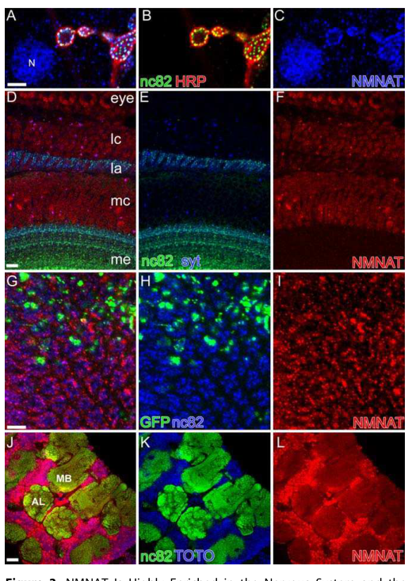

## Question

# Gene Research for Functional Annotation

## ⚠️ CRITICAL: Gene/Protein Identification Context

**BEFORE YOU BEGIN RESEARCH:** You MUST verify you are researching the CORRECT gene/protein. Gene symbols can be ambiguous, especially for less well-characterized genes from non-model organisms.

### Target Gene/Protein Identity (from UniProt):
- **UniProt Accession:** Q9VC03
- **Protein Description:** RecName: Full=Nicotinamide-nucleotide adenylyltransferase {ECO:0000255|RuleBase:RU362021}; EC=2.7.7.1 {ECO:0000255|RuleBase:RU362021, ECO:0000269|PubMed:17132048, ECO:0000269|PubMed:19403820, ECO:0000269|PubMed:26616331}; EC=2.7.7.18 {ECO:0000255|RuleBase:RU362021}; AltName: Full=Nicotinamide mononucleotide adenylyltransferase {ECO:0000312|FlyBase:FBgn0039254}; Short=dNmnat {ECO:0000312|FlyBase:FBgn0039254};
- **Gene Information:** Name=Nmnat {ECO:0000303|PubMed:17132048, ECO:0000312|FlyBase:FBgn0039254}; ORFNames=CG13645 {ECO:0000312|FlyBase:FBgn0039254};
- **Organism (full):** Drosophila melanogaster (Fruit fly).
- **Protein Family:** Belongs to the eukaryotic NMN adenylyltransferase family.
- **Key Domains:** Cyt_trans-like. (IPR004821); Euk_NMN_adenylyltrnsfrase. (IPR051182); NadD/NMNAT. (IPR005248); NMNAT_euk. (IPR045094); Rossmann-like_a/b/a_fold. (IPR014729)

### MANDATORY VERIFICATION STEPS:

1. **Check if the gene symbol "Nmnat" matches the protein description above**
2. **Verify the organism is correct:** Drosophila melanogaster (Fruit fly).
3. **Check if protein family/domains align with what you find in literature**
4. **If you find literature for a DIFFERENT gene with the same or similar symbol, STOP**

### If Gene Symbol is Ambiguous or You Cannot Find Relevant Literature:

**DO NOT PROCEED WITH RESEARCH ON A DIFFERENT GENE.** Instead:
- State clearly: "The gene symbol 'Nmnat' is ambiguous or literature is limited for this specific protein"
- Explain what you found (e.g., "Found extensive literature on a different gene with the same symbol in a different organism")
- Describe the protein based ONLY on the UniProt information provided above
- Suggest that the protein function can be inferred from domain/family information

### Research Target:

Please provide a comprehensive research report on the gene **Nmnat** (gene ID: Nmnat, UniProt: Q9VC03) in DROME.

The research report should be a detailed narrative explaining the function, biological processes, and localization of the gene product. Citations should be given for all claims.

You should prioritize authoritative reviews and primary scientific literature when conducting research. You can supplement
this with annotations you find in gene/protein databases, but these can be outdated or inaccurate.

We are specifically interested in the primary function of the gene - for enzymes, what reaction is catalyzed, and what is the substrate specificity? For transporters, what is the substrate? For structural proteins or adapters, what is the broader structural role? For signaling molecules, what is the role in the pathway.

We are interested in where in or outside the cell the gene product carries out its function.

We are also interested in the signaling or biochemical pathways in which the gene functions. We are less interested in broad pleiotropic effects, except where these elucidate the precise role.

Include evidence where possible. We are interested in both experimental evidence as well as inference from structure, evolution, or bioinformatic analysis. Precise studies should be prioritized over high-throughput, where available.

## Output

Question: You are an expert researcher providing comprehensive, well-cited information.

Provide detailed information focusing on:
1. Key concepts and definitions with current understanding
2. Recent developments and latest research (prioritize 2023-2024 sources)
3. Current applications and real-world implementations
4. Expert opinions and analysis from authoritative sources
5. Relevant statistics and data from recent studies

Format as a comprehensive research report with proper citations. Include URLs and publication dates where available.
Always prioritize recent, authoritative sources and provide specific citations for all major claims.

# Gene Research for Functional Annotation

## ⚠️ CRITICAL: Gene/Protein Identification Context

**BEFORE YOU BEGIN RESEARCH:** You MUST verify you are researching the CORRECT gene/protein. Gene symbols can be ambiguous, especially for less well-characterized genes from non-model organisms.

### Target Gene/Protein Identity (from UniProt):
- **UniProt Accession:** Q9VC03
- **Protein Description:** RecName: Full=Nicotinamide-nucleotide adenylyltransferase {ECO:0000255|RuleBase:RU362021}; EC=2.7.7.1 {ECO:0000255|RuleBase:RU362021, ECO:0000269|PubMed:17132048, ECO:0000269|PubMed:19403820, ECO:0000269|PubMed:26616331}; EC=2.7.7.18 {ECO:0000255|RuleBase:RU362021}; AltName: Full=Nicotinamide mononucleotide adenylyltransferase {ECO:0000312|FlyBase:FBgn0039254}; Short=dNmnat {ECO:0000312|FlyBase:FBgn0039254};
- **Gene Information:** Name=Nmnat {ECO:0000303|PubMed:17132048, ECO:0000312|FlyBase:FBgn0039254}; ORFNames=CG13645 {ECO:0000312|FlyBase:FBgn0039254};
- **Organism (full):** Drosophila melanogaster (Fruit fly).
- **Protein Family:** Belongs to the eukaryotic NMN adenylyltransferase family.
- **Key Domains:** Cyt_trans-like. (IPR004821); Euk_NMN_adenylyltrnsfrase. (IPR051182); NadD/NMNAT. (IPR005248); NMNAT_euk. (IPR045094); Rossmann-like_a/b/a_fold. (IPR014729)

### MANDATORY VERIFICATION STEPS:

1. **Check if the gene symbol "Nmnat" matches the protein description above**
2. **Verify the organism is correct:** Drosophila melanogaster (Fruit fly).
3. **Check if protein family/domains align with what you find in literature**
4. **If you find literature for a DIFFERENT gene with the same or similar symbol, STOP**

### If Gene Symbol is Ambiguous or You Cannot Find Relevant Literature:

**DO NOT PROCEED WITH RESEARCH ON A DIFFERENT GENE.** Instead:
- State clearly: "The gene symbol 'Nmnat' is ambiguous or literature is limited for this specific protein"
- Explain what you found (e.g., "Found extensive literature on a different gene with the same symbol in a different organism")
- Describe the protein based ONLY on the UniProt information provided above
- Suggest that the protein function can be inferred from domain/family information

### Research Target:

Please provide a comprehensive research report on the gene **Nmnat** (gene ID: Nmnat, UniProt: Q9VC03) in DROME.

The research report should be a detailed narrative explaining the function, biological processes, and localization of the gene product. Citations should be given for all claims.

You should prioritize authoritative reviews and primary scientific literature when conducting research. You can supplement
this with annotations you find in gene/protein databases, but these can be outdated or inaccurate.

We are specifically interested in the primary function of the gene - for enzymes, what reaction is catalyzed, and what is the substrate specificity? For transporters, what is the substrate? For structural proteins or adapters, what is the broader structural role? For signaling molecules, what is the role in the pathway.

We are interested in where in or outside the cell the gene product carries out its function.

We are also interested in the signaling or biochemical pathways in which the gene functions. We are less interested in broad pleiotropic effects, except where these elucidate the precise role.

Include evidence where possible. We are interested in both experimental evidence as well as inference from structure, evolution, or bioinformatic analysis. Precise studies should be prioritized over high-throughput, where available.

## Research Report: Functional Annotation of *Drosophila melanogaster* **Nmnat** (CG13645; UniProt Q9VC03)

### 0) Target verification (critical identity check)
The target gene/protein is *Drosophila melanogaster* **Nmnat** (also referred to as dNmnat), encoded by **CG13645**. Foundational genetics and rescue experiments identify CG13645 as **nmnat**, encoding a nicotinamide mononucleotide adenylyltransferase (NMNAT) with conserved catalytic motifs and measurable NMNAT enzymatic activity, consistent with UniProt Q9VC03 and the eukaryotic NMNAT family assignment. (zhai2006drosophilanmnatmaintains pages 4-5, zhai2006drosophilanmnatmaintains pages 5-7)

### 1) Key concepts and definitions (current understanding)

#### 1.1 NMNAT enzymes and NAD\(^+\) biosynthesis
NMNATs are enzymes in NAD\(^+\) metabolism commonly described as catalyzing conversion of **nicotinamide mononucleotide (NMN)** to **NAD\(^+\)** using **ATP** (often written NMN + ATP → NAD\(^+\) + PPi in reviews of programmed axon degeneration). (ademi2023exploringtherole pages 32-35, alexandris2023nad+axonalmaintenance pages 6-7)

For *Drosophila* Nmnat specifically, recombinant dNmnat protein exhibits NMNAT activity comparable to human NMNAT3 in an in vitro coupled assay, and mutations in conserved catalytic/substrate-binding motifs sharply reduce enzymatic activity, confirming that CG13645 encodes a bona fide NMNAT enzyme. (zhai2006drosophilanmnatmaintains pages 5-7, zhai2006drosophilanmnatmaintains pages 2-4)

#### 1.2 Programmed axon degeneration (Wallerian degeneration / programmed axon death)
A major contemporary framework places NMNAT (in mammals particularly NMNAT2; in flies dNmnat is the functional counterpart used in genetic models) as an **axon survival factor** that antagonizes a conserved **programmed axon degeneration** pathway. In this model, reduced NMNAT function leads to altered NAD\(^+\)/NMN balance and promotes activation of **SARM1/dSarm**, an NADase that rapidly consumes NAD\(^+\), triggering axon degeneration. (bhattacharya2023anervewrackingbuzz pages 1-2, alexandris2023nad+axonalmaintenance pages 1-2, loreto2024programmedaxondeath pages 2-4)

### 2) Biochemical function and substrate specificity of dNmnat

#### 2.1 Experimentally supported enzymatic function
Zhai et al. (2006) demonstrate that dNmnat is enzymatically active and that conserved catalytic residues are required for full activity. Specific point mutants reduce activity to fractions of wild-type, including **H30A ≈ 1.4%**, **W98G ≈ 22%**, **R224A ≈ 10.8%**, and **WR ≈ 0.9%** of wild-type activity. (zhai2006drosophilanmnatmaintains pages 2-4, zhai2006drosophilanmnatmaintains pages 5-7)

While the provided evidence does not include detailed kinetic constants (e.g., K\(_m\), k\(_cat\)) for Drosophila dNmnat, these mutation–activity relationships experimentally support that the enzyme’s primary biochemical role is NMN adenylyltransferase activity in NAD\(^+\) biosynthesis/salvage. (zhai2006drosophilanmnatmaintains pages 5-7, zhai2006drosophilanmnatmaintains pages 2-4)

### 3) NAD-synthesis–independent (moonlighting) neuronal maintenance and chaperone-like roles

#### 3.1 Genetic separation of catalytic activity vs neuroprotection
A central, well-cited observation in *Drosophila* is that dNmnat’s **neuroprotective/maintenance function can be partially uncoupled from its NAD\(^+\)-synthesis activity**. Catalytically impaired mutants that retain <1% enzymatic activity (e.g., WR) can still strongly rescue neurodegeneration phenotypes in vivo (e.g., photoreceptor maintenance), with quantification performed across animals and ommatidial areas and statistically significant protection of ommatidial morphology and rhabdomere number. (zhai2006drosophilanmnatmaintains pages 10-11, zhai2006drosophilanmnatmaintains pages 2-4)

This conclusion is reinforced by figure-level evidence showing rescue of electrophysiological (ERG) and structural phenotypes by catalytically impaired constructs and quantification of rhabdomere rescue in degeneration paradigms. (zhai2006drosophilanmnatmaintains media c9342773, zhai2006drosophilanmnatmaintains media a9cc149f)

#### 3.2 Proteostasis and chaperone-like mechanisms (current evidence base)
Mechanistic literature (summarized in extracted text) supports that NMNAT proteins can act as chaperone-like protectors in proteotoxic contexts: dNmnat/NMNAT is described as binding misfolded species (e.g., Tau oligomers), promoting their ubiquitination/clearance, and that reduced endogenous NMNAT exacerbates Tau-induced degeneration, while NMNAT expression suppresses degeneration in Drosophila models. (ali2011themechanismof pages 145-149)

Although not all such mechanistic work is strictly Drosophila-only (and some is presented as synthesis), it aligns with the strong Drosophila genetic separation-of-function evidence that neuroprotection can persist even when catalytic activity is strongly reduced. (zhai2006drosophilanmnatmaintains pages 10-11, ali2011themechanismof pages 145-149)

### 4) Subcellular localization and where dNmnat acts in the cell

Immunostaining evidence in *Drosophila* indicates that dNmnat is:
- **Abundant in neuronal nuclei** (brain and ventral nerve cord), persisting into adulthood. (zhai2006drosophilanmnatmaintains pages 5-7)
- Present as **punctate labeling at synapses/terminals**, partially colocalizing with the active zone marker nc82, including in photoreceptor terminals of the adult lamina. (zhai2006drosophilanmnatmaintains pages 5-7)
- Also detected strongly in **muscle nuclei**, and pan-neuronal expression alone does not rescue lethality, implying important extra-neuronal requirements. (zhai2006drosophilanmnatmaintains pages 5-7)

Figure-level visual evidence of nuclear and synaptic localization is available from the primary source. (zhai2006drosophilanmnatmaintains media c9342773)

### 5) Biological processes, pathways, and phenotypes linked to dNmnat

#### 5.1 Neuronal and synaptic maintenance in the visual system
Loss-of-function of *nmnat* causes rapid, progressive neurodegeneration in the visual system, including defective ERGs and ultrastructural synaptic abnormalities (disorganization of photoreceptor terminals, amorphic/reduced T-bar active zone structures, aberrant mitochondria and cytoskeleton). Quantitatively, active zone number per terminal was not significantly altered (control: 118 terminals; mutant alleles 3R41: 93; 3R42: 71), but T-bar platform widths were significantly reduced versus control. (zhai2006drosophilanmnatmaintains pages 1-2, zhai2006drosophilanmnatmaintains pages 2-4)

Degeneration is activity/light sensitive: blocking neuronal activity and dark rearing attenuate/delay degeneration, consistent with dNmnat being a maintenance factor required under physiological load. (zhai2006drosophilanmnatmaintains pages 10-11, zhai2006drosophilanmnatmaintains pages 4-5)

#### 5.2 Axon integrity and injury-induced degeneration (wing nerve model)
In an in vivo nerve injury paradigm, depletion/knockdown of endogenous dNmnat induces spontaneous retrograde (“dying back”) degeneration in the wing nerve, and severed axons show Wallerian-like fragmentation scored on a 0–4 scale. (fang2012anoveldrosophila pages 1-8)

A notable mechanistic readout is mitochondrial preservation: after wing cut, axonal mitoGFP is lost rapidly (significantly faster than mChRFP, ***p < 0.0001; vs EB1GFP **p < 0.001; n = 7–9 wings/group), while dNmnat upregulation preserves axonal mitochondria and mitochondrial markers (mitoGFP and MnSOD), supported by immunoblot quantification across 3 experiments (normalized to tubulin; *p < 0.05, **p < 0.01). (fang2012anoveldrosophila pages 1-8)

#### 5.3 Placement in the dSarm/SARM1 programmed axon degeneration network
Recent authoritative synthesis (2023–2024) frames NMNAT and SARM1/dSarm as central, opposing enzymes in programmed axon death: NMNAT activity supports axon survival, while SARM1/dSarm is an NADase whose activation drives NAD loss and degeneration. (alexandris2023nad+axonalmaintenance pages 1-2, loreto2024programmedaxondeath pages 1-2)

Quantitative pathway dynamics summarized in a 2023 review include: after axotomy, **NMN increases ~4-fold (4–6 h)** and **NAD\(^+\) falls >5-fold**; forced SARM1 activation can deplete neuronal NAD\(^+\) by ~90% within 90 min, with cADPR rising 5–10×. These kinetics are primarily drawn from vertebrate systems but are presented as part of a conserved pathway framework that includes Drosophila dSarm and dNmnat. (alexandris2023nad+axonalmaintenance pages 6-7, alexandris2023nad+axonalmaintenance pages 14-15)

### 6) Recent developments (prioritizing 2023–2024)

#### 6.1 2024: Using dNmnat overexpression to preserve severed axons and probe maintenance programs
A 2024 EMBO Reports study uses dNmnat overexpression to attenuate programmed axon degeneration in multiple neuronal populations, preserving severed projections for weeks while retaining evoked postsynaptic behavior. The authors isolate the “local translatome” from preserved projections and identify requirements for mTORC1-related transcripts, ubiquitination-related genes, and Ca\(^2+\) homeostasis genes in maintaining synaptic function in the preserved distal axon segment. This represents a concrete, modern experimental use of dNmnat as a tool to create long-lived severed axons to interrogate local maintenance mechanisms. (bhattacharya2023anervewrackingbuzz pages 1-2)

#### 6.2 2024: Translational framing—retina/optic nerve as a testing ground for programmed axon death interventions
A 2024 review in *Eye* argues that programmed axon death is a promising therapeutic target for retinal/optic nerve disorders, highlighting NMNAT and SARM1 as the central opposed enzymes and noting extensive preclinical neuroprotection when targeting this pathway; the eye is emphasized as suitable for early clinical trials due to drug delivery and quantitative functional readouts. While this review is not Drosophila-specific, it situates the conserved NMNAT–SARM1 logic (originally informed by model organisms including flies) in a clinically relevant setting. (loreto2024programmedaxondeath pages 1-2, loreto2024programmedaxondeath pages 2-4)

### 7) Current applications and real-world implementations

#### 7.1 Functional annotation and mechanistic dissection in vivo (Drosophila)
In practice, dNmnat is used in fly genetics for:
- **Maintenance screens and degeneration suppression assays** in the visual system, including ERG and ultrastructural synapse metrics, with catalytically impaired constructs enabling mechanistic separation between NAD synthesis and neuroprotection. (zhai2006drosophilanmnatmaintains pages 10-11, zhai2006drosophilanmnatmaintains media c9342773)
- **Axon injury and Wallerian degeneration-like paradigms** (e.g., wing nerve cut), where dNmnat loss triggers degeneration and overexpression preserves axons and mitochondria, enabling quantifiable degeneration scoring and mitochondrial readouts. (fang2012anoveldrosophila pages 1-8)
- **Long-term preservation of severed axons** to study local translation and synaptic maintenance programs in the absence of soma support. (bhattacharya2023anervewrackingbuzz pages 1-2)

#### 7.2 Translational applications (cross-species; interpret with scope)
Expert 2023–2024 reviews describe multiple therapeutic strategies targeting the NMNAT–SARM1 axis, including stabilizing NMNAT2, modulating NAD\(^+\) metabolism, and developing SARM1 inhibitors; however, these are largely based on mammalian systems. The role of Drosophila work is primarily foundational and mechanistic (pathway discovery and conserved logic), rather than direct clinical implementation. (alexandris2023nad+axonalmaintenance pages 1-2, loreto2024programmedaxondeath pages 2-4)

### 8) Expert opinions and analysis (authoritative syntheses)

- A 2023 review emphasizes that WD/programmed axon degeneration “hijacks” NAD\(^+\) metabolism and highlights NMNAT2 proteostasis and SARM1 allosteric regulation by NAD\(^+\)/NMN as key regulatory nodes, while cautioning that manipulating NAD\(^+\) metabolism may be challenging and potentially toxic due to NAD\(^+\)’s centrality in cell survival. (alexandris2023nad+axonalmaintenance pages 1-2)
- A 2024 ophthalmology-focused review concludes that targeting programmed axon death has produced “remarkable” preclinical neuroprotection and argues the eye is a particularly tractable arena for early clinical trials of pathway inhibitors/modulators. (loreto2024programmedaxondeath pages 1-2)
- A 2023 Drosophila-focused review underscores the role of model organisms in discovering core players (including dSarm and NMNAT-associated protection) and explicitly connects these discoveries to emerging clinical-intervention strategies for neuropathy. (bhattacharya2023anervewrackingbuzz pages 1-2)

### 9) Recent statistics/data highlights (for annotation)

Key quantitative points useful for functional annotation include:
- **Enzymatic separation-of-function**: dNmnat catalytic mutants reduce enzymatic activity to 1.4% (H30A) and 0.9% (WR), yet retain strong neuroprotective effects in vivo. (zhai2006drosophilanmnatmaintains pages 2-4, zhai2006drosophilanmnatmaintains pages 10-11)
- **Synapse ultrastructure**: active zone number per terminal not significantly changed (control 118 terminals vs mutants 93 and 71 terminals), while T-bar platform widths are significantly reduced. (zhai2006drosophilanmnatmaintains pages 2-4)
- **Axon injury mitochondrial preservation**: mitoGFP loss post-injury differs significantly from other markers (p-values as above; n = 7–9 wings), and dNmnat overexpression preserves mitochondrial markers in immunoblots across 3 experiments with significant effects. (fang2012anoveldrosophila pages 1-8)
- **Programmed axon degeneration metabolic dynamics (cross-species)**: NMN rises ~4-fold in 4–6 h after axotomy; NAD\(^+\) falls >5-fold; SARM1 activation can reduce NAD\(^+\) by ~90% in 90 min; cADPR increases 5–10×. (alexandris2023nad+axonalmaintenance pages 6-7)

### 10) Visual evidence (selected)
Primary-paper figures document (i) dNmnat nuclear and synaptic/active-zone punctate localization and (ii) rescue of degeneration and ERG phenotypes by catalytically impaired dNmnat constructs, supporting the dual-function model (enzymatic NAD\(^+\) synthesis plus NAD-independent neuroprotection). (zhai2006drosophilanmnatmaintains media c9342773, zhai2006drosophilanmnatmaintains media a9cc149f)

### Evidence summary table
The following table consolidates the main claims, evidence types, quantitative details, and sources/URLs.

| Functional aspect | Main finding / claim | Evidence type | Key quantitative / statistical details | Source with URL |
|---|---|---|---|---|
| Enzyme identity and catalytic function | CG13645 encodes Drosophila Nmnat (dNmnat), a bona fide nicotinamide mononucleotide adenylyltransferase in NAD biosynthesis; its catalytic center is highly conserved with other NMNATs. | Biochemical assay, genetics | Recombinant dNmnat showed NMNAT activity similar to human NMNAT3; catalytic mutants reduced activity to H30A 1.4%, W98G 22%, R224A 10.8%, and WR 0.9% of WT activity (zhai2006drosophilanmnatmaintains pages 5-7, zhai2006drosophilanmnatmaintains pages 2-4, zhai2006drosophilanmnatmaintains pages 4-5) | Zhai 2006, PLoS Biology. https://doi.org/10.1371/journal.pbio.0040416 |
| Primary enzymatic reaction / substrate specificity | Current understanding is that NMNAT enzymes convert NMN + ATP to NAD + PPi; recent reviews place dNmnat within the conserved NMNAT/NAD salvage axis whose loss elevates NMN and lowers NAD, predisposing axons to degeneration. | Review synthesis anchored to Drosophila/cross-species pathway work | Reviews state NMNAT enzymes produce NAD from NMN and ATP; after axotomy in the PAD pathway, NMN rises ~4-fold in 4–6 h and NAD+ falls >5-fold in systems where NMNAT loss is upstream of SARM1 activation (ademi2023exploringtherole pages 32-35, alexandris2023nad+axonalmaintenance pages 6-7) | Ademi 2023, Dissertation. https://doi.org/10.17863/cam.97015; Alexandris 2023, Antioxidants & Redox Signaling. https://doi.org/10.1089/ars.2023.0350 |
| NAD-independent neuroprotection | dNmnat has a separable neuroprotective function: catalytically impaired proteins can still rescue degeneration in vivo, indicating that neuronal maintenance is not explained solely by NAD synthesis. | Genetics, morphology, ERG, imaging | Enzymatically impaired mutants with low residual activity, including WR at 0.9%, gave similar protection to WT in photoreceptor degeneration assays; quantification used 5 animals per genotype and 400 µm² ommatidia per animal (zhai2006drosophilanmnatmaintains pages 10-11, zhai2006drosophilanmnatmaintains pages 2-4, zhai2006drosophilanmnatmaintains media c9342773) | Zhai 2006, PLoS Biology. https://doi.org/10.1371/journal.pbio.0040416 |
| Chaperone / proteostasis role | Evidence supports a moonlighting chaperone-like role for dNmnat/NMNAT beyond catalysis, including protection against misfolded-protein toxicity and links to protein quality control. | Review of primary genetic/proteostasis studies | Reported to bind Tau oligomers, promote ubiquitination and clearance, suppress Tau-induced degeneration, and reduce polyQ aggregate burden; C-terminal deletions impair chaperone activity, whereas catalytic mutant H30A can preserve chaperone-like protection in some contexts (ali2011themechanismof pages 145-149, lee2025therolesof pages 8-9) | Ali 2011, dissertation/reviewed thesis text. URL not available in extracted context; Lee 2025, IJMS. https://doi.org/10.3390/ijms26189098 |
| Subcellular localization | dNmnat localizes strongly to neuronal nuclei and also to punctate synaptic and photoreceptor terminal structures, partially overlapping the active-zone marker nc82; expression is also seen in muscle nuclei. | Immunostaining, imaging | Adult lamina shows synaptic puncta co-localizing with nc82; adult brain and ventral nerve cord show strong nuclear signal. Figure summary indicates localization in photoreceptor terminals and neuronal nuclei (zhai2006drosophilanmnatmaintains pages 5-7, zhai2006drosophilanmnatmaintains pages 4-5, zhai2006drosophilanmnatmaintains media c9342773) | Zhai 2006, PLoS Biology. https://doi.org/10.1371/journal.pbio.0040416 |
| Neural maintenance phenotype | Endogenous dNmnat is required for ongoing maintenance of mature neurons and synapses rather than gross initial development; loss causes progressive retinal and synaptic disorganization. | Genetics, ultrastructure, ERG | In lamina terminals, active zone number was not significantly changed despite degeneration: control 118 terminals, 3R41 93, 3R42 71; T-bar platform widths were significantly reduced; ERG responses declined with age and were nearly absent by 8 days in mutants (zhai2006drosophilanmnatmaintains pages 1-2, zhai2006drosophilanmnatmaintains pages 5-7, zhai2006drosophilanmnatmaintains pages 2-4, zhai2006drosophilanmnatmaintains pages 4-5) | Zhai 2006, PLoS Biology. https://doi.org/10.1371/journal.pbio.0040416 |
| Axon maintenance and injury response | dNmnat is essential for axonal integrity in vivo; depletion causes spontaneous retrograde dying-back degeneration, while overexpression preserves injured axons. | Nerve injury model, genetics, imaging, immunoblot | Wing-nerve injury assays used a 0–4 fragmentation score; loss of mitochondrial marker in severed axons occurred faster than cytoplasmic marker, with mitoGFP loss vs mChRFP at p<0.0001 and vs EB1GFP at p<0.001; n=7–9 wings per group. dNmnat overexpression preserved mitoGFP and MnSOD after injury across 3 experiments, with p<0.05 or p<0.01 depending on comparison (fang2012anoveldrosophila pages 1-8) | Fang 2012, Current Biology. https://doi.org/10.1016/j.cub.2012.01.065 |
| Mitochondrial preservation | A major proximal readout of dNmnat protection in injured axons is maintenance of axonal mitochondria. | Imaging, immunoblot, genetics | In injured L1 nerves, mitoGFP became undetectable by day 20 without protection, whereas dNmnat upregulation markedly preserved mitochondrial markers and reduced degeneration (fang2012anoveldrosophila pages 1-8) | Fang 2012, Current Biology. https://doi.org/10.1016/j.cub.2012.01.065 |
| Relationship to programmed axon degeneration pathway | Modern pathway models place NMNAT/dNmnat as the axon survival factor that antagonizes programmed axon degeneration; depletion of NMNAT activity is an initiating event upstream of SARM1/dSarm. | Review synthesis from Drosophila and vertebrate work | WldS/NMNAT gain of function can delay degeneration from about 1.5 days to 2–3 weeks; Nmnat2-null phenotypes can be rescued across the lifespan by removing SARM1 in mammals, supporting conserved antagonism between NMNAT and SARM1/dSarm (loreto2024programmedaxondeath pages 1-2, loreto2024programmedaxondeath pages 2-4, alexandris2023nad+axonalmaintenance pages 1-2) | Loreto 2024, Eye. https://doi.org/10.1038/s41433-024-03025-0; Alexandris 2023, Antioxidants & Redox Signaling. https://doi.org/10.1089/ars.2023.0350 |
| Relationship with dSarm / SARM1 | dSarm/SARM1 is the pro-degenerative NADase activated when NMNAT function falls and the NMN/NAD ratio rises; NAD+ inhibits and NMN activates SARM1 allosterically. | Review, genetics, biochemical pathway synthesis | SARM1 activation can deplete neuronal NAD+ by ~90% within 90 min; cADPR rises 5–10-fold; in Sarm1 KO axons NAD+ remains largely unchanged and cADPR is nearly undetectable after injury. NMN can activate dSarm in Drosophila (alexandris2023nad+axonalmaintenance pages 14-15, alexandris2023nad+axonalmaintenance pages 6-7) | Alexandris 2023, Antioxidants & Redox Signaling. https://doi.org/10.1089/ars.2023.0350 |
| Additional pathway components downstream or parallel to dNmnat loss | Axon degeneration induced by dNmnat loss converges on downstream execution factors such as Axundead (Axed); recent work also proposes a parallel ionic and osmotic sensor pathway involving dWnk. | Review and recent preprint | Axundead deletion prevented degeneration caused by axotomy, loss of dNmnat, or constitutively active dSarm; a 2024 preprint reports that dWnk is required for neurodegeneration induced by dNmnat depletion and converges with dSarm on Axed (alexandris2023nad+axonalmaintenance pages 10-11) | Alexandris 2023, Antioxidants & Redox Signaling. https://doi.org/10.1089/ars.2023.0350 |
| Activity / light dependence | dNmnat-deficient degeneration is activity sensitive; reducing stimulation attenuates the phenotype, consistent with a maintenance role under physiological stress or load. | Genetics, environmental manipulation, ERG/histology | Blocking neuronal activity attenuated degeneration; dark rearing delayed retinal degeneration; constant light is a sensitized background in which even catalytically inactive dNmnat can protect morphology (zhai2006drosophilanmnatmaintains pages 10-11, zhai2006drosophilanmnatmaintains pages 5-7, zhai2006drosophilanmnatmaintains pages 4-5, zhai2006drosophilanmnatmaintains media c9342773) | Zhai 2006, PLoS Biology. https://doi.org/10.1371/journal.pbio.0040416 |
| Recent Drosophila application: preserving severed axon function | dNmnat overexpression is now used experimentally to create long-lived, morphologically preserved severed axons that retain synaptic function, enabling study of local maintenance programs. | Primary 2024 study in Drosophila | Overexpressed dNmnat preserved severed projections for weeks and enabled evoked postsynaptic behavior; the preserved-state translatome implicated mTORC1, ubiquitination, and Ca2+ homeostasis genes in sustaining function (bhattacharya2023anervewrackingbuzz pages 1-2) | Paglione 2024, EMBO Reports. https://doi.org/10.1038/s44319-024-00301-8 |
| Therapeutic / translational interpretation | Although the target gene here is Drosophila dNmnat, authoritative 2023–2024 reviews treat the conserved NMNAT-SARM1 axis as a major neuroprotection target for optic neuropathy and other axonopathies. | Expert review / translational analysis | Reviews cite remarkable or near-complete preclinical protection when targeting programmed axon death; strategies include SARM1 inhibitors, NMNAT stabilization, and NAD precursor supplementation. Small clinical studies of nicotinamide in glaucoma are noted as promising but not yet definitive for PAD causality (loreto2024programmedaxondeath pages 1-2, loreto2024programmedaxondeath pages 2-4, alexandris2023nad+axonalmaintenance pages 1-2, alexandris2023nad+axonalmaintenance pages 14-15) | Loreto 2024, Eye. https://doi.org/10.1038/s41433-024-03025-0; Alexandris 2023, Antioxidants & Redox Signaling. https://doi.org/10.1089/ars.2023.0350 |
| Figure-level visual evidence | Authoritative figures show both nuclear and synaptic localization and rescue by catalytically inactive mutants, visually reinforcing the separation of catalytic and neuroprotective functions. | Image-based evidence from primary paper | Figure summary indicates localization in photoreceptor terminal puncta and neuronal nuclei; inactive H30A and WR mutants restore ERG, ommatidial morphology, and synaptic structure, with rhabdomere rescue quantified in degeneration models (zhai2006drosophilanmnatmaintains media c9342773, zhai2006drosophilanmnatmaintains media 9834dd86, zhai2006drosophilanmnatmaintains media a9cc149f) | Zhai 2006, PLoS Biology. https://doi.org/10.1371/journal.pbio.0040416 |

*Table: This table condenses the strongest primary and recent review evidence for Drosophila melanogaster Nmnat/dNmnat, covering its enzymatic role in NAD metabolism, NAD-independent neuroprotective functions, localization, and integration into programmed axon degeneration pathways.*

### References (publication dates and URLs)
- Zhai RG et al. **2006-11**. *PLoS Biology*: “Drosophila NMNAT Maintains Neural Integrity Independent of Its NAD Synthesis Activity.” https://doi.org/10.1371/journal.pbio.0040416 (zhai2006drosophilanmnatmaintains pages 4-5, zhai2006drosophilanmnatmaintains pages 2-4)
- Fang Y et al. **2012-04**. *Current Biology*: “A Novel Drosophila Model of Nerve Injury Reveals an Essential Role of Nmnat in Maintaining Axonal Integrity.” https://doi.org/10.1016/j.cub.2012.01.065 (fang2012anoveldrosophila pages 1-8)
- Bhattacharya MRC. **2023-08**. *Frontiers in Aging Neuroscience*: “A nerve-wracking buzz: lessons from Drosophila models of peripheral neuropathy and axon degeneration.” https://doi.org/10.3389/fnagi.2023.1166146 (bhattacharya2023anervewrackingbuzz pages 1-2)
- Alexandris AS, Koliatsos VE. **2023-12**. *Antioxidants & Redox Signaling*: “NAD+, Axonal Maintenance, and Neurological Disease.” https://doi.org/10.1089/ars.2023.0350 (alexandris2023nad+axonalmaintenance pages 1-2, alexandris2023nad+axonalmaintenance pages 6-7)
- Loreto A et al. **2024-03**. *Eye*: “Programmed axon death: a promising target for treating retinal and optic nerve disorders.” https://doi.org/10.1038/s41433-024-03025-0 (loreto2024programmedaxondeath pages 1-2, loreto2024programmedaxondeath pages 2-4)
- Paglione M et al. **2024-10**. *EMBO Reports*: “Local translatome sustains synaptic function in impaired Wallerian degeneration.” https://doi.org/10.1038/s44319-024-00301-8 (bhattacharya2023anervewrackingbuzz pages 1-2)

References

1. (zhai2006drosophilanmnatmaintains pages 4-5): R. Grace Zhai, Yu Cao, P. Robin Hiesinger, Yi Zhou, Sunil Q Mehta, Karen L Schulze, Patrik Verstreken, and Hugo J Bellen. Drosophila nmnat maintains neural integrity independent of its nad synthesis activity. PLoS Biology, 4:e416, Nov 2006. URL: https://doi.org/10.1371/journal.pbio.0040416, doi:10.1371/journal.pbio.0040416. This article has 218 citations and is from a highest quality peer-reviewed journal.

2. (zhai2006drosophilanmnatmaintains pages 5-7): R. Grace Zhai, Yu Cao, P. Robin Hiesinger, Yi Zhou, Sunil Q Mehta, Karen L Schulze, Patrik Verstreken, and Hugo J Bellen. Drosophila nmnat maintains neural integrity independent of its nad synthesis activity. PLoS Biology, 4:e416, Nov 2006. URL: https://doi.org/10.1371/journal.pbio.0040416, doi:10.1371/journal.pbio.0040416. This article has 218 citations and is from a highest quality peer-reviewed journal.

3. (ademi2023exploringtherole pages 32-35): Mirlinda Ademi. Exploring the role of programmed axon death genes sarm1 and nmnat2 in human disease. Dissertation, Jun 2023. URL: https://doi.org/10.17863/cam.97015, doi:10.17863/cam.97015. This article has 0 citations.

4. (alexandris2023nad+axonalmaintenance pages 6-7): Athanasios S. Alexandris and Vassilis E. Koliatsos. Nad+, axonal maintenance, and neurological disease. Dec 2023. URL: https://doi.org/10.1089/ars.2023.0350, doi:10.1089/ars.2023.0350. This article has 20 citations and is from a domain leading peer-reviewed journal.

5. (zhai2006drosophilanmnatmaintains pages 2-4): R. Grace Zhai, Yu Cao, P. Robin Hiesinger, Yi Zhou, Sunil Q Mehta, Karen L Schulze, Patrik Verstreken, and Hugo J Bellen. Drosophila nmnat maintains neural integrity independent of its nad synthesis activity. PLoS Biology, 4:e416, Nov 2006. URL: https://doi.org/10.1371/journal.pbio.0040416, doi:10.1371/journal.pbio.0040416. This article has 218 citations and is from a highest quality peer-reviewed journal.

6. (bhattacharya2023anervewrackingbuzz pages 1-2): Martha R. C. Bhattacharya. A nerve-wracking buzz: lessons from drosophila models of peripheral neuropathy and axon degeneration. Frontiers in Aging Neuroscience, Aug 2023. URL: https://doi.org/10.3389/fnagi.2023.1166146, doi:10.3389/fnagi.2023.1166146. This article has 11 citations and is from a peer-reviewed journal.

7. (alexandris2023nad+axonalmaintenance pages 1-2): Athanasios S. Alexandris and Vassilis E. Koliatsos. Nad+, axonal maintenance, and neurological disease. Dec 2023. URL: https://doi.org/10.1089/ars.2023.0350, doi:10.1089/ars.2023.0350. This article has 20 citations and is from a domain leading peer-reviewed journal.

8. (loreto2024programmedaxondeath pages 2-4): Andrea Loreto, Elisa Merlini, and Michael P. Coleman. Programmed axon death: a promising target for treating retinal and optic nerve disorders. Eye, 38:1802-1809, Mar 2024. URL: https://doi.org/10.1038/s41433-024-03025-0, doi:10.1038/s41433-024-03025-0. This article has 11 citations and is from a peer-reviewed journal.

9. (zhai2006drosophilanmnatmaintains pages 10-11): R. Grace Zhai, Yu Cao, P. Robin Hiesinger, Yi Zhou, Sunil Q Mehta, Karen L Schulze, Patrik Verstreken, and Hugo J Bellen. Drosophila nmnat maintains neural integrity independent of its nad synthesis activity. PLoS Biology, 4:e416, Nov 2006. URL: https://doi.org/10.1371/journal.pbio.0040416, doi:10.1371/journal.pbio.0040416. This article has 218 citations and is from a highest quality peer-reviewed journal.

10. (zhai2006drosophilanmnatmaintains media c9342773): R. Grace Zhai, Yu Cao, P. Robin Hiesinger, Yi Zhou, Sunil Q Mehta, Karen L Schulze, Patrik Verstreken, and Hugo J Bellen. Drosophila nmnat maintains neural integrity independent of its nad synthesis activity. PLoS Biology, 4:e416, Nov 2006. URL: https://doi.org/10.1371/journal.pbio.0040416, doi:10.1371/journal.pbio.0040416. This article has 218 citations and is from a highest quality peer-reviewed journal.

11. (zhai2006drosophilanmnatmaintains media a9cc149f): R. Grace Zhai, Yu Cao, P. Robin Hiesinger, Yi Zhou, Sunil Q Mehta, Karen L Schulze, Patrik Verstreken, and Hugo J Bellen. Drosophila nmnat maintains neural integrity independent of its nad synthesis activity. PLoS Biology, 4:e416, Nov 2006. URL: https://doi.org/10.1371/journal.pbio.0040416, doi:10.1371/journal.pbio.0040416. This article has 218 citations and is from a highest quality peer-reviewed journal.

12. (ali2011themechanismof pages 145-149): YO Ali. The mechanism of neuroprotection mediated by nicotinamide mononucleotide adenylyl transferase (nmnat). Unknown journal, 2011.

13. (zhai2006drosophilanmnatmaintains pages 1-2): R. Grace Zhai, Yu Cao, P. Robin Hiesinger, Yi Zhou, Sunil Q Mehta, Karen L Schulze, Patrik Verstreken, and Hugo J Bellen. Drosophila nmnat maintains neural integrity independent of its nad synthesis activity. PLoS Biology, 4:e416, Nov 2006. URL: https://doi.org/10.1371/journal.pbio.0040416, doi:10.1371/journal.pbio.0040416. This article has 218 citations and is from a highest quality peer-reviewed journal.

14. (fang2012anoveldrosophila pages 1-8): Yanshan Fang, Lorena Soares, Xiuyin Teng, Melissa Geary, and Nancy M. Bonini. A novel drosophila model of nerve injury reveals an essential role of nmnat in maintaining axonal integrity. Current Biology, 22:590-595, Apr 2012. URL: https://doi.org/10.1016/j.cub.2012.01.065, doi:10.1016/j.cub.2012.01.065. This article has 165 citations and is from a highest quality peer-reviewed journal.

15. (loreto2024programmedaxondeath pages 1-2): Andrea Loreto, Elisa Merlini, and Michael P. Coleman. Programmed axon death: a promising target for treating retinal and optic nerve disorders. Eye, 38:1802-1809, Mar 2024. URL: https://doi.org/10.1038/s41433-024-03025-0, doi:10.1038/s41433-024-03025-0. This article has 11 citations and is from a peer-reviewed journal.

16. (alexandris2023nad+axonalmaintenance pages 14-15): Athanasios S. Alexandris and Vassilis E. Koliatsos. Nad+, axonal maintenance, and neurological disease. Dec 2023. URL: https://doi.org/10.1089/ars.2023.0350, doi:10.1089/ars.2023.0350. This article has 20 citations and is from a domain leading peer-reviewed journal.

17. (lee2025therolesof pages 8-9): Yi-Ching Lee and Su-Ju Lin. The roles of moonlighting nicotinamide mononucleotide adenylyl transferases in cell physiology. Sep 2025. URL: https://doi.org/10.3390/ijms26189098, doi:10.3390/ijms26189098. This article has 2 citations.

18. (alexandris2023nad+axonalmaintenance pages 10-11): Athanasios S. Alexandris and Vassilis E. Koliatsos. Nad+, axonal maintenance, and neurological disease. Dec 2023. URL: https://doi.org/10.1089/ars.2023.0350, doi:10.1089/ars.2023.0350. This article has 20 citations and is from a domain leading peer-reviewed journal.

19. (zhai2006drosophilanmnatmaintains media 9834dd86): R. Grace Zhai, Yu Cao, P. Robin Hiesinger, Yi Zhou, Sunil Q Mehta, Karen L Schulze, Patrik Verstreken, and Hugo J Bellen. Drosophila nmnat maintains neural integrity independent of its nad synthesis activity. PLoS Biology, 4:e416, Nov 2006. URL: https://doi.org/10.1371/journal.pbio.0040416, doi:10.1371/journal.pbio.0040416. This article has 218 citations and is from a highest quality peer-reviewed journal.

## Artifacts

- [Edison artifact artifact-00](Nmnat-deep-research-falcon_artifacts/artifact-00.md)

## Citations

1. ali2011themechanismof pages 145-149
2. zhai2006drosophilanmnatmaintains pages 5-7
3. fang2012anoveldrosophila pages 1-8
4. bhattacharya2023anervewrackingbuzz pages 1-2
5. loreto2024programmedaxondeath pages 1-2
6. zhai2006drosophilanmnatmaintains pages 2-4
7. zhai2006drosophilanmnatmaintains pages 4-5
8. ademi2023exploringtherole pages 32-35
9. loreto2024programmedaxondeath pages 2-4
10. zhai2006drosophilanmnatmaintains pages 10-11
11. zhai2006drosophilanmnatmaintains pages 1-2
12. lee2025therolesof pages 8-9
13. https://doi.org/10.1371/journal.pbio.0040416
14. https://doi.org/10.17863/cam.97015;
15. https://doi.org/10.1089/ars.2023.0350
16. https://doi.org/10.3390/ijms26189098
17. https://doi.org/10.1016/j.cub.2012.01.065
18. https://doi.org/10.1038/s41433-024-03025-0;
19. https://doi.org/10.1038/s44319-024-00301-8
20. https://doi.org/10.3389/fnagi.2023.1166146
21. https://doi.org/10.1038/s41433-024-03025-0
22. https://doi.org/10.1371/journal.pbio.0040416,
23. https://doi.org/10.17863/cam.97015,
24. https://doi.org/10.1089/ars.2023.0350,
25. https://doi.org/10.3389/fnagi.2023.1166146,
26. https://doi.org/10.1038/s41433-024-03025-0,
27. https://doi.org/10.1016/j.cub.2012.01.065,
28. https://doi.org/10.3390/ijms26189098,