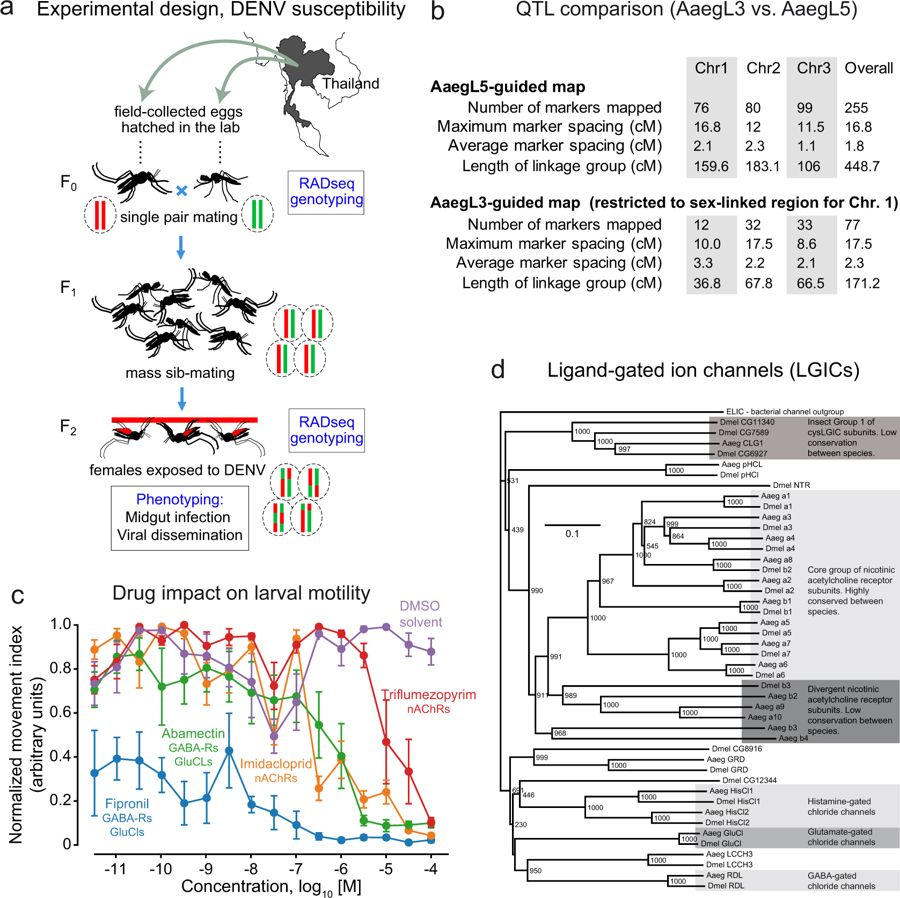

# NtR belongs to an unclassified branch of Cys-loop channels

The published Cys-loop ligand-gated ion-channel tree in Matthews et al. (2018), Extended Data Figure 10d, includes Dmel NTR as a distinct branch outside both shaded nicotinic acetylcholine-receptor groups. The current FlyBase gene-group assignment is UNCLASSIFIED LIGAND-GATED ION CHANNEL SUBUNITS. Together these support general ligand-gated channel function while leaving NtR's ligand and ion selectivity unresolved.

Figure provenance: [author-deposited original figure](https://authors.library.caltech.edu/records/zpw81-vxz15/files/41586_2018_692_Fig15_ESM.jpg?download=1), downloaded without modification. [Primary article, PMID:30429615](https://pubmed.ncbi.nlm.nih.gov/30429615/), [DOI:10.1038/s41586-018-0692-z](https://doi.org/10.1038/s41586-018-0692-z). The full text is cached. The caption/main text describes the Cys-loop channel family analysis; the specific Dmel NTR placement was read directly from panel d, not inferred from the article abstract. The tree's proximity to nicotinic receptors does not establish their ligand specificity for this separate branch, and it does not prove acetylcholine cannot gate NtR.

[FlyBase FBgn0029147](https://flybase.org/reports/FBgn0029147) identifies NtR-PA as Q9W288/NP_651958, 585 residues. The distinct PB sequence is A0A0B4K8A6/NP_001246457, 578 residues. The downloaded `NtR-flybase.txt` preserves the gene group and exact native product mapping.

The target's InterPro neuronal-channel ligand-binding domains and hydrophobic C-terminal sequence are consistent with this family placement. Its additional N-terminal Methyltransf_FA match does not establish a methyltransferase reaction or a farnesoic-acid substrate. No target electrophysiological ligand or selectivity assay was identified.
