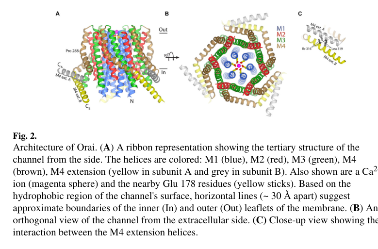

## Question

# Gene Research for Functional Annotation

## ⚠️ CRITICAL: Gene/Protein Identification Context

**BEFORE YOU BEGIN RESEARCH:** You MUST verify you are researching the CORRECT gene/protein. Gene symbols can be ambiguous, especially for less well-characterized genes from non-model organisms.

### Target Gene/Protein Identity (from UniProt):
- **UniProt Accession:** Q9U6B8
- **Protein Description:** RecName: Full=Calcium release-activated calcium channel protein 1 {ECO:0000303|PubMed:16751269, ECO:0000312|FlyBase:FBgn0041585}; AltName: Full=Protein orai {ECO:0000303|PubMed:16751269, ECO:0000312|FlyBase:FBgn0041585};
- **Gene Information:** Name=Orai {ECO:0000303|PubMed:16751269, ECO:0000312|FlyBase:FBgn0041585}; Synonyms=CRACM1 {ECO:0000303|PubMed:16645049}, olf186-F {ECO:0000303|PubMed:16751269}; ORFNames=CG11430 {ECO:0000312|FlyBase:FBgn0041585};
- **Organism (full):** Drosophila melanogaster (Fruit fly).
- **Protein Family:** Belongs to the Orai family. .
- **Key Domains:** CRAC_channel. (IPR012446); Orai_sf. (IPR038350); Orai-1 (PF07856)

### MANDATORY VERIFICATION STEPS:

1. **Check if the gene symbol "Orai" matches the protein description above**
2. **Verify the organism is correct:** Drosophila melanogaster (Fruit fly).
3. **Check if protein family/domains align with what you find in literature**
4. **If you find literature for a DIFFERENT gene with the same or similar symbol, STOP**

### If Gene Symbol is Ambiguous or You Cannot Find Relevant Literature:

**DO NOT PROCEED WITH RESEARCH ON A DIFFERENT GENE.** Instead:
- State clearly: "The gene symbol 'Orai' is ambiguous or literature is limited for this specific protein"
- Explain what you found (e.g., "Found extensive literature on a different gene with the same symbol in a different organism")
- Describe the protein based ONLY on the UniProt information provided above
- Suggest that the protein function can be inferred from domain/family information

### Research Target:

Please provide a comprehensive research report on the gene **Orai** (gene ID: Orai, UniProt: Q9U6B8) in DROME.

The research report should be a detailed narrative explaining the function, biological processes, and localization of the gene product. Citations should be given for all claims.

You should prioritize authoritative reviews and primary scientific literature when conducting research. You can supplement
this with annotations you find in gene/protein databases, but these can be outdated or inaccurate.

We are specifically interested in the primary function of the gene - for enzymes, what reaction is catalyzed, and what is the substrate specificity? For transporters, what is the substrate? For structural proteins or adapters, what is the broader structural role? For signaling molecules, what is the role in the pathway.

We are interested in where in or outside the cell the gene product carries out its function.

We are also interested in the signaling or biochemical pathways in which the gene functions. We are less interested in broad pleiotropic effects, except where these elucidate the precise role.

Include evidence where possible. We are interested in both experimental evidence as well as inference from structure, evolution, or bioinformatic analysis. Precise studies should be prioritized over high-throughput, where available.

## Output

Question: You are an expert researcher providing comprehensive, well-cited information.

Provide detailed information focusing on:
1. Key concepts and definitions with current understanding
2. Recent developments and latest research (prioritize 2023-2024 sources)
3. Current applications and real-world implementations
4. Expert opinions and analysis from authoritative sources
5. Relevant statistics and data from recent studies

Format as a comprehensive research report with proper citations. Include URLs and publication dates where available.
Always prioritize recent, authoritative sources and provide specific citations for all major claims.

# Gene Research for Functional Annotation

## ⚠️ CRITICAL: Gene/Protein Identification Context

**BEFORE YOU BEGIN RESEARCH:** You MUST verify you are researching the CORRECT gene/protein. Gene symbols can be ambiguous, especially for less well-characterized genes from non-model organisms.

### Target Gene/Protein Identity (from UniProt):
- **UniProt Accession:** Q9U6B8
- **Protein Description:** RecName: Full=Calcium release-activated calcium channel protein 1 {ECO:0000303|PubMed:16751269, ECO:0000312|FlyBase:FBgn0041585}; AltName: Full=Protein orai {ECO:0000303|PubMed:16751269, ECO:0000312|FlyBase:FBgn0041585};
- **Gene Information:** Name=Orai {ECO:0000303|PubMed:16751269, ECO:0000312|FlyBase:FBgn0041585}; Synonyms=CRACM1 {ECO:0000303|PubMed:16645049}, olf186-F {ECO:0000303|PubMed:16751269}; ORFNames=CG11430 {ECO:0000312|FlyBase:FBgn0041585};
- **Organism (full):** Drosophila melanogaster (Fruit fly).
- **Protein Family:** Belongs to the Orai family. .
- **Key Domains:** CRAC_channel. (IPR012446); Orai_sf. (IPR038350); Orai-1 (PF07856)

### MANDATORY VERIFICATION STEPS:

1. **Check if the gene symbol "Orai" matches the protein description above**
2. **Verify the organism is correct:** Drosophila melanogaster (Fruit fly).
3. **Check if protein family/domains align with what you find in literature**
4. **If you find literature for a DIFFERENT gene with the same or similar symbol, STOP**

### If Gene Symbol is Ambiguous or You Cannot Find Relevant Literature:

**DO NOT PROCEED WITH RESEARCH ON A DIFFERENT GENE.** Instead:
- State clearly: "The gene symbol 'Orai' is ambiguous or literature is limited for this specific protein"
- Explain what you found (e.g., "Found extensive literature on a different gene with the same symbol in a different organism")
- Describe the protein based ONLY on the UniProt information provided above
- Suggest that the protein function can be inferred from domain/family information

### Research Target:

Please provide a comprehensive research report on the gene **Orai** (gene ID: Orai, UniProt: Q9U6B8) in DROME.

The research report should be a detailed narrative explaining the function, biological processes, and localization of the gene product. Citations should be given for all claims.

You should prioritize authoritative reviews and primary scientific literature when conducting research. You can supplement
this with annotations you find in gene/protein databases, but these can be outdated or inaccurate.

We are specifically interested in the primary function of the gene - for enzymes, what reaction is catalyzed, and what is the substrate specificity? For transporters, what is the substrate? For structural proteins or adapters, what is the broader structural role? For signaling molecules, what is the role in the pathway.

We are interested in where in or outside the cell the gene product carries out its function.

We are also interested in the signaling or biochemical pathways in which the gene functions. We are less interested in broad pleiotropic effects, except where these elucidate the precise role.

Include evidence where possible. We are interested in both experimental evidence as well as inference from structure, evolution, or bioinformatic analysis. Precise studies should be prioritized over high-throughput, where available.

# Functional research report: *Drosophila melanogaster* Orai (UniProt Q9U6B8)

## Identity and principal function

**Identity verified.** The target is the fruit-fly gene **Orai**, previously **olf186-F** and annotated **CG11430**, not human **ORAI1** or its paralogs. Fly-cell genetic experiments identify olf186-F as Orai, and structures determined from *D. melanogaster* protein independently establish that it belongs to the four-transmembrane Orai calcium-release-activated calcium (CRAC) channel family. This agrees with the supplied UniProt accession and CRAC_channel/Orai-family domain annotations. (zhang2006genomewidernaiscreen pages 1-2, hou2012crystalstructureof pages 1-2, hou2012crystalstructureof pages 2-4)

**Primary molecular function:** Orai forms the **calcium-selective, ion-conducting pore** of a channel in the **plasma membrane**. Its principal transported substrate is extracellular **Ca²⁺**, which enters the cytosol when Ca²⁺ stored in the endoplasmic reticulum (ER) is depleted. This is *store-operated calcium entry* (SOCE); the resulting current is termed *I*CRAC. Orai is a channel, **not an enzyme**: it neither catalyzes a chemical reaction nor pumps Ca²⁺ into the ER. Under experimentally divalent-free conditions, activated CRAC channels can also conduct monovalent ions, so “Ca²⁺-selective” describes their normal physiological operating conditions rather than absolute impermeability to other ions. (hou2012crystalstructureof pages 1-2, zhang2006genomewidernaiscreen pages 1-2, hou2012crystalstructureof pages 4-5)

## Localization, activation, and substrate selectivity

Orai performs ion conduction **across the cell-surface membrane**, particularly where that membrane approaches the ER. Its partner **Stim** is the ER Ca²⁺ sensor, not the pore: after ER-luminal Ca²⁺ falls, Stim changes conformation and couples to Orai at ER–plasma-membrane junctions, opening the channel. Receptor-dependent production of inositol 1,4,5-trisphosphate (IP₃) and Ca²⁺ release through the ER-localized IP₃ receptor can initiate this sequence. Incoming Ca²⁺ sustains cytosolic signaling and provides a route for subsequent replenishment of intracellular stores. The assignment of Orai to the plasma membrane is supported by its measured extracellular-Ca²⁺-dependent current and the fly-channel structural work; Stim, rather than Orai, occupies the ER-sensing position in this pathway. (hou2012crystalstructureof pages 1-2, zhang2006genomewidernaiscreen pages 1-2, liu2019molecularunderstandingof pages 1-2, mitra2024oraimediatedcalciumentry pages 1-2)

The strongest fly-specific functional test came from a genome-wide RNA-interference screen in S2 cells: depletion of olf186-F greatly reduced thapsigargin-triggered Ca²⁺ influx and CRAC current. Thapsigargin inhibits the SERCA pump and thereby depletes ER stores. Conversely, Orai overexpression increased CRAC current approximately **threefold**, while coexpression with fly Stim increased it approximately **eightfold** over control and accelerated current development. The resulting current showed native CRAC-like electrophysiological and inhibitor responses. These interventions connect the particular fly gene—not merely an ortholog—to Stim-dependent SOCE. [Zhang *et al.*, **13 June 2006**, *PNAS*, https://doi.org/10.1073/pnas.0603161103.] (zhang2006genomewidernaiscreen pages 4-5, zhang2006genomewidernaiscreen pages 1-2)

Structural evidence explains *what* conducts Ca²⁺. The **3.35-Å** crystal structure of engineered fly Orai revealed a **hexamer**, with one pore-lining M1 helix contributed by each four-pass subunit. Six **Glu178** residues form a ring at the extracellular pore entrance that constitutes the Ca²⁺-selectivity filter; structural experiments detected ion binding at this region and binding of the channel blocker Gd³⁺. This is direct evidence for a Ca²⁺-binding pore, although the crystallized construct was engineered and represents a closed conformation. An independently determined structure of constitutively active fly **Orai-P288L**, complemented by electrophysiology, retained the six-subunit architecture and implicated conformational transmission from peripheral M4 helices toward the M1 pore during opening. Neither engineered structure alone demonstrates every step of physiological Stim gating in an intact fly. [Hou *et al.*, **7 December 2012**, *Science*, https://doi.org/10.1126/science.1228757; Liu *et al.*, **22 April 2019**, *PLOS Biology*, https://doi.org/10.1371/journal.pbio.3000096.] (hou2012crystalstructureof pages 1-2, liu2019molecularunderstandingof pages 1-2, hou2012crystalstructureof media 72fe1983, hou2012crystalstructureof pages 2-4, hou2012crystalstructureof pages 4-5)

## Biological pathways and demonstrated fly physiology

**Neuronal development and dopamine signaling.** In primary fly neurons, a hypomorphic **orai³** allele or the Ca²⁺-impermeable dominant-negative **Orai-E180A** reduced Ca²⁺ entry after pharmacological store depletion. Restricting dominant-negative Orai expression to developing dopaminergic neurons abolished adult flight; reduced expression of **tyrosine hydroxylase** and the **dopamine transporter** connected defective calcium entry to dopamine production and handling. Thus, flight impairment is evidence for a particular developmental signaling function, rather than Orai being a flight-specific motor protein. [Pathak *et al.*, **October 2015**, *Journal of Neuroscience*, https://doi.org/10.1523/JNEUROSCI.1680-15.2015.] (pathak2015storeoperatedcalciumentry pages 4-7, pathak2015storeoperatedcalciumentry pages 3-4, pathak2015storeoperatedcalciumentry pages 1-2)

A more recent mechanistic study localized this requirement to flight-promoting central dopaminergic neurons. Its proposed sequence is **cholinergic input → muscarinic receptor → IP₃ receptor-mediated ER Ca²⁺ release → Stim/Orai SOCE → Trithorax-like (Trl) and Set2-dependent transcription**. Set2 deposits the activating chromatin mark **H3K36me3**; its expression and activity help maintain genes needed for cholinergic responsiveness, neuronal excitability, axonal branching, dopamine release, and sustained flight. Orai-E180A disruption impaired these outcomes, whereas increasing Set2 expression rescued flight and Ca²⁺ responses, providing evidence that this transcriptional program acts downstream of Orai-mediated entry. The authors mapped a requirement to approximately **21–23 dopaminergic neurons**, particularly **72–96 hours after puparium formation** and **0–2 days after adult emergence**; **75%** of genes downregulated after SOCE disruption showed a pupal expression peak. Importantly, the reported carbachol-evoked signal combined ER release and SOCE: the ex-vivo preparation did not permit independent measurement of those components without extracellular Ca²⁺. [Mitra *et al.*, **version of record 30 January 2024**, *eLife*, https://doi.org/10.7554/eLife.88808.] (mitra2024oraimediatedcalciumentry pages 1-2, mitra2024oraimediatedcalciumentry pages 2-4, mitra2024oraimediatedcalciumentry pages 7-9)

**Intestinal calcium and lipid handling.** In fly enterocytes, experimental overexpression of Orai or Stim increased cytosolic Ca²⁺ and reduced intestinal and whole-body neutral-lipid accumulation; the increased-Ca²⁺ conditions also reduced expression of the lipase **Magro**. This extends the contexts in which Orai-mediated calcium entry can influence physiology. It does **not**, however, establish that Orai is specifically required for the paper’s beneficial **tyramine** response or its systemic insulin-resistance outcome: the directly tested upstream tyramine mechanism centers on TyrR1/Gαq/PLCβ/IP₃-receptor signaling, and the retrieved Orai-specific results are gain-of-function observations. [Ma *et al.*, **July 2024**, *EMBO Journal*, https://doi.org/10.1038/s44318-024-00162-w.] (ma2024gutmicrobiotametabolite pages 5-8, ma2024gutmicrobiotametabolite pages 11-13, ma2024gutmicrobiotametabolite pages 20-24)

**Epidermal mechanosensory signaling.** Subsequent fly-specific experiments found that mechanical stretch evokes intracellular-store Ca²⁺ release followed by extracellular Ca²⁺ entry in larval epidermal cells. Epidermis-targeted **Orai RNAi** reduced the proportion of stretch-responsive cells from **48% to 24%**; **Stim RNAi** reduced it to **22%**. Orai depletion also impaired prolonged mechanically evoked nociceptive sensitization while sparing the initial response to the mechanical stimulus. These findings implicate epidermal Stim–Orai SOCE in calcium-dependent communication with sensory neurons; they do **not** show that Orai itself is the primary mechanically force-gated sensor. [Yoshino *et al.*, **2025**, *eLife*; accessible manuscript DOI https://doi.org/10.1101/2022.10.07.511265.] (yoshino2025drosophilaepidermalcells pages 11-14, yoshino2025drosophilaepidermalcells pages 8-11)

The following comparison distinguishes direct fly-channel evidence from narrower or downstream phenotypes. (zhang2006genomewidernaiscreen pages 4-5, mitra2024oraimediatedcalciumentry pages 7-9, yoshino2025drosophilaepidermalcells pages 11-14)

| Study | Tissue/system and intervention | Orai-specific mechanistic observation | Quantitative datum | Inference and caveat |
|---|---|---|---|---|
| [Zhang et al., 2006](https://doi.org/10.1073/pnas.0603161103) | *Drosophila* S2 cells; genome-wide RNAi, Orai/olf186-F knockdown or overexpression, and Orai plus Stim coexpression | Orai knockdown profoundly reduced thapsigargin-evoked Ca²⁺ entry and CRAC current; Orai plus Stim generated an accelerated CRAC-like current after store depletion. | Orai overexpression increased current about **3-fold**; Orai plus Stim increased it about **8-fold** over control. | Direct genetic and electrophysiological evidence that fly Orai is required for SOCE and forms its STIM-regulated channel component; this is cultured-cell rather than intact-animal evidence. (zhang2006genomewidernaiscreen pages 4-5, zhang2006genomewidernaiscreen pages 1-2) |
| [Hou et al., 2012](https://doi.org/10.1126/science.1228757) | Purified, engineered *D. melanogaster* Orai; X-ray crystallography, crosslinking, light scattering, and liposome reconstitution | Six four-transmembrane subunits surround an M1-lined central pore; six E178 residues form the extracellular glutamate selectivity ring and bind Ca²⁺, Ba²⁺, and blocking Gd³⁺. | Closed-state structure at **3.35 Å**; hexameric assembly; pore approximately **55 Å** long; E178 oxygens approximately **6.5 Å** apart. | Strong direct structural evidence for pore architecture and Ca²⁺ selection, but the crystallized construct was truncated and engineered and represents a closed conformation. (hou2012crystalstructureof pages 1-2, hou2012crystalstructureof pages 2-4, hou2012crystalstructureof pages 4-5) |
| [Pathak et al., 2015](https://doi.org/10.1523/JNEUROSCI.1680-15.2015) | Primary fly neurons and intact flies; hypomorphic **orai³**, neuronal RNAi, and Ca²⁺-impermeable dominant-negative **Orai-E180A**, including dopaminergic-neuron targeting | Loss of Orai reduced extracellular-Ca²⁺-dependent SOCE after thapsigargin; pupal dopaminergic Orai activity was required for flight-circuit maturation and expression of tyrosine hydroxylase and dopamine transporter. | Primary-neuron imaging used about **100 neurons per genotype**; targeted assays used **30 cells**; flight assays used **30 flies per genotype**; electrophysiological rescue used **15 flies**. | Direct cellular and organismal evidence; neuronal Orai expression only partially rescued some mutant phenotypes, so not every effect is proven cell-autonomous. (pathak2015storeoperatedcalciumentry pages 4-7, pathak2015storeoperatedcalciumentry pages 3-4, pathak2015storeoperatedcalciumentry pages 1-2) |
| [Mitra et al., 2024](https://doi.org/10.7554/eLife.88808) | Flight-promoting central dopaminergic neurons; Orai-E180A, FACS and RNA-seq, Ca²⁺ imaging, developmental restriction, and genetic or pharmacological rescue | Orai-dependent SOCE supports a Trl–Set2–H3K36me3 transcriptional program and feedback that maintains cholinergic responsiveness, neuronal excitability, axonal arborization, dopamine release, and sustained flight. | Requirement mapped to **21–23 neurons**, especially **72–96 h after puparium formation** and **0–2 days after eclosion**; **75%** of downregulated genes had a pupal expression peak; GSK343 rescue produced bouts up to **400 s**. | Strong mechanistic in-vivo evidence; Set2 and chromatin interventions rescued downstream phenotypes without restoring the mutant Orai pore, and ex-vivo viability prevented separate measurement of ER release and SOCE. (mitra2024oraimediatedcalciumentry pages 2-4, mitra2024oraimediatedcalciumentry pages 7-9) |
| [Ma et al., 2024](https://doi.org/10.1038/s44318-024-00162-w) | Adult enterocytes; Orai or Stim overexpression within a high-fat-diet and tyramine Ca²⁺-metabolism study | Orai overexpression increased enterocyte cytosolic Ca²⁺ and was sufficient to reduce intestinal and whole-body neutral-lipid accumulation, consistent with SOCE influencing lipid metabolism. | Significant Ca²⁺ elevation and lipid reduction were reported, but no Orai-specific numerical effect size is available in the cited evidence. | Supportive gain-of-function evidence only; the study did not directly show that Orai loss blocks tyramine-induced Ca²⁺, CRTC–CREB signaling, or improvement of systemic insulin resistance. (ma2024gutmicrobiotametabolite pages 5-8, ma2024gutmicrobiotametabolite pages 11-13, ma2024gutmicrobiotametabolite pages 20-24) |
| [Yoshino et al., 2025](https://doi.org/10.1101/2022.10.07.511265) | Larval epidermal cells; radial stretch, extracellular-Ca²⁺ removal and readdition, thapsigargin, lanthanum, and epidermis-specific Orai or Stim RNAi | Mechanical stretch releases stored Ca²⁺ and recruits Orai/STIM-dependent extracellular Ca²⁺ entry; epidermal Orai supports vesicular signaling to nociceptors and prolonged mechanical sensitization. | Stretch-responsive cells fell from **48%** in controls to **24%** after Orai RNAi; Stim RNAi yielded **22%**. | Direct tissue-specific evidence; Orai knockdown impaired sensitization but not the initial acute response, supporting Orai as a SOCE effector rather than necessarily the primary force-gated sensor. (yoshino2025drosophilaepidermalcells pages 11-14, yoshino2025drosophilaepidermalcells pages 8-11) |

*Table: Primary evidence linking Drosophila Orai/Q9U6B8 to CRAC-channel structure, store-operated Ca²⁺ entry, and tissue-specific physiology. Caveats distinguish direct loss-of-function findings from structural inference and gain-of-function associations.*

## Functional-annotation assessment

The **high-confidence annotation** for Q9U6B8 is *plasma-membrane, Stim-regulated, Ca²⁺-selective CRAC-channel pore subunit involved in ER-store-depletion-dependent calcium entry*. Genetic loss of function, Ca²⁺ imaging, patch-clamp measurements, and fly-protein structures converge on this assignment. A **well-supported downstream role** is regulation of developmental gene expression and dopamine-neuron function; enterocyte lipid regulation and epidermal sensory signaling identify additional experimentally examined settings, with the causal qualifications above. Human ORAI1-based disease or gating experiments should **not** be described as experiments on this fly gene: for example, a **2024** study of water-mediated pore opening examines **Orai1** variants and uses fly Orai structures principally as context. [Hopl *et al.*, **November 2024**, *Communications Biology*, https://doi.org/10.1038/s42003-024-07174-6.] (zhang2006genomewidernaiscreen pages 4-5, hou2012crystalstructureof pages 1-2, hopl2024waterinperipheral pages 1-2, pathak2015storeoperatedcalciumentry pages 4-7)

References

1. (zhang2006genomewidernaiscreen pages 1-2): Shenyuan L. Zhang, Andriy V. Yeromin, Xiang H.-F. Zhang, Ying Yu, Olga Safrina, Aubin Penna, Jack Roos, Kenneth A. Stauderman, and Michael D. Cahalan. Genome-wide rnai screen of ca(2+) influx identifies genes that regulate ca(2+) release-activated ca(2+) channel activity. Proceedings of the National Academy of Sciences of the United States of America, 103 24:9357-62, Jun 2006. URL: https://doi.org/10.1073/pnas.0603161103, doi:10.1073/pnas.0603161103. This article has 1161 citations and is from a highest quality peer-reviewed journal.

2. (hou2012crystalstructureof pages 1-2): Xiaowei Hou, Leanne Pedi, Melinda M. Diver, and Stephen B. Long. Crystal structure of the calcium release–activated calcium channel orai. Science, 338:1308-1313, Dec 2012. URL: https://doi.org/10.1126/science.1228757, doi:10.1126/science.1228757. This article has 758 citations and is from a highest quality peer-reviewed journal.

3. (hou2012crystalstructureof pages 2-4): Xiaowei Hou, Leanne Pedi, Melinda M. Diver, and Stephen B. Long. Crystal structure of the calcium release–activated calcium channel orai. Science, 338:1308-1313, Dec 2012. URL: https://doi.org/10.1126/science.1228757, doi:10.1126/science.1228757. This article has 758 citations and is from a highest quality peer-reviewed journal.

4. (hou2012crystalstructureof pages 4-5): Xiaowei Hou, Leanne Pedi, Melinda M. Diver, and Stephen B. Long. Crystal structure of the calcium release–activated calcium channel orai. Science, 338:1308-1313, Dec 2012. URL: https://doi.org/10.1126/science.1228757, doi:10.1126/science.1228757. This article has 758 citations and is from a highest quality peer-reviewed journal.

5. (liu2019molecularunderstandingof pages 1-2): Xiaofen Liu, Guangyan Wu, Yi Yu, Xiaozhen Chen, Renci Ji, Jing Lu, Xin Li, Xing Zhang, Xue Yang, and Yuequan Shen. Molecular understanding of calcium permeation through the open orai channel. PLOS Biology, 17:e3000096, Apr 2019. URL: https://doi.org/10.1371/journal.pbio.3000096, doi:10.1371/journal.pbio.3000096. This article has 80 citations and is from a highest quality peer-reviewed journal.

6. (mitra2024oraimediatedcalciumentry pages 1-2): Rishav Mitra, Shlesha Richhariya, and Gaiti Hasan. Orai-mediated calcium entry determines activity of central dopaminergic neurons by regulation of gene expression. eLife, Jan 2024. URL: https://doi.org/10.7554/elife.88808, doi:10.7554/elife.88808. This article has 7 citations and is from a domain leading peer-reviewed journal.

7. (zhang2006genomewidernaiscreen pages 4-5): Shenyuan L. Zhang, Andriy V. Yeromin, Xiang H.-F. Zhang, Ying Yu, Olga Safrina, Aubin Penna, Jack Roos, Kenneth A. Stauderman, and Michael D. Cahalan. Genome-wide rnai screen of ca(2+) influx identifies genes that regulate ca(2+) release-activated ca(2+) channel activity. Proceedings of the National Academy of Sciences of the United States of America, 103 24:9357-62, Jun 2006. URL: https://doi.org/10.1073/pnas.0603161103, doi:10.1073/pnas.0603161103. This article has 1161 citations and is from a highest quality peer-reviewed journal.

8. (hou2012crystalstructureof media 72fe1983): Xiaowei Hou, Leanne Pedi, Melinda M. Diver, and Stephen B. Long. Crystal structure of the calcium release–activated calcium channel orai. Science, 338:1308-1313, Dec 2012. URL: https://doi.org/10.1126/science.1228757, doi:10.1126/science.1228757. This article has 758 citations and is from a highest quality peer-reviewed journal.

9. (pathak2015storeoperatedcalciumentry pages 4-7): Trayambak Pathak, Tarjani Agrawal, Shlesha Richhariya, Sufia Sadaf, and Gaiti Hasan. Store-operated calcium entry through orai is required for transcriptional maturation of the flight circuit in drosophila. The Journal of Neuroscience, 35:13784-13799, Oct 2015. URL: https://doi.org/10.1523/jneurosci.1680-15.2015, doi:10.1523/jneurosci.1680-15.2015. This article has 72 citations.

10. (pathak2015storeoperatedcalciumentry pages 3-4): Trayambak Pathak, Tarjani Agrawal, Shlesha Richhariya, Sufia Sadaf, and Gaiti Hasan. Store-operated calcium entry through orai is required for transcriptional maturation of the flight circuit in drosophila. The Journal of Neuroscience, 35:13784-13799, Oct 2015. URL: https://doi.org/10.1523/jneurosci.1680-15.2015, doi:10.1523/jneurosci.1680-15.2015. This article has 72 citations.

11. (pathak2015storeoperatedcalciumentry pages 1-2): Trayambak Pathak, Tarjani Agrawal, Shlesha Richhariya, Sufia Sadaf, and Gaiti Hasan. Store-operated calcium entry through orai is required for transcriptional maturation of the flight circuit in drosophila. The Journal of Neuroscience, 35:13784-13799, Oct 2015. URL: https://doi.org/10.1523/jneurosci.1680-15.2015, doi:10.1523/jneurosci.1680-15.2015. This article has 72 citations.

12. (mitra2024oraimediatedcalciumentry pages 2-4): Rishav Mitra, Shlesha Richhariya, and Gaiti Hasan. Orai-mediated calcium entry determines activity of central dopaminergic neurons by regulation of gene expression. eLife, Jan 2024. URL: https://doi.org/10.7554/elife.88808, doi:10.7554/elife.88808. This article has 7 citations and is from a domain leading peer-reviewed journal.

13. (mitra2024oraimediatedcalciumentry pages 7-9): Rishav Mitra, Shlesha Richhariya, and Gaiti Hasan. Orai-mediated calcium entry determines activity of central dopaminergic neurons by regulation of gene expression. eLife, Jan 2024. URL: https://doi.org/10.7554/elife.88808, doi:10.7554/elife.88808. This article has 7 citations and is from a domain leading peer-reviewed journal.

14. (ma2024gutmicrobiotametabolite pages 5-8): Peng Ma, Yao Zhang, Youjie Yin, Saifei Wang, Shuxin Chen, Xueping Liang, Zhifang Li, and Hansong Deng. Gut microbiota metabolite tyramine ameliorates high-fat diet-induced insulin resistance via increased ca2+ signaling. The EMBO Journal, 43:3466-3493, Jul 2024. URL: https://doi.org/10.1038/s44318-024-00162-w, doi:10.1038/s44318-024-00162-w. This article has 30 citations.

15. (ma2024gutmicrobiotametabolite pages 11-13): Peng Ma, Yao Zhang, Youjie Yin, Saifei Wang, Shuxin Chen, Xueping Liang, Zhifang Li, and Hansong Deng. Gut microbiota metabolite tyramine ameliorates high-fat diet-induced insulin resistance via increased ca2+ signaling. The EMBO Journal, 43:3466-3493, Jul 2024. URL: https://doi.org/10.1038/s44318-024-00162-w, doi:10.1038/s44318-024-00162-w. This article has 30 citations.

16. (ma2024gutmicrobiotametabolite pages 20-24): Peng Ma, Yao Zhang, Youjie Yin, Saifei Wang, Shuxin Chen, Xueping Liang, Zhifang Li, and Hansong Deng. Gut microbiota metabolite tyramine ameliorates high-fat diet-induced insulin resistance via increased ca2+ signaling. The EMBO Journal, 43:3466-3493, Jul 2024. URL: https://doi.org/10.1038/s44318-024-00162-w, doi:10.1038/s44318-024-00162-w. This article has 30 citations.

17. (yoshino2025drosophilaepidermalcells pages 11-14): Jiro Yoshino, Sonali S. Mali, Claire R. Williams, Takeshi Morita, Chloe E. Emerson, Christopher J. Arp, Sophie E. Miller, Chang Yin, Lydia Thé, Chikayo Hemmi, Mana Motoyoshi, Kenichi Ishii, Kazuo Emoto, Diana M. Bautista, and Jay Z. Parrish. Drosophila epidermal cells are intrinsically mechanosensitive and modulate nociceptive behavioral outputs. eLife, Jan 2025. URL: https://doi.org/10.1101/2022.10.07.511265, doi:10.1101/2022.10.07.511265. This article has 12 citations and is from a domain leading peer-reviewed journal.

18. (yoshino2025drosophilaepidermalcells pages 8-11): Jiro Yoshino, Sonali S. Mali, Claire R. Williams, Takeshi Morita, Chloe E. Emerson, Christopher J. Arp, Sophie E. Miller, Chang Yin, Lydia Thé, Chikayo Hemmi, Mana Motoyoshi, Kenichi Ishii, Kazuo Emoto, Diana M. Bautista, and Jay Z. Parrish. Drosophila epidermal cells are intrinsically mechanosensitive and modulate nociceptive behavioral outputs. eLife, Jan 2025. URL: https://doi.org/10.1101/2022.10.07.511265, doi:10.1101/2022.10.07.511265. This article has 12 citations and is from a domain leading peer-reviewed journal.

19. (hopl2024waterinperipheral pages 1-2): Valentina Hopl, Adéla Tiffner, Armin Wutscher, Matthias Sallinger, Herwig Grabmayr, Magdalena Prantl, Maximilian Fröhlich, Julia Söllner, Sarah Weiß, Hadil Najjar, Yuliia Nazarenko, Selina Harant, Natalia Kriško, Marc Fahrner, Christina Humer, Carmen Höglinger, Heinrich Krobath, Daniel Bonhenry, and Isabella Derler. Water in peripheral tm-interfaces of orai1-channels triggers pore opening. Communications Biology, Nov 2024. URL: https://doi.org/10.1038/s42003-024-07174-6, doi:10.1038/s42003-024-07174-6. This article has 6 citations and is from a peer-reviewed journal.

## Artifacts

- [Edison artifact artifact-00](Orai-deep-research-falcon_artifacts/artifact-00.md)

## Citations

1. zhang2006genomewidernaiscreen pages 1-2
2. hou2012crystalstructureof pages 1-2
3. hou2012crystalstructureof pages 2-4
4. hou2012crystalstructureof pages 4-5
5. liu2019molecularunderstandingof pages 1-2
6. mitra2024oraimediatedcalciumentry pages 1-2
7. zhang2006genomewidernaiscreen pages 4-5
8. pathak2015storeoperatedcalciumentry pages 4-7
9. pathak2015storeoperatedcalciumentry pages 3-4
10. pathak2015storeoperatedcalciumentry pages 1-2
11. mitra2024oraimediatedcalciumentry pages 2-4
12. mitra2024oraimediatedcalciumentry pages 7-9
13. ma2024gutmicrobiotametabolite pages 5-8
14. ma2024gutmicrobiotametabolite pages 11-13
15. ma2024gutmicrobiotametabolite pages 20-24
16. yoshino2025drosophilaepidermalcells pages 11-14
17. yoshino2025drosophilaepidermalcells pages 8-11
18. hopl2024waterinperipheral pages 1-2
19. Zhang *et al.*, **13 June 2006**, *PNAS*, https://doi.org/10.1073/pnas.0603161103.
20. Hou *et al.*, **7 December 2012**, *Science*, https://doi.org/10.1126/science.1228757; Liu *et al.*, **22 April 2019**, *PLOS Biology*, https://doi.org/10.1371/journal.pbio.3000096.
21. Pathak *et al.*, **October 2015**, *Journal of Neuroscience*, https://doi.org/10.1523/JNEUROSCI.1680-15.2015.
22. Mitra *et al.*, **version of record 30 January 2024**, *eLife*, https://doi.org/10.7554/eLife.88808.
23. Ma *et al.*, **July 2024**, *EMBO Journal*, https://doi.org/10.1038/s44318-024-00162-w.
24. Yoshino *et al.*, **2025**, *eLife*; accessible manuscript DOI https://doi.org/10.1101/2022.10.07.511265.
25. Zhang et al., 2006
26. Hou et al., 2012
27. Pathak et al., 2015
28. Mitra et al., 2024
29. Ma et al., 2024
30. Yoshino et al., 2025
31. Hopl *et al.*, **November 2024**, *Communications Biology*, https://doi.org/10.1038/s42003-024-07174-6.
32. https://doi.org/10.1073/pnas.0603161103.]
33. https://doi.org/10.1126/science.1228757;
34. https://doi.org/10.1371/journal.pbio.3000096.]
35. https://doi.org/10.1523/JNEUROSCI.1680-15.2015.]
36. https://doi.org/10.7554/eLife.88808.]
37. https://doi.org/10.1038/s44318-024-00162-w.]
38. https://doi.org/10.1101/2022.10.07.511265.]
39. https://doi.org/10.1073/pnas.0603161103
40. https://doi.org/10.1126/science.1228757
41. https://doi.org/10.1523/JNEUROSCI.1680-15.2015
42. https://doi.org/10.7554/eLife.88808
43. https://doi.org/10.1038/s44318-024-00162-w
44. https://doi.org/10.1101/2022.10.07.511265
45. https://doi.org/10.1038/s42003-024-07174-6.]
46. https://doi.org/10.1073/pnas.0603161103,
47. https://doi.org/10.1126/science.1228757,
48. https://doi.org/10.1371/journal.pbio.3000096,
49. https://doi.org/10.7554/elife.88808,
50. https://doi.org/10.1523/jneurosci.1680-15.2015,
51. https://doi.org/10.1038/s44318-024-00162-w,
52. https://doi.org/10.1101/2022.10.07.511265,
53. https://doi.org/10.1038/s42003-024-07174-6,