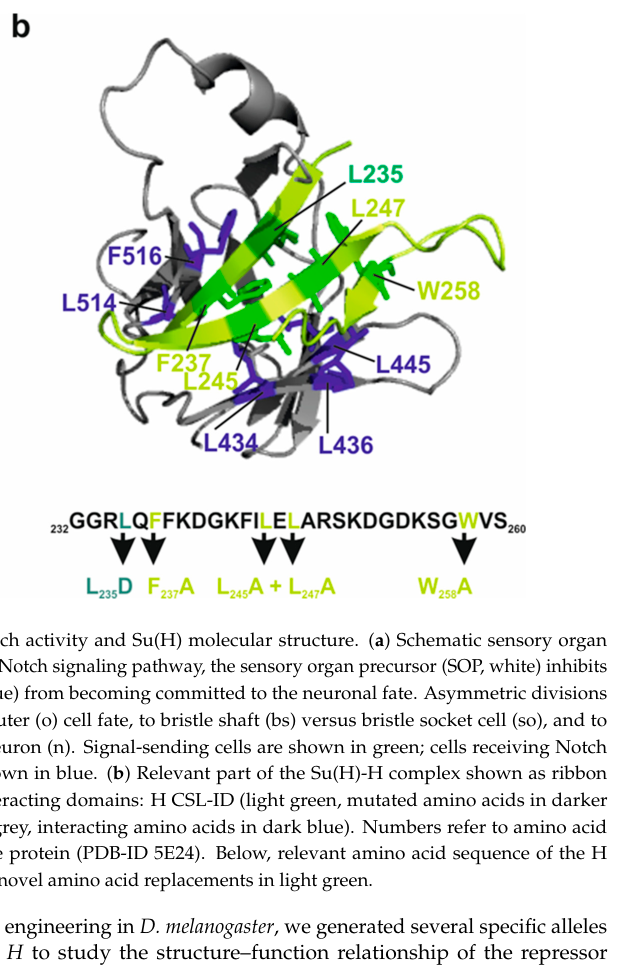
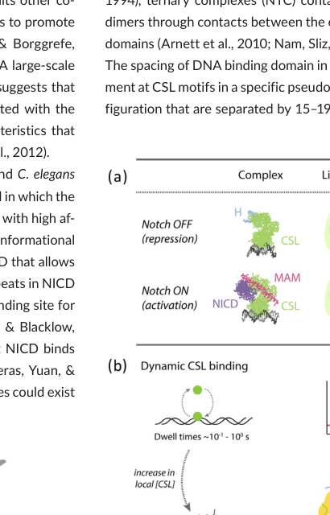

## Question

# Gene Research for Functional Annotation

## ⚠️ CRITICAL: Gene/Protein Identification Context

**BEFORE YOU BEGIN RESEARCH:** You MUST verify you are researching the CORRECT gene/protein. Gene symbols can be ambiguous, especially for less well-characterized genes from non-model organisms.

### Target Gene/Protein Identity (from UniProt):
- **UniProt Accession:** P28159
- **Protein Description:** RecName: Full=Suppressor of hairless protein; AltName: Full=J kappa-recombination signal-binding protein; AltName: Full=RBP-J kappa;
- **Gene Information:** Name=Su(H); Synonyms=dRBP-JK; ORFNames=CG3497;
- **Organism (full):** Drosophila melanogaster (Fruit fly).
- **Protein Family:** Belongs to the Su(H) family. .
- **Key Domains:** Beta-trefoil_DNA-bd_dom. (IPR015350); BTD_sf. (IPR036358); CLS_fam. (IPR040159); Ig-like_fold. (IPR013783); Ig_E-set. (IPR014756)

### MANDATORY VERIFICATION STEPS:

1. **Check if the gene symbol "Su(H)" matches the protein description above**
2. **Verify the organism is correct:** Drosophila melanogaster (Fruit fly).
3. **Check if protein family/domains align with what you find in literature**
4. **If you find literature for a DIFFERENT gene with the same or similar symbol, STOP**

### If Gene Symbol is Ambiguous or You Cannot Find Relevant Literature:

**DO NOT PROCEED WITH RESEARCH ON A DIFFERENT GENE.** Instead:
- State clearly: "The gene symbol 'Su(H)' is ambiguous or literature is limited for this specific protein"
- Explain what you found (e.g., "Found extensive literature on a different gene with the same symbol in a different organism")
- Describe the protein based ONLY on the UniProt information provided above
- Suggest that the protein function can be inferred from domain/family information

### Research Target:

Please provide a comprehensive research report on the gene **Su(H)** (gene ID: P28159, UniProt: P28159) in DROME.

The research report should be a detailed narrative explaining the function, biological processes, and localization of the gene product. Citations should be given for all claims.

You should prioritize authoritative reviews and primary scientific literature when conducting research. You can supplement
this with annotations you find in gene/protein databases, but these can be outdated or inaccurate.

We are specifically interested in the primary function of the gene - for enzymes, what reaction is catalyzed, and what is the substrate specificity? For transporters, what is the substrate? For structural proteins or adapters, what is the broader structural role? For signaling molecules, what is the role in the pathway.

We are interested in where in or outside the cell the gene product carries out its function.

We are also interested in the signaling or biochemical pathways in which the gene functions. We are less interested in broad pleiotropic effects, except where these elucidate the precise role.

Include evidence where possible. We are interested in both experimental evidence as well as inference from structure, evolution, or bioinformatic analysis. Precise studies should be prioritized over high-throughput, where available.

## Output

Question: You are an expert researcher providing comprehensive, well-cited information.

Provide detailed information focusing on:
1. Key concepts and definitions with current understanding
2. Recent developments and latest research (prioritize 2023-2024 sources)
3. Current applications and real-world implementations
4. Expert opinions and analysis from authoritative sources
5. Relevant statistics and data from recent studies

Format as a comprehensive research report with proper citations. Include URLs and publication dates where available.
Always prioritize recent, authoritative sources and provide specific citations for all major claims.

# Gene Research for Functional Annotation

## ⚠️ CRITICAL: Gene/Protein Identification Context

**BEFORE YOU BEGIN RESEARCH:** You MUST verify you are researching the CORRECT gene/protein. Gene symbols can be ambiguous, especially for less well-characterized genes from non-model organisms.

### Target Gene/Protein Identity (from UniProt):
- **UniProt Accession:** P28159
- **Protein Description:** RecName: Full=Suppressor of hairless protein; AltName: Full=J kappa-recombination signal-binding protein; AltName: Full=RBP-J kappa;
- **Gene Information:** Name=Su(H); Synonyms=dRBP-JK; ORFNames=CG3497;
- **Organism (full):** Drosophila melanogaster (Fruit fly).
- **Protein Family:** Belongs to the Su(H) family. .
- **Key Domains:** Beta-trefoil_DNA-bd_dom. (IPR015350); BTD_sf. (IPR036358); CLS_fam. (IPR040159); Ig-like_fold. (IPR013783); Ig_E-set. (IPR014756)

### MANDATORY VERIFICATION STEPS:

1. **Check if the gene symbol "Su(H)" matches the protein description above**
2. **Verify the organism is correct:** Drosophila melanogaster (Fruit fly).
3. **Check if protein family/domains align with what you find in literature**
4. **If you find literature for a DIFFERENT gene with the same or similar symbol, STOP**

### If Gene Symbol is Ambiguous or You Cannot Find Relevant Literature:

**DO NOT PROCEED WITH RESEARCH ON A DIFFERENT GENE.** Instead:
- State clearly: "The gene symbol 'Su(H)' is ambiguous or literature is limited for this specific protein"
- Explain what you found (e.g., "Found extensive literature on a different gene with the same symbol in a different organism")
- Describe the protein based ONLY on the UniProt information provided above
- Suggest that the protein function can be inferred from domain/family information

### Research Target:

Please provide a comprehensive research report on the gene **Su(H)** (gene ID: P28159, UniProt: P28159) in DROME.

The research report should be a detailed narrative explaining the function, biological processes, and localization of the gene product. Citations should be given for all claims.

You should prioritize authoritative reviews and primary scientific literature when conducting research. You can supplement
this with annotations you find in gene/protein databases, but these can be outdated or inaccurate.

We are specifically interested in the primary function of the gene - for enzymes, what reaction is catalyzed, and what is the substrate specificity? For transporters, what is the substrate? For structural proteins or adapters, what is the broader structural role? For signaling molecules, what is the role in the pathway.

We are interested in where in or outside the cell the gene product carries out its function.

We are also interested in the signaling or biochemical pathways in which the gene functions. We are less interested in broad pleiotropic effects, except where these elucidate the precise role.

Include evidence where possible. We are interested in both experimental evidence as well as inference from structure, evolution, or bioinformatic analysis. Precise studies should be prioritized over high-throughput, where available.

# Comprehensive Research Report: Suppressor of Hairless [Su(H)] Gene in Drosophila melanogaster

## Gene Identity Verification

The research target has been correctly identified as **Suppressor of Hairless [Su(H)]** (UniProt: P28159, gene symbol: Su(H), also known as dRBP-JK, CG3497) from *Drosophila melanogaster*. Su(H) is the *Drosophila* homolog of the mammalian RBPJ/CBF1 and *C. elegans* LAG-1 proteins, collectively termed CSL (CBF1/RBP-Jκ/Su(H)/LAG-1) transcription factors (lv2024evolutionandfunction pages 2-4, falo‐sanjuan2020decodingthenotch pages 1-2). The protein belongs to the Su(H) family and contains characteristic beta-trefoil DNA-binding, immunoglobulin-like fold, and CSL family domains, consistent with the UniProt annotation (monch2024novelgenomeengineeredh pages 2-4).

## Primary Molecular Function

### DNA-Binding Transcriptional Regulator

Su(H) functions as a **sequence-specific DNA-binding transcription factor** and serves as the central nuclear effector of canonical Notch signaling in *Drosophila* (lv2024evolutionandfunction pages 2-4, falo‐sanjuan2020decodingthenotch pages 1-2, falo‐sanjuan2020decodingthenotch media 63a004ce). Unlike enzymes that catalyze chemical reactions, Su(H) does not possess catalytic activity or utilize small-molecule substrates. Instead, its primary molecular function is to recognize specific DNA regulatory sequences and orchestrate transcriptional responses by recruiting either corepressor or coactivator protein complexes (monch2024novelgenomeengineeredh pages 2-4, monch2024novelgenomeengineeredh pages 22-24).

### DNA Sequence Recognition and Substrate Specificity

Su(H) binds to conserved **CSL response elements** within enhancers and promoters of Notch target genes. The validated consensus DNA-binding sequence in *Drosophila* is **5′-CGTGGGAA-3′**, with broader variants represented as C/TGTGGGAA or a core GTGGGA motif (lv2024evolutionandfunction pages 2-4, kuang2021enhancerswithcooperative pages 3-5, maicas2021thetranscriptionfactor pages 2-4). These CSL-binding sites can occur as isolated monomeric elements or as paired Su(H) sites (SPSs) with specific head-to-head orientations and spacing. Importantly, properly configured SPSs support **cooperative binding** by the Notch activation complex (NICD-Su(H)-Mastermind), whereas Su(H) alone or Su(H)-Hairless repressor complexes bind these sites in a largely additive, non-cooperative manner (kuang2021enhancerswithcooperative pages 3-5). This architectural feature allows enhancers with SPSs to preferentially recruit activating complexes and resist repression, thereby ensuring consistent target-gene activation.

### Protein Structure and Functional Domains

Su(H) contains **three highly conserved structural domains** that mediate its dual functions in DNA recognition and cofactor recruitment (monch2024novelgenomeengineeredh pages 2-4, sun2021hp1cregulatesdevelopment pages 7-9):

1. **N-terminal domain (NTD)**: Participates in DNA binding
2. **β-trefoil domain (BTD)**: Functions in both DNA binding and protein-protein interactions; serves as the binding interface for corepressors such as HP1c (sun2021hp1cregulatesdevelopment pages 10-11, sun2021hp1cregulatesdevelopment pages 7-9)
3. **C-terminal domain (CTD)**: Mediates interactions with regulatory cofactors, particularly Hairless and NICD

The **NTD and BTD together constitute the DNA-binding interface**, allowing Su(H) to anchor at Notch-responsive regulatory elements (monch2024novelgenomeengineeredh pages 2-4). The **BTD and CTD provide interaction surfaces** for NICD during assembly of the activation complex and for Hairless during formation of the repressor complex (monch2024novelgenomeengineeredh pages 2-4, monch2024novelgenomeengineeredh media e9f93e3f).

Structural studies reveal that **Hairless binds the Su(H) CTD** through a hydrophobic β-hairpin interaction involving specific Su(H) residues including L434, L436, and L514 (monch2024novelgenomeengineeredh pages 2-4, monch2024novelgenomeengineeredh media e9f93e3f). This high-affinity binding induces a conformational change in Su(H) that prevents NICD association, making the activator and repressor complexes **mutually exclusive** rather than simply competitive for the same binding site (monch2024novelgenomeengineeredh pages 2-4, frankenreiter2021phosphositemutationsin pages 1-2).

## Subcellular Localization

Su(H) is **primarily localized in the nucleus**, where it carries out its transcriptional regulatory functions (monch2024novelgenomeengineeredh pages 2-4, monch2024novelgenomeengineeredh pages 1-2, fenelon2024notchhairlesspathwaymodulation pages 1-3). Nuclear localization is essential for Su(H) to access its DNA-binding sites at Notch-responsive enhancers and promoters. The nuclear accumulation, import, or retention of Su(H) can be promoted through complex formation with either NICD or the corepressor Hairless (monch2024novelgenomeengineeredh pages 2-4). Mutations affecting Hairless nuclear localization and export alter nuclear Su(H) levels, demonstrating that cofactor-dependent nuclear shuttling contributes to Su(H) function (monch2024novelgenomeengineeredh pages 2-4). Importantly, phospho-site mutations (S269A and S269D) do not alter Su(H) protein abundance or subcellular distribution, indicating that normal Su(H) localization is preserved across these regulatory variants (frankenreiter2021phosphositemutationsin pages 2-3, frankenreiter2021phosphositemutationsin pages 3-4).

## Role in Notch Signaling Pathway

### Molecular Switch Mechanism

Su(H) functions as a **context-dependent transcriptional switch** at the core of the canonical Notch signaling pathway (lv2024evolutionandfunction pages 2-4, falo‐sanjuan2020decodingthenotch pages 1-2, monch2024novelgenomeengineeredh pages 2-4, falo‐sanjuan2020decodingthenotch media 63a004ce). The switch operates through mutually exclusive assembly of repressor versus activator complexes on DNA:

**Notch-OFF State (Repression):**
In the absence of Notch receptor activation, Su(H) occupies target-gene regulatory DNA and recruits transcriptional repressor complexes (sun2021hp1cregulatesdevelopment pages 10-11, giaimo2021transcriptionfactorrbpj pages 5-8, falo‐sanjuan2020decodingthenotch pages 1-2). The principal corepressor in *Drosophila* is **Hairless (H)**, which binds Su(H)'s CTD and serves as an adaptor to recruit additional corepressors including **Groucho (Gro)** and **C-terminal binding protein (CtBP)** (monch2024novelgenomeengineeredh pages 15-16, monch2024novelgenomeengineeredh pages 2-4, falo‐sanjuan2020decodingthenotch pages 11-11). This repressor assembly maintains Notch-responsive genes in a silenced or poised state (giaimo2021transcriptionfactorrbpj pages 5-8, falo‐sanjuan2020decodingthenotch pages 1-2).

Additional Su(H)-interacting corepressors have been identified:
- **HP1c**: Directly binds Su(H)'s BTD domain through its chromoshadow domain (CSD), contributing to repression of Notch targets and regulation of gut homeostasis (sun2021hp1cregulatesdevelopment pages 10-11, sun2021hp1cregulatesdevelopment pages 7-9)
- In mammalian systems, corepressors include **SHARP** (which recruits HDAC-containing NCoR complexes), **L3MBTL3** (which recruits KDM1A/LSD1), and **KyoT2/FHL1C**, suggesting conserved repression mechanisms (giaimo2021transcriptionfactorrbpj pages 5-8, lv2024evolutionandfunction pages 2-4, giaimo2021transcriptionfactorrbpj pages 3-5)

**Notch-ON State (Activation):**
Following ligand-induced Notch receptor cleavage by γ-secretase, the **Notch intracellular domain (NICD)** is released, translocates to the nucleus, and binds Su(H) (monch2024novelgenomeengineeredh pages 2-4, lv2024evolutionandfunction pages 2-4, monch2024novelgenomeengineeredh pages 1-2, pinot2024spatiotemporalregulationof pages 2-4). NICD binding, together with recruitment of the coactivator **Mastermind (Mam)**, forms a ternary transcriptional activation complex (lv2024evolutionandfunction pages 2-4, falo‐sanjuan2020decodingthenotch pages 1-2). This NICD-Su(H)-Mam complex displaces or prevents association of repressors, recruits additional coactivators and chromatin-modifying enzymes (including histone acetyltransferases), and activates transcription of Notch target genes such as the *Enhancer of split* [E(spl)] complex and *Hey* (lv2024evolutionandfunction pages 2-4, falo‐sanjuan2020decodingthenotch pages 1-2).

### Dynamic Chromatin Binding and Transcriptional Bursting

Su(H) chromatin occupancy is **dynamic rather than constitutive** (frankenreiter2021phosphositemutationsin pages 10-12). Notch activation can increase Su(H) residence time at target loci and enrich Su(H) binding, producing **bursts of transcription** (frankenreiter2021phosphositemutationsin pages 10-12). Recent studies using live imaging and super-resolution microscopy reveal that Su(H) modulates **transcriptional bursting dynamics**—the intermittent production of RNA from enhancers—with effects on burst frequency, duration, and intensity that depend on developmental context and cofactor availability (fenelon2024notchhairlesspathwaymodulation pages 1-3, fenelon2024notchhairlesspathwaymodulation pages 5-8). For example, at the *short gastrulation* (*sog*) distal enhancer, Su(H) occupancy stabilizes transcriptional output in ventral regions while limiting inappropriate dorsal expression, demonstrating region-specific regulatory effects (fenelon2024notchhairlesspathwaymodulation pages 1-3, fenelon2024notchhairlesspathwaymodulation pages 5-8).

### Post-Translational Regulation by Phosphorylation

Su(H) activity is further regulated by **phosphorylation within its DNA-binding domain**. Serine 269 (Ser269) lies within this functional region, and phospho-site mutations at this residue differentially impact Notch signaling (frankenreiter2021phosphositemutationsin pages 1-2, frankenreiter2021phosphositemutationsin pages 2-3):

- **Phospho-mimetic S269D**: Impairs DNA binding, disrupts Notch activity across multiple tissues, and causes developmental lethality (frankenreiter2021phosphositemutationsin pages 1-2)
- **Phospho-deficient S269A**: Does not globally increase Notch activity but **selectively enhances** Notch-dependent outcomes during **hematopoiesis**, particularly crystal-cell formation, without affecting other developmental processes (frankenreiter2021phosphositemutationsin pages 1-2, frankenreiter2021phosphositemutationsin pages 2-3, frankenreiter2021phosphositemutationsin pages 12-13)

This phosphorylation-based regulation provides a **tissue-specific, receptor-distal mechanism** for fine-tuning Su(H) DNA binding and transcriptional output (frankenreiter2021phosphositemutationsin pages 10-12, frankenreiter2021phosphositemutationsin pages 1-2). Importantly, this regulatory mode operates **independently of the canonical Hairless antagonist**, demonstrating an additional layer of context-dependent Notch regulation (frankenreiter2021phosphositemutationsin pages 1-2, frankenreiter2021phosphositemutationsin pages 12-13).

## Biological Processes and Developmental Roles

Su(H)-dependent Notch signaling regulates numerous developmental processes in *Drosophila*, with precise mechanistic roles elucidated in several contexts. A comprehensive summary is provided in the table below.

| Developmental process or tissue | Specific role of Su(H) | Citations |
|---|---|---|
| Sensory-organ precursor selection | As the nuclear DNA-binding effector of Notch, Su(H) mediates lateral inhibition: Notch–Su(H) activity prevents neighboring cells from adopting sensory-organ precursor identity, while Su(H)–Hairless–Groucho–CtBP repression protects selected precursors from inappropriate Notch-target activation. | (monch2024novelgenomeengineeredh pages 18-19, monch2024novelgenomeengineeredh pages 2-4, monch2024novelgenomeengineeredh pages 15-16) |
| Mechanosensory bristle lineage | Differential Su(H)-dependent transcription during asymmetric precursor divisions specifies pIIa versus pIIb lineages and subsequently socket versus shaft and sheath versus neuronal fates. Excess activation or defective repression can produce shaft-to-socket transformations and double-socket organs. | (monch2024novelgenomeengineeredh pages 18-19, monch2024novelgenomeengineeredh pages 2-4) |
| Socket and shaft differentiation | In socket precursors, Notch-activated Su(H), together with Sox-15, represses the shaft determinant *shaven*; autoregulatory elevation of *Su(H)* supports socket differentiation. In prospective shaft cells, the Hairless–Su(H) repressor complex prevents inappropriate activation of the socket program. | (monch2024novelgenomeengineeredh pages 18-19) |
| Neurogenesis and neuronal diversification | Su(H) transduces binary Notch-state information during neural lineage decisions, neuronal hemilineage specification, daughter-cell proliferation, and generation of neuronal diversity. In optic-lobe medulla neuroblasts, Notch-dependent transcription helps coordinate cell-cycle progression with temporal-transcription-factor transitions. | (monch2024novelgenomeengineeredh pages 1-2, monch2024novelgenomeengineeredh pages 24-25) |
| Hematopoiesis | Su(H)-dependent Notch transcription regulates crystal-cell specification, maintenance, differentiation, maturation, growth, and survival and helps restrict lamellocyte formation. Phosphorylation of Su(H) at Ser269 can reduce DNA binding and tune these outputs in a tissue-specific manner. | (frankenreiter2021phosphositemutationsin pages 2-3, frankenreiter2021phosphositemutationsin pages 12-13) |
| Parasite-responsive blood-cell remodeling | Modulation of Su(H) phosphorylation may suppress crystal-cell-promoting Notch activity and favor lamellocyte production during the immune response to parasitic wasps, linking pathway output to blood-cell homeostasis and stress adaptation. | (frankenreiter2021phosphositemutationsin pages 12-13) |
| Early embryonic dorsoventral patterning | Su(H) binds the *short gastrulation* distal enhancer and regulates the spatial distribution and bursting dynamics of *sog* transcription around cellularization and gastrulation. Its effect is region dependent, supporting transcription in some ventral nuclei while limiting inappropriate dorsal expression. | (fenelon2024notchhairlesspathwaymodulation pages 1-3, fenelon2024notchhairlesspathwaymodulation pages 5-8) |
| Pair-rule and pre-gastrulation patterning | Su(H) occupies regulatory DNA associated with *odd-paired* pathway targets, including an *odd* stripe enhancer, and helps control the timing and width of *odd* and *slp1* expression. This early repressive activity counterbalances later activation by Opa and contributes to normal cellularization and mesodermal patterning. | (conleyUnknownyeardifferentialrolesof pages 5-8) |
| Intestinal development and gut homeostasis | Su(H) controls Notch-responsive transcription needed for intestinal cell differentiation and tissue homeostasis. HP1c directly binds the Su(H) β-trefoil domain and restrains Notch targets; disrupting this interaction perturbs gut homeostasis. | (sun2021hp1cregulatesdevelopment pages 10-11, sun2021hp1cregulatesdevelopment pages 7-9) |
| Wing-margin and wing-vein patterning | Su(H) mediates Notch-dependent lateral induction at the wing margin and controls vein-width patterning. Reduced pathway output causes margin defects or vein broadening, whereas excessive activity can thin or eliminate veins. | (frankenreiter2021phosphositemutationsin pages 2-3, monch2024novelgenomeengineeredh pages 1-2) |
| Wing-disc growth and epithelial tumor models | Su(H) directly controls Notch transcriptional output during wing-disc growth. In polarity-deficient epithelia, altered Notch/Su(H) target transcription cooperates with other transcription-factor networks to promote neoplastic growth, even without a major change in global Su(H) distribution. | (monch2024novelgenomeengineeredh pages 24-25) |
| Oogenesis and follicle-cell development | Notch/Su(H)-dependent transcription regulates somatic follicle-cell proliferation-to-differentiation transitions, follicle-cell fate, and processes contributing to egg-chamber organization and oocyte polarity. | (monch2024novelgenomeengineeredh pages 1-2, monch2024novelgenomeengineeredh pages 24-25) |
| Stem-cell-derived adult tissues | Through canonical Notch transcription, Su(H) contributes to germline, adult nervous-system, and intestinal stem-cell lineage decisions, balancing self-renewal, proliferation, and differentiation according to tissue context. | (monch2024novelgenomeengineeredh pages 1-2, monch2024novelgenomeengineeredh pages 24-25) |
| Myogenesis and cardiogenesis | Su(H) functions as the DNA-binding nuclear endpoint of Notch signaling in developmental fate decisions affecting muscle and cardiac lineages; the available evidence supports pathway-level involvement more strongly than a single tissue-specific direct target mechanism. | (lv2024evolutionandfunction pages 2-4, monch2024novelgenomeengineeredh pages 1-2) |
| Tissue growth and metabolism | Notch/Su(H)-responsive transcription has been associated with coordination of proliferation and differentiation and with regulation of genes involved in glycolysis and the tricarboxylic-acid cycle, linking cell-fate signaling to growth and metabolic state. | (monch2024novelgenomeengineeredh pages 24-25) |

*Table: This table summarizes experimentally supported roles of Drosophila Su(H) across development and tissue homeostasis. It distinguishes precise mechanistic examples from broader pathway-level associations.*

### Key Developmental Systems

**1. Sensory Organ Development:**
Su(H) is essential for mechanosensory bristle organ formation, where it mediates **lateral inhibition** to select single sensory organ precursors (SOPs) from proneural clusters (monch2024novelgenomeengineeredh pages 18-19, monch2024novelgenomeengineeredh pages 2-4). The Hairless-Su(H)-Groucho-CtBP repressor complex protects SOPs from basal Notch activity (monch2024novelgenomeengineeredh pages 18-19, monch2024novelgenomeengineeredh pages 15-16). During subsequent asymmetric SOP divisions, differential Su(H) activity specifies **binary cell fates**: pIIa versus pIIb, then socket versus shaft, and sheath versus neuron (monch2024novelgenomeengineeredh pages 18-19, monch2024novelgenomeengineeredh pages 2-4, monch2024novelgenomeengineeredh media 49babc85). In socket precursors, activated Su(H) (together with Sox-15) represses the shaft determinant *shaven* (*sv*), while autoregulatory Su(H) expression reinforces socket identity; conversely, the Hairless-Su(H) repressor complex preserves shaft fate by preventing inappropriate socket programming (monch2024novelgenomeengineeredh pages 18-19, monch2024novelgenomeengineeredh media 49babc85).

**2. Hematopoiesis:**
Su(H)-dependent Notch transcription regulates **crystal cell** specification, maintenance, differentiation, maturation, and survival in the *Drosophila* blood system (frankenreiter2021phosphositemutationsin pages 2-3, frankenreiter2021phosphositemutationsin pages 12-13). Phosphorylation-mediated modulation of Su(H) DNA binding can tune crystal-cell versus lamellocyte production, potentially linking Su(H) regulation to immune responses against parasitic wasps (frankenreiter2021phosphositemutationsin pages 12-13).

**3. Embryonic Patterning:**
During early embryogenesis, Su(H) binds regulatory elements of patterning genes including *short gastrulation* (*sog*) and *odd-paired* (*odd*), controlling the spatial distribution and temporal dynamics of gene expression (conleyUnknownyeardifferentialrolesof pages 5-8, fenelon2024notchhairlesspathwaymodulation pages 1-3). At the *sog* distal enhancer, Su(H) modulates transcriptional bursting and limits dorsal expression while supporting ventral transcription, contributing to dorsoventral patterning (fenelon2024notchhairlesspathwaymodulation pages 1-3, fenelon2024notchhairlesspathwaymodulation pages 5-8). At *odd* regulatory regions, Su(H) acts as a **transcriptional repressor** during early cellularization, counterbalancing Opa activation and controlling pair-rule stripe formation (conleyUnknownyeardifferentialrolesof pages 5-8).

**4. Gut Homeostasis:**
Su(H) regulates Notch-dependent transcription required for intestinal cell differentiation and tissue homeostasis (sun2021hp1cregulatesdevelopment pages 10-11, sun2021hp1cregulatesdevelopment pages 7-9). HP1c-mediated repression through direct interaction with Su(H)'s BTD domain is essential for maintaining gut homeostasis, and disruption of this interaction perturbs intestinal function (sun2021hp1cregulatesdevelopment pages 10-11, sun2021hp1cregulatesdevelopment pages 7-9).

**5. Neurogenesis:**
Beyond sensory organs, Su(H) contributes to broad neurogenic programs including neuronal hemilineage specification, neural daughter-cell proliferation, neuronal diversity, and circuit development (monch2024novelgenomeengineeredh pages 1-2, monch2024novelgenomeengineeredh pages 24-25). In optic lobe medulla neuroblasts, Notch/Su(H) signaling couples cell-cycle progression with temporal transcription factor transitions, coordinating neuronal-type specification with division timing (frankenreiter2021phosphositemutationsin pages 2-3).

**6. Wing Development:**
Su(H) mediates Notch-dependent **lateral induction** at wing margins and controls wing-vein patterning (frankenreiter2021phosphositemutationsin pages 2-3, monch2024novelgenomeengineeredh pages 1-2). Loss or reduction of Su(H) activity causes wing-margin defects and vein broadening, whereas excessive activity thins or eliminates veins (frankenreiter2021phosphositemutationsin pages 2-3, monch2024novelgenomeengineeredh pages 1-2).

A detailed summary of Su(H) molecular functions and regulatory mechanisms is provided below:

| Functional category | Specific details | Citations |
|---|---|---|
| Primary molecular function | Su(H) is the sequence-specific DNA-binding transcription factor and central nuclear effector of canonical Notch signaling in *Drosophila melanogaster*. It is not an enzyme; it acts as a cofactor-dependent transcriptional switch at Notch-responsive enhancers and promoters. | (monch2024novelgenomeengineeredh pages 2-4, lv2024evolutionandfunction pages 2-4, falo‐sanjuan2020decodingthenotch pages 1-2) |
| DNA recognition | Su(H) recognizes CSL response elements with a G-rich consensus; a validated high-affinity *Drosophila* site is **5′-CGTGGGAA-3′**, while the broader conserved motif is often represented as **C/TGTGGGAA** or a GTGGGA core. | (lv2024evolutionandfunction pages 2-4, kuang2021enhancerswithcooperative pages 3-5) |
| DNA-site architecture | Su(H) can bind isolated monomeric CSL sites or paired Su(H) sites (SPSs). Properly oriented and spaced SPSs support cooperative binding by the NICD–Su(H)–Mastermind activation complex, whereas Su(H) alone and Su(H)–Hairless complexes bind these sites largely additively; SPS-containing enhancers consequently produce stronger, more consistent activation and greater resistance to Hairless-mediated repression. | (kuang2021enhancerswithcooperative pages 3-5) |
| Protein architecture | Su(H), a member of the CSL/Su(H) family, contains three conserved structural regions: an N-terminal domain (NTD), a central β-trefoil domain (BTD), and a C-terminal domain (CTD). These correspond to the supplied beta-trefoil DNA-binding, BTD-superfamily, CSL-family, and immunoglobulin-like-fold annotations. | (monch2024novelgenomeengineeredh pages 2-4, sun2021hp1cregulatesdevelopment pages 7-9) |
| DNA-binding domains | The NTD and BTD jointly contact target DNA. The BTD also serves as a protein-interaction platform, illustrating how Su(H) integrates sequence recognition with recruitment of regulatory cofactors. | (monch2024novelgenomeengineeredh pages 2-4) |
| NICD interaction | After ligand-induced Notch cleavage, the Notch intracellular domain (NICD) enters the nucleus and binds Su(H) through interfaces involving the BTD and CTD. Mastermind then joins the complex, stabilizing an activating transcription complex on Notch-response elements. | (monch2024novelgenomeengineeredh pages 2-4, pinot2024spatiotemporalregulationof pages 2-4, falo‐sanjuan2020decodingthenotch pages 1-2) |
| Notch-OFF state | Without NICD, DNA-associated Su(H) recruits a repressor assembly. In flies, Hairless is the principal adaptor/antagonist and recruits Groucho and CtBP, maintaining Notch-responsive genes in a repressed or poised state. | (falo‐sanjuan2020decodingthenotch pages 1-2, monch2024novelgenomeengineeredh pages 15-16, monch2024novelgenomeengineeredh pages 2-4) |
| Notch-ON state | Notch activation releases NICD, which associates with Su(H) and Mastermind. This replaces the repressive assembly, recruits additional coactivators and chromatin-modifying machinery, and activates transcription of targets such as the Enhancer-of-split complex and *Hey*. | (lv2024evolutionandfunction pages 2-4, falo‐sanjuan2020decodingthenotch pages 1-2, monch2024novelgenomeengineeredh pages 2-4) |
| Molecular-switch mechanism | Su(H) itself remains the DNA-recognition platform; transcriptional output changes according to its partners. Hairless-bound Su(H) is repressive, whereas NICD–Su(H)–Mastermind is activating. These states are mutually exclusive rather than simultaneous. | (sun2021hp1cregulatesdevelopment pages 10-11, monch2024novelgenomeengineeredh pages 2-4, falo‐sanjuan2020decodingthenotch media 63a004ce) |
| Hairless interaction | Hairless binds Su(H)’s CTD with high affinity through a hydrophobic β-hairpin interface. Hairless binding changes CTD conformation and prevents NICD association, rather than merely occupying an identical binding surface; structural work highlights Su(H) residues including L434, L436, and L514 at this interface. | (monch2024novelgenomeengineeredh pages 2-4, frankenreiter2021phosphositemutationsin pages 1-2, monch2024novelgenomeengineeredh media e9f93e3f) |
| Canonical corepressors | Hairless links Su(H) to Groucho and CtBP, generating the major canonical repressor complex in *Drosophila*. This assembly suppresses basal or inappropriate activation of Notch target genes. | (monch2024novelgenomeengineeredh pages 18-19, monch2024novelgenomeengineeredh pages 15-16) |
| HP1c-associated repression | HP1c is an additional experimentally supported Su(H)-associated repressor. Its chromoshadow domain directly interacts with Su(H)’s BTD; HP1c depletion increases Notch-response reporters, linking this physical interaction to repression and gut homeostasis. | (sun2021hp1cregulatesdevelopment pages 10-11, sun2021hp1cregulatesdevelopment pages 7-9) |
| Subcellular localization | Su(H) carries out its primary function in the **nucleus**, where it binds regulatory DNA. Nuclear accumulation, import, or retention can be promoted by association with NICD or Hairless; mutations affecting Hairless nuclear trafficking alter nuclear Su(H) accumulation. | (monch2024novelgenomeengineeredh pages 2-4, monch2024novelgenomeengineeredh pages 1-2) |
| Chromatin-binding dynamics | Su(H) occupancy is dynamic rather than obligatorily permanent. Notch activation can increase or prolong Su(H) residence at target loci, producing bursts of target-gene transcription; enhancer architecture and cofactor availability tune the timing and amplitude of the response. | (fenelon2024notchhairlesspathwaymodulation pages 5-8, sun2021hp1cregulatesdevelopment pages 9-10, frankenreiter2021phosphositemutationsin pages 10-12) |
| Phosphorylation at Ser269 | Ser269 lies within the DNA-binding region. A phosphomimetic S269D substitution impairs DNA binding and broadly reduces Notch activity, whereas phospho-deficient S269A can selectively increase Notch output during hematopoiesis without generally activating the pathway in every tissue. | (frankenreiter2021phosphositemutationsin pages 1-2, frankenreiter2021phosphositemutationsin pages 2-3) |
| Functional consequence of phosphorylation | Phosphorylation provides a receptor-distal mechanism for tuning Su(H) DNA binding and Notch transcriptional output. It can regulate crystal-cell specification and blood-cell homeostasis independently of the canonical Hairless repressor mechanism, demonstrating strong tissue dependence. | (frankenreiter2021phosphositemutationsin pages 10-12, frankenreiter2021phosphositemutationsin pages 1-2, frankenreiter2021phosphositemutationsin pages 12-13) |
| Functional classification | Su(H) has no catalytic reaction or small-molecule substrate. Its relevant specificity is for CSL DNA motifs and mutually exclusive regulatory protein partners; its broader role is to convert membrane-derived Notch activation into localized nuclear gene regulation. | (pinot2024spatiotemporalregulationof pages 2-4, lv2024evolutionandfunction pages 2-4, monch2024novelgenomeengineeredh pages 2-4) |

*Table: Summary of Su(H)’s DNA-binding specificity, conserved domains, nuclear localization, cofactor-dependent transcriptional switching, and phosphoregulation in Drosophila Notch signaling.*

## Experimental Evidence and Methodological Approaches

The research on Su(H) integrates multiple experimental strategies:

**Structural Biology:** Crystal structures and biochemical binding assays have defined the Su(H)-Hairless interaction interface and demonstrated conformational changes that exclude NICD binding (monch2024novelgenomeengineeredh pages 2-4, frankenreiter2021phosphositemutationsin pages 1-2, monch2024novelgenomeengineeredh media e9f93e3f).

**Genome Engineering:** CRISPR/Cas9-mediated generation of phospho-site mutants (S269A, S269D) and Hairless mutants (HWA, HNN) at endogenous loci has revealed tissue-specific and context-dependent regulatory mechanisms (frankenreiter2021phosphositemutationsin pages 1-2, monch2024novelgenomeengineeredh media 49babc85).

**Live Imaging and Single-Cell Analysis:** Super-resolution microscopy and live imaging of transcriptional hubs have revealed Su(H)-dependent transcriptional bursting dynamics and the probabilistic nature of Notch target-gene activation (fenelon2024notchhairlesspathwaymodulation pages 1-3, fenelon2024notchhairlesspathwaymodulation pages 5-8).

**ChIP-seq and Transcriptomics:** Genome-wide chromatin immunoprecipitation and RNA-seq analyses have identified direct Su(H) binding sites and Notch-responsive transcriptional programs (conleyUnknownyeardifferentialrolesof pages 5-8, sun2021hp1cregulatesdevelopment pages 7-9, sun2021hp1cregulatesdevelopment pages 9-10).

**Functional Reporter Assays:** Synthetic and natural enhancers carrying Su(H)-binding sites (monomeric CSL sites versus cooperative SPSs) have dissected the relationship between enhancer architecture, cofactor recruitment, and transcriptional output (kuang2021enhancerswithcooperative pages 3-5).

## Conservation and Translational Relevance

Su(H) is the *Drosophila* ortholog of mammalian RBPJ (also called RBP-Jκ or CBF1), with structural and functional conservation across metazoans (lv2024evolutionandfunction pages 2-4, falo‐sanjuan2020decodingthenotch media 63a004ce). Phosphorylation sites within the DNA-binding domain are conserved between fly Su(H) (S269) and mammalian RBPJ (S221), and phospho-mimetic RBPJS221D is dysfunctional in both fly and human cell models, whereas phospho-deficient RBPJS221A gains activity in fly hematopoiesis (frankenreiter2021phosphositemutationsin pages 1-2). Human RBPJ can functionally replace fly Su(H) in certain developmental contexts, demonstrating deep evolutionary conservation (sun2021hp1cregulatesdevelopment pages 7-9). This conservation makes *Drosophila* Su(H) a powerful model for understanding CSL-family transcription factors in human diseases involving aberrant Notch signaling, including developmental syndromes and cancers (giaimo2021transcriptionfactorrbpj pages 5-8, falo‐sanjuan2020decodingthenotch pages 1-2).

## Summary

Suppressor of Hairless [Su(H)] is the sequence-specific, DNA-binding transcription factor that serves as the central nuclear effector of canonical Notch signaling in *Drosophila melanogaster*. Su(H) recognizes CSL response elements (consensus 5′-CGTGGGAA-3′) within enhancers and promoters of Notch target genes and functions as a **cofactor-dependent molecular switch**: in the absence of Notch activation, Su(H) recruits Hairless and additional corepressors (Groucho, CtBP, HP1c) to maintain target genes in a repressed state; following Notch receptor cleavage and NICD release, the NICD-Su(H)-Mastermind activation complex displaces repressors and activates transcription. Su(H) contains three conserved structural domains (NTD, BTD, CTD) that mediate DNA binding and mutually exclusive cofactor interactions. Su(H) localizes to the nucleus, where it dynamically occupies chromatin and modulates transcriptional bursting. Phosphorylation at Ser269 within the DNA-binding domain provides tissue-specific, receptor-distal regulation, particularly in hematopoiesis. Su(H)-dependent Notch transcription controls critical developmental processes including sensory organ formation, neurogenesis, hematopoiesis, embryonic patterning, gut homeostasis, wing development, and oogenesis. The molecular mechanisms elucidated in *Drosophila* Su(H) are conserved in mammalian RBPJ, providing insights into human Notch-related diseases.

---

**Key Citations:**
- Recent 2024 studies: Fenelon et al. (bioRxiv 2024) on transcriptional bursting (fenelon2024notchhairlesspathwaymodulation pages 1-3, fenelon2024notchhairlesspathwaymodulation pages 5-8), Mönch et al. (Genes 2024) on Hairless alleles and bristle development (monch2024novelgenomeengineeredh pages 2-4, monch2024novelgenomeengineeredh pages 22-24, monch2024novelgenomeengineeredh pages 18-19, monch2024novelgenomeengineeredh pages 15-16, monch2024novelgenomeengineeredh media e9f93e3f, monch2024novelgenomeengineeredh media 49babc85), Deichsel et al. (Cells 2024) on kinase regulation (frankenreiter2021phosphositemutationsin pages 2-3), Lv et al. (IJMS 2024) on evolutionary perspective (lv2024evolutionandfunction pages 2-4)
- Comprehensive reviews: Falo-Sanjuan & Bray (Development 2020) (falo‐sanjuan2020decodingthenotch pages 1-2, falo‐sanjuan2020decodingthenotch pages 11-11, falo‐sanjuan2020decodingthenotch media 63a004ce), Giaimo et al. (Adv Exp Med Biol 2021) on RBPJ as molecular switch (giaimo2021transcriptionfactorrbpj pages 5-8, giaimo2021transcriptionfactorrbpj pages 3-5)
- Mechanistic studies: Sun et al. (EMBO Rep 2021) on HP1c-Su(H) interaction (sun2021hp1cregulatesdevelopment pages 10-11, sun2021hp1cregulatesdevelopment pages 7-9, sun2021hp1cregulatesdevelopment pages 9-10), Frankenreiter et al. (Front Cell Dev Biol 2021) on phosphorylation (frankenreiter2021phosphositemutationsin pages 2-3, frankenreiter2021phosphositemutationsin pages 3-4, frankenreiter2021phosphositemutationsin pages 1-2, frankenreiter2021phosphositemutationsin pages 10-12, frankenreiter2021phosphositemutationsin pages 12-13), Kuang et al. (PLOS Genet 2021) on cooperative DNA binding (kuang2021enhancerswithcooperative pages 3-5)

References

1. (lv2024evolutionandfunction pages 2-4): Yan Lv, Xuan Pang, Zhonghong Cao, Changping Song, Baohua Liu, Weiwei Wu, and Qiuxiang Pang. Evolution and function of the notch signaling pathway: an invertebrate perspective. International Journal of Molecular Sciences, 25:3322, Mar 2024. URL: https://doi.org/10.3390/ijms25063322, doi:10.3390/ijms25063322. This article has 36 citations.

2. (falo‐sanjuan2020decodingthenotch pages 1-2): Julia Falo‐Sanjuan and Sarah J. Bray. Decoding the notch signal. Development, 62:14-4, Dec 2020. URL: https://doi.org/10.1111/dgd.12644, doi:10.1111/dgd.12644. This article has 88 citations and is from a domain leading peer-reviewed journal.

3. (monch2024novelgenomeengineeredh pages 2-4): Tanja C. Mönch, Thomas K. Smylla, Franziska Brändle, Anette Preiss, and Anja C. Nagel. Novel genome-engineered h alleles differentially affect lateral inhibition and cell dichotomy processes during bristle organ development. Genes, 15:552, Apr 2024. URL: https://doi.org/10.3390/genes15050552, doi:10.3390/genes15050552. This article has 0 citations.

4. (falo‐sanjuan2020decodingthenotch media 63a004ce): Julia Falo‐Sanjuan and Sarah J. Bray. Decoding the notch signal. Development, 62:14-4, Dec 2020. URL: https://doi.org/10.1111/dgd.12644, doi:10.1111/dgd.12644. This article has 88 citations and is from a domain leading peer-reviewed journal.

5. (monch2024novelgenomeengineeredh pages 22-24): Tanja C. Mönch, Thomas K. Smylla, Franziska Brändle, Anette Preiss, and Anja C. Nagel. Novel genome-engineered h alleles differentially affect lateral inhibition and cell dichotomy processes during bristle organ development. Genes, 15:552, Apr 2024. URL: https://doi.org/10.3390/genes15050552, doi:10.3390/genes15050552. This article has 0 citations.

6. (kuang2021enhancerswithcooperative pages 3-5): Yi Kuang, Anna Pyo, Natanel Eafergan, Brittany Cain, Lisa M. Gutzwiller, Ofri Axelrod, Ellen K. Gagliani, Matthew T. Weirauch, Raphael Kopan, Rhett A. Kovall, David Sprinzak, and Brian Gebelein. Enhancers with cooperative notch binding sites are more resistant to regulation by the hairless co-repressor. PLOS Genetics, 17:e1009039, Sep 2021. URL: https://doi.org/10.1371/journal.pgen.1009039, doi:10.1371/journal.pgen.1009039. This article has 13 citations and is from a domain leading peer-reviewed journal.

7. (maicas2021thetranscriptionfactor pages 2-4): Miren Maicas, Ángela Jimeno-Martín, Andrea Millán-Trejo, Mark J. Alkema, and Nuria Flames. The transcription factor lag-1/csl plays a notch-independent role in controlling terminal differentiation, fate maintenance, and plasticity of serotonergic chemosensory neurons. PLOS Biology, 19:e3001334, Jul 2021. URL: https://doi.org/10.1371/journal.pbio.3001334, doi:10.1371/journal.pbio.3001334. This article has 21 citations and is from a highest quality peer-reviewed journal.

8. (sun2021hp1cregulatesdevelopment pages 7-9): Jin Sun, Xia Wang, Rong‐Gang Xu, Decai Mao, Da Shen, Xin Wang, Yuhao Qiu, Yuting Han, Xinyi Lu, Yutong Li, Qinyun Che, Li Zheng, Ping Peng, Xuan Kang, Ruibao Zhu, Yu Jia, Yinyin Wang, Lu‐Ping Liu, Zhijie Chang, Jun‐Yuan Ji, Zhao Wang, Qingfei Liu, Shao Li, Fang‐Lin Sun, and Jian‐Quan Ni. Hp1c regulates development and gut homeostasis by suppressing notch signaling through su(h). EMBO reports, Feb 2021. URL: https://doi.org/10.15252/embr.202051298, doi:10.15252/embr.202051298. This article has 9 citations and is from a highest quality peer-reviewed journal.

9. (sun2021hp1cregulatesdevelopment pages 10-11): Jin Sun, Xia Wang, Rong‐Gang Xu, Decai Mao, Da Shen, Xin Wang, Yuhao Qiu, Yuting Han, Xinyi Lu, Yutong Li, Qinyun Che, Li Zheng, Ping Peng, Xuan Kang, Ruibao Zhu, Yu Jia, Yinyin Wang, Lu‐Ping Liu, Zhijie Chang, Jun‐Yuan Ji, Zhao Wang, Qingfei Liu, Shao Li, Fang‐Lin Sun, and Jian‐Quan Ni. Hp1c regulates development and gut homeostasis by suppressing notch signaling through su(h). EMBO reports, Feb 2021. URL: https://doi.org/10.15252/embr.202051298, doi:10.15252/embr.202051298. This article has 9 citations and is from a highest quality peer-reviewed journal.

10. (monch2024novelgenomeengineeredh media e9f93e3f): Tanja C. Mönch, Thomas K. Smylla, Franziska Brändle, Anette Preiss, and Anja C. Nagel. Novel genome-engineered h alleles differentially affect lateral inhibition and cell dichotomy processes during bristle organ development. Genes, 15:552, Apr 2024. URL: https://doi.org/10.3390/genes15050552, doi:10.3390/genes15050552. This article has 0 citations.

11. (frankenreiter2021phosphositemutationsin pages 1-2): Lisa Frankenreiter, Bernd M. Gahr, Hannes Schmid, Mirjam Zimmermann, Sebastian Deichsel, Philipp Hoffmeister, Aleksandra Turkiewicz, Tilman Borggrefe, Franz Oswald, and Anja C. Nagel. Phospho-site mutations in transcription factor suppressor of hairless impact notch signaling activity during hematopoiesis in drosophila. Frontiers in Cell and Developmental Biology, Apr 2021. URL: https://doi.org/10.3389/fcell.2021.658820, doi:10.3389/fcell.2021.658820. This article has 21 citations.

12. (monch2024novelgenomeengineeredh pages 1-2): Tanja C. Mönch, Thomas K. Smylla, Franziska Brändle, Anette Preiss, and Anja C. Nagel. Novel genome-engineered h alleles differentially affect lateral inhibition and cell dichotomy processes during bristle organ development. Genes, 15:552, Apr 2024. URL: https://doi.org/10.3390/genes15050552, doi:10.3390/genes15050552. This article has 0 citations.

13. (fenelon2024notchhairlesspathwaymodulation pages 1-3): Kelli D. Fenelon, Priyanshi Borad, Biraaj Rout, Parisa Boodaghimalidarreh, Mohammad S. Nasr, Jacob Luber, and Theodora Koromila. Notch/hairless pathway modulation of sog transcriptional bursting in prelude to gastrulation. bioRxiv, Sep 2024. URL: https://doi.org/10.1101/2024.09.17.613495, doi:10.1101/2024.09.17.613495. This article has 0 citations.

14. (frankenreiter2021phosphositemutationsin pages 2-3): Lisa Frankenreiter, Bernd M. Gahr, Hannes Schmid, Mirjam Zimmermann, Sebastian Deichsel, Philipp Hoffmeister, Aleksandra Turkiewicz, Tilman Borggrefe, Franz Oswald, and Anja C. Nagel. Phospho-site mutations in transcription factor suppressor of hairless impact notch signaling activity during hematopoiesis in drosophila. Frontiers in Cell and Developmental Biology, Apr 2021. URL: https://doi.org/10.3389/fcell.2021.658820, doi:10.3389/fcell.2021.658820. This article has 21 citations.

15. (frankenreiter2021phosphositemutationsin pages 3-4): Lisa Frankenreiter, Bernd M. Gahr, Hannes Schmid, Mirjam Zimmermann, Sebastian Deichsel, Philipp Hoffmeister, Aleksandra Turkiewicz, Tilman Borggrefe, Franz Oswald, and Anja C. Nagel. Phospho-site mutations in transcription factor suppressor of hairless impact notch signaling activity during hematopoiesis in drosophila. Frontiers in Cell and Developmental Biology, Apr 2021. URL: https://doi.org/10.3389/fcell.2021.658820, doi:10.3389/fcell.2021.658820. This article has 21 citations.

16. (giaimo2021transcriptionfactorrbpj pages 5-8): Benedetto Daniele Giaimo, Ellen K. Gagliani, Rhett A. Kovall, and Tilman Borggrefe. Transcription factor rbpj as a molecular switch in regulating the notch response. Advances in experimental medicine and biology, 1287:9-30, Oct 2021. URL: https://doi.org/10.1007/978-3-030-55031-8\_2, doi:10.1007/978-3-030-55031-8\_2. This article has 56 citations and is from a peer-reviewed journal.

17. (monch2024novelgenomeengineeredh pages 15-16): Tanja C. Mönch, Thomas K. Smylla, Franziska Brändle, Anette Preiss, and Anja C. Nagel. Novel genome-engineered h alleles differentially affect lateral inhibition and cell dichotomy processes during bristle organ development. Genes, 15:552, Apr 2024. URL: https://doi.org/10.3390/genes15050552, doi:10.3390/genes15050552. This article has 0 citations.

18. (falo‐sanjuan2020decodingthenotch pages 11-11): Julia Falo‐Sanjuan and Sarah J. Bray. Decoding the notch signal. Development, 62:14-4, Dec 2020. URL: https://doi.org/10.1111/dgd.12644, doi:10.1111/dgd.12644. This article has 88 citations and is from a domain leading peer-reviewed journal.

19. (giaimo2021transcriptionfactorrbpj pages 3-5): Benedetto Daniele Giaimo, Ellen K. Gagliani, Rhett A. Kovall, and Tilman Borggrefe. Transcription factor rbpj as a molecular switch in regulating the notch response. Advances in experimental medicine and biology, 1287:9-30, Oct 2021. URL: https://doi.org/10.1007/978-3-030-55031-8\_2, doi:10.1007/978-3-030-55031-8\_2. This article has 56 citations and is from a peer-reviewed journal.

20. (pinot2024spatiotemporalregulationof pages 2-4): Mathieu Pinot and Roland Le Borgne. Spatio-temporal regulation of notch activation in asymmetrically dividing sensory organ precursor cells in drosophila melanogaster epithelium. Cells, 13:1133, Jun 2024. URL: https://doi.org/10.3390/cells13131133, doi:10.3390/cells13131133. This article has 3 citations.

21. (frankenreiter2021phosphositemutationsin pages 10-12): Lisa Frankenreiter, Bernd M. Gahr, Hannes Schmid, Mirjam Zimmermann, Sebastian Deichsel, Philipp Hoffmeister, Aleksandra Turkiewicz, Tilman Borggrefe, Franz Oswald, and Anja C. Nagel. Phospho-site mutations in transcription factor suppressor of hairless impact notch signaling activity during hematopoiesis in drosophila. Frontiers in Cell and Developmental Biology, Apr 2021. URL: https://doi.org/10.3389/fcell.2021.658820, doi:10.3389/fcell.2021.658820. This article has 21 citations.

22. (fenelon2024notchhairlesspathwaymodulation pages 5-8): Kelli D. Fenelon, Priyanshi Borad, Biraaj Rout, Parisa Boodaghimalidarreh, Mohammad S. Nasr, Jacob Luber, and Theodora Koromila. Notch/hairless pathway modulation of sog transcriptional bursting in prelude to gastrulation. bioRxiv, Sep 2024. URL: https://doi.org/10.1101/2024.09.17.613495, doi:10.1101/2024.09.17.613495. This article has 0 citations.

23. (frankenreiter2021phosphositemutationsin pages 12-13): Lisa Frankenreiter, Bernd M. Gahr, Hannes Schmid, Mirjam Zimmermann, Sebastian Deichsel, Philipp Hoffmeister, Aleksandra Turkiewicz, Tilman Borggrefe, Franz Oswald, and Anja C. Nagel. Phospho-site mutations in transcription factor suppressor of hairless impact notch signaling activity during hematopoiesis in drosophila. Frontiers in Cell and Developmental Biology, Apr 2021. URL: https://doi.org/10.3389/fcell.2021.658820, doi:10.3389/fcell.2021.658820. This article has 21 citations.

24. (monch2024novelgenomeengineeredh pages 18-19): Tanja C. Mönch, Thomas K. Smylla, Franziska Brändle, Anette Preiss, and Anja C. Nagel. Novel genome-engineered h alleles differentially affect lateral inhibition and cell dichotomy processes during bristle organ development. Genes, 15:552, Apr 2024. URL: https://doi.org/10.3390/genes15050552, doi:10.3390/genes15050552. This article has 0 citations.

25. (monch2024novelgenomeengineeredh pages 24-25): Tanja C. Mönch, Thomas K. Smylla, Franziska Brändle, Anette Preiss, and Anja C. Nagel. Novel genome-engineered h alleles differentially affect lateral inhibition and cell dichotomy processes during bristle organ development. Genes, 15:552, Apr 2024. URL: https://doi.org/10.3390/genes15050552, doi:10.3390/genes15050552. This article has 0 citations.

26. (conleyUnknownyeardifferentialrolesof pages 5-8): R Conley and T Koromila. Differential roles of broadly expressed transcription factors in early cardiac cell specification shiva abbasi1, evangelia chrysostomou2, georgios …. Unknown journal, Unknown year.

27. (monch2024novelgenomeengineeredh media 49babc85): Tanja C. Mönch, Thomas K. Smylla, Franziska Brändle, Anette Preiss, and Anja C. Nagel. Novel genome-engineered h alleles differentially affect lateral inhibition and cell dichotomy processes during bristle organ development. Genes, 15:552, Apr 2024. URL: https://doi.org/10.3390/genes15050552, doi:10.3390/genes15050552. This article has 0 citations.

28. (sun2021hp1cregulatesdevelopment pages 9-10): Jin Sun, Xia Wang, Rong‐Gang Xu, Decai Mao, Da Shen, Xin Wang, Yuhao Qiu, Yuting Han, Xinyi Lu, Yutong Li, Qinyun Che, Li Zheng, Ping Peng, Xuan Kang, Ruibao Zhu, Yu Jia, Yinyin Wang, Lu‐Ping Liu, Zhijie Chang, Jun‐Yuan Ji, Zhao Wang, Qingfei Liu, Shao Li, Fang‐Lin Sun, and Jian‐Quan Ni. Hp1c regulates development and gut homeostasis by suppressing notch signaling through su(h). EMBO reports, Feb 2021. URL: https://doi.org/10.15252/embr.202051298, doi:10.15252/embr.202051298. This article has 9 citations and is from a highest quality peer-reviewed journal.

## Artifacts

- [Edison artifact artifact-00](P28159-deep-research-falcon_artifacts/artifact-00.md)
- [Edison artifact artifact-01](P28159-deep-research-falcon_artifacts/artifact-01.md)

## Citations

1. monch2024novelgenomeengineeredh pages 2-4
2. kuang2021enhancerswithcooperative pages 3-5
3. frankenreiter2021phosphositemutationsin pages 10-12
4. frankenreiter2021phosphositemutationsin pages 1-2
5. monch2024novelgenomeengineeredh pages 18-19
6. frankenreiter2021phosphositemutationsin pages 12-13
7. monch2024novelgenomeengineeredh pages 24-25
8. frankenreiter2021phosphositemutationsin pages 2-3
9. lv2024evolutionandfunction pages 2-4
10. monch2024novelgenomeengineeredh pages 22-24
11. maicas2021thetranscriptionfactor pages 2-4
12. monch2024novelgenomeengineeredh pages 1-2
13. fenelon2024notchhairlesspathwaymodulation pages 1-3
14. frankenreiter2021phosphositemutationsin pages 3-4
15. giaimo2021transcriptionfactorrbpj pages 5-8
16. monch2024novelgenomeengineeredh pages 15-16
17. giaimo2021transcriptionfactorrbpj pages 3-5
18. pinot2024spatiotemporalregulationof pages 2-4
19. fenelon2024notchhairlesspathwaymodulation pages 5-8
20. Su(H)
21. E(spl)
22. https://doi.org/10.3390/ijms25063322,
23. https://doi.org/10.1111/dgd.12644,
24. https://doi.org/10.3390/genes15050552,
25. https://doi.org/10.1371/journal.pgen.1009039,
26. https://doi.org/10.1371/journal.pbio.3001334,
27. https://doi.org/10.15252/embr.202051298,
28. https://doi.org/10.3389/fcell.2021.658820,
29. https://doi.org/10.1101/2024.09.17.613495,
30. https://doi.org/10.1007/978-3-030-55031-8\_2,
31. https://doi.org/10.3390/cells13131133,