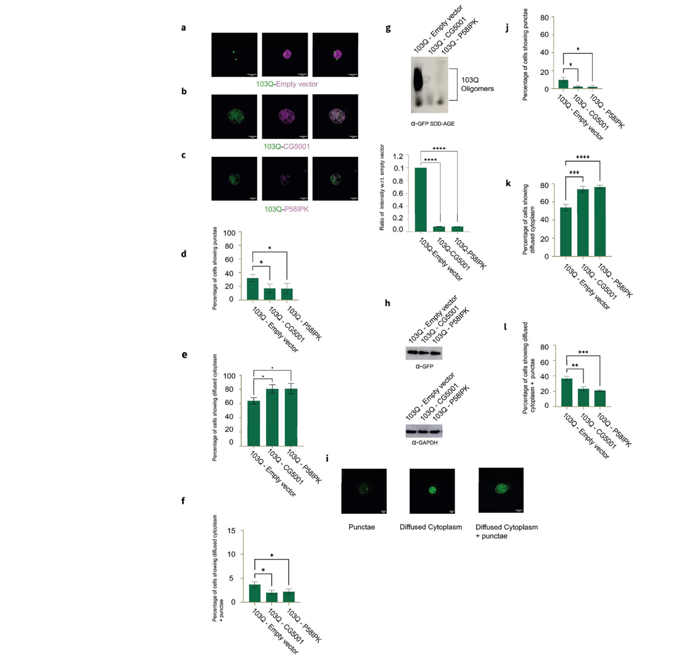

## Question

# Gene Research for Functional Annotation

## ⚠️ CRITICAL: Gene/Protein Identification Context

**BEFORE YOU BEGIN RESEARCH:** You MUST verify you are researching the CORRECT gene/protein. Gene symbols can be ambiguous, especially for less well-characterized genes from non-model organisms.

### Target Gene/Protein Identity (from UniProt):
- **UniProt Accession:** Q9VHA8
- **Protein Description:** SubName: Full=P58IPK {ECO:0000313|EMBL:AAF54411.1};
- **Gene Information:** Name=P58IPK {ECO:0000313|EMBL:AAF54411.1, ECO:0000313|FlyBase:FBgn0037718}; Synonyms=BEST:SD05682 {ECO:0000313|EMBL:AAF54411.1}, dIPK {ECO:0000313|EMBL:AAF54411.1}, Dmel\CG8286 {ECO:0000313|EMBL:AAF54411.1}, SD05682.5prime {ECO:0000313|EMBL:AAF54411.1}; ORFNames=CG8286 {ECO:0000313|EMBL:AAF54411.1, ECO:0000313|FlyBase:FBgn0037718}, Dmel_CG8286 {ECO:0000313|EMBL:AAF54411.1};
- **Organism (full):** Drosophila melanogaster (Fruit fly).
- **Protein Family:** Not specified in UniProt
- **Key Domains:** DnaJ_C3_Co-chaperones. (IPR051727); DnaJ_domain. (IPR001623); J_dom_sf. (IPR036869); TPR-like_helical_dom_sf. (IPR011990); TPR_rpt. (IPR019734)

### MANDATORY VERIFICATION STEPS:

1. **Check if the gene symbol "P58IPK" matches the protein description above**
2. **Verify the organism is correct:** Drosophila melanogaster (Fruit fly).
3. **Check if protein family/domains align with what you find in literature**
4. **If you find literature for a DIFFERENT gene with the same or similar symbol, STOP**

### If Gene Symbol is Ambiguous or You Cannot Find Relevant Literature:

**DO NOT PROCEED WITH RESEARCH ON A DIFFERENT GENE.** Instead:
- State clearly: "The gene symbol 'P58IPK' is ambiguous or literature is limited for this specific protein"
- Explain what you found (e.g., "Found extensive literature on a different gene with the same symbol in a different organism")
- Describe the protein based ONLY on the UniProt information provided above
- Suggest that the protein function can be inferred from domain/family information

### Research Target:

Please provide a comprehensive research report on the gene **P58IPK** (gene ID: P58IPK, UniProt: Q9VHA8) in DROME.

The research report should be a detailed narrative explaining the function, biological processes, and localization of the gene product. Citations should be given for all claims.

You should prioritize authoritative reviews and primary scientific literature when conducting research. You can supplement
this with annotations you find in gene/protein databases, but these can be outdated or inaccurate.

We are specifically interested in the primary function of the gene - for enzymes, what reaction is catalyzed, and what is the substrate specificity? For transporters, what is the substrate? For structural proteins or adapters, what is the broader structural role? For signaling molecules, what is the role in the pathway.

We are interested in where in or outside the cell the gene product carries out its function.

We are also interested in the signaling or biochemical pathways in which the gene functions. We are less interested in broad pleiotropic effects, except where these elucidate the precise role.

Include evidence where possible. We are interested in both experimental evidence as well as inference from structure, evolution, or bioinformatic analysis. Precise studies should be prioritized over high-throughput, where available.

## Output

Question: You are an expert researcher providing comprehensive, well-cited information.

Provide detailed information focusing on:
1. Key concepts and definitions with current understanding
2. Recent developments and latest research (prioritize 2023-2024 sources)
3. Current applications and real-world implementations
4. Expert opinions and analysis from authoritative sources
5. Relevant statistics and data from recent studies

Format as a comprehensive research report with proper citations. Include URLs and publication dates where available.
Always prioritize recent, authoritative sources and provide specific citations for all major claims.

# Gene Research for Functional Annotation

## ⚠️ CRITICAL: Gene/Protein Identification Context

**BEFORE YOU BEGIN RESEARCH:** You MUST verify you are researching the CORRECT gene/protein. Gene symbols can be ambiguous, especially for less well-characterized genes from non-model organisms.

### Target Gene/Protein Identity (from UniProt):
- **UniProt Accession:** Q9VHA8
- **Protein Description:** SubName: Full=P58IPK {ECO:0000313|EMBL:AAF54411.1};
- **Gene Information:** Name=P58IPK {ECO:0000313|EMBL:AAF54411.1, ECO:0000313|FlyBase:FBgn0037718}; Synonyms=BEST:SD05682 {ECO:0000313|EMBL:AAF54411.1}, dIPK {ECO:0000313|EMBL:AAF54411.1}, Dmel\CG8286 {ECO:0000313|EMBL:AAF54411.1}, SD05682.5prime {ECO:0000313|EMBL:AAF54411.1}; ORFNames=CG8286 {ECO:0000313|EMBL:AAF54411.1, ECO:0000313|FlyBase:FBgn0037718}, Dmel_CG8286 {ECO:0000313|EMBL:AAF54411.1};
- **Organism (full):** Drosophila melanogaster (Fruit fly).
- **Protein Family:** Not specified in UniProt
- **Key Domains:** DnaJ_C3_Co-chaperones. (IPR051727); DnaJ_domain. (IPR001623); J_dom_sf. (IPR036869); TPR-like_helical_dom_sf. (IPR011990); TPR_rpt. (IPR019734)

### MANDATORY VERIFICATION STEPS:

1. **Check if the gene symbol "P58IPK" matches the protein description above**
2. **Verify the organism is correct:** Drosophila melanogaster (Fruit fly).
3. **Check if protein family/domains align with what you find in literature**
4. **If you find literature for a DIFFERENT gene with the same or similar symbol, STOP**

### If Gene Symbol is Ambiguous or You Cannot Find Relevant Literature:

**DO NOT PROCEED WITH RESEARCH ON A DIFFERENT GENE.** Instead:
- State clearly: "The gene symbol 'P58IPK' is ambiguous or literature is limited for this specific protein"
- Explain what you found (e.g., "Found extensive literature on a different gene with the same symbol in a different organism")
- Describe the protein based ONLY on the UniProt information provided above
- Suggest that the protein function can be inferred from domain/family information

### Research Target:

Please provide a comprehensive research report on the gene **P58IPK** (gene ID: P58IPK, UniProt: Q9VHA8) in DROME.

The research report should be a detailed narrative explaining the function, biological processes, and localization of the gene product. Citations should be given for all claims.

You should prioritize authoritative reviews and primary scientific literature when conducting research. You can supplement
this with annotations you find in gene/protein databases, but these can be outdated or inaccurate.

We are specifically interested in the primary function of the gene - for enzymes, what reaction is catalyzed, and what is the substrate specificity? For transporters, what is the substrate? For structural proteins or adapters, what is the broader structural role? For signaling molecules, what is the role in the pathway.

We are interested in where in or outside the cell the gene product carries out its function.

We are also interested in the signaling or biochemical pathways in which the gene functions. We are less interested in broad pleiotropic effects, except where these elucidate the precise role.

Include evidence where possible. We are interested in both experimental evidence as well as inference from structure, evolution, or bioinformatic analysis. Precise studies should be prioritized over high-throughput, where available.

# Functional annotation report: *Drosophila melanogaster* P58IPK (Q9VHA8)

## Executive conclusion

The correct target is the *Drosophila melanogaster* gene **P58IPK**, also called **dIPK** or **CG8286**, with **FlyBase ID FBgn0037718** and **UniProt accession Q9VHA8**. A 2024 construct/orthology table independently assigns fly P58IPK to FBgn0037718 and identifies human NCBI Gene 5611—**DNAJC3**, also commonly called p58IPK—as its human ortholog. Human DNAJC3 and fly CG8286 are therefore related but are **not the same gene**, and mammalian p58IPK results cannot automatically be attributed to Q9VHA8 (deo2024twonoveldnaj pages 14-15, deo2024twonoveldnaj pages 10-12).

The most defensible annotation is: **a DnaJ/TPR-containing, non-enzymatic co-chaperone and proteostasis factor that can associate with aggregation-prone proteins and reduce their aggregation when overexpressed**. Direct evidence is strongest for suppression of mutant huntingtin HTT103Q aggregation. Evidence that fly P58IPK resides in the endoplasmic reticulum or directly inhibits PERK is presently much weaker and largely extrapolated from mammalian DNAJC3.

| Annotation question | Best-supported conclusion | Evidence type | Confidence / limitation |
|---|---|---|---|
| Correct identity | **P58IPK = CG8286 = FBgn0037718 = UniProt Q9VHA8** in *Drosophila melanogaster*. Human **DNAJC3** (NCBI Gene 5611), also called p58IPK, is the proposed ortholog—not the same gene. The 2024 study independently associates fly P58IPK with FBgn0037718 (deo2024twonoveldnaj pages 14-15) | Database mapping plus study construct table | **High** for the fly identifier; aliases Q9VHA8/CG8286 derive from the supplied UniProt record. Care is needed because the paper’s wrapped table formatting visually juxtaposes P58IPK and CG7556. |
| Domain architecture | The protein contains a **DnaJ/J domain** and **TPR-like helical repeats**, consistent with a type-III DnaJ/Hsp40-family co-chaperone. J domains generally stimulate Hsp70 ATPase cycling, while TPR elements commonly support protein–protein interactions (deo2024twonoveldnaj pages 2-3, deo2024twonoveldnaj pages 1-2) | Database/domain inference | **Moderate–high** for domain presence; exact repeat number, binding surfaces, cognate fly Hsp70, and J-domain activity have not been demonstrated biochemically for Q9VHA8. |
| Primary molecular role | Best annotated as a **non-enzymatic co-chaperone/proteostasis factor** that binds misfolded or aggregation-prone proteins and may recruit or regulate Hsp70-mediated folding/disaggregation (deo2024twonoveldnaj pages 2-3, deo2024twonoveldnaj pages 1-2) | Domain inference supported by overexpression experiments | **Moderate**. Anti-aggregation activity is demonstrated, but Hsp70 dependence and ATPase stimulation by purified fly P58IPK remain untested. |
| Catalytic reaction or substrate specificity | **No catalytic reaction is established.** P58IPK is not supported as an enzyme or transporter. The demonstrated client is aggregation-prone **HTT103Q**; broader endogenous substrate specificity is unknown. | Direct experiment plus negative/absence-of-evidence assessment | **High** that no reaction has been demonstrated; **low** confidence regarding the physiological client repertoire. |
| HTT103Q physical association | HA-tagged fly P58IPK was recovered with GFP-tagged HTT103Q by co-immunoprecipitation in yeast. In S2 cells it colocalized with HTT103Q-GFP aggregates, reported as Pearson’s **r = 1** (deo2024twonoveldnaj pages 9-10, deo2024twonoveldnaj pages 4-6) | Direct experiment | **Moderate**. Co-IP and colocalization support association but do not establish direct binding with purified proteins; r = 1 is unusually perfect and should be independently replicated. |
| Anti-aggregation/proteostasis effect | P58IPK overexpression suppressed HTT103Q-associated slow growth in yeast; reduced the polymeric SDD-AGE smear (**p < 0.0001**); increased soluble and decreased insoluble fractions (**p = 0.0171** and **p = 0.0023**, respectively); and reduced aggregate phenotypes in S2 cells and fly larval hemocytes (deo2024twonoveldnaj pages 3-4, deo2024twonoveldnaj pages 9-10, deo2024twonoveldnaj pages 4-6) | Direct experiments in yeast, cultured fly cells, and transgenic flies | **Moderate–high** for overexpression-dependent anti-aggregation activity. S2 assays used three experiments of about 100 cells; hemocyte assays used up to seven replicates. Evidence does not establish the normal loss-of-function phenotype or neuronal efficacy. |
| Cellular localization | Experimentally, overexpressed HA-tagged P58IPK was visible in the **cytoplasm** of S2 cells and colocalized with cytoplasmic HTT103Q puncta (deo2024twonoveldnaj pages 6-9, deo2024twonoveldnaj pages 9-10). **Endogenous ER localization was not directly established** in the gene-specific experiments. | Direct experiment for induced cytoplasmic localization; inference for ER association | **Moderate** for localization of the tagged overexpressed construct; **low** for endogenous localization. Colocalization with an artificial aggregate is not an organelle-localization assay. |
| PERK/UPR pathway role | The claim that fly P58IPK inhibits PERK and functions late in the ER-stress response is **not directly verified for CG8286/Q9VHA8** in the cited fly experiments. It is principally an orthology-based extrapolation from mammalian DNAJC3/p58IPK biology (deo2024twonoveldnaj pages 2-3, deo2024twonoveldnaj pages 10-12) | Orthology extrapolation | **Low for the specific fly mechanism**. Fly PERK binding, kinase inhibition, eIF2α effects, UPR-dependent induction, and epistasis require direct testing before pathway assignment. |
| Most defensible functional annotation | **DnaJ/TPR co-chaperone and modifier of proteotoxic aggregation**, experimentally capable—when overexpressed—of associating with HTT103Q and shifting it toward less aggregated states. | Integrated direct and inferential evidence | **Moderate** overall. The annotation is stronger for proteostasis than for ER localization or PERK regulation, and endogenous physiological function remains incompletely characterized. |

*Table: Evidence-tiered annotation of Drosophila P58IPK/Q9VHA8, separating direct experiments from domain inference and mammalian-orthology extrapolation. It highlights the strong anti-aggregation evidence and the unresolved endogenous localization and PERK/UPR mechanism.*

## 1. Identity verification and nomenclature

The supplied UniProt record identifies Q9VHA8 as a protein from **DROME—*Drosophila melanogaster*** with the names P58IPK, dIPK, CG8286, Dmel_CG8286, BEST:SD05682 and SD05682.5prime. The recent peer-reviewed study by Deo and colleagues used a fly P58IPK construct corresponding to **FBgn0037718**, matching the supplied FlyBase identifier. Its table also lists human Gene 5611, DNAJC3, as the ortholog (deo2024twonoveldnaj pages 14-15).

This distinction is critical because much of the older literature indexed under “p58IPK” concerns mammalian **DNAJC3**, an ER-associated cochaperone studied in PERK/eIF2α signaling, diabetes and antiviral responses. Those findings are useful as hypotheses about evolutionary conservation, but they are not direct evidence for the fly protein.

## 2. Domain architecture and protein class

The supplied InterPro annotations identify a **DnaJ domain/J-domain superfamily** and **TPR-like helical domain/TPR repeats**. This architecture is consistent with a type-III DnaJ/Hsp40—or DnaJC-like—co-chaperone rather than an enzyme, transporter or structural polymer.

J domains are compact, approximately 70-residue modules that generally engage Hsp70-family chaperones and stimulate their ATPase cycle, coupling client capture to folding or disaggregation. DnaJ proteins can transfer bound substrates to Hsp70, after which ATP-dependent Hsp70 cycling stabilizes, refolds or directs disposal of the client (deo2024twonoveldnaj pages 2-3, deo2024twonoveldnaj pages 1-2). TPR-like repeats commonly provide extended protein-interaction surfaces, making them structurally compatible with client or partner recognition.

For Q9VHA8 specifically, however, the literature retrieved here does **not** report purified-protein measurements of Hsp70 ATPase stimulation, a cognate fly Hsp70 partner, mutational testing of the J-domain HPD motif, or mapping of a TPR-dependent client-binding surface. Its assignment as an Hsp70 cofactor is therefore strongly supported by architecture and homology but not yet demonstrated biochemically for the purified fly protein.

## 3. Primary molecular function and substrate specificity

### Best-supported function

P58IPK is best regarded as a **protein-quality-control co-chaperone**. In the only detailed recent gene-specific study, overexpressed fly P58IPK associated with polyglutamine-expanded **HTT103Q** and shifted the client toward less aggregated, more soluble states. It is not known to catalyze a chemical reaction, and no small-molecule substrate or transported substrate applies.

The demonstrated experimental client is an artificial disease-associated construct containing 103 glutamines. In yeast, HA-tagged P58IPK was recovered in an anti-GFP immunoprecipitate with HTT103Q-GFP, suggesting association. Because this was co-immunoprecipitation from lysate rather than reconstitution with purified components, it does not prove direct binary binding (deo2024twonoveldnaj pages 4-6).

In Drosophila S2 cells, tagged P58IPK colocalized with HTT103Q-GFP, with a reported Pearson correlation coefficient of **r = 1**. This unusually perfect correlation supports close spatial association but warrants independent replication and does not by itself establish a direct molecular interaction (deo2024twonoveldnaj pages 6-9, deo2024twonoveldnaj pages 9-10, deo2024twonoveldnaj media 23ff3684).

### Unknown physiological clients

No endogenous fly substrate repertoire has been established. HTT103Q is therefore evidence of **client-handling capacity**, not necessarily the normal physiological substrate. It remains unknown whether Q9VHA8 preferentially recognizes polyglutamine proteins, a broader class of misfolded proteins, nascent secretory clients, or particular endogenous partners.

## 4. Experimental evidence for anti-aggregation activity

The principal recent development is the peer-reviewed article by Deo et al., published in **Scientific Reports on 6 September 2024**, following a **November 2023 bioRxiv preprint**. DOI/URL: [10.1038/s41598-024-71065-3](https://doi.org/10.1038/s41598-024-71065-3); preprint: [10.1101/2023.10.31.564873](https://doi.org/10.1101/2023.10.31.564873) (deo2024twonoveldnaj pages 6-9, deo2024twonoveldnaj pages 1-2).

### Yeast screening

Forty fly DnaJ-domain chaperones and related proteins were overexpressed in a *Saccharomyces cerevisiae* HTT103Q model. P58IPK was one of five suppressors in serial-dilution and 48-hour growth assays and was selected, with CG5001, as one of the two strongest combined candidates. Growth curves used three biological replicates, 2% galactose induction and optical-density measurements every 30 minutes; reported comparisons were significant at **p < 0.05** (deo2024twonoveldnaj pages 3-4, deo2024twonoveldnaj pages 4-6).

P58IPK reduced the high-molecular-weight HTT103Q smear in semi-denaturing detergent agarose electrophoresis, with densitometric analysis reported at **p < 0.0001**. Soluble HTT-associated material increased (**p = 0.0171**) and insoluble material decreased (**p = 0.0023**) relative to the luciferase-vector control. Conventional immunoblotting indicated broadly comparable HTT expression, arguing that the lower aggregate signal was not simply caused by suppression of HTT production (deo2024twonoveldnaj pages 9-10, deo2024twonoveldnaj pages 4-6).

### Drosophila S2 cells

In S2 cells, HTT103Q-GFP plus HA-tagged P58IPK produced fewer punctate cells, more cells with diffuse cytoplasmic fluorescence, and fewer cells with mixed diffuse-plus-punctate morphology. Approximately 100 cells were scored in each of three independent assays; the respective reported tests gave **p = 0.04, 0.02 and 0.02**. SDD-AGE again showed a strongly reduced polymeric signal (**p < 0.0001**) without a comparable reduction in total HTT on western blot (deo2024twonoveldnaj pages 9-10, deo2024twonoveldnaj media 24617551).

### Transgenic fly hemocytes

Using Cg-Gal4, the investigators coexpressed UAS-HTT103Q-GFP and UAS-P58IPK in larval hemocytes. Around 100 cells were counted per experiment across as many as seven biological replicates. For P58IPK, punctate morphology decreased (**p = 0.0278**), diffuse cytoplasm increased (**p = 0.0001**), and mixed diffuse-plus-punctate morphology decreased (**p = 0.0003**) relative to the AP2-sigma vector control (deo2024twonoveldnaj pages 14-15, deo2024twonoveldnaj pages 9-10, deo2024twonoveldnaj media 24617551).

These experiments collectively establish reproducible **overexpression-dependent suppression of HTT103Q aggregation** across yeast, cultured fly cells and fly hemocytes. They do not establish the consequences of endogenous P58IPK loss, physiological dosage, rescue of neuronal degeneration, locomotion, lifespan or cognition.

## 5. Cellular localization

The safest evidence-based localization is **cytoplasmic in the overexpression assays**, where HA-tagged P58IPK colocalized with cytoplasmic HTT103Q puncta in S2 cells. This identifies where the engineered protein encountered the disease client, not necessarily its normal steady-state compartment (deo2024twonoveldnaj pages 6-9, deo2024twonoveldnaj pages 9-10).

The recent paper describes P58IPK as involved in ER protein folding, but it does not present gene-specific ER-marker colocalization, fractionation, protease-protection or endogenous immunolocalization for Q9VHA8. Consequently, **endogenous ER localization—especially whether the protein is ER-luminal, membrane-associated or cytosolic—is not directly established by the retrieved fly experiments**. A signal peptide and membrane topology should be independently assessed from the sequence before importing the mammalian DNAJC3 localization model.

## 6. Pathways and biological processes

### Proteostasis and chaperone-assisted folding

The direct fly evidence places P58IPK in **proteostasis**, particularly recognition or remodeling of aggregation-prone proteins. Its J domain makes cooperation with Hsp70 mechanistically plausible, while its TPR-repeat region could mediate partner/client binding. The observed conversion from insoluble toward soluble HTT103Q is compatible with prevention of aggregation, stabilization of soluble species or chaperone-assisted remodeling. The current experiments do not discriminate among these mechanisms (deo2024twonoveldnaj pages 9-10, deo2024twonoveldnaj pages 4-6).

### PERK–eIF2α and unfolded-protein response

Mammalian DNAJC3/p58IPK is widely discussed as a late ER-stress feedback regulator that inhibits PERK, thereby modulating eIF2α phosphorylation and translational attenuation. Deo et al. invoke this model and propose examining translation-associated parameters in fly neurodegeneration models. They did not, however, measure fly PERK binding or activity, eIF2α phosphorylation, UPR-dependent induction, or genetic epistasis with PERK in the P58IPK experiments (deo2024twonoveldnaj pages 10-12).

Accordingly, the current annotation should read **“putative involvement in ER protein folding/UPR, inferred from orthology”**, not “experimentally established inhibitor of fly PERK.” This is the principal area in which symbol ambiguity could otherwise lead to overannotation.

## 7. Current applications and translational status

The demonstrated application is as an **experimental genetic modifier of proteotoxicity**. P58IPK overexpression can be used in yeast, S2-cell and transgenic-fly assays to investigate polyglutamine aggregation and chaperone networks. The 2024 authors suggest that conserved DnaJ proteins could eventually inform therapeutic or gene-therapy strategies and propose testing related disorders, including ALS, Parkinson disease and spinocerebellar ataxias (deo2024twonoveldnaj pages 12-13).

These are research proposals, not real-world therapeutic implementations. No clinical trial, approved therapy, commercial diagnostic or in-human intervention involving fly P58IPK was identified. Moreover, the paper's ALS rescue result involved CG5001 rather than P58IPK, so it should not be used as evidence that Q9VHA8 suppresses TDP-43 or FUS toxicity (deo2024twonoveldnaj pages 9-10).

## 8. Evidence limitations and expert assessment

The 2024 study is important because it upgrades P58IPK from a primarily predicted fly cochaperone to an experimentally supported modifier of protein aggregation. Its multi-system replication, biochemical fractionation, co-immunoprecipitation and statistically significant fly-cell phenotypes make the anti-aggregation conclusion credible. Nevertheless, all decisive experiments used **overexpression and an exogenous HTT103Q client**. The perfect reported S2-cell colocalization coefficient, modest biological replicate counts, and absence of endogenous loss-of-function or neuronal disease endpoints limit mechanistic and physiological interpretation (deo2024twonoveldnaj pages 9-10, deo2024twonoveldnaj media 24617551).

The literature for this exact fly protein remains limited. No gene-specific 2023–2024 work beyond the Deo preprint and its 2024 peer-reviewed article was found that directly resolves endogenous localization, normal developmental function, native client specificity or PERK regulation.

## 9. Recommended annotation and decisive next experiments

**Recommended concise annotation:**

> *Drosophila melanogaster* P58IPK/CG8286 (Q9VHA8; FBgn0037718) is a DnaJ- and TPR-containing putative Hsp70 co-chaperone involved in protein quality control. When overexpressed, it associates with polyglutamine-expanded HTT103Q and suppresses its aggregation in yeast, Drosophila S2 cells and larval hemocytes. Endogenous localization, physiological clients, Hsp70 dependence and direct regulation of PERK remain unconfirmed.

The most informative next studies would be: endogenous CRISPR tagging and organelle-marker colocalization; null and separation-of-function alleles; purified P58IPK–Hsp70 ATPase and client-binding assays; mutation of the J-domain HPD motif and TPR surfaces; quantitative proteomics to identify native clients; and PERK/eIF2α assays under defined ER stress. These experiments would distinguish a general cytoplasmic anti-aggregation cochaperone from an evolutionarily conserved ER/UPR regulator.

References

1. (deo2024twonoveldnaj pages 14-15): Ankita Deo, Rishita Ghosh, Snehal Ahire, Sayali Marathe, Amitabha Majumdar, and Tania Bose. Two novel dnaj chaperone proteins cg5001 and p58ipk regulate the pathogenicity of huntington’s disease related aggregates. Scientific Reports, Sep 2024. URL: https://doi.org/10.1038/s41598-024-71065-3, doi:10.1038/s41598-024-71065-3. This article has 3 citations and is from a peer-reviewed journal.

2. (deo2024twonoveldnaj pages 10-12): Ankita Deo, Rishita Ghosh, Snehal Ahire, Sayali Marathe, Amitabha Majumdar, and Tania Bose. Two novel dnaj chaperone proteins cg5001 and p58ipk regulate the pathogenicity of huntington’s disease related aggregates. Scientific Reports, Sep 2024. URL: https://doi.org/10.1038/s41598-024-71065-3, doi:10.1038/s41598-024-71065-3. This article has 3 citations and is from a peer-reviewed journal.

3. (deo2024twonoveldnaj pages 2-3): Ankita Deo, Rishita Ghosh, Snehal Ahire, Sayali Marathe, Amitabha Majumdar, and Tania Bose. Two novel dnaj chaperone proteins cg5001 and p58ipk regulate the pathogenicity of huntington’s disease related aggregates. Scientific Reports, Sep 2024. URL: https://doi.org/10.1038/s41598-024-71065-3, doi:10.1038/s41598-024-71065-3. This article has 3 citations and is from a peer-reviewed journal.

4. (deo2024twonoveldnaj pages 1-2): Ankita Deo, Rishita Ghosh, Snehal Ahire, Sayali Marathe, Amitabha Majumdar, and Tania Bose. Two novel dnaj chaperone proteins cg5001 and p58ipk regulate the pathogenicity of huntington’s disease related aggregates. Scientific Reports, Sep 2024. URL: https://doi.org/10.1038/s41598-024-71065-3, doi:10.1038/s41598-024-71065-3. This article has 3 citations and is from a peer-reviewed journal.

5. (deo2024twonoveldnaj pages 9-10): Ankita Deo, Rishita Ghosh, Snehal Ahire, Sayali Marathe, Amitabha Majumdar, and Tania Bose. Two novel dnaj chaperone proteins cg5001 and p58ipk regulate the pathogenicity of huntington’s disease related aggregates. Scientific Reports, Sep 2024. URL: https://doi.org/10.1038/s41598-024-71065-3, doi:10.1038/s41598-024-71065-3. This article has 3 citations and is from a peer-reviewed journal.

6. (deo2024twonoveldnaj pages 4-6): Ankita Deo, Rishita Ghosh, Snehal Ahire, Sayali Marathe, Amitabha Majumdar, and Tania Bose. Two novel dnaj chaperone proteins cg5001 and p58ipk regulate the pathogenicity of huntington’s disease related aggregates. Scientific Reports, Sep 2024. URL: https://doi.org/10.1038/s41598-024-71065-3, doi:10.1038/s41598-024-71065-3. This article has 3 citations and is from a peer-reviewed journal.

7. (deo2024twonoveldnaj pages 3-4): Ankita Deo, Rishita Ghosh, Snehal Ahire, Sayali Marathe, Amitabha Majumdar, and Tania Bose. Two novel dnaj chaperone proteins cg5001 and p58ipk regulate the pathogenicity of huntington’s disease related aggregates. Scientific Reports, Sep 2024. URL: https://doi.org/10.1038/s41598-024-71065-3, doi:10.1038/s41598-024-71065-3. This article has 3 citations and is from a peer-reviewed journal.

8. (deo2024twonoveldnaj pages 6-9): Ankita Deo, Rishita Ghosh, Snehal Ahire, Sayali Marathe, Amitabha Majumdar, and Tania Bose. Two novel dnaj chaperone proteins cg5001 and p58ipk regulate the pathogenicity of huntington’s disease related aggregates. Scientific Reports, Sep 2024. URL: https://doi.org/10.1038/s41598-024-71065-3, doi:10.1038/s41598-024-71065-3. This article has 3 citations and is from a peer-reviewed journal.

9. (deo2024twonoveldnaj media 23ff3684): Ankita Deo, Rishita Ghosh, Snehal Ahire, Sayali Marathe, Amitabha Majumdar, and Tania Bose. Two novel dnaj chaperone proteins cg5001 and p58ipk regulate the pathogenicity of huntington’s disease related aggregates. Scientific Reports, Sep 2024. URL: https://doi.org/10.1038/s41598-024-71065-3, doi:10.1038/s41598-024-71065-3. This article has 3 citations and is from a peer-reviewed journal.

10. (deo2024twonoveldnaj media 24617551): Ankita Deo, Rishita Ghosh, Snehal Ahire, Sayali Marathe, Amitabha Majumdar, and Tania Bose. Two novel dnaj chaperone proteins cg5001 and p58ipk regulate the pathogenicity of huntington’s disease related aggregates. Scientific Reports, Sep 2024. URL: https://doi.org/10.1038/s41598-024-71065-3, doi:10.1038/s41598-024-71065-3. This article has 3 citations and is from a peer-reviewed journal.

11. (deo2024twonoveldnaj pages 12-13): Ankita Deo, Rishita Ghosh, Snehal Ahire, Sayali Marathe, Amitabha Majumdar, and Tania Bose. Two novel dnaj chaperone proteins cg5001 and p58ipk regulate the pathogenicity of huntington’s disease related aggregates. Scientific Reports, Sep 2024. URL: https://doi.org/10.1038/s41598-024-71065-3, doi:10.1038/s41598-024-71065-3. This article has 3 citations and is from a peer-reviewed journal.

## Artifacts

- [Edison artifact artifact-00](P58IPK-deep-research-falcon_artifacts/artifact-00.md)

## Citations

1. deo2024twonoveldnaj pages 14-15
2. deo2024twonoveldnaj pages 4-6
3. deo2024twonoveldnaj pages 10-12
4. deo2024twonoveldnaj pages 12-13
5. deo2024twonoveldnaj pages 9-10
6. deo2024twonoveldnaj pages 2-3
7. deo2024twonoveldnaj pages 1-2
8. deo2024twonoveldnaj pages 3-4
9. deo2024twonoveldnaj pages 6-9
10. 10.1038/s41598-024-71065-3
11. 10.1101/2023.10.31.564873
12. https://doi.org/10.1038/s41598-024-71065-3
13. https://doi.org/10.1101/2023.10.31.564873
14. https://doi.org/10.1038/s41598-024-71065-3,