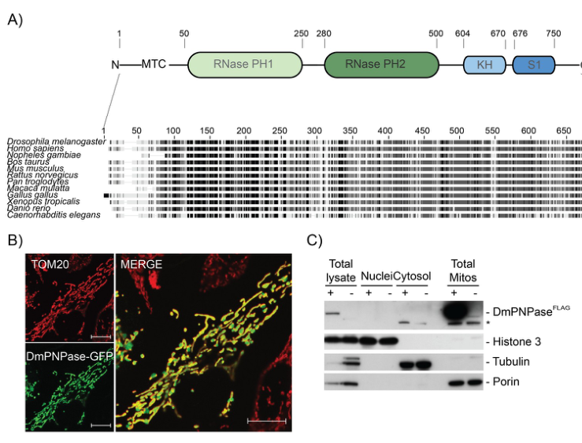
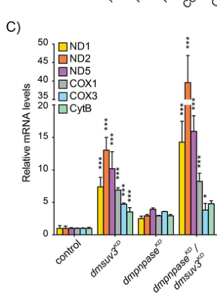
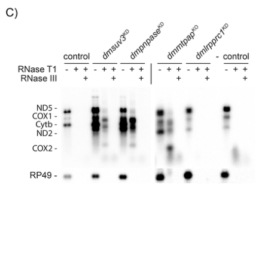

## Question

# Gene Research for Functional Annotation

## ⚠️ CRITICAL: Gene/Protein Identification Context

**BEFORE YOU BEGIN RESEARCH:** You MUST verify you are researching the CORRECT gene/protein. Gene symbols can be ambiguous, especially for less well-characterized genes from non-model organisms.

### Target Gene/Protein Identity (from UniProt):
- **UniProt Accession:** Q9V9X7
- **Protein Description:** RecName: Full=polyribonucleotide nucleotidyltransferase {ECO:0000256|ARBA:ARBA00012416}; EC=2.7.7.8 {ECO:0000256|ARBA:ARBA00012416};
- **Gene Information:** Name=PNPase {ECO:0000313|EMBL:AAF57151.2, ECO:0000313|FlyBase:FBgn0039846}; Synonyms=Dmel\CG11337 {ECO:0000313|EMBL:AAF57151.2}, dmpnpase {ECO:0000313|EMBL:AAF57151.2}; ORFNames=CG11337 {ECO:0000313|EMBL:AAF57151.2, ECO:0000313|FlyBase:FBgn0039846}, Dmel_CG11337 {ECO:0000313|EMBL:AAF57151.2};
- **Organism (full):** Drosophila melanogaster (Fruit fly).
- **Protein Family:** Belongs to the polyribonucleotide nucleotidyltransferase
- **Key Domains:** ExoRNase_PH_dom1. (IPR001247); ExoRNase_PH_dom2. (IPR015847); ExoRNase_PH_dom2_sf. (IPR036345); KH_dom_type_1_sf. (IPR036612); NA-bd_OB-fold. (IPR012340)

### MANDATORY VERIFICATION STEPS:

1. **Check if the gene symbol "PNPase" matches the protein description above**
2. **Verify the organism is correct:** Drosophila melanogaster (Fruit fly).
3. **Check if protein family/domains align with what you find in literature**
4. **If you find literature for a DIFFERENT gene with the same or similar symbol, STOP**

### If Gene Symbol is Ambiguous or You Cannot Find Relevant Literature:

**DO NOT PROCEED WITH RESEARCH ON A DIFFERENT GENE.** Instead:
- State clearly: "The gene symbol 'PNPase' is ambiguous or literature is limited for this specific protein"
- Explain what you found (e.g., "Found extensive literature on a different gene with the same symbol in a different organism")
- Describe the protein based ONLY on the UniProt information provided above
- Suggest that the protein function can be inferred from domain/family information

### Research Target:

Please provide a comprehensive research report on the gene **PNPase** (gene ID: PNPase, UniProt: Q9V9X7) in DROME.

The research report should be a detailed narrative explaining the function, biological processes, and localization of the gene product. Citations should be given for all claims.

You should prioritize authoritative reviews and primary scientific literature when conducting research. You can supplement
this with annotations you find in gene/protein databases, but these can be outdated or inaccurate.

We are specifically interested in the primary function of the gene - for enzymes, what reaction is catalyzed, and what is the substrate specificity? For transporters, what is the substrate? For structural proteins or adapters, what is the broader structural role? For signaling molecules, what is the role in the pathway.

We are interested in where in or outside the cell the gene product carries out its function.

We are also interested in the signaling or biochemical pathways in which the gene functions. We are less interested in broad pleiotropic effects, except where these elucidate the precise role.

Include evidence where possible. We are interested in both experimental evidence as well as inference from structure, evolution, or bioinformatic analysis. Precise studies should be prioritized over high-throughput, where available.

## Output

Question: You are an expert researcher providing comprehensive, well-cited information.

Provide detailed information focusing on:
1. Key concepts and definitions with current understanding
2. Recent developments and latest research (prioritize 2023-2024 sources)
3. Current applications and real-world implementations
4. Expert opinions and analysis from authoritative sources
5. Relevant statistics and data from recent studies

Format as a comprehensive research report with proper citations. Include URLs and publication dates where available.
Always prioritize recent, authoritative sources and provide specific citations for all major claims.

# Gene Research for Functional Annotation

## ⚠️ CRITICAL: Gene/Protein Identification Context

**BEFORE YOU BEGIN RESEARCH:** You MUST verify you are researching the CORRECT gene/protein. Gene symbols can be ambiguous, especially for less well-characterized genes from non-model organisms.

### Target Gene/Protein Identity (from UniProt):
- **UniProt Accession:** Q9V9X7
- **Protein Description:** RecName: Full=polyribonucleotide nucleotidyltransferase {ECO:0000256|ARBA:ARBA00012416}; EC=2.7.7.8 {ECO:0000256|ARBA:ARBA00012416};
- **Gene Information:** Name=PNPase {ECO:0000313|EMBL:AAF57151.2, ECO:0000313|FlyBase:FBgn0039846}; Synonyms=Dmel\CG11337 {ECO:0000313|EMBL:AAF57151.2}, dmpnpase {ECO:0000313|EMBL:AAF57151.2}; ORFNames=CG11337 {ECO:0000313|EMBL:AAF57151.2, ECO:0000313|FlyBase:FBgn0039846}, Dmel_CG11337 {ECO:0000313|EMBL:AAF57151.2};
- **Organism (full):** Drosophila melanogaster (Fruit fly).
- **Protein Family:** Belongs to the polyribonucleotide nucleotidyltransferase
- **Key Domains:** ExoRNase_PH_dom1. (IPR001247); ExoRNase_PH_dom2. (IPR015847); ExoRNase_PH_dom2_sf. (IPR036345); KH_dom_type_1_sf. (IPR036612); NA-bd_OB-fold. (IPR012340)

### MANDATORY VERIFICATION STEPS:

1. **Check if the gene symbol "PNPase" matches the protein description above**
2. **Verify the organism is correct:** Drosophila melanogaster (Fruit fly).
3. **Check if protein family/domains align with what you find in literature**
4. **If you find literature for a DIFFERENT gene with the same or similar symbol, STOP**

### If Gene Symbol is Ambiguous or You Cannot Find Relevant Literature:

**DO NOT PROCEED WITH RESEARCH ON A DIFFERENT GENE.** Instead:
- State clearly: "The gene symbol 'PNPase' is ambiguous or literature is limited for this specific protein"
- Explain what you found (e.g., "Found extensive literature on a different gene with the same symbol in a different organism")
- Describe the protein based ONLY on the UniProt information provided above
- Suggest that the protein function can be inferred from domain/family information

### Research Target:

Please provide a comprehensive research report on the gene **PNPase** (gene ID: PNPase, UniProt: Q9V9X7) in DROME.

The research report should be a detailed narrative explaining the function, biological processes, and localization of the gene product. Citations should be given for all claims.

You should prioritize authoritative reviews and primary scientific literature when conducting research. You can supplement
this with annotations you find in gene/protein databases, but these can be outdated or inaccurate.

We are specifically interested in the primary function of the gene - for enzymes, what reaction is catalyzed, and what is the substrate specificity? For transporters, what is the substrate? For structural proteins or adapters, what is the broader structural role? For signaling molecules, what is the role in the pathway.

We are interested in where in or outside the cell the gene product carries out its function.

We are also interested in the signaling or biochemical pathways in which the gene functions. We are less interested in broad pleiotropic effects, except where these elucidate the precise role.

Include evidence where possible. We are interested in both experimental evidence as well as inference from structure, evolution, or bioinformatic analysis. Precise studies should be prioritized over high-throughput, where available.

# Functional annotation report: *Drosophila melanogaster* PNPase

## Identity and evidence standard

**The target is the mitochondrial polyribonucleotide nucleotidyltransferase encoded by *CG11337* (FlyBase FBgn0039846), corresponding to the user-supplied UniProt accession Q9V9X7—not a purine nucleoside phosphorylase or the human *PNPT1* gene.** In a primary fly study, *CG11337* was the sole candidate ortholog identified against human PNPase and yeast DSS1p, shared **55.1% sequence identity** with human PNPase, and contained the expected two RNase-PH regions plus KH and S1 RNA-binding domains. A 2023 fly metabolic reconstruction independently identifies the PNPase-encoding locus as FBgn0039846/*CG11337*. The accession-to-locus correspondence relies on the UniProt record supplied in the question; the cited papers identify the locus rather than printing accession Q9V9X7. (pajak2019defectsofmitochondrial pages 2-3, cesur2023anewmetabolic pages 9-10, pajak2019defectsofmitochondrial media 917d5b82)

The most informative direct functional evidence remains the *Drosophila* genetic and RNA-analysis study by **Pajak et al., published 31 July 2019** ([*PLOS Genetics*, doi:10.1371/journal.pgen.1008240](https://doi.org/10.1371/journal.pgen.1008240)). Newer sources refine its context but should not be mistaken for new biochemical measurements of purified fly PNPase. (pajak2019defectsofmitochondrial pages 2-3, cesur2023anewmetabolic pages 9-10, rousseau2025invivodicer2 pages 11-12)

## Primary molecular function and substrate specificity

**The best-supported physiological function is mitochondrial RNA surveillance and turnover**, especially removal of mitochondrial **sense mRNAs and antisense RNAs** in cooperation with the RNA helicase SUV3. Mechanistically, the conserved PNPase family catalyzes phosphate-dependent **3′→5′ RNA phosphorolysis**, which can be written as **RNAₙ + inorganic phosphate → RNAₙ₋₁ + a nucleoside diphosphate (NDP)**. The reverse reaction adds an NDP-derived nucleotide to an RNA 3′ end and releases phosphate; it is nontemplated RNA polymerization. Those precise chemical assignments are supported by PNPase-family biochemical work, including purified human enzyme and bacterial homologs, **not by a purified-Q9V9X7 assay**. The fly loss- and gain-of-function results make degradation, rather than polymerization, the stronger annotation for its normal in-vivo role. (lin2012crystalstructureof pages 1-2, unciuleac2013discriminationofrna pages 1-2, pajak2019defectsofmitochondrial pages 3-5, pajak2019defectsofmitochondrial pages 12-14)

The conserved-domain explanation is similarly informative but inferential for the fly enzyme. In purified **human** PNPase, three subunits assemble a ring of six RNase-PH domains; KH domains help capture and thread RNA through a pore toward the catalytic core. In that experimental system, structured RNA with a sufficiently long single-stranded 3′ extension was accessible to degradation, whereas shorter overhangs impeded it. These structural preferences should **not** be reported as measured sequence specificity, overhang cutoffs, or catalytic kinetics of *Drosophila* Q9V9X7. No definitive fly-specific base-sequence preference was established in the retrieved studies. (lin2012crystalstructureof pages 1-2, lin2012crystalstructureof pages 5-7, pajak2019defectsofmitochondrial pages 2-3)

The in-vivo substrate evidence is more specific than the family assignment. An **8-nucleotide deletion in exon 2** caused a frameshift, strongly reduced *dmpnpase* transcripts and produced homozygous larval lethality. In these larvae, all assayed mitochondrial mRNAs increased at steady state; an organello transcription control showed only a mild transcriptional increase relative to the mRNA increase, favoring impaired turnover. Some mt-tRNAs instead decreased, and mt-rRNAs were largely unchanged after PNPase loss. Thus, the evidence does **not** support labeling every mitochondrial RNA an equally important physiological substrate. Smaller accumulated RNA species were *interpreted* by the investigators as decay intermediates, rather than chemically proven to be direct PNPase products. (pajak2019defectsofmitochondrial pages 3-5)

Genetic cooperation with SUV3 further supports RNA decay: simultaneous depletion increased certain *mt-nd* mRNAs synergistically, with ***mt-nd2* rising up to 30-fold** in the authors’ reported comparison. Combined overexpression, unlike individual overexpression, strongly depleted mitochondrial transcripts and caused **second-instar larval lethality**. The paired genetic effects support a functional mitochondrial degradosome; by themselves they do not prove a direct physical interaction between the fly proteins. (pajak2019defectsofmitochondrial pages 3-5, pajak2019defectsofmitochondrial pages 5-7)

## Cellular location and biochemical pathway

**Mitochondrial localization is experimentally supported.** CG11337–GFP overlapped the mitochondrial marker TOM20 when expressed in HeLa cells, while tagged DmPNPase was enriched in mitochondrial fractions prepared from fly larvae. The first assay is heterologous; the second provides fly-tissue evidence. Neither resolves the protein’s precise intramitochondrial membrane topology, so a categorical claim that **all** fly PNPase resides specifically in the matrix—or specifically in the intermembrane space—would exceed these localization data. Mitochondrial RNA degradation is the pathway supported by the fly functional experiments. (pajak2019defectsofmitochondrial pages 2-3, pajak2019defectsofmitochondrial pages 3-5, pajak2019defectsofmitochondrial media 917d5b82)

Within that pathway, DmPNPase and SUV3 cooperate in transcript removal, while **MTPAP** adds 3′ adenylate residues and **LRPPRC** helps protect and fully polyadenylate coding mitochondrial mRNAs. Depleting either PNPase or SUV3 increased mRNA abundance in LRPPRC-depleted flies, consistent with degradosome-dependent elimination of insufficiently protected transcripts. PNPase depletion **did not restore** the shortened poly(A) tails caused by LRPPRC depletion, however: mRNA protection and full tail extension cannot simply be conflated with PNPase-mediated cleavage. Loss of PNPase alone lengthened assayed *ND1* poly(A) tails. (pajak2019defectsofmitochondrial pages 5-7, pajak2019defectsofmitochondrial pages 7-9)

The **MTPAP relationship has an important qualification**. Overexpressing DmPNPase reduced mitochondrial mRNA even in MTPAP-knockout animals, showing that an MTPAP-generated poly(A) tail is **not obligatory for depletion under those experimental conditions**. Conversely, MTPAP deficiency also stabilized antisense transcripts. Antisense *cox1* RNA ends carried an average of **five adenosines**, consistent with oligoadenylation rather than the extensive tailing of protected sense mRNAs; whether those short tails are *required* for normal antisense-RNA disposal was not settled. These are genetic and RNA-end observations, not direct demonstrations of a physical DmPNPase–MTPAP complex. (pajak2019defectsofmitochondrial pages 5-7, pajak2019defectsofmitochondrial pages 7-9, pajak2019defectsofmitochondrial pages 12-14)

## Consequences of disrupted RNA surveillance

Loss of DmPNPase stabilizes mitochondrial antisense RNA, permitting complementary transcripts to form **double-stranded mitochondrial RNA (mt-dsRNA)**. In deficient larvae, accumulated RNA resisted single-strand-directed RNase T1 but was removed by dsRNA-preferring RNase III; larval-brain J2 staining, compartmental RNA measurements and dsRNA sequencing supported **cytosolic accumulation of mitochondrial-origin RNA**. Comparable dsRNA signals appeared after SUV3 or MTPAP disruption but not after the tested LRPPRC depletion. This makes prevention of inappropriate mt-dsRNA accumulation a well-supported *consequence* of PNPase-mediated RNA turnover; it does not establish that PNPase itself exports dsRNA. (pajak2019defectsofmitochondrial pages 7-9, pajak2019defectsofmitochondrial pages 9-12, pajak2019defectsofmitochondrial media 774a4645)

PNPase-deficient larvae also had lower **Dicer2, Ago2 and R2D2 mRNA** levels. The authors suggested possible implications for antiviral defense, but those expression changes are not a direct viral-infection phenotype or proof that mitochondrial PNPase is an antiviral signaling enzyme. The knockout’s reduced complex-I- and complex-IV-driven respiration, abnormal mitochondrial translation and larval lethality are important physiological outcomes, but are less precise descriptions of its primary molecular task than mitochondrial RNA turnover. (pajak2019defectsofmitochondrial pages 9-12, pajak2019defectsofmitochondrial pages 3-5)

The following evidence summary separates direct fly observations from interpretations and homolog-based assignments. (pajak2019defectsofmitochondrial pages 2-3, pajak2019defectsofmitochondrial pages 3-5, lin2012crystalstructureof pages 1-2)

| Proposed annotation | Strongest Drosophila experiment and result | Certainty or important limit | Citation ID(s) |
|---|---|---|---|
| **Identity: CG11337/FBgn0039846 is DmPNPase** | CG11337 was the sole fly candidate homologous to human PNPase/yeast DSS1p, with 55.1% human identity and conserved RNase-PH, KH and S1 domains. | **High.** UniProt Q9V9X7 comes from the supplied record; the papers verify the fly locus and protein class. | (pajak2019defectsofmitochondrial pages 2-3, cesur2023anewmetabolic pages 9-10) |
| **Mitochondrial localization** | DmPNPase–GFP colocalized with TOM20 in HeLa cells; FLAG-tagged DmPNPase was enriched in the mitochondrial fraction of fly larvae. | **High for mitochondrial localization.** GFP evidence is heterologous, while larval fractionation is in vivo; neither resolves matrix versus intermembrane-space topology. | (pajak2019defectsofmitochondrial pages 2-3, pajak2019defectsofmitochondrial media 917d5b82) |
| **Mitochondrial mRNA turnover** | An 8-nt exon-2 CRISPR deletion caused frameshift, larval lethality and increased all tested mt-mRNAs; transcription rose only mildly, supporting RNA stabilization. No rescue experiment was reported. | **High for an in-vivo turnover role; moderate for direct catalysis.** Smaller RNAs were interpreted, not proven, as decay intermediates. | (pajak2019defectsofmitochondrial pages 3-5) |
| **Functional partnership with SUV3** | Joint DmPNPase/DmSUV3 depletion synergistically raised *mt-nd2* as much as 30-fold; joint overexpression strongly depleted mtRNAs and caused second-instar lethality. | **High genetic evidence for cooperation.** It does not by itself demonstrate direct physical complex formation. | (pajak2019defectsofmitochondrial pages 3-5, pajak2019defectsofmitochondrial pages 5-7) |
| **Antisense-RNA surveillance** | Loss of DmPNPase stabilized mitochondrial antisense RNA; antisense *cox1* ends averaged only five adenines, consistent with oligoadenylation followed by degradation. | **High for antisense stabilization; model-level for selective recognition.** Direct substrate binding was not measured. | (pajak2019defectsofmitochondrial pages 7-9) |
| **Interaction with MTPAP/LRPPRC-controlled polyadenylation** | DmPNPase loss lengthened mt-mRNA poly(A) tails; overexpressed DmPNPase still reduced mt-mRNAs without MTPAP. Depleting PNPase stabilized mRNA in LRPPRC-deficient flies but did not restore tail length. | **High genetic evidence.** Poly(A) is not obligatory under overexpression conditions; direct PNPase–MTPAP interaction was not established in flies. | (pajak2019defectsofmitochondrial pages 5-7, pajak2019defectsofmitochondrial pages 7-9) |
| **Prevention of mitochondrial dsRNA escape** | PNPase-deficient larvae accumulated RNase-III-sensitive mt-dsRNA; J2-IP sequencing and fractionated qPCR detected mitochondrial RNA in the cytosol. Dicer2, Ago2 and R2D2 transcripts decreased. | **High for mt-dsRNA accumulation and cytosolic presence; moderate for immune consequence.** No direct viral-challenge phenotype was shown. | (pajak2019defectsofmitochondrial pages 9-12, pajak2019defectsofmitochondrial pages 7-9) |
| **3′→5′ phosphorolytic exoribonuclease: RNAₙ + Pi → RNAₙ₋₁ + NDP** | No purified-fly-enzyme assay was identified. Homologous human PNPase uses inorganic phosphate, releases NDPs and threads long 3′ RNA tails through a KH pore into its RNase-PH catalytic core. | **Strong family-based inference, not direct DmPNPase biochemistry.** Fly ion requirements, kinetics and sequence specificity remain undetermined. | (lin2012crystalstructureof pages 1-2, unciuleac2013discriminationofrna pages 1-2) |
| **Reversible NDP-dependent RNA polymerization** | A 2023 genome-scale fly model assigns FBgn0039846/CG11337 to reversible NDP polymerization and corrects an earlier gene–reaction rule. | **Computational annotation.** It does not show that polymerization is substantial or predominant in vivo; fly experiments instead support mitochondrial RNA degradation as the principal role. | (cesur2023anewmetabolic pages 9-10) |

*Table: Evidence-ranked annotations for Drosophila CG11337/FBgn0039846, separating direct fly experiments from homolog-based biochemical inference and computational modeling.*

## Recent developments and practical use

A **May 2023** genome-scale *Drosophila* metabolic model ([Cesur et al., *Life Science Alliance*, doi:10.26508/lsa.202201695](https://doi.org/10.26508/lsa.202201695)) assigned FBgn0039846/*CG11337* to an **NDP-dependent RNA-polymerization reaction** and represented the reaction as reversible. This is a useful real-world **computational gene–reaction annotation**, not evidence that RNA polymerization predominates in fly mitochondria. The authors’ broader essential-gene prediction is a model assessment, not a new experimental PNPase knockout. (cesur2023anewmetabolic pages 9-10)

An **October 2024** expert review ([Chrzanowska-Lightowlers and Lightowlers, *RNA Biology*, doi:10.1080/15476286.2024.2414157](https://doi.org/10.1080/15476286.2024.2414157)) emphasizes that mitochondrial RNA maturation differs across species. Its account notes that fly mtPAP loss leaves overall mt-mRNA stability largely unaffected while permitting translation of nonadenylated transcripts, albeit with mild abnormalities. This provides relevant context for the fly PNPase–MTPAP experiments but **does not independently measure DmPNPase enzymatic specificity**. The principal demonstrated application of *CG11337* research remains its use in fly genetic models for dissecting mitochondrial RNA quality control and the origins of mt-dsRNA; no therapeutic or industrial application of the fly protein was established by these sources. (chrzanowskalightowlers2024mitochondrialrnamaturation pages 6-7, pajak2019defectsofmitochondrial pages 5-7)

As a newer, lower-confidence lead, a **May 2025** fly Dicer-2 proteomics study ([Rousseau et al., *PLOS Pathogens*, doi:10.1371/journal.ppat.1013093](https://doi.org/10.1371/journal.ppat.1013093)) detected PNPase among candidate Dicer-2-associated proteins; its enrichment was not similarly evident after RNase treatment. The investigators explicitly said the possible RNA-mediated interaction **remains to be experimentally validated**. It should not replace mitochondrial RNA turnover as the primary annotation or be presented as an established direct Dicer-2 interaction. (rousseau2025invivodicer2 pages 11-12)

**Conclusion.** For Q9V9X7/*CG11337*, annotate **mitochondrial polynucleotide phosphorylase involved principally in SUV3-associated 3′→5′ mitochondrial sense- and antisense-RNA turnover, with a consequential role in limiting mt-dsRNA accumulation**. Assign phosphate-dependent phosphorolysis and reversible NDP-driven RNA extension as strongly supported **family-level catalytic capabilities**, while flagging the absence of a fly-protein catalytic assay, unresolved exact intramitochondrial topology and unmeasured fly-specific biochemical substrate preferences. (pajak2019defectsofmitochondrial pages 2-3, pajak2019defectsofmitochondrial pages 3-5, pajak2019defectsofmitochondrial pages 7-9, lin2012crystalstructureof pages 1-2, cesur2023anewmetabolic pages 9-10)

References

1. (pajak2019defectsofmitochondrial pages 2-3): Aleksandra Pajak, Isabelle Laine, Paula Clemente, Najla El-Fissi, Florian A. Schober, Camilla Maffezzini, Javier Calvo-Garrido, Rolf Wibom, Roberta Filograna, Ashish Dhir, Anna Wedell, Christoph Freyer, and Anna Wredenberg. Defects of mitochondrial rna turnover lead to the accumulation of double-stranded rna in vivo. PLOS Genetics, 15:e1008240, Jul 2019. URL: https://doi.org/10.1371/journal.pgen.1008240, doi:10.1371/journal.pgen.1008240. This article has 74 citations and is from a domain leading peer-reviewed journal.

2. (cesur2023anewmetabolic pages 9-10): Müberra Fatma Cesur, Arianna Basile, K. Patil, and Tunahan Çakır. A new metabolic model of drosophila melanogaster and the integrative analysis of parkinson’s disease. Life Science Alliance, May 2023. URL: https://doi.org/10.26508/lsa.202201695, doi:10.26508/lsa.202201695. This article has 21 citations and is from a peer-reviewed journal.

3. (pajak2019defectsofmitochondrial media 917d5b82): Aleksandra Pajak, Isabelle Laine, Paula Clemente, Najla El-Fissi, Florian A. Schober, Camilla Maffezzini, Javier Calvo-Garrido, Rolf Wibom, Roberta Filograna, Ashish Dhir, Anna Wedell, Christoph Freyer, and Anna Wredenberg. Defects of mitochondrial rna turnover lead to the accumulation of double-stranded rna in vivo. PLOS Genetics, 15:e1008240, Jul 2019. URL: https://doi.org/10.1371/journal.pgen.1008240, doi:10.1371/journal.pgen.1008240. This article has 74 citations and is from a domain leading peer-reviewed journal.

4. (rousseau2025invivodicer2 pages 11-12): Claire Rousseau, Thomas Morand, Gabrielle Haas, Emilie Lauret, Lauriane Kuhn, Johana Chicher, Philippe Hammann, and Carine Meignin. In vivo dicer-2 interactome during viral infection reveals novel pro and antiviral factors in drosophila melanogaster. PLOS Pathogens, 21:e1013093, May 2025. URL: https://doi.org/10.1371/journal.ppat.1013093, doi:10.1371/journal.ppat.1013093. This article has 6 citations and is from a highest quality peer-reviewed journal.

5. (lin2012crystalstructureof pages 1-2): C. Lin, Yi-Ting Wang, Wei-Zen Yang, Y. Hsiao, and Hanna S. Yuan. Crystal structure of human polynucleotide phosphorylase: insights into its domain function in rna binding and degradation. Nucleic Acids Research, 40:4146-4157, Dec 2012. URL: https://doi.org/10.1093/nar/gkr1281, doi:10.1093/nar/gkr1281. This article has 88 citations and is from a highest quality peer-reviewed journal.

6. (unciuleac2013discriminationofrna pages 1-2): Mihaela-Carmen Unciuleac and Stewart Shuman. Discrimination of rna from dna by polynucleotide phosphorylase. Biochemistry, 52:6702-6711, Sep 2013. URL: https://doi.org/10.1021/bi401041v, doi:10.1021/bi401041v. This article has 11 citations and is from a peer-reviewed journal.

7. (pajak2019defectsofmitochondrial pages 3-5): Aleksandra Pajak, Isabelle Laine, Paula Clemente, Najla El-Fissi, Florian A. Schober, Camilla Maffezzini, Javier Calvo-Garrido, Rolf Wibom, Roberta Filograna, Ashish Dhir, Anna Wedell, Christoph Freyer, and Anna Wredenberg. Defects of mitochondrial rna turnover lead to the accumulation of double-stranded rna in vivo. PLOS Genetics, 15:e1008240, Jul 2019. URL: https://doi.org/10.1371/journal.pgen.1008240, doi:10.1371/journal.pgen.1008240. This article has 74 citations and is from a domain leading peer-reviewed journal.

8. (pajak2019defectsofmitochondrial pages 12-14): Aleksandra Pajak, Isabelle Laine, Paula Clemente, Najla El-Fissi, Florian A. Schober, Camilla Maffezzini, Javier Calvo-Garrido, Rolf Wibom, Roberta Filograna, Ashish Dhir, Anna Wedell, Christoph Freyer, and Anna Wredenberg. Defects of mitochondrial rna turnover lead to the accumulation of double-stranded rna in vivo. PLOS Genetics, 15:e1008240, Jul 2019. URL: https://doi.org/10.1371/journal.pgen.1008240, doi:10.1371/journal.pgen.1008240. This article has 74 citations and is from a domain leading peer-reviewed journal.

9. (lin2012crystalstructureof pages 5-7): C. Lin, Yi-Ting Wang, Wei-Zen Yang, Y. Hsiao, and Hanna S. Yuan. Crystal structure of human polynucleotide phosphorylase: insights into its domain function in rna binding and degradation. Nucleic Acids Research, 40:4146-4157, Dec 2012. URL: https://doi.org/10.1093/nar/gkr1281, doi:10.1093/nar/gkr1281. This article has 88 citations and is from a highest quality peer-reviewed journal.

10. (pajak2019defectsofmitochondrial pages 5-7): Aleksandra Pajak, Isabelle Laine, Paula Clemente, Najla El-Fissi, Florian A. Schober, Camilla Maffezzini, Javier Calvo-Garrido, Rolf Wibom, Roberta Filograna, Ashish Dhir, Anna Wedell, Christoph Freyer, and Anna Wredenberg. Defects of mitochondrial rna turnover lead to the accumulation of double-stranded rna in vivo. PLOS Genetics, 15:e1008240, Jul 2019. URL: https://doi.org/10.1371/journal.pgen.1008240, doi:10.1371/journal.pgen.1008240. This article has 74 citations and is from a domain leading peer-reviewed journal.

11. (pajak2019defectsofmitochondrial pages 7-9): Aleksandra Pajak, Isabelle Laine, Paula Clemente, Najla El-Fissi, Florian A. Schober, Camilla Maffezzini, Javier Calvo-Garrido, Rolf Wibom, Roberta Filograna, Ashish Dhir, Anna Wedell, Christoph Freyer, and Anna Wredenberg. Defects of mitochondrial rna turnover lead to the accumulation of double-stranded rna in vivo. PLOS Genetics, 15:e1008240, Jul 2019. URL: https://doi.org/10.1371/journal.pgen.1008240, doi:10.1371/journal.pgen.1008240. This article has 74 citations and is from a domain leading peer-reviewed journal.

12. (pajak2019defectsofmitochondrial pages 9-12): Aleksandra Pajak, Isabelle Laine, Paula Clemente, Najla El-Fissi, Florian A. Schober, Camilla Maffezzini, Javier Calvo-Garrido, Rolf Wibom, Roberta Filograna, Ashish Dhir, Anna Wedell, Christoph Freyer, and Anna Wredenberg. Defects of mitochondrial rna turnover lead to the accumulation of double-stranded rna in vivo. PLOS Genetics, 15:e1008240, Jul 2019. URL: https://doi.org/10.1371/journal.pgen.1008240, doi:10.1371/journal.pgen.1008240. This article has 74 citations and is from a domain leading peer-reviewed journal.

13. (pajak2019defectsofmitochondrial media 774a4645): Aleksandra Pajak, Isabelle Laine, Paula Clemente, Najla El-Fissi, Florian A. Schober, Camilla Maffezzini, Javier Calvo-Garrido, Rolf Wibom, Roberta Filograna, Ashish Dhir, Anna Wedell, Christoph Freyer, and Anna Wredenberg. Defects of mitochondrial rna turnover lead to the accumulation of double-stranded rna in vivo. PLOS Genetics, 15:e1008240, Jul 2019. URL: https://doi.org/10.1371/journal.pgen.1008240, doi:10.1371/journal.pgen.1008240. This article has 74 citations and is from a domain leading peer-reviewed journal.

14. (chrzanowskalightowlers2024mitochondrialrnamaturation pages 6-7): Zofia M. Chrzanowska-Lightowlers and Robert N. Lightowlers. Mitochondrial rna maturation. RNA Biology, 21:1065-1076, Oct 2024. URL: https://doi.org/10.1080/15476286.2024.2414157, doi:10.1080/15476286.2024.2414157. This article has 14 citations and is from a peer-reviewed journal.

## Artifacts

- [Edison artifact artifact-00](PNPase-deep-research-falcon_artifacts/artifact-00.md)

## Citations

1. pajak2019defectsofmitochondrial pages 3-5
2. pajak2019defectsofmitochondrial pages 7-9
3. cesur2023anewmetabolic pages 9-10
4. pajak2019defectsofmitochondrial pages 2-3
5. lin2012crystalstructureof pages 1-2
6. unciuleac2013discriminationofrna pages 1-2
7. pajak2019defectsofmitochondrial pages 12-14
8. lin2012crystalstructureof pages 5-7
9. pajak2019defectsofmitochondrial pages 5-7
10. pajak2019defectsofmitochondrial pages 9-12
11. chrzanowskalightowlers2024mitochondrialrnamaturation pages 6-7
12. *PLOS Genetics*, doi:10.1371/journal.pgen.1008240
13. Cesur et al., *Life Science Alliance*, doi:10.26508/lsa.202201695
14. Chrzanowska-Lightowlers and Lightowlers, *RNA Biology*, doi:10.1080/15476286.2024.2414157
15. Rousseau et al., *PLOS Pathogens*, doi:10.1371/journal.ppat.1013093
16. https://doi.org/10.1371/journal.pgen.1008240
17. https://doi.org/10.26508/lsa.202201695
18. https://doi.org/10.1080/15476286.2024.2414157
19. https://doi.org/10.1371/journal.ppat.1013093
20. https://doi.org/10.1371/journal.pgen.1008240,
21. https://doi.org/10.26508/lsa.202201695,
22. https://doi.org/10.1371/journal.ppat.1013093,
23. https://doi.org/10.1093/nar/gkr1281,
24. https://doi.org/10.1021/bi401041v,
25. https://doi.org/10.1080/15476286.2024.2414157,