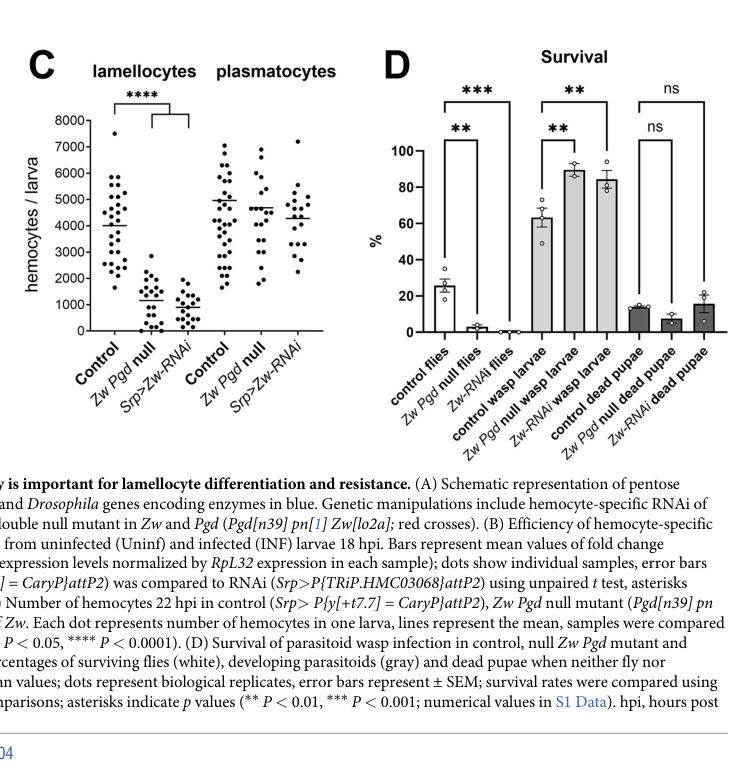

## Question

# Gene Research for Functional Annotation

## ⚠️ CRITICAL: Gene/Protein Identification Context

**BEFORE YOU BEGIN RESEARCH:** You MUST verify you are researching the CORRECT gene/protein. Gene symbols can be ambiguous, especially for less well-characterized genes from non-model organisms.

### Target Gene/Protein Identity (from UniProt):
- **UniProt Accession:** P41572
- **Protein Description:** RecName: Full=6-phosphogluconate dehydrogenase, decarboxylating; EC=1.1.1.44;
- **Gene Information:** Name=Pgd; ORFNames=CG3724;
- **Organism (full):** Drosophila melanogaster (Fruit fly).
- **Protein Family:** Belongs to the 6-phosphogluconate dehydrogenase family.
- **Key Domains:** 6-PGluconate_DH-like_C_sf. (IPR008927); 6PGD_dom2. (IPR013328); 6PGDH_C. (IPR006114); 6PGDH_Gnd/GntZ. (IPR006113); 6PGDH_NADP-bd. (IPR006115)

### MANDATORY VERIFICATION STEPS:

1. **Check if the gene symbol "Pgd" matches the protein description above**
2. **Verify the organism is correct:** Drosophila melanogaster (Fruit fly).
3. **Check if protein family/domains align with what you find in literature**
4. **If you find literature for a DIFFERENT gene with the same or similar symbol, STOP**

### If Gene Symbol is Ambiguous or You Cannot Find Relevant Literature:

**DO NOT PROCEED WITH RESEARCH ON A DIFFERENT GENE.** Instead:
- State clearly: "The gene symbol 'Pgd' is ambiguous or literature is limited for this specific protein"
- Explain what you found (e.g., "Found extensive literature on a different gene with the same symbol in a different organism")
- Describe the protein based ONLY on the UniProt information provided above
- Suggest that the protein function can be inferred from domain/family information

### Research Target:

Please provide a comprehensive research report on the gene **Pgd** (gene ID: Pgd, UniProt: P41572) in DROME.

The research report should be a detailed narrative explaining the function, biological processes, and localization of the gene product. Citations should be given for all claims.

You should prioritize authoritative reviews and primary scientific literature when conducting research. You can supplement
this with annotations you find in gene/protein databases, but these can be outdated or inaccurate.

We are specifically interested in the primary function of the gene - for enzymes, what reaction is catalyzed, and what is the substrate specificity? For transporters, what is the substrate? For structural proteins or adapters, what is the broader structural role? For signaling molecules, what is the role in the pathway.

We are interested in where in or outside the cell the gene product carries out its function.

We are also interested in the signaling or biochemical pathways in which the gene functions. We are less interested in broad pleiotropic effects, except where these elucidate the precise role.

Include evidence where possible. We are interested in both experimental evidence as well as inference from structure, evolution, or bioinformatic analysis. Precise studies should be prioritized over high-throughput, where available.

## Output

Question: You are an expert researcher providing comprehensive, well-cited information.

Provide detailed information focusing on:
1. Key concepts and definitions with current understanding
2. Recent developments and latest research (prioritize 2023-2024 sources)
3. Current applications and real-world implementations
4. Expert opinions and analysis from authoritative sources
5. Relevant statistics and data from recent studies

Format as a comprehensive research report with proper citations. Include URLs and publication dates where available.
Always prioritize recent, authoritative sources and provide specific citations for all major claims.

# Gene Research for Functional Annotation

## ⚠️ CRITICAL: Gene/Protein Identification Context

**BEFORE YOU BEGIN RESEARCH:** You MUST verify you are researching the CORRECT gene/protein. Gene symbols can be ambiguous, especially for less well-characterized genes from non-model organisms.

### Target Gene/Protein Identity (from UniProt):
- **UniProt Accession:** P41572
- **Protein Description:** RecName: Full=6-phosphogluconate dehydrogenase, decarboxylating; EC=1.1.1.44;
- **Gene Information:** Name=Pgd; ORFNames=CG3724;
- **Organism (full):** Drosophila melanogaster (Fruit fly).
- **Protein Family:** Belongs to the 6-phosphogluconate dehydrogenase family.
- **Key Domains:** 6-PGluconate_DH-like_C_sf. (IPR008927); 6PGD_dom2. (IPR013328); 6PGDH_C. (IPR006114); 6PGDH_Gnd/GntZ. (IPR006113); 6PGDH_NADP-bd. (IPR006115)

### MANDATORY VERIFICATION STEPS:

1. **Check if the gene symbol "Pgd" matches the protein description above**
2. **Verify the organism is correct:** Drosophila melanogaster (Fruit fly).
3. **Check if protein family/domains align with what you find in literature**
4. **If you find literature for a DIFFERENT gene with the same or similar symbol, STOP**

### If Gene Symbol is Ambiguous or You Cannot Find Relevant Literature:

**DO NOT PROCEED WITH RESEARCH ON A DIFFERENT GENE.** Instead:
- State clearly: "The gene symbol 'Pgd' is ambiguous or literature is limited for this specific protein"
- Explain what you found (e.g., "Found extensive literature on a different gene with the same symbol in a different organism")
- Describe the protein based ONLY on the UniProt information provided above
- Suggest that the protein function can be inferred from domain/family information

### Research Target:

Please provide a comprehensive research report on the gene **Pgd** (gene ID: Pgd, UniProt: P41572) in DROME.

The research report should be a detailed narrative explaining the function, biological processes, and localization of the gene product. Citations should be given for all claims.

You should prioritize authoritative reviews and primary scientific literature when conducting research. You can supplement
this with annotations you find in gene/protein databases, but these can be outdated or inaccurate.

We are specifically interested in the primary function of the gene - for enzymes, what reaction is catalyzed, and what is the substrate specificity? For transporters, what is the substrate? For structural proteins or adapters, what is the broader structural role? For signaling molecules, what is the role in the pathway.

We are interested in where in or outside the cell the gene product carries out its function.

We are also interested in the signaling or biochemical pathways in which the gene functions. We are less interested in broad pleiotropic effects, except where these elucidate the precise role.

Include evidence where possible. We are interested in both experimental evidence as well as inference from structure, evolution, or bioinformatic analysis. Precise studies should be prioritized over high-throughput, where available.

# Functional annotation of *Pgd* in *Drosophila melanogaster*

## Identity and principal function

**The fly *Pgd* gene encodes 6-phosphogluconate dehydrogenase (6PGDH), not glucose-6-phosphate dehydrogenase.** Classical *D. melanogaster* genetics assigns 6PGDH activity and electrophoretic variants to *Pgd*; the distinct *Zw* locus controls glucose-6-phosphate dehydrogenase (G6PD). Purification of the *Pgd* A isozyme provides direct biochemical confirmation. The accession **P41572** and ORF name **CG3724** are the identifiers supplied in the question; the retrieved historical experiments establish the fly gene–enzyme relationship but do not independently cross-reference those modern identifiers. (gerasimova1979maternaleffectfor pages 1-3, gvozdev1976roleofthe pages 1-2, williamson19806phosphogluconatedehydrogenasefrom pages 1-4)

*Pgd* performs the **NADP⁺-dependent oxidative decarboxylation** at the end of the oxidative pentose phosphate pathway (PPP):

**6-phosphogluconate + NADP⁺ → D-ribulose-5-phosphate + CO₂ + NADPH + H⁺.**

The purified fly enzyme was assayed with 6-phosphogluconate and NADP⁺; measured apparent Michaelis constants were **81 µM** and **22.3 µM**, respectively. NADPH competitively inhibited the purified enzyme. These data establish its physiological substrate and measured cofactor dependence, but the available characterization does **not** establish an exhaustive specificity profile against alternative sugar acids or dinucleotide cofactors. Ribulose-5-phosphate is the **direct product**; conversion to ribose-5-phosphate for nucleotide synthesis requires a subsequent isomerase. (williamson19806phosphogluconatedehydrogenasefrom pages 8-11, williamson19806phosphogluconatedehydrogenasefrom pages 1-4, kovarova2016thepentosephosphate pages 1-2)

The supplied UniProt domain assignments—including an NADP-binding 6PGDH domain and conserved 6PGDH catalytic/C-terminal regions—are consistent with this experimentally determined activity. They support family-based annotation, rather than independently demonstrating fly-specific active-site residues or alternative reactions. An older fly purification paper printed **EC 1.1.1.43**, despite describing the NADP⁺-dependent decarboxylating reaction; a later authoritative PPP review identifies 6PGDH as **EC 1.1.1.44**, matching the designation supplied for P41572. The discrepancy in printed EC numbers should not be mistaken for experimental evidence of a different fly enzyme. (williamson19806phosphogluconatedehydrogenasefrom pages 1-4, stincone2015thereturnof pages 5-5)

## Site of action and biochemical pathway

**Pgd acts predominantly in the cytosol.** In adult-fly fractionation, **99.8% of measured 6PGDH activity** occurred in the 105,000×*g* supernatant, versus **0.2%** in the microsomal fraction; activity was not detected in the reported nuclear-pellet or mitochondrial fractions. Purified A isozyme had an apparent native mass of **105 kDa** and was interpreted as a dimer, with approximately **55- and 53-kDa** bands on SDS gels. This is evidence for cytosolic enzyme activity, not evidence for secretion, membrane transport, or a mitochondrial catalytic role. (williamson19806phosphogluconatedehydrogenasefrom pages 1-4, williamson19806phosphogluconatedehydrogenasefrom pages 4-8)

In pathway order, Zw/G6PD oxidizes glucose-6-phosphate, a lactonase produces **6-phosphogluconate**, and Pgd converts that intermediate into **ribulose-5-phosphate, CO₂ and a second NADPH**. Thus, one passage of glucose-6-phosphate through the oxidative PPP generates **two NADPH** overall, of which **one** arises at the Pgd step. Downstream nonoxidative reactions can rearrange pentose phosphates into glycolytic intermediates; their return toward glucose-6-phosphate enables the **cyclic PPP** observed in activated fly immune cells. Cytosolic NADPH can support reductive biosynthesis and redox-dependent processes, but the use of any particular Pgd-derived NADPH molecule by a downstream process generally requires additional flux or perturbation evidence. (kovarova2016thepentosephosphate pages 1-2, stincone2015thereturnof pages 5-5, stincone2015thereturnof pages 1-2, kazek2024glucoseandtrehalose pages 21-22)

## Experimental biological roles and recent developments

Historical **single-gene *Pgd* mutations** establish the importance of clearing its substrate. Severe alleles with very little 6PGDH activity greatly reduced viability; a reported null-activity allele retained only **1.5% of wild-type viability** under the conditions studied. Upstream *Zw* mutations suppressed *Pgd*-null lethality, yielding viable, fertile animals despite disruption of both oxidative-PPP dehydrogenase steps. In nutritional experiments, the reported relative survival of null males to the third instar was **0.32 ± 0.00 on fructose** and **0.24 ± 0.03 on linolenate**, versus **0.07 ± 0.09 on glucose**. Together, genetic suppression and dietary effects favor a model in which **6-phosphogluconate buildup or its associated metabolic imbalance** is especially harmful; they argue against explaining null lethality solely as loss of PPP-derived NADPH. Direct quantitative measurement of the proposed toxic intermediate was not established by those experiments, and developmental arrest varied with diet and culture conditions. Maternal *Pgd* products can persist during larval development, further complicating the timing of null phenotypes. (hughes1978dietaryrescueof pages 1-4, hughes1978dietaryrescueof pages 4-7, gvozdev1976roleofthe pages 2-4, gerasimova1979maternaleffectfor pages 10-11)

**2024—parasitoid immunity.** Kazek and colleagues combined metabolite tracing and fly genetics to show increased sugar use and cyclic PPP activity in infection-activated hemocytes. Following parasitoid infection, a viable ***Pgd*/*Zw* double mutant** and, separately, **hemocyte-specific *Zw* RNAi** both reduced lamellocyte numbers and larval survival without detectably changing plasmatocyte numbers. Their interpretation is that oxidative-PPP metabolism supports lamellocyte differentiation and effective resistance, with NADPH availability a plausible contributor. **The hemocyte RNAi targeted *Zw*, not *Pgd***: the experiment does not isolate a *Pgd*-specific immune phenotype or directly quantify NADPH flux through Pgd. Figure 4 presents the genotype comparisons and infection outcomes. Kazek *et al.*, *PLOS Biology*, **7 May 2024**, https://doi.org/10.1371/journal.pbio.3002299. (kazek2024glucoseandtrehalose pages 10-11, kazek2024glucoseandtrehalose pages 11-13, kazek2024glucoseandtrehalose media 0278e00b)

**2024—mitochondrial stress interaction.** In another fly application of pathway genetics, a ***Pgd*/*Zw* mutant background** aggravated developmental defects associated with depletion of mitochondrial complex-I components ND49 or ND51. This demonstrates an organism-level interaction between oxidative-PPP capacity and complex-I dysfunction. It does **not**, by itself, resolve the contribution of *Pgd* versus *Zw*, measure NADPH in the affected flies, or establish the cell-specific mechanism. del Prado *et al.*, *Nature Communications*, **October 2024**, https://doi.org/10.1038/s41467-024-52968-1. (prado2024compensatoryactivityof pages 3-4, prado2024compensatoryactivityof pages 2-3, prado2024compensatoryactivityof pages 16-17)

**2025—astrocyte redox signaling.** Rabah and colleagues reported that astrocytic knockdown of *Pgd*, as well as another PPP enzyme, corroborated a long-term-memory deficit initially found after G6PD knockdown. Their broader experimental model links astrocytic PPP activity to NADPH oxidase–dependent superoxide production, conversion to H₂O₂, and signaling to mushroom-body neurons. The accessible report does not provide a separate quantitative *Pgd*-RNAi effect or a direct measurement of NADPH production by fly Pgd; accordingly, the precise *Pgd*→NADPH oxidase flux relationship remains a mechanistic interpretation rather than a directly measured gene-specific flux. Rabah *et al.*, *Nature Metabolism*, **January 2025**, https://doi.org/10.1038/s42255-024-01189-3. (rabah2025astrocytetoneuronh2o2signalling pages 3-4, rabah2025astrocytetoneuronh2o2signalling pages 2-3, rabah2025astrocytetoneuronh2o2signalling pages 5-6)

The following summary distinguishes direct fly-enzyme evidence from conclusions based on combined mutations or pathway-level experiments. (williamson19806phosphogluconatedehydrogenasefrom pages 8-11, kazek2024glucoseandtrehalose pages 11-13, prado2024compensatoryactivityof pages 3-4)

| Conclusion | Direct evidence (study, date, URL) | Limitation / inference |
|---|---|---|
| **Fly Pgd encodes a cytosolic, NADP⁺-dependent 6-phosphogluconate dehydrogenase.** Purified A isozyme oxidatively decarboxylated 6-phosphogluconate; measured *K*ₘ values were **81 µM for 6-phosphogluconate** and **22.3 µM for NADP⁺**. The native enzyme was approximately **105 kDa**, consistent with a dimer of approximately 55- and 53-kDa subunits; **99.8%** of fractionated activity was in the 105,000×*g* supernatant. | Williamson, Krochko & Geer, **February 1980**, *Biochemical Genetics*. [DOI](https://doi.org/10.1007/bf00504362) (williamson19806phosphogluconatedehydrogenasefrom pages 8-11, williamson19806phosphogluconatedehydrogenasefrom pages 1-4, williamson19806phosphogluconatedehydrogenasefrom pages 4-8) | Strong, direct fly biochemical evidence. The study did not systematically test alternative sugar-acid substrates or cofactors. Its printed EC 1.1.1.43 conflicts with current EC 1.1.1.44 nomenclature for NADP⁺-dependent 6PGDH; the demonstrated chemistry and cofactor agree with the current assignment. It does not independently verify the user-supplied P41572–CG3724 mapping. (stincone2015thereturnof pages 5-5, williamson19806phosphogluconatedehydrogenasefrom pages 1-4) |
| **Loss of Pgd activity is deleterious because pathway blockade causes metabolic imbalance—especially 6-phosphogluconate accumulation—not simply because oxidative-PPP NADPH production is absent.** Severe/null Pgd alleles showed very low viability or larval arrest; upstream **Zw/G6PD loss suppressed Pgd-null lethality**, producing viable, fertile males. Fructose or linolenate improved third-instar survival relative to glucose (**0.32 ± 0.00** and **0.24 ± 0.03** versus **0.07 ± 0.09**, respectively), while added glucose weakened rescue. | Gvozdev *et al.*, **April 1976**, *FEBS Letters*: [DOI](https://doi.org/10.1016/0014-5793(76)80255-4); Hughes & Lucchesi, **June 1978**, *Biochemical Genetics*: [DOI](https://doi.org/10.1007/bf00484212) (hughes1978dietaryrescueof pages 4-7, hughes1978dietaryrescueof pages 1-4, gvozdev1976roleofthe pages 1-2, gvozdev1976roleofthe pages 2-4) | Single-Pgd mutant and nutritional/genetic-suppression evidence is strong, but 6-phosphogluconate toxicity was inferred from pathway genetics and diet rather than quantified directly. Developmental arrest varied with allele and culture conditions. Maternal Pgd products can persist and complicate null-phenotype timing. (gerasimova1979maternaleffectfor pages 1-3, gerasimova1979maternaleffectfor pages 10-11, gerasimova1979maternaleffectfor pages 3-6) |
| **The oxidative PPP supports Drosophila cellular immunity against parasitoids.** A viable **Pgd[n39] Zw[lo2a] double mutant** and hemocyte-specific **Zw RNAi** left plasmatocyte abundance unchanged but reduced infection-induced lamellocyte numbers and larval survival, supporting a requirement for oxidative-PPP metabolism in lamellocyte differentiation and parasitoid killing. | Kazek *et al.*, **7 May 2024**, *PLOS Biology*. [DOI](https://doi.org/10.1371/journal.pbio.3002299) (kazek2024glucoseandtrehalose pages 10-11, kazek2024glucoseandtrehalose pages 11-13, kazek2024glucoseandtrehalose media 0278e00b) | The mutant simultaneously disrupts **Pgd and Zw**, whereas the cell-specific RNAi targets **Zw alone**. Accordingly, this study establishes a pathway-level requirement but cannot assign the immune phenotype specifically to Pgd; it did not report a Pgd-specific hemocyte knockdown or direct Pgd-dependent NADPH measurement. |
| **Oxidative-PPP impairment genetically aggravates mitochondrial complex-I dysfunction in flies.** The combined **Pgd39 Zwlo2a** background exacerbated developmental defects caused by ND49/ND51 depletion, with severe combinations failing normal development and dying as undeveloped pupae. | del Prado *et al.*, **October 2024**, *Nature Communications*. [DOI](https://doi.org/10.1038/s41467-024-52968-1) (prado2024compensatoryactivityof pages 3-4, prado2024compensatoryactivityof pages 2-3, prado2024compensatoryactivityof pages 16-17) | This is a **combined Zw/Pgd** perturbation, not unambiguous Pgd-only evidence. The fly experiment demonstrates a genetic interaction but does **not** directly measure fly NADPH or establish astrocyte-versus-neuron differences; associated NADPH and cell-type data came from mammalian systems. |
| **Astrocytic PPP activity, including Pgd, contributes to long-term memory-associated redox signaling.** The authors reported that astrocytic **Pgd** and **Pgls** knockdowns confirmed the long-term-memory defect first demonstrated with G6PD knockdown, supporting a model in which astrocytic PPP-derived NADPH fuels Nox-dependent superoxide/H₂O₂ signaling to mushroom-body neurons. | Rabah *et al.*, **January 2025**, *Nature Metabolism*. [DOI](https://doi.org/10.1038/s42255-024-01189-3) (rabah2025astrocytetoneuronh2o2signalling pages 3-4, rabah2025astrocytetoneuronh2o2signalling pages 2-3, rabah2025astrocytetoneuronh2o2signalling pages 5-6) | The accessible text states that Pgd RNAi corroborated the result, but its Pgd-specific sample size, effect magnitude, test statistic and *P* value were confined to inaccessible extended data. Direct NADPH concentration was not measured in the cited Pgd experiment, so the NADPH-to-Nox mechanism is a pathway-supported interpretation rather than a Pgd-specific flux measurement. |

*Table: Direct and qualified evidence supporting functional annotation of Drosophila Pgd/6PGDH, from purified-enzyme biochemistry through recent immunity, mitochondrial-stress and memory studies. The user-supplied P41572–CG3724 mapping is not treated as independently verified.*

## Annotation assessment

The **high-confidence primary annotation** for *D. melanogaster Pgd* is a **cytosolic, NADP⁺-dependent, decarboxylating 6-phosphogluconate dehydrogenase** supplying ribulose-5-phosphate and NADPH in the oxidative PPP. Purified-protein assays, fractionation and allele-specific genetics support that assignment more directly than domain predictions alone. Its contributions to immune-cell activation, resistance to combined metabolic stresses and astrocytic redox signaling are credible applications of this biochemical role, but several recent fly studies perturb *Pgd* **together with *Zw***; their phenotypes must not be presented as effects uniquely attributable to Pgd. (williamson19806phosphogluconatedehydrogenasefrom pages 8-11, williamson19806phosphogluconatedehydrogenasefrom pages 4-8, hughes1978dietaryrescueof pages 1-4, kazek2024glucoseandtrehalose pages 11-13, prado2024compensatoryactivityof pages 3-4, rabah2025astrocytetoneuronh2o2signalling pages 3-4)

References

1. (gerasimova1979maternaleffectfor pages 1-3): T. I. Gerasimova and S. G. Smirnova. Maternal effect for genes encoding 6-phosphogluconate dehydrogenase and glucose-6-phosphate dehydrogenase in drosophila melanogaster. Developmental Genetics, 1:97-107, Jan 1979. URL: https://doi.org/10.1002/dvg.1020010110, doi:10.1002/dvg.1020010110. This article has 9 citations.

2. (gvozdev1976roleofthe pages 1-2): V.A. Gvozdev, T.I. Gerasimova, G.L. Kogan, and O.Yu. Braslavskaya. Role of the pentose phosphate pathway in metabolism of drosophila melanogaster elucidated by mutations affecting glucose 6‐phosphate and 6‐phosphogluconate dehydrogenases. FEBS Letters, 64:85-88, Apr 1976. URL: https://doi.org/10.1016/0014-5793(76)80255-4, doi:10.1016/0014-5793(76)80255-4. This article has 41 citations and is from a peer-reviewed journal.

3. (williamson19806phosphogluconatedehydrogenasefrom pages 1-4): John H. Williamson, Diane Krochko, and Billy W. Geer. 6-phosphogluconate dehydrogenase from drosophila melanogaster. i. purification and properties of the a isozyme. Biochemical Genetics, 18:87-101, Feb 1980. URL: https://doi.org/10.1007/bf00504362, doi:10.1007/bf00504362. This article has 27 citations and is from a peer-reviewed journal.

4. (williamson19806phosphogluconatedehydrogenasefrom pages 8-11): John H. Williamson, Diane Krochko, and Billy W. Geer. 6-phosphogluconate dehydrogenase from drosophila melanogaster. i. purification and properties of the a isozyme. Biochemical Genetics, 18:87-101, Feb 1980. URL: https://doi.org/10.1007/bf00504362, doi:10.1007/bf00504362. This article has 27 citations and is from a peer-reviewed journal.

5. (kovarova2016thepentosephosphate pages 1-2): Julie Kovářová and Michael P. Barrett. The pentose phosphate pathway in parasitic trypanosomatids. Trends in parasitology, 32 8:622-634, Aug 2016. URL: https://doi.org/10.1016/j.pt.2016.04.010, doi:10.1016/j.pt.2016.04.010. This article has 98 citations and is from a domain leading peer-reviewed journal.

6. (stincone2015thereturnof pages 5-5): Anna Stincone, Alessandro Prigione, Thorsten Cramer, Mirjam M. C. Wamelink, Kate Campbell, Eric Cheung, Viridiana Olin‐Sandoval, Nana‐Maria Grüning, Antje Krüger, Mohammad Tauqeer Alam, Markus A. Keller, Michael Breitenbach, Kevin M. Brindle, Joshua D. Rabinowitz, and Markus Ralser. The return of metabolism: biochemistry and physiology of the pentose phosphate pathway. Biological reviews of the Cambridge Philosophical Society, 90:927-963, Sep 2015. URL: https://doi.org/10.1111/brv.12140, doi:10.1111/brv.12140. This article has 1979 citations.

7. (williamson19806phosphogluconatedehydrogenasefrom pages 4-8): John H. Williamson, Diane Krochko, and Billy W. Geer. 6-phosphogluconate dehydrogenase from drosophila melanogaster. i. purification and properties of the a isozyme. Biochemical Genetics, 18:87-101, Feb 1980. URL: https://doi.org/10.1007/bf00504362, doi:10.1007/bf00504362. This article has 27 citations and is from a peer-reviewed journal.

8. (stincone2015thereturnof pages 1-2): Anna Stincone, Alessandro Prigione, Thorsten Cramer, Mirjam M. C. Wamelink, Kate Campbell, Eric Cheung, Viridiana Olin‐Sandoval, Nana‐Maria Grüning, Antje Krüger, Mohammad Tauqeer Alam, Markus A. Keller, Michael Breitenbach, Kevin M. Brindle, Joshua D. Rabinowitz, and Markus Ralser. The return of metabolism: biochemistry and physiology of the pentose phosphate pathway. Biological reviews of the Cambridge Philosophical Society, 90:927-963, Sep 2015. URL: https://doi.org/10.1111/brv.12140, doi:10.1111/brv.12140. This article has 1979 citations.

9. (kazek2024glucoseandtrehalose pages 21-22): Michalina Kazek, Lenka Chodáková, Katharina Lehr, Lukáš Strych, Pavla Nedbalová, Ellen McMullen, Adam Bajgar, Stanislav Opekar, Petr Šimek, Martin Moos, and Tomáš Doležal. Glucose and trehalose metabolism through the cyclic pentose phosphate pathway shapes pathogen resistance and host protection in drosophila. PLOS Biology, 22:e3002299, May 2024. URL: https://doi.org/10.1371/journal.pbio.3002299, doi:10.1371/journal.pbio.3002299. This article has 29 citations and is from a highest quality peer-reviewed journal.

10. (hughes1978dietaryrescueof pages 1-4): M. Beatrice Hughes and John C. Lucchesi. Dietary rescue of a lethal “null” activity allele of 6-phosphogluconate dehydrogenase in drosophila melanogaster. Biochemical Genetics, 16:469-475, Jun 1978. URL: https://doi.org/10.1007/bf00484212, doi:10.1007/bf00484212. This article has 16 citations and is from a peer-reviewed journal.

11. (hughes1978dietaryrescueof pages 4-7): M. Beatrice Hughes and John C. Lucchesi. Dietary rescue of a lethal “null” activity allele of 6-phosphogluconate dehydrogenase in drosophila melanogaster. Biochemical Genetics, 16:469-475, Jun 1978. URL: https://doi.org/10.1007/bf00484212, doi:10.1007/bf00484212. This article has 16 citations and is from a peer-reviewed journal.

12. (gvozdev1976roleofthe pages 2-4): V.A. Gvozdev, T.I. Gerasimova, G.L. Kogan, and O.Yu. Braslavskaya. Role of the pentose phosphate pathway in metabolism of drosophila melanogaster elucidated by mutations affecting glucose 6‐phosphate and 6‐phosphogluconate dehydrogenases. FEBS Letters, 64:85-88, Apr 1976. URL: https://doi.org/10.1016/0014-5793(76)80255-4, doi:10.1016/0014-5793(76)80255-4. This article has 41 citations and is from a peer-reviewed journal.

13. (gerasimova1979maternaleffectfor pages 10-11): T. I. Gerasimova and S. G. Smirnova. Maternal effect for genes encoding 6-phosphogluconate dehydrogenase and glucose-6-phosphate dehydrogenase in drosophila melanogaster. Developmental Genetics, 1:97-107, Jan 1979. URL: https://doi.org/10.1002/dvg.1020010110, doi:10.1002/dvg.1020010110. This article has 9 citations.

14. (kazek2024glucoseandtrehalose pages 10-11): Michalina Kazek, Lenka Chodáková, Katharina Lehr, Lukáš Strych, Pavla Nedbalová, Ellen McMullen, Adam Bajgar, Stanislav Opekar, Petr Šimek, Martin Moos, and Tomáš Doležal. Glucose and trehalose metabolism through the cyclic pentose phosphate pathway shapes pathogen resistance and host protection in drosophila. PLOS Biology, 22:e3002299, May 2024. URL: https://doi.org/10.1371/journal.pbio.3002299, doi:10.1371/journal.pbio.3002299. This article has 29 citations and is from a highest quality peer-reviewed journal.

15. (kazek2024glucoseandtrehalose pages 11-13): Michalina Kazek, Lenka Chodáková, Katharina Lehr, Lukáš Strych, Pavla Nedbalová, Ellen McMullen, Adam Bajgar, Stanislav Opekar, Petr Šimek, Martin Moos, and Tomáš Doležal. Glucose and trehalose metabolism through the cyclic pentose phosphate pathway shapes pathogen resistance and host protection in drosophila. PLOS Biology, 22:e3002299, May 2024. URL: https://doi.org/10.1371/journal.pbio.3002299, doi:10.1371/journal.pbio.3002299. This article has 29 citations and is from a highest quality peer-reviewed journal.

16. (kazek2024glucoseandtrehalose media 0278e00b): Michalina Kazek, Lenka Chodáková, Katharina Lehr, Lukáš Strych, Pavla Nedbalová, Ellen McMullen, Adam Bajgar, Stanislav Opekar, Petr Šimek, Martin Moos, and Tomáš Doležal. Glucose and trehalose metabolism through the cyclic pentose phosphate pathway shapes pathogen resistance and host protection in drosophila. PLOS Biology, 22:e3002299, May 2024. URL: https://doi.org/10.1371/journal.pbio.3002299, doi:10.1371/journal.pbio.3002299. This article has 29 citations and is from a highest quality peer-reviewed journal.

17. (prado2024compensatoryactivityof pages 3-4): Lucia del Prado, Myriam Jaraíz-Rodríguez, Mauro Agro, Marcos Zamora-Dorta, Natalia Azpiazu, Manuel Calleja, Mario Lopez-Manzaneda, Jaime de Juan-Sanz, Alba Fernández-Rodrigo, José A. Esteban, Mònica Girona, Albert Quintana, and Eduardo Balsa. Compensatory activity of the pc-me1 metabolic axis underlies differential sensitivity to mitochondrial complex i inhibition. Nature Communications, Oct 2024. URL: https://doi.org/10.1038/s41467-024-52968-1, doi:10.1038/s41467-024-52968-1. This article has 17 citations and is from a highest quality peer-reviewed journal.

18. (prado2024compensatoryactivityof pages 2-3): Lucia del Prado, Myriam Jaraíz-Rodríguez, Mauro Agro, Marcos Zamora-Dorta, Natalia Azpiazu, Manuel Calleja, Mario Lopez-Manzaneda, Jaime de Juan-Sanz, Alba Fernández-Rodrigo, José A. Esteban, Mònica Girona, Albert Quintana, and Eduardo Balsa. Compensatory activity of the pc-me1 metabolic axis underlies differential sensitivity to mitochondrial complex i inhibition. Nature Communications, Oct 2024. URL: https://doi.org/10.1038/s41467-024-52968-1, doi:10.1038/s41467-024-52968-1. This article has 17 citations and is from a highest quality peer-reviewed journal.

19. (prado2024compensatoryactivityof pages 16-17): Lucia del Prado, Myriam Jaraíz-Rodríguez, Mauro Agro, Marcos Zamora-Dorta, Natalia Azpiazu, Manuel Calleja, Mario Lopez-Manzaneda, Jaime de Juan-Sanz, Alba Fernández-Rodrigo, José A. Esteban, Mònica Girona, Albert Quintana, and Eduardo Balsa. Compensatory activity of the pc-me1 metabolic axis underlies differential sensitivity to mitochondrial complex i inhibition. Nature Communications, Oct 2024. URL: https://doi.org/10.1038/s41467-024-52968-1, doi:10.1038/s41467-024-52968-1. This article has 17 citations and is from a highest quality peer-reviewed journal.

20. (rabah2025astrocytetoneuronh2o2signalling pages 3-4): Yasmine Rabah, Jean-Paul Berwick, Nisrine Sagar, Laure Pasquer, Pierre-Yves Plaçais, and Thomas Preat. Astrocyte-to-neuron h2o2 signalling supports long-term memory formation in drosophila and is impaired in an alzheimer’s disease model. Nature Metabolism, 7:321-335, Jan 2025. URL: https://doi.org/10.1038/s42255-024-01189-3, doi:10.1038/s42255-024-01189-3. This article has 29 citations and is from a domain leading peer-reviewed journal.

21. (rabah2025astrocytetoneuronh2o2signalling pages 2-3): Yasmine Rabah, Jean-Paul Berwick, Nisrine Sagar, Laure Pasquer, Pierre-Yves Plaçais, and Thomas Preat. Astrocyte-to-neuron h2o2 signalling supports long-term memory formation in drosophila and is impaired in an alzheimer’s disease model. Nature Metabolism, 7:321-335, Jan 2025. URL: https://doi.org/10.1038/s42255-024-01189-3, doi:10.1038/s42255-024-01189-3. This article has 29 citations and is from a domain leading peer-reviewed journal.

22. (rabah2025astrocytetoneuronh2o2signalling pages 5-6): Yasmine Rabah, Jean-Paul Berwick, Nisrine Sagar, Laure Pasquer, Pierre-Yves Plaçais, and Thomas Preat. Astrocyte-to-neuron h2o2 signalling supports long-term memory formation in drosophila and is impaired in an alzheimer’s disease model. Nature Metabolism, 7:321-335, Jan 2025. URL: https://doi.org/10.1038/s42255-024-01189-3, doi:10.1038/s42255-024-01189-3. This article has 29 citations and is from a domain leading peer-reviewed journal.

23. (gerasimova1979maternaleffectfor pages 3-6): T. I. Gerasimova and S. G. Smirnova. Maternal effect for genes encoding 6-phosphogluconate dehydrogenase and glucose-6-phosphate dehydrogenase in drosophila melanogaster. Developmental Genetics, 1:97-107, Jan 1979. URL: https://doi.org/10.1002/dvg.1020010110, doi:10.1002/dvg.1020010110. This article has 9 citations.

## Artifacts

- [Edison artifact artifact-00](Pgd-deep-research-falcon_artifacts/artifact-00.md)

## Citations

1. gerasimova1979maternaleffectfor pages 1-3
2. gvozdev1976roleofthe pages 1-2
3. kovarova2016thepentosephosphate pages 1-2
4. stincone2015thereturnof pages 5-5
5. stincone2015thereturnof pages 1-2
6. kazek2024glucoseandtrehalose pages 21-22
7. hughes1978dietaryrescueof pages 1-4
8. hughes1978dietaryrescueof pages 4-7
9. gvozdev1976roleofthe pages 2-4
10. gerasimova1979maternaleffectfor pages 10-11
11. kazek2024glucoseandtrehalose pages 10-11
12. kazek2024glucoseandtrehalose pages 11-13
13. prado2024compensatoryactivityof pages 3-4
14. prado2024compensatoryactivityof pages 2-3
15. prado2024compensatoryactivityof pages 16-17
16. gerasimova1979maternaleffectfor pages 3-6
17. DOI
18. n39
19. lo2a
20. https://doi.org/10.1371/journal.pbio.3002299.
21. https://doi.org/10.1038/s41467-024-52968-1.
22. https://doi.org/10.1038/s42255-024-01189-3.
23. https://doi.org/10.1007/bf00504362
24. https://doi.org/10.1016/0014-5793(76
25. https://doi.org/10.1007/bf00484212
26. https://doi.org/10.1371/journal.pbio.3002299
27. https://doi.org/10.1038/s41467-024-52968-1
28. https://doi.org/10.1038/s42255-024-01189-3
29. https://doi.org/10.1002/dvg.1020010110,
30. https://doi.org/10.1007/bf00504362,
31. https://doi.org/10.1016/j.pt.2016.04.010,
32. https://doi.org/10.1111/brv.12140,
33. https://doi.org/10.1371/journal.pbio.3002299,
34. https://doi.org/10.1007/bf00484212,
35. https://doi.org/10.1038/s41467-024-52968-1,
36. https://doi.org/10.1038/s42255-024-01189-3,