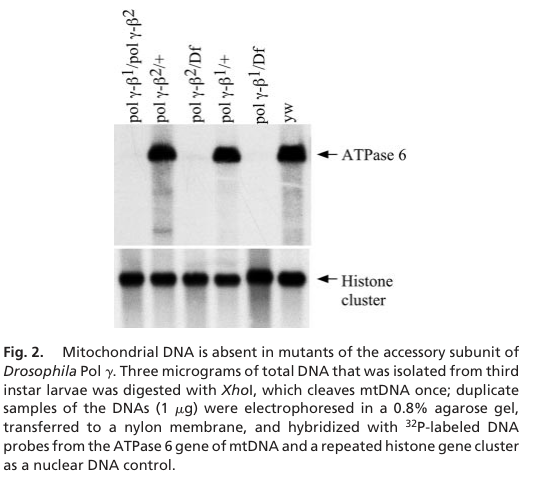

## Question

# Gene Research for Functional Annotation

## ⚠️ CRITICAL: Gene/Protein Identification Context

**BEFORE YOU BEGIN RESEARCH:** You MUST verify you are researching the CORRECT gene/protein. Gene symbols can be ambiguous, especially for less well-characterized genes from non-model organisms.

### Target Gene/Protein Identity (from UniProt):
- **UniProt Accession:** Q9VJV8
- **Protein Description:** RecName: Full=DNA polymerase subunit gamma-2, mitochondrial {ECO:0000305}; AltName: Full=DNA polymerase beta subunit {ECO:0000303|PubMed:10930405, ECO:0000303|PubMed:9153213}; AltName: Full=DNA polymerase gamma 35kD subunit {ECO:0000303|PubMed:3095323}; AltName: Full=DNA polymerase gamma subunit 2 {ECO:0000312|FlyBase:FBgn0004407}; Flags: Precursor;
- **Gene Information:** Name=PolG2 {ECO:0000312|FlyBase:FBgn0004407}; Synonyms=DNApol-gamma {ECO:0000312|FlyBase:FBgn0004407}, DNApol-gamma35 {ECO:0000303|PubMed:3095323}, DNApolG2 {ECO:0000305}, l(2)34De {ECO:0000312|FlyBase:FBgn0004407}, l(2)br16 {ECO:0000312|FlyBase:FBgn0004407}, MtPolB {ECO:0000312|FlyBase:FBgn0004407}, pol gamma-beta {ECO:0000303|PubMed:10930405}; ORFNames=CG33650 {ECO:0000312|FlyBase:FBgn0004407};
- **Organism (full):** Drosophila melanogaster (Fruit fly).
- **Protein Family:** Not specified in UniProt
- **Key Domains:** aa-tRNA-synth_II/BPL/LPL. (IPR045864); Anticodon-bd. (IPR004154); Anticodon-bd_dom_sf. (IPR036621); Gly-tRNA_synthase/POLG2. (IPR027031); POLG2_C. (IPR042064)

### MANDATORY VERIFICATION STEPS:

1. **Check if the gene symbol "PolG2" matches the protein description above**
2. **Verify the organism is correct:** Drosophila melanogaster (Fruit fly).
3. **Check if protein family/domains align with what you find in literature**
4. **If you find literature for a DIFFERENT gene with the same or similar symbol, STOP**

### If Gene Symbol is Ambiguous or You Cannot Find Relevant Literature:

**DO NOT PROCEED WITH RESEARCH ON A DIFFERENT GENE.** Instead:
- State clearly: "The gene symbol 'PolG2' is ambiguous or literature is limited for this specific protein"
- Explain what you found (e.g., "Found extensive literature on a different gene with the same symbol in a different organism")
- Describe the protein based ONLY on the UniProt information provided above
- Suggest that the protein function can be inferred from domain/family information

### Research Target:

Please provide a comprehensive research report on the gene **PolG2** (gene ID: PolG2, UniProt: Q9VJV8) in DROME.

The research report should be a detailed narrative explaining the function, biological processes, and localization of the gene product. Citations should be given for all claims.

You should prioritize authoritative reviews and primary scientific literature when conducting research. You can supplement
this with annotations you find in gene/protein databases, but these can be outdated or inaccurate.

We are specifically interested in the primary function of the gene - for enzymes, what reaction is catalyzed, and what is the substrate specificity? For transporters, what is the substrate? For structural proteins or adapters, what is the broader structural role? For signaling molecules, what is the role in the pathway.

We are interested in where in or outside the cell the gene product carries out its function.

We are also interested in the signaling or biochemical pathways in which the gene functions. We are less interested in broad pleiotropic effects, except where these elucidate the precise role.

Include evidence where possible. We are interested in both experimental evidence as well as inference from structure, evolution, or bioinformatic analysis. Precise studies should be prioritized over high-throughput, where available.

## Output

Question: You are an expert researcher providing comprehensive, well-cited information.

Provide detailed information focusing on:
1. Key concepts and definitions with current understanding
2. Recent developments and latest research (prioritize 2023-2024 sources)
3. Current applications and real-world implementations
4. Expert opinions and analysis from authoritative sources
5. Relevant statistics and data from recent studies

Format as a comprehensive research report with proper citations. Include URLs and publication dates where available.
Always prioritize recent, authoritative sources and provide specific citations for all major claims.

# Gene Research for Functional Annotation

## ⚠️ CRITICAL: Gene/Protein Identification Context

**BEFORE YOU BEGIN RESEARCH:** You MUST verify you are researching the CORRECT gene/protein. Gene symbols can be ambiguous, especially for less well-characterized genes from non-model organisms.

### Target Gene/Protein Identity (from UniProt):
- **UniProt Accession:** Q9VJV8
- **Protein Description:** RecName: Full=DNA polymerase subunit gamma-2, mitochondrial {ECO:0000305}; AltName: Full=DNA polymerase beta subunit {ECO:0000303|PubMed:10930405, ECO:0000303|PubMed:9153213}; AltName: Full=DNA polymerase gamma 35kD subunit {ECO:0000303|PubMed:3095323}; AltName: Full=DNA polymerase gamma subunit 2 {ECO:0000312|FlyBase:FBgn0004407}; Flags: Precursor;
- **Gene Information:** Name=PolG2 {ECO:0000312|FlyBase:FBgn0004407}; Synonyms=DNApol-gamma {ECO:0000312|FlyBase:FBgn0004407}, DNApol-gamma35 {ECO:0000303|PubMed:3095323}, DNApolG2 {ECO:0000305}, l(2)34De {ECO:0000312|FlyBase:FBgn0004407}, l(2)br16 {ECO:0000312|FlyBase:FBgn0004407}, MtPolB {ECO:0000312|FlyBase:FBgn0004407}, pol gamma-beta {ECO:0000303|PubMed:10930405}; ORFNames=CG33650 {ECO:0000312|FlyBase:FBgn0004407};
- **Organism (full):** Drosophila melanogaster (Fruit fly).
- **Protein Family:** Not specified in UniProt
- **Key Domains:** aa-tRNA-synth_II/BPL/LPL. (IPR045864); Anticodon-bd. (IPR004154); Anticodon-bd_dom_sf. (IPR036621); Gly-tRNA_synthase/POLG2. (IPR027031); POLG2_C. (IPR042064)

### MANDATORY VERIFICATION STEPS:

1. **Check if the gene symbol "PolG2" matches the protein description above**
2. **Verify the organism is correct:** Drosophila melanogaster (Fruit fly).
3. **Check if protein family/domains align with what you find in literature**
4. **If you find literature for a DIFFERENT gene with the same or similar symbol, STOP**

### If Gene Symbol is Ambiguous or You Cannot Find Relevant Literature:

**DO NOT PROCEED WITH RESEARCH ON A DIFFERENT GENE.** Instead:
- State clearly: "The gene symbol 'PolG2' is ambiguous or literature is limited for this specific protein"
- Explain what you found (e.g., "Found extensive literature on a different gene with the same symbol in a different organism")
- Describe the protein based ONLY on the UniProt information provided above
- Suggest that the protein function can be inferred from domain/family information

### Research Target:

Please provide a comprehensive research report on the gene **PolG2** (gene ID: PolG2, UniProt: Q9VJV8) in DROME.

The research report should be a detailed narrative explaining the function, biological processes, and localization of the gene product. Citations should be given for all claims.

You should prioritize authoritative reviews and primary scientific literature when conducting research. You can supplement
this with annotations you find in gene/protein databases, but these can be outdated or inaccurate.

We are specifically interested in the primary function of the gene - for enzymes, what reaction is catalyzed, and what is the substrate specificity? For transporters, what is the substrate? For structural proteins or adapters, what is the broader structural role? For signaling molecules, what is the role in the pathway.

We are interested in where in or outside the cell the gene product carries out its function.

We are also interested in the signaling or biochemical pathways in which the gene functions. We are less interested in broad pleiotropic effects, except where these elucidate the precise role.

Include evidence where possible. We are interested in both experimental evidence as well as inference from structure, evolution, or bioinformatic analysis. Precise studies should be prioritized over high-throughput, where available.

# Functional annotation report: *Drosophila melanogaster* PolG2

## Identity and principal function

**Identity verified.** The specified UniProt accession **Q9VJV8** refers to fruit-fly PolG2, also designated **CG33650**, **l(2)34De** and mitochondrial DNA polymerase γ **β**. It encodes the approximately **35-kDa accessory subunit** of mitochondrial DNA polymerase γ, not the catalytic PolG1/*tamas* subunit. Although the human gene is also called *POLG2*, findings for human POLG2 cannot automatically be assigned to this fly protein: the fly enzyme contains **one α and one β subunit**, whereas the vertebrate enzyme contains **one α and two β subunits**. (marygold2020thednapolymerases pages 8-9, iyengar2002theaccessorysubunit pages 2-3, rodrigues2022mitochondrialdnamaintenance pages 2-4)

**Primary molecular role:** PolG2 is a **noncatalytic replication accessory/processivity factor**. The α subunit, PolG1, catalyzes extension of a DNA primer along a DNA template by incorporating deoxyribonucleotides in the **5′→3′** direction and carries the **3′→5′ proofreading exonuclease** activity. PolG2 helps that catalytic subunit function efficiently during mitochondrial DNA (mtDNA) synthesis; it is **not itself established to catalyze DNA synthesis, proofreading or tRNA aminoacylation**. Primer–template recognition and sustained elongation are supported by biochemical work and structural modeling, but a distinct enzymatic reaction or substrate specificity for isolated fly PolG2 has not been demonstrated. The relevant substrate of the *complex* is primed mtDNA, rather than a substrate independently converted by PolG2. (iyengar2002theaccessorysubunit pages 1-2, marygold2020thednapolymerases pages 8-9, rodrigues2022mitochondrialdnamaintenance pages 2-4, iyengar2002theaccessorysubunit pages 4-5)

| Question | Observation | Evidence strength or limitation | Sources |
|---|---|---|---|
| What is fly PolG2 and where does it act? | *Drosophila melanogaster* PolG2 or CG33650 encodes the approximately 35-kDa, mitochondrially targeted beta accessory subunit of DNA polymerase gamma. The fly holoenzyme is an alpha-beta heterodimer in which PolG1 is catalytic and PolG2 is accessory; it is not the human alpha-beta2 heterotrimer. | Strong fly-specific biochemical and annotation evidence; mitochondrial targeting is sequence-supported. | (marygold2020thednapolymerases pages 8-9) |
| What is its primary molecular function? | PolG1 catalyzes primer-directed 5-prime-to-3-prime DNA synthesis from dNTPs and carries 3-prime-to-5-prime proofreading exonuclease activity. PolG2 has no established independent catalytic reaction; it increases holoenzyme catalytic efficiency and processivity and supports primer-template recognition and fidelity. | Catalytic assignment and efficiency enhancement are well supported. Primer recognition relies substantially on modeling and deletion studies; fidelity is a holoenzyme property rather than an independently demonstrated PolG2 reaction. | (iyengar2002theaccessorysubunit pages 1-2, rodrigues2022mitochondrialdnamaintenance pages 2-4, iyengar2002theaccessorysubunit pages 4-5) |
| What do loss-of-function alleles show? | One allele changes conserved Gly-31 to Glu; another N-terminal insertion creates a premature stop. Mutants show mtDNA depletion below Southern-blot detection, abnormal mitochondrial organization, reduced CNS BrdU incorporation, delayed pupariation, and early-pupal lethality. | Strong direct genetic and cellular evidence. The Southern blot used mitochondrial *ATPase 6* with a nuclear histone control, but whole-larva measurements cannot resolve tissue-specific residual mtDNA. | (iyengar2002theaccessorysubunit pages 2-3, iyengar2002theaccessorysubunit pages 3-4, iyengar2002theaccessorysubunit pages 4-5, iyengar2002theaccessorysubunit media cef32a73) |
| How does mtSSB affect the fly enzyme? | Drosophila mtSSB stimulates DNA synthesis by fly Pol gamma approximately 25–30-fold, compared with about sixfold for human Pol gamma; this partly offsets the greater intrinsic DNA synthesis of human alpha-beta2 in vitro. | Quantitative in-vitro comparison summarized in a fly-focused review; assay-dependent and not a direct measurement of PolG2 alone. | (rodrigues2022mitochondrialdnamaintenance pages 2-4) |
| What is the newest fly-specific application? | In a 2024 **bioRxiv preprint**, muscle-specific PolG2 RNAi driven by mef2-GAL4 reduced whole-animal glycogen by approximately 40–60% without changing glucose. | Direct PolG2-RNAi glycogen result, but not peer reviewed. The study did not report PolG2-specific mtDNA quantification; direct mtDNA, PicoGreen, and morphology assays concerned mitochondrial RNA-polymerase knockdown. | (bretscher2024glycogenhomeostasisand pages 17-21, bretscher2024glycogenhomeostasisand pages 32-35) |
| Is PolG2 present in excess over PolG1? | FlyAtlas 2 data suggested that PolG2 transcripts average approximately 5.8 ± 2.7-fold higher than PolG1 across tissues. Ovaries were an exception, with PolG1 approximately 62% higher than PolG2. | Exploratory transcriptomic inference only. Transcript abundance does not establish mitochondrial protein abundance, free PolG2, complex stoichiometry, or additional RNA-metabolism functions. | (rodrigues2022mitochondrialdnamaintenance pages 10-11) |

*Table: Compact evidence map for the identity, mechanism, loss-of-function phenotypes, replisome context, expression, and recent metabolic findings for Drosophila PolG2. It distinguishes direct fly evidence from modeling, transcript-level inference, preprint findings, and human POLG2 biology.*

## Structure, biochemical pathway and localization

The domain annotations supplied for Q9VJV8—**aa-tRNA-synth_II/BPL/LPL, anticodon-binding and Gly-tRNA-synthase/POLG2-like regions, plus POLG2_C**—fit a polymerase-γ accessory protein with an **ancestral aminoacyl-tRNA-synthetase-like architecture**. This similarity is structural/evolutionary evidence, **not evidence that fly PolG2 charges tRNA**. In particular, a conserved glycine in a glycyl-tRNA-synthetase-related motif is required for its *mtDNA-maintenance* function. Evolutionary modeling finds that fly β lacks the vertebrate accessory-subunit dimerization architecture; the human αβ₂ complex should therefore not be used as a structural description of the fly αβ complex. (copeland2003dnapolymerasegamma pages 1-3, iyengar2002theaccessorysubunit pages 4-5, oliveira2015evolutionofthe pages 6-9)

PolG2 has a **mitochondrial targeting sequence** and acts with PolG1 at the **mitochondrial DNA replisome**, where DNA is copied within mitochondria. The fly replication system also includes **Twinkle**, which unwinds DNA ahead of the fork, and mitochondrial single-stranded DNA-binding protein (**mtSSB**), which protects exposed template DNA and supports polymerase activity. mtSSB stimulated DNA synthesis by fly polymerase γ approximately **25–30-fold** in the in-vitro comparison summarized by Rodrigues and colleagues, versus approximately **sixfold** for the human system. Those figures describe **holoenzyme stimulation**, not catalytic activity of purified PolG2. The polymerase-γ holoenzyme also participates in mtDNA repair, but a distinct PolG2-specific repair reaction has not been established. (marygold2020thednapolymerases pages 8-9, rodrigues2022mitochondrialdnamaintenance pages 2-4)

A fly-focused review describes replication as initiating and terminating in the mtDNA **A+T-rich noncoding region**, proceeding predominantly unidirectionally, with evidence for coupled leading- and lagging-strand synthesis. These are properties of the mitochondrial replication pathway in which PolG2 participates, **not demonstrated sequence preferences of PolG2 itself**. Likewise, proofreading belongs to PolG1; references to enhanced holoenzyme fidelity should not be interpreted as an intrinsic PolG2 exonuclease. (rodrigues2022mitochondrialdnamaintenance pages 2-4)

## Direct experimental evidence in flies

The strongest gene-specific evidence comes from **Iyengar and colleagues (2002)**. They identified mutations in the accessory-subunit gene, including **Gly31→Glu** and an N-terminal insertion causing a premature stop; an introduced accessory-subunit transgene **partially rescued lethality**, strengthening the assignment of the *l(2)34De* locus to PolG2. A Southern blot using mitochondrial *ATPase 6* and a nuclear histone control found **no detectable mtDNA in severely affected late-third-instar mutants**. “Undetectable in this assay” is more precise than claiming absolute absence of every mtDNA molecule in every tissue. The relevant cropped primary-study blot is available as visual evidence. (iyengar2002theaccessorysubunit pages 2-3, iyengar2002theaccessorysubunit media cef32a73)

The same mutants showed **delayed pupariation by approximately 2–3 days, early-pupal lethality, disrupted mitochondrial organization in larval brains and reduced BrdU incorporation in central-nervous-system proliferation centers**. These downstream phenotypes are consistent with a requirement for functional mtDNA replication; the original investigators noted that whole-larva DNA analysis cannot establish whether mtDNA is equally depleted in every tissue. N-terminal deletion/reconstitution evidence also associated the accessory protein with improved DNA binding and polymerase efficiency, although the precise biochemical defect of the Gly31→Glu protein was not resolved. (iyengar2002theaccessorysubunit pages 2-3, iyengar2002theaccessorysubunit pages 3-4, iyengar2002theaccessorysubunit pages 4-5)

**Regulation:** PolG2 and nearby PolG1 are not expressed identically during development. Promoter-reporter and binding experiments found that a **DNA-replication-related element (DRE)** and its binding factor **DREF** contribute to PolG2 promoter activity, linking regulation of this mitochondrial replication component to nuclear DNA-replication programs. This is a transcriptional-regulatory connection, **not evidence that PolG2 itself is a signaling protein**. (marygold2020thednapolymerases pages 8-9, lefai2000differentialregulationof pages 1-2)

## Recent developments and research use

A **2022 fly-specific synthesis** compared the fly and human replisomes and explored tissue expression. Analysis of FlyAtlas 2 data estimated that *PolG2* transcripts average **5.8 ± 2.7 times** *PolG1* transcripts across surveyed tissues; ovaries were an exception, with *PolG1* transcripts approximately **62% higher**. The authors explicitly cautioned that these are **transcript-level, exploratory estimates**, not measurements of mitochondrial protein abundance, free PolG2, or extra protein function. Their suggestion that excess PolG2 might also participate in mitochondrial RNA metabolism remains a **hypothesis**, not an established annotation. (rodrigues2022mitochondrialdnamaintenance pages 2-4, rodrigues2022mitochondrialdnamaintenance pages 10-11)

In a **July 2024 bioRxiv preprint**, Bretscher and O’Connor used muscle-specific **mef2-GAL4-driven PolG2 RNAi** in larvae. They reported approximately **40–60% lower whole-animal glycogen** than the corresponding control, without a change in free glucose. This is a recent **experimental application** of fly PolG2 perturbation to investigate how mitochondrial maintenance affects organismal metabolism; it does **not** make glycogen metabolism the protein’s primary molecular function. Importantly, the paper’s direct mtDNA, PicoGreen and mitochondrial-morphology measurements in that experiment were reported for **mitochondrial RNA-polymerase knockdown**, **not separately for PolG2 RNAi**. The 2024 finding should be treated as preprint evidence and not as proof of a specific PolG2-to-Activin signaling interaction. (bretscher2024glycogenhomeostasisand pages 17-21, bretscher2024glycogenhomeostasisand pages 32-35)

**Assessment.** The best-supported annotation is **mitochondrial DNA polymerase-γ accessory subunit that enables efficient, processive mtDNA replication**. Fly genetic evidence establishes its necessity for mtDNA maintenance; evolutionary and biochemical evidence explains its accessory role. Independent catalytic activity, definitive isolated-protein DNA-binding constants, an additional RNA-metabolism function and tissue-resolved requirements remain less certain. (marygold2020thednapolymerases pages 8-9, iyengar2002theaccessorysubunit pages 2-3, rodrigues2022mitochondrialdnamaintenance pages 2-4, rodrigues2022mitochondrialdnamaintenance pages 10-11)

### Principal sources and publication dates

- Iyengar B *et al.* **2002**. “The accessory subunit of DNA polymerase γ is essential for mitochondrial DNA maintenance and development in *Drosophila melanogaster*.” *PNAS*. https://doi.org/10.1073/pnas.072664899. (iyengar2002theaccessorysubunit pages 2-3, iyengar2002theaccessorysubunit pages 4-5)
- Lefai E *et al.* **October 2000**. “Differential Regulation of the Catalytic and Accessory Subunit Genes of Drosophila Mitochondrial DNA Polymerase.” *Journal of Biological Chemistry*. https://doi.org/10.1074/jbc.m003024200. (lefai2000differentialregulationof pages 1-2)
- Oliveira MT, Haukka J, Kaguni LS. **March 2015**. “Evolution of the Metazoan Mitochondrial Replicase.” *Genome Biology and Evolution*. https://doi.org/10.1093/gbe/evv042. (oliveira2015evolutionofthe pages 6-9)
- Marygold SJ *et al.* **2020**. “The DNA polymerases of *Drosophila melanogaster*.” *Fly*. https://doi.org/10.1080/19336934.2019.1710076. (marygold2020thednapolymerases pages 8-9)
- Rodrigues APC *et al.* **November 2022**. “Mitochondrial DNA maintenance in *Drosophila melanogaster*.” *Bioscience Reports*. https://doi.org/10.1042/BSR20211693. (rodrigues2022mitochondrialdnamaintenance pages 2-4, rodrigues2022mitochondrialdnamaintenance pages 10-11)
- Bretscher H, O’Connor MB. **July 2024; bioRxiv preprint**. “Glycogen homeostasis and mtDNA expression require motor neuron to muscle TGFβ/Activin signaling in Drosophila.” https://doi.org/10.1101/2024.06.25.600699. (bretscher2024glycogenhomeostasisand pages 17-21, bretscher2024glycogenhomeostasisand pages 32-35)

References

1. (marygold2020thednapolymerases pages 8-9): Steven J. Marygold, Helen Attrill, Elena Speretta, Kate Warner, Michele Magrane, Maria Berloco, Sue Cotterill, Mitch McVey, Yikang Rong, and Masamitsu Yamaguchi. The dna polymerases of drosophila melanogaster. Fly, 14:49-61, Jan 2020. URL: https://doi.org/10.1080/19336934.2019.1710076, doi:10.1080/19336934.2019.1710076. This article has 17 citations and is from a peer-reviewed journal.

2. (iyengar2002theaccessorysubunit pages 2-3): Balaji Iyengar, Ningguang Luo, Carol L. Farr, Laurie S. Kaguni, and Ana Regina Campos. The accessory subunit of dna polymerase γ is essential for mitochondrial dna maintenance and development in drosophila melanogaster. Proceedings of the National Academy of Sciences of the United States of America, 99:4483-4488, Mar 2002. URL: https://doi.org/10.1073/pnas.072664899, doi:10.1073/pnas.072664899. This article has 63 citations and is from a highest quality peer-reviewed journal.

3. (rodrigues2022mitochondrialdnamaintenance pages 2-4): Ana P.C. Rodrigues, Audrey C. Novaes, Grzegorz L. Ciesielski, and Marcos T. Oliveira. Mitochondrial dna maintenance in <i>drosophila melanogaster</i>. Bioscience Reports, Nov 2022. URL: https://doi.org/10.1042/bsr20211693, doi:10.1042/bsr20211693. This article has 15 citations and is from a peer-reviewed journal.

4. (iyengar2002theaccessorysubunit pages 1-2): Balaji Iyengar, Ningguang Luo, Carol L. Farr, Laurie S. Kaguni, and Ana Regina Campos. The accessory subunit of dna polymerase γ is essential for mitochondrial dna maintenance and development in drosophila melanogaster. Proceedings of the National Academy of Sciences of the United States of America, 99:4483-4488, Mar 2002. URL: https://doi.org/10.1073/pnas.072664899, doi:10.1073/pnas.072664899. This article has 63 citations and is from a highest quality peer-reviewed journal.

5. (iyengar2002theaccessorysubunit pages 4-5): Balaji Iyengar, Ningguang Luo, Carol L. Farr, Laurie S. Kaguni, and Ana Regina Campos. The accessory subunit of dna polymerase γ is essential for mitochondrial dna maintenance and development in drosophila melanogaster. Proceedings of the National Academy of Sciences of the United States of America, 99:4483-4488, Mar 2002. URL: https://doi.org/10.1073/pnas.072664899, doi:10.1073/pnas.072664899. This article has 63 citations and is from a highest quality peer-reviewed journal.

6. (iyengar2002theaccessorysubunit pages 3-4): Balaji Iyengar, Ningguang Luo, Carol L. Farr, Laurie S. Kaguni, and Ana Regina Campos. The accessory subunit of dna polymerase γ is essential for mitochondrial dna maintenance and development in drosophila melanogaster. Proceedings of the National Academy of Sciences of the United States of America, 99:4483-4488, Mar 2002. URL: https://doi.org/10.1073/pnas.072664899, doi:10.1073/pnas.072664899. This article has 63 citations and is from a highest quality peer-reviewed journal.

7. (iyengar2002theaccessorysubunit media cef32a73): Balaji Iyengar, Ningguang Luo, Carol L. Farr, Laurie S. Kaguni, and Ana Regina Campos. The accessory subunit of dna polymerase γ is essential for mitochondrial dna maintenance and development in drosophila melanogaster. Proceedings of the National Academy of Sciences of the United States of America, 99:4483-4488, Mar 2002. URL: https://doi.org/10.1073/pnas.072664899, doi:10.1073/pnas.072664899. This article has 63 citations and is from a highest quality peer-reviewed journal.

8. (bretscher2024glycogenhomeostasisand pages 17-21): Heidi Bretscher and Michael B. O’Connor. Glycogen homeostasis and mtdna expression require motor neuron to muscle tgfβ/activin signaling in drosophila. bioRxiv, Jul 2024. URL: https://doi.org/10.1101/2024.06.25.600699, doi:10.1101/2024.06.25.600699. This article has 0 citations.

9. (bretscher2024glycogenhomeostasisand pages 32-35): Heidi Bretscher and Michael B. O’Connor. Glycogen homeostasis and mtdna expression require motor neuron to muscle tgfβ/activin signaling in drosophila. bioRxiv, Jul 2024. URL: https://doi.org/10.1101/2024.06.25.600699, doi:10.1101/2024.06.25.600699. This article has 0 citations.

10. (rodrigues2022mitochondrialdnamaintenance pages 10-11): Ana P.C. Rodrigues, Audrey C. Novaes, Grzegorz L. Ciesielski, and Marcos T. Oliveira. Mitochondrial dna maintenance in <i>drosophila melanogaster</i>. Bioscience Reports, Nov 2022. URL: https://doi.org/10.1042/bsr20211693, doi:10.1042/bsr20211693. This article has 15 citations and is from a peer-reviewed journal.

11. (copeland2003dnapolymerasegamma pages 1-3): William C. Copeland and Matthew J. Longley. Dna polymerase gamma in mitochondrial dna replication and repair. The Scientific World Journal, 3:34-44, Mar 2003. URL: https://doi.org/10.1100/tsw.2003.09, doi:10.1100/tsw.2003.09. This article has 113 citations.

12. (oliveira2015evolutionofthe pages 6-9): Marcos T. Oliveira, Jani Haukka, and Laurie S. Kaguni. Evolution of the metazoan mitochondrial replicase. Genome Biology and Evolution, 7:943-959, Mar 2015. URL: https://doi.org/10.1093/gbe/evv042, doi:10.1093/gbe/evv042. This article has 34 citations and is from a domain leading peer-reviewed journal.

13. (lefai2000differentialregulationof pages 1-2): Etienne Lefai, Miguel A. Fernández-Moreno, Anuradha Alahari, Laurie S. Kaguni, and Rafael Garesse. Differential regulation of the catalytic and accessory subunit genes of drosophila mitochondrial dna polymerase*. The Journal of Biological Chemistry, 275:33123-33133, Oct 2000. URL: https://doi.org/10.1074/jbc.m003024200, doi:10.1074/jbc.m003024200. This article has 47 citations.

## Artifacts

- [Edison artifact artifact-00](PolG2-deep-research-falcon_artifacts/artifact-00.md)

## Citations

1. marygold2020thednapolymerases pages 8-9
2. rodrigues2022mitochondrialdnamaintenance pages 2-4
3. rodrigues2022mitochondrialdnamaintenance pages 10-11
4. lefai2000differentialregulationof pages 1-2
5. oliveira2015evolutionofthe pages 6-9
6. iyengar2002theaccessorysubunit pages 2-3
7. iyengar2002theaccessorysubunit pages 1-2
8. iyengar2002theaccessorysubunit pages 4-5
9. iyengar2002theaccessorysubunit pages 3-4
10. bretscher2024glycogenhomeostasisand pages 17-21
11. bretscher2024glycogenhomeostasisand pages 32-35
12. copeland2003dnapolymerasegamma pages 1-3
13. https://doi.org/10.1073/pnas.072664899.
14. https://doi.org/10.1074/jbc.m003024200.
15. https://doi.org/10.1093/gbe/evv042.
16. https://doi.org/10.1080/19336934.2019.1710076.
17. https://doi.org/10.1042/BSR20211693.
18. https://doi.org/10.1101/2024.06.25.600699.
19. https://doi.org/10.1080/19336934.2019.1710076,
20. https://doi.org/10.1073/pnas.072664899,
21. https://doi.org/10.1042/bsr20211693,
22. https://doi.org/10.1101/2024.06.25.600699,
23. https://doi.org/10.1100/tsw.2003.09,
24. https://doi.org/10.1093/gbe/evv042,
25. https://doi.org/10.1074/jbc.m003024200,