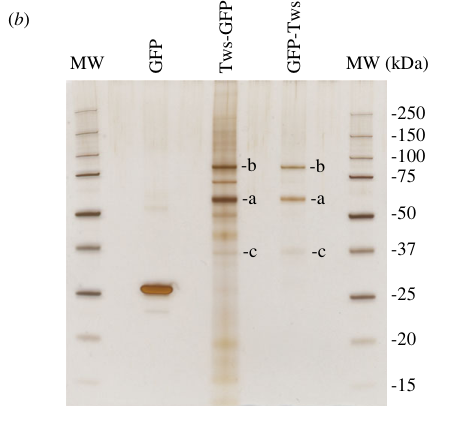

## Question

# Gene Research for Functional Annotation

## ⚠️ CRITICAL: Gene/Protein Identification Context

**BEFORE YOU BEGIN RESEARCH:** You MUST verify you are researching the CORRECT gene/protein. Gene symbols can be ambiguous, especially for less well-characterized genes from non-model organisms.

### Target Gene/Protein Identity (from UniProt):
- **UniProt Accession:** P36179
- **Protein Description:** RecName: Full=Serine/threonine-protein phosphatase PP2A 65 kDa regulatory subunit; AltName: Full=PR65; AltName: Full=Protein phosphatase PP2A regulatory subunit A;
- **Gene Information:** Name=Pp2A-29B; ORFNames=CG17291;
- **Organism (full):** Drosophila melanogaster (Fruit fly).
- **Protein Family:** Belongs to the phosphatase 2A regulatory subunit A family.
- **Key Domains:** ARM-like. (IPR011989); ARM-type_fold. (IPR016024); HEAT. (IPR000357); HEAT_type_2. (IPR021133); PP2A/SF3B1-like_HEAT. (IPR054573)

### MANDATORY VERIFICATION STEPS:

1. **Check if the gene symbol "Pp2A-29B" matches the protein description above**
2. **Verify the organism is correct:** Drosophila melanogaster (Fruit fly).
3. **Check if protein family/domains align with what you find in literature**
4. **If you find literature for a DIFFERENT gene with the same or similar symbol, STOP**

### If Gene Symbol is Ambiguous or You Cannot Find Relevant Literature:

**DO NOT PROCEED WITH RESEARCH ON A DIFFERENT GENE.** Instead:
- State clearly: "The gene symbol 'Pp2A-29B' is ambiguous or literature is limited for this specific protein"
- Explain what you found (e.g., "Found extensive literature on a different gene with the same symbol in a different organism")
- Describe the protein based ONLY on the UniProt information provided above
- Suggest that the protein function can be inferred from domain/family information

### Research Target:

Please provide a comprehensive research report on the gene **Pp2A-29B** (gene ID: Pp2A-29B, UniProt: P36179) in DROME.

The research report should be a detailed narrative explaining the function, biological processes, and localization of the gene product. Citations should be given for all claims.

You should prioritize authoritative reviews and primary scientific literature when conducting research. You can supplement
this with annotations you find in gene/protein databases, but these can be outdated or inaccurate.

We are specifically interested in the primary function of the gene - for enzymes, what reaction is catalyzed, and what is the substrate specificity? For transporters, what is the substrate? For structural proteins or adapters, what is the broader structural role? For signaling molecules, what is the role in the pathway.

We are interested in where in or outside the cell the gene product carries out its function.

We are also interested in the signaling or biochemical pathways in which the gene functions. We are less interested in broad pleiotropic effects, except where these elucidate the precise role.

Include evidence where possible. We are interested in both experimental evidence as well as inference from structure, evolution, or bioinformatic analysis. Precise studies should be prioritized over high-throughput, where available.

## Output

Question: You are an expert researcher providing comprehensive, well-cited information.

Provide detailed information focusing on:
1. Key concepts and definitions with current understanding
2. Recent developments and latest research (prioritize 2023-2024 sources)
3. Current applications and real-world implementations
4. Expert opinions and analysis from authoritative sources
5. Relevant statistics and data from recent studies

Format as a comprehensive research report with proper citations. Include URLs and publication dates where available.
Always prioritize recent, authoritative sources and provide specific citations for all major claims.

# Gene Research for Functional Annotation

## ⚠️ CRITICAL: Gene/Protein Identification Context

**BEFORE YOU BEGIN RESEARCH:** You MUST verify you are researching the CORRECT gene/protein. Gene symbols can be ambiguous, especially for less well-characterized genes from non-model organisms.

### Target Gene/Protein Identity (from UniProt):
- **UniProt Accession:** P36179
- **Protein Description:** RecName: Full=Serine/threonine-protein phosphatase PP2A 65 kDa regulatory subunit; AltName: Full=PR65; AltName: Full=Protein phosphatase PP2A regulatory subunit A;
- **Gene Information:** Name=Pp2A-29B; ORFNames=CG17291;
- **Organism (full):** Drosophila melanogaster (Fruit fly).
- **Protein Family:** Belongs to the phosphatase 2A regulatory subunit A family.
- **Key Domains:** ARM-like. (IPR011989); ARM-type_fold. (IPR016024); HEAT. (IPR000357); HEAT_type_2. (IPR021133); PP2A/SF3B1-like_HEAT. (IPR054573)

### MANDATORY VERIFICATION STEPS:

1. **Check if the gene symbol "Pp2A-29B" matches the protein description above**
2. **Verify the organism is correct:** Drosophila melanogaster (Fruit fly).
3. **Check if protein family/domains align with what you find in literature**
4. **If you find literature for a DIFFERENT gene with the same or similar symbol, STOP**

### If Gene Symbol is Ambiguous or You Cannot Find Relevant Literature:

**DO NOT PROCEED WITH RESEARCH ON A DIFFERENT GENE.** Instead:
- State clearly: "The gene symbol 'Pp2A-29B' is ambiguous or literature is limited for this specific protein"
- Explain what you found (e.g., "Found extensive literature on a different gene with the same symbol in a different organism")
- Describe the protein based ONLY on the UniProt information provided above
- Suggest that the protein function can be inferred from domain/family information

### Research Target:

Please provide a comprehensive research report on the gene **Pp2A-29B** (gene ID: Pp2A-29B, UniProt: P36179) in DROME.

The research report should be a detailed narrative explaining the function, biological processes, and localization of the gene product. Citations should be given for all claims.

You should prioritize authoritative reviews and primary scientific literature when conducting research. You can supplement
this with annotations you find in gene/protein databases, but these can be outdated or inaccurate.

We are specifically interested in the primary function of the gene - for enzymes, what reaction is catalyzed, and what is the substrate specificity? For transporters, what is the substrate? For structural proteins or adapters, what is the broader structural role? For signaling molecules, what is the role in the pathway.

We are interested in where in or outside the cell the gene product carries out its function.

We are also interested in the signaling or biochemical pathways in which the gene functions. We are less interested in broad pleiotropic effects, except where these elucidate the precise role.

Include evidence where possible. We are interested in both experimental evidence as well as inference from structure, evolution, or bioinformatic analysis. Precise studies should be prioritized over high-throughput, where available.

# Functional annotation report: *Drosophila melanogaster* Pp2A-29B

## Identity and principal function

**The target is the PP2A scaffold, not a phosphatase catalytic subunit.** The supplied UniProt accession [P36179](https://www.uniprot.org/uniprotkb/P36179/entry) identifies *D. melanogaster* Pp2A-29B, also called PP2A-29B, CG17291, PR65 or the PP2A A subunit. Independent fly studies identify **CG17291 as the fly’s A-subunit gene** and distinguish its approximately 65-kDa product from the catalytic subunit **Microtubule star (Mts)** and regulatory subunits including **Twins (Tws/B55)** and **Widerborst (Wdb/B56)**. Thus, the symbol, organism and protein description are concordant; the UniProt accession and the specified InterPro assignments are supplied identifiers rather than identifiers independently established by these experiments. (su2011sequentialphosphorylationof pages 2-3, emondfraser2023identificationofpp2ab55 pages 2-3, moazzen2009nonrequirementofa pages 11-19)

Pp2A-29B is a **noncatalytic, HEAT-repeat protein-interaction scaffold**. Its ARM-like/HEAT-fold annotations are consistent with the PR65 family: a curved array of approximately 15 HEAT repeats provides an interface on which the catalytic Mts subunit and different regulatory partners assemble. **Pp2A-29B catalyzes no reaction on its own and has no demonstrated independent substrate specificity.** Serine/threonine dephosphorylation is performed by Mts in the assembled complex; the choice of regulatory partner and cellular context largely determine which phosphorylated proteins are encountered. This is the appropriate primary molecular-function annotation, rather than simply “protein phosphatase activity.” (moazzen2009nonrequirementofa pages 11-19, moazzen2009nonrequirementofa pages 19-23, li2025mechanismsofpp2aankle2 pages 4-5)

The architecture is directly supported in flies. In a **July 2023** study, affinity purification of GFP-tagged Tws from 0–2-hour embryos recovered Tws together with Pp2A-29B and Mts; quantitative mass spectrometry compared the purifications with GFP controls in **three independent experiments**. The accompanying gel and enrichment plots provide visual evidence for a fly PP2A-A–B55–C holoenzyme. [Emond-Fraser *et al.*, *Open Biology*, 2023](https://doi.org/10.1098/rsob.230104). (emondfraser2023identificationofpp2ab55 pages 2-3, emondfraser2023identificationofpp2ab55 media 6cf2815e, emondfraser2023identificationofpp2ab55 media b19d0041)

The following table separates experiments on **Pp2A-29B itself** from results concerning the larger PP2A complex or its other subunits. (su2011sequentialphosphorylationof pages 2-3, li2025mechanismsofpp2aankle2 pages 4-5)

| Setting/pathway and publication | Direct scaffold-specific experiment | Molecular inference and limitation |
|---|---|---|
| **Post-mitotic nuclear reassembly — Li et al.** *eLife* vol. 13 (journal display: 2024; indexed/published February 2025). [DOI](https://doi.org/10.7554/eLife.104233.3) | GFP-affinity purification recovered **PP2A-29B (A scaffold)** and **Mts (C enzyme)** with Ankle2; reciprocal PP2A-29B–GFP purification recovered Ankle2. Ankle2 residues 227–400 were sufficient, whereas deletion of residues 232–415 abolished PP2A-core binding. Tws displaced Ankle2 from PP2A-29B–GFP without changing bound Mts. Ankle2 overexpression recruited PP2A-29B–GFP to the nuclear envelope. (li2025mechanismsofpp2aankle2 pages 5-7, li2025mechanismsofpp2aankle2 pages 10-11, li2025mechanismsofpp2aankle2 pages 4-5) | Strong evidence that PP2A-29B scaffolds alternative complexes in which **Ankle2 behaves as a substrate/localization-directing regulatory subunit**, promoting BAF Thr4/Ser5 dephosphorylation near the reforming nuclear envelope. PP2A-29B itself is not catalytic; direct nuclear-envelope enrichment required Ankle2 overexpression, and structural contacts beyond the mapped ankyrin region remain partly model-based. |
| **Mitotic exit/nuclear-envelope reassembly — Emond-Fraser et al., 2023.** [DOI](https://doi.org/10.1098/rsob.230104) | GFP affinity purification from 0–2 h embryos expressing Tws–GFP or GFP–Tws recovered the complete **PP2A-29B–Mts–Tws** holoenzyme; PP2A-29B migrated near its predicted 65 kDa size. Three independent quantitative-MS experiments supported enrichment. (emondfraser2023identificationofpp2ab55 pages 2-3, emondfraser2023identificationofpp2ab55 media 6cf2815e) | Establishes physical incorporation of PP2A-29B into fly PP2A–B55/Tws. Otefin Ser50/Ser54 hyperphosphorylation after **Tws** depletion and its effects on BAF/lamin binding identify a **holoenzyme-dependent substrate**, not an intrinsic substrate preference or catalytic activity of PP2A-29B. (emondfraser2023identificationofpp2ab55 pages 3-4, emondfraser2023identificationofpp2ab55 pages 5-6) |
| **Innate immunity–STRIPAK–Tao–Hippo — Yang et al., 2024.** [DOI](https://doi.org/10.1038/s41467-023-44542-y) | RNAi against **Pp2A-29B**, Mts, Cka and other STRIPAK components increased Tao-1 phosphorylation to varying degrees in Drosophila cells. (yang2024innateimmuneand pages 4-5, yang2024innateimmuneand pages 5-5) | Supports PP2A-29B as a required scaffold in STRIPAK-mediated restraint of Tao–Hpo signaling. It does **not** demonstrate direct Tao-1 dephosphorylation by PP2A-29B: the phenotype was shared by multiple complex components, while direct binding evidence chiefly implicated regulatory subunit Cka. |
| **Hedgehog/Smoothened — Su et al., 2011.** [DOI](https://doi.org/10.1126/scisignal.2001747) | RNAi against the sole A-subunit gene **CG17291/Pp2A-29B**, like Mts RNAi, caused GFP–Smoothened accumulation at the surface of cl-8 cells without added Hedgehog. A regulatory-subunit screen identified **Wdb**, but not the other B subunits, as the specificity determinant. (su2011sequentialphosphorylationof pages 2-3) | The PP2A-29B–Mts core is required for Smoothened dephosphorylation/localization control, while **Wdb—not PP2A-29B—confers pathway specificity**. RNAi phenocopy does not prove direct PP2A-29B–Smoothened contact. |
| **Sensory-neuron dendrite pruning — Rui et al., 2020.** [DOI](https://doi.org/10.15252/embr.201948843) | Three independent RNAi constructs and the **pp2a-29B^rs** allele caused pruning defects. Mutant ddaC clones showed fully penetrant severing failure and retained a mean **6.1 primary/secondary dendrites** at 16 h after puparium formation; wild-type PP2A-29B completely rescued the defect. (rui2020proteinphosphatasepp2a pages 2-4) | High-confidence, cell-autonomous requirement for the scaffold. Comparisons with Wdb and Tws implicate distinct PP2A holoenzymes in ecdysone/Sox14/Mical expression and microtubule polarity, but most substrate-level assignments derive from regulatory-subunit genetics rather than direct PP2A-29B biochemistry. (rui2020proteinphosphatasepp2a pages 4-7) |
| **Dendritic diversification — Bhattacharjee et al., 2022.** [DOI](https://doi.org/10.3389/fnmol.2022.926567) | PP2A-29B RNAi reduced length, branch number, field coverage and Sholl complexity in complex class-IV neurons, but increased short first-/second-order branches and branch density in simpler class-I neurons; unlike Mts depletion, PP2A-29B loss did not reduce total class-I dendritic length. (bhattacharjee2022pp2aphosphataseregulates pages 6-8, bhattacharjee2022pp2aphosphataseregulates pages 5-6) | Demonstrates cell-type-dependent use of the common scaffold. Detailed microtubule, F-actin and organelle phenotypes were measured mainly after **Mts** depletion and therefore should not be attributed specifically to PP2A-29B. |
| **Terminal differentiation/G0 — Sun & Buttitta, 2015.** [DOI](https://doi.org/10.1242/dev.120824) | In an in-vivo pupal-eye screen, RNAi against the sole scaffold **Pp2A-29B** caused ectopic EdU incorporation and PCNA–GFP cell-cycle reporter activity after normal quiescence should begin. (sun2015proteinphosphatase2a pages 5-9) | Supports a requirement for the PP2A scaffold in timely terminal G0 entry. Quantitative delays—approximately 10–13 h and about 10% of cells undergoing an extra cycle—were established principally with dominant-negative **Mts**, so these magnitudes cannot be assigned uniquely to PP2A-29B. (sun2015proteinphosphatase2a pages 1-5, sun2015proteinphosphatase2a pages 24-31) |

*Table: Scaffold-specific evidence for verified Drosophila Pp2A-29B/CG17291/P36179, explicitly separated from catalytic Mts and substrate-directing regulatory subunits. The final column identifies what each experiment supports and where mechanistic attribution remains limited.*

## Cellular location and mechanism of recruitment

**Pp2A-29B functions inside cells, but it does not have one invariant organelle address.** It is recovered from early-embryo extracts in Tws-containing complexes and from fly cells and embryos in complexes containing the ER-associated protein Ankle2. The clearest direct localization experiment shows that **Pp2A-29B–GFP becomes enriched at the nuclear envelope when Ankle2–RFP is overexpressed** in cultured Drosophila cells. Importantly, the investigators did **not** see clear Pp2A-29B–GFP enrichment at the nuclear/spindle envelope in embryos under their baseline imaging conditions. Nuclear-envelope recruitment is therefore demonstrated for an Ankle2-enhanced pool, not established as the constitutive location of all Pp2A-29B. Neither secretion nor an extracellular function is supported by the cited experiments. [Li *et al.*, *eLife*, article 104233](https://doi.org/10.7554/eLife.104233). (li2025mechanismsofpp2aankle2 pages 10-11, li2025mechanismsofpp2aankle2 pages 4-5)

Li *et al.* provide unusually direct evidence for *how* the scaffold is recruited. Pp2A-29B and Mts copurified with Ankle2 from Drosophila cells and embryos; reciprocal purification of Pp2A-29B–GFP recovered Ankle2. An Ankle2 ankyrin-containing fragment was sufficient to associate with the PP2A core, while deletion of Ankle2 residues **232–415** abolished its copurification. Increasing Tws displaced Ankle2 from Pp2A-29B–GFP complexes **without displacing Mts**, supporting distinct Pp2A-29B–Mts complexes that use Tws or Ankle2 as alternative regulatory partners. Vap33-dependent membrane association of Ankle2 supplies a plausible route to localized PP2A activity at the reforming nuclear envelope; the work does not establish that every modeled protein contact is direct. The article is indexed as **February 2025**, although its PDF displays *eLife* **2024**, volume 13. (li2025mechanismsofpp2aankle2 pages 4-5, li2025mechanismsofpp2aankle2 pages 5-7, li2025mechanismsofpp2aankle2 pages 10-11)

Other studies identify **where a complex acts**, not necessarily where Pp2A-29B protein itself was imaged: Smoothened regulation is evident at the cell surface, sensory-neuron effects occur in dendritic arbors, and BAF/otefin regulation concerns reassembling nuclei. Those compartment assignments should not be mistaken for direct, constitutive localization measurements of the scaffold. (su2011sequentialphosphorylationof pages 2-3, rui2020proteinphosphatasepp2a pages 2-4, emondfraser2023identificationofpp2ab55 pages 5-6)

## Biochemical pathways and experimentally supported processes

**Mitotic exit and nuclear-envelope reassembly.** PP2A–Tws/B55 counteracts mitotic phosphorylation. The 2023 embryo-purification and phosphoproteomic study identified the inner-nuclear-membrane protein **otefin**, the fly emerin, as a candidate holoenzyme substrate: depletion of **Tws**, rather than an isolated test of Pp2A-29B specificity, increased phosphorylation at **Ser50/Ser54**. Phosphorylation near otefin’s LEM domain impaired associations with BAF and lamin and affected the timing of nuclear-envelope reformation. The Greatwall–Endos circuit regulates PP2A–Tws availability during the mitotic cycle. [Emond-Fraser *et al.*, July 2023](https://doi.org/10.1098/rsob.230104). (emondfraser2023identificationofpp2ab55 pages 3-4, emondfraser2023identificationofpp2ab55 pages 5-6)

A complementary **August 2024** fly study found that a mutant allele of **Pp2A-29B**, like an *mts* allele, enhanced the small-wing phenotype produced by partial Ankle2 depletion, consistent with a shared pathway for PP2A-dependent BAF recruitment during nuclear reassembly. [Li *et al.*, *PLOS Biology*, 2024](https://doi.org/10.1371/journal.pbio.3002780). Subsequent biochemical mapping found that Ankle2 depletion increased **BAF Thr4/Ser5 phosphorylation** and that Ankle2’s PP2A-binding ankyrin region was required to rescue BAF phosphorylation and nuclear-reassembly defects. Together, these experiments support the interpretation that an **Ankle2-directed, Pp2A-29B–Mts complex** supplies local BAF dephosphorylation; they do not imply that the A scaffold directly hydrolyzes phosphate. [Li *et al.*, *eLife*, article 104233](https://doi.org/10.7554/eLife.104233). (li2024nuclearreassemblydefects pages 6-8, li2025mechanismsofpp2aankle2 pages 4-5, li2025mechanismsofpp2aankle2 pages 11-13)

**Hippo pathway: the regulatory partner determines the sign of the effect.** In a **January 2024** Drosophila study, depletion of **Pp2A-29B**, Mts or several STRIPAK components increased **Tao-1 phosphorylation** to varying degrees. The authors’ model places STRIPAK-associated PP2A as a brake on Tao–Hippo signaling; inflammatory Tak1 signaling promotes lysosomal loss of the STRIPAK component **Cka**, relieving that brake. Tao-1 association and direct-binding tests particularly implicated Cka. Consequently, the Pp2A-29B RNAi result supports participation of the **shared PP2A core**, **not** a claim that Pp2A-29B itself binds or dephosphorylates Tao-1. [Yang *et al.*, *Nature Communications*, 2024](https://doi.org/10.1038/s41467-023-44542-y). (yang2024innateimmuneand pages 4-5, yang2024innateimmuneand pages 5-6, yang2024innateimmuneand pages 7-8)

A **November 2024 preprint**, rather than peer-reviewed evidence at that date, reported the complementary possibility that PP2A partnered with **Wrd** can dephosphorylate and stabilize Expanded and *increase* Hippo signaling; Tws-containing complexes also influenced Expanded stability. Its proposed substrate direction is attributed to the **regulatory-subunit-defined holoenzyme**, not to a new enzyme activity of Pp2A-29B. [Sekar *et al.*, bioRxiv, 2024](https://doi.org/10.1101/2024.11.14.623552). (sekar2024adualrole pages 1-6, sekar2024adualrole pages 6-10)

**Hedgehog signaling.** In a **July 2011** fly-cell study, RNAi against **CG17291/Pp2A-29B**, Mts or Wdb caused GFP-tagged **Smoothened (Smo)** to accumulate at the surface of cl-8 cells **without added Hedgehog**. Among tested B subunits, Wdb supplied the distinctive Smo-regulatory effect. The strongest annotation is therefore that a **Pp2A-29B–Mts–Wdb complex helps restrain Smo phosphorylation and surface accumulation**, tuning Hedgehog output. The result does not establish direct binding between Smo and the scaffold, nor an independent Smo-substrate preference for Pp2A-29B. [Su *et al.*, *Science Signaling*, 2011](https://doi.org/10.1126/scisignal.2001747). (su2011sequentialphosphorylationof pages 2-3)

**Neuronal cytoskeleton and developmental remodeling.** In sensory neurons undergoing ecdysone-triggered dendrite pruning, **three independent Pp2A-29B RNAi reagents** caused defects. Mutant *pp2a-29B* neuronal clones had **fully penetrant** severing defects, retaining a mean **6.1 major dendrites at 16 hours after puparium formation**; expression of wild-type Pp2A-29B rescued the phenotype. Comparisons with regulatory-subunit mutants suggest that Wdb-containing PP2A supports the Sox14–Mical pruning program, whereas Tws-containing PP2A contributes to dendritic microtubule polarity. These distinguishable effects are consistent with a common scaffold supporting multiple complexes. [Rui *et al.*, *EMBO Reports*, March 2020](https://doi.org/10.15252/embr.201948843). (rui2020proteinphosphatasepp2a pages 2-4, rui2020proteinphosphatasepp2a pages 4-7)

A separate 2020 study connected Pp2A-29B knockdown to disrupted actin remodeling and altered **cofilin localization**. It cautioned that delayed Mical expression **alone** could not explain the persistent pruning defect: Mical expression recovered at a later sampled stage while pruning remained severely affected. Thus, Sox14/Mical effects and local cytoskeletal regulation should not be collapsed into a single proven direct substrate mechanism. [Wolterhoff *et al.*, *EMBO Reports*, March 2020](https://doi.org/10.15252/embr.201948870). (wolterhoff2020pp2aphosphataseis pages 3-4)

During larval dendrite formation, Pp2A-29B loss produced **opposing cell-type-specific outcomes**: reduced dendritic length, branching and field coverage in complex class-IV neurons, but increased short branches and branch density in class-I neurons. Extensive microtubule, F-actin and organelle measurements in that study were made principally after **Mts** perturbation; those detailed phenotypes should not automatically be assigned specifically to Pp2A-29B. [Bhattacharjee *et al.*, *Frontiers in Molecular Neuroscience*, November 2022](https://doi.org/10.3389/fnmol.2022.926567). (bhattacharjee2022pp2aphosphataseregulates pages 6-8, bhattacharjee2022pp2aphosphataseregulates pages 5-6)

**Cell-cycle exit.** In an in-vivo pupal-eye screen, Pp2A-29B RNAi caused ectopic **EdU incorporation** and **PCNA–GFP** cell-cycle reporter expression after cells would normally become quiescent, supporting a role for the shared PP2A scaffold in timely terminal G0 entry. Approximately **10%** of cells undergoing an additional cycle was quantified mainly with **dominant-negative Mts** perturbation, **not** as a Pp2A-29B-specific effect size. [Sun and Buttitta, *Development*, August 2015](https://doi.org/10.1242/dev.120824). (sun2015proteinphosphatase2a pages 5-9, sun2015proteinphosphatase2a pages 1-5)

## Assessment and annotation confidence

The **highest-confidence annotation** is: *intracellular HEAT-repeat A subunit that assembles the Mts catalytic core with alternative regulatory partners to position PP2A-dependent serine/threonine dephosphorylation in specific pathways*. Physical incorporation into fly holoenzymes, Ankle2-dependent recruitment, and rescue of scaffold-mutant neuronal defects support this assignment independently. **Lower-confidence claims** would be any single universal subcellular location, an intrinsic Pp2A-29B substrate or catalytic reaction, or direct contact between the scaffold and every pathway substrate inferred from RNAi. Fly genetics and biochemistry make this protein a useful experimental handle on PP2A complex assembly and pathway-specific signaling, but the cited work does not establish a Pp2A-29B-specific clinical application. (emondfraser2023identificationofpp2ab55 pages 2-3, li2025mechanismsofpp2aankle2 pages 4-5, li2025mechanismsofpp2aankle2 pages 10-11, rui2020proteinphosphatasepp2a pages 2-4, yang2024innateimmuneand pages 4-5)

References

1. (su2011sequentialphosphorylationof pages 2-3): Ying Su, Jason K. Ospina, Junzheng Zhang, Andrew P. Michelson, Adam M. Schoen, and Alan Jian Zhu. Sequential phosphorylation of smoothened transduces graded hedgehog signaling. Science Signaling, 4:ra43-ra43, Jul 2011. URL: https://doi.org/10.1126/scisignal.2001747, doi:10.1126/scisignal.2001747. This article has 86 citations and is from a domain leading peer-reviewed journal.

2. (emondfraser2023identificationofpp2ab55 pages 2-3): Virginie Emond-Fraser, Myreille Larouche, Peter Kubiniok, Éric Bonneil, Jingjing Li, Mohammed Bourouh, Laura Frizzi, Pierre Thibault, and Vincent Archambault. Identification of pp2a-b55 targets uncovers regulation of emerin during nuclear envelope reassembly in drosophila. Open Biology, Jul 2023. URL: https://doi.org/10.1098/rsob.230104, doi:10.1098/rsob.230104. This article has 13 citations and is from a peer-reviewed journal.

3. (moazzen2009nonrequirementofa pages 11-19): Hoda Moazzen, Robyn Rosenfeld, and Anthony Percival-Smith. Non-requirement of a regulatory subunit of protein phosphatase 2a, pp2a-b′, for activation of sex comb reduced activity in drosophila melanogaster. Mechanisms of Development, 126:605-610, Aug 2009. URL: https://doi.org/10.1016/j.mod.2009.06.1084, doi:10.1016/j.mod.2009.06.1084. This article has 8 citations.

4. (moazzen2009nonrequirementofa pages 19-23): Hoda Moazzen, Robyn Rosenfeld, and Anthony Percival-Smith. Non-requirement of a regulatory subunit of protein phosphatase 2a, pp2a-b′, for activation of sex comb reduced activity in drosophila melanogaster. Mechanisms of Development, 126:605-610, Aug 2009. URL: https://doi.org/10.1016/j.mod.2009.06.1084, doi:10.1016/j.mod.2009.06.1084. This article has 8 citations.

5. (li2025mechanismsofpp2aankle2 pages 4-5): Jingjing Li, Xinyue Wang, Laia Jordana, Éric Bonneil, Victoria Ginestet, Momina Ahmed, Mohammed Bourouh, Cristina Mirela Pascariu, T Martin Schmeing, Pierre Thibault, and Vincent Archambault. Mechanisms of pp2a-ankle2 dependent nuclear reassembly after mitosis. eLife, Feb 2025. URL: https://doi.org/10.7554/elife.104233.3, doi:10.7554/elife.104233.3. This article has 10 citations and is from a domain leading peer-reviewed journal.

6. (emondfraser2023identificationofpp2ab55 media 6cf2815e): Virginie Emond-Fraser, Myreille Larouche, Peter Kubiniok, Éric Bonneil, Jingjing Li, Mohammed Bourouh, Laura Frizzi, Pierre Thibault, and Vincent Archambault. Identification of pp2a-b55 targets uncovers regulation of emerin during nuclear envelope reassembly in drosophila. Open Biology, Jul 2023. URL: https://doi.org/10.1098/rsob.230104, doi:10.1098/rsob.230104. This article has 13 citations and is from a peer-reviewed journal.

7. (emondfraser2023identificationofpp2ab55 media b19d0041): Virginie Emond-Fraser, Myreille Larouche, Peter Kubiniok, Éric Bonneil, Jingjing Li, Mohammed Bourouh, Laura Frizzi, Pierre Thibault, and Vincent Archambault. Identification of pp2a-b55 targets uncovers regulation of emerin during nuclear envelope reassembly in drosophila. Open Biology, Jul 2023. URL: https://doi.org/10.1098/rsob.230104, doi:10.1098/rsob.230104. This article has 13 citations and is from a peer-reviewed journal.

8. (li2025mechanismsofpp2aankle2 pages 5-7): Jingjing Li, Xinyue Wang, Laia Jordana, Éric Bonneil, Victoria Ginestet, Momina Ahmed, Mohammed Bourouh, Cristina Mirela Pascariu, T Martin Schmeing, Pierre Thibault, and Vincent Archambault. Mechanisms of pp2a-ankle2 dependent nuclear reassembly after mitosis. eLife, Feb 2025. URL: https://doi.org/10.7554/elife.104233.3, doi:10.7554/elife.104233.3. This article has 10 citations and is from a domain leading peer-reviewed journal.

9. (li2025mechanismsofpp2aankle2 pages 10-11): Jingjing Li, Xinyue Wang, Laia Jordana, Éric Bonneil, Victoria Ginestet, Momina Ahmed, Mohammed Bourouh, Cristina Mirela Pascariu, T Martin Schmeing, Pierre Thibault, and Vincent Archambault. Mechanisms of pp2a-ankle2 dependent nuclear reassembly after mitosis. eLife, Feb 2025. URL: https://doi.org/10.7554/elife.104233.3, doi:10.7554/elife.104233.3. This article has 10 citations and is from a domain leading peer-reviewed journal.

10. (emondfraser2023identificationofpp2ab55 pages 3-4): Virginie Emond-Fraser, Myreille Larouche, Peter Kubiniok, Éric Bonneil, Jingjing Li, Mohammed Bourouh, Laura Frizzi, Pierre Thibault, and Vincent Archambault. Identification of pp2a-b55 targets uncovers regulation of emerin during nuclear envelope reassembly in drosophila. Open Biology, Jul 2023. URL: https://doi.org/10.1098/rsob.230104, doi:10.1098/rsob.230104. This article has 13 citations and is from a peer-reviewed journal.

11. (emondfraser2023identificationofpp2ab55 pages 5-6): Virginie Emond-Fraser, Myreille Larouche, Peter Kubiniok, Éric Bonneil, Jingjing Li, Mohammed Bourouh, Laura Frizzi, Pierre Thibault, and Vincent Archambault. Identification of pp2a-b55 targets uncovers regulation of emerin during nuclear envelope reassembly in drosophila. Open Biology, Jul 2023. URL: https://doi.org/10.1098/rsob.230104, doi:10.1098/rsob.230104. This article has 13 citations and is from a peer-reviewed journal.

12. (yang2024innateimmuneand pages 4-5): Yinan Yang, Huijing Zhou, Xiawei Huang, Chengfang Wu, Kewei Zheng, Jingrong Deng, Yonggang Zheng, Jiahui Wang, Xiaofeng Chi, Xianjue Ma, Huimin Pan, Rui Shen, Duojia Pan, and Bo Liu. Innate immune and proinflammatory signals activate the hippo pathway via a tak1-stripak-tao axis. Nature Communications, Jan 2024. URL: https://doi.org/10.1038/s41467-023-44542-y, doi:10.1038/s41467-023-44542-y. This article has 23 citations and is from a highest quality peer-reviewed journal.

13. (yang2024innateimmuneand pages 5-5): Yinan Yang, Huijing Zhou, Xiawei Huang, Chengfang Wu, Kewei Zheng, Jingrong Deng, Yonggang Zheng, Jiahui Wang, Xiaofeng Chi, Xianjue Ma, Huimin Pan, Rui Shen, Duojia Pan, and Bo Liu. Innate immune and proinflammatory signals activate the hippo pathway via a tak1-stripak-tao axis. Nature Communications, Jan 2024. URL: https://doi.org/10.1038/s41467-023-44542-y, doi:10.1038/s41467-023-44542-y. This article has 23 citations and is from a highest quality peer-reviewed journal.

14. (rui2020proteinphosphatasepp2a pages 2-4): Menglong Rui, Kay Siong Ng, Quan Tang, Shufeng Bu, and Fengwei Yu. Protein phosphatase pp2a regulates microtubule orientation and dendrite pruning in drosophila. EMBO reports, Mar 2020. URL: https://doi.org/10.15252/embr.201948843, doi:10.15252/embr.201948843. This article has 36 citations and is from a highest quality peer-reviewed journal.

15. (rui2020proteinphosphatasepp2a pages 4-7): Menglong Rui, Kay Siong Ng, Quan Tang, Shufeng Bu, and Fengwei Yu. Protein phosphatase pp2a regulates microtubule orientation and dendrite pruning in drosophila. EMBO reports, Mar 2020. URL: https://doi.org/10.15252/embr.201948843, doi:10.15252/embr.201948843. This article has 36 citations and is from a highest quality peer-reviewed journal.

16. (bhattacharjee2022pp2aphosphataseregulates pages 6-8): Shatabdi Bhattacharjee, Erin N. Lottes, Sumit Nanda, Andre Golshir, Atit A. Patel, Giorgio A. Ascoli, and Daniel N. Cox. Pp2a phosphatase regulates cell-type specific cytoskeletal organization to drive dendrite diversity. Frontiers in Molecular Neuroscience, Nov 2022. URL: https://doi.org/10.3389/fnmol.2022.926567, doi:10.3389/fnmol.2022.926567. This article has 14 citations.

17. (bhattacharjee2022pp2aphosphataseregulates pages 5-6): Shatabdi Bhattacharjee, Erin N. Lottes, Sumit Nanda, Andre Golshir, Atit A. Patel, Giorgio A. Ascoli, and Daniel N. Cox. Pp2a phosphatase regulates cell-type specific cytoskeletal organization to drive dendrite diversity. Frontiers in Molecular Neuroscience, Nov 2022. URL: https://doi.org/10.3389/fnmol.2022.926567, doi:10.3389/fnmol.2022.926567. This article has 14 citations.

18. (sun2015proteinphosphatase2a pages 5-9): Dan Sun and Laura A. Buttitta. Protein phosphatase 2a promotes the transition to g0 during terminal differentiation in drosophila. Development, 142:3033-3045, Aug 2015. URL: https://doi.org/10.1242/dev.120824, doi:10.1242/dev.120824. This article has 25 citations and is from a domain leading peer-reviewed journal.

19. (sun2015proteinphosphatase2a pages 1-5): Dan Sun and Laura A. Buttitta. Protein phosphatase 2a promotes the transition to g0 during terminal differentiation in drosophila. Development, 142:3033-3045, Aug 2015. URL: https://doi.org/10.1242/dev.120824, doi:10.1242/dev.120824. This article has 25 citations and is from a domain leading peer-reviewed journal.

20. (sun2015proteinphosphatase2a pages 24-31): Dan Sun and Laura A. Buttitta. Protein phosphatase 2a promotes the transition to g0 during terminal differentiation in drosophila. Development, 142:3033-3045, Aug 2015. URL: https://doi.org/10.1242/dev.120824, doi:10.1242/dev.120824. This article has 25 citations and is from a domain leading peer-reviewed journal.

21. (li2024nuclearreassemblydefects pages 6-8): Jingjing Li, Laia Jordana, Haytham Mehsen, Xinyue Wang, and Vincent Archambault. Nuclear reassembly defects after mitosis trigger apoptotic and p53-dependent safeguard mechanisms in drosophila. PLOS Biology, 22:e3002780, Aug 2024. URL: https://doi.org/10.1371/journal.pbio.3002780, doi:10.1371/journal.pbio.3002780. This article has 9 citations and is from a highest quality peer-reviewed journal.

22. (li2025mechanismsofpp2aankle2 pages 11-13): Jingjing Li, Xinyue Wang, Laia Jordana, Éric Bonneil, Victoria Ginestet, Momina Ahmed, Mohammed Bourouh, Cristina Mirela Pascariu, T Martin Schmeing, Pierre Thibault, and Vincent Archambault. Mechanisms of pp2a-ankle2 dependent nuclear reassembly after mitosis. eLife, Feb 2025. URL: https://doi.org/10.7554/elife.104233.3, doi:10.7554/elife.104233.3. This article has 10 citations and is from a domain leading peer-reviewed journal.

23. (yang2024innateimmuneand pages 5-6): Yinan Yang, Huijing Zhou, Xiawei Huang, Chengfang Wu, Kewei Zheng, Jingrong Deng, Yonggang Zheng, Jiahui Wang, Xiaofeng Chi, Xianjue Ma, Huimin Pan, Rui Shen, Duojia Pan, and Bo Liu. Innate immune and proinflammatory signals activate the hippo pathway via a tak1-stripak-tao axis. Nature Communications, Jan 2024. URL: https://doi.org/10.1038/s41467-023-44542-y, doi:10.1038/s41467-023-44542-y. This article has 23 citations and is from a highest quality peer-reviewed journal.

24. (yang2024innateimmuneand pages 7-8): Yinan Yang, Huijing Zhou, Xiawei Huang, Chengfang Wu, Kewei Zheng, Jingrong Deng, Yonggang Zheng, Jiahui Wang, Xiaofeng Chi, Xianjue Ma, Huimin Pan, Rui Shen, Duojia Pan, and Bo Liu. Innate immune and proinflammatory signals activate the hippo pathway via a tak1-stripak-tao axis. Nature Communications, Jan 2024. URL: https://doi.org/10.1038/s41467-023-44542-y, doi:10.1038/s41467-023-44542-y. This article has 23 citations and is from a highest quality peer-reviewed journal.

25. (sekar2024adualrole pages 1-6): Aashika Sekar, Alberto Rizzo, Elodie Sins, Alexander D. Fulford, and Paulo S. Ribeiro. A dual role for the pp2a phosphatase in hippo signalling regulation. bioRxiv, Nov 2024. URL: https://doi.org/10.1101/2024.11.14.623552, doi:10.1101/2024.11.14.623552. This article has 0 citations.

26. (sekar2024adualrole pages 6-10): Aashika Sekar, Alberto Rizzo, Elodie Sins, Alexander D. Fulford, and Paulo S. Ribeiro. A dual role for the pp2a phosphatase in hippo signalling regulation. bioRxiv, Nov 2024. URL: https://doi.org/10.1101/2024.11.14.623552, doi:10.1101/2024.11.14.623552. This article has 0 citations.

27. (wolterhoff2020pp2aphosphataseis pages 3-4): Neele Wolterhoff, Ulrike Gigengack, and Sebastian Rumpf. Pp2a phosphatase is required for dendrite pruning via actin regulation in drosophila. EMBO Reports, Mar 2020. URL: https://doi.org/10.15252/embr.201948870, doi:10.15252/embr.201948870. This article has 33 citations and is from a highest quality peer-reviewed journal.

## Artifacts

- [Edison artifact artifact-00](Pp2A-29B-deep-research-falcon_artifacts/artifact-00.md)

## Citations

1. su2011sequentialphosphorylationof pages 2-3
2. moazzen2009nonrequirementofa pages 11-19
3. moazzen2009nonrequirementofa pages 19-23
4. yang2024innateimmuneand pages 4-5
5. yang2024innateimmuneand pages 5-5
6. li2024nuclearreassemblydefects pages 6-8
7. yang2024innateimmuneand pages 5-6
8. yang2024innateimmuneand pages 7-8
9. sekar2024adualrole pages 1-6
10. sekar2024adualrole pages 6-10
11. P36179
12. Emond-Fraser *et al.*, *Open Biology*, 2023
13. DOI
14. Li *et al.*, *eLife*, article 104233
15. Emond-Fraser *et al.*, July 2023
16. Li *et al.*, *PLOS Biology*, 2024
17. Yang *et al.*, *Nature Communications*, 2024
18. Sekar *et al.*, bioRxiv, 2024
19. Su *et al.*, *Science Signaling*, 2011
20. Rui *et al.*, *EMBO Reports*, March 2020
21. Wolterhoff *et al.*, *EMBO Reports*, March 2020
22. Bhattacharjee *et al.*, *Frontiers in Molecular Neuroscience*, November 2022
23. Sun and Buttitta, *Development*, August 2015
24. https://www.uniprot.org/uniprotkb/P36179/entry
25. https://doi.org/10.1098/rsob.230104
26. https://doi.org/10.7554/eLife.104233.3
27. https://doi.org/10.1038/s41467-023-44542-y
28. https://doi.org/10.1126/scisignal.2001747
29. https://doi.org/10.15252/embr.201948843
30. https://doi.org/10.3389/fnmol.2022.926567
31. https://doi.org/10.1242/dev.120824
32. https://doi.org/10.7554/eLife.104233
33. https://doi.org/10.1371/journal.pbio.3002780
34. https://doi.org/10.1101/2024.11.14.623552
35. https://doi.org/10.15252/embr.201948870
36. https://doi.org/10.1126/scisignal.2001747,
37. https://doi.org/10.1098/rsob.230104,
38. https://doi.org/10.1016/j.mod.2009.06.1084,
39. https://doi.org/10.7554/elife.104233.3,
40. https://doi.org/10.1038/s41467-023-44542-y,
41. https://doi.org/10.15252/embr.201948843,
42. https://doi.org/10.3389/fnmol.2022.926567,
43. https://doi.org/10.1242/dev.120824,
44. https://doi.org/10.1371/journal.pbio.3002780,
45. https://doi.org/10.1101/2024.11.14.623552,
46. https://doi.org/10.15252/embr.201948870,