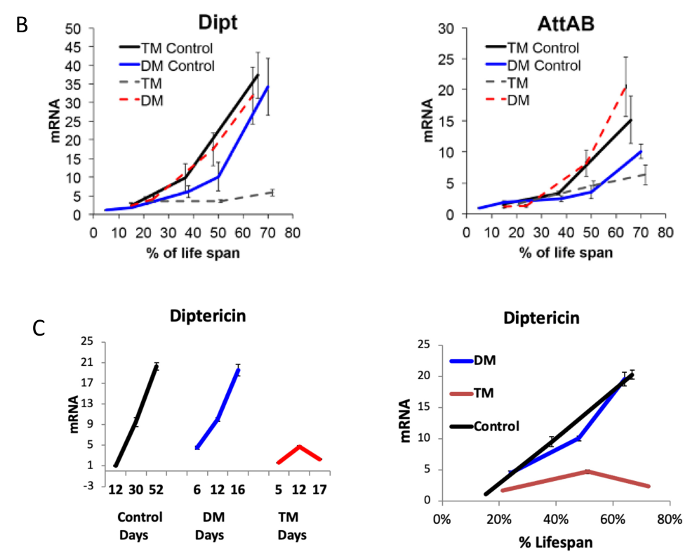

## Question

# Gene Research for Functional Annotation

## ⚠️ CRITICAL: Gene/Protein Identification Context

**BEFORE YOU BEGIN RESEARCH:** You MUST verify you are researching the CORRECT gene/protein. Gene symbols can be ambiguous, especially for less well-characterized genes from non-model organisms.

### Target Gene/Protein Identity (from UniProt):
- **UniProt Accession:** Q9V3Q4
- **Protein Description:** RecName: Full=thioredoxin-dependent peroxiredoxin {ECO:0000256|ARBA:ARBA00013017}; EC=1.11.1.24 {ECO:0000256|ARBA:ARBA00013017};
- **Gene Information:** Name=Prx4 {ECO:0000313|EMBL:AAF47704.1, ECO:0000313|FlyBase:FBgn0040308}; Synonyms=1274 {ECO:0000313|EMBL:AAF47704.1}, Dmel\CG1274 {ECO:0000313|EMBL:AAF47704.1}, dPRDX4 {ECO:0000313|EMBL:AAF47704.1}, dPrx4 {ECO:0000313|EMBL:AAF47704.1}, DPx-4156 {ECO:0000313|EMBL:AAF47704.1}, DPx4156 {ECO:0000313|EMBL:AAF47704.1}, Jafrac {ECO:0000313|EMBL:AAF47704.1}, Jafrac-2 {ECO:0000313|EMBL:AAF47704.1}, JafRac2 {ECO:0000313|EMBL:AAF47704.1}, Jafrac2 {ECO:0000313|EMBL:AAF47704.1}, jafrac2 {ECO:0000313|EMBL:AAF47704.1}, Prx4156 {ECO:0000313|EMBL:AAF47704.1}; ORFNames=CG1274 {ECO:0000313|EMBL:AAF47704.1, ECO:0000313|FlyBase:FBgn0040308}, Dmel_CG1274 {ECO:0000313|EMBL:AAF47704.1};
- **Organism (full):** Drosophila melanogaster (Fruit fly).
- **Protein Family:** Belongs to the peroxiredoxin family. AhpC/Prx1 subfamily.
- **Key Domains:** AhpC/TSA. (IPR000866); Peroxiredoxin. (IPR050217); Peroxiredoxin_C. (IPR019479); Thioredoxin-like_sf. (IPR036249); Thioredoxin_domain. (IPR013766)

### MANDATORY VERIFICATION STEPS:

1. **Check if the gene symbol "Prx4" matches the protein description above**
2. **Verify the organism is correct:** Drosophila melanogaster (Fruit fly).
3. **Check if protein family/domains align with what you find in literature**
4. **If you find literature for a DIFFERENT gene with the same or similar symbol, STOP**

### If Gene Symbol is Ambiguous or You Cannot Find Relevant Literature:

**DO NOT PROCEED WITH RESEARCH ON A DIFFERENT GENE.** Instead:
- State clearly: "The gene symbol 'Prx4' is ambiguous or literature is limited for this specific protein"
- Explain what you found (e.g., "Found extensive literature on a different gene with the same symbol in a different organism")
- Describe the protein based ONLY on the UniProt information provided above
- Suggest that the protein function can be inferred from domain/family information

### Research Target:

Please provide a comprehensive research report on the gene **Prx4** (gene ID: Prx4, UniProt: Q9V3Q4) in DROME.

The research report should be a detailed narrative explaining the function, biological processes, and localization of the gene product. Citations should be given for all claims.

You should prioritize authoritative reviews and primary scientific literature when conducting research. You can supplement
this with annotations you find in gene/protein databases, but these can be outdated or inaccurate.

We are specifically interested in the primary function of the gene - for enzymes, what reaction is catalyzed, and what is the substrate specificity? For transporters, what is the substrate? For structural proteins or adapters, what is the broader structural role? For signaling molecules, what is the role in the pathway.

We are interested in where in or outside the cell the gene product carries out its function.

We are also interested in the signaling or biochemical pathways in which the gene functions. We are less interested in broad pleiotropic effects, except where these elucidate the precise role.

Include evidence where possible. We are interested in both experimental evidence as well as inference from structure, evolution, or bioinformatic analysis. Precise studies should be prioritized over high-throughput, where available.

## Output

Question: You are an expert researcher providing comprehensive, well-cited information.

Provide detailed information focusing on:
1. Key concepts and definitions with current understanding
2. Recent developments and latest research (prioritize 2023-2024 sources)
3. Current applications and real-world implementations
4. Expert opinions and analysis from authoritative sources
5. Relevant statistics and data from recent studies

Format as a comprehensive research report with proper citations. Include URLs and publication dates where available.
Always prioritize recent, authoritative sources and provide specific citations for all major claims.

# Gene Research for Functional Annotation

## ⚠️ CRITICAL: Gene/Protein Identification Context

**BEFORE YOU BEGIN RESEARCH:** You MUST verify you are researching the CORRECT gene/protein. Gene symbols can be ambiguous, especially for less well-characterized genes from non-model organisms.

### Target Gene/Protein Identity (from UniProt):
- **UniProt Accession:** Q9V3Q4
- **Protein Description:** RecName: Full=thioredoxin-dependent peroxiredoxin {ECO:0000256|ARBA:ARBA00013017}; EC=1.11.1.24 {ECO:0000256|ARBA:ARBA00013017};
- **Gene Information:** Name=Prx4 {ECO:0000313|EMBL:AAF47704.1, ECO:0000313|FlyBase:FBgn0040308}; Synonyms=1274 {ECO:0000313|EMBL:AAF47704.1}, Dmel\CG1274 {ECO:0000313|EMBL:AAF47704.1}, dPRDX4 {ECO:0000313|EMBL:AAF47704.1}, dPrx4 {ECO:0000313|EMBL:AAF47704.1}, DPx-4156 {ECO:0000313|EMBL:AAF47704.1}, DPx4156 {ECO:0000313|EMBL:AAF47704.1}, Jafrac {ECO:0000313|EMBL:AAF47704.1}, Jafrac-2 {ECO:0000313|EMBL:AAF47704.1}, JafRac2 {ECO:0000313|EMBL:AAF47704.1}, Jafrac2 {ECO:0000313|EMBL:AAF47704.1}, jafrac2 {ECO:0000313|EMBL:AAF47704.1}, Prx4156 {ECO:0000313|EMBL:AAF47704.1}; ORFNames=CG1274 {ECO:0000313|EMBL:AAF47704.1, ECO:0000313|FlyBase:FBgn0040308}, Dmel_CG1274 {ECO:0000313|EMBL:AAF47704.1};
- **Organism (full):** Drosophila melanogaster (Fruit fly).
- **Protein Family:** Belongs to the peroxiredoxin family. AhpC/Prx1 subfamily.
- **Key Domains:** AhpC/TSA. (IPR000866); Peroxiredoxin. (IPR050217); Peroxiredoxin_C. (IPR019479); Thioredoxin-like_sf. (IPR036249); Thioredoxin_domain. (IPR013766)

### MANDATORY VERIFICATION STEPS:

1. **Check if the gene symbol "Prx4" matches the protein description above**
2. **Verify the organism is correct:** Drosophila melanogaster (Fruit fly).
3. **Check if protein family/domains align with what you find in literature**
4. **If you find literature for a DIFFERENT gene with the same or similar symbol, STOP**

### If Gene Symbol is Ambiguous or You Cannot Find Relevant Literature:

**DO NOT PROCEED WITH RESEARCH ON A DIFFERENT GENE.** Instead:
- State clearly: "The gene symbol 'Prx4' is ambiguous or literature is limited for this specific protein"
- Explain what you found (e.g., "Found extensive literature on a different gene with the same symbol in a different organism")
- Describe the protein based ONLY on the UniProt information provided above
- Suggest that the protein function can be inferred from domain/family information

### Research Target:

Please provide a comprehensive research report on the gene **Prx4** (gene ID: Prx4, UniProt: Q9V3Q4) in DROME.

The research report should be a detailed narrative explaining the function, biological processes, and localization of the gene product. Citations should be given for all claims.

You should prioritize authoritative reviews and primary scientific literature when conducting research. You can supplement
this with annotations you find in gene/protein databases, but these can be outdated or inaccurate.

We are specifically interested in the primary function of the gene - for enzymes, what reaction is catalyzed, and what is the substrate specificity? For transporters, what is the substrate? For structural proteins or adapters, what is the broader structural role? For signaling molecules, what is the role in the pathway.

We are interested in where in or outside the cell the gene product carries out its function.

We are also interested in the signaling or biochemical pathways in which the gene functions. We are less interested in broad pleiotropic effects, except where these elucidate the precise role.

Include evidence where possible. We are interested in both experimental evidence as well as inference from structure, evolution, or bioinformatic analysis. Precise studies should be prioritized over high-throughput, where available.

# Functional annotation of *Drosophila melanogaster* Prx4 (Q9V3Q4)

## Identity and principal function

**The target is fly Prx4, also called dPrx4, Jafrac2, DPx-4156 and CG1274.** The original fly studies explicitly equate these names. It is **not** Jafrac1 (CG1633), another fly peroxiredoxin, or human PRDX4, although the latter is an ortholog. The supplied UniProt accession and AhpC/Prx1-family domains are consistent with the published identification of Jafrac2 as a typical two-cysteine peroxiredoxin. (radyuk2013theeffectof pages 1-2, mcginnis2021hyperoxidationofperoxiredoxins pages 2-4, yang2025insectperoxiredoxinsa pages 4-6)

**Primary annotation:** Prx4 is a predominantly endoplasmic-reticulum (ER) peroxide-control enzyme. Its predicted catalytic reaction is reduction of a hydroperoxide to water or the corresponding alcohol while oxidizing its catalytic cysteines; in shorthand, **H₂O₂ + 2 reducing equivalents → 2 H₂O**. In the typical two-cysteine peroxiredoxin cycle, a peroxidatic cysteine reacts with peroxide, and a resolving cysteine on the partner subunit forms an intersubunit disulfide that must subsequently be reduced. Thioredoxin-dependent peroxide reduction is the established family mechanism and fits the supplied protein description. **For this particular fly protein, however, the strongest direct substrate evidence concerns H₂O₂ in the ER; the retrieved fly studies do not establish a quantitative substrate-preference series, catalytic constants, or the identity of its physiological ER recycling reductant.** The measured 4-hydroxynonenal signal is a *marker of lipid peroxidation*, not proof that 4-hydroxynonenal is a direct Prx4 substrate. (radyuk2013theeffectof pages 1-2, yang2025insectperoxiredoxinsa pages 2-4, radyuk2013theeffectof pages 6-8, radyuk2013theeffectof pages 5-6)

This distinction matters for oxidative protein folding. Mammalian PRDX4 can use H₂O₂ in reactions coupled to protein disulfide isomerase (PDI), but the fly papers discuss that pathway chiefly by analogy; they do not establish a fly Prx4–PDI electron-transfer reaction. It is therefore plausible, **not experimentally confirmed here**, that CG1274 contributes directly to PDI-mediated disulfide formation. (klichko2016theroleof pages 1-2, radyuk2013theeffectof pages 10-11, radyuk2013theeffectof pages 12-13)

The evidence for Prx4’s different roles is compartment-dependent:

| Compartment or context | Direct experimental result | Crucial limitation |
|---|---|---|
| **ER lumen: peroxide control (2013)** | Endogenous dPrx4 localized mainly to an ER-enriched fraction. Knockdown increased ER-associated H₂O₂ and 4-hydroxynonenal, whereas overexpression reduced lipid peroxidation, supporting antioxidant activity against ER peroxide burden. (radyuk2013theeffectof pages 6-8) | No purified-enzyme kinetics or substrate panel was reported; fly-specific thioredoxin recycling and PDI-coupled oxidative folding were not directly demonstrated. |
| **ER-to-cytosol release: apoptosis (2002)** | Jafrac2 contained an N-terminal ER-targeting signal, and mature protein bound DIAP1 through its exposed IAP-binding motif. Following apoptotic or ER stress, cytosolic Jafrac2 competed with Dronc for DIAP1, enabling caspase-dependent death. (tenev2002jafrac2isan pages 2-3) | The DIAP1–Dronc function is separable from peroxidase catalysis and does not establish peroxide-substrate specificity or catalytic kinetics. |
| **Hemolymph: JAK/STAT stress signaling (2013)** | Stress or high expression caused dPrx4 secretion. Injected recombinant dPrx4 induced *TotA*; RNAi of *domeless*, *hopscotch*, or *Stat92E* blocked this response, placing extracellular dPrx4 upstream of JAK/STAT signaling. (radyuk2013theeffectof pages 8-10) | The extracellular receptor or binding partner remains unknown, and dependence on dPrx4 peroxidase activity was not tested. |
| **ER-associated sterile inflammation: Relish/NF-κB (2016)** | High dPrx4 expression induced Relish-dependent *AttD*, *Dipt*, and *TotA*. Greater than 90% dPrx4 knockdown abolished paraquat-induced Relish targets but not the antibacterial response to *E. coli*, supporting a specific role in oxidant-triggered ER inflammatory signaling. (klichko2016theroleof pages 2-3) | The molecular relay between dPrx4 and Relish was not identified; high-level overexpression may itself cause nonphysiological ER stress. |
| **Mitochondria–ER redox cross-talk (2023)** | Adding dPrx4 RNAi to a dPrx3/dPrx5-deficient background suppressed age-dependent *Diptericin* and *Attacin* activation, indicating that mitochondria-originating abiotic stress signals require ER-resident dPrx4 to drive inflammatory output. (odnokoz2023peroxiredoxinsplayan pages 10-13) | dPrx4 depletion did not rescue shortened lifespan; AMP suppression therefore did not establish that dPrx4-dependent inflammation caused mortality. |
| **Systemic defense against bacterial outer-membrane vesicles (2025 preprint)** | Ubiquitous Jafrac2/dPrx4 RNAi increased susceptibility to *Serratia marcescens* vesicles, consistent with a protective redox-defense function. (rahme2025serratiamarcescensouter pages 8-11) | This is preliminary preprint evidence; no neuron-specific requirement, catalytic mechanism, or direct dPrx4 substrate measurement was established. |

*Table: Compartment-resolved evidence for Drosophila Prx4/Q9V3Q4, separating direct findings from mechanistic limitations. Core sources include Tenev et al. (2002), Radyuk et al. (2013), Klichko et al. (2016), Odnokoz et al. (2023), and a 2025 bioRxiv preprint.*

## Where Prx4 functions

**ER under ordinary conditions.** Jafrac2’s first 17 amino acids direct it into the ER; signal-sequence cleavage exposes the mature protein’s N-terminal **AKP** IAP-binding motif. Cell imaging and fractionation localized endogenous protein to the ER or ER-enriched fractions. In unstressed flies, little Prx4 was detectable in cell-free hemolymph. This supports the ER as the principal site of its constitutive antioxidant function, rather than treating secretion as its normal steady-state location. (tenev2002jafrac2isan pages 2-3, radyuk2013theeffectof pages 6-8)

**Cytosol during apoptotic stress.** After UV exposure or treatment with the ER-stress agents brefeldin A or tunicamycin, mature Jafrac2 appeared in the cytosol; redistribution was observed approximately **3–4 hours** after UV exposure or brefeldin A treatment, before overt apoptotic morphology. Cytosolic Jafrac2 is therefore best understood as a stress-dependent signaling form, not its usual intracellular location. (tenev2002jafrac2isan pages 3-4, tenev2002jafrac2isan pages 4-6)

**Hemolymph during particular stresses or high expression.** Fly experiments detected Prx4 outside cells after paraquat exposure, cold exposure or septic injury, and after strong transgenic overexpression. Following septic injury, the hemolymph increase peaked at approximately **2 hours**. Experiments using cellular-contamination controls support genuine release rather than simple leakage from lysed cells. Secretion was not observed for every stress tested; the studies specifically reported negative results for heat and tunicamycin under their conditions. (radyuk2013theeffectof pages 8-10, radyuk2013theeffectof pages 6-8)

## Mechanistic biological processes

**1. ER redox homeostasis.** Lowering fly Prx4 increased H₂O₂ and lipid-peroxidation markers in an ER-enriched fraction. In the 2013 experiments, mutant-versus-control differences were significant for H₂O₂ (*P* = **0.034**) and 4-hydroxynonenal adducts (*P* = **0.046**). Overexpression decreased lipid-peroxidation readouts but did **not** significantly lower measured steady-state H₂O₂ relative to controls. These observations support peroxide buffering and protection from oxidative damage; they do not, on their own, measure purified-enzyme turnover. (radyuk2013theeffectof pages 5-6, radyuk2013theeffectof pages 6-8)

**2. A distinct cytosolic apoptosis mechanism.** Tenev and colleagues identified mature Jafrac2 as an inhibitor-of-apoptosis-protein (IAP) antagonist. Its newly exposed N-terminal motif binds the **BIR2 domain of DIAP1** and competes with the initiator caspase **Dronc** for DIAP1 binding. Displacing Dronc permits caspase-dependent cell death. Mutating the motif’s essential N-terminal alanine prevented DIAP1 binding and the induced eye-cell-death phenotype; reducing *dronc* dosage suppressed that phenotype. Importantly, mutation of catalytic peroxiredoxin cysteines did **not** prevent DIAP1 binding. Thus, the DIAP1 interaction is experimentally separable from peroxide catalysis; the studies should not be read as showing that peroxide reduction *causes* Jafrac2-induced apoptosis. (tenev2002jafrac2isan pages 2-3, tenev2002jafrac2isan pages 4-6, tenev2002jafrac2isan pages 6-8)

**3. Extracellular stress signaling.** Injecting purified fly Prx4 into the body cavity induced the stress-response transcript *Turandot A* (*TotA*) at **5 and 24 hours**, without comparably inducing the antimicrobial-peptide transcripts tested. RNAi against **Domeless**, **Hopscotch** or **Stat92E** abolished the *TotA* induction seen with Prx4 overexpression. These experiments place extracellular Prx4 functionally upstream of the fly JAK/STAT response. They do **not** demonstrate that Prx4 binds Domeless directly: an intermediary hemolymph factor, potentially involving the cytokine Upd3, remains possible. Whether extracellular signaling requires Prx4’s catalytic cysteines is also unresolved. (radyuk2013theeffectof pages 8-10, radyuk2013theeffectof pages 11-12)

**4. ER-associated sterile inflammatory signaling.** High Prx4 expression induced antimicrobial-peptide genes, including *Attacin D* and *Diptericin*, through the NF-κB-like factor **Relish**. In the 2016 study, removing Relish eliminated the overexpression-associated antimicrobial-peptide response; reducing Prx4 by **more than 90%** eliminated induction of these Relish targets by **paraquat**, yet left their induction after *E. coli* septic injury substantially intact. Thus, Prx4 participates particularly in **oxidant-triggered, noninfectious ER-to-Relish signaling**, not as an indispensable component of canonical antibacterial detection. The intervening molecular redox relay and the extent to which extreme overexpression itself causes ER stress remain unresolved. In two survival experiments, median lifespan of strong Prx4 overexpressors increased from **24.0 to 34.5 days** and from **19.0 to 32.5 days** when Relish was absent—substantial but incomplete rescue. (klichko2016theroleof pages 2-3, klichko2016theroleof pages 3-4, klichko2016theroleof pages 5-7)

## Recent research and application

A **15 August 2023** fly study tested how ER Prx4 intersects with mitochondrial redox signaling. Adding *dPrx4* RNAi to a *dPrx3/dPrx5*-deficient background reduced the age-associated *Diptericin* and *Attacin* immune-gene response; the comparison is presented in its Figure 6. It **did not reliably rescue the double mutant’s shortened lifespan**. The authors interpret this as evidence that ER Prx4 is required to transmit at least part of a mitochondria-originating, pathogen-independent inflammatory signal, whereas mitochondrial Prx deficiency drives mortality through additional processes. This is a genetic-pathway result, not a demonstration of direct physical contact between Prx4 and a mitochondrial protein. (odnokoz2023peroxiredoxinsplayan pages 2-4, odnokoz2023peroxiredoxinsplayan pages 10-13, odnokoz2023peroxiredoxinsplayan media 62c0c7d9)

A **2025 bioRxiv preprint** provides more tentative, application-oriented evidence: ubiquitous Jafrac2 knockdown increased susceptibility to injected *Serratia marcescens* outer-membrane vesicles. It supports use of the fly gene in an experimental host-defense model, but does not establish the responsible tissue, a direct Prx4 substrate, or a Prx4-specific mechanism of vesicle resistance. No clinical intervention or validated human therapeutic application follows from these fly results. The located primary fly work most directly addressing this protein’s mechanism is from 2002–2023; a newer publication year alone should not substitute for gene-specific evidence. (rahme2025serratiamarcescensouter pages 8-11, rahme2025serratiamarcescensouter pages 24-28)

**Interpretive limit.** Fly longevity phenotypes are strongly dependent on expression level and tissue. Near-complete depletion greatly increased sensitivity to H₂O₂ and paraquat without consistently shortening unstressed lifespan. Mild global overexpression, below **twofold**, tended to be beneficial, whereas strong global overexpression, exceeding **fivefold**, reduced lifespan by approximately **20–80%** and caused tissue-specific apoptosis. These outcomes are consistent with an enzyme that normally protects ER redox balance but can acquire different signaling consequences when redistributed or expressed at nonphysiological levels; they do not define a single universally beneficial direction for manipulating Prx4. (radyuk2013theeffectof pages 3-5, radyuk2013theeffectof pages 1-2, radyuk2013theeffectof pages 6-8)

### Principal sources and dates

- Tenev *et al.*, **October 2002**, *EMBO Journal*, “Jafrac2 is an IAP antagonist that promotes cell death by liberating Dronc from DIAP1”: https://doi.org/10.1093/emboj/cdf530. (tenev2002jafrac2isan pages 2-3)
- Radyuk *et al.*, **April 2013**, *FASEB Journal*, “The effect of peroxiredoxin 4 on fly physiology is a complex interplay of antioxidant and signaling functions”: https://doi.org/10.1096/fj.12-214106. (radyuk2013theeffectof pages 1-2)
- Klichko *et al.*, **2016**; available online **9 December 2015**, *Biochimica et Biophysica Acta*, “The role of peroxiredoxin 4 in inflammatory response and aging”: https://doi.org/10.1016/j.bbadis.2015.12.008. (klichko2016theroleof pages 1-2)
- Odnokoz *et al.*, **15 August 2023**, *Antioxidants*, “Peroxiredoxins Play an Important Role in the Regulation of Immunity and Aging in Drosophila”: https://doi.org/10.3390/antiox12081616. (odnokoz2023peroxiredoxinsplayan pages 1-2)
- Rahme *et al.*, **August 2025 preprint**, bioRxiv, *Serratia marcescens* vesicle study: https://doi.org/10.1101/2025.08.18.670980. (rahme2025serratiamarcescensouter pages 8-11)

References

1. (radyuk2013theeffectof pages 1-2): Svetlana N. Radyuk, Vladimir I. Klichko, Katarzyna Michalak, and William C. Orr. The effect of peroxiredoxin 4 on fly physiology is a complex interplay of antioxidant and signaling functions. The FASEB Journal, 27:1426-1438, Apr 2013. URL: https://doi.org/10.1096/fj.12-214106, doi:10.1096/fj.12-214106. This article has 42 citations.

2. (mcginnis2021hyperoxidationofperoxiredoxins pages 2-4): Austin McGinnis, Vladimir I. Klichko, William C. Orr, and Svetlana N. Radyuk. Hyperoxidation of peroxiredoxins and effects on physiology of drosophila. Antioxidants, 10:606, Apr 2021. URL: https://doi.org/10.3390/antiox10040606, doi:10.3390/antiox10040606. This article has 10 citations.

3. (yang2025insectperoxiredoxinsa pages 4-6): Li Yang, Shaohua Lu, Yujie Lu, Mingshun Chen, and Sufen Cui. Insect peroxiredoxins: a comprehensive review of their classification, distribution, structural features, expression profiles and physiological functions. Insects, 16:678, Jun 2025. URL: https://doi.org/10.3390/insects16070678, doi:10.3390/insects16070678. This article has 6 citations.

4. (yang2025insectperoxiredoxinsa pages 2-4): Li Yang, Shaohua Lu, Yujie Lu, Mingshun Chen, and Sufen Cui. Insect peroxiredoxins: a comprehensive review of their classification, distribution, structural features, expression profiles and physiological functions. Insects, 16:678, Jun 2025. URL: https://doi.org/10.3390/insects16070678, doi:10.3390/insects16070678. This article has 6 citations.

5. (radyuk2013theeffectof pages 6-8): Svetlana N. Radyuk, Vladimir I. Klichko, Katarzyna Michalak, and William C. Orr. The effect of peroxiredoxin 4 on fly physiology is a complex interplay of antioxidant and signaling functions. The FASEB Journal, 27:1426-1438, Apr 2013. URL: https://doi.org/10.1096/fj.12-214106, doi:10.1096/fj.12-214106. This article has 42 citations.

6. (radyuk2013theeffectof pages 5-6): Svetlana N. Radyuk, Vladimir I. Klichko, Katarzyna Michalak, and William C. Orr. The effect of peroxiredoxin 4 on fly physiology is a complex interplay of antioxidant and signaling functions. The FASEB Journal, 27:1426-1438, Apr 2013. URL: https://doi.org/10.1096/fj.12-214106, doi:10.1096/fj.12-214106. This article has 42 citations.

7. (klichko2016theroleof pages 1-2): Vladimir I. Klichko, William C. Orr, and Svetlana N. Radyuk. The role of peroxiredoxin 4 in inflammatory response and aging. Biochimica et biophysica acta, 1862 2:265-73, Feb 2016. URL: https://doi.org/10.1016/j.bbadis.2015.12.008, doi:10.1016/j.bbadis.2015.12.008. This article has 30 citations.

8. (radyuk2013theeffectof pages 10-11): Svetlana N. Radyuk, Vladimir I. Klichko, Katarzyna Michalak, and William C. Orr. The effect of peroxiredoxin 4 on fly physiology is a complex interplay of antioxidant and signaling functions. The FASEB Journal, 27:1426-1438, Apr 2013. URL: https://doi.org/10.1096/fj.12-214106, doi:10.1096/fj.12-214106. This article has 42 citations.

9. (radyuk2013theeffectof pages 12-13): Svetlana N. Radyuk, Vladimir I. Klichko, Katarzyna Michalak, and William C. Orr. The effect of peroxiredoxin 4 on fly physiology is a complex interplay of antioxidant and signaling functions. The FASEB Journal, 27:1426-1438, Apr 2013. URL: https://doi.org/10.1096/fj.12-214106, doi:10.1096/fj.12-214106. This article has 42 citations.

10. (tenev2002jafrac2isan pages 2-3): Tencho Tenev, Anna Zachariou, Rebecca Wilson, Angela Paul, and Pascal Meier. Jafrac2 is an iap antagonist that promotes cell death by liberating dronc from diap1. The EMBO Journal, 21:5118-5129, Oct 2002. URL: https://doi.org/10.1093/emboj/cdf530, doi:10.1093/emboj/cdf530. This article has 125 citations.

11. (radyuk2013theeffectof pages 8-10): Svetlana N. Radyuk, Vladimir I. Klichko, Katarzyna Michalak, and William C. Orr. The effect of peroxiredoxin 4 on fly physiology is a complex interplay of antioxidant and signaling functions. The FASEB Journal, 27:1426-1438, Apr 2013. URL: https://doi.org/10.1096/fj.12-214106, doi:10.1096/fj.12-214106. This article has 42 citations.

12. (klichko2016theroleof pages 2-3): Vladimir I. Klichko, William C. Orr, and Svetlana N. Radyuk. The role of peroxiredoxin 4 in inflammatory response and aging. Biochimica et biophysica acta, 1862 2:265-73, Feb 2016. URL: https://doi.org/10.1016/j.bbadis.2015.12.008, doi:10.1016/j.bbadis.2015.12.008. This article has 30 citations.

13. (odnokoz2023peroxiredoxinsplayan pages 10-13): Olena Odnokoz, Noah Earland, Marziyeh Badinloo, Vladimir Klichko, Judith Benes, William Orr, and Svetlana Radyuk. Peroxiredoxins play an important role in the regulation of immunity and aging in drosophila. Antioxidants, 12:1616, Aug 2023. URL: https://doi.org/10.3390/antiox12081616, doi:10.3390/antiox12081616. This article has 6 citations.

14. (rahme2025serratiamarcescensouter pages 8-11): Bechara Sina Rahme, Roberto E. Bruna, Marion Draheim, Chuping Cai, Maria Victoria Molino, Yaotang Wu, Miriam Wennida Yamba, Gisela Di Venanzio, Matthieu Lestradet, Eleonora García Véscovi, and Dominique Ferrandon. Serratia marcescens outer membrane vesicles rapidly paralyze drosophila melanogaster through triggering apoptosis in the nervous system. BioRxiv, Aug 2025. URL: https://doi.org/10.1101/2025.08.18.670980, doi:10.1101/2025.08.18.670980. This article has 1 citations.

15. (tenev2002jafrac2isan pages 3-4): Tencho Tenev, Anna Zachariou, Rebecca Wilson, Angela Paul, and Pascal Meier. Jafrac2 is an iap antagonist that promotes cell death by liberating dronc from diap1. The EMBO Journal, 21:5118-5129, Oct 2002. URL: https://doi.org/10.1093/emboj/cdf530, doi:10.1093/emboj/cdf530. This article has 125 citations.

16. (tenev2002jafrac2isan pages 4-6): Tencho Tenev, Anna Zachariou, Rebecca Wilson, Angela Paul, and Pascal Meier. Jafrac2 is an iap antagonist that promotes cell death by liberating dronc from diap1. The EMBO Journal, 21:5118-5129, Oct 2002. URL: https://doi.org/10.1093/emboj/cdf530, doi:10.1093/emboj/cdf530. This article has 125 citations.

17. (tenev2002jafrac2isan pages 6-8): Tencho Tenev, Anna Zachariou, Rebecca Wilson, Angela Paul, and Pascal Meier. Jafrac2 is an iap antagonist that promotes cell death by liberating dronc from diap1. The EMBO Journal, 21:5118-5129, Oct 2002. URL: https://doi.org/10.1093/emboj/cdf530, doi:10.1093/emboj/cdf530. This article has 125 citations.

18. (radyuk2013theeffectof pages 11-12): Svetlana N. Radyuk, Vladimir I. Klichko, Katarzyna Michalak, and William C. Orr. The effect of peroxiredoxin 4 on fly physiology is a complex interplay of antioxidant and signaling functions. The FASEB Journal, 27:1426-1438, Apr 2013. URL: https://doi.org/10.1096/fj.12-214106, doi:10.1096/fj.12-214106. This article has 42 citations.

19. (klichko2016theroleof pages 3-4): Vladimir I. Klichko, William C. Orr, and Svetlana N. Radyuk. The role of peroxiredoxin 4 in inflammatory response and aging. Biochimica et biophysica acta, 1862 2:265-73, Feb 2016. URL: https://doi.org/10.1016/j.bbadis.2015.12.008, doi:10.1016/j.bbadis.2015.12.008. This article has 30 citations.

20. (klichko2016theroleof pages 5-7): Vladimir I. Klichko, William C. Orr, and Svetlana N. Radyuk. The role of peroxiredoxin 4 in inflammatory response and aging. Biochimica et biophysica acta, 1862 2:265-73, Feb 2016. URL: https://doi.org/10.1016/j.bbadis.2015.12.008, doi:10.1016/j.bbadis.2015.12.008. This article has 30 citations.

21. (odnokoz2023peroxiredoxinsplayan pages 2-4): Olena Odnokoz, Noah Earland, Marziyeh Badinloo, Vladimir Klichko, Judith Benes, William Orr, and Svetlana Radyuk. Peroxiredoxins play an important role in the regulation of immunity and aging in drosophila. Antioxidants, 12:1616, Aug 2023. URL: https://doi.org/10.3390/antiox12081616, doi:10.3390/antiox12081616. This article has 6 citations.

22. (odnokoz2023peroxiredoxinsplayan media 62c0c7d9): Olena Odnokoz, Noah Earland, Marziyeh Badinloo, Vladimir Klichko, Judith Benes, William Orr, and Svetlana Radyuk. Peroxiredoxins play an important role in the regulation of immunity and aging in drosophila. Antioxidants, 12:1616, Aug 2023. URL: https://doi.org/10.3390/antiox12081616, doi:10.3390/antiox12081616. This article has 6 citations.

23. (rahme2025serratiamarcescensouter pages 24-28): Bechara Sina Rahme, Roberto E. Bruna, Marion Draheim, Chuping Cai, Maria Victoria Molino, Yaotang Wu, Miriam Wennida Yamba, Gisela Di Venanzio, Matthieu Lestradet, Eleonora García Véscovi, and Dominique Ferrandon. Serratia marcescens outer membrane vesicles rapidly paralyze drosophila melanogaster through triggering apoptosis in the nervous system. BioRxiv, Aug 2025. URL: https://doi.org/10.1101/2025.08.18.670980, doi:10.1101/2025.08.18.670980. This article has 1 citations.

24. (radyuk2013theeffectof pages 3-5): Svetlana N. Radyuk, Vladimir I. Klichko, Katarzyna Michalak, and William C. Orr. The effect of peroxiredoxin 4 on fly physiology is a complex interplay of antioxidant and signaling functions. The FASEB Journal, 27:1426-1438, Apr 2013. URL: https://doi.org/10.1096/fj.12-214106, doi:10.1096/fj.12-214106. This article has 42 citations.

25. (odnokoz2023peroxiredoxinsplayan pages 1-2): Olena Odnokoz, Noah Earland, Marziyeh Badinloo, Vladimir Klichko, Judith Benes, William Orr, and Svetlana Radyuk. Peroxiredoxins play an important role in the regulation of immunity and aging in drosophila. Antioxidants, 12:1616, Aug 2023. URL: https://doi.org/10.3390/antiox12081616, doi:10.3390/antiox12081616. This article has 6 citations.

## Artifacts

- [Edison artifact artifact-00](Prx4-deep-research-falcon_artifacts/artifact-00.md)

## Citations

1. radyuk2013theeffectof pages 6-8
2. radyuk2013theeffectof pages 8-10
3. klichko2016theroleof pages 2-3
4. odnokoz2023peroxiredoxinsplayan pages 10-13
5. rahme2025serratiamarcescensouter pages 8-11
6. radyuk2013theeffectof pages 1-2
7. klichko2016theroleof pages 1-2
8. odnokoz2023peroxiredoxinsplayan pages 1-2
9. mcginnis2021hyperoxidationofperoxiredoxins pages 2-4
10. yang2025insectperoxiredoxinsa pages 4-6
11. yang2025insectperoxiredoxinsa pages 2-4
12. radyuk2013theeffectof pages 5-6
13. radyuk2013theeffectof pages 10-11
14. radyuk2013theeffectof pages 12-13
15. radyuk2013theeffectof pages 11-12
16. klichko2016theroleof pages 3-4
17. klichko2016theroleof pages 5-7
18. odnokoz2023peroxiredoxinsplayan pages 2-4
19. rahme2025serratiamarcescensouter pages 24-28
20. radyuk2013theeffectof pages 3-5
21. https://doi.org/10.1093/emboj/cdf530.
22. https://doi.org/10.1096/fj.12-214106.
23. https://doi.org/10.1016/j.bbadis.2015.12.008.
24. https://doi.org/10.3390/antiox12081616.
25. https://doi.org/10.1101/2025.08.18.670980.
26. https://doi.org/10.1096/fj.12-214106,
27. https://doi.org/10.3390/antiox10040606,
28. https://doi.org/10.3390/insects16070678,
29. https://doi.org/10.1016/j.bbadis.2015.12.008,
30. https://doi.org/10.1093/emboj/cdf530,
31. https://doi.org/10.3390/antiox12081616,
32. https://doi.org/10.1101/2025.08.18.670980,