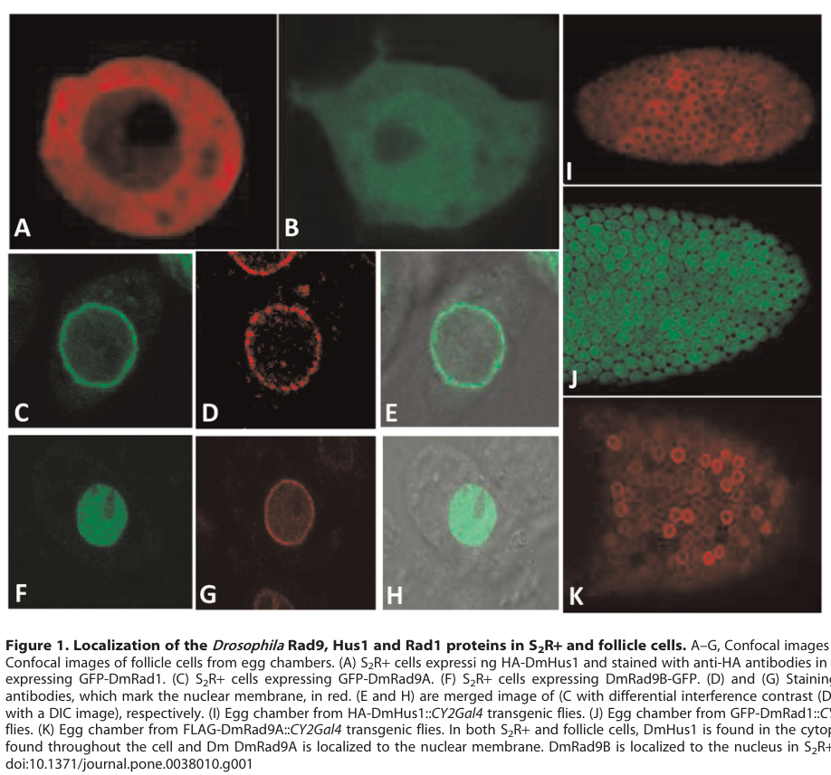

## Question

# Gene Research for Functional Annotation

## ⚠️ CRITICAL: Gene/Protein Identification Context

**BEFORE YOU BEGIN RESEARCH:** You MUST verify you are researching the CORRECT gene/protein. Gene symbols can be ambiguous, especially for less well-characterized genes from non-model organisms.

### Target Gene/Protein Identity (from UniProt):
- **UniProt Accession:** Q9VQD4
- **Protein Description:** RecName: Full=DNA repair protein Rad1 {ECO:0000305}; AltName: Full=Protein radiation insensitive 1 {ECO:0000312|FlyBase:FBgn0026778};
- **Gene Information:** Name=Rad1 {ECO:0000312|FlyBase:FBgn0026778}; ORFNames=CG3240 {ECO:0000312|FlyBase:FBgn0026778};
- **Organism (full):** Drosophila melanogaster (Fruit fly).
- **Protein Family:** Belongs to the rad1 family. .
- **Key Domains:** Cell_cycle_checkpoint_Rad1. (IPR003011); DNA_clamp_sf. (IPR046938); Rad1_Rec1_Rad17. (IPR003021); Rad1 (PF02144)

### MANDATORY VERIFICATION STEPS:

1. **Check if the gene symbol "Rad1" matches the protein description above**
2. **Verify the organism is correct:** Drosophila melanogaster (Fruit fly).
3. **Check if protein family/domains align with what you find in literature**
4. **If you find literature for a DIFFERENT gene with the same or similar symbol, STOP**

### If Gene Symbol is Ambiguous or You Cannot Find Relevant Literature:

**DO NOT PROCEED WITH RESEARCH ON A DIFFERENT GENE.** Instead:
- State clearly: "The gene symbol 'Rad1' is ambiguous or literature is limited for this specific protein"
- Explain what you found (e.g., "Found extensive literature on a different gene with the same symbol in a different organism")
- Describe the protein based ONLY on the UniProt information provided above
- Suggest that the protein function can be inferred from domain/family information

### Research Target:

Please provide a comprehensive research report on the gene **Rad1** (gene ID: Rad1, UniProt: Q9VQD4) in DROME.

The research report should be a detailed narrative explaining the function, biological processes, and localization of the gene product. Citations should be given for all claims.

You should prioritize authoritative reviews and primary scientific literature when conducting research. You can supplement
this with annotations you find in gene/protein databases, but these can be outdated or inaccurate.

We are specifically interested in the primary function of the gene - for enzymes, what reaction is catalyzed, and what is the substrate specificity? For transporters, what is the substrate? For structural proteins or adapters, what is the broader structural role? For signaling molecules, what is the role in the pathway.

We are interested in where in or outside the cell the gene product carries out its function.

We are also interested in the signaling or biochemical pathways in which the gene functions. We are less interested in broad pleiotropic effects, except where these elucidate the precise role.

Include evidence where possible. We are interested in both experimental evidence as well as inference from structure, evolution, or bioinformatic analysis. Precise studies should be prioritized over high-throughput, where available.

## Output

Question: You are an expert researcher providing comprehensive, well-cited information.

Provide detailed information focusing on:
1. Key concepts and definitions with current understanding
2. Recent developments and latest research (prioritize 2023-2024 sources)
3. Current applications and real-world implementations
4. Expert opinions and analysis from authoritative sources
5. Relevant statistics and data from recent studies

Format as a comprehensive research report with proper citations. Include URLs and publication dates where available.
Always prioritize recent, authoritative sources and provide specific citations for all major claims.

# Gene Research for Functional Annotation

## ⚠️ CRITICAL: Gene/Protein Identification Context

**BEFORE YOU BEGIN RESEARCH:** You MUST verify you are researching the CORRECT gene/protein. Gene symbols can be ambiguous, especially for less well-characterized genes from non-model organisms.

### Target Gene/Protein Identity (from UniProt):
- **UniProt Accession:** Q9VQD4
- **Protein Description:** RecName: Full=DNA repair protein Rad1 {ECO:0000305}; AltName: Full=Protein radiation insensitive 1 {ECO:0000312|FlyBase:FBgn0026778};
- **Gene Information:** Name=Rad1 {ECO:0000312|FlyBase:FBgn0026778}; ORFNames=CG3240 {ECO:0000312|FlyBase:FBgn0026778};
- **Organism (full):** Drosophila melanogaster (Fruit fly).
- **Protein Family:** Belongs to the rad1 family. .
- **Key Domains:** Cell_cycle_checkpoint_Rad1. (IPR003011); DNA_clamp_sf. (IPR046938); Rad1_Rec1_Rad17. (IPR003021); Rad1 (PF02144)

### MANDATORY VERIFICATION STEPS:

1. **Check if the gene symbol "Rad1" matches the protein description above**
2. **Verify the organism is correct:** Drosophila melanogaster (Fruit fly).
3. **Check if protein family/domains align with what you find in literature**
4. **If you find literature for a DIFFERENT gene with the same or similar symbol, STOP**

### If Gene Symbol is Ambiguous or You Cannot Find Relevant Literature:

**DO NOT PROCEED WITH RESEARCH ON A DIFFERENT GENE.** Instead:
- State clearly: "The gene symbol 'Rad1' is ambiguous or literature is limited for this specific protein"
- Explain what you found (e.g., "Found extensive literature on a different gene with the same symbol in a different organism")
- Describe the protein based ONLY on the UniProt information provided above
- Suggest that the protein function can be inferred from domain/family information

### Research Target:

Please provide a comprehensive research report on the gene **Rad1** (gene ID: Rad1, UniProt: Q9VQD4) in DROME.

The research report should be a detailed narrative explaining the function, biological processes, and localization of the gene product. Citations should be given for all claims.

You should prioritize authoritative reviews and primary scientific literature when conducting research. You can supplement
this with annotations you find in gene/protein databases, but these can be outdated or inaccurate.

We are specifically interested in the primary function of the gene - for enzymes, what reaction is catalyzed, and what is the substrate specificity? For transporters, what is the substrate? For structural proteins or adapters, what is the broader structural role? For signaling molecules, what is the role in the pathway.

We are interested in where in or outside the cell the gene product carries out its function.

We are also interested in the signaling or biochemical pathways in which the gene functions. We are less interested in broad pleiotropic effects, except where these elucidate the precise role.

Include evidence where possible. We are interested in both experimental evidence as well as inference from structure, evolution, or bioinformatic analysis. Precise studies should be prioritized over high-throughput, where available.

# Functional annotation report: *Drosophila melanogaster* Rad1 (Q9VQD4)

## Identity and scope

The target specified here is **fly Rad1**, the product annotated as **CG3240/FlyBase FBgn0026778, UniProt Q9VQD4**. Fly experiments identify a protein called Rad1 that associates with the checkpoint proteins Hus1 and Rad9, consistent with the supplied Rad1-family and DNA-clamp domain annotations. The accession and gene identifiers come from the identity information provided for this report; the cited experimental papers generally use *DmRad1*, rather than listing Q9VQD4. (abdu2007anessentialrole pages 4-6, kadir2012localizationofthe pages 2-3)

**Nomenclature matters:** this is the **Rad1 subunit of the Rad9–Rad1–Hus1 checkpoint clamp**, not the yeast *RAD1* excision-repair nuclease. The corresponding Drosophila XPF/ERCC4 nuclease is **MEI-9**. Nor should fly Rad1 be confused with the distinct **RAD17/Rad24 clamp loader**, or with budding-yeast Rad17, which is a 9-1-1 clamp subunit. A Drosophila DNA-repair review additionally describes Rad1 as encoded by a second open reading frame on a *Swm1* transcript; the functional significance of that transcript arrangement is unresolved. (jeff2017dnarepairin pages 8-9, jeff2017dnarepairin pages 5-6, zheng2023structuresof911 pages 1-3)

## Primary molecular function and pathway

**Best-supported annotation:** Rad1 is a **nonenzymatic, PCNA-like structural subunit of the heterotrimeric 9-1-1 DNA-damage checkpoint clamp**. Its principal proposed role is to help form a ring that can surround DNA and organize checkpoint signaling and DNA-repair factors at damaged or incompletely replicated DNA. Accordingly, there is **no demonstrated reaction catalyzed by fly Rad1 and no established Rad1-specific chemical substrate specificity**; the relevant substrate for the *assembled clamp-loading system* is a DNA junction or gap, not a base modified by a Rad1 enzyme. This assignment combines direct fly complex-association experiments with conserved clamp structure and biochemistry from other organisms. (abdu2007anessentialrole pages 4-6, kadir2012localizationofthe pages 2-3, hara2024structuralbasisfor pages 1-2, zheng2023structuresof911 pages 1-3)

The pathway model is **DNA damage or replication stress → single-stranded/double-stranded DNA junction → RAD17/RFC-family loading of 9-1-1 → ATR-family checkpoint activation and coordination of repair**. Recent structural work shows that loading is not restricted to a solitary recessed 5′ end: in a reconstituted **budding-yeast** Rad24–RFC system, 9-1-1 loaded more efficiently onto pre-existing DNA gaps, with structural intermediates examined on **5- and 10-nucleotide gaps**. Those measurements refine the *conserved-complex* model; **fly Q9VQD4 was not assayed**, so the precise gap preference and loading kinetics of Drosophila Rad1 remain unmeasured. A **human-protein** structural study published in 2024 likewise resolves the PCNA-like ring and interactions relevant to ATR–CHK1 activation, without establishing those molecular contacts in flies. (zheng2023structuresof911 pages 1-3, hara2024structuralbasisfor pages 1-2)

In flies, the 9-1-1 system is relevant to both **somatic responses to stalled replication/damaged DNA** and the **meiotic recombination checkpoint**. The Drosophila ATR ortholog is **Mei-41**; meiotic double-strand-break persistence activates a Mei-41-associated pathway involving **Chk2**, with effects on oocyte development. This identifies the signaling setting in which Rad1 is proposed to act, **not** a direct demonstration that a Rad1 mutation produces each downstream phenotype. Similarly, the experimentally documented hydroxyurea and methyl-methanesulfonate sensitivities, female sterility, and meiotic-checkpoint defects in the foundational fly study are **hus1-null phenotypes**, not Rad1-null phenotypes. (goldstein2025thedifferentialroles pages 1-3, abdu2007anessentialrole pages 1-2, abdu2007anessentialrole pages 4-6)

## Direct evidence for the fly protein

A 2007 yeast-two-hybrid study found **strong interaction between Drosophila Hus1 and Rad1** and weaker Hus1–Rad9 interaction. Rad1–Rad9 interaction was **not detected in that particular pairwise assay**; this negative result does not exclude association within a three-protein complex. The same work detected *rad1*, *hus1*, and *rad9* transcripts in wild-type ovaries by RT-PCR, establishing expression in a tissue where meiotic DNA surveillance is studied, but not demonstrating Rad1 protein abundance or checkpoint necessity. (abdu2007anessentialrole pages 4-6, abdu2007anessentialrole pages 10-14)

A subsequent fly study **co-expressed GFP–DmRad1, HA–DmHus1, and FLAG–DmRad9A in cultured cells**. Anti-GFP immunoprecipitation recovered tagged Hus1 and Rad9A, supporting their association in a Rad1-containing complex. When the tagged components were co-expressed in cultured cells or ovarian follicle cells, they accumulated together at the nuclear membrane. These findings strengthen the 9-1-1 assignment, but co-immunoprecipitation does not itself prove direct pairwise binding or establish the stoichiometry of an endogenous, DNA-bound clamp. Figure 1 shows tagged Rad1 localization, while Figure 3 documents the co-immunoprecipitation and co-expression experiments. (kadir2012localizationofthe pages 2-3, kadir2012localizationofthe pages 3-5, kadir2012localizationofthe media f5a14f0f, kadir2012localizationofthe media 30d21eeb)

The evidence can be read by strength and by the organism actually tested:

| Evidence | What it shows | Inference limitations | Source DOI / publication year |
|---|---|---|---|
| **Direct fly Rad1:** Drosophila Hus1–Rad1 yeast two-hybrid interaction; ovarian *rad1* RT-PCR | Strong pairwise Hus1–Rad1 reporter activation supports physical association; *rad1*, *rad9*, and *hus1* transcripts are present in ovaries, consistent with possible 9-1-1 assembly during oogenesis. (abdu2007anessentialrole pages 4-6) | The interaction was measured in yeast, not at endogenous fly protein abundance. Mutant sensitivity, sterility, checkpoint, and chromosome phenotypes in this study are **Hus1**, not Rad1, phenotypes. | [10.1242/jcs.03414](https://doi.org/10.1242/jcs.03414) — 2007 |
| **Direct fly Rad1 association/localization:** GFP-DmRad1 co-IP with HA-DmHus1 and FLAG-DmRad9A; triple co-expression | Recovery of tagged Hus1 and Rad9A with immunoprecipitated GFP-Rad1 supports association of all three fly proteins. When co-expressed, they accumulated at the nuclear membrane, consistent with Rad9A directing 9-1-1 localization. (kadir2012localizationofthe pages 2-3, kadir2012localizationofthe pages 5-7, kadir2012localizationofthe pages 3-5) | Tagged proteins were co-overexpressed in cultured cells or transgenic tissues; co-IP does not prove direct binding, endogenous stoichiometry, or physiological membrane recruitment. | [10.1371/journal.pone.0038010](https://doi.org/10.1371/journal.pone.0038010) — 2012 |
| **Direct fly Rad1 localization:** GFP-DmRad1 imaging in S2R+ cells and ovarian follicle cells | Tagged Rad1 was distributed throughout the cell when expressed alone; Rad9A was nuclear-membrane associated, Rad9B nuclear, and Hus1 cytoplasmic. (kadir2012localizationofthe pages 3-5, kadir2012localizationofthe pages 2-3, kadir2012localizationofthe media f5a14f0f) | Localization used overexpressed tagged constructs because endogenous-protein antibodies were unsuccessful; it does not demonstrate endogenous Rad1 enrichment at DNA lesions. | [10.1371/journal.pone.0038010](https://doi.org/10.1371/journal.pone.0038010) — 2012 |
| **Indirect fly evidence:** CRISPR disruption of both *rad9* isoforms and isoform-rescue genetics | *rad9* mutants had 98% abnormal karyosomes versus 2% in wild type and more germarial nuclei with ≥10 γ-H2Av foci (5.4 versus 0.82). Early Rad9B expression nearly restored fertility and reduced nuclei with persistent foci from 7 to 0.2; these results establish Rad9 isoform functions and provide partner-level context for Rad1. (goldstein2025thedifferentialroles pages 3-5, goldstein2025thedifferentialroles pages 5-8) | These are **Rad9**, not Rad1, phenotypes. They neither establish a Rad1 mutant phenotype nor prove that Rad1 is required for Rad9B-mediated repair; alternative fly clamp compositions remain a hypothesis. | [10.1016/j.dnarep.2025.103833](https://doi.org/10.1016/j.dnarep.2025.103833) — 2025 |
| **Cross-species structural inference:** Rad24/RAD17-RFC–9-1-1 structures and biochemical loading assays | Conserved 9-1-1 is a PCNA-like Rad9–Hus1–Rad1 ring. Clamp loaders place it at 5′ ssDNA–dsDNA junctions; structural work found preferential loading onto pre-existing gaps larger than 5 nt and supports roles in ATR signaling and gap-associated repair. Human work further places RAD1 in the toroidal clamp and protein-interaction surface. (hara2024structuralbasisfor pages 1-2, zheng2023structuresof911 pages 1-3) | These experiments used yeast/human proteins, not Q9VQD4. They support domain- and orthology-based annotation of fly Rad1 as a nonenzymatic DNA-clamp subunit, but do not directly establish fly substrate specificity, catalytic activity, or lesion recruitment. | [10.1016/j.celrep.2023.112694](https://doi.org/10.1016/j.celrep.2023.112694) — 2023; [10.1016/j.jbc.2024.105751](https://doi.org/10.1016/j.jbc.2024.105751) — 2024 |

*Table: Evidence is ranked from direct Drosophila Rad1 experiments to partner-gene genetics and cross-species structural inference. The table separates Rad1-supported conclusions from phenotypes demonstrated only for Hus1 or Rad9.*

## Cellular localization

**Observed for tagged fly Rad1 expressed alone:** GFP–DmRad1 was distributed **throughout S2R+ cultured cells and ovarian somatic follicle cells**, rather than being confined to the nucleus or nuclear envelope. Tagged Hus1 was mainly cytoplasmic; alternatively spliced **Rad9A localized to the nuclear membrane**, whereas **Rad9B accumulated within the nucleus**. On co-expression of the three tagged proteins, Rad9 altered their distribution, with accumulation of the Rad1-containing assembly at the nuclear membrane. Thus **nuclear and nuclear-envelope-associated pools are plausible**, but an exclusive nuclear localization for Rad1 would contradict the single-protein imaging. The experiments relied on tagged expression because attempts to detect the endogenous Rad9 protein with the investigators’ antibodies were unsuccessful; they did **not** directly image endogenous Rad1 recruited to a DNA lesion. (kadir2012localizationofthe pages 2-3, kadir2012localizationofthe pages 3-5)

In an *okra/Rad54* repair-mutant background with persistent meiotic breaks, tagged Rad9A was displaced from the oocyte nuclear membrane. That observation concerns **Rad9A localization**; the study did not establish an equivalent damage-induced redistribution of endogenous Rad1. The most precise functional-location statement for Q9VQD4 is therefore: **an intracellular checkpoint-clamp component, observed throughout cells when tagged and expressed alone, capable of associating with a nuclear-membrane-localized complex; its proposed action on nuclear DNA is supported primarily by complex identity and cross-species mechanism rather than direct imaging of endogenous fly Rad1 at breaks.** (kadir2012localizationofthe pages 3-5, kadir2012localizationofthe pages 5-7, zheng2023structuresof911 pages 1-3)

## Recent results and quantitative context

There is a consequential **2025 Drosophila study of Rad1’s partner Rad9**, but its genetics must not be recast as Rad1 genetics. Disrupting both fly *rad9* isoforms produced **abnormal oocyte karyosomes in 98% of mutant oocytes versus 2% in wild type**, and an average of **5.4 versus 0.82 germarial nuclei** with at least ten γ-H2Av damage-associated foci. Early expression of **Rad9B** strongly restored fertility and reduced nuclei with persistent foci from approximately **7 to 0.2 per germarium**; Rad9A did not comparably resolve those foci. These results show that different fly Rad9 isoforms have distinct meiotic functions and make alternative organization of Rad1-containing checkpoint assemblies worth investigating, **but they do not demonstrate which Rad9-dependent effects require Rad1**. (goldstein2025thedifferentialroles pages 3-5, goldstein2025thedifferentialroles pages 5-8, goldstein2025thedifferentialroles pages 1-3)

An earlier quantitative expression result found that ovarian **Rad9A transcript was approximately 6.42 ± 0.27 times as abundant as Rad9B transcript**. This is a measurement of **Rad9 isoforms, not Rad1**, and transcript abundance alone does not indicate which clamp assembly carries out meiotic repair. The experimentally grounded application of fly Rad1 at present is as a **model-system component for studying conserved genome surveillance and the spatial organization of 9-1-1**. The retrieved fly studies do not establish a Rad1-specific diagnostic test, therapeutic intervention, catalytic assay, or clinically validated application. (kadir2012localizationofthe pages 2-3, goldstein2025thedifferentialroles pages 5-8)

## Assessment and research gaps

**Confidence is high** that the protein studied as Drosophila Rad1 associates with Hus1 and Rad9-family checkpoint components and that tagged Rad1 localization depends on co-expressed partners. **Confidence is lower** for claims about its exact DNA-junction preference, its requirement for Mei-41/Chk2 signaling, its role in meiotic break repair, or its endogenous location at a damaged chromosome: these rely on other clamp subunits or on yeast/human mechanistic work. No **Rad1-specific fly loss-of-function, rescue, purified-clamp substrate-specificity, or endogenous damage-focus experiment** was identified in the sources reviewed. A decisive functional annotation would require those assays, particularly because the 2025 Rad9-isoform results cannot identify which proposed clamp assemblies actually contain functional Rad1 in vivo. (abdu2007anessentialrole pages 4-6, kadir2012localizationofthe pages 2-3, goldstein2025thedifferentialroles pages 5-8, zheng2023structuresof911 pages 1-3)

### Principal sources and publication dates

- Abdu U *et al.* **15 March 2007.** “An essential role for Drosophila hus1 in somatic and meiotic DNA damage responses.” *Journal of Cell Science*. https://doi.org/10.1242/jcs.03414. (abdu2007anessentialrole pages 1-2)
- Kadir R *et al.* **May 2012.** “Localization of the Drosophila Rad9 Protein to the Nuclear Membrane Is Regulated by the C-Terminal Region and Is Affected in the Meiotic Checkpoint.” *PLOS ONE*. https://doi.org/10.1371/journal.pone.0038010. (kadir2012localizationofthe pages 2-3)
- Sekelsky J. **January 2017.** “DNA Repair in Drosophila: Mutagens, Models, and Missing Genes.” *Genetics*. https://doi.org/10.1534/genetics.116.186759. (jeff2017dnarepairin pages 8-9)
- Zheng F *et al.* **25 July 2023.** “Structures of 9-1-1 DNA checkpoint clamp loading at gaps from start to finish and ramification on biology.” *Cell Reports*; **yeast biochemical/structural system, not fly Rad1**. https://doi.org/10.1016/j.celrep.2023.112694. (zheng2023structuresof911 pages 1-3)
- Hara K *et al.* **13 February 2024 online; March 2024 issue.** “Structural basis for intra- and intermolecular interactions on RAD9 subunit of 9-1-1 checkpoint clamp implies functional 9-1-1 regulation by RHINO.” *Journal of Biological Chemistry*; **human-protein mechanistic context**. https://doi.org/10.1016/j.jbc.2024.105751. (hara2024structuralbasisfor pages 1-2)
- Goldstein B *et al.* **May 2025.** “The differential roles of rad9 alternatively spliced forms in double-strand DNA break repair during Drosophila meiosis.” *DNA Repair*; **Rad9 genetics, not a Rad1-mutant study**. https://doi.org/10.1016/j.dnarep.2025.103833. (goldstein2025thedifferentialroles pages 3-5, goldstein2025thedifferentialroles pages 5-8)

References

1. (abdu2007anessentialrole pages 4-6): Uri Abdu, Martha Klovstad, Veronika Butin-Israeli, Anna Bakhrat, and Trudi Schüpbach. An essential role for drosophila hus1 in somatic and meiotic dna damage responses. Journal of Cell Science, 120:1042-1049, Mar 2007. URL: https://doi.org/10.1242/jcs.03414, doi:10.1242/jcs.03414. This article has 34 citations and is from a domain leading peer-reviewed journal.

2. (kadir2012localizationofthe pages 2-3): Rotem Kadir, Anna Bakhrat, Ronit Tokarsky, and Uri Abdu. Localization of the drosophila rad9 protein to the nuclear membrane is regulated by the c-terminal region and is affected in the meiotic checkpoint. PLoS ONE, 7:e38010, May 2012. URL: https://doi.org/10.1371/journal.pone.0038010, doi:10.1371/journal.pone.0038010. This article has 14 citations and is from a peer-reviewed journal.

3. (jeff2017dnarepairin pages 8-9): Jeff Sekelsky. Dna repair in drosophila: mutagens, models, and missing genes. Genetics, 205:471-490, Jan 2017. URL: https://doi.org/10.1534/genetics.116.186759, doi:10.1534/genetics.116.186759. This article has 161 citations and is from a domain leading peer-reviewed journal.

4. (jeff2017dnarepairin pages 5-6): Jeff Sekelsky. Dna repair in drosophila: mutagens, models, and missing genes. Genetics, 205:471-490, Jan 2017. URL: https://doi.org/10.1534/genetics.116.186759, doi:10.1534/genetics.116.186759. This article has 161 citations and is from a domain leading peer-reviewed journal.

5. (zheng2023structuresof911 pages 1-3): Fengwei Zheng, Roxana E. Georgescu, Nina Y. Yao, Michael E. O’Donnell, and Huilin Li. Structures of 9-1-1 dna checkpoint clamp loading at gaps from start to finish and ramification on biology. Cell Reports, 42:112694, Jul 2023. URL: https://doi.org/10.1016/j.celrep.2023.112694, doi:10.1016/j.celrep.2023.112694. This article has 15 citations and is from a highest quality peer-reviewed journal.

6. (hara2024structuralbasisfor pages 1-2): Kodai Hara, Kensuke Tatsukawa, Kiho Nagata, Nao Iida, Asami Hishiki, Eiji Ohashi, and Hiroshi Hashimoto. Structural basis for intra- and intermolecular interactions on rad9 subunit of 9-1-1 checkpoint clamp implies functional 9-1-1 regulation by rhino. Journal of Biological Chemistry, 300:105751, Mar 2024. URL: https://doi.org/10.1016/j.jbc.2024.105751, doi:10.1016/j.jbc.2024.105751. This article has 7 citations and is from a domain leading peer-reviewed journal.

7. (goldstein2025thedifferentialroles pages 1-3): Bareket Goldstein, Suad Sheikh-Suliman, Anna Bakhrat, and Uri Abdu. The differential roles of rad9 alternatively spliced forms in double- strand dna break repair during drosophila meiosis. DNA Repair, 149:103833, May 2025. URL: https://doi.org/10.1016/j.dnarep.2025.103833, doi:10.1016/j.dnarep.2025.103833. This article has 0 citations and is from a peer-reviewed journal.

8. (abdu2007anessentialrole pages 1-2): Uri Abdu, Martha Klovstad, Veronika Butin-Israeli, Anna Bakhrat, and Trudi Schüpbach. An essential role for drosophila hus1 in somatic and meiotic dna damage responses. Journal of Cell Science, 120:1042-1049, Mar 2007. URL: https://doi.org/10.1242/jcs.03414, doi:10.1242/jcs.03414. This article has 34 citations and is from a domain leading peer-reviewed journal.

9. (abdu2007anessentialrole pages 10-14): Uri Abdu, Martha Klovstad, Veronika Butin-Israeli, Anna Bakhrat, and Trudi Schüpbach. An essential role for drosophila hus1 in somatic and meiotic dna damage responses. Journal of Cell Science, 120:1042-1049, Mar 2007. URL: https://doi.org/10.1242/jcs.03414, doi:10.1242/jcs.03414. This article has 34 citations and is from a domain leading peer-reviewed journal.

10. (kadir2012localizationofthe pages 3-5): Rotem Kadir, Anna Bakhrat, Ronit Tokarsky, and Uri Abdu. Localization of the drosophila rad9 protein to the nuclear membrane is regulated by the c-terminal region and is affected in the meiotic checkpoint. PLoS ONE, 7:e38010, May 2012. URL: https://doi.org/10.1371/journal.pone.0038010, doi:10.1371/journal.pone.0038010. This article has 14 citations and is from a peer-reviewed journal.

11. (kadir2012localizationofthe media f5a14f0f): Rotem Kadir, Anna Bakhrat, Ronit Tokarsky, and Uri Abdu. Localization of the drosophila rad9 protein to the nuclear membrane is regulated by the c-terminal region and is affected in the meiotic checkpoint. PLoS ONE, 7:e38010, May 2012. URL: https://doi.org/10.1371/journal.pone.0038010, doi:10.1371/journal.pone.0038010. This article has 14 citations and is from a peer-reviewed journal.

12. (kadir2012localizationofthe media 30d21eeb): Rotem Kadir, Anna Bakhrat, Ronit Tokarsky, and Uri Abdu. Localization of the drosophila rad9 protein to the nuclear membrane is regulated by the c-terminal region and is affected in the meiotic checkpoint. PLoS ONE, 7:e38010, May 2012. URL: https://doi.org/10.1371/journal.pone.0038010, doi:10.1371/journal.pone.0038010. This article has 14 citations and is from a peer-reviewed journal.

13. (kadir2012localizationofthe pages 5-7): Rotem Kadir, Anna Bakhrat, Ronit Tokarsky, and Uri Abdu. Localization of the drosophila rad9 protein to the nuclear membrane is regulated by the c-terminal region and is affected in the meiotic checkpoint. PLoS ONE, 7:e38010, May 2012. URL: https://doi.org/10.1371/journal.pone.0038010, doi:10.1371/journal.pone.0038010. This article has 14 citations and is from a peer-reviewed journal.

14. (goldstein2025thedifferentialroles pages 3-5): Bareket Goldstein, Suad Sheikh-Suliman, Anna Bakhrat, and Uri Abdu. The differential roles of rad9 alternatively spliced forms in double- strand dna break repair during drosophila meiosis. DNA Repair, 149:103833, May 2025. URL: https://doi.org/10.1016/j.dnarep.2025.103833, doi:10.1016/j.dnarep.2025.103833. This article has 0 citations and is from a peer-reviewed journal.

15. (goldstein2025thedifferentialroles pages 5-8): Bareket Goldstein, Suad Sheikh-Suliman, Anna Bakhrat, and Uri Abdu. The differential roles of rad9 alternatively spliced forms in double- strand dna break repair during drosophila meiosis. DNA Repair, 149:103833, May 2025. URL: https://doi.org/10.1016/j.dnarep.2025.103833, doi:10.1016/j.dnarep.2025.103833. This article has 0 citations and is from a peer-reviewed journal.

## Artifacts

- [Edison artifact artifact-00](Rad1-deep-research-falcon_artifacts/artifact-00.md)

## Citations

1. abdu2007anessentialrole pages 4-6
2. abdu2007anessentialrole pages 1-2
3. kadir2012localizationofthe pages 2-3
4. jeff2017dnarepairin pages 8-9
5. hara2024structuralbasisfor pages 1-2
6. jeff2017dnarepairin pages 5-6
7. goldstein2025thedifferentialroles pages 1-3
8. abdu2007anessentialrole pages 10-14
9. kadir2012localizationofthe pages 3-5
10. kadir2012localizationofthe pages 5-7
11. goldstein2025thedifferentialroles pages 3-5
12. goldstein2025thedifferentialroles pages 5-8
13. 10.1242/jcs.03414
14. 10.1371/journal.pone.0038010
15. 10.1016/j.dnarep.2025.103833
16. 10.1016/j.celrep.2023.112694
17. 10.1016/j.jbc.2024.105751
18. https://doi.org/10.1242/jcs.03414
19. https://doi.org/10.1371/journal.pone.0038010
20. https://doi.org/10.1016/j.dnarep.2025.103833
21. https://doi.org/10.1016/j.celrep.2023.112694
22. https://doi.org/10.1016/j.jbc.2024.105751
23. https://doi.org/10.1242/jcs.03414.
24. https://doi.org/10.1371/journal.pone.0038010.
25. https://doi.org/10.1534/genetics.116.186759.
26. https://doi.org/10.1016/j.celrep.2023.112694.
27. https://doi.org/10.1016/j.jbc.2024.105751.
28. https://doi.org/10.1016/j.dnarep.2025.103833.
29. https://doi.org/10.1242/jcs.03414,
30. https://doi.org/10.1371/journal.pone.0038010,
31. https://doi.org/10.1534/genetics.116.186759,
32. https://doi.org/10.1016/j.celrep.2023.112694,
33. https://doi.org/10.1016/j.jbc.2024.105751,
34. https://doi.org/10.1016/j.dnarep.2025.103833,