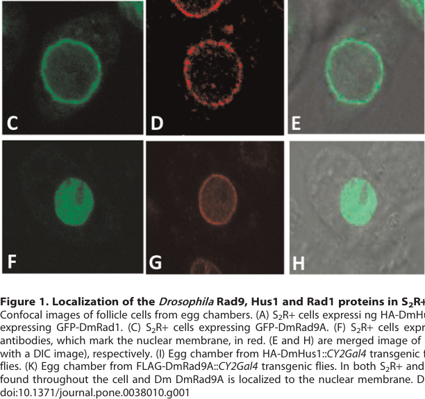

## Question

# Gene Research for Functional Annotation

## ⚠️ CRITICAL: Gene/Protein Identification Context

**BEFORE YOU BEGIN RESEARCH:** You MUST verify you are researching the CORRECT gene/protein. Gene symbols can be ambiguous, especially for less well-characterized genes from non-model organisms.

### Target Gene/Protein Identity (from UniProt):
- **UniProt Accession:** O96533
- **Protein Description:** RecName: Full=Cell cycle checkpoint control protein Rad9 {ECO:0000305};
- **Gene Information:** Name=Rad9 {ECO:0000312|FlyBase:FBgn0025807}; ORFNames=CG3945 {ECO:0000312|FlyBase:FBgn0025807};
- **Organism (full):** Drosophila melanogaster (Fruit fly).
- **Protein Family:** Belongs to the rad9 family.
- **Key Domains:** DNA_clamp_sf. (IPR046938); Rad9. (IPR026584); Rad9/Ddc1. (IPR007268); Rad9 (PF04139)

### MANDATORY VERIFICATION STEPS:

1. **Check if the gene symbol "Rad9" matches the protein description above**
2. **Verify the organism is correct:** Drosophila melanogaster (Fruit fly).
3. **Check if protein family/domains align with what you find in literature**
4. **If you find literature for a DIFFERENT gene with the same or similar symbol, STOP**

### If Gene Symbol is Ambiguous or You Cannot Find Relevant Literature:

**DO NOT PROCEED WITH RESEARCH ON A DIFFERENT GENE.** Instead:
- State clearly: "The gene symbol 'Rad9' is ambiguous or literature is limited for this specific protein"
- Explain what you found (e.g., "Found extensive literature on a different gene with the same symbol in a different organism")
- Describe the protein based ONLY on the UniProt information provided above
- Suggest that the protein function can be inferred from domain/family information

### Research Target:

Please provide a comprehensive research report on the gene **Rad9** (gene ID: Rad9, UniProt: O96533) in DROME.

The research report should be a detailed narrative explaining the function, biological processes, and localization of the gene product. Citations should be given for all claims.

You should prioritize authoritative reviews and primary scientific literature when conducting research. You can supplement
this with annotations you find in gene/protein databases, but these can be outdated or inaccurate.

We are specifically interested in the primary function of the gene - for enzymes, what reaction is catalyzed, and what is the substrate specificity? For transporters, what is the substrate? For structural proteins or adapters, what is the broader structural role? For signaling molecules, what is the role in the pathway.

We are interested in where in or outside the cell the gene product carries out its function.

We are also interested in the signaling or biochemical pathways in which the gene functions. We are less interested in broad pleiotropic effects, except where these elucidate the precise role.

Include evidence where possible. We are interested in both experimental evidence as well as inference from structure, evolution, or bioinformatic analysis. Precise studies should be prioritized over high-throughput, where available.

## Output

Question: You are an expert researcher providing comprehensive, well-cited information.

Provide detailed information focusing on:
1. Key concepts and definitions with current understanding
2. Recent developments and latest research (prioritize 2023-2024 sources)
3. Current applications and real-world implementations
4. Expert opinions and analysis from authoritative sources
5. Relevant statistics and data from recent studies

Format as a comprehensive research report with proper citations. Include URLs and publication dates where available.
Always prioritize recent, authoritative sources and provide specific citations for all major claims.

# Gene Research for Functional Annotation

## ⚠️ CRITICAL: Gene/Protein Identification Context

**BEFORE YOU BEGIN RESEARCH:** You MUST verify you are researching the CORRECT gene/protein. Gene symbols can be ambiguous, especially for less well-characterized genes from non-model organisms.

### Target Gene/Protein Identity (from UniProt):
- **UniProt Accession:** O96533
- **Protein Description:** RecName: Full=Cell cycle checkpoint control protein Rad9 {ECO:0000305};
- **Gene Information:** Name=Rad9 {ECO:0000312|FlyBase:FBgn0025807}; ORFNames=CG3945 {ECO:0000312|FlyBase:FBgn0025807};
- **Organism (full):** Drosophila melanogaster (Fruit fly).
- **Protein Family:** Belongs to the rad9 family.
- **Key Domains:** DNA_clamp_sf. (IPR046938); Rad9. (IPR026584); Rad9/Ddc1. (IPR007268); Rad9 (PF04139)

### MANDATORY VERIFICATION STEPS:

1. **Check if the gene symbol "Rad9" matches the protein description above**
2. **Verify the organism is correct:** Drosophila melanogaster (Fruit fly).
3. **Check if protein family/domains align with what you find in literature**
4. **If you find literature for a DIFFERENT gene with the same or similar symbol, STOP**

### If Gene Symbol is Ambiguous or You Cannot Find Relevant Literature:

**DO NOT PROCEED WITH RESEARCH ON A DIFFERENT GENE.** Instead:
- State clearly: "The gene symbol 'Rad9' is ambiguous or literature is limited for this specific protein"
- Explain what you found (e.g., "Found extensive literature on a different gene with the same symbol in a different organism")
- Describe the protein based ONLY on the UniProt information provided above
- Suggest that the protein function can be inferred from domain/family information

### Research Target:

Please provide a comprehensive research report on the gene **Rad9** (gene ID: Rad9, UniProt: O96533) in DROME.

The research report should be a detailed narrative explaining the function, biological processes, and localization of the gene product. Citations should be given for all claims.

You should prioritize authoritative reviews and primary scientific literature when conducting research. You can supplement
this with annotations you find in gene/protein databases, but these can be outdated or inaccurate.

We are specifically interested in the primary function of the gene - for enzymes, what reaction is catalyzed, and what is the substrate specificity? For transporters, what is the substrate? For structural proteins or adapters, what is the broader structural role? For signaling molecules, what is the role in the pathway.

We are interested in where in or outside the cell the gene product carries out its function.

We are also interested in the signaling or biochemical pathways in which the gene functions. We are less interested in broad pleiotropic effects, except where these elucidate the precise role.

Include evidence where possible. We are interested in both experimental evidence as well as inference from structure, evolution, or bioinformatic analysis. Precise studies should be prioritized over high-throughput, where available.

# Functional annotation report: *Drosophila melanogaster* Rad9

## Identity and scope

**The target is the fruit-fly gene *Rad9* (CG3945; UniProt O96533), not a similarly named gene in another organism.** Its supplied Rad9/Rad9-Ddc1 and DNA-clamp domain annotations agree with fly experiments identifying its protein as a component of the Rad9–Rad1–Hus1 (**9-1-1**) checkpoint complex. The fly gene makes **Rad9A and Rad9B splice isoforms**; these must not be confused with the distinct mammalian *RAD9A* and *RAD9B* paralogous genes. Each fly isoform is 456 amino acids long; they share residues 1–424 and differ in their final 32 residues. (goldstein2025thedifferentialroles pages 1-3, kadir2012localizationofthe pages 2-3)

## Primary molecular role and pathway

**Rad9 is a DNA-damage-response clamp subunit and signaling/repair scaffold, not an enzyme with a demonstrated catalytic reaction.** In fly cells, tagged Rad9 co-immunoprecipitates with Rad1 and Hus1, supporting assembly of a heterotrimeric 9-1-1 complex; earlier two-hybrid experiments detected Hus1–Rad9 association. Its primary role is therefore to help organize responses to damaged DNA, particularly during meiotic double-strand-break (DSB) repair and checkpoint signaling in the ovary. Co-immunoprecipitation establishes association in cells, not purified-protein binding or clamp loading onto fly DNA. (abdu2007anessentialrole pages 2-4, kadir2012localizationofthe pages 2-3)

The established **cross-species mechanistic model** is that a Rad17–RFC-like loader places the ring-shaped 9-1-1 complex at a **5′-recessed DNA junction**, where the clamp supports DNA-repair factors and ATR-dependent checkpoint activation. A 2023 human structural study resolved a RAD17 peptide bound to the RAD1 clamp subunit at **2.1 Å**, adding molecular detail to this model. These are *not* measurements of fly Rad9 substrate preference: the particular vertebrate RAD17–RAD1 binding motif characterized in that study is **not conserved in *Drosophila***. Fly-specific clamp loading, DNA-junction specificity and direct recruitment of an ATR activator remain to be established. (goldstein2025thedifferentialroles pages 1-3, hara2023the911dna pages 1-2)

In the fly meiotic-recombination response, persistent DSBs engage the **Mei-41/ATR–Chk2 pathway**, which affects translation of *gurken* and consequently eggshell dorsal–ventral patterning and oocyte karyosome organization. The Rad9 knockout experiments below support a contribution to this pathway, but eggshell and karyosome assays measure downstream developmental outcomes rather than Rad9-dependent phosphorylation of Mei-41 or Chk2 directly. (goldstein2025thedifferentialroles pages 1-3, goldstein2025thedifferentialroles pages 8-9)

## Where Rad9 functions

The two isoforms have different experimentally observed distributions. Tagged **Rad9A colocalizes with lamin at the nuclear envelope** in fly S2R+ cells and ovarian follicle cells, whereas **Rad9B is concentrated within the nucleus**. When Rad9, Rad1 and Hus1 were co-expressed, the other two proteins accumulated according to Rad9’s location, consistent with Rad9 helping position the complex. Ovarian quantitative RT-PCR found the Rad9A transcript **6.42 ± 0.27 times** as abundant as Rad9B transcript; transcript abundance does not establish which protein makes the larger contribution to repair. The relevant regions of the original localization micrographs are shown in the inspected Figure 1. (kadir2012localizationofthe pages 2-3, kadir2012localizationofthe media 8d4ac9f8)

Mutagenesis identified a nuclear-localization sequence at **Rad9 residues 300–302**: alanine substitutions shifted tagged Rad9 from the nucleus into the cytoplasm. The Rad9A-specific C-terminal region confers its distinctive nuclear-envelope targeting. In *okra*/*Rad54* repair-mutant oocytes, which retain meiotic lesions, tagged Rad9A lost its usual nuclear-envelope distribution. By contrast, disrupting chromosome–envelope organization through expression of nonphosphorylatable BAF did not similarly displace it. The investigators interpret the *okra* observation as a response associated with persistent breaks, **not proof that Rad9A physically anchors chromosomes to the envelope**. Importantly, the localization work relied largely on tagged, overexpressed proteins because endogenous Rad9 antibodies and an endogenous GFP-tagging approach did not yield detectable signal. (kadir2012localizationofthe pages 3-5, kadir2012localizationofthe pages 5-7, kadir2012localizationofthe pages 2-3)

## Direct fly genetics: meiotic repair and checkpoint

The most informative recent fly-specific study, published in **May 2025**, disrupted both *rad9* splice forms by CRISPR insertion. Homozygous animals survived, but females had markedly impaired fertility. **98% of mutant oocytes had abnormal karyosomes versus 2% of controls**; the number of germarial nuclei with at least ten DSB-associated γ-H2Av foci averaged **5.4 versus 0.82**, respectively. These results implicate Rad9 in the response to meiotic breaks, while recognizing that γ-H2Av reports damage-associated chromatin signaling rather than physical DSBs directly. (goldstein2025thedifferentialroles pages 3-5)

Timed isoform rescue sharpened the functional assignment. Expressing **Rad9B early in the germarium** increased measured fertility by approximately **90%** and reduced nuclei with persistent γ-H2Av signal from **7 to 0.2 per germarium**. Early **Rad9A** expression gave a reported **66% fertility improvement**, but changed the corresponding focus-positive count only from **6.3 to 5.1**. Thus Rad9B provided the convincing rescue of efficient early meiotic break resolution in these assays; partial fertility rescue by Rad9A does **not** demonstrate that it performs the same accurate repair reaction. The authors discuss alternative or less efficient repair as a possibility, not as a demonstrated Rad9A-dependent pathway. (goldstein2025thedifferentialroles pages 5-8, goldstein2025thedifferentialroles pages 8-9)

Timing separated repair from nuclear morphology. Early Rad9A or Rad9B expression raised normal-looking karyosomes from approximately **2% to 81% or 100%**, respectively. Expressing Rad9B only later, beginning around egg-chamber stage 3, raised normal-looking karyosomes from **2% to 90%** but **did not rescue early germarial γ-H2Av accumulation or fertility**. Karyosome normalization alone is therefore not evidence that the meiotic lesions were repaired. Moreover, γ-H2Av can persist after physical DSB disappearance, so even the stronger focus-based rescue should be interpreted as a highly informative *proxy*, not a direct molecular assay of repair fidelity. (goldstein2025thedifferentialroles pages 5-8, goldstein2025thedifferentialroles pages 8-9)

Rad9 also contributes to **efficient, but not all-or-none, meiotic checkpoint signaling**. Rad9-mutant females produced **9% ventralized eggshells**. Introducing the *rad9* mutation into the DSB-repair mutants *spnA* or *spnB* increased wild-type-like eggshells from **1% to 25%** or from **33% to 45%**, respectively: checkpoint-associated patterning was only partly suppressed. Conversely, eliminating **Chk2** increased normal-looking karyosomes in a *rad9* mutant background from **0% to 85%**, consistent with persistent, Chk2-dependent signaling when Rad9 is absent. This differs from the more complete checkpoint-patterning suppression reported for loss of the partner **Hus1**. (goldstein2025thedifferentialroles pages 8-9)

Biochemical evidence links this pathway to **Brca2**, but does not settle its mechanism. A **February 2008** ovarian experiment recovered HA-Brca2 in FLAG-Rad9 immunoprecipitates; the authors estimated that approximately **1/40 to 1/400** of total tagged Brca2 co-precipitated across three experiments. This demonstrates association under the experimental conditions, **not necessarily direct binding or a required Rad9–Brca2 signaling step**. The authors considered an interaction confined to a subset of molecules or meiotic stages plausible. (klovstad2008drosophilabrca2is pages 8-9)

The evidence and its principal qualifications are summarized here. (goldstein2025thedifferentialroles pages 5-8, goldstein2025thedifferentialroles pages 8-9, hara2023the911dna pages 1-2, kadir2012localizationofthe pages 2-3)

| Question | Direct fly evidence | Inference / limitations | Primary study DOI/year |
|---|---|---|---|
| Identity and isoforms | *D. melanogaster* **Rad9/CG3945** produces 456-aa Rad9A and Rad9B splice isoforms sharing residues 1–424 but differing in their final 32 residues; ovarian Rad9A transcript was 6.42 ± 0.27-fold more abundant. (kadir2012localizationofthe pages 2-3) | Fly Rad9A/B are splice products of one gene, **not** equivalents of the separate mammalian RAD9A and RAD9B paralogs. | [10.1371/journal.pone.0038010](https://doi.org/10.1371/journal.pone.0038010), 2012 |
| Cellular localization and complex assembly | Overexpressed, tagged Rad9A colocalized with lamin at the nuclear envelope; Rad9B concentrated in the nucleus. Co-immunoprecipitation supported a Rad9–Rad1–Hus1 complex, and co-expression relocated Rad1 and Hus1 according to Rad9. (kadir2012localizationofthe pages 3-5, kadir2012localizationofthe pages 5-7, kadir2012localizationofthe pages 2-3) | Localization relied largely on tagged overexpression because endogenous antibodies and GFP tagging did not yield detectable protein. It therefore establishes localization capacity rather than definitive endogenous abundance or dynamics. | [10.1371/journal.pone.0038010](https://doi.org/10.1371/journal.pone.0038010), 2012 |
| Rad9 loss during oogenesis | CRISPR insertion disrupting both isoforms produced viable flies but reduced female fertility. Mutants had defective karyosomes in **98%** of oocytes versus **2%** in wild type and averaged **5.4 versus 0.82** germarial nuclei with ≥10 γ-H2Av foci. (goldstein2025thedifferentialroles pages 3-5) | γ-H2Av persistence is an indirect DSB-associated readout and can outlast physical breaks; karyosome morphology is a checkpoint outcome, not a direct repair measurement. | [10.1016/j.dnarep.2025.103833](https://doi.org/10.1016/j.dnarep.2025.103833), 2025 |
| Isoform-specific early rescue | Germarial Rad9B expression increased fertility by about **90%** and reduced nuclei with persistent γ-H2Av from **7 to 0.2 per germarium**. Rad9A increased fertility by **66%** but changed the γ-H2Av measure only from **6.3 to 5.1**. (goldstein2025thedifferentialroles pages 5-8) | Strongly supports Rad9B as necessary and sufficient for efficient meiotic repair in this assay. Partial Rad9A fertility rescue might reflect inefficient or alternative repair, but this mechanism was not directly demonstrated. | [10.1016/j.dnarep.2025.103833](https://doi.org/10.1016/j.dnarep.2025.103833), 2025 |
| Timing and karyosome organization | Late Rad9B expression beginning at stage 3 increased wild-type-like karyosomes from **2% to 90%**, but did not rescue germarial DSB accumulation or fertility. Early Rad9A and Rad9B increased wild-type-like karyosomes to **81%** and **100%**, respectively. (goldstein2025thedifferentialroles pages 5-8) | Karyosome organization can be restored independently of early DSB resolution and fertility; it should not be used as a surrogate for accurate repair. | [10.1016/j.dnarep.2025.103833](https://doi.org/10.1016/j.dnarep.2025.103833), 2025 |
| Meiotic checkpoint signaling | rad9 mutants laid **9% ventralized eggs**. rad9 loss partially increased wild-type-like eggshells in *spnA* mutants from **1% to 25%** and in *spnB* mutants from **33% to 45%**. Removing Chk2 increased wild-type-like rad9-mutant karyosomes from **0% to 85%**. (goldstein2025thedifferentialroles pages 8-9) | Rad9 loss still permits partial Chk2-dependent checkpoint activation, unlike reported complete suppression by *hus1*. Eggshell polarity and karyosome morphology are developmental outputs of signaling rather than direct biochemical ATR/Chk2 measurements. | [10.1016/j.dnarep.2025.103833](https://doi.org/10.1016/j.dnarep.2025.103833), 2025 |
| Association with Brca2 | FLAG-Rad9 immunoprecipitated HA-Brca2 from ovaries; approximately **1/40 to 1/400** of total Brca2 was recovered across three experiments. (klovstad2008drosophilabrca2is pages 8-9) | Supports association, but not necessarily direct binding, defined stoichiometry, or functional causality; the interaction may involve only a subset of proteins or a restricted germarial stage. | [10.1371/journal.pgen.0040031](https://doi.org/10.1371/journal.pgen.0040031), 2008 |
| Somatic replication-stress evidence | HU/MMS sensitivity, MMS-associated aneuploidy, and lack of X-ray sensitivity were demonstrated for **hus1-null**, not *rad9*, flies. (abdu2007anessentialrole pages 2-4, abdu2007anessentialrole pages 4-6) | These results support a related 9-1-1 subunit’s somatic role but cannot be assigned directly to Rad9 without Rad9-specific experiments. | [10.1242/jcs.03414](https://doi.org/10.1242/jcs.03414), 2007 |
| Molecular clamp-loading model | Vertebrate structural work shows RAD17–RFC loading the ring-shaped 9-1-1 clamp onto **5′-recessed DNA**, enabling ATR–CHK1 signaling; the human RAD17 peptide binds RAD1 at 2.1 Å resolution. (hara2023the911dna pages 1-2) | Mechanistically informative homology-based model only: the identified vertebrate RAD17-binding motif is not conserved in *Drosophila*, and fly-specific DNA loading, junction preference, or ATR recruitment has not been directly demonstrated. | [10.1016/j.jbc.2023.103061](https://doi.org/10.1016/j.jbc.2023.103061), 2023 |

*Table: Evidence for fly Rad9 is separated from conclusions inferred from Hus1 or vertebrate 9-1-1 studies. Quantitative phenotypes highlight the distinct meiotic contributions of the two Drosophila splice isoforms.*

## Current applications and outstanding questions

Fly *rad9* knockout and temporally controlled **Rad9A/Rad9B transgenic rescue** provide an experimental system for separating early meiotic break responses from later karyosome organization and fertility. The 2025 work is the clearest direct functional update found for this specific gene; the relevant **2023** structural advance instead concerns **human** 9-1-1 and must be used as a qualified comparative model. No fly-Rad9-specific 2023–2024 mechanistic study established the human RAD17 contact or a fly Rad9 DNA-binding specificity. (goldstein2025thedifferentialroles pages 5-8, hara2023the911dna pages 1-2)

An important boundary is **somatic function**: published fly sensitivity to hydroxyurea and methyl methanesulfonate, and lack of comparable X-ray sensitivity, were measured in ** *hus1* mutants—not *rad9* mutants**. They support a role for a related 9-1-1 subunit in replication-stress responses, but should not be entered as demonstrated Rad9 phenotypes. The strongest annotation for **this protein** remains a nuclear/nuclear-envelope-associated 9-1-1 scaffold involved in ovarian meiotic DSB responses, with a particularly strong repair requirement for **Rad9B** and a partial contribution of Rad9 to checkpoint signaling. (abdu2007anessentialrole pages 2-4, goldstein2025thedifferentialroles pages 5-8, goldstein2025thedifferentialroles pages 8-9, kadir2012localizationofthe pages 2-3)

### Principal sources and publication dates

- Goldstein B. *et al.* **May 2025.** “The differential roles of *rad9* alternatively spliced forms in double-strand DNA break repair during *Drosophila* meiosis.” *DNA Repair* **149**, 103833. https://doi.org/10.1016/j.dnarep.2025.103833. (goldstein2025thedifferentialroles pages 1-3, goldstein2025thedifferentialroles pages 5-8)
- Hara K. *et al.* **April 2023.** “The 9-1-1 DNA clamp subunit RAD1 forms specific interactions with clamp loader RAD17…” *Journal of Biological Chemistry* **299**, 103061. **Human structural evidence, not a fly Rad9 assay.** https://doi.org/10.1016/j.jbc.2023.103061. (hara2023the911dna pages 1-2)
- Kadir R. *et al.* **May 2012.** “Localization of the *Drosophila* Rad9 protein to the nuclear membrane…” *PLoS ONE* **7**, e38010. https://doi.org/10.1371/journal.pone.0038010. (kadir2012localizationofthe pages 3-5, kadir2012localizationofthe pages 2-3)
- Klovstad M. *et al.* **February 2008.** “*Drosophila brca2* is required for mitotic and meiotic DNA repair and efficient activation of the meiotic recombination checkpoint.” *PLoS Genetics* **4**, e31. https://doi.org/10.1371/journal.pgen.0040031. (klovstad2008drosophilabrca2is pages 8-9)
- Abdu U. *et al.* **March 2007.** “An essential role for *Drosophila hus1* in somatic and meiotic DNA damage responses.” *Journal of Cell Science* **120**, 1042–1049. **Partner-protein evidence, not Rad9-loss-of-function evidence.** https://doi.org/10.1242/jcs.03414. (abdu2007anessentialrole pages 2-4)

References

1. (goldstein2025thedifferentialroles pages 1-3): Bareket Goldstein, Suad Sheikh-Suliman, Anna Bakhrat, and Uri Abdu. The differential roles of rad9 alternatively spliced forms in double- strand dna break repair during drosophila meiosis. DNA Repair, 149:103833, May 2025. URL: https://doi.org/10.1016/j.dnarep.2025.103833, doi:10.1016/j.dnarep.2025.103833. This article has 0 citations and is from a peer-reviewed journal.

2. (kadir2012localizationofthe pages 2-3): Rotem Kadir, Anna Bakhrat, Ronit Tokarsky, and Uri Abdu. Localization of the drosophila rad9 protein to the nuclear membrane is regulated by the c-terminal region and is affected in the meiotic checkpoint. PLoS ONE, 7:e38010, May 2012. URL: https://doi.org/10.1371/journal.pone.0038010, doi:10.1371/journal.pone.0038010. This article has 14 citations and is from a peer-reviewed journal.

3. (abdu2007anessentialrole pages 2-4): Uri Abdu, Martha Klovstad, Veronika Butin-Israeli, Anna Bakhrat, and Trudi Schüpbach. An essential role for drosophila hus1 in somatic and meiotic dna damage responses. Journal of Cell Science, 120:1042-1049, Mar 2007. URL: https://doi.org/10.1242/jcs.03414, doi:10.1242/jcs.03414. This article has 34 citations and is from a domain leading peer-reviewed journal.

4. (hara2023the911dna pages 1-2): Kodai Hara, Asami Hishiki, Takako Hoshino, Kiho Nagata, Nao Iida, Yukimasa Sawada, Eiji Ohashi, and Hiroshi Hashimoto. The 9-1-1 dna clamp subunit rad1 forms specific interactions with clamp loader rad17, revealing functional implications for binding-protein rhino. Journal of Biological Chemistry, 299:103061, Apr 2023. URL: https://doi.org/10.1016/j.jbc.2023.103061, doi:10.1016/j.jbc.2023.103061. This article has 10 citations and is from a domain leading peer-reviewed journal.

5. (goldstein2025thedifferentialroles pages 8-9): Bareket Goldstein, Suad Sheikh-Suliman, Anna Bakhrat, and Uri Abdu. The differential roles of rad9 alternatively spliced forms in double- strand dna break repair during drosophila meiosis. DNA Repair, 149:103833, May 2025. URL: https://doi.org/10.1016/j.dnarep.2025.103833, doi:10.1016/j.dnarep.2025.103833. This article has 0 citations and is from a peer-reviewed journal.

6. (kadir2012localizationofthe media 8d4ac9f8): Rotem Kadir, Anna Bakhrat, Ronit Tokarsky, and Uri Abdu. Localization of the drosophila rad9 protein to the nuclear membrane is regulated by the c-terminal region and is affected in the meiotic checkpoint. PLoS ONE, 7:e38010, May 2012. URL: https://doi.org/10.1371/journal.pone.0038010, doi:10.1371/journal.pone.0038010. This article has 14 citations and is from a peer-reviewed journal.

7. (kadir2012localizationofthe pages 3-5): Rotem Kadir, Anna Bakhrat, Ronit Tokarsky, and Uri Abdu. Localization of the drosophila rad9 protein to the nuclear membrane is regulated by the c-terminal region and is affected in the meiotic checkpoint. PLoS ONE, 7:e38010, May 2012. URL: https://doi.org/10.1371/journal.pone.0038010, doi:10.1371/journal.pone.0038010. This article has 14 citations and is from a peer-reviewed journal.

8. (kadir2012localizationofthe pages 5-7): Rotem Kadir, Anna Bakhrat, Ronit Tokarsky, and Uri Abdu. Localization of the drosophila rad9 protein to the nuclear membrane is regulated by the c-terminal region and is affected in the meiotic checkpoint. PLoS ONE, 7:e38010, May 2012. URL: https://doi.org/10.1371/journal.pone.0038010, doi:10.1371/journal.pone.0038010. This article has 14 citations and is from a peer-reviewed journal.

9. (goldstein2025thedifferentialroles pages 3-5): Bareket Goldstein, Suad Sheikh-Suliman, Anna Bakhrat, and Uri Abdu. The differential roles of rad9 alternatively spliced forms in double- strand dna break repair during drosophila meiosis. DNA Repair, 149:103833, May 2025. URL: https://doi.org/10.1016/j.dnarep.2025.103833, doi:10.1016/j.dnarep.2025.103833. This article has 0 citations and is from a peer-reviewed journal.

10. (goldstein2025thedifferentialroles pages 5-8): Bareket Goldstein, Suad Sheikh-Suliman, Anna Bakhrat, and Uri Abdu. The differential roles of rad9 alternatively spliced forms in double- strand dna break repair during drosophila meiosis. DNA Repair, 149:103833, May 2025. URL: https://doi.org/10.1016/j.dnarep.2025.103833, doi:10.1016/j.dnarep.2025.103833. This article has 0 citations and is from a peer-reviewed journal.

11. (klovstad2008drosophilabrca2is pages 8-9): Martha Klovstad, Uri Abdu, and Trudi Schüpbach. Drosophila brca2 is required for mitotic and meiotic dna repair and efficient activation of the meiotic recombination checkpoint. PLoS Genetics, 4:e31, Feb 2008. URL: https://doi.org/10.1371/journal.pgen.0040031, doi:10.1371/journal.pgen.0040031. This article has 108 citations and is from a domain leading peer-reviewed journal.

12. (abdu2007anessentialrole pages 4-6): Uri Abdu, Martha Klovstad, Veronika Butin-Israeli, Anna Bakhrat, and Trudi Schüpbach. An essential role for drosophila hus1 in somatic and meiotic dna damage responses. Journal of Cell Science, 120:1042-1049, Mar 2007. URL: https://doi.org/10.1242/jcs.03414, doi:10.1242/jcs.03414. This article has 34 citations and is from a domain leading peer-reviewed journal.

## Artifacts

- [Edison artifact artifact-00](Rad9-deep-research-falcon_artifacts/artifact-00.md)

## Citations

1. goldstein2025thedifferentialroles pages 3-5
2. goldstein2025thedifferentialroles pages 8-9
3. kadir2012localizationofthe pages 2-3
4. goldstein2025thedifferentialroles pages 5-8
5. abdu2007anessentialrole pages 2-4
6. goldstein2025thedifferentialroles pages 1-3
7. kadir2012localizationofthe pages 3-5
8. kadir2012localizationofthe pages 5-7
9. abdu2007anessentialrole pages 4-6
10. 10.1371/journal.pone.0038010
11. 10.1016/j.dnarep.2025.103833
12. 10.1371/journal.pgen.0040031
13. 10.1242/jcs.03414
14. 10.1016/j.jbc.2023.103061
15. https://doi.org/10.1371/journal.pone.0038010
16. https://doi.org/10.1016/j.dnarep.2025.103833
17. https://doi.org/10.1371/journal.pgen.0040031
18. https://doi.org/10.1242/jcs.03414
19. https://doi.org/10.1016/j.jbc.2023.103061
20. https://doi.org/10.1016/j.dnarep.2025.103833.
21. https://doi.org/10.1016/j.jbc.2023.103061.
22. https://doi.org/10.1371/journal.pone.0038010.
23. https://doi.org/10.1371/journal.pgen.0040031.
24. https://doi.org/10.1242/jcs.03414.
25. https://doi.org/10.1016/j.dnarep.2025.103833,
26. https://doi.org/10.1371/journal.pone.0038010,
27. https://doi.org/10.1242/jcs.03414,
28. https://doi.org/10.1016/j.jbc.2023.103061,
29. https://doi.org/10.1371/journal.pgen.0040031,