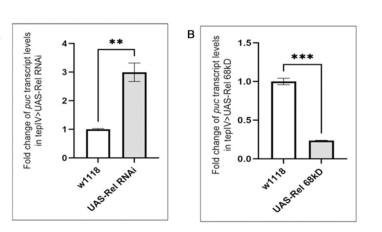

## Question

# Gene Research for Functional Annotation

## ⚠️ CRITICAL: Gene/Protein Identification Context

**BEFORE YOU BEGIN RESEARCH:** You MUST verify you are researching the CORRECT gene/protein. Gene symbols can be ambiguous, especially for less well-characterized genes from non-model organisms.

### Target Gene/Protein Identity (from UniProt):
- **UniProt Accession:** Q94527
- **Protein Description:** RecName: Full=Nuclear factor NF-kappa-B p110 subunit; AltName: Full=Rel-p110; AltName: Full=Relish protein; Contains: RecName: Full=Nuclear factor NF-kappa-B p68 subunit; AltName: Full=Rel-p68; Contains: RecName: Full=Nuclear factor NF-kappa-B p49 subunit; AltName: Full=Rel-p49;
- **Gene Information:** Name=Rel {ECO:0000312|FlyBase:FBgn0014018}; ORFNames=CG11992 {ECO:0000312|FlyBase:FBgn0014018};
- **Organism (full):** Drosophila melanogaster (Fruit fly).
- **Protein Family:** Not specified in UniProt
- **Key Domains:** Ankyrin_rpt. (IPR002110); Ankyrin_rpt-contain_sf. (IPR036770); Ig-like_fold. (IPR013783); Ig_E-set. (IPR014756); IPT_dom. (IPR002909)

### MANDATORY VERIFICATION STEPS:

1. **Check if the gene symbol "Rel" matches the protein description above**
2. **Verify the organism is correct:** Drosophila melanogaster (Fruit fly).
3. **Check if protein family/domains align with what you find in literature**
4. **If you find literature for a DIFFERENT gene with the same or similar symbol, STOP**

### If Gene Symbol is Ambiguous or You Cannot Find Relevant Literature:

**DO NOT PROCEED WITH RESEARCH ON A DIFFERENT GENE.** Instead:
- State clearly: "The gene symbol 'Rel' is ambiguous or literature is limited for this specific protein"
- Explain what you found (e.g., "Found extensive literature on a different gene with the same symbol in a different organism")
- Describe the protein based ONLY on the UniProt information provided above
- Suggest that the protein function can be inferred from domain/family information

### Research Target:

Please provide a comprehensive research report on the gene **Rel** (gene ID: Rel, UniProt: Q94527) in DROME.

The research report should be a detailed narrative explaining the function, biological processes, and localization of the gene product. Citations should be given for all claims.

You should prioritize authoritative reviews and primary scientific literature when conducting research. You can supplement
this with annotations you find in gene/protein databases, but these can be outdated or inaccurate.

We are specifically interested in the primary function of the gene - for enzymes, what reaction is catalyzed, and what is the substrate specificity? For transporters, what is the substrate? For structural proteins or adapters, what is the broader structural role? For signaling molecules, what is the role in the pathway.

We are interested in where in or outside the cell the gene product carries out its function.

We are also interested in the signaling or biochemical pathways in which the gene functions. We are less interested in broad pleiotropic effects, except where these elucidate the precise role.

Include evidence where possible. We are interested in both experimental evidence as well as inference from structure, evolution, or bioinformatic analysis. Precise studies should be prioritized over high-throughput, where available.

## Output

Question: You are an expert researcher providing comprehensive, well-cited information.

Provide detailed information focusing on:
1. Key concepts and definitions with current understanding
2. Recent developments and latest research (prioritize 2023-2024 sources)
3. Current applications and real-world implementations
4. Expert opinions and analysis from authoritative sources
5. Relevant statistics and data from recent studies

Format as a comprehensive research report with proper citations. Include URLs and publication dates where available.
Always prioritize recent, authoritative sources and provide specific citations for all major claims.

# Gene Research for Functional Annotation

## ⚠️ CRITICAL: Gene/Protein Identification Context

**BEFORE YOU BEGIN RESEARCH:** You MUST verify you are researching the CORRECT gene/protein. Gene symbols can be ambiguous, especially for less well-characterized genes from non-model organisms.

### Target Gene/Protein Identity (from UniProt):
- **UniProt Accession:** Q94527
- **Protein Description:** RecName: Full=Nuclear factor NF-kappa-B p110 subunit; AltName: Full=Rel-p110; AltName: Full=Relish protein; Contains: RecName: Full=Nuclear factor NF-kappa-B p68 subunit; AltName: Full=Rel-p68; Contains: RecName: Full=Nuclear factor NF-kappa-B p49 subunit; AltName: Full=Rel-p49;
- **Gene Information:** Name=Rel {ECO:0000312|FlyBase:FBgn0014018}; ORFNames=CG11992 {ECO:0000312|FlyBase:FBgn0014018};
- **Organism (full):** Drosophila melanogaster (Fruit fly).
- **Protein Family:** Not specified in UniProt
- **Key Domains:** Ankyrin_rpt. (IPR002110); Ankyrin_rpt-contain_sf. (IPR036770); Ig-like_fold. (IPR013783); Ig_E-set. (IPR014756); IPT_dom. (IPR002909)

### MANDATORY VERIFICATION STEPS:

1. **Check if the gene symbol "Rel" matches the protein description above**
2. **Verify the organism is correct:** Drosophila melanogaster (Fruit fly).
3. **Check if protein family/domains align with what you find in literature**
4. **If you find literature for a DIFFERENT gene with the same or similar symbol, STOP**

### If Gene Symbol is Ambiguous or You Cannot Find Relevant Literature:

**DO NOT PROCEED WITH RESEARCH ON A DIFFERENT GENE.** Instead:
- State clearly: "The gene symbol 'Rel' is ambiguous or literature is limited for this specific protein"
- Explain what you found (e.g., "Found extensive literature on a different gene with the same symbol in a different organism")
- Describe the protein based ONLY on the UniProt information provided above
- Suggest that the protein function can be inferred from domain/family information

### Research Target:

Please provide a comprehensive research report on the gene **Rel** (gene ID: Rel, UniProt: Q94527) in DROME.

The research report should be a detailed narrative explaining the function, biological processes, and localization of the gene product. Citations should be given for all claims.

You should prioritize authoritative reviews and primary scientific literature when conducting research. You can supplement
this with annotations you find in gene/protein databases, but these can be outdated or inaccurate.

We are specifically interested in the primary function of the gene - for enzymes, what reaction is catalyzed, and what is the substrate specificity? For transporters, what is the substrate? For structural proteins or adapters, what is the broader structural role? For signaling molecules, what is the role in the pathway.

We are interested in where in or outside the cell the gene product carries out its function.

We are also interested in the signaling or biochemical pathways in which the gene functions. We are less interested in broad pleiotropic effects, except where these elucidate the precise role.

Include evidence where possible. We are interested in both experimental evidence as well as inference from structure, evolution, or bioinformatic analysis. Precise studies should be prioritized over high-throughput, where available.

# Functional annotation of *Drosophila melanogaster* Rel (*Relish*; UniProt Q94527)

## Identity and primary function

**The specified gene is fly *Relish*, not mammalian *REL* or the distinct fly NF-κB factors Dorsal and Dif.** The identifiers supplied with the question—UniProt [Q94527](https://www.uniprot.org/uniprotkb/Q94527/entry), FlyBase [FBgn0014018](https://flybase.org/reports/FBgn0014018), and CG11992—identify *D. melanogaster* *Rel*. Independent fly studies call its product Relish and identify an active 68-kDa Rel fragment. The accession-to-gene-ID mapping here is supplied annotation; the experimental papers corroborate the organism, name, protein identity, and processing, rather than independently testing database identifiers. Relish belongs functionally to the NF-κB/Rel family and resembles mammalian NF-κB p100/p105 precursors, whereas Dorsal and Dif are primarily Toll-pathway factors released from the separate inhibitor Cactus. (ramesh2024thenfκbfactor pages 4-6, cammaratamouchtouris2022dynamicregulationof pages 6-7)

Relish is **a signal-activated, sequence-specific transcription factor, not an enzyme, transporter, or secreted antimicrobial peptide**. Its relevant molecular substrate is regulatory DNA: its N-terminal Rel-homology domain mediates DNA binding and dimerization, while the precursor’s C-terminal ankyrin repeats form an intrinsic IκB-like inhibitory region. This architecture is consistent with the supplied ankyrin-repeat, Ig-like/IPT-domain annotations. Once activated, Relish promotes transcription of antimicrobial effectors and immune-response regulators at κB-containing promoters; it does not itself catalyze peptidoglycan degradation or kill bacteria. (cammaratamouchtouris2022dynamicregulationof pages 6-7, stoven2003caspasemediatedprocessingof pages 1-1, erturkhasdemir2009tworolesfor pages 3-4, cammaratamouchtouris2022dynamicregulationof pages 10-12)

The following table distinguishes direct biochemical and genetic findings from pathway-level interpretation.

| Aspect | Direct finding / interpretation | Key citation (DOI and year) |
|---|---|---|
| Identity, domains, cleavage and localization | **Verified target:** *Drosophila melanogaster* Rel/Relish, corresponding to user-specified Q94527/FBgn0014018/CG11992—not mammalian REL or fly Dorsal/Dif. Relish is an NF-κB p105/p100-like precursor with an N-terminal Rel-homology DNA-binding/dimerization region and intrinsic C-terminal ankyrin-repeat/IκB-like region. In unstimulated cells, p110 is cytosolic. DREDD-dependent cleavage occurs precisely between **D545 and G546**, producing nuclear, transcriptionally active **p68/REL-68** and cytosolic ankyrin-containing **p49/REL-49**. IKKβ/Ird5 phosphorylation at **S528/S529** is dispensable for cleavage, nuclear import and DNA binding but required for efficient transcriptional activation and RNA-polymerase-II recruitment. | [Stöven et al., PNAS, 13 May 2003](https://doi.org/10.1073/pnas.1035902100); [Ertürk-Hasdemir et al., PNAS, 16 June 2009](https://doi.org/10.1073/pnas.0812022106) (stoven2003caspasemediatedprocessingof pages 3-4, erturkhasdemir2009tworolesfor pages 5-6, erturkhasdemir2009tworolesfor pages 4-5, stoven2003caspasemediatedprocessingof pages 1-1, erturkhasdemir2009tworolesfor pages 3-4) |
| IMD recognition and transcription | DAP-type peptidoglycan is detected by membrane PGRP-LC or cytosolic PGRP-LE, initiating an Imd–FADD–DREDD/Diap2–TAK1–IKK cascade that cleaves and phosphorylates Relish. Nuclear p68 binds κB sites—including two characterized sites in the *Diptericin* promoter—and activates antimicrobial-effector and feedback-regulator genes. ChIP also supports direct occupancy of *Attacin-A*, *Diptericin* and lncRNA-*CR33942* regulatory regions; the lncRNA can reinforce Relish promoter binding. | [Cammarata-Mouchtouris et al., Biomedicines, 15 September 2022](https://doi.org/10.3390/biomedicines10092304); [Zhou et al., Frontiers in Immunology, 17 June 2022](https://doi.org/10.3389/fimmu.2022.905899) (cammaratamouchtouris2022dynamicregulationof pages 4-6, cammaratamouchtouris2022dynamicregulationof pages 6-7, zhou2022drosophilarelishactivating pages 2-3, erturkhasdemir2009tworolesfor pages 3-4, zhou2022drosophilarelishactivating pages 4-9) |
| Chromatin selectivity | Relish does not activate every target through an identical chromatin mechanism. Of **170** immune-challenge genes requiring Relish in S2 cells, **17** also required Akirin. At Akirin-dependent promoters such as *attacin-A*, *drosocin* and *cecropin-A1*, Akirin recruits the Osa-containing SWI/SNF-like BAP complex and promotes H3K4 acetylation; *attacin-D* and *metchnikowin* are Relish-dependent but Akirin/BAP-independent. | [Bonnay et al., EMBO Journal, 18 September 2014](https://doi.org/10.15252/embj.201488456) (bonnay2014akirinspecifiesnfκb pages 3-5, bonnay2014akirinspecifiesnfκb pages 1-2, bonnay2014akirinspecifiesnfκb pages 5-7) |
| 2024 infection priming | In *Providencia rettgeri* challenge, **RelE20** loss-of-function flies lacked priming-associated bacterial clearance and survival benefit, whereas Toll-pathway *spätzle* mutants retained priming. IMD-regulated Diptericins—especially fat-body DptB—were required. After oral challenge, primed **males** shed fewer bacteria and transmitted little pathogen; this shedding/transmission reduction was not observed in females. Thus Relish is required upstream of a pathogen- and tissue-specific effector response, but is not itself the antimicrobial molecule. | [Prakash et al., PLOS Pathogens, 10 June 2024](https://doi.org/10.1371/journal.ppat.1012308) (prakash2024imdmediatedinnateimmune pages 9-11, prakash2024imdmediatedinnateimmune pages 7-9, prakash2024imdmediatedinnateimmune pages 11-14) |
| 2024 blood-progenitor function | Relish is enriched in larval lymph-gland progenitors and declines toward differentiation. Progenitor-specific Rel loss reduced the progenitor pool and promoted precocious differentiation; active nuclear Rel68 had the opposite effect. Rel loss caused an approximately **threefold increase in the JNK target *puckered***, while JNK or TAK1 inhibition rescued the phenotype. The proposed developmental circuit is Relish → restraint of TAK1–JNK–fatty-acid oxidation/H3K9 acetylation → preservation of ROS-primed progenitors. Axenic and infection experiments indicate that this progenitor role is developmental rather than commensal-induced. | [Ramesh et al., PLOS Genetics, 9 September 2024](https://doi.org/10.1371/journal.pgen.1011403) (ramesh2024thenfκbfactor pages 4-6, ramesh2024thenfκbfactor pages 8-10, ramesh2024thenfκbfactor pages 14-16, ramesh2024thenfκbfactor media b4466262, ramesh2024thenfκbfactor media f1ffa905) |
| STING antiviral signaling—supported boundary | Relish is an established downstream NF-κB component of fly STING signaling, but the 2024 comparative study directly tested **2′3′-cGAMP responses in 10 Drosophila species spanning about 40 million years**, not Q94527 dependence for every target. It found antiviral protection and a conserved STING-regulated program including STING, a cGAS-like receptor, *pastel*, *Vago*, *Dicer-2* and *Argonaute2*. The study’s expression data **do not directly establish that each individual gene is Relish-dependent**, so such target-level attribution would be inference. | [Hédelin et al., Molecular Biology and Evolution, 20 February 2024](https://doi.org/10.1093/molbev/msae032) (hedelin2024investigatingtheevolution pages 3-5, hedelin2024investigatingtheevolution pages 1-2, hedelin2024investigatingtheevolution pages 6-7) |

*Table: Evidence-ranked functional annotation of verified Drosophila Relish, separating directly demonstrated molecular mechanisms and 2024 organismal findings from qualified pathway-level inference.*

## Activation mechanism and where Relish acts

The **canonical immune-deficiency (Imd) pathway** responds particularly to bacterial **DAP-type peptidoglycan**, recognized by membrane-associated PGRP-LC or cytosolic PGRP-LE. Signaling through Imd, FADD, the caspase DREDD, Diap2-dependent ubiquitination, TAK1, and the Kenny–Ird5/IKK complex activates Relish. DREDD cleaves Relish; Ird5/IKKβ phosphorylates it. Recognition of microbial peptidoglycan is performed by the upstream PGRPs, **not by Relish itself**. A useful authoritative synthesis is Cammarata-Mouchtouris *et al.*, *Biomedicines*, September 2022, [doi:10.3390/biomedicines10092304](https://doi.org/10.3390/biomedicines10092304). (cammaratamouchtouris2022dynamicregulationof pages 4-6, cammaratamouchtouris2022dynamicregulationof pages 6-7)

**Processing specifies its cellular location.** Full-length, approximately 110-kDa Relish is predominantly **cytosolic** before stimulation. Stöven *et al.* mapped the cleavage to **D545–G546** using mutagenesis and product sequencing: the D545A mutant resisted processing and remained cytoplasmic after stimulation. Cleavage releases N-terminal **REL-68/p68**, which accumulates in the **nucleus** to regulate transcription, and C-terminal, ankyrin-containing **REL-49/p49**, which remains **cytoplasmic**. These are products of one precursor, not separate genes or secreted subunits. Stöven *et al.*, *PNAS*, May 2003, [doi:10.1073/pnas.1035902100](https://doi.org/10.1073/pnas.1035902100). (stoven2003caspasemediatedprocessingof pages 3-4, stoven2003caspasemediatedprocessingof pages 1-1)

**Cleavage is necessary but not sufficient for strong transcription.** Ertürk-Hasdemir *et al.* showed that active DREDD can generate Relish cleavage, whereas inactive DREDD and the tested alternative caspase could not. Mutation of Relish **S528/S529** impaired *Diptericin* and *Attacin* induction without preventing cleavage, nuclear entry, or binding to *Diptericin* κB DNA. The phosphorylation-dependent step instead supported efficient RNA-polymerase-II recruitment. Consequently, cleavage-dependent nuclear localization and phosphorylation-dependent productive transcription should not be conflated. Ertürk-Hasdemir *et al.*, *PNAS*, June 2009, [doi:10.1073/pnas.0812022106](https://doi.org/10.1073/pnas.0812022106). (erturkhasdemir2009tworolesfor pages 3-4, erturkhasdemir2009tworolesfor pages 5-6, erturkhasdemir2009tworolesfor pages 4-5)

The site of action is therefore **intracellular**: upstream activation occurs in cytosolic signaling assemblies associated with microbial sensing, and the active Relish fragment performs its primary DNA-regulatory function **in the nucleus**. Physiologically important responding cells include immune-responsive fat-body cells, intestinal cells, cultured hemocyte-like cells, and—in a distinct developmental context—larval lymph-gland progenitors. Tissue expression must not be mistaken for extracellular localization of the Relish protein. (cammaratamouchtouris2022dynamicregulationof pages 4-6, stoven2003caspasemediatedprocessingof pages 1-1, prakash2024imdmediatedinnateimmune pages 9-11, bonnay2014akirinspecifiesnfκb pages 5-7, ramesh2024thenfκbfactor pages 4-6)

## Direct transcriptional targets and regulation

The transcription-factor assignment is supported by more than sequence homology. Relish binds two characterized κB sites in the ***Diptericin* promoter**, as assessed by chromatin immunoprecipitation and DNA pull-down. A later S2-cell study used ChIP-qPCR and reporter assays to support occupancy and activation of *Diptericin* and *Attacin-A* promoters, as well as direct activation of the lncRNA-*CR33942* promoter. The lncRNA interacts with Relish and enhances its occupancy of antimicrobial-peptide promoters, producing a positive regulatory loop. In that experimental system, anti-Flag Rel68 ChIP enrichment of the lncRNA promoter was approximately **30-fold** above IgG, compared with approximately **40-fold** for the *Diptericin* positive-control promoter. Zhou *et al.*, *Frontiers in Immunology*, June 2022, [doi:10.3389/fimmu.2022.905899](https://doi.org/10.3389/fimmu.2022.905899). These occupancies are measured in the described assay, not universal in-vivo binding strengths. (erturkhasdemir2009tworolesfor pages 3-4, zhou2022drosophilarelishactivating pages 2-3, zhou2022drosophilarelishactivating pages 4-9)

Relish’s target specificity also depends on nuclear cofactors. Bonnay *et al.* found **170** challenge-induced genes requiring Relish in S2 cells, of which **17** additionally required **Akirin** under their assay conditions. Akirin cooperates with the Osa-containing Brahma/BAP chromatin-remodeling machinery at targets including *attacin-A*, *drosocin*, and *cecropin-A1*; other Relish-responsive promoters, including *attacin-D* and *metchnikowin*, did not require that Akirin/BAP mechanism. This explains why nuclear entry does not imply identical expression of all Relish targets. Bonnay *et al.*, *EMBO Journal*, September 2014, [doi:10.15252/embj.201488456](https://doi.org/10.15252/embj.201488456). (bonnay2014akirinspecifiesnfκb pages 1-2, bonnay2014akirinspecifiesnfκb pages 5-7, bonnay2014akirinspecifiesnfκb pages 3-5)

Immune activity must also be terminated. The 2022 mechanistic review describes induced **Pirk** and peptidoglycan-cleaving PGRP amidases as restraints on sustained Imd signaling and as contributors to tolerance of gut commensals; **Caspar** restrains DREDD-dependent Relish cleavage. The precise molecular mechanism of Caspar’s inhibition remains unresolved, and proposed routes for Pirk-mediated shutdown should not be presented as established molecular reactions. Relish-dependent feedback-regulator genes can also differ from Akirin-dependent effector genes. (cammaratamouchtouris2022dynamicregulationof pages 7-9, cammaratamouchtouris2022dynamicregulationof pages 10-12)

## Recent experimental developments and applications

**Pathogen-specific immune priming, 2024.** Prakash *et al.* tested prior heat-killed ***Providencia rettgeri*** exposure followed by live challenge. *RelE20* loss-of-function flies failed to obtain the priming-associated survival or bacterial-clearance benefit, while *spätzle* Toll-pathway mutants retained priming. The study implicated Imd-regulated Diptericins, particularly **fat-body-derived Diptericin-B**, as downstream effectors; having Diptericins alone was not sufficient when appropriate upstream peptidoglycan-receptor regulation was lost. Following **oral** infection, previously primed **males**, but not females, showed reduced bacterial shedding and reduced transmission to recipient flies. Thus Relish has an experimentally demonstrated role in a real infection and transmission model, but the sex-specific transmission observation should not be represented as a direct measurement of Relish-dependent transmission in mutant donors. Prakash *et al.*, *PLOS Pathogens*, **10 June 2024**, [doi:10.1371/journal.ppat.1012308](https://doi.org/10.1371/journal.ppat.1012308). (prakash2024imdmediatedinnateimmune pages 7-9, prakash2024imdmediatedinnateimmune pages 11-14, prakash2024imdmediatedinnateimmune pages 9-11)

**Blood-progenitor homeostasis, 2024.** Ramesh *et al.* identified a more specific noncanonical function in the larval lymph gland: Relish is enriched in medullary-zone blood progenitors and decreases as they differentiate. Progenitor-targeted RNAi or CRISPR loss reduced the progenitor pool and increased differentiation; expression of the active nuclear **Rel68** fragment instead impeded differentiation. In sorted progenitors, loss of *Rel* increased the JNK-responsive transcript ***puckered*** approximately **threefold**. Inhibiting JNK or TAK1 rescued the differentiation phenotype, supporting a circuit in which Relish restrains TAK1–JNK signaling, fatty-acid oxidation, and associated histone-acetylation changes to preserve ROS-primed progenitors. The authors found that progenitor Relish expression was not detectably changed by axenic rearing or their bacterial-infection condition, distinguishing this developmental function from a straightforward microbial induction of the canonical Imd response. Ramesh *et al.*, *PLOS Genetics*, **9 September 2024**, [doi:10.1371/journal.pgen.1011403](https://doi.org/10.1371/journal.pgen.1011403). The reported *puckered* change and JNK-rescue panels are also visible in the study’s cropped Figure 3. (ramesh2024thenfκbfactor pages 4-6, ramesh2024thenfκbfactor pages 8-10, ramesh2024thenfκbfactor pages 14-16, ramesh2024thenfκbfactor media b4466262, ramesh2024thenfκbfactor media f1ffa905)

**Antiviral pathway relevance, 2024—with an important evidence boundary.** Relish has also been placed downstream of fly **STING** signaling in authoritative pathway analyses. Hédelin *et al.* injected the STING agonist **2′3′-cGAMP** into **10 *Drosophila* species** spanning approximately **40 million years**; they observed antiviral protection and a partly conserved induced program that includes *STING*, a cGAS-like receptor, *pastel*, *Vago*, *Dicer-2*, and *Argonaute2*. Their cross-species expression and protection experiments **do not, by themselves, show that each induced gene is a direct Relish target or requires Q94527 in *D. melanogaster***. Hédelin *et al.*, *Molecular Biology and Evolution*, **20 February 2024**, [doi:10.1093/molbev/msae032](https://doi.org/10.1093/molbev/msae032). (cammaratamouchtouris2022dynamicregulationof pages 6-7, hedelin2024investigatingtheevolution pages 3-5, hedelin2024investigatingtheevolution pages 1-2, hedelin2024investigatingtheevolution pages 6-7)

**Assessment.** The highest-confidence functional annotation is **cytosol-to-nucleus, proteolysis- and phosphorylation-regulated NF-κB transcriptional control in the Imd antibacterial pathway**, with direct promoter-binding, biochemical-processing, and loss-of-function evidence. Its developmental TAK1–JNK regulatory role is supported by 2024 tissue-specific genetics; specific direct Relish-regulated developmental genes and the Relish dependence of individual genes in the comparative STING response require more targeted evidence. Fly infection, gut-immunity, and lymph-gland experiments are research implementations of this biology, **not established therapeutic uses of Relish itself**. (stoven2003caspasemediatedprocessingof pages 3-4, erturkhasdemir2009tworolesfor pages 5-6, erturkhasdemir2009tworolesfor pages 3-4, ramesh2024thenfκbfactor pages 8-10, prakash2024imdmediatedinnateimmune pages 7-9, hedelin2024investigatingtheevolution pages 6-7)

References

1. (ramesh2024thenfκbfactor pages 4-6): Parvathy Ramesh, Satish Kumar Tiwari, Md Kaizer, Deepak Jangra, Kaustuv Ghosh, Sudip Mandal, and Lolitika Mandal. The nf-κb factor relish maintains blood progenitor homeostasis in the developing drosophila lymph gland. PLOS Genetics, 20:e1011403, Sep 2024. URL: https://doi.org/10.1371/journal.pgen.1011403, doi:10.1371/journal.pgen.1011403. This article has 6 citations and is from a domain leading peer-reviewed journal.

2. (cammaratamouchtouris2022dynamicregulationof pages 6-7): Alexandre Cammarata-Mouchtouris, Adrian Acker, Akira Goto, Di Chen, Nicolas Matt, and Vincent Leclerc. Dynamic regulation of nf-κb response in innate immunity: the case of the imd pathway in drosophila. Biomedicines, 10:2304, Sep 2022. URL: https://doi.org/10.3390/biomedicines10092304, doi:10.3390/biomedicines10092304. This article has 49 citations.

3. (stoven2003caspasemediatedprocessingof pages 1-1): Svenja Stöven, Neal Silverman, Anna Junell, Marika Hedengren-Olcott, Deniz Erturk, Ylva Engström, Tom Maniatis, and Dan Hultmark. Caspase-mediated processing of the drosophila nf-κb factor relish. Proceedings of the National Academy of Sciences of the United States of America, 100:5991-5996, May 2003. URL: https://doi.org/10.1073/pnas.1035902100, doi:10.1073/pnas.1035902100. This article has 459 citations and is from a highest quality peer-reviewed journal.

4. (erturkhasdemir2009tworolesfor pages 3-4): Deniz Ertürk-Hasdemir, Meike Broemer, François Leulier, William S. Lane, Nicholas Paquette, Daye Hwang, Chan-Hee Kim, Svenja Stöven, Pascal Meier, and Neal Silverman. Two roles for the drosophila ikk complex in the activation of relish and the induction of antimicrobial peptide genes. Proceedings of the National Academy of Sciences, 106:9779-9784, Jun 2009. URL: https://doi.org/10.1073/pnas.0812022106, doi:10.1073/pnas.0812022106. This article has 228 citations and is from a highest quality peer-reviewed journal.

5. (cammaratamouchtouris2022dynamicregulationof pages 10-12): Alexandre Cammarata-Mouchtouris, Adrian Acker, Akira Goto, Di Chen, Nicolas Matt, and Vincent Leclerc. Dynamic regulation of nf-κb response in innate immunity: the case of the imd pathway in drosophila. Biomedicines, 10:2304, Sep 2022. URL: https://doi.org/10.3390/biomedicines10092304, doi:10.3390/biomedicines10092304. This article has 49 citations.

6. (stoven2003caspasemediatedprocessingof pages 3-4): Svenja Stöven, Neal Silverman, Anna Junell, Marika Hedengren-Olcott, Deniz Erturk, Ylva Engström, Tom Maniatis, and Dan Hultmark. Caspase-mediated processing of the drosophila nf-κb factor relish. Proceedings of the National Academy of Sciences of the United States of America, 100:5991-5996, May 2003. URL: https://doi.org/10.1073/pnas.1035902100, doi:10.1073/pnas.1035902100. This article has 459 citations and is from a highest quality peer-reviewed journal.

7. (erturkhasdemir2009tworolesfor pages 5-6): Deniz Ertürk-Hasdemir, Meike Broemer, François Leulier, William S. Lane, Nicholas Paquette, Daye Hwang, Chan-Hee Kim, Svenja Stöven, Pascal Meier, and Neal Silverman. Two roles for the drosophila ikk complex in the activation of relish and the induction of antimicrobial peptide genes. Proceedings of the National Academy of Sciences, 106:9779-9784, Jun 2009. URL: https://doi.org/10.1073/pnas.0812022106, doi:10.1073/pnas.0812022106. This article has 228 citations and is from a highest quality peer-reviewed journal.

8. (erturkhasdemir2009tworolesfor pages 4-5): Deniz Ertürk-Hasdemir, Meike Broemer, François Leulier, William S. Lane, Nicholas Paquette, Daye Hwang, Chan-Hee Kim, Svenja Stöven, Pascal Meier, and Neal Silverman. Two roles for the drosophila ikk complex in the activation of relish and the induction of antimicrobial peptide genes. Proceedings of the National Academy of Sciences, 106:9779-9784, Jun 2009. URL: https://doi.org/10.1073/pnas.0812022106, doi:10.1073/pnas.0812022106. This article has 228 citations and is from a highest quality peer-reviewed journal.

9. (cammaratamouchtouris2022dynamicregulationof pages 4-6): Alexandre Cammarata-Mouchtouris, Adrian Acker, Akira Goto, Di Chen, Nicolas Matt, and Vincent Leclerc. Dynamic regulation of nf-κb response in innate immunity: the case of the imd pathway in drosophila. Biomedicines, 10:2304, Sep 2022. URL: https://doi.org/10.3390/biomedicines10092304, doi:10.3390/biomedicines10092304. This article has 49 citations.

10. (zhou2022drosophilarelishactivating pages 2-3): Hongjian Zhou, Shanshan Wu, Li Liu, Ruimin Li, Ping Jin, and Shengjie Li. Drosophila relish activating lncrna-cr33942 transcription facilitates antimicrobial peptide expression in imd innate immune response. Frontiers in Immunology, Jun 2022. URL: https://doi.org/10.3389/fimmu.2022.905899, doi:10.3389/fimmu.2022.905899. This article has 21 citations and is from a peer-reviewed journal.

11. (zhou2022drosophilarelishactivating pages 4-9): Hongjian Zhou, Shanshan Wu, Li Liu, Ruimin Li, Ping Jin, and Shengjie Li. Drosophila relish activating lncrna-cr33942 transcription facilitates antimicrobial peptide expression in imd innate immune response. Frontiers in Immunology, Jun 2022. URL: https://doi.org/10.3389/fimmu.2022.905899, doi:10.3389/fimmu.2022.905899. This article has 21 citations and is from a peer-reviewed journal.

12. (bonnay2014akirinspecifiesnfκb pages 3-5): François Bonnay, Xuan‐Hung Nguyen, Eva Cohen‐Berros, Laurent Troxler, Eric Batsche, Jacques Camonis, Osamu Takeuchi, Jean‐Marc Reichhart, and Nicolas Matt. Akirin specifies nf-κb selectivity of drosophila innate immune response via chromatin remodeling. The EMBO Journal, 33:2349-2362, Sep 2014. URL: https://doi.org/10.15252/embj.201488456, doi:10.15252/embj.201488456. This article has 127 citations.

13. (bonnay2014akirinspecifiesnfκb pages 1-2): François Bonnay, Xuan‐Hung Nguyen, Eva Cohen‐Berros, Laurent Troxler, Eric Batsche, Jacques Camonis, Osamu Takeuchi, Jean‐Marc Reichhart, and Nicolas Matt. Akirin specifies nf-κb selectivity of drosophila innate immune response via chromatin remodeling. The EMBO Journal, 33:2349-2362, Sep 2014. URL: https://doi.org/10.15252/embj.201488456, doi:10.15252/embj.201488456. This article has 127 citations.

14. (bonnay2014akirinspecifiesnfκb pages 5-7): François Bonnay, Xuan‐Hung Nguyen, Eva Cohen‐Berros, Laurent Troxler, Eric Batsche, Jacques Camonis, Osamu Takeuchi, Jean‐Marc Reichhart, and Nicolas Matt. Akirin specifies nf-κb selectivity of drosophila innate immune response via chromatin remodeling. The EMBO Journal, 33:2349-2362, Sep 2014. URL: https://doi.org/10.15252/embj.201488456, doi:10.15252/embj.201488456. This article has 127 citations.

15. (prakash2024imdmediatedinnateimmune pages 9-11): Arun Prakash, Florence Fenner, Biswajit Shit, Tiina S. Salminen, Katy M. Monteith, Imroze Khan, and Pedro F. Vale. Imd-mediated innate immune priming increases drosophila survival and reduces pathogen transmission. PLOS Pathogens, 20:e1012308, Jun 2024. URL: https://doi.org/10.1371/journal.ppat.1012308, doi:10.1371/journal.ppat.1012308. This article has 27 citations and is from a highest quality peer-reviewed journal.

16. (prakash2024imdmediatedinnateimmune pages 7-9): Arun Prakash, Florence Fenner, Biswajit Shit, Tiina S. Salminen, Katy M. Monteith, Imroze Khan, and Pedro F. Vale. Imd-mediated innate immune priming increases drosophila survival and reduces pathogen transmission. PLOS Pathogens, 20:e1012308, Jun 2024. URL: https://doi.org/10.1371/journal.ppat.1012308, doi:10.1371/journal.ppat.1012308. This article has 27 citations and is from a highest quality peer-reviewed journal.

17. (prakash2024imdmediatedinnateimmune pages 11-14): Arun Prakash, Florence Fenner, Biswajit Shit, Tiina S. Salminen, Katy M. Monteith, Imroze Khan, and Pedro F. Vale. Imd-mediated innate immune priming increases drosophila survival and reduces pathogen transmission. PLOS Pathogens, 20:e1012308, Jun 2024. URL: https://doi.org/10.1371/journal.ppat.1012308, doi:10.1371/journal.ppat.1012308. This article has 27 citations and is from a highest quality peer-reviewed journal.

18. (ramesh2024thenfκbfactor pages 8-10): Parvathy Ramesh, Satish Kumar Tiwari, Md Kaizer, Deepak Jangra, Kaustuv Ghosh, Sudip Mandal, and Lolitika Mandal. The nf-κb factor relish maintains blood progenitor homeostasis in the developing drosophila lymph gland. PLOS Genetics, 20:e1011403, Sep 2024. URL: https://doi.org/10.1371/journal.pgen.1011403, doi:10.1371/journal.pgen.1011403. This article has 6 citations and is from a domain leading peer-reviewed journal.

19. (ramesh2024thenfκbfactor pages 14-16): Parvathy Ramesh, Satish Kumar Tiwari, Md Kaizer, Deepak Jangra, Kaustuv Ghosh, Sudip Mandal, and Lolitika Mandal. The nf-κb factor relish maintains blood progenitor homeostasis in the developing drosophila lymph gland. PLOS Genetics, 20:e1011403, Sep 2024. URL: https://doi.org/10.1371/journal.pgen.1011403, doi:10.1371/journal.pgen.1011403. This article has 6 citations and is from a domain leading peer-reviewed journal.

20. (ramesh2024thenfκbfactor media b4466262): Parvathy Ramesh, Satish Kumar Tiwari, Md Kaizer, Deepak Jangra, Kaustuv Ghosh, Sudip Mandal, and Lolitika Mandal. The nf-κb factor relish maintains blood progenitor homeostasis in the developing drosophila lymph gland. PLOS Genetics, 20:e1011403, Sep 2024. URL: https://doi.org/10.1371/journal.pgen.1011403, doi:10.1371/journal.pgen.1011403. This article has 6 citations and is from a domain leading peer-reviewed journal.

21. (ramesh2024thenfκbfactor media f1ffa905): Parvathy Ramesh, Satish Kumar Tiwari, Md Kaizer, Deepak Jangra, Kaustuv Ghosh, Sudip Mandal, and Lolitika Mandal. The nf-κb factor relish maintains blood progenitor homeostasis in the developing drosophila lymph gland. PLOS Genetics, 20:e1011403, Sep 2024. URL: https://doi.org/10.1371/journal.pgen.1011403, doi:10.1371/journal.pgen.1011403. This article has 6 citations and is from a domain leading peer-reviewed journal.

22. (hedelin2024investigatingtheevolution pages 3-5): Léna Hédelin, Antonin Thiébaut, Jingxian Huang, Xiaoyan Li, Aurélie Lemoine, Gabrielle Haas, Carine Meignin, Hua Cai, Robert M Waterhouse, Nelson Martins, and Jean-Luc Imler. Investigating the evolution of drosophila sting-dependent antiviral innate immunity by multispecies comparison of 2′3′-cgamp responses. Molecular Biology and Evolution, Feb 2024. URL: https://doi.org/10.1093/molbev/msae032, doi:10.1093/molbev/msae032. This article has 14 citations and is from a highest quality peer-reviewed journal.

23. (hedelin2024investigatingtheevolution pages 1-2): Léna Hédelin, Antonin Thiébaut, Jingxian Huang, Xiaoyan Li, Aurélie Lemoine, Gabrielle Haas, Carine Meignin, Hua Cai, Robert M Waterhouse, Nelson Martins, and Jean-Luc Imler. Investigating the evolution of drosophila sting-dependent antiviral innate immunity by multispecies comparison of 2′3′-cgamp responses. Molecular Biology and Evolution, Feb 2024. URL: https://doi.org/10.1093/molbev/msae032, doi:10.1093/molbev/msae032. This article has 14 citations and is from a highest quality peer-reviewed journal.

24. (hedelin2024investigatingtheevolution pages 6-7): Léna Hédelin, Antonin Thiébaut, Jingxian Huang, Xiaoyan Li, Aurélie Lemoine, Gabrielle Haas, Carine Meignin, Hua Cai, Robert M Waterhouse, Nelson Martins, and Jean-Luc Imler. Investigating the evolution of drosophila sting-dependent antiviral innate immunity by multispecies comparison of 2′3′-cgamp responses. Molecular Biology and Evolution, Feb 2024. URL: https://doi.org/10.1093/molbev/msae032, doi:10.1093/molbev/msae032. This article has 14 citations and is from a highest quality peer-reviewed journal.

25. (cammaratamouchtouris2022dynamicregulationof pages 7-9): Alexandre Cammarata-Mouchtouris, Adrian Acker, Akira Goto, Di Chen, Nicolas Matt, and Vincent Leclerc. Dynamic regulation of nf-κb response in innate immunity: the case of the imd pathway in drosophila. Biomedicines, 10:2304, Sep 2022. URL: https://doi.org/10.3390/biomedicines10092304, doi:10.3390/biomedicines10092304. This article has 49 citations.

## Artifacts

- [Edison artifact artifact-00](Rel-deep-research-falcon_artifacts/artifact-00.md)

## Citations

1. cammaratamouchtouris2022dynamicregulationof pages 6-7
2. stoven2003caspasemediatedprocessingof pages 1-1
3. erturkhasdemir2009tworolesfor pages 3-4
4. cammaratamouchtouris2022dynamicregulationof pages 10-12
5. stoven2003caspasemediatedprocessingof pages 3-4
6. erturkhasdemir2009tworolesfor pages 5-6
7. erturkhasdemir2009tworolesfor pages 4-5
8. cammaratamouchtouris2022dynamicregulationof pages 4-6
9. zhou2022drosophilarelishactivating pages 2-3
10. zhou2022drosophilarelishactivating pages 4-9
11. prakash2024imdmediatedinnateimmune pages 9-11
12. prakash2024imdmediatedinnateimmune pages 7-9
13. prakash2024imdmediatedinnateimmune pages 11-14
14. hedelin2024investigatingtheevolution pages 3-5
15. hedelin2024investigatingtheevolution pages 1-2
16. hedelin2024investigatingtheevolution pages 6-7
17. cammaratamouchtouris2022dynamicregulationof pages 7-9
18. Q94527
19. FBgn0014018
20. Stöven et al., PNAS, 13 May 2003
21. Ertürk-Hasdemir et al., PNAS, 16 June 2009
22. Cammarata-Mouchtouris et al., Biomedicines, 15 September 2022
23. Zhou et al., Frontiers in Immunology, 17 June 2022
24. Bonnay et al., EMBO Journal, 18 September 2014
25. Prakash et al., PLOS Pathogens, 10 June 2024
26. Ramesh et al., PLOS Genetics, 9 September 2024
27. Hédelin et al., Molecular Biology and Evolution, 20 February 2024
28. doi:10.3390/biomedicines10092304
29. doi:10.1073/pnas.1035902100
30. doi:10.1073/pnas.0812022106
31. doi:10.3389/fimmu.2022.905899
32. doi:10.15252/embj.201488456
33. doi:10.1371/journal.ppat.1012308
34. doi:10.1371/journal.pgen.1011403
35. doi:10.1093/molbev/msae032
36. https://www.uniprot.org/uniprotkb/Q94527/entry
37. https://flybase.org/reports/FBgn0014018
38. https://doi.org/10.1073/pnas.1035902100
39. https://doi.org/10.1073/pnas.0812022106
40. https://doi.org/10.3390/biomedicines10092304
41. https://doi.org/10.3389/fimmu.2022.905899
42. https://doi.org/10.15252/embj.201488456
43. https://doi.org/10.1371/journal.ppat.1012308
44. https://doi.org/10.1371/journal.pgen.1011403
45. https://doi.org/10.1093/molbev/msae032
46. https://doi.org/10.1371/journal.pgen.1011403,
47. https://doi.org/10.3390/biomedicines10092304,
48. https://doi.org/10.1073/pnas.1035902100,
49. https://doi.org/10.1073/pnas.0812022106,
50. https://doi.org/10.3389/fimmu.2022.905899,
51. https://doi.org/10.15252/embj.201488456,
52. https://doi.org/10.1371/journal.ppat.1012308,
53. https://doi.org/10.1093/molbev/msae032,