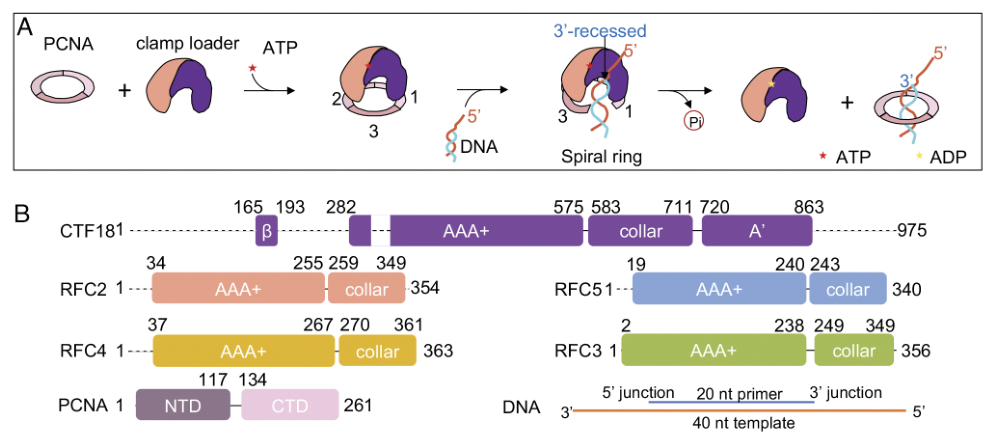

## Question

# Gene Research for Functional Annotation

## ⚠️ CRITICAL: Gene/Protein Identification Context

**BEFORE YOU BEGIN RESEARCH:** You MUST verify you are researching the CORRECT gene/protein. Gene symbols can be ambiguous, especially for less well-characterized genes from non-model organisms.

### Target Gene/Protein Identity (from UniProt):
- **UniProt Accession:** Q9U9Q1
- **Protein Description:** RecName: Full=Replication factor C subunit 3 {ECO:0000256|ARBA:ARBA00070184}; AltName: Full=Activator 1 38 kDa subunit {ECO:0000256|ARBA:ARBA00079394}; AltName: Full=Activator 1 subunit 3 {ECO:0000256|ARBA:ARBA00080379}; AltName: Full=Replication factor C 38 kDa subunit {ECO:0000256|ARBA:ARBA00076818};
- **Gene Information:** Name=RfC38 {ECO:0000313|EMBL:AAF53076.2, ECO:0000313|FlyBase:FBgn0028700}; Synonyms=BcDNA:LD06837 {ECO:0000313|EMBL:AAF53076.2}, Dmel\CG6258 {ECO:0000313|EMBL:AAF53076.2}, DmRFC5 {ECO:0000313|EMBL:AAF53076.2}, l(2)k13807 {ECO:0000313|EMBL:AAF53076.2}, l(2)rfc38 {ECO:0000313|EMBL:AAF53076.2}, n(2)k13807 {ECO:0000313|EMBL:AAF53076.2}, Rfc38 {ECO:0000313|EMBL:AAF53076.2}, rfc38 {ECO:0000313|EMBL:AAF53076.2}; ORFNames=CG6258 {ECO:0000313|EMBL:AAF53076.2, ECO:0000313|FlyBase:FBgn0028700}, Dmel_CG6258 {ECO:0000313|EMBL:AAF53076.2};
- **Organism (full):** Drosophila melanogaster (Fruit fly).
- **Protein Family:** Belongs to the activator 1 small subunits family.
- **Key Domains:** AAA+_ATPase. (IPR003593); DNA_pol3_clamp-load_cplx_C. (IPR008921); DNA_Rep/Repair_Clamp_Loader. (IPR050238); P-loop_NTPase. (IPR027417); DNA_pol3_delta2 (PF13177)

### MANDATORY VERIFICATION STEPS:

1. **Check if the gene symbol "RfC38" matches the protein description above**
2. **Verify the organism is correct:** Drosophila melanogaster (Fruit fly).
3. **Check if protein family/domains align with what you find in literature**
4. **If you find literature for a DIFFERENT gene with the same or similar symbol, STOP**

### If Gene Symbol is Ambiguous or You Cannot Find Relevant Literature:

**DO NOT PROCEED WITH RESEARCH ON A DIFFERENT GENE.** Instead:
- State clearly: "The gene symbol 'RfC38' is ambiguous or literature is limited for this specific protein"
- Explain what you found (e.g., "Found extensive literature on a different gene with the same symbol in a different organism")
- Describe the protein based ONLY on the UniProt information provided above
- Suggest that the protein function can be inferred from domain/family information

### Research Target:

Please provide a comprehensive research report on the gene **RfC38** (gene ID: RfC38, UniProt: Q9U9Q1) in DROME.

The research report should be a detailed narrative explaining the function, biological processes, and localization of the gene product. Citations should be given for all claims.

You should prioritize authoritative reviews and primary scientific literature when conducting research. You can supplement
this with annotations you find in gene/protein databases, but these can be outdated or inaccurate.

We are specifically interested in the primary function of the gene - for enzymes, what reaction is catalyzed, and what is the substrate specificity? For transporters, what is the substrate? For structural proteins or adapters, what is the broader structural role? For signaling molecules, what is the role in the pathway.

We are interested in where in or outside the cell the gene product carries out its function.

We are also interested in the signaling or biochemical pathways in which the gene functions. We are less interested in broad pleiotropic effects, except where these elucidate the precise role.

Include evidence where possible. We are interested in both experimental evidence as well as inference from structure, evolution, or bioinformatic analysis. Precise studies should be prioritized over high-throughput, where available.

## Output

Question: You are an expert researcher providing comprehensive, well-cited information.

Provide detailed information focusing on:
1. Key concepts and definitions with current understanding
2. Recent developments and latest research (prioritize 2023-2024 sources)
3. Current applications and real-world implementations
4. Expert opinions and analysis from authoritative sources
5. Relevant statistics and data from recent studies

Format as a comprehensive research report with proper citations. Include URLs and publication dates where available.
Always prioritize recent, authoritative sources and provide specific citations for all major claims.

# Gene Research for Functional Annotation

## ⚠️ CRITICAL: Gene/Protein Identification Context

**BEFORE YOU BEGIN RESEARCH:** You MUST verify you are researching the CORRECT gene/protein. Gene symbols can be ambiguous, especially for less well-characterized genes from non-model organisms.

### Target Gene/Protein Identity (from UniProt):
- **UniProt Accession:** Q9U9Q1
- **Protein Description:** RecName: Full=Replication factor C subunit 3 {ECO:0000256|ARBA:ARBA00070184}; AltName: Full=Activator 1 38 kDa subunit {ECO:0000256|ARBA:ARBA00079394}; AltName: Full=Activator 1 subunit 3 {ECO:0000256|ARBA:ARBA00080379}; AltName: Full=Replication factor C 38 kDa subunit {ECO:0000256|ARBA:ARBA00076818};
- **Gene Information:** Name=RfC38 {ECO:0000313|EMBL:AAF53076.2, ECO:0000313|FlyBase:FBgn0028700}; Synonyms=BcDNA:LD06837 {ECO:0000313|EMBL:AAF53076.2}, Dmel\CG6258 {ECO:0000313|EMBL:AAF53076.2}, DmRFC5 {ECO:0000313|EMBL:AAF53076.2}, l(2)k13807 {ECO:0000313|EMBL:AAF53076.2}, l(2)rfc38 {ECO:0000313|EMBL:AAF53076.2}, n(2)k13807 {ECO:0000313|EMBL:AAF53076.2}, Rfc38 {ECO:0000313|EMBL:AAF53076.2}, rfc38 {ECO:0000313|EMBL:AAF53076.2}; ORFNames=CG6258 {ECO:0000313|EMBL:AAF53076.2, ECO:0000313|FlyBase:FBgn0028700}, Dmel_CG6258 {ECO:0000313|EMBL:AAF53076.2};
- **Organism (full):** Drosophila melanogaster (Fruit fly).
- **Protein Family:** Belongs to the activator 1 small subunits family.
- **Key Domains:** AAA+_ATPase. (IPR003593); DNA_pol3_clamp-load_cplx_C. (IPR008921); DNA_Rep/Repair_Clamp_Loader. (IPR050238); P-loop_NTPase. (IPR027417); DNA_pol3_delta2 (PF13177)

### MANDATORY VERIFICATION STEPS:

1. **Check if the gene symbol "RfC38" matches the protein description above**
2. **Verify the organism is correct:** Drosophila melanogaster (Fruit fly).
3. **Check if protein family/domains align with what you find in literature**
4. **If you find literature for a DIFFERENT gene with the same or similar symbol, STOP**

### If Gene Symbol is Ambiguous or You Cannot Find Relevant Literature:

**DO NOT PROCEED WITH RESEARCH ON A DIFFERENT GENE.** Instead:
- State clearly: "The gene symbol 'RfC38' is ambiguous or literature is limited for this specific protein"
- Explain what you found (e.g., "Found extensive literature on a different gene with the same symbol in a different organism")
- Describe the protein based ONLY on the UniProt information provided above
- Suggest that the protein function can be inferred from domain/family information

### Research Target:

Please provide a comprehensive research report on the gene **RfC38** (gene ID: RfC38, UniProt: Q9U9Q1) in DROME.

The research report should be a detailed narrative explaining the function, biological processes, and localization of the gene product. Citations should be given for all claims.

You should prioritize authoritative reviews and primary scientific literature when conducting research. You can supplement
this with annotations you find in gene/protein databases, but these can be outdated or inaccurate.

We are specifically interested in the primary function of the gene - for enzymes, what reaction is catalyzed, and what is the substrate specificity? For transporters, what is the substrate? For structural proteins or adapters, what is the broader structural role? For signaling molecules, what is the role in the pathway.

We are interested in where in or outside the cell the gene product carries out its function.

We are also interested in the signaling or biochemical pathways in which the gene functions. We are less interested in broad pleiotropic effects, except where these elucidate the precise role.

Include evidence where possible. We are interested in both experimental evidence as well as inference from structure, evolution, or bioinformatic analysis. Precise studies should be prioritized over high-throughput, where available.

# Functional annotation report: *Drosophila melanogaster* RfC38

## Identity and scope

**RfC38 is the fruit-fly gene CG6258 (FlyBase FBgn0028700), encoding the replication factor C 38-kDa small subunit represented by UniProt Q9U9Q1.** Its supplied UniProt annotation places it in the activator-1 small-subunit family and identifies AAA+/P-loop nucleotide-binding and DNA clamp-loader domains. This identity agrees with fly publications that list **rfc38 separately from rfc3, rfc4 and rfc1**; RfC38 must not be conflated with any of those genes. Nor should human RFC3 or RFC5 experiments be assigned to this fly protein on the basis of a number or apparent molecular mass: RFC numbering differs between organisms. The available gene-specific literature is limited, so the molecular mechanism below distinguishes direct fly observations from inference about conserved RFC complexes. [UniProt: https://www.uniprot.org/uniprotkb/Q9U9Q1/entry; FlyBase: https://flybase.org/reports/FBgn0028700.html.] (tsuchiya2007transcriptionalregulationof pages 8-9, he2024cryoemrevealsa pages 1-2)

## Primary function and biochemical mechanism

**The best-supported annotation is that RfC38 is a small, AAA+-family component of replication factor C (RFC) clamp-loading machinery, rather than a DNA polymerase.** In the canonical eukaryotic reaction, a five-subunit RFC complex binds ATP and the ring-shaped sliding clamp PCNA, opens the clamp, recognizes a primed DNA junction with a recessed **3′ end**, and places PCNA around duplex DNA. ATP-dependent conformational cycling permits release of the loaded clamp; PCNA then supports processive DNA synthesis and recruits other DNA-metabolism factors. The relevant substrates are therefore **ATP, PCNA and an appropriate primer–template DNA junction for the complex**—not free nucleotides for polymerization by RfC38. These reaction assignments are established for RFC complexes, **not by an isolated-RfC38 enzyme or substrate-specificity assay in flies**. (tsuchiya2007transcriptionalregulationof pages 1-2, he2024cryoemrevealsa pages 1-2, zheng2024structureofthe pages 1-2)

Structural research makes that functional inference more precise without resolving RfC38’s individual catalytic contribution. A human **CTF18–RFC** study published **April 26, 2024** captured **seven** structural states spanning PCNA loading at a 3′ single-strand/double-strand DNA junction. Progressive engagement by three, four and then five loader subunits accompanies PCNA-ring opening and DNA entry. The work establishes a mechanistic role for conserved RFC small-subunit architecture in clamp handling, but examines a **human alternative complex**, not purified fly RfC38; its subunit-specific contacts and nucleotide states should not be transferred to RfC38 without orthology mapping and experiment. (he2024cryoemrevealsa pages 1-2, he2024cryoemrevealsa pages 3-5, he2024cryoemrevealsa pages 5-7, he2024cryoemrevealsa pages 9-11)

The broader biochemical pathways are **chromosomal DNA replication and PCNA-dependent DNA maintenance**. Because alternative eukaryotic loaders retain four RFC small subunits while replacing the large subunit, RfC38 is also a *plausible* participant in RFC-like pathways. Distinct complexes can load PCNA, unload PCNA, or load the **9-1-1 checkpoint clamp**; the large-subunit identity helps specify which reaction occurs. For example, a **2023 budding-yeast** study captured Rad24–RFC loading 9-1-1 on a **10-nucleotide DNA gap**, and a **2024 yeast** study characterized the structurally distinct Elg1–RFC PCNA unloader. These are strong comparative explanations of checkpoint signaling and clamp recycling, **not demonstrations that fly RfC38 itself loads 9-1-1, unloads PCNA or has a particular gap-length preference**. (zheng2023structuresof911 pages 1-3, zheng2024structureofthe pages 1-2, tsuchiya2007transcriptionalregulationof pages 8-9)

## Where RfC38 acts: direct fly evidence

The most informative localization experiment is **iPOND–quantitative mass spectrometry** in cultured fly S2 cells, published **April 2022**. RfC38 is explicitly represented alongside the **distinct** RfC3 and RfC4 proteins in a network enriched on newly synthesized DNA. The authors selected **99 proteins** for this network using adjusted **p < 0.05** and **>1.8-fold** enrichment in nascent-DNA pulse relative to chase samples. This supports an **intracellular, nuclear, replication-fork-proximal/chromatin-associated site of action** for RfC38 during proliferation. Those thresholds characterize the *selected protein set*: a separate RfC38-specific enrichment value was not available from the examined text, and iPOND does not establish direct RfC38–DNA contact. The study identified **76 fork-associated proteins in embryos and 278 in S2 cells**, but the cited RfC38 observation specifically concerns the **S2-cell network**; embryo-specific detection should not be assumed. (munden2022identificationofreplication pages 5-5, munden2022identificationofreplication pages 3-4, munden2022identificationofreplication pages 1-2)

A **September 6, 2024 bioRxiv preprint** reports RfC38 co-purifying with the satellite-DNA-binding protein **D1 in fly ovaries**. Across the study’s tissues and baits, **495 proteins** met **log₂ fold change > 1** and **p < 0.05** relative to controls. This adds evidence of an ovarian nuclear-protein association, but neither those dataset-wide figures nor affinity co-purification measure RfC38’s individual enrichment or prove that it directly binds D1, occupies chromocenters, or performs a satellite-DNA-specific function. The canonical replication-fork interpretation remains better supported. (chavan2024multitissueproteomicsidentifies pages 4-8)

## Genetics and interpretation limits

A **2012 fly genetic study** used the insertion allele **RfC38k13807** to distinguish RfC38 from its neighboring gene **Nup160**. An insertion chromosome originally annotated near RfC38 complemented RfC38k13807 and yielded viable flies; the authors consequently interpreted that other chromosome as affecting **Nup160**, not as an RfC38 loss-of-function allele. Their Nup160 hybrid-inviability, fertility and morphological findings **must not be presented as RfC38 phenotypes**. The complementation results identify a relevant fly RfC38 genetic reagent, but do not constitute a clean, gene-rescued demonstration of RfC38’s individual biochemical function. (maehara2012geneticdissectionof pages 3-4, maehara2012geneticdissectionof pages 4-6, maehara2012geneticdissectionof pages 6-7)

RfC38 also appears by name among replication-associated genes in a **2012 larval starvation-expression study**. This is contextual transcriptomic evidence, not a dedicated RfC38 functional experiment; the examined passage supplies no RfC38-specific fold change or biochemical validation. Likewise, a **2007 fly promoter study** distinguishes rfc38 from the other RFC-subunit genes but experimentally characterizes **rfc1** regulation—not regulation of RfC38. (erdi2012lossofthe pages 4-5, tsuchiya2007transcriptionalregulationof pages 8-9)

The following evidence summary separates measurements on RfC38 from findings obtained with other organisms or entire proteomic datasets.

| Finding | Evidence system/date | Interpretation and limitation |
|---|---|---|
| **Identity safeguard:** *D. melanogaster* **RfC38/CG6258 (Q9U9Q1)** is a distinct fly gene from **RfC3**, **rfc4**, and **rfc1**. | Fly RFC genes were listed separately in a 2007 promoter survey; rfc38 had no DRE/DRE-like or E2F-like site in the region examined. (tsuchiya2007transcriptionalregulationof pages 8-9) | Supports treating RfC38 as an RFC small-subunit-family protein. **Do not relabel it human RFC3 solely from molecular mass or RFC numbering:** human and yeast numeric names occupy different architectural positions, and fly RfC3 and RfC38 are separate genes. (he2024cryoemrevealsa pages 1-2) |
| **RfC38 is associated with active replication forks.** | *Drosophila* S2-cell iPOND–TMT proteomics, 2022: RfC38 was explicitly present with RfC3 and RfC4 in the nascent-DNA pulse-enriched network. The displayed network comprised **99 proteins** passing adjusted **p < 0.05** and **>1.8-fold** pulse-versus-chase enrichment. (munden2022identificationofreplication pages 5-5) | Strongest direct localization evidence: RfC38 occurs at or near nascent DNA in proliferating fly cells, consistent with nuclear/chromatin-associated replication-fork function. The 99-protein count and statistical cutoffs describe the **selected cohort**, not RfC38-specific fold enrichment or p-value; iPOND cannot by itself prove direct DNA or PCNA binding. |
| **RfC38-associated insertion genetics require careful interpretation.** | *Drosophila* complementation analysis, 2012: **RfC38k13807** and the chromosome initially called RfC38e00704 were each lethal over a deficiency deleting both RfC38 and neighboring **Nup160**, but the two insertion chromosomes complemented and produced viable flies. The latter insertion was therefore reassigned as **Nup160e00704**. (maehara2012geneticdissectionof pages 3-4) | Establishes a genetically relevant RfC38 locus and prevents Nup160 reproductive-isolation, fertility, and morphological phenotypes from being misassigned to RfC38. It does **not** provide a clean RfC38-null phenotype, complementation rescue with an RfC38 transgene, or purified fly-subunit ATPase/clamp-loading assay. |
| **RfC38 transcription responds within a broader replication program during starvation.** | Larval genome-wide expression study, 2012: RfC38 was explicitly named with RfC3, PCNA and other replication genes in the starvation-responsive DNA-replication group. Significance was defined broadly as at least twofold change with **p < 0.05**. (erdi2012lossofthe pages 4-5) | Supports regulated expression as part of the fly DNA-replication machinery. No RfC38-specific fold change, p-value, qPCR validation, protein measurement, or mechanistic autophagy assay was reported in the cited passage; the result is transcriptomic association rather than functional annotation by itself. |
| **RfC38 co-purifies with the satellite-DNA-binding protein D1 in ovaries.** | Multi-tissue *Drosophila* AP–MS bioRxiv preprint, posted September 6, 2024: “D1–RfC38 (ovary)” was recovered among previously reported associations. Across embryo, ovary and testis datasets, **495 proteins** met **log2FC > 1** and **p < 0.05** versus NLS–GFP controls. (chavan2024multitissueproteomicsidentifies pages 4-8) | Suggests an ovarian nuclear/chromatin association potentially linking replication machinery with satellite-rich chromatin. The 495-protein total and thresholds are **dataset-wide**, not RfC38-specific values. AP–MS may capture indirect complexes and does not demonstrate RfC38 localization at chromocenters, direct D1 binding, or a satellite-specific function; evidence was preprint-level in 2024. |
| **Conserved RFC-like complexes connect small subunits to checkpoint-clamp loading, but this is indirect evidence for fly RfC38.** | Purified budding-yeast Rad24–RFC–9-1-1 cryo-EM and biochemistry, 2023: five intermediates were captured on a **10-nt gap**, and a **5-nt-gap** structure showed how Rad24 constrains DNA accommodation; Rad24–RFC preferred gapped DNA and loads the 9-1-1 checkpoint clamp rather than PCNA. (zheng2023structuresof911 pages 1-3, zheng2023structuresof911 pages 5-7) | Supports the family-level inference that shared RFC small subunits participate in ATP-dependent checkpoint-clamp loading and DNA-damage signaling. It neither tests *Drosophila* RfC38 nor proves that this fly subunit has an identical catalytic contribution or gap-length preference. |
| **Recent structures define how conserved small RFC subunits participate in PCNA loading.** | Recombinant **human** CTF18–RFC–PCNA cryo-EM, published April 26, 2024: **seven loading intermediates** showed ATP-coupled loading at a 3′ ss/dsDNA junction. The complex contains five AAA+ modules; progressive three-, four-, then five-subunit contact expands the loader–PCNA interface and opens PCNA. (he2024cryoemrevealsa pages 1-2, he2024cryoemrevealsa pages 3-5, he2024cryoemrevealsa pages 5-7) | Strong mechanistic support for annotating RfC38 as a structural/ATPase-family component of an RFC clamp loader rather than as a DNA polymerase. However, this is human alternative-loader evidence. Human RFC3/E bound ADP and joined PCNA late, whereas RFC5/C occupied another position; without explicit orthology mapping, neither role should be assigned specifically to fly RfC38. (he2024cryoemrevealsa pages 9-11, he2024cryoemrevealsa pages 1-2) |
| **Overall evidence-weighted functional annotation.** | Integration of UniProt/domain identity with fly iPOND, expression, genetics and comparative 2023–2024 structural work. | Most defensible primary function: RfC38 is a nuclear, replication-fork-associated small subunit of heteropentameric RFC/RFC-like AAA+ clamp-loader complexes that help open and place sliding clamps on DNA. The complex—not an isolated RfC38 monomer—is the relevant enzyme; ATP hydrolysis powers conformational cycling, while PCNA and a 3′ primer–template junction are the canonical clamp/DNA substrates. Direct purified biochemical demonstration of substrate specificity or catalytic activity for *Drosophila* RfC38 itself remains unavailable in the located literature. |

*Table: Evidence tiers for Drosophila RfC38/CG6258 separate direct fly observations from mechanistic inference based on yeast and human RFC complexes. Dataset-wide thresholds are distinguished from unavailable RfC38-specific measurements.*

## Assessment and research use

**Confidence is high that RfC38 belongs to the fly RFC clamp-loader family and is present at or near active replication forks; confidence is lower for any assignment of a specific ATP-hydrolysis step, DNA-contact residue, alternative-loader role or non-replication function to this particular fly subunit.** There is no retrieved fly study that purifies RfC38 to establish its standalone catalytic activity or directly measures its clamp and DNA substrate specificity. Consequently, ATP-dependent **PCNA loading at primed DNA** is the defensible primary *complex-level* function, while checkpoint-clamp loading, PCNA unloading and the ovarian D1 association should remain explicitly labeled as comparative inference or preliminary association rather than established RfC38-specific reactions. (munden2022identificationofreplication pages 5-5, he2024cryoemrevealsa pages 1-2, zheng2023structuresof911 pages 1-3, zheng2024structureofthe pages 1-2, chavan2024multitissueproteomicsidentifies pages 4-8)

### Key sources, with publication dates and URLs

- He Q *et al.* **April 26, 2024.** Human CTF18–RFC/PCNA loading structures. *PNAS*. https://doi.org/10.1073/pnas.2319727121. **Comparative mechanism; not a fly RfC38 assay.** (he2024cryoemrevealsa pages 1-2)
- Zheng F *et al.* **July 25, 2023.** 9-1-1 checkpoint-clamp loading at DNA gaps. *Cell Reports*. https://doi.org/10.1016/j.celrep.2023.112694. **Yeast comparative mechanism.** (zheng2023structuresof911 pages 1-3)
- Zheng F *et al.* **March 1, 2024.** Structure of the Elg1–RFC PCNA unloader. *Science Advances*. https://doi.org/10.1126/sciadv.adl1739. **Yeast comparative mechanism.** (zheng2024structureofthe pages 1-2)
- Munden A *et al.* **April 2022.** Fly replication-fork proteomics. *Scientific Reports*. https://doi.org/10.1038/s41598-022-10821-9. **Direct fly nascent-DNA association.** (munden2022identificationofreplication pages 5-5, munden2022identificationofreplication pages 1-2)
- Chavan A *et al.* **September 6, 2024 preprint version.** Fly multi-tissue D1/Prod-associated proteomics. *bioRxiv*. https://doi.org/10.1101/2023.07.11.548599. **Fly ovarian co-purification; preprint and indirect association.** (chavan2024multitissueproteomicsidentifies pages 4-8)
- Maehara K *et al.* **April 2012.** Genetic dissection of neighboring Nup160 and RfC38 alleles. *Genes & Genetic Systems*. https://doi.org/10.1266/ggs.87.99. **Direct fly complementation controls.** (maehara2012geneticdissectionof pages 3-4)
- Érdi B *et al.* **July 2012.** Fly larval starvation transcriptomics. *Autophagy*. https://doi.org/10.4161/auto.20069. **Gene-expression context only.** (erdi2012lossofthe pages 4-5)
- Tsuchiya A *et al.* **April 2007.** Fly RFC-gene promoter survey and rfc1 regulation. *FEBS Journal*. https://doi.org/10.1111/j.1742-4658.2007.05730.x. **Distinguishes rfc38; experiments center on rfc1.** (tsuchiya2007transcriptionalregulationof pages 8-9)

References

1. (tsuchiya2007transcriptionalregulationof pages 8-9): Akihiro Tsuchiya, Yoshihiro H. Inoue, Hiroyuki Ida, Yukari Kawase, Koji Okudaira, Katsuhito Ohno, Hideki Yoshida, and Masamitsu Yamaguchi. Transcriptional regulation of the drosophila rfc1 gene by the dre–dref pathway. The FEBS Journal, 274:1818-1832, Apr 2007. URL: https://doi.org/10.1111/j.1742-4658.2007.05730.x, doi:10.1111/j.1742-4658.2007.05730.x. This article has 36 citations.

2. (he2024cryoemrevealsa pages 1-2): Qing He, Feng Wang, Michael E. O’Donnell, and Huilin Li. Cryo-em reveals a nearly complete pcna loading process and unique features of the human alternative clamp loader ctf18-rfc. Proceedings of the National Academy of Sciences of the United States of America, Apr 2024. URL: https://doi.org/10.1073/pnas.2319727121, doi:10.1073/pnas.2319727121. This article has 18 citations and is from a highest quality peer-reviewed journal.

3. (tsuchiya2007transcriptionalregulationof pages 1-2): Akihiro Tsuchiya, Yoshihiro H. Inoue, Hiroyuki Ida, Yukari Kawase, Koji Okudaira, Katsuhito Ohno, Hideki Yoshida, and Masamitsu Yamaguchi. Transcriptional regulation of the drosophila rfc1 gene by the dre–dref pathway. The FEBS Journal, 274:1818-1832, Apr 2007. URL: https://doi.org/10.1111/j.1742-4658.2007.05730.x, doi:10.1111/j.1742-4658.2007.05730.x. This article has 36 citations.

4. (zheng2024structureofthe pages 1-2): Fengwei Zheng, Nina Y. Yao, Roxana E. Georgescu, Huilin Li, and Michael E. O’Donnell. Structure of the pcna unloader elg1-rfc. Science Advances, Mar 2024. URL: https://doi.org/10.1126/sciadv.adl1739, doi:10.1126/sciadv.adl1739. This article has 8 citations and is from a highest quality peer-reviewed journal.

5. (he2024cryoemrevealsa pages 3-5): Qing He, Feng Wang, Michael E. O’Donnell, and Huilin Li. Cryo-em reveals a nearly complete pcna loading process and unique features of the human alternative clamp loader ctf18-rfc. Proceedings of the National Academy of Sciences of the United States of America, Apr 2024. URL: https://doi.org/10.1073/pnas.2319727121, doi:10.1073/pnas.2319727121. This article has 18 citations and is from a highest quality peer-reviewed journal.

6. (he2024cryoemrevealsa pages 5-7): Qing He, Feng Wang, Michael E. O’Donnell, and Huilin Li. Cryo-em reveals a nearly complete pcna loading process and unique features of the human alternative clamp loader ctf18-rfc. Proceedings of the National Academy of Sciences of the United States of America, Apr 2024. URL: https://doi.org/10.1073/pnas.2319727121, doi:10.1073/pnas.2319727121. This article has 18 citations and is from a highest quality peer-reviewed journal.

7. (he2024cryoemrevealsa pages 9-11): Qing He, Feng Wang, Michael E. O’Donnell, and Huilin Li. Cryo-em reveals a nearly complete pcna loading process and unique features of the human alternative clamp loader ctf18-rfc. Proceedings of the National Academy of Sciences of the United States of America, Apr 2024. URL: https://doi.org/10.1073/pnas.2319727121, doi:10.1073/pnas.2319727121. This article has 18 citations and is from a highest quality peer-reviewed journal.

8. (zheng2023structuresof911 pages 1-3): Fengwei Zheng, Roxana E. Georgescu, Nina Y. Yao, Michael E. O’Donnell, and Huilin Li. Structures of 9-1-1 dna checkpoint clamp loading at gaps from start to finish and ramification on biology. Cell Reports, 42:112694, Jul 2023. URL: https://doi.org/10.1016/j.celrep.2023.112694, doi:10.1016/j.celrep.2023.112694. This article has 15 citations and is from a highest quality peer-reviewed journal.

9. (munden2022identificationofreplication pages 5-5): Alexander Munden, Madison T. Wright, Dongsheng Han, Reyhaneh Tirgar, Lars Plate, and Jared T. Nordman. Identification of replication fork-associated proteins in drosophila embryos and cultured cells using ipond coupled to quantitative mass spectrometry. Scientific Reports, Apr 2022. URL: https://doi.org/10.1038/s41598-022-10821-9, doi:10.1038/s41598-022-10821-9. This article has 11 citations and is from a peer-reviewed journal.

10. (munden2022identificationofreplication pages 3-4): Alexander Munden, Madison T. Wright, Dongsheng Han, Reyhaneh Tirgar, Lars Plate, and Jared T. Nordman. Identification of replication fork-associated proteins in drosophila embryos and cultured cells using ipond coupled to quantitative mass spectrometry. Scientific Reports, Apr 2022. URL: https://doi.org/10.1038/s41598-022-10821-9, doi:10.1038/s41598-022-10821-9. This article has 11 citations and is from a peer-reviewed journal.

11. (munden2022identificationofreplication pages 1-2): Alexander Munden, Madison T. Wright, Dongsheng Han, Reyhaneh Tirgar, Lars Plate, and Jared T. Nordman. Identification of replication fork-associated proteins in drosophila embryos and cultured cells using ipond coupled to quantitative mass spectrometry. Scientific Reports, Apr 2022. URL: https://doi.org/10.1038/s41598-022-10821-9, doi:10.1038/s41598-022-10821-9. This article has 11 citations and is from a peer-reviewed journal.

12. (chavan2024multitissueproteomicsidentifies pages 4-8): Ankita Chavan, Lena Skrutl, Federico Uliana, Melanie Pfister, Franziska Brändle, Laszlo Tirian, Delora Baptista, Dominik Handler, David Burke, Anna Sintsova, Pedro Beltrao, Julius Brennecke, and Madhav Jagannathan. Multi-tissue proteomics identifies a link between satellite dna organization and heritable transposon repression in drosophila. bioRxiv, Sep 2024. URL: https://doi.org/10.1101/2023.07.11.548599, doi:10.1101/2023.07.11.548599. This article has 0 citations.

13. (maehara2012geneticdissectionof pages 3-4): Kazunori Maehara, Takayuki Murata, Naoki Aoyama, Kenji Matsuno, and Kyoichi Sawamura. Genetic dissection of nucleoporin 160 (nup160), a gene involved in multiple phenotypes of reproductive isolation in drosophila. Genes & genetic systems, 87 2:99-106, Apr 2012. URL: https://doi.org/10.1266/ggs.87.99, doi:10.1266/ggs.87.99. This article has 7 citations and is from a peer-reviewed journal.

14. (maehara2012geneticdissectionof pages 4-6): Kazunori Maehara, Takayuki Murata, Naoki Aoyama, Kenji Matsuno, and Kyoichi Sawamura. Genetic dissection of nucleoporin 160 (nup160), a gene involved in multiple phenotypes of reproductive isolation in drosophila. Genes & genetic systems, 87 2:99-106, Apr 2012. URL: https://doi.org/10.1266/ggs.87.99, doi:10.1266/ggs.87.99. This article has 7 citations and is from a peer-reviewed journal.

15. (maehara2012geneticdissectionof pages 6-7): Kazunori Maehara, Takayuki Murata, Naoki Aoyama, Kenji Matsuno, and Kyoichi Sawamura. Genetic dissection of nucleoporin 160 (nup160), a gene involved in multiple phenotypes of reproductive isolation in drosophila. Genes & genetic systems, 87 2:99-106, Apr 2012. URL: https://doi.org/10.1266/ggs.87.99, doi:10.1266/ggs.87.99. This article has 7 citations and is from a peer-reviewed journal.

16. (erdi2012lossofthe pages 4-5): Balázs Érdi, Péter Nagy, Ágnes Zvara, Ágnes Varga, Karolina Pircs, Dalma Ménesi, László G. Puskás, and Gábor Juhász. Loss of the starvation-induced gene rack1 leads to glycogen deficiency and impaired autophagic responses in drosophila. Autophagy, 8:1124-1135, Jul 2012. URL: https://doi.org/10.4161/auto.20069, doi:10.4161/auto.20069. This article has 92 citations and is from a domain leading peer-reviewed journal.

17. (zheng2023structuresof911 pages 5-7): Fengwei Zheng, Roxana E. Georgescu, Nina Y. Yao, Michael E. O’Donnell, and Huilin Li. Structures of 9-1-1 dna checkpoint clamp loading at gaps from start to finish and ramification on biology. Cell Reports, 42:112694, Jul 2023. URL: https://doi.org/10.1016/j.celrep.2023.112694, doi:10.1016/j.celrep.2023.112694. This article has 15 citations and is from a highest quality peer-reviewed journal.

## Artifacts

- [Edison artifact artifact-00](RfC38-deep-research-falcon_artifacts/artifact-00.md)

## Citations

1. chavan2024multitissueproteomicsidentifies pages 4-8
2. tsuchiya2007transcriptionalregulationof pages 8-9
3. he2024cryoemrevealsa pages 1-2
4. munden2022identificationofreplication pages 5-5
5. maehara2012geneticdissectionof pages 3-4
6. erdi2012lossofthe pages 4-5
7. zheng2024structureofthe pages 1-2
8. tsuchiya2007transcriptionalregulationof pages 1-2
9. he2024cryoemrevealsa pages 3-5
10. he2024cryoemrevealsa pages 5-7
11. he2024cryoemrevealsa pages 9-11
12. munden2022identificationofreplication pages 3-4
13. munden2022identificationofreplication pages 1-2
14. maehara2012geneticdissectionof pages 4-6
15. maehara2012geneticdissectionof pages 6-7
16. UniProt: https://www.uniprot.org/uniprotkb/Q9U9Q1/entry; FlyBase: https://flybase.org/reports/FBgn0028700.html.
17. https://www.uniprot.org/uniprotkb/Q9U9Q1/entry;
18. https://flybase.org/reports/FBgn0028700.html.]
19. https://doi.org/10.1073/pnas.2319727121.
20. https://doi.org/10.1016/j.celrep.2023.112694.
21. https://doi.org/10.1126/sciadv.adl1739.
22. https://doi.org/10.1038/s41598-022-10821-9.
23. https://doi.org/10.1101/2023.07.11.548599.
24. https://doi.org/10.1266/ggs.87.99.
25. https://doi.org/10.4161/auto.20069.
26. https://doi.org/10.1111/j.1742-4658.2007.05730.x.
27. https://doi.org/10.1111/j.1742-4658.2007.05730.x,
28. https://doi.org/10.1073/pnas.2319727121,
29. https://doi.org/10.1126/sciadv.adl1739,
30. https://doi.org/10.1016/j.celrep.2023.112694,
31. https://doi.org/10.1038/s41598-022-10821-9,
32. https://doi.org/10.1101/2023.07.11.548599,
33. https://doi.org/10.1266/ggs.87.99,
34. https://doi.org/10.4161/auto.20069,