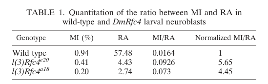

## Question

# Gene Research for Functional Annotation

## ⚠️ CRITICAL: Gene/Protein Identification Context

**BEFORE YOU BEGIN RESEARCH:** You MUST verify you are researching the CORRECT gene/protein. Gene symbols can be ambiguous, especially for less well-characterized genes from non-model organisms.

### Target Gene/Protein Identity (from UniProt):
- **UniProt Accession:** P53034
- **Protein Description:** RecName: Full=Replication factor C subunit 2; AltName: Full=Activator 1 40 kDa subunit; Short=A1 40 kDa subunit; AltName: Full=Activator 1 subunit 2; AltName: Full=Replication factor C 40 kDa subunit; Short=RF-C 40 kDa subunit; Short=RFC40; AltName: Full=Replication factor C subunit 4; Short=DmRfc4;
- **Gene Information:** Name=RfC4; Synonyms=RfC40; ORFNames=CG14999;
- **Organism (full):** Drosophila melanogaster (Fruit fly).
- **Protein Family:** Belongs to the activator 1 small subunits family.
- **Key Domains:** AAA+_ATPase. (IPR003593); ATPase_AAA_core. (IPR003959); DNA_pol3_clamp-load_cplx_C. (IPR008921); DNA_Rep/Repair_Clamp_Loader. (IPR050238); P-loop_NTPase. (IPR027417)

### MANDATORY VERIFICATION STEPS:

1. **Check if the gene symbol "RfC4" matches the protein description above**
2. **Verify the organism is correct:** Drosophila melanogaster (Fruit fly).
3. **Check if protein family/domains align with what you find in literature**
4. **If you find literature for a DIFFERENT gene with the same or similar symbol, STOP**

### If Gene Symbol is Ambiguous or You Cannot Find Relevant Literature:

**DO NOT PROCEED WITH RESEARCH ON A DIFFERENT GENE.** Instead:
- State clearly: "The gene symbol 'RfC4' is ambiguous or literature is limited for this specific protein"
- Explain what you found (e.g., "Found extensive literature on a different gene with the same symbol in a different organism")
- Describe the protein based ONLY on the UniProt information provided above
- Suggest that the protein function can be inferred from domain/family information

### Research Target:

Please provide a comprehensive research report on the gene **RfC4** (gene ID: RfC4, UniProt: P53034) in DROME.

The research report should be a detailed narrative explaining the function, biological processes, and localization of the gene product. Citations should be given for all claims.

You should prioritize authoritative reviews and primary scientific literature when conducting research. You can supplement
this with annotations you find in gene/protein databases, but these can be outdated or inaccurate.

We are specifically interested in the primary function of the gene - for enzymes, what reaction is catalyzed, and what is the substrate specificity? For transporters, what is the substrate? For structural proteins or adapters, what is the broader structural role? For signaling molecules, what is the role in the pathway.

We are interested in where in or outside the cell the gene product carries out its function.

We are also interested in the signaling or biochemical pathways in which the gene functions. We are less interested in broad pleiotropic effects, except where these elucidate the precise role.

Include evidence where possible. We are interested in both experimental evidence as well as inference from structure, evolution, or bioinformatic analysis. Precise studies should be prioritized over high-throughput, where available.

## Output

Question: You are an expert researcher providing comprehensive, well-cited information.

Provide detailed information focusing on:
1. Key concepts and definitions with current understanding
2. Recent developments and latest research (prioritize 2023-2024 sources)
3. Current applications and real-world implementations
4. Expert opinions and analysis from authoritative sources
5. Relevant statistics and data from recent studies

Format as a comprehensive research report with proper citations. Include URLs and publication dates where available.
Always prioritize recent, authoritative sources and provide specific citations for all major claims.

# Gene Research for Functional Annotation

## ⚠️ CRITICAL: Gene/Protein Identification Context

**BEFORE YOU BEGIN RESEARCH:** You MUST verify you are researching the CORRECT gene/protein. Gene symbols can be ambiguous, especially for less well-characterized genes from non-model organisms.

### Target Gene/Protein Identity (from UniProt):
- **UniProt Accession:** P53034
- **Protein Description:** RecName: Full=Replication factor C subunit 2; AltName: Full=Activator 1 40 kDa subunit; Short=A1 40 kDa subunit; AltName: Full=Activator 1 subunit 2; AltName: Full=Replication factor C 40 kDa subunit; Short=RF-C 40 kDa subunit; Short=RFC40; AltName: Full=Replication factor C subunit 4; Short=DmRfc4;
- **Gene Information:** Name=RfC4; Synonyms=RfC40; ORFNames=CG14999;
- **Organism (full):** Drosophila melanogaster (Fruit fly).
- **Protein Family:** Belongs to the activator 1 small subunits family.
- **Key Domains:** AAA+_ATPase. (IPR003593); ATPase_AAA_core. (IPR003959); DNA_pol3_clamp-load_cplx_C. (IPR008921); DNA_Rep/Repair_Clamp_Loader. (IPR050238); P-loop_NTPase. (IPR027417)

### MANDATORY VERIFICATION STEPS:

1. **Check if the gene symbol "RfC4" matches the protein description above**
2. **Verify the organism is correct:** Drosophila melanogaster (Fruit fly).
3. **Check if protein family/domains align with what you find in literature**
4. **If you find literature for a DIFFERENT gene with the same or similar symbol, STOP**

### If Gene Symbol is Ambiguous or You Cannot Find Relevant Literature:

**DO NOT PROCEED WITH RESEARCH ON A DIFFERENT GENE.** Instead:
- State clearly: "The gene symbol 'RfC4' is ambiguous or literature is limited for this specific protein"
- Explain what you found (e.g., "Found extensive literature on a different gene with the same symbol in a different organism")
- Describe the protein based ONLY on the UniProt information provided above
- Suggest that the protein function can be inferred from domain/family information

### Research Target:

Please provide a comprehensive research report on the gene **RfC4** (gene ID: RfC4, UniProt: P53034) in DROME.

The research report should be a detailed narrative explaining the function, biological processes, and localization of the gene product. Citations should be given for all claims.

You should prioritize authoritative reviews and primary scientific literature when conducting research. You can supplement
this with annotations you find in gene/protein databases, but these can be outdated or inaccurate.

We are specifically interested in the primary function of the gene - for enzymes, what reaction is catalyzed, and what is the substrate specificity? For transporters, what is the substrate? For structural proteins or adapters, what is the broader structural role? For signaling molecules, what is the role in the pathway.

We are interested in where in or outside the cell the gene product carries out its function.

We are also interested in the signaling or biochemical pathways in which the gene functions. We are less interested in broad pleiotropic effects, except where these elucidate the precise role.

Include evidence where possible. We are interested in both experimental evidence as well as inference from structure, evolution, or bioinformatic analysis. Precise studies should be prioritized over high-throughput, where available.

# Functional annotation of *Drosophila melanogaster RfC4*

## Identity and scope

The requested protein is the **fruit-fly replication factor C (RFC) small subunit DmRFC4/RFC40**, not a human protein that happens to share the symbol RFC4. The identifiers **RfC4**, **RfC40**, **CG14999**, and **UniProt P53034** are those supplied for the target (https://www.uniprot.org/uniprotkb/P53034/entry). Independent fly genetics identified two alleles of this gene and established its relationship to human RFC40; a phylogenetic analysis placed it with the RFC4 homologues. The fly study calls it RFC **subunit 4**. The supplied UniProt description also uses “subunit 2,” so the functional assignment here follows the experimentally identified *DmRfc4*/RFC40 homologue rather than treating that alternate numbering as evidence for the distinct RFC2 gene. (krause2001lossofcell pages 4-6, krause2001lossofcell pages 6-8, krause2001lossofcell media f5dc04b1)

The supplied AAA+ ATPase, P-loop NTPase, and clamp-loader domain annotations fit this identification: RFC proteins form an ATP-dependent DNA-clamp-handling machine. The domains support an ATP-binding/clamp-loader assignment, **not** a claim that purified fly RFC4 alone has demonstrated clamp-loading or ATPase activity. (krause2001lossofcell pages 10-11, he2024cryoemrevealsa pages 1-2)

## Primary molecular function and substrate specificity

**Best-supported annotation:** DmRFC4 is a small, conserved **assembly and functional subunit of the nuclear RFC clamp loader**. Canonical RFC consists of RFC1 and RFC2–RFC5. As a complex, it uses ATP-dependent conformational changes to open the ring-shaped proliferating cell nuclear antigen (**PCNA**) clamp, position it around DNA, and release it after ring closure. Its relevant DNA substrate is a **primed 3′ single-stranded/double-stranded DNA junction**; PCNA is the clamp it loads. Loaded PCNA provides a sliding platform that increases replicative-polymerase processivity and recruits other DNA-metabolism proteins. The substrate specificity and reaction are established for RFC complexes in biochemical/structural work; a substrate preference or catalytic rate has **not** been measured specifically for isolated Drosophila P53034 in the fly study. (krause2001lossofcell pages 10-11, wang2024thehumanatad5 pages 1-2, zheng2024structureofthe pages 1-2, he2024cryoemrevealsa pages 1-2)

RFC4 should therefore not be annotated as a DNA polymerase that synthesizes DNA or as an enzyme acting independently of its partner subunits. The directly demonstrable fly role is supporting RFC-dependent DNA replication and normal cell-cycle responses. Consistent with a contribution to complex assembly, the fly *e20* allele removes C-terminal sequence while retaining conserved RFC boxes and produces a detectable approximately 29-kDa protein; the more severe *a18* allele predicts only a 45-amino-acid product that was not detected. The fly authors noted that conserved RFC-subunit C termini are important for stable complex formation, although they did not directly measure assembly of these mutant fly proteins. (krause2001lossofcell pages 4-6, krause2001lossofcell pages 6-8, krause2001lossofcell pages 10-11)

An informative **cross-species mechanistic comparison**, rather than a fly-specific result, comes from a 2023 structure of the yeast Rad24–RFC checkpoint loader: its Rfc4 Arg-90 contacts the template-strand phosphate backbone at a DNA junction. This demonstrates that an RFC4-family small subunit can contribute directly to DNA engagement within an assembled loader; the corresponding residue and interaction have not been established experimentally for P53034. (zheng2023structuresof911 pages 5-7)

## Biological processes, pathways, and cellular site

**Replication and genome maintenance—direct fly evidence.** In fly larval-brain neuroblasts, *DmRfc4* mutations markedly reduce BrdU incorporation. Salivary-gland polytene chromosomes are underreplicated with disrupted banding, implicating RFC4 in both proliferative S phases and the endoreduplication cycles that produce polytene chromosomes. Mutant mitoses show premature-condensation-like chromosome morphology, chromosome breaks, premature sister-chromatid separation, and segregation abnormalities; **more than half of the anaphases observed** in the study had bridges or lagging chromosomes. These abnormalities are strong evidence of replication-associated genome instability, but they do not by themselves prove that RFC4 directly binds mitotic chromosomes or acts as a cohesion protein. (krause2001lossofcell pages 4-6, krause2001lossofcell pages 6-8, krause2001lossofcell pages 10-11)

**DNA-structure and damage checkpoints—direct fly evidence.** After replication inhibition with hydroxyurea or aphidicolin, or DNA damage induced by UV or etoposide, wild-type larval neuroblasts generally reduced entry into mitosis; *DmRfc4* mutants failed to respond appropriately before mitosis. In contrast, colchicine still produced a mitotic response consistent with an intact spindle-assembly/kinetochore-attachment checkpoint. Thus the phenotype supports a role in replication-stress and damage-associated cell-cycle surveillance, **not a universal failure of all checkpoints**. Whether RFC4 directly transduces a checkpoint signal, or instead creates/recognizes DNA structures needed for that response, remains unresolved by these experiments. (krause2001lossofcell pages 8-10, krause2001lossofcell pages 10-11)

The following values distinguish impaired DNA synthesis from inappropriate mitotic progression; they are measurements in **flies**, not human RFC4-deficiency statistics. The normalized treatment values are each relative to that genotype’s untreated mitotic index. (krause2001lossofcell pages 6-8, krause2001lossofcell pages 10-11, krause2001lossofcell media 7706c48f)

| Observation | Wild-type fly | *DmRfc4* e20 fly | *DmRfc4* a18 fly | Interpretation |
|---|---:|---:|---:|---|
| Mitotic index (MI) | 0.94% | 0.41% | 0.20% | Both mutants had fewer mitotic neuroblasts than wild type. (krause2001lossofcell pages 6-8) |
| Replicative activity (RA; original operational measure) | 57.48 | 4.43 | 2.74 | Replicative activity was strongly reduced in both mutants; RA is reproduced as reported and is not relabeled as a percentage. (krause2001lossofcell pages 6-8) |
| Normalized MI/RA | 1.00 | 5.65 | 4.45 | Relative to replication activity, mutant mitotic cells accumulated about 4.5–5.7-fold above wild type, supporting defective post-S-phase progression or checkpoint control. (krause2001lossofcell pages 6-8) |
| Normalized MI after hydroxyurea | 0.078 | 0.961 | 5.398 | Wild-type cells largely stopped entering mitosis after replication inhibition; e20 failed to reduce mitotic entry, whereas a18 accumulated in mitosis. (krause2001lossofcell pages 10-11) |
| Normalized MI after UV irradiation | 0.336 | 0.850 | 3.139 | Wild-type cells reduced mitotic entry after DNA damage, but both mutants showed defective premitotic arrest, especially a18. (krause2001lossofcell pages 10-11) |

*Table: Quantitative larval-neuroblast results from Krause et al., published August 2001 ([DOI](https://doi.org/10.1128/mcb.21.15.5156-5168.2001)). Hydroxyurea values are normalized mitotic indices; the a18 raw MI of 1.070% is therefore not substituted for its normalized value of 5.398.*

**Localization—direct fly evidence.** Antibody staining found DmRFC4 in proliferative regions of wild-type larval brains. In cultured fly cell lines, **more than 95% of interphase cells** had nuclear RFC4, and every BrdU-positive nucleus examined was RFC4-positive. Its nuclear staining was broadly distributed rather than confined to visible active replication sites. During mitosis, most detectable protein became diffuse throughout the cell and was not concentrated on mitotic chromosomes. The supported functional site is therefore the **interphase nucleus, at the DNA-replication machinery**; there is no evidence here for an extracellular, membrane-transport, or stable mitotic-chromosome function. (krause2001lossofcell pages 8-10, krause2001lossofcell pages 6-8, krause2001lossofcell pages 10-11)

**Related pathways—conserved inference, not demonstrated fly complex assignments.** The four small RFC subunits can also be shared with alternative complexes whose large subunit replaces RFC1: **CTF18–RFC** loads PCNA in a leading-strand-associated context; **RAD17–RFC** loads the 9-1-1 DNA-damage-checkpoint clamp rather than PCNA; and **ATAD5–RFC** specializes in removing PCNA. These are distinct complex-level activities, so it would be misleading to say that fly RFC4 alone loads 9-1-1 or unloads PCNA. Human and yeast structures and biochemical studies support this pathway framework, but the retrieved fly experiments do not separately assign P53034’s contributions to each alternative complex. (wang2024thehumanatad5 pages 1-2, zheng2023structuresof911 pages 1-3, morimoto2024expandingthegenetic pages 17-19, he2024cryoemrevealsa pages 1-2)

## What 2023–2024 research adds—and what it does not

A **2024 human RFC4 study** by Morimoto and colleagues found biallelic RFC4 variants in **nine affected individuals from eight families** and examined RFC4-deficient human cells and variant-containing complexes. Its strongest mechanistic result for interpreting the conserved small subunit is that tested variants reduced interactions and/or stability of RFC and related complexes. Importantly, three variants whose complexes could be purified **retained in-vitro PCNA-loading ability despite diminished complex formation**; variants that failed to form complexes were *expected* to impair overall loading, rather than shown to make every assembled complex catalytically inactive. This favors an assembly/availability mechanism for at least some RFC4 defects. These are **human orthologue data**, not new Drosophila phenotypes or a clinical disease assignment for flies. (morimoto2024expandingthegenetic pages 1-3, morimoto2024expandingthegenetic pages 15-17, morimoto2024expandingthegenetic pages 17-19)

Contemporary cryo-EM studies further resolve the distinction between the PCNA-loading CTF18–RFC complex and the PCNA-unloading ATAD5/Elg1–RFC complex, while the 2023 Rad24–RFC study resolves checkpoint-clamp loading on gapped DNA. They strengthen the conserved structural rationale for RFC4-family participation but **do not replace** the older direct fly genetic and localization evidence. (zheng2024structureofthe pages 1-2, zheng2023structuresof911 pages 5-7, he2024cryoemrevealsa pages 1-2)

## Evidence assessment and principal sources

**High confidence:** identity as fly RFC40/RFC4; interphase nuclear localization; requirement for efficient DNA replication; selective replication-stress/damage checkpoint phenotypes. **Conserved but not directly tested for purified P53034:** its precise ATP-hydrolysis kinetics, nucleotide-binding contribution, DNA-contacting residues, PCNA-loading reaction in a reconstituted fly complex, and participation in individual fly alternative loaders. The available direct functional study is older than the requested 2023–2024 emphasis; recent research chiefly informs conserved mechanism and must not be presented as new fly-specific validation. (krause2001lossofcell pages 4-6, krause2001lossofcell pages 8-10, krause2001lossofcell pages 10-11, morimoto2024expandingthegenetic pages 15-17, zheng2023structuresof911 pages 5-7)

- Krause *et al.*, **August 2001**, “Loss of Cell Cycle Checkpoint Control in *Drosophila Rfc4* Mutants,” *Molecular and Cellular Biology*. Direct fly genetics, localization, replication, and checkpoint experiments. https://doi.org/10.1128/MCB.21.15.5156-5168.2001 (krause2001lossofcell pages 4-6, krause2001lossofcell pages 8-10, krause2001lossofcell pages 6-8, krause2001lossofcell pages 10-11)
- Zheng *et al.*, **July 2023**, “Structures of 9-1-1 DNA Checkpoint Clamp Loading at Gaps from Start to Finish,” *Cell Reports*. Yeast checkpoint-loader structural evidence, including an Rfc4–DNA contact. https://doi.org/10.1016/j.celrep.2023.112694 (zheng2023structuresof911 pages 1-3, zheng2023structuresof911 pages 5-7)
- He *et al.*, **published April 26, 2024**, “Cryo-EM Reveals a Nearly Complete PCNA Loading Process and Unique Features of the Human Alternative Clamp Loader CTF18–RFC,” *PNAS*. Human alternative-loader mechanism. https://doi.org/10.1073/pnas.2319727121 (he2024cryoemrevealsa pages 1-2)
- Wang *et al.*, **2024**, “The Human ATAD5 Has Evolved Unique Structural Elements to Function Exclusively as a PCNA Unloader,” *Nature Structural & Molecular Biology*. Human PCNA-unloader and canonical-loader comparison. https://doi.org/10.1038/s41594-024-01332-4 (wang2024thehumanatad5 pages 1-2)
- Morimoto *et al.*, **September 5, 2024**, “Expanding the Genetic and Phenotypic Landscape of Replication Factor C Complex-Related Disorders,” *American Journal of Human Genetics*. Human RFC4 complex-stability and PCNA-loading experiments; **not** a fly-gene disease study. https://doi.org/10.1016/j.ajhg.2024.07.008 (morimoto2024expandingthegenetic pages 1-3, morimoto2024expandingthegenetic pages 15-17, morimoto2024expandingthegenetic pages 17-19)

References

1. (krause2001lossofcell pages 4-6): Sue A. Krause, Marie-Louise Loupart, Sharron Vass, Stefan Schoenfelder, Steve Harrison, and Margarete M. S. Heck. Loss of cell cycle checkpoint control in drosophila rfc4 mutants. Molecular and Cellular Biology, 21:5156-5168, Aug 2001. URL: https://doi.org/10.1128/mcb.21.15.5156-5168.2001, doi:10.1128/mcb.21.15.5156-5168.2001. This article has 62 citations and is from a domain leading peer-reviewed journal.

2. (krause2001lossofcell pages 6-8): Sue A. Krause, Marie-Louise Loupart, Sharron Vass, Stefan Schoenfelder, Steve Harrison, and Margarete M. S. Heck. Loss of cell cycle checkpoint control in drosophila rfc4 mutants. Molecular and Cellular Biology, 21:5156-5168, Aug 2001. URL: https://doi.org/10.1128/mcb.21.15.5156-5168.2001, doi:10.1128/mcb.21.15.5156-5168.2001. This article has 62 citations and is from a domain leading peer-reviewed journal.

3. (krause2001lossofcell media f5dc04b1): Sue A. Krause, Marie-Louise Loupart, Sharron Vass, Stefan Schoenfelder, Steve Harrison, and Margarete M. S. Heck. Loss of cell cycle checkpoint control in drosophila rfc4 mutants. Molecular and Cellular Biology, 21:5156-5168, Aug 2001. URL: https://doi.org/10.1128/mcb.21.15.5156-5168.2001, doi:10.1128/mcb.21.15.5156-5168.2001. This article has 62 citations and is from a domain leading peer-reviewed journal.

4. (krause2001lossofcell pages 10-11): Sue A. Krause, Marie-Louise Loupart, Sharron Vass, Stefan Schoenfelder, Steve Harrison, and Margarete M. S. Heck. Loss of cell cycle checkpoint control in drosophila rfc4 mutants. Molecular and Cellular Biology, 21:5156-5168, Aug 2001. URL: https://doi.org/10.1128/mcb.21.15.5156-5168.2001, doi:10.1128/mcb.21.15.5156-5168.2001. This article has 62 citations and is from a domain leading peer-reviewed journal.

5. (he2024cryoemrevealsa pages 1-2): Qing He, Feng Wang, Michael E. O’Donnell, and Huilin Li. Cryo-em reveals a nearly complete pcna loading process and unique features of the human alternative clamp loader ctf18-rfc. Proceedings of the National Academy of Sciences of the United States of America, Apr 2024. URL: https://doi.org/10.1073/pnas.2319727121, doi:10.1073/pnas.2319727121. This article has 18 citations and is from a highest quality peer-reviewed journal.

6. (wang2024thehumanatad5 pages 1-2): Feng Wang, Qing He, Nina Y. Yao, Michael E. O’Donnell, and Huilin Li. The human atad5 has evolved unique structural elements to function exclusively as a pcna unloader. Nature Structural & Molecular Biology, 31:1680-1691, Jun 2024. URL: https://doi.org/10.1038/s41594-024-01332-4, doi:10.1038/s41594-024-01332-4. This article has 14 citations and is from a highest quality peer-reviewed journal.

7. (zheng2024structureofthe pages 1-2): Fengwei Zheng, Nina Y. Yao, Roxana E. Georgescu, Huilin Li, and Michael E. O’Donnell. Structure of the pcna unloader elg1-rfc. Science Advances, Mar 2024. URL: https://doi.org/10.1126/sciadv.adl1739, doi:10.1126/sciadv.adl1739. This article has 8 citations and is from a highest quality peer-reviewed journal.

8. (zheng2023structuresof911 pages 5-7): Fengwei Zheng, Roxana E. Georgescu, Nina Y. Yao, Michael E. O’Donnell, and Huilin Li. Structures of 9-1-1 dna checkpoint clamp loading at gaps from start to finish and ramification on biology. Cell Reports, 42:112694, Jul 2023. URL: https://doi.org/10.1016/j.celrep.2023.112694, doi:10.1016/j.celrep.2023.112694. This article has 15 citations and is from a highest quality peer-reviewed journal.

9. (krause2001lossofcell pages 8-10): Sue A. Krause, Marie-Louise Loupart, Sharron Vass, Stefan Schoenfelder, Steve Harrison, and Margarete M. S. Heck. Loss of cell cycle checkpoint control in drosophila rfc4 mutants. Molecular and Cellular Biology, 21:5156-5168, Aug 2001. URL: https://doi.org/10.1128/mcb.21.15.5156-5168.2001, doi:10.1128/mcb.21.15.5156-5168.2001. This article has 62 citations and is from a domain leading peer-reviewed journal.

10. (krause2001lossofcell media 7706c48f): Sue A. Krause, Marie-Louise Loupart, Sharron Vass, Stefan Schoenfelder, Steve Harrison, and Margarete M. S. Heck. Loss of cell cycle checkpoint control in drosophila rfc4 mutants. Molecular and Cellular Biology, 21:5156-5168, Aug 2001. URL: https://doi.org/10.1128/mcb.21.15.5156-5168.2001, doi:10.1128/mcb.21.15.5156-5168.2001. This article has 62 citations and is from a domain leading peer-reviewed journal.

11. (zheng2023structuresof911 pages 1-3): Fengwei Zheng, Roxana E. Georgescu, Nina Y. Yao, Michael E. O’Donnell, and Huilin Li. Structures of 9-1-1 dna checkpoint clamp loading at gaps from start to finish and ramification on biology. Cell Reports, 42:112694, Jul 2023. URL: https://doi.org/10.1016/j.celrep.2023.112694, doi:10.1016/j.celrep.2023.112694. This article has 15 citations and is from a highest quality peer-reviewed journal.

12. (morimoto2024expandingthegenetic pages 17-19): Marie Morimoto, Eunjin Ryu, Benjamin J. Steger, Abhijit Dixit, Yoshihiko Saito, Juyeong Yoo, Amelie T. van der Ven, Natalie Hauser, Peter J. Steinbach, Kazumasa Oura, Alden Y. Huang, Fanny Kortüm, Shinsuke Ninomiya, Elisabeth A. Rosenthal, Hannah K. Robinson, Katie Guegan, Jonas Denecke, Sankarasubramoney H. Subramony, Callie J. Diamonstein, Jie Ping, Mark Fenner, Elsa V. Balton, Sam Strohbehn, Aimee Allworth, Michael J. Bamshad, Mahi Gandhi, Katrina M. Dipple, Elizabeth E. Blue, Gail P. Jarvik, C. Christopher Lau, Ingrid A. Holm, Monika Weisz-Hubshman, Benjamin D. Solomon, Stanley F. Nelson, Ichizo Nishino, David R. Adams, Sukhyun Kang, William A. Gahl, Camilo Toro, Kyungjae Myung, and May Christine V. Malicdan. Expanding the genetic and phenotypic landscape of replication factor c complex-related disorders: rfc4 deficiency is linked to a multisystemic disorder. The American Journal of Human Genetics, 111:1970-1993, Sep 2024. URL: https://doi.org/10.1016/j.ajhg.2024.07.008, doi:10.1016/j.ajhg.2024.07.008. This article has 6 citations.

13. (morimoto2024expandingthegenetic pages 1-3): Marie Morimoto, Eunjin Ryu, Benjamin J. Steger, Abhijit Dixit, Yoshihiko Saito, Juyeong Yoo, Amelie T. van der Ven, Natalie Hauser, Peter J. Steinbach, Kazumasa Oura, Alden Y. Huang, Fanny Kortüm, Shinsuke Ninomiya, Elisabeth A. Rosenthal, Hannah K. Robinson, Katie Guegan, Jonas Denecke, Sankarasubramoney H. Subramony, Callie J. Diamonstein, Jie Ping, Mark Fenner, Elsa V. Balton, Sam Strohbehn, Aimee Allworth, Michael J. Bamshad, Mahi Gandhi, Katrina M. Dipple, Elizabeth E. Blue, Gail P. Jarvik, C. Christopher Lau, Ingrid A. Holm, Monika Weisz-Hubshman, Benjamin D. Solomon, Stanley F. Nelson, Ichizo Nishino, David R. Adams, Sukhyun Kang, William A. Gahl, Camilo Toro, Kyungjae Myung, and May Christine V. Malicdan. Expanding the genetic and phenotypic landscape of replication factor c complex-related disorders: rfc4 deficiency is linked to a multisystemic disorder. The American Journal of Human Genetics, 111:1970-1993, Sep 2024. URL: https://doi.org/10.1016/j.ajhg.2024.07.008, doi:10.1016/j.ajhg.2024.07.008. This article has 6 citations.

14. (morimoto2024expandingthegenetic pages 15-17): Marie Morimoto, Eunjin Ryu, Benjamin J. Steger, Abhijit Dixit, Yoshihiko Saito, Juyeong Yoo, Amelie T. van der Ven, Natalie Hauser, Peter J. Steinbach, Kazumasa Oura, Alden Y. Huang, Fanny Kortüm, Shinsuke Ninomiya, Elisabeth A. Rosenthal, Hannah K. Robinson, Katie Guegan, Jonas Denecke, Sankarasubramoney H. Subramony, Callie J. Diamonstein, Jie Ping, Mark Fenner, Elsa V. Balton, Sam Strohbehn, Aimee Allworth, Michael J. Bamshad, Mahi Gandhi, Katrina M. Dipple, Elizabeth E. Blue, Gail P. Jarvik, C. Christopher Lau, Ingrid A. Holm, Monika Weisz-Hubshman, Benjamin D. Solomon, Stanley F. Nelson, Ichizo Nishino, David R. Adams, Sukhyun Kang, William A. Gahl, Camilo Toro, Kyungjae Myung, and May Christine V. Malicdan. Expanding the genetic and phenotypic landscape of replication factor c complex-related disorders: rfc4 deficiency is linked to a multisystemic disorder. The American Journal of Human Genetics, 111:1970-1993, Sep 2024. URL: https://doi.org/10.1016/j.ajhg.2024.07.008, doi:10.1016/j.ajhg.2024.07.008. This article has 6 citations.

## Artifacts

- [Edison artifact artifact-00](RfC4-deep-research-falcon_artifacts/artifact-00.md)

## Citations

1. krause2001lossofcell pages 6-8
2. krause2001lossofcell pages 10-11
3. he2024cryoemrevealsa pages 1-2
4. krause2001lossofcell pages 4-6
5. zheng2024structureofthe pages 1-2
6. krause2001lossofcell pages 8-10
7. morimoto2024expandingthegenetic pages 17-19
8. morimoto2024expandingthegenetic pages 1-3
9. morimoto2024expandingthegenetic pages 15-17
10. DOI
11. https://www.uniprot.org/uniprotkb/P53034/entry
12. https://doi.org/10.1128/mcb.21.15.5156-5168.2001
13. https://doi.org/10.1128/MCB.21.15.5156-5168.2001
14. https://doi.org/10.1016/j.celrep.2023.112694
15. https://doi.org/10.1073/pnas.2319727121
16. https://doi.org/10.1038/s41594-024-01332-4
17. https://doi.org/10.1016/j.ajhg.2024.07.008
18. https://doi.org/10.1128/mcb.21.15.5156-5168.2001,
19. https://doi.org/10.1073/pnas.2319727121,
20. https://doi.org/10.1038/s41594-024-01332-4,
21. https://doi.org/10.1126/sciadv.adl1739,
22. https://doi.org/10.1016/j.celrep.2023.112694,
23. https://doi.org/10.1016/j.ajhg.2024.07.008,