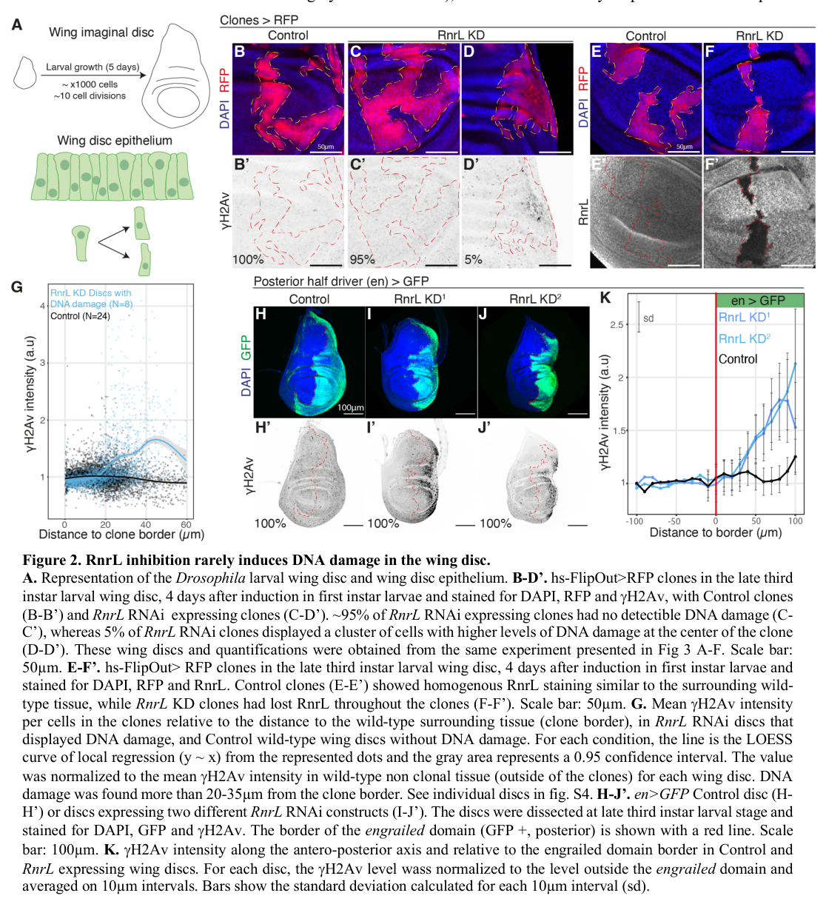

## Question

# Gene Research for Functional Annotation

## ⚠️ CRITICAL: Gene/Protein Identification Context

**BEFORE YOU BEGIN RESEARCH:** You MUST verify you are researching the CORRECT gene/protein. Gene symbols can be ambiguous, especially for less well-characterized genes from non-model organisms.

### Target Gene/Protein Identity (from UniProt):
- **UniProt Accession:** P48591
- **Protein Description:** RecName: Full=Ribonucleoside-diphosphate reductase large subunit; EC=1.17.4.1; AltName: Full=Ribonucleoside-diphosphate reductase subunit M1; AltName: Full=Ribonucleotide reductase large subunit;
- **Gene Information:** Name=RnrL; ORFNames=CG5371;
- **Organism (full):** Drosophila melanogaster (Fruit fly).
- **Protein Family:** Belongs to the ribonucleoside diphosphate reductase large
- **Key Domains:** ATP-cone_dom. (IPR005144); NrdE_NrdA_C. (IPR013346); RNR_lg_C. (IPR000788); RNR_lsu_N. (IPR013509); RNR_R1-su_N. (IPR008926)

### MANDATORY VERIFICATION STEPS:

1. **Check if the gene symbol "RnrL" matches the protein description above**
2. **Verify the organism is correct:** Drosophila melanogaster (Fruit fly).
3. **Check if protein family/domains align with what you find in literature**
4. **If you find literature for a DIFFERENT gene with the same or similar symbol, STOP**

### If Gene Symbol is Ambiguous or You Cannot Find Relevant Literature:

**DO NOT PROCEED WITH RESEARCH ON A DIFFERENT GENE.** Instead:
- State clearly: "The gene symbol 'RnrL' is ambiguous or literature is limited for this specific protein"
- Explain what you found (e.g., "Found extensive literature on a different gene with the same symbol in a different organism")
- Describe the protein based ONLY on the UniProt information provided above
- Suggest that the protein function can be inferred from domain/family information

### Research Target:

Please provide a comprehensive research report on the gene **RnrL** (gene ID: RnrL, UniProt: P48591) in DROME.

The research report should be a detailed narrative explaining the function, biological processes, and localization of the gene product. Citations should be given for all claims.

You should prioritize authoritative reviews and primary scientific literature when conducting research. You can supplement
this with annotations you find in gene/protein databases, but these can be outdated or inaccurate.

We are specifically interested in the primary function of the gene - for enzymes, what reaction is catalyzed, and what is the substrate specificity? For transporters, what is the substrate? For structural proteins or adapters, what is the broader structural role? For signaling molecules, what is the role in the pathway.

We are interested in where in or outside the cell the gene product carries out its function.

We are also interested in the signaling or biochemical pathways in which the gene functions. We are less interested in broad pleiotropic effects, except where these elucidate the precise role.

Include evidence where possible. We are interested in both experimental evidence as well as inference from structure, evolution, or bioinformatic analysis. Precise studies should be prioritized over high-throughput, where available.

## Output

Question: You are an expert researcher providing comprehensive, well-cited information.

Provide detailed information focusing on:
1. Key concepts and definitions with current understanding
2. Recent developments and latest research (prioritize 2023-2024 sources)
3. Current applications and real-world implementations
4. Expert opinions and analysis from authoritative sources
5. Relevant statistics and data from recent studies

Format as a comprehensive research report with proper citations. Include URLs and publication dates where available.
Always prioritize recent, authoritative sources and provide specific citations for all major claims.

# Gene Research for Functional Annotation

## ⚠️ CRITICAL: Gene/Protein Identification Context

**BEFORE YOU BEGIN RESEARCH:** You MUST verify you are researching the CORRECT gene/protein. Gene symbols can be ambiguous, especially for less well-characterized genes from non-model organisms.

### Target Gene/Protein Identity (from UniProt):
- **UniProt Accession:** P48591
- **Protein Description:** RecName: Full=Ribonucleoside-diphosphate reductase large subunit; EC=1.17.4.1; AltName: Full=Ribonucleoside-diphosphate reductase subunit M1; AltName: Full=Ribonucleotide reductase large subunit;
- **Gene Information:** Name=RnrL; ORFNames=CG5371;
- **Organism (full):** Drosophila melanogaster (Fruit fly).
- **Protein Family:** Belongs to the ribonucleoside diphosphate reductase large
- **Key Domains:** ATP-cone_dom. (IPR005144); NrdE_NrdA_C. (IPR013346); RNR_lg_C. (IPR000788); RNR_lsu_N. (IPR013509); RNR_R1-su_N. (IPR008926)

### MANDATORY VERIFICATION STEPS:

1. **Check if the gene symbol "RnrL" matches the protein description above**
2. **Verify the organism is correct:** Drosophila melanogaster (Fruit fly).
3. **Check if protein family/domains align with what you find in literature**
4. **If you find literature for a DIFFERENT gene with the same or similar symbol, STOP**

### If Gene Symbol is Ambiguous or You Cannot Find Relevant Literature:

**DO NOT PROCEED WITH RESEARCH ON A DIFFERENT GENE.** Instead:
- State clearly: "The gene symbol 'RnrL' is ambiguous or literature is limited for this specific protein"
- Explain what you found (e.g., "Found extensive literature on a different gene with the same symbol in a different organism")
- Describe the protein based ONLY on the UniProt information provided above
- Suggest that the protein function can be inferred from domain/family information

### Research Target:

Please provide a comprehensive research report on the gene **RnrL** (gene ID: RnrL, UniProt: P48591) in DROME.

The research report should be a detailed narrative explaining the function, biological processes, and localization of the gene product. Citations should be given for all claims.

You should prioritize authoritative reviews and primary scientific literature when conducting research. You can supplement
this with annotations you find in gene/protein databases, but these can be outdated or inaccurate.

We are specifically interested in the primary function of the gene - for enzymes, what reaction is catalyzed, and what is the substrate specificity? For transporters, what is the substrate? For structural proteins or adapters, what is the broader structural role? For signaling molecules, what is the role in the pathway.

We are interested in where in or outside the cell the gene product carries out its function.

We are also interested in the signaling or biochemical pathways in which the gene functions. We are less interested in broad pleiotropic effects, except where these elucidate the precise role.

Include evidence where possible. We are interested in both experimental evidence as well as inference from structure, evolution, or bioinformatic analysis. Precise studies should be prioritized over high-throughput, where available.

# Functional annotation of *Drosophila melanogaster* RnrL

## Identity and principal function

**RnrL is the fruit-fly ribonucleoside-diphosphate reductase large subunit (R1), not the small subunit RnrS.** Independent fly studies explicitly identify RnrL as R1; the supplied UniProt record identifies it as **P48591, ORF CG5371, EC 1.17.4.1**. The ATP-cone and RNR-large-subunit domains specified in that record fit the catalytic, allosterically regulated R1 architecture. The accession–ORF correspondence comes from the supplied record; the research articles retrieved independently corroborate the fly gene’s name and protein identity, but do not independently print both database identifiers. (gerhold2011identificationandcharacterization pages 1-2, arnaoutov2014irbitisa pages 1-2, arnaoutov2020irbitdirectsdifferentiation pages 4-6, long2022stillnorest pages 167-170)

**Reaction.** Within the RNR complex, RnrL provides the site that reduces a ribonucleoside **diphosphate** to its corresponding 2′-deoxyribonucleoside diphosphate: **NDP + 2 reducing equivalents → dNDP + H₂O**. The expected substrates are **ADP, GDP, CDP and UDP**, yielding dADP, dGDP, dCDP and dUDP; downstream reactions supply dNTPs for DNA replication and repair. The small RnrS/R2 subunit supplies the radical needed for catalysis rather than being the principal diphosphate-binding catalytic subunit. This reaction assignment is strongly supported by RnrL’s fly genetic identity and established class-I RNR chemistry, although the retrieved studies did **not** measure all four substrate-conversion rates with purified fly RnrL. (funk2024howatpand pages 1-2, long2022stillnorest pages 167-170, andreadis2024cytoplasmiclocalizationof pages 1-5)

## Substrate choice and biochemical regulation

RnrL’s expected substrate preference is **conditional, not exclusive**: in characterized class-Ia enzymes, ATP or dATP at the *specificity* site favors CDP/UDP reduction, dTTP favors GDP reduction, and dGTP favors ADP reduction. A separate *activity* site in the N-terminal ATP cone responds to ATP by promoting activity and to dATP by inhibiting it. These rules explain how RNR balances the four DNA-precursor pools; they should be annotated for fly RnrL as **conserved-mechanism inference**, not as fly-specific measurements of substrate preference or oligomeric state. In particular, the detailed ATP-induced structural switch reported in a 2024 bacterial study must not be treated as an experimentally established fly structure. (funk2024howatpand pages 1-2, long2022stillnorest pages 167-170)

There is more specific evidence for regulation by **IRBIT**. Arnaoutov and Dasso, [*Science*, 19 September 2014](https://doi.org/10.1126/science.1251550), observed dATP-dependent binding of human IRBIT to purified *Drosophila* R1 and of fly IRBIT to human RNR. Their tests of inhibition, stabilization of dATP at the activity site, and phosphorylation dependence relied predominantly on the **human** reconstituted enzyme and HeLa cells; the same quantitative mechanism was not independently measured for an entirely fly-derived RNR complex. (arnaoutov2014irbitisa pages 4-8, arnaoutov2014irbitisa pages 2-4, arnaoutov2014irbitisa pages 1-2)

## Where RnrL acts

The most defensible working annotation is an **intracellular, principally cytoplasmic RNR function**, producing soluble DNA precursors that can reach nuclear and mitochondrial DNA synthesis. This compartment assignment is an **inference from studied eukaryotic RNRs**, not definitive microscopy of fly P48591. A [November 2024 yeast-localization study](https://doi.org/10.1101/2024.10.29.620917) describes active RNR as cytoplasmic but also discusses context-dependent—and in mammals disputed—nuclear localization after DNA damage; those observations cannot establish nuclear shuttling by fly RnrL. (andreadis2024cytoplasmiclocalizationof pages 1-5)

There *is* direct evidence of **which fly cells express the protein**: anti-RnrL/R1 staining detected it in intestinal stem cells and enteroblasts in [Arnaoutov *et al.*, *iScience*, 27 March 2020](https://doi.org/10.1016/j.isci.2020.100954). A [2024 wing-disc study](https://doi.org/10.1101/2023.08.15.553366) also used RnrL immunostaining to verify protein depletion after RNAi. Neither finding, on the text available, establishes a precise cytosolic-versus-nuclear distribution. RnrL should not be assigned an extracellular, gap-junction-channel, or mitochondrial-matrix location merely because the nucleotides it helps generate can subsequently move between compartments or cells. (boumard2024celltypespecificnucleotidesharing pages 3-5, arnaoutov2020irbitdirectsdifferentiation pages 4-6, boumard2024celltypespecificnucleotidesharing media 1c3e4596)

## Biological pathways and direct fly evidence

**De novo deoxynucleotide supply and replication-stress protection.** In adult midgut intestinal stem cells, four days of RnrL RNAi increased the replication-associated markers γH2Av and RpA70-GFP, delayed S phase, and impaired proliferation; prolonged or clonal depletion also caused stem-cell loss. Hydroxyurea inhibition of RNR produced related replication-stress phenotypes. These perturbations establish a requirement for fly RnrL in maintaining the nucleotide supply needed for proliferation, although the experiments do not themselves determine purified-enzyme kinetics. Boumard *et al.*, [bioRxiv, September 2024](https://doi.org/10.1101/2023.08.15.553366). (boumard2024celltypespecificnucleotidesharing pages 1-3)

**Tissue-dependent buffering of RnrL loss.** The same study found detectable DNA damage in only **27/533 (~5%)** wing-disc RnrL-RNAi clones, versus **243/267 (~91%)** clones when both RnrL and the gap-junction component **Inx2** were depleted. Damage in some RnrL-only clones arose **20–35 µm** from neighboring wild-type tissue; double-depleted clones were smaller. Genetic, spatial, and EdU-labeling experiments support the authors’ model that connected wing cells can share nucleotide resources, whereas adult intestinal stem cells lack comparable gap-junction buffering. This is an application of *RnrL* perturbation as a **fly model of tissue-level replication stress**, not evidence that RnrL itself forms a junction or that a particular nucleotide’s intercellular flux was directly quantified by metabolomics. These numerical findings refer to the **2024 preprint version**. (boumard2024celltypespecificnucleotidesharing pages 3-5, boumard2024celltypespecificnucleotidesharing pages 5-7, boumard2024celltypespecificnucleotidesharing media 1c3e4596, boumard2024celltypespecificnucleotidesharing media 36eb7108)

**Early embryo nucleotide metabolism.** Pérez-Mojica *et al.*’s [April 2024 preprint](https://doi.org/10.1101/2024.04.17.589796) profiled **245 individual embryos and 22 unfertilized eggs**, obtaining unambiguous signals for **81 of 155** targeted metabolites. dATP and dTTP decreased during rapid early divisions and stabilized or increased around cellularization; dGTP could not be measured by that method. *RnrL* and *RnrS* transcripts occurred in modules correlated with dNTP abundance, but correlations alone do not prove RnrL catalysis. The subsequent **peer-reviewed** [*Nature Metabolism* paper, August 2025](https://doi.org/10.1038/s42255-025-01351-5) reported that **maternal RnrL depletion reduced larval hatching**, whereas depletion of the *distinct* small-subunit transcript *RnrS* **completely arrested development**. Its survival design used **80 embryos per sample and five samples per group**; an exact RnrL percentage effect is not established by the accessible textual evidence and is therefore not reported here. The published RnrL-specific perturbation is stronger evidence for its developmental requirement than attributing an earlier *RnrS*-only experiment to RnrL. (perezmojica2024singleembryometabolomicsreveals pages 4-6, perezmojica2024singleembryometabolomicsreveals pages 3-4, perezmojica2025resolvingearlyembryonic pages 7-8, perezmojica2025resolvingearlyembryonic pages 6-7)

**IRBIT–RNR differentiation circuit.** In fly midguts, differentiating enteroblasts express IRBIT, which restrains RNR: RNR overexpression generated an accumulation of undifferentiated progeny resembling IRBIT loss, whereas reducing RNR activity or R1 expression ameliorated the IRBIT-loss phenotype. An IRBIT variant missing its RNR-binding region failed to rescue differentiation. These genetic tests support a pathway in which **GATAe → IRBIT-mediated restraint of RNR → enteroblast-to-enterocyte differentiation**, rather than identifying RnrL itself as a transcription factor or signaling receptor. Arnaoutov *et al.*, [*iScience*, 27 March 2020](https://doi.org/10.1016/j.isci.2020.100954). (arnaoutov2020irbitdirectsdifferentiation pages 6-9, arnaoutov2020irbitdirectsdifferentiation pages 4-6)

**Growth after damage and the p53 response.** A genetically characterized RnrL allele, **A4B5**, substitutes methionine for a conserved valine in a region predicted to interact with RnrS; it impaired compensatory imaginal-disc growth despite little detectable effect on normal growth in the reported comparison. Gerhold *et al.*, [*Genetics*, December 2011](https://doi.org/10.1534/genetics.111.132993). RnrL is also radiation-induced in a fly p53-dependent transcriptional program; RNAi against either RnrL or RnrS reduced radiation-induced caspase activity in the authors’ sensitized cell assay. Akdemir *et al.*, [*Oncogene*, August 2007](https://doi.org/10.1038/sj.onc.1210328). **Neither result demonstrates a separate intrinsic RnrL signaling or pro-apoptotic catalytic activity**: its securely established molecular identity remains nucleotide-metabolic RNR R1. (akdemir2007p53directsfocused pages 6-7, gerhold2011identificationandcharacterization pages 12-13, akdemir2007p53directsfocused pages 2-4, gerhold2011identificationandcharacterization pages 10-12)

The evidence tiers and principal outstanding uncertainties are summarized here. (boumard2024celltypespecificnucleotidesharing pages 3-5, long2022stillnorest pages 167-170, andreadis2024cytoplasmiclocalizationof pages 1-5)

| Assertion | Direct *Drosophila* evidence | Inference / caveat | Supporting source (publication date; DOI) |
|---|---|---|---|
| **Primary reaction and substrate specificity:** RnrL is the large catalytic R1/α subunit expected to reduce ADP, GDP, CDP and UDP to the corresponding dNDPs. | Fly studies identify RnrL as the large RNR subunit required for dNTP synthesis, but no retrieved study directly measured purified fly RnrL turnover of all four substrates. | Four-substrate specificity is a strong class-Ia/eukaryotic-homology inference, not a fly-specific biochemical demonstration. Conserved specificity-site rules are ATP/dATP → CDP/UDP, dTTP → GDP and dGTP → ADP; ATP activates and dATP inhibits through the activity site. (long2022stillnorest pages 167-170, arnaoutov2014irbitisa pages 1-2) | Long *et al.*, Jan 2022, [10.1007/978-3-031-00793-4_5](https://doi.org/10.1007/978-3-031-00793-4_5); Arnaoutov & Dasso, 19 Sep 2014, [10.1126/science.1251550](https://doi.org/10.1126/science.1251550) |
| **RnrL prevents replication stress; neighboring wing cells can buffer its loss through Inx2-dependent gap junctions.** | RnrL RNAi in intestinal stem cells caused S-phase delay, γH2Av/RpA70 accumulation, impaired proliferation and stem-cell loss. In wing discs, only 27/533 RnrL-RNAi clones showed detectable damage, versus 243/267 clones after combined RnrL/Inx2 depletion. (boumard2024celltypespecificnucleotidesharing pages 3-5, boumard2024celltypespecificnucleotidesharing pages 1-3, boumard2024celltypespecificnucleotidesharing media 1c3e4596) | Evidence strongly supports tissue-dependent buffering, but nucleotide transfer was inferred from genetics, spatial damage patterns and EdU-related assays rather than direct metabolomic measurement of flux through gap junctions. The cited version was a 2024 preprint. | Boumard *et al.*, Sep 2024, bioRxiv, [10.1101/2023.08.15.553366](https://doi.org/10.1101/2023.08.15.553366) |
| **Maternally supplied RnrL contributes to early embryonic development.** | Maternal/oocyte-specific RnrL RNAi reduced larval hatching, whereas RnrS depletion completely arrested development; the survival design used 80 embryos per sample and five samples per group. (perezmojica2025resolvingearlyembryonic pages 7-8, perezmojica2025resolvingearlyembryonic pages 6-7) | This establishes a developmental requirement, not direct catalytic activity. The 2024 preprint’s strongest perturbation initially emphasized the distinct small subunit RnrS; the peer-reviewed 2025 article added/clarified direct RnrL depletion and supersedes the preprint for this claim. | Pérez-Mojica *et al.*, Aug 2025, *Nature Metabolism*, [10.1038/s42255-025-01351-5](https://doi.org/10.1038/s42255-025-01351-5); preprint 17 Apr 2024, [10.1101/2024.04.17.589796](https://doi.org/10.1101/2024.04.17.589796) |
| **IRBIT restrains RNR through dATP-dependent allostery and supports fly intestinal differentiation.** | Purified cross-species assays showed human IRBIT binding fly R1 and fly IRBIT binding human RNR in a dATP-dependent manner. In flies, loss of IRBIT caused R1-high enteroblast accumulation; an IRBIT mutant lacking the RNR-binding region failed to rescue, RNR overexpression phenocopied IRBIT loss and R1 suppression rescued it. (arnaoutov2014irbitisa pages 1-2, arnaoutov2020irbitdirectsdifferentiation pages 6-9, arnaoutov2020irbitdirectsdifferentiation pages 4-6) | Stabilization of inhibitory A-site dATP and inhibition of UDP reduction were demonstrated mainly with purified human RNR, not a wholly fly reconstituted enzyme. Fly evidence strongly supports the regulatory relationship by physical cross-species binding and in-vivo epistasis. (arnaoutov2014irbitisa pages 4-8, arnaoutov2014irbitisa pages 2-4) | Arnaoutov & Dasso, 19 Sep 2014, *Science*, [10.1126/science.1251550](https://doi.org/10.1126/science.1251550); Arnaoutov *et al.*, 27 Mar 2020, *iScience*, [10.1016/j.isci.2020.100954](https://doi.org/10.1016/j.isci.2020.100954) |
| **Intracellular location:** RnrL is expected to act primarily in the cytoplasm. | Fly anti-RnrL staining establishes expression in intestinal stem cells and enteroblasts, but the retrieved microscopy did not resolve RnrL as cytoplasmic versus nuclear or organellar. (arnaoutov2020irbitdirectsdifferentiation pages 4-6) | Cytoplasmic activity is supported by mammalian and yeast class-I RNR studies; nuclear relocalization after damage is context-dependent and disputed. Therefore, “cytoplasmic” is a conserved-system inference, not a definitive fly localization annotation. (andreadis2024cytoplasmiclocalizationof pages 1-5) | Andreadis *et al.*, Nov 2024, bioRxiv, [10.1101/2024.10.29.620917](https://doi.org/10.1101/2024.10.29.620917); Arnaoutov *et al.*, 27 Mar 2020, [10.1016/j.isci.2020.100954](https://doi.org/10.1016/j.isci.2020.100954) |

*Table: Evidence-strength summary separating direct fly experiments from conserved class-Ia RNR inference. It highlights the strongest functional data and the remaining biochemical and localization uncertainties.*

**Functional annotation conclusion.** Annotate P48591/RnrL primarily as the **large catalytic and allosterically regulated subunit of intracellular ribonucleoside-diphosphate reductase**, supplying deoxyribonucleotide precursors for replication and repair. Assign ADP/GDP/CDP/UDP substrate breadth and predominant cytoplasmic activity as well-supported **class-Ia/eukaryotic inferences**, while recording fly-specific support for genetic necessity, R1 protein expression, IRBIT-linked regulation, and tissue-dependent replication-stress phenotypes. Purified-fly substrate-specificity measurements and definitive fly subcellular-localization experiments remain the important evidence gaps. (boumard2024celltypespecificnucleotidesharing pages 3-5, arnaoutov2014irbitisa pages 1-2, arnaoutov2020irbitdirectsdifferentiation pages 6-9, long2022stillnorest pages 167-170, andreadis2024cytoplasmiclocalizationof pages 1-5, perezmojica2025resolvingearlyembryonic pages 6-7)

References

1. (gerhold2011identificationandcharacterization pages 1-2): Abigail R Gerhold, Daniel J Richter, Albert S Yu, and Iswar K Hariharan. Identification and characterization of genes required for compensatory growth in drosophila. Genetics, 189:1309-1326, Dec 2011. URL: https://doi.org/10.1534/genetics.111.132993, doi:10.1534/genetics.111.132993. This article has 30 citations and is from a domain leading peer-reviewed journal.

2. (arnaoutov2014irbitisa pages 1-2): Alexei Arnaoutov and Mary Dasso. Irbit is a novel regulator of ribonucleotide reductase in higher eukaryotes. Science, 345:1512-1515, Sep 2014. URL: https://doi.org/10.1126/science.1251550, doi:10.1126/science.1251550. This article has 57 citations and is from a highest quality peer-reviewed journal.

3. (arnaoutov2020irbitdirectsdifferentiation pages 4-6): Alexei Arnaoutov, Hangnoh Lee, Karen Plevock Haase, Vasilisa Aksenova, Michal Jarnik, Brian Oliver, Mihaela Serpe, and Mary Dasso. Irbit directs differentiation of intestinal stem cell progeny to maintain tissue homeostasis. iScience, 23:100954, Mar 2020. URL: https://doi.org/10.1016/j.isci.2020.100954, doi:10.1016/j.isci.2020.100954. This article has 13 citations and is from a peer-reviewed journal.

4. (long2022stillnorest pages 167-170): Marcus J. C. Long, Phillippe Ly, and Yimon Aye. Still no rest for the reductases: ribonucleotide reductase (rnr) structure and function: an update. Sub-cellular biochemistry, 99:155-197, Jan 2022. URL: https://doi.org/10.1007/978-3-031-00793-4\_5, doi:10.1007/978-3-031-00793-4\_5. This article has 17 citations.

5. (funk2024howatpand pages 1-2): Michael A. Funk, Christina M. Zimanyi, Gisele A. Andree, Allison E. Hamilos, and Catherine L. Drennan. How atp and datp act as molecular switches to regulate enzymatic activity in the prototypical bacterial class ia ribonucleotide reductase. Biochemistry, 63:2517-2531, Aug 2024. URL: https://doi.org/10.1021/acs.biochem.4c00329, doi:10.1021/acs.biochem.4c00329. This article has 12 citations and is from a peer-reviewed journal.

6. (andreadis2024cytoplasmiclocalizationof pages 1-5): Christos Andreadis, Israel Salguero, and Stephen E. Kearsey. Cytoplasmic localization of ribonucleotide reductase is essential for genome stability. bioRxiv, Nov 2024. URL: https://doi.org/10.1101/2024.10.29.620917, doi:10.1101/2024.10.29.620917. This article has 1 citations.

7. (arnaoutov2014irbitisa pages 4-8): Alexei Arnaoutov and Mary Dasso. Irbit is a novel regulator of ribonucleotide reductase in higher eukaryotes. Science, 345:1512-1515, Sep 2014. URL: https://doi.org/10.1126/science.1251550, doi:10.1126/science.1251550. This article has 57 citations and is from a highest quality peer-reviewed journal.

8. (arnaoutov2014irbitisa pages 2-4): Alexei Arnaoutov and Mary Dasso. Irbit is a novel regulator of ribonucleotide reductase in higher eukaryotes. Science, 345:1512-1515, Sep 2014. URL: https://doi.org/10.1126/science.1251550, doi:10.1126/science.1251550. This article has 57 citations and is from a highest quality peer-reviewed journal.

9. (boumard2024celltypespecificnucleotidesharing pages 3-5): Benjamin Boumard, Gwenn Le Meur, Marine Stefanutti, Tania Maalouf, Marwa El-Hajj, Reinhard Bauer, and Allison J Bardin. Cell-type-specific nucleotide sharing through gap junctions impacts sensitivity to replication stress. bioRxiv, Sep 2024. URL: https://doi.org/10.1101/2023.08.15.553366, doi:10.1101/2023.08.15.553366. This article has 0 citations.

10. (boumard2024celltypespecificnucleotidesharing media 1c3e4596): Benjamin Boumard, Gwenn Le Meur, Marine Stefanutti, Tania Maalouf, Marwa El-Hajj, Reinhard Bauer, and Allison J Bardin. Cell-type-specific nucleotide sharing through gap junctions impacts sensitivity to replication stress. bioRxiv, Sep 2024. URL: https://doi.org/10.1101/2023.08.15.553366, doi:10.1101/2023.08.15.553366. This article has 0 citations.

11. (boumard2024celltypespecificnucleotidesharing pages 1-3): Benjamin Boumard, Gwenn Le Meur, Marine Stefanutti, Tania Maalouf, Marwa El-Hajj, Reinhard Bauer, and Allison J Bardin. Cell-type-specific nucleotide sharing through gap junctions impacts sensitivity to replication stress. bioRxiv, Sep 2024. URL: https://doi.org/10.1101/2023.08.15.553366, doi:10.1101/2023.08.15.553366. This article has 0 citations.

12. (boumard2024celltypespecificnucleotidesharing pages 5-7): Benjamin Boumard, Gwenn Le Meur, Marine Stefanutti, Tania Maalouf, Marwa El-Hajj, Reinhard Bauer, and Allison J Bardin. Cell-type-specific nucleotide sharing through gap junctions impacts sensitivity to replication stress. bioRxiv, Sep 2024. URL: https://doi.org/10.1101/2023.08.15.553366, doi:10.1101/2023.08.15.553366. This article has 0 citations.

13. (boumard2024celltypespecificnucleotidesharing media 36eb7108): Benjamin Boumard, Gwenn Le Meur, Marine Stefanutti, Tania Maalouf, Marwa El-Hajj, Reinhard Bauer, and Allison J Bardin. Cell-type-specific nucleotide sharing through gap junctions impacts sensitivity to replication stress. bioRxiv, Sep 2024. URL: https://doi.org/10.1101/2023.08.15.553366, doi:10.1101/2023.08.15.553366. This article has 0 citations.

14. (perezmojica2024singleembryometabolomicsreveals pages 4-6): J. Eduardo Pérez-Mojica, Zachary B. Madaj, Christine N. Isaguirre, Joe Roy, Kin H. Lau, Ryan D. Sheldon, and Adelheid Lempradl. Single-embryo metabolomics reveals developmental metabolism in the early drosophila embryo. bioRxiv, Apr 2024. URL: https://doi.org/10.1101/2024.04.17.589796, doi:10.1101/2024.04.17.589796. This article has 1 citations.

15. (perezmojica2024singleembryometabolomicsreveals pages 3-4): J. Eduardo Pérez-Mojica, Zachary B. Madaj, Christine N. Isaguirre, Joe Roy, Kin H. Lau, Ryan D. Sheldon, and Adelheid Lempradl. Single-embryo metabolomics reveals developmental metabolism in the early drosophila embryo. bioRxiv, Apr 2024. URL: https://doi.org/10.1101/2024.04.17.589796, doi:10.1101/2024.04.17.589796. This article has 1 citations.

16. (perezmojica2025resolvingearlyembryonic pages 7-8): J. E. Pérez-Mojica, Z. Madaj, Christine N. Isaguirre, Joe Roy, Kin H Lau, Ryan D. Sheldon, and Adelheid Lempradl. Resolving early embryonic metabolism in drosophila through single-embryo metabolomics and transcriptomics. Nature metabolism, Aug 2025. URL: https://doi.org/10.1038/s42255-025-01351-5, doi:10.1038/s42255-025-01351-5. This article has 5 citations and is from a domain leading peer-reviewed journal.

17. (perezmojica2025resolvingearlyembryonic pages 6-7): J. E. Pérez-Mojica, Z. Madaj, Christine N. Isaguirre, Joe Roy, Kin H Lau, Ryan D. Sheldon, and Adelheid Lempradl. Resolving early embryonic metabolism in drosophila through single-embryo metabolomics and transcriptomics. Nature metabolism, Aug 2025. URL: https://doi.org/10.1038/s42255-025-01351-5, doi:10.1038/s42255-025-01351-5. This article has 5 citations and is from a domain leading peer-reviewed journal.

18. (arnaoutov2020irbitdirectsdifferentiation pages 6-9): Alexei Arnaoutov, Hangnoh Lee, Karen Plevock Haase, Vasilisa Aksenova, Michal Jarnik, Brian Oliver, Mihaela Serpe, and Mary Dasso. Irbit directs differentiation of intestinal stem cell progeny to maintain tissue homeostasis. iScience, 23:100954, Mar 2020. URL: https://doi.org/10.1016/j.isci.2020.100954, doi:10.1016/j.isci.2020.100954. This article has 13 citations and is from a peer-reviewed journal.

19. (akdemir2007p53directsfocused pages 6-7): Fatih Akdemir, A. Christich, Naoko Sogame, Joseph Chapo, and John M. Abrams. P53 directs focused genomic responses in drosophila. Oncogene, 26:5184-5193, Aug 2007. URL: https://doi.org/10.1038/sj.onc.1210328, doi:10.1038/sj.onc.1210328. This article has 114 citations and is from a domain leading peer-reviewed journal.

20. (gerhold2011identificationandcharacterization pages 12-13): Abigail R Gerhold, Daniel J Richter, Albert S Yu, and Iswar K Hariharan. Identification and characterization of genes required for compensatory growth in drosophila. Genetics, 189:1309-1326, Dec 2011. URL: https://doi.org/10.1534/genetics.111.132993, doi:10.1534/genetics.111.132993. This article has 30 citations and is from a domain leading peer-reviewed journal.

21. (akdemir2007p53directsfocused pages 2-4): Fatih Akdemir, A. Christich, Naoko Sogame, Joseph Chapo, and John M. Abrams. P53 directs focused genomic responses in drosophila. Oncogene, 26:5184-5193, Aug 2007. URL: https://doi.org/10.1038/sj.onc.1210328, doi:10.1038/sj.onc.1210328. This article has 114 citations and is from a domain leading peer-reviewed journal.

22. (gerhold2011identificationandcharacterization pages 10-12): Abigail R Gerhold, Daniel J Richter, Albert S Yu, and Iswar K Hariharan. Identification and characterization of genes required for compensatory growth in drosophila. Genetics, 189:1309-1326, Dec 2011. URL: https://doi.org/10.1534/genetics.111.132993, doi:10.1534/genetics.111.132993. This article has 30 citations and is from a domain leading peer-reviewed journal.

## Artifacts

- [Edison artifact artifact-00](RnrL-deep-research-falcon_artifacts/artifact-00.md)

## Citations

1. andreadis2024cytoplasmiclocalizationof pages 1-5
2. boumard2024celltypespecificnucleotidesharing pages 1-3
3. arnaoutov2020irbitdirectsdifferentiation pages 4-6
4. gerhold2011identificationandcharacterization pages 1-2
5. arnaoutov2014irbitisa pages 1-2
6. long2022stillnorest pages 167-170
7. funk2024howatpand pages 1-2
8. arnaoutov2014irbitisa pages 4-8
9. arnaoutov2014irbitisa pages 2-4
10. boumard2024celltypespecificnucleotidesharing pages 3-5
11. boumard2024celltypespecificnucleotidesharing pages 5-7
12. perezmojica2024singleembryometabolomicsreveals pages 4-6
13. perezmojica2024singleembryometabolomicsreveals pages 3-4
14. perezmojica2025resolvingearlyembryonic pages 7-8
15. perezmojica2025resolvingearlyembryonic pages 6-7
16. arnaoutov2020irbitdirectsdifferentiation pages 6-9
17. gerhold2011identificationandcharacterization pages 12-13
18. gerhold2011identificationandcharacterization pages 10-12
19. *Science*, 19 September 2014
20. November 2024 yeast-localization study
21. Arnaoutov *et al.*, *iScience*, 27 March 2020
22. 2024 wing-disc study
23. bioRxiv, September 2024
24. April 2024 preprint
25. *Nature Metabolism* paper, August 2025
26. *iScience*, 27 March 2020
27. *Genetics*, December 2011
28. *Oncogene*, August 2007
29. 10.1007/978-3-031-00793-4_5
30. 10.1126/science.1251550
31. 10.1101/2023.08.15.553366
32. 10.1038/s42255-025-01351-5
33. 10.1101/2024.04.17.589796
34. 10.1016/j.isci.2020.100954
35. 10.1101/2024.10.29.620917
36. https://doi.org/10.1126/science.1251550
37. https://doi.org/10.1101/2024.10.29.620917
38. https://doi.org/10.1016/j.isci.2020.100954
39. https://doi.org/10.1101/2023.08.15.553366
40. https://doi.org/10.1101/2024.04.17.589796
41. https://doi.org/10.1038/s42255-025-01351-5
42. https://doi.org/10.1534/genetics.111.132993
43. https://doi.org/10.1038/sj.onc.1210328
44. https://doi.org/10.1007/978-3-031-00793-4_5
45. https://doi.org/10.1534/genetics.111.132993,
46. https://doi.org/10.1126/science.1251550,
47. https://doi.org/10.1016/j.isci.2020.100954,
48. https://doi.org/10.1007/978-3-031-00793-4\_5,
49. https://doi.org/10.1021/acs.biochem.4c00329,
50. https://doi.org/10.1101/2024.10.29.620917,
51. https://doi.org/10.1101/2023.08.15.553366,
52. https://doi.org/10.1101/2024.04.17.589796,
53. https://doi.org/10.1038/s42255-025-01351-5,
54. https://doi.org/10.1038/sj.onc.1210328,