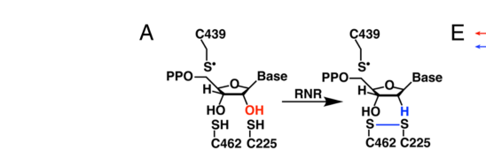

## Question

# Gene Research for Functional Annotation

## ⚠️ CRITICAL: Gene/Protein Identification Context

**BEFORE YOU BEGIN RESEARCH:** You MUST verify you are researching the CORRECT gene/protein. Gene symbols can be ambiguous, especially for less well-characterized genes from non-model organisms.

### Target Gene/Protein Identity (from UniProt):
- **UniProt Accession:** P48592
- **Protein Description:** RecName: Full=Ribonucleoside-diphosphate reductase subunit M2; EC=1.17.4.1; AltName: Full=Ribonucleotide reductase small subunit;
- **Gene Information:** Name=RnrS; ORFNames=CG8975;
- **Organism (full):** Drosophila melanogaster (Fruit fly).
- **Protein Family:** Belongs to the ribonucleoside diphosphate reductase small
- **Key Domains:** Ferritin-like_SF. (IPR009078); RNR-like. (IPR012348); RNR_small. (IPR033909); RNR_small_AS. (IPR030475); RNR_small_fam. (IPR000358)

### MANDATORY VERIFICATION STEPS:

1. **Check if the gene symbol "RnrS" matches the protein description above**
2. **Verify the organism is correct:** Drosophila melanogaster (Fruit fly).
3. **Check if protein family/domains align with what you find in literature**
4. **If you find literature for a DIFFERENT gene with the same or similar symbol, STOP**

### If Gene Symbol is Ambiguous or You Cannot Find Relevant Literature:

**DO NOT PROCEED WITH RESEARCH ON A DIFFERENT GENE.** Instead:
- State clearly: "The gene symbol 'RnrS' is ambiguous or literature is limited for this specific protein"
- Explain what you found (e.g., "Found extensive literature on a different gene with the same symbol in a different organism")
- Describe the protein based ONLY on the UniProt information provided above
- Suggest that the protein function can be inferred from domain/family information

### Research Target:

Please provide a comprehensive research report on the gene **RnrS** (gene ID: RnrS, UniProt: P48592) in DROME.

The research report should be a detailed narrative explaining the function, biological processes, and localization of the gene product. Citations should be given for all claims.

You should prioritize authoritative reviews and primary scientific literature when conducting research. You can supplement
this with annotations you find in gene/protein databases, but these can be outdated or inaccurate.

We are specifically interested in the primary function of the gene - for enzymes, what reaction is catalyzed, and what is the substrate specificity? For transporters, what is the substrate? For structural proteins or adapters, what is the broader structural role? For signaling molecules, what is the role in the pathway.

We are interested in where in or outside the cell the gene product carries out its function.

We are also interested in the signaling or biochemical pathways in which the gene functions. We are less interested in broad pleiotropic effects, except where these elucidate the precise role.

Include evidence where possible. We are interested in both experimental evidence as well as inference from structure, evolution, or bioinformatic analysis. Precise studies should be prioritized over high-throughput, where available.

## Output

Question: You are an expert researcher providing comprehensive, well-cited information.

Provide detailed information focusing on:
1. Key concepts and definitions with current understanding
2. Recent developments and latest research (prioritize 2023-2024 sources)
3. Current applications and real-world implementations
4. Expert opinions and analysis from authoritative sources
5. Relevant statistics and data from recent studies

Format as a comprehensive research report with proper citations. Include URLs and publication dates where available.
Always prioritize recent, authoritative sources and provide specific citations for all major claims.

# Gene Research for Functional Annotation

## ⚠️ CRITICAL: Gene/Protein Identification Context

**BEFORE YOU BEGIN RESEARCH:** You MUST verify you are researching the CORRECT gene/protein. Gene symbols can be ambiguous, especially for less well-characterized genes from non-model organisms.

### Target Gene/Protein Identity (from UniProt):
- **UniProt Accession:** P48592
- **Protein Description:** RecName: Full=Ribonucleoside-diphosphate reductase subunit M2; EC=1.17.4.1; AltName: Full=Ribonucleotide reductase small subunit;
- **Gene Information:** Name=RnrS; ORFNames=CG8975;
- **Organism (full):** Drosophila melanogaster (Fruit fly).
- **Protein Family:** Belongs to the ribonucleoside diphosphate reductase small
- **Key Domains:** Ferritin-like_SF. (IPR009078); RNR-like. (IPR012348); RNR_small. (IPR033909); RNR_small_AS. (IPR030475); RNR_small_fam. (IPR000358)

### MANDATORY VERIFICATION STEPS:

1. **Check if the gene symbol "RnrS" matches the protein description above**
2. **Verify the organism is correct:** Drosophila melanogaster (Fruit fly).
3. **Check if protein family/domains align with what you find in literature**
4. **If you find literature for a DIFFERENT gene with the same or similar symbol, STOP**

### If Gene Symbol is Ambiguous or You Cannot Find Relevant Literature:

**DO NOT PROCEED WITH RESEARCH ON A DIFFERENT GENE.** Instead:
- State clearly: "The gene symbol 'RnrS' is ambiguous or literature is limited for this specific protein"
- Explain what you found (e.g., "Found extensive literature on a different gene with the same symbol in a different organism")
- Describe the protein based ONLY on the UniProt information provided above
- Suggest that the protein function can be inferred from domain/family information

### Research Target:

Please provide a comprehensive research report on the gene **RnrS** (gene ID: RnrS, UniProt: P48592) in DROME.

The research report should be a detailed narrative explaining the function, biological processes, and localization of the gene product. Citations should be given for all claims.

You should prioritize authoritative reviews and primary scientific literature when conducting research. You can supplement
this with annotations you find in gene/protein databases, but these can be outdated or inaccurate.

We are specifically interested in the primary function of the gene - for enzymes, what reaction is catalyzed, and what is the substrate specificity? For transporters, what is the substrate? For structural proteins or adapters, what is the broader structural role? For signaling molecules, what is the role in the pathway.

We are interested in where in or outside the cell the gene product carries out its function.

We are also interested in the signaling or biochemical pathways in which the gene functions. We are less interested in broad pleiotropic effects, except where these elucidate the precise role.

Include evidence where possible. We are interested in both experimental evidence as well as inference from structure, evolution, or bioinformatic analysis. Precise studies should be prioritized over high-throughput, where available.

# Functional annotation of *Drosophila melanogaster* RnrS (UniProt P48592)

## Identity and scope

**RnrS is the fruit-fly ribonucleotide reductase (RNR) small subunit**, also termed the R2 or β subunit; its partner RnrL is the large, R1 or α subunit. The supplied UniProt record identifies RnrS as **P48592**, ORF **CG8975**, from *D. melanogaster*, and annotates ferritin-like and RNR-small-family domains. Fly-focused literature independently identifies RnrS and RnrL as the small and large RNR subunits, respectively. Thus, this report concerns the specified fly protein—not an RNR gene with a similar name in yeast, bacteria, or another insect. Direct biochemical literature on purified fly P48592 remains limited. [UniProt P48592](https://www.uniprot.org/uniprotkb/P48592/entry); Liu and Großhans, September 2019, [DOI: 10.1080/15384101.2019.1665948](https://doi.org/10.1080/15384101.2019.1665948). (liu2019theroleof pages 4-6)

## Molecular function and substrate specificity

**The primary function of RnrS is to supply the radical-generating component of the RNR complex that makes DNA precursors.** In the conserved class-I RNR mechanism, the small β subunit houses a metal-associated tyrosyl radical and transfers radical character to the large α subunit. The α subunit—not free RnrS—binds and reduces ribonucleoside diphosphate substrates. The assembled enzyme converts **ADP, GDP, CDP, and UDP** into **dADP, dGDP, dCDP, and dUDP**, respectively, by replacing the ribose 2′-hydroxyl with hydrogen; downstream nucleotide metabolism supplies DNA-building dNTPs. Accordingly, EC **1.17.4.1** describes the *assembled enzyme’s* reductase activity, not an independently demonstrated NDP-reduction reaction catalyzed by isolated RnrS. Westmoreland *et al.*, October 30, 2024, [*PNAS*, DOI: 10.1073/pnas.2417157121](https://doi.org/10.1073/pnas.2417157121); Liu and Großhans, 2019. (westmoreland20242.6åresolutioncryoem pages 1-2, westmoreland20242.6åresolutioncryoem media b0e4c159, liu2019theroleof pages 4-6)

RnrS’s annotated **ferritin-like/RNR-small domains** fit a conserved diiron–tyrosyl-radical R2 architecture. In a 2024 **2.6-Å cryo-EM** study of *Escherichia coli* class-Ia RNR, a transient α₂β₂ complex supported radical transfer across approximately **32 Å**; Figure 1 places the iron–tyrosyl-radical cofactor in β and both the substrate-binding and allosteric specificity sites in α. This is strong **structural inference for the fly protein**, not a measurement of P48592’s iron occupancy, radical-bearing residue, or transfer distance. Substrate preference among the four NDPs is regulated principally through α-subunit allosteric sites; fly RnrS-specific kinetic preferences have not been established by the sources examined. Westmoreland *et al.*, 2024. (westmoreland20242.6åresolutioncryoem pages 1-2, westmoreland20242.6åresolutioncryoem media b0e4c159)

## Biological pathway and direct fly evidence

RnrS functions in **de novo deoxyribonucleotide biosynthesis**, connecting ribonucleotide metabolism to dNTP availability for DNA replication and repair. Maternal dNTP stores alone do not eliminate the need for continuing RNR activity in the rapidly dividing embryo. A fly-focused review reports maternally supplied **RnrS mRNA**, its decline around blastoderm development, and later expression in proliferating tissues. These are developmental and metabolic roles; they do not establish a separate signaling activity for RnrS. Liu and Großhans, 2019; Pérez-Mojica *et al.*, April 2024, [bioRxiv DOI: 10.1101/2024.04.17.589796](https://doi.org/10.1101/2024.04.17.589796). (liu2019theroleof pages 4-6, perezmojica2024singleembryometabolomicsreveals pages 6-8)

The most informative **RnrS-specific perturbation** identified here is the Pérez-Mojica *et al.* embryo study, posted in 2024 and subsequently published in *Nature Metabolism* in August 2025 ([DOI: 10.1038/s42255-025-01351-5](https://doi.org/10.1038/s42255-025-01351-5)). Oocyte-specific depletion of maternally deposited **RnrS transcript abolished embryonic development**. The study’s single-embryo workflow analyzed **245 embryos and 22 unfertilized eggs** and detected **81 of 155** targeted metabolites. During early nuclear divisions, dATP, dTTP, and dCTP abundance declined; dATP subsequently rose around the pause in division at cellularization. Maternal RnrS transcript declined and later zygotic expression coincided with changing dATP abundance. The knockdown establishes an in-vivo requirement for RnrS, while the RNA–metabolite correlation does **not** by itself prove that RnrS abundance causes every observed pool change; the method could not detect dGTP. Pérez-Mojica *et al.*, 2024 preprint and 2025 journal publication. (perezmojica2024singleembryometabolomicsreveals pages 3-4, perezmojica2024singleembryometabolomicsreveals pages 6-8, perezmojica2024singleembryometabolomicsreveals pages 4-6, perezmojica2025resolvingearlyembryonic pages 10-11)

For scale, a 2019 synthesis of earlier fly embryo measurements reported approximately **1.2 pmol dCTP, 0.8 pmol dATP, and 1.2 pmol dTTP per newly laid embryo**. It also summarized experiments in which a feedback-insensitive **RnrL** mutant increased embryonic dNTP levels approximately **6–25-fold**. The latter manipulation concerns the *large* subunit and supports pathway-level allosteric control; it is **not** a measurement of RnrS-specific activity. Liu and Großhans, 2019. (liu2019theroleof pages 4-6, liu2019theroleof pages 3-4)

## Site of action and cellular localization

The best-supported **working localization is a soluble, primarily cytosolic RNR complex**, with its nucleotide products supplying nuclear DNA synthesis. A fly nucleotide-metabolism study describes the cytoplasm as the main site of nucleotide production and demonstrates that **dRIM2/CG18317**, a *different* fly protein, transports cytosolic deoxynucleotide precursors into mitochondria. This supports a cytosol-to-mitochondrion precursor pathway; it does **not** demonstrate that RnrS itself resides in mitochondria or directly image RnrS in the cytosol. Da-Rè *et al.*, March 14, 2014, [*Journal of Biological Chemistry*, DOI: 10.1074/jbc.M113.543926](https://doi.org/10.1074/jbc.M113.543926). (dare2014functionalcharacterizationof pages 1-2)

A November 2024 **fission-yeast preprint** experimentally redirected that organism’s RNR subunits to the nucleus and reported slower S phase and increased mutagenesis, lending comparative support to the importance of cytoplasmic RNR activity. Its proteins are *Schizosaccharomyces pombe* Cdc22 and Suc22—not fly RnrL and RnrS—and yeast cell-cycle-dependent R2 trafficking must **not** be assigned to P48592. No fly RnrS-specific protein microscopy or subcellular fractionation establishing its precise distribution was identified in the literature examined. Andreadis *et al.*, November 2024, [bioRxiv DOI: 10.1101/2024.10.29.620917](https://doi.org/10.1101/2024.10.29.620917). (andreadis2024cytoplasmiclocalizationof pages 1-5, dare2014functionalcharacterizationof pages 1-2)

## Research and application context

Fly RNR genetics offers experimentally tractable models of replication stress and antimetabolite response. A 2014 fly chemotoxicity study found a **gemcitabine-response quantitative-trait locus** on chromosome 2R whose interval contained **RnrS**; the authors noted that gemcitabine diphosphate inhibits RNR. Because the interval was broad, this identifies RnrS as a **candidate**, not a demonstrated causal resistance allele or proof of direct gemcitabine binding to fly RnrS. More recent fly tissue work manipulated **RnrL**, showing that intestinal stem cells were sensitive to RNR-pathway disruption while wing progenitors could buffer nucleotide stress through gap-junction-mediated sharing; those results should likewise not be mislabeled as RnrS-specific experiments. King *et al.*, September 2014, [*Genetics*, DOI: 10.1534/genetics.114.161968](https://doi.org/10.1534/genetics.114.161968); Boumard *et al.*, September 2024 preprint, [DOI: 10.1101/2023.08.15.553366](https://doi.org/10.1101/2023.08.15.553366). (boumard2024celltypespecificnucleotidesharing pages 1-3, king2014usingdrosophilamelanogaster pages 7-8)

The following evidence summary distinguishes observations made **in flies** from mechanistic or localization conclusions transferred from other organisms. (westmoreland20242.6åresolutioncryoem pages 1-2, andreadis2024cytoplasmiclocalizationof pages 1-5, liu2019theroleof pages 4-6, perezmojica2024singleembryometabolomicsreveals pages 6-8)

| Topic | Conclusion | Evidence strength | Caveat |
|---|---|---|---|
| Identity | **RnrS** is the *Drosophila melanogaster* RNR small/β subunit corresponding to UniProt **P48592** and ORF **CG8975**; it partners with the large/α subunit RnrL. (liu2019theroleof pages 4-6) | **Strong annotation and literature agreement** | Exact-accession searches found little direct biochemical literature; identity is anchored primarily by UniProt and fly nomenclature rather than purified P48592 experiments. |
| Maternal requirement | Oocyte-specific depletion of maternal **RnrS** transcript abolished embryonic development in the 2024 bioRxiv study, subsequently published in *Nature Metabolism* in 2025; the assay used an RnrS dsRNA line and maternal driver. (perezmojica2024singleembryometabolomicsreveals pages 6-8, perezmojica2024singleembryometabolomicsreveals pages 4-6, perezmojica2025resolvingearlyembryonic pages 10-11) | **Direct fly genetic evidence** | Establishes developmental necessity, not the protein’s catalytic constants, metal content, or subcellular localization. |
| Embryonic nucleotide dynamics | Single-embryo multi-omics profiled **245 embryos and 22 unfertilized eggs**, detecting **81 of 155 targeted metabolites**. dATP, dTTP and dCTP declined during rapid early divisions; dATP and dTTP later stabilized or increased near cellularization. Maternal RnrS transcript decay and later zygotic expression tracked these dynamics. (perezmojica2024singleembryometabolomicsreveals pages 3-4, perezmojica2024singleembryometabolomicsreveals pages 6-8, perezmojica2024singleembryometabolomicsreveals pages 4-6) | **Direct fly transcriptomic and metabolomic evidence** | Temporal correlation does not prove that RnrS abundance caused every metabolite change; dGTP was not detectable by the method. |
| Primary molecular role | RnrS is inferred to be the **radical-generating β/R2 subunit**, whereas RnrL/α contains the NDP-binding catalytic and allosteric sites. The small subunit is essential for activity but does **not** itself house the NDP-reduction active site. (westmoreland20242.6åresolutioncryoem pages 1-2, liu2019theroleof pages 4-6) | **Strong conserved-family inference** | No purified *Drosophila* RnrS reconstitution or enzyme-kinetic study was identified. |
| Substrates and reaction | The assembled class-I RNR converts **CDP, UDP, ADP and GDP** to the corresponding deoxyribonucleoside diphosphates by replacing the ribose 2′-OH with hydrogen; substrate binding and reduction occur in α/RnrL. (westmoreland20242.6åresolutioncryoem pages 1-2) | **Direct class-I biochemical and structural evidence; inferred for fly** | The cited 2024 structure is from *E. coli*, not *Drosophila*; fly-specific kinetic preferences among the four NDPs were not found. |
| Radical and metal mechanism | RnrS is predicted from its RNR-small and ferritin-like domains to house a **diiron–tyrosyl-radical cofactor**. A 2024 **2.6-Å** *E. coli* α₂β₂ cryo-EM structure resolved β-to-α proton-coupled electron transfer over approximately **32 Å**. (westmoreland20242.6åresolutioncryoem pages 1-2, westmoreland20242.6åresolutioncryoem media b0e4c159) | **High-confidence structural and evolutionary inference** | Metal stoichiometry, radical identity and transfer residues have not been demonstrated directly for P48592; *E. coli* residue numbering should not be assigned to the fly protein without sequence mapping. |
| Cellular localization | The working annotation is a **soluble, principally cytosolic RNR component**, with dNDP and dNTP products available for nuclear DNA synthesis and mitochondrial import. (andreadis2024cytoplasmiclocalizationof pages 1-5, dare2014functionalcharacterizationof pages 1-2) | **Moderate cross-eukaryotic inference** | No RnrS-specific protein microscopy or fractionation in *Drosophila* was identified. The 2024 localization experiment manipulated fission-yeast Cdc22/Suc22 and is not direct fly evidence. |
| Mitochondrial distinction | **dRIM2/CG18317 is a different protein**: a mitochondrial inner-membrane deoxynucleotide carrier required to import cytosolic DNA precursors. It is not RnrS/P48592. (dare2014functionalcharacterizationof pages 1-2) | **Direct fly localization and transporter evidence** | dRIM2 data support a cytosol-to-mitochondrion nucleotide pathway but do not directly localize RnrS. |
| Developmental pathway | RnrS functions in **de novo dNTP biosynthesis**, supporting DNA replication and embryonic cell-cycle progression. Early embryos contain maternal dNTP pools, yet continued RNR activity is required as those pools are consumed. (liu2019theroleof pages 4-6, liu2019theroleof pages 3-4, perezmojica2024singleembryometabolomicsreveals pages 6-8) | **Direct fly physiological evidence plus conserved mechanism** | Broad cell-cycle phenotypes are downstream consequences and should not be mistaken for a separate signaling activity of RnrS. |
| Gemcitabine application | A 2014 *Drosophila* chemotoxicity study mapped a gemcitabine-fecundity QTL on chromosome 2R containing **RnrS**, biologically plausible because gemcitabine diphosphate inhibits RNR. (king2014usingdrosophilamelanogaster pages 7-8) | **Associative fly genetic evidence** | The QTL interval was broad; RnrS was a candidate, not causally validated by allele replacement, knockdown, rescue or direct drug-binding experiments. |
| Overall confidence | The best-supported annotation is that **RnrS/P48592 is the fly class-I RNR radical-generating small subunit required for de novo dNTP production and embryonic development**. | **High for core function; moderate for detailed mechanism; low-to-moderate for localization** | Direct fly protein biochemistry, metal and radical spectroscopy, substrate kinetics, interaction stoichiometry and protein-level localization remain important evidence gaps. |

*Table: Evidence-calibrated functional annotation of *Drosophila melanogaster* RnrS/P48592, separating direct fly results from conserved class-I RNR inference. The table also flags distinct proteins and associative findings that should not be overinterpreted.*

**Conclusion.** The defensible functional annotation for **RnrS/P48592** is the *D. melanogaster* RNR **small, radical-generating subunit**, required with RnrL for de novo production of DNA precursors and demonstrably important for early embryonic development. Its detailed diiron-radical mechanism and principally cytosolic site of action are well-motivated **family-level inferences**; purified fly-protein kinetics, fly-specific metal/radical measurements, and direct fly RnrS protein localization remain unresolved by the sources reviewed. (westmoreland20242.6åresolutioncryoem pages 1-2, dare2014functionalcharacterizationof pages 1-2, liu2019theroleof pages 4-6, perezmojica2024singleembryometabolomicsreveals pages 6-8)

References

1. (liu2019theroleof pages 4-6): Boyang Liu and Jörg Großhans. The role of dntp metabolites in control of the embryonic cell cycle. Cell Cycle, 18:2817-2827, Sep 2019. URL: https://doi.org/10.1080/15384101.2019.1665948, doi:10.1080/15384101.2019.1665948. This article has 23 citations and is from a peer-reviewed journal.

2. (westmoreland20242.6åresolutioncryoem pages 1-2): Dana E. Westmoreland, Patricia R. Feliciano, Gyunghoon Kang, Chang Cui, Albert Kim, JoAnne Stubbe, Daniel G. Nocera, and Catherine L. Drennan. 2.6-å resolution cryo-em structure of a class ia ribonucleotide reductase trapped with mechanism-based inhibitor n3cdp. Proceedings of the National Academy of Sciences of the United States of America, Oct 2024. URL: https://doi.org/10.1073/pnas.2417157121, doi:10.1073/pnas.2417157121. This article has 18 citations and is from a highest quality peer-reviewed journal.

3. (westmoreland20242.6åresolutioncryoem media b0e4c159): Dana E. Westmoreland, Patricia R. Feliciano, Gyunghoon Kang, Chang Cui, Albert Kim, JoAnne Stubbe, Daniel G. Nocera, and Catherine L. Drennan. 2.6-å resolution cryo-em structure of a class ia ribonucleotide reductase trapped with mechanism-based inhibitor n3cdp. Proceedings of the National Academy of Sciences of the United States of America, Oct 2024. URL: https://doi.org/10.1073/pnas.2417157121, doi:10.1073/pnas.2417157121. This article has 18 citations and is from a highest quality peer-reviewed journal.

4. (perezmojica2024singleembryometabolomicsreveals pages 6-8): J. Eduardo Pérez-Mojica, Zachary B. Madaj, Christine N. Isaguirre, Joe Roy, Kin H. Lau, Ryan D. Sheldon, and Adelheid Lempradl. Single-embryo metabolomics reveals developmental metabolism in the early drosophila embryo. bioRxiv, Apr 2024. URL: https://doi.org/10.1101/2024.04.17.589796, doi:10.1101/2024.04.17.589796. This article has 1 citations.

5. (perezmojica2024singleembryometabolomicsreveals pages 3-4): J. Eduardo Pérez-Mojica, Zachary B. Madaj, Christine N. Isaguirre, Joe Roy, Kin H. Lau, Ryan D. Sheldon, and Adelheid Lempradl. Single-embryo metabolomics reveals developmental metabolism in the early drosophila embryo. bioRxiv, Apr 2024. URL: https://doi.org/10.1101/2024.04.17.589796, doi:10.1101/2024.04.17.589796. This article has 1 citations.

6. (perezmojica2024singleembryometabolomicsreveals pages 4-6): J. Eduardo Pérez-Mojica, Zachary B. Madaj, Christine N. Isaguirre, Joe Roy, Kin H. Lau, Ryan D. Sheldon, and Adelheid Lempradl. Single-embryo metabolomics reveals developmental metabolism in the early drosophila embryo. bioRxiv, Apr 2024. URL: https://doi.org/10.1101/2024.04.17.589796, doi:10.1101/2024.04.17.589796. This article has 1 citations.

7. (perezmojica2025resolvingearlyembryonic pages 10-11): J. E. Pérez-Mojica, Z. Madaj, Christine N. Isaguirre, Joe Roy, Kin H Lau, Ryan D. Sheldon, and Adelheid Lempradl. Resolving early embryonic metabolism in drosophila through single-embryo metabolomics and transcriptomics. Nature metabolism, Aug 2025. URL: https://doi.org/10.1038/s42255-025-01351-5, doi:10.1038/s42255-025-01351-5. This article has 5 citations and is from a domain leading peer-reviewed journal.

8. (liu2019theroleof pages 3-4): Boyang Liu and Jörg Großhans. The role of dntp metabolites in control of the embryonic cell cycle. Cell Cycle, 18:2817-2827, Sep 2019. URL: https://doi.org/10.1080/15384101.2019.1665948, doi:10.1080/15384101.2019.1665948. This article has 23 citations and is from a peer-reviewed journal.

9. (dare2014functionalcharacterizationof pages 1-2): Caterina Da-Rè, Elisa Franzolin, Alberto Biscontin, Antonia Piazzesi, Beniamina Pacchioni, Maria Cristina Gagliani, Gabriella Mazzotta, Carlo Tacchetti, Mauro A. Zordan, Massimo Zeviani, Paolo Bernardi, Vera Bianchi, Cristiano De Pittà, and Rodolfo Costa. Functional characterization of drim2, the drosophila melanogaster homolog of the yeast mitochondrial deoxynucleotide transporter. Journal of Biological Chemistry, 289:7448-7459, Mar 2014. URL: https://doi.org/10.1074/jbc.m113.543926, doi:10.1074/jbc.m113.543926. This article has 19 citations and is from a domain leading peer-reviewed journal.

10. (andreadis2024cytoplasmiclocalizationof pages 1-5): Christos Andreadis, Israel Salguero, and Stephen E. Kearsey. Cytoplasmic localization of ribonucleotide reductase is essential for genome stability. bioRxiv, Nov 2024. URL: https://doi.org/10.1101/2024.10.29.620917, doi:10.1101/2024.10.29.620917. This article has 1 citations.

11. (boumard2024celltypespecificnucleotidesharing pages 1-3): Benjamin Boumard, Gwenn Le Meur, Marine Stefanutti, Tania Maalouf, Marwa El-Hajj, Reinhard Bauer, and Allison J Bardin. Cell-type-specific nucleotide sharing through gap junctions impacts sensitivity to replication stress. bioRxiv, Sep 2024. URL: https://doi.org/10.1101/2023.08.15.553366, doi:10.1101/2023.08.15.553366. This article has 0 citations.

12. (king2014usingdrosophilamelanogaster pages 7-8): Elizabeth G King, Galina Kislukhin, Kelli N Walters, and Anthony D Long. Using drosophila melanogaster to identify chemotherapy toxicity genes. Genetics, 198:31-43, Sep 2014. URL: https://doi.org/10.1534/genetics.114.161968, doi:10.1534/genetics.114.161968. This article has 37 citations and is from a domain leading peer-reviewed journal.

## Artifacts

- [Edison artifact artifact-00](RnrS-deep-research-falcon_artifacts/artifact-00.md)

## Citations

1. liu2019theroleof pages 4-6
2. dare2014functionalcharacterizationof pages 1-2
3. king2014usingdrosophilamelanogaster pages 7-8
4. perezmojica2024singleembryometabolomicsreveals pages 6-8
5. perezmojica2024singleembryometabolomicsreveals pages 3-4
6. perezmojica2024singleembryometabolomicsreveals pages 4-6
7. perezmojica2025resolvingearlyembryonic pages 10-11
8. liu2019theroleof pages 3-4
9. andreadis2024cytoplasmiclocalizationof pages 1-5
10. boumard2024celltypespecificnucleotidesharing pages 1-3
11. UniProt P48592
12. DOI: 10.1080/15384101.2019.1665948
13. *PNAS*, DOI: 10.1073/pnas.2417157121
14. bioRxiv DOI: 10.1101/2024.04.17.589796
15. DOI: 10.1038/s42255-025-01351-5
16. *Journal of Biological Chemistry*, DOI: 10.1074/jbc.M113.543926
17. bioRxiv DOI: 10.1101/2024.10.29.620917
18. *Genetics*, DOI: 10.1534/genetics.114.161968
19. DOI: 10.1101/2023.08.15.553366
20. https://www.uniprot.org/uniprotkb/P48592/entry
21. https://doi.org/10.1080/15384101.2019.1665948
22. https://doi.org/10.1073/pnas.2417157121
23. https://doi.org/10.1101/2024.04.17.589796
24. https://doi.org/10.1038/s42255-025-01351-5
25. https://doi.org/10.1074/jbc.M113.543926
26. https://doi.org/10.1101/2024.10.29.620917
27. https://doi.org/10.1534/genetics.114.161968
28. https://doi.org/10.1101/2023.08.15.553366
29. https://doi.org/10.1080/15384101.2019.1665948,
30. https://doi.org/10.1073/pnas.2417157121,
31. https://doi.org/10.1101/2024.04.17.589796,
32. https://doi.org/10.1038/s42255-025-01351-5,
33. https://doi.org/10.1074/jbc.m113.543926,
34. https://doi.org/10.1101/2024.10.29.620917,
35. https://doi.org/10.1101/2023.08.15.553366,
36. https://doi.org/10.1534/genetics.114.161968,