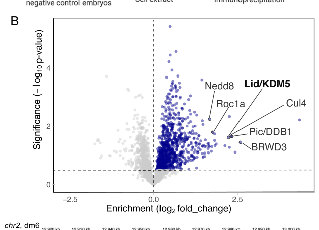

## Question

# Gene Research for Functional Annotation

## ⚠️ CRITICAL: Gene/Protein Identification Context

**BEFORE YOU BEGIN RESEARCH:** You MUST verify you are researching the CORRECT gene/protein. Gene symbols can be ambiguous, especially for less well-characterized genes from non-model organisms.

### Target Gene/Protein Identity (from UniProt):
- **UniProt Accession:** Q9W5E1
- **Protein Description:** RecName: Full=RING-box protein 1A; AltName: Full=Regulator of cullins 1a; AltName: Full=dRbx1;
- **Gene Information:** Name=Roc1a; ORFNames=CG16982;
- **Organism (full):** Drosophila melanogaster (Fruit fly).
- **Protein Family:** Belongs to the RING-box family. .
- **Key Domains:** RING-box_E3_Ubiquitin_Ligase. (IPR051031); Znf_RING. (IPR001841); Znf_RING/FYVE/PHD. (IPR013083); Znf_RING_H2. (IPR024766); zf-rbx1 (PF12678)

### MANDATORY VERIFICATION STEPS:

1. **Check if the gene symbol "Roc1a" matches the protein description above**
2. **Verify the organism is correct:** Drosophila melanogaster (Fruit fly).
3. **Check if protein family/domains align with what you find in literature**
4. **If you find literature for a DIFFERENT gene with the same or similar symbol, STOP**

### If Gene Symbol is Ambiguous or You Cannot Find Relevant Literature:

**DO NOT PROCEED WITH RESEARCH ON A DIFFERENT GENE.** Instead:
- State clearly: "The gene symbol 'Roc1a' is ambiguous or literature is limited for this specific protein"
- Explain what you found (e.g., "Found extensive literature on a different gene with the same symbol in a different organism")
- Describe the protein based ONLY on the UniProt information provided above
- Suggest that the protein function can be inferred from domain/family information

### Research Target:

Please provide a comprehensive research report on the gene **Roc1a** (gene ID: Roc1a, UniProt: Q9W5E1) in DROME.

The research report should be a detailed narrative explaining the function, biological processes, and localization of the gene product. Citations should be given for all claims.

You should prioritize authoritative reviews and primary scientific literature when conducting research. You can supplement
this with annotations you find in gene/protein databases, but these can be outdated or inaccurate.

We are specifically interested in the primary function of the gene - for enzymes, what reaction is catalyzed, and what is the substrate specificity? For transporters, what is the substrate? For structural proteins or adapters, what is the broader structural role? For signaling molecules, what is the role in the pathway.

We are interested in where in or outside the cell the gene product carries out its function.

We are also interested in the signaling or biochemical pathways in which the gene functions. We are less interested in broad pleiotropic effects, except where these elucidate the precise role.

Include evidence where possible. We are interested in both experimental evidence as well as inference from structure, evolution, or bioinformatic analysis. Precise studies should be prioritized over high-throughput, where available.

## Output

Question: You are an expert researcher providing comprehensive, well-cited information.

Provide detailed information focusing on:
1. Key concepts and definitions with current understanding
2. Recent developments and latest research (prioritize 2023-2024 sources)
3. Current applications and real-world implementations
4. Expert opinions and analysis from authoritative sources
5. Relevant statistics and data from recent studies

Format as a comprehensive research report with proper citations. Include URLs and publication dates where available.
Always prioritize recent, authoritative sources and provide specific citations for all major claims.

# Gene Research for Functional Annotation

## ⚠️ CRITICAL: Gene/Protein Identification Context

**BEFORE YOU BEGIN RESEARCH:** You MUST verify you are researching the CORRECT gene/protein. Gene symbols can be ambiguous, especially for less well-characterized genes from non-model organisms.

### Target Gene/Protein Identity (from UniProt):
- **UniProt Accession:** Q9W5E1
- **Protein Description:** RecName: Full=RING-box protein 1A; AltName: Full=Regulator of cullins 1a; AltName: Full=dRbx1;
- **Gene Information:** Name=Roc1a; ORFNames=CG16982;
- **Organism (full):** Drosophila melanogaster (Fruit fly).
- **Protein Family:** Belongs to the RING-box family. .
- **Key Domains:** RING-box_E3_Ubiquitin_Ligase. (IPR051031); Znf_RING. (IPR001841); Znf_RING/FYVE/PHD. (IPR013083); Znf_RING_H2. (IPR024766); zf-rbx1 (PF12678)

### MANDATORY VERIFICATION STEPS:

1. **Check if the gene symbol "Roc1a" matches the protein description above**
2. **Verify the organism is correct:** Drosophila melanogaster (Fruit fly).
3. **Check if protein family/domains align with what you find in literature**
4. **If you find literature for a DIFFERENT gene with the same or similar symbol, STOP**

### If Gene Symbol is Ambiguous or You Cannot Find Relevant Literature:

**DO NOT PROCEED WITH RESEARCH ON A DIFFERENT GENE.** Instead:
- State clearly: "The gene symbol 'Roc1a' is ambiguous or literature is limited for this specific protein"
- Explain what you found (e.g., "Found extensive literature on a different gene with the same symbol in a different organism")
- Describe the protein based ONLY on the UniProt information provided above
- Suggest that the protein function can be inferred from domain/family information

### Research Target:

Please provide a comprehensive research report on the gene **Roc1a** (gene ID: Roc1a, UniProt: Q9W5E1) in DROME.

The research report should be a detailed narrative explaining the function, biological processes, and localization of the gene product. Citations should be given for all claims.

You should prioritize authoritative reviews and primary scientific literature when conducting research. You can supplement
this with annotations you find in gene/protein databases, but these can be outdated or inaccurate.

We are specifically interested in the primary function of the gene - for enzymes, what reaction is catalyzed, and what is the substrate specificity? For transporters, what is the substrate? For structural proteins or adapters, what is the broader structural role? For signaling molecules, what is the role in the pathway.

We are interested in where in or outside the cell the gene product carries out its function.

We are also interested in the signaling or biochemical pathways in which the gene functions. We are less interested in broad pleiotropic effects, except where these elucidate the precise role.

Include evidence where possible. We are interested in both experimental evidence as well as inference from structure, evolution, or bioinformatic analysis. Precise studies should be prioritized over high-throughput, where available.

# Functional annotation of *Drosophila melanogaster* Roc1a

## Identity and principal function

**Identity check.** The supplied UniProt accession [Q9W5E1](https://www.uniprot.org/uniprotkb/Q9W5E1/entry) identifies the requested protein as *D. melanogaster* Roc1a, also designated CG16982, dRbx1, or RING-box protein 1A. Fly-specific experiments independently identify Roc1a as a RING-domain protein distinct from the paralogs Roc1b and Roc2; the papers examined do not themselves print Q9W5E1, so the accession-to-name mapping is taken from the UniProt information supplied in the question. The experimentally characterized protein family and RING architecture agree with the supplied domain annotations. **The report below concerns fly Roc1a, not Roc1b, fly Roc2, or mammalian ROC1/RBX1.** (reynolds2008identifyingdeterminantsof pages 2-4)

**Primary annotation:** Roc1a is the small, RING-containing ubiquitin-ligase subunit of several **cullin–RING ligases (CRLs)**. It is neither a transporter nor a stand-alone enzyme with one fixed protein substrate. A cullin scaffolds Roc1a opposite a substrate-recruitment module; Roc1a’s N-terminal region binds the cullin, while its zinc-binding RING domain engages a ubiquitin-charged E2 enzyme and facilitates ubiquitin transfer to a substrate positioned by the assembled CRL. Repeated ubiquitin transfer can generate chains associated with proteasomal destruction, although the chain type and fate depend on the complex and substrate. In Cullin1-containing SCF ligases, an F-box receptor such as Slimb or Skp2 supplies much of the *protein-substrate specificity*; Roc1a supplies the shared E2-facing ligase machinery rather than recognizing every target itself. (reynolds2008identifyingdeterminantsof pages 1-2, reynolds2008identifyingdeterminantsof pages 2-4)

The most discriminating direct interaction experiment immunoprecipitated tagged fly Roc proteins from transgenic embryos: **Roc1a associated with Cul1, Cul2, Cul3, and Cul4, but not detectably with Cul5**. Roc1b strongly preferred Cul3, whereas Roc2 associated with Cul5. Domain swaps showed that Roc1a’s N-terminal region is a major determinant of cullin choice, but its RING domain also matters: a chimera retaining Roc1a-like cullin binding and in-vitro ligase activity nevertheless failed to rescue lethal *roc1a* mutants. Thus, apparent biochemical activity does not establish physiological interchangeability. *roc1a* loss is lethal, further supporting an essential function that its paralogs do not fully replace. (reynolds2008identifyingdeterminantsof pages 2-4, reynolds2008identifyingdeterminantsof pages 1-2, reynolds2008identifyingdeterminantsof pages 7-8)

The following table separates **direct Roc1a interaction or loss-of-function evidence** from evidence identifying substrates of the larger complex. (reynolds2008identifyingdeterminantsof pages 2-4, han2023brwd3promoteskdm5 pages 3-4)

| Pathway/process | Complex and substrate | Direct Roc1a-specific evidence | Limits and key source |
|---|---|---|---|
| CRL assembly and paralog specificity | Roc1a–Cul1/2/3/4; comparison: Roc1b–Cul3 and Roc2–Cul5 | **Strong/direct:** FLAG-Roc co-IP from transgenic *D. melanogaster* embryos showed Roc1a binding Cul1–4 but not Cul5. Its N-terminal β-strand is the major Cullin-binding determinant; the RING domain contacts ubiquitin-charged E2 and also contributes to Cullin choice. (reynolds2008identifyingdeterminantsof pages 2-4, reynolds2008identifyingdeterminantsof pages 1-2) | Establishes CRL-core assembly, not substrate specificity. Substrate receptors—not Roc1a—generally select targets. Reynolds *et al.*, 2008; DOI: [10.1371/journal.pone.0002918](https://doi.org/10.1371/journal.pone.0002918). |
| Hedgehog signaling | SCF^Slimb (Cul1–SkpA–Slimb–Roc1a); phosphorylated Ci-155 → partially degraded Ci-75 repressor | **Moderate/combined:** Roc1a-mutant wing-disc cells accumulate Ci, and prior fly genetics assign Roc1a a unique role in Ci processing. Independently, Slimb RNAi, proteasome inhibition, or mutation of Ci phosphorylation sites blocks Ci-75 formation. (roberts2012definingcomponentsof pages 1-2, wang2008auniqueprotection pages 2-3, j.2008geneticandmolecular pages 43-48) | No isolated Roc1a–Ci binding or Roc1a-only ubiquitination assay; attribution comes from convergent CRL genetics and processing assays. Noureddine *et al.*, 2002; DOI: [10.1016/S1534-5807(02)00164-8](https://doi.org/10.1016/S1534-5807(02)00164-8). Wang & Price, 2008; DOI: [10.1128/MCB.00524-08](https://doi.org/10.1128/MCB.00524-08). |
| Wnt/Wingless signaling | SCF^Slimb; phosphorylated Armadillo/β-catenin | **Context-dependent:** two non-overlapping Roc1a dsRNAs increased Armadillo in S2 cells; Roc1b or Roc2 depletion did not. Cul1, SkpA/B and Slimb also scored. (roberts2012definingcomponentsof pages 5-8, roberts2012definingcomponentsof pages 4-5) | In vivo Roc1a RNAi was inconclusive and wing-disc mutant clones did not clearly accumulate Arm; tiny clones/proliferation arrest may confound interpretation. No direct Roc1a–Arm binding assay. Roberts *et al.*, 2012; DOI: [10.1371/journal.pone.0031284](https://doi.org/10.1371/journal.pone.0031284). |
| Centriole copy-number control | SCF^Slimb; Plk4/Sak kinase | **Moderate/pathway-level:** Roc1a, Cul1 or SkpA RNAi increased centriole number, placing Roc1a in the required SCF core. (rogers2009thescfslimbubiquitin pages 2-3) | Plk4 binds Slimb, and Slimb depletion causes structurally intact supernumerary centrioles, but direct Roc1a–Plk4 interaction or Roc1a-dependent Plk4 ubiquitination was not shown. (rogers2009thescfslimbubiquitin pages 3-4) Rogers *et al.*, 2009; DOI: [10.1083/jcb.200808049](https://doi.org/10.1083/jcb.200808049). |
| Developmental neuronal pruning and insulin signaling | Cul1–Roc1a–SkpA–Slimb; Akt | **Strong genetic, indirect catalytic:** roc1a-null neuronal clones and Roc1a knockdown impair axon/dendrite pruning; Cul1 loss raises Akt abundance and activity. Slimb binds Akt through its WD40 domain and promotes Akt polyubiquitylation; reducing Akt suppresses the pruning defect. (wong2013acullin1basedscf pages 3-5, wong2013acullin1basedscf pages 10-13, wong2013acullin1basedscf pages 8-9) | Akt recognition is demonstrated for Slimb, not Roc1a. The complex acts throughout neuronal soma, axons and dendrites, but this is inferred from SCF-component distribution rather than endogenous Roc1a imaging. Wong *et al.*, 2013; DOI: [10.1371/journal.pbio.1001657](https://doi.org/10.1371/journal.pbio.1001657). |
| Nuclear chromatin and H3K4 methylation | CRL4^BRWD3: Cul4–Pic/DDB1–BRWD3–Roc1A; KDM5/Lid | **Strong complex evidence; qualified substrate assignment:** 2023 embryo BRWD3-HA IP–quantitative MS significantly enriched Roc1A, Cul4, Pic/DDB1, Nedd8 and KDM5. BRWD3 overexpression enhanced K48-linked KDM5 polyubiquitylation; Cul4 inhibition stabilized KDM5. (han2023brwd3promoteskdm5 pages 3-4, han2023brwd3promoteskdm5 pages 4-5, han2023brwd3promoteskdm5 pages 5-6, han2023brwd3promoteskdm5 media 3ecc5b74) | Supports a nuclear/chromatin CRL4 containing Roc1A, but no purified Roc1A–KDM5 reaction was performed; authors could not conclude that BRWD3 directly targets KDM5, and other Cul4 receptors contribute. Han *et al.*, 2023; DOI: [10.1073/pnas.2305092120](https://doi.org/10.1073/pnas.2305092120). |
| Replication licensing in plasmatocytes | SCF^Skp2 (Lin19/Cul1–SkpA–Skp2–Roc1a); Dup/Cdt1 | **Moderate genetic association:** Roc1a knockdown is among SCF perturbations producing enlarged plasmatocytes; SCF loss causes nuclear Dup accumulation, excess DNA, multiple centrioles and rereplication-associated BrdU incorporation. (kroeger2013knockdownofscfskp2 pages 2-4, kroeger2013knockdownofscfskp2 pages 7-8) | Detailed localization experiments used Lin19/Cul1 perturbation, not Roc1a specifically. Dup can also be regulated by CRL4–PCNA–Cdt2, so substrate attribution to Roc1a–SCF^Skp2 is not exclusive; no direct Roc1a–Dup assay. Kroeger *et al.*, 2013; DOI: [10.1371/journal.pone.0079019](https://doi.org/10.1371/journal.pone.0079019). |

*Table: Evidence hierarchy for verified *Drosophila melanogaster* Roc1a/Q9W5E1 functions, separating direct Roc1a interaction or genetics from substrate-receptor evidence and pathway-level inference. Roc1a is the catalytic CRL RING subunit, whereas substrate specificity is primarily conferred by F-box or DCAF receptors.*

## Biological pathways and substrate evidence

**Hedgehog: Cubitus interruptus processing.** A particularly well-supported fly-specific role is participation in SCF-dependent processing of the Hedgehog transcriptional effector Cubitus interruptus (Ci): *roc1a*-mutant wing-disc cells accumulate Ci, and the original genetic study identified a distinctive requirement for Roc1a in this process. In a complementary cell assay, loss of the SCF receptor Slimb, disruption of Ci phosphorylation sites, or proteasome inhibition blocked conversion of approximately **155-kDa Ci to the approximately 75-kDa repressor**. These observations support a Roc1a-containing, Cul1/Slimb-dependent route for **partial proteasomal processing**, rather than a claim that Roc1a alone binds Ci or directly cleaves it. The original Roc1a study is Noureddine *et al.*, *Developmental Cell* (**June 2002**), [doi:10.1016/S1534-5807(02)00164-8](https://doi.org/10.1016/S1534-5807(02)00164-8); additional processing evidence is Wang and Price, *Molecular and Cellular Biology* (**September 2008**), [doi:10.1128/MCB.00524-08](https://doi.org/10.1128/MCB.00524-08). The 2002 article’s full text was not obtainable in this search, so its specific experimental details are described through later primary studies rather than represented as independently inspected results. (roberts2012definingcomponentsof pages 1-2, wang2008auniqueprotection pages 2-3, j.2008geneticandmolecular pages 43-48)

**Wingless/Wnt: Armadillo stability, with an important tissue qualification.** In cultured fly S2 cells, independent, nonoverlapping *roc1a* RNAi reagents increased Armadillo—the fly β-catenin protein—whereas depleting Roc1b or Roc2 did not. Cul1, SkpA/SkpB, and the F-box receptor Slimb also scored in the destruction pathway. Yet earlier *roc1a*-mutant wing-disc clones did **not** clearly accumulate Armadillo, and subsequent in-vivo Roc1a RNAi did not provide a decisive result; very small mutant clones and effects on proliferation complicate interpretation. The justified conclusion is **Roc1a-dependent Armadillo regulation in S2 cells**, not a universal, demonstrated requirement across all fly tissues. Roberts *et al.*, *PLoS ONE* (**February 2012**), [doi:10.1371/journal.pone.0031284](https://doi.org/10.1371/journal.pone.0031284). (roberts2012definingcomponentsof pages 5-8, roberts2012definingcomponentsof pages 4-5, roberts2012definingcomponentsof pages 14-14)

**Centriole number: Plk4/Sak turnover.** RNAi against Roc1a, Cul1, or SkpA increased centriole numbers in a fly-cell screen. Subsequent experiments linked the SCF–Slimb complex to degradation of the centriole-duplication kinase Plk4/Sak: Slimb associated with Plk4, and Slimb depletion produced bona fide supernumerary centrioles. Roc1a is therefore experimentally implicated as a **required SCF core component** in this pathway, while substrate recognition was demonstrated for Slimb rather than by a direct Roc1a–Plk4 binding experiment. Rogers *et al.*, *Journal of Cell Biology* (**January 2009**), [doi:10.1083/jcb.200808049](https://doi.org/10.1083/jcb.200808049). (rogers2009thescfslimbubiquitin pages 2-3, rogers2009thescfslimbubiquitin pages 3-4)

**Neuronal remodeling: restraint of Akt–PI3K–TOR signaling.** Null *roc1a* neuronal clones and Roc1a knockdown have defects in developmental axon or dendrite pruning. The implicated ligase comprises **Cul1–Roc1a–SkpA–Slimb**. Slimb physically associated with Akt through its substrate-binding WD40 region and promoted Akt polyubiquitylation; Cul1 depletion raised Akt abundance in pruning neurons, and reducing Akt activity suppressed an SCF-deficient pruning phenotype. In one quantified experiment, Cul1 depletion raised endogenous Akt staining in neuronal somata by approximately **2.8-fold**. This supplies a mechanistic link between the Roc1a-containing ligase and downregulation of insulin-receptor/PI3K/TOR signaling, although an isolated Roc1a-dependent Akt ubiquitination reaction was not shown. Wong *et al.*, *PLoS Biology* (**September 2013**), [doi:10.1371/journal.pbio.1001657](https://doi.org/10.1371/journal.pbio.1001657). (wong2013acullin1basedscf pages 3-5, wong2013acullin1basedscf pages 10-13, wong2013acullin1basedscf pages 8-9)

**Replication control: a less direct substrate assignment.** Roc1a depletion was among SCF perturbations that produced enlarged fly plasmatocytes. Work on the Cul1/Lin19–SkpA–Skp2 complex associated its disruption with nuclear accumulation of the replication-licensing protein Double-parked (**Dup**, fly Cdt1), excess DNA, additional centrioles, and rereplication-associated DNA synthesis. The most detailed Dup-localization experiments perturbed *lin19/Cul1*, **not Roc1a specifically**. Moreover, Cdt1/Dup can be regulated by a separate PCNA-associated CRL4 pathway. These data therefore establish a Roc1a-associated SCF phenotype but not exclusive, directly demonstrated Roc1a–Dup substrate recognition. Kroeger *et al.*, *PLoS ONE* (**October 2013**), [doi:10.1371/journal.pone.0079019](https://doi.org/10.1371/journal.pone.0079019). (kroeger2013knockdownofscfskp2 pages 2-4, kroeger2013knockdownofscfskp2 pages 7-8, higa2007stealingthespotlight pages 4-5)

## Where Roc1a acts: strongest recent evidence

Roc1a should **not** be assigned one exclusive subcellular address. Its established role is intracellular, as a subunit of CRLs assembled in different biological contexts. The clearest **2023–2024 mechanistic advance** comes from Han *et al.*: immunoprecipitation of endogenously tagged BRWD3 from **fly embryos**, followed by quantitative mass spectrometry, significantly enriched **Roc1A together with Cul4, Pic/DDB1, Nedd8, and KDM5/Lid**. Their Figure 2B displays the enriched complex components. BRWD3 is a chromatin-associated Cul4 substrate-recruitment factor; this is strong evidence that fly Roc1A participates in a **chromatin-related CRL4 complex**, although co-purification is not microscopy proving that every Roc1a molecule resides in the nucleus. (han2023brwd3promoteskdm5 pages 3-4, han2023brwd3promoteskdm5 media 3ecc5b74)

In S2 cells, BRWD3 promoted **K48-linked polyubiquitylation** of the H3K4 demethylase KDM5; proteasome inhibition stabilized KDM5, and Cul4 inhibition slowed its turnover more than BRWD3 depletion. The study estimated a KDM5 half-life of **less than approximately 30 minutes** under its control conditions. Codepleting KDM5 also restored the H3K4me3 defect caused by BRWD3 depletion, connecting the proposed CRL4 pathway to chromatin-mark regulation. Crucially, the authors **did not establish an isolated Roc1A–KDM5 catalytic reaction** and explicitly noted that direct targeting by BRWD3 had not been conclusively demonstrated; other Cul4-associated receptors may participate. Han *et al.*, *Proceedings of the National Academy of Sciences* (**September 2023**), [doi:10.1073/pnas.2305092120](https://doi.org/10.1073/pnas.2305092120). (han2023brwd3promoteskdm5 pages 5-6, han2023brwd3promoteskdm5 pages 3-4, han2023brwd3promoteskdm5 pages 4-5)

Outside that chromatin-related setting, the SCF–Slimb pathway acts on proteins in neuronal somata and processes, and Slimb itself has been observed at centrioles. **Neither observation alone is a direct localization measurement of endogenous Roc1a** at those structures. The defensible localization annotation is therefore *intracellular, in context-dependent cullin-ligase complexes*, with particularly strong biochemical evidence for a chromatin-associated Cul4 complex and functional evidence for Cul1-SCF activity in cultured cells and neurons. (rogers2009thescfslimbubiquitin pages 3-4, wong2013acullin1basedscf pages 10-13, han2023brwd3promoteskdm5 pages 3-4)

## Recent-source boundary and research use

A **2024** regeneration report mentioned a Roc1a-related transcript among downregulated proteostasis genes in regenerating gills of the mayfly *Cloeon*. This is **not a D. melanogaster Roc1a functional experiment** and should not be used to assign fly Roc1a a demonstrated regeneration role. Similarly, a **2023** fly muscle-inactivation study reported transcription-associated changes involving *Roc1a* but did not establish a new Roc1a biochemical substrate. The 2023 embryo proteomics study is substantially stronger evidence for this protein’s molecular annotation than either expression observation. Martin-Blanco *et al.*, *Open Biology* (**November 2024**), [doi:10.1098/rsob.240118](https://doi.org/10.1098/rsob.240118); Brener *et al.*, *Cells* (**September 2023**), [doi:10.3390/cells12192333](https://doi.org/10.3390/cells12192333). (martinblanco2024gillregenerationin pages 5-6, brener2023sedentarybehaviorimpacts pages 8-10, han2023brwd3promoteskdm5 pages 3-4)

**Bottom line.** Annotate Q9W5E1/Roc1a as the essential fly **cullin–RING E3-ligase RING subunit**, directly shown to associate with Cul1–4 and, most recently, detected within a BRWD3-associated Cul4 complex. Its best-supported physiological roles concern regulated protein ubiquitylation in Hedgehog/Ci processing, with context-dependent SCF functions in Armadillo stability, centriole control, neuronal Akt signaling, and replication control. Specify the **assembled CRL and its substrate receptor** when assigning a target: the evidence does not justify describing Roc1a itself as an enzyme uniquely specific for Ci, KDM5, Akt, or any one of these proteins. (reynolds2008identifyingdeterminantsof pages 2-4, roberts2012definingcomponentsof pages 1-2, han2023brwd3promoteskdm5 pages 3-4, wong2013acullin1basedscf pages 3-5)

References

1. (reynolds2008identifyingdeterminantsof pages 2-4): Patrick J. Reynolds, Jeffrey R. Simms, and Robert J. Duronio. Identifying determinants of cullin binding specificity among the three functionally different drosophila melanogaster roc proteins via domain swapping. PLoS ONE, 3:e2918, Aug 2008. URL: https://doi.org/10.1371/journal.pone.0002918, doi:10.1371/journal.pone.0002918. This article has 26 citations and is from a peer-reviewed journal.

2. (reynolds2008identifyingdeterminantsof pages 1-2): Patrick J. Reynolds, Jeffrey R. Simms, and Robert J. Duronio. Identifying determinants of cullin binding specificity among the three functionally different drosophila melanogaster roc proteins via domain swapping. PLoS ONE, 3:e2918, Aug 2008. URL: https://doi.org/10.1371/journal.pone.0002918, doi:10.1371/journal.pone.0002918. This article has 26 citations and is from a peer-reviewed journal.

3. (reynolds2008identifyingdeterminantsof pages 7-8): Patrick J. Reynolds, Jeffrey R. Simms, and Robert J. Duronio. Identifying determinants of cullin binding specificity among the three functionally different drosophila melanogaster roc proteins via domain swapping. PLoS ONE, 3:e2918, Aug 2008. URL: https://doi.org/10.1371/journal.pone.0002918, doi:10.1371/journal.pone.0002918. This article has 26 citations and is from a peer-reviewed journal.

4. (han2023brwd3promoteskdm5 pages 3-4): Dongsheng Han, Samantha H. Schaffner, Jonathan P. Davies, Mary Lauren Benton, Lars Plate, and Jared T. Nordman. Brwd3 promotes kdm5 degradation to maintain h3k4 methylation levels. Proceedings of the National Academy of Sciences of the United States of America, Sep 2023. URL: https://doi.org/10.1073/pnas.2305092120, doi:10.1073/pnas.2305092120. This article has 20 citations and is from a highest quality peer-reviewed journal.

5. (roberts2012definingcomponentsof pages 1-2): David M. Roberts, Mira I. Pronobis, Kelly M. Alexandre, Gregory C. Rogers, John S. Poulton, Daniel E. Schneider, Kuo-Chen Jung, Daniel J. McKay, and Mark Peifer. Defining components of the ßcatenin destruction complex and exploring its regulation and mechanisms of action during development. PLoS ONE, 7:e31284, Feb 2012. URL: https://doi.org/10.1371/journal.pone.0031284, doi:10.1371/journal.pone.0031284. This article has 24 citations and is from a peer-reviewed journal.

6. (wang2008auniqueprotection pages 2-3): Yifei Wang and Mary Ann Price. A unique protection signal in cubitus interruptus prevents its complete proteasomal degradation. Molecular and Cellular Biology, 28:5555-5568, Sep 2008. URL: https://doi.org/10.1128/mcb.00524-08, doi:10.1128/mcb.00524-08. This article has 32 citations and is from a domain leading peer-reviewed journal.

7. (j.2008geneticandmolecular pages 43-48): Patrick J. Reynolds. Genetic and molecular characterization of roc-cullin interactions in drosophila melanogaster e3 ubiquitin ligases. Text, 2008. URL: https://doi.org/10.17615/nrtf-ry58, doi:10.17615/nrtf-ry58. This article has 0 citations and is from a peer-reviewed journal.

8. (roberts2012definingcomponentsof pages 5-8): David M. Roberts, Mira I. Pronobis, Kelly M. Alexandre, Gregory C. Rogers, John S. Poulton, Daniel E. Schneider, Kuo-Chen Jung, Daniel J. McKay, and Mark Peifer. Defining components of the ßcatenin destruction complex and exploring its regulation and mechanisms of action during development. PLoS ONE, 7:e31284, Feb 2012. URL: https://doi.org/10.1371/journal.pone.0031284, doi:10.1371/journal.pone.0031284. This article has 24 citations and is from a peer-reviewed journal.

9. (roberts2012definingcomponentsof pages 4-5): David M. Roberts, Mira I. Pronobis, Kelly M. Alexandre, Gregory C. Rogers, John S. Poulton, Daniel E. Schneider, Kuo-Chen Jung, Daniel J. McKay, and Mark Peifer. Defining components of the ßcatenin destruction complex and exploring its regulation and mechanisms of action during development. PLoS ONE, 7:e31284, Feb 2012. URL: https://doi.org/10.1371/journal.pone.0031284, doi:10.1371/journal.pone.0031284. This article has 24 citations and is from a peer-reviewed journal.

10. (rogers2009thescfslimbubiquitin pages 2-3): Gregory C. Rogers, Nasser M. Rusan, David M. Roberts, Mark Peifer, and Stephen L. Rogers. The scfslimb ubiquitin ligase regulates plk4/sak levels to block centriole reduplication. The Journal of Cell Biology, 184:225-239, Jan 2009. URL: https://doi.org/10.1083/jcb.200808049, doi:10.1083/jcb.200808049. This article has 300 citations.

11. (rogers2009thescfslimbubiquitin pages 3-4): Gregory C. Rogers, Nasser M. Rusan, David M. Roberts, Mark Peifer, and Stephen L. Rogers. The scfslimb ubiquitin ligase regulates plk4/sak levels to block centriole reduplication. The Journal of Cell Biology, 184:225-239, Jan 2009. URL: https://doi.org/10.1083/jcb.200808049, doi:10.1083/jcb.200808049. This article has 300 citations.

12. (wong2013acullin1basedscf pages 3-5): Jack Jing Lin Wong, Song Li, Edwin Kok Hao Lim, Yan Wang, Cheng Wang, Heng Zhang, Daniel Kirilly, Chunlai Wu, Yih-Cherng Liou, Hongyan Wang, and Fengwei Yu. A cullin1-based scf e3 ubiquitin ligase targets the inr/pi3k/tor pathway to regulate neuronal pruning. PLoS Biology, 11:e1001657, Sep 2013. URL: https://doi.org/10.1371/journal.pbio.1001657, doi:10.1371/journal.pbio.1001657. This article has 107 citations and is from a highest quality peer-reviewed journal.

13. (wong2013acullin1basedscf pages 10-13): Jack Jing Lin Wong, Song Li, Edwin Kok Hao Lim, Yan Wang, Cheng Wang, Heng Zhang, Daniel Kirilly, Chunlai Wu, Yih-Cherng Liou, Hongyan Wang, and Fengwei Yu. A cullin1-based scf e3 ubiquitin ligase targets the inr/pi3k/tor pathway to regulate neuronal pruning. PLoS Biology, 11:e1001657, Sep 2013. URL: https://doi.org/10.1371/journal.pbio.1001657, doi:10.1371/journal.pbio.1001657. This article has 107 citations and is from a highest quality peer-reviewed journal.

14. (wong2013acullin1basedscf pages 8-9): Jack Jing Lin Wong, Song Li, Edwin Kok Hao Lim, Yan Wang, Cheng Wang, Heng Zhang, Daniel Kirilly, Chunlai Wu, Yih-Cherng Liou, Hongyan Wang, and Fengwei Yu. A cullin1-based scf e3 ubiquitin ligase targets the inr/pi3k/tor pathway to regulate neuronal pruning. PLoS Biology, 11:e1001657, Sep 2013. URL: https://doi.org/10.1371/journal.pbio.1001657, doi:10.1371/journal.pbio.1001657. This article has 107 citations and is from a highest quality peer-reviewed journal.

15. (han2023brwd3promoteskdm5 pages 4-5): Dongsheng Han, Samantha H. Schaffner, Jonathan P. Davies, Mary Lauren Benton, Lars Plate, and Jared T. Nordman. Brwd3 promotes kdm5 degradation to maintain h3k4 methylation levels. Proceedings of the National Academy of Sciences of the United States of America, Sep 2023. URL: https://doi.org/10.1073/pnas.2305092120, doi:10.1073/pnas.2305092120. This article has 20 citations and is from a highest quality peer-reviewed journal.

16. (han2023brwd3promoteskdm5 pages 5-6): Dongsheng Han, Samantha H. Schaffner, Jonathan P. Davies, Mary Lauren Benton, Lars Plate, and Jared T. Nordman. Brwd3 promotes kdm5 degradation to maintain h3k4 methylation levels. Proceedings of the National Academy of Sciences of the United States of America, Sep 2023. URL: https://doi.org/10.1073/pnas.2305092120, doi:10.1073/pnas.2305092120. This article has 20 citations and is from a highest quality peer-reviewed journal.

17. (han2023brwd3promoteskdm5 media 3ecc5b74): Dongsheng Han, Samantha H. Schaffner, Jonathan P. Davies, Mary Lauren Benton, Lars Plate, and Jared T. Nordman. Brwd3 promotes kdm5 degradation to maintain h3k4 methylation levels. Proceedings of the National Academy of Sciences of the United States of America, Sep 2023. URL: https://doi.org/10.1073/pnas.2305092120, doi:10.1073/pnas.2305092120. This article has 20 citations and is from a highest quality peer-reviewed journal.

18. (kroeger2013knockdownofscfskp2 pages 2-4): Paul T. Kroeger, Douglas A. Shoue, Frank M. Mezzacappa, Gary F. Gerlach, Rebecca A. Wingert, and Robert A. Schulz. Knockdown of scfskp2 function causes double-parked accumulation in the nucleus and dna re-replication in drosophila plasmatocytes. PLoS ONE, 8:e79019, Oct 2013. URL: https://doi.org/10.1371/journal.pone.0079019, doi:10.1371/journal.pone.0079019. This article has 9 citations and is from a peer-reviewed journal.

19. (kroeger2013knockdownofscfskp2 pages 7-8): Paul T. Kroeger, Douglas A. Shoue, Frank M. Mezzacappa, Gary F. Gerlach, Rebecca A. Wingert, and Robert A. Schulz. Knockdown of scfskp2 function causes double-parked accumulation in the nucleus and dna re-replication in drosophila plasmatocytes. PLoS ONE, 8:e79019, Oct 2013. URL: https://doi.org/10.1371/journal.pone.0079019, doi:10.1371/journal.pone.0079019. This article has 9 citations and is from a peer-reviewed journal.

20. (roberts2012definingcomponentsof pages 14-14): David M. Roberts, Mira I. Pronobis, Kelly M. Alexandre, Gregory C. Rogers, John S. Poulton, Daniel E. Schneider, Kuo-Chen Jung, Daniel J. McKay, and Mark Peifer. Defining components of the ßcatenin destruction complex and exploring its regulation and mechanisms of action during development. PLoS ONE, 7:e31284, Feb 2012. URL: https://doi.org/10.1371/journal.pone.0031284, doi:10.1371/journal.pone.0031284. This article has 24 citations and is from a peer-reviewed journal.

21. (higa2007stealingthespotlight pages 4-5): Leigh Higa and Hui Zhang. Stealing the spotlight: cul4-ddb1 ubiquitin ligase docks wd40-repeat proteins to destroy. Cell Division, 2:5-5, Feb 2007. URL: https://doi.org/10.1186/1747-1028-2-5, doi:10.1186/1747-1028-2-5. This article has 149 citations and is from a peer-reviewed journal.

22. (martinblanco2024gillregenerationin pages 5-6): Carlos A. Martin-Blanco, Pablo Navarro, José Esteban-Collado, Florenci Serras, Isabel Almudi, and Fernando Casares. Gill regeneration in the mayfly <i>cloeon</i> uncovers new molecular pathways in insect regeneration. Open Biology, Nov 2024. URL: https://doi.org/10.1098/rsob.240118, doi:10.1098/rsob.240118. This article has 2 citations and is from a peer-reviewed journal.

23. (brener2023sedentarybehaviorimpacts pages 8-10): Avivit Brener, Dana Lorber, Adriana Reuveny, Hila Toledano, Lilach Porat-Kuperstein, Yael Lebenthal, Eviatar Weizman, Tsviya Olender, and Talila Volk. Sedentary behavior impacts on the epigenome and transcriptome: lessons from muscle inactivation in drosophila larvae. Cells, 12:2333, Sep 2023. URL: https://doi.org/10.3390/cells12192333, doi:10.3390/cells12192333. This article has 2 citations.

## Artifacts

- [Edison artifact artifact-00](Roc1a-deep-research-falcon_artifacts/artifact-00.md)

## Citations

1. reynolds2008identifyingdeterminantsof pages 2-4
2. rogers2009thescfslimbubiquitin pages 2-3
3. rogers2009thescfslimbubiquitin pages 3-4
4. reynolds2008identifyingdeterminantsof pages 1-2
5. reynolds2008identifyingdeterminantsof pages 7-8
6. roberts2012definingcomponentsof pages 1-2
7. wang2008auniqueprotection pages 2-3
8. roberts2012definingcomponentsof pages 5-8
9. roberts2012definingcomponentsof pages 4-5
10. roberts2012definingcomponentsof pages 14-14
11. higa2007stealingthespotlight pages 4-5
12. martinblanco2024gillregenerationin pages 5-6
13. brener2023sedentarybehaviorimpacts pages 8-10
14. Q9W5E1
15. 10.1371/journal.pone.0002918
16. 10.1016/S1534-5807(02)00164-8
17. 10.1128/MCB.00524-08
18. 10.1371/journal.pone.0031284
19. 10.1083/jcb.200808049
20. 10.1371/journal.pbio.1001657
21. 10.1073/pnas.2305092120
22. 10.1371/journal.pone.0079019
23. doi:10.1016/S1534-5807(02)00164-8
24. doi:10.1128/MCB.00524-08
25. doi:10.1371/journal.pone.0031284
26. doi:10.1083/jcb.200808049
27. doi:10.1371/journal.pbio.1001657
28. doi:10.1371/journal.pone.0079019
29. doi:10.1073/pnas.2305092120
30. doi:10.1098/rsob.240118
31. doi:10.3390/cells12192333
32. https://www.uniprot.org/uniprotkb/Q9W5E1/entry
33. https://doi.org/10.1371/journal.pone.0002918
34. https://doi.org/10.1016/S1534-5807(02
35. https://doi.org/10.1128/MCB.00524-08
36. https://doi.org/10.1371/journal.pone.0031284
37. https://doi.org/10.1083/jcb.200808049
38. https://doi.org/10.1371/journal.pbio.1001657
39. https://doi.org/10.1073/pnas.2305092120
40. https://doi.org/10.1371/journal.pone.0079019
41. https://doi.org/10.1098/rsob.240118
42. https://doi.org/10.3390/cells12192333
43. https://doi.org/10.1371/journal.pone.0002918,
44. https://doi.org/10.1073/pnas.2305092120,
45. https://doi.org/10.1371/journal.pone.0031284,
46. https://doi.org/10.1128/mcb.00524-08,
47. https://doi.org/10.17615/nrtf-ry58,
48. https://doi.org/10.1083/jcb.200808049,
49. https://doi.org/10.1371/journal.pbio.1001657,
50. https://doi.org/10.1371/journal.pone.0079019,
51. https://doi.org/10.1186/1747-1028-2-5,
52. https://doi.org/10.1098/rsob.240118,
53. https://doi.org/10.3390/cells12192333,