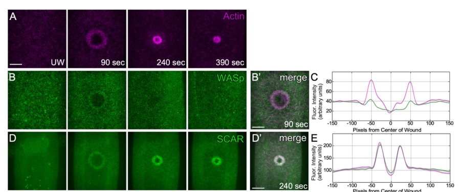

## Question

# Gene Research for Functional Annotation

## ⚠️ CRITICAL: Gene/Protein Identification Context

**BEFORE YOU BEGIN RESEARCH:** You MUST verify you are researching the CORRECT gene/protein. Gene symbols can be ambiguous, especially for less well-characterized genes from non-model organisms.

### Target Gene/Protein Identity (from UniProt):
- **UniProt Accession:** X2J5L4
- **Protein Description:** RecName: Full=Wiskott-Aldrich syndrome protein family member {ECO:0000256|RuleBase:RU367034}; Short=WASP family protein member {ECO:0000256|RuleBase:RU367034};
- **Gene Information:** Name=SCAR {ECO:0000313|EMBL:AHN54338.1, ECO:0000313|FlyBase:FBgn0041781}; Synonyms=BEST:SD02991 {ECO:0000313|EMBL:AHN54338.1}, D-SCAR {ECO:0000313|EMBL:AHN54338.1}, Dmel\CG4636 {ECO:0000313|EMBL:AHN54338.1}, DmSCAR {ECO:0000313|EMBL:AHN54338.1}, Dscar {ECO:0000313|EMBL:AHN54338.1}, DWave {ECO:0000313|EMBL:AHN54338.1}, dWAVE {ECO:0000313|EMBL:AHN54338.1}, l(2)k03107 {ECO:0000313|EMBL:AHN54338.1}, l(2)k13811 {ECO:0000313|EMBL:AHN54338.1}, Scar {ECO:0000313|EMBL:AHN54338.1}, scar {ECO:0000313|EMBL:AHN54338.1}, SCAR/WAVE {ECO:0000313|EMBL:AHN54338.1}, scar/wave {ECO:0000313|EMBL:AHN54338.1}, WAVE {ECO:0000313|EMBL:AHN54338.1}, Wave {ECO:0000313|EMBL:AHN54338.1}, wave {ECO:0000313|EMBL:AHN54338.1}, WAVE/SCAR {ECO:0000313|EMBL:AHN54338.1}; ORFNames=CG4636 {ECO:0000313|EMBL:AHN54338.1, ECO:0000313|FlyBase:FBgn0041781}, Dmel_CG4636 {ECO:0000313|EMBL:AHN54338.1};
- **Organism (full):** Drosophila melanogaster (Fruit fly).
- **Protein Family:** Belongs to the SCAR/WAVE family.
- **Key Domains:** SCAR/WAVE_fam. (IPR028288); WH2_dom. (IPR003124); SCAR_helical (PF27569)

### MANDATORY VERIFICATION STEPS:

1. **Check if the gene symbol "SCAR" matches the protein description above**
2. **Verify the organism is correct:** Drosophila melanogaster (Fruit fly).
3. **Check if protein family/domains align with what you find in literature**
4. **If you find literature for a DIFFERENT gene with the same or similar symbol, STOP**

### If Gene Symbol is Ambiguous or You Cannot Find Relevant Literature:

**DO NOT PROCEED WITH RESEARCH ON A DIFFERENT GENE.** Instead:
- State clearly: "The gene symbol 'SCAR' is ambiguous or literature is limited for this specific protein"
- Explain what you found (e.g., "Found extensive literature on a different gene with the same symbol in a different organism")
- Describe the protein based ONLY on the UniProt information provided above
- Suggest that the protein function can be inferred from domain/family information

### Research Target:

Please provide a comprehensive research report on the gene **SCAR** (gene ID: SCAR, UniProt: X2J5L4) in DROME.

The research report should be a detailed narrative explaining the function, biological processes, and localization of the gene product. Citations should be given for all claims.

You should prioritize authoritative reviews and primary scientific literature when conducting research. You can supplement
this with annotations you find in gene/protein databases, but these can be outdated or inaccurate.

We are specifically interested in the primary function of the gene - for enzymes, what reaction is catalyzed, and what is the substrate specificity? For transporters, what is the substrate? For structural proteins or adapters, what is the broader structural role? For signaling molecules, what is the role in the pathway.

We are interested in where in or outside the cell the gene product carries out its function.

We are also interested in the signaling or biochemical pathways in which the gene functions. We are less interested in broad pleiotropic effects, except where these elucidate the precise role.

Include evidence where possible. We are interested in both experimental evidence as well as inference from structure, evolution, or bioinformatic analysis. Precise studies should be prioritized over high-throughput, where available.

## Output

Question: You are an expert researcher providing comprehensive, well-cited information.

Provide detailed information focusing on:
1. Key concepts and definitions with current understanding
2. Recent developments and latest research (prioritize 2023-2024 sources)
3. Current applications and real-world implementations
4. Expert opinions and analysis from authoritative sources
5. Relevant statistics and data from recent studies

Format as a comprehensive research report with proper citations. Include URLs and publication dates where available.
Always prioritize recent, authoritative sources and provide specific citations for all major claims.

# Gene Research for Functional Annotation

## ⚠️ CRITICAL: Gene/Protein Identification Context

**BEFORE YOU BEGIN RESEARCH:** You MUST verify you are researching the CORRECT gene/protein. Gene symbols can be ambiguous, especially for less well-characterized genes from non-model organisms.

### Target Gene/Protein Identity (from UniProt):
- **UniProt Accession:** X2J5L4
- **Protein Description:** RecName: Full=Wiskott-Aldrich syndrome protein family member {ECO:0000256|RuleBase:RU367034}; Short=WASP family protein member {ECO:0000256|RuleBase:RU367034};
- **Gene Information:** Name=SCAR {ECO:0000313|EMBL:AHN54338.1, ECO:0000313|FlyBase:FBgn0041781}; Synonyms=BEST:SD02991 {ECO:0000313|EMBL:AHN54338.1}, D-SCAR {ECO:0000313|EMBL:AHN54338.1}, Dmel\CG4636 {ECO:0000313|EMBL:AHN54338.1}, DmSCAR {ECO:0000313|EMBL:AHN54338.1}, Dscar {ECO:0000313|EMBL:AHN54338.1}, DWave {ECO:0000313|EMBL:AHN54338.1}, dWAVE {ECO:0000313|EMBL:AHN54338.1}, l(2)k03107 {ECO:0000313|EMBL:AHN54338.1}, l(2)k13811 {ECO:0000313|EMBL:AHN54338.1}, Scar {ECO:0000313|EMBL:AHN54338.1}, scar {ECO:0000313|EMBL:AHN54338.1}, SCAR/WAVE {ECO:0000313|EMBL:AHN54338.1}, scar/wave {ECO:0000313|EMBL:AHN54338.1}, WAVE {ECO:0000313|EMBL:AHN54338.1}, Wave {ECO:0000313|EMBL:AHN54338.1}, wave {ECO:0000313|EMBL:AHN54338.1}, WAVE/SCAR {ECO:0000313|EMBL:AHN54338.1}; ORFNames=CG4636 {ECO:0000313|EMBL:AHN54338.1, ECO:0000313|FlyBase:FBgn0041781}, Dmel_CG4636 {ECO:0000313|EMBL:AHN54338.1};
- **Organism (full):** Drosophila melanogaster (Fruit fly).
- **Protein Family:** Belongs to the SCAR/WAVE family.
- **Key Domains:** SCAR/WAVE_fam. (IPR028288); WH2_dom. (IPR003124); SCAR_helical (PF27569)

### MANDATORY VERIFICATION STEPS:

1. **Check if the gene symbol "SCAR" matches the protein description above**
2. **Verify the organism is correct:** Drosophila melanogaster (Fruit fly).
3. **Check if protein family/domains align with what you find in literature**
4. **If you find literature for a DIFFERENT gene with the same or similar symbol, STOP**

### If Gene Symbol is Ambiguous or You Cannot Find Relevant Literature:

**DO NOT PROCEED WITH RESEARCH ON A DIFFERENT GENE.** Instead:
- State clearly: "The gene symbol 'SCAR' is ambiguous or literature is limited for this specific protein"
- Explain what you found (e.g., "Found extensive literature on a different gene with the same symbol in a different organism")
- Describe the protein based ONLY on the UniProt information provided above
- Suggest that the protein function can be inferred from domain/family information

### Research Target:

Please provide a comprehensive research report on the gene **SCAR** (gene ID: SCAR, UniProt: X2J5L4) in DROME.

The research report should be a detailed narrative explaining the function, biological processes, and localization of the gene product. Citations should be given for all claims.

You should prioritize authoritative reviews and primary scientific literature when conducting research. You can supplement
this with annotations you find in gene/protein databases, but these can be outdated or inaccurate.

We are specifically interested in the primary function of the gene - for enzymes, what reaction is catalyzed, and what is the substrate specificity? For transporters, what is the substrate? For structural proteins or adapters, what is the broader structural role? For signaling molecules, what is the role in the pathway.

We are interested in where in or outside the cell the gene product carries out its function.

We are also interested in the signaling or biochemical pathways in which the gene functions. We are less interested in broad pleiotropic effects, except where these elucidate the precise role.

Include evidence where possible. We are interested in both experimental evidence as well as inference from structure, evolution, or bioinformatic analysis. Precise studies should be prioritized over high-throughput, where available.

# Functional annotation of *Drosophila melanogaster* SCAR

**Identity check.** The target is the fruit-fly gene **SCAR**, also called *Scar*, *WAVE* or **CG4636**, rather than another organism’s SCAR gene or a mammalian WAVE paralog. The original fly characterization identifies CG4636 as the genome’s single Scar/WAVE-family homolog and describes an N-terminal SCAR homology region and a C-terminal actin/Arp2/3-interacting region. This agrees with the supplied UniProt X2J5L4 family assignment and WH2-domain annotation; the accession-to-sequence mapping itself was not independently verified against a UniProt record. Mammalian WAVE2 experiments, including those in a 2024 myoblast-fusion paper, are **not** treated here as direct evidence for fly SCAR. (zallen2002scarisa pages 1-2, zallen2002scarisa pages 2-5, lu2024spatiotemporalcoordinationof pages 3-4)

## Primary molecular function and pathway

**SCAR is an intracellular actin-nucleation–promoting factor, not an enzyme that itself polymerizes actin.** Its principal role is to stimulate the **Arp2/3 complex**, which nucleates new branches from existing actin filaments. The conserved C-terminal verprolin/WH2–central–acidic region, commonly termed **VCA** or **WA**, provides the family-level mechanism: association with globular actin and Arp2/3 promotes assembly of branched filamentous actin. The N-terminal SCAR/WAVE region contributes to regulation through the WAVE regulatory complex (WRC). This is a strong functional annotation supported by conserved domain architecture and fly genetics; the retrieved fly studies do **not** establish a SCAR-specific purified-protein binding constant, catalytic rate or narrower substrate preference among actin isoforms. (zallen2002scarisa pages 1-2, zallen2002scarisa pages 2-5, richardson2007scarwaveandarp23 pages 1-2, singh2023regulationofthe pages 5-8)

The fly WRC contains **SCAR, Abi, Kette/Nap1, Sra1 and HSPC300**. Its functions include stabilizing SCAR, positioning it at the cortex and regulating access of its VCA region to Arp2/3. In cultured fly cells, depletion of Abi, Kette or Sra1 routinely reduced SCAR protein by **more than 90%**; blocking proteasomal degradation partly restored protein abundance after Abi depletion but did not restore normal SCAR localization or protrusions. Thus, although sequestration of VCA can restrain activity, the complex is also *required for productive SCAR function in cells*—a distinction emphasized by experiments rather than an exclusively inhibitory-complex model. (stephan2011membranetargetedwavemediates pages 2-4, kunda2003abisra1and pages 3-5, kunda2003abisra1and pages 5-7, singh2023regulationofthe pages 5-8)

**Upstream signaling is context-dependent.** In spreading fly cells, combined Rac-family depletion resembles SCAR depletion, consistent with a Rac→WRC→SCAR→Arp2/3 route to cortical protrusions. Rac engages the regulatory complex through Sra1 rather than simply binding free SCAR; membrane recruitment and other inputs also matter. A 2023 expert review cautions that Rac engagement alone need not fully explain WRC activation and that the contribution of phosphoinositides differs between experimental systems. Accordingly, phosphoinositide-dependent activation should not be presented as universally established for this fly protein. (stephan2011membranetargetedwavemediates pages 2-4, kunda2003abisra1and pages 2-3, singh2023regulationofthe pages 5-8)

## Where SCAR acts and what it does there

SCAR acts **inside the cell**, principally at sites of membrane-associated, dynamic actin remodeling. Antibody staining places it with cortical F-actin in syncytial embryos and enriches it in embryonic central-nervous-system axons. In adherent Drosophila S2R cells it accumulates at the distal tips of growing broad and fine protrusions, rather than uniformly along mature actin bundles. These observations support a role in spatially directing new actin assembly, not a role as an extracellular structural protein. (zallen2002scarisa pages 1-2, zallen2002scarisa pages 2-5, kunda2003abisra1and pages 2-3, kunda2003abisra1and pages 3-5)

**Embryonic cortex.** Maternal SCAR loss disrupts interphase cortical actin caps and, more strikingly, mitotic actin furrows that separate neighboring nuclei. In one analysis, abnormal actin structures replaced metaphase furrows in **21/28** SCAR-mutant embryos; displaced cortical nuclei were found in **96% of cycle-14 SCAR-mutant embryos** (n=24), compared with **3% of wild type** (n=33). Arpc1 mutants produced related defects, whereas *Wsp* mutants retained normal nuclear organization and furrows. The tested maternal SCAR allele retained partial activity, so these frequencies should not be read as measurements of a molecular null. (zallen2002scarisa pages 2-5, zallen2002scarisa pages 5-6)

**Protrusions and neurons.** SCAR RNAi prevents cultured S2R cells from making substantial new protrusions during spreading; depletion of Arp2/3 components produces a similar morphology, while WASp RNAi has little discernible effect in that assay. In the developing nervous system, SCAR is enriched in axons and contributes to axonal architecture. A particularly informative localization test showed that **membrane-tethered WAVE/SCAR**, unlike predominantly cytoplasmic WAVE, substantially rescued photoreceptor-targeting defects after loss of Abi, even without an intact WRC. This supports membrane deployment and downstream Arp2/3 activation as essential aspects of its neuronal function. (kunda2003abisra1and pages 1-2, kunda2003abisra1and pages 2-3, stephan2011membranetargetedwavemediates pages 1-2, stephan2011membranetargetedwavemediates pages 2-4)

**Myoblast contact sites.** Fly myoblasts build a transient F-actin focus at their fusion interface. Reducing maternal and zygotic SCAR, or impairing Arp2/3, blocks fusion and leaves abnormally persistent actin foci. The precise inference is that SCAR-dependent remodeling helps the focus progress or dissolve during fusion—not that SCAR alone initiates every filament in the focus. Kette also regulates SCAR abundance and its coordination with WASp in this setting. (richardson2007scarwaveandarp23 pages 1-2, hamp2016drosophilakettecoordinates pages 6-8, richardson2007scarwaveandarp23 pages 8-9)

The following evidence summary separates experimental observations from mechanistic interpretation. (zallen2002scarisa pages 2-5, kunda2003abisra1and pages 3-5, richardson2007scarwaveandarp23 pages 8-9, stephan2011membranetargetedwavemediates pages 2-4, nakamura2023scarwavehasrac pages 3-4)

| Setting and publication year | Directly observed SCAR-specific finding | Causal interpretation / qualification | DOI URL |
|---|---|---|---|
| Syncytial blastoderm, 2002 | Internal displacement of cortical nuclei occurred in 96% of cycle-14 maternal-SCAR mutant embryos (n=24), versus 3% of wild type (n=33). SCAR mutants also had smaller cortical actin caps and frequently lacked metaphase actin furrows. (zallen2002scarisa pages 2-5, zallen2002scarisa pages 5-6) | Phenocopy by *Arpc1* mutants and normal organization in *Wsp* mutants support a specific SCAR–Arp2/3 role in cortical F-actin organization. The analyzed SCAR allele retained partial activity, so this may underestimate a null phenotype. | [10.1083/jcb.200109057](https://doi.org/10.1083/jcb.200109057) |
| Cultured S2R cells, 2003 | RNAi against Abi, Kette, or Sra1 reduced SCAR protein by routinely >90%; proteasome inhibition partially restored SCAR after Abi depletion but did not restore its localization or normal protrusions. SCAR localized to growing protrusion tips. (kunda2003abisra1and pages 3-5, kunda2003abisra1and pages 2-3) | The WAVE regulatory complex both protects SCAR from proteasomal degradation and targets it spatially; it is therefore functionally enabling in cells, not merely inhibitory. These were cellular assays, not purified-fly-SCAR binding measurements. | [10.1016/j.cub.2003.10.005](https://doi.org/10.1016/j.cub.2003.10.005) |
| Embryonic myoblast fusion, 2007 | Maternal-plus-zygotic reduction of SCAR caused a fusion block and enlarged, persistent F-actin foci at myoblast contact sites; comparable defects followed reduced Arp3. (richardson2007scarwaveandarp23 pages 1-2, richardson2007scarwaveandarp23 pages 8-9) | SCAR–Arp2/3 activity is required to remodel or dissolve the fusion-site actin focus, rather than simply to initiate the focus, because F-actin accumulations persisted after SCAR reduction. | [10.1242/dev.010678](https://doi.org/10.1242/dev.010678) |
| Photoreceptor axon targeting, 2011 | Membrane-tethered WAVE/SCAR rescued *abi*-mutant photoreceptor-targeting defects without the intact WAVE complex, whereas cytoplasmic WAVE had little effect. (stephan2011membranetargetedwavemediates pages 1-2, stephan2011membranetargetedwavemediates pages 2-4) | Membrane recruitment is a decisive activation/localization input and can bypass WRC-dependent targeting; rescue was attributed to Arp2/3 activation. | [10.1091/mbc.e11-02-0121](https://doi.org/10.1091/mbc.e11-02-0121) |
| Laser-wounded syncytial embryos, 2023 | GFP-SCAR appeared at the wound edge about 33 ± 3 s after injury, before Rac1 (~60 s) and Rac2 (~78 s), and persisted during Rac inhibition. Control versus SCAR-RNAi wounds expanded 1.74 ± 0.02-fold versus 2.45 ± 0.11-fold; actin-ring width fell from 5.34 to 3.43 µm. (nakamura2023scarwavehasrac pages 4-6, nakamura2023scarwavehasrac pages 3-4) | SCAR organizes and stabilizes the wound-edge actomyosin scaffold and can be recruited independently of Rac. SCAR depletion nevertheless increased contraction rate, showing that denser ring organization and faster area closure are not equivalent outcomes. | [10.1038/s41598-023-31973-2](https://doi.org/10.1038/s41598-023-31973-2) |

*Table: Direct genetic, imaging, RNAi, and rescue evidence for Drosophila melanogaster SCAR/CG4636 across cortical organization, protrusion formation, myoblast fusion, axon targeting, and cell-wound repair. The table separates observations from mechanistic interpretation and avoids extrapolating purified-protein measurements from non-fly systems.*

## Recent fly-specific findings: wound-edge actin, 2023

Laser-wounding experiments add a distinct physiological context: **SCAR accumulates around a damaged embryo’s cortical wound**, overlapping the repair-associated actin ring. One 2023 study measured SCAR arrival at approximately **33 ± 3 seconds**, ahead of Rac1 at about **60 seconds** and Rac2 at about **78 seconds**; SCAR still accumulated when Rac activity was inhibited. This demonstrates that **recruitment in this setting is not obligatorily downstream of Rac**, rather than disproving Rac-dependent SCAR activation in other settings. An independent 2023 study detected initial SCAR recruitment at about **45 seconds** and peak accumulation at about **240 seconds**; its different onset estimate should not be collapsed into a single universal time point. Its *Figure 4* shows the GFP-SCAR wound-edge distribution and recruitment comparison with WASp. (nakamura2023scarwavehasrac pages 3-4, hui2023coordinatedeffortsof pages 4-6, hui2023coordinatedeffortsof media 5cae90a2, hui2023coordinatedeffortsof media 6e0fdb22)

With SCAR RNAi, wounds expanded **2.45 ± 0.11-fold**, versus **1.74 ± 0.02-fold** in controls; actin-ring width decreased from **5.34 to 3.43 μm**. The wound-associated actomyosin ring became less well organized and less stably associated with the overlying membrane. Notably, measured contraction was **faster**, not slower, after SCAR depletion (**9.12 ± 0.62 versus 7.15 ± 0.25 μm²/s** in controls): SCAR therefore improves *ring architecture and resistance to wound expansion*, but faster area contraction is not itself proof of better repair. The upstream Rac-independent recruitment mechanism and any additional biochemical anchoring partners remain unresolved. (nakamura2023scarwavehasrac pages 4-6, nakamura2023scarwavehasrac pages 3-4, nakamura2023scarwavehasrac pages 6-7)

These studies use fly embryos, fluorescent reporters, RNAi and laser wounds to investigate cytoskeletal control; together with S2R culture, genetic mosaics and axon-targeting rescue, they are **research applications and model-system implementations**, not evidence of a clinical implementation of fly SCAR. The most directly applicable recent fly-specific primary evidence retrieved was published in **2023**. A relevant **2024** study instead experimentally investigates mammalian WAVE2, so its results cannot be assigned to CG4636; a potentially relevant 2024 fly CYRI paper could not be examined sufficiently to substantiate additional SCAR-specific claims. (nakamura2023scarwavehasrac pages 1-3, hui2023coordinatedeffortsof pages 4-6, lu2024spatiotemporalcoordinationof pages 3-4)

## Assessment and source guide

The **high-confidence annotation** is that SCAR/CG4636 is a WRC-associated, spatially regulated **Arp2/3 nucleation-promoting factor for intracellular branched-actin organization**, acting at the cortex, protrusive membrane, axons, myoblast contacts and wound edge. This rests on convergent fly localization, genetics, knockdown and rescue experiments. The specific biochemical contacts of the supplied X2J5L4 isoform are supported here mainly by conserved family/domain information rather than an isoform-resolved fly binding assay; Rac independence is demonstrated for **wound recruitment**, not for every biochemical output of SCAR. (zallen2002scarisa pages 1-2, stephan2011membranetargetedwavemediates pages 2-4, kunda2003abisra1and pages 5-7, nakamura2023scarwavehasrac pages 3-4)

**Selected sources, with publication dates and URLs:** Zallen *et al.*, *Journal of Cell Biology*, **18 February 2002**, https://doi.org/10.1083/jcb.200109057; Kunda *et al.*, *Current Biology*, **28 October 2003**, https://doi.org/10.1016/j.cub.2003.10.005; Richardson *et al.*, *Development*, **December 2007**, https://doi.org/10.1242/dev.010678; Stephan *et al.*, *Molecular Biology of the Cell*, **November 2011**, https://doi.org/10.1091/mbc.e11-02-0121. (zallen2002scarisa pages 1-2, kunda2003abisra1and pages 1-2, richardson2007scarwaveandarp23 pages 1-2, stephan2011membranetargetedwavemediates pages 1-2)

For current context: Hui *et al.*, *Molecular Biology of the Cell*, **1 March 2023**, https://doi.org/10.1091/mbc.e22-05-0155; Nakamura *et al.*, *Scientific Reports*, **March 2023**, https://doi.org/10.1038/s41598-023-31973-2; Singh, *Journal of Biosciences* review, **2023**, https://doi.org/10.1007/s12038-023-00341-7. (hui2023coordinatedeffortsof pages 1-2, nakamura2023scarwavehasrac pages 1-3, singh2023regulationofthe pages 1-5)

References

1. (zallen2002scarisa pages 1-2): Jennifer A. Zallen, Yehudit Cohen, Andrew M. Hudson, Lynn Cooley, Eric Wieschaus, and Eyal D. Schejter. Scar is a primary regulator of arp2/3-dependent morphological events in drosophila. The Journal of Cell Biology, 156:689-701, Feb 2002. URL: https://doi.org/10.1083/jcb.200109057, doi:10.1083/jcb.200109057. This article has 332 citations.

2. (zallen2002scarisa pages 2-5): Jennifer A. Zallen, Yehudit Cohen, Andrew M. Hudson, Lynn Cooley, Eric Wieschaus, and Eyal D. Schejter. Scar is a primary regulator of arp2/3-dependent morphological events in drosophila. The Journal of Cell Biology, 156:689-701, Feb 2002. URL: https://doi.org/10.1083/jcb.200109057, doi:10.1083/jcb.200109057. This article has 332 citations.

3. (lu2024spatiotemporalcoordinationof pages 3-4): Yue Lu, Tezin Walji, Benjamin Ravaux, Pratima Pandey, Changsong Yang, Bing Li, Delgermaa Luvsanjav, Kevin H. Lam, Ruihui Zhang, Zhou Luo, Chuanli Zhou, Christa W. Habela, Scott B. Snapper, Rong Li, David J. Goldhamer, David W. Schmidtke, Duojia Pan, Tatyana M. Svitkina, and Elizabeth H. Chen. Spatiotemporal coordination of actin regulators generates invasive protrusions in cell–cell fusion. Nature Cell Biology, 26:1860-1877, Nov 2024. URL: https://doi.org/10.1038/s41556-024-01541-5, doi:10.1038/s41556-024-01541-5. This article has 24 citations and is from a highest quality peer-reviewed journal.

4. (richardson2007scarwaveandarp23 pages 1-2): Brian E. Richardson, Karen Beckett, Scott J. Nowak, and Mary K. Baylies. Scar/wave and arp2/3 are crucial for cytoskeletal remodeling at the site of myoblast fusion. Development, 134:4357-4367, Dec 2007. URL: https://doi.org/10.1242/dev.010678, doi:10.1242/dev.010678. This article has 173 citations and is from a domain leading peer-reviewed journal.

5. (singh2023regulationofthe pages 5-8): Shashi Prakash Singh. Regulation of the scar/wave complex in migrating cells: a summary of our understanding. Journal of Biosciences, 48:1-14, May 2023. URL: https://doi.org/10.1007/s12038-023-00341-7, doi:10.1007/s12038-023-00341-7. This article has 6 citations and is from a peer-reviewed journal.

6. (stephan2011membranetargetedwavemediates pages 2-4): Raiko Stephan, Christina Gohl, Astrid Fleige, Christian Klämbt, and Sven Bogdan. Membrane-targeted wave mediates photoreceptor axon targeting in the absence of the wave complex in drosophila. Molecular Biology of the Cell, 22:4079-4092, Nov 2011. URL: https://doi.org/10.1091/mbc.e11-02-0121, doi:10.1091/mbc.e11-02-0121. This article has 28 citations and is from a domain leading peer-reviewed journal.

7. (kunda2003abisra1and pages 3-5): Patricia Kunda, Gavin Craig, Veronica Dominguez, and Buzz Baum. Abi, sra1, and kette control the stability and localization of scar/wave to regulate the formation of actin-based protrusions. Current Biology, 13:1867-1875, Oct 2003. URL: https://doi.org/10.1016/j.cub.2003.10.005, doi:10.1016/j.cub.2003.10.005. This article has 425 citations and is from a highest quality peer-reviewed journal.

8. (kunda2003abisra1and pages 5-7): Patricia Kunda, Gavin Craig, Veronica Dominguez, and Buzz Baum. Abi, sra1, and kette control the stability and localization of scar/wave to regulate the formation of actin-based protrusions. Current Biology, 13:1867-1875, Oct 2003. URL: https://doi.org/10.1016/j.cub.2003.10.005, doi:10.1016/j.cub.2003.10.005. This article has 425 citations and is from a highest quality peer-reviewed journal.

9. (kunda2003abisra1and pages 2-3): Patricia Kunda, Gavin Craig, Veronica Dominguez, and Buzz Baum. Abi, sra1, and kette control the stability and localization of scar/wave to regulate the formation of actin-based protrusions. Current Biology, 13:1867-1875, Oct 2003. URL: https://doi.org/10.1016/j.cub.2003.10.005, doi:10.1016/j.cub.2003.10.005. This article has 425 citations and is from a highest quality peer-reviewed journal.

10. (zallen2002scarisa pages 5-6): Jennifer A. Zallen, Yehudit Cohen, Andrew M. Hudson, Lynn Cooley, Eric Wieschaus, and Eyal D. Schejter. Scar is a primary regulator of arp2/3-dependent morphological events in drosophila. The Journal of Cell Biology, 156:689-701, Feb 2002. URL: https://doi.org/10.1083/jcb.200109057, doi:10.1083/jcb.200109057. This article has 332 citations.

11. (kunda2003abisra1and pages 1-2): Patricia Kunda, Gavin Craig, Veronica Dominguez, and Buzz Baum. Abi, sra1, and kette control the stability and localization of scar/wave to regulate the formation of actin-based protrusions. Current Biology, 13:1867-1875, Oct 2003. URL: https://doi.org/10.1016/j.cub.2003.10.005, doi:10.1016/j.cub.2003.10.005. This article has 425 citations and is from a highest quality peer-reviewed journal.

12. (stephan2011membranetargetedwavemediates pages 1-2): Raiko Stephan, Christina Gohl, Astrid Fleige, Christian Klämbt, and Sven Bogdan. Membrane-targeted wave mediates photoreceptor axon targeting in the absence of the wave complex in drosophila. Molecular Biology of the Cell, 22:4079-4092, Nov 2011. URL: https://doi.org/10.1091/mbc.e11-02-0121, doi:10.1091/mbc.e11-02-0121. This article has 28 citations and is from a domain leading peer-reviewed journal.

13. (hamp2016drosophilakettecoordinates pages 6-8): Julia Hamp, Andreas Löwer, Christine Dottermusch-Heidel, Lothar Beck, Bernard Moussian, Matthias Flötenmeyer, and Susanne-Filiz Önel. Drosophila kette coordinates myoblast junction dissolution and the ratio of scar-to-wasp during myoblast fusion. Journal of Cell Science, 129:3426-3436, Sep 2016. URL: https://doi.org/10.1242/jcs.175638, doi:10.1242/jcs.175638. This article has 16 citations and is from a domain leading peer-reviewed journal.

14. (richardson2007scarwaveandarp23 pages 8-9): Brian E. Richardson, Karen Beckett, Scott J. Nowak, and Mary K. Baylies. Scar/wave and arp2/3 are crucial for cytoskeletal remodeling at the site of myoblast fusion. Development, 134:4357-4367, Dec 2007. URL: https://doi.org/10.1242/dev.010678, doi:10.1242/dev.010678. This article has 173 citations and is from a domain leading peer-reviewed journal.

15. (nakamura2023scarwavehasrac pages 3-4): Mitsutoshi Nakamura, Justin Hui, Viktor Stjepić, and Susan M. Parkhurst. Scar/wave has rac gtpase-independent functions during cell wound repair. Scientific Reports, Mar 2023. URL: https://doi.org/10.1038/s41598-023-31973-2, doi:10.1038/s41598-023-31973-2. This article has 9 citations and is from a peer-reviewed journal.

16. (nakamura2023scarwavehasrac pages 4-6): Mitsutoshi Nakamura, Justin Hui, Viktor Stjepić, and Susan M. Parkhurst. Scar/wave has rac gtpase-independent functions during cell wound repair. Scientific Reports, Mar 2023. URL: https://doi.org/10.1038/s41598-023-31973-2, doi:10.1038/s41598-023-31973-2. This article has 9 citations and is from a peer-reviewed journal.

17. (hui2023coordinatedeffortsof pages 4-6): Justin Hui, Mitsutoshi Nakamura, Julien Dubrulle, and Susan M. Parkhurst. Coordinated efforts of different actin filament populations are needed for optimal cell wound repair. Molecular Biology of the Cell, Mar 2023. URL: https://doi.org/10.1091/mbc.e22-05-0155, doi:10.1091/mbc.e22-05-0155. This article has 22 citations and is from a domain leading peer-reviewed journal.

18. (hui2023coordinatedeffortsof media 5cae90a2): Justin Hui, Mitsutoshi Nakamura, Julien Dubrulle, and Susan M. Parkhurst. Coordinated efforts of different actin filament populations are needed for optimal cell wound repair. Molecular Biology of the Cell, Mar 2023. URL: https://doi.org/10.1091/mbc.e22-05-0155, doi:10.1091/mbc.e22-05-0155. This article has 22 citations and is from a domain leading peer-reviewed journal.

19. (hui2023coordinatedeffortsof media 6e0fdb22): Justin Hui, Mitsutoshi Nakamura, Julien Dubrulle, and Susan M. Parkhurst. Coordinated efforts of different actin filament populations are needed for optimal cell wound repair. Molecular Biology of the Cell, Mar 2023. URL: https://doi.org/10.1091/mbc.e22-05-0155, doi:10.1091/mbc.e22-05-0155. This article has 22 citations and is from a domain leading peer-reviewed journal.

20. (nakamura2023scarwavehasrac pages 6-7): Mitsutoshi Nakamura, Justin Hui, Viktor Stjepić, and Susan M. Parkhurst. Scar/wave has rac gtpase-independent functions during cell wound repair. Scientific Reports, Mar 2023. URL: https://doi.org/10.1038/s41598-023-31973-2, doi:10.1038/s41598-023-31973-2. This article has 9 citations and is from a peer-reviewed journal.

21. (nakamura2023scarwavehasrac pages 1-3): Mitsutoshi Nakamura, Justin Hui, Viktor Stjepić, and Susan M. Parkhurst. Scar/wave has rac gtpase-independent functions during cell wound repair. Scientific Reports, Mar 2023. URL: https://doi.org/10.1038/s41598-023-31973-2, doi:10.1038/s41598-023-31973-2. This article has 9 citations and is from a peer-reviewed journal.

22. (hui2023coordinatedeffortsof pages 1-2): Justin Hui, Mitsutoshi Nakamura, Julien Dubrulle, and Susan M. Parkhurst. Coordinated efforts of different actin filament populations are needed for optimal cell wound repair. Molecular Biology of the Cell, Mar 2023. URL: https://doi.org/10.1091/mbc.e22-05-0155, doi:10.1091/mbc.e22-05-0155. This article has 22 citations and is from a domain leading peer-reviewed journal.

23. (singh2023regulationofthe pages 1-5): Shashi Prakash Singh. Regulation of the scar/wave complex in migrating cells: a summary of our understanding. Journal of Biosciences, 48:1-14, May 2023. URL: https://doi.org/10.1007/s12038-023-00341-7, doi:10.1007/s12038-023-00341-7. This article has 6 citations and is from a peer-reviewed journal.

## Artifacts

- [Edison artifact artifact-00](SCAR-deep-research-falcon_artifacts/artifact-00.md)

## Citations

1. zallen2002scarisa pages 1-2
2. zallen2002scarisa pages 2-5
3. lu2024spatiotemporalcoordinationof pages 3-4
4. singh2023regulationofthe pages 5-8
5. stephan2011membranetargetedwavemediates pages 2-4
6. zallen2002scarisa pages 5-6
7. stephan2011membranetargetedwavemediates pages 1-2
8. hamp2016drosophilakettecoordinates pages 6-8
9. nakamura2023scarwavehasrac pages 3-4
10. nakamura2023scarwavehasrac pages 4-6
11. hui2023coordinatedeffortsof pages 4-6
12. nakamura2023scarwavehasrac pages 6-7
13. nakamura2023scarwavehasrac pages 1-3
14. hui2023coordinatedeffortsof pages 1-2
15. singh2023regulationofthe pages 1-5
16. 10.1083/jcb.200109057
17. 10.1016/j.cub.2003.10.005
18. 10.1242/dev.010678
19. 10.1091/mbc.e11-02-0121
20. 10.1038/s41598-023-31973-2
21. https://doi.org/10.1083/jcb.200109057
22. https://doi.org/10.1016/j.cub.2003.10.005
23. https://doi.org/10.1242/dev.010678
24. https://doi.org/10.1091/mbc.e11-02-0121
25. https://doi.org/10.1038/s41598-023-31973-2
26. https://doi.org/10.1083/jcb.200109057;
27. https://doi.org/10.1016/j.cub.2003.10.005;
28. https://doi.org/10.1242/dev.010678;
29. https://doi.org/10.1091/mbc.e11-02-0121.
30. https://doi.org/10.1091/mbc.e22-05-0155;
31. https://doi.org/10.1038/s41598-023-31973-2;
32. https://doi.org/10.1007/s12038-023-00341-7.
33. https://doi.org/10.1083/jcb.200109057,
34. https://doi.org/10.1038/s41556-024-01541-5,
35. https://doi.org/10.1242/dev.010678,
36. https://doi.org/10.1007/s12038-023-00341-7,
37. https://doi.org/10.1091/mbc.e11-02-0121,
38. https://doi.org/10.1016/j.cub.2003.10.005,
39. https://doi.org/10.1242/jcs.175638,
40. https://doi.org/10.1038/s41598-023-31973-2,
41. https://doi.org/10.1091/mbc.e22-05-0155,