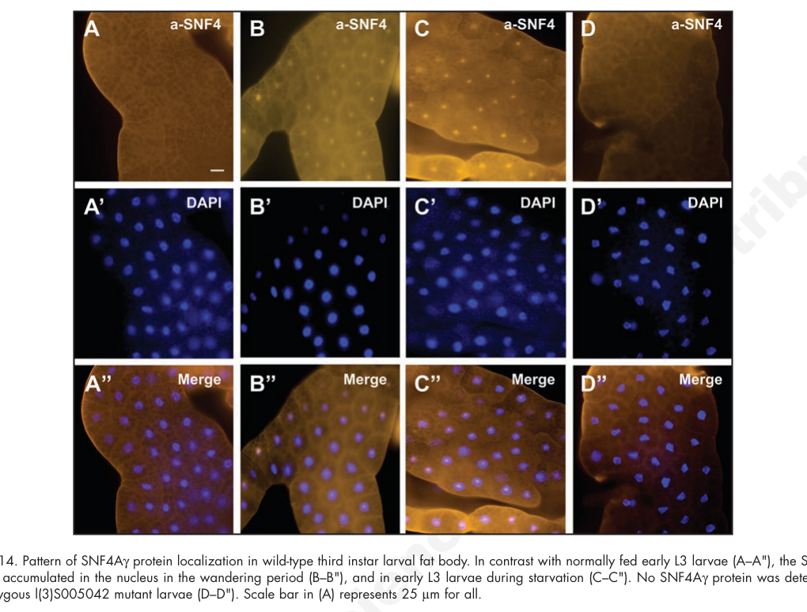

## Question

# Gene Research for Functional Annotation

## ⚠️ CRITICAL: Gene/Protein Identification Context

**BEFORE YOU BEGIN RESEARCH:** You MUST verify you are researching the CORRECT gene/protein. Gene symbols can be ambiguous, especially for less well-characterized genes from non-model organisms.

### Target Gene/Protein Identity (from UniProt):
- **UniProt Accession:** Q9VDD2
- **Protein Description:** SubName: Full=SNF4/AMP-activated protein kinase gamma subunit, isoform F {ECO:0000313|EMBL:AAF55864.2}; SubName: Full=SNF4/AMP-activated protein kinase gamma subunit, isoform R {ECO:0000313|EMBL:ACZ94967.1}; SubName: Full=SNF4/AMP-activated protein kinase gamma subunit, isoform S {ECO:0000313|EMBL:ACZ94968.1};
- **Gene Information:** Name=SNF4Agamma {ECO:0000313|EMBL:AAF55864.2, ECO:0000313|FlyBase:FBgn0264357}; Synonyms=0050/42 {ECO:0000313|EMBL:AAF55864.2}, 0127/19 {ECO:0000313|EMBL:AAF55864.2}, AMPgamma {ECO:0000313|EMBL:AAF55864.2}, AMPK {ECO:0000313|EMBL:AAF55864.2}, AMPK-gamma {ECO:0000313|EMBL:AAF55864.2}, AMPKgamma {ECO:0000313|EMBL:AAF55864.2}, anon-WO0118547.338 {ECO:0000313|EMBL:AAF55864.2}, anon-WO0118547.575 {ECO:0000313|EMBL:AAF55864.2}, anon-WO0257455.21 {ECO:0000313|EMBL:AAF55864.2}, CG5806 {ECO:0000313|EMBL:AAF55864.2}, Dmel\CG17299 {ECO:0000313|EMBL:AAF55864.2}, EP3015b {ECO:0000313|EMBL:AAF55864.2}, FBgn0025803 {ECO:0000313|EMBL:AAF55864.2}, l(3)S005042 {ECO:0000313|EMBL:AAF55864.2}, l(3)S012719 {ECO:0000313|EMBL:AAF55864.2}, loe {ECO:0000313|EMBL:AAF55864.2}, loeI {ECO:0000313|EMBL:AAF55864.2}, SNF4 {ECO:0000313|EMBL:AAF55864.2}, snf4 {ECO:0000313|EMBL:AAF55864.2}, SNF4A {ECO:0000313|EMBL:AAF55864.2}, SNF4a {ECO:0000313|EMBL:AAF55864.2}, SNF4A-gamma {ECO:0000313|EMBL:AAF55864.2}, SNF4Ag {ECO:0000313|EMBL:AAF55864.2}, SNF4gamma {ECO:0000313|EMBL:AAF55864.2}, Snfg {ECO:0000313|EMBL:AAF55864.2}, Snfgamma {ECO:0000313|EMBL:AAF55864.2}; ORFNames=CG17299 {ECO:0000313|EMBL:AAF55864.2, ECO:0000313|FlyBase:FBgn0264357}, Dmel_CG17299 {ECO:0000313|EMBL:AAF55864.2};
- **Organism (full):** Drosophila melanogaster (Fruit fly).
- **Protein Family:** Belongs to the 5'-AMP-activated protein kinase gamma
- **Key Domains:** AMPK_gamma/SDS23_families. (IPR050511); CBS_dom. (IPR000644); CBS_dom_sf. (IPR046342); CBS (PF00571)

### MANDATORY VERIFICATION STEPS:

1. **Check if the gene symbol "SNF4Agamma" matches the protein description above**
2. **Verify the organism is correct:** Drosophila melanogaster (Fruit fly).
3. **Check if protein family/domains align with what you find in literature**
4. **If you find literature for a DIFFERENT gene with the same or similar symbol, STOP**

### If Gene Symbol is Ambiguous or You Cannot Find Relevant Literature:

**DO NOT PROCEED WITH RESEARCH ON A DIFFERENT GENE.** Instead:
- State clearly: "The gene symbol 'SNF4Agamma' is ambiguous or literature is limited for this specific protein"
- Explain what you found (e.g., "Found extensive literature on a different gene with the same symbol in a different organism")
- Describe the protein based ONLY on the UniProt information provided above
- Suggest that the protein function can be inferred from domain/family information

### Research Target:

Please provide a comprehensive research report on the gene **SNF4Agamma** (gene ID: SNF4Agamma, UniProt: Q9VDD2) in DROME.

The research report should be a detailed narrative explaining the function, biological processes, and localization of the gene product. Citations should be given for all claims.

You should prioritize authoritative reviews and primary scientific literature when conducting research. You can supplement
this with annotations you find in gene/protein databases, but these can be outdated or inaccurate.

We are specifically interested in the primary function of the gene - for enzymes, what reaction is catalyzed, and what is the substrate specificity? For transporters, what is the substrate? For structural proteins or adapters, what is the broader structural role? For signaling molecules, what is the role in the pathway.

We are interested in where in or outside the cell the gene product carries out its function.

We are also interested in the signaling or biochemical pathways in which the gene functions. We are less interested in broad pleiotropic effects, except where these elucidate the precise role.

Include evidence where possible. We are interested in both experimental evidence as well as inference from structure, evolution, or bioinformatic analysis. Precise studies should be prioritized over high-throughput, where available.

## Output

Question: You are an expert researcher providing comprehensive, well-cited information.

Provide detailed information focusing on:
1. Key concepts and definitions with current understanding
2. Recent developments and latest research (prioritize 2023-2024 sources)
3. Current applications and real-world implementations
4. Expert opinions and analysis from authoritative sources
5. Relevant statistics and data from recent studies

Format as a comprehensive research report with proper citations. Include URLs and publication dates where available.
Always prioritize recent, authoritative sources and provide specific citations for all major claims.

# Gene Research for Functional Annotation

## ⚠️ CRITICAL: Gene/Protein Identification Context

**BEFORE YOU BEGIN RESEARCH:** You MUST verify you are researching the CORRECT gene/protein. Gene symbols can be ambiguous, especially for less well-characterized genes from non-model organisms.

### Target Gene/Protein Identity (from UniProt):
- **UniProt Accession:** Q9VDD2
- **Protein Description:** SubName: Full=SNF4/AMP-activated protein kinase gamma subunit, isoform F {ECO:0000313|EMBL:AAF55864.2}; SubName: Full=SNF4/AMP-activated protein kinase gamma subunit, isoform R {ECO:0000313|EMBL:ACZ94967.1}; SubName: Full=SNF4/AMP-activated protein kinase gamma subunit, isoform S {ECO:0000313|EMBL:ACZ94968.1};
- **Gene Information:** Name=SNF4Agamma {ECO:0000313|EMBL:AAF55864.2, ECO:0000313|FlyBase:FBgn0264357}; Synonyms=0050/42 {ECO:0000313|EMBL:AAF55864.2}, 0127/19 {ECO:0000313|EMBL:AAF55864.2}, AMPgamma {ECO:0000313|EMBL:AAF55864.2}, AMPK {ECO:0000313|EMBL:AAF55864.2}, AMPK-gamma {ECO:0000313|EMBL:AAF55864.2}, AMPKgamma {ECO:0000313|EMBL:AAF55864.2}, anon-WO0118547.338 {ECO:0000313|EMBL:AAF55864.2}, anon-WO0118547.575 {ECO:0000313|EMBL:AAF55864.2}, anon-WO0257455.21 {ECO:0000313|EMBL:AAF55864.2}, CG5806 {ECO:0000313|EMBL:AAF55864.2}, Dmel\CG17299 {ECO:0000313|EMBL:AAF55864.2}, EP3015b {ECO:0000313|EMBL:AAF55864.2}, FBgn0025803 {ECO:0000313|EMBL:AAF55864.2}, l(3)S005042 {ECO:0000313|EMBL:AAF55864.2}, l(3)S012719 {ECO:0000313|EMBL:AAF55864.2}, loe {ECO:0000313|EMBL:AAF55864.2}, loeI {ECO:0000313|EMBL:AAF55864.2}, SNF4 {ECO:0000313|EMBL:AAF55864.2}, snf4 {ECO:0000313|EMBL:AAF55864.2}, SNF4A {ECO:0000313|EMBL:AAF55864.2}, SNF4a {ECO:0000313|EMBL:AAF55864.2}, SNF4A-gamma {ECO:0000313|EMBL:AAF55864.2}, SNF4Ag {ECO:0000313|EMBL:AAF55864.2}, SNF4gamma {ECO:0000313|EMBL:AAF55864.2}, Snfg {ECO:0000313|EMBL:AAF55864.2}, Snfgamma {ECO:0000313|EMBL:AAF55864.2}; ORFNames=CG17299 {ECO:0000313|EMBL:AAF55864.2, ECO:0000313|FlyBase:FBgn0264357}, Dmel_CG17299 {ECO:0000313|EMBL:AAF55864.2};
- **Organism (full):** Drosophila melanogaster (Fruit fly).
- **Protein Family:** Belongs to the 5'-AMP-activated protein kinase gamma
- **Key Domains:** AMPK_gamma/SDS23_families. (IPR050511); CBS_dom. (IPR000644); CBS_dom_sf. (IPR046342); CBS (PF00571)

### MANDATORY VERIFICATION STEPS:

1. **Check if the gene symbol "SNF4Agamma" matches the protein description above**
2. **Verify the organism is correct:** Drosophila melanogaster (Fruit fly).
3. **Check if protein family/domains align with what you find in literature**
4. **If you find literature for a DIFFERENT gene with the same or similar symbol, STOP**

### If Gene Symbol is Ambiguous or You Cannot Find Relevant Literature:

**DO NOT PROCEED WITH RESEARCH ON A DIFFERENT GENE.** Instead:
- State clearly: "The gene symbol 'SNF4Agamma' is ambiguous or literature is limited for this specific protein"
- Explain what you found (e.g., "Found extensive literature on a different gene with the same symbol in a different organism")
- Describe the protein based ONLY on the UniProt information provided above
- Suggest that the protein function can be inferred from domain/family information

### Research Target:

Please provide a comprehensive research report on the gene **SNF4Agamma** (gene ID: SNF4Agamma, UniProt: Q9VDD2) in DROME.

The research report should be a detailed narrative explaining the function, biological processes, and localization of the gene product. Citations should be given for all claims.

You should prioritize authoritative reviews and primary scientific literature when conducting research. You can supplement
this with annotations you find in gene/protein databases, but these can be outdated or inaccurate.

We are specifically interested in the primary function of the gene - for enzymes, what reaction is catalyzed, and what is the substrate specificity? For transporters, what is the substrate? For structural proteins or adapters, what is the broader structural role? For signaling molecules, what is the role in the pathway.

We are interested in where in or outside the cell the gene product carries out its function.

We are also interested in the signaling or biochemical pathways in which the gene functions. We are less interested in broad pleiotropic effects, except where these elucidate the precise role.

Include evidence where possible. We are interested in both experimental evidence as well as inference from structure, evolution, or bioinformatic analysis. Precise studies should be prioritized over high-throughput, where available.

# Functional annotation of *Drosophila melanogaster* SNF4Agamma

## Identity and principal function

**SNF4Agamma** (also written **SNF4Aγ**; **CG17299**; UniProt **Q9VDD2**, as specified in the question) is the fruit-fly gene encoding the **γ regulatory subunit of AMP-activated protein kinase (AMPK)**. Fly studies identify this locus as SNF4Aγ and associate its neuronal *loechrig* (*loe*) variant with the same γ-subunit gene. Its conserved C-terminal cystathionine-β-synthase (**CBS**) repeats fit the AMPK-γ family assignment; alternative transcripts produce proteins with differing N-terminal regions. These identifiers refer to the fly protein, **not** yeast Snf4 or a human PRKAG protein. (lippai2008snf4aγthedrosophila pages 6-7, lippai2008snf4aγthedrosophila pages 7-8, cook2014increasedactinpolymerization pages 1-2)

**The primary molecular role is regulatory, not catalytic.** SNF4Aγ contributes the adenine-nucleotide-sensing component of an αβγ AMPK heterotrimer. AMPKα supplies protein-kinase activity, whereas γ helps couple cellular energy status to activity of the assembled complex; consequently, SNF4Aγ has no independently established catalysed reaction or protein-substrate specificity. In fly cells, γ-subunit depletion prevents energy-stress-induced phosphorylation of the α activation loop and reduces phosphorylation of acetyl-CoA carboxylase (ACC), a downstream AMPK substrate. This is direct evidence that the γ subunit is needed for functional Drosophila AMPK, rather than evidence that γ itself phosphorylates ACC. (pan2002ahomologueof pages 3-4, pan2002ahomologueof pages 5-6, pan2002ahomologueof pages 6-7)

## Biochemical mechanism and evidence level

In Drosophila Dmel2 cells, Pan and Hardie measured **approximately 4.5-fold AMP activation of the AMPK complex**, with a half-maximal effect at **2–3 µM AMP**. Treatment with the ATP-synthase inhibitor oligomycin raised cellular AMP:ATP approximately **40-fold** and AMPK activity approximately **twofold**. Hypoxia also caused approximately twofold activation; two hours of carbohydrate deprivation produced **2.5 ± 0.5-fold** activation. Energy-stress activation coincided with phosphorylation of **Thr184 on fly AMPKα**. These measurements establish AMP-sensitive *complex* activity, but do not measure nucleotide-binding affinity or occupancy of isolated Q9VDD2. [Pan and Hardie, *Biochemical Journal*, October 2002, https://doi.org/10.1042/bj20020703.] (pan2002ahomologueof pages 5-6, pan2002ahomologueof pages 6-7)

The current structural interpretation comes chiefly from work on **mammalian** AMPK, synthesized by Steinberg and Hardie: the γ subunit’s four CBS repeats form adenine-nucleotide-binding architecture; AMP, ADP and ATP compete at a key regulatory site, **CBS3**. AMP binding can allosterically activate the assembled kinase, favor α activation-loop phosphorylation and protect that phosphate from removal; ATP displacement opposes the active arrangement. SNF4Aγ’s CBS architecture and fly-complex AMP responsiveness make this a **well-supported conserved-function inference**, not a demonstration that each particular binding or phosphatase-protection step has been measured for fly Q9VDD2. Nor should mammalian lysosomal activation mechanisms be assigned a fly SNF4Aγ location without fly-specific evidence. [Steinberg and Hardie, *Nature Reviews Molecular Cell Biology*, 2023, https://doi.org/10.1038/s41580-022-00547-x.] (steinberg2023newinsightsinto pages 3-5, steinberg2023newinsightsinto pages 2-3, steinberg2023newinsightsinto pages 1-2, steinberg2023newinsightsinto pages 7-8)

## Where the protein acts

**Larval fat body provides direct, gene-specific localization evidence.** Endogenous SNF4Aγ immunostaining was predominantly **cytoplasmic in fed, early third-instar larvae**, but accumulated strongly **in nuclei** as larvae entered the wandering stage or after starvation; the authors also reported a similar response to hypoxia. Homozygous SNF4Aγ-mutant fat body lacked detectable staining, strengthening antibody interpretation. The detected endogenous protein was approximately **105 kDa**, provisionally assigned to the 947-amino-acid PA/PB products. A predicted nuclear-localization signal occurs in some, rather than necessarily all, isoforms. These observations establish **condition- and potentially isoform-dependent intracellular localization**, not extracellular secretion or a constitutively nuclear function. Activated *AMPK complex* staining was also nucleus-associated in stressed Dmel2 cells, but that assay detected phosphorylated α, **not γ directly**. [Lippai et al., *Autophagy*, May 2008, https://doi.org/10.4161/auto.5719; Pan and Hardie, 2002.] (lippai2008snf4aγthedrosophila pages 7-8, pan2002ahomologueof pages 6-7, lippai2008snf4aγthedrosophila pages 6-7, lippai2008snf4aγthedrosophila media 1f9fdd72)

## Experimentally supported pathways and applications

**Developmental and stress-induced autophagy.** A P-element insertion in SNF4Aγ caused defective formation of autophagic structures in larval fat body during development and following starvation or **20-hydroxyecdysone** treatment. Independent RNA interference reproduced the defect; precise excision restored the wild-type phenotype, and expression of an SNF4Aγ-RG construct partially rescued LysoTracker-positive granules and permitted pupariation. Thus, this gene is required for normal autophagic responses in the tested contexts. AMPK–TOR signaling and a nuclear transcriptional contribution are plausible interpretations, but the study did **not** resolve a direct SNF4Aγ nuclear target or establish a complete molecular route from γ to autophagosome formation. These mutant and rescue tools provide an experimentally tractable fly model of energy-responsive autophagy. [Lippai et al., 2008, https://doi.org/10.4161/auto.5719.] (lippai2008snf4aγthedrosophila pages 2-3, lippai2008snf4aγthedrosophila pages 5-6, lippai2008snf4aγthedrosophila pages 7-8, lippai2008snf4aγthedrosophila pages 1-2)

**Neuronal maintenance and isoprenoid signaling.** The *loe* insertion affects a neuronal SNF4Aγ transcript and produces progressive **adult-onset** neurodegeneration, rather than a readily detectable developmental defect in the central nervous system. Genetic and biochemical experiments link the phenotype to altered regulation of **HMG-CoA reductase (HMGR)** and the **mevalonate/isoprenoid pathway**, with increased prenylation and activity of the small GTPase **Rho1**, the fly RhoA orthologue. Reducing farnesyl-diphosphate-synthase gene dosage strongly suppressed *loe* brain vacuolization; reducing Rho1 suppressed it, whereas constitutively active neuronal Rho1 or geranylgeraniol exacerbated degeneration. Subsequent work connected this pathway to increased **cofilin phosphorylation and filamentous-actin accumulation**. This is a signaling consequence of losing a neuronal γ isoform: SNF4Aγ is **not** the enzyme that makes mevalonate, prenylates Rho1 or polymerizes actin. These fly manipulations are disease-mechanism models, not established clinical interventions. [Cook et al., *PLOS ONE*, September 2012, https://doi.org/10.1371/journal.pone.0044440; Cook et al., *PLOS ONE*, February 2014, https://doi.org/10.1371/journal.pone.0089847.] (cook2012increasedrhoaprenylation pages 1-2, cook2014increasedactinpolymerization pages 1-2, cook2012increasedrhoaprenylation pages 2-4)

**Circadian signaling.** In Drosophila S2 cells, SNF4Aγ copurified with the **CLOCK (CLK)/CYCLE** transcription-factor complex, and reciprocal co-immunoprecipitation supported an association with CLK. Depletion of AMPKγ in clock-expressing cells disrupted locomotor rhythmicity: two knockdown conditions yielded **45.2%** and **9.7%** rhythmic flies, versus **93.8%** for one control, with measured periods of **25.9** and **25.5 hours** versus **24.3 hours**. The assembled αβγ AMPK complex phosphorylated purified CLK *in vitro* in an AMP-enhanced reaction; CLK expression rescued the long-period phenotype. Together these results support an AMPK-dependent route connecting energy sensing to CLK abundance and circadian transcription. The phosphorylation is attributable to the **α catalytic subunit within the complex**, not to catalytic activity of γ; the relevant CLK phosphosite was not identified. [Cho et al., *Journal of Neuroscience*, May 2019, https://doi.org/10.1523/JNEUROSCI.2344-18.2019.] (cho2019ampactivatedproteinkinase pages 1-2, cho2019ampactivatedproteinkinase pages 9-10, cho2019ampactivatedproteinkinase pages 4-5, cho2019ampactivatedproteinkinase pages 10-12)

The studies above provide the principal evidence for functional annotation. Recent authoritative synthesis has refined the **general AMPK nucleotide-sensing mechanism**, but the retrieved 2023–2024 literature did not establish a new, comparably direct molecular-function or localization experiment specifically on Drosophila Q9VDD2. Accordingly, mammalian CBS-site details and proposed nuclear transcriptional roles should remain labeled **inference or hypothesis**, respectively, rather than silently upgraded to fly-protein observations. (lippai2008snf4aγthedrosophila pages 7-8, steinberg2023newinsightsinto pages 3-5, steinberg2023newinsightsinto pages 2-3)

The following evidence map distinguishes fly-gene experiments, measurements on the assembled kinase and cross-species inference.

| Function / location | Fly-specific primary evidence and robust quantitative result | Evidence strength / limitation | Source (year; DOI) |
|---|---|---|---|
| **Energy sensing in the AMPK heterotrimer** | In Dmel2 cells, the **assembled DmAMPK complex** was activated ~4.5-fold by AMP (half-maximal effect 2–3 µM). Oligomycin raised AMP:ATP ~40-fold and AMPK activity ~2-fold; hypoxia caused ~2-fold activation, and carbohydrate deprivation caused 2.5 ± 0.5-fold activation. RNAi against the γ subunit abolished oligomycin-induced α-subunit Thr184 phosphorylation. Activated AMPK was predominantly nuclear-associated/punctate, with weaker cytoplasmic signal. (pan2002ahomologueof pages 5-6, pan2002ahomologueof pages 6-7) | **Strong evidence for γ-dependent fly AMPK-complex function.** Activity and nucleotide-response measurements concern the heterotrimer, not an isolated SNF4Aγ enzyme or direct nucleotide-binding assay. | Pan & Hardie (2002); [10.1042/bj20020703](https://doi.org/10.1042/bj20020703) |
| **Fat-body autophagy; cytoplasm-to-nucleus redistribution** | SNF4Aγ mutation or RNAi impaired developmental, starvation- and 20-hydroxyecdysone-induced autophagy; wild-type SNF4Aγ-RG partially rescued LysoTracker-positive granules and pupariation. An ~105-kDa endogenous product, attributed to 947-aa PA/PB isoforms, was cytoplasmic in fed early-L3 fat body but accumulated strongly in nuclei during wandering, starvation and hypoxia; mutant tissue lacked detectable staining. (lippai2008snf4aγthedrosophila pages 7-8, lippai2008snf4aγthedrosophila pages 1-2, lippai2008snf4aγthedrosophila pages 6-7, lippai2008snf4aγthedrosophila media 1f9fdd72) | **Strong gene-specific genetic, rescue and localization evidence.** The proposed nuclear transcriptional role and AMPK–TOR mechanism were not directly resolved; localization may be isoform- and condition-dependent. | Lippai et al. (2008); [10.4161/auto.5719](https://doi.org/10.4161/auto.5719) |
| **Neuronal maintenance through HMGR–isoprenoid–Rho1 control** | The neuronal-isoform mutant **loe** developed progressive adult neurodegeneration. Reducing farnesyl-pyrophosphate synthase dosage reduced optic-system vacuole area from 1636 ± 24.5 to 336 ± 8.9 or 256 ± 3.4 µm² and vacuole number from 56 ± 0.6 to ~3 per specimen. Reducing Rho1 nearly halved vacuolization, whereas activated neuronal Rho1 worsened it; geranylgeraniol also enhanced degeneration. (cook2012increasedrhoaprenylation pages 1-2, cook2012increasedrhoaprenylation pages 2-4) | **Strong isoform-specific genetic and pathway evidence**, supported by pharmacology and membrane/prenylation assays. SNF4Aγ itself does not catalyse isoprenoid synthesis; regulation is attributed to AMPK control of HMGR. | Cook et al. (2012); [10.1371/journal.pone.0044440](https://doi.org/10.1371/journal.pone.0044440) |
| **Downstream Rho–ROCK–cofilin–actin regulation in neurons** | In **loe**, elevated Rho signalling correlated with increased cofilin phosphorylation and F-actin accumulation. Neuronal ROK reduction lowered 10-day vacuolization from 388.4 ± 44.7 to 247.6 ± 33.2 µm²; ROK overexpression increased 5-day vacuolization from 177.8 ± 11.6 to 258.6 ± 30.2 µm². (cook2014increasedactinpolymerization pages 1-2) | **Moderate-to-strong downstream mechanistic evidence.** Effects are several steps downstream of SNF4Aγ and do not establish direct binding of the γ subunit to Rho, ROCK or cofilin. | Cook et al. (2014); [10.1371/journal.pone.0089847](https://doi.org/10.1371/journal.pone.0089847) |
| **Circadian-clock regulation through CLK** | SNF4Aγ copurified with CLK/CYC and reciprocal co-immunoprecipitation verified association with CLK in S2 cells. AMPKγ knockdown in clock cells reduced rhythmicity from 93.8% in controls to 45.2% or 9.7%, with periods of 25.9 or 25.5 h versus 24.3 h. The complete αβγ holoenzyme phosphorylated CLK in vitro in an AMP-enhanced reaction; CLK overexpression rescued the long-period phenotype. (cho2019ampactivatedproteinkinase pages 1-2, cho2019ampactivatedproteinkinase pages 9-10, cho2019ampactivatedproteinkinase pages 4-5) | **Strong association and in-vivo knockdown evidence.** Direct phosphorylation is attributable to catalytic AMPKα within the holoenzyme—not enzymatic catalysis by SNF4Aγ—and the relevant CLK phosphosite was not identified. | Cho et al. (2019); [10.1523/JNEUROSCI.2344-18.2019](https://doi.org/10.1523/JNEUROSCI.2344-18.2019) |
| **CBS-domain adenine-nucleotide sensing: conserved mechanistic inference** | Current structural models place competitive AMP/ADP/ATP binding at γ-subunit CBS3. AMP allosterically activates AMPK, promotes activation-loop phosphorylation and protects phosphorylated Thr172 from dephosphorylation; ATP displacement reverses the active conformation. (steinberg2023newinsightsinto pages 3-5, steinberg2023newinsightsinto pages 2-3, steinberg2023newinsightsinto pages 1-2) | **Authoritative current model, but primarily mammalian evidence.** It is consistent with SNF4Aγ’s four CBS repeats and fly AMPK’s AMP sensitivity, yet direct CBS-site occupancy, affinity and phosphatase protection have not been demonstrated for Q9VDD2 itself. | Steinberg & Hardie (2023); [10.1038/s41580-022-00547-x](https://doi.org/10.1038/s41580-022-00547-x) |

*Table: Evidence map separating direct Drosophila SNF4Aγ findings from measurements of the complete AMPK complex and conservation-based mechanistic inference. Quantitative results highlight the best-supported functions, locations and pathway relationships.*

References

1. (lippai2008snf4aγthedrosophila pages 6-7): Mónika Lippai, György Csikós, Péter Maróy, Tamás Lukácsovich, Gábor Juhász, and Miklós Sass. Snf4aγ, the drosophila ampk γ subunit is required for regulation of developmental and stress-induced autophagy. Autophagy, 4:476-486, May 2008. URL: https://doi.org/10.4161/auto.5719, doi:10.4161/auto.5719. This article has 70 citations and is from a domain leading peer-reviewed journal.

2. (lippai2008snf4aγthedrosophila pages 7-8): Mónika Lippai, György Csikós, Péter Maróy, Tamás Lukácsovich, Gábor Juhász, and Miklós Sass. Snf4aγ, the drosophila ampk γ subunit is required for regulation of developmental and stress-induced autophagy. Autophagy, 4:476-486, May 2008. URL: https://doi.org/10.4161/auto.5719, doi:10.4161/auto.5719. This article has 70 citations and is from a domain leading peer-reviewed journal.

3. (cook2014increasedactinpolymerization pages 1-2): Mandy Cook, Bonnie J. Bolkan, and Doris Kretzschmar. Increased actin polymerization and stabilization interferes with neuronal function and survival in the ampkγ mutant loechrig. PLoS ONE, 9:e89847, Feb 2014. URL: https://doi.org/10.1371/journal.pone.0089847, doi:10.1371/journal.pone.0089847. This article has 14 citations and is from a peer-reviewed journal.

4. (pan2002ahomologueof pages 3-4): David A. PAN and D. Grahame HARDIE. A homologue of amp-activated protein kinase in drosophila melanogaster is sensitive to amp and is activated by atp depletion. The Biochemical journal, 367 Pt 1:179-86, Oct 2002. URL: https://doi.org/10.1042/bj20020703, doi:10.1042/bj20020703. This article has 126 citations.

5. (pan2002ahomologueof pages 5-6): David A. PAN and D. Grahame HARDIE. A homologue of amp-activated protein kinase in drosophila melanogaster is sensitive to amp and is activated by atp depletion. The Biochemical journal, 367 Pt 1:179-86, Oct 2002. URL: https://doi.org/10.1042/bj20020703, doi:10.1042/bj20020703. This article has 126 citations.

6. (pan2002ahomologueof pages 6-7): David A. PAN and D. Grahame HARDIE. A homologue of amp-activated protein kinase in drosophila melanogaster is sensitive to amp and is activated by atp depletion. The Biochemical journal, 367 Pt 1:179-86, Oct 2002. URL: https://doi.org/10.1042/bj20020703, doi:10.1042/bj20020703. This article has 126 citations.

7. (steinberg2023newinsightsinto pages 3-5): Gregory R. Steinberg and D. Grahame Hardie. New insights into activation and function of the ampk. Nature Reviews Molecular Cell Biology, 24:255-272, Oct 2023. URL: https://doi.org/10.1038/s41580-022-00547-x, doi:10.1038/s41580-022-00547-x. This article has 1177 citations and is from a domain leading peer-reviewed journal.

8. (steinberg2023newinsightsinto pages 2-3): Gregory R. Steinberg and D. Grahame Hardie. New insights into activation and function of the ampk. Nature Reviews Molecular Cell Biology, 24:255-272, Oct 2023. URL: https://doi.org/10.1038/s41580-022-00547-x, doi:10.1038/s41580-022-00547-x. This article has 1177 citations and is from a domain leading peer-reviewed journal.

9. (steinberg2023newinsightsinto pages 1-2): Gregory R. Steinberg and D. Grahame Hardie. New insights into activation and function of the ampk. Nature Reviews Molecular Cell Biology, 24:255-272, Oct 2023. URL: https://doi.org/10.1038/s41580-022-00547-x, doi:10.1038/s41580-022-00547-x. This article has 1177 citations and is from a domain leading peer-reviewed journal.

10. (steinberg2023newinsightsinto pages 7-8): Gregory R. Steinberg and D. Grahame Hardie. New insights into activation and function of the ampk. Nature Reviews Molecular Cell Biology, 24:255-272, Oct 2023. URL: https://doi.org/10.1038/s41580-022-00547-x, doi:10.1038/s41580-022-00547-x. This article has 1177 citations and is from a domain leading peer-reviewed journal.

11. (lippai2008snf4aγthedrosophila media 1f9fdd72): Mónika Lippai, György Csikós, Péter Maróy, Tamás Lukácsovich, Gábor Juhász, and Miklós Sass. Snf4aγ, the drosophila ampk γ subunit is required for regulation of developmental and stress-induced autophagy. Autophagy, 4:476-486, May 2008. URL: https://doi.org/10.4161/auto.5719, doi:10.4161/auto.5719. This article has 70 citations and is from a domain leading peer-reviewed journal.

12. (lippai2008snf4aγthedrosophila pages 2-3): Mónika Lippai, György Csikós, Péter Maróy, Tamás Lukácsovich, Gábor Juhász, and Miklós Sass. Snf4aγ, the drosophila ampk γ subunit is required for regulation of developmental and stress-induced autophagy. Autophagy, 4:476-486, May 2008. URL: https://doi.org/10.4161/auto.5719, doi:10.4161/auto.5719. This article has 70 citations and is from a domain leading peer-reviewed journal.

13. (lippai2008snf4aγthedrosophila pages 5-6): Mónika Lippai, György Csikós, Péter Maróy, Tamás Lukácsovich, Gábor Juhász, and Miklós Sass. Snf4aγ, the drosophila ampk γ subunit is required for regulation of developmental and stress-induced autophagy. Autophagy, 4:476-486, May 2008. URL: https://doi.org/10.4161/auto.5719, doi:10.4161/auto.5719. This article has 70 citations and is from a domain leading peer-reviewed journal.

14. (lippai2008snf4aγthedrosophila pages 1-2): Mónika Lippai, György Csikós, Péter Maróy, Tamás Lukácsovich, Gábor Juhász, and Miklós Sass. Snf4aγ, the drosophila ampk γ subunit is required for regulation of developmental and stress-induced autophagy. Autophagy, 4:476-486, May 2008. URL: https://doi.org/10.4161/auto.5719, doi:10.4161/auto.5719. This article has 70 citations and is from a domain leading peer-reviewed journal.

15. (cook2012increasedrhoaprenylation pages 1-2): Mandy Cook, Priya Mani, Jill S. Wentzell, and Doris Kretzschmar. Increased rhoa prenylation in the loechrig (loe) mutant leads to progressive neurodegeneration. PLoS ONE, 7:e44440, Sep 2012. URL: https://doi.org/10.1371/journal.pone.0044440, doi:10.1371/journal.pone.0044440. This article has 27 citations and is from a peer-reviewed journal.

16. (cook2012increasedrhoaprenylation pages 2-4): Mandy Cook, Priya Mani, Jill S. Wentzell, and Doris Kretzschmar. Increased rhoa prenylation in the loechrig (loe) mutant leads to progressive neurodegeneration. PLoS ONE, 7:e44440, Sep 2012. URL: https://doi.org/10.1371/journal.pone.0044440, doi:10.1371/journal.pone.0044440. This article has 27 citations and is from a peer-reviewed journal.

17. (cho2019ampactivatedproteinkinase pages 1-2): Eunjoo Cho, Miri Kwon, Jaewon Jung, Doo Hyun Kang, Sanghee Jin, Sung-E Choi, Yup Kang, and Eun Young Kim. Amp-activated protein kinase regulates circadian rhythm by affecting clock in drosophila. The Journal of Neuroscience, 39:3537-3550, May 2019. URL: https://doi.org/10.1523/jneurosci.2344-18.2019, doi:10.1523/jneurosci.2344-18.2019. This article has 21 citations.

18. (cho2019ampactivatedproteinkinase pages 9-10): Eunjoo Cho, Miri Kwon, Jaewon Jung, Doo Hyun Kang, Sanghee Jin, Sung-E Choi, Yup Kang, and Eun Young Kim. Amp-activated protein kinase regulates circadian rhythm by affecting clock in drosophila. The Journal of Neuroscience, 39:3537-3550, May 2019. URL: https://doi.org/10.1523/jneurosci.2344-18.2019, doi:10.1523/jneurosci.2344-18.2019. This article has 21 citations.

19. (cho2019ampactivatedproteinkinase pages 4-5): Eunjoo Cho, Miri Kwon, Jaewon Jung, Doo Hyun Kang, Sanghee Jin, Sung-E Choi, Yup Kang, and Eun Young Kim. Amp-activated protein kinase regulates circadian rhythm by affecting clock in drosophila. The Journal of Neuroscience, 39:3537-3550, May 2019. URL: https://doi.org/10.1523/jneurosci.2344-18.2019, doi:10.1523/jneurosci.2344-18.2019. This article has 21 citations.

20. (cho2019ampactivatedproteinkinase pages 10-12): Eunjoo Cho, Miri Kwon, Jaewon Jung, Doo Hyun Kang, Sanghee Jin, Sung-E Choi, Yup Kang, and Eun Young Kim. Amp-activated protein kinase regulates circadian rhythm by affecting clock in drosophila. The Journal of Neuroscience, 39:3537-3550, May 2019. URL: https://doi.org/10.1523/jneurosci.2344-18.2019, doi:10.1523/jneurosci.2344-18.2019. This article has 21 citations.

## Artifacts

- [Edison artifact artifact-00](SNF4Agamma-deep-research-falcon_artifacts/artifact-00.md)

## Citations

1. cook2014increasedactinpolymerization pages 1-2
2. pan2002ahomologueof pages 3-4
3. pan2002ahomologueof pages 5-6
4. pan2002ahomologueof pages 6-7
5. steinberg2023newinsightsinto pages 3-5
6. steinberg2023newinsightsinto pages 2-3
7. steinberg2023newinsightsinto pages 1-2
8. steinberg2023newinsightsinto pages 7-8
9. cook2012increasedrhoaprenylation pages 1-2
10. cook2012increasedrhoaprenylation pages 2-4
11. cho2019ampactivatedproteinkinase pages 1-2
12. cho2019ampactivatedproteinkinase pages 9-10
13. cho2019ampactivatedproteinkinase pages 4-5
14. cho2019ampactivatedproteinkinase pages 10-12
15. Pan and Hardie, *Biochemical Journal*, October 2002, https://doi.org/10.1042/bj20020703.
16. Steinberg and Hardie, *Nature Reviews Molecular Cell Biology*, 2023, https://doi.org/10.1038/s41580-022-00547-x.
17. Lippai et al., *Autophagy*, May 2008, https://doi.org/10.4161/auto.5719; Pan and Hardie, 2002.
18. Lippai et al., 2008, https://doi.org/10.4161/auto.5719.
19. Cook et al., *PLOS ONE*, September 2012, https://doi.org/10.1371/journal.pone.0044440; Cook et al., *PLOS ONE*, February 2014, https://doi.org/10.1371/journal.pone.0089847.
20. Cho et al., *Journal of Neuroscience*, May 2019, https://doi.org/10.1523/JNEUROSCI.2344-18.2019.
21. 10.1042/bj20020703
22. 10.4161/auto.5719
23. 10.1371/journal.pone.0044440
24. 10.1371/journal.pone.0089847
25. 10.1523/JNEUROSCI.2344-18.2019
26. 10.1038/s41580-022-00547-x
27. https://doi.org/10.1042/bj20020703.]
28. https://doi.org/10.1038/s41580-022-00547-x.]
29. https://doi.org/10.4161/auto.5719;
30. https://doi.org/10.4161/auto.5719.]
31. https://doi.org/10.1371/journal.pone.0044440;
32. https://doi.org/10.1371/journal.pone.0089847.]
33. https://doi.org/10.1523/JNEUROSCI.2344-18.2019.]
34. https://doi.org/10.1042/bj20020703
35. https://doi.org/10.4161/auto.5719
36. https://doi.org/10.1371/journal.pone.0044440
37. https://doi.org/10.1371/journal.pone.0089847
38. https://doi.org/10.1523/JNEUROSCI.2344-18.2019
39. https://doi.org/10.1038/s41580-022-00547-x
40. https://doi.org/10.4161/auto.5719,
41. https://doi.org/10.1371/journal.pone.0089847,
42. https://doi.org/10.1042/bj20020703,
43. https://doi.org/10.1038/s41580-022-00547-x,
44. https://doi.org/10.1371/journal.pone.0044440,
45. https://doi.org/10.1523/jneurosci.2344-18.2019,