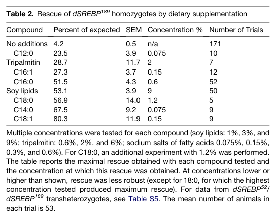

## Question

# Gene Research for Functional Annotation

## ⚠️ CRITICAL: Gene/Protein Identification Context

**BEFORE YOU BEGIN RESEARCH:** You MUST verify you are researching the CORRECT gene/protein. Gene symbols can be ambiguous, especially for less well-characterized genes from non-model organisms.

### Target Gene/Protein Identity (from UniProt):
- **UniProt Accession:** Q9VW37
- **Protein Description:** SubName: Full=Sterol regulatory element binding protein, isoform A {ECO:0000313|EMBL:AAF49115.1}; SubName: Full=Sterol regulatory element binding protein, isoform B {ECO:0000313|EMBL:AAN11631.1}; SubName: Full=Sterol regulatory element binding protein, isoform C {ECO:0000313|EMBL:AAN11632.1}; SubName: Full=Sterol regulatory element binding protein, isoform D {ECO:0000313|EMBL:AGB94757.1};
- **Gene Information:** Name=SREBP {ECO:0000313|EMBL:AAF49115.1, ECO:0000313|FlyBase:FBgn0261283}; Synonyms=Dmel\CG8522 {ECO:0000313|EMBL:AAF49115.1}, dSREBP {ECO:0000313|EMBL:AAF49115.1}, dSrebp {ECO:0000313|EMBL:AAF49115.1}, dsrebp {ECO:0000313|EMBL:AAF49115.1}, HLH106 {ECO:0000313|EMBL:AAF49115.1}, HlH106 {ECO:0000313|EMBL:AAF49115.1}, l(3)76BDw {ECO:0000313|EMBL:AAF49115.1}, SREBF1 {ECO:0000313|EMBL:AAF49115.1}, Srebp {ECO:0000313|EMBL:AAF49115.1}, srebp {ECO:0000313|EMBL:AAF49115.1}, SREBP1 {ECO:0000313|EMBL:AAF49115.1}; ORFNames=CG8522 {ECO:0000313|EMBL:AAF49115.1, ECO:0000313|FlyBase:FBgn0261283}, Dmel_CG8522 {ECO:0000313|EMBL:AAF49115.1};
- **Organism (full):** Drosophila melanogaster (Fruit fly).
- **Protein Family:** Not specified in UniProt
- **Key Domains:** bHLH_dom. (IPR011598); HLH_DNA-bd_sf. (IPR036638); HLH (PF00010)

### MANDATORY VERIFICATION STEPS:

1. **Check if the gene symbol "SREBP" matches the protein description above**
2. **Verify the organism is correct:** Drosophila melanogaster (Fruit fly).
3. **Check if protein family/domains align with what you find in literature**
4. **If you find literature for a DIFFERENT gene with the same or similar symbol, STOP**

### If Gene Symbol is Ambiguous or You Cannot Find Relevant Literature:

**DO NOT PROCEED WITH RESEARCH ON A DIFFERENT GENE.** Instead:
- State clearly: "The gene symbol 'SREBP' is ambiguous or literature is limited for this specific protein"
- Explain what you found (e.g., "Found extensive literature on a different gene with the same symbol in a different organism")
- Describe the protein based ONLY on the UniProt information provided above
- Suggest that the protein function can be inferred from domain/family information

### Research Target:

Please provide a comprehensive research report on the gene **SREBP** (gene ID: SREBP, UniProt: Q9VW37) in DROME.

The research report should be a detailed narrative explaining the function, biological processes, and localization of the gene product. Citations should be given for all claims.

You should prioritize authoritative reviews and primary scientific literature when conducting research. You can supplement
this with annotations you find in gene/protein databases, but these can be outdated or inaccurate.

We are specifically interested in the primary function of the gene - for enzymes, what reaction is catalyzed, and what is the substrate specificity? For transporters, what is the substrate? For structural proteins or adapters, what is the broader structural role? For signaling molecules, what is the role in the pathway.

We are interested in where in or outside the cell the gene product carries out its function.

We are also interested in the signaling or biochemical pathways in which the gene functions. We are less interested in broad pleiotropic effects, except where these elucidate the precise role.

Include evidence where possible. We are interested in both experimental evidence as well as inference from structure, evolution, or bioinformatic analysis. Precise studies should be prioritized over high-throughput, where available.

## Output

Question: You are an expert researcher providing comprehensive, well-cited information.

Provide detailed information focusing on:
1. Key concepts and definitions with current understanding
2. Recent developments and latest research (prioritize 2023-2024 sources)
3. Current applications and real-world implementations
4. Expert opinions and analysis from authoritative sources
5. Relevant statistics and data from recent studies

Format as a comprehensive research report with proper citations. Include URLs and publication dates where available.
Always prioritize recent, authoritative sources and provide specific citations for all major claims.

# Gene Research for Functional Annotation

## ⚠️ CRITICAL: Gene/Protein Identification Context

**BEFORE YOU BEGIN RESEARCH:** You MUST verify you are researching the CORRECT gene/protein. Gene symbols can be ambiguous, especially for less well-characterized genes from non-model organisms.

### Target Gene/Protein Identity (from UniProt):
- **UniProt Accession:** Q9VW37
- **Protein Description:** SubName: Full=Sterol regulatory element binding protein, isoform A {ECO:0000313|EMBL:AAF49115.1}; SubName: Full=Sterol regulatory element binding protein, isoform B {ECO:0000313|EMBL:AAN11631.1}; SubName: Full=Sterol regulatory element binding protein, isoform C {ECO:0000313|EMBL:AAN11632.1}; SubName: Full=Sterol regulatory element binding protein, isoform D {ECO:0000313|EMBL:AGB94757.1};
- **Gene Information:** Name=SREBP {ECO:0000313|EMBL:AAF49115.1, ECO:0000313|FlyBase:FBgn0261283}; Synonyms=Dmel\CG8522 {ECO:0000313|EMBL:AAF49115.1}, dSREBP {ECO:0000313|EMBL:AAF49115.1}, dSrebp {ECO:0000313|EMBL:AAF49115.1}, dsrebp {ECO:0000313|EMBL:AAF49115.1}, HLH106 {ECO:0000313|EMBL:AAF49115.1}, HlH106 {ECO:0000313|EMBL:AAF49115.1}, l(3)76BDw {ECO:0000313|EMBL:AAF49115.1}, SREBF1 {ECO:0000313|EMBL:AAF49115.1}, Srebp {ECO:0000313|EMBL:AAF49115.1}, srebp {ECO:0000313|EMBL:AAF49115.1}, SREBP1 {ECO:0000313|EMBL:AAF49115.1}; ORFNames=CG8522 {ECO:0000313|EMBL:AAF49115.1, ECO:0000313|FlyBase:FBgn0261283}, Dmel_CG8522 {ECO:0000313|EMBL:AAF49115.1};
- **Organism (full):** Drosophila melanogaster (Fruit fly).
- **Protein Family:** Not specified in UniProt
- **Key Domains:** bHLH_dom. (IPR011598); HLH_DNA-bd_sf. (IPR036638); HLH (PF00010)

### MANDATORY VERIFICATION STEPS:

1. **Check if the gene symbol "SREBP" matches the protein description above**
2. **Verify the organism is correct:** Drosophila melanogaster (Fruit fly).
3. **Check if protein family/domains align with what you find in literature**
4. **If you find literature for a DIFFERENT gene with the same or similar symbol, STOP**

### If Gene Symbol is Ambiguous or You Cannot Find Relevant Literature:

**DO NOT PROCEED WITH RESEARCH ON A DIFFERENT GENE.** Instead:
- State clearly: "The gene symbol 'SREBP' is ambiguous or literature is limited for this specific protein"
- Explain what you found (e.g., "Found extensive literature on a different gene with the same symbol in a different organism")
- Describe the protein based ONLY on the UniProt information provided above
- Suggest that the protein function can be inferred from domain/family information

### Research Target:

Please provide a comprehensive research report on the gene **SREBP** (gene ID: SREBP, UniProt: Q9VW37) in DROME.

The research report should be a detailed narrative explaining the function, biological processes, and localization of the gene product. Citations should be given for all claims.

You should prioritize authoritative reviews and primary scientific literature when conducting research. You can supplement
this with annotations you find in gene/protein databases, but these can be outdated or inaccurate.

We are specifically interested in the primary function of the gene - for enzymes, what reaction is catalyzed, and what is the substrate specificity? For transporters, what is the substrate? For structural proteins or adapters, what is the broader structural role? For signaling molecules, what is the role in the pathway.

We are interested in where in or outside the cell the gene product carries out its function.

We are also interested in the signaling or biochemical pathways in which the gene functions. We are less interested in broad pleiotropic effects, except where these elucidate the precise role.

Include evidence where possible. We are interested in both experimental evidence as well as inference from structure, evolution, or bioinformatic analysis. Precise studies should be prioritized over high-throughput, where available.

# Functional annotation report: *Drosophila melanogaster* SREBP

## Identity and primary function

The requested protein is the **fruit-fly SREBP**, also called **dSREBP, HLH106, or CG8522**. Kunte and colleagues explicitly identify these names as one *D. melanogaster* gene, distinguishing it from the multiple vertebrate SREBP products. The supplied UniProt accession **Q9VW37** and FlyBase identifier **FBgn0261283** specify the database record; the accessible primary papers independently confirm the fly gene names, but do not themselves print those two accession numbers. Fly SREBP has a homologous DNA-binding region and belongs to the **basic helix–loop–helix transcription-factor family**, consistent with the bHLH/HLH domains supplied in the query. It is **not** an enzyme that catalyzes fatty-acid synthesis: its primary activity is transcriptional regulation of the enzymes that do. (kunte2006fattyacidauxotrophy pages 1-2, porstmann2008srebpactivityis pages 6-7, heier2018triacylglycerolmetabolismin pages 5-6)

The strongest physiological assignment is **maintaining endogenous fatty-acid supply during larval growth**. Loss of dSREBP reduces expression of acetyl-CoA synthase (**ACS**), acetyl-CoA carboxylase (**ACC**), and fatty-acid synthase (**FAS**), decreases total larval fatty acid without appreciably changing its relative species composition, and produces growth arrest and predominantly second-instar lethality. Dietary fatty acids or restoration of the dSREBP gene rescue development. These intervention experiments establish a lipogenic regulatory function more directly than a generic association with fat accumulation would. (kunte2006fattyacidauxotrophy pages 1-2, kunte2006fattyacidauxotrophy pages 2-3, kunte2006fattyacidauxotrophy pages 3-5)

## Where the protein acts and how it is activated

**Subcellular localization is activation-dependent.** Full-length dSREBP is a two-pass **endoplasmic-reticulum (ER) membrane** precursor: its amino-terminal transcription-factor region and carboxy-terminal regulatory region face the cytosol, with a short loop between the membrane-spanning segments facing the ER lumen. In the canonical pathway, **dScap** escorts the precursor from ER toward **Golgi** membranes; **site-1 protease (dS1P)** and then **site-2 protease (dS2P)** cleave it, releasing the amino-terminal factor to the **nucleus**, where it activates lipid-synthesis genes. Processing experiments in fly S2 cells and detection of cleaved dSREBP in nuclear extracts support this localization sequence. Thus its regulatory action occurs at nuclear DNA, while its precursor is membrane-anchored and undergoes processing along the ER–Golgi route; the evidence does not indicate an extracellular function. (kunte2006fattyacidauxotrophy pages 1-2, dobrosotskaya2003reconstitutionofsterolregulated pages 1-2, dobrosotskaya2003reconstitutionofsterolregulated pages 3-3, matthews2010activationofsterol pages 4-6)

The canonical route is **not an absolute requirement in every fly tissue**. In 2010, Matthews and colleagues found that dScap-null animals emerged at approximately **70% of the expected rate** and retained nuclear dSREBP and lipid-responsive cleavage in subsets of tissues, although target-gene expression was reduced. Their genetic and processing data support some **dScap-independent activation that still involves site proteases**. Separately, when dS2P is absent, the caspase **Drice** can release an active dSREBP domain in certain tissues; Drice is *not* required to explain survival of dScap-null flies. These findings qualify, rather than overturn, the canonical ER–Golgi model. (matthews2010activationofsterol pages 1-2, matthews2010activationofsterol pages 6-7, matthews2010activationofsterol pages 9-10)

**Tissue localization matters as much as subcellular localization.** A cleavage-dependent reporter detected larval dSREBP activity in **fat body, midgut, oenocytes, and the corpus allatum**. Expression restricted to **fat body plus gut** rescued dSREBP-null larvae; fat-body expression alone rescued weakly, and gut expression alone did not rescue. The data identify these two tissues as the critical sites for sufficient lipid production during larval development, without implying that dSREBP has no function elsewhere. (kunte2006fattyacidauxotrophy pages 3-5)

## Biochemical pathway and feedback specificity

Fly dSREBP couples **de novo fatty-acid synthesis** to the availability of membrane lipids. ACC and FAS supply fatty acids that can subsequently enter **phospholipids**, including **phosphatidylethanolamine (PE)**; dSREBP is therefore a regulator of fatty-acid supply and phospholipid homeostasis, not a PE-synthesizing enzyme. In cultured fly cells, **palmitate plus ethanolamine** suppresses endogenous dSREBP processing, consistent with production of a PE-related feedback signal, whereas added cholesterol/25-hydroxycholesterol does **not** suppress its processing in the reported comparison. In whole larvae, supplemental dietary lipids likewise reduce nuclear dSREBP and its target-gene expression. The specific molecular step by which PE changes precursor transport or cleavage should not be inferred beyond these experiments. (kunte2006fattyacidauxotrophy pages 3-5, dobrosotskaya2003reconstitutionofsterolregulated pages 3-3, dobrosotskaya2003reconstitutionofsterolregulated pages 1-2)

This distinction from mammalian SREBP is essential: **flies cannot synthesize cholesterol de novo**, so their dSREBP is principally a fatty-acid regulator, **not a controller of a fly cholesterol-biosynthetic pathway**. Dobrosotskaya and colleagues showed that mammalian SREBP-2 could be made sterol-responsive in insect cells by supplying mammalian **SCAP and Insig**; that reconstitution describes the introduced mammalian machinery, not cholesterol responsiveness of endogenous fly dSREBP. The expert evolutionary review by Osborne and Espenshade likewise interprets sterol-auxotrophic fly SREBP chiefly through its requirement for fatty-acid synthesis. (kunte2006fattyacidauxotrophy pages 1-2, dobrosotskaya2003reconstitutionofsterolregulated pages 1-2, osborne2009evolutionaryconservationand pages 7-8)

## Experimental strength and quantitative findings

The following results distinguish direct dSREBP loss-of-function evidence from evidence obtained by perturbing an upstream regulator. (kunte2006fattyacidauxotrophy pages 1-2, matthews2010activationofsterol pages 1-2, liu2023fatbodyspecificreduction pages 11-12)

| Experimental system / perturbation | Mechanistic observation and exact quantitative outcome | Interpretation / limitation | Source |
|---|---|---|---|
| *D. melanogaster* **dSREBP** null larvae | On unsupplemented medium, adult homozygotes were **<5% of the expected number**. Dietary **0.15% oleate (C18:1)** yielded **80.3% survival of expected homozygotes**; **0.6% palmitate (C16:0)** yielded **51.5%**. | Demonstrates fatty-acid auxotrophy and rescue by exogenous fatty acids. The 80.3% value is survival relative to the expected homozygote count—not an 80.3% improvement over baseline. | [Kunte et al., 2006](https://doi.org/10.1016/j.cmet.2006.04.011) (kunte2006fattyacidauxotrophy pages 1-2, kunte2006fattyacidauxotrophy pages 6-8, kunte2006fattyacidauxotrophy media b6fe8eff) |
| *D. melanogaster* **dScap** null mutants | Homozygotes emerged at **70% of the expected rate** despite reduced target-gene transcription and residual, tissue-restricted dSREBP cleavage. | dScap promotes robust canonical processing but is not absolutely required for fly viability; alternative activation mechanisms limit direct extrapolation from mammals. | [Matthews et al., 2010](https://doi.org/10.1534/genetics.110.114975) (matthews2010activationofsterol pages 1-2) |
| Larval fat-body **CTPS RNAi** | Relative mRNA reductions: **Srebp 23–34.4%**, **Scap 30–33.3%**, **Acc 54–86.1%**, and **Fasn1 59–70.3%**. Constitutively nuclear SREBP.Cdel **partially restored** fat-body lipid-droplet size and TAG concentration. | Supports a CTPS→PI3K–Akt→SREBP lipogenic axis, but CTPS is an upstream pleiotropic perturbation and activated SREBP did not fully rescue the phenotype. | [Liu et al., 2023](https://doi.org/10.7554/eLife.85293) (liu2023fatbodyspecificreduction pages 11-12) |

*Table: Key quantitative experiments establishing dSREBP’s requirement for fatty-acid homeostasis, its partly SCAP-independent activation, and its placement downstream of CTPS–PI3K–Akt signaling.*

The rescue percentages are **percentages of the expected number of homozygous adults**, not percentages of mutant animals observed before treatment. In Kunte and colleagues’ assay, unsupplemented null mutants survived at only about **4.2%** of the expected frequency; **0.15% oleate** produced **80.3%**, whereas **0.6% palmitate** produced **51.5%**. This shows that more than one exogenous fatty acid can overcome the physiological deficit; it does not establish that SREBP itself binds or metabolizes oleate preferentially. Earlier cell-culture dSREBP depletion had reduced **de novo fatty-acid synthesis fourfold**. (kunte2006fattyacidauxotrophy pages 6-8, kunte2006fattyacidauxotrophy media b6fe8eff, kunte2006fattyacidauxotrophy pages 2-3)

## Additional experimentally established contexts

PE homeostasis provides a particularly informative tissue-level test. In **easily shocked (eas)** mutants, defective PE synthesis is accompanied by increased dSREBP signaling, triglyceride accumulation, and cardiac dysfunction. Heart-specific activation of dSREBP reproduced important defects, whereas suppressing dSREBP or its lipogenic output improved cardiac structure and function. This supports a **PE → dSREBP processing → fatty-acid production** feedback model while showing that prolonged activation can be harmful in a tissue with disturbed phospholipid synthesis. It is a fly mechanistic model, **not evidence of a human SREBP therapy**. [Lim et al., *Genes & Development*, January 2011; DOI: 10.1101/gad.1992411](https://doi.org/10.1101/gad.1992411). (lim2011phospholipidhomeostasisregulates pages 1-2, lim2011phospholipidhomeostasisregulates pages 7-9)

The pathway also operates **cell-autonomously in neurons**. Genetic depletion of SREBP in larval class-IV dendritic-arborization neurons simplified dendrites and was associated with hypersensitivity to noxious stimuli, consistent with a requirement for local fatty-acid supply during membrane expansion. In adult photoreceptors, a separate study found that SREBP activation was **necessary and sufficient for synaptic-vesicle loss** following disruption of certain phospholipid-synthesis pathways, implicating transcriptional feedback and tetraspanins. These are tissue- and perturbation-specific functions; neither replaces fatty-acid regulation as the best-established primary molecular annotation. [Ziegler et al., *Cell Reports*, 19 December 2017; DOI: 10.1016/j.celrep.2017.11.069](https://doi.org/10.1016/j.celrep.2017.11.069); [Tsai et al., *Neuron*, 20 February 2019; DOI: 10.1016/j.neuron.2019.01.015](https://doi.org/10.1016/j.celrep.2017.11.069). (ziegler2017cellautonomouscontrolof pages 1-3, tsai2019transcriptionalfeedbacklinks pages 1-4)

## Recent research and present use of the model

A **2023 primary study** placed dSREBP in a nutrient-responsive fat-body signaling axis. Fat-body **CTPS** knockdown reduced **Srebp mRNA by 23–34.4%**, **Scap by 30–33.3%**, **Acc by 54–86.1%**, and **Fasn1 by 59–70.3%**; PI3K-reporter signaling and phosphorylated Akt also fell. Expressing a constitutively nuclear SREBP fragment **partially restored** lipid-droplet size and triglyceride concentration, supporting a contribution from **CTPS–PI3K–Akt–SREBP signaling**. Because CTPS perturbation has other effects and rescue was incomplete, it does not establish that all CTPS-dependent growth or fat-storage effects pass exclusively through SREBP. This is a **laboratory implementation** of fly tissue-specific RNAi, pathway reporters, and genetic epistasis, not a clinical application. [Liu et al., *eLife*, published 11 September 2023; DOI: 10.7554/eLife.85293](https://doi.org/10.7554/eLife.85293). (liu2023fatbodyspecificreduction pages 1-2, liu2023fatbodyspecificreduction pages 8-11, liu2023fatbodyspecificreduction pages 11-12)

A **2024 fly study** used RNA sequencing and proteomics to examine Wnt/Wingless-dependent lipid mobilization, including measurements of **SREBP transcripts** alongside lipogenic enzymes. Its principal demonstrated mechanism is **Wnt-dependent repression of lipid-metabolism genes**; those results should **not** be relabeled as proof that Wnt directly binds or inhibits the dSREBP protein. This distinction matters when using recent high-throughput work for functional annotation. [Liu et al., *Proceedings of the National Academy of Sciences*, published 5 July 2024; DOI: 10.1073/pnas.2322066121](https://doi.org/10.1073/pnas.2322066121). (liu2024wntwinglesssignalingpromotes pages 1-2, liu2024wntwinglesssignalingpromotes pages 3-4, liu2024wntwinglesssignalingpromotes pages 5-6)

**Annotation conclusion.** For Q9VW37 as specified in the query, the evidence-supported description is: **a membrane-anchored, proteolytically activated bHLH transcription factor whose nuclear form promotes fatty-acid-biosynthetic gene expression in *D. melanogaster*, with activation responsive to phospholipid and dietary-lipid availability**. Larval fat body and gut provide the clearest physiological requirement; neuronal and cardiac experiments establish more specialized contexts. Exact promoter-binding specificity, isoform-specific functions, and the molecular identity of the lipid-sensing event are less firmly established by the cited fly experiments than the causal requirement for fatty-acid supply. (kunte2006fattyacidauxotrophy pages 1-2, kunte2006fattyacidauxotrophy pages 3-5, dobrosotskaya2003reconstitutionofsterolregulated pages 3-3, lim2011phospholipidhomeostasisregulates pages 7-9, ziegler2017cellautonomouscontrolof pages 1-3)

References

1. (kunte2006fattyacidauxotrophy pages 1-2): Amit S. Kunte, Krista A. Matthews, and Robert B. Rawson. Fatty acid auxotrophy in drosophila larvae lacking srebp. Cell metabolism, 3 6:439-48, Jun 2006. URL: https://doi.org/10.1016/j.cmet.2006.04.011, doi:10.1016/j.cmet.2006.04.011. This article has 159 citations and is from a highest quality peer-reviewed journal.

2. (porstmann2008srebpactivityis pages 6-7): Thomas Porstmann, Claudio R. Santos, Beatrice Griffiths, Megan Cully, Mary Wu, Sally Leevers, John R. Griffiths, Yuen-Li Chung, and Almut Schulze. Srebp activity is regulated by mtorc1 and contributes to akt-dependent cell growth. Cell Metabolism, 8:224-236, Sep 2008. URL: https://doi.org/10.1016/j.cmet.2008.07.007, doi:10.1016/j.cmet.2008.07.007. This article has 1910 citations and is from a highest quality peer-reviewed journal.

3. (heier2018triacylglycerolmetabolismin pages 5-6): Christoph Heier and Ronald P Kühnlein. Triacylglycerol metabolism in drosophila melanogaster. Genetics, 210:1163-1184, Dec 2018. URL: https://doi.org/10.1534/genetics.118.301583, doi:10.1534/genetics.118.301583. This article has 263 citations and is from a domain leading peer-reviewed journal.

4. (kunte2006fattyacidauxotrophy pages 2-3): Amit S. Kunte, Krista A. Matthews, and Robert B. Rawson. Fatty acid auxotrophy in drosophila larvae lacking srebp. Cell metabolism, 3 6:439-48, Jun 2006. URL: https://doi.org/10.1016/j.cmet.2006.04.011, doi:10.1016/j.cmet.2006.04.011. This article has 159 citations and is from a highest quality peer-reviewed journal.

5. (kunte2006fattyacidauxotrophy pages 3-5): Amit S. Kunte, Krista A. Matthews, and Robert B. Rawson. Fatty acid auxotrophy in drosophila larvae lacking srebp. Cell metabolism, 3 6:439-48, Jun 2006. URL: https://doi.org/10.1016/j.cmet.2006.04.011, doi:10.1016/j.cmet.2006.04.011. This article has 159 citations and is from a highest quality peer-reviewed journal.

6. (dobrosotskaya2003reconstitutionofsterolregulated pages 1-2): Irina Y. Dobrosotskaya, Joseph L. Goldstein, Michael S. Brown, and Robert B. Rawson. Reconstitution of sterol-regulated endoplasmic reticulum-to-golgi transport of srebp-2 in insect cells by co-expression of mammalian scap and insigs*. Journal of Biological Chemistry, 278:35837-35843, Sep 2003. URL: https://doi.org/10.1074/jbc.m306476200, doi:10.1074/jbc.m306476200. This article has 50 citations and is from a domain leading peer-reviewed journal.

7. (dobrosotskaya2003reconstitutionofsterolregulated pages 3-3): Irina Y. Dobrosotskaya, Joseph L. Goldstein, Michael S. Brown, and Robert B. Rawson. Reconstitution of sterol-regulated endoplasmic reticulum-to-golgi transport of srebp-2 in insect cells by co-expression of mammalian scap and insigs*. Journal of Biological Chemistry, 278:35837-35843, Sep 2003. URL: https://doi.org/10.1074/jbc.m306476200, doi:10.1074/jbc.m306476200. This article has 50 citations and is from a domain leading peer-reviewed journal.

8. (matthews2010activationofsterol pages 4-6): Krista A Matthews, Cafer Ozdemir, and Robert B Rawson. Activation of sterol regulatory element binding proteins in the absence of scap in drosophila melanogaster. Genetics, 185:189-198, May 2010. URL: https://doi.org/10.1534/genetics.110.114975, doi:10.1534/genetics.110.114975. This article has 19 citations and is from a domain leading peer-reviewed journal.

9. (matthews2010activationofsterol pages 1-2): Krista A Matthews, Cafer Ozdemir, and Robert B Rawson. Activation of sterol regulatory element binding proteins in the absence of scap in drosophila melanogaster. Genetics, 185:189-198, May 2010. URL: https://doi.org/10.1534/genetics.110.114975, doi:10.1534/genetics.110.114975. This article has 19 citations and is from a domain leading peer-reviewed journal.

10. (matthews2010activationofsterol pages 6-7): Krista A Matthews, Cafer Ozdemir, and Robert B Rawson. Activation of sterol regulatory element binding proteins in the absence of scap in drosophila melanogaster. Genetics, 185:189-198, May 2010. URL: https://doi.org/10.1534/genetics.110.114975, doi:10.1534/genetics.110.114975. This article has 19 citations and is from a domain leading peer-reviewed journal.

11. (matthews2010activationofsterol pages 9-10): Krista A Matthews, Cafer Ozdemir, and Robert B Rawson. Activation of sterol regulatory element binding proteins in the absence of scap in drosophila melanogaster. Genetics, 185:189-198, May 2010. URL: https://doi.org/10.1534/genetics.110.114975, doi:10.1534/genetics.110.114975. This article has 19 citations and is from a domain leading peer-reviewed journal.

12. (osborne2009evolutionaryconservationand pages 7-8): Timothy F. Osborne and Peter J. Espenshade. Evolutionary conservation and adaptation in the mechanism that regulates srebp action: what a long, strange trip it's been. Genes & development, 23 22:2578-91, Nov 2009. URL: https://doi.org/10.1101/gad.1854309, doi:10.1101/gad.1854309. This article has 324 citations and is from a highest quality peer-reviewed journal.

13. (liu2023fatbodyspecificreduction pages 11-12): Jingnan Liu, Yuanbing Zhang, Qiao-Qi Wang, Youfang Zhou, and Ji-Long Liu. Fat body-specific reduction of ctps alleviates hfd-induced obesity. eLife, Sep 2023. URL: https://doi.org/10.7554/elife.85293, doi:10.7554/elife.85293. This article has 16 citations and is from a domain leading peer-reviewed journal.

14. (kunte2006fattyacidauxotrophy pages 6-8): Amit S. Kunte, Krista A. Matthews, and Robert B. Rawson. Fatty acid auxotrophy in drosophila larvae lacking srebp. Cell metabolism, 3 6:439-48, Jun 2006. URL: https://doi.org/10.1016/j.cmet.2006.04.011, doi:10.1016/j.cmet.2006.04.011. This article has 159 citations and is from a highest quality peer-reviewed journal.

15. (kunte2006fattyacidauxotrophy media b6fe8eff): Amit S. Kunte, Krista A. Matthews, and Robert B. Rawson. Fatty acid auxotrophy in drosophila larvae lacking srebp. Cell metabolism, 3 6:439-48, Jun 2006. URL: https://doi.org/10.1016/j.cmet.2006.04.011, doi:10.1016/j.cmet.2006.04.011. This article has 159 citations and is from a highest quality peer-reviewed journal.

16. (lim2011phospholipidhomeostasisregulates pages 1-2): Hui-Ying Lim, Weidong Wang, Robert J. Wessells, Karen Ocorr, and Rolf Bodmer. Phospholipid homeostasis regulates lipid metabolism and cardiac function through srebp signaling in drosophila. Genes & development, 25 2:189-200, Jan 2011. URL: https://doi.org/10.1101/gad.1992411, doi:10.1101/gad.1992411. This article has 150 citations and is from a highest quality peer-reviewed journal.

17. (lim2011phospholipidhomeostasisregulates pages 7-9): Hui-Ying Lim, Weidong Wang, Robert J. Wessells, Karen Ocorr, and Rolf Bodmer. Phospholipid homeostasis regulates lipid metabolism and cardiac function through srebp signaling in drosophila. Genes & development, 25 2:189-200, Jan 2011. URL: https://doi.org/10.1101/gad.1992411, doi:10.1101/gad.1992411. This article has 150 citations and is from a highest quality peer-reviewed journal.

18. (ziegler2017cellautonomouscontrolof pages 1-3): Anna B. Ziegler, Christoph Thiele, Federico Tenedini, Mélisande Richard, Philipp Leyendecker, Astrid Hoermann, Peter Soba, and Gaia Tavosanis. Cell-autonomous control of neuronal dendrite expansion via the fatty acid synthesis regulator srebp. Cell reports, 21 12:3346-3353, Dec 2017. URL: https://doi.org/10.1016/j.celrep.2017.11.069, doi:10.1016/j.celrep.2017.11.069. This article has 82 citations and is from a highest quality peer-reviewed journal.

19. (tsai2019transcriptionalfeedbacklinks pages 1-4): Jessica W. Tsai, Ripsik Kostyleva, Pei-Ling Chen, Irma Magaly Rivas-Serna, M. Thomas Clandinin, Ian A. Meinertzhagen, and Thomas R. Clandinin. Transcriptional feedback links lipid synthesis to synaptic vesicle pools in drosophila photoreceptors. Neuron, 101:721-737.e4, Feb 2019. URL: https://doi.org/10.1016/j.neuron.2019.01.015, doi:10.1016/j.neuron.2019.01.015. This article has 28 citations and is from a highest quality peer-reviewed journal.

20. (liu2023fatbodyspecificreduction pages 1-2): Jingnan Liu, Yuanbing Zhang, Qiao-Qi Wang, Youfang Zhou, and Ji-Long Liu. Fat body-specific reduction of ctps alleviates hfd-induced obesity. eLife, Sep 2023. URL: https://doi.org/10.7554/elife.85293, doi:10.7554/elife.85293. This article has 16 citations and is from a domain leading peer-reviewed journal.

21. (liu2023fatbodyspecificreduction pages 8-11): Jingnan Liu, Yuanbing Zhang, Qiao-Qi Wang, Youfang Zhou, and Ji-Long Liu. Fat body-specific reduction of ctps alleviates hfd-induced obesity. eLife, Sep 2023. URL: https://doi.org/10.7554/elife.85293, doi:10.7554/elife.85293. This article has 16 citations and is from a domain leading peer-reviewed journal.

22. (liu2024wntwinglesssignalingpromotes pages 1-2): Mengmeng Liu, Rajitha-Udakara-Sampath Hemba-Waduge, Xiao Li, Xiahe Huang, Tzu-Hao Liu, Xianlin Han, Yingchun Wang, and Jun-Yuan Ji. Wnt/wingless signaling promotes lipid mobilization through signal-induced transcriptional repression. Proceedings of the National Academy of Sciences of the United States of America, Jul 2024. URL: https://doi.org/10.1073/pnas.2322066121, doi:10.1073/pnas.2322066121. This article has 14 citations and is from a highest quality peer-reviewed journal.

23. (liu2024wntwinglesssignalingpromotes pages 3-4): Mengmeng Liu, Rajitha-Udakara-Sampath Hemba-Waduge, Xiao Li, Xiahe Huang, Tzu-Hao Liu, Xianlin Han, Yingchun Wang, and Jun-Yuan Ji. Wnt/wingless signaling promotes lipid mobilization through signal-induced transcriptional repression. Proceedings of the National Academy of Sciences of the United States of America, Jul 2024. URL: https://doi.org/10.1073/pnas.2322066121, doi:10.1073/pnas.2322066121. This article has 14 citations and is from a highest quality peer-reviewed journal.

24. (liu2024wntwinglesssignalingpromotes pages 5-6): Mengmeng Liu, Rajitha-Udakara-Sampath Hemba-Waduge, Xiao Li, Xiahe Huang, Tzu-Hao Liu, Xianlin Han, Yingchun Wang, and Jun-Yuan Ji. Wnt/wingless signaling promotes lipid mobilization through signal-induced transcriptional repression. Proceedings of the National Academy of Sciences of the United States of America, Jul 2024. URL: https://doi.org/10.1073/pnas.2322066121, doi:10.1073/pnas.2322066121. This article has 14 citations and is from a highest quality peer-reviewed journal.

## Artifacts

- [Edison artifact artifact-00](SREBP-deep-research-falcon_artifacts/artifact-00.md)

## Citations

1. kunte2006fattyacidauxotrophy pages 3-5
2. matthews2010activationofsterol pages 1-2
3. liu2023fatbodyspecificreduction pages 11-12
4. kunte2006fattyacidauxotrophy pages 1-2
5. porstmann2008srebpactivityis pages 6-7
6. heier2018triacylglycerolmetabolismin pages 5-6
7. kunte2006fattyacidauxotrophy pages 2-3
8. dobrosotskaya2003reconstitutionofsterolregulated pages 1-2
9. dobrosotskaya2003reconstitutionofsterolregulated pages 3-3
10. matthews2010activationofsterol pages 4-6
11. matthews2010activationofsterol pages 6-7
12. matthews2010activationofsterol pages 9-10
13. osborne2009evolutionaryconservationand pages 7-8
14. kunte2006fattyacidauxotrophy pages 6-8
15. lim2011phospholipidhomeostasisregulates pages 1-2
16. lim2011phospholipidhomeostasisregulates pages 7-9
17. ziegler2017cellautonomouscontrolof pages 1-3
18. tsai2019transcriptionalfeedbacklinks pages 1-4
19. liu2023fatbodyspecificreduction pages 1-2
20. liu2023fatbodyspecificreduction pages 8-11
21. liu2024wntwinglesssignalingpromotes pages 1-2
22. liu2024wntwinglesssignalingpromotes pages 3-4
23. liu2024wntwinglesssignalingpromotes pages 5-6
24. Kunte et al., 2006
25. Matthews et al., 2010
26. Liu et al., 2023
27. Lim et al., *Genes & Development*, January 2011; DOI: 10.1101/gad.1992411
28. Ziegler et al., *Cell Reports*, 19 December 2017; DOI: 10.1016/j.celrep.2017.11.069
29. Tsai et al., *Neuron*, 20 February 2019; DOI: 10.1016/j.neuron.2019.01.015
30. Liu et al., *eLife*, published 11 September 2023; DOI: 10.7554/eLife.85293
31. Liu et al., *Proceedings of the National Academy of Sciences*, published 5 July 2024; DOI: 10.1073/pnas.2322066121
32. https://doi.org/10.1016/j.cmet.2006.04.011
33. https://doi.org/10.1534/genetics.110.114975
34. https://doi.org/10.7554/eLife.85293
35. https://doi.org/10.1101/gad.1992411
36. https://doi.org/10.1016/j.celrep.2017.11.069
37. https://doi.org/10.1073/pnas.2322066121
38. https://doi.org/10.1016/j.cmet.2006.04.011,
39. https://doi.org/10.1016/j.cmet.2008.07.007,
40. https://doi.org/10.1534/genetics.118.301583,
41. https://doi.org/10.1074/jbc.m306476200,
42. https://doi.org/10.1534/genetics.110.114975,
43. https://doi.org/10.1101/gad.1854309,
44. https://doi.org/10.7554/elife.85293,
45. https://doi.org/10.1101/gad.1992411,
46. https://doi.org/10.1016/j.celrep.2017.11.069,
47. https://doi.org/10.1016/j.neuron.2019.01.015,
48. https://doi.org/10.1073/pnas.2322066121,