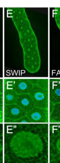

## Question

# Gene Research for Functional Annotation

## ⚠️ CRITICAL: Gene/Protein Identification Context

**BEFORE YOU BEGIN RESEARCH:** You MUST verify you are researching the CORRECT gene/protein. Gene symbols can be ambiguous, especially for less well-characterized genes from non-model organisms.

### Target Gene/Protein Identity (from UniProt):
- **UniProt Accession:** Q9VXH9
- **Protein Description:** RecName: Full=WASH complex subunit 4 {ECO:0000250|UniProtKB:Q2M389}; AltName: Full=Strumpellin and WASH-interacting protein homolog {ECO:0000305}; AltName: Full=WASH complex subunit SWIP homolog;
- **Gene Information:** Name=SWIP {ECO:0000312|FlyBase:FBgn0030739}; ORFNames=CG13957 {ECO:0000312|FlyBase:FBgn0030739};
- **Organism (full):** Drosophila melanogaster (Fruit fly).
- **Protein Family:** Belongs to the SWIP family. .
- **Key Domains:** WASH-4_N. (IPR028191); WASH-7_C. (IPR028283); WASH-7_central. (IPR028282); WASH7. (IPR027307); WASH-4_N (PF14745)

### MANDATORY VERIFICATION STEPS:

1. **Check if the gene symbol "SWIP" matches the protein description above**
2. **Verify the organism is correct:** Drosophila melanogaster (Fruit fly).
3. **Check if protein family/domains align with what you find in literature**
4. **If you find literature for a DIFFERENT gene with the same or similar symbol, STOP**

### If Gene Symbol is Ambiguous or You Cannot Find Relevant Literature:

**DO NOT PROCEED WITH RESEARCH ON A DIFFERENT GENE.** Instead:
- State clearly: "The gene symbol 'SWIP' is ambiguous or literature is limited for this specific protein"
- Explain what you found (e.g., "Found extensive literature on a different gene with the same symbol in a different organism")
- Describe the protein based ONLY on the UniProt information provided above
- Suggest that the protein function can be inferred from domain/family information

### Research Target:

Please provide a comprehensive research report on the gene **SWIP** (gene ID: SWIP, UniProt: Q9VXH9) in DROME.

The research report should be a detailed narrative explaining the function, biological processes, and localization of the gene product. Citations should be given for all claims.

You should prioritize authoritative reviews and primary scientific literature when conducting research. You can supplement
this with annotations you find in gene/protein databases, but these can be outdated or inaccurate.

We are specifically interested in the primary function of the gene - for enzymes, what reaction is catalyzed, and what is the substrate specificity? For transporters, what is the substrate? For structural proteins or adapters, what is the broader structural role? For signaling molecules, what is the role in the pathway.

We are interested in where in or outside the cell the gene product carries out its function.

We are also interested in the signaling or biochemical pathways in which the gene functions. We are less interested in broad pleiotropic effects, except where these elucidate the precise role.

Include evidence where possible. We are interested in both experimental evidence as well as inference from structure, evolution, or bioinformatic analysis. Precise studies should be prioritized over high-throughput, where available.

## Output

Question: You are an expert researcher providing comprehensive, well-cited information.

Provide detailed information focusing on:
1. Key concepts and definitions with current understanding
2. Recent developments and latest research (prioritize 2023-2024 sources)
3. Current applications and real-world implementations
4. Expert opinions and analysis from authoritative sources
5. Relevant statistics and data from recent studies

Format as a comprehensive research report with proper citations. Include URLs and publication dates where available.
Always prioritize recent, authoritative sources and provide specific citations for all major claims.

# Gene Research for Functional Annotation

## ⚠️ CRITICAL: Gene/Protein Identification Context

**BEFORE YOU BEGIN RESEARCH:** You MUST verify you are researching the CORRECT gene/protein. Gene symbols can be ambiguous, especially for less well-characterized genes from non-model organisms.

### Target Gene/Protein Identity (from UniProt):
- **UniProt Accession:** Q9VXH9
- **Protein Description:** RecName: Full=WASH complex subunit 4 {ECO:0000250|UniProtKB:Q2M389}; AltName: Full=Strumpellin and WASH-interacting protein homolog {ECO:0000305}; AltName: Full=WASH complex subunit SWIP homolog;
- **Gene Information:** Name=SWIP {ECO:0000312|FlyBase:FBgn0030739}; ORFNames=CG13957 {ECO:0000312|FlyBase:FBgn0030739};
- **Organism (full):** Drosophila melanogaster (Fruit fly).
- **Protein Family:** Belongs to the SWIP family. .
- **Key Domains:** WASH-4_N. (IPR028191); WASH-7_C. (IPR028283); WASH-7_central. (IPR028282); WASH7. (IPR027307); WASH-4_N (PF14745)

### MANDATORY VERIFICATION STEPS:

1. **Check if the gene symbol "SWIP" matches the protein description above**
2. **Verify the organism is correct:** Drosophila melanogaster (Fruit fly).
3. **Check if protein family/domains align with what you find in literature**
4. **If you find literature for a DIFFERENT gene with the same or similar symbol, STOP**

### If Gene Symbol is Ambiguous or You Cannot Find Relevant Literature:

**DO NOT PROCEED WITH RESEARCH ON A DIFFERENT GENE.** Instead:
- State clearly: "The gene symbol 'SWIP' is ambiguous or literature is limited for this specific protein"
- Explain what you found (e.g., "Found extensive literature on a different gene with the same symbol in a different organism")
- Describe the protein based ONLY on the UniProt information provided above
- Suggest that the protein function can be inferred from domain/family information

### Research Target:

Please provide a comprehensive research report on the gene **SWIP** (gene ID: SWIP, UniProt: Q9VXH9) in DROME.

The research report should be a detailed narrative explaining the function, biological processes, and localization of the gene product. Citations should be given for all claims.

You should prioritize authoritative reviews and primary scientific literature when conducting research. You can supplement
this with annotations you find in gene/protein databases, but these can be outdated or inaccurate.

We are specifically interested in the primary function of the gene - for enzymes, what reaction is catalyzed, and what is the substrate specificity? For transporters, what is the substrate? For structural proteins or adapters, what is the broader structural role? For signaling molecules, what is the role in the pathway.

We are interested in where in or outside the cell the gene product carries out its function.

We are also interested in the signaling or biochemical pathways in which the gene functions. We are less interested in broad pleiotropic effects, except where these elucidate the precise role.

Include evidence where possible. We are interested in both experimental evidence as well as inference from structure, evolution, or bioinformatic analysis. Precise studies should be prioritized over high-throughput, where available.

# Functional annotation of *Drosophila melanogaster* SWIP (CG13957; UniProt Q9VXH9)

## Identity and principal function

**Identity verified.** The protein specified in the question is fly **SWIP/CG13957** (FlyBase FBgn0030739), described by fly experimental studies as a subunit of the **WASH regulatory complex** (SHRC). Its supplied UniProt annotation assigns it to the SWIP family and lists WASH-associated domains. It must **not** be confused with *Drosophila* **Swip-1/EFHD2**, a distinct calcium-dependent actin-cross-linking protein, or with the WASH-complex subunit **Strumpellin**. Human SWIP is also called WASHC4, whereas Strumpellin is WASHC5. (verboon2015washfunctionsdownstream pages 4-5, verboon2020drosophilawashand pages 4-6, priya2023codependenciesofmtorc1 pages 1-2)

The best-supported annotation of fly SWIP is **non-catalytic component of a multiprotein actin-regulatory scaffold**. Together with Wash, FAM21, Strumpellin and CCDC53, it supports spatially organized Wash–Arp2/3-dependent actin assembly. **Wash**, through its VCA region, is the actin-nucleation-promoting subunit; SWIP has no established catalytic reaction, transported substrate or fly-specific cargo-binding specificity. Fly experiments implicate SWIP in maintaining complex-protein abundance and in cortical-actin organization and nuclear-envelope budding. The broader role in endosomal cargo sorting is well established for the *complex*, but the identity of cargoes specifically dependent on fly SWIP has not been determined in the studies examined. (verboon2018washexhibitscontextdependent pages 9-12, verboon2020drosophilawashand pages 6-8, hao2013regulationofwashdependent pages 1-2, wang2018endosomalreceptortrafficking pages 9-13)

## Direct evidence in the target organism

The following evidence separates measurements on **CG13957 itself** from measurements on Wash or other subunits.

| Context/date | Cellular location | SWIP/CG13957 perturbation and direct findings | Interpretive strength and limitation |
|---|---|---|---|
| Hemocyte development; 2015 ([Verboon et al.](https://doi.org/10.1091/mbc.e14-08-1266), published May 1, 2015) | Embryonic hemocytes | Hemocyte-specific **SWIP RNAi** left developmental migration indistinguishable from control and did not significantly alter protrusion area: **212.3 ± 16.6 versus 239.2 ± 27.9 µm²** (*p*=0.4107). Vacuoles nevertheless increased anteriorly (**6.8 ± 0.3 versus 3.7 ± 0.2**) and posteriorly (**6.9 ± 0.3 versus 3.5 ± 0.1**), each *p*<0.0001. (verboon2015washfunctionsdownstream pages 6-8, verboon2015washfunctionsdownstream pages 4-5) | Direct, tissue-specific loss-of-function evidence supports an SHRC-dependent vesicular role but excludes SWIP from the tested Rho1–Wash–Arp2/3 migration mechanism. RNAi is not a null allele, and no cargo, organelle identity, or direct SWIP interaction was established. |
| Oogenesis; 2018 ([Verboon et al.](https://doi.org/10.1242/jcs.211573), published April 2018) | Stage 7–9 egg chambers; germline and **oocyte cortex** | Anti-SWIP staining detected SWIP in the germline with cortical enrichment. Two independent germline RNAi lines per SHRC subunit, including SWIP, produced premature ooplasmic streaming, disorganized cortical actin, and diffuse or widened ring-canal outer actin arrays with protruding filaments. Depleting SWIP or another SHRC member reduced Wash and the other assayed complex proteins. (verboon2018washexhibitscontextdependent pages 9-12) | Direct localization and replicated RNAi support SWIP as a structural or stability factor for an actin-regulatory WASH complex. Because subunit depletion destabilized the entire complex, the phenotypes cannot be assigned to a SWIP-exclusive biochemical activity; no catalytic activity was demonstrated. |
| Nuclear-envelope budding; 2020 ([Verboon et al.](https://doi.org/10.1242/jcs.243576), published July 2020) | Larval salivary-gland nuclei and nuclear-envelope buds | SWIP was strongly nuclear and enriched at Lamin-B-associated nuclear-envelope buds. Two independent SWIP RNAi constructs were tested. Across all SHRC-knockdown lines, buds fell to **0.1–1.1 ± 0.1 per nucleus**, versus **6.6 ± 0.3** in controls (*n*>100 per line, *p*<0.0001); the publication does not provide a separately extractable exact value for SWIP alone. Figure 3 visually corroborates nuclear staining, bud enrichment, and depletion with both SWIP RNAi lines. (verboon2020drosophilawashand pages 6-8, verboon2020drosophilawashand media ae7f95f7) | Strongest direct evidence that fly SWIP localizes where it functions and is required for SHRC–Wash–Arp2/3-dependent budding. It does not show that SWIP binds Lamin B directly; biochemical evidence instead separates the Wash–SHRC complex from a distinct Wash–Lamin-B complex. |
| Recent mechanistic comparator; 2023–2024 | Human endosomes and endolysosomes—not *Drosophila* SWIP | Human studies place WASHC4/SWIP in the pentameric WASH complex. WASH- or Arp2/3-directed perturbations linked endolysosomal branched actin to mTORC1 recruitment and activity; 2024 work also showed that VPS35-D620N weakens retromer–WASH association without detectably preventing WASH endosomal recruitment. These experiments did **not** directly perturb fly SWIP/CG13957. (mccarron2024theparkinsonsdisease pages 1-3, priya2023codependenciesofmtorc1 pages 1-2, priya2023codependenciesofmtorc1 pages 5-7) | Useful current support for conserved complex-level mechanisms and retromer-independent recruitment, but not direct functional annotation of Q9VXH9. Human WASHC4/SWIP must not be confused with *Drosophila* **Swip-1/EFHD2**, a distinct calcium-dependent actin-cross-linking protein. |

*Table: Direct experiments on Drosophila SWIP/CG13957 are separated from recent human WASH-complex comparisons. The table highlights localization, quantitative phenotypes, and the principal limits of each evidence set.*

**Oocyte cortex and complex stability.** In stage 7–9 egg chambers, antibody staining detects SWIP in the germline, enriched at the **oocyte cortex** alongside the other SHRC proteins. Germline depletion with independent RNAi reagents produces premature ooplasmic streaming, disordered cortical F-actin, and altered outer actin arrays around ring canals. Ovary-lysate analysis found that depletion of SWIP or another SHRC component lowers Wash and other assayed complex proteins. These findings support a **structural or stability role** for SWIP, but also mean that an SWIP-knockdown phenotype cannot be attributed to a unique SWIP biochemical activity rather than destabilization of the assembly. Wash can additionally act downstream of Rho1 during oogenesis; the evidence does not show that SWIP directly binds Rho1. Verboon *et al.*, *Journal of Cell Science*, **April 2018**, https://doi.org/10.1242/jcs.211573. (verboon2018washexhibitscontextdependent pages 9-12, verboon2018washexhibitscontextdependent pages 7-9)

**Nucleus and nuclear-envelope buds.** In larval salivary glands, SWIP is strongly detected in **nuclei** and is enriched at Lamin-B-associated **nuclear-envelope budding sites**. In the published Figure 3, SWIP staining and bud-associated signal are shown directly, while two independent SWIP RNAi lines are included in the bud-count comparison. Across the independently tested SHRC-subunit RNAi lines, dFz2C-positive buds averaged **0.1–1.1 ± 0.1 per nucleus**, compared with **6.6 ± 0.3** in controls (*n* > 100 per line; *p* < 0.0001). That range is for the **SHRC knockdown lines collectively**, not an exact SWIP-only estimate. Wash–SHRC association is needed for normal budding, with capping protein and Arp2/3 also implicated. A *separate* Wash–Lamin-B interaction maintains nuclear-lamina organization: SHRC-depleted nuclei retain relatively normal spherical morphology, and the biochemical experiments did **not** demonstrate direct SWIP–Lamin-B binding. Verboon *et al.*, *Journal of Cell Science*, **July 2020**, https://doi.org/10.1242/jcs.243576. (verboon2020drosophilawashand pages 6-8, verboon2020drosophilawashand pages 8-9, verboon2020drosophilawashand media ae7f95f7)

**Hemocyte vesicular phenotype—and an important negative result.** Hemocyte-specific CG13957 RNAi left the developmental migrations tested indistinguishable from controls, unlike interference with the **Rho1 → Wash → Arp2/3** migration pathway. SWIP depletion nevertheless increased vacuoles per hemocyte: anterior cells, **6.8 ± 0.3 versus 3.7 ± 0.2** in controls; posterior cells, **6.9 ± 0.3 versus 3.5 ± 0.1**; both comparisons *p* < 0.0001. Protrusion area was **212.3 ± 16.6 versus 239.2 ± 27.9 µm²**, a nonsignificant difference (*p* = 0.4107). Thus SWIP participates in a vesicle-associated cellular function in these cells but is **not demonstrably required for their tested Rho1-driven migration**. Vacuole counts alone do not identify the affected compartment or prove a particular recycling step. Verboon *et al.*, *Molecular Biology of the Cell*, **May 2015**, https://doi.org/10.1091/mbc.e14-08-1266. (verboon2015washfunctionsdownstream pages 6-8, verboon2015washfunctionsdownstream pages 4-5)

## Pathway and localization model

**Established fly sites of action** are the oocyte cortex and salivary-gland nuclei/nuclear-envelope buds; the hemocyte RNAi phenotype implicates intracellular vesicular organization without directly localizing SWIP to a particular hemocyte organelle. **Endosomal membranes** are a strongly supported location for the conserved WASH complex in mammalian studies, but specific endosomal membrane localization and cargo selection should not be presented as directly demonstrated for Q9VXH9 by the fly experiments above. The functional compartment is intracellular; these studies do not assign SWIP an extracellular or secreted role. (verboon2018washexhibitscontextdependent pages 9-12, verboon2020drosophilawashand pages 6-8, verboon2015washfunctionsdownstream pages 6-8, wang2018endosomalreceptortrafficking pages 9-13)

At endosomes, the accepted **complex-level** model is that WASH promotes Arp2/3-mediated branched actin, helping segregate membrane cargo and form or separate sorting carriers. FAM21 links the complex to retromer through VPS35, although retromer is **not its only possible route to membranes**: residual endosomal WASH has been reported after VPS35 loss. Cargo and fission roles here describe the conserved assembly, **not a demonstrated substrate specificity or autonomous fission activity of fly SWIP**. The analogous nuclear model places SWIP-containing SHRC with Wash and Arp2/3 at budding sites, distinct from Wash’s SHRC-independent role in organizing the lamin meshwork. (wang2018endosomalreceptortrafficking pages 9-13, wang2018endosomalreceptortrafficking pages 13-16, verboon2020drosophilawashand pages 6-8, verboon2020drosophilawashand pages 8-9)

## Developments in 2023–2024 and relevance to annotation

Recent work refines **how the conserved pathway may operate**, rather than replacing the more directly relevant 2015–2020 fly experiments. In human cells, Priya *et al.* found that depleting **WASH**, but not the tested WAVE-complex subunits, reduced endolysosomal actin-dependent mTORC1 recruitment and phosphorylation readouts; Arp2/3 perturbation gave a similar result. This supports a link between WASH-generated actin microdomains and nutrient signaling, **not an experimentally established SWIP-specific mTORC1 role in flies**. *Science Advances*, **13 September 2023**, https://doi.org/10.1126/sciadv.add9084. (priya2023codependenciesofmtorc1 pages 1-2, priya2023codependenciesofmtorc1 pages 5-7)

A **2023** study by Dostál *et al.*, “SWIP mediates retromer-independent membrane recruitment of the WASH complex,” reports a SWIP-mediated alternative to retromer-dependent recruitment; later discussion describes association with membrane phosphoinositides. **Its full primary text was not obtainable in this search**, so the lipid-binding mechanism is reported here cautiously as an **ortholog-based lead, not a verified biochemical property of fly Q9VXH9**. *Traffic* **24:216–230**, **March 2023**, https://doi.org/10.1111/tra.12884. (ferro2025identificationdescargos pages 29-33, ferroUnknownyearidentificationofspecific pages 29-33)

A particularly useful qualification comes from McCarron *et al.*: in near-physiological human-cell comparisons, Parkinson-associated **VPS35-D620N reduced association with WASH but did not detectably abolish WASH recruitment to endosomes** or alter the distributions of the lysosomal receptors assessed. Consequently, an impaired retromer–WASH interaction should **not automatically be equated** with loss of all membrane-associated WASH. This is human retromer biology, not evidence that fly SWIP causes Parkinson disease. *Biochemical Journal*, version of record **15 February 2024**, https://doi.org/10.1042/BCJ20230492. (mccarron2024theparkinsonsdisease pages 1-3)

**Evidence boundary.** The strongest gene-specific conclusions are that fly SWIP contributes to SHRC protein stability and oocyte actin organization, is present at—and required for efficient formation of—nuclear-envelope buds, and affects hemocyte vacuole abundance without being required for the migration tested. Direct SWIP-specific biochemical interaction partners, endosomal cargo specificity, and the proposed phosphoinositide-recruitment mechanism **remain unverified for this particular fly protein** in the cited evidence. (verboon2018washexhibitscontextdependent pages 9-12, verboon2020drosophilawashand pages 6-8, verboon2015washfunctionsdownstream pages 6-8, ferro2025identificationdescargos pages 29-33)

References

1. (verboon2015washfunctionsdownstream pages 4-5): Jeffrey M. Verboon, Travis K. Rahe, Evelyn Rodriguez-Mesa, and Susan M. Parkhurst. Wash functions downstream of rho1 gtpase in a subset of drosophila immune cell developmental migrations. Molecular Biology of the Cell, 26:1665-1674, May 2015. URL: https://doi.org/10.1091/mbc.e14-08-1266, doi:10.1091/mbc.e14-08-1266. This article has 25 citations and is from a domain leading peer-reviewed journal.

2. (verboon2020drosophilawashand pages 4-6): Jeffrey M. Verboon, Mitsutoshi Nakamura, Kerri A. Davidson, Jacob R. Decker, Vivek Nandakumar, and Susan M. Parkhurst. <i>drosophila</i> wash and the wash regulatory complex function in nuclear envelope budding. Journal of Cell Science, Jul 2020. URL: https://doi.org/10.1242/jcs.243576, doi:10.1242/jcs.243576. This article has 16 citations and is from a domain leading peer-reviewed journal.

3. (priya2023codependenciesofmtorc1 pages 1-2): Amulya Priya, Sandra Antoine-Bally, Anne-Sophie Macé, Pedro Monteiro, Valentin Sabatet, David Remy, Florent Dingli, Damarys Loew, Constantinos Demetriades, Alexis M. Gautreau, and Philippe Chavrier. Codependencies of mtorc1 signaling and endolysosomal actin structures. Science Advances, Sep 2023. URL: https://doi.org/10.1126/sciadv.add9084, doi:10.1126/sciadv.add9084. This article has 11 citations and is from a highest quality peer-reviewed journal.

4. (verboon2018washexhibitscontextdependent pages 9-12): Jeffrey M. Verboon, Jacob R. Decker, Mitsutoshi Nakamura, and Susan M. Parkhurst. Wash exhibits context-dependent phenotypes and, along with the wash regulatory complex, regulates drosophila oogenesis. Journal of Cell Science, Apr 2018. URL: https://doi.org/10.1242/jcs.211573, doi:10.1242/jcs.211573. This article has 17 citations and is from a domain leading peer-reviewed journal.

5. (verboon2020drosophilawashand pages 6-8): Jeffrey M. Verboon, Mitsutoshi Nakamura, Kerri A. Davidson, Jacob R. Decker, Vivek Nandakumar, and Susan M. Parkhurst. <i>drosophila</i> wash and the wash regulatory complex function in nuclear envelope budding. Journal of Cell Science, Jul 2020. URL: https://doi.org/10.1242/jcs.243576, doi:10.1242/jcs.243576. This article has 16 citations and is from a domain leading peer-reviewed journal.

6. (hao2013regulationofwashdependent pages 1-2): Yi-Heng Hao, Jennifer M. Doyle, Saumya Ramanathan, Timothy S. Gomez, Da Jia, Ming Xu, Zhijian J. Chen, Daniel D. Billadeau, Michael K. Rosen, and Patrick Ryan Potts. Regulation of wash-dependent actin polymerization and protein trafficking by ubiquitination. Cell, 152:1051-1064, Feb 2013. URL: https://doi.org/10.1016/j.cell.2013.01.051, doi:10.1016/j.cell.2013.01.051. This article has 305 citations and is from a highest quality peer-reviewed journal.

7. (wang2018endosomalreceptortrafficking pages 9-13): Jing Wang, Alina Fedoseienko, Baoyu Chen, Ezra Burstein, Da Jia, and Daniel D. Billadeau. Endosomal receptor trafficking: retromer and beyond. Traffic, 19:578-590, Aug 2018. URL: https://doi.org/10.1111/tra.12574, doi:10.1111/tra.12574. This article has 228 citations and is from a peer-reviewed journal.

8. (verboon2015washfunctionsdownstream pages 6-8): Jeffrey M. Verboon, Travis K. Rahe, Evelyn Rodriguez-Mesa, and Susan M. Parkhurst. Wash functions downstream of rho1 gtpase in a subset of drosophila immune cell developmental migrations. Molecular Biology of the Cell, 26:1665-1674, May 2015. URL: https://doi.org/10.1091/mbc.e14-08-1266, doi:10.1091/mbc.e14-08-1266. This article has 25 citations and is from a domain leading peer-reviewed journal.

9. (verboon2020drosophilawashand media ae7f95f7): Jeffrey M. Verboon, Mitsutoshi Nakamura, Kerri A. Davidson, Jacob R. Decker, Vivek Nandakumar, and Susan M. Parkhurst. <i>drosophila</i> wash and the wash regulatory complex function in nuclear envelope budding. Journal of Cell Science, Jul 2020. URL: https://doi.org/10.1242/jcs.243576, doi:10.1242/jcs.243576. This article has 16 citations and is from a domain leading peer-reviewed journal.

10. (mccarron2024theparkinsonsdisease pages 1-3): Katy R. McCarron, Hannah Elcocks, Heather Mortiboys, Sylvie Urbé, and Michael J. Clague. The parkinson's disease related mutant vps35 (d620n) amplifies the lrrk2 response to endolysosomal stress. Biochemical Journal, 481:265-278, Feb 2024. URL: https://doi.org/10.1042/bcj20230492, doi:10.1042/bcj20230492. This article has 14 citations and is from a domain leading peer-reviewed journal.

11. (priya2023codependenciesofmtorc1 pages 5-7): Amulya Priya, Sandra Antoine-Bally, Anne-Sophie Macé, Pedro Monteiro, Valentin Sabatet, David Remy, Florent Dingli, Damarys Loew, Constantinos Demetriades, Alexis M. Gautreau, and Philippe Chavrier. Codependencies of mtorc1 signaling and endolysosomal actin structures. Science Advances, Sep 2023. URL: https://doi.org/10.1126/sciadv.add9084, doi:10.1126/sciadv.add9084. This article has 11 citations and is from a highest quality peer-reviewed journal.

12. (verboon2018washexhibitscontextdependent pages 7-9): Jeffrey M. Verboon, Jacob R. Decker, Mitsutoshi Nakamura, and Susan M. Parkhurst. Wash exhibits context-dependent phenotypes and, along with the wash regulatory complex, regulates drosophila oogenesis. Journal of Cell Science, Apr 2018. URL: https://doi.org/10.1242/jcs.211573, doi:10.1242/jcs.211573. This article has 17 citations and is from a domain leading peer-reviewed journal.

13. (verboon2020drosophilawashand pages 8-9): Jeffrey M. Verboon, Mitsutoshi Nakamura, Kerri A. Davidson, Jacob R. Decker, Vivek Nandakumar, and Susan M. Parkhurst. <i>drosophila</i> wash and the wash regulatory complex function in nuclear envelope budding. Journal of Cell Science, Jul 2020. URL: https://doi.org/10.1242/jcs.243576, doi:10.1242/jcs.243576. This article has 16 citations and is from a domain leading peer-reviewed journal.

14. (wang2018endosomalreceptortrafficking pages 13-16): Jing Wang, Alina Fedoseienko, Baoyu Chen, Ezra Burstein, Da Jia, and Daniel D. Billadeau. Endosomal receptor trafficking: retromer and beyond. Traffic, 19:578-590, Aug 2018. URL: https://doi.org/10.1111/tra.12574, doi:10.1111/tra.12574. This article has 228 citations and is from a peer-reviewed journal.

15. (ferro2025identificationdescargos pages 29-33): JMN Ferro. Identification des cargos spécifiques et partagés entre rab21, wash et le complexe commander. Unknown journal, 2025.

16. (ferroUnknownyearidentificationofspecific pages 29-33): JM Noda Ferro. Identification of specific and shared cargos between rab21, wash, and the commander complex. Unknown journal, Unknown year.

## Artifacts

- [Edison artifact artifact-00](SWIP-deep-research-falcon_artifacts/artifact-00.md)

## Citations

1. verboon2018washexhibitscontextdependent pages 9-12
2. mccarron2024theparkinsonsdisease pages 1-3
3. verboon2015washfunctionsdownstream pages 4-5
4. verboon2020drosophilawashand pages 4-6
5. verboon2020drosophilawashand pages 6-8
6. hao2013regulationofwashdependent pages 1-2
7. wang2018endosomalreceptortrafficking pages 9-13
8. verboon2015washfunctionsdownstream pages 6-8
9. verboon2018washexhibitscontextdependent pages 7-9
10. verboon2020drosophilawashand pages 8-9
11. wang2018endosomalreceptortrafficking pages 13-16
12. ferro2025identificationdescargos pages 29-33
13. Verboon et al.
14. https://doi.org/10.1091/mbc.e14-08-1266
15. https://doi.org/10.1242/jcs.211573
16. https://doi.org/10.1242/jcs.243576
17. https://doi.org/10.1242/jcs.211573.
18. https://doi.org/10.1242/jcs.243576.
19. https://doi.org/10.1091/mbc.e14-08-1266.
20. https://doi.org/10.1126/sciadv.add9084.
21. https://doi.org/10.1111/tra.12884.
22. https://doi.org/10.1042/BCJ20230492.
23. https://doi.org/10.1091/mbc.e14-08-1266,
24. https://doi.org/10.1242/jcs.243576,
25. https://doi.org/10.1126/sciadv.add9084,
26. https://doi.org/10.1242/jcs.211573,
27. https://doi.org/10.1016/j.cell.2013.01.051,
28. https://doi.org/10.1111/tra.12574,
29. https://doi.org/10.1042/bcj20230492,