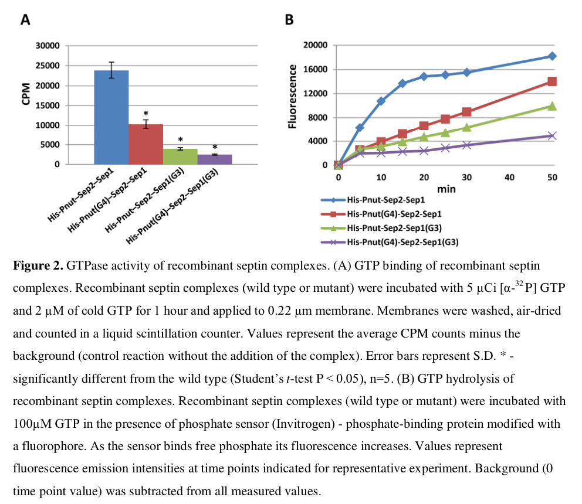

## Question

# Gene Research for Functional Annotation

## ⚠️ CRITICAL: Gene/Protein Identification Context

**BEFORE YOU BEGIN RESEARCH:** You MUST verify you are researching the CORRECT gene/protein. Gene symbols can be ambiguous, especially for less well-characterized genes from non-model organisms.

### Target Gene/Protein Identity (from UniProt):
- **UniProt Accession:** P42207
- **Protein Description:** RecName: Full=Septin-1 {ECO:0000303|PubMed:8590810}; AltName: Full=DIFF6 protein homolog {ECO:0000303|PubMed:9520435}; AltName: Full=Protein innocent bystander {ECO:0000303|PubMed:9520435};
- **Gene Information:** Name=Septin1 {ECO:0000303|PubMed:8590810, ECO:0000312|FlyBase:FBgn0011710}; Synonyms=Diff6 {ECO:0000303|PubMed:9520435}, iby {ECO:0000303|PubMed:9520435}, Sep1 {ECO:0000303|PubMed:8590810}; ORFNames=CG1403 {ECO:0000312|FlyBase:FBgn0011710};
- **Organism (full):** Drosophila melanogaster (Fruit fly).
- **Protein Family:** Belongs to the TRAFAC class TrmE-Era-EngA-EngB-Septin-like
- **Key Domains:** G_SEPTIN_dom. (IPR030379); P-loop_NTPase. (IPR027417); Septin. (IPR016491); Septin (PF00735)

### MANDATORY VERIFICATION STEPS:

1. **Check if the gene symbol "Septin1" matches the protein description above**
2. **Verify the organism is correct:** Drosophila melanogaster (Fruit fly).
3. **Check if protein family/domains align with what you find in literature**
4. **If you find literature for a DIFFERENT gene with the same or similar symbol, STOP**

### If Gene Symbol is Ambiguous or You Cannot Find Relevant Literature:

**DO NOT PROCEED WITH RESEARCH ON A DIFFERENT GENE.** Instead:
- State clearly: "The gene symbol 'Septin1' is ambiguous or literature is limited for this specific protein"
- Explain what you found (e.g., "Found extensive literature on a different gene with the same symbol in a different organism")
- Describe the protein based ONLY on the UniProt information provided above
- Suggest that the protein function can be inferred from domain/family information

### Research Target:

Please provide a comprehensive research report on the gene **Septin1** (gene ID: Septin1, UniProt: P42207) in DROME.

The research report should be a detailed narrative explaining the function, biological processes, and localization of the gene product. Citations should be given for all claims.

You should prioritize authoritative reviews and primary scientific literature when conducting research. You can supplement
this with annotations you find in gene/protein databases, but these can be outdated or inaccurate.

We are specifically interested in the primary function of the gene - for enzymes, what reaction is catalyzed, and what is the substrate specificity? For transporters, what is the substrate? For structural proteins or adapters, what is the broader structural role? For signaling molecules, what is the role in the pathway.

We are interested in where in or outside the cell the gene product carries out its function.

We are also interested in the signaling or biochemical pathways in which the gene functions. We are less interested in broad pleiotropic effects, except where these elucidate the precise role.

Include evidence where possible. We are interested in both experimental evidence as well as inference from structure, evolution, or bioinformatic analysis. Precise studies should be prioritized over high-throughput, where available.

## Output

Question: You are an expert researcher providing comprehensive, well-cited information.

Provide detailed information focusing on:
1. Key concepts and definitions with current understanding
2. Recent developments and latest research (prioritize 2023-2024 sources)
3. Current applications and real-world implementations
4. Expert opinions and analysis from authoritative sources
5. Relevant statistics and data from recent studies

Format as a comprehensive research report with proper citations. Include URLs and publication dates where available.
Always prioritize recent, authoritative sources and provide specific citations for all major claims.

# Gene Research for Functional Annotation

## ⚠️ CRITICAL: Gene/Protein Identification Context

**BEFORE YOU BEGIN RESEARCH:** You MUST verify you are researching the CORRECT gene/protein. Gene symbols can be ambiguous, especially for less well-characterized genes from non-model organisms.

### Target Gene/Protein Identity (from UniProt):
- **UniProt Accession:** P42207
- **Protein Description:** RecName: Full=Septin-1 {ECO:0000303|PubMed:8590810}; AltName: Full=DIFF6 protein homolog {ECO:0000303|PubMed:9520435}; AltName: Full=Protein innocent bystander {ECO:0000303|PubMed:9520435};
- **Gene Information:** Name=Septin1 {ECO:0000303|PubMed:8590810, ECO:0000312|FlyBase:FBgn0011710}; Synonyms=Diff6 {ECO:0000303|PubMed:9520435}, iby {ECO:0000303|PubMed:9520435}, Sep1 {ECO:0000303|PubMed:8590810}; ORFNames=CG1403 {ECO:0000312|FlyBase:FBgn0011710};
- **Organism (full):** Drosophila melanogaster (Fruit fly).
- **Protein Family:** Belongs to the TRAFAC class TrmE-Era-EngA-EngB-Septin-like
- **Key Domains:** G_SEPTIN_dom. (IPR030379); P-loop_NTPase. (IPR027417); Septin. (IPR016491); Septin (PF00735)

### MANDATORY VERIFICATION STEPS:

1. **Check if the gene symbol "Septin1" matches the protein description above**
2. **Verify the organism is correct:** Drosophila melanogaster (Fruit fly).
3. **Check if protein family/domains align with what you find in literature**
4. **If you find literature for a DIFFERENT gene with the same or similar symbol, STOP**

### If Gene Symbol is Ambiguous or You Cannot Find Relevant Literature:

**DO NOT PROCEED WITH RESEARCH ON A DIFFERENT GENE.** Instead:
- State clearly: "The gene symbol 'Septin1' is ambiguous or literature is limited for this specific protein"
- Explain what you found (e.g., "Found extensive literature on a different gene with the same symbol in a different organism")
- Describe the protein based ONLY on the UniProt information provided above
- Suggest that the protein function can be inferred from domain/family information

### Research Target:

Please provide a comprehensive research report on the gene **Septin1** (gene ID: Septin1, UniProt: P42207) in DROME.

The research report should be a detailed narrative explaining the function, biological processes, and localization of the gene product. Citations should be given for all claims.

You should prioritize authoritative reviews and primary scientific literature when conducting research. You can supplement
this with annotations you find in gene/protein databases, but these can be outdated or inaccurate.

We are specifically interested in the primary function of the gene - for enzymes, what reaction is catalyzed, and what is the substrate specificity? For transporters, what is the substrate? For structural proteins or adapters, what is the broader structural role? For signaling molecules, what is the role in the pathway.

We are interested in where in or outside the cell the gene product carries out its function.

We are also interested in the signaling or biochemical pathways in which the gene functions. We are less interested in broad pleiotropic effects, except where these elucidate the precise role.

Include evidence where possible. We are interested in both experimental evidence as well as inference from structure, evolution, or bioinformatic analysis. Precise studies should be prioritized over high-throughput, where available.

# Functional annotation of *Drosophila melanogaster* Septin1 (P42207)

## Identity and principal function

**Identity check.** This report concerns fruit-fly **Septin1**, also called **Sep1**, **Diff6** or **iby** (gene designation **CG1403**), as specified by the supplied UniProt accession [P42207](https://www.uniprot.org/uniprotkb/P42207/entry). It does **not** concern a human protein called SEPT1. The supplied septin/P-loop NTPase domain annotation agrees with fly-specific experiments identifying Sep1 as a GTP-binding component of the Pnut–Sep2–Sep1 septin assembly. The papers examined generally call the fly protein *Sep1* rather than printing its UniProt accession; the accession-to-name mapping here comes from the supplied record. (akhmetova2015functionalinsightinto pages 1-4, akhmetova2015functionalinsightinto pages 4-6)

**Functional conclusion.** Sep1 is a **filament-forming cortical septin and GTPase**. Its principal biological role is structural: together with Sep2 and Peanut (Pnut), it builds heteromeric assemblies that organize membrane-associated cell cortex during cytokinesis, embryonic cellularization and cell movement. Its experimentally established biochemical reaction is **GTP hydrolysis to GDP and inorganic phosphate**; GTP is its nucleotide substrate, not a transported molecule or a substrate for a biosynthetic pathway. The functional consequence of nucleotide binding and hydrolysis is regulation of septin assembly, rather than production of a metabolic end product. (akhmetova2015functionalinsightinto pages 1-4, akhmetova2015functionalinsightinto pages 4-6)

The following evidence matrix separates experiments on Sep1 itself from results obtained by disrupting another member of its complex.

| Setting and dated primary source DOI | Direct observation: Sep1-specific versus complex/Pnut evidence | Functional inference with limits |
|---|---|---|
| **Recombinant biochemistry (January 2015)** — [Akhmetova et al., DOI: 10.1091/mbc.E14-02-0734](https://doi.org/10.1091/mbc.E14-02-0734) | **Sep1-specific:** purified wild-type Sep1 incorporated and hydrolyzed GTP; G1/G3/G4 substitutions reduced both activities. A Sep1-G3 mutant caused a **4–6-fold** reduction in GTP binding/hydrolysis by the reconstituted Pnut–Sep2–Sep1 complex. **Complex evidence:** two copies of each subunit form a hexamer, and Orc6 promotes filament assembly. (akhmetova2015functionalinsightinto pages 4-6, akhmetova2015functionalinsightinto pages 26-42) | Sep1 is an active septin GTPase and a major source of the heterohexamer’s measured GTPase activity. Nucleotide-state transitions and intact GTPase motifs support complex integrity and polymerization, but no conventional soluble-substrate catalytic role or in-vivo Sep1-mutant rescue was demonstrated. |
| **Embryonic cellularization (September 2000)** — [Adam et al., DOI: 10.1091/mbc.11.9.3123](https://doi.org/10.1091/mbc.11.9.3123) | **Sep1-specific localization:** Pnut-deficient embryos lost Sep1 from the cellularization front, whereas Sep2 remained at approximately normal levels. **Pnut/complex perturbation:** F-actin failed to resolve normally into basal rings during fast cellularization, anillin progressively left the front, and later morphogenesis was disrupted; nevertheless, gross furrow ingression and cellularization continued. (adam2000evidenceforfunctional pages 1-2, adam2000evidenceforfunctional pages 5-7, adam2000evidenceforfunctional pages 7-10) | Pnut is required to recruit or stabilize Sep1 at embryonic furrows, supporting functional differentiation among fly septins. The cytoskeletal defects implicate the Sep1-containing complex in maintaining late furrow organization, but they do **not** prove a Sep1-specific requirement because Sep1 itself was not selectively disrupted. |
| **Polarized epithelial cytokinesis (11 February 2013)** — [Founounou et al., DOI: 10.1016/j.devcel.2013.01.008](https://doi.org/10.1016/j.devcel.2013.01.008) | **Sep1-specific localization:** Sep1–GFP followed the other septins from the cortex into the cytokinetic contractile ring. **Pnut/complex causality:** Pnut-null cells failed planar cytokinesis, showed an approximately **twofold** reduction in constriction rate and about **40%** less ring-associated anillin; orthogonal divisions remained largely competent. Pnut loss caused failure in **72% (18/25)** of planar sensory-organ precursor divisions and in **100% (n > 50)** of examined planar epidermal divisions. (founounou2013septinsregulatethe pages 4-5, founounou2013septinsregulatethe pages 2-3, founounou2013septinsregulatethe pages 3-4) | The Sep1-containing septin assembly supports actomyosin-ring organization and force generation needed to disengage and rebuild E-cadherin adherens junctions during planar division. Causality is established for Pnut/overall septin function, **not independently for Sep1**, because no Sep1-selective loss-of-function test was reported here. |
| **Ovarian border-cell migration (August 2023)** — [Gabbert et al., DOI: 10.1016/j.devcel.2023.05.017](https://doi.org/10.1016/j.devcel.2023.05.017) | **Sep1-specific perturbation:** either Sep1 RNAi or Sep1 overexpression impaired cluster detachment and migration; among manipulated clusters that detached, **30–70%** migrated abnormally. **Complex evidence:** Sep1/Sep2 depletion reduced Pnut, while Sep1/Pnut depletion reduced Sep2–GFP, showing interdependence. Active Rho increased cortical septins and dominant-negative Rho shifted them toward cytoplasmic puncta; artificially tethering Sep2–GFP-containing assemblies to membranes improved complete migration under Rho inhibition from **<50% to >80%**. (gabbert2023septinsregulateborder pages 28-37, gabbert2023septinsregulateborder pages 37-42, gabbert2023septinsregulateborder pages 42-48) | Proper Sep1-complex dosage tunes cortical texture and deformability downstream of Rho, enabling confined collective migration. The RNAi/overexpression results support a Sep1 requirement, but Rho recruitment and tether-rescue assays monitored Pnut/Sep2-containing assemblies—not direct physical Rho–Sep1 binding or Sep1 alone. |

*Table: Four primary studies separate direct evidence for Drosophila Sep1/P42207 from phenotypes inferred through Pnut or the assembled septin complex. The matrix highlights the strongest functional conclusions and the principal attribution limits.*

## Biochemical mechanism and molecular partners

Reconstituted fly septin complexes contain **two copies each of Sep1, Sep2 and Pnut**. A reported linear arrangement is **Pnut–Sep2–Sep1–Sep1–Sep2–Pnut**; the functional picture is an oligomer that can associate into higher-order filaments, not an independently acting Sep1 enzyme. In purified-protein experiments, Sep1 incorporated GTP and efficiently converted bound nucleotide to GDP, whereas Sep2 showed no noticeable GTPase activity in the same assays. Mutating Sep1’s conserved G1, G3 or G4 nucleotide-binding motifs reduced nucleotide incorporation and hydrolysis; a triple-motif Sep1 mutant could not assemble normally with the other subunits. In an otherwise assembled complex, a Sep1 G3 mutation decreased measured GTP-binding/hydrolysis activities **four- to sixfold**, compared with a **two- to threefold** decrease for a tested Pnut G4 mutation. These results identify Sep1 as a substantial contributor to the complex’s *in-vitro* GTPase activity; they do not establish a measured physiological turnover rate inside cells. [Biochemical figure and table](https://doi.org/10.1091/mbc.e14-02-0734) (akhmetova2018phosphorylationofpnut pages 29-36, akhmetova2015functionalinsightinto pages 4-6, akhmetova2015functionalinsightinto media 98a21d32, akhmetova2015functionalinsightinto media 8e7c3989)

Assembly is also regulated through protein contacts. The Drosophila origin-recognition-complex subunit **Orc6** binds the septin assembly through Pnut and promotes filament formation *in vitro*; Orc6 dimerization was proposed to help link assemblies. Thus, Orc6 is a mechanistic partner of the **Sep1-containing complex**, not evidence for direct Orc6–Sep1 binding. A [January 2018 study](https://doi.org/10.1534/g3.117.300186) found that phosphorylation of **Pnut**, particularly experimental alterations at T509/S517, changes septin-complex membrane association and filament behavior during early development. This is regulation of a complex containing Sep1, **not** proof that Sep1 is phosphorylated at those sites. (akhmetova2015functionalinsightinto pages 1-4, akhmetova2018phosphorylationofpnut pages 29-36, akhmetova2015functionalinsightinto pages 14-16)

## Localization and biological processes

**Embryonic cortex and cellularization.** Sep1 is present with Pnut and Sep2 at the advancing membrane/cytoskeletal front that partitions the early syncytial embryo into cells. After maternal **Pnut** depletion, Sep1 was **not detectable at that front**, whereas Sep2 remained detectable at approximately normal levels. Furrow ingression nevertheless proceeded at approximately normal overall speed and depth; during later cellularization, basal F-actin rings and anillin organization deteriorated, followed by pronounced gastrulation defects. The defensible inference is that the Pnut-dependent, Sep1-containing assembly helps **maintain and organize** the furrow cortex, not that Sep1 alone initiates ingression or that all cellularization fails without the complex. [Adam *et al.*, September 2000](https://doi.org/10.1091/mbc.11.9.3123). (adam2000evidenceforfunctional pages 1-2, adam2000evidenceforfunctional pages 5-7, adam2000evidenceforfunctional pages 7-10)

**Dividing epithelia.** Sep1–GFP was reported to follow other septins into the **cytokinetic contractile ring** of fly epithelial cells. In a [February 2013 primary study](https://doi.org/10.1016/j.devcel.2013.01.008), loss of **Pnut** impaired **planar** divisions, in which the furrow must remodel E-cadherin-containing adherens junctions, while the examined **orthogonal** divisions could proceed. Pnut-mutant rings constricted at roughly **half the control rate** and contained approximately **40% less ring-associated anillin** despite no reported reduction in total ring myosin signal. The study observed failed cytokinesis in **18/25 planar sensory-organ precursor divisions (72%)** and **all of more than 50 examined planar epidermal divisions**. These experiments support a mechanical role for septin assemblies in organizing actomyosin contractility sufficiently to disengage neighboring junctions and form daughter–daughter contacts. They should **not** be read as Sep1-specific loss-of-function measurements: most causal and quantitative tests used *pnut* mutants. (founounou2013septinsregulatethe pages 4-5, founounou2013septinsregulatethe pages 1-2, founounou2013septinsregulatethe pages 2-3, founounou2013septinsregulatethe pages 3-4)

**Ovarian collective migration: the most informative recent Sep1 perturbations.** In the peer-reviewed [Gabbert *et al.* study published August 2023](https://doi.org/10.1016/j.devcel.2023.05.017), Sep1, Sep2 and Pnut were present in border-cell clusters, with septin assemblies in both **cytoplasmic** and **plasma-membrane-associated** pools. Membrane enrichment was especially apparent at **border-cell–nurse-cell interfaces**. Unlike the older Pnut experiments, this study **directly depleted or overexpressed Sep1**: either manipulation impaired cluster detachment and migration. Among septin-knockdown or -overexpression clusters that detached, approximately **30–70%** still migrated abnormally. Sep1 knockdown also lowered Pnut abundance; depletion of Sep1 or Pnut lowered a Sep2–GFP reporter, consistent with interdependent subunit stability. The phenotype therefore implicates Sep1 but cannot be interpreted as a function performed entirely independently of the other septins. (gabbert2023septinsregulateborder pages 28-37)

The same 2023 study places this cortical activity **downstream of Rho signaling**. Constitutively active Rho increased cortical septin localization; dominant-negative Rho shifted septins toward cytoplasmic puncta. The effect persisted independently of tested Rho-kinase/myosin regulation. Experimentally tethering **Sep2–GFP-containing assemblies** to membranes increased completion of migration under dominant-negative Rho from **less than 50% to more than 80%**, supporting membrane recruitment as a consequential step. Septins and myosin appeared together dynamically at the cluster perimeter, but perturbation experiments did not show that either recruits the other there. The authors interpret septins as tuning **surface texture and deformability** while myosin controls contractility: septin depletion yielded a smoother, excessively protrusive cluster surface, whereas excess septin made surfaces rougher and clusters rounder, with both extremes impairing movement. These are experimentally supported collective-complex and cellular-mechanics conclusions; **direct biochemical binding between Rho and Sep1 was not demonstrated**. (gabbert2023septinsregulateborder pages 54-61, gabbert2023septinsregulateborder pages 37-42, gabbert2023septinsregulateborder pages 42-48)

## Evidence strength, uses and outstanding questions

The strongest **Sep1-specific** evidence comprises purified Sep1 nucleotide assays, targeted Sep1 mutations affecting assembly/complex GTPase activity, its localization to division structures, and 2023 Sep1 RNAi/overexpression phenotypes in migrating ovarian cells. Reported Sep1 mRNA was **1.6-fold enriched** in border cells relative to nonmigratory follicle cells and **1.8-fold lower** in migration-defective *slbo* mutant border cells; these expression measurements support biological context but are less decisive than the perturbations. The embryonic and epithelial causal experiments primarily target **Pnut**, so their defects cannot be assigned uniquely to Sep1. The fly work provides real-world **research applications**—genetic analysis of epithelial division and live imaging of collective migration—rather than an established clinical application or therapeutic target for this particular fly protein. (akhmetova2015functionalinsightinto pages 4-6, gabbert2023septinsregulateborder pages 54-61, founounou2013septinsregulatethe pages 2-3, founounou2013septinsregulatethe pages 3-4)

**Most useful annotation:** *A cytosolic and plasma-membrane-associated septin GTPase that assembles with Sep2 and Pnut into cortical oligomers/filaments, helping organize cytokinetic furrows and regulate Rho-dependent surface mechanics during collective migration.* Unresolved points include how Sep1’s individual nucleotide cycle operates in living tissues, whether Rho affects it through a direct partner, and how much of each Pnut-dependent cytokinesis phenotype specifically requires Sep1 rather than an alternative septin assembly. The latter distinction matters because Sep2 persisted at the cellularization front after Pnut-dependent Sep1 localization was lost. (adam2000evidenceforfunctional pages 1-2, akhmetova2015functionalinsightinto pages 4-6, adam2000evidenceforfunctional pages 7-10, gabbert2023septinsregulateborder pages 42-48)

References

1. (akhmetova2015functionalinsightinto pages 1-4): Katarina Akhmetova, Maxim Balasov, Richard P. H. Huijbregts, and Igor Chesnokov. Functional insight into the role of orc6 in septin complex filament formation in drosophila. Molecular Biology of the Cell, 26:15-28, Jan 2015. URL: https://doi.org/10.1091/mbc.e14-02-0734, doi:10.1091/mbc.e14-02-0734. This article has 39 citations and is from a domain leading peer-reviewed journal.

2. (akhmetova2015functionalinsightinto pages 4-6): Katarina Akhmetova, Maxim Balasov, Richard P. H. Huijbregts, and Igor Chesnokov. Functional insight into the role of orc6 in septin complex filament formation in drosophila. Molecular Biology of the Cell, 26:15-28, Jan 2015. URL: https://doi.org/10.1091/mbc.e14-02-0734, doi:10.1091/mbc.e14-02-0734. This article has 39 citations and is from a domain leading peer-reviewed journal.

3. (akhmetova2015functionalinsightinto pages 26-42): Katarina Akhmetova, Maxim Balasov, Richard P. H. Huijbregts, and Igor Chesnokov. Functional insight into the role of orc6 in septin complex filament formation in drosophila. Molecular Biology of the Cell, 26:15-28, Jan 2015. URL: https://doi.org/10.1091/mbc.e14-02-0734, doi:10.1091/mbc.e14-02-0734. This article has 39 citations and is from a domain leading peer-reviewed journal.

4. (adam2000evidenceforfunctional pages 1-2): Jennifer C. Adam, John R. Pringle, and Mark Peifer. Evidence for functional differentiation among drosophila septins in cytokinesis and cellularization. Molecular biology of the cell, 11 9:3123-35, Sep 2000. URL: https://doi.org/10.1091/mbc.11.9.3123, doi:10.1091/mbc.11.9.3123. This article has 183 citations and is from a domain leading peer-reviewed journal.

5. (adam2000evidenceforfunctional pages 5-7): Jennifer C. Adam, John R. Pringle, and Mark Peifer. Evidence for functional differentiation among drosophila septins in cytokinesis and cellularization. Molecular biology of the cell, 11 9:3123-35, Sep 2000. URL: https://doi.org/10.1091/mbc.11.9.3123, doi:10.1091/mbc.11.9.3123. This article has 183 citations and is from a domain leading peer-reviewed journal.

6. (adam2000evidenceforfunctional pages 7-10): Jennifer C. Adam, John R. Pringle, and Mark Peifer. Evidence for functional differentiation among drosophila septins in cytokinesis and cellularization. Molecular biology of the cell, 11 9:3123-35, Sep 2000. URL: https://doi.org/10.1091/mbc.11.9.3123, doi:10.1091/mbc.11.9.3123. This article has 183 citations and is from a domain leading peer-reviewed journal.

7. (founounou2013septinsregulatethe pages 4-5): Nabila Founounou, Nicolas Loyer, and Roland Le Borgne. Septins regulate the contractility of the actomyosin ring to enable adherens junction remodeling during cytokinesis of epithelial cells. Developmental cell, 24 3:242-55, Feb 2013. URL: https://doi.org/10.1016/j.devcel.2013.01.008, doi:10.1016/j.devcel.2013.01.008. This article has 181 citations and is from a highest quality peer-reviewed journal.

8. (founounou2013septinsregulatethe pages 2-3): Nabila Founounou, Nicolas Loyer, and Roland Le Borgne. Septins regulate the contractility of the actomyosin ring to enable adherens junction remodeling during cytokinesis of epithelial cells. Developmental cell, 24 3:242-55, Feb 2013. URL: https://doi.org/10.1016/j.devcel.2013.01.008, doi:10.1016/j.devcel.2013.01.008. This article has 181 citations and is from a highest quality peer-reviewed journal.

9. (founounou2013septinsregulatethe pages 3-4): Nabila Founounou, Nicolas Loyer, and Roland Le Borgne. Septins regulate the contractility of the actomyosin ring to enable adherens junction remodeling during cytokinesis of epithelial cells. Developmental cell, 24 3:242-55, Feb 2013. URL: https://doi.org/10.1016/j.devcel.2013.01.008, doi:10.1016/j.devcel.2013.01.008. This article has 181 citations and is from a highest quality peer-reviewed journal.

10. (gabbert2023septinsregulateborder pages 28-37): Allison M. Gabbert, Joseph P. Campanale, James A. Mondo, Noah P. Mitchell, Adele Myers, Sebastian J. Streichan, Nina Miolane, and Denise J. Montell. Septins regulate border cell surface geometry, shape, and motility downstream of rho in drosophila. Developmental Cell, 58:1399-1413.e5, Aug 2023. URL: https://doi.org/10.1016/j.devcel.2023.05.017, doi:10.1016/j.devcel.2023.05.017. This article has 18 citations and is from a highest quality peer-reviewed journal.

11. (gabbert2023septinsregulateborder pages 37-42): Allison M. Gabbert, Joseph P. Campanale, James A. Mondo, Noah P. Mitchell, Adele Myers, Sebastian J. Streichan, Nina Miolane, and Denise J. Montell. Septins regulate border cell surface geometry, shape, and motility downstream of rho in drosophila. Developmental Cell, 58:1399-1413.e5, Aug 2023. URL: https://doi.org/10.1016/j.devcel.2023.05.017, doi:10.1016/j.devcel.2023.05.017. This article has 18 citations and is from a highest quality peer-reviewed journal.

12. (gabbert2023septinsregulateborder pages 42-48): Allison M. Gabbert, Joseph P. Campanale, James A. Mondo, Noah P. Mitchell, Adele Myers, Sebastian J. Streichan, Nina Miolane, and Denise J. Montell. Septins regulate border cell surface geometry, shape, and motility downstream of rho in drosophila. Developmental Cell, 58:1399-1413.e5, Aug 2023. URL: https://doi.org/10.1016/j.devcel.2023.05.017, doi:10.1016/j.devcel.2023.05.017. This article has 18 citations and is from a highest quality peer-reviewed journal.

13. (akhmetova2018phosphorylationofpnut pages 29-36): Katarina Akhmetova, Maxim Balasov, Anton Svitin, Elena Chesnokova, Matthew Renfrow, and Igor Chesnokov. Phosphorylation of pnut in the early stages of<i>drosophila</i>embryo development affects association of the septin complex with the membrane and is important for viability. G3 Genes|Genomes|Genetics, 8:27-38, Jan 2018. URL: https://doi.org/10.1534/g3.117.300186, doi:10.1534/g3.117.300186. This article has 11 citations.

14. (akhmetova2015functionalinsightinto media 98a21d32): Katarina Akhmetova, Maxim Balasov, Richard P. H. Huijbregts, and Igor Chesnokov. Functional insight into the role of orc6 in septin complex filament formation in drosophila. Molecular Biology of the Cell, 26:15-28, Jan 2015. URL: https://doi.org/10.1091/mbc.e14-02-0734, doi:10.1091/mbc.e14-02-0734. This article has 39 citations and is from a domain leading peer-reviewed journal.

15. (akhmetova2015functionalinsightinto media 8e7c3989): Katarina Akhmetova, Maxim Balasov, Richard P. H. Huijbregts, and Igor Chesnokov. Functional insight into the role of orc6 in septin complex filament formation in drosophila. Molecular Biology of the Cell, 26:15-28, Jan 2015. URL: https://doi.org/10.1091/mbc.e14-02-0734, doi:10.1091/mbc.e14-02-0734. This article has 39 citations and is from a domain leading peer-reviewed journal.

16. (akhmetova2015functionalinsightinto pages 14-16): Katarina Akhmetova, Maxim Balasov, Richard P. H. Huijbregts, and Igor Chesnokov. Functional insight into the role of orc6 in septin complex filament formation in drosophila. Molecular Biology of the Cell, 26:15-28, Jan 2015. URL: https://doi.org/10.1091/mbc.e14-02-0734, doi:10.1091/mbc.e14-02-0734. This article has 39 citations and is from a domain leading peer-reviewed journal.

17. (founounou2013septinsregulatethe pages 1-2): Nabila Founounou, Nicolas Loyer, and Roland Le Borgne. Septins regulate the contractility of the actomyosin ring to enable adherens junction remodeling during cytokinesis of epithelial cells. Developmental cell, 24 3:242-55, Feb 2013. URL: https://doi.org/10.1016/j.devcel.2013.01.008, doi:10.1016/j.devcel.2013.01.008. This article has 181 citations and is from a highest quality peer-reviewed journal.

18. (gabbert2023septinsregulateborder pages 54-61): Allison M. Gabbert, Joseph P. Campanale, James A. Mondo, Noah P. Mitchell, Adele Myers, Sebastian J. Streichan, Nina Miolane, and Denise J. Montell. Septins regulate border cell surface geometry, shape, and motility downstream of rho in drosophila. Developmental Cell, 58:1399-1413.e5, Aug 2023. URL: https://doi.org/10.1016/j.devcel.2023.05.017, doi:10.1016/j.devcel.2023.05.017. This article has 18 citations and is from a highest quality peer-reviewed journal.

## Artifacts

- [Edison artifact artifact-00](Septin1-deep-research-falcon_artifacts/artifact-00.md)

## Citations

1. gabbert2023septinsregulateborder pages 28-37
2. akhmetova2015functionalinsightinto pages 1-4
3. akhmetova2015functionalinsightinto pages 4-6
4. akhmetova2015functionalinsightinto pages 26-42
5. adam2000evidenceforfunctional pages 1-2
6. adam2000evidenceforfunctional pages 5-7
7. adam2000evidenceforfunctional pages 7-10
8. founounou2013septinsregulatethe pages 4-5
9. founounou2013septinsregulatethe pages 2-3
10. founounou2013septinsregulatethe pages 3-4
11. gabbert2023septinsregulateborder pages 37-42
12. gabbert2023septinsregulateborder pages 42-48
13. akhmetova2018phosphorylationofpnut pages 29-36
14. akhmetova2015functionalinsightinto pages 14-16
15. founounou2013septinsregulatethe pages 1-2
16. gabbert2023septinsregulateborder pages 54-61
17. P42207
18. Akhmetova et al., DOI: 10.1091/mbc.E14-02-0734
19. Adam et al., DOI: 10.1091/mbc.11.9.3123
20. Founounou et al., DOI: 10.1016/j.devcel.2013.01.008
21. Gabbert et al., DOI: 10.1016/j.devcel.2023.05.017
22. Biochemical figure and table
23. January 2018 study
24. Adam *et al.*, September 2000
25. February 2013 primary study
26. Gabbert *et al.* study published August 2023
27. https://www.uniprot.org/uniprotkb/P42207/entry
28. https://doi.org/10.1091/mbc.E14-02-0734
29. https://doi.org/10.1091/mbc.11.9.3123
30. https://doi.org/10.1016/j.devcel.2013.01.008
31. https://doi.org/10.1016/j.devcel.2023.05.017
32. https://doi.org/10.1091/mbc.e14-02-0734
33. https://doi.org/10.1534/g3.117.300186
34. https://doi.org/10.1091/mbc.e14-02-0734,
35. https://doi.org/10.1091/mbc.11.9.3123,
36. https://doi.org/10.1016/j.devcel.2013.01.008,
37. https://doi.org/10.1016/j.devcel.2023.05.017,
38. https://doi.org/10.1534/g3.117.300186,