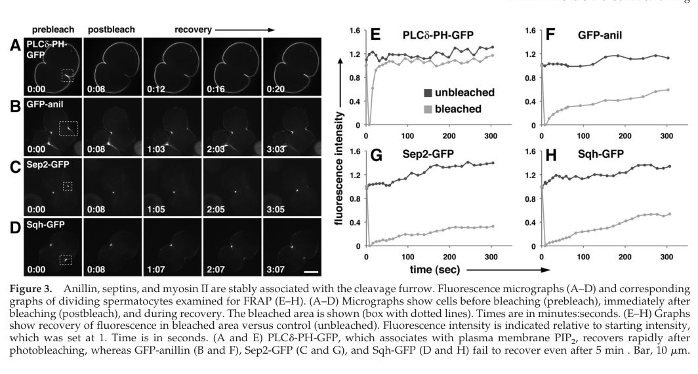

## Question

# Gene Research for Functional Annotation

## ⚠️ CRITICAL: Gene/Protein Identification Context

**BEFORE YOU BEGIN RESEARCH:** You MUST verify you are researching the CORRECT gene/protein. Gene symbols can be ambiguous, especially for less well-characterized genes from non-model organisms.

### Target Gene/Protein Identity (from UniProt):
- **UniProt Accession:** P54359
- **Protein Description:** RecName: Full=Septin-2 {ECO:0000312|FlyBase:FBgn0014029};
- **Gene Information:** Name=Septin2 {ECO:0000312|FlyBase:FBgn0014029}; Synonyms=Sep2 {ECO:0000312|FlyBase:FBgn0014029}; ORFNames=CG4173 {ECO:0000312|FlyBase:FBgn0014029};
- **Organism (full):** Drosophila melanogaster (Fruit fly).
- **Protein Family:** Belongs to the TRAFAC class TrmE-Era-EngA-EngB-Septin-like
- **Key Domains:** G_SEPTIN_dom. (IPR030379); P-loop_NTPase. (IPR027417); Septin. (IPR016491); Septin (PF00735)

### MANDATORY VERIFICATION STEPS:

1. **Check if the gene symbol "Septin2" matches the protein description above**
2. **Verify the organism is correct:** Drosophila melanogaster (Fruit fly).
3. **Check if protein family/domains align with what you find in literature**
4. **If you find literature for a DIFFERENT gene with the same or similar symbol, STOP**

### If Gene Symbol is Ambiguous or You Cannot Find Relevant Literature:

**DO NOT PROCEED WITH RESEARCH ON A DIFFERENT GENE.** Instead:
- State clearly: "The gene symbol 'Septin2' is ambiguous or literature is limited for this specific protein"
- Explain what you found (e.g., "Found extensive literature on a different gene with the same symbol in a different organism")
- Describe the protein based ONLY on the UniProt information provided above
- Suggest that the protein function can be inferred from domain/family information

### Research Target:

Please provide a comprehensive research report on the gene **Septin2** (gene ID: Septin2, UniProt: P54359) in DROME.

The research report should be a detailed narrative explaining the function, biological processes, and localization of the gene product. Citations should be given for all claims.

You should prioritize authoritative reviews and primary scientific literature when conducting research. You can supplement
this with annotations you find in gene/protein databases, but these can be outdated or inaccurate.

We are specifically interested in the primary function of the gene - for enzymes, what reaction is catalyzed, and what is the substrate specificity? For transporters, what is the substrate? For structural proteins or adapters, what is the broader structural role? For signaling molecules, what is the role in the pathway.

We are interested in where in or outside the cell the gene product carries out its function.

We are also interested in the signaling or biochemical pathways in which the gene functions. We are less interested in broad pleiotropic effects, except where these elucidate the precise role.

Include evidence where possible. We are interested in both experimental evidence as well as inference from structure, evolution, or bioinformatic analysis. Precise studies should be prioritized over high-throughput, where available.

## Output

Question: You are an expert researcher providing comprehensive, well-cited information.

Provide detailed information focusing on:
1. Key concepts and definitions with current understanding
2. Recent developments and latest research (prioritize 2023-2024 sources)
3. Current applications and real-world implementations
4. Expert opinions and analysis from authoritative sources
5. Relevant statistics and data from recent studies

Format as a comprehensive research report with proper citations. Include URLs and publication dates where available.
Always prioritize recent, authoritative sources and provide specific citations for all major claims.

# Gene Research for Functional Annotation

## ⚠️ CRITICAL: Gene/Protein Identification Context

**BEFORE YOU BEGIN RESEARCH:** You MUST verify you are researching the CORRECT gene/protein. Gene symbols can be ambiguous, especially for less well-characterized genes from non-model organisms.

### Target Gene/Protein Identity (from UniProt):
- **UniProt Accession:** P54359
- **Protein Description:** RecName: Full=Septin-2 {ECO:0000312|FlyBase:FBgn0014029};
- **Gene Information:** Name=Septin2 {ECO:0000312|FlyBase:FBgn0014029}; Synonyms=Sep2 {ECO:0000312|FlyBase:FBgn0014029}; ORFNames=CG4173 {ECO:0000312|FlyBase:FBgn0014029};
- **Organism (full):** Drosophila melanogaster (Fruit fly).
- **Protein Family:** Belongs to the TRAFAC class TrmE-Era-EngA-EngB-Septin-like
- **Key Domains:** G_SEPTIN_dom. (IPR030379); P-loop_NTPase. (IPR027417); Septin. (IPR016491); Septin (PF00735)

### MANDATORY VERIFICATION STEPS:

1. **Check if the gene symbol "Septin2" matches the protein description above**
2. **Verify the organism is correct:** Drosophila melanogaster (Fruit fly).
3. **Check if protein family/domains align with what you find in literature**
4. **If you find literature for a DIFFERENT gene with the same or similar symbol, STOP**

### If Gene Symbol is Ambiguous or You Cannot Find Relevant Literature:

**DO NOT PROCEED WITH RESEARCH ON A DIFFERENT GENE.** Instead:
- State clearly: "The gene symbol 'Septin2' is ambiguous or literature is limited for this specific protein"
- Explain what you found (e.g., "Found extensive literature on a different gene with the same symbol in a different organism")
- Describe the protein based ONLY on the UniProt information provided above
- Suggest that the protein function can be inferred from domain/family information

### Research Target:

Please provide a comprehensive research report on the gene **Septin2** (gene ID: Septin2, UniProt: P54359) in DROME.

The research report should be a detailed narrative explaining the function, biological processes, and localization of the gene product. Citations should be given for all claims.

You should prioritize authoritative reviews and primary scientific literature when conducting research. You can supplement
this with annotations you find in gene/protein databases, but these can be outdated or inaccurate.

We are specifically interested in the primary function of the gene - for enzymes, what reaction is catalyzed, and what is the substrate specificity? For transporters, what is the substrate? For structural proteins or adapters, what is the broader structural role? For signaling molecules, what is the role in the pathway.

We are interested in where in or outside the cell the gene product carries out its function.

We are also interested in the signaling or biochemical pathways in which the gene functions. We are less interested in broad pleiotropic effects, except where these elucidate the precise role.

Include evidence where possible. We are interested in both experimental evidence as well as inference from structure, evolution, or bioinformatic analysis. Precise studies should be prioritized over high-throughput, where available.

# Functional annotation report: *Drosophila melanogaster* Septin2

## Identity and principal function

**Identity check.** This report concerns fly **Septin2**, also called **Sep2** or **CG4173** (FlyBase **FBgn0014029**; UniProt **[P54359](https://www.uniprot.org/uniprotkb/P54359/entry)**). Its supplied septin-domain and P-loop-NTPase annotations agree with experiments identifying Sep2 as a guanine-nucleotide-binding component of purified *Drosophila* septin complexes. **Fly Sep2 must not be confused with human SEPT2**: biochemical and comparative work instead places fly Sep2 in the SEPT6-like position of the complex; fly Sep1 is the SEPT2-like subunit. (field1996apurifieddrosophila pages 1-2, akhmetova2015functionalinsightinto pages 4-6)

**Primary molecular role.** Sep2 is principally a **structural, GTP-bound subunit of a polymerizing cortical septin scaffold**, not an enzyme with an established independent catalytic reaction. Purified embryonic complexes contain Pnut, Sep1 and Sep2, with evidence for a six-subunit assembly comprising two copies of each; they assemble into filaments and bind guanine nucleotides. The purified complex hydrolyzes added GTP, but assays of the individual proteins found **no detectable Sep2 GTPase activity or appreciable exchange of its bound GTP**. GTP hydrolysis by the complex was attributable mainly to Sep1 and, to a lesser extent, Pnut. Thus, describing P54359 itself as catalyzing GTP hydrolysis would overstate the evidence. GTP is its relevant bound nucleotide; no alternative physiological substrate has been established. (field1996apurifieddrosophila pages 1-2, field1996apurifieddrosophila pages 6-7, akhmetova2015functionalinsightinto pages 4-6)

The structural interpretation has experimental support: mutations in Sep2’s conserved G1/G3/G4 nucleotide-binding motifs diminish association of Sep1 with the reconstituted complex. Sep2 therefore helps maintain subunit interfaces and assemble the membrane-associated septin structures that organize cell shape and division. Its proposed G-interface relationship to Sep1 draws partly on comparison with mammalian septin structures, rather than a solved fly Sep2 interface. (akhmetova2015functionalinsightinto pages 11-14, akhmetova2015functionalinsightinto pages 4-6)

The table separates findings measured directly for Sep2 from mechanisms established primarily by perturbing another septin.

| Biological setting | Direct Sep2-specific evidence and principal finding | Inference / limitation | Publication, DOI URL and year |
|---|---|---|---|
| Purified embryonic septin complex | Native Sep2 copurifies with Pnut and Sep1 as a hexamer containing two copies of each subunit. The complex binds about **1.1 guanine nucleotides per septin subunit** and forms 7–9-nm filaments (field1996apurifieddrosophila pages 1-2, field1996apurifieddrosophila pages 6-7) | GTP hydrolysis measured for the intact complex cannot be assigned to Sep2 alone. | Field et al., [10.1083/jcb.133.3.605](https://doi.org/10.1083/jcb.133.3.605), 1996 |
| Recombinant biochemistry and assembly | Purified Sep2 had **no detectable intrinsic GTPase activity** and did not appreciably exchange bound GTP. Mutating its G1/G3/G4 motifs weakened Sep1 association, supporting a nucleotide-dependent structural role in heteromer assembly (akhmetova2015functionalinsightinto pages 11-14, akhmetova2015functionalinsightinto pages 4-6) | Complex GTP hydrolysis derives principally from Sep1 and, to a lesser extent, Pnut; Sep2 is better classified as a GTP-bound structural septin than as an active enzyme. | Akhmetova et al., [10.1091/mbc.e14-02-0734](https://doi.org/10.1091/mbc.e14-02-0734), 2015 |
| Embryonic cellularization | In embryos lacking maternal Pnut, Sep1 disappeared from the cellularization front, whereas Sep2 remained at approximately normal levels throughout cellularization (adam2000evidenceforfunctional pages 1-2, adam2000evidenceforfunctional pages 7-10) | Shows that Sep2 localization can persist independently of the canonical Pnut–Sep1–Sep2 complex, possibly through alternative partners; it is not a Sep2-loss experiment. | Adam et al., [10.1091/mbc.11.9.3123](https://doi.org/10.1091/mbc.11.9.3123), 2000 |
| Spermatocyte cytokinesis | Sep2-GFP concentrates at the cleavage furrow and recovers only **20.6 ± 3.9% after 5 min** in FRAP experiments (**n = 5**), indicating stable incorporation into the furrow scaffold. Anillin depletion removes Sep2 from the furrow (goldbach2010stabilizationofthe pages 4-6, goldbach2010stabilizationofthe media 2d0f6667) | Establishes Sep2 localization, stability and dependence on anillin, but does not directly test Sep2 loss of function. | Goldbach et al., [10.1091/mbc.e09-08-0714](https://doi.org/10.1091/mbc.e09-08-0714), 2010 |
| Border-cell collective migration | Sep2::GFP occurs in cytoplasmic and membrane pools and is enriched at border-cell–nurse-cell interfaces. Active Rho promotes membrane recruitment; membrane-tethering Sep2::GFP improves complete migration in RhoDN clusters from **<50% to >80%**. Sep2 RNAi, overexpression and homozygous null mutation impair migration (gabbert2023septinsregulateborder pages 28-37, gabbert2023septinsregulateborder pages 42-48, gabbert2023septinsregulateborder pages 76-82) | The null result was not numerically recoverable. Because Sep1, Sep2 and Pnut are interdependent, many phenotypes reflect disruption of the complete septin assembly rather than a Sep2-only biochemical activity. | Gabbert et al., [10.1016/j.devcel.2023.05.017](https://doi.org/10.1016/j.devcel.2023.05.017), 2023 |
| Epithelial cytokinesis—contextual evidence | Pnut-dependent septin function supports actomyosin-ring contraction and adherens-junction remodeling during planar epithelial division (founounou2013septinsregulatethe pages 11-12, founounou2013septinsregulatethe pages 1-2) | Pnut, not Sep2, was the principal manipulated septin; this supports a complex-level mechanism but is not direct Sep2 functional evidence. | Founounou et al., [10.1016/j.devcel.2013.01.008](https://doi.org/10.1016/j.devcel.2013.01.008), 2013 |
| Male-meiotic COPII trafficking—contextual evidence | COPII depletion caused anilloseptin-ring detachment and implicated DE-cadherin trafficking in maintaining contractile-ring anchorage (matsuura2024essentialroleof pages 1-2, matsuura2024essentialroleof pages 11-13) | The measured septin was **Septin1**, not Sep2; these findings define current cytokinetic context and must not be assigned specifically to P54359. | Matsuura et al., [10.3390/ijms25084526](https://doi.org/10.3390/ijms25084526), 2024 |

*Table: Direct and contextual evidence for Drosophila melanogaster Sep2 (CG4173; P54359), spanning biochemical assembly, localization and organismal phenotypes. The table explicitly separates Sep2-specific results from findings involving other septins.*

## Where Sep2 acts and what it does

**Cell cortex during collective migration.** A Sep2::GFP transgene expressed from Sep2 regulatory sequences labels ovarian follicle cells, including migrating border cells. Sep2 occurs in cytoplasmic and membrane-associated pools; the septin complex is especially enriched on the border-cell surface facing surrounding nurse cells. Sep2 colocalizes with Pnut, and reducing Sep2 lowers Pnut abundance, consistent with interdependent subunit stability. This is an **intracellular, plasma-membrane-associated cortical protein**, not a secreted factor. (gabbert2023septinsregulateborder pages 28-37)

The clearest recent physiological mechanism comes from **Gabbert et al., 2023**. Dominant-negative Rho shifts septins away from border-cell membranes, whereas activated Rho increases cortical recruitment; manipulating Rho kinase or myosin does not reproduce this septin-localization effect. Experimentally tethering Sep2::GFP to the membrane in dominant-negative-Rho clusters improved the proportion completing migration at stage 10 from **<50% to >80%**. These results support a **Rho → membrane-associated Sep2-containing septin assembly → cortical geometry and collective migration** branch, alongside a separately regulated Rho–myosin contractility branch. Membrane tethering likely recruits or stabilizes the *complex*, not Sep2 alone. (gabbert2023septinsregulateborder pages 37-42, gabbert2023septinsregulateborder pages 42-48)

Direct Sep2 RNAi and Sep2 overexpression both impair border-cell detachment and migration. **Homozygous Sep2-null flies**, but not Sep2 heterozygotes or homozygous Sep5-null flies, also show impaired border-cell migration. The source does not provide a reliably extractable numerical effect size for that specific Sep2-null comparison. In the study’s septin-expression perturbations, depletion produced smoother surfaces and more protrusive, irregular clusters, whereas overexpression produced finer-scale surface roughness and rounder clusters. These shape analyses represent septin-complex perturbations and should not all be interpreted as Sep2-only effects. (gabbert2023septinsregulateborder pages 28-37, gabbert2023septinsregulateborder pages 76-82, gabbert2023septinsregulateborder pages 48-54)

Sep2::GFP and myosin-light-chain Sqh::mCherry also move together along the migrating cluster periphery. Nevertheless, reducing myosin did not detectably redistribute Pnut, and septin knockdown did not detectably change Sqh abundance; altered septin expression likewise did not significantly change E-cadherin localization in these border cells. **Colocalization does not establish direct Sep2–myosin binding or a Sep2–cadherin pathway in this setting.** (gabbert2023septinsregulateborder pages 37-42)

**Division furrows.** In dividing male spermatocytes, Sep2 and Pnut concentrate at the cleavage furrow. Sep2-GFP fluorescence recovered to only **20.6 ± 3.9% of its starting level after five minutes** following photobleaching (**n = 5**), consistent with a comparatively stable furrow-associated assembly; the authors caution that movement during constriction may inflate apparent recovery. Depletion of the scaffold protein Anillin removes Sep2 from the furrow, placing Sep2-containing septins in an **Anillin-dependent contractile-ring/membrane-anchoring system**. This experiment establishes Sep2 localization and recruitment dependence, not the phenotype of selectively removing Sep2 from spermatocytes. The study’s Figure 3 provides the Sep2-GFP recovery trace. (goldbach2010stabilizationofthe pages 4-6, goldbach2010stabilizationofthe media 2d0f6667)

**Embryonic cellularization and context dependence.** Sep2 is also detected at the advancing cellularization front. In embryos depleted of maternal Pnut, Sep1 was no longer detectable there, yet Sep2 remained at approximately normal levels. This directly cautions against assuming that *every* Sep2 pool must contain the canonical Pnut–Sep1–Sep2 assembly. The proposal that Sep2 supports early furrow organization with alternative partners remains a hypothesis: the experiment removed **Pnut**, not Sep2. (adam2000evidenceforfunctional pages 1-2, adam2000evidenceforfunctional pages 7-10)

## Biochemical pathways, interacting systems and limits of attribution

The best-supported Sep2-associated systems are **septin heteromer assembly**, **Rho-regulated cortical remodeling in border cells**, and **Anillin-associated cytokinetic furrows**. Purified embryonic septin filaments were **7–9 nm** in diameter and the complex contained approximately **1.1 bound guanine nucleotides per septin polypeptide**. In vitro, Orc6 interacts with the septin complex through Pnut and promotes its filament formation; **this is evidence for regulation of a Sep2-containing complex, not a demonstrated direct Orc6–Sep2 interaction**. (field1996apurifieddrosophila pages 6-7, akhmetova2015functionalinsightinto pages 1-4, akhmetova2015functionalinsightinto pages 4-6)

Two relevant tissue mechanisms require the same qualification. Experiments in dividing epithelia show that septins help the actomyosin ring overcome neighboring-cell tension and remodel E-cadherin-containing adherens junctions, but the principal mutant examined was **pnut**, not **Sep2**. A **2024** spermatocyte study reports that COPII depletion disrupts anchoring of anilloseptin and actomyosin rings and implicates DE-cadherin trafficking; its assayed septin was **Septin1**, not Sep2. Neither result establishes a Sep2-specific cadherin-trafficking or COPII function. Likewise, Sep5 is a related but distinct fly septin: its possible partial redundancy cannot be used to relabel Sep5 results as Sep2 results. (founounou2013septinsregulatethe pages 1-2, founounou2013septinsregulatethe pages 11-12, matsuura2024essentialroleof pages 1-2, matsuura2024essentialroleof pages 11-13, gabbert2023septinsregulateborder pages 76-82)

**Functional-annotation conclusion:** annotate P54359 primarily as a **GTP-binding, filament-assembling septin scaffold subunit** acting at the **cytoplasmic face of the plasma membrane, cell cortex and division furrow**. The strongest Sep2-specific organismal evidence concerns dosage-sensitive **border-cell collective migration**; additional direct localization evidence supports roles in **cellularization** and **spermatocyte cytokinetic structures**. A Sep2-specific catalytic GTP-hydrolysis reaction, direct myosin binding and universal participation in a single invariant septin complex have **not** been established by the cited experiments. (akhmetova2015functionalinsightinto pages 4-6, gabbert2023septinsregulateborder pages 28-37, gabbert2023septinsregulateborder pages 42-48, goldbach2010stabilizationofthe pages 4-6, adam2000evidenceforfunctional pages 7-10)

### Principal primary sources and dates

- Gabbert AM *et al.* **August 2023**. “Septins regulate border cell surface geometry, shape, and motility downstream of Rho in *Drosophila*.” *Developmental Cell* 58:1399–1413.e5. [doi:10.1016/j.devcel.2023.05.017](https://doi.org/10.1016/j.devcel.2023.05.017). (gabbert2023septinsregulateborder pages 28-37, gabbert2023septinsregulateborder pages 42-48)
- Matsuura Y *et al.* **20 April 2024**. “Essential Role of COPII Proteins in Maintaining the Contractile Ring Anchoring to the Plasma Membrane during Cytokinesis in *Drosophila* Male Meiosis.” *International Journal of Molecular Sciences* 25:4526. [doi:10.3390/ijms25084526](https://doi.org/10.3390/ijms25084526). **Contextual; not Sep2-specific.** (matsuura2024essentialroleof pages 1-2, matsuura2024essentialroleof pages 11-13)
- Akhmetova K *et al.* **January 2015**. “Functional insight into the role of Orc6 in septin complex filament formation in *Drosophila*.” *Molecular Biology of the Cell* 26:15–28. [doi:10.1091/mbc.e14-02-0734](https://doi.org/10.1091/mbc.e14-02-0734). (akhmetova2015functionalinsightinto pages 4-6)
- Founounou N *et al.* **February 2013**. “Septins Regulate the Contractility of the Actomyosin Ring to Enable Adherens Junction Remodeling during Cytokinesis of Epithelial Cells.” *Developmental Cell* 24:242–255. [doi:10.1016/j.devcel.2013.01.008](https://doi.org/10.1016/j.devcel.2013.01.008). **Principally Pnut perturbation.** (founounou2013septinsregulatethe pages 1-2)
- Goldbach P *et al.* **May 2010**. “Stabilization of the Actomyosin Ring Enables Spermatocyte Cytokinesis in *Drosophila*.” *Molecular Biology of the Cell* 21:1482–1493. [doi:10.1091/mbc.e09-08-0714](https://doi.org/10.1091/mbc.e09-08-0714). (goldbach2010stabilizationofthe pages 4-6)
- Adam JC *et al.* **September 2000**. “Evidence for Functional Differentiation among *Drosophila* Septins in Cytokinesis and Cellularization.” *Molecular Biology of the Cell* 11:3123–3135. [doi:10.1091/mbc.11.9.3123](https://doi.org/10.1091/mbc.11.9.3123). (adam2000evidenceforfunctional pages 1-2, adam2000evidenceforfunctional pages 7-10)
- Field CM *et al.* **1 May 1996**. “A Purified *Drosophila* Septin Complex Forms Filaments and Exhibits GTPase Activity.” *Journal of Cell Biology* 133:605–616. [doi:10.1083/jcb.133.3.605](https://doi.org/10.1083/jcb.133.3.605). (field1996apurifieddrosophila pages 1-2, field1996apurifieddrosophila pages 6-7)

References

1. (field1996apurifieddrosophila pages 1-2): C. Field, Omayma S. Al-Awar, J. Rosenblatt, M. Wong, B. Alberts, and T. Mitchison. A purified drosophila septin complex forms filaments and exhibits gtpase activity. The Journal of Cell Biology, 133:605-616, May 1996. URL: https://doi.org/10.1083/jcb.133.3.605, doi:10.1083/jcb.133.3.605. This article has 408 citations.

2. (akhmetova2015functionalinsightinto pages 4-6): Katarina Akhmetova, Maxim Balasov, Richard P. H. Huijbregts, and Igor Chesnokov. Functional insight into the role of orc6 in septin complex filament formation in drosophila. Molecular Biology of the Cell, 26:15-28, Jan 2015. URL: https://doi.org/10.1091/mbc.e14-02-0734, doi:10.1091/mbc.e14-02-0734. This article has 39 citations and is from a domain leading peer-reviewed journal.

3. (field1996apurifieddrosophila pages 6-7): C. Field, Omayma S. Al-Awar, J. Rosenblatt, M. Wong, B. Alberts, and T. Mitchison. A purified drosophila septin complex forms filaments and exhibits gtpase activity. The Journal of Cell Biology, 133:605-616, May 1996. URL: https://doi.org/10.1083/jcb.133.3.605, doi:10.1083/jcb.133.3.605. This article has 408 citations.

4. (akhmetova2015functionalinsightinto pages 11-14): Katarina Akhmetova, Maxim Balasov, Richard P. H. Huijbregts, and Igor Chesnokov. Functional insight into the role of orc6 in septin complex filament formation in drosophila. Molecular Biology of the Cell, 26:15-28, Jan 2015. URL: https://doi.org/10.1091/mbc.e14-02-0734, doi:10.1091/mbc.e14-02-0734. This article has 39 citations and is from a domain leading peer-reviewed journal.

5. (adam2000evidenceforfunctional pages 1-2): Jennifer C. Adam, John R. Pringle, and Mark Peifer. Evidence for functional differentiation among drosophila septins in cytokinesis and cellularization. Molecular biology of the cell, 11 9:3123-35, Sep 2000. URL: https://doi.org/10.1091/mbc.11.9.3123, doi:10.1091/mbc.11.9.3123. This article has 183 citations and is from a domain leading peer-reviewed journal.

6. (adam2000evidenceforfunctional pages 7-10): Jennifer C. Adam, John R. Pringle, and Mark Peifer. Evidence for functional differentiation among drosophila septins in cytokinesis and cellularization. Molecular biology of the cell, 11 9:3123-35, Sep 2000. URL: https://doi.org/10.1091/mbc.11.9.3123, doi:10.1091/mbc.11.9.3123. This article has 183 citations and is from a domain leading peer-reviewed journal.

7. (goldbach2010stabilizationofthe pages 4-6): Philip Goldbach, Raymond Wong, Nolan Beise, Ritu Sarpal, William S. Trimble, and Julie A. Brill. Stabilization of the actomyosin ring enables spermatocyte cytokinesis in drosophila. Molecular Biology of the Cell, 21:1482-1493, May 2010. URL: https://doi.org/10.1091/mbc.e09-08-0714, doi:10.1091/mbc.e09-08-0714. This article has 84 citations and is from a domain leading peer-reviewed journal.

8. (goldbach2010stabilizationofthe media 2d0f6667): Philip Goldbach, Raymond Wong, Nolan Beise, Ritu Sarpal, William S. Trimble, and Julie A. Brill. Stabilization of the actomyosin ring enables spermatocyte cytokinesis in drosophila. Molecular Biology of the Cell, 21:1482-1493, May 2010. URL: https://doi.org/10.1091/mbc.e09-08-0714, doi:10.1091/mbc.e09-08-0714. This article has 84 citations and is from a domain leading peer-reviewed journal.

9. (gabbert2023septinsregulateborder pages 28-37): Allison M. Gabbert, Joseph P. Campanale, James A. Mondo, Noah P. Mitchell, Adele Myers, Sebastian J. Streichan, Nina Miolane, and Denise J. Montell. Septins regulate border cell surface geometry, shape, and motility downstream of rho in drosophila. Developmental Cell, 58:1399-1413.e5, Aug 2023. URL: https://doi.org/10.1016/j.devcel.2023.05.017, doi:10.1016/j.devcel.2023.05.017. This article has 16 citations and is from a highest quality peer-reviewed journal.

10. (gabbert2023septinsregulateborder pages 42-48): Allison M. Gabbert, Joseph P. Campanale, James A. Mondo, Noah P. Mitchell, Adele Myers, Sebastian J. Streichan, Nina Miolane, and Denise J. Montell. Septins regulate border cell surface geometry, shape, and motility downstream of rho in drosophila. Developmental Cell, 58:1399-1413.e5, Aug 2023. URL: https://doi.org/10.1016/j.devcel.2023.05.017, doi:10.1016/j.devcel.2023.05.017. This article has 16 citations and is from a highest quality peer-reviewed journal.

11. (gabbert2023septinsregulateborder pages 76-82): Allison M. Gabbert, Joseph P. Campanale, James A. Mondo, Noah P. Mitchell, Adele Myers, Sebastian J. Streichan, Nina Miolane, and Denise J. Montell. Septins regulate border cell surface geometry, shape, and motility downstream of rho in drosophila. Developmental Cell, 58:1399-1413.e5, Aug 2023. URL: https://doi.org/10.1016/j.devcel.2023.05.017, doi:10.1016/j.devcel.2023.05.017. This article has 16 citations and is from a highest quality peer-reviewed journal.

12. (founounou2013septinsregulatethe pages 11-12): Nabila Founounou, Nicolas Loyer, and Roland Le Borgne. Septins regulate the contractility of the actomyosin ring to enable adherens junction remodeling during cytokinesis of epithelial cells. Developmental cell, 24 3:242-55, Feb 2013. URL: https://doi.org/10.1016/j.devcel.2013.01.008, doi:10.1016/j.devcel.2013.01.008. This article has 181 citations and is from a highest quality peer-reviewed journal.

13. (founounou2013septinsregulatethe pages 1-2): Nabila Founounou, Nicolas Loyer, and Roland Le Borgne. Septins regulate the contractility of the actomyosin ring to enable adherens junction remodeling during cytokinesis of epithelial cells. Developmental cell, 24 3:242-55, Feb 2013. URL: https://doi.org/10.1016/j.devcel.2013.01.008, doi:10.1016/j.devcel.2013.01.008. This article has 181 citations and is from a highest quality peer-reviewed journal.

14. (matsuura2024essentialroleof pages 1-2): Yoshiki Matsuura, Kana Kaizuka, and Yoshihiro H. Inoue. Essential role of copii proteins in maintaining the contractile ring anchoring to the plasma membrane during cytokinesis in drosophila male meiosis. International Journal of Molecular Sciences, 25:4526, Apr 2024. URL: https://doi.org/10.3390/ijms25084526, doi:10.3390/ijms25084526. This article has 2 citations.

15. (matsuura2024essentialroleof pages 11-13): Yoshiki Matsuura, Kana Kaizuka, and Yoshihiro H. Inoue. Essential role of copii proteins in maintaining the contractile ring anchoring to the plasma membrane during cytokinesis in drosophila male meiosis. International Journal of Molecular Sciences, 25:4526, Apr 2024. URL: https://doi.org/10.3390/ijms25084526, doi:10.3390/ijms25084526. This article has 2 citations.

16. (gabbert2023septinsregulateborder pages 37-42): Allison M. Gabbert, Joseph P. Campanale, James A. Mondo, Noah P. Mitchell, Adele Myers, Sebastian J. Streichan, Nina Miolane, and Denise J. Montell. Septins regulate border cell surface geometry, shape, and motility downstream of rho in drosophila. Developmental Cell, 58:1399-1413.e5, Aug 2023. URL: https://doi.org/10.1016/j.devcel.2023.05.017, doi:10.1016/j.devcel.2023.05.017. This article has 16 citations and is from a highest quality peer-reviewed journal.

17. (gabbert2023septinsregulateborder pages 48-54): Allison M. Gabbert, Joseph P. Campanale, James A. Mondo, Noah P. Mitchell, Adele Myers, Sebastian J. Streichan, Nina Miolane, and Denise J. Montell. Septins regulate border cell surface geometry, shape, and motility downstream of rho in drosophila. Developmental Cell, 58:1399-1413.e5, Aug 2023. URL: https://doi.org/10.1016/j.devcel.2023.05.017, doi:10.1016/j.devcel.2023.05.017. This article has 16 citations and is from a highest quality peer-reviewed journal.

18. (akhmetova2015functionalinsightinto pages 1-4): Katarina Akhmetova, Maxim Balasov, Richard P. H. Huijbregts, and Igor Chesnokov. Functional insight into the role of orc6 in septin complex filament formation in drosophila. Molecular Biology of the Cell, 26:15-28, Jan 2015. URL: https://doi.org/10.1091/mbc.e14-02-0734, doi:10.1091/mbc.e14-02-0734. This article has 39 citations and is from a domain leading peer-reviewed journal.

## Artifacts

- [Edison artifact artifact-00](Septin2-deep-research-falcon_artifacts/artifact-00.md)

## Citations

1. gabbert2023septinsregulateborder pages 28-37
2. gabbert2023septinsregulateborder pages 37-42
3. akhmetova2015functionalinsightinto pages 4-6
4. founounou2013septinsregulatethe pages 1-2
5. goldbach2010stabilizationofthe pages 4-6
6. field1996apurifieddrosophila pages 1-2
7. field1996apurifieddrosophila pages 6-7
8. akhmetova2015functionalinsightinto pages 11-14
9. adam2000evidenceforfunctional pages 1-2
10. adam2000evidenceforfunctional pages 7-10
11. gabbert2023septinsregulateborder pages 42-48
12. gabbert2023septinsregulateborder pages 76-82
13. founounou2013septinsregulatethe pages 11-12
14. matsuura2024essentialroleof pages 1-2
15. matsuura2024essentialroleof pages 11-13
16. gabbert2023septinsregulateborder pages 48-54
17. akhmetova2015functionalinsightinto pages 1-4
18. P54359
19. 10.1083/jcb.133.3.605
20. 10.1091/mbc.e14-02-0734
21. 10.1091/mbc.11.9.3123
22. 10.1091/mbc.e09-08-0714
23. 10.1016/j.devcel.2023.05.017
24. 10.1016/j.devcel.2013.01.008
25. 10.3390/ijms25084526
26. doi:10.1016/j.devcel.2023.05.017
27. doi:10.3390/ijms25084526
28. doi:10.1091/mbc.e14-02-0734
29. doi:10.1016/j.devcel.2013.01.008
30. doi:10.1091/mbc.e09-08-0714
31. doi:10.1091/mbc.11.9.3123
32. doi:10.1083/jcb.133.3.605
33. https://www.uniprot.org/uniprotkb/P54359/entry
34. https://doi.org/10.1083/jcb.133.3.605
35. https://doi.org/10.1091/mbc.e14-02-0734
36. https://doi.org/10.1091/mbc.11.9.3123
37. https://doi.org/10.1091/mbc.e09-08-0714
38. https://doi.org/10.1016/j.devcel.2023.05.017
39. https://doi.org/10.1016/j.devcel.2013.01.008
40. https://doi.org/10.3390/ijms25084526
41. https://doi.org/10.1083/jcb.133.3.605,
42. https://doi.org/10.1091/mbc.e14-02-0734,
43. https://doi.org/10.1091/mbc.11.9.3123,
44. https://doi.org/10.1091/mbc.e09-08-0714,
45. https://doi.org/10.1016/j.devcel.2023.05.017,
46. https://doi.org/10.1016/j.devcel.2013.01.008,
47. https://doi.org/10.3390/ijms25084526,