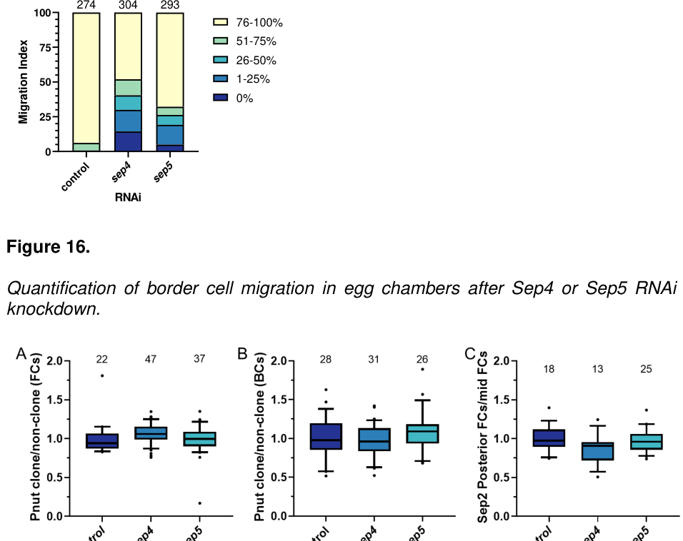
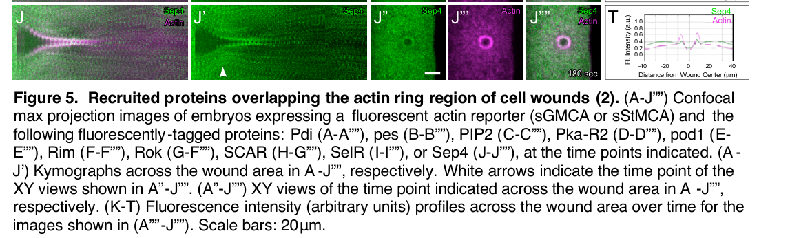

## Question

# Gene Research for Functional Annotation

## ⚠️ CRITICAL: Gene/Protein Identification Context

**BEFORE YOU BEGIN RESEARCH:** You MUST verify you are researching the CORRECT gene/protein. Gene symbols can be ambiguous, especially for less well-characterized genes from non-model organisms.

### Target Gene/Protein Identity (from UniProt):
- **UniProt Accession:** Q0KHR7
- **Protein Description:** RecName: Full=Septin {ECO:0000256|PIRNR:PIRNR006698};
- **Gene Information:** Name=Septin4 {ECO:0000313|EMBL:AAN09414.1, ECO:0000313|FlyBase:FBgn0259923}; Synonyms=04-Sep {ECO:0000313|EMBL:AAN09414.1}, Dmel\CG9699 {ECO:0000313|EMBL:AAN09414.1}, dSEPT4 {ECO:0000313|EMBL:AAN09414.1}, Sep4 {ECO:0000313|EMBL:AAN09414.1}, sep4 {ECO:0000313|EMBL:AAN09414.1}; ORFNames=CG9699 {ECO:0000313|EMBL:AAN09414.1, ECO:0000313|FlyBase:FBgn0259923}, Dmel_CG9699 {ECO:0000313|EMBL:AAN09414.1};
- **Organism (full):** Drosophila melanogaster (Fruit fly).
- **Protein Family:** Belongs to the TRAFAC class TrmE-Era-EngA-EngB-Septin-like
- **Key Domains:** G_SEPTIN_dom. (IPR030379); P-loop_NTPase. (IPR027417); Septin. (IPR016491); Septin (PF00735)

### MANDATORY VERIFICATION STEPS:

1. **Check if the gene symbol "Septin4" matches the protein description above**
2. **Verify the organism is correct:** Drosophila melanogaster (Fruit fly).
3. **Check if protein family/domains align with what you find in literature**
4. **If you find literature for a DIFFERENT gene with the same or similar symbol, STOP**

### If Gene Symbol is Ambiguous or You Cannot Find Relevant Literature:

**DO NOT PROCEED WITH RESEARCH ON A DIFFERENT GENE.** Instead:
- State clearly: "The gene symbol 'Septin4' is ambiguous or literature is limited for this specific protein"
- Explain what you found (e.g., "Found extensive literature on a different gene with the same symbol in a different organism")
- Describe the protein based ONLY on the UniProt information provided above
- Suggest that the protein function can be inferred from domain/family information

### Research Target:

Please provide a comprehensive research report on the gene **Septin4** (gene ID: Septin4, UniProt: Q0KHR7) in DROME.

The research report should be a detailed narrative explaining the function, biological processes, and localization of the gene product. Citations should be given for all claims.

You should prioritize authoritative reviews and primary scientific literature when conducting research. You can supplement
this with annotations you find in gene/protein databases, but these can be outdated or inaccurate.

We are specifically interested in the primary function of the gene - for enzymes, what reaction is catalyzed, and what is the substrate specificity? For transporters, what is the substrate? For structural proteins or adapters, what is the broader structural role? For signaling molecules, what is the role in the pathway.

We are interested in where in or outside the cell the gene product carries out its function.

We are also interested in the signaling or biochemical pathways in which the gene functions. We are less interested in broad pleiotropic effects, except where these elucidate the precise role.

Include evidence where possible. We are interested in both experimental evidence as well as inference from structure, evolution, or bioinformatic analysis. Precise studies should be prioritized over high-throughput, where available.

## Output

Question: You are an expert researcher providing comprehensive, well-cited information.

Provide detailed information focusing on:
1. Key concepts and definitions with current understanding
2. Recent developments and latest research (prioritize 2023-2024 sources)
3. Current applications and real-world implementations
4. Expert opinions and analysis from authoritative sources
5. Relevant statistics and data from recent studies

Format as a comprehensive research report with proper citations. Include URLs and publication dates where available.
Always prioritize recent, authoritative sources and provide specific citations for all major claims.

# Gene Research for Functional Annotation

## ⚠️ CRITICAL: Gene/Protein Identification Context

**BEFORE YOU BEGIN RESEARCH:** You MUST verify you are researching the CORRECT gene/protein. Gene symbols can be ambiguous, especially for less well-characterized genes from non-model organisms.

### Target Gene/Protein Identity (from UniProt):
- **UniProt Accession:** Q0KHR7
- **Protein Description:** RecName: Full=Septin {ECO:0000256|PIRNR:PIRNR006698};
- **Gene Information:** Name=Septin4 {ECO:0000313|EMBL:AAN09414.1, ECO:0000313|FlyBase:FBgn0259923}; Synonyms=04-Sep {ECO:0000313|EMBL:AAN09414.1}, Dmel\CG9699 {ECO:0000313|EMBL:AAN09414.1}, dSEPT4 {ECO:0000313|EMBL:AAN09414.1}, Sep4 {ECO:0000313|EMBL:AAN09414.1}, sep4 {ECO:0000313|EMBL:AAN09414.1}; ORFNames=CG9699 {ECO:0000313|EMBL:AAN09414.1, ECO:0000313|FlyBase:FBgn0259923}, Dmel_CG9699 {ECO:0000313|EMBL:AAN09414.1};
- **Organism (full):** Drosophila melanogaster (Fruit fly).
- **Protein Family:** Belongs to the TRAFAC class TrmE-Era-EngA-EngB-Septin-like
- **Key Domains:** G_SEPTIN_dom. (IPR030379); P-loop_NTPase. (IPR027417); Septin. (IPR016491); Septin (PF00735)

### MANDATORY VERIFICATION STEPS:

1. **Check if the gene symbol "Septin4" matches the protein description above**
2. **Verify the organism is correct:** Drosophila melanogaster (Fruit fly).
3. **Check if protein family/domains align with what you find in literature**
4. **If you find literature for a DIFFERENT gene with the same or similar symbol, STOP**

### If Gene Symbol is Ambiguous or You Cannot Find Relevant Literature:

**DO NOT PROCEED WITH RESEARCH ON A DIFFERENT GENE.** Instead:
- State clearly: "The gene symbol 'Septin4' is ambiguous or literature is limited for this specific protein"
- Explain what you found (e.g., "Found extensive literature on a different gene with the same symbol in a different organism")
- Describe the protein based ONLY on the UniProt information provided above
- Suggest that the protein function can be inferred from domain/family information

### Research Target:

Please provide a comprehensive research report on the gene **Septin4** (gene ID: Septin4, UniProt: Q0KHR7) in DROME.

The research report should be a detailed narrative explaining the function, biological processes, and localization of the gene product. Citations should be given for all claims.

You should prioritize authoritative reviews and primary scientific literature when conducting research. You can supplement
this with annotations you find in gene/protein databases, but these can be outdated or inaccurate.

We are specifically interested in the primary function of the gene - for enzymes, what reaction is catalyzed, and what is the substrate specificity? For transporters, what is the substrate? For structural proteins or adapters, what is the broader structural role? For signaling molecules, what is the role in the pathway.

We are interested in where in or outside the cell the gene product carries out its function.

We are also interested in the signaling or biochemical pathways in which the gene functions. We are less interested in broad pleiotropic effects, except where these elucidate the precise role.

Include evidence where possible. We are interested in both experimental evidence as well as inference from structure, evolution, or bioinformatic analysis. Precise studies should be prioritized over high-throughput, where available.

# Functional annotation of *Drosophila melanogaster* Septin4

**Identity and scope.** The target is the fruit-fly protein **Sep4/Septin4, encoded by CG9699** (UniProt **Q0KHR7**, as specified in the question). A comparative sequence study explicitly identifies *D. melanogaster* DmeSep4 as CG9699 and places it among animal group-2B septins. It lists fly Pnut, Sep1, Sep2 and Sep5 separately. The symbol is potentially misleading: **human SEPT4/ARTS is a different protein**, and the “human CDCrel-1” used as a comparator in the fly neurodegeneration literature refers to **human SEPT5**, not human SEPT4. Findings about human ARTS, including its mitochondrial localization and apoptosis-related activities, must not be assigned to fly Sep4. The supplied UniProt annotation identifies septin, G_SEPTIN and P-loop NTPase domains, consistent with the published family classification; the accession-to-sequence mapping itself was not independently confirmed in the papers examined. (pan2007analysisofseptins pages 3-4, munozsoriano2011drosophilamodelsof pages 3-4)

**Best-supported molecular role.** Sep4 is a **septin-family cytoskeletal GTP-binding protein**, not an established transporter or enzyme acting on an identified cellular substrate. Septins typically associate into higher-order assemblies that organize membranes and the cell cortex. The conserved nucleotide-binding architecture makes GTP binding and potentially GTP hydrolysis plausible for Sep4, but the available Sep4-specific evidence does **not** establish its purified GTPase activity, reaction rate, nucleotide specificity, direct membrane-binding properties, or filament structure. The biochemically characterized major fly septin assembly contains **Sep1, Sep2 and Pnut**; Sep4 should not be named as a demonstrated component of that purified complex. Its possible substitution for Sep1 or participation in another assembly remains a hypothesis. (pan2007analysisofseptins pages 9-11, adam2000evidenceforfunctional pages 1-2, gabbert2023septinsregulateborder pages 76-82, marttinen2015synapticdysfunctionand pages 5-6)

**Biological processes and experimental evidence.** The most informative gene-specific work connects Sep4 to cortical remodeling and cell integrity, although evidence for its *normal* contribution remains less secure than evidence for the canonical fly septins:

- **Cell-wound repair and localization.** In an **August 17, 2026 bioRxiv preprint**, an imaging screen of **1,322 fluorescently tagged proteins** identified **129** recruited to wounds. Its reagent table explicitly maps **CG9699 → Sep4 → Septin 4** to a *UASp-Septin4.GFP* construct. Live-imaging panels place the tagged protein at the **wound-edge region overlapping the actin ring** in laser-wounded early embryos. The authors additionally cite prior Sep4-knockdown evidence for altered actin dynamics and impaired repair. This is the clearest Sep4-specific evidence for a **subcellular site of action—the intracellular, membrane-adjacent wound cortex**—but it uses a tagged transgene, is **not** an endogenous-protein localization experiment and has **not been peer reviewed**. It does not establish that Sep4 is secreted or located outside the cell. See [Nakamura et al., bioRxiv, August 17, 2026](https://doi.org/10.64898/2026.08.14.744976), particularly Figure 5J. (nakamura2026spatiotemporaldynamicsof pages 27-28, nakamura2026spatiotemporaldynamicsof pages 4-7, nakamura2026spatiotemporaldynamicsof pages 7-9, nakamura2026spatiotemporaldynamicsof media 568a31ac)
- **Ovarian border-cell migration.** A **June 2023 doctoral dissertation** reports that c306-GAL4-driven **Sep4 RNAi impaired border-cell migration** (**304** egg chambers in the Sep4-RNAi group; **274** controls). Sep4 knockdown did not measurably reduce Sep2 or Pnut protein abundance; simultaneous **Sep1/Sep4** knockdown gave a stronger defect than either alone. Sep4 overexpression rescued Sep4 RNAi and also rescued Sep1 RNAi, suggesting **partial functional overlap with Sep1** in collective cell movement. However, Sep4 ovarian transcript levels were low, qRT-PCR was variable, possible septin-RNAi off-target effects were acknowledged, and a Sep4-containing complex was not purified. These Sep4-specific figures occur in **Gabbert’s dissertation**; the accessible text does **not** establish that they appear in the related peer-reviewed [*Developmental Cell* article, August 2023](https://doi.org/10.1016/j.devcel.2023.05.017). That article’s clearly documented membrane recruitment downstream of active Rho principally concerns **Sep1/Sep2/Pnut** and is **not a demonstrated Sep4-specific Rho pathway**. (gabbert2023septinsregulateborder pages 1-7, gabbert2023septinsregulateborder pages 76-82, gabbert2023septinsregulateborder pages 22-28, gabbert2023septinsregulateborder media cca93298, gabbert2023septinsregulateborder media a70aa7ec, gabbert2023septinsregulateborder media 2ee544b6)
- **Dopaminergic neurons and protein turnover.** An author review of a **2007 fly study** reports that targeted Sep4 overexpression in dopaminergic neurons produced an **age-dependent loss of neuronal integrity in dorsomedial brain clusters**. The toxicity depended on *parkin*, and fly Sep4 and Parkin interacted **in vitro**. This supports a functional connection to the **Parkin-linked protein-quality-control pathway**, but an overexpression phenotype does not define Sep4’s ordinary neuronal function, and interaction plus genetic dependence do **not** by themselves demonstrate that Parkin directly ubiquitinates fly Sep4. The related **2012** primary paper reports Sep4 accumulation in *parkin*-mutant brains and a functional relationship with the Nedd4 E3 ligase in its title; its full experimental results could not be assessed here, so a precise Nedd4 mechanism is not asserted. See [Muñoz-Soriano and Paricio, *European Journal of Neuroscience*, December 2007](https://doi.org/10.1111/j.1460-9568.2007.05937.x), as summarized in their [March 2011 review](https://doi.org/10.4061/2011/520640), and [Muñoz-Soriano et al., *Journal of Molecular Neuroscience*, 2012](https://doi.org/10.1007/s12031-012-9788-3). (munozsoriano2011drosophilamodelsof pages 3-4)

**Interpretation.** A defensible working annotation is that fly Sep4 is a **putative GTP-binding cytoskeletal organizer involved in actin-associated cortical processes**, with reporter-based localization to the wound-edge actin ring and suggestive genetic involvement in wound repair and border-cell movement. Parkin-sensitive dopaminergic toxicity is a demonstrated **overexpression** observation, not evidence that Sep4’s primary physiological job is to cause neurodegeneration. The composition of its native complexes, its endogenous distribution in neurons and ovaries, its nucleotide biochemistry, and any direct Parkin-dependent ubiquitination remain unresolved on the evidence available. In particular, functions measured for Sep1/Sep2/Pnut, human SEPT5/CDCrel-1, or human SEPT4/ARTS cannot be transferred to **CG9699** without a Sep4-specific test. (gabbert2023septinsregulateborder pages 76-82, adam2000evidenceforfunctional pages 1-2, munozsoriano2011drosophilamodelsof pages 3-4, nakamura2026spatiotemporaldynamicsof pages 27-28, nakamura2026spatiotemporaldynamicsof pages 7-9)

The following evidence table separates direct observations, provisional findings and family-level inference.

| Observation | Evidence status and direct evidence | Limitation | Source, publication date, and DOI URL |
|---|---|---|---|
| **Identity: Drosophila Sep4 is CG9699** | **Demonstrated by sequence annotation and comparative phylogeny.** Pan et al. list *Drosophila melanogaster* DmeSep4 as **CG9699** and classify it as an animal group 2B septin, separately from fly Pnut, Sep1, Sep2, and Sep5. Human SEPT4 and SEPT5 are also separate entries. This supports the supplied identification of Q0KHR7 as fly Septin4/CG9699. (pan2007analysisofseptins pages 3-4) | The study used an older sequence accession rather than UniProt Q0KHR7 and did not determine Sep4 localization, biochemical activity, partners, or phenotype. Shared group membership does not establish functional equivalence with human SEPT4 or SEPT5. | Pan F, Malmberg RL, Momany M. **3 July 2007.** *BMC Evolutionary Biology* 7:103. [https://doi.org/10.1186/1471-2148-7-103](https://doi.org/10.1186/1471-2148-7-103) |
| **Sep4 overexpression compromises dopaminergic-neuron integrity in a Parkin-dependent manner** | **Experimentally supported gain-of-function phenotype; direct-substrate status remains hypothetical.** An author review summarizing the 2007 primary study reports that targeted fly Sep4 expression in dopaminergic neurons caused age-dependent disruption of neuronal integrity in dorsomedial brain clusters. Neurotoxicity depended on *parkin*, and Parkin and Sep4 interacted in vitro, leading the authors to propose that fly Sep4 could be a Parkin substrate. (munozsoriano2011drosophilamodelsof pages 3-4) | Overexpression does not establish Sep4's normal physiological function. Parkin dependence and in-vitro interaction do not by themselves prove direct ubiquitination. The human comparator was CDCrel-1, now **SEPT5**, not human SEPT4/ARTS; these proteins must not be conflated. | Muñoz-Soriano V, Paricio N. **March 2011** author review: [https://doi.org/10.4061/2011/520640](https://doi.org/10.4061/2011/520640). It summarizes Muñoz-Soriano and Paricio, **December 2007**, *European Journal of Neuroscience* 26:3150–3158: [https://doi.org/10.1111/j.1460-9568.2007.05937.x](https://doi.org/10.1111/j.1460-9568.2007.05937.x) |
| **Sep4 RNAi impairs ovarian border-cell migration; Sep4 can partially substitute for Sep1** | **Suggestive genetic evidence from a doctoral dissertation.** In Gabbert's dissertation, c306-GAL4-driven Sep4 RNAi impaired migration; **304 egg chambers** were assessed, versus **274 controls**. Sep4 depletion did not reduce Sep2 or Pnut protein abundance. Combined Sep1/Sep4 knockdown was more severe than either single knockdown, while Sep4 overexpression rescued Sep4 RNAi and Sep1 RNAi. These results support partial Sep1–Sep4 functional overlap and motivate, but do not prove, a secondary Sep4-containing complex. (gabbert2023septinsregulateborder pages 76-82, gabbert2023septinsregulateborder media cca93298, gabbert2023septinsregulateborder media a70aa7ec, gabbert2023septinsregulateborder media 2ee544b6) | Sep4 ovarian transcript abundance was very low, qRT-PCR was noisy, RNAi off-target effects could not be excluded, and no Sep4-null result or biochemical purification of a Sep4 complex was presented. The retrieved text containing Figures 16, 18, and 19 is the **June 2023 UCSB dissertation**; these thesis-only results must not be attributed automatically to the related peer-reviewed *Developmental Cell* article. (gabbert2023septinsregulateborder pages 1-7, gabbert2023septinsregulateborder pages 76-82, gabbert2023septinsregulateborder pages 22-28) | Gabbert AM. **June 2023.** UCSB doctoral dissertation, *Septins regulate border cell surface geometry, shape, and motility downstream of Rho*. Related peer-reviewed article published **7 August 2023**: [https://doi.org/10.1016/j.devcel.2023.05.017](https://doi.org/10.1016/j.devcel.2023.05.017); the available article evidence does not establish the dissertation-only Sep4 figures. |
| **Fluorescent Sep4 is recruited to the actin-ring region of laser-induced cell wounds; prior Sep4 knockdown affects repair** | **Direct reporter-localization evidence plus cited perturbation evidence, currently non-peer-reviewed.** A screen of **1,322** tagged proteins identified **129** wound-recruited proteins. Its table maps CG9699–Sep4–Septin 4 to UASp-Septin4.GFP. Live imaging and fluorescence profiles place tagged Sep4 in the category overlapping the wound-edge actin ring. The authors also state that prior Sep4 knockdown altered actin bending or actomyosin-ring assembly and impaired repair. (nakamura2026spatiotemporaldynamicsof pages 33-34, nakamura2026spatiotemporaldynamicsof pages 27-28, nakamura2026spatiotemporaldynamicsof pages 4-7, nakamura2026spatiotemporaldynamicsof pages 7-9, nakamura2026spatiotemporaldynamicsof media 568a31ac) | This is a **17 August 2026 bioRxiv preprint**, beyond the requested 2023–2024 priority window and not peer reviewed. Localization was observed with an ectopically expressed GFP fusion rather than an endogenous knock-in, so expression level or tagging could affect behavior. | Nakamura M, Hui J, Verboon JM, Parkhurst SM. **17 August 2026.** bioRxiv preprint. [https://doi.org/10.64898/2026.08.14.744976](https://doi.org/10.64898/2026.08.14.744976) |
| **Sep4 is predicted to be a guanine-nucleotide-binding, polymer-associated cytoskeletal septin** | **Family- and domain-based inference, not a Sep4-specific biochemical demonstration.** Sep4 belongs to a conserved septin GTPase class with a P-loop/G_SEPTIN domain and conserved G1 nucleotide-binding motif. Septins generally form hetero-oligomers and higher-order filaments that associate with membranes and organize cortical structures or act as scaffolds. Sep4's group 2B classification is consistent with this architecture. (pan2007analysisofseptins pages 9-11, marttinen2015synapticdysfunctionand pages 5-6) | No cited study establishes purified fly Sep4's nucleotide affinity, hydrolysis rate, substrate specificity, polymer structure, or membrane-binding properties. GTP binding is therefore the likely biochemical activity, not a proven Sep4-catalyzed reaction. The purified canonical fly complex is Sep1–Sep2–Pnut; Sep4 incorporation remains hypothesized. (adam2000evidenceforfunctional pages 1-2, gabbert2023septinsregulateborder pages 76-82) | Family evidence: Pan et al., **3 July 2007**, [https://doi.org/10.1186/1471-2148-7-103](https://doi.org/10.1186/1471-2148-7-103). Canonical fly-complex context: Adam et al., **September 2000**, [https://doi.org/10.1091/mbc.11.9.3123](https://doi.org/10.1091/mbc.11.9.3123). |

*Table: Evidence hierarchy for Drosophila melanogaster Sep4/Septin4 (CG9699; UniProt Q0KHR7), separating demonstrated observations from hypotheses and family-level inference. It also flags nomenclature ambiguity, thesis-only findings, and non-peer-reviewed evidence.*

References

1. (pan2007analysisofseptins pages 3-4): Fangfang Pan, Russell L Malmberg, and Michelle Momany. Analysis of septins across kingdoms reveals orthology and new motifs. BMC Evolutionary Biology, Jul 2007. URL: https://doi.org/10.1186/1471-2148-7-103, doi:10.1186/1471-2148-7-103. This article has 375 citations and is from a domain leading peer-reviewed journal.

2. (munozsoriano2011drosophilamodelsof pages 3-4): Verónica Muñoz-Soriano and Nuria Paricio. Drosophila models of parkinson's disease: discovering relevant pathways and novel therapeutic strategies. Parkinson's Disease, 2011:1-14, Mar 2011. URL: https://doi.org/10.4061/2011/520640, doi:10.4061/2011/520640. This article has 129 citations and is from a peer-reviewed journal.

3. (pan2007analysisofseptins pages 9-11): Fangfang Pan, Russell L Malmberg, and Michelle Momany. Analysis of septins across kingdoms reveals orthology and new motifs. BMC Evolutionary Biology, Jul 2007. URL: https://doi.org/10.1186/1471-2148-7-103, doi:10.1186/1471-2148-7-103. This article has 375 citations and is from a domain leading peer-reviewed journal.

4. (adam2000evidenceforfunctional pages 1-2): Jennifer C. Adam, John R. Pringle, and Mark Peifer. Evidence for functional differentiation among drosophila septins in cytokinesis and cellularization. Molecular biology of the cell, 11 9:3123-35, Sep 2000. URL: https://doi.org/10.1091/mbc.11.9.3123, doi:10.1091/mbc.11.9.3123. This article has 183 citations and is from a domain leading peer-reviewed journal.

5. (gabbert2023septinsregulateborder pages 76-82): Allison M. Gabbert, Joseph P. Campanale, James A. Mondo, Noah P. Mitchell, Adele Myers, Sebastian J. Streichan, Nina Miolane, and Denise J. Montell. Septins regulate border cell surface geometry, shape, and motility downstream of rho in drosophila. Developmental Cell, 58:1399-1413.e5, Aug 2023. URL: https://doi.org/10.1016/j.devcel.2023.05.017, doi:10.1016/j.devcel.2023.05.017. This article has 16 citations and is from a highest quality peer-reviewed journal.

6. (marttinen2015synapticdysfunctionand pages 5-6): Mikael Marttinen, Kaisa MA Kurkinen, Hilkka Soininen, Annakaisa Haapasalo, and Mikko Hiltunen. Synaptic dysfunction and septin protein family members in neurodegenerative diseases. Molecular Neurodegeneration, Apr 2015. URL: https://doi.org/10.1186/s13024-015-0013-z, doi:10.1186/s13024-015-0013-z. This article has 167 citations and is from a highest quality peer-reviewed journal.

7. (nakamura2026spatiotemporaldynamicsof pages 27-28): Mitsutoshi Nakamura, Justin Hui, Jeffrey M. Verboon, and Susan M. Parkhurst. Spatiotemporal dynamics of protein recruitment during cell wound repair. bioRxiv, Aug 2026. URL: https://doi.org/10.64898/2026.08.14.744976, doi:10.64898/2026.08.14.744976. This article has 0 citations.

8. (nakamura2026spatiotemporaldynamicsof pages 4-7): Mitsutoshi Nakamura, Justin Hui, Jeffrey M. Verboon, and Susan M. Parkhurst. Spatiotemporal dynamics of protein recruitment during cell wound repair. bioRxiv, Aug 2026. URL: https://doi.org/10.64898/2026.08.14.744976, doi:10.64898/2026.08.14.744976. This article has 0 citations.

9. (nakamura2026spatiotemporaldynamicsof pages 7-9): Mitsutoshi Nakamura, Justin Hui, Jeffrey M. Verboon, and Susan M. Parkhurst. Spatiotemporal dynamics of protein recruitment during cell wound repair. bioRxiv, Aug 2026. URL: https://doi.org/10.64898/2026.08.14.744976, doi:10.64898/2026.08.14.744976. This article has 0 citations.

10. (nakamura2026spatiotemporaldynamicsof media 568a31ac): Mitsutoshi Nakamura, Justin Hui, Jeffrey M. Verboon, and Susan M. Parkhurst. Spatiotemporal dynamics of protein recruitment during cell wound repair. bioRxiv, Aug 2026. URL: https://doi.org/10.64898/2026.08.14.744976, doi:10.64898/2026.08.14.744976. This article has 0 citations.

11. (gabbert2023septinsregulateborder pages 1-7): Allison M. Gabbert, Joseph P. Campanale, James A. Mondo, Noah P. Mitchell, Adele Myers, Sebastian J. Streichan, Nina Miolane, and Denise J. Montell. Septins regulate border cell surface geometry, shape, and motility downstream of rho in drosophila. Developmental Cell, 58:1399-1413.e5, Aug 2023. URL: https://doi.org/10.1016/j.devcel.2023.05.017, doi:10.1016/j.devcel.2023.05.017. This article has 16 citations and is from a highest quality peer-reviewed journal.

12. (gabbert2023septinsregulateborder pages 22-28): Allison M. Gabbert, Joseph P. Campanale, James A. Mondo, Noah P. Mitchell, Adele Myers, Sebastian J. Streichan, Nina Miolane, and Denise J. Montell. Septins regulate border cell surface geometry, shape, and motility downstream of rho in drosophila. Developmental Cell, 58:1399-1413.e5, Aug 2023. URL: https://doi.org/10.1016/j.devcel.2023.05.017, doi:10.1016/j.devcel.2023.05.017. This article has 16 citations and is from a highest quality peer-reviewed journal.

13. (gabbert2023septinsregulateborder media cca93298): Allison M. Gabbert, Joseph P. Campanale, James A. Mondo, Noah P. Mitchell, Adele Myers, Sebastian J. Streichan, Nina Miolane, and Denise J. Montell. Septins regulate border cell surface geometry, shape, and motility downstream of rho in drosophila. Developmental Cell, 58:1399-1413.e5, Aug 2023. URL: https://doi.org/10.1016/j.devcel.2023.05.017, doi:10.1016/j.devcel.2023.05.017. This article has 16 citations and is from a highest quality peer-reviewed journal.

14. (gabbert2023septinsregulateborder media a70aa7ec): Allison M. Gabbert, Joseph P. Campanale, James A. Mondo, Noah P. Mitchell, Adele Myers, Sebastian J. Streichan, Nina Miolane, and Denise J. Montell. Septins regulate border cell surface geometry, shape, and motility downstream of rho in drosophila. Developmental Cell, 58:1399-1413.e5, Aug 2023. URL: https://doi.org/10.1016/j.devcel.2023.05.017, doi:10.1016/j.devcel.2023.05.017. This article has 16 citations and is from a highest quality peer-reviewed journal.

15. (gabbert2023septinsregulateborder media 2ee544b6): Allison M. Gabbert, Joseph P. Campanale, James A. Mondo, Noah P. Mitchell, Adele Myers, Sebastian J. Streichan, Nina Miolane, and Denise J. Montell. Septins regulate border cell surface geometry, shape, and motility downstream of rho in drosophila. Developmental Cell, 58:1399-1413.e5, Aug 2023. URL: https://doi.org/10.1016/j.devcel.2023.05.017, doi:10.1016/j.devcel.2023.05.017. This article has 16 citations and is from a highest quality peer-reviewed journal.

16. (nakamura2026spatiotemporaldynamicsof pages 33-34): Mitsutoshi Nakamura, Justin Hui, Jeffrey M. Verboon, and Susan M. Parkhurst. Spatiotemporal dynamics of protein recruitment during cell wound repair. bioRxiv, Aug 2026. URL: https://doi.org/10.64898/2026.08.14.744976, doi:10.64898/2026.08.14.744976. This article has 0 citations.

## Artifacts

- [Edison artifact artifact-00](Septin4-deep-research-falcon_artifacts/artifact-00.md)

## Citations

1. munozsoriano2011drosophilamodelsof pages 3-4
2. pan2007analysisofseptins pages 3-4
3. pan2007analysisofseptins pages 9-11
4. adam2000evidenceforfunctional pages 1-2
5. gabbert2023septinsregulateborder pages 76-82
6. marttinen2015synapticdysfunctionand pages 5-6
7. nakamura2026spatiotemporaldynamicsof pages 27-28
8. nakamura2026spatiotemporaldynamicsof pages 4-7
9. nakamura2026spatiotemporaldynamicsof pages 7-9
10. gabbert2023septinsregulateborder pages 1-7
11. gabbert2023septinsregulateborder pages 22-28
12. nakamura2026spatiotemporaldynamicsof pages 33-34
13. Nakamura et al., bioRxiv, August 17, 2026
14. *Developmental Cell* article, August 2023
15. Muñoz-Soriano and Paricio, *European Journal of Neuroscience*, December 2007
16. March 2011 review
17. Muñoz-Soriano et al., *Journal of Molecular Neuroscience*, 2012
18. https://doi.org/10.1186/1471-2148-7-103
19. https://doi.org/10.4061/2011/520640
20. https://doi.org/10.1111/j.1460-9568.2007.05937.x
21. https://doi.org/10.1016/j.devcel.2023.05.017
22. https://doi.org/10.64898/2026.08.14.744976
23. https://doi.org/10.1091/mbc.11.9.3123
24. https://doi.org/10.1007/s12031-012-9788-3
25. https://doi.org/10.1186/1471-2148-7-103](https://doi.org/10.1186/1471-2148-7-103
26. https://doi.org/10.4061/2011/520640](https://doi.org/10.4061/2011/520640
27. https://doi.org/10.1111/j.1460-9568.2007.05937.x](https://doi.org/10.1111/j.1460-9568.2007.05937.x
28. https://doi.org/10.1016/j.devcel.2023.05.017](https://doi.org/10.1016/j.devcel.2023.05.017
29. https://doi.org/10.64898/2026.08.14.744976](https://doi.org/10.64898/2026.08.14.744976
30. https://doi.org/10.1091/mbc.11.9.3123](https://doi.org/10.1091/mbc.11.9.3123
31. https://doi.org/10.1186/1471-2148-7-103,
32. https://doi.org/10.4061/2011/520640,
33. https://doi.org/10.1091/mbc.11.9.3123,
34. https://doi.org/10.1016/j.devcel.2023.05.017,
35. https://doi.org/10.1186/s13024-015-0013-z,
36. https://doi.org/10.64898/2026.08.14.744976,