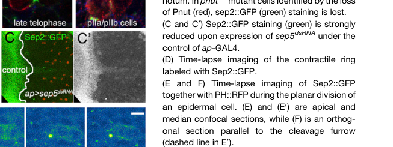
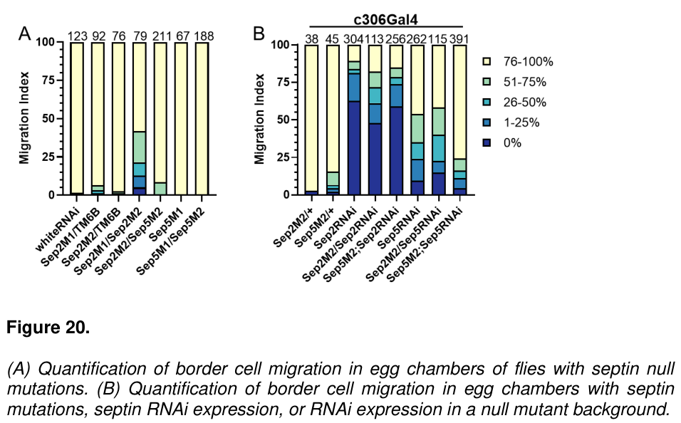

## Question

# Gene Research for Functional Annotation

## ⚠️ CRITICAL: Gene/Protein Identification Context

**BEFORE YOU BEGIN RESEARCH:** You MUST verify you are researching the CORRECT gene/protein. Gene symbols can be ambiguous, especially for less well-characterized genes from non-model organisms.

### Target Gene/Protein Identity (from UniProt):
- **UniProt Accession:** A1Z780
- **Protein Description:** RecName: Full=Septin {ECO:0000256|PIRNR:PIRNR006698};
- **Gene Information:** Name=Septin5 {ECO:0000313|EMBL:AAG22304.1}; Synonyms=Dmel\CG2916 {ECO:0000313|EMBL:AAG22304.1}, dSEPT5 {ECO:0000313|EMBL:AAG22304.1}, Sep {ECO:0000313|EMBL:AAG22304.1}, Sep5 {ECO:0000313|EMBL:AAG22304.1}, sep5 {ECO:0000313|EMBL:AAG22304.1}; ORFNames=CG2916 {ECO:0000313|EMBL:AAG22304.1}, Dmel_CG2916 {ECO:0000313|EMBL:AAG22304.1};
- **Organism (full):** Drosophila melanogaster (Fruit fly).
- **Protein Family:** Belongs to the TRAFAC class TrmE-Era-EngA-EngB-Septin-like
- **Key Domains:** G_SEPTIN_dom. (IPR030379); P-loop_NTPase. (IPR027417); Septin. (IPR016491); Septin (PF00735)

### MANDATORY VERIFICATION STEPS:

1. **Check if the gene symbol "Septin5" matches the protein description above**
2. **Verify the organism is correct:** Drosophila melanogaster (Fruit fly).
3. **Check if protein family/domains align with what you find in literature**
4. **If you find literature for a DIFFERENT gene with the same or similar symbol, STOP**

### If Gene Symbol is Ambiguous or You Cannot Find Relevant Literature:

**DO NOT PROCEED WITH RESEARCH ON A DIFFERENT GENE.** Instead:
- State clearly: "The gene symbol 'Septin5' is ambiguous or literature is limited for this specific protein"
- Explain what you found (e.g., "Found extensive literature on a different gene with the same symbol in a different organism")
- Describe the protein based ONLY on the UniProt information provided above
- Suggest that the protein function can be inferred from domain/family information

### Research Target:

Please provide a comprehensive research report on the gene **Septin5** (gene ID: Septin5, UniProt: A1Z780) in DROME.

The research report should be a detailed narrative explaining the function, biological processes, and localization of the gene product. Citations should be given for all claims.

You should prioritize authoritative reviews and primary scientific literature when conducting research. You can supplement
this with annotations you find in gene/protein databases, but these can be outdated or inaccurate.

We are specifically interested in the primary function of the gene - for enzymes, what reaction is catalyzed, and what is the substrate specificity? For transporters, what is the substrate? For structural proteins or adapters, what is the broader structural role? For signaling molecules, what is the role in the pathway.

We are interested in where in or outside the cell the gene product carries out its function.

We are also interested in the signaling or biochemical pathways in which the gene functions. We are less interested in broad pleiotropic effects, except where these elucidate the precise role.

Include evidence where possible. We are interested in both experimental evidence as well as inference from structure, evolution, or bioinformatic analysis. Precise studies should be prioritized over high-throughput, where available.

## Output

Question: You are an expert researcher providing comprehensive, well-cited information.

Provide detailed information focusing on:
1. Key concepts and definitions with current understanding
2. Recent developments and latest research (prioritize 2023-2024 sources)
3. Current applications and real-world implementations
4. Expert opinions and analysis from authoritative sources
5. Relevant statistics and data from recent studies

Format as a comprehensive research report with proper citations. Include URLs and publication dates where available.
Always prioritize recent, authoritative sources and provide specific citations for all major claims.

# Gene Research for Functional Annotation

## ⚠️ CRITICAL: Gene/Protein Identification Context

**BEFORE YOU BEGIN RESEARCH:** You MUST verify you are researching the CORRECT gene/protein. Gene symbols can be ambiguous, especially for less well-characterized genes from non-model organisms.

### Target Gene/Protein Identity (from UniProt):
- **UniProt Accession:** A1Z780
- **Protein Description:** RecName: Full=Septin {ECO:0000256|PIRNR:PIRNR006698};
- **Gene Information:** Name=Septin5 {ECO:0000313|EMBL:AAG22304.1}; Synonyms=Dmel\CG2916 {ECO:0000313|EMBL:AAG22304.1}, dSEPT5 {ECO:0000313|EMBL:AAG22304.1}, Sep {ECO:0000313|EMBL:AAG22304.1}, Sep5 {ECO:0000313|EMBL:AAG22304.1}, sep5 {ECO:0000313|EMBL:AAG22304.1}; ORFNames=CG2916 {ECO:0000313|EMBL:AAG22304.1}, Dmel_CG2916 {ECO:0000313|EMBL:AAG22304.1};
- **Organism (full):** Drosophila melanogaster (Fruit fly).
- **Protein Family:** Belongs to the TRAFAC class TrmE-Era-EngA-EngB-Septin-like
- **Key Domains:** G_SEPTIN_dom. (IPR030379); P-loop_NTPase. (IPR027417); Septin. (IPR016491); Septin (PF00735)

### MANDATORY VERIFICATION STEPS:

1. **Check if the gene symbol "Septin5" matches the protein description above**
2. **Verify the organism is correct:** Drosophila melanogaster (Fruit fly).
3. **Check if protein family/domains align with what you find in literature**
4. **If you find literature for a DIFFERENT gene with the same or similar symbol, STOP**

### If Gene Symbol is Ambiguous or You Cannot Find Relevant Literature:

**DO NOT PROCEED WITH RESEARCH ON A DIFFERENT GENE.** Instead:
- State clearly: "The gene symbol 'Septin5' is ambiguous or literature is limited for this specific protein"
- Explain what you found (e.g., "Found extensive literature on a different gene with the same symbol in a different organism")
- Describe the protein based ONLY on the UniProt information provided above
- Suggest that the protein function can be inferred from domain/family information

### Research Target:

Please provide a comprehensive research report on the gene **Septin5** (gene ID: Septin5, UniProt: A1Z780) in DROME.

The research report should be a detailed narrative explaining the function, biological processes, and localization of the gene product. Citations should be given for all claims.

You should prioritize authoritative reviews and primary scientific literature when conducting research. You can supplement
this with annotations you find in gene/protein databases, but these can be outdated or inaccurate.

We are specifically interested in the primary function of the gene - for enzymes, what reaction is catalyzed, and what is the substrate specificity? For transporters, what is the substrate? For structural proteins or adapters, what is the broader structural role? For signaling molecules, what is the role in the pathway.

We are interested in where in or outside the cell the gene product carries out its function.

We are also interested in the signaling or biochemical pathways in which the gene functions. We are less interested in broad pleiotropic effects, except where these elucidate the precise role.

Include evidence where possible. We are interested in both experimental evidence as well as inference from structure, evolution, or bioinformatic analysis. Precise studies should be prioritized over high-throughput, where available.

# Functional annotation of *Drosophila melanogaster* Septin5 (CG2916; UniProt A1Z780)

## Identity and principal function

**The gene symbol “Septin5” is potentially ambiguous across organisms, but the specified target is identifiable:** a *D. melanogaster* sensory-organ study explicitly maps **CG2916 to Septin 5 (Sep5)**. The supplied UniProt accession A1Z780, species, and septin/P-loop NTPase domain annotations are consistent with that identification. This report concerns fly Sep5, **not human SEPTIN5**. Fly Sep5 is described as a retrogene derived from the distinct fly septin **Sep2**. (bras2012geneticidentificationof pages 4-5, gabbert2023septinsregulateborder pages 76-82, akhmetova2015functionalinsightinto pages 1-4)

**Best-supported functional annotation:** Sep5 is a septin-family protein likely involved in organizing a cortical, membrane-associated cytoskeletal scaffold. Its most direct gene-specific evidence is that Sep5 depletion affects the abundance of a Sep2 protein reporter in one epithelial tissue and produces sensory-organ phenotypes. Its precise contribution to septin-complex architecture remains unresolved. The predicted septin G-domain (IPR030379; PF00735) and P-loop NTPase fold support guanine-nucleotide binding and potential GTP hydrolysis, but **an enzyme assay of purified Sep5 itself was not identified**; its physiological substrate specificity, catalytic rate, and nucleotide-state dependence therefore cannot be specified. (founounou2013septinsregulatethe pages 3-4, akhmetova2015functionalinsightinto pages 1-4, field1996apurifieddrosophila pages 1-2)

The biochemical distinction is important. An influential purification of fly embryonic septins isolated **Pnut, Sep1, and Sep2—not Sep5**. That complex formed filaments approximately **7–9 nm in diameter**, contained approximately **1.1 bound guanine nucleotides per septin polypeptide**, and bound and hydrolyzed added GTP. Those measurements establish what a fly septin complex *can* do; they are **not measurements of Sep5 activity**. Accordingly, Sep5 is better described primarily as a *putative structural/regulatory septin subunit* than as an enzyme with an experimentally defined Sep5-specific reaction. (field1996apurifieddrosophila pages 6-7, field1996apurifieddrosophila pages 1-2)

## Experimental evidence for biological processes

In a *Drosophila* sensory-organ RNA-interference screen, **CG2916/Sep5 depletion** was associated with adult **bristle loss**, classified as a Notch loss-of-function-like phenotype. The investigators also observed a lineage resembling **two pIIb-like daughter cells**, including altered Sanpodo distribution. This links Sep5 perturbation to successful asymmetric sensory-organ development, but does **not** show that Sep5 directly transports Notch, Delta, or Sanpodo, or directly activates the Notch pathway: disrupted cell division or daughter-cell identity could account for the signaling readout. The screen examined **418 candidate genes**, identified **113** reproducible adult sensory-organ hits, and found **26** candidates associated with altered localization of Notch-pathway components; those are *screen-wide*, not Sep5-specific, counts. [Le Bras and colleagues, *Journal of Cell Science*, **2012**, https://doi.org/10.1242/jcs.110171.] (bras2012geneticidentificationof pages 1-2, bras2012geneticidentificationof pages 7-8, bras2012geneticidentificationof pages 4-5, bras2012geneticidentificationof pages 8-9)

A more focused experiment found that driving **sep5 dsRNA in the pupal notum strongly reduced Sep2::GFP staining**. The published **Figure 2C** provides visual evidence of this effect. This is consistent with Sep5 supporting Sep2 protein abundance, organization, or recruitment **in that context**. It does not by itself establish direct Sep5–Sep2 binding or incorporation of Sep5 into a particular purified heteromer; sequence-related RNAi cross-targeting also needs to be considered. In the same study, loss of **Pnut** impaired planar epithelial cytokinesis and actomyosin-ring contractility, but those Pnut-null results must **not** be presented as Sep5-null phenotypes. [Founounou and colleagues, *Developmental Cell*, **2013**, https://doi.org/10.1016/j.devcel.2013.01.008.] (founounou2013septinsregulatethe pages 3-4, founounou2013septinsregulatethe media 8a464e07, founounou2013septinsregulatethe pages 1-2)

Sep5's relationship to Sep2 also appears **context dependent**. An indexed primary study reports in its title that Sep2 and the Sep5 retrogene have **redundant functions in imaginal-cell proliferation**, whereas Sep2 has a distinct requirement during oogenesis. Because its experimental full text was not retrievable here, the exact mutant combinations, quantitative phenotypes, and underlying mechanism are not asserted. [O’Neill and Clark, *Genome*, **2013**, https://doi.org/10.1139/gen-2013-0210; bibliographic identification documented in the 2023 source.] (gabbert2023septinsregulateborder pages 104-105)

## Recent research and interpretation, 2023–2024

The peer-reviewed 2023 border-cell study established a compelling **septin-system** mechanism: Sep1, Sep2, and Pnut occupy cytoplasmic and membrane-associated pools during collective migration, and Rho activity affects their cortical recruitment. Changing their abundance alters border-cell detachment, shape, surface texture, and movement. **These principal localization and mechanistic experiments assayed Sep1/Sep2/Pnut, not Sep5.** A prior border-cell RNA-expression screen did not detect Sep5 transcript. Thus, Rho-dependent plasma-membrane recruitment demonstrated for the other septins should not be assigned directly to Sep5. [Gabbert and colleagues, *Developmental Cell*, **August 2023**, https://doi.org/10.1016/j.devcel.2023.05.017.] (gabbert2023septinsregulateborder pages 22-28, gabbert2023septinsregulateborder pages 28-37, gabbert2023septinsregulateborder pages 37-42)

Additional **Sep5-specific exploratory results occur in Gabbert’s 2023 dissertation**; their presence in that document must not be mistaken for confirmation that every experiment appeared in the peer-reviewed article. Sep5-directed RNAi impaired border-cell migration, and Sep5 overexpression rescued the RNAi condition; the plotted Sep5-RNAi sample comprised **293 egg chambers**. However, **homozygous Sep5-null flies showed essentially normal migration**, whereas Sep2-null flies were impaired (**dissertation Figure 20A**). Sep5 RNA appeared low in ovarian measurements, and the author cautioned that septin-related RNAi reagents might affect other septins. Therefore, the RNAi and null-genetic results **do not establish an essential, autonomous Sep5 requirement for border-cell migration**. Proposed alternative Sep5-containing complexes remain unpurified. (gabbert2023septinsregulateborder pages 76-82, gabbert2023septinsregulateborder pages 82-90, gabbert2023septinsregulateborder media 408b0a61)

A **2024** study of *Drosophila* cell-wound repair, *Two septin complexes mediate actin dynamics during cell wound repair* (Stjepić and colleagues, *Cell Reports*, **May 2024**, https://doi.org/10.1016/j.celrep.2024.114215), was identified bibliographically, but its full text was not retrievable in this review. It is consequently **not used as evidence for a Sep5-specific wound-repair role**. Likewise, recent septin studies involving other fly paralogs do not resolve Sep5’s own activity or localization. (nakamura2026spatiotemporaldynamicsof pages 9-12, akhmetova2015functionalinsightinto pages 1-4)

The following evidence summary separates direct Sep5 observations from results that apply only to related septin complexes:

| Claim | Direct measurement | Important limitation / evidence grade | Source (DOI, year) |
|---|---|---|---|
| **CG2916 is Drosophila melanogaster Septin 5 (Sep5).** | A tissue-specific dsRNA screen explicitly maps **CG2916 → Septin 5** and classifies it as a GTPase/microtubule-associated candidate. Sep5 knockdown caused adult bristle loss and a sensory-organ lineage resembling two pIIb-like cells, associated with reduced Notch signaling. (bras2012geneticidentificationof pages 4-5, bras2012geneticidentificationof pages 7-8, bras2012geneticidentificationof pages 8-9) | **Direct identity and genetic-phenotype evidence.** The screen does not demonstrate that Sep5 directly transports Notch, Delta, or Sanpodo; the altered cargo distributions could be secondary to cytokinesis or cell-fate defects. | Le Bras et al., [10.1242/jcs.110171](https://doi.org/10.1242/jcs.110171), **2012** |
| **Sep5 supports the stability or assembly of a Sep2-containing septin system in pupal notum cells.** | Expression of **sep5 dsRNA** with ap-GAL4 strongly reduced Sep2::GFP staining (Figure 2C), supporting functional interdependence between Sep5 and Sep2 in this tissue. (founounou2013septinsregulatethe pages 3-4, founounou2013septinsregulatethe media 8a464e07) | **Direct RNAi/protein-reporter evidence, but not biochemical proof of physical binding.** RNAi off-target effects were not excluded by the displayed experiment, and Sep5 itself was not localized. | Founounou et al., [10.1016/j.devcel.2013.01.008](https://doi.org/10.1016/j.devcel.2013.01.008), **2013** |
| **Sep5 and Sep2 have overlapping functions in imaginal-cell proliferation, whereas Sep2 has a distinct requirement in oogenesis.** | The indexed primary-paper title reports redundancy between Sep2 and the retrogene Sep5 in imaginal-cell proliferation. (gabbert2023septinsregulateborder pages 104-105) | **Bibliographic/title-level evidence here.** The underlying experiments were not available in the retrieved full text, so precise genotypes, effect sizes, and mechanistic conclusions are not asserted. | O’Neill & Clark, [10.1139/gen-2013-0210](https://doi.org/10.1139/gen-2013-0210), **2013** |
| **Sep5 RNAi can impair border-cell migration, but Sep5-null genetics do not confirm that Sep5 is required.** | In a dissertation-only analysis, c306Gal4-driven Sep5 RNAi impaired migration (**n = 293** egg chambers); Sep5 overexpression rescued the Sep5-RNAi condition. However, homozygous Sep5-null flies showed essentially normal migration, unlike Sep2-null flies, and ovarian Sep5 RNA was very low. (gabbert2023septinsregulateborder pages 76-82, gabbert2023septinsregulateborder media 408b0a61) | **Conflicting evidence.** The Sep5-specific experiments appear in the 2023 dissertation’s exploratory section and are not necessarily part of the peer-reviewed Developmental Cell article. Low expression, noisy qRT-PCR, sequence-related RNAi cross-targeting, and the null result prevent a firm Sep5 requirement from being assigned. | Gabbert dissertation / related article: [10.1016/j.devcel.2023.05.017](https://doi.org/10.1016/j.devcel.2023.05.017), **2023** |
| **Sep5 is predicted to be a septin-family GTP-binding structural protein, but its own catalytic activity has not been directly measured in the foundational fly biochemical preparation.** | The purified embryonic septin complex contained Pnut, Sep1, and Sep2—not Sep5—and formed 7–9-nm filaments up to 350 nm long. It contained about 1.1 guanine nucleotides per septin polypeptide and hydrolyzed added GTP, with more than 75% recovered as GDP. (field1996apurifieddrosophila pages 6-7, field1996apurifieddrosophila pages 8-10) | **Family/domain inference only for Sep5.** These biochemical measurements cannot be attributed directly to A1Z780/Sep5 because Sep5 was absent from the purified complex; no Sep5-specific reaction rate or substrate-specificity assay was reported. | Field et al., [10.1083/jcb.133.3.605](https://doi.org/10.1083/jcb.133.3.605), **1996** |

*Table: Evidence-graded findings for Drosophila CG2916/Sep5 distinguish direct Sep5 experiments from family-level biochemical inference. The table highlights conflicting RNAi and null-mutant results and prevents attribution of Pnut–Sep1–Sep2 GTPase measurements to Sep5.*

## Where Sep5 acts and which pathway it serves

**Cellular localization of Sep5 itself is not firmly established by the examined experiments.** Its septin domains, the Sep2-reporter dependence in pupal epithelium, and the cell-cortex-associated behavior of other fly septins make a cytoplasmic/cortical or plasma-membrane-associated role **plausible**, not directly visualized for Sep5. In particular, the observed septin enrichment at cleavage furrows or border-cell/nurse-cell interfaces is evidence for **Pnut/Sep2/Sep1** in the cited experiments, not proof that Sep5 resides there. A 2023 dissertation explicitly identified endogenous tagging and direct imaging of Sep5 as work still to be completed. No extracellular Sep5 activity is established. (founounou2013septinsregulatethe pages 3-4, gabbert2023septinsregulateborder pages 28-37, gabbert2023septinsregulateborder pages 82-90)

The most defensible pathway placement is **septin-mediated cell-cortex organization associated with epithelial cell division**, with a sensory-organ **Notch-dependent cell-fate phenotype as an indirect functional readout**. A biochemical role as a component or regulator of a Sep2-containing septin assembly remains a testable interpretation, not a defined physical interaction. Overall, **Sep5-specific literature is limited** relative to Sep1, Sep2, and Pnut; its exact complex membership, GTPase biochemistry, subcellular position, and whether it is indispensable in particular tissues remain open questions. (founounou2013septinsregulatethe pages 3-4, bras2012geneticidentificationof pages 8-9, field1996apurifieddrosophila pages 1-2, gabbert2023septinsregulateborder pages 76-82)

References

1. (bras2012geneticidentificationof pages 4-5): Stéphanie Le Bras, Christine Rondanino, Géraldine Kriegel-Taki, Aurore Dussert, and Roland Le Borgne. Genetic identification of intracellular trafficking regulators involved in notch-dependent binary cell fate acquisition following asymmetric cell division. Journal of Cell Science, 125:4886-4901, Oct 2012. URL: https://doi.org/10.1242/jcs.110171, doi:10.1242/jcs.110171. This article has 35 citations and is from a domain leading peer-reviewed journal.

2. (gabbert2023septinsregulateborder pages 76-82): Allison M. Gabbert, Joseph P. Campanale, James A. Mondo, Noah P. Mitchell, Adele Myers, Sebastian J. Streichan, Nina Miolane, and Denise J. Montell. Septins regulate border cell surface geometry, shape, and motility downstream of rho in drosophila. Developmental Cell, 58:1399-1413.e5, Aug 2023. URL: https://doi.org/10.1016/j.devcel.2023.05.017, doi:10.1016/j.devcel.2023.05.017. This article has 16 citations and is from a highest quality peer-reviewed journal.

3. (akhmetova2015functionalinsightinto pages 1-4): Katarina Akhmetova, Maxim Balasov, Richard P. H. Huijbregts, and Igor Chesnokov. Functional insight into the role of orc6 in septin complex filament formation in drosophila. Molecular Biology of the Cell, 26:15-28, Jan 2015. URL: https://doi.org/10.1091/mbc.e14-02-0734, doi:10.1091/mbc.e14-02-0734. This article has 39 citations and is from a domain leading peer-reviewed journal.

4. (founounou2013septinsregulatethe pages 3-4): Nabila Founounou, Nicolas Loyer, and Roland Le Borgne. Septins regulate the contractility of the actomyosin ring to enable adherens junction remodeling during cytokinesis of epithelial cells. Developmental cell, 24 3:242-55, Feb 2013. URL: https://doi.org/10.1016/j.devcel.2013.01.008, doi:10.1016/j.devcel.2013.01.008. This article has 181 citations and is from a highest quality peer-reviewed journal.

5. (field1996apurifieddrosophila pages 1-2): C. Field, Omayma S. Al-Awar, J. Rosenblatt, M. Wong, B. Alberts, and T. Mitchison. A purified drosophila septin complex forms filaments and exhibits gtpase activity. The Journal of Cell Biology, 133:605-616, May 1996. URL: https://doi.org/10.1083/jcb.133.3.605, doi:10.1083/jcb.133.3.605. This article has 408 citations.

6. (field1996apurifieddrosophila pages 6-7): C. Field, Omayma S. Al-Awar, J. Rosenblatt, M. Wong, B. Alberts, and T. Mitchison. A purified drosophila septin complex forms filaments and exhibits gtpase activity. The Journal of Cell Biology, 133:605-616, May 1996. URL: https://doi.org/10.1083/jcb.133.3.605, doi:10.1083/jcb.133.3.605. This article has 408 citations.

7. (bras2012geneticidentificationof pages 1-2): Stéphanie Le Bras, Christine Rondanino, Géraldine Kriegel-Taki, Aurore Dussert, and Roland Le Borgne. Genetic identification of intracellular trafficking regulators involved in notch-dependent binary cell fate acquisition following asymmetric cell division. Journal of Cell Science, 125:4886-4901, Oct 2012. URL: https://doi.org/10.1242/jcs.110171, doi:10.1242/jcs.110171. This article has 35 citations and is from a domain leading peer-reviewed journal.

8. (bras2012geneticidentificationof pages 7-8): Stéphanie Le Bras, Christine Rondanino, Géraldine Kriegel-Taki, Aurore Dussert, and Roland Le Borgne. Genetic identification of intracellular trafficking regulators involved in notch-dependent binary cell fate acquisition following asymmetric cell division. Journal of Cell Science, 125:4886-4901, Oct 2012. URL: https://doi.org/10.1242/jcs.110171, doi:10.1242/jcs.110171. This article has 35 citations and is from a domain leading peer-reviewed journal.

9. (bras2012geneticidentificationof pages 8-9): Stéphanie Le Bras, Christine Rondanino, Géraldine Kriegel-Taki, Aurore Dussert, and Roland Le Borgne. Genetic identification of intracellular trafficking regulators involved in notch-dependent binary cell fate acquisition following asymmetric cell division. Journal of Cell Science, 125:4886-4901, Oct 2012. URL: https://doi.org/10.1242/jcs.110171, doi:10.1242/jcs.110171. This article has 35 citations and is from a domain leading peer-reviewed journal.

10. (founounou2013septinsregulatethe media 8a464e07): Nabila Founounou, Nicolas Loyer, and Roland Le Borgne. Septins regulate the contractility of the actomyosin ring to enable adherens junction remodeling during cytokinesis of epithelial cells. Developmental cell, 24 3:242-55, Feb 2013. URL: https://doi.org/10.1016/j.devcel.2013.01.008, doi:10.1016/j.devcel.2013.01.008. This article has 181 citations and is from a highest quality peer-reviewed journal.

11. (founounou2013septinsregulatethe pages 1-2): Nabila Founounou, Nicolas Loyer, and Roland Le Borgne. Septins regulate the contractility of the actomyosin ring to enable adherens junction remodeling during cytokinesis of epithelial cells. Developmental cell, 24 3:242-55, Feb 2013. URL: https://doi.org/10.1016/j.devcel.2013.01.008, doi:10.1016/j.devcel.2013.01.008. This article has 181 citations and is from a highest quality peer-reviewed journal.

12. (gabbert2023septinsregulateborder pages 104-105): Allison M. Gabbert, Joseph P. Campanale, James A. Mondo, Noah P. Mitchell, Adele Myers, Sebastian J. Streichan, Nina Miolane, and Denise J. Montell. Septins regulate border cell surface geometry, shape, and motility downstream of rho in drosophila. Developmental Cell, 58:1399-1413.e5, Aug 2023. URL: https://doi.org/10.1016/j.devcel.2023.05.017, doi:10.1016/j.devcel.2023.05.017. This article has 16 citations and is from a highest quality peer-reviewed journal.

13. (gabbert2023septinsregulateborder pages 22-28): Allison M. Gabbert, Joseph P. Campanale, James A. Mondo, Noah P. Mitchell, Adele Myers, Sebastian J. Streichan, Nina Miolane, and Denise J. Montell. Septins regulate border cell surface geometry, shape, and motility downstream of rho in drosophila. Developmental Cell, 58:1399-1413.e5, Aug 2023. URL: https://doi.org/10.1016/j.devcel.2023.05.017, doi:10.1016/j.devcel.2023.05.017. This article has 16 citations and is from a highest quality peer-reviewed journal.

14. (gabbert2023septinsregulateborder pages 28-37): Allison M. Gabbert, Joseph P. Campanale, James A. Mondo, Noah P. Mitchell, Adele Myers, Sebastian J. Streichan, Nina Miolane, and Denise J. Montell. Septins regulate border cell surface geometry, shape, and motility downstream of rho in drosophila. Developmental Cell, 58:1399-1413.e5, Aug 2023. URL: https://doi.org/10.1016/j.devcel.2023.05.017, doi:10.1016/j.devcel.2023.05.017. This article has 16 citations and is from a highest quality peer-reviewed journal.

15. (gabbert2023septinsregulateborder pages 37-42): Allison M. Gabbert, Joseph P. Campanale, James A. Mondo, Noah P. Mitchell, Adele Myers, Sebastian J. Streichan, Nina Miolane, and Denise J. Montell. Septins regulate border cell surface geometry, shape, and motility downstream of rho in drosophila. Developmental Cell, 58:1399-1413.e5, Aug 2023. URL: https://doi.org/10.1016/j.devcel.2023.05.017, doi:10.1016/j.devcel.2023.05.017. This article has 16 citations and is from a highest quality peer-reviewed journal.

16. (gabbert2023septinsregulateborder pages 82-90): Allison M. Gabbert, Joseph P. Campanale, James A. Mondo, Noah P. Mitchell, Adele Myers, Sebastian J. Streichan, Nina Miolane, and Denise J. Montell. Septins regulate border cell surface geometry, shape, and motility downstream of rho in drosophila. Developmental Cell, 58:1399-1413.e5, Aug 2023. URL: https://doi.org/10.1016/j.devcel.2023.05.017, doi:10.1016/j.devcel.2023.05.017. This article has 16 citations and is from a highest quality peer-reviewed journal.

17. (gabbert2023septinsregulateborder media 408b0a61): Allison M. Gabbert, Joseph P. Campanale, James A. Mondo, Noah P. Mitchell, Adele Myers, Sebastian J. Streichan, Nina Miolane, and Denise J. Montell. Septins regulate border cell surface geometry, shape, and motility downstream of rho in drosophila. Developmental Cell, 58:1399-1413.e5, Aug 2023. URL: https://doi.org/10.1016/j.devcel.2023.05.017, doi:10.1016/j.devcel.2023.05.017. This article has 16 citations and is from a highest quality peer-reviewed journal.

18. (nakamura2026spatiotemporaldynamicsof pages 9-12): Mitsutoshi Nakamura, Justin Hui, Jeffrey M. Verboon, and Susan M. Parkhurst. Spatiotemporal dynamics of protein recruitment during cell wound repair. bioRxiv, Aug 2026. URL: https://doi.org/10.64898/2026.08.14.744976, doi:10.64898/2026.08.14.744976. This article has 0 citations.

19. (field1996apurifieddrosophila pages 8-10): C. Field, Omayma S. Al-Awar, J. Rosenblatt, M. Wong, B. Alberts, and T. Mitchison. A purified drosophila septin complex forms filaments and exhibits gtpase activity. The Journal of Cell Biology, 133:605-616, May 1996. URL: https://doi.org/10.1083/jcb.133.3.605, doi:10.1083/jcb.133.3.605. This article has 408 citations.

## Artifacts

- [Edison artifact artifact-00](Septin5-deep-research-falcon_artifacts/artifact-00.md)

## Citations

1. gabbert2023septinsregulateborder pages 104-105
2. bras2012geneticidentificationof pages 4-5
3. gabbert2023septinsregulateborder pages 76-82
4. akhmetova2015functionalinsightinto pages 1-4
5. founounou2013septinsregulatethe pages 3-4
6. field1996apurifieddrosophila pages 1-2
7. field1996apurifieddrosophila pages 6-7
8. bras2012geneticidentificationof pages 1-2
9. bras2012geneticidentificationof pages 7-8
10. bras2012geneticidentificationof pages 8-9
11. founounou2013septinsregulatethe pages 1-2
12. gabbert2023septinsregulateborder pages 22-28
13. gabbert2023septinsregulateborder pages 28-37
14. gabbert2023septinsregulateborder pages 37-42
15. gabbert2023septinsregulateborder pages 82-90
16. nakamura2026spatiotemporaldynamicsof pages 9-12
17. field1996apurifieddrosophila pages 8-10
18. Le Bras and colleagues, *Journal of Cell Science*, **2012**, https://doi.org/10.1242/jcs.110171.
19. Founounou and colleagues, *Developmental Cell*, **2013**, https://doi.org/10.1016/j.devcel.2013.01.008.
20. O’Neill and Clark, *Genome*, **2013**, https://doi.org/10.1139/gen-2013-0210; bibliographic identification documented in the 2023 source.
21. Gabbert and colleagues, *Developmental Cell*, **August 2023**, https://doi.org/10.1016/j.devcel.2023.05.017.
22. 10.1242/jcs.110171
23. 10.1016/j.devcel.2013.01.008
24. 10.1139/gen-2013-0210
25. 10.1016/j.devcel.2023.05.017
26. 10.1083/jcb.133.3.605
27. https://doi.org/10.1242/jcs.110171.]
28. https://doi.org/10.1016/j.devcel.2013.01.008.]
29. https://doi.org/10.1139/gen-2013-0210;
30. https://doi.org/10.1016/j.devcel.2023.05.017.]
31. https://doi.org/10.1016/j.celrep.2024.114215
32. https://doi.org/10.1242/jcs.110171
33. https://doi.org/10.1016/j.devcel.2013.01.008
34. https://doi.org/10.1139/gen-2013-0210
35. https://doi.org/10.1016/j.devcel.2023.05.017
36. https://doi.org/10.1083/jcb.133.3.605
37. https://doi.org/10.1242/jcs.110171,
38. https://doi.org/10.1016/j.devcel.2023.05.017,
39. https://doi.org/10.1091/mbc.e14-02-0734,
40. https://doi.org/10.1016/j.devcel.2013.01.008,
41. https://doi.org/10.1083/jcb.133.3.605,
42. https://doi.org/10.64898/2026.08.14.744976,