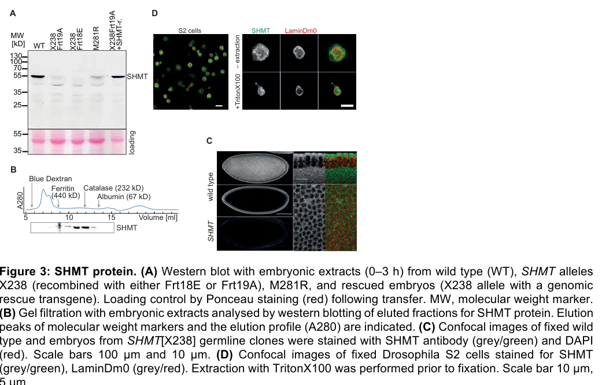

## Question

# Gene Research for Functional Annotation

## ⚠️ CRITICAL: Gene/Protein Identification Context

**BEFORE YOU BEGIN RESEARCH:** You MUST verify you are researching the CORRECT gene/protein. Gene symbols can be ambiguous, especially for less well-characterized genes from non-model organisms.

### Target Gene/Protein Identity (from UniProt):
- **UniProt Accession:** Q9W457
- **Protein Description:** RecName: Full=Serine hydroxymethyltransferase {ECO:0000256|ARBA:ARBA00016846, ECO:0000256|RuleBase:RU000585}; EC=2.1.2.1 {ECO:0000256|ARBA:ARBA00012256, ECO:0000256|RuleBase:RU000585};
- **Gene Information:** Name=Shmt {ECO:0000313|EMBL:AAF46101.1, ECO:0000313|FlyBase:FBgn0029823}; Synonyms=144561_at {ECO:0000313|EMBL:AAF46101.1}, anon-WO03040301.100 {ECO:0000313|EMBL:AAF46101.1}, Dmel\CG3011 {ECO:0000313|EMBL:AAF46101.1}, HTMLA {ECO:0000313|EMBL:AAF46101.1}, Q9W457 {ECO:0000313|EMBL:AAF46101.1}, SHMT {ECO:0000313|EMBL:AAF46101.1}, shmt {ECO:0000313|EMBL:AAF46101.1}, Shmt2 {ECO:0000313|EMBL:AAF46101.1}; ORFNames=CG3011 {ECO:0000313|EMBL:AAF46101.1, ECO:0000313|FlyBase:FBgn0029823}, Dmel_CG3011 {ECO:0000313|EMBL:AAF46101.1};
- **Organism (full):** Drosophila melanogaster (Fruit fly).
- **Protein Family:** Belongs to the SHMT family. {ECO:0000256|ARBA:ARBA00006376,
- **Key Domains:** PyrdxlP-dep_Trfase. (IPR015424); PyrdxlP-dep_Trfase_major. (IPR015421); PyrdxlP-dep_Trfase_small. (IPR015422); Ser_HO-MeTrfase. (IPR001085); Ser_HO-MeTrfase-like. (IPR049943)

### MANDATORY VERIFICATION STEPS:

1. **Check if the gene symbol "Shmt" matches the protein description above**
2. **Verify the organism is correct:** Drosophila melanogaster (Fruit fly).
3. **Check if protein family/domains align with what you find in literature**
4. **If you find literature for a DIFFERENT gene with the same or similar symbol, STOP**

### If Gene Symbol is Ambiguous or You Cannot Find Relevant Literature:

**DO NOT PROCEED WITH RESEARCH ON A DIFFERENT GENE.** Instead:
- State clearly: "The gene symbol 'Shmt' is ambiguous or literature is limited for this specific protein"
- Explain what you found (e.g., "Found extensive literature on a different gene with the same symbol in a different organism")
- Describe the protein based ONLY on the UniProt information provided above
- Suggest that the protein function can be inferred from domain/family information

### Research Target:

Please provide a comprehensive research report on the gene **Shmt** (gene ID: Shmt, UniProt: Q9W457) in DROME.

The research report should be a detailed narrative explaining the function, biological processes, and localization of the gene product. Citations should be given for all claims.

You should prioritize authoritative reviews and primary scientific literature when conducting research. You can supplement
this with annotations you find in gene/protein databases, but these can be outdated or inaccurate.

We are specifically interested in the primary function of the gene - for enzymes, what reaction is catalyzed, and what is the substrate specificity? For transporters, what is the substrate? For structural proteins or adapters, what is the broader structural role? For signaling molecules, what is the role in the pathway.

We are interested in where in or outside the cell the gene product carries out its function.

We are also interested in the signaling or biochemical pathways in which the gene functions. We are less interested in broad pleiotropic effects, except where these elucidate the precise role.

Include evidence where possible. We are interested in both experimental evidence as well as inference from structure, evolution, or bioinformatic analysis. Precise studies should be prioritized over high-throughput, where available.

## Output

Question: You are an expert researcher providing comprehensive, well-cited information.

Provide detailed information focusing on:
1. Key concepts and definitions with current understanding
2. Recent developments and latest research (prioritize 2023-2024 sources)
3. Current applications and real-world implementations
4. Expert opinions and analysis from authoritative sources
5. Relevant statistics and data from recent studies

Format as a comprehensive research report with proper citations. Include URLs and publication dates where available.
Always prioritize recent, authoritative sources and provide specific citations for all major claims.

# Gene Research for Functional Annotation

## ⚠️ CRITICAL: Gene/Protein Identification Context

**BEFORE YOU BEGIN RESEARCH:** You MUST verify you are researching the CORRECT gene/protein. Gene symbols can be ambiguous, especially for less well-characterized genes from non-model organisms.

### Target Gene/Protein Identity (from UniProt):
- **UniProt Accession:** Q9W457
- **Protein Description:** RecName: Full=Serine hydroxymethyltransferase {ECO:0000256|ARBA:ARBA00016846, ECO:0000256|RuleBase:RU000585}; EC=2.1.2.1 {ECO:0000256|ARBA:ARBA00012256, ECO:0000256|RuleBase:RU000585};
- **Gene Information:** Name=Shmt {ECO:0000313|EMBL:AAF46101.1, ECO:0000313|FlyBase:FBgn0029823}; Synonyms=144561_at {ECO:0000313|EMBL:AAF46101.1}, anon-WO03040301.100 {ECO:0000313|EMBL:AAF46101.1}, Dmel\CG3011 {ECO:0000313|EMBL:AAF46101.1}, HTMLA {ECO:0000313|EMBL:AAF46101.1}, Q9W457 {ECO:0000313|EMBL:AAF46101.1}, SHMT {ECO:0000313|EMBL:AAF46101.1}, shmt {ECO:0000313|EMBL:AAF46101.1}, Shmt2 {ECO:0000313|EMBL:AAF46101.1}; ORFNames=CG3011 {ECO:0000313|EMBL:AAF46101.1, ECO:0000313|FlyBase:FBgn0029823}, Dmel_CG3011 {ECO:0000313|EMBL:AAF46101.1};
- **Organism (full):** Drosophila melanogaster (Fruit fly).
- **Protein Family:** Belongs to the SHMT family. {ECO:0000256|ARBA:ARBA00006376,
- **Key Domains:** PyrdxlP-dep_Trfase. (IPR015424); PyrdxlP-dep_Trfase_major. (IPR015421); PyrdxlP-dep_Trfase_small. (IPR015422); Ser_HO-MeTrfase. (IPR001085); Ser_HO-MeTrfase-like. (IPR049943)

### MANDATORY VERIFICATION STEPS:

1. **Check if the gene symbol "Shmt" matches the protein description above**
2. **Verify the organism is correct:** Drosophila melanogaster (Fruit fly).
3. **Check if protein family/domains align with what you find in literature**
4. **If you find literature for a DIFFERENT gene with the same or similar symbol, STOP**

### If Gene Symbol is Ambiguous or You Cannot Find Relevant Literature:

**DO NOT PROCEED WITH RESEARCH ON A DIFFERENT GENE.** Instead:
- State clearly: "The gene symbol 'Shmt' is ambiguous or literature is limited for this specific protein"
- Explain what you found (e.g., "Found extensive literature on a different gene with the same symbol in a different organism")
- Describe the protein based ONLY on the UniProt information provided above
- Suggest that the protein function can be inferred from domain/family information

### Research Target:

Please provide a comprehensive research report on the gene **Shmt** (gene ID: Shmt, UniProt: Q9W457) in DROME.

The research report should be a detailed narrative explaining the function, biological processes, and localization of the gene product. Citations should be given for all claims.

You should prioritize authoritative reviews and primary scientific literature when conducting research. You can supplement
this with annotations you find in gene/protein databases, but these can be outdated or inaccurate.

We are specifically interested in the primary function of the gene - for enzymes, what reaction is catalyzed, and what is the substrate specificity? For transporters, what is the substrate? For structural proteins or adapters, what is the broader structural role? For signaling molecules, what is the role in the pathway.

We are interested in where in or outside the cell the gene product carries out its function.

We are also interested in the signaling or biochemical pathways in which the gene functions. We are less interested in broad pleiotropic effects, except where these elucidate the precise role.

Include evidence where possible. We are interested in both experimental evidence as well as inference from structure, evolution, or bioinformatic analysis. Precise studies should be prioritized over high-throughput, where available.

# Functional annotation of *Drosophila melanogaster* Shmt (CG3011; UniProt Q9W457)

## Identity and principal function

The supplied UniProt record identifies **Q9W457** as the fruit-fly serine hydroxymethyltransferase encoded by **Shmt/CG3011**. This gene-to-function assignment is independently supported by a fly genetic study that identifies its mutant locus as **SHMT/CG3011**. That study describes **one fly SHMT gene** producing alternative transcripts, rather than separate fly genes equivalent to mammalian *SHMT1* and *SHMT2*. Its reported pyridoxal-phosphate dependence and catalytic role agree with the SHMT-family and pyridoxal-phosphate-dependent transferase domains in the supplied record. The accession-to-gene mapping itself comes from the supplied UniProt information; the retrieved primary paper establishes the fly CG3011 identity. (winkler2017essentialfunctionof pages 1-3, winkler2017essentialfunctionof pages 5-7)

**The primary molecular function is a reversible, pyridoxal 5′-phosphate (PLP)-dependent one-carbon transfer:**

**L-serine + tetrahydrofolate ⇌ glycine + 5,10-methylenetetrahydrofolate + H₂O.**

Serine supplies the hydroxymethyl group, tetrahydrofolate (THF) accepts it, and glycine is the corresponding amino-acid product; the reaction can run in reverse. Thus, the supported substrate assignment is **serine and THF in the forward direction, and glycine and 5,10-methylenetetrahydrofolate in reverse**. Fly studies establish the need for catalytic SHMT function, but the retrieved work does **not** establish purified Q9W457 kinetic constants or a quantitative preference for either reaction direction. (winkler2017essentialfunctionof pages 1-3, winkler2017essentialfunctionof pages 5-7, angioli2026tumorsuppressorfunction pages 1-4)

The strongest gene-specific test is genetic complementation. A wild-type *Shmt* transgene rescued the Q470Stop/X238 mutant, whereas a construct carrying the active-site substitution **E130Q** did not; replacement with bacterial SHMT (*E. coli glyA*) did rescue lethality and the embryonic phenotype. This strongly favors an essential **enzymatic**, rather than exclusively structural, role. A qualification is that E130Q complemented a different fly allele, M281R: the authors discuss possible complementation within an SHMT oligomer, so E130Q should not be described as ineffective in every genetic context. Gel filtration of fly extracts indicated an approximately **250-kDa** SHMT-containing complex, consistent with a tetramer. (winkler2017essentialfunctionof pages 5-7)

The following table separates direct fly evidence from predictions and secondary interpretations.

| Functional claim | Experimental evidence | Confidence / qualification | Sources |
|---|---|---|---|
| **PLP-dependent serine–THF reaction:** L-serine + tetrahydrofolate ⇌ glycine + 5,10-methylene-THF | Fly literature identifies CG3011 SHMT as a pyridoxal-phosphate enzyme that interconverts serine and glycine while transferring a one-carbon unit to THF. The product supports folate-mediated purine, thymidylate and methyl-donor metabolism. (winkler2017essentialfunctionof pages 1-3) | **High for canonical activity; moderate for fly-specific biochemistry.** Catalytic function is genetically demonstrated, but purified Q9W457 kinetics were not reported in the retrieved studies. | Winkler et al., 2017, [DOI 10.1534/g3.117.043133](https://doi.org/10.1534/g3.117.043133) |
| **Catalysis, rather than a purely structural role, is essential** | An active-center E130Q transgene failed to rescue the Q470Stop/X238 allele, whereas a transgene carrying *E. coli* **glyA** rescued lethality and the germline-clone phenotype. E130Q nevertheless complemented M281R, possibly through interallelic complementation within the SHMT oligomer. (winkler2017essentialfunctionof pages 5-7) | **High.** Strong genetic-rescue evidence; the E130Q–M281R exception means E130Q is not nonfunctional in every oligomeric context. | Winkler et al., 2017, [DOI 10.1534/g3.117.043133](https://doi.org/10.1534/g3.117.043133) |
| **Alternative cytosolic and mitochondrial isoforms; minor nuclear pool** | The single fly locus produces transcripts predicted to encode a short cytosolic form and a 470-aa precursor with an N-terminal mitochondrial-import sequence. Antibody staining directly showed prominent cytoplasmic SHMT and, after detergent extraction, a residual nucleoplasmic fraction in S2 cells. Gel filtration indicated an approximately 250-kDa complex consistent with a tetramer. (winkler2017essentialfunctionof pages 5-7, winkler2017essentialfunctionof pages 7-9, winkler2017essentialfunctionof media 090d68d1) | **Mixed.** Cytoplasmic and nuclear localization are experimentally supported. Mitochondrial localization is inferred from transcript structure and the predicted import sequence, not directly demonstrated by organelle colocalization. | Winkler et al., 2017, [DOI 10.1534/g3.117.043133](https://doi.org/10.1534/g3.117.043133) |
| **SHMT sustains embryonic dTTP supply and cycle-13 progression** | Maternal-null embryos completed the first 12 rapid cycles but commonly arrested in interphase 13 before cellularization; X238 embryos showed 91.7% cycle-13 arrest and 95.8% absent or partial cellularization. A 2019 account reported selective dTTP depletion by nuclear cycle 13 and rescue by injected dTTP. (winkler2017essentialfunctionof pages 16-17, winkler2017essentialfunctionof pages 7-9, liu2019theroleof pages 3-4) | **High for arrest; moderate–high for the dTTP mechanism.** Arrest was measured directly in 2017; the retrieved detailed dTTP-rescue account is a 2019 review of the primary experiments. | Winkler et al., 2017, [DOI 10.1534/g3.117.043133](https://doi.org/10.1534/g3.117.043133); Liu and Großhans, 2019, [DOI 10.1080/15384101.2019.1665948](https://doi.org/10.1080/15384101.2019.1665948) |
| **Reduced SHMT promotes genome instability and tumor progression in a fly Ras tumor model** | In RasV12/Dlg-RNAi tumors, SHMT RNAi reduced activity by about 75%, increased tumor area from 9% to 11% and invasion from approximately 30% to approximately 50%. dTMP lowered γ-H2Av-positive cells from 31% to 3.2% and chromosome aberrations from 0.54 to 0.13 per cell. PLP antagonism intensified damage, whereas PLP ameliorated it. NAC at 1 mg/mL reduced γ-H2Av-positive cells from 31% to 3.57% and aberrations from 0.54 to 0.15 per cell. (angioli2026tumorsuppressorfunction pages 9-13, angioli2026tumorsuppressorfunction pages 4-9) | **High within this engineered model.** The results support thymidylate deficiency, ROS and a context-dependent tumor-suppressive effect; they do not establish a universal tumor-suppressor role. | Angioli et al., 2026, [DOI 10.1038/s41419-026-08602-7](https://doi.org/10.1038/s41419-026-08602-7) |

*Table: Evidence-tier summary for Drosophila melanogaster Shmt/CG3011 (Q9W457), separating direct fly experiments from sequence-based localization predictions and secondary reports.*

## Where Shmt acts

**Cytoplasm—direct observation.** SHMT antibody staining was predominantly cytoplasmic in fly embryos and cultured S2 cells. Antibody specificity was supported by marked loss of the approximately **55-kDa** immunoblot signal in mutant embryonic extracts. Figure 3 of Winkler and colleagues documents the staining and protein assays. (winkler2017essentialfunctionof pages 5-7, winkler2017essentialfunctionof pages 7-9, winkler2017essentialfunctionof media 090d68d1)

**Mitochondria—sequence/transcript-based assignment.** Alternative fly transcripts are predicted to produce a shorter cytoplasmic protein and a longer, approximately **470-amino-acid** precursor bearing an N-terminal mitochondrial-targeting sequence; the shorter predicted product is approximately **400 amino acids**. Processing of the longer precursor could make the mature forms difficult to distinguish on an immunoblot. The retrieved fly experiments do not provide definitive mitochondrial-organelle colocalization for Q9W457, so mitochondrial localization is best described as **predicted**, not directly demonstrated by that study. (winkler2017essentialfunctionof pages 1-3, winkler2017essentialfunctionof pages 5-7)

**Nucleus—evidence for a minor pool.** After detergent extraction removed much of the cytoplasmic signal, S2 cells retained nucleoplasmic SHMT staining alongside a nuclear-lamina marker. This supports a nuclear subfraction but does not itself establish its specific nuclear reaction partners or prove that nuclear SHMT directly synthesizes dTMP in flies. The characterized roles are intracellular; the observed non-autonomous behavior of mutant cell clones is interpreted as transfer of SHMT-dependent **metabolites**, not secretion of the enzyme. (winkler2017essentialfunctionof pages 7-9, winkler2017essentialfunctionof media 090d68d1)

## Biochemical pathway and experimentally defined biological role

Shmt introduces serine-derived one-carbon units into **folate-mediated one-carbon metabolism**. Its 5,10-methylenetetrahydrofolate product supplies the thymidylate-synthase reaction converting **dUMP to dTMP**, which supports production of dTTP for DNA replication. Other folate-bound one-carbon products can contribute to purine synthesis and methyl-donor metabolism, but the retrieved gene-specific rescue experiments most directly implicate the **thymidylate/dTTP branch**; they do not individually establish every potential downstream pathway for this fly protein. Shmt is a metabolic enzyme in this network, not a demonstrated signaling receptor or transcription factor. (winkler2017essentialfunctionof pages 1-3, liu2019theroleof pages 3-4, angioli2026tumorsuppressorfunction pages 9-13, angioli2026tumorsuppressorfunction pages 4-9)

In the original embryonic study, eggs lacking maternal SHMT completed the first **12 rapid nuclear cycles**, but commonly arrested in **interphase 13**, before normal cellularization. For the X238 allele, the reported frequencies were **91.7%** cycle-13 arrest and **95.8%** absent or incomplete cellularization. Broad activation of zygotic transcription and degradation of maternal RNAs remained largely intact, narrowing the interpretation toward a limiting metabolite rather than wholesale failure of the mid-blastula developmental program. The original authors proposed that maternally supplied SHMT-dependent metabolites support the earlier cycles. Mutant clones nevertheless grew in imaginal and follicular tissues, consistent with access to metabolites supplied by neighboring cells; direct measurement of the proposed transfer was not reported. (winkler2017essentialfunctionof pages 1-3, winkler2017essentialfunctionof pages 16-17, winkler2017essentialfunctionof pages 7-9)

A subsequent fly-focused analysis reports that SHMT-deficient embryos retain an initial maternal dNTP pool but become **selectively depleted of dTTP by nuclear cycle 13**, and that injected **dTTP** can rescue the cell-cycle phenotype. This is more specific evidence for the thymidylate mechanism, although the retrieved detailed account is a **2019 review of the underlying experiments**, rather than the full text of the original 2019 primary paper. The review reports newly laid wild-type embryos contain approximately **1.2 pmol dTTP per embryo**; that baseline should not be mistaken for the mutant cycle-13 measurement. (liu2019theroleof pages 3-4)

## Recent fly research and applications

In a peer-reviewed **2026** study using engineered *Drosophila* **RasV12/Dlg-RNAi** tumors, additional SHMT knockdown increased primary tumor area from about **9% to 11%** of body area and brain/ventral-nerve-cord invasion from approximately **30% to 50%**. The investigators reported about **40% lower SHMT expression** and about **75% lower measured activity** under their RNAi conditions. Importantly, supplied **dTMP** reduced SHMT-knockdown-associated γ-H2Av-positive, DNA-damage-marked cells from **31% to 3.2%**, and chromosome aberrations from **0.54 to 0.13 per cell**. These interventions connect Shmt to folate-dependent thymidylate supply and genome maintenance in a second fly experimental setting; they do **not** imply that all tumors or normal tissues respond identically. (angioli2026tumorsuppressorfunction pages 4-9)

The same study probed the **SHMT–PLP cofactor interaction**. Interfering with PLP availability using 4-deoxypyridoxine intensified damage in SHMT-depleted tumors: reported γ-H2Av-positive cells rose from about **31.4% to 80%**, and chromosome aberrations from **0.54 to 1.07 per cell**. PLP supplementation ameliorated these readouts. The antioxidant **N-acetylcysteine** reduced γ-H2Av-positive cells from approximately **31% to 3.57%** and chromosome aberrations from **0.54 to 0.15 per cell** under a reported treatment condition. The authors interpret their combined experiments as evidence that disrupted thymidylate metabolism and **reactive-oxygen-species-associated damage** contribute to genome instability; with combined strong SHMT/PLP depletion, extensive damage can instead trigger apoptosis and constrain tumor growth. These are research-model applications of fly Shmt genetics and dietary perturbation, **not established clinical uses of Q9W457**. (angioli2026tumorsuppressorfunction pages 1-4, angioli2026tumorsuppressorfunction pages 9-13, angioli2026tumorsuppressorfunction pages 13-17)

For the requested **2023–2024** window, two directly relevant fly papers were identified but their full texts could not be retrieved for independent assessment: Silva, Venda and Homem, **“Serine hydroxymethyl transferase is required for optic lobe neuroepithelia development in *Drosophila*”** (2023), and Pilesi and colleagues, **“A gene-nutrient interaction between vitamin B6 and serine hydroxymethyltransferase (SHMT) affects genome integrity in *Drosophila*”** (2023). A later secondary discussion associates SHMT with fly neuroepithelial development, but without access to the original optic-lobe experiments, specific neural mechanisms or quantitative outcomes should not be asserted. The independently accessible 2026 experiments provide stronger detail here for the PLP–genome-integrity connection. (pilesi2025tumoursuppressorrole pages 17-21, pilesi2025tumoursuppressorroleb pages 17-21, angioli2026tumorsuppressorfunction pages 9-13)

## Evidence-based conclusion

**Shmt/CG3011 is best annotated as an intracellular, PLP-dependent serine hydroxymethyltransferase that transfers one-carbon units between serine/glycine metabolism and THF, with particularly strong fly evidence for sustaining thymidylate and dTTP supply during DNA replication.** Its cytoplasmic distribution and smaller nuclear fraction have experimental staining support; a mitochondrial isoform is supported by transcript architecture and an import-sequence prediction. Catalytic necessity is supported by allele-specific rescue, while the precise kinetics and compartment-specific flux of the Q9W457 protein remain unresolved in the retrieved studies. (winkler2017essentialfunctionof pages 1-3, winkler2017essentialfunctionof pages 5-7, winkler2017essentialfunctionof pages 7-9, liu2019theroleof pages 3-4, angioli2026tumorsuppressorfunction pages 4-9)

### Selected publications and identifiers

- **Winkler F, et al.** “Essential Function of the Serine Hydroxymethyl Transferase (SHMT) Gene During Rapid Syncytial Cell Cycles in *Drosophila*.” *G3*, online **17 May 2017**, volume 7, pp. 2305–2314. https://doi.org/10.1534/g3.117.043133 (winkler2017essentialfunctionof pages 1-3)
- **Liu B, Großhans J.** “The role of dNTP metabolites in control of the embryonic cell cycle.” *Cell Cycle*, **September 2019**; review and source of the retrieved dTTP-rescue account. https://doi.org/10.1080/15384101.2019.1665948 (liu2019theroleof pages 3-4)
- **Silva EAB, Venda AM, Homem CCF.** “Serine hydroxymethyl transferase is required for optic lobe neuroepithelia development in *Drosophila*.” *Development*, **2023**; original article identified, full text unavailable in this retrieval. https://doi.org/10.1242/dev.201152 (pilesi2025tumoursuppressorrole pages 17-21)
- **Pilesi E, et al.** “A gene-nutrient interaction between vitamin B6 and serine hydroxymethyltransferase (SHMT) affects genome integrity in *Drosophila*.” *Journal of Cellular Physiology*, **May 2023**; original article identified, full text unavailable in this retrieval. https://doi.org/10.1002/jcp.31033 (angioli2026tumorsuppressorfunction pages 9-13)
- **Angioli C, et al.** “Tumor suppressor function of SHMT in a *Drosophila* RasV12DlgRNAi model: DNA damage and synergistic gene-nutrient interaction with PLP.” *Cell Death & Disease*, **March 2026**. https://doi.org/10.1038/s41419-026-08602-7 (angioli2026tumorsuppressorfunction pages 1-4, angioli2026tumorsuppressorfunction pages 4-9)

References

1. (winkler2017essentialfunctionof pages 1-3): Franziska Winkler, Maria Kriebel, Michaela Clever, Stephanie Gröning, and Jörg Großhans. Essential function of the serine hydroxymethyl transferase (shmt) gene during rapid syncytial cell cycles in<i>drosophila</i>. G3 Genes|Genomes|Genetics, 7:2305-2314, Jul 2017. URL: https://doi.org/10.1534/g3.117.043133, doi:10.1534/g3.117.043133. This article has 33 citations.

2. (winkler2017essentialfunctionof pages 5-7): Franziska Winkler, Maria Kriebel, Michaela Clever, Stephanie Gröning, and Jörg Großhans. Essential function of the serine hydroxymethyl transferase (shmt) gene during rapid syncytial cell cycles in<i>drosophila</i>. G3 Genes|Genomes|Genetics, 7:2305-2314, Jul 2017. URL: https://doi.org/10.1534/g3.117.043133, doi:10.1534/g3.117.043133. This article has 33 citations.

3. (angioli2026tumorsuppressorfunction pages 1-4): Chiara Angioli, Angelo Ferriero, Eleonora Pilesi, Giulia Tesoriere, Beatrice Agostini, Angela Tramonti, Roberto Contestabile, and Fiammetta Vernì. Tumor suppressor function of shmt in a drosophila rasv12dlgrnai model: dna damage and synergistic gene-nutrient interaction with plp. Cell Death &amp; Disease, Mar 2026. URL: https://doi.org/10.1038/s41419-026-08602-7, doi:10.1038/s41419-026-08602-7. This article has 1 citations and is from a peer-reviewed journal.

4. (winkler2017essentialfunctionof pages 7-9): Franziska Winkler, Maria Kriebel, Michaela Clever, Stephanie Gröning, and Jörg Großhans. Essential function of the serine hydroxymethyl transferase (shmt) gene during rapid syncytial cell cycles in<i>drosophila</i>. G3 Genes|Genomes|Genetics, 7:2305-2314, Jul 2017. URL: https://doi.org/10.1534/g3.117.043133, doi:10.1534/g3.117.043133. This article has 33 citations.

5. (winkler2017essentialfunctionof media 090d68d1): Franziska Winkler, Maria Kriebel, Michaela Clever, Stephanie Gröning, and Jörg Großhans. Essential function of the serine hydroxymethyl transferase (shmt) gene during rapid syncytial cell cycles in<i>drosophila</i>. G3 Genes|Genomes|Genetics, 7:2305-2314, Jul 2017. URL: https://doi.org/10.1534/g3.117.043133, doi:10.1534/g3.117.043133. This article has 33 citations.

6. (winkler2017essentialfunctionof pages 16-17): Franziska Winkler, Maria Kriebel, Michaela Clever, Stephanie Gröning, and Jörg Großhans. Essential function of the serine hydroxymethyl transferase (shmt) gene during rapid syncytial cell cycles in<i>drosophila</i>. G3 Genes|Genomes|Genetics, 7:2305-2314, Jul 2017. URL: https://doi.org/10.1534/g3.117.043133, doi:10.1534/g3.117.043133. This article has 33 citations.

7. (liu2019theroleof pages 3-4): Boyang Liu and Jörg Großhans. The role of dntp metabolites in control of the embryonic cell cycle. Cell Cycle, 18:2817-2827, Sep 2019. URL: https://doi.org/10.1080/15384101.2019.1665948, doi:10.1080/15384101.2019.1665948. This article has 23 citations and is from a peer-reviewed journal.

8. (angioli2026tumorsuppressorfunction pages 9-13): Chiara Angioli, Angelo Ferriero, Eleonora Pilesi, Giulia Tesoriere, Beatrice Agostini, Angela Tramonti, Roberto Contestabile, and Fiammetta Vernì. Tumor suppressor function of shmt in a drosophila rasv12dlgrnai model: dna damage and synergistic gene-nutrient interaction with plp. Cell Death &amp; Disease, Mar 2026. URL: https://doi.org/10.1038/s41419-026-08602-7, doi:10.1038/s41419-026-08602-7. This article has 1 citations and is from a peer-reviewed journal.

9. (angioli2026tumorsuppressorfunction pages 4-9): Chiara Angioli, Angelo Ferriero, Eleonora Pilesi, Giulia Tesoriere, Beatrice Agostini, Angela Tramonti, Roberto Contestabile, and Fiammetta Vernì. Tumor suppressor function of shmt in a drosophila rasv12dlgrnai model: dna damage and synergistic gene-nutrient interaction with plp. Cell Death &amp; Disease, Mar 2026. URL: https://doi.org/10.1038/s41419-026-08602-7, doi:10.1038/s41419-026-08602-7. This article has 1 citations and is from a peer-reviewed journal.

10. (angioli2026tumorsuppressorfunction pages 13-17): Chiara Angioli, Angelo Ferriero, Eleonora Pilesi, Giulia Tesoriere, Beatrice Agostini, Angela Tramonti, Roberto Contestabile, and Fiammetta Vernì. Tumor suppressor function of shmt in a drosophila rasv12dlgrnai model: dna damage and synergistic gene-nutrient interaction with plp. Cell Death &amp; Disease, Mar 2026. URL: https://doi.org/10.1038/s41419-026-08602-7, doi:10.1038/s41419-026-08602-7. This article has 1 citations and is from a peer-reviewed journal.

11. (pilesi2025tumoursuppressorrole pages 17-21): E Pilesi. Tumour suppressor role of serine hydroxymethyltransferase in drosophila melanogaster. Unknown journal, 2025.

12. (pilesi2025tumoursuppressorroleb pages 17-21): E Pilesi. Tumour suppressor role of serine hydroxymethyltransferase in drosophila melanogaster. Unknown journal, 2025.

## Artifacts

- [Edison artifact artifact-00](Shmt-deep-research-falcon_artifacts/artifact-00.md)

## Citations

1. winkler2017essentialfunctionof pages 5-7
2. winkler2017essentialfunctionof pages 1-3
3. liu2019theroleof pages 3-4
4. angioli2026tumorsuppressorfunction pages 4-9
5. pilesi2025tumoursuppressorrole pages 17-21
6. angioli2026tumorsuppressorfunction pages 9-13
7. angioli2026tumorsuppressorfunction pages 1-4
8. winkler2017essentialfunctionof pages 7-9
9. winkler2017essentialfunctionof pages 16-17
10. angioli2026tumorsuppressorfunction pages 13-17
11. pilesi2025tumoursuppressorroleb pages 17-21
12. DOI 10.1534/g3.117.043133
13. DOI 10.1080/15384101.2019.1665948
14. DOI 10.1038/s41419-026-08602-7
15. https://doi.org/10.1534/g3.117.043133
16. https://doi.org/10.1080/15384101.2019.1665948
17. https://doi.org/10.1038/s41419-026-08602-7
18. https://doi.org/10.1242/dev.201152
19. https://doi.org/10.1002/jcp.31033
20. https://doi.org/10.1534/g3.117.043133,
21. https://doi.org/10.1038/s41419-026-08602-7,
22. https://doi.org/10.1080/15384101.2019.1665948,