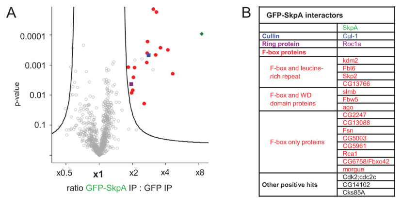

## Question

# Gene Research for Functional Annotation

## ⚠️ CRITICAL: Gene/Protein Identification Context

**BEFORE YOU BEGIN RESEARCH:** You MUST verify you are researching the CORRECT gene/protein. Gene symbols can be ambiguous, especially for less well-characterized genes from non-model organisms.

### Target Gene/Protein Identity (from UniProt):
- **UniProt Accession:** O77430
- **Protein Description:** SubName: Full=SKP1-related A, isoform A {ECO:0000313|EMBL:AAF45538.1}; SubName: Full=SKP1-related A, isoform B {ECO:0000313|EMBL:AAF45539.1}; SubName: Full=SKP1-related A, isoform C {ECO:0000313|EMBL:AAN09024.1}; SubName: Full=SKP1-related A, isoform D {ECO:0000313|EMBL:AAG22362.1}; SubName: Full=SKP1-related A, isoform E {ECO:0000313|EMBL:AAN09025.1}; SubName: Full=SKP1-related A, isoform F {ECO:0000313|EMBL:AAF45540.1}; SubName: Full=SKP1-related A, isoform G {ECO:0000313|EMBL:AAN09026.1}; SubName: Full=SKP1-related A, isoform H {ECO:0000313|EMBL:ABC67161.1}; SubName: Full=SKP1-related A, isoform I {ECO:0000313|EMBL:AHN59226.1};
- **Gene Information:** Name=SkpA {ECO:0000313|EMBL:AAF45540.1, ECO:0000313|FlyBase:FBgn0025637}; Synonyms=anon-WO03040301.234 {ECO:0000313|EMBL:AAF45540.1}, anon-WO03040301.236 {ECO:0000313|EMBL:AAF45540.1}, anon-WO03040301.238 {ECO:0000313|EMBL:AAF45540.1}, Dmel\CG16983 {ECO:0000313|EMBL:AAF45540.1}, dSkip-1 {ECO:0000313|EMBL:AAF45540.1}, dSkp-1 {ECO:0000313|EMBL:AAF45540.1}, dSKP1 {ECO:0000313|EMBL:AAF45540.1}, dSkpA {ECO:0000313|EMBL:AAF45540.1}, dskpA {ECO:0000313|EMBL:AAF45540.1}, EG:115C2.4 {ECO:0000313|EMBL:AAF45540.1}, l(1)G0037 {ECO:0000313|EMBL:AAF45540.1}, l(1)G0058 {ECO:0000313|EMBL:AAF45540.1}, l(1)G0109 {ECO:0000313|EMBL:AAF45540.1}, l(1)G0389 {ECO:0000313|EMBL:AAF45540.1}, Skp {ECO:0000313|EMBL:AAF45540.1}, SKP1 {ECO:0000313|EMBL:AAF45540.1}, Skp1 {ECO:0000313|EMBL:AAF45540.1}, SKPA {ECO:0000313|EMBL:AAF45540.1}, skpA {ECO:0000313|EMBL:AAF45540.1}, spkA {ECO:0000313|EMBL:AAF45540.1}; ORFNames=CG16983 {ECO:0000313|EMBL:AAF45540.1, ECO:0000313|FlyBase:FBgn0025637}, Dmel_CG16983 {ECO:0000313|EMBL:AAF45540.1};
- **Organism (full):** Drosophila melanogaster (Fruit fly).
- **Protein Family:** Belongs to the SKP1 family. {ECO:0000256|ARBA:ARBA00009993,
- **Key Domains:** SKP1. (IPR016897); SKP1-like. (IPR001232); SKP1-like_dim_sf. (IPR036296); SKP1/BTB/POZ_sf. (IPR011333); Skp1_comp_dimer. (IPR016072)

### MANDATORY VERIFICATION STEPS:

1. **Check if the gene symbol "SkpA" matches the protein description above**
2. **Verify the organism is correct:** Drosophila melanogaster (Fruit fly).
3. **Check if protein family/domains align with what you find in literature**
4. **If you find literature for a DIFFERENT gene with the same or similar symbol, STOP**

### If Gene Symbol is Ambiguous or You Cannot Find Relevant Literature:

**DO NOT PROCEED WITH RESEARCH ON A DIFFERENT GENE.** Instead:
- State clearly: "The gene symbol 'SkpA' is ambiguous or literature is limited for this specific protein"
- Explain what you found (e.g., "Found extensive literature on a different gene with the same symbol in a different organism")
- Describe the protein based ONLY on the UniProt information provided above
- Suggest that the protein function can be inferred from domain/family information

### Research Target:

Please provide a comprehensive research report on the gene **SkpA** (gene ID: SkpA, UniProt: O77430) in DROME.

The research report should be a detailed narrative explaining the function, biological processes, and localization of the gene product. Citations should be given for all claims.

You should prioritize authoritative reviews and primary scientific literature when conducting research. You can supplement
this with annotations you find in gene/protein databases, but these can be outdated or inaccurate.

We are specifically interested in the primary function of the gene - for enzymes, what reaction is catalyzed, and what is the substrate specificity? For transporters, what is the substrate? For structural proteins or adapters, what is the broader structural role? For signaling molecules, what is the role in the pathway.

We are interested in where in or outside the cell the gene product carries out its function.

We are also interested in the signaling or biochemical pathways in which the gene functions. We are less interested in broad pleiotropic effects, except where these elucidate the precise role.

Include evidence where possible. We are interested in both experimental evidence as well as inference from structure, evolution, or bioinformatic analysis. Precise studies should be prioritized over high-throughput, where available.

## Output

Question: You are an expert researcher providing comprehensive, well-cited information.

Provide detailed information focusing on:
1. Key concepts and definitions with current understanding
2. Recent developments and latest research (prioritize 2023-2024 sources)
3. Current applications and real-world implementations
4. Expert opinions and analysis from authoritative sources
5. Relevant statistics and data from recent studies

Format as a comprehensive research report with proper citations. Include URLs and publication dates where available.
Always prioritize recent, authoritative sources and provide specific citations for all major claims.

# Gene Research for Functional Annotation

## ⚠️ CRITICAL: Gene/Protein Identification Context

**BEFORE YOU BEGIN RESEARCH:** You MUST verify you are researching the CORRECT gene/protein. Gene symbols can be ambiguous, especially for less well-characterized genes from non-model organisms.

### Target Gene/Protein Identity (from UniProt):
- **UniProt Accession:** O77430
- **Protein Description:** SubName: Full=SKP1-related A, isoform A {ECO:0000313|EMBL:AAF45538.1}; SubName: Full=SKP1-related A, isoform B {ECO:0000313|EMBL:AAF45539.1}; SubName: Full=SKP1-related A, isoform C {ECO:0000313|EMBL:AAN09024.1}; SubName: Full=SKP1-related A, isoform D {ECO:0000313|EMBL:AAG22362.1}; SubName: Full=SKP1-related A, isoform E {ECO:0000313|EMBL:AAN09025.1}; SubName: Full=SKP1-related A, isoform F {ECO:0000313|EMBL:AAF45540.1}; SubName: Full=SKP1-related A, isoform G {ECO:0000313|EMBL:AAN09026.1}; SubName: Full=SKP1-related A, isoform H {ECO:0000313|EMBL:ABC67161.1}; SubName: Full=SKP1-related A, isoform I {ECO:0000313|EMBL:AHN59226.1};
- **Gene Information:** Name=SkpA {ECO:0000313|EMBL:AAF45540.1, ECO:0000313|FlyBase:FBgn0025637}; Synonyms=anon-WO03040301.234 {ECO:0000313|EMBL:AAF45540.1}, anon-WO03040301.236 {ECO:0000313|EMBL:AAF45540.1}, anon-WO03040301.238 {ECO:0000313|EMBL:AAF45540.1}, Dmel\CG16983 {ECO:0000313|EMBL:AAF45540.1}, dSkip-1 {ECO:0000313|EMBL:AAF45540.1}, dSkp-1 {ECO:0000313|EMBL:AAF45540.1}, dSKP1 {ECO:0000313|EMBL:AAF45540.1}, dSkpA {ECO:0000313|EMBL:AAF45540.1}, dskpA {ECO:0000313|EMBL:AAF45540.1}, EG:115C2.4 {ECO:0000313|EMBL:AAF45540.1}, l(1)G0037 {ECO:0000313|EMBL:AAF45540.1}, l(1)G0058 {ECO:0000313|EMBL:AAF45540.1}, l(1)G0109 {ECO:0000313|EMBL:AAF45540.1}, l(1)G0389 {ECO:0000313|EMBL:AAF45540.1}, Skp {ECO:0000313|EMBL:AAF45540.1}, SKP1 {ECO:0000313|EMBL:AAF45540.1}, Skp1 {ECO:0000313|EMBL:AAF45540.1}, SKPA {ECO:0000313|EMBL:AAF45540.1}, skpA {ECO:0000313|EMBL:AAF45540.1}, spkA {ECO:0000313|EMBL:AAF45540.1}; ORFNames=CG16983 {ECO:0000313|EMBL:AAF45540.1, ECO:0000313|FlyBase:FBgn0025637}, Dmel_CG16983 {ECO:0000313|EMBL:AAF45540.1};
- **Organism (full):** Drosophila melanogaster (Fruit fly).
- **Protein Family:** Belongs to the SKP1 family. {ECO:0000256|ARBA:ARBA00009993,
- **Key Domains:** SKP1. (IPR016897); SKP1-like. (IPR001232); SKP1-like_dim_sf. (IPR036296); SKP1/BTB/POZ_sf. (IPR011333); Skp1_comp_dimer. (IPR016072)

### MANDATORY VERIFICATION STEPS:

1. **Check if the gene symbol "SkpA" matches the protein description above**
2. **Verify the organism is correct:** Drosophila melanogaster (Fruit fly).
3. **Check if protein family/domains align with what you find in literature**
4. **If you find literature for a DIFFERENT gene with the same or similar symbol, STOP**

### If Gene Symbol is Ambiguous or You Cannot Find Relevant Literature:

**DO NOT PROCEED WITH RESEARCH ON A DIFFERENT GENE.** Instead:
- State clearly: "The gene symbol 'SkpA' is ambiguous or literature is limited for this specific protein"
- Explain what you found (e.g., "Found extensive literature on a different gene with the same symbol in a different organism")
- Describe the protein based ONLY on the UniProt information provided above
- Suggest that the protein function can be inferred from domain/family information

### Research Target:

Please provide a comprehensive research report on the gene **SkpA** (gene ID: SkpA, UniProt: O77430) in DROME.

The research report should be a detailed narrative explaining the function, biological processes, and localization of the gene product. Citations should be given for all claims.

You should prioritize authoritative reviews and primary scientific literature when conducting research. You can supplement
this with annotations you find in gene/protein databases, but these can be outdated or inaccurate.

We are specifically interested in the primary function of the gene - for enzymes, what reaction is catalyzed, and what is the substrate specificity? For transporters, what is the substrate? For structural proteins or adapters, what is the broader structural role? For signaling molecules, what is the role in the pathway.

We are interested in where in or outside the cell the gene product carries out its function.

We are also interested in the signaling or biochemical pathways in which the gene functions. We are less interested in broad pleiotropic effects, except where these elucidate the precise role.

Include evidence where possible. We are interested in both experimental evidence as well as inference from structure, evolution, or bioinformatic analysis. Precise studies should be prioritized over high-throughput, where available.

# Functional annotation of *Drosophila melanogaster* SkpA

## Identity and principal function

**The target is fruit-fly SkpA (CG16983; FlyBase FBgn0025637; UniProt O77430), not Skp2.** The supplied UniProt record assigns SkpA to the SKP1 family and lists SKP1-related domains. Fly studies independently identify SkpA as a Skp1 homologue; Skp2, Slimb, Bard, and Fbxo42 are distinct **F-box proteins** that can partner with it. The accession-to-gene mapping is taken from the supplied UniProt record; the protein identity and functional distinction are corroborated by primary literature. (barbosa2020scffbxo42promotessynaptonemal pages 1-2, dabool2020drosophilaskp1homologue pages 1-2, cao2022thefboxprotein pages 1-2)

**Primary molecular role:** SkpA is a protein–protein **adaptor in SCF (Skp1–Cullin1–F-box) E3 ubiquitin-ligase complexes**. It connects a substrate-selecting F-box protein to the Cullin1 scaffold; Cullin1 associates with the RING protein Roc1a, which positions ubiquitin-charged E2 machinery for ubiquitin transfer to recruited proteins. SkpA is **not itself the substrate-recognition F-box subunit or a ubiquitin-conjugating enzyme**, and no standalone SkpA-catalyzed reaction or fixed SkpA-specific substrate exists. Its contribution to substrate specificity depends on which F-box partner is assembled. This architecture agrees with its supplied SKP1-family/domain annotation. (barbosa2020scffbxo42promotessynaptonemal pages 1-2, cao2022thefboxprotein pages 2-3, wong2013acullin1basedscf pages 6-8)

The physical evidence is unusually direct: GFP-SkpA immunoprecipitated from fly ovaries specifically recovered **Cullin1, Roc1a, and 15 F-box proteins** by quantitative mass spectrometry. Independently, immunoprecipitating Slimb from fly S2 cells or larval brains recovered endogenous SkpA and Cullin1; Roc1a also associated with this complex. These results establish that SkpA participates in **multiple** SCF assemblies rather than one invariant substrate-specific ligase. The ovarian interaction data are shown in the cropped experimental figure retrieved with this report. (barbosa2020scffbxo42promotessynaptonemal pages 1-2, barbosa2020scffbxo42promotessynaptonemal media ee147d0a, wong2013acullin1basedscf pages 6-8)

## Where SkpA functions

SkpA functions **inside cells**. Direct imaging of expressed **SkpA–RFP** in sensory neurons found it throughout neuronal **somas, dendrites, and axons** (*n* = 7); the authors did not find evidence for confinement to dendrites. SkpA-containing complexes were recovered from ovaries, embryonic extracts, cultured S2 cells, and larval brains, and SkpA-dependent effects were observed in adult-brain neurons and meiotic oocytes. These tissue-level results do **not** establish a universal nuclear-versus-cytoplasmic partition for the endogenous protein. In particular, nuclear accumulation of the proposed cell-cycle target Dup, or nuclear/mitochondrial localization of the separate protein Jig, must not be misreported as localization of SkpA itself. (wong2013acullin1basedscf pages 10-13, barbosa2020scffbxo42promotessynaptonemal pages 1-2, cao2022thefboxprotein pages 4-5, dabool2020drosophilaskp1homologue pages 4-6, bhuiyan2023thedrosophilagene pages 6-9)

## Mechanistically informative pathways and substrates

**Female meiosis—chromosome organization.** Ovarian SkpA RNAi disrupted synaptonemal-complex assembly, caused premature disassembly along chromosome arms, reduced recruitment of meiotic cohesin component C(2)M, and distorted oocyte karyosomes. An RNAi-resistant SkpA transgene rescued the synaptonemal-complex and karyosome defects. Of the **15** SkpA-associated F-box proteins tested by depletion, **Slimb and CG6758/Fbxo42** reproduced relevant meiotic defects. Fbxo42 depletion increased the abundance of the PP2A-B56 regulatory subunit **Wrd** in germarium region 2; Wrd overexpression reproduced meiotic defects. This supports a SkpA–Cul1–Fbxo42 pathway that *downregulates Wrd* to favor synaptonemal-complex assembly. Wrd is a strong **candidate** SCF substrate, but its direct ubiquitination by this complex was not established. (barbosa2020scffbxo42promotessynaptonemal pages 2-5, barbosa2020scffbxo42promotessynaptonemal pages 5-7, barbosa2020scffbxo42promotessynaptonemal pages 7-8)

**Neuronal remodeling—insulin/PI3K/TOR.** During metamorphosis, a SkpA–Cullin1–Roc1a–Slimb complex promotes sensory-neuron dendrite and mushroom-body γ-neuron axon pruning downstream of ecdysone-responsive EcR-B1/Sox14. **All eight of eight** examined *skpA¹* mushroom-body γ-neuron clones retained an axon-pruning defect at **24 hours after puparium formation**. InR inhibition suppressed, whereas activated InR worsened, the dendrite-pruning defect caused by SkpA knockdown. The strongest substrate-level evidence is for **Akt**: Slimb bound Akt through its WD40 recognition region, and intact Slimb—but not a WD40-deleted mutant—increased polyubiquitinated Akt in S2 cells. Cullin1 knockdown increased endogenous Akt staining **2.8-fold** in sensory-neuron somas and elevated active Akt. Together these data support attenuation of InR/PI3K/TOR signaling by SCF-associated Akt ubiquitination. They do not show that isolated SkpA binds Akt, or directly measure an Akt half-life or SkpA-dependent Akt ubiquitination. (wong2013acullin1basedscf pages 6-8, wong2013acullin1basedscf pages 9-10, wong2013acullin1basedscf pages 10-13)

**Early embryogenesis—timed Smaug clearance.** During the maternal-to-zygotic transition, maternally supplied SkpA and Cullin1 associate with the RNA-binding protein **Smaug (SMG)** principally when the **zygotically expressed F-box protein Bard** appears, approximately **2–3 hours after egg laying**. Bard loss prolonged SMG persistence; Bard transgenes restored clearance. Even **28% depletion of *bard* mRNA** by RNAi significantly stabilized SMG at **3–4 hours**. This is strong physiological evidence for Bard-directed recruitment of a SkpA-containing SCF to clear SMG and thereby help terminate its maternal-mRNA regulatory activity. Bard specifies this timing and substrate; SkpA supplies the adaptor, not the timer or direct recognition site. (cao2022thefboxprotein pages 1-2, cao2022thefboxprotein pages 3-4, cao2022thefboxprotein pages 4-5)

**Cell-cycle control and innate immunity—more provisional substrate assignments.** In fly plasmatocytes, RNAi against SkpA or other proposed SCF-Skp2 components produced enlarged, DNA-re-replicating cells and nuclear accumulation of the replication-licensing factor **Double-parked/Dup**; Geminin overexpression partly rescued the phenotype. These results implicate SCF-dependent Dup control, but the study **inferred**, rather than directly assayed, Dup ubiquitination by SkpA-containing SCF. Separately, two partial-loss-of-function *SkpA* alleles constitutively induced the IMD-pathway antimicrobial gene *Diptericin*, and SkpA/Slimb depletion raised full-length and processed **Relish** abundance. The proposed direct targeting of Relish remains a **hypothesis**: the study did not establish Relish ubiquitination or rule out another downstream IMD component as the immediate substrate. (kroeger2013knockdownofscfskp2 pages 1-2, kroeger2013knockdownofscfskp2 pages 4-5, khush2002aubiquitinproteasomepathway pages 1-2, khush2002aubiquitinproteasomepathway pages 4-6)

The following evidence matrix distinguishes direct interaction and genetic results from inferred substrate mechanisms.

| Experimental system / pathway | SkpA/SCF evidence and quantitative result | Mechanistic substrate and caveat | Main DOI / year |
|---|---|---|---|
| Female meiosis; synaptonemal-complex and karyosome regulation | GFP-SkpA immunoprecipitation from ovaries recovered Cul1, Roc1a, and 15 F-box proteins. SkpA RNAi impaired synaptonemal-complex assembly and caused premature disassembly; an RNAi-resistant SkpA transgene rescued the defects. (barbosa2020scffbxo42promotessynaptonemal pages 1-2, barbosa2020scffbxo42promotessynaptonemal pages 2-5) | SCF-Fbxo42 lowers PP2A-B56/Wrd abundance; Fbxo42 depletion significantly increased GFP-Wrd in germarium region 2, and Wrd overexpression phenocopied meiotic defects. Direct Wrd ubiquitination was not demonstrated, so Wrd is a strongly supported candidate substrate rather than a biochemically proven one. (barbosa2020scffbxo42promotessynaptonemal pages 5-7, barbosa2020scffbxo42promotessynaptonemal pages 7-8) | [10.1083/jcb.202009167](https://doi.org/10.1083/jcb.202009167), published 2020 |
| Metamorphic neuronal pruning; InR/PI3K/TOR signaling | Myc-Slimb co-IP recovered endogenous SkpA and Cul1 from S2 cells and larval brains. All 8/8 `skpA1` mushroom-body γ-neuron clones failed axon pruning at 24 h after puparium formation; SkpA-RFP was distributed through neuronal somas, dendrites, and axons. (wong2013acullin1basedscf pages 6-8, wong2013acullin1basedscf pages 10-13) | Slimb bound Akt through its WD40 substrate-recognition region; wild-type Slimb, but not SlimbΔWD40, increased polyubiquitinated Akt. Cul1 RNAi raised endogenous Akt 2.8-fold in ddaC somas, but no Akt half-life, proteasome-dependence, or SkpA-specific Akt-ubiquitination assay was reported. (wong2013acullin1basedscf pages 10-13) | [10.1371/journal.pbio.1001657](https://doi.org/10.1371/journal.pbio.1001657), published 2013 |
| Embryonic maternal-to-zygotic transition; Bard–Smaug clearance | SMG IP-MS detected Bard, SkpA, and Cul1 binding predominantly at 2–3 h after egg laying, despite maternal SkpA/Cul1 remaining relatively constant. A bard deficiency stabilized SMG beyond cellularization, while Bard and FLAG-Bard transgenes fully rescued clearance. (cao2022thefboxprotein pages 3-4, cao2022thefboxprotein pages 4-5) | Smaug is a strongly supported physiological substrate of SCF-Bard: Bard RNAi achieved 28% mRNA depletion and significantly stabilized SMG at 3–4 h. Direct ubiquitin-site mapping or a purified ubiquitination reaction was not shown, and SkpA acts as the core adaptor rather than the substrate receptor. (cao2022thefboxprotein pages 4-5) | [10.1093/genetics/iyab177](https://doi.org/10.1093/genetics/iyab177), advance publication 20 Oct 2021; issue 2022 |
| Larval plasmatocyte cell cycle; SCF-Skp2 | Plasmatocyte-specific knockdown of SkpA or other proposed SCF-Skp2 components produced enlarged, BrdU-positive cells with excess DNA and multiple centrioles. These are complex-level RNAi phenotypes, not a direct SkpA localization or biochemical assay. (kroeger2013knockdownofscfskp2 pages 1-2, kroeger2013knockdownofscfskp2 pages 4-5) | Double-parked/Dup accumulated in nuclei when SCF components were depleted, accompanying DNA re-replication; Geminin overexpression partially rescued the phenotype. Dup ubiquitination by the assembled fly complex was inferred, not directly measured. (kroeger2013knockdownofscfskp2 pages 1-2, kroeger2013knockdownofscfskp2 pages 4-5) | [10.1371/journal.pone.0079019](https://doi.org/10.1371/journal.pone.0079019), published 24 Oct 2013 |
| Innate immunity; IMD–Relish signaling | Two partial-loss-of-function `SkpA` alleles constitutively induced the IMD target Diptericin; SkpA/Slimb RNAi increased full-length Relish and its processed Rel-homology domain. Similar phenotypes followed dCul1 or proteasome disruption. (khush2002aubiquitinproteasomepathway pages 1-2) | Relish was proposed as the SCF/proteasome target, but the study did not show Relish ubiquitination, direct SkpA–Relish binding, or distinguish Relish from another downstream IMD component as the direct substrate. (khush2002aubiquitinproteasomepathway pages 8-9, khush2002aubiquitinproteasomepathway pages 4-6) | [10.1016/S0960-9822(02)01214-9](https://doi.org/10.1016/S0960-9822(02)01214-9), published 15 Oct 2002 |
| Adult-brain proteostasis and α-synuclein neurodegeneration | Adult neuronal `skpA` knockdown increased ubiquitin-positive aggregates, caused delayed dopaminergic-neuron loss, motor decline, and shortened lifespan. Overexpression reduced aggregates and rescued locomotion, survival, aggregate burden, and neuron loss in an α-synuclein model; aggregate reduction used `n=9` SkpA-overexpression and `n=6` control brains. (dabool2020drosophilaskp1homologue pages 1-2, dabool2020drosophilaskp1homologue pages 4-6) | Genetic interaction places SkpA with the F-box protein Nutcracker/FBXO7, but no individual ubiquitinated substrate was identified; aggregate burden is a proteostasis readout, not evidence that α-synuclein is directly recognized by SkpA. (dabool2020drosophilaskp1homologue pages 6-10) | [10.1016/j.isci.2020.101375](https://doi.org/10.1016/j.isci.2020.101375), published 21 Aug 2020 |
| Embryonic SMN-complex proteomics and proteostasis network | In four wild-type Flag-SMN AP-MS replicates, SkpA co-purified with SCF-Slimb components Slmb and Cul1. SkpA nevertheless fell below the study’s displayed conventional WT-versus-control significance threshold, possibly reflecting reduced peptide recovery from small proteins. (matera2024proteomicanalysisof pages 5-6) | The result supports a tentative SMN–SCF association only: there was no SkpA-specific validation, localization experiment, substrate assay, fold change, peptide count, or reported SkpA-specific p-value. | [10.3389/frnar.2024.1448194](https://doi.org/10.3389/frnar.2024.1448194), published Sep 2024 |

*Table: Study-level evidence for *Drosophila melanogaster* SkpA/O77430, separating direct complex membership and quantitative phenotypes from inferred substrate assignments. Citations identify the primary experimental support and important limitations.*

## Recent developments, model applications, and limitations

Adult-neuron manipulation provides an experimentally tractable application of this annotation. In a fly study, neuronal *skpA* knockdown increased ubiquitin-positive aggregates, impaired climbing, shortened lifespan, and eventually reduced dopaminergic-neuron number; overexpression lowered aggregate burden and improved phenotypes in an **α-synuclein-expressing fly model**. Genetic interaction implicated the F-box protein Nutcracker/FBXO7. This supports a **model-organism proteostasis role**, not evidence that α-synuclein is a directly demonstrated SkpA–SCF substrate or that increasing human SKP1 is an established therapy. (dabool2020drosophilaskp1homologue pages 1-2, dabool2020drosophilaskp1homologue pages 4-6, dabool2020drosophilaskp1homologue pages 6-10)

The **2023–2024 fly-specific literature retrieved does not supersede the direct adaptor evidence**. A 2023 Jig/CrebA study mentioned SKPA among Jig’s putative interaction partners and proposed that it might contribute to Jig turnover, but did **not** establish SkpA-dependent Jig ubiquitination or SkpA mitochondrial localization. A peer-reviewed **2024** embryonic SMN-complex proteomic study detected SkpA alongside Slimb and Cullin1; importantly, **SkpA itself fell below the authors’ displayed conventional significance threshold** in the wild-type-versus-control comparison. It is a tentative association, not a new confirmed SkpA substrate or localization assignment. Thus, the best-supported current annotation remains an **intracellular, partner-dependent SCF assembly adaptor** with experimentally documented functions in proteolytic pathway regulation, not an autonomous enzyme with universal substrate specificity. (bhuiyan2023thedrosophilagene pages 6-9, bhuiyan2023thedrosophilagene pages 11-13, matera2024proteomicanalysisof pages 5-6)

### Selected primary sources and dates

- Barbosa *et al.*, **“SCF-Fbxo42 promotes synaptonemal complex assembly by downregulating PP2A-B56,”** *Journal of Cell Biology*; published online **December 2020**, volume 220 (2021). https://doi.org/10.1083/jcb.202009167. (barbosa2020scffbxo42promotessynaptonemal pages 1-2)
- Cao *et al.*, **“The F-box protein Bard (CG14317) targets the Smaug RNA-binding protein for destruction during the Drosophila maternal-to-zygotic transition,”** *Genetics*; advance publication **20 October 2021**, volume 220 (2022). https://doi.org/10.1093/genetics/iyab177. (cao2022thefboxprotein pages 1-2)
- Wong *et al.*, **“A Cullin1-Based SCF E3 Ubiquitin Ligase Targets the InR/PI3K/TOR Pathway to Regulate Neuronal Pruning,”** *PLoS Biology*, **September 2013**. https://doi.org/10.1371/journal.pbio.1001657. (wong2013acullin1basedscf pages 1-2)
- Dabool *et al.*, **“Drosophila Skp1 Homologue SkpA Plays a Neuroprotective Role in Adult Brain,”** *iScience*, **21 August 2020**. https://doi.org/10.1016/j.isci.2020.101375. (dabool2020drosophilaskp1homologue pages 1-2)
- Kroeger *et al.*, **“Knockdown of SCFSkp2 Function Causes Double-Parked Accumulation in the Nucleus and DNA Re-Replication in Drosophila Plasmatocytes,”** *PLOS ONE*, **24 October 2013**. https://doi.org/10.1371/journal.pone.0079019. (kroeger2013knockdownofscfskp2 pages 1-2)
- Khush *et al.*, **“A Ubiquitin-Proteasome Pathway Represses the Drosophila Immune Deficiency Signaling Cascade,”** *Current Biology*, **15 October 2002**. https://doi.org/10.1016/S0960-9822(02)01214-9. (khush2002aubiquitinproteasomepathway pages 1-2)
- Bhuiyan *et al.*, **“The Drosophila gene encoding JIG protein (CG14850) is critical for CrebA nuclear trafficking during development,”** *Nucleic Acids Research*, published online **5 May 2023**. https://doi.org/10.1093/nar/gkad343. (bhuiyan2023thedrosophilagene pages 1-2)
- Matera *et al.*, **“Proteomic analysis of the SMN complex reveals conserved and etiologic connections to the proteostasis network,”** *Frontiers in RNA Research*, **September 2024**. https://doi.org/10.3389/frnar.2024.1448194. (matera2024proteomicanalysisof pages 5-6)

References

1. (barbosa2020scffbxo42promotessynaptonemal pages 1-2): Pedro Barbosa, Liudmila Zhaunova, Simona Debilio, Verdiana Steccanella, Van Kelly, Tony Ly, and Hiroyuki Ohkura. Scf-fbxo42 promotes synaptonemal complex assembly by downregulating pp2a-b56. The Journal of Cell Biology, Dec 2020. URL: https://doi.org/10.1083/jcb.202009167, doi:10.1083/jcb.202009167. This article has 40 citations.

2. (dabool2020drosophilaskp1homologue pages 1-2): Lital Dabool, Ketty Hakim-Mishnaevski, Liza Juravlev, Naama Flint-Brodsly, Silvia Mandel, and Estee Kurant. Drosophila skp1 homologue skpa plays a neuroprotective role in adult brain. iScience, 23:101375, Aug 2020. URL: https://doi.org/10.1016/j.isci.2020.101375, doi:10.1016/j.isci.2020.101375. This article has 14 citations and is from a peer-reviewed journal.

3. (cao2022thefboxprotein pages 1-2): Wen Xi Cao, Angelo Karaiskakis, Sichun Lin, Stephane Angers, and Howard D Lipshitz. The f-box protein bard (cg14317) targets the smaug rna-binding protein for destruction during the drosophila maternal-to-zygotic transition. Genetics, Oct 2022. URL: https://doi.org/10.1093/genetics/iyab177, doi:10.1093/genetics/iyab177. This article has 13 citations and is from a domain leading peer-reviewed journal.

4. (cao2022thefboxprotein pages 2-3): Wen Xi Cao, Angelo Karaiskakis, Sichun Lin, Stephane Angers, and Howard D Lipshitz. The f-box protein bard (cg14317) targets the smaug rna-binding protein for destruction during the drosophila maternal-to-zygotic transition. Genetics, Oct 2022. URL: https://doi.org/10.1093/genetics/iyab177, doi:10.1093/genetics/iyab177. This article has 13 citations and is from a domain leading peer-reviewed journal.

5. (wong2013acullin1basedscf pages 6-8): Jack Jing Lin Wong, Song Li, Edwin Kok Hao Lim, Yan Wang, Cheng Wang, Heng Zhang, Daniel Kirilly, Chunlai Wu, Yih-Cherng Liou, Hongyan Wang, and Fengwei Yu. A cullin1-based scf e3 ubiquitin ligase targets the inr/pi3k/tor pathway to regulate neuronal pruning. PLoS Biology, 11:e1001657, Sep 2013. URL: https://doi.org/10.1371/journal.pbio.1001657, doi:10.1371/journal.pbio.1001657. This article has 107 citations and is from a highest quality peer-reviewed journal.

6. (barbosa2020scffbxo42promotessynaptonemal media ee147d0a): Pedro Barbosa, Liudmila Zhaunova, Simona Debilio, Verdiana Steccanella, Van Kelly, Tony Ly, and Hiroyuki Ohkura. Scf-fbxo42 promotes synaptonemal complex assembly by downregulating pp2a-b56. The Journal of Cell Biology, Dec 2020. URL: https://doi.org/10.1083/jcb.202009167, doi:10.1083/jcb.202009167. This article has 40 citations.

7. (wong2013acullin1basedscf pages 10-13): Jack Jing Lin Wong, Song Li, Edwin Kok Hao Lim, Yan Wang, Cheng Wang, Heng Zhang, Daniel Kirilly, Chunlai Wu, Yih-Cherng Liou, Hongyan Wang, and Fengwei Yu. A cullin1-based scf e3 ubiquitin ligase targets the inr/pi3k/tor pathway to regulate neuronal pruning. PLoS Biology, 11:e1001657, Sep 2013. URL: https://doi.org/10.1371/journal.pbio.1001657, doi:10.1371/journal.pbio.1001657. This article has 107 citations and is from a highest quality peer-reviewed journal.

8. (cao2022thefboxprotein pages 4-5): Wen Xi Cao, Angelo Karaiskakis, Sichun Lin, Stephane Angers, and Howard D Lipshitz. The f-box protein bard (cg14317) targets the smaug rna-binding protein for destruction during the drosophila maternal-to-zygotic transition. Genetics, Oct 2022. URL: https://doi.org/10.1093/genetics/iyab177, doi:10.1093/genetics/iyab177. This article has 13 citations and is from a domain leading peer-reviewed journal.

9. (dabool2020drosophilaskp1homologue pages 4-6): Lital Dabool, Ketty Hakim-Mishnaevski, Liza Juravlev, Naama Flint-Brodsly, Silvia Mandel, and Estee Kurant. Drosophila skp1 homologue skpa plays a neuroprotective role in adult brain. iScience, 23:101375, Aug 2020. URL: https://doi.org/10.1016/j.isci.2020.101375, doi:10.1016/j.isci.2020.101375. This article has 14 citations and is from a peer-reviewed journal.

10. (bhuiyan2023thedrosophilagene pages 6-9): Sayem H Bhuiyan, Guillaume Bordet, Gbolahan Bamgbose, and Alexei V Tulin. The drosophila gene encoding jig protein (cg14850) is critical for creba nuclear trafficking during development. Nucleic Acids Research, 51:5647-5660, May 2023. URL: https://doi.org/10.1093/nar/gkad343, doi:10.1093/nar/gkad343. This article has 4 citations and is from a highest quality peer-reviewed journal.

11. (barbosa2020scffbxo42promotessynaptonemal pages 2-5): Pedro Barbosa, Liudmila Zhaunova, Simona Debilio, Verdiana Steccanella, Van Kelly, Tony Ly, and Hiroyuki Ohkura. Scf-fbxo42 promotes synaptonemal complex assembly by downregulating pp2a-b56. The Journal of Cell Biology, Dec 2020. URL: https://doi.org/10.1083/jcb.202009167, doi:10.1083/jcb.202009167. This article has 40 citations.

12. (barbosa2020scffbxo42promotessynaptonemal pages 5-7): Pedro Barbosa, Liudmila Zhaunova, Simona Debilio, Verdiana Steccanella, Van Kelly, Tony Ly, and Hiroyuki Ohkura. Scf-fbxo42 promotes synaptonemal complex assembly by downregulating pp2a-b56. The Journal of Cell Biology, Dec 2020. URL: https://doi.org/10.1083/jcb.202009167, doi:10.1083/jcb.202009167. This article has 40 citations.

13. (barbosa2020scffbxo42promotessynaptonemal pages 7-8): Pedro Barbosa, Liudmila Zhaunova, Simona Debilio, Verdiana Steccanella, Van Kelly, Tony Ly, and Hiroyuki Ohkura. Scf-fbxo42 promotes synaptonemal complex assembly by downregulating pp2a-b56. The Journal of Cell Biology, Dec 2020. URL: https://doi.org/10.1083/jcb.202009167, doi:10.1083/jcb.202009167. This article has 40 citations.

14. (wong2013acullin1basedscf pages 9-10): Jack Jing Lin Wong, Song Li, Edwin Kok Hao Lim, Yan Wang, Cheng Wang, Heng Zhang, Daniel Kirilly, Chunlai Wu, Yih-Cherng Liou, Hongyan Wang, and Fengwei Yu. A cullin1-based scf e3 ubiquitin ligase targets the inr/pi3k/tor pathway to regulate neuronal pruning. PLoS Biology, 11:e1001657, Sep 2013. URL: https://doi.org/10.1371/journal.pbio.1001657, doi:10.1371/journal.pbio.1001657. This article has 107 citations and is from a highest quality peer-reviewed journal.

15. (cao2022thefboxprotein pages 3-4): Wen Xi Cao, Angelo Karaiskakis, Sichun Lin, Stephane Angers, and Howard D Lipshitz. The f-box protein bard (cg14317) targets the smaug rna-binding protein for destruction during the drosophila maternal-to-zygotic transition. Genetics, Oct 2022. URL: https://doi.org/10.1093/genetics/iyab177, doi:10.1093/genetics/iyab177. This article has 13 citations and is from a domain leading peer-reviewed journal.

16. (kroeger2013knockdownofscfskp2 pages 1-2): Paul T. Kroeger, Douglas A. Shoue, Frank M. Mezzacappa, Gary F. Gerlach, Rebecca A. Wingert, and Robert A. Schulz. Knockdown of scfskp2 function causes double-parked accumulation in the nucleus and dna re-replication in drosophila plasmatocytes. PLoS ONE, 8:e79019, Oct 2013. URL: https://doi.org/10.1371/journal.pone.0079019, doi:10.1371/journal.pone.0079019. This article has 9 citations and is from a peer-reviewed journal.

17. (kroeger2013knockdownofscfskp2 pages 4-5): Paul T. Kroeger, Douglas A. Shoue, Frank M. Mezzacappa, Gary F. Gerlach, Rebecca A. Wingert, and Robert A. Schulz. Knockdown of scfskp2 function causes double-parked accumulation in the nucleus and dna re-replication in drosophila plasmatocytes. PLoS ONE, 8:e79019, Oct 2013. URL: https://doi.org/10.1371/journal.pone.0079019, doi:10.1371/journal.pone.0079019. This article has 9 citations and is from a peer-reviewed journal.

18. (khush2002aubiquitinproteasomepathway pages 1-2): Ranjiv S. Khush, William D. Cornwell, Jennifer N. Uram, and Bruno Lemaitre. A ubiquitin-proteasome pathway represses the drosophila immune deficiency signaling cascade. Current Biology, 12:1728-1737, Oct 2002. URL: https://doi.org/10.1016/s0960-9822(02)01214-9, doi:10.1016/s0960-9822(02)01214-9. This article has 150 citations and is from a highest quality peer-reviewed journal.

19. (khush2002aubiquitinproteasomepathway pages 4-6): Ranjiv S. Khush, William D. Cornwell, Jennifer N. Uram, and Bruno Lemaitre. A ubiquitin-proteasome pathway represses the drosophila immune deficiency signaling cascade. Current Biology, 12:1728-1737, Oct 2002. URL: https://doi.org/10.1016/s0960-9822(02)01214-9, doi:10.1016/s0960-9822(02)01214-9. This article has 150 citations and is from a highest quality peer-reviewed journal.

20. (khush2002aubiquitinproteasomepathway pages 8-9): Ranjiv S. Khush, William D. Cornwell, Jennifer N. Uram, and Bruno Lemaitre. A ubiquitin-proteasome pathway represses the drosophila immune deficiency signaling cascade. Current Biology, 12:1728-1737, Oct 2002. URL: https://doi.org/10.1016/s0960-9822(02)01214-9, doi:10.1016/s0960-9822(02)01214-9. This article has 150 citations and is from a highest quality peer-reviewed journal.

21. (dabool2020drosophilaskp1homologue pages 6-10): Lital Dabool, Ketty Hakim-Mishnaevski, Liza Juravlev, Naama Flint-Brodsly, Silvia Mandel, and Estee Kurant. Drosophila skp1 homologue skpa plays a neuroprotective role in adult brain. iScience, 23:101375, Aug 2020. URL: https://doi.org/10.1016/j.isci.2020.101375, doi:10.1016/j.isci.2020.101375. This article has 14 citations and is from a peer-reviewed journal.

22. (matera2024proteomicanalysisof pages 5-6): A. Gregory Matera, Rebecca E. Steiner, C. Allie Mills, Benjamin D. McMichael, Laura E. Herring, and Eric L. Garcia. Proteomic analysis of the smn complex reveals conserved and etiologic connections to the proteostasis network. Frontiers in RNA Research, Sep 2024. URL: https://doi.org/10.3389/frnar.2024.1448194, doi:10.3389/frnar.2024.1448194. This article has 8 citations.

23. (bhuiyan2023thedrosophilagene pages 11-13): Sayem H Bhuiyan, Guillaume Bordet, Gbolahan Bamgbose, and Alexei V Tulin. The drosophila gene encoding jig protein (cg14850) is critical for creba nuclear trafficking during development. Nucleic Acids Research, 51:5647-5660, May 2023. URL: https://doi.org/10.1093/nar/gkad343, doi:10.1093/nar/gkad343. This article has 4 citations and is from a highest quality peer-reviewed journal.

24. (wong2013acullin1basedscf pages 1-2): Jack Jing Lin Wong, Song Li, Edwin Kok Hao Lim, Yan Wang, Cheng Wang, Heng Zhang, Daniel Kirilly, Chunlai Wu, Yih-Cherng Liou, Hongyan Wang, and Fengwei Yu. A cullin1-based scf e3 ubiquitin ligase targets the inr/pi3k/tor pathway to regulate neuronal pruning. PLoS Biology, 11:e1001657, Sep 2013. URL: https://doi.org/10.1371/journal.pbio.1001657, doi:10.1371/journal.pbio.1001657. This article has 107 citations and is from a highest quality peer-reviewed journal.

25. (bhuiyan2023thedrosophilagene pages 1-2): Sayem H Bhuiyan, Guillaume Bordet, Gbolahan Bamgbose, and Alexei V Tulin. The drosophila gene encoding jig protein (cg14850) is critical for creba nuclear trafficking during development. Nucleic Acids Research, 51:5647-5660, May 2023. URL: https://doi.org/10.1093/nar/gkad343, doi:10.1093/nar/gkad343. This article has 4 citations and is from a highest quality peer-reviewed journal.

## Artifacts

- [Edison artifact artifact-00](SkpA-deep-research-falcon_artifacts/artifact-00.md)

## Citations

1. cao2022thefboxprotein pages 4-5
2. khush2002aubiquitinproteasomepathway pages 1-2
3. matera2024proteomicanalysisof pages 5-6
4. cao2022thefboxprotein pages 1-2
5. bhuiyan2023thedrosophilagene pages 1-2
6. cao2022thefboxprotein pages 2-3
7. bhuiyan2023thedrosophilagene pages 6-9
8. cao2022thefboxprotein pages 3-4
9. khush2002aubiquitinproteasomepathway pages 4-6
10. khush2002aubiquitinproteasomepathway pages 8-9
11. bhuiyan2023thedrosophilagene pages 11-13
12. 10.1083/jcb.202009167
13. 10.1371/journal.pbio.1001657
14. 10.1093/genetics/iyab177
15. 10.1371/journal.pone.0079019
16. 10.1016/S0960-9822(02)01214-9
17. 10.1016/j.isci.2020.101375
18. 10.3389/frnar.2024.1448194
19. https://doi.org/10.1083/jcb.202009167
20. https://doi.org/10.1371/journal.pbio.1001657
21. https://doi.org/10.1093/genetics/iyab177
22. https://doi.org/10.1371/journal.pone.0079019
23. https://doi.org/10.1016/S0960-9822(02
24. https://doi.org/10.1016/j.isci.2020.101375
25. https://doi.org/10.3389/frnar.2024.1448194
26. https://doi.org/10.1083/jcb.202009167.
27. https://doi.org/10.1093/genetics/iyab177.
28. https://doi.org/10.1371/journal.pbio.1001657.
29. https://doi.org/10.1016/j.isci.2020.101375.
30. https://doi.org/10.1371/journal.pone.0079019.
31. https://doi.org/10.1093/nar/gkad343.
32. https://doi.org/10.3389/frnar.2024.1448194.
33. https://doi.org/10.1083/jcb.202009167,
34. https://doi.org/10.1016/j.isci.2020.101375,
35. https://doi.org/10.1093/genetics/iyab177,
36. https://doi.org/10.1371/journal.pbio.1001657,
37. https://doi.org/10.1093/nar/gkad343,
38. https://doi.org/10.1371/journal.pone.0079019,
39. https://doi.org/10.1016/s0960-9822(02
40. https://doi.org/10.3389/frnar.2024.1448194,