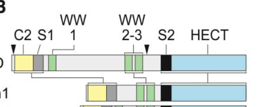

## Question

# Gene Research for Functional Annotation

## ⚠️ CRITICAL: Gene/Protein Identification Context

**BEFORE YOU BEGIN RESEARCH:** You MUST verify you are researching the CORRECT gene/protein. Gene symbols can be ambiguous, especially for less well-characterized genes from non-model organisms.

### Target Gene/Protein Identity (from UniProt):
- **UniProt Accession:** Q9V853
- **Protein Description:** RecName: Full=E3 ubiquitin-protein ligase Smurf1; EC=2.3.2.26 {ECO:0000269|PubMed:11703946, ECO:0000269|PubMed:24302888}; AltName: Full=HECT-type E3 ubiquitin transferase Smurf1; AltName: Full=Lethal with a checkpoint kinase protein; AltName: Full=SMAD ubiquitination regulatory factor 1 homolog; Short=DSmurf;
- **Gene Information:** Name=Smurf {ECO:0000303|PubMed:11703946}; Synonyms=lack, Smurf1; ORFNames=CG4943 {ECO:0000312|FlyBase:FBgn0029006};
- **Organism (full):** Drosophila melanogaster (Fruit fly).
- **Protein Family:** Not specified in UniProt
- **Key Domains:** C2_dom. (IPR000008); C2_domain_sf. (IPR035892); E3_ubiq-protein_ligase. (IPR050409); HECT_dom. (IPR000569); Hect_E3_ubiquitin_ligase. (IPR035983)

### MANDATORY VERIFICATION STEPS:

1. **Check if the gene symbol "Smurf" matches the protein description above**
2. **Verify the organism is correct:** Drosophila melanogaster (Fruit fly).
3. **Check if protein family/domains align with what you find in literature**
4. **If you find literature for a DIFFERENT gene with the same or similar symbol, STOP**

### If Gene Symbol is Ambiguous or You Cannot Find Relevant Literature:

**DO NOT PROCEED WITH RESEARCH ON A DIFFERENT GENE.** Instead:
- State clearly: "The gene symbol 'Smurf' is ambiguous or literature is limited for this specific protein"
- Explain what you found (e.g., "Found extensive literature on a different gene with the same symbol in a different organism")
- Describe the protein based ONLY on the UniProt information provided above
- Suggest that the protein function can be inferred from domain/family information

### Research Target:

Please provide a comprehensive research report on the gene **Smurf** (gene ID: Smurf, UniProt: Q9V853) in DROME.

The research report should be a detailed narrative explaining the function, biological processes, and localization of the gene product. Citations should be given for all claims.

You should prioritize authoritative reviews and primary scientific literature when conducting research. You can supplement
this with annotations you find in gene/protein databases, but these can be outdated or inaccurate.

We are specifically interested in the primary function of the gene - for enzymes, what reaction is catalyzed, and what is the substrate specificity? For transporters, what is the substrate? For structural proteins or adapters, what is the broader structural role? For signaling molecules, what is the role in the pathway.

We are interested in where in or outside the cell the gene product carries out its function.

We are also interested in the signaling or biochemical pathways in which the gene functions. We are less interested in broad pleiotropic effects, except where these elucidate the precise role.

Include evidence where possible. We are interested in both experimental evidence as well as inference from structure, evolution, or bioinformatic analysis. Precise studies should be prioritized over high-throughput, where available.

## Output

Question: You are an expert researcher providing comprehensive, well-cited information.

Provide detailed information focusing on:
1. Key concepts and definitions with current understanding
2. Recent developments and latest research (prioritize 2023-2024 sources)
3. Current applications and real-world implementations
4. Expert opinions and analysis from authoritative sources
5. Relevant statistics and data from recent studies

Format as a comprehensive research report with proper citations. Include URLs and publication dates where available.
Always prioritize recent, authoritative sources and provide specific citations for all major claims.

# Gene Research for Functional Annotation

## ⚠️ CRITICAL: Gene/Protein Identification Context

**BEFORE YOU BEGIN RESEARCH:** You MUST verify you are researching the CORRECT gene/protein. Gene symbols can be ambiguous, especially for less well-characterized genes from non-model organisms.

### Target Gene/Protein Identity (from UniProt):
- **UniProt Accession:** Q9V853
- **Protein Description:** RecName: Full=E3 ubiquitin-protein ligase Smurf1; EC=2.3.2.26 {ECO:0000269|PubMed:11703946, ECO:0000269|PubMed:24302888}; AltName: Full=HECT-type E3 ubiquitin transferase Smurf1; AltName: Full=Lethal with a checkpoint kinase protein; AltName: Full=SMAD ubiquitination regulatory factor 1 homolog; Short=DSmurf;
- **Gene Information:** Name=Smurf {ECO:0000303|PubMed:11703946}; Synonyms=lack, Smurf1; ORFNames=CG4943 {ECO:0000312|FlyBase:FBgn0029006};
- **Organism (full):** Drosophila melanogaster (Fruit fly).
- **Protein Family:** Not specified in UniProt
- **Key Domains:** C2_dom. (IPR000008); C2_domain_sf. (IPR035892); E3_ubiq-protein_ligase. (IPR050409); HECT_dom. (IPR000569); Hect_E3_ubiquitin_ligase. (IPR035983)

### MANDATORY VERIFICATION STEPS:

1. **Check if the gene symbol "Smurf" matches the protein description above**
2. **Verify the organism is correct:** Drosophila melanogaster (Fruit fly).
3. **Check if protein family/domains align with what you find in literature**
4. **If you find literature for a DIFFERENT gene with the same or similar symbol, STOP**

### If Gene Symbol is Ambiguous or You Cannot Find Relevant Literature:

**DO NOT PROCEED WITH RESEARCH ON A DIFFERENT GENE.** Instead:
- State clearly: "The gene symbol 'Smurf' is ambiguous or literature is limited for this specific protein"
- Explain what you found (e.g., "Found extensive literature on a different gene with the same symbol in a different organism")
- Describe the protein based ONLY on the UniProt information provided above
- Suggest that the protein function can be inferred from domain/family information

### Research Target:

Please provide a comprehensive research report on the gene **Smurf** (gene ID: Smurf, UniProt: Q9V853) in DROME.

The research report should be a detailed narrative explaining the function, biological processes, and localization of the gene product. Citations should be given for all claims.

You should prioritize authoritative reviews and primary scientific literature when conducting research. You can supplement
this with annotations you find in gene/protein databases, but these can be outdated or inaccurate.

We are specifically interested in the primary function of the gene - for enzymes, what reaction is catalyzed, and what is the substrate specificity? For transporters, what is the substrate? For structural proteins or adapters, what is the broader structural role? For signaling molecules, what is the role in the pathway.

We are interested in where in or outside the cell the gene product carries out its function.

We are also interested in the signaling or biochemical pathways in which the gene functions. We are less interested in broad pleiotropic effects, except where these elucidate the precise role.

Include evidence where possible. We are interested in both experimental evidence as well as inference from structure, evolution, or bioinformatic analysis. Precise studies should be prioritized over high-throughput, where available.

# Functional annotation report: *Drosophila melanogaster* Smurf (Q9V853)

## Identity and principal function

**The target is the fruit-fly gene *Smurf* (CG4943), also called DSmurf or *lack*, not human *SMURF1*.** The original fly study identified DSmurf as a Smurf-related protein with an N-terminal C2 domain, three WW domains and a C-terminal HECT ubiquitin-ligase domain; a subsequent fly study explicitly identified its locus as CG4943. Q9V853 is the UniProt accession supplied for this target; the cited experimental papers identify the fly protein by gene name and CG4943 rather than printing that accession. “Smurf” in an intestinal-barrier dye assay and SMURF1/2 findings from mammals are not, by themselves, evidence about this gene. [Podos *et al.*, October 2001](https://doi.org/10.1016/S1534-5807(01)00057-0); [Li *et al.*, February 2018](https://doi.org/10.1126/scisignal.aan8660). (podos2001thedsmurfubiquitinprotein pages 2-3, li2018hedgehogreciprocallycontrols pages 2-3, podos2001thedsmurfubiquitinprotein media 0d8ab93b)

**Primary molecular annotation:** Smurf is an intracellular, substrate-selective **HECT-type E3 ubiquitin-protein ligase**. It promotes transfer of ubiquitin supplied by an E2 enzyme onto target proteins; the HECT domain’s catalytic cysteine participates in transfer, while target recognition depends on the protein and signaling context. Mutation of fly Smurf’s catalytic cysteine to **C1029A** abolishes its activity in Patched ubiquitination assays. The C2 domain and WW domains distinguish its architecture from unrelated E3 classes: notably, Mad binding requires Mad’s PY motif, whereas Smoothened binds Smurf through its HECT region rather than its WW-domain region. These observations argue against assigning Smurf one universal substrate-recognition rule. [Podos *et al.*, 2001](https://doi.org/10.1016/S1534-5807(01)00057-0); [Huang *et al.*, November 2013](https://doi.org/10.1371/journal.pbio.1001721); [Li *et al.*, 2018](https://doi.org/10.1126/scisignal.aan8660). (podos2001thedsmurfubiquitinprotein pages 2-3, podos2001thedsmurfubiquitinprotein pages 3-5, huang2013activationofsmurf pages 4-5, li2018hedgehogreciprocallycontrols pages 10-11, podos2001thedsmurfubiquitinprotein media 0d8ab93b)

The experimentally supported role is to **set the duration, intensity and location of developmental signaling by ubiquitinating pathway components**, especially in Dpp/BMP and Hedgehog signaling. Ubiquitination can lead to proteasomal degradation or receptor internalization and turnover; the outcome depends on the substrate. A ubiquitin-chain linkage or a single common destination for every Smurf substrate should not be inferred from these experiments. (huang2013activationofsmurf pages 4-5, xia2010thefusedsmurfcomplex pages 10-11, li2018hedgehogreciprocallycontrols pages 1-2)

## Substrates and signaling mechanisms

The following evidence map separates biochemically characterized targets from less certain associations.

| Target / pathway | Direct result and experimental context | Evidential limitations | Key source(s) |
|---|---|---|---|
| **Mad — Dpp/BMP** | DSmurf bound Mad in yeast two-hybrid assays; deleting Mad’s **PY motif** abolished binding, and Medea did not bind. Loss of Smurf expanded embryonic P-Mad and Dpp-target domains, consistent with signal-activated Mad turnover. (podos2001thedsmurfubiquitinprotein pages 3-5, podos2001thedsmurfubiquitinprotein pages 5-6) | PY-dependent recognition and genetic regulation are strong; direct Mad ubiquitination was established in subsequent work, but ubiquitin-chain topology remains unresolved. | [Podos et al., 2001](https://doi.org/10.1016/S1534-5807(01)00057-0), Oct. 2001 (podos2001thedsmurfubiquitinprotein pages 2-3, huang2013activationofsmurf pages 17-18) |
| **Thickveins (Tkv) — Dpp/BMP, ovarian germline** | Fu, Smurf and Tkv formed a trimeric complex. Smurf/Fu promoted Tkv ubiquitination; kinase-dead Fu reduced it. **Tkv S238A** was more stable and ubiquitination-resistant, supporting Fu-dependent phosphorylation followed by Smurf-mediated receptor degradation in cystoblasts. (xia2010thefusedsmurfcomplex pages 7-8) | S238 was identified as a *putative* Fu phosphorylation site; direct site-specific phosphorylation by purified Fu was not conclusively demonstrated. | [Xia et al., 2010](https://doi.org/10.1016/j.cell.2010.11.022), Dec. 2010 (xia2010thefusedsmurfcomplex pages 6-7, xia2010thefusedsmurfcomplex pages 10-11) |
| **Patched (Ptc) — Hedgehog** | Smurf bound the Ptc C-tail and promoted Ptc ubiquitination and turnover. Wild-type Smurf, but not catalytic **C1029A**, supported activity; **Ptc K1261R** was ubiquitination-resistant. Both proteasomal and lysosomal routes were implicated. (huang2013activationofsmurf pages 4-5) | The 2013 model required activated Smo to stimulate Smurf, whereas later work found Hh-enhanced Ptc–Smurf binding and ubiquitination can occur without Smo; substrate switching/competition is therefore the better-supported current model. (li2018hedgehogreciprocallycontrols pages 11-12) | [Huang et al., 2013](https://doi.org/10.1371/journal.pbio.1001721), Nov. 2013; [Li et al., 2018](https://doi.org/10.1126/scisignal.aan8660), Feb. 2018 |
| **Smoothened (Smo) — Hedgehog** | Smurf depletion reduced Smo ubiquitylation and increased surface Smo; catalytic **C1029** was required. **Gprk2 phosphorylation of Smurf** relieved autoinhibition and promoted HECT-domain binding to Smo, whereas Hh-induced **PKA/CK1 phosphorylation of Smo** released Smurf, reducing Smo ubiquitination and permitting surface accumulation. (li2018hedgehogreciprocallycontrols pages 3-4, li2018hedgehogreciprocallycontrols pages 10-11, li2018hedgehogreciprocallycontrols pages 11-12) | Smurf, Nedd4 and Su(dx) are partly redundant, and Cul4 may act in parallel; Smurf loss therefore gives comparatively weak Smo phenotypes. An earlier study did not detect Smo regulation by Smurf. | [Li et al., 2018](https://doi.org/10.1126/scisignal.aan8660), Feb. 2018 (li2018hedgehogreciprocallycontrols pages 3-4, li2018hedgehogreciprocallycontrols pages 2-3) |
| **Warts (Wts) — Hippo** | DSmurf was reported to associate with Wts and alter Wts turnover and Yorkie activity. (kim2018regulationofthe pages 3-4) | **Direct DSmurf-mediated Wts ubiquitination is not established**; an authoritative review explicitly identified this as unresolved. The 2024 Wts-SUMO study did not test Smurf. (gao2024sumoylationofwarts pages 13-14, gao2024sumoylationofwarts pages 6-7) | [Cao et al., 2014](https://doi.org/10.1016/j.bbrc.2014.10.058), Nov. 2014; [Kim & Jho, 2018](https://doi.org/10.5483/BMBRep.2018.51.3.017), Mar. 2018; [Gao et al., 2024](https://doi.org/10.1038/s41467-024-52569-y), Oct. 2024 |
| **α-arrestins — candidate trafficking adaptors/interactors** | A 2024 Drosophila α-arrestin AP–MS interactome recovered Smurf among ubiquitin-ligase-associated prey; PPxY-bearing arrestins were enriched for WW-domain partners. (lee2024comparativeinteractomeanalysis pages 5-6, lee2024comparativeinteractomeanalysis pages 4-5) | High-throughput association only: the relevant pairwise interactions were not all independently validated, **α-arrestin ubiquitination by Smurf was not shown**, and no specific α-arrestin is established as a Q9V853 substrate. | [Lee et al., 2024](https://doi.org/10.7554/eLife.88328), Jan. 2024 (lee2024comparativeinteractomeanalysis pages 17-18) |

*Table: Evidence-ranked substrate and interaction map for Drosophila melanogaster Smurf/CG4943 (Q9V853), separating direct biochemical findings from candidate or unresolved relationships.*

**Dpp/BMP—Mad and signal restriction.** Dpp-activated type I BMP receptors phosphorylate the receptor-regulated Smad **Mad**; activated Mad works with Medea to regulate transcription. Smurf binds Mad in a yeast two-hybrid assay, but not Medea or Mad with its PY motif deleted. Fly loss-of-function genetics establish Smurf as a negative regulator of this pathway. In embryos lacking maternal and zygotic Smurf, the phosphorylated-Mad staining domain broadened by **28%**; amnioserosa-cell counts were **336 ± 47** in mutants versus **176 ± 54** in controls, in the reported small samples (**n = 5** and **n = 3**, respectively). Removing one copy of *dpp* substantially rescued embryonic viability, supporting excessive Dpp activity as the cause of the major developmental defect. The 2001 binding and genetic experiments alone did not directly measure Mad ubiquitin-chain chemistry, so the strength of evidence differs between **Mad recognition**, **pathway repression** and a fully resolved catalytic mechanism. [Podos *et al.*, 2001](https://doi.org/10.1016/S1534-5807(01)00057-0); for contemporary pathway context, [Akiyama, Raftery and Wharton, *Genetics*, 2024](https://doi.org/10.1093/genetics/iyad200). (podos2001thedsmurfubiquitinprotein pages 3-5, podos2001thedsmurfubiquitinprotein pages 5-6, akiyama2024bonemorphogeneticprotein pages 6-6, podos2001thedsmurfubiquitinprotein media 0d8ab93b)

**Dpp/BMP—Thickveins receptor and germline differentiation.** In the ovary, Smurf associates with the BMP type I receptor **Thickveins (Tkv)** and the kinase **Fused (Fu)**. Fu–Smurf–Tkv complexes were recovered biochemically; reducing Fu or Smurf impaired Tkv ubiquitination. Substitution **Tkv S238A** increased receptor stability and resistance to ubiquitination, supporting a model in which Fu-dependent regulation of Tkv enables Smurf-mediated receptor disposal in differentiating cystoblasts, limiting BMP signaling outside the germline stem-cell niche. S238 was identified as a functionally important *putative* phosphorylation site; site mutation and kinase-dead-Fu results do not, on their own, prove direct phosphorylation of S238 by purified Fu. [Xia *et al.*, *Cell*, December 2010](https://doi.org/10.1016/j.cell.2010.11.022). (xia2010thefusedsmurfcomplex pages 7-8, xia2010thefusedsmurfcomplex pages 6-7, xia2010thefusedsmurfcomplex pages 10-11)

**Hedgehog—Patched and Smoothened.** Smurf binds the Hedgehog receptor **Patched (Ptc)** and promotes ubiquitination of its cytoplasmic C-terminal region. **Ptc K1261R** resists Smurf-dependent ubiquitination; wild-type Smurf, but not **Smurf C1029A**, supports Ptc ubiquitination. Both proteasomal and lysosomal interventions affected Ptc downregulation. In developing wings, Ptc turnover reduces repression of Hedgehog signaling. [Huang *et al.*, *PLOS Biology*, November 2013](https://doi.org/10.1371/journal.pbio.1001721). (huang2013activationofsmurf pages 4-5, huang2013activationofsmurf pages 5-7)

A later fly study additionally identified **Smoothened (Smo)** as a Smurf substrate: Smurf depletion decreased Smo ubiquitination and increased Smo at the cell surface, while Smurf overexpression increased ubiquitination. Its proposed switch is signal-dependent. Without Hedgehog, **Gprk2 phosphorylation of Smurf** promotes binding to the Smo C-terminal autoinhibitory region and Smo removal from the surface. With Hedgehog, **PKA/CK1-dependent Smo phosphorylation** weakens that binding, leaving Smurf more available to bind and ubiquitinate Ptc. Other fly HECT ligases, **Nedd4 and Su(dx)**, partially overlap with Smurf in these assays; thus, a modest single-gene phenotype does not demonstrate lack of activity. [Li *et al.*, *Science Signaling*, February 2018](https://doi.org/10.1126/scisignal.aan8660). (li2018hedgehogreciprocallycontrols pages 2-3, li2018hedgehogreciprocallycontrols pages 1-2, li2018hedgehogreciprocallycontrols pages 10-11, li2018hedgehogreciprocallycontrols pages 11-12)

**Important mechanistic disagreement:** The 2013 study interpreted activated Smo as stimulating Smurf to drive Ptc turnover and did not detect a major Smurf-dependent change in Smo abundance or ubiquitination under its conditions. The 2018 study detected Smo as a Smurf substrate and found that Hedgehog could increase Smurf–Ptc association and Ptc ubiquitination **even after Smo depletion**. It therefore favored competition and ligand-dependent substrate redistribution over an absolute requirement for Smo to activate Smurf. Both studies support Ptc regulation, but their explanation of Smo’s mechanistic role is not settled by treating either model as universally applicable. [Huang *et al.*, 2013](https://doi.org/10.1371/journal.pbio.1001721); [Li *et al.*, 2018](https://doi.org/10.1126/scisignal.aan8660). (huang2013activationofsmurf pages 5-7, li2018hedgehogreciprocallycontrols pages 11-12)

## Where Smurf functions

Smurf acts **inside cells**, not as a secreted BMP or Hedgehog ligand. Its experimentally relevant compartments vary with its targets. Antibody staining in developing testes detected Smurf-specific signal predominantly in the **cytoplasm of differentiating germ cells**, with weaker cytoplasmic signal in earlier germ cells; the investigators cautioned that their apparent **nuclear** staining was nonspecific because it persisted in Smurf-deficient tissue. During receptor regulation, its functional context includes the **cytoplasmic face of membrane-associated Tkv, Ptc and Smo**, and Smurf-dependent changes in Smo/Ptc **cell-surface abundance and internalization**. These results do not establish that Smurf is permanently confined to a single organelle or constitutively resident at the plasma membrane. [Chang *et al.*, *Developmental Biology*, November 2013](https://doi.org/10.1016/j.ydbio.2013.08.014); [Xia *et al.*, 2010](https://doi.org/10.1016/j.cell.2010.11.022); [Li *et al.*, 2018](https://doi.org/10.1126/scisignal.aan8660). (chang2013smurfmediateddifferentialproteolysis pages 10-11, chang2013smurfmediateddifferentialproteolysis pages 11-13, xia2010thefusedsmurfcomplex pages 6-7, li2018hedgehogreciprocallycontrols pages 10-11)

Relevant tissues are **embryonic Dpp-responsive ectoderm and hindgut**, **female germline stem-cell progeny**, **developing male germ cells**, and **wing imaginal discs**. In male testes, Smurf-dependent BMP attenuation changes during development despite low early-germ-cell Smurf expression: loss of function elevated pMad in early germ cells and permitted extra transit-amplifying divisions. One analysis measured mutant-testis relative surface area at **1.55**, versus **0.90** for its stated control, with reducing *mad* activity partially suppressing enlargement. These are **fly developmental readouts**, not estimates of a human clinical effect. [Podos *et al.*, 2001](https://doi.org/10.1016/S1534-5807(01)00057-0); [Chang *et al.*, 2013](https://doi.org/10.1016/j.ydbio.2013.08.014). (podos2001thedsmurfubiquitinprotein pages 1-2, chang2013smurfmediateddifferentialproteolysis pages 13-14, chang2013smurfmediateddifferentialproteolysis pages 10-11, chang2013smurfmediateddifferentialproteolysis pages 1-2)

## Current understanding, recent work and use

The authoritative [2024 *Genetics* review of BMP signaling](https://doi.org/10.1093/genetics/iyad200) places receptor activation, Mad phosphorylation and multiple layers of signal attenuation in a tissue-specific regulatory framework; it discusses Smurf-linked Mad regulation and Fu/Smurf-associated Tkv turnover. It is useful **current synthesis**, but the receptor and ubiquitination experiments above remain the more direct evidence for assigning this fly gene’s molecular function. (akiyama2024bonemorphogeneticprotein pages 1-2, akiyama2024bonemorphogeneticprotein pages 6-6, akiyama2024bonemorphogeneticprotein pages 20-21, akiyama2024bonemorphogeneticprotein pages 17-17)

A [2024 comparative α-arrestin interactome study](https://doi.org/10.7554/elife.88328) recovered fly Smurf among ubiquitin-ligase-associated interaction partners and reported enrichment of WW-domain partners among PPxY-containing α-arrestins. This offers **candidate adaptor interactions**, not proof that a particular α-arrestin is ubiquitinated by Q9V853. Likewise, a reported association with Hippo-pathway **Warts** and effects on its turnover remain weaker substrate evidence: a review explicitly noted that direct Smurf-dependent Warts ubiquitination had not been established. The [2024 Warts-SUMOylation study](https://doi.org/10.1038/s41467-024-52569-y) addresses a different modification and should not be presented as a new experimental demonstration of Smurf activity. (lee2024comparativeinteractomeanalysis pages 5-6, kim2018regulationofthe pages 3-4, gao2024sumoylationofwarts pages 13-14, lee2024comparativeinteractomeanalysis pages 4-5)

**Real-world research application:** Fly *Smurf* loss-of-function alleles, tissue-directed expression or RNAi, catalytic **C1029A** constructs, and substrate-site mutants such as **Ptc K1261R** and **Tkv S238A** provide experimental tools to dissect BMP-gradient termination, stem-cell differentiation and Hedgehog receptor trafficking *in vivo*. They do not establish a clinical use of the fly protein. The best-supported functional annotation remains **a cytoplasmic HECT E3 ligase that restricts Dpp/BMP signaling through Mad- and Tkv-associated mechanisms and regulates Hedgehog signaling through context-dependent ubiquitination of Ptc and Smo**. (podos2001thedsmurfubiquitinprotein pages 3-5, xia2010thefusedsmurfcomplex pages 7-8, huang2013activationofsmurf pages 4-5, li2018hedgehogreciprocallycontrols pages 1-2, li2018hedgehogreciprocallycontrols pages 11-12)

References

1. (podos2001thedsmurfubiquitinprotein pages 2-3): Steven D. Podos, Kirsten K. Hanson, Yu-Chiun Wang, and Edwin L. Ferguson. The dsmurf ubiquitin-protein ligase restricts bmp signaling spatially and temporally during drosophila embryogenesis. Developmental cell, 1 4:567-78, Oct 2001. URL: https://doi.org/10.1016/s1534-5807(01)00057-0, doi:10.1016/s1534-5807(01)00057-0. This article has 158 citations and is from a highest quality peer-reviewed journal.

2. (li2018hedgehogreciprocallycontrols pages 2-3): Shuang Li, Shuangxi Li, Bing Wang, and Jin Jiang. Hedgehog reciprocally controls trafficking of smo and ptc through the smurf family of e3 ubiquitin ligases. Science Signaling, Feb 2018. URL: https://doi.org/10.1126/scisignal.aan8660, doi:10.1126/scisignal.aan8660. This article has 44 citations and is from a domain leading peer-reviewed journal.

3. (podos2001thedsmurfubiquitinprotein media 0d8ab93b): Steven D. Podos, Kirsten K. Hanson, Yu-Chiun Wang, and Edwin L. Ferguson. The dsmurf ubiquitin-protein ligase restricts bmp signaling spatially and temporally during drosophila embryogenesis. Developmental cell, 1 4:567-78, Oct 2001. URL: https://doi.org/10.1016/s1534-5807(01)00057-0, doi:10.1016/s1534-5807(01)00057-0. This article has 158 citations and is from a highest quality peer-reviewed journal.

4. (podos2001thedsmurfubiquitinprotein pages 3-5): Steven D. Podos, Kirsten K. Hanson, Yu-Chiun Wang, and Edwin L. Ferguson. The dsmurf ubiquitin-protein ligase restricts bmp signaling spatially and temporally during drosophila embryogenesis. Developmental cell, 1 4:567-78, Oct 2001. URL: https://doi.org/10.1016/s1534-5807(01)00057-0, doi:10.1016/s1534-5807(01)00057-0. This article has 158 citations and is from a highest quality peer-reviewed journal.

5. (huang2013activationofsmurf pages 4-5): Shoujun Huang, Zhao Zhang, Chunxia Zhang, Xiangdong Lv, Xiudeng Zheng, Zhenping Chen, Liwei Sun, Hailong Wang, Yuanxiang Zhu, Jing Zhang, Shuyan Yang, Yi Lu, Qinmiao Sun, Yi Tao, Feng Liu, Yun Zhao, and Dahua Chen. Activation of smurf e3 ligase promoted by smoothened regulates hedgehog signaling through targeting patched turnover. PLoS Biology, 11:e1001721, Nov 2013. URL: https://doi.org/10.1371/journal.pbio.1001721, doi:10.1371/journal.pbio.1001721. This article has 56 citations and is from a highest quality peer-reviewed journal.

6. (li2018hedgehogreciprocallycontrols pages 10-11): Shuang Li, Shuangxi Li, Bing Wang, and Jin Jiang. Hedgehog reciprocally controls trafficking of smo and ptc through the smurf family of e3 ubiquitin ligases. Science Signaling, Feb 2018. URL: https://doi.org/10.1126/scisignal.aan8660, doi:10.1126/scisignal.aan8660. This article has 44 citations and is from a domain leading peer-reviewed journal.

7. (xia2010thefusedsmurfcomplex pages 10-11): Laixin Xia, Shunji Jia, Shoujun Huang, Hailong Wang, Yuanxiang Zhu, Yanjun Mu, Lijuan Kan, Wenjing Zheng, Di Wu, Xiaoming Li, Qinmiao Sun, Anming Meng, and Dahua Chen. The fused/smurf complex controls the fate of drosophila germline stem cells by generating a gradient bmp response. Cell, 143:978-990, Dec 2010. URL: https://doi.org/10.1016/j.cell.2010.11.022, doi:10.1016/j.cell.2010.11.022. This article has 171 citations and is from a highest quality peer-reviewed journal.

8. (li2018hedgehogreciprocallycontrols pages 1-2): Shuang Li, Shuangxi Li, Bing Wang, and Jin Jiang. Hedgehog reciprocally controls trafficking of smo and ptc through the smurf family of e3 ubiquitin ligases. Science Signaling, Feb 2018. URL: https://doi.org/10.1126/scisignal.aan8660, doi:10.1126/scisignal.aan8660. This article has 44 citations and is from a domain leading peer-reviewed journal.

9. (podos2001thedsmurfubiquitinprotein pages 5-6): Steven D. Podos, Kirsten K. Hanson, Yu-Chiun Wang, and Edwin L. Ferguson. The dsmurf ubiquitin-protein ligase restricts bmp signaling spatially and temporally during drosophila embryogenesis. Developmental cell, 1 4:567-78, Oct 2001. URL: https://doi.org/10.1016/s1534-5807(01)00057-0, doi:10.1016/s1534-5807(01)00057-0. This article has 158 citations and is from a highest quality peer-reviewed journal.

10. (huang2013activationofsmurf pages 17-18): Shoujun Huang, Zhao Zhang, Chunxia Zhang, Xiangdong Lv, Xiudeng Zheng, Zhenping Chen, Liwei Sun, Hailong Wang, Yuanxiang Zhu, Jing Zhang, Shuyan Yang, Yi Lu, Qinmiao Sun, Yi Tao, Feng Liu, Yun Zhao, and Dahua Chen. Activation of smurf e3 ligase promoted by smoothened regulates hedgehog signaling through targeting patched turnover. PLoS Biology, 11:e1001721, Nov 2013. URL: https://doi.org/10.1371/journal.pbio.1001721, doi:10.1371/journal.pbio.1001721. This article has 56 citations and is from a highest quality peer-reviewed journal.

11. (xia2010thefusedsmurfcomplex pages 7-8): Laixin Xia, Shunji Jia, Shoujun Huang, Hailong Wang, Yuanxiang Zhu, Yanjun Mu, Lijuan Kan, Wenjing Zheng, Di Wu, Xiaoming Li, Qinmiao Sun, Anming Meng, and Dahua Chen. The fused/smurf complex controls the fate of drosophila germline stem cells by generating a gradient bmp response. Cell, 143:978-990, Dec 2010. URL: https://doi.org/10.1016/j.cell.2010.11.022, doi:10.1016/j.cell.2010.11.022. This article has 171 citations and is from a highest quality peer-reviewed journal.

12. (xia2010thefusedsmurfcomplex pages 6-7): Laixin Xia, Shunji Jia, Shoujun Huang, Hailong Wang, Yuanxiang Zhu, Yanjun Mu, Lijuan Kan, Wenjing Zheng, Di Wu, Xiaoming Li, Qinmiao Sun, Anming Meng, and Dahua Chen. The fused/smurf complex controls the fate of drosophila germline stem cells by generating a gradient bmp response. Cell, 143:978-990, Dec 2010. URL: https://doi.org/10.1016/j.cell.2010.11.022, doi:10.1016/j.cell.2010.11.022. This article has 171 citations and is from a highest quality peer-reviewed journal.

13. (li2018hedgehogreciprocallycontrols pages 11-12): Shuang Li, Shuangxi Li, Bing Wang, and Jin Jiang. Hedgehog reciprocally controls trafficking of smo and ptc through the smurf family of e3 ubiquitin ligases. Science Signaling, Feb 2018. URL: https://doi.org/10.1126/scisignal.aan8660, doi:10.1126/scisignal.aan8660. This article has 44 citations and is from a domain leading peer-reviewed journal.

14. (li2018hedgehogreciprocallycontrols pages 3-4): Shuang Li, Shuangxi Li, Bing Wang, and Jin Jiang. Hedgehog reciprocally controls trafficking of smo and ptc through the smurf family of e3 ubiquitin ligases. Science Signaling, Feb 2018. URL: https://doi.org/10.1126/scisignal.aan8660, doi:10.1126/scisignal.aan8660. This article has 44 citations and is from a domain leading peer-reviewed journal.

15. (kim2018regulationofthe pages 3-4): Youngeun Kim and Eek-hoon Jho. Regulation of the hippo signaling pathway by ubiquitin modification. BMB Reports, 51:143-150, Mar 2018. URL: https://doi.org/10.5483/bmbrep.2018.51.3.017, doi:10.5483/bmbrep.2018.51.3.017. This article has 69 citations and is from a peer-reviewed journal.

16. (gao2024sumoylationofwarts pages 13-14): Yang Gao, Ye Sing Tan, Jiaen Lin, Liang Yuh Chew, Htet Yamin Aung, Brinda Palliyana, Mahekta R. Gujar, Kun-Yang Lin, Shu Kondo, and Hongyan Wang. Sumoylation of warts kinase promotes neural stem cell reactivation. Nature Communications, Oct 2024. URL: https://doi.org/10.1038/s41467-024-52569-y, doi:10.1038/s41467-024-52569-y. This article has 12 citations and is from a highest quality peer-reviewed journal.

17. (gao2024sumoylationofwarts pages 6-7): Yang Gao, Ye Sing Tan, Jiaen Lin, Liang Yuh Chew, Htet Yamin Aung, Brinda Palliyana, Mahekta R. Gujar, Kun-Yang Lin, Shu Kondo, and Hongyan Wang. Sumoylation of warts kinase promotes neural stem cell reactivation. Nature Communications, Oct 2024. URL: https://doi.org/10.1038/s41467-024-52569-y, doi:10.1038/s41467-024-52569-y. This article has 12 citations and is from a highest quality peer-reviewed journal.

18. (lee2024comparativeinteractomeanalysis pages 5-6): Kyung-Tae Lee, Inez KA Pranoto, Soon-Young Kim, Hee-Joo Choi, Ngoc Bao To, Hansong Chae, Jeong-Yeon Lee, Jung-Eun Kim, Young V Kwon, and Jin-Wu Nam. Comparative interactome analysis of α-arrestin families in human and drosophila. eLife, Jan 2024. URL: https://doi.org/10.7554/elife.88328, doi:10.7554/elife.88328. This article has 6 citations and is from a domain leading peer-reviewed journal.

19. (lee2024comparativeinteractomeanalysis pages 4-5): Kyung-Tae Lee, Inez KA Pranoto, Soon-Young Kim, Hee-Joo Choi, Ngoc Bao To, Hansong Chae, Jeong-Yeon Lee, Jung-Eun Kim, Young V Kwon, and Jin-Wu Nam. Comparative interactome analysis of α-arrestin families in human and drosophila. eLife, Jan 2024. URL: https://doi.org/10.7554/elife.88328, doi:10.7554/elife.88328. This article has 6 citations and is from a domain leading peer-reviewed journal.

20. (lee2024comparativeinteractomeanalysis pages 17-18): Kyung-Tae Lee, Inez KA Pranoto, Soon-Young Kim, Hee-Joo Choi, Ngoc Bao To, Hansong Chae, Jeong-Yeon Lee, Jung-Eun Kim, Young V Kwon, and Jin-Wu Nam. Comparative interactome analysis of α-arrestin families in human and drosophila. eLife, Jan 2024. URL: https://doi.org/10.7554/elife.88328, doi:10.7554/elife.88328. This article has 6 citations and is from a domain leading peer-reviewed journal.

21. (akiyama2024bonemorphogeneticprotein pages 6-6): Takuya Akiyama, Laurel A Raftery, and K. A. Wharton. Bone morphogenetic protein signaling: the pathway and its regulation. Genetics, Dec 2024. URL: https://doi.org/10.1093/genetics/iyad200, doi:10.1093/genetics/iyad200. This article has 79 citations and is from a domain leading peer-reviewed journal.

22. (huang2013activationofsmurf pages 5-7): Shoujun Huang, Zhao Zhang, Chunxia Zhang, Xiangdong Lv, Xiudeng Zheng, Zhenping Chen, Liwei Sun, Hailong Wang, Yuanxiang Zhu, Jing Zhang, Shuyan Yang, Yi Lu, Qinmiao Sun, Yi Tao, Feng Liu, Yun Zhao, and Dahua Chen. Activation of smurf e3 ligase promoted by smoothened regulates hedgehog signaling through targeting patched turnover. PLoS Biology, 11:e1001721, Nov 2013. URL: https://doi.org/10.1371/journal.pbio.1001721, doi:10.1371/journal.pbio.1001721. This article has 56 citations and is from a highest quality peer-reviewed journal.

23. (chang2013smurfmediateddifferentialproteolysis pages 10-11): Yi-Jie Chang, Haiwei Pi, Chang-Che Hsieh, and Margaret T. Fuller. Smurf-mediated differential proteolysis generates dynamic bmp signaling in germline stem cells during drosophila testis development. Developmental biology, 383 1:106-20, Nov 2013. URL: https://doi.org/10.1016/j.ydbio.2013.08.014, doi:10.1016/j.ydbio.2013.08.014. This article has 35 citations and is from a peer-reviewed journal.

24. (chang2013smurfmediateddifferentialproteolysis pages 11-13): Yi-Jie Chang, Haiwei Pi, Chang-Che Hsieh, and Margaret T. Fuller. Smurf-mediated differential proteolysis generates dynamic bmp signaling in germline stem cells during drosophila testis development. Developmental biology, 383 1:106-20, Nov 2013. URL: https://doi.org/10.1016/j.ydbio.2013.08.014, doi:10.1016/j.ydbio.2013.08.014. This article has 35 citations and is from a peer-reviewed journal.

25. (podos2001thedsmurfubiquitinprotein pages 1-2): Steven D. Podos, Kirsten K. Hanson, Yu-Chiun Wang, and Edwin L. Ferguson. The dsmurf ubiquitin-protein ligase restricts bmp signaling spatially and temporally during drosophila embryogenesis. Developmental cell, 1 4:567-78, Oct 2001. URL: https://doi.org/10.1016/s1534-5807(01)00057-0, doi:10.1016/s1534-5807(01)00057-0. This article has 158 citations and is from a highest quality peer-reviewed journal.

26. (chang2013smurfmediateddifferentialproteolysis pages 13-14): Yi-Jie Chang, Haiwei Pi, Chang-Che Hsieh, and Margaret T. Fuller. Smurf-mediated differential proteolysis generates dynamic bmp signaling in germline stem cells during drosophila testis development. Developmental biology, 383 1:106-20, Nov 2013. URL: https://doi.org/10.1016/j.ydbio.2013.08.014, doi:10.1016/j.ydbio.2013.08.014. This article has 35 citations and is from a peer-reviewed journal.

27. (chang2013smurfmediateddifferentialproteolysis pages 1-2): Yi-Jie Chang, Haiwei Pi, Chang-Che Hsieh, and Margaret T. Fuller. Smurf-mediated differential proteolysis generates dynamic bmp signaling in germline stem cells during drosophila testis development. Developmental biology, 383 1:106-20, Nov 2013. URL: https://doi.org/10.1016/j.ydbio.2013.08.014, doi:10.1016/j.ydbio.2013.08.014. This article has 35 citations and is from a peer-reviewed journal.

28. (akiyama2024bonemorphogeneticprotein pages 1-2): Takuya Akiyama, Laurel A Raftery, and K. A. Wharton. Bone morphogenetic protein signaling: the pathway and its regulation. Genetics, Dec 2024. URL: https://doi.org/10.1093/genetics/iyad200, doi:10.1093/genetics/iyad200. This article has 79 citations and is from a domain leading peer-reviewed journal.

29. (akiyama2024bonemorphogeneticprotein pages 20-21): Takuya Akiyama, Laurel A Raftery, and K. A. Wharton. Bone morphogenetic protein signaling: the pathway and its regulation. Genetics, Dec 2024. URL: https://doi.org/10.1093/genetics/iyad200, doi:10.1093/genetics/iyad200. This article has 79 citations and is from a domain leading peer-reviewed journal.

30. (akiyama2024bonemorphogeneticprotein pages 17-17): Takuya Akiyama, Laurel A Raftery, and K. A. Wharton. Bone morphogenetic protein signaling: the pathway and its regulation. Genetics, Dec 2024. URL: https://doi.org/10.1093/genetics/iyad200, doi:10.1093/genetics/iyad200. This article has 79 citations and is from a domain leading peer-reviewed journal.

## Artifacts

- [Edison artifact artifact-00](Smurf-deep-research-falcon_artifacts/artifact-00.md)

## Citations

1. xia2010thefusedsmurfcomplex pages 7-8
2. huang2013activationofsmurf pages 4-5
3. li2018hedgehogreciprocallycontrols pages 11-12
4. kim2018regulationofthe pages 3-4
5. lee2024comparativeinteractomeanalysis pages 17-18
6. podos2001thedsmurfubiquitinprotein pages 2-3
7. li2018hedgehogreciprocallycontrols pages 2-3
8. podos2001thedsmurfubiquitinprotein pages 3-5
9. li2018hedgehogreciprocallycontrols pages 10-11
10. xia2010thefusedsmurfcomplex pages 10-11
11. li2018hedgehogreciprocallycontrols pages 1-2
12. podos2001thedsmurfubiquitinprotein pages 5-6
13. huang2013activationofsmurf pages 17-18
14. xia2010thefusedsmurfcomplex pages 6-7
15. li2018hedgehogreciprocallycontrols pages 3-4
16. gao2024sumoylationofwarts pages 13-14
17. gao2024sumoylationofwarts pages 6-7
18. lee2024comparativeinteractomeanalysis pages 5-6
19. lee2024comparativeinteractomeanalysis pages 4-5
20. akiyama2024bonemorphogeneticprotein pages 6-6
21. huang2013activationofsmurf pages 5-7
22. chang2013smurfmediateddifferentialproteolysis pages 10-11
23. chang2013smurfmediateddifferentialproteolysis pages 11-13
24. podos2001thedsmurfubiquitinprotein pages 1-2
25. chang2013smurfmediateddifferentialproteolysis pages 13-14
26. chang2013smurfmediateddifferentialproteolysis pages 1-2
27. akiyama2024bonemorphogeneticprotein pages 1-2
28. akiyama2024bonemorphogeneticprotein pages 20-21
29. akiyama2024bonemorphogeneticprotein pages 17-17
30. Podos *et al.*, October 2001
31. Li *et al.*, February 2018
32. Podos *et al.*, 2001
33. Huang *et al.*, November 2013
34. Li *et al.*, 2018
35. Podos et al., 2001
36. Xia et al., 2010
37. Huang et al., 2013
38. Li et al., 2018
39. Cao et al., 2014
40. Kim & Jho, 2018
41. Gao et al., 2024
42. Lee et al., 2024
43. Akiyama, Raftery and Wharton, *Genetics*, 2024
44. Xia *et al.*, *Cell*, December 2010
45. Huang *et al.*, *PLOS Biology*, November 2013
46. Li *et al.*, *Science Signaling*, February 2018
47. Huang *et al.*, 2013
48. Chang *et al.*, *Developmental Biology*, November 2013
49. Xia *et al.*, 2010
50. Chang *et al.*, 2013
51. 2024 *Genetics* review of BMP signaling
52. 2024 comparative α-arrestin interactome study
53. 2024 Warts-SUMOylation study
54. https://doi.org/10.1016/S1534-5807(01
55. https://doi.org/10.1126/scisignal.aan8660
56. https://doi.org/10.1371/journal.pbio.1001721
57. https://doi.org/10.1016/j.cell.2010.11.022
58. https://doi.org/10.1016/j.bbrc.2014.10.058
59. https://doi.org/10.5483/BMBRep.2018.51.3.017
60. https://doi.org/10.1038/s41467-024-52569-y
61. https://doi.org/10.7554/eLife.88328
62. https://doi.org/10.1093/genetics/iyad200
63. https://doi.org/10.1016/j.ydbio.2013.08.014
64. https://doi.org/10.7554/elife.88328
65. https://doi.org/10.1016/s1534-5807(01
66. https://doi.org/10.1126/scisignal.aan8660,
67. https://doi.org/10.1371/journal.pbio.1001721,
68. https://doi.org/10.1016/j.cell.2010.11.022,
69. https://doi.org/10.5483/bmbrep.2018.51.3.017,
70. https://doi.org/10.1038/s41467-024-52569-y,
71. https://doi.org/10.7554/elife.88328,
72. https://doi.org/10.1093/genetics/iyad200,
73. https://doi.org/10.1016/j.ydbio.2013.08.014,