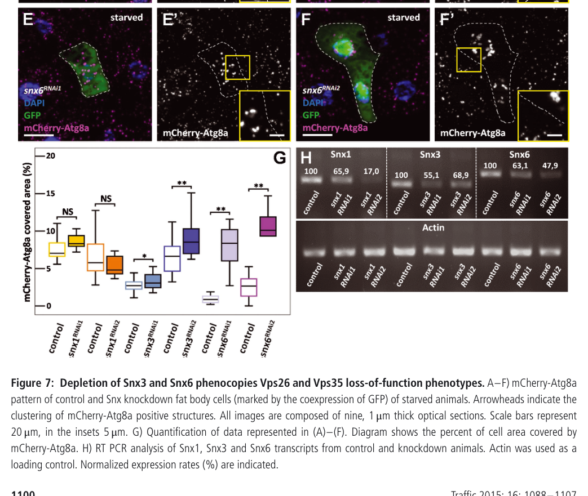

## Question

# Gene Research for Functional Annotation

## ⚠️ CRITICAL: Gene/Protein Identification Context

**BEFORE YOU BEGIN RESEARCH:** You MUST verify you are researching the CORRECT gene/protein. Gene symbols can be ambiguous, especially for less well-characterized genes from non-model organisms.

### Target Gene/Protein Identity (from UniProt):
- **UniProt Accession:** M9NDI3
- **Protein Description:** SubName: Full=Sorting nexin 6, isoform B {ECO:0000313|EMBL:AFH03613.1};
- **Gene Information:** Name=Snx6 {ECO:0000313|EMBL:AFH03613.1, ECO:0000313|FlyBase:FBgn0032005}; Synonyms=Dmel\CG8282 {ECO:0000313|EMBL:AFH03613.1}, DmSNX6 {ECO:0000313|EMBL:AFH03613.1}, Dsnx6 {ECO:0000313|EMBL:AFH03613.1}, SNX6 {ECO:0000313|EMBL:AFH03613.1}, snx6 {ECO:0000313|EMBL:AFH03613.1}; ORFNames=CG8282 {ECO:0000313|EMBL:AFH03613.1, ECO:0000313|FlyBase:FBgn0032005}, Dmel_CG8282 {ECO:0000313|EMBL:AFH03613.1};
- **Organism (full):** Drosophila melanogaster (Fruit fly).
- **Protein Family:** Belongs to the sorting nexin family.
- **Key Domains:** AH/BAR_dom_sf. (IPR027267); PX_dom. (IPR001683); PX_dom_sf. (IPR036871); SNX5/SNX6/SNX32. (IPR014637); Vps5_C. (IPR015404)

### MANDATORY VERIFICATION STEPS:

1. **Check if the gene symbol "Snx6" matches the protein description above**
2. **Verify the organism is correct:** Drosophila melanogaster (Fruit fly).
3. **Check if protein family/domains align with what you find in literature**
4. **If you find literature for a DIFFERENT gene with the same or similar symbol, STOP**

### If Gene Symbol is Ambiguous or You Cannot Find Relevant Literature:

**DO NOT PROCEED WITH RESEARCH ON A DIFFERENT GENE.** Instead:
- State clearly: "The gene symbol 'Snx6' is ambiguous or literature is limited for this specific protein"
- Explain what you found (e.g., "Found extensive literature on a different gene with the same symbol in a different organism")
- Describe the protein based ONLY on the UniProt information provided above
- Suggest that the protein function can be inferred from domain/family information

### Research Target:

Please provide a comprehensive research report on the gene **Snx6** (gene ID: Snx6, UniProt: M9NDI3) in DROME.

The research report should be a detailed narrative explaining the function, biological processes, and localization of the gene product. Citations should be given for all claims.

You should prioritize authoritative reviews and primary scientific literature when conducting research. You can supplement
this with annotations you find in gene/protein databases, but these can be outdated or inaccurate.

We are specifically interested in the primary function of the gene - for enzymes, what reaction is catalyzed, and what is the substrate specificity? For transporters, what is the substrate? For structural proteins or adapters, what is the broader structural role? For signaling molecules, what is the role in the pathway.

We are interested in where in or outside the cell the gene product carries out its function.

We are also interested in the signaling or biochemical pathways in which the gene functions. We are less interested in broad pleiotropic effects, except where these elucidate the precise role.

Include evidence where possible. We are interested in both experimental evidence as well as inference from structure, evolution, or bioinformatic analysis. Precise studies should be prioritized over high-throughput, where available.

## Output

Question: You are an expert researcher providing comprehensive, well-cited information.

Provide detailed information focusing on:
1. Key concepts and definitions with current understanding
2. Recent developments and latest research (prioritize 2023-2024 sources)
3. Current applications and real-world implementations
4. Expert opinions and analysis from authoritative sources
5. Relevant statistics and data from recent studies

Format as a comprehensive research report with proper citations. Include URLs and publication dates where available.
Always prioritize recent, authoritative sources and provide specific citations for all major claims.

# Gene Research for Functional Annotation

## ⚠️ CRITICAL: Gene/Protein Identification Context

**BEFORE YOU BEGIN RESEARCH:** You MUST verify you are researching the CORRECT gene/protein. Gene symbols can be ambiguous, especially for less well-characterized genes from non-model organisms.

### Target Gene/Protein Identity (from UniProt):
- **UniProt Accession:** M9NDI3
- **Protein Description:** SubName: Full=Sorting nexin 6, isoform B {ECO:0000313|EMBL:AFH03613.1};
- **Gene Information:** Name=Snx6 {ECO:0000313|EMBL:AFH03613.1, ECO:0000313|FlyBase:FBgn0032005}; Synonyms=Dmel\CG8282 {ECO:0000313|EMBL:AFH03613.1}, DmSNX6 {ECO:0000313|EMBL:AFH03613.1}, Dsnx6 {ECO:0000313|EMBL:AFH03613.1}, SNX6 {ECO:0000313|EMBL:AFH03613.1}, snx6 {ECO:0000313|EMBL:AFH03613.1}; ORFNames=CG8282 {ECO:0000313|EMBL:AFH03613.1, ECO:0000313|FlyBase:FBgn0032005}, Dmel_CG8282 {ECO:0000313|EMBL:AFH03613.1};
- **Organism (full):** Drosophila melanogaster (Fruit fly).
- **Protein Family:** Belongs to the sorting nexin family.
- **Key Domains:** AH/BAR_dom_sf. (IPR027267); PX_dom. (IPR001683); PX_dom_sf. (IPR036871); SNX5/SNX6/SNX32. (IPR014637); Vps5_C. (IPR015404)

### MANDATORY VERIFICATION STEPS:

1. **Check if the gene symbol "Snx6" matches the protein description above**
2. **Verify the organism is correct:** Drosophila melanogaster (Fruit fly).
3. **Check if protein family/domains align with what you find in literature**
4. **If you find literature for a DIFFERENT gene with the same or similar symbol, STOP**

### If Gene Symbol is Ambiguous or You Cannot Find Relevant Literature:

**DO NOT PROCEED WITH RESEARCH ON A DIFFERENT GENE.** Instead:
- State clearly: "The gene symbol 'Snx6' is ambiguous or literature is limited for this specific protein"
- Explain what you found (e.g., "Found extensive literature on a different gene with the same symbol in a different organism")
- Describe the protein based ONLY on the UniProt information provided above
- Suggest that the protein function can be inferred from domain/family information

### Research Target:

Please provide a comprehensive research report on the gene **Snx6** (gene ID: Snx6, UniProt: M9NDI3) in DROME.

The research report should be a detailed narrative explaining the function, biological processes, and localization of the gene product. Citations should be given for all claims.

You should prioritize authoritative reviews and primary scientific literature when conducting research. You can supplement
this with annotations you find in gene/protein databases, but these can be outdated or inaccurate.

We are specifically interested in the primary function of the gene - for enzymes, what reaction is catalyzed, and what is the substrate specificity? For transporters, what is the substrate? For structural proteins or adapters, what is the broader structural role? For signaling molecules, what is the role in the pathway.

We are interested in where in or outside the cell the gene product carries out its function.

We are also interested in the signaling or biochemical pathways in which the gene functions. We are less interested in broad pleiotropic effects, except where these elucidate the precise role.

Include evidence where possible. We are interested in both experimental evidence as well as inference from structure, evolution, or bioinformatic analysis. Precise studies should be prioritized over high-throughput, where available.

# Functional annotation of *Snx6* in *Drosophila melanogaster*

## Identity and principal function

**The target is the fruit-fly gene *Snx6* (also *Dsnx6* and CG8282), not the distinct fly gene *Snx3*.** A primary fly study explicitly identifies CG8282 as *Dsnx6*; its identification as an SNX5/SNX6-family protein agrees with the supplied UniProt entry **M9NDI3**, annotated as sorting nexin 6 isoform B with PX and BAR-related domains. The accession and isoform designation come from the supplied UniProt information; the cited experiments generally concern the *Snx6* gene rather than isoform B specifically. (zhang2011snx3controlswinglesswnt pages 1-2, simonetti2019molecularidentificationof pages 6-8)

The best-supported molecular annotation is **an intracellular endosomal sorting adaptor and membrane-remodeling coat component**, not an enzyme or solute transporter. SNX6-family proteins participate in ESCPE-1, an endosomal sorting assembly in which an SNX5/6-family member pairs with an SNX1/2-family member. The PX-domain-containing partner contributes recognition of appropriate membrane-protein cargo, while the BAR-containing heterodimer helps shape cargo-enriched tubular or tubulovesicular carriers. This is a mechanistic inference for fly SNX6 grounded principally in conserved protein architecture and biochemical/structural experiments on mammalian proteins; direct identification of the corresponding fly cargo-binding motif and a comprehensive fly cargo list remain outstanding. (simonetti2019molecularidentificationof pages 1-3, simonetti2019molecularidentificationof pages 8-9, simonetti2019molecularidentificationof pages 28-29)

## Molecular mechanism and cellular location

In mammalian experiments, SNX5 and SNX6 PX domains recognize a structured, hydrophobic sequence in the **cytosolic tails of transmembrane cargoes**; structural work resolves a cargo-tail β-hairpin binding a hydrophobic PX-domain groove. The associated BAR-domain assembly couples selection of those proteins to their exit from endosomes. More than 60 candidate cargoes carrying a related motif were identified in that study, **not** established as 60 fly *Snx6* cargoes. Endosome-derived transport can deliver selected proteins toward the trans-Golgi network or return them to the cell surface, depending on cargo and cellular context. Accordingly, the most defensible working localization for fly SNX6 is the **cytosolic face of endosomal membranes and associated export carriers**, rather than the lumen of a lysosome or an extracellular compartment; isoform-B-specific microscopy has not been established by the studies assessed here. (simonetti2019molecularidentificationof pages 1-3, simonetti2019molecularidentificationof pages 8-9, simonetti2019molecularidentificationof pages 28-29)

A distinction matters for annotation: **ESCPE-1 is not synonymous with the VPS26–VPS29–VPS35 retromer core.** A 2023 review discusses SNX-BAR-dependent retrieval, including evidence that sorting of the mammalian cation-independent mannose-6-phosphate receptor can occur independently of the retromer trimer. Retromer-core loss and *Snx6* loss can consequently produce overlapping phenotypes without proving that every affected cargo travels in one obligatory five-protein complex. The 2024 VPS35 review likewise distinguishes the core from associated sorting nexins, although nomenclature and models of their functional association vary among studies. (carosi2023receptorrecyclingby pages 3-5, carosi2023receptorrecyclingby pages 5-6, rowlands2024vps35andretromer pages 2-3)

## Direct functional evidence in flies

The experimental record is most informative when tissue, genetic perturbation, and measured endpoint are kept separate. (zhang2011snx3controlswinglesswnt pages 1-2, maruzs2015retromerensuresthe pages 11-14, walsh2021opposingfunctionsfor pages 5-6)

| Study / date | Direct fly observation | Interpretation | Key limitation |
|---|---|---|---|
| Zhang et al., *Cell Research* (2011) | CG8282 was identified as *Dsnx6*. Null mutants were viable and fertile without obvious developmental defects. *Snx6* loss or depletion did not impair Wingless secretion, and DSNX6 did not rescue the *Snx3*-deficient secretion phenotype. (zhang2011snx3controlswinglesswnt pages 1-2, zhang2011snx3controlswinglesswnt pages 8-11, zhang2011snx3controlswinglesswnt pages 2-4) | Strong negative evidence that fly SNX6 is not the cargo-specific sorting nexin for Wntless recycling and Wingless secretion under the tested conditions; that function belongs to SNX3. | Results from wing discs and S2 cells do not exclude other SNX6 cargoes, tissues, developmental stages, or redundant functions. |
| Maruzs et al., *Traffic* (2015) | In starved third-instar larval fat body, two independent *Snx6* RNAi lines produced large, bright mCherry-Atg8a-positive granules, increased Atg8a-positive area, and enlarged Lamp1-GFP-positive structures. (maruzs2015retromerensuresthe pages 11-14, maruzs2015retromerensuresthe media 6489917c) | Supports a role in maintaining lysosomal or autolysosomal degradation during starvation, plausibly through endosomal retrieval of machinery needed for lysosomal hydrolase delivery. | Direct cathepsin-L localization was examined after Vps35 depletion, not specifically after *Snx6* depletion; the hydrolase-trafficking mechanism for SNX6 is inferred from phenocopy. |
| Simonetti et al., *Nature Cell Biology* (2019) | Fly *snx6/CG8282* and *snx1* altered midline-crossing phenotypes in sensitized *slit/robo* and FraΔC backgrounds; combined gene reduction produced stronger commissural-guidance effects. (simonetti2019molecularidentificationof pages 28-29, simonetti2019molecularidentificationof pages 6-8, simonetti2019molecularidentificationof pages 8-9) | Genetic evidence connects SNX6, together with SNX1, to endosomal sorting required for embryonic axon guidance. | Cargo-motif binding, beta-hairpin recognition, and structural biochemistry were demonstrated in mammalian systems rather than flies; the relevant fly cargo remains unidentified. |
| Walsh et al., *Journal of Cell Biology* (2021) | *Snx1 Snx6* double mutants accumulated APP-EGFP presynaptically and postsynaptically at larval neuromuscular junctions, less strongly than *Vps35* null mutants, without the *Vps35*-associated synaptic overgrowth. (walsh2021opposingfunctionsfor pages 8-11, walsh2021opposingfunctionsfor pages 5-6) | Implicates SNX1/SNX6 ESCPE-1 in removing APP from neuronal extracellular-vesicle precursor or recycling compartments and separates cargo trafficking from retromer-dependent synaptic-growth control. | Double-mutant evidence does not establish an autonomous SNX6 single-mutant effect or quantify redundancy with SNX1; broader Syt4 and Neuroglian phenotypes were demonstrated most clearly for *Vps35*. |
| Deger et al., *bioRxiv* (July 2025) | A CRISPR-based screen reported structural degeneration in 21-day adult brains after loss of fly *Snx6*, assessed using vacuoles in stained brain sections; in this study, fly *Snx6* was mapped to human SNX32. (deger2025revealingthenervous pages 11-14, deger2025revealingthenervous pages 1-4, deger2025revealingthenervous pages 6-9) | Preliminary evidence that SNX6-family trafficking contributes to long-term nervous-system maintenance. | This is a 2025 preprint. Available text provides no *Snx6*-specific effect size or affected-animal proportion, and the SNX32 orthology assignment should not be conflated with direct evidence about human SNX6. |

*Table: Direct fly evidence for Snx6/CG8282 is separated from mechanistic inference and mammalian findings. The table identifies what each study establishes and its principal limitation.*

**Lysosomal competence during starvation.** In starved third-instar larval fat bodies, Maruzs and colleagues used **two independent *Snx6* RNAi lines**, confirmed transcript depletion, and observed enlarged bright mCherry-Atg8a-positive structures and a significant increase in the cell area they occupied. Enlarged Lamp1-GFP-positive structures were also reported. *Snx3* depletion produced a related phenotype, whereas *Snx1* depletion did not significantly increase the Atg8a-positive area in this assay. The authors interpreted the *Snx6* phenotype as consistent with defective endosomal sorting needed to sustain autolysosomal degradation. Their direct demonstration that **cathepsin L fails to reach enlarged, otherwise acidic lysosomal structures was performed following Vps35 depletion**, however; impaired cathepsin-L delivery specifically after *Snx6* knockdown is a proposed mechanism, not a separately demonstrated SNX6 substrate-trafficking result. The cropped experimental comparison in Figure 7 supports the qualitative *Snx6* RNAi phenotype and its distinction from *Snx1*. [Maruzs et al., *Traffic*, October 2015; https://doi.org/10.1111/tra.12309.] (maruzs2015retromerensuresthe pages 11-14, maruzs2015retromerensuresthe media 6489917c)

**Neuronal cargo sorting.** At fly larval neuromuscular junctions, *Snx1 Snx6* **double mutants** accumulate APP-EGFP on both presynaptic and postsynaptic sides, less strongly than *Vps35*-null mutants. Unlike *Vps35* loss, the *Snx1 Snx6* double mutation did not produce synaptic overgrowth in the reported comparison. These findings implicate the SNX1/SNX6-containing pathway in limiting accumulation of an extracellular-vesicle-associated cargo at nerve terminals; they do **not** isolate the effect of *Snx6* loss alone or demonstrate direct APP binding by fly SNX6. Broader increases in synaptic Syt4 and Neuroglian and in extracellular-vesicle-sized structures were characterized for *Vps35* loss and should not automatically be reassigned to an *Snx6* single mutant. [Walsh et al., *Journal of Cell Biology*, May 2021; https://doi.org/10.1083/jcb.202012034.] (walsh2021opposingfunctionsfor pages 8-11, walsh2021opposingfunctionsfor pages 5-6)

**Axon guidance.** Embryonic fly genetic experiments connect *Snx6* and *Snx1* to midline guidance. Reducing these genes altered ectopic axon crossing in sensitized *slit/robo* backgrounds; combined gene reduction also exacerbated failures of commissural axons to cross in a FraΔC background. Unchallenged zygotic mutants did not show comparably dramatic defects in the coarse assay. Thus the observation supports a context-dependent developmental role, but it does not identify the specific fly membrane receptor whose sorting produces the guidance phenotype. [Simonetti et al., *Nature Cell Biology*, October 2019; https://doi.org/10.1038/s41556-019-0393-3.] (simonetti2019molecularidentificationof pages 28-29, simonetti2019molecularidentificationof pages 6-8, simonetti2019molecularidentificationof pages 8-9)

**A pathway SNX6 does not appear to control in the tested setting.** Fly *Dsnx6* null animals were reported viable and fertile without obvious developmental defects. In wing discs and S2-cell assays, *Snx6* depletion did **not** produce the Wingless-secretion defect observed with *Snx3* loss, and DSNX6 expression did not compensate for *Snx3* deficiency. SNX3, rather than SNX6, has the demonstrated role in retromer-dependent **Wntless recycling and Wingless/Wnt secretion** in those experiments. It would therefore be misleading to annotate fly SNX6 as the required Wntless-recycling factor merely because both proteins are sorting nexins. [Zhang et al., *Cell Research*, November 2011; https://doi.org/10.1038/cr.2011.167.] (zhang2011snx3controlswinglesswnt pages 1-2, zhang2011snx3controlswinglesswnt pages 8-11, zhang2011snx3controlswinglesswnt pages 6-8)

## Recent research and interpretation

A **July 2025 preprint**, rather than an established 2023–2024 fly mechanistic study, adds evidence for a longer-term nervous-system requirement: a CRISPR-based cross-species screen reported structural degeneration after *Snx6* loss in brains examined at **21 days**. Across its 100-gene screen, **18 genes** met its structural-degeneration criterion; that count is a screen-wide statistic, **not** a percentage of *Snx6* flies affected. The report also associates fly *Snx6* with **human SNX32** in its orthology mapping, illustrating why human SNX6, SNX5 and SNX32 findings cannot each be transferred uncritically to a single fly isoform. No *Snx6*-specific degeneration effect size or lifespan estimate was available in the examined passages. [Deger et al., *bioRxiv* preprint, July 2025; https://doi.org/10.1101/2025.07.24.666383.] (deger2025revealingthenervous pages 11-14, deger2025revealingthenervous pages 1-4, deger2025revealingthenervous pages 6-9)

**Bottom line:** *Drosophila Snx6*/CG8282 is best annotated as a **PX–BAR-family endosomal protein-sorting factor** whose experimentally supported biological contexts include starvation-associated lysosomal/autolysosomal maintenance, SNX1-associated neuronal cargo handling, and sensitized axon-guidance phenotypes. Its precise endogenous fly cargo specificity, direct membrane-location map, mechanism of hydrolase delivery, and any biochemical distinctions of the M9NDI3 isoform B remain unresolved. The strongest molecular cargo-recognition model comes from conserved SNX-family structure and mammalian experiments; the strongest *Snx6*-specific conclusions come from the fly perturbation studies above. (zhang2011snx3controlswinglesswnt pages 1-2, simonetti2019molecularidentificationof pages 1-3, maruzs2015retromerensuresthe pages 11-14, walsh2021opposingfunctionsfor pages 5-6)

References

1. (zhang2011snx3controlswinglesswnt pages 1-2): Peng Zhang, Yihui Wu, Tatyana Y Belenkaya, and Xinhua Lin. Snx3 controls wingless/wnt secretion through regulating retromer-dependent recycling of wntless. Cell Research, 21:1677-1690, Nov 2011. URL: https://doi.org/10.1038/cr.2011.167, doi:10.1038/cr.2011.167. This article has 177 citations and is from a domain leading peer-reviewed journal.

2. (simonetti2019molecularidentificationof pages 6-8): Boris Simonetti, Blessy Paul, Karina Chaudhari, Saroja Weeratunga, Florian Steinberg, Madhavi Gorla, Kate J. Heesom, Greg J. Bashaw, Brett M. Collins, and Peter J. Cullen. Molecular identification of a bar domain-containing coat complex for endosomal recycling of transmembrane proteins. Nature Cell Biology, 21:1219-1233, Oct 2019. URL: https://doi.org/10.1038/s41556-019-0393-3, doi:10.1038/s41556-019-0393-3. This article has 151 citations and is from a highest quality peer-reviewed journal.

3. (simonetti2019molecularidentificationof pages 1-3): Boris Simonetti, Blessy Paul, Karina Chaudhari, Saroja Weeratunga, Florian Steinberg, Madhavi Gorla, Kate J. Heesom, Greg J. Bashaw, Brett M. Collins, and Peter J. Cullen. Molecular identification of a bar domain-containing coat complex for endosomal recycling of transmembrane proteins. Nature Cell Biology, 21:1219-1233, Oct 2019. URL: https://doi.org/10.1038/s41556-019-0393-3, doi:10.1038/s41556-019-0393-3. This article has 151 citations and is from a highest quality peer-reviewed journal.

4. (simonetti2019molecularidentificationof pages 8-9): Boris Simonetti, Blessy Paul, Karina Chaudhari, Saroja Weeratunga, Florian Steinberg, Madhavi Gorla, Kate J. Heesom, Greg J. Bashaw, Brett M. Collins, and Peter J. Cullen. Molecular identification of a bar domain-containing coat complex for endosomal recycling of transmembrane proteins. Nature Cell Biology, 21:1219-1233, Oct 2019. URL: https://doi.org/10.1038/s41556-019-0393-3, doi:10.1038/s41556-019-0393-3. This article has 151 citations and is from a highest quality peer-reviewed journal.

5. (simonetti2019molecularidentificationof pages 28-29): Boris Simonetti, Blessy Paul, Karina Chaudhari, Saroja Weeratunga, Florian Steinberg, Madhavi Gorla, Kate J. Heesom, Greg J. Bashaw, Brett M. Collins, and Peter J. Cullen. Molecular identification of a bar domain-containing coat complex for endosomal recycling of transmembrane proteins. Nature Cell Biology, 21:1219-1233, Oct 2019. URL: https://doi.org/10.1038/s41556-019-0393-3, doi:10.1038/s41556-019-0393-3. This article has 151 citations and is from a highest quality peer-reviewed journal.

6. (carosi2023receptorrecyclingby pages 3-5): Julian M. Carosi, Donna Denton, Sharad Kumar, and Timothy J. Sargeant. Receptor recycling by retromer. Molecular and Cellular Biology, 43:317-334, Jun 2023. URL: https://doi.org/10.1080/10985549.2023.2222053, doi:10.1080/10985549.2023.2222053. This article has 32 citations and is from a domain leading peer-reviewed journal.

7. (carosi2023receptorrecyclingby pages 5-6): Julian M. Carosi, Donna Denton, Sharad Kumar, and Timothy J. Sargeant. Receptor recycling by retromer. Molecular and Cellular Biology, 43:317-334, Jun 2023. URL: https://doi.org/10.1080/10985549.2023.2222053, doi:10.1080/10985549.2023.2222053. This article has 32 citations and is from a domain leading peer-reviewed journal.

8. (rowlands2024vps35andretromer pages 2-3): Jordan Rowlands and Darren J. Moore. Vps35 and retromer dysfunction in parkinson's disease. Philosophical Transactions of the Royal Society B: Biological Sciences, Feb 2024. URL: https://doi.org/10.1098/rstb.2022.0384, doi:10.1098/rstb.2022.0384. This article has 32 citations and is from a domain leading peer-reviewed journal.

9. (maruzs2015retromerensuresthe pages 11-14): Tamás Maruzs, Péter Lőrincz, Zsuzsanna Szatmári, Szilvia Széplaki, Zoltán Sándor, Zsolt Lakatos, Gina Puska, Gábor Juhász, and Miklós Sass. Retromer ensures the degradation of autophagic cargo by maintaining lysosome function in drosophila. Traffic, 16:1088-1107, Oct 2015. URL: https://doi.org/10.1111/tra.12309, doi:10.1111/tra.12309. This article has 80 citations and is from a peer-reviewed journal.

10. (walsh2021opposingfunctionsfor pages 5-6): Rylie B. Walsh, Erica C. Dresselhaus, Agata N. Becalska, Matthew J. Zunitch, Cassandra R. Blanchette, Amy L. Scalera, Tania Lemos, So Min Lee, Julia Apiki, ShiYu Wang, Berith Isaac, Anna Yeh, Kate Koles, and Avital A. Rodal. Opposing functions for retromer and rab11 in extracellular vesicle traffic at presynaptic terminals. The Journal of Cell Biology, May 2021. URL: https://doi.org/10.1083/jcb.202012034, doi:10.1083/jcb.202012034. This article has 52 citations.

11. (zhang2011snx3controlswinglesswnt pages 8-11): Peng Zhang, Yihui Wu, Tatyana Y Belenkaya, and Xinhua Lin. Snx3 controls wingless/wnt secretion through regulating retromer-dependent recycling of wntless. Cell Research, 21:1677-1690, Nov 2011. URL: https://doi.org/10.1038/cr.2011.167, doi:10.1038/cr.2011.167. This article has 177 citations and is from a domain leading peer-reviewed journal.

12. (zhang2011snx3controlswinglesswnt pages 2-4): Peng Zhang, Yihui Wu, Tatyana Y Belenkaya, and Xinhua Lin. Snx3 controls wingless/wnt secretion through regulating retromer-dependent recycling of wntless. Cell Research, 21:1677-1690, Nov 2011. URL: https://doi.org/10.1038/cr.2011.167, doi:10.1038/cr.2011.167. This article has 177 citations and is from a domain leading peer-reviewed journal.

13. (maruzs2015retromerensuresthe media 6489917c): Tamás Maruzs, Péter Lőrincz, Zsuzsanna Szatmári, Szilvia Széplaki, Zoltán Sándor, Zsolt Lakatos, Gina Puska, Gábor Juhász, and Miklós Sass. Retromer ensures the degradation of autophagic cargo by maintaining lysosome function in drosophila. Traffic, 16:1088-1107, Oct 2015. URL: https://doi.org/10.1111/tra.12309, doi:10.1111/tra.12309. This article has 80 citations and is from a peer-reviewed journal.

14. (walsh2021opposingfunctionsfor pages 8-11): Rylie B. Walsh, Erica C. Dresselhaus, Agata N. Becalska, Matthew J. Zunitch, Cassandra R. Blanchette, Amy L. Scalera, Tania Lemos, So Min Lee, Julia Apiki, ShiYu Wang, Berith Isaac, Anna Yeh, Kate Koles, and Avital A. Rodal. Opposing functions for retromer and rab11 in extracellular vesicle traffic at presynaptic terminals. The Journal of Cell Biology, May 2021. URL: https://doi.org/10.1083/jcb.202012034, doi:10.1083/jcb.202012034. This article has 52 citations.

15. (deger2025revealingthenervous pages 11-14): Jennifer M Deger, Shabab B Hannan, Mingxue Gu, Colleen E Strohlein, Lindsey D Goodman, Sasidhar Pasupuleti, Zahid Shaik, Liwen Ma, Yarong Li, Jiayang Li, Morgan C Stephens, Michal Tyrlík, Zhandong Liu, Ismael Al-Ramahi, Juan Botas, Chad A Shaw, Oguz Kanca, Hugo J Bellen, and Joshua M Shulman. Revealing the nervous system requirements of alzheimer’s disease risk genes in drosophila. bioRxiv, Jul 2025. URL: https://doi.org/10.1101/2025.07.24.666383, doi:10.1101/2025.07.24.666383. This article has 1 citations.

16. (deger2025revealingthenervous pages 1-4): Jennifer M Deger, Shabab B Hannan, Mingxue Gu, Colleen E Strohlein, Lindsey D Goodman, Sasidhar Pasupuleti, Zahid Shaik, Liwen Ma, Yarong Li, Jiayang Li, Morgan C Stephens, Michal Tyrlík, Zhandong Liu, Ismael Al-Ramahi, Juan Botas, Chad A Shaw, Oguz Kanca, Hugo J Bellen, and Joshua M Shulman. Revealing the nervous system requirements of alzheimer’s disease risk genes in drosophila. bioRxiv, Jul 2025. URL: https://doi.org/10.1101/2025.07.24.666383, doi:10.1101/2025.07.24.666383. This article has 1 citations.

17. (deger2025revealingthenervous pages 6-9): Jennifer M Deger, Shabab B Hannan, Mingxue Gu, Colleen E Strohlein, Lindsey D Goodman, Sasidhar Pasupuleti, Zahid Shaik, Liwen Ma, Yarong Li, Jiayang Li, Morgan C Stephens, Michal Tyrlík, Zhandong Liu, Ismael Al-Ramahi, Juan Botas, Chad A Shaw, Oguz Kanca, Hugo J Bellen, and Joshua M Shulman. Revealing the nervous system requirements of alzheimer’s disease risk genes in drosophila. bioRxiv, Jul 2025. URL: https://doi.org/10.1101/2025.07.24.666383, doi:10.1101/2025.07.24.666383. This article has 1 citations.

18. (zhang2011snx3controlswinglesswnt pages 6-8): Peng Zhang, Yihui Wu, Tatyana Y Belenkaya, and Xinhua Lin. Snx3 controls wingless/wnt secretion through regulating retromer-dependent recycling of wntless. Cell Research, 21:1677-1690, Nov 2011. URL: https://doi.org/10.1038/cr.2011.167, doi:10.1038/cr.2011.167. This article has 177 citations and is from a domain leading peer-reviewed journal.

## Artifacts

- [Edison artifact artifact-00](Snx6-deep-research-falcon_artifacts/artifact-00.md)

## Citations

1. simonetti2019molecularidentificationof pages 6-8
2. simonetti2019molecularidentificationof pages 1-3
3. simonetti2019molecularidentificationof pages 8-9
4. simonetti2019molecularidentificationof pages 28-29
5. carosi2023receptorrecyclingby pages 3-5
6. carosi2023receptorrecyclingby pages 5-6
7. maruzs2015retromerensuresthe pages 11-14
8. walsh2021opposingfunctionsfor pages 5-6
9. walsh2021opposingfunctionsfor pages 8-11
10. deger2025revealingthenervous pages 11-14
11. deger2025revealingthenervous pages 1-4
12. deger2025revealingthenervous pages 6-9
13. Maruzs et al., *Traffic*, October 2015; https://doi.org/10.1111/tra.12309.
14. Walsh et al., *Journal of Cell Biology*, May 2021; https://doi.org/10.1083/jcb.202012034.
15. Simonetti et al., *Nature Cell Biology*, October 2019; https://doi.org/10.1038/s41556-019-0393-3.
16. Zhang et al., *Cell Research*, November 2011; https://doi.org/10.1038/cr.2011.167.
17. Deger et al., *bioRxiv* preprint, July 2025; https://doi.org/10.1101/2025.07.24.666383.
18. https://doi.org/10.1111/tra.12309.]
19. https://doi.org/10.1083/jcb.202012034.]
20. https://doi.org/10.1038/s41556-019-0393-3.]
21. https://doi.org/10.1038/cr.2011.167.]
22. https://doi.org/10.1101/2025.07.24.666383.]
23. https://doi.org/10.1038/cr.2011.167,
24. https://doi.org/10.1038/s41556-019-0393-3,
25. https://doi.org/10.1080/10985549.2023.2222053,
26. https://doi.org/10.1098/rstb.2022.0384,
27. https://doi.org/10.1111/tra.12309,
28. https://doi.org/10.1083/jcb.202012034,
29. https://doi.org/10.1101/2025.07.24.666383,