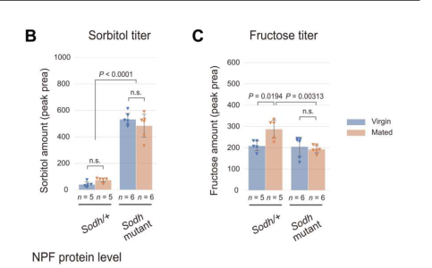

## Question

# Gene Research for Functional Annotation

## ⚠️ CRITICAL: Gene/Protein Identification Context

**BEFORE YOU BEGIN RESEARCH:** You MUST verify you are researching the CORRECT gene/protein. Gene symbols can be ambiguous, especially for less well-characterized genes from non-model organisms.

### Target Gene/Protein Identity (from UniProt):
- **UniProt Accession:** O97479
- **Protein Description:** RecName: Full=Sorbitol dehydrogenase {ECO:0000256|ARBA:ARBA00026132}; AltName: Full=Polyol dehydrogenase {ECO:0000256|ARBA:ARBA00032485};
- **Gene Information:** Name=Sord1 {ECO:0000313|FlyBase:FBgn0024289}; Synonyms=BG:DS00464.2 {ECO:0000313|EMBL:AAF54080.1}, DM_7298873 {ECO:0000313|EMBL:AAF54080.1}, Dmel\CG1982 {ECO:0000313|EMBL:AAF54080.1}, Sdh-1 {ECO:0000313|EMBL:AAF54080.1}, Sodh {ECO:0000313|EMBL:AAF54080.1}, Sodh-1 {ECO:0000313|EMBL:AAF54080.1}, Sodh1 {ECO:0000313|EMBL:AAF54080.1}; ORFNames=CG1982 {ECO:0000313|EMBL:AAF54080.1, ECO:0000313|FlyBase:FBgn0024289}, Dmel_CG1982 {ECO:0000313|EMBL:AAF54080.1};
- **Organism (full):** Drosophila melanogaster (Fruit fly).
- **Protein Family:** Belongs to the zinc-containing alcohol dehydrogenase
- **Key Domains:** ADH-like_C. (IPR013149); ADH-like_N. (IPR013154); ADH_Zn_CS. (IPR002328); ER. (IPR020843); GroES-like_sf. (IPR011032)

### MANDATORY VERIFICATION STEPS:

1. **Check if the gene symbol "Sord1" matches the protein description above**
2. **Verify the organism is correct:** Drosophila melanogaster (Fruit fly).
3. **Check if protein family/domains align with what you find in literature**
4. **If you find literature for a DIFFERENT gene with the same or similar symbol, STOP**

### If Gene Symbol is Ambiguous or You Cannot Find Relevant Literature:

**DO NOT PROCEED WITH RESEARCH ON A DIFFERENT GENE.** Instead:
- State clearly: "The gene symbol 'Sord1' is ambiguous or literature is limited for this specific protein"
- Explain what you found (e.g., "Found extensive literature on a different gene with the same symbol in a different organism")
- Describe the protein based ONLY on the UniProt information provided above
- Suggest that the protein function can be inferred from domain/family information

### Research Target:

Please provide a comprehensive research report on the gene **Sord1** (gene ID: Sord1, UniProt: O97479) in DROME.

The research report should be a detailed narrative explaining the function, biological processes, and localization of the gene product. Citations should be given for all claims.

You should prioritize authoritative reviews and primary scientific literature when conducting research. You can supplement
this with annotations you find in gene/protein databases, but these can be outdated or inaccurate.

We are specifically interested in the primary function of the gene - for enzymes, what reaction is catalyzed, and what is the substrate specificity? For transporters, what is the substrate? For structural proteins or adapters, what is the broader structural role? For signaling molecules, what is the role in the pathway.

We are interested in where in or outside the cell the gene product carries out its function.

We are also interested in the signaling or biochemical pathways in which the gene functions. We are less interested in broad pleiotropic effects, except where these elucidate the precise role.

Include evidence where possible. We are interested in both experimental evidence as well as inference from structure, evolution, or bioinformatic analysis. Precise studies should be prioritized over high-throughput, where available.

## Output

Question: You are an expert researcher providing comprehensive, well-cited information.

Provide detailed information focusing on:
1. Key concepts and definitions with current understanding
2. Recent developments and latest research (prioritize 2023-2024 sources)
3. Current applications and real-world implementations
4. Expert opinions and analysis from authoritative sources
5. Relevant statistics and data from recent studies

Format as a comprehensive research report with proper citations. Include URLs and publication dates where available.
Always prioritize recent, authoritative sources and provide specific citations for all major claims.

# Gene Research for Functional Annotation

## ⚠️ CRITICAL: Gene/Protein Identification Context

**BEFORE YOU BEGIN RESEARCH:** You MUST verify you are researching the CORRECT gene/protein. Gene symbols can be ambiguous, especially for less well-characterized genes from non-model organisms.

### Target Gene/Protein Identity (from UniProt):
- **UniProt Accession:** O97479
- **Protein Description:** RecName: Full=Sorbitol dehydrogenase {ECO:0000256|ARBA:ARBA00026132}; AltName: Full=Polyol dehydrogenase {ECO:0000256|ARBA:ARBA00032485};
- **Gene Information:** Name=Sord1 {ECO:0000313|FlyBase:FBgn0024289}; Synonyms=BG:DS00464.2 {ECO:0000313|EMBL:AAF54080.1}, DM_7298873 {ECO:0000313|EMBL:AAF54080.1}, Dmel\CG1982 {ECO:0000313|EMBL:AAF54080.1}, Sdh-1 {ECO:0000313|EMBL:AAF54080.1}, Sodh {ECO:0000313|EMBL:AAF54080.1}, Sodh-1 {ECO:0000313|EMBL:AAF54080.1}, Sodh1 {ECO:0000313|EMBL:AAF54080.1}; ORFNames=CG1982 {ECO:0000313|EMBL:AAF54080.1, ECO:0000313|FlyBase:FBgn0024289}, Dmel_CG1982 {ECO:0000313|EMBL:AAF54080.1};
- **Organism (full):** Drosophila melanogaster (Fruit fly).
- **Protein Family:** Belongs to the zinc-containing alcohol dehydrogenase
- **Key Domains:** ADH-like_C. (IPR013149); ADH-like_N. (IPR013154); ADH_Zn_CS. (IPR002328); ER. (IPR020843); GroES-like_sf. (IPR011032)

### MANDATORY VERIFICATION STEPS:

1. **Check if the gene symbol "Sord1" matches the protein description above**
2. **Verify the organism is correct:** Drosophila melanogaster (Fruit fly).
3. **Check if protein family/domains align with what you find in literature**
4. **If you find literature for a DIFFERENT gene with the same or similar symbol, STOP**

### If Gene Symbol is Ambiguous or You Cannot Find Relevant Literature:

**DO NOT PROCEED WITH RESEARCH ON A DIFFERENT GENE.** Instead:
- State clearly: "The gene symbol 'Sord1' is ambiguous or literature is limited for this specific protein"
- Explain what you found (e.g., "Found extensive literature on a different gene with the same symbol in a different organism")
- Describe the protein based ONLY on the UniProt information provided above
- Suggest that the protein function can be inferred from domain/family information

### Research Target:

Please provide a comprehensive research report on the gene **Sord1** (gene ID: Sord1, UniProt: O97479) in DROME.

The research report should be a detailed narrative explaining the function, biological processes, and localization of the gene product. Citations should be given for all claims.

You should prioritize authoritative reviews and primary scientific literature when conducting research. You can supplement
this with annotations you find in gene/protein databases, but these can be outdated or inaccurate.

We are specifically interested in the primary function of the gene - for enzymes, what reaction is catalyzed, and what is the substrate specificity? For transporters, what is the substrate? For structural proteins or adapters, what is the broader structural role? For signaling molecules, what is the role in the pathway.

We are interested in where in or outside the cell the gene product carries out its function.

We are also interested in the signaling or biochemical pathways in which the gene functions. We are less interested in broad pleiotropic effects, except where these elucidate the precise role.

Include evidence where possible. We are interested in both experimental evidence as well as inference from structure, evolution, or bioinformatic analysis. Precise studies should be prioritized over high-throughput, where available.

# Functional annotation of *Drosophila melanogaster* Sord1 (UniProt O97479)

## Identity and principal function

**Identity check.** The supplied UniProt record identifies O97479 as the fruit-fly protein **Sord1**, also called **CG1982** or **Sodh-1**. This is **not** the separately named fly paralog **Sodh-2**, nor the mouse gene *Sord*. Primary fly studies identify Sodh-1 and Sodh-2 as two sorbitol-dehydrogenase genes; their reported “Sodh mutant” combines loss-of-function alleles at **both** loci. The supplied zinc-containing alcohol-dehydrogenase family and ADH-like domain annotations are consistent with the enzyme assignment, but those domain annotations are not, by themselves, a biochemical assay of O97479. (sano2022thepolyolpathway pages 4-6, sano2022thepolyolpathway pages 17-19, hoshino2023circulatingfructoseregulates pages 7-9)

**Best-supported reaction.** Sodh-1 is annotated as a sorbitol dehydrogenase, EC **1.1.1.14**, carrying out the second step of the polyol pathway: **D-sorbitol + NAD⁺ ⇌ D-fructose + NADH + H⁺**. Aldose reductase performs the preceding glucose-to-sorbitol step. The NAD⁺-linked reaction and zinc-dependent architecture are consistent with the stated enzyme family; the retrieved fly experiments establish the **pathway-level sorbitol-to-fructose function**, rather than reporting purified O97479 enzyme kinetics or directly measuring its cofactor preference. (sano2022thepolyolpathway pages 4-6, hoshino2023circulatingfructoseregulates pages 7-9)

| Finding | Direct observation | Inference / limitation |
|---|---|---|
| **Identity and paralogy** | Target identity supplied for *Drosophila melanogaster*: UniProt **O97479**, **Sord1 = CG1982 = Sodh-1**. Fly studies separately identify **Sodh-1** and **Sodh-2** as two sorbitol-dehydrogenase genes (sano2022thepolyolpathway pages 4-6, hoshino2023circulatingfructoseregulates pages 7-9). | The O97479-to-Sodh-1 mapping comes from the supplied UniProt record, not independently from these papers. Sodh-2 is a distinct paralog; double-mutant results cannot establish the individual contribution of O97479/Sodh-1. |
| **Primary reaction** | The polyol pathway is annotated as glucose → sorbitol via aldose reductase, followed by **sorbitol → fructose via sorbitol dehydrogenase (EC 1.1.1.14)** (sano2022thepolyolpathway pages 4-6). | The expected full oxidation is **sorbitol + NAD⁺ ⇌ fructose + NADH + H⁺**. NAD⁺ dependence and zinc-containing medium-chain dehydrogenase architecture are family-based annotations here; no retrieved study purified O97479 and measured its kinetics or cofactor preference. |
| **In-vivo pathway flux** | After flies ingested uniformly ¹³C-labeled glucose, labeled sorbitol and fructose were detected, supporting operative **glucose → sorbitol → fructose** flux in vivo (sano2022thepolyolpathway pages 2-4, sano2022thepolyolpathway pages 4-6). | This pathway-level tracing does not resolve how much flux is catalyzed by Sodh-1 versus Sodh-2. |
| **Genetic and metabolite evidence** | CRISPR alleles truncating the catalytic regions of both Sodh-1 and Sodh-2 caused larval hemolymph sorbitol accumulation. In adult double mutants, postmating fructose elevation was suppressed and sorbitol accumulated; fructose—but not sorbitol—restored NPF release and germline-stem-cell responses (sano2022thepolyolpathway pages 17-19, hoshino2023circulatingfructoseregulates pages 7-9, hoshino2023circulatingfructoseregulates pages 9-11). | This is strong evidence that the two enzymes collectively catalyze the sorbitol-to-fructose step, but it remains **double-mutant**, not O97479-specific, evidence. Rescue by downstream fructose establishes pathway order rather than direct O97479 enzymology. |
| **Glucose-sensing pathway** | In larval fat-body cells, nuclear **Mondo::Venus** signal was **5.2%** in basal medium and increased to **14.6% with glucose, 12.7% with sorbitol, and 16.7% with fructose**. Glucose failed to increase nuclear Mondo in Sodh double mutants under normally fed conditions, whereas downstream metabolites bypassed the relevant blocks (sano2022thepolyolpathway pages 8-11). | These values quantify **Mondo localization**, not Sodh-1 abundance or localization. The results place Sodh activity upstream of Mondo/Mlx-dependent metabolic transcription but do not show direct physical signaling between Sodh-1 and Mondo. |
| **Tissue and subcellular localization** | Sodh-related transcripts were assessed in adult gut and a carcass fraction containing muscle, epidermis, and fat body; prior transcriptomic data indicated high expression of most Sodh/AR genes in these tissues (hoshino2023circulatingfructoseregulates pages 9-11). | No retrieved study directly imaged endogenous Sodh-1/O97479 protein or established its subcellular compartment. A cytosolic location is plausible for a soluble polyol-pathway dehydrogenase but remains an inference; fat-body imaging in the cited work localized **Mondo**, not Sodh-1. |
| **Alternative substrate specificity** | AR and Sodh are bioinformatically predicted to support **xylose → xylitol → xylulose**, but xylitol did not significantly induce the tested CCHa2 response in wild-type larvae (sano2022thepolyolpathway pages 4-6). | Xylitol/xylulose activity is putative and was not established by purified O97479 kinetics. Current in-vivo evidence most strongly supports sorbitol as the physiologically relevant substrate and fructose as the product. |

*Table: Evidence supporting functional annotation of Drosophila O97479/Sord1, with explicit separation of direct pathway-level observations from paralog-specific and localization uncertainties.*

## Experimental basis and substrate specificity

In **Sano and colleagues’ 2022 primary study**, sorbitol and fructose became labeled after larvae consumed ¹³C-labeled glucose, demonstrating that the proposed glucose → sorbitol → fructose route operates in flies. CRISPR alleles truncating the catalytic portions of **both Sodh-1 and Sodh-2** were associated with increased sorbitol in larval hemolymph, as expected when sorbitol oxidation is blocked. This is strong *in-vivo* evidence for the enzymes’ **combined** role, but does not determine the fraction of flux carried by Sord1/O97479 alone. (sano2022thepolyolpathway pages 4-6, sano2022thepolyolpathway pages 17-19)

The **2023 adult-fly study** extends that interpretation: in Sodh-1/Sodh-2 double-mutant females, sorbitol accumulated and the normal postmating rise in circulating fructose was suppressed. Feeding the downstream product **fructose**, but not upstream **sorbitol**, restored the measured downstream endocrine and germline-stem-cell responses. The paper’s Figure 6 reports hemolymph sugars as mass-spectrometric **peak areas**, so these results should not be presented as absolute blood concentrations. (hoshino2023circulatingfructoseregulates pages 7-9, hoshino2023circulatingfructoseregulates pages 9-11, hoshino2023circulatingfructoseregulates media 7cfa8785)

**Specificity remains incompletely resolved for O97479 itself.** Sorbitol is the experimentally supported physiological substrate in the fly polyol pathway. Conversion of xylose through xylitol to xylulose has been **predicted** for the relevant enzyme classes, but the 2022 study found that xylitol did not significantly induce its tested CCHa2 transcriptional response. This negative signaling result neither establishes nor excludes xylitol as a direct Sodh-1 substrate; comparative substrate kinetics for isolated O97479 were not identified in the retrieved literature. (sano2022thepolyolpathway pages 4-6)

## Biological processes and pathway position

**Nutrient-responsive metabolic transcription.** The 2022 study places Sodh-dependent production of polyol-pathway metabolites **upstream of Mondo/Mlx**, a transcriptional regulator of nutrient-responsive metabolic genes in the larval fat body. In normally fed flies, disruption of the polyol pathway reduced glucose-associated Mondo nuclear localization and CCHa2 expression; sorbitol-induced transcriptional changes were lost in Sodh double mutants, whereas fructose restored downstream transcriptional responses. Fat-body Mondo overexpression partially rescued double-mutant growth and metabolic phenotypes. Thus Sord1’s relevant annotation is **metabolic enzyme in a glucose-sensing pathway**, not a receptor or a transcription factor. Notably, after starvation followed by glucose refeeding, Mondo still moved into nuclei in the mutants: the requirement for this pathway depends on nutritional context, and fructose rescue does not exclude contributions from fructose metabolism downstream. (sano2022thepolyolpathway pages 6-8, sano2022thepolyolpathway pages 4-6, sano2022thepolyolpathway pages 8-11)

A quantitative measure of this **downstream signaling**, not of Sodh-1 localization, was the fraction of nuclear Mondo::Venus signal in cultured larval fat-body cells: **5.2%** in basic medium, rising to **14.6%** with added glucose, **12.7%** with sorbitol, and **16.7%** with fructose. Glucose did not produce the corresponding increase in normally fed Sodh-mutant fat-body cells. (sano2022thepolyolpathway pages 8-11)

**Circulating fructose and reproductive signaling.** Hoshino and colleagues showed in 2023 that postmating production of circulating fructose depends on the Sodh-containing polyol pathway. Fructose is sensed by **Gr43a** in neuropeptide-F-positive midgut enteroendocrine cells; the ensuing NPF release supports ovarian germline-stem-cell niche signaling and the postmating increase in stem cells and egg production. In the Sodh double mutant, fructose feeding restored NPF release and the stem-cell response, while sorbitol did not; injected NPF also increased stem-cell numbers. This is an experimentally investigated **application of the mutant as a pathway perturbation**, not evidence that Sodh-1 itself is the gut fructose receptor or acts directly in the ovary. The study reported Gr43a reporter expression in approximately **70%** of NPF-positive enteroendocrine cells, and, among **183** assayed metabolites, **43** hemolymph metabolites changed more than twofold after mating at *P* < 0.05. (hoshino2023circulatingfructoseregulates pages 6-7, hoshino2023circulatingfructoseregulates pages 7-9, hoshino2023circulatingfructoseregulates pages 9-11)

## Where the protein acts—and what remains uncertain

The measured **hemolymph** sorbitol and fructose are circulating metabolites, **not a localization assay for Sodh-1 protein**. The 2023 investigators assessed polyol-pathway-gene transcripts in gut and in a carcass fraction containing muscle, epidermis, and fat body, citing broader transcriptomic evidence for expression in these tissues. The fat-body imaging in the 2022 study localized **Mondo**, not Sodh-1. Consequently, the evidence supports sorbitol-to-fructose conversion in fly physiology and a fat-body-responsive pathway, but **does not establish the specific cell type or subcellular compartment in which O97479 acts**. A soluble intracellular, plausibly cytosolic, enzyme is a family-based expectation rather than an experimentally verified localization for this protein. (hoshino2023circulatingfructoseregulates pages 9-11, sano2022thepolyolpathway pages 8-11)

**Assessment.** The primary annotation **sorbitol dehydrogenase in the glucose–sorbitol–fructose polyol pathway** is supported by compatible domains, isotope tracing, double-mutant metabolite accumulation and downstream-product rescue. Confidence is lower for **Sord1-specific catalytic contribution, alternative-substrate preference, kinetic constants, and subcellular localization**, because the decisive fly interventions target Sodh-1 together with Sodh-2. No directly informative 2024 study resolving those protein-specific questions was identified in the retrieved literature. (sano2022thepolyolpathway pages 4-6, sano2022thepolyolpathway pages 17-19, hoshino2023circulatingfructoseregulates pages 7-9, hoshino2023circulatingfructoseregulates pages 9-11)

### Principal sources

1. Sano H *et al.* **“The polyol pathway is an evolutionarily conserved system for sensing glucose uptake.”** *PLOS Biology* **20** (published **10 June 2022**). https://doi.org/10.1371/journal.pbio.3001678. Primary evidence for fly double-mutant metabolism, isotope tracing, and Mondo-dependent responses. (sano2022thepolyolpathway pages 2-4, sano2022thepolyolpathway pages 4-6, sano2022thepolyolpathway pages 8-11)
2. Hoshino R *et al.* **“Circulating fructose regulates a germline stem cell increase via gustatory receptor–mediated gut hormone secretion in mated Drosophila.”** *Science Advances* **9** (published **24 February 2023**). https://doi.org/10.1126/sciadv.add5551. Primary evidence for adult-fly circulating-fructose production and the Gr43a–NPF pathway. (hoshino2023circulatingfructoseregulates pages 6-7, hoshino2023circulatingfructoseregulates pages 9-11, hoshino2023circulatingfructoseregulates pages 7-9)
3. **UniProt O97479**, *D. melanogaster* Sord1 entry, for the accession, CG1982/Sodh-1 aliases and supplied family/domain annotations: https://www.uniprot.org/uniprotkb/O97479/entry. The accession-to-alias mapping here relies on the identity information supplied with the question; it was not independently established by the two experimental papers. (sano2022thepolyolpathway pages 4-6, hoshino2023circulatingfructoseregulates pages 7-9)

References

1. (sano2022thepolyolpathway pages 4-6): Hiroko Sano, Akira Nakamura, Mariko Yamane, Hitoshi Niwa, Takashi Nishimura, Kimi Araki, Kazumasa Takemoto, Kei-ichiro Ishiguro, Hiroki Aoki, and Masayasu Kojima. The polyol pathway is an evolutionarily conserved system for sensing glucose uptake. PLoS Biology, Sep 2022. URL: https://doi.org/10.1371/journal.pbio.3001678, doi:10.1371/journal.pbio.3001678. This article has 36 citations and is from a highest quality peer-reviewed journal.

2. (sano2022thepolyolpathway pages 17-19): Hiroko Sano, Akira Nakamura, Mariko Yamane, Hitoshi Niwa, Takashi Nishimura, Kimi Araki, Kazumasa Takemoto, Kei-ichiro Ishiguro, Hiroki Aoki, and Masayasu Kojima. The polyol pathway is an evolutionarily conserved system for sensing glucose uptake. PLoS Biology, Sep 2022. URL: https://doi.org/10.1371/journal.pbio.3001678, doi:10.1371/journal.pbio.3001678. This article has 36 citations and is from a highest quality peer-reviewed journal.

3. (hoshino2023circulatingfructoseregulates pages 7-9): Ryo Hoshino, Hiroko Sano, Yuto Yoshinari, Takashi Nishimura, and Ryusuke Niwa. Circulating fructose regulates a germline stem cell increase via gustatory receptor–mediated gut hormone secretion in mated <i>drosophila</i>. Science Advances, Feb 2023. URL: https://doi.org/10.1126/sciadv.add5551, doi:10.1126/sciadv.add5551. This article has 26 citations and is from a highest quality peer-reviewed journal.

4. (sano2022thepolyolpathway pages 2-4): Hiroko Sano, Akira Nakamura, Mariko Yamane, Hitoshi Niwa, Takashi Nishimura, Kimi Araki, Kazumasa Takemoto, Kei-ichiro Ishiguro, Hiroki Aoki, and Masayasu Kojima. The polyol pathway is an evolutionarily conserved system for sensing glucose uptake. PLoS Biology, Sep 2022. URL: https://doi.org/10.1371/journal.pbio.3001678, doi:10.1371/journal.pbio.3001678. This article has 36 citations and is from a highest quality peer-reviewed journal.

5. (hoshino2023circulatingfructoseregulates pages 9-11): Ryo Hoshino, Hiroko Sano, Yuto Yoshinari, Takashi Nishimura, and Ryusuke Niwa. Circulating fructose regulates a germline stem cell increase via gustatory receptor–mediated gut hormone secretion in mated <i>drosophila</i>. Science Advances, Feb 2023. URL: https://doi.org/10.1126/sciadv.add5551, doi:10.1126/sciadv.add5551. This article has 26 citations and is from a highest quality peer-reviewed journal.

6. (sano2022thepolyolpathway pages 8-11): Hiroko Sano, Akira Nakamura, Mariko Yamane, Hitoshi Niwa, Takashi Nishimura, Kimi Araki, Kazumasa Takemoto, Kei-ichiro Ishiguro, Hiroki Aoki, and Masayasu Kojima. The polyol pathway is an evolutionarily conserved system for sensing glucose uptake. PLoS Biology, Sep 2022. URL: https://doi.org/10.1371/journal.pbio.3001678, doi:10.1371/journal.pbio.3001678. This article has 36 citations and is from a highest quality peer-reviewed journal.

7. (hoshino2023circulatingfructoseregulates media 7cfa8785): Ryo Hoshino, Hiroko Sano, Yuto Yoshinari, Takashi Nishimura, and Ryusuke Niwa. Circulating fructose regulates a germline stem cell increase via gustatory receptor–mediated gut hormone secretion in mated <i>drosophila</i>. Science Advances, Feb 2023. URL: https://doi.org/10.1126/sciadv.add5551, doi:10.1126/sciadv.add5551. This article has 26 citations and is from a highest quality peer-reviewed journal.

8. (sano2022thepolyolpathway pages 6-8): Hiroko Sano, Akira Nakamura, Mariko Yamane, Hitoshi Niwa, Takashi Nishimura, Kimi Araki, Kazumasa Takemoto, Kei-ichiro Ishiguro, Hiroki Aoki, and Masayasu Kojima. The polyol pathway is an evolutionarily conserved system for sensing glucose uptake. PLoS Biology, Sep 2022. URL: https://doi.org/10.1371/journal.pbio.3001678, doi:10.1371/journal.pbio.3001678. This article has 36 citations and is from a highest quality peer-reviewed journal.

9. (hoshino2023circulatingfructoseregulates pages 6-7): Ryo Hoshino, Hiroko Sano, Yuto Yoshinari, Takashi Nishimura, and Ryusuke Niwa. Circulating fructose regulates a germline stem cell increase via gustatory receptor–mediated gut hormone secretion in mated <i>drosophila</i>. Science Advances, Feb 2023. URL: https://doi.org/10.1126/sciadv.add5551, doi:10.1126/sciadv.add5551. This article has 26 citations and is from a highest quality peer-reviewed journal.

## Artifacts

- [Edison artifact artifact-00](Sord1-deep-research-falcon_artifacts/artifact-00.md)

## Citations

1. sano2022thepolyolpathway pages 4-6
2. sano2022thepolyolpathway pages 8-11
3. hoshino2023circulatingfructoseregulates pages 9-11
4. sano2022thepolyolpathway pages 17-19
5. hoshino2023circulatingfructoseregulates pages 7-9
6. sano2022thepolyolpathway pages 2-4
7. sano2022thepolyolpathway pages 6-8
8. hoshino2023circulatingfructoseregulates pages 6-7
9. https://doi.org/10.1371/journal.pbio.3001678.
10. https://doi.org/10.1126/sciadv.add5551.
11. https://www.uniprot.org/uniprotkb/O97479/entry.
12. https://doi.org/10.1371/journal.pbio.3001678,
13. https://doi.org/10.1126/sciadv.add5551,