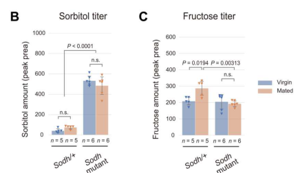

## Question

# Gene Research for Functional Annotation

## ⚠️ CRITICAL: Gene/Protein Identification Context

**BEFORE YOU BEGIN RESEARCH:** You MUST verify you are researching the CORRECT gene/protein. Gene symbols can be ambiguous, especially for less well-characterized genes from non-model organisms.

### Target Gene/Protein Identity (from UniProt):
- **UniProt Accession:** O96299
- **Protein Description:** RecName: Full=Sorbitol dehydrogenase {ECO:0000256|ARBA:ARBA00026132}; AltName: Full=Polyol dehydrogenase {ECO:0000256|ARBA:ARBA00032485};
- **Gene Information:** Name=Sord2 {ECO:0000313|FlyBase:FBgn0022359}; Synonyms=DM_7299382 {ECO:0000313|EMBL:AAF54573.1}, Dmel\CG4649 {ECO:0000313|EMBL:AAF54573.1}, Sdh {ECO:0000313|EMBL:AAF54573.1}, Sdh-2 {ECO:0000313|EMBL:AAF54573.1}, SODH-2 {ECO:0000313|EMBL:AAF54573.1}, Sodh-2 {ECO:0000313|EMBL:AAF54573.1}, Sodh2 {ECO:0000313|EMBL:AAF54573.1}; ORFNames=CG4649 {ECO:0000313|EMBL:AAF54573.1, ECO:0000313|FlyBase:FBgn0022359}, Dmel_CG4649 {ECO:0000313|EMBL:AAF54573.1};
- **Organism (full):** Drosophila melanogaster (Fruit fly).
- **Protein Family:** Belongs to the zinc-containing alcohol dehydrogenase
- **Key Domains:** ADH-like_C. (IPR013149); ADH-like_N. (IPR013154); ADH_Zn_CS. (IPR002328); ER. (IPR020843); GroES-like_sf. (IPR011032)

### MANDATORY VERIFICATION STEPS:

1. **Check if the gene symbol "Sord2" matches the protein description above**
2. **Verify the organism is correct:** Drosophila melanogaster (Fruit fly).
3. **Check if protein family/domains align with what you find in literature**
4. **If you find literature for a DIFFERENT gene with the same or similar symbol, STOP**

### If Gene Symbol is Ambiguous or You Cannot Find Relevant Literature:

**DO NOT PROCEED WITH RESEARCH ON A DIFFERENT GENE.** Instead:
- State clearly: "The gene symbol 'Sord2' is ambiguous or literature is limited for this specific protein"
- Explain what you found (e.g., "Found extensive literature on a different gene with the same symbol in a different organism")
- Describe the protein based ONLY on the UniProt information provided above
- Suggest that the protein function can be inferred from domain/family information

### Research Target:

Please provide a comprehensive research report on the gene **Sord2** (gene ID: Sord2, UniProt: O96299) in DROME.

The research report should be a detailed narrative explaining the function, biological processes, and localization of the gene product. Citations should be given for all claims.

You should prioritize authoritative reviews and primary scientific literature when conducting research. You can supplement
this with annotations you find in gene/protein databases, but these can be outdated or inaccurate.

We are specifically interested in the primary function of the gene - for enzymes, what reaction is catalyzed, and what is the substrate specificity? For transporters, what is the substrate? For structural proteins or adapters, what is the broader structural role? For signaling molecules, what is the role in the pathway.

We are interested in where in or outside the cell the gene product carries out its function.

We are also interested in the signaling or biochemical pathways in which the gene functions. We are less interested in broad pleiotropic effects, except where these elucidate the precise role.

Include evidence where possible. We are interested in both experimental evidence as well as inference from structure, evolution, or bioinformatic analysis. Precise studies should be prioritized over high-throughput, where available.

## Output

Question: You are an expert researcher providing comprehensive, well-cited information.

Provide detailed information focusing on:
1. Key concepts and definitions with current understanding
2. Recent developments and latest research (prioritize 2023-2024 sources)
3. Current applications and real-world implementations
4. Expert opinions and analysis from authoritative sources
5. Relevant statistics and data from recent studies

Format as a comprehensive research report with proper citations. Include URLs and publication dates where available.
Always prioritize recent, authoritative sources and provide specific citations for all major claims.

# Gene Research for Functional Annotation

## ⚠️ CRITICAL: Gene/Protein Identification Context

**BEFORE YOU BEGIN RESEARCH:** You MUST verify you are researching the CORRECT gene/protein. Gene symbols can be ambiguous, especially for less well-characterized genes from non-model organisms.

### Target Gene/Protein Identity (from UniProt):
- **UniProt Accession:** O96299
- **Protein Description:** RecName: Full=Sorbitol dehydrogenase {ECO:0000256|ARBA:ARBA00026132}; AltName: Full=Polyol dehydrogenase {ECO:0000256|ARBA:ARBA00032485};
- **Gene Information:** Name=Sord2 {ECO:0000313|FlyBase:FBgn0022359}; Synonyms=DM_7299382 {ECO:0000313|EMBL:AAF54573.1}, Dmel\CG4649 {ECO:0000313|EMBL:AAF54573.1}, Sdh {ECO:0000313|EMBL:AAF54573.1}, Sdh-2 {ECO:0000313|EMBL:AAF54573.1}, SODH-2 {ECO:0000313|EMBL:AAF54573.1}, Sodh-2 {ECO:0000313|EMBL:AAF54573.1}, Sodh2 {ECO:0000313|EMBL:AAF54573.1}; ORFNames=CG4649 {ECO:0000313|EMBL:AAF54573.1, ECO:0000313|FlyBase:FBgn0022359}, Dmel_CG4649 {ECO:0000313|EMBL:AAF54573.1};
- **Organism (full):** Drosophila melanogaster (Fruit fly).
- **Protein Family:** Belongs to the zinc-containing alcohol dehydrogenase
- **Key Domains:** ADH-like_C. (IPR013149); ADH-like_N. (IPR013154); ADH_Zn_CS. (IPR002328); ER. (IPR020843); GroES-like_sf. (IPR011032)

### MANDATORY VERIFICATION STEPS:

1. **Check if the gene symbol "Sord2" matches the protein description above**
2. **Verify the organism is correct:** Drosophila melanogaster (Fruit fly).
3. **Check if protein family/domains align with what you find in literature**
4. **If you find literature for a DIFFERENT gene with the same or similar symbol, STOP**

### If Gene Symbol is Ambiguous or You Cannot Find Relevant Literature:

**DO NOT PROCEED WITH RESEARCH ON A DIFFERENT GENE.** Instead:
- State clearly: "The gene symbol 'Sord2' is ambiguous or literature is limited for this specific protein"
- Explain what you found (e.g., "Found extensive literature on a different gene with the same symbol in a different organism")
- Describe the protein based ONLY on the UniProt information provided above
- Suggest that the protein function can be inferred from domain/family information

### Research Target:

Please provide a comprehensive research report on the gene **Sord2** (gene ID: Sord2, UniProt: O96299) in DROME.

The research report should be a detailed narrative explaining the function, biological processes, and localization of the gene product. Citations should be given for all claims.

You should prioritize authoritative reviews and primary scientific literature when conducting research. You can supplement
this with annotations you find in gene/protein databases, but these can be outdated or inaccurate.

We are specifically interested in the primary function of the gene - for enzymes, what reaction is catalyzed, and what is the substrate specificity? For transporters, what is the substrate? For structural proteins or adapters, what is the broader structural role? For signaling molecules, what is the role in the pathway.

We are interested in where in or outside the cell the gene product carries out its function.

We are also interested in the signaling or biochemical pathways in which the gene functions. We are less interested in broad pleiotropic effects, except where these elucidate the precise role.

Include evidence where possible. We are interested in both experimental evidence as well as inference from structure, evolution, or bioinformatic analysis. Precise studies should be prioritized over high-throughput, where available.

# Functional annotation report: *Drosophila melanogaster* Sord2 (O96299)

## Identity and principal function

The supplied UniProt identity **O96299** refers to fruit-fly **Sord2**, also called **Sodh-2** or **CG4649** (FlyBase **FBgn0022359**), not mammalian *SORD* or the distinct fly paralog **Sodh-1**. Contemporary fly studies explicitly identify two Sodh genes and usually disrupt **both**. Thus, the strongest experiments establish the function of the *combined Sodh activity*, rather than the independent contribution of O96299. [UniProt record: https://www.uniprot.org/uniprotkb/O96299/entry; FlyBase record: https://flybase.org/reports/FBgn0022359.html.] (sano2022thepolyolpathway pages 4-6, hoshino2023circulatingfructoseregulates pages 9-11)

**The best-supported primary annotation is sorbitol dehydrogenase in the polyol pathway:** aldose reductase converts glucose to sorbitol, and Sodh catalyzes the subsequent conversion of **D-sorbitol to D-fructose** (EC 1.1.1.14). Written as an oxidative reaction, the expected chemistry is **D-sorbitol + NAD⁺ ⇌ D-fructose + NADH + H⁺**. The fly studies establish the sorbitol-to-fructose pathway step; assigning the precise NAD⁺-dependent reaction to *isolated Sord2 protein* remains a family-based annotation rather than a reported purified-O96299 assay. Its supplied zinc-containing alcohol-dehydrogenase family and ADH-like N- and C-terminal domains are consistent with that annotation, but do not measure its catalytic constants or prove its intracellular location. (sano2022thepolyolpathway pages 4-6, bischoff1976geneticcontrolof pages 1-4, bischoff1976geneticcontrolof pages 4-7)

The evidence and its gene-specific limits are summarized below.

| Topic | Evidence-tiered annotation | Confidence and source |
|---|---|---|
| Identity | **Sord2/Sodh-2/CG4649**, UniProt **O96299**, is one of two predicted *Drosophila melanogaster* sorbitol-dehydrogenase paralogs; the other is **Sodh-1**. Contemporary experiments generally disrupt both genes, so they do not isolate Sord2 activity. | **High** for identity; **important paralog caveat**. Sano *et al.*, *PLOS Biology*, 10 June 2022, DOI: [10.1371/journal.pbio.3001678](https://doi.org/10.1371/journal.pbio.3001678) (sano2022thepolyolpathway pages 17-19, sano2022thepolyolpathway pages 4-6) |
| Primary reaction | Best-supported annotation is the polyol-pathway oxidation **D-sorbitol + NAD⁺ ⇌ D-fructose + NADH + H⁺** (Sodh; EC 1.1.1.14). The sorbitol-to-fructose step is experimentally established for combined fly Sodh function; NAD⁺ dependence and zinc-containing medium-chain dehydrogenase chemistry are family/domain-based inferences for O96299 rather than direct assays of purified Sord2. | **High** for the combined Sodh reaction; **moderate/inferred** for O96299-specific NAD⁺ and zinc dependence. Sano *et al.*, 10 June 2022, DOI above (sano2022thepolyolpathway pages 4-6); historical NAD-dependent activities (bischoff1976geneticcontrolof pages 1-4, bischoff1976geneticcontrolof pages 4-7) |
| Substrate specificity | D-sorbitol is the physiologically supported substrate. AR and Sodh are predicted to support **xylose → xylitol → xylulose**, but xylitol did not significantly induce CCHa2 in wild-type larvae. No purified-Sord2 kinetic panel establishes preference for sorbitol versus xylitol or other polyols/alcohols. | **High** for sorbitol in the combined pathway; **low/unknown** for O96299-specific breadth. Sano *et al.*, 10 June 2022 (sano2022thepolyolpathway pages 4-6) |
| In-vivo pathway evidence | Ingested **¹³C-glucose** gave rise to labeled sorbitol and fructose. CRISPR disruption of both **Sodh-1 and Sodh-2** increased hemolymph sorbitol; both alleles are frameshifts that remove most catalytic sequence. Sorbitol-driven responses were lost in double mutants and bypassed by fructose, placing Sodh between sorbitol and fructose. This is strong evidence for redundant/combined Sodh function, not an individual Sord2 assay. | **High** for combined Sodh activity; **not gene-specific**. Sano *et al.*, 10 June 2022 (sano2022thepolyolpathway pages 4-6, sano2020thepolyolpathway pages 34-37, sano2022thepolyolpathway pages 17-19) |
| Mondo/Mlx glucose sensing | In normally fed larval fat bodies, nuclear Mondo::Venus was **5.2%** in basal 11 mM glucose medium and rose to **14.6%, 12.7%, and 16.7%** after addition of 55 mM glucose, sorbitol, or fructose, respectively. Glucose failed to produce this increase in combined Sodh mutants, whereas downstream fructose bypassed the block. | **High** for the double-mutant pathway phenotype. Sano *et al.*, 10 June 2022 (sano2022thepolyolpathway pages 8-11) |
| Adult reproductive signaling | In mated females, double Sodh loss caused strong sorbitol accumulation, suppressed the mating-induced fructose rise, prevented enteroendocrine NPF release, and impaired germline-stem-cell increase; dietary fructose—but not sorbitol—rescued downstream responses. NPF peptide injection also bypassed the defect. | **High** for combined Sodh function; **not separable between Sodh-1 and Sord2**. Hoshino *et al.*, *Science Advances*, 24 February 2023, DOI: [10.1126/sciadv.add5551](https://doi.org/10.1126/sciadv.add5551) (hoshino2023circulatingfructoseregulates pages 7-9, hoshino2023circulatingfructoseregulates pages 9-11, hoshino2023circulatingfructoseregulates media 644dab0c) |
| Gr43a–NPF axis and statistics | The fructose receptor **Gr43a** was detected in approximately **70% of NPF-positive midgut enteroendocrine cells**. EEC-specific Gr43a loss blocked mating-associated Ca²⁺ elevation, NPF release, GSC expansion, and normal egg production. Of **183** measured metabolites, **43** hemolymph metabolites changed by more than twofold after mating (*P* < 0.05). | **High**, 2023 primary study. Hoshino *et al.*, 24 February 2023, DOI above (hoshino2023circulatingfructoseregulates pages 6-7, hoshino2023circulatingfructoseregulates pages 7-9) |
| Cellular and tissue localization | The precise subcellular localization of the **Sord2 protein itself** is not established by the cited contemporary studies. Fat-body Mondo assays identify a tissue in which combined polyol-pathway activity affects signaling, while transcriptomic evidence places most Sodh/AR expression in carcass tissues—muscle, epidermis, and fat body—and gut; neither observation localizes O96299 specifically. | **Unknown** at protein level; **moderate** for pathway activity/expression context. Sano *et al.*, 10 June 2022; Hoshino *et al.*, 24 February 2023 (hoshino2023circulatingfructoseregulates pages 9-11, sano2022thepolyolpathway pages 8-11) |
| Historical localization caution | Studies from 1976–1978 resolved **soluble cytoplasmic NAD-dependent**, **mitochondrial NAD-dependent**, and **soluble NADP-dependent** sorbitol-oxidizing activities. The soluble NAD-dependent locus mapped broadly to chromosome 3 region 91B–93F, but no molecular sequence or allelism test links that enzyme unambiguously to modern **CG4649/Sord2**. Historical cytosolic, mitochondrial, muscle, fat-body, or reproductive-organ assignments therefore must not be transferred to O96299. | **High** that distinct historical activities existed; **unproven** correspondence to Sord2. Bischoff, *Biochemical Genetics*, December 1976, DOI: [10.1007/BF00485134](https://doi.org/10.1007/BF00485134); June 1978, DOI: [10.1007/BF00484214](https://doi.org/10.1007/BF00484214) (bischoff1976geneticcontrolof pages 12-15, bischoff1976geneticcontrolof pages 1-4, bischoff1978ontogenyofsorbitol pages 1-4, bischoff1978ontogenyofsorbitol pages 18-21) |

*Table: Evidence-tiered annotation of Drosophila Sord2/CG4649, explicitly separating combined-paralog experimental findings from O96299-specific inference and unresolved localization or substrate specificity.*

## Direct experimental evidence for the pathway

In the peer-reviewed fly study by **Sano and colleagues, published 10 June 2022**, ingested **¹³C-glucose** yielded labeled sorbitol and fructose, demonstrating that the polyol pathway operates *in vivo*. CRISPR frameshift alleles disrupting the catalytic regions of **both Sodh-1 and Sodh-2** increased larval hemolymph sorbitol, as predicted when its conversion is blocked. Sorbitol-dependent transcriptional responses disappeared in these double mutants and were restored downstream by supplying fructose. This convergence of isotope tracing, genetics, metabolite accumulation and bypass supports the reaction more strongly than a sequence annotation alone; it does **not** apportion flux between the two enzymes. [Sano *et al.*, *PLOS Biology* **20**, e3001678 (2022), https://doi.org/10.1371/journal.pbio.3001678.] (sano2022thepolyolpathway pages 17-19, sano2022thepolyolpathway pages 6-8, sano2022thepolyolpathway pages 4-6)

**Substrate specificity remains incompletely resolved for Sord2 itself.** D-sorbitol is the biologically supported polyol substrate for combined fly Sodh function. The investigators also noted a *predicted* xylose → xylitol → xylulose route, but xylitol did not significantly induce their CCHa2 readout. That result is not a direct kinetic test of Sord2 and neither proves nor excludes xylitol oxidation; relative preferences for sorbitol, xylitol and other alcohols have not been established by the cited O96299-specific experiments. (sano2022thepolyolpathway pages 4-6)

## Where the pathway functions and what it controls

**Larval metabolic signaling.** Under ordinary feeding conditions, polyol-pathway activity supports nuclear localization of the glucose-responsive transcription factor **Mondo**, and consequent Mondo/Mlx-linked metabolic gene expression. In dissected, normally fed larval **fat bodies**, the fraction of nuclear Mondo::Venus signal was **5.2%** in basal medium containing 11 mM glucose; after addition of 55 mM glucose, sorbitol or fructose, respectively, it rose to **14.6%, 12.7% or 16.7%**. Added glucose failed to increase nuclear Mondo appropriately in combined Sodh-mutant fat bodies, whereas downstream polyol metabolites bypassed pathway lesions. These measurements locate a *functional pathway response* in fat-body cells; the imaged protein was **Mondo, not Sord2**. Notably, after 18 hours of starvation, glucose refeeding could still drive Mondo nuclear translocation in the mutants, indicating that dependence on the polyol pathway varies with nutritional state. (sano2022thepolyolpathway pages 6-8, sano2022thepolyolpathway pages 8-11)

The same double-mutant study reported modest larval growth impairment and reduced pupation on normal food, more pronounced growth and pupation defects on a protein-rich diet, and changes in metabolic measures. Fat-body Mondo overexpression partially rescued several phenotypes. Those findings support a metabolic-signaling role but should not be presented as isolated **Sord2-null** phenotypes. (sano2022thepolyolpathway pages 4-6)

**Adult gut-to-ovary signaling.** The most relevant newer primary study, **Hoshino and colleagues, published 24 February 2023**, tested mated females. Relative to controls, **Sodh-1/Sodh-2 double mutants** accumulated circulating sorbitol, failed to show the normal mating-associated increase in hemolymph fructose, failed to release **neuropeptide F (NPF)** appropriately from midgut enteroendocrine cells, and showed an impaired increase in ovarian germline stem cells. Dietary **fructose, but not sorbitol**, bypassed the mutant defect in NPF release and stem-cell response; injected NPF peptide also increased stem-cell numbers downstream of the defect. The study’s Figure 6 directly shows the sorbitol/fructose and NPF comparisons. [Hoshino *et al.*, *Science Advances* **9**, eadd5551 (2023), https://doi.org/10.1126/sciadv.add5551.] (hoshino2023circulatingfructoseregulates pages 7-9, hoshino2023circulatingfructoseregulates pages 9-11, hoshino2023circulatingfructoseregulates media 644dab0c)

The mechanistic link is **circulating fructose → Gr43a in midgut NPF-positive enteroendocrine cells → calcium-associated NPF secretion → ovarian niche signaling and increased germline stem cells**. Gr43a reporter expression was observed in approximately **70%** of NPF-positive enteroendocrine cells; enteroendocrine Gr43a knockdown disrupted the mating-associated calcium response, NPF release, stem-cell increase and normal egg production. In an accompanying metabolomic survey, **43 of 183** measured hemolymph metabolites changed by more than twofold after mating (*P* < 0.05). These are pathway and receptor results, **not evidence that Sord2 itself is a Gr43a receptor or is localized to the ovary**. (hoshino2023circulatingfructoseregulates pages 6-7, hoshino2023circulatingfructoseregulates pages 7-9, hoshino2023circulatingfructoseregulates pages 9-11)

## Localization and interpretation of older biochemistry

**An experimentally established subcellular location for O96299 cannot be assigned from these studies.** The fat-body experiments establish where Sodh-dependent signaling was tested, while the 2023 paper discusses broader Sodh/aldose-reductase expression in carcass tissues—including muscle, epidermis and fat body—and gut. Neither observation identifies which cells contain Sord2 *protein* specifically or proves a cytosolic, mitochondrial, extracellular or secreted location for O96299. Its likely action is intracellular metabolism of sorbitol, with downstream fructose detectable in hemolymph; the exact site of its catalysis remains unresolved. (hoshino2023circulatingfructoseregulates pages 9-11, sano2022thepolyolpathway pages 8-11)

Historical fly biochemical papers separated **soluble NAD-dependent**, **mitochondrial NAD-dependent** and **soluble NADP-dependent** sorbitol-oxidizing activities and described distinct tissue/developmental patterns. However, the mapped historical soluble NAD-dependent locus was **not molecularly connected to modern CG4649** in the evidence retrieved. It would therefore be misleading to assign its cytosolic localization, its reproductive-organ distribution, or the other historical enzyme fractions directly to Sord2. [Bischoff, *Biochemical Genetics* **14**, 1019–1039 (December 1976), https://doi.org/10.1007/BF00485134; **16**, 485–507 (June 1978), https://doi.org/10.1007/BF00484214.] (bischoff1976geneticcontrolof pages 12-15, bischoff1976geneticcontrolof pages 1-4, bischoff1978ontogenyofsorbitol pages 1-4, bischoff1976geneticcontrolof pages 4-7)

**Assessment.** Sord2/CG4649 is a well-motivated sorbitol-dehydrogenase annotation within fly polyol metabolism, supported by its family/domain assignment and by strong **two-paralog** genetic pathway experiments. The major outstanding functional-annotation questions are its **individual share of sorbitol-to-fructose flux, purified-protein substrate/cofactor kinetics, and protein-level cellular and subcellular localization**. The most informative relevant primary evidence located here is the 2022 metabolic study and the 2023 reproductive-signaling study; no 2024 study identified in this search resolves those O96299-specific questions. (sano2022thepolyolpathway pages 17-19, sano2022thepolyolpathway pages 4-6, hoshino2023circulatingfructoseregulates pages 9-11)

References

1. (sano2022thepolyolpathway pages 4-6): Hiroko Sano, Akira Nakamura, Mariko Yamane, Hitoshi Niwa, Takashi Nishimura, Kimi Araki, Kazumasa Takemoto, Kei-ichiro Ishiguro, Hiroki Aoki, and Masayasu Kojima. The polyol pathway is an evolutionarily conserved system for sensing glucose uptake. PLoS Biology, Sep 2022. URL: https://doi.org/10.1371/journal.pbio.3001678, doi:10.1371/journal.pbio.3001678. This article has 36 citations and is from a highest quality peer-reviewed journal.

2. (hoshino2023circulatingfructoseregulates pages 9-11): Ryo Hoshino, Hiroko Sano, Yuto Yoshinari, Takashi Nishimura, and Ryusuke Niwa. Circulating fructose regulates a germline stem cell increase via gustatory receptor–mediated gut hormone secretion in mated <i>drosophila</i>. Science Advances, Feb 2023. URL: https://doi.org/10.1126/sciadv.add5551, doi:10.1126/sciadv.add5551. This article has 26 citations and is from a highest quality peer-reviewed journal.

3. (bischoff1976geneticcontrolof pages 1-4): William L. Bischoff. Genetic control of soluble nda-dependent sorbitol dehydrogenase in drosophila melanogaster. Biochemical Genetics, 14:1019-1039, Dec 1976. URL: https://doi.org/10.1007/bf00485134, doi:10.1007/bf00485134. This article has 13 citations and is from a peer-reviewed journal.

4. (bischoff1976geneticcontrolof pages 4-7): William L. Bischoff. Genetic control of soluble nda-dependent sorbitol dehydrogenase in drosophila melanogaster. Biochemical Genetics, 14:1019-1039, Dec 1976. URL: https://doi.org/10.1007/bf00485134, doi:10.1007/bf00485134. This article has 13 citations and is from a peer-reviewed journal.

5. (sano2022thepolyolpathway pages 17-19): Hiroko Sano, Akira Nakamura, Mariko Yamane, Hitoshi Niwa, Takashi Nishimura, Kimi Araki, Kazumasa Takemoto, Kei-ichiro Ishiguro, Hiroki Aoki, and Masayasu Kojima. The polyol pathway is an evolutionarily conserved system for sensing glucose uptake. PLoS Biology, Sep 2022. URL: https://doi.org/10.1371/journal.pbio.3001678, doi:10.1371/journal.pbio.3001678. This article has 36 citations and is from a highest quality peer-reviewed journal.

6. (sano2020thepolyolpathway pages 34-37): Hiroko Sano, Akira Nakamura, Mariko Yamane, Hitoshi Niwa, Takashi Nishimura, and Masayasu Kojima. The polyol pathway is a crucial glucose sensor in drosophila. bioRxiv, Mar 2020. URL: https://doi.org/10.1101/2020.03.16.993170, doi:10.1101/2020.03.16.993170. This article has 0 citations.

7. (sano2022thepolyolpathway pages 8-11): Hiroko Sano, Akira Nakamura, Mariko Yamane, Hitoshi Niwa, Takashi Nishimura, Kimi Araki, Kazumasa Takemoto, Kei-ichiro Ishiguro, Hiroki Aoki, and Masayasu Kojima. The polyol pathway is an evolutionarily conserved system for sensing glucose uptake. PLoS Biology, Sep 2022. URL: https://doi.org/10.1371/journal.pbio.3001678, doi:10.1371/journal.pbio.3001678. This article has 36 citations and is from a highest quality peer-reviewed journal.

8. (hoshino2023circulatingfructoseregulates pages 7-9): Ryo Hoshino, Hiroko Sano, Yuto Yoshinari, Takashi Nishimura, and Ryusuke Niwa. Circulating fructose regulates a germline stem cell increase via gustatory receptor–mediated gut hormone secretion in mated <i>drosophila</i>. Science Advances, Feb 2023. URL: https://doi.org/10.1126/sciadv.add5551, doi:10.1126/sciadv.add5551. This article has 26 citations and is from a highest quality peer-reviewed journal.

9. (hoshino2023circulatingfructoseregulates media 644dab0c): Ryo Hoshino, Hiroko Sano, Yuto Yoshinari, Takashi Nishimura, and Ryusuke Niwa. Circulating fructose regulates a germline stem cell increase via gustatory receptor–mediated gut hormone secretion in mated <i>drosophila</i>. Science Advances, Feb 2023. URL: https://doi.org/10.1126/sciadv.add5551, doi:10.1126/sciadv.add5551. This article has 26 citations and is from a highest quality peer-reviewed journal.

10. (hoshino2023circulatingfructoseregulates pages 6-7): Ryo Hoshino, Hiroko Sano, Yuto Yoshinari, Takashi Nishimura, and Ryusuke Niwa. Circulating fructose regulates a germline stem cell increase via gustatory receptor–mediated gut hormone secretion in mated <i>drosophila</i>. Science Advances, Feb 2023. URL: https://doi.org/10.1126/sciadv.add5551, doi:10.1126/sciadv.add5551. This article has 26 citations and is from a highest quality peer-reviewed journal.

11. (bischoff1976geneticcontrolof pages 12-15): William L. Bischoff. Genetic control of soluble nda-dependent sorbitol dehydrogenase in drosophila melanogaster. Biochemical Genetics, 14:1019-1039, Dec 1976. URL: https://doi.org/10.1007/bf00485134, doi:10.1007/bf00485134. This article has 13 citations and is from a peer-reviewed journal.

12. (bischoff1978ontogenyofsorbitol pages 1-4): William L. Bischoff. Ontogeny of sorbitol dehydrogenases in drosophila melanogaster. Biochemical Genetics, 16:485-507, Jun 1978. URL: https://doi.org/10.1007/bf00484214, doi:10.1007/bf00484214. This article has 14 citations and is from a peer-reviewed journal.

13. (bischoff1978ontogenyofsorbitol pages 18-21): William L. Bischoff. Ontogeny of sorbitol dehydrogenases in drosophila melanogaster. Biochemical Genetics, 16:485-507, Jun 1978. URL: https://doi.org/10.1007/bf00484214, doi:10.1007/bf00484214. This article has 14 citations and is from a peer-reviewed journal.

14. (sano2022thepolyolpathway pages 6-8): Hiroko Sano, Akira Nakamura, Mariko Yamane, Hitoshi Niwa, Takashi Nishimura, Kimi Araki, Kazumasa Takemoto, Kei-ichiro Ishiguro, Hiroki Aoki, and Masayasu Kojima. The polyol pathway is an evolutionarily conserved system for sensing glucose uptake. PLoS Biology, Sep 2022. URL: https://doi.org/10.1371/journal.pbio.3001678, doi:10.1371/journal.pbio.3001678. This article has 36 citations and is from a highest quality peer-reviewed journal.

## Artifacts

- [Edison artifact artifact-00](Sord2-deep-research-falcon_artifacts/artifact-00.md)

## Citations

1. sano2022thepolyolpathway pages 4-6
2. sano2022thepolyolpathway pages 8-11
3. hoshino2023circulatingfructoseregulates pages 9-11
4. bischoff1976geneticcontrolof pages 1-4
5. bischoff1976geneticcontrolof pages 4-7
6. sano2022thepolyolpathway pages 17-19
7. sano2020thepolyolpathway pages 34-37
8. hoshino2023circulatingfructoseregulates pages 7-9
9. hoshino2023circulatingfructoseregulates pages 6-7
10. bischoff1976geneticcontrolof pages 12-15
11. bischoff1978ontogenyofsorbitol pages 1-4
12. bischoff1978ontogenyofsorbitol pages 18-21
13. sano2022thepolyolpathway pages 6-8
14. UniProt record: https://www.uniprot.org/uniprotkb/O96299/entry; FlyBase record: https://flybase.org/reports/FBgn0022359.html.
15. 10.1371/journal.pbio.3001678
16. 10.1126/sciadv.add5551
17. 10.1007/BF00485134
18. 10.1007/BF00484214
19. Sano *et al.*, *PLOS Biology* **20**, e3001678 (2022), https://doi.org/10.1371/journal.pbio.3001678.
20. Hoshino *et al.*, *Science Advances* **9**, eadd5551 (2023), https://doi.org/10.1126/sciadv.add5551.
21. Bischoff, *Biochemical Genetics* **14**, 1019–1039 (December 1976), https://doi.org/10.1007/BF00485134; **16**, 485–507 (June 1978), https://doi.org/10.1007/BF00484214.
22. https://www.uniprot.org/uniprotkb/O96299/entry;
23. https://flybase.org/reports/FBgn0022359.html.]
24. https://doi.org/10.1371/journal.pbio.3001678
25. https://doi.org/10.1126/sciadv.add5551
26. https://doi.org/10.1007/BF00485134
27. https://doi.org/10.1007/BF00484214
28. https://doi.org/10.1371/journal.pbio.3001678.]
29. https://doi.org/10.1126/sciadv.add5551.]
30. https://doi.org/10.1007/BF00485134;
31. https://doi.org/10.1007/BF00484214.]
32. https://doi.org/10.1371/journal.pbio.3001678,
33. https://doi.org/10.1126/sciadv.add5551,
34. https://doi.org/10.1007/bf00485134,
35. https://doi.org/10.1101/2020.03.16.993170,
36. https://doi.org/10.1007/bf00484214,