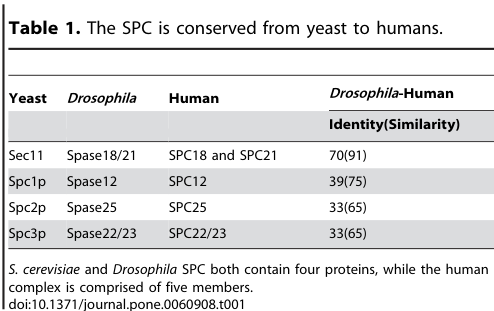

## Question

# Gene Research for Functional Annotation

## ⚠️ CRITICAL: Gene/Protein Identification Context

**BEFORE YOU BEGIN RESEARCH:** You MUST verify you are researching the CORRECT gene/protein. Gene symbols can be ambiguous, especially for less well-characterized genes from non-model organisms.

### Target Gene/Protein Identity (from UniProt):
- **UniProt Accession:** Q9VAL0
- **Protein Description:** RecName: Full=Signal peptidase complex subunit 1; AltName: Full=Microsomal signal peptidase 12 kDa subunit; Short=SPase 12 kDa subunit;
- **Gene Information:** Name=Spase12; ORFNames=CG11500;
- **Organism (full):** Drosophila melanogaster (Fruit fly).
- **Protein Family:** Belongs to the SPCS1 family. .
- **Key Domains:** Spc1/SPCS1. (IPR009542); SPC12 (PF06645)

### MANDATORY VERIFICATION STEPS:

1. **Check if the gene symbol "Spase12" matches the protein description above**
2. **Verify the organism is correct:** Drosophila melanogaster (Fruit fly).
3. **Check if protein family/domains align with what you find in literature**
4. **If you find literature for a DIFFERENT gene with the same or similar symbol, STOP**

### If Gene Symbol is Ambiguous or You Cannot Find Relevant Literature:

**DO NOT PROCEED WITH RESEARCH ON A DIFFERENT GENE.** Instead:
- State clearly: "The gene symbol 'Spase12' is ambiguous or literature is limited for this specific protein"
- Explain what you found (e.g., "Found extensive literature on a different gene with the same symbol in a different organism")
- Describe the protein based ONLY on the UniProt information provided above
- Suggest that the protein function can be inferred from domain/family information

### Research Target:

Please provide a comprehensive research report on the gene **Spase12** (gene ID: Spase12, UniProt: Q9VAL0) in DROME.

The research report should be a detailed narrative explaining the function, biological processes, and localization of the gene product. Citations should be given for all claims.

You should prioritize authoritative reviews and primary scientific literature when conducting research. You can supplement
this with annotations you find in gene/protein databases, but these can be outdated or inaccurate.

We are specifically interested in the primary function of the gene - for enzymes, what reaction is catalyzed, and what is the substrate specificity? For transporters, what is the substrate? For structural proteins or adapters, what is the broader structural role? For signaling molecules, what is the role in the pathway.

We are interested in where in or outside the cell the gene product carries out its function.

We are also interested in the signaling or biochemical pathways in which the gene functions. We are less interested in broad pleiotropic effects, except where these elucidate the precise role.

Include evidence where possible. We are interested in both experimental evidence as well as inference from structure, evolution, or bioinformatic analysis. Precise studies should be prioritized over high-throughput, where available.

## Output

Question: You are an expert researcher providing comprehensive, well-cited information.

Provide detailed information focusing on:
1. Key concepts and definitions with current understanding
2. Recent developments and latest research (prioritize 2023-2024 sources)
3. Current applications and real-world implementations
4. Expert opinions and analysis from authoritative sources
5. Relevant statistics and data from recent studies

Format as a comprehensive research report with proper citations. Include URLs and publication dates where available.
Always prioritize recent, authoritative sources and provide specific citations for all major claims.

# Gene Research for Functional Annotation

## ⚠️ CRITICAL: Gene/Protein Identification Context

**BEFORE YOU BEGIN RESEARCH:** You MUST verify you are researching the CORRECT gene/protein. Gene symbols can be ambiguous, especially for less well-characterized genes from non-model organisms.

### Target Gene/Protein Identity (from UniProt):
- **UniProt Accession:** Q9VAL0
- **Protein Description:** RecName: Full=Signal peptidase complex subunit 1; AltName: Full=Microsomal signal peptidase 12 kDa subunit; Short=SPase 12 kDa subunit;
- **Gene Information:** Name=Spase12; ORFNames=CG11500;
- **Organism (full):** Drosophila melanogaster (Fruit fly).
- **Protein Family:** Belongs to the SPCS1 family. .
- **Key Domains:** Spc1/SPCS1. (IPR009542); SPC12 (PF06645)

### MANDATORY VERIFICATION STEPS:

1. **Check if the gene symbol "Spase12" matches the protein description above**
2. **Verify the organism is correct:** Drosophila melanogaster (Fruit fly).
3. **Check if protein family/domains align with what you find in literature**
4. **If you find literature for a DIFFERENT gene with the same or similar symbol, STOP**

### If Gene Symbol is Ambiguous or You Cannot Find Relevant Literature:

**DO NOT PROCEED WITH RESEARCH ON A DIFFERENT GENE.** Instead:
- State clearly: "The gene symbol 'Spase12' is ambiguous or literature is limited for this specific protein"
- Explain what you found (e.g., "Found extensive literature on a different gene with the same symbol in a different organism")
- Describe the protein based ONLY on the UniProt information provided above
- Suggest that the protein function can be inferred from domain/family information

### Research Target:

Please provide a comprehensive research report on the gene **Spase12** (gene ID: Spase12, UniProt: Q9VAL0) in DROME.

The research report should be a detailed narrative explaining the function, biological processes, and localization of the gene product. Citations should be given for all claims.

You should prioritize authoritative reviews and primary scientific literature when conducting research. You can supplement
this with annotations you find in gene/protein databases, but these can be outdated or inaccurate.

We are specifically interested in the primary function of the gene - for enzymes, what reaction is catalyzed, and what is the substrate specificity? For transporters, what is the substrate? For structural proteins or adapters, what is the broader structural role? For signaling molecules, what is the role in the pathway.

We are interested in where in or outside the cell the gene product carries out its function.

We are also interested in the signaling or biochemical pathways in which the gene functions. We are less interested in broad pleiotropic effects, except where these elucidate the precise role.

Include evidence where possible. We are interested in both experimental evidence as well as inference from structure, evolution, or bioinformatic analysis. Precise studies should be prioritized over high-throughput, where available.

# Functional annotation of *Drosophila melanogaster* Spase12

## Identity and evidence boundary

The target specified by UniProt accession **Q9VAL0** is **Spase12** (ORF **CG11500**), described in the supplied UniProt record as signal peptidase complex subunit 1, with Spc1/SPCS1 (IPR009542) and SPC12 (PF06645) family assignments. Independent fly research identifies Spase12 as the counterpart of yeast **Spc1** and human **SPC12/SPCS1**, distinct from fly Spase25 (the Spc2/SPCS2 counterpart) and from the catalytic Spase18/21 subunit. Gilbert and colleagues reported **39% sequence identity and 75% similarity** between fly Spase12 and human SPC12. The accession and ORF designation come from the supplied UniProt information; the cited comparison independently verifies the relevant protein family and organism. Spase12 should **not** be confused with signal peptide peptidase (SPP), a different protease. (gilbert2013drosophilasignalpeptidase pages 1-2, gilbert2013drosophilasignalpeptidase pages 2-3, gilbert2013drosophilasignalpeptidase media 1b5d23de)

The literature on **fly Spase12 itself is limited**. Its requirement for development is directly established, but its precise biochemical clients and subcellular distribution have not been established by the fly experiments reviewed here. The strongest molecular explanations therefore combine fly genetics with explicitly identified yeast and human ortholog studies. (gilbert2013drosophilasignalpeptidase pages 5-7, liaci2021structureofthe pages 3-4)

## Primary molecular function and site of action

**Spase12 is a noncatalytic, membrane-integral accessory subunit of the endoplasmic-reticulum (ER) signal peptidase complex (SPC).** The fly complex was described as containing Spase12, Spase25, Spase22/23 and Spase18/21. As nascent secretory proteins and certain membrane proteins enter the ER, the *complex* hydrolyzes an appropriate N-terminal signal peptide, producing a mature protein and a detached signal peptide. This is the relevant biochemical reaction; **Spase12 itself has no established catalytic reaction or autonomous substrate specificity**. The conserved SEC11-family protein—fly Spase18/21, corresponding to mammalian SEC11A/SEC11C—houses the proteolytic active site, stabilized by the Spase22/23/SPCS3 counterpart. Mutagenesis and structural analysis of human SEC11 support a Ser–His–Asp catalytic triad. (gilbert2013drosophilasignalpeptidase pages 1-2, liaci2021structureofthe pages 1-3, liaci2021structureofthe pages 3-4, liaci2021structureofthe pages 4-5)

**Localization is strongly inferred to be the ER membrane, not directly imaged for fly Spase12 in the cited fly study.** Conserved SPC12-family topology comprises two membrane-spanning segments, a small ER-luminal connection and termini exposed to the cytosol. Human cryo-electron microscopy places SPC12/SPCS1 on one side of a lipid-filled transmembrane window; with SPC25/SPCS2, it forms a cytosolic clamp that orients other subunits. SPC12 does not directly contact catalytic SEC11. The cleavage site lies at the lumen-facing membrane interface. These observations provide a structural basis for assigning fly Spase12 an **architectural and substrate-selection role at the ER**, rather than placing its action in the extracellular space or claiming that it is a soluble cytosolic enzyme. (gilbert2013drosophilasignalpeptidase pages 1-2, liaci2021structureofthe pages 3-4, liaci2021structureofthe pages 4-5)

**Substrate class, rather than a Spase12-specific cleavage sequence, is known.** Cleavable signal peptides generally have a positively charged amino-terminal region, a relatively short hydrophobic core and a more polar cleavage-site region, often with small uncharged residues at positions −3 and −1. They must be distinguished from longer hydrophobic signal anchors and transmembrane helices, which ordinarily remain part of a membrane protein. Human SPC structural work reports signal-peptide hydrophobic cores of approximately **7–15 residues** and a membrane window that locally thins the lipid bilayer, offering a physical explanation for this distinction. Purified human SEC11A- and SEC11C-containing complexes both cleaved a pre-β-lactamase test substrate *in vitro*; that assay does not identify a fly Spase12-dependent substrate. (liaci2021structureofthe pages 1-3, liaci2021structureofthe pages 3-4)

Yeast experiments sharpen the proposed function of the **Spc1/Spase12 family**: loss of Spc1 increased inappropriate cleavage of signal-anchor or transmembrane segments in engineered substrates, whereas Spc1 overexpression reduced processing of model transmembrane segments. Co-immunoprecipitation with proteins bearing uncleaved anchors supported a substrate-shielding or selection mechanism. These are **ortholog-derived hypotheses for fly Spase12**, not demonstrated fly cleavage phenotypes. The accessible detailed version of the Yim study is a February 2021 bioRxiv preprint; the 2024 *Journal of Cell Biology* article independently describes its principal yeast Spc1 finding. (yim2021spc1regulatessubstrate pages 1-5, chung2024spc2modulatessubstrate pages 1-2)

## Biological process and direct *Drosophila* evidence

Spase12's best-supported biological process is **ER entry and maturation of secretory-pathway proteins**, enabling normal development of tissues that depend on properly processed secreted and membrane-associated proteins. In the key fly study, three recessive loss-of-function alleles were embryonic lethal. Somatic mutant clones disrupted eye, wing, leg, head and antennal development. Rescue by a genomic *spase12* construct, precise reversal of a transposon insertion and ubiquitous *spase12* expression strengthened the attribution to this gene, particularly because one deletion also affected neighboring genes. Some null-mutant cells nevertheless remained viable and differentiated: this is consistent with an important but **nonessential-for-every-cleavage-event accessory function**, not evidence that Spase12 is the SPC catalytic subunit. (gilbert2013drosophilasignalpeptidase pages 5-5, gilbert2013drosophilasignalpeptidase pages 1-2, gilbert2013drosophilasignalpeptidase pages 2-3)

In the eye, mutant tissue showed disordered ommatidia, abnormal photoreceptor-associated rhabdomere number or polarity, misplaced or excess bristles and pigment cells, and increased apoptosis. Melanotic masses appeared in approximately **15% of mosaic eyes**; severe abnormalities were reported in roughly **10% of larval eye discs**, whereas strong disruption of pupal differentiation was described as fully penetrant in the examined clones. Melanization was restricted to affected tissue. These are informative organismal consequences, but they do **not** establish direct participation of Spase12 in an innate-immune signaling cascade: tissue degeneration could account for a secondary melanotic response. (gilbert2013drosophilasignalpeptidase pages 5-5, gilbert2013drosophilasignalpeptidase pages 3-5, gilbert2013drosophilasignalpeptidase pages 5-7)

The specific signaling proteins responsible for those phenotypes remain unidentified. Earlier fly microsome experiments cited by Gilbert and colleagues support SPC-dependent processing of candidate fly proteins such as **vitellogenins and Crumbs**, but do not show that their cleavage specifically requires Spase12. In *spase12*-mutant eye tissue, immunostaining detected no change in abundance of Crumbs, DE-Cadherin, Fasciclin 2, Notch or Delta. Although the eye phenotype resembles defects in Notch-dependent differentiation, reducing one copy of *Notch* did not exacerbate the tested *spase12* phenotype. Accordingly, involvement of **Notch, Hedgehog, Dpp or EGFR signaling through a particular Spase12 substrate is a possibility, not an established pathway assignment**; unchanged staining also cannot exclude altered processing or activity. (gilbert2013drosophilasignalpeptidase pages 5-5, gilbert2013drosophilasignalpeptidase pages 5-7)

The evidence grades for the principal annotations are summarized below. The table separates fly experiments from mechanisms established in other organisms. (gilbert2013drosophilasignalpeptidase pages 2-3, liaci2021structureofthe pages 3-4)

| Finding | Organism / evidence | Interpretation for fly Spase12 | Source URL (year) |
|---|---|---|---|
| **Direct fly evidence:** three recessive loss-of-function alleles were embryonic lethal; a 29-kb genomic construct, precise transposon excision, and ubiquitous UAS-*spase12* expression rescued the relevant phenotypes or lethality. | *Drosophila melanogaster*; genetic loss-of-function, complementation, and rescue experiments. (gilbert2013drosophilasignalpeptidase pages 2-3) | **High-confidence fly-specific conclusion:** *Spase12* is required for normal viability and development. The rescues attribute the phenotype to *Spase12*, despite the locus overlapping/neighboring other genes. | [Gilbert et al., PLOS ONE](https://doi.org/10.1371/journal.pone.0060908) (2013) |
| **Direct fly evidence:** melanotic masses occurred in approximately 15% of mosaic eyes, alongside apoptosis, retinal degeneration, and differentiation defects. | *D. melanogaster*; somatic mosaic analysis, histology, immunostaining, and microscopy. (gilbert2013drosophilasignalpeptidase pages 3-5, gilbert2013drosophilasignalpeptidase pages 5-7) | Loss of *Spase12* can provoke tissue-autonomous degeneration followed by melanization. This does **not** establish a direct biochemical role in immune signaling. | [Gilbert et al., PLOS ONE](https://doi.org/10.1371/journal.pone.0060908) (2013) |
| **Identity and topology:** fly Spase12 is the homolog of yeast Spc1 and human SPC12/SPCS1; the reported fly–human comparison was 39% identity and 75% similarity. SPC12-family proteins are predicted double-pass ER-membrane proteins with cytosolic termini and a small luminal segment. | Comparative sequence analysis and topology inferred from conserved mammalian SPC architecture; no direct imaging of fly Spase12 localization. (gilbert2013drosophilasignalpeptidase pages 1-2, gilbert2013drosophilasignalpeptidase pages 2-3, gilbert2013drosophilasignalpeptidase media 1b5d23de) | **ER localization is strongly inferred, not directly demonstrated in flies.** Spase12 should be annotated as an ER-membrane SPC accessory subunit, not as a freely soluble or independently catalytic peptidase. | [Gilbert et al., PLOS ONE](https://doi.org/10.1371/journal.pone.0060908) (2013) |
| **Conserved accessory architecture:** human SPC12/SPCS1 and SPC25 form a cytosolic clamp and help frame a lipid-filled transmembrane window that locally thins the ER membrane; SPC12 does not contact catalytic SEC11 directly. | Human SPC; cryo-EM (~4.9 Å), structural proteomics, native/cross-linking MS, molecular dynamics, and in-vitro SPC cleavage. (liaci2021structureofthe pages 3-4, liaci2021structureofthe pages 4-5) | Provides a strong structural model for fly Spase12 because the family is conserved, but the exact fly complex has not been structurally solved. Catalysis resides in the Sec11-family subunit, **not Spase12 itself**. | [Liaci et al., Molecular Cell](https://doi.org/10.1016/j.molcel.2021.07.031) (2021) |
| **Substrate discrimination:** deleting yeast Spc1 increased inappropriate cleavage of signal-anchor or transmembrane segments; overexpression reduced such cleavage, and Spc1 co-immunoprecipitated with proteins bearing uncleaved membrane anchors. | *Saccharomyces cerevisiae*; engineered carboxypeptidase-Y substrates, membrane-protein models, mutagenesis, and co-immunoprecipitation; cited search version is a non-peer-reviewed preprint. (yim2021spc1regulatessubstrate pages 1-5) | Supports the hypothesis that fly Spase12 shields bona fide transmembrane segments and improves SPC substrate selection. This molecular mechanism remains **ortholog-based inference**, not directly tested in flies. | [Yim et al., bioRxiv](https://doi.org/10.1101/2021.02.02.429376) (2021 preprint) |
| **Membrane-protein quality control:** human SPCS1 is required for noncanonical cleavage at cryptic sites exposed by misfolding or failed complex assembly; SPC cleavage cooperates with ER-associated degradation. About 1,500 candidate human membrane proteins were predicted, and several substrates were experimentally validated. | Human cells; computational proteome screen, SPCS1 knockout/rescue, pulse–chase and biochemical assays; peer-reviewed *Science* study. (zanotti2022thehumansignal pages 1-8, zanotti2022thehumansignal pages 8-12) | Suggests a plausible conserved quality-control function for fly Spase12, potentially linking its loss to ER stress and cell death. Cryptic cleavage and ERAD cooperation have **not been demonstrated for fly Spase12**. | [Zanotti et al., Science](https://doi.org/10.1126/science.abo5672) (2022) |
| **Distinct accessory-subunit function:** deleting or mutating yeast Spc2 altered substrate and cleavage-site selection and reduced membrane thinning; Spc1 overexpression did not rescue the Spc2-null phenotype. | *S. cerevisiae*; pulse labeling, engineered and natural signal sequences, quantitative proteomics, mutagenesis, and molecular dynamics. (chung2024spc2modulatessubstrate pages 1-2, chung2024spc2modulatessubstrate pages 2-3) | Prevents a nomenclature error: Spase12 corresponds to **Spc1/SPCS1**, whereas fly Spase25 corresponds to **Spc2/SPCS2**. The 2024 Spc2 mechanism must not be assigned to Spase12. | [Chung et al., Journal of Cell Biology](https://doi.org/10.1083/jcb.202211035) (2024) |

*Table: Evidence distinguishing direct Drosophila findings from mechanistic inference based on yeast and human orthologs. Spase12 is consistently treated as a noncatalytic SPC accessory subunit rather than an autonomous peptidase.*

## Recent developments and applications

A major extension of the SPC model came from **human cells**, where Zanotti and colleagues found that the complex also cleaves certain **misfolded or unassembled membrane proteins at otherwise concealed sites**. Their analysis nominated approximately **1,500 human membrane proteins** with candidate cryptic sites and examined substrates including connexins, PMP22, iRhom2 and Hrd1. Human **SPCS1** was important for this noncanonical recognition, and cleavage cooperated with ER-associated degradation (ERAD). This offers a plausible route from impaired SPC quality control to tissue stress or cell death in flies, but **cryptic-site cleavage and ERAD cooperation have not been shown for fly Spase12**. The peer-reviewed report appeared in *Science* in **December 2022**; a related **2023** dissertation contains additional experimental details and should not be treated as a separate independent replication. (zanotti2022thehumansignal pages 1-8, zanotti2022thehumansignal pages 8-12)

The relevant **2024** mechanistic advance specifically concerns **yeast Spc2**, *not* Spc1/Spase12. Chung and colleagues showed that loss or mutation of Spc2 changes both substrate discrimination and cleavage-site choice; modeling linked its absence to reduced membrane thinning. Spc1 overexpression did not rescue the Spc2-deletion phenotype. This supports a current view of the SPC as a coordinated but **functionally differentiated set of accessory subunits** and prevents assigning Spc2's demonstrated activities directly to fly Spase12. (chung2024spc2modulatessubstrate pages 1-2, chung2024spc2modulatessubstrate pages 2-3)

A **June 2024** review describes practical interest in SPC as a host factor for flaviviruses: in mammalian infection systems, SPCS1 loss impairs processing at several viral polyprotein junctions, making the ER SPC a proposed antiviral target. This is a **real-world research application of the human complex**, not evidence that fly Spase12 processes the same viral proteins or that targeting Spase12 is an established therapy. Conversely, *Drosophila spase12* mutants provide an experimentally implemented **in-vivo model** for testing how defective ER protein maturation affects differentiation and tissue integrity. (verhaegen2024theendoplasmicreticulum pages 4-5, gilbert2013drosophilasignalpeptidase pages 2-3)

## Conclusion and source details

**Recommended functional annotation:** *Spase12/CG11500 (Q9VAL0) is the conserved, noncatalytic Spc1/SPCS1-family subunit of the ER-membrane signal peptidase complex. It supports signal-peptide processing and appropriate handling of secretory-pathway substrates, and is essential for normal fly development.* An ER-membrane accessory/substrate-discrimination role is well supported by orthology and structural biology; individual fly substrates, a direct fly localization experiment and specific downstream signaling pathways remain unresolved. (gilbert2013drosophilasignalpeptidase pages 1-2, liaci2021structureofthe pages 3-4, gilbert2013drosophilasignalpeptidase pages 2-3, gilbert2013drosophilasignalpeptidase pages 5-7)

**Principal publications:** Gilbert *et al.*, *PLOS ONE*, **3 April 2013**, https://doi.org/10.1371/journal.pone.0060908; Liaci *et al.*, *Molecular Cell*, **7 October 2021**, https://doi.org/10.1016/j.molcel.2021.07.031; Yim *et al.*, **2 February 2021 preprint**, https://doi.org/10.1101/2021.02.02.429376; Zanotti *et al.*, *Science*, **December 2022**, https://doi.org/10.1126/science.abo5672; Chung *et al.*, *Journal of Cell Biology*, **2024**, https://doi.org/10.1083/jcb.202211035; and Verhaegen & Vermeire, *npj Viruses*, **June 2024**, https://doi.org/10.1038/s44298-024-00031-7. (gilbert2013drosophilasignalpeptidase pages 1-2, liaci2021structureofthe pages 1-3, yim2021spc1regulatessubstrate pages 1-5, zanotti2022thehumansignal pages 1-8, chung2024spc2modulatessubstrate pages 1-2, verhaegen2024theendoplasmicreticulum pages 4-5)

References

1. (gilbert2013drosophilasignalpeptidase pages 1-2): Erin Haase Gilbert, Su-Jin Kwak, Rui Chen, and Graeme Mardon. Drosophila signal peptidase complex member spase12 is required for development and cell differentiation. PLoS ONE, 8:e60908, Apr 2013. URL: https://doi.org/10.1371/journal.pone.0060908, doi:10.1371/journal.pone.0060908. This article has 23 citations and is from a peer-reviewed journal.

2. (gilbert2013drosophilasignalpeptidase pages 2-3): Erin Haase Gilbert, Su-Jin Kwak, Rui Chen, and Graeme Mardon. Drosophila signal peptidase complex member spase12 is required for development and cell differentiation. PLoS ONE, 8:e60908, Apr 2013. URL: https://doi.org/10.1371/journal.pone.0060908, doi:10.1371/journal.pone.0060908. This article has 23 citations and is from a peer-reviewed journal.

3. (gilbert2013drosophilasignalpeptidase media 1b5d23de): Erin Haase Gilbert, Su-Jin Kwak, Rui Chen, and Graeme Mardon. Drosophila signal peptidase complex member spase12 is required for development and cell differentiation. PLoS ONE, 8:e60908, Apr 2013. URL: https://doi.org/10.1371/journal.pone.0060908, doi:10.1371/journal.pone.0060908. This article has 23 citations and is from a peer-reviewed journal.

4. (gilbert2013drosophilasignalpeptidase pages 5-7): Erin Haase Gilbert, Su-Jin Kwak, Rui Chen, and Graeme Mardon. Drosophila signal peptidase complex member spase12 is required for development and cell differentiation. PLoS ONE, 8:e60908, Apr 2013. URL: https://doi.org/10.1371/journal.pone.0060908, doi:10.1371/journal.pone.0060908. This article has 23 citations and is from a peer-reviewed journal.

5. (liaci2021structureofthe pages 3-4): A. Manuel Liaci, Barbara Steigenberger, Sem Tamara, Paulo Cesar Telles de Souza, Mariska Gröllers-Mulderij, Patrick Ogrissek, Siewert Jan Marrink, Richard Scheltema, and Friedrich Förster. Structure of the human signal peptidase complex reveals the determinants for signal peptide cleavage. SSRN Electronic Journal, Jan 2021. URL: https://doi.org/10.2139/ssrn.3778304, doi:10.2139/ssrn.3778304. This article has 163 citations.

6. (liaci2021structureofthe pages 1-3): A. Manuel Liaci, Barbara Steigenberger, Sem Tamara, Paulo Cesar Telles de Souza, Mariska Gröllers-Mulderij, Patrick Ogrissek, Siewert Jan Marrink, Richard Scheltema, and Friedrich Förster. Structure of the human signal peptidase complex reveals the determinants for signal peptide cleavage. SSRN Electronic Journal, Jan 2021. URL: https://doi.org/10.2139/ssrn.3778304, doi:10.2139/ssrn.3778304. This article has 163 citations.

7. (liaci2021structureofthe pages 4-5): A. Manuel Liaci, Barbara Steigenberger, Sem Tamara, Paulo Cesar Telles de Souza, Mariska Gröllers-Mulderij, Patrick Ogrissek, Siewert Jan Marrink, Richard Scheltema, and Friedrich Förster. Structure of the human signal peptidase complex reveals the determinants for signal peptide cleavage. SSRN Electronic Journal, Jan 2021. URL: https://doi.org/10.2139/ssrn.3778304, doi:10.2139/ssrn.3778304. This article has 163 citations.

8. (yim2021spc1regulatessubstrate pages 1-5): Chewon Yim, Yeonji Chung, Jeesoo Kim, IngMarie Nilsson, Jong-Seo Kim, and Hyun Kim. Spc1 regulates substrate selection for signal peptidase. bioRxiv, Feb 2021. URL: https://doi.org/10.1101/2021.02.02.429376, doi:10.1101/2021.02.02.429376. This article has 0 citations.

9. (chung2024spc2modulatessubstrate pages 1-2): Yeonji Chung, Chewon Yim, Gilberto P. Pereira, Sungjoon Son, Lisbeth R. Kjølbye, Lauren E. Mazurkiewicz, Amy M. Weeks, Friedrich Förster, Gunnar von Heijne, Paulo C.T. Souza, and Hyun Kim. Spc2 modulates substrate- and cleavage site-selection in the yeast signal peptidase complex. Journal of Cell Biology, Nov 2024. URL: https://doi.org/10.1083/jcb.202211035, doi:10.1083/jcb.202211035. This article has 8 citations and is from a highest quality peer-reviewed journal.

10. (gilbert2013drosophilasignalpeptidase pages 5-5): Erin Haase Gilbert, Su-Jin Kwak, Rui Chen, and Graeme Mardon. Drosophila signal peptidase complex member spase12 is required for development and cell differentiation. PLoS ONE, 8:e60908, Apr 2013. URL: https://doi.org/10.1371/journal.pone.0060908, doi:10.1371/journal.pone.0060908. This article has 23 citations and is from a peer-reviewed journal.

11. (gilbert2013drosophilasignalpeptidase pages 3-5): Erin Haase Gilbert, Su-Jin Kwak, Rui Chen, and Graeme Mardon. Drosophila signal peptidase complex member spase12 is required for development and cell differentiation. PLoS ONE, 8:e60908, Apr 2013. URL: https://doi.org/10.1371/journal.pone.0060908, doi:10.1371/journal.pone.0060908. This article has 23 citations and is from a peer-reviewed journal.

12. (zanotti2022thehumansignal pages 1-8): Andrea Zanotti, João P. L. Coelho, Dinah Kaylani, Gurdeep Singh, Marina Tauber, Manuel Hitzenberger, Dönem Avci, Martin Zacharias, Robert B. Russell, Marius K. Lemberg, and Matthias J. Feige. The human signal peptidase complex acts as a quality control enzyme for membrane proteins. Science, 378:996-1000, Dec 2022. URL: https://doi.org/10.1126/science.abo5672, doi:10.1126/science.abo5672. This article has 44 citations and is from a highest quality peer-reviewed journal.

13. (zanotti2022thehumansignal pages 8-12): Andrea Zanotti, João P. L. Coelho, Dinah Kaylani, Gurdeep Singh, Marina Tauber, Manuel Hitzenberger, Dönem Avci, Martin Zacharias, Robert B. Russell, Marius K. Lemberg, and Matthias J. Feige. The human signal peptidase complex acts as a quality control enzyme for membrane proteins. Science, 378:996-1000, Dec 2022. URL: https://doi.org/10.1126/science.abo5672, doi:10.1126/science.abo5672. This article has 44 citations and is from a highest quality peer-reviewed journal.

14. (chung2024spc2modulatessubstrate pages 2-3): Yeonji Chung, Chewon Yim, Gilberto P. Pereira, Sungjoon Son, Lisbeth R. Kjølbye, Lauren E. Mazurkiewicz, Amy M. Weeks, Friedrich Förster, Gunnar von Heijne, Paulo C.T. Souza, and Hyun Kim. Spc2 modulates substrate- and cleavage site-selection in the yeast signal peptidase complex. Journal of Cell Biology, Nov 2024. URL: https://doi.org/10.1083/jcb.202211035, doi:10.1083/jcb.202211035. This article has 8 citations and is from a highest quality peer-reviewed journal.

15. (verhaegen2024theendoplasmicreticulum pages 4-5): Marijke Verhaegen and Kurt Vermeire. The endoplasmic reticulum (er): a crucial cellular hub in flavivirus infection and potential target site for antiviral interventions. npj Viruses, Jun 2024. URL: https://doi.org/10.1038/s44298-024-00031-7, doi:10.1038/s44298-024-00031-7. This article has 48 citations.

## Artifacts

- [Edison artifact artifact-00](Spase12-deep-research-falcon_artifacts/artifact-00.md)

## Citations

1. gilbert2013drosophilasignalpeptidase pages 2-3
2. gilbert2013drosophilasignalpeptidase pages 1-2
3. gilbert2013drosophilasignalpeptidase pages 5-7
4. liaci2021structureofthe pages 3-4
5. liaci2021structureofthe pages 1-3
6. liaci2021structureofthe pages 4-5
7. gilbert2013drosophilasignalpeptidase pages 5-5
8. gilbert2013drosophilasignalpeptidase pages 3-5
9. zanotti2022thehumansignal pages 1-8
10. zanotti2022thehumansignal pages 8-12
11. verhaegen2024theendoplasmicreticulum pages 4-5
12. Gilbert et al., PLOS ONE
13. Liaci et al., Molecular Cell
14. Yim et al., bioRxiv
15. Zanotti et al., Science
16. Chung et al., Journal of Cell Biology
17. https://doi.org/10.1371/journal.pone.0060908
18. https://doi.org/10.1016/j.molcel.2021.07.031
19. https://doi.org/10.1101/2021.02.02.429376
20. https://doi.org/10.1126/science.abo5672
21. https://doi.org/10.1083/jcb.202211035
22. https://doi.org/10.1371/journal.pone.0060908;
23. https://doi.org/10.1016/j.molcel.2021.07.031;
24. https://doi.org/10.1101/2021.02.02.429376;
25. https://doi.org/10.1126/science.abo5672;
26. https://doi.org/10.1083/jcb.202211035;
27. https://doi.org/10.1038/s44298-024-00031-7.
28. https://doi.org/10.1371/journal.pone.0060908,
29. https://doi.org/10.2139/ssrn.3778304,
30. https://doi.org/10.1101/2021.02.02.429376,
31. https://doi.org/10.1083/jcb.202211035,
32. https://doi.org/10.1126/science.abo5672,
33. https://doi.org/10.1038/s44298-024-00031-7,