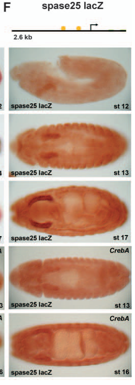

## Question

# Gene Research for Functional Annotation

## ⚠️ CRITICAL: Gene/Protein Identification Context

**BEFORE YOU BEGIN RESEARCH:** You MUST verify you are researching the CORRECT gene/protein. Gene symbols can be ambiguous, especially for less well-characterized genes from non-model organisms.

### Target Gene/Protein Identity (from UniProt):
- **UniProt Accession:** Q9VYY2
- **Protein Description:** RecName: Full=Signal peptidase complex subunit 2; AltName: Full=Microsomal signal peptidase 25 kDa subunit; Short=SPase 25 kDa subunit;
- **Gene Information:** Name=Spase25; ORFNames=CG1751;
- **Organism (full):** Drosophila melanogaster (Fruit fly).
- **Protein Family:** Belongs to the SPCS2 family. .
- **Key Domains:** Spc2/SPCS2. (IPR009582); SPC25 (PF06703)

### MANDATORY VERIFICATION STEPS:

1. **Check if the gene symbol "Spase25" matches the protein description above**
2. **Verify the organism is correct:** Drosophila melanogaster (Fruit fly).
3. **Check if protein family/domains align with what you find in literature**
4. **If you find literature for a DIFFERENT gene with the same or similar symbol, STOP**

### If Gene Symbol is Ambiguous or You Cannot Find Relevant Literature:

**DO NOT PROCEED WITH RESEARCH ON A DIFFERENT GENE.** Instead:
- State clearly: "The gene symbol 'Spase25' is ambiguous or literature is limited for this specific protein"
- Explain what you found (e.g., "Found extensive literature on a different gene with the same symbol in a different organism")
- Describe the protein based ONLY on the UniProt information provided above
- Suggest that the protein function can be inferred from domain/family information

### Research Target:

Please provide a comprehensive research report on the gene **Spase25** (gene ID: Spase25, UniProt: Q9VYY2) in DROME.

The research report should be a detailed narrative explaining the function, biological processes, and localization of the gene product. Citations should be given for all claims.

You should prioritize authoritative reviews and primary scientific literature when conducting research. You can supplement
this with annotations you find in gene/protein databases, but these can be outdated or inaccurate.

We are specifically interested in the primary function of the gene - for enzymes, what reaction is catalyzed, and what is the substrate specificity? For transporters, what is the substrate? For structural proteins or adapters, what is the broader structural role? For signaling molecules, what is the role in the pathway.

We are interested in where in or outside the cell the gene product carries out its function.

We are also interested in the signaling or biochemical pathways in which the gene functions. We are less interested in broad pleiotropic effects, except where these elucidate the precise role.

Include evidence where possible. We are interested in both experimental evidence as well as inference from structure, evolution, or bioinformatic analysis. Precise studies should be prioritized over high-throughput, where available.

## Output

Question: You are an expert researcher providing comprehensive, well-cited information.

Provide detailed information focusing on:
1. Key concepts and definitions with current understanding
2. Recent developments and latest research (prioritize 2023-2024 sources)
3. Current applications and real-world implementations
4. Expert opinions and analysis from authoritative sources
5. Relevant statistics and data from recent studies

Format as a comprehensive research report with proper citations. Include URLs and publication dates where available.
Always prioritize recent, authoritative sources and provide specific citations for all major claims.

# Gene Research for Functional Annotation

## ⚠️ CRITICAL: Gene/Protein Identification Context

**BEFORE YOU BEGIN RESEARCH:** You MUST verify you are researching the CORRECT gene/protein. Gene symbols can be ambiguous, especially for less well-characterized genes from non-model organisms.

### Target Gene/Protein Identity (from UniProt):
- **UniProt Accession:** Q9VYY2
- **Protein Description:** RecName: Full=Signal peptidase complex subunit 2; AltName: Full=Microsomal signal peptidase 25 kDa subunit; Short=SPase 25 kDa subunit;
- **Gene Information:** Name=Spase25; ORFNames=CG1751;
- **Organism (full):** Drosophila melanogaster (Fruit fly).
- **Protein Family:** Belongs to the SPCS2 family. .
- **Key Domains:** Spc2/SPCS2. (IPR009582); SPC25 (PF06703)

### MANDATORY VERIFICATION STEPS:

1. **Check if the gene symbol "Spase25" matches the protein description above**
2. **Verify the organism is correct:** Drosophila melanogaster (Fruit fly).
3. **Check if protein family/domains align with what you find in literature**
4. **If you find literature for a DIFFERENT gene with the same or similar symbol, STOP**

### If Gene Symbol is Ambiguous or You Cannot Find Relevant Literature:

**DO NOT PROCEED WITH RESEARCH ON A DIFFERENT GENE.** Instead:
- State clearly: "The gene symbol 'Spase25' is ambiguous or literature is limited for this specific protein"
- Explain what you found (e.g., "Found extensive literature on a different gene with the same symbol in a different organism")
- Describe the protein based ONLY on the UniProt information provided above
- Suggest that the protein function can be inferred from domain/family information

### Research Target:

Please provide a comprehensive research report on the gene **Spase25** (gene ID: Spase25, UniProt: Q9VYY2) in DROME.

The research report should be a detailed narrative explaining the function, biological processes, and localization of the gene product. Citations should be given for all claims.

You should prioritize authoritative reviews and primary scientific literature when conducting research. You can supplement
this with annotations you find in gene/protein databases, but these can be outdated or inaccurate.

We are specifically interested in the primary function of the gene - for enzymes, what reaction is catalyzed, and what is the substrate specificity? For transporters, what is the substrate? For structural proteins or adapters, what is the broader structural role? For signaling molecules, what is the role in the pathway.

We are interested in where in or outside the cell the gene product carries out its function.

We are also interested in the signaling or biochemical pathways in which the gene functions. We are less interested in broad pleiotropic effects, except where these elucidate the precise role.

Include evidence where possible. We are interested in both experimental evidence as well as inference from structure, evolution, or bioinformatic analysis. Precise studies should be prioritized over high-throughput, where available.

# Functional annotation report: *Drosophila melanogaster* Spase25

## Identity and confidence

**Spase25 is the fruit-fly signal peptidase complex (SPC) 25-kDa subunit, encoded by CG1751.** A Drosophila primary study explicitly identifies CG1751 as the “SPase 25-subunit”; another lists Spase25 among the four fly SPC components and relates the 25-kDa subunit to yeast Spc2. The supplied UniProt accession **Q9VYY2** and Spc2/SPCS2-family domains (InterPro IPR009582; Pfam PF06703) are consistent with this identification, although the accession and domain assignments themselves were not independently tested in those studies. This report does **not** concern Spase12/CG11500, a different fly SPC subunit, or the unrelated kinetochore protein sometimes called SPC25. (abrams2005crebaregulatessecretory pages 5-7, gilbert2013drosophilasignalpeptidase pages 1-2)

**Principal conclusion:** Spase25 is best annotated as a **noncatalytic, ER-membrane accessory subunit that helps the SPC recognize and correctly cleave signal peptides** during entry of secretory and membrane proteins into the early secretory pathway. Membership in the fly complex is supported by comparative identification; the detailed structural and substrate-selectivity mechanism is inferred chiefly from human SPCS2 and yeast Spc2, not yet established experimentally for fly Spase25 itself. (gilbert2013drosophilasignalpeptidase pages 1-2, chung2024spc2modulatessubstrate pages 1-2, liaci2021structureofthe pages 3-4, liaci2021structureofthe pages 4-5)

## Molecular function and substrate specificity

The SPC removes an N-terminal signal peptide from proteins entering the endoplasmic reticulum (ER). Signal peptides generally have a positively charged **n-region**, a shorter hydrophobic **h-region**, and a polar **c-region** bearing the cleavage site; the complex must distinguish these cleavable sequences from transmembrane signal anchors that should remain intact. Thus, the substrates relevant to Spase25 are **signal-peptide-bearing precursor proteins**, not small molecules transported across a membrane. In the conserved complex, **SEC11 performs peptide-bond hydrolysis**: human SEC11A/C contains the experimentally characterized catalytic Ser–His–Asp triad. Spase25/SPCS2 contributes to the complex’s architecture and selectivity; **it should not be annotated as an independently catalytic protease or assigned SEC11’s catalytic residues**. No fly Spase25-specific substrate or cleavage-site sequence has been established in the studies identified here. (gilbert2013drosophilasignalpeptidase pages 1-2, chung2024spc2modulatessubstrate pages 1-2, liaci2021structureofthe pages 1-3, liaci2021structureofthe pages 4-5)

The most informative recent mechanistic work is Chung *et al.*’s **November 2024** yeast study. In pulse-labeling experiments, deleting *SPC2* decreased cleavage of engineered substrates with short n-regions but increased cleavage of those with longer n-regions; reintroducing Spc2 restored the wild-type pattern. Cleavage of the native short-n-region yeast precursors Ecm38 and Kar2 also decreased without Spc2. For substrates with alternative cleavage sites, loss of Spc2 particularly impaired use of the site nearest the hydrophobic region, including in the native protein Rrt6. These are observations about the **yeast ortholog**, providing a strong hypothesis—but not measured fly substrate preferences—for Spase25. (chung2024spc2modulatessubstrate pages 5-7, chung2024spc2modulatessubstrate pages 2-3)

Structural modeling offers a physical explanation. Simulations in the 2024 study estimated a membrane thickness of **20.1 ± 0.54 Å** in the yeast SPC’s signal-sequence-binding window with Spc2, versus **23.1 ± 0.16 Å** without it; the modeled bulk ER membrane was **38.1 ± 0.01 Å**. The authors propose that Spc2’s cytosolic portion helps restrict long n-regions while its contribution to local membrane thinning disfavors overly long hydrophobic segments characteristic of signal anchors. These thicknesses are **simulation results for yeast**, not direct measurements of fly ER membranes. (chung2024spc2modulatessubstrate pages 5-7, chung2024spc2modulatessubstrate pages 7-8)

## Cellular location and pathway

**The predicted site of Spase25 action is the ER membrane**, in the SPC adjacent to the ER protein-entry machinery. This assignment follows the conserved complex’s localization and structure rather than a Spase25-specific fly imaging or fractionation experiment. In human cryo-EM structures, SPC25/SPCS2 spans the membrane twice; much of its ordered mass forms a **cytosolic clamp**, and its transmembrane helices interact with those of SEC11. The catalytic site lies on the **ER-luminal side**, where an emerging precursor can have its signal peptide removed. Earlier comparative descriptions likewise assign the 25-kDa subunit two membrane spans, a small luminal portion, and cytosolic termini; the precise topology of fly Q9VYY2 remains an inference. Spase25’s functional location is therefore *in* the ER membrane, **not as a secreted extracellular peptidase**. (gilbert2013drosophilasignalpeptidase pages 1-2, liaci2021structureofthe pages 3-4, liaci2021structureofthe pages 4-5)

Its immediate biochemical pathway is **ER targeting/translocation → SPC-mediated signal-peptide processing → maturation of proteins entering the secretory pathway**. It is a processing and substrate-selection component, not a signaling receptor. Changes in downstream secretion or development may result from effects on multiple precursor proteins, but should not be assigned as direct signaling activities of Spase25 without gene-specific experiments. (abrams2005crebaregulatessecretory pages 4-5, gilbert2013drosophilasignalpeptidase pages 1-2, chung2024spc2modulatessubstrate pages 1-2)

## Direct Drosophila evidence and biological context

Abrams and Andrew’s **June 2005** *Development* study provides unusually specific evidence for this otherwise sparsely characterized fly gene. They identified **CG1751** among four recognizable Drosophila SPC-subunit genes and built a *spase25-lacZ* regulatory reporter. Its embryonic salivary-gland expression began around **stage 12** and continued later in embryogenesis; reporter expression was **significantly reduced in *CrebA* mutants**. Their broader expression analysis found that the group of SPC genes depends on CrebA for high salivary-gland expression and on Fork head (*fkh*) mainly at later stages. The authors proposed that Fkh maintains much of this later secretory-pathway expression indirectly through CrebA. These experiments establish a real fly use of *spase25* in studying the transcriptional program of highly secretory tissue; they do **not** demonstrate direct CrebA binding to the *spase25* locus, locate its protein, or test a *spase25* mutant’s cleavage activity. The cropped primary-study reporter panel illustrates the CrebA-dependent expression difference. (abrams2005crebaregulatessecretory pages 5-7, abrams2005crebaregulatessecretory pages 7-8, abrams2005crebaregulatessecretory pages 8-10, abrams2005crebaregulatessecretory media 512d829e)

A **2013** fly genetic study found that loss of ***spase12*** causes embryonic lethality and tissue-development defects. Although it identifies Spase25 as another member of the same SPC, **those phenotypes were obtained by manipulating Spase12, not Spase25**. They cannot establish that CG1751 is essential or has the same organismal phenotype. (gilbert2013drosophilasignalpeptidase pages 1-2)

The evidence tiers are summarized below; the distinctions between organisms are essential to interpreting this annotation.

| Evidence organism/type | Finding relevant to Spase25 | Inference limitation | Citation and DOI |
|---|---|---|---|
| *Drosophila melanogaster*; gene identification and embryonic reporter analysis (2005) | The fly SPC inventory identifies **CG1751 as the Spase 25-kDa subunit**. A *spase25-lacZ* enhancer drove salivary-gland expression from early embryonic stage 12 onward; expression was significantly reduced in **CrebA** mutants, providing direct tissue-level transcriptional evidence for *spase25*. (abrams2005crebaregulatessecretory pages 5-7, abrams2005crebaregulatessecretory pages 8-10, abrams2005crebaregulatessecretory media 512d829e) | Establishes identity and regulated expression, not protein localization, complex incorporation, enzymatic activity, substrate specificity, or a *spase25* loss-of-function phenotype. The Q9VYY2 accession comes from the supplied UniProt record. | Abrams and Andrew, 2005, *Development*. [DOI](https://doi.org/10.1242/dev.01863) |
| *Drosophila melanogaster*; genetics of another SPC subunit (2013) | The fly SPC was described as comprising Spase18/21, Spase22/23, **Spase25**, and Spase12, supporting the complex-level annotation and distinguishing Spase25 from Spase12. (gilbert2013drosophilasignalpeptidase pages 1-2) | Null alleles, embryonic lethality, mosaic developmental defects, and rescue experiments concerned **Spase12 (CG11500), not Spase25/CG1751**. These results are not direct functional evidence for Q9VYY2. | Gilbert et al., 2013, *PLOS ONE*. [DOI](https://doi.org/10.1371/journal.pone.0060908) |
| Human; cryo-EM, structural proteomics, molecular dynamics, and in-vitro cleavage (2021) | Human SPC25, now designated **SPCS2**, is a two-pass ER-membrane protein that contributes much of the SPC cytosolic clamp and interacts with SEC11 transmembrane helices. The catalytic **Ser-His-Asp triad belongs to SEC11A/C**, not SPCS2; SPCS2 is an accessory structural and selectivity subunit rather than the protease. (liaci2021structureofthe pages 3-4, liaci2021structureofthe pages 1-3, liaci2021structureofthe pages 4-5) | Strong orthology-based support for the likely topology and structural role of fly Spase25, but no fly protein was examined; identical fly interactions and substrate preferences remain unproven. | Liaci et al., 2021, *Molecular Cell*. [DOI](https://doi.org/10.1016/j.molcel.2021.07.031) |
| *Saccharomyces cerevisiae*; deletion, mutagenesis, pulse-labeling, proteomics, modeling, and MD (2024) | Yeast Spc2 sharpens discrimination between signal peptides and signal anchors: it promotes processing of short n-regions, restricts long n- or h-region substrates, and supports recognition of cleavage sites near the h-region. Simulated TM-window thickness was **20.1 ± 0.54 Å with Spc2** versus **23.1 ± 0.16 Å without Spc2**, indicating that Spc2 promotes local membrane thinning and modulates substrate and cleavage-site selection. (chung2024spc2modulatessubstrate pages 5-7, chung2024spc2modulatessubstrate pages 2-3, chung2024spc2modulatessubstrate pages 7-8) | This is strong recent evidence for the SPCS2 family but comes from yeast, not flies. It supports a mechanistic hypothesis for Spase25 rather than establishing fly-specific substrates or cleavage efficiencies; catalysis remains attributable to Sec11 and the catalytic core. | Chung et al., 2024, *Journal of Cell Biology*. [DOI](https://doi.org/10.1083/jcb.202211035) |
| Human cultured cells; computational and membrane-protein quality-control assays (2022) | Human SPC can cleave exposed cryptic sites in misfolded or unassembled membrane proteins and cooperate with ER-associated degradation, expanding the biological context in which an SPCS2-containing complex operates. (zanotti2022thehumansignal pages 1-8, zanotti2022thehumansignal pages 53-57) | The noncanonical substrate-recognition role was assigned primarily to **SPCS1**, not specifically to SPCS2, and has not been demonstrated for fly Spase25. It is not an established Q9VYY2 function. | Zanotti et al., 2022, *Science*. [DOI](https://doi.org/10.1126/science.abo5672) |

*Table: Evidence-grade comparison separating direct Drosophila CG1751 findings from mechanistic inferences based on homologous yeast and human SPC subunits. It also identifies results that must not be attributed directly to fly Spase25.*

## Broader relevance, limitations, and research outlook

The SPC is important for maturation of many secretory-pathway clients, making Spase25 a plausible contributor to the expanded secretory capacity of the developing fly salivary gland. This is a **biological interpretation of its identified expression and conserved complex role**, not a demonstrated CG1751-dependent secretion phenotype or an established clinical application. A **2022** human-cell study additionally showed that the SPC can cleave exposed, normally cryptic sites in misfolded or unassembled membrane proteins and cooperate with ER-associated degradation. Its proposed noncanonical recognition mechanism emphasized **SPCS1**, however; membrane-protein quality control must **not** be presented as a proven fly Spase25-specific function. No therapeutic, diagnostic, or engineered-expression implementation specific to Q9VYY2 was established by the retrieved studies. (abrams2005crebaregulatessecretory pages 7-8, zanotti2022thehumansignal pages 53-57, zanotti2023characterisationofthe pages 53-57)

**Most consequential gap:** direct fly *spase25* loss-of-function/rescue experiments, localization of the endogenous protein, biochemical complex purification, and comparisons of precursor cleavage with and without CG1751 are needed to determine whether the yeast-derived substrate-selection model holds in *Drosophila*. Until then, **ER-associated, noncatalytic SPC substrate-selection/structural subunit** is the precise, evidence-calibrated functional annotation. (abrams2005crebaregulatessecretory pages 5-7, gilbert2013drosophilasignalpeptidase pages 1-2, chung2024spc2modulatessubstrate pages 1-2, abrams2005crebaregulatessecretory pages 8-10)

### Principal sources and publication dates

- Abrams EW, Andrew DJ. “CrebA regulates secretory activity in the Drosophila salivary gland and epidermis.” *Development*, **June 2005**. https://doi.org/10.1242/dev.01863. (abrams2005crebaregulatessecretory pages 5-7, abrams2005crebaregulatessecretory pages 8-10)
- Gilbert EH *et al.* “Drosophila Signal Peptidase Complex Member Spase12 Is Required for Development and Cell Differentiation.” *PLOS ONE*, **3 April 2013**. https://doi.org/10.1371/journal.pone.0060908. Included for complex composition and as an explicit warning against conflating subunits. (gilbert2013drosophilasignalpeptidase pages 1-2)
- Liaci AM *et al.* “Structure of the human signal peptidase complex reveals the determinants for signal peptide cleavage.” *Molecular Cell*, **7 October 2021**. https://doi.org/10.1016/j.molcel.2021.07.031. (liaci2021structureofthe pages 3-4, liaci2021structureofthe pages 1-3)
- Zanotti A *et al.* “The human signal peptidase complex acts as a quality control enzyme for membrane proteins.” *Science*, **December 2022**. https://doi.org/10.1126/science.abo5672. (zanotti2022thehumansignal pages 53-57)
- Chung Y *et al.* “Spc2 modulates substrate- and cleavage site-selection in the yeast signal peptidase complex.” *Journal of Cell Biology*, **November 2024**. https://doi.org/10.1083/jcb.202211035. The most directly relevant recent mechanistic test of the Spase25 ortholog. (chung2024spc2modulatessubstrate pages 5-7, chung2024spc2modulatessubstrate pages 2-3)

References

1. (abrams2005crebaregulatessecretory pages 5-7): Elliott W. Abrams and Deborah J. Andrew. Creba regulates secretory activity in the drosophila salivary gland and epidermis. Development, 132:2743-2758, Jun 2005. URL: https://doi.org/10.1242/dev.01863, doi:10.1242/dev.01863. This article has 124 citations and is from a domain leading peer-reviewed journal.

2. (gilbert2013drosophilasignalpeptidase pages 1-2): Erin Haase Gilbert, Su-Jin Kwak, Rui Chen, and Graeme Mardon. Drosophila signal peptidase complex member spase12 is required for development and cell differentiation. PLoS ONE, 8:e60908, Apr 2013. URL: https://doi.org/10.1371/journal.pone.0060908, doi:10.1371/journal.pone.0060908. This article has 23 citations and is from a peer-reviewed journal.

3. (chung2024spc2modulatessubstrate pages 1-2): Yeonji Chung, Chewon Yim, Gilberto P. Pereira, Sungjoon Son, Lisbeth R. Kjølbye, Lauren E. Mazurkiewicz, Amy M. Weeks, Friedrich Förster, Gunnar von Heijne, Paulo C.T. Souza, and Hyun Kim. Spc2 modulates substrate- and cleavage site-selection in the yeast signal peptidase complex. Journal of Cell Biology, Nov 2024. URL: https://doi.org/10.1083/jcb.202211035, doi:10.1083/jcb.202211035. This article has 8 citations and is from a highest quality peer-reviewed journal.

4. (liaci2021structureofthe pages 3-4): A. Manuel Liaci, Barbara Steigenberger, Sem Tamara, Paulo Cesar Telles de Souza, Mariska Gröllers-Mulderij, Patrick Ogrissek, Siewert Jan Marrink, Richard Scheltema, and Friedrich Förster. Structure of the human signal peptidase complex reveals the determinants for signal peptide cleavage. SSRN Electronic Journal, Jan 2021. URL: https://doi.org/10.2139/ssrn.3778304, doi:10.2139/ssrn.3778304. This article has 163 citations.

5. (liaci2021structureofthe pages 4-5): A. Manuel Liaci, Barbara Steigenberger, Sem Tamara, Paulo Cesar Telles de Souza, Mariska Gröllers-Mulderij, Patrick Ogrissek, Siewert Jan Marrink, Richard Scheltema, and Friedrich Förster. Structure of the human signal peptidase complex reveals the determinants for signal peptide cleavage. SSRN Electronic Journal, Jan 2021. URL: https://doi.org/10.2139/ssrn.3778304, doi:10.2139/ssrn.3778304. This article has 163 citations.

6. (liaci2021structureofthe pages 1-3): A. Manuel Liaci, Barbara Steigenberger, Sem Tamara, Paulo Cesar Telles de Souza, Mariska Gröllers-Mulderij, Patrick Ogrissek, Siewert Jan Marrink, Richard Scheltema, and Friedrich Förster. Structure of the human signal peptidase complex reveals the determinants for signal peptide cleavage. SSRN Electronic Journal, Jan 2021. URL: https://doi.org/10.2139/ssrn.3778304, doi:10.2139/ssrn.3778304. This article has 163 citations.

7. (chung2024spc2modulatessubstrate pages 5-7): Yeonji Chung, Chewon Yim, Gilberto P. Pereira, Sungjoon Son, Lisbeth R. Kjølbye, Lauren E. Mazurkiewicz, Amy M. Weeks, Friedrich Förster, Gunnar von Heijne, Paulo C.T. Souza, and Hyun Kim. Spc2 modulates substrate- and cleavage site-selection in the yeast signal peptidase complex. Journal of Cell Biology, Nov 2024. URL: https://doi.org/10.1083/jcb.202211035, doi:10.1083/jcb.202211035. This article has 8 citations and is from a highest quality peer-reviewed journal.

8. (chung2024spc2modulatessubstrate pages 2-3): Yeonji Chung, Chewon Yim, Gilberto P. Pereira, Sungjoon Son, Lisbeth R. Kjølbye, Lauren E. Mazurkiewicz, Amy M. Weeks, Friedrich Förster, Gunnar von Heijne, Paulo C.T. Souza, and Hyun Kim. Spc2 modulates substrate- and cleavage site-selection in the yeast signal peptidase complex. Journal of Cell Biology, Nov 2024. URL: https://doi.org/10.1083/jcb.202211035, doi:10.1083/jcb.202211035. This article has 8 citations and is from a highest quality peer-reviewed journal.

9. (chung2024spc2modulatessubstrate pages 7-8): Yeonji Chung, Chewon Yim, Gilberto P. Pereira, Sungjoon Son, Lisbeth R. Kjølbye, Lauren E. Mazurkiewicz, Amy M. Weeks, Friedrich Förster, Gunnar von Heijne, Paulo C.T. Souza, and Hyun Kim. Spc2 modulates substrate- and cleavage site-selection in the yeast signal peptidase complex. Journal of Cell Biology, Nov 2024. URL: https://doi.org/10.1083/jcb.202211035, doi:10.1083/jcb.202211035. This article has 8 citations and is from a highest quality peer-reviewed journal.

10. (abrams2005crebaregulatessecretory pages 4-5): Elliott W. Abrams and Deborah J. Andrew. Creba regulates secretory activity in the drosophila salivary gland and epidermis. Development, 132:2743-2758, Jun 2005. URL: https://doi.org/10.1242/dev.01863, doi:10.1242/dev.01863. This article has 124 citations and is from a domain leading peer-reviewed journal.

11. (abrams2005crebaregulatessecretory pages 7-8): Elliott W. Abrams and Deborah J. Andrew. Creba regulates secretory activity in the drosophila salivary gland and epidermis. Development, 132:2743-2758, Jun 2005. URL: https://doi.org/10.1242/dev.01863, doi:10.1242/dev.01863. This article has 124 citations and is from a domain leading peer-reviewed journal.

12. (abrams2005crebaregulatessecretory pages 8-10): Elliott W. Abrams and Deborah J. Andrew. Creba regulates secretory activity in the drosophila salivary gland and epidermis. Development, 132:2743-2758, Jun 2005. URL: https://doi.org/10.1242/dev.01863, doi:10.1242/dev.01863. This article has 124 citations and is from a domain leading peer-reviewed journal.

13. (abrams2005crebaregulatessecretory media 512d829e): Elliott W. Abrams and Deborah J. Andrew. Creba regulates secretory activity in the drosophila salivary gland and epidermis. Development, 132:2743-2758, Jun 2005. URL: https://doi.org/10.1242/dev.01863, doi:10.1242/dev.01863. This article has 124 citations and is from a domain leading peer-reviewed journal.

14. (zanotti2022thehumansignal pages 1-8): Andrea Zanotti, João P. L. Coelho, Dinah Kaylani, Gurdeep Singh, Marina Tauber, Manuel Hitzenberger, Dönem Avci, Martin Zacharias, Robert B. Russell, Marius K. Lemberg, and Matthias J. Feige. The human signal peptidase complex acts as a quality control enzyme for membrane proteins. Science, 378:996-1000, Dec 2022. URL: https://doi.org/10.1126/science.abo5672, doi:10.1126/science.abo5672. This article has 44 citations and is from a highest quality peer-reviewed journal.

15. (zanotti2022thehumansignal pages 53-57): Andrea Zanotti, João P. L. Coelho, Dinah Kaylani, Gurdeep Singh, Marina Tauber, Manuel Hitzenberger, Dönem Avci, Martin Zacharias, Robert B. Russell, Marius K. Lemberg, and Matthias J. Feige. The human signal peptidase complex acts as a quality control enzyme for membrane proteins. Science, 378:996-1000, Dec 2022. URL: https://doi.org/10.1126/science.abo5672, doi:10.1126/science.abo5672. This article has 44 citations and is from a highest quality peer-reviewed journal.

16. (zanotti2023characterisationofthe pages 53-57): Andrea Zanotti. Characterisation of the human signal peptidase complex as a quality control enzyme for membrane proteins. Text, Jan 2023. URL: https://doi.org/10.11588/heidok.00033417, doi:10.11588/heidok.00033417. This article has 0 citations and is from a peer-reviewed journal.

## Artifacts

- [Edison artifact artifact-00](Spase25-deep-research-falcon_artifacts/artifact-00.md)

## Citations

1. gilbert2013drosophilasignalpeptidase pages 1-2
2. zanotti2022thehumansignal pages 53-57
3. abrams2005crebaregulatessecretory pages 5-7
4. liaci2021structureofthe pages 3-4
5. liaci2021structureofthe pages 4-5
6. liaci2021structureofthe pages 1-3
7. abrams2005crebaregulatessecretory pages 4-5
8. abrams2005crebaregulatessecretory pages 7-8
9. abrams2005crebaregulatessecretory pages 8-10
10. zanotti2022thehumansignal pages 1-8
11. zanotti2023characterisationofthe pages 53-57
12. DOI
13. https://doi.org/10.1242/dev.01863
14. https://doi.org/10.1371/journal.pone.0060908
15. https://doi.org/10.1016/j.molcel.2021.07.031
16. https://doi.org/10.1083/jcb.202211035
17. https://doi.org/10.1126/science.abo5672
18. https://doi.org/10.1242/dev.01863.
19. https://doi.org/10.1371/journal.pone.0060908.
20. https://doi.org/10.1016/j.molcel.2021.07.031.
21. https://doi.org/10.1126/science.abo5672.
22. https://doi.org/10.1083/jcb.202211035.
23. https://doi.org/10.1242/dev.01863,
24. https://doi.org/10.1371/journal.pone.0060908,
25. https://doi.org/10.1083/jcb.202211035,
26. https://doi.org/10.2139/ssrn.3778304,
27. https://doi.org/10.1126/science.abo5672,
28. https://doi.org/10.11588/heidok.00033417,